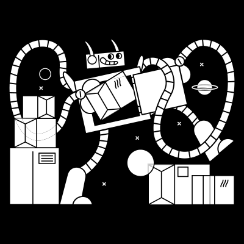
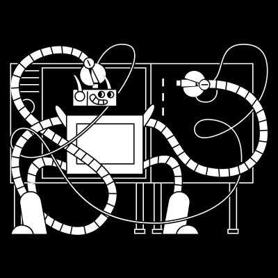
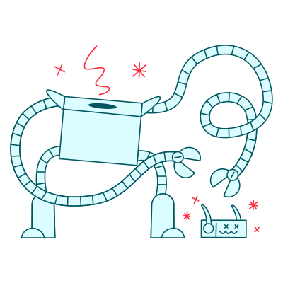

# 🖼️ SVG Gallery

[⬅️ 回到首頁](../../README.md)

| 預覽 | 詳細資訊 |
| :--- | :--- |
|  | **Circuit1aGrowwwKit.svg** VectorxVector | 25.57KB 更新: 2026-02-26 |
|  | **Circuit1bGrowwwKit.svg** VectorxVector | 11.35KB 更新: 2026-02-26 |
|  | **Circuit1cGrowwwKit.svg** VectorxVector | 11.24KB 更新: 2026-02-26 |
|  | **Circuit1dGrowwwKit.svg** VectorxVector | 27.71KB 更新: 2026-02-26 |
|  | **Circuit2aGrowwwKit.svg** VectorxVector | 23.57KB 更新: 2026-02-26 |
|  | **Circuit2bGrowwwKit.svg** VectorxVector | 14.75KB 更新: 2026-02-26 |
|  | **Circuit2cGrowwwKit.svg** VectorxVector | 14.83KB 更新: 2026-02-26 |
|  | **Circuit2dGrowwwKit.svg** VectorxVector | 33.77KB 更新: 2026-02-26 |
|  | **Circuit3aGrowwwKit.svg** VectorxVector | 25.75KB 更新: 2026-02-26 |
|  | **Circuit3bGrowwwKit.svg** VectorxVector | 13.11KB 更新: 2026-02-26 |
|  | **Circuit3cGrowwwKit.svg** VectorxVector | 12.93KB 更新: 2026-02-26 |
|  | **Circuit3dGrowwwKit.svg** VectorxVector | 30.22KB 更新: 2026-02-26 |
|  | **Circuit4aGrowwwKit.svg** VectorxVector | 25.59KB 更新: 2026-02-26 |
|  | **Circuit4bGrowwwKit.svg** VectorxVector | 14.34KB 更新: 2026-02-26 |
|  | **Circuit4cGrowwwKit.svg** VectorxVector | 13.57KB 更新: 2026-02-26 |
|  | **Circuit4dGrowwwKit.svg** VectorxVector | 26.29KB 更新: 2026-02-26 |
|  | **Circuit5aGrowwwKit.svg** VectorxVector | 19.68KB 更新: 2026-02-26 |
|  | **Circuit5bGrowwwKit.svg** VectorxVector | 11.83KB 更新: 2026-02-26 |
|  | **Circuit5cGrowwwKit.svg** VectorxVector | 11.68KB 更新: 2026-02-26 |
|  | **Circuit5dGrowwwKit.svg** VectorxVector | 19.80KB 更新: 2026-02-26 |
|  | **Circuit6aGrowwwKit.svg** VectorxVector | 29.70KB 更新: 2026-02-26 |
|  | **Circuit6bGrowwwKit.svg** VectorxVector | 11.06KB 更新: 2026-02-26 |
|  | **Circuit6cGrowwwKit.svg** VectorxVector | 10.56KB 更新: 2026-02-26 |
|  | **Circuit6dGrowwwKit.svg** VectorxVector | 25.29KB 更新: 2026-02-26 |
|  | **Circuit7aGrowwwKit.svg** VectorxVector | 33.52KB 更新: 2026-02-26 |
|  | **Circuit7bGrowwwKit.svg** VectorxVector | 14.48KB 更新: 2026-02-26 |
|  | **Circuit7cGrowwwKit.svg** VectorxVector | 13.87KB 更新: 2026-02-26 |
|  | **Circuit7dGrowwwKit.svg** VectorxVector | 27.79KB 更新: 2026-02-26 |
|  | **Circuit8aGrowwwKit.svg** VectorxVector | 23.58KB 更新: 2026-02-26 |