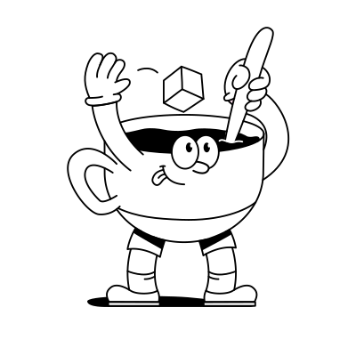
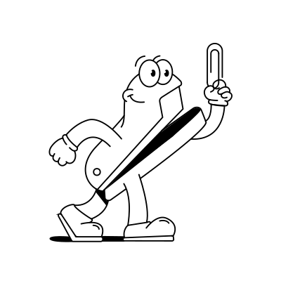
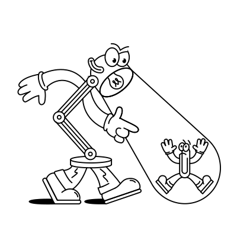
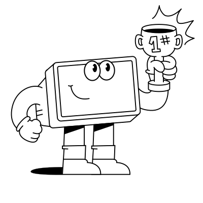
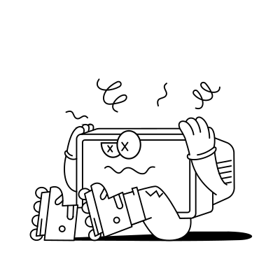

# 🖼️ 素材分類：Desk Dudes illustration

> [🏠 主目錄](../../../README.md) / [images](../../README.md) / [Illustrations](../README.md) / **Desk Dudes illustration**

本目錄共有 `20` 個檔案

| 🎨 預覽 (點擊放大)  | 📋 檔案詳細資訊與連結 |
| :--- | :--- |
|  | **📂 檔名:** `Desk_Dudes 37.svg` ✨ **格式:** `Vector (SVG)` ⚖️ **大小:** `7.08KB` 📅 **更新:** `2026-03-03`  🚀 **jsDelivr Markdown:** `` 🔗 **直接連結 (Url):** <code>https://cdn.jsdelivr.net/gh/barry028/materials@main/images/Illustrations/Desk%20Dudes%20illustration/Desk_Dudes%2037.svg</code> 📥 [檢視原始檔](Desk_Dudes%2037.svg) |
|  | **📂 檔名:** `Desk_Dudes1.svg` ✨ **格式:** `Vector (SVG)` ⚖️ **大小:** `10.81KB` 📅 **更新:** `2026-03-03`  🚀 **jsDelivr Markdown:** `` 🔗 **直接連結 (Url):** <code>https://cdn.jsdelivr.net/gh/barry028/materials@main/images/Illustrations/Desk%20Dudes%20illustration/Desk_Dudes1.svg</code> 📥 [檢視原始檔](Desk_Dudes1.svg) |
|  | **📂 檔名:** `Desk_Dudes10.svg` ✨ **格式:** `Vector (SVG)` ⚖️ **大小:** `14.71KB` 📅 **更新:** `2026-03-03`  🚀 **jsDelivr Markdown:** `` 🔗 **直接連結 (Url):** <code>https://cdn.jsdelivr.net/gh/barry028/materials@main/images/Illustrations/Desk%20Dudes%20illustration/Desk_Dudes10.svg</code> 📥 [檢視原始檔](Desk_Dudes10.svg) |
|  | **📂 檔名:** `Desk_Dudes11.svg` ✨ **格式:** `Vector (SVG)` ⚖️ **大小:** `9.27KB` 📅 **更新:** `2026-03-03`  🚀 **jsDelivr Markdown:** `` 🔗 **直接連結 (Url):** <code>https://cdn.jsdelivr.net/gh/barry028/materials@main/images/Illustrations/Desk%20Dudes%20illustration/Desk_Dudes11.svg</code> 📥 [檢視原始檔](Desk_Dudes11.svg) |
|  | **📂 檔名:** `Desk_Dudes12.svg` ✨ **格式:** `Vector (SVG)` ⚖️ **大小:** `7.04KB` 📅 **更新:** `2026-03-03`  🚀 **jsDelivr Markdown:** `` 🔗 **直接連結 (Url):** <code>https://cdn.jsdelivr.net/gh/barry028/materials@main/images/Illustrations/Desk%20Dudes%20illustration/Desk_Dudes12.svg</code> 📥 [檢視原始檔](Desk_Dudes12.svg) |
|  | **📂 檔名:** `Desk_Dudes13.svg` ✨ **格式:** `Vector (SVG)` ⚖️ **大小:** `5.99KB` 📅 **更新:** `2026-03-03`  🚀 **jsDelivr Markdown:** `` 🔗 **直接連結 (Url):** <code>https://cdn.jsdelivr.net/gh/barry028/materials@main/images/Illustrations/Desk%20Dudes%20illustration/Desk_Dudes13.svg</code> 📥 [檢視原始檔](Desk_Dudes13.svg) |
|  | **📂 檔名:** `Desk_Dudes14.svg` ✨ **格式:** `Vector (SVG)` ⚖️ **大小:** `16.23KB` 📅 **更新:** `2026-03-03`  🚀 **jsDelivr Markdown:** `` 🔗 **直接連結 (Url):** <code>https://cdn.jsdelivr.net/gh/barry028/materials@main/images/Illustrations/Desk%20Dudes%20illustration/Desk_Dudes14.svg</code> 📥 [檢視原始檔](Desk_Dudes14.svg) |
|  | **📂 檔名:** `Desk_Dudes15.svg` ✨ **格式:** `Vector (SVG)` ⚖️ **大小:** `17.40KB` 📅 **更新:** `2026-03-03`  🚀 **jsDelivr Markdown:** `` 🔗 **直接連結 (Url):** <code>https://cdn.jsdelivr.net/gh/barry028/materials@main/images/Illustrations/Desk%20Dudes%20illustration/Desk_Dudes15.svg</code> 📥 [檢視原始檔](Desk_Dudes15.svg) |
|  | **📂 檔名:** `Desk_Dudes16.svg` ✨ **格式:** `Vector (SVG)` ⚖️ **大小:** `17.81KB` 📅 **更新:** `2026-03-03`  🚀 **jsDelivr Markdown:** `` 🔗 **直接連結 (Url):** <code>https://cdn.jsdelivr.net/gh/barry028/materials@main/images/Illustrations/Desk%20Dudes%20illustration/Desk_Dudes16.svg</code> 📥 [檢視原始檔](Desk_Dudes16.svg) |
|  | **📂 檔名:** `Desk_Dudes17.svg` ✨ **格式:** `Vector (SVG)` ⚖️ **大小:** `28.36KB` 📅 **更新:** `2026-03-03`  🚀 **jsDelivr Markdown:** `` 🔗 **直接連結 (Url):** <code>https://cdn.jsdelivr.net/gh/barry028/materials@main/images/Illustrations/Desk%20Dudes%20illustration/Desk_Dudes17.svg</code> 📥 [檢視原始檔](Desk_Dudes17.svg) |
|  | **📂 檔名:** `Desk_Dudes18.svg` ✨ **格式:** `Vector (SVG)` ⚖️ **大小:** `9.39KB` 📅 **更新:** `2026-03-03`  🚀 **jsDelivr Markdown:** `` 🔗 **直接連結 (Url):** <code>https://cdn.jsdelivr.net/gh/barry028/materials@main/images/Illustrations/Desk%20Dudes%20illustration/Desk_Dudes18.svg</code> 📥 [檢視原始檔](Desk_Dudes18.svg) |
|  | **📂 檔名:** `Desk_Dudes19.svg` ✨ **格式:** `Vector (SVG)` ⚖️ **大小:** `11.52KB` 📅 **更新:** `2026-03-03`  🚀 **jsDelivr Markdown:** `` 🔗 **直接連結 (Url):** <code>https://cdn.jsdelivr.net/gh/barry028/materials@main/images/Illustrations/Desk%20Dudes%20illustration/Desk_Dudes19.svg</code> 📥 [檢視原始檔](Desk_Dudes19.svg) |
|  | **📂 檔名:** `Desk_Dudes20.svg` ✨ **格式:** `Vector (SVG)` ⚖️ **大小:** `23.98KB` 📅 **更新:** `2026-03-03`  🚀 **jsDelivr Markdown:** `` 🔗 **直接連結 (Url):** <code>https://cdn.jsdelivr.net/gh/barry028/materials@main/images/Illustrations/Desk%20Dudes%20illustration/Desk_Dudes20.svg</code> 📥 [檢視原始檔](Desk_Dudes20.svg) |
|  | **📂 檔名:** `Desk_Dudes3.svg` ✨ **格式:** `Vector (SVG)` ⚖️ **大小:** `14.50KB` 📅 **更新:** `2026-03-03`  🚀 **jsDelivr Markdown:** `` 🔗 **直接連結 (Url):** <code>https://cdn.jsdelivr.net/gh/barry028/materials@main/images/Illustrations/Desk%20Dudes%20illustration/Desk_Dudes3.svg</code> 📥 [檢視原始檔](Desk_Dudes3.svg) |
|  | **📂 檔名:** `Desk_Dudes4.svg` ✨ **格式:** `Vector (SVG)` ⚖️ **大小:** `12.30KB` 📅 **更新:** `2026-03-03`  🚀 **jsDelivr Markdown:** `` 🔗 **直接連結 (Url):** <code>https://cdn.jsdelivr.net/gh/barry028/materials@main/images/Illustrations/Desk%20Dudes%20illustration/Desk_Dudes4.svg</code> 📥 [檢視原始檔](Desk_Dudes4.svg) |
|  | **📂 檔名:** `Desk_Dudes5.svg` ✨ **格式:** `Vector (SVG)` ⚖️ **大小:** `22.43KB` 📅 **更新:** `2026-03-03`  🚀 **jsDelivr Markdown:** `` 🔗 **直接連結 (Url):** <code>https://cdn.jsdelivr.net/gh/barry028/materials@main/images/Illustrations/Desk%20Dudes%20illustration/Desk_Dudes5.svg</code> 📥 [檢視原始檔](Desk_Dudes5.svg) |
|  | **📂 檔名:** `Desk_Dudes6.svg` ✨ **格式:** `Vector (SVG)` ⚖️ **大小:** `13.52KB` 📅 **更新:** `2026-03-03`  🚀 **jsDelivr Markdown:** `` 🔗 **直接連結 (Url):** <code>https://cdn.jsdelivr.net/gh/barry028/materials@main/images/Illustrations/Desk%20Dudes%20illustration/Desk_Dudes6.svg</code> 📥 [檢視原始檔](Desk_Dudes6.svg) |
|  | **📂 檔名:** `Desk_Dudes7.svg` ✨ **格式:** `Vector (SVG)` ⚖️ **大小:** `12.15KB` 📅 **更新:** `2026-03-03`  🚀 **jsDelivr Markdown:** `` 🔗 **直接連結 (Url):** <code>https://cdn.jsdelivr.net/gh/barry028/materials@main/images/Illustrations/Desk%20Dudes%20illustration/Desk_Dudes7.svg</code> 📥 [檢視原始檔](Desk_Dudes7.svg) |
|  | **📂 檔名:** `Desk_Dudes8.svg` ✨ **格式:** `Vector (SVG)` ⚖️ **大小:** `12.47KB` 📅 **更新:** `2026-03-03`  🚀 **jsDelivr Markdown:** `` 🔗 **直接連結 (Url):** <code>https://cdn.jsdelivr.net/gh/barry028/materials@main/images/Illustrations/Desk%20Dudes%20illustration/Desk_Dudes8.svg</code> 📥 [檢視原始檔](Desk_Dudes8.svg) |
|  | **📂 檔名:** `Desk_Dudes9.svg` ✨ **格式:** `Vector (SVG)` ⚖️ **大小:** `17.84KB` 📅 **更新:** `2026-03-03`  🚀 **jsDelivr Markdown:** `` 🔗 **直接連結 (Url):** <code>https://cdn.jsdelivr.net/gh/barry028/materials@main/images/Illustrations/Desk%20Dudes%20illustration/Desk_Dudes9.svg</code> 📥 [檢視原始檔](Desk_Dudes9.svg) |