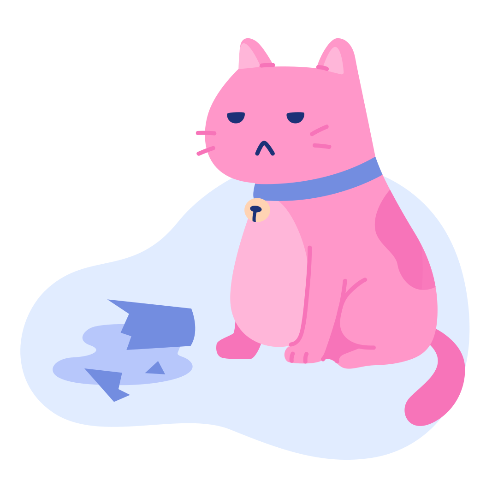
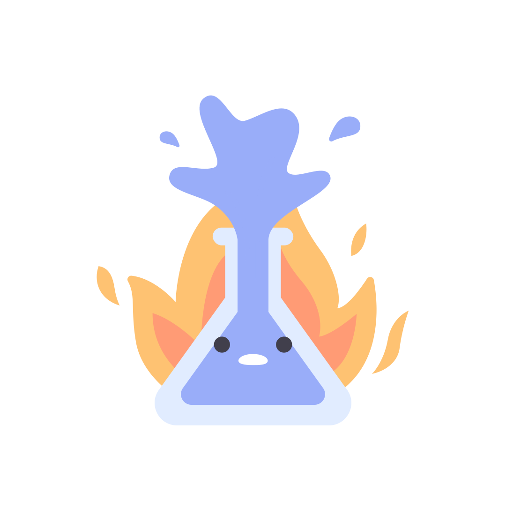
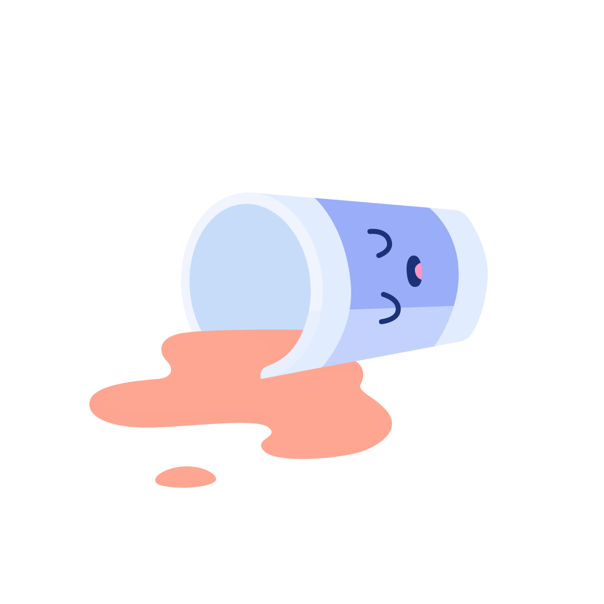
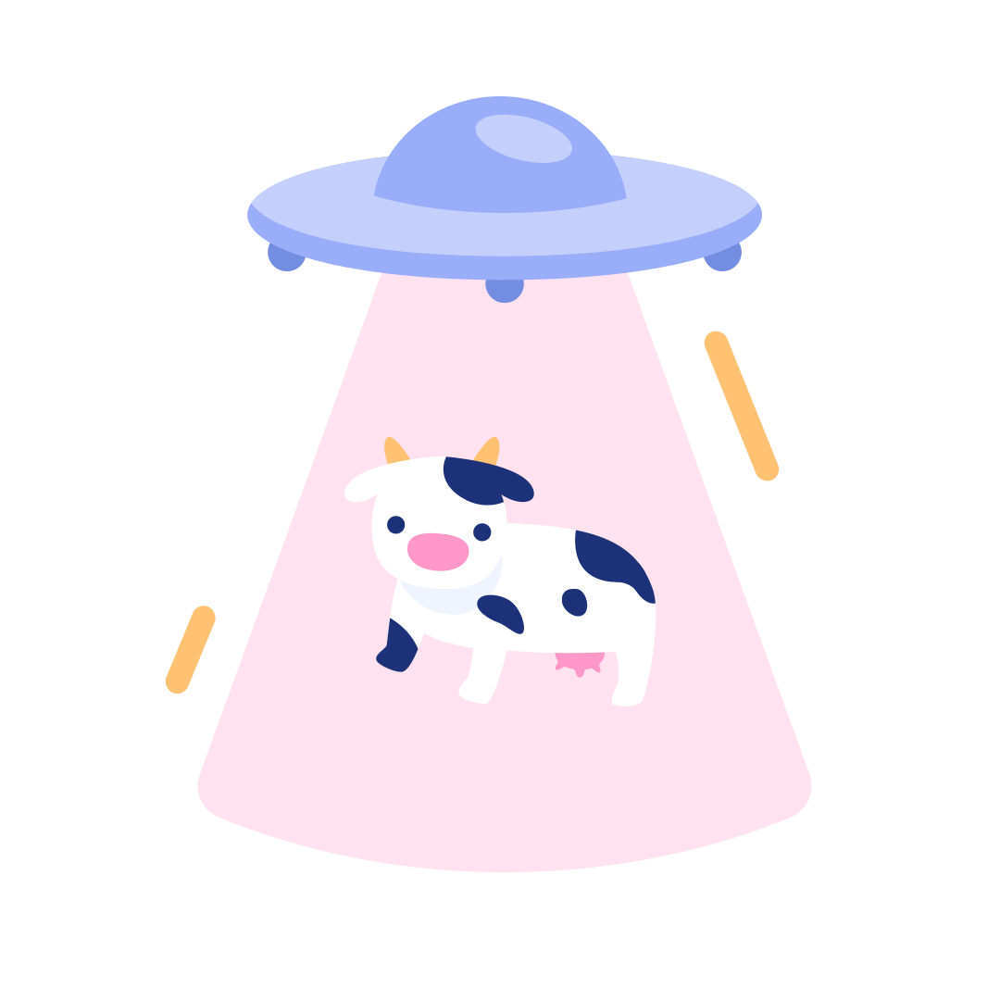
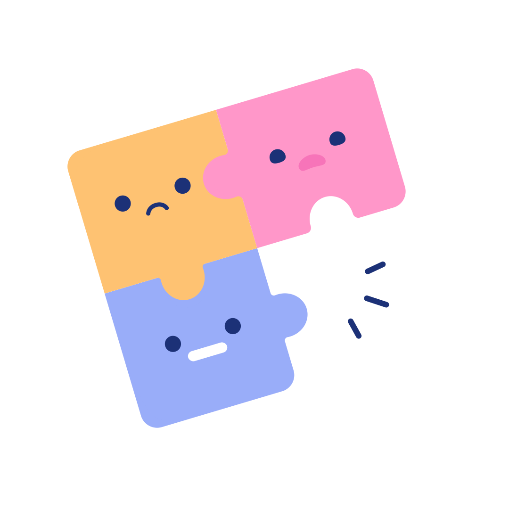
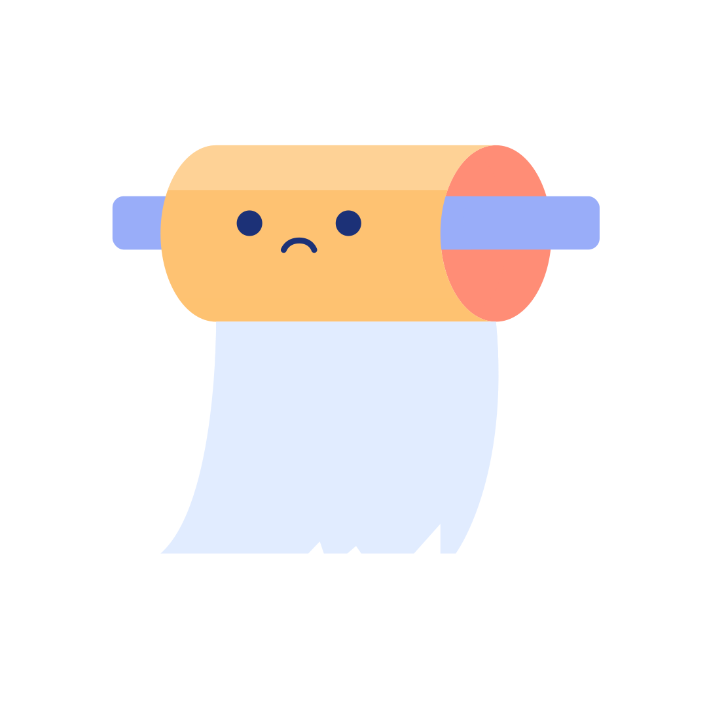

# 🖼️ 素材分類：Error Stateillustrations Pixel True

> [🏠 主目錄](../../../README.md) / [images](../../README.md) / [Illustrations](../README.md) / **Error Stateillustrations Pixel True**

本目錄共有 `30` 個檔案

| 🎨 預覽 (點擊放大)  | 📋 檔案詳細資訊與連結 |
| :--- | :--- |
|  | **📂 檔名:** `Astronaut-01.svg` ✨ **格式:** `Vector (SVG)` ⚖️ **大小:** `5.68KB` 📅 **更新:** `2026-03-02`  🚀 **jsDelivr Markdown:** `` 🔗 **直接連結 (Url):** <code>https://cdn.jsdelivr.net/gh/barry028/materials@main/images/Illustrations/Error%20Stateillustrations%20Pixel%20True/Astronaut-01.svg</code> 📥 [檢視原始檔](Astronaut-01.svg) |
|  | **📂 檔名:** `Cat-01.svg` ✨ **格式:** `Vector (SVG)` ⚖️ **大小:** `6.95KB` 📅 **更新:** `2026-03-02`  🚀 **jsDelivr Markdown:** `` 🔗 **直接連結 (Url):** <code>https://cdn.jsdelivr.net/gh/barry028/materials@main/images/Illustrations/Error%20Stateillustrations%20Pixel%20True/Cat-01.svg</code> 📥 [檢視原始檔](Cat-01.svg) |
|  | **📂 檔名:** `Chemical-01.svg` ✨ **格式:** `Vector (SVG)` ⚖️ **大小:** `3.19KB` 📅 **更新:** `2026-03-02`  🚀 **jsDelivr Markdown:** `` 🔗 **直接連結 (Url):** <code>https://cdn.jsdelivr.net/gh/barry028/materials@main/images/Illustrations/Error%20Stateillustrations%20Pixel%20True/Chemical-01.svg</code> 📥 [檢視原始檔](Chemical-01.svg) |
|  | **📂 檔名:** `Coffee-01.svg` ✨ **格式:** `Vector (SVG)` ⚖️ **大小:** `3.45KB` 📅 **更新:** `2026-03-02`  🚀 **jsDelivr Markdown:** `` 🔗 **直接連結 (Url):** <code>https://cdn.jsdelivr.net/gh/barry028/materials@main/images/Illustrations/Error%20Stateillustrations%20Pixel%20True/Coffee-01.svg</code> 📥 [檢視原始檔](Coffee-01.svg) |
|  | **📂 檔名:** `Cow-01.svg` ✨ **格式:** `Vector (SVG)` ⚖️ **大小:** `5.34KB` 📅 **更新:** `2026-03-02`  🚀 **jsDelivr Markdown:** `` 🔗 **直接連結 (Url):** <code>https://cdn.jsdelivr.net/gh/barry028/materials@main/images/Illustrations/Error%20Stateillustrations%20Pixel%20True/Cow-01.svg</code> 📥 [檢視原始檔](Cow-01.svg) |
|  | **📂 檔名:** `Dog newspaper-01.svg` ✨ **格式:** `Vector (SVG)` ⚖️ **大小:** `5.62KB` 📅 **更新:** `2026-03-02`  🚀 **jsDelivr Markdown:** `` 🔗 **直接連結 (Url):** <code>https://cdn.jsdelivr.net/gh/barry028/materials@main/images/Illustrations/Error%20Stateillustrations%20Pixel%20True/Dog%20newspaper-01.svg</code> 📥 [檢視原始檔](Dog%20newspaper-01.svg) |
|  | **📂 檔名:** `Dog swimming-01.svg` ✨ **格式:** `Vector (SVG)` ⚖️ **大小:** `4.55KB` 📅 **更新:** `2026-03-02`  🚀 **jsDelivr Markdown:** `` 🔗 **直接連結 (Url):** <code>https://cdn.jsdelivr.net/gh/barry028/materials@main/images/Illustrations/Error%20Stateillustrations%20Pixel%20True/Dog%20swimming-01.svg</code> 📥 [檢視原始檔](Dog%20swimming-01.svg) |
|  | **📂 檔名:** `Error Air Balloon.svg` ✨ **格式:** `Vector (SVG)` ⚖️ **大小:** `12.63KB` 📅 **更新:** `2026-03-02`  🚀 **jsDelivr Markdown:** `` 🔗 **直接連結 (Url):** <code>https://cdn.jsdelivr.net/gh/barry028/materials@main/images/Illustrations/Error%20Stateillustrations%20Pixel%20True/Error%20Air%20Balloon.svg</code> 📥 [檢視原始檔](Error%20Air%20Balloon.svg) |
|  | **📂 檔名:** `Error Alien Spaceship.svg` ✨ **格式:** `Vector (SVG)` ⚖️ **大小:** `10.02KB` 📅 **更新:** `2026-03-02`  🚀 **jsDelivr Markdown:** `` 🔗 **直接連結 (Url):** <code>https://cdn.jsdelivr.net/gh/barry028/materials@main/images/Illustrations/Error%20Stateillustrations%20Pixel%20True/Error%20Alien%20Spaceship.svg</code> 📥 [檢視原始檔](Error%20Alien%20Spaceship.svg) |
|  | **📂 檔名:** `Error Aquarium.svg` ✨ **格式:** `Vector (SVG)` ⚖️ **大小:** `13.31KB` 📅 **更新:** `2026-03-02`  🚀 **jsDelivr Markdown:** `` 🔗 **直接連結 (Url):** <code>https://cdn.jsdelivr.net/gh/barry028/materials@main/images/Illustrations/Error%20Stateillustrations%20Pixel%20True/Error%20Aquarium.svg</code> 📥 [檢視原始檔](Error%20Aquarium.svg) |
|  | **📂 檔名:** `Error Broken Robot.svg` ✨ **格式:** `Vector (SVG)` ⚖️ **大小:** `32.66KB` 📅 **更新:** `2026-03-02`  🚀 **jsDelivr Markdown:** `` 🔗 **直接連結 (Url):** <code>https://cdn.jsdelivr.net/gh/barry028/materials@main/images/Illustrations/Error%20Stateillustrations%20Pixel%20True/Error%20Broken%20Robot.svg</code> 📥 [檢視原始檔](Error%20Broken%20Robot.svg) |
|  | **📂 檔名:** `Error Dog.svg` ✨ **格式:** `Vector (SVG)` ⚖️ **大小:** `12.25KB` 📅 **更新:** `2026-03-02`  🚀 **jsDelivr Markdown:** `` 🔗 **直接連結 (Url):** <code>https://cdn.jsdelivr.net/gh/barry028/materials@main/images/Illustrations/Error%20Stateillustrations%20Pixel%20True/Error%20Dog.svg</code> 📥 [檢視原始檔](Error%20Dog.svg) |
|  | **📂 檔名:** `Error Fall Down.svg` ✨ **格式:** `Vector (SVG)` ⚖️ **大小:** `17.03KB` 📅 **更新:** `2026-03-02`  🚀 **jsDelivr Markdown:** `` 🔗 **直接連結 (Url):** <code>https://cdn.jsdelivr.net/gh/barry028/materials@main/images/Illustrations/Error%20Stateillustrations%20Pixel%20True/Error%20Fall%20Down.svg</code> 📥 [檢視原始檔](Error%20Fall%20Down.svg) |
|  | **📂 檔名:** `Error Glass.svg` ✨ **格式:** `Vector (SVG)` ⚖️ **大小:** `8.19KB` 📅 **更新:** `2026-03-02`  🚀 **jsDelivr Markdown:** `` 🔗 **直接連結 (Url):** <code>https://cdn.jsdelivr.net/gh/barry028/materials@main/images/Illustrations/Error%20Stateillustrations%20Pixel%20True/Error%20Glass.svg</code> 📥 [檢視原始檔](Error%20Glass.svg) |
|  | **📂 檔名:** `Error Lamp Robot.svg` ✨ **格式:** `Vector (SVG)` ⚖️ **大小:** `23.42KB` 📅 **更新:** `2026-03-02`  🚀 **jsDelivr Markdown:** `` 🔗 **直接連結 (Url):** <code>https://cdn.jsdelivr.net/gh/barry028/materials@main/images/Illustrations/Error%20Stateillustrations%20Pixel%20True/Error%20Lamp%20Robot.svg</code> 📥 [檢視原始檔](Error%20Lamp%20Robot.svg) |
|  | **📂 檔名:** `Error Lochness.svg` ✨ **格式:** `Vector (SVG)` ⚖️ **大小:** `21.55KB` 📅 **更新:** `2026-03-02`  🚀 **jsDelivr Markdown:** `` 🔗 **直接連結 (Url):** <code>https://cdn.jsdelivr.net/gh/barry028/materials@main/images/Illustrations/Error%20Stateillustrations%20Pixel%20True/Error%20Lochness.svg</code> 📥 [檢視原始檔](Error%20Lochness.svg) |
|  | **📂 檔名:** `Error Naughty Cat.svg` ✨ **格式:** `Vector (SVG)` ⚖️ **大小:** `16.75KB` 📅 **更新:** `2026-03-02`  🚀 **jsDelivr Markdown:** `` 🔗 **直接連結 (Url):** <code>https://cdn.jsdelivr.net/gh/barry028/materials@main/images/Illustrations/Error%20Stateillustrations%20Pixel%20True/Error%20Naughty%20Cat.svg</code> 📥 [檢視原始檔](Error%20Naughty%20Cat.svg) |
|  | **📂 檔名:** `Error Naughty Dog.svg` ✨ **格式:** `Vector (SVG)` ⚖️ **大小:** `17.17KB` 📅 **更新:** `2026-03-02`  🚀 **jsDelivr Markdown:** `` 🔗 **直接連結 (Url):** <code>https://cdn.jsdelivr.net/gh/barry028/materials@main/images/Illustrations/Error%20Stateillustrations%20Pixel%20True/Error%20Naughty%20Dog.svg</code> 📥 [檢視原始檔](Error%20Naughty%20Dog.svg) |
|  | **📂 檔名:** `Error Plant.svg` ✨ **格式:** `Vector (SVG)` ⚖️ **大小:** `8.49KB` 📅 **更新:** `2026-03-02`  🚀 **jsDelivr Markdown:** `` 🔗 **直接連結 (Url):** <code>https://cdn.jsdelivr.net/gh/barry028/materials@main/images/Illustrations/Error%20Stateillustrations%20Pixel%20True/Error%20Plant.svg</code> 📥 [檢視原始檔](Error%20Plant.svg) |
|  | **📂 檔名:** `Error RIP.svg` ✨ **格式:** `Vector (SVG)` ⚖️ **大小:** `14.87KB` 📅 **更新:** `2026-03-02`  🚀 **jsDelivr Markdown:** `` 🔗 **直接連結 (Url):** <code>https://cdn.jsdelivr.net/gh/barry028/materials@main/images/Illustrations/Error%20Stateillustrations%20Pixel%20True/Error%20RIP.svg</code> 📥 [檢視原始檔](Error%20RIP.svg) |
|  | **📂 檔名:** `Error Rocket Destroyed.svg` ✨ **格式:** `Vector (SVG)` ⚖️ **大小:** `18.52KB` 📅 **更新:** `2026-03-02`  🚀 **jsDelivr Markdown:** `` 🔗 **直接連結 (Url):** <code>https://cdn.jsdelivr.net/gh/barry028/materials@main/images/Illustrations/Error%20Stateillustrations%20Pixel%20True/Error%20Rocket%20Destroyed.svg</code> 📥 [檢視原始檔](Error%20Rocket%20Destroyed.svg) |
|  | **📂 檔名:** `Error Server.svg` ✨ **格式:** `Vector (SVG)` ⚖️ **大小:** `39.02KB` 📅 **更新:** `2026-03-02`  🚀 **jsDelivr Markdown:** `` 🔗 **直接連結 (Url):** <code>https://cdn.jsdelivr.net/gh/barry028/materials@main/images/Illustrations/Error%20Stateillustrations%20Pixel%20True/Error%20Server.svg</code> 📥 [檢視原始檔](Error%20Server.svg) |
|  | **📂 檔名:** `Error Sleeping.svg` ✨ **格式:** `Vector (SVG)` ⚖️ **大小:** `15.28KB` 📅 **更新:** `2026-03-02`  🚀 **jsDelivr Markdown:** `` 🔗 **直接連結 (Url):** <code>https://cdn.jsdelivr.net/gh/barry028/materials@main/images/Illustrations/Error%20Stateillustrations%20Pixel%20True/Error%20Sleeping.svg</code> 📥 [檢視原始檔](Error%20Sleeping.svg) |
|  | **📂 檔名:** `Error TV.svg` ✨ **格式:** `Vector (SVG)` ⚖️ **大小:** `11.48KB` 📅 **更新:** `2026-03-02`  🚀 **jsDelivr Markdown:** `` 🔗 **直接連結 (Url):** <code>https://cdn.jsdelivr.net/gh/barry028/materials@main/images/Illustrations/Error%20Stateillustrations%20Pixel%20True/Error%20TV.svg</code> 📥 [檢視原始檔](Error%20TV.svg) |
|  | **📂 檔名:** `Error Trash.svg` ✨ **格式:** `Vector (SVG)` ⚖️ **大小:** `9.09KB` 📅 **更新:** `2026-03-02`  🚀 **jsDelivr Markdown:** `` 🔗 **直接連結 (Url):** <code>https://cdn.jsdelivr.net/gh/barry028/materials@main/images/Illustrations/Error%20Stateillustrations%20Pixel%20True/Error%20Trash.svg</code> 📥 [檢視原始檔](Error%20Trash.svg) |
|  | **📂 檔名:** `Ice cream-01.svg` ✨ **格式:** `Vector (SVG)` ⚖️ **大小:** `4.01KB` 📅 **更新:** `2026-03-02`  🚀 **jsDelivr Markdown:** `` 🔗 **直接連結 (Url):** <code>https://cdn.jsdelivr.net/gh/barry028/materials@main/images/Illustrations/Error%20Stateillustrations%20Pixel%20True/Ice%20cream-01.svg</code> 📥 [檢視原始檔](Ice%20cream-01.svg) |
|  | **📂 檔名:** `Laptop-01.svg` ✨ **格式:** `Vector (SVG)` ⚖️ **大小:** `1.88KB` 📅 **更新:** `2026-03-02`  🚀 **jsDelivr Markdown:** `` 🔗 **直接連結 (Url):** <code>https://cdn.jsdelivr.net/gh/barry028/materials@main/images/Illustrations/Error%20Stateillustrations%20Pixel%20True/Laptop-01.svg</code> 📥 [檢視原始檔](Laptop-01.svg) |
|  | **📂 檔名:** `Lochness Monster-01.svg` ✨ **格式:** `Vector (SVG)` ⚖️ **大小:** `4.78KB` 📅 **更新:** `2026-03-02`  🚀 **jsDelivr Markdown:** `` 🔗 **直接連結 (Url):** <code>https://cdn.jsdelivr.net/gh/barry028/materials@main/images/Illustrations/Error%20Stateillustrations%20Pixel%20True/Lochness%20Monster-01.svg</code> 📥 [檢視原始檔](Lochness%20Monster-01.svg) |
|  | **📂 檔名:** `Puzzle-01.svg` ✨ **格式:** `Vector (SVG)` ⚖️ **大小:** `4.47KB` 📅 **更新:** `2026-03-02`  🚀 **jsDelivr Markdown:** `` 🔗 **直接連結 (Url):** <code>https://cdn.jsdelivr.net/gh/barry028/materials@main/images/Illustrations/Error%20Stateillustrations%20Pixel%20True/Puzzle-01.svg</code> 📥 [檢視原始檔](Puzzle-01.svg) |
|  | **📂 檔名:** `Tissue-01.svg` ✨ **格式:** `Vector (SVG)` ⚖️ **大小:** `2.75KB` 📅 **更新:** `2026-03-02`  🚀 **jsDelivr Markdown:** `` 🔗 **直接連結 (Url):** <code>https://cdn.jsdelivr.net/gh/barry028/materials@main/images/Illustrations/Error%20Stateillustrations%20Pixel%20True/Tissue-01.svg</code> 📥 [檢視原始檔](Tissue-01.svg) |