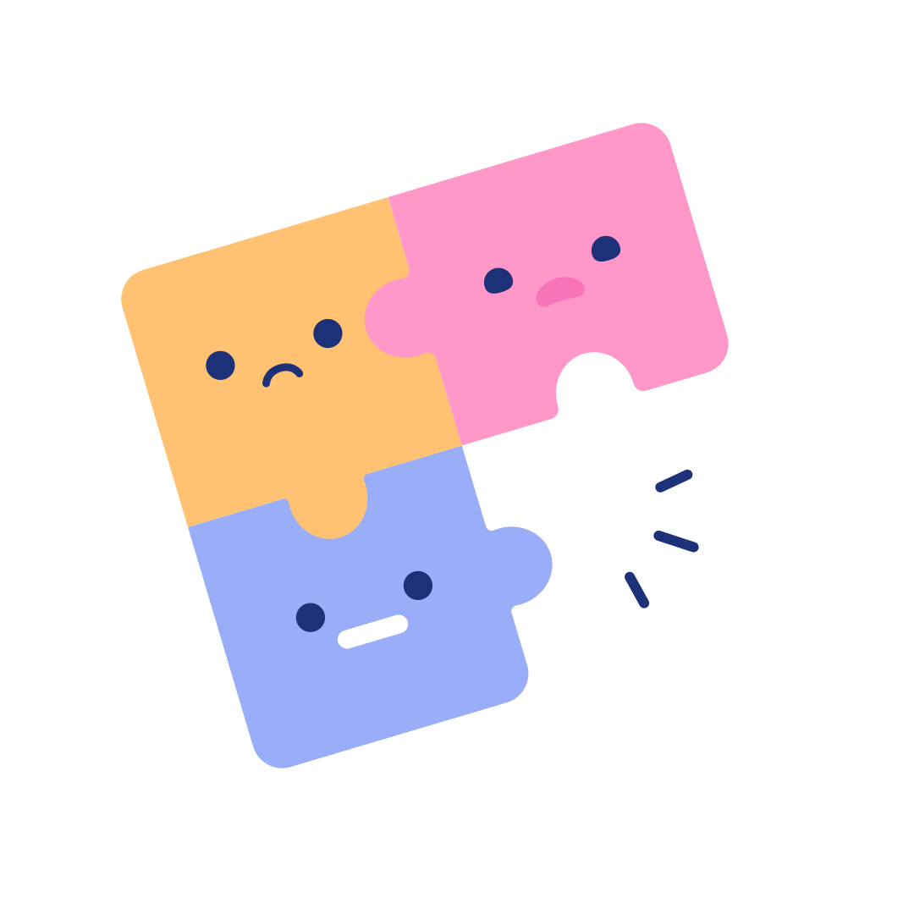
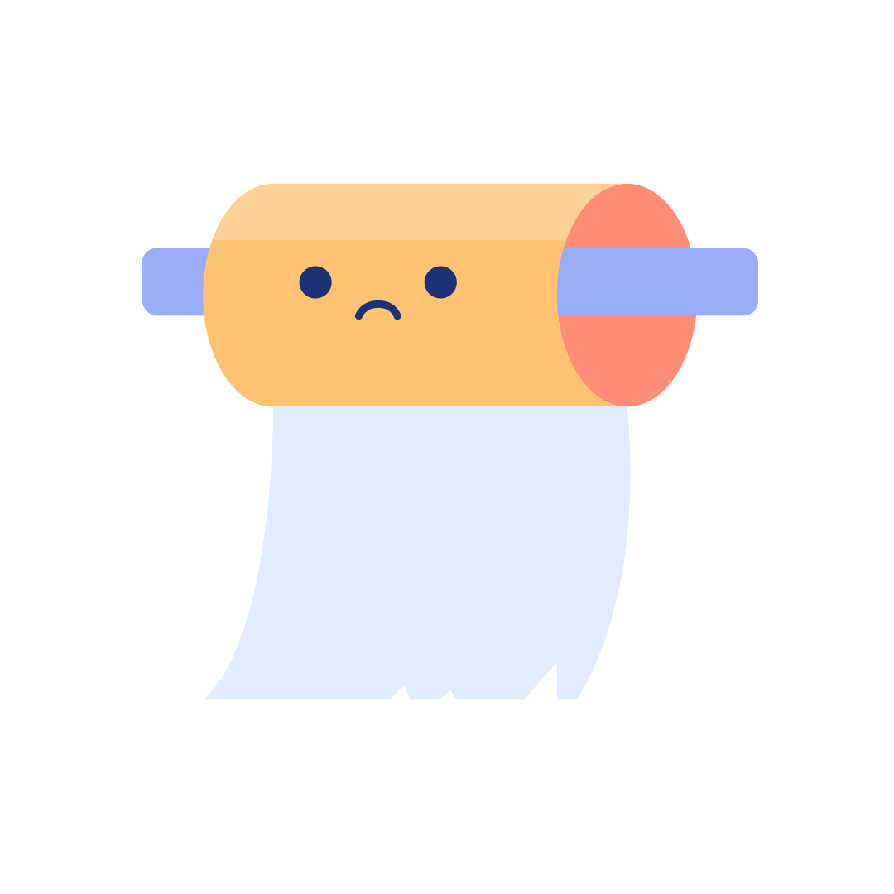

# 🖼️ ErrorStateillustrationsPixelTrue

[⬅️ 返回主目錄](../../../README.md)

| 預覽 | 資訊 |
| :--- | :--- |
|  | **Astronaut-01.svg** |
|  | **Cat-01.svg** |
|  | **Chemical-01.svg** |
|  | **Coffee-01.svg** |
|  | **Cow-01.svg** |
|  | **Dog newspaper-01.svg** |
|  | **Dog swimming-01.svg** |
|  | **Error Air Balloon.svg** |
|  | **Error Alien Spaceship.svg** |
|  | **Error Aquarium.svg** |
|  | **Error Broken Robot.svg** |
|  | **Error Dog.svg** |
|  | **Error Fall Down.svg** |
|  | **Error Glass.svg** |
|  | **Error Lamp Robot.svg** |
|  | **Error Lochness.svg** |
|  | **Error Naughty Cat.svg** |
|  | **Error Naughty Dog.svg** |
|  | **Error Plant.svg** |
|  | **Error RIP.svg** |
|  | **Error Rocket Destroyed.svg** |
|  | **Error Server.svg** |
|  | **Error Sleeping.svg** |
|  | **Error TV.svg** |
|  | **Error Trash.svg** |
|  | **Ice cream-01.svg** |
|  | **Laptop-01.svg** |
|  | **Lochness Monster-01.svg** |
|  | **Puzzle-01.svg** |
|  | **Tissue-01.svg** |