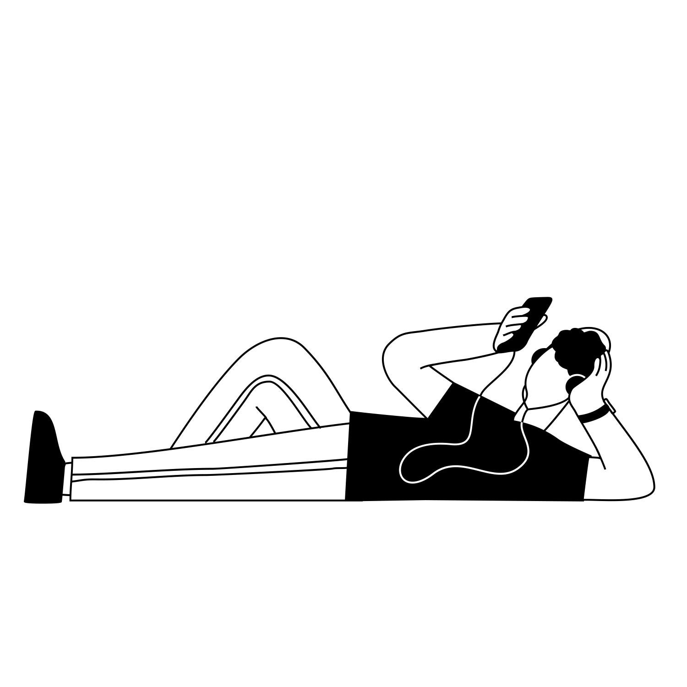

# 🖼️ 素材分類：Growww Kit 01

> [🏠 主目錄](../../../README.md) / [images](../../README.md) / [Illustrations](../README.md) / **Growww Kit 01**

本目錄共有 `8` 個檔案

| 🎨 預覽 (點擊放大)  | 📋 檔案詳細資訊與連結 |
| :--- | :--- |
|  | **📂 檔名:** `Call waiting.svg` ✨ **格式:** `Vector (SVG)` ⚖️ **大小:** `15.76KB` 📅 **更新:** `2026-03-01`  🚀 **jsDelivr Markdown:** `` 🔗 **直接連結 (Url):** <code>https://cdn.jsdelivr.net/gh/barry028/materials@main/images/Illustrations/Growww%20Kit%2001/Call%20waiting.svg</code> 📥 [檢視原始檔](Call%20waiting.svg) |
|  | **📂 檔名:** `Cat shot.svg` ✨ **格式:** `Vector (SVG)` ⚖️ **大小:** `27.66KB` 📅 **更新:** `2026-03-01`  🚀 **jsDelivr Markdown:** `` 🔗 **直接連結 (Url):** <code>https://cdn.jsdelivr.net/gh/barry028/materials@main/images/Illustrations/Growww%20Kit%2001/Cat%20shot.svg</code> 📥 [檢視原始檔](Cat%20shot.svg) |
|  | **📂 檔名:** `Coffe call.svg` ✨ **格式:** `Vector (SVG)` ⚖️ **大小:** `21.52KB` 📅 **更新:** `2026-03-01`  🚀 **jsDelivr Markdown:** `` 🔗 **直接連結 (Url):** <code>https://cdn.jsdelivr.net/gh/barry028/materials@main/images/Illustrations/Growww%20Kit%2001/Coffe%20call.svg</code> 📥 [檢視原始檔](Coffe%20call.svg) |
|  | **📂 檔名:** `Dog call.svg` ✨ **格式:** `Vector (SVG)` ⚖️ **大小:** `20.46KB` 📅 **更新:** `2026-03-01`  🚀 **jsDelivr Markdown:** `` 🔗 **直接連結 (Url):** <code>https://cdn.jsdelivr.net/gh/barry028/materials@main/images/Illustrations/Growww%20Kit%2001/Dog%20call.svg</code> 📥 [檢視原始檔](Dog%20call.svg) |
|  | **📂 檔名:** `Podcast.svg` ✨ **格式:** `Vector (SVG)` ⚖️ **大小:** `16.78KB` 📅 **更新:** `2026-03-01`  🚀 **jsDelivr Markdown:** `` 🔗 **直接連結 (Url):** <code>https://cdn.jsdelivr.net/gh/barry028/materials@main/images/Illustrations/Growww%20Kit%2001/Podcast.svg</code> 📥 [檢視原始檔](Podcast.svg) |
|  | **📂 檔名:** `Selfie.svg` ✨ **格式:** `Vector (SVG)` ⚖️ **大小:** `20.73KB` 📅 **更新:** `2026-03-01`  🚀 **jsDelivr Markdown:** `` 🔗 **直接連結 (Url):** <code>https://cdn.jsdelivr.net/gh/barry028/materials@main/images/Illustrations/Growww%20Kit%2001/Selfie.svg</code> 📥 [檢視原始檔](Selfie.svg) |
|  | **📂 檔名:** `Shopping call.svg` ✨ **格式:** `Vector (SVG)` ⚖️ **大小:** `25.03KB` 📅 **更新:** `2026-03-01`  🚀 **jsDelivr Markdown:** `` 🔗 **直接連結 (Url):** <code>https://cdn.jsdelivr.net/gh/barry028/materials@main/images/Illustrations/Growww%20Kit%2001/Shopping%20call.svg</code> 📥 [檢視原始檔](Shopping%20call.svg) |
|  | **📂 檔名:** `Video park.svg` ✨ **格式:** `Vector (SVG)` ⚖️ **大小:** `21.67KB` 📅 **更新:** `2026-03-01`  🚀 **jsDelivr Markdown:** `` 🔗 **直接連結 (Url):** <code>https://cdn.jsdelivr.net/gh/barry028/materials@main/images/Illustrations/Growww%20Kit%2001/Video%20park.svg</code> 📥 [檢視原始檔](Video%20park.svg) |