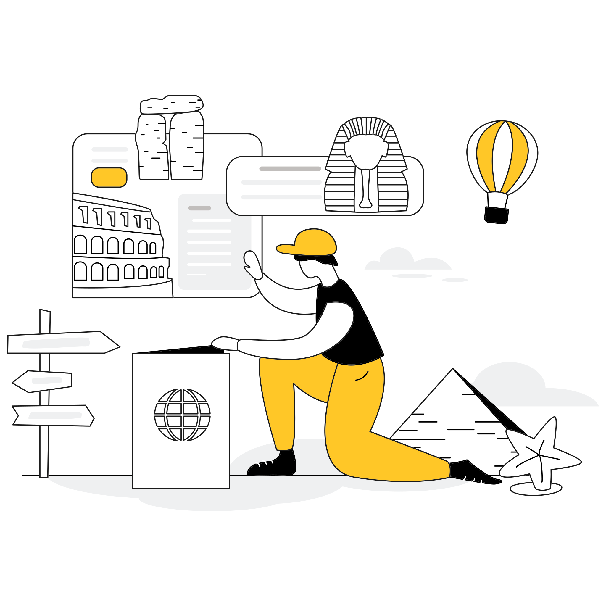

# 🖼️ 素材分類：Travel

> [🏠 主目錄](../../../../README.md) / **Travel**

本目錄共有 `10` 個檔案

| 🎨 預覽 (點擊放大) | 📋 檔案詳細資訊 |
| :--- | :--- |
|  | **📂 檔名:** `8340036_cultures_world.svg` ✨ **格式:** `Vector (SVG)` ⚖️ **大小:** `171.16KB` 📅 **更新:** `2026-02-27`  🔗 [直接查看原始檔](8340036_cultures_world.svg) |
|  | **📂 檔名:** `8340037_place_choose.svg` ✨ **格式:** `Vector (SVG)` ⚖️ **大小:** `111.56KB` 📅 **更新:** `2026-02-27`  🔗 [直接查看原始檔](8340037_place_choose.svg) |
|  | **📂 檔名:** `8340038_beach_the_on_relax.svg` ✨ **格式:** `Vector (SVG)` ⚖️ **大小:** `62.19KB` 📅 **更新:** `2026-02-27`  🔗 [直接查看原始檔](8340038_beach_the_on_relax.svg) |
|  | **📂 檔名:** `8340039_car_tourist.svg` ✨ **格式:** `Vector (SVG)` ⚖️ **大小:** `56.42KB` 📅 **更新:** `2026-02-27`  🔗 [直接查看原始檔](8340039_car_tourist.svg) |
|  | **📂 檔名:** `8340040_mountain_the_climb.svg` ✨ **格式:** `Vector (SVG)` ⚖️ **大小:** `68.46KB` 📅 **更新:** `2026-02-27`  🔗 [直接查看原始檔](8340040_mountain_the_climb.svg) |
|  | **📂 檔名:** `8340041_map_the_view.svg` ✨ **格式:** `Vector (SVG)` ⚖️ **大小:** `71.60KB` 📅 **更新:** `2026-02-27`  🔗 [直接查看原始檔](8340041_map_the_view.svg) |
|  | **📂 檔名:** `8340042_schedule_a_choose.svg` ✨ **格式:** `Vector (SVG)` ⚖️ **大小:** `109.31KB` 📅 **更新:** `2026-02-27`  🔗 [直接查看原始檔](8340042_schedule_a_choose.svg) |
|  | **📂 檔名:** `8340043_girl_tourist.svg` ✨ **格式:** `Vector (SVG)` ⚖️ **大小:** `168.51KB` 📅 **更新:** `2026-02-27`  🔗 [直接查看原始檔](8340043_girl_tourist.svg) |
|  | **📂 檔名:** `8340044_ticket_buy.svg` ✨ **格式:** `Vector (SVG)` ⚖️ **大小:** `128.77KB` 📅 **更新:** `2026-02-27`  🔗 [直接查看原始檔](8340044_ticket_buy.svg) |
|  | **📂 檔名:** `8340045_road_the_on_tourists.svg` ✨ **格式:** `Vector (SVG)` ⚖️ **大小:** `93.70KB` 📅 **更新:** `2026-02-27`  🔗 [直接查看原始檔](8340045_road_the_on_tourists.svg) |