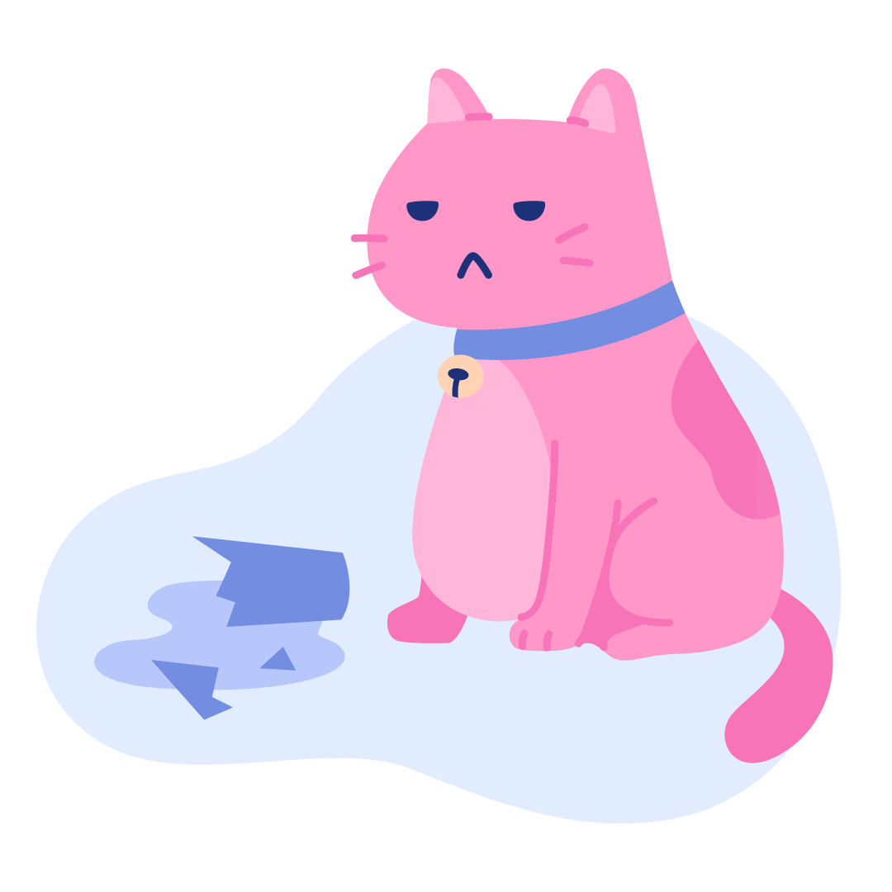
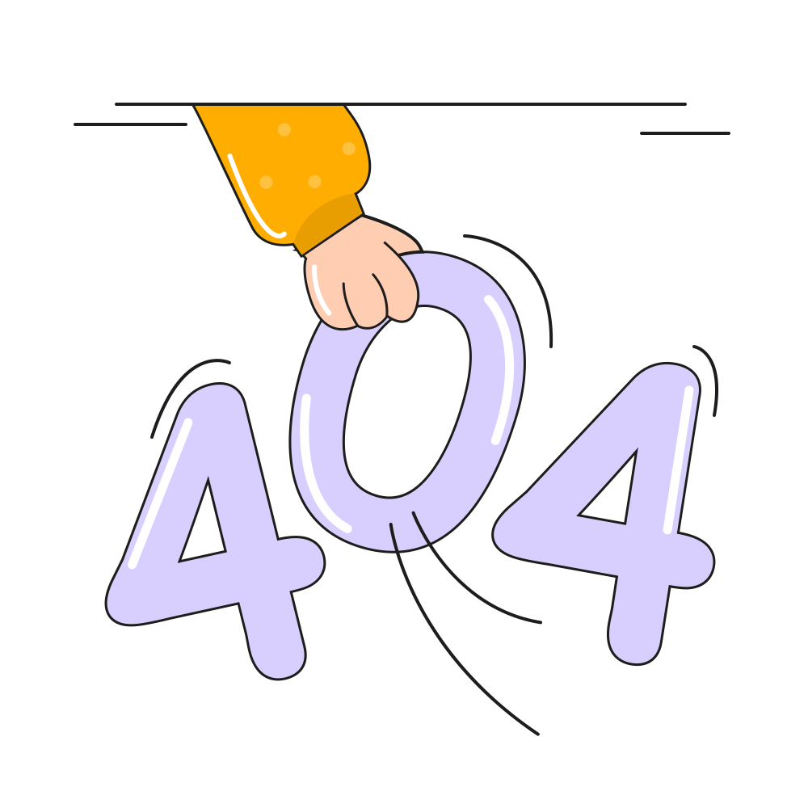

# 📂 目錄：Illustrations

> [🏠 主目錄](../../README.md) / [images](../README.md) / **Illustrations**

此目錄目前沒有直接存放圖片，請選擇下方子分類：

### 🗂️ 子分類列表

| 分類名稱 | 封面預覽 | 統計 |
| :--- | :--- | :--- |
| [📠**AmazingCatIllustrations**](AmazingCatIllustrations/README.md) | &nbsp;&nbsp; | 共 `20` 張 |
| [📠**Byte Dance**](Byte%20Dance/README.md) | &nbsp;&nbsp; | 共 `15` 張 |
| [📠**Circuitill**](Circuitill/README.md) | &nbsp;&nbsp; | 共 `29` 張 |
| [📠**CorporateScenesillustrationOctetDesignStudio**](CorporateScenesillustrationOctetDesignStudio/README.md) |  | 共 `1` 張 |
| [📠**DeskDudes-illustration**](DeskDudes-illustration/README.md) | &nbsp;&nbsp; | 共 `20` 張 |
| [📠**DoozyProSvg**](DoozyProSvg/README.md) | &nbsp;&nbsp; | 共 `20` 張 |
| [📠**ErrorStateillustrationsPixelTrue**](ErrorStateillustrationsPixelTrue/README.md) | &nbsp;&nbsp; | 共 `30` 張 |
| [📠**GrowwwKit 01**](GrowwwKit%2001/README.md) | &nbsp;&nbsp; | 共 `8` 張 |
| [📠**GrowwwKit 02**](GrowwwKit%2002/README.md) | &nbsp;&nbsp; | 共 `12` 張 |
| [📠**Life & Work Flat**](Life%20%26%20Work%20Flat/README.md) | &nbsp;&nbsp; | 共 `111` 張 |
| [📠**SigmaProSvg**](SigmaProSvg/README.md) | &nbsp;&nbsp; | 共 `4` 張 |
| [📠**SketchyProSvg**](SketchyProSvg/README.md) | &nbsp;&nbsp; | 共 `21` 張 |
| [📠**Social Media Marketing Illustratio**](Social%20Media%20Marketing%20Illustratio/README.md) | &nbsp;&nbsp; | 共 `12` 張 |
| [📠**Workspace Activity**](Workspace%20Activity/README.md) | &nbsp;&nbsp; | 共 `12` 張 |
| [📠**illustrations-Simplicity**](illustrations-Simplicity/README.md) | &nbsp;&nbsp; | 共 `130` 張 |