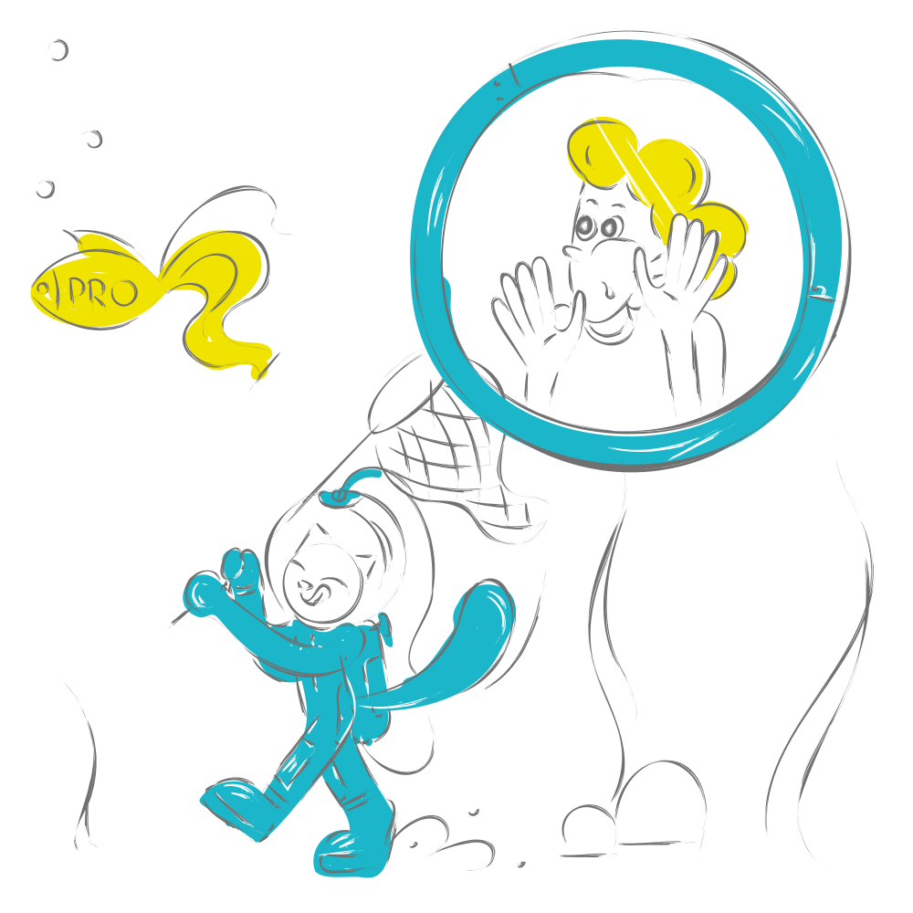
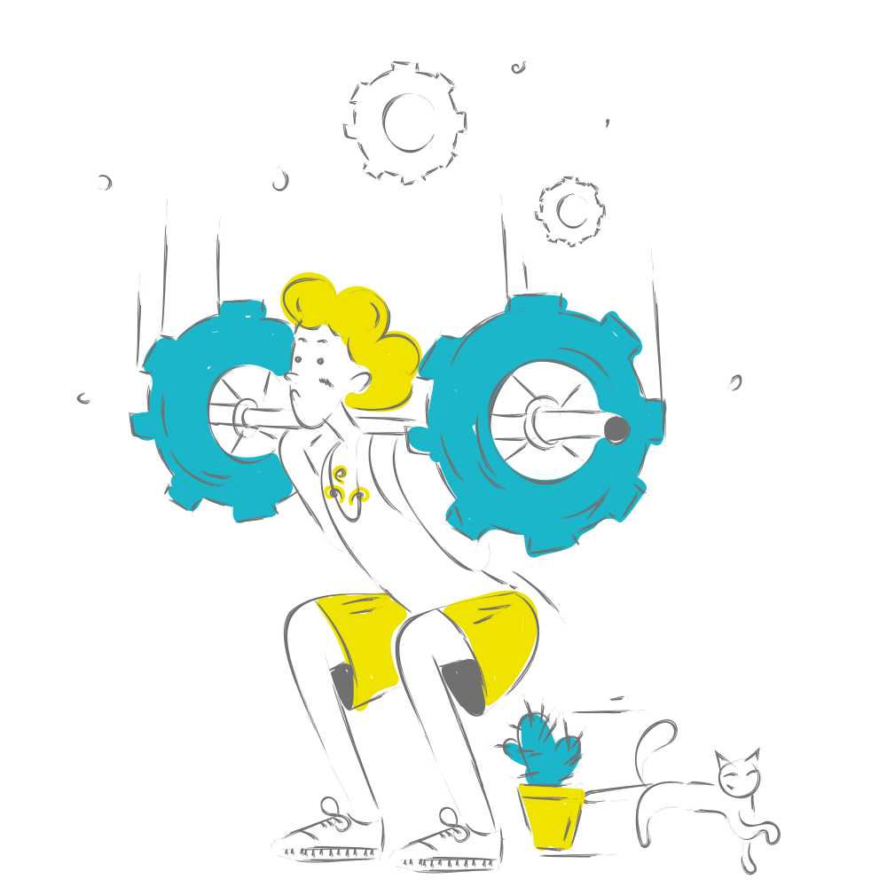
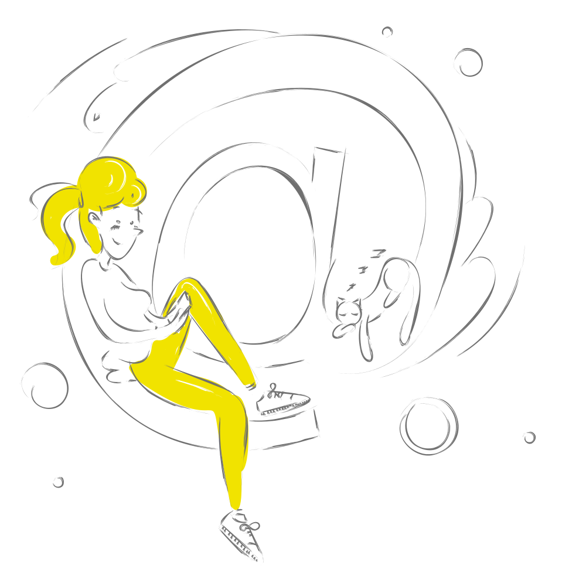
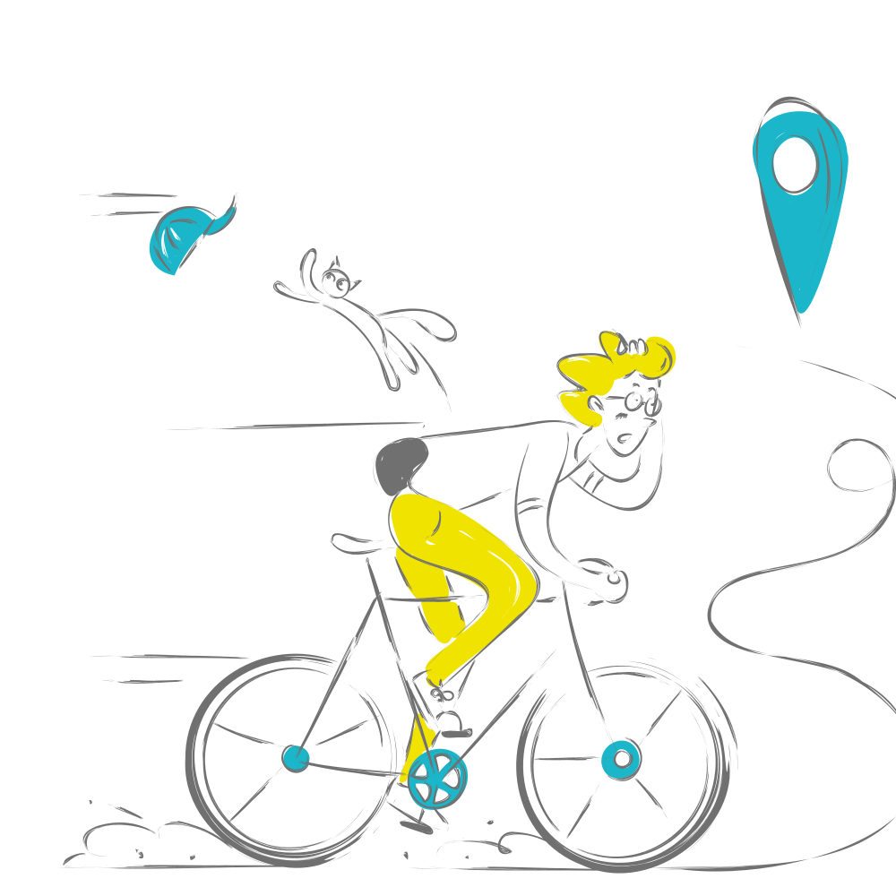
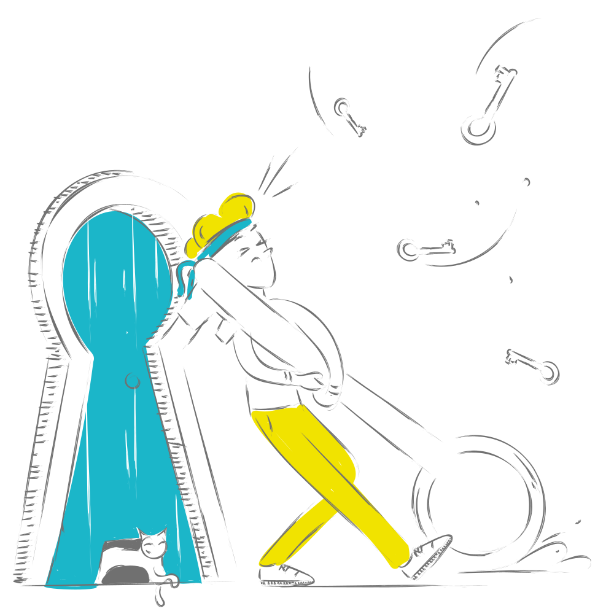
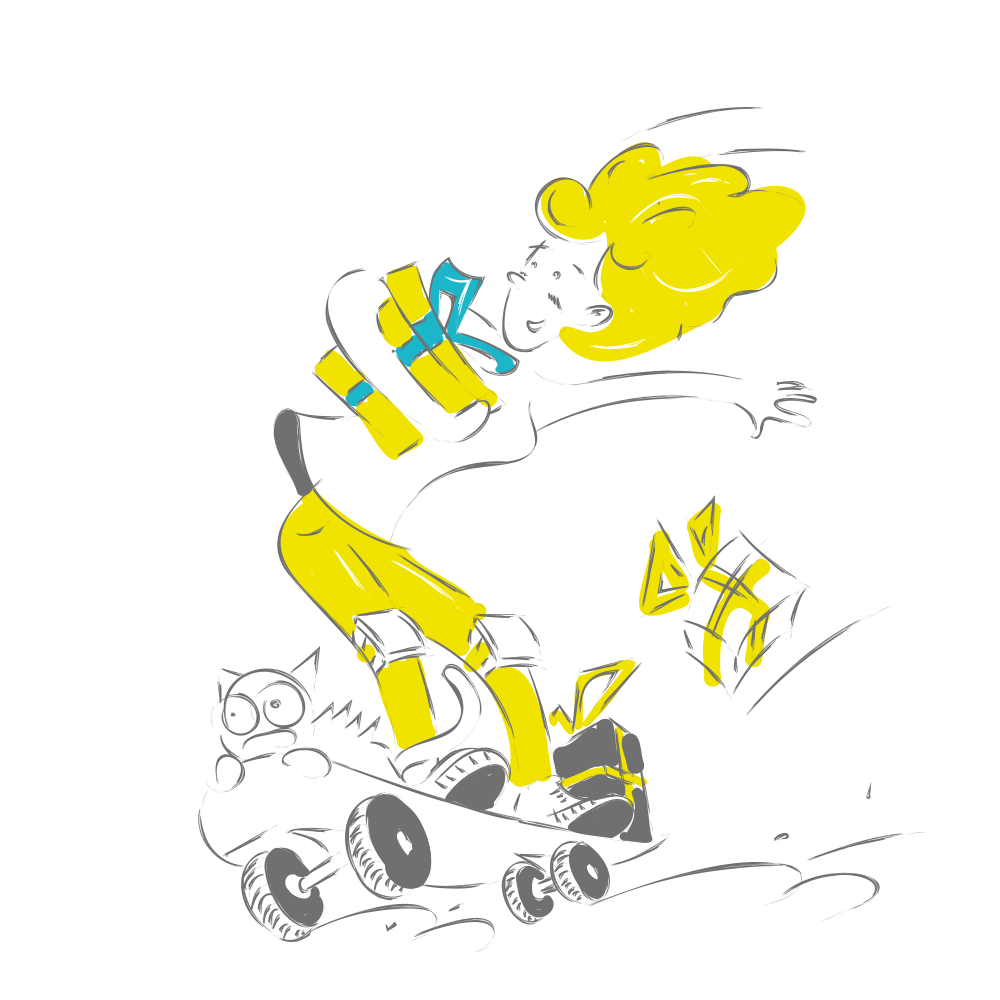

# 🖼️ 素材分類：Sketchy Pro Svg

> [🏠 主目錄](../../../README.md) / [images](../../README.md) / [Illustrations](../README.md) / **Sketchy Pro Svg**

本目錄共有 `21` 個檔案

| 🎨 預覽 (點擊放大)  | 📋 檔案詳細資訊與連結 |
| :--- | :--- |
|  | **📂 檔名:** `Basket.svg` ✨ **格式:** `Vector (SVG)` ⚖️ **大小:** `972.03KB` 📅 **更新:** `2026-03-01`  🚀 **jsDelivr Markdown:** `` 🔗 **直接連結 (Url):** <code>https://cdn.jsdelivr.net/gh/barry028/materials@main/images/Illustrations/Sketchy%20Pro%20Svg/Basket.svg</code> 📥 [檢視原始檔](Basket.svg) |
|  | **📂 檔名:** `Clearing.svg` ✨ **格式:** `Vector (SVG)` ⚖️ **大小:** `1.04MB` 📅 **更新:** `2026-03-01`  🚀 **jsDelivr Markdown:** `` 🔗 **直接連結 (Url):** <code>https://cdn.jsdelivr.net/gh/barry028/materials@main/images/Illustrations/Sketchy%20Pro%20Svg/Clearing.svg</code> 📥 [檢視原始檔](Clearing.svg) |
|  | **📂 檔名:** `PRO.svg` ✨ **格式:** `Vector (SVG)` ⚖️ **大小:** `990.94KB` 📅 **更新:** `2026-03-01`  🚀 **jsDelivr Markdown:** `` 🔗 **直接連結 (Url):** <code>https://cdn.jsdelivr.net/gh/barry028/materials@main/images/Illustrations/Sketchy%20Pro%20Svg/PRO.svg</code> 📥 [檢視原始檔](PRO.svg) |
|  | **📂 檔名:** `award.svg` ✨ **格式:** `Vector (SVG)` ⚖️ **大小:** `1.32MB` 📅 **更新:** `2026-03-01`  🚀 **jsDelivr Markdown:** `` 🔗 **直接連結 (Url):** <code>https://cdn.jsdelivr.net/gh/barry028/materials@main/images/Illustrations/Sketchy%20Pro%20Svg/award.svg</code> 📥 [檢視原始檔](award.svg) |
|  | **📂 檔名:** `cash card.svg` ✨ **格式:** `Vector (SVG)` ⚖️ **大小:** `562.04KB` 📅 **更新:** `2026-03-01`  🚀 **jsDelivr Markdown:** `` 🔗 **直接連結 (Url):** <code>https://cdn.jsdelivr.net/gh/barry028/materials@main/images/Illustrations/Sketchy%20Pro%20Svg/cash%20card.svg</code> 📥 [檢視原始檔](cash%20card.svg) |
|  | **📂 檔名:** `community.svg` ✨ **格式:** `Vector (SVG)` ⚖️ **大小:** `972.15KB` 📅 **更新:** `2026-03-01`  🚀 **jsDelivr Markdown:** `` 🔗 **直接連結 (Url):** <code>https://cdn.jsdelivr.net/gh/barry028/materials@main/images/Illustrations/Sketchy%20Pro%20Svg/community.svg</code> 📥 [檢視原始檔](community.svg) |
|  | **📂 檔名:** `configure.svg` ✨ **格式:** `Vector (SVG)` ⚖️ **大小:** `1.21MB` 📅 **更新:** `2026-03-01`  🚀 **jsDelivr Markdown:** `` 🔗 **直接連結 (Url):** <code>https://cdn.jsdelivr.net/gh/barry028/materials@main/images/Illustrations/Sketchy%20Pro%20Svg/configure.svg</code> 📥 [檢視原始檔](configure.svg) |
|  | **📂 檔名:** `confirmation.svg` ✨ **格式:** `Vector (SVG)` ⚖️ **大小:** `1.02MB` 📅 **更新:** `2026-03-01`  🚀 **jsDelivr Markdown:** `` 🔗 **直接連結 (Url):** <code>https://cdn.jsdelivr.net/gh/barry028/materials@main/images/Illustrations/Sketchy%20Pro%20Svg/confirmation.svg</code> 📥 [檢視原始檔](confirmation.svg) |
|  | **📂 檔名:** `delivery.svg` ✨ **格式:** `Vector (SVG)` ⚖️ **大小:** `983.32KB` 📅 **更新:** `2026-03-01`  🚀 **jsDelivr Markdown:** `` 🔗 **直接連結 (Url):** <code>https://cdn.jsdelivr.net/gh/barry028/materials@main/images/Illustrations/Sketchy%20Pro%20Svg/delivery.svg</code> 📥 [檢視原始檔](delivery.svg) |
|  | **📂 檔名:** `dialogue.svg` ✨ **格式:** `Vector (SVG)` ⚖️ **大小:** `833.85KB` 📅 **更新:** `2026-03-01`  🚀 **jsDelivr Markdown:** `` 🔗 **直接連結 (Url):** <code>https://cdn.jsdelivr.net/gh/barry028/materials@main/images/Illustrations/Sketchy%20Pro%20Svg/dialogue.svg</code> 📥 [檢視原始檔](dialogue.svg) |
|  | **📂 檔名:** `email.svg` ✨ **格式:** `Vector (SVG)` ⚖️ **大小:** `723.04KB` 📅 **更新:** `2026-03-01`  🚀 **jsDelivr Markdown:** `` 🔗 **直接連結 (Url):** <code>https://cdn.jsdelivr.net/gh/barry028/materials@main/images/Illustrations/Sketchy%20Pro%20Svg/email.svg</code> 📥 [檢視原始檔](email.svg) |
|  | **📂 檔名:** `error 404.svg` ✨ **格式:** `Vector (SVG)` ⚖️ **大小:** `1.05MB` 📅 **更新:** `2026-03-01`  🚀 **jsDelivr Markdown:** `` 🔗 **直接連結 (Url):** <code>https://cdn.jsdelivr.net/gh/barry028/materials@main/images/Illustrations/Sketchy%20Pro%20Svg/error%20404.svg</code> 📥 [檢視原始檔](error%20404.svg) |
|  | **📂 檔名:** `error 505.svg` ✨ **格式:** `Vector (SVG)` ⚖️ **大小:** `1.13MB` 📅 **更新:** `2026-03-01`  🚀 **jsDelivr Markdown:** `` 🔗 **直接連結 (Url):** <code>https://cdn.jsdelivr.net/gh/barry028/materials@main/images/Illustrations/Sketchy%20Pro%20Svg/error%20505.svg</code> 📥 [檢視原始檔](error%20505.svg) |
|  | **📂 檔名:** `geolocation.svg` ✨ **格式:** `Vector (SVG)` ⚖️ **大小:** `689.24KB` 📅 **更新:** `2026-03-01`  🚀 **jsDelivr Markdown:** `` 🔗 **直接連結 (Url):** <code>https://cdn.jsdelivr.net/gh/barry028/materials@main/images/Illustrations/Sketchy%20Pro%20Svg/geolocation.svg</code> 📥 [檢視原始檔](geolocation.svg) |
|  | **📂 檔名:** `key.svg` ✨ **格式:** `Vector (SVG)` ⚖️ **大小:** `1.41MB` 📅 **更新:** `2026-03-01`  🚀 **jsDelivr Markdown:** `` 🔗 **直接連結 (Url):** <code>https://cdn.jsdelivr.net/gh/barry028/materials@main/images/Illustrations/Sketchy%20Pro%20Svg/key.svg</code> 📥 [檢視原始檔](key.svg) |
|  | **📂 檔名:** `lock.svg` ✨ **格式:** `Vector (SVG)` ⚖️ **大小:** `999.35KB` 📅 **更新:** `2026-03-01`  🚀 **jsDelivr Markdown:** `` 🔗 **直接連結 (Url):** <code>https://cdn.jsdelivr.net/gh/barry028/materials@main/images/Illustrations/Sketchy%20Pro%20Svg/lock.svg</code> 📥 [檢視原始檔](lock.svg) |
|  | **📂 檔名:** `money.svg` ✨ **格式:** `Vector (SVG)` ⚖️ **大小:** `1.03MB` 📅 **更新:** `2026-03-01`  🚀 **jsDelivr Markdown:** `` 🔗 **直接連結 (Url):** <code>https://cdn.jsdelivr.net/gh/barry028/materials@main/images/Illustrations/Sketchy%20Pro%20Svg/money.svg</code> 📥 [檢視原始檔](money.svg) |
|  | **📂 檔名:** `multitasking.svg` ✨ **格式:** `Vector (SVG)` ⚖️ **大小:** `1016.08KB` 📅 **更新:** `2026-03-01`  🚀 **jsDelivr Markdown:** `` 🔗 **直接連結 (Url):** <code>https://cdn.jsdelivr.net/gh/barry028/materials@main/images/Illustrations/Sketchy%20Pro%20Svg/multitasking.svg</code> 📥 [檢視原始檔](multitasking.svg) |
|  | **📂 檔名:** `new email.svg` ✨ **格式:** `Vector (SVG)` ⚖️ **大小:** `840.30KB` 📅 **更新:** `2026-03-01`  🚀 **jsDelivr Markdown:** `` 🔗 **直接連結 (Url):** <code>https://cdn.jsdelivr.net/gh/barry028/materials@main/images/Illustrations/Sketchy%20Pro%20Svg/new%20email.svg</code> 📥 [檢視原始檔](new%20email.svg) |
|  | **📂 檔名:** `present.svg` ✨ **格式:** `Vector (SVG)` ⚖️ **大小:** `1.11MB` 📅 **更新:** `2026-03-01`  🚀 **jsDelivr Markdown:** `` 🔗 **直接連結 (Url):** <code>https://cdn.jsdelivr.net/gh/barry028/materials@main/images/Illustrations/Sketchy%20Pro%20Svg/present.svg</code> 📥 [檢視原始檔](present.svg) |
|  | **📂 檔名:** `profile.svg` ✨ **格式:** `Vector (SVG)` ⚖️ **大小:** `570.87KB` 📅 **更新:** `2026-03-01`  🚀 **jsDelivr Markdown:** `` 🔗 **直接連結 (Url):** <code>https://cdn.jsdelivr.net/gh/barry028/materials@main/images/Illustrations/Sketchy%20Pro%20Svg/profile.svg</code> 📥 [檢視原始檔](profile.svg) |