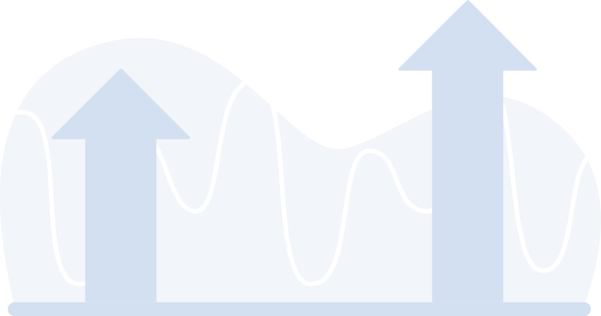
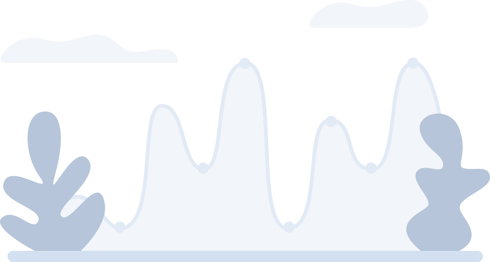
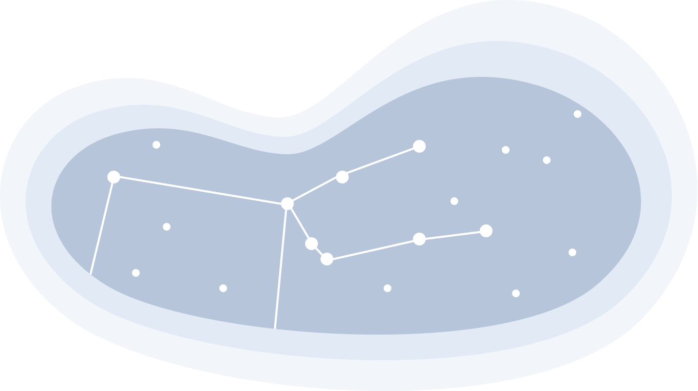
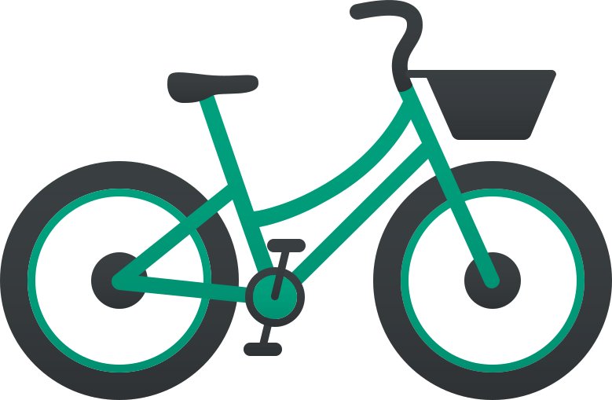
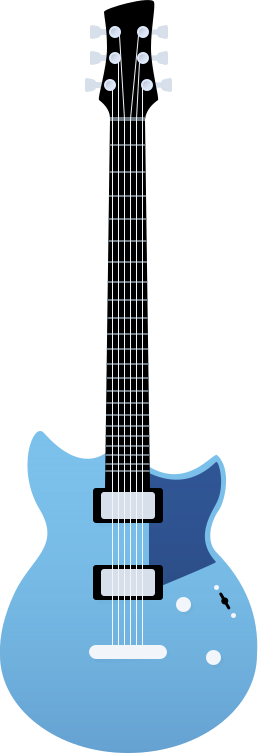
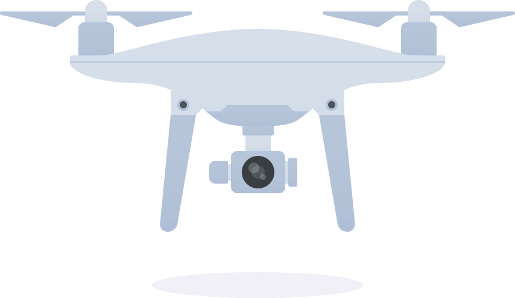
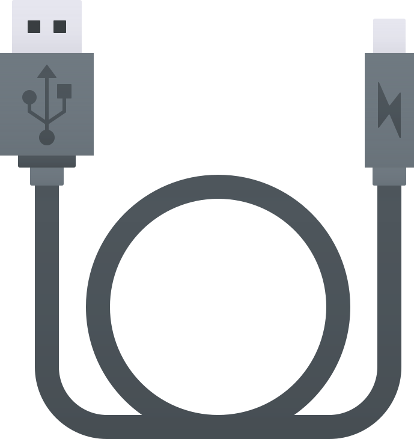
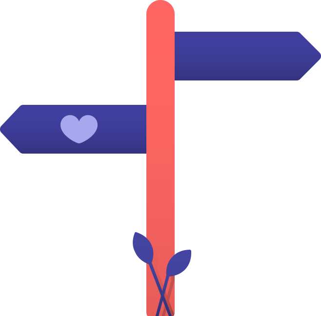
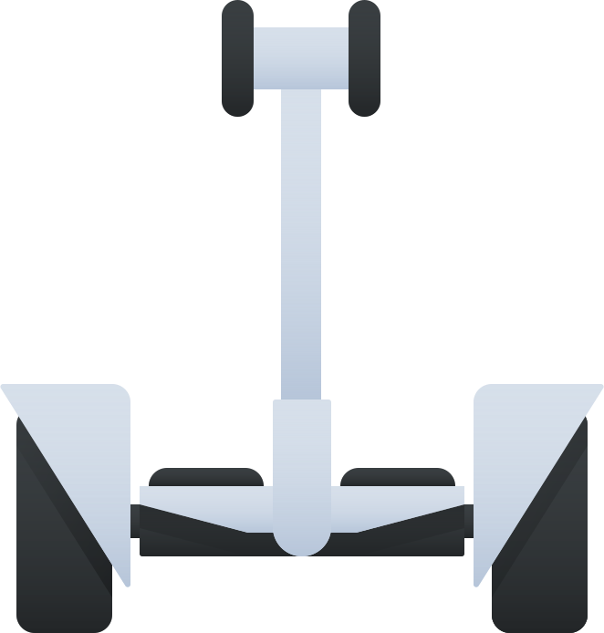

# 🖼️ 素材分類：Bgs

> [🏠 主目錄](../../../../README.md) / **Bgs**

本目錄共有 `98` 個檔案

| 🎨 預覽 (點擊放大) | 📋 檔案詳細資訊與連結 |
| :--- | :--- |
|  | **📂 檔名:** `bg-Aquarium-16.svg` ✨ **格式:** `Vector (SVG)` | ⚖️ `4.01KB` 📅 **更新:** `2026-02-27`  🔗 **複製 Markdown 語法:** `` 📥 [檢視原始檔](bg-Aquarium-16.svg) |
|  | **📂 檔名:** `bg-Bench-f1.svg` ✨ **格式:** `Vector (SVG)` | ⚖️ `1.76KB` 📅 **更新:** `2026-02-27`  🔗 **複製 Markdown 語法:** `` 📥 [檢視原始檔](bg-Bench-f1.svg) |
|  | **📂 檔名:** `bg-Detail-0f.svg` ✨ **格式:** `Vector (SVG)` | ⚖️ `5.25KB` 📅 **更新:** `2026-02-27`  🔗 **複製 Markdown 語法:** `` 📥 [檢視原始檔](bg-Detail-0f.svg) |
|  | **📂 檔名:** `bg-Home-5b.svg` ✨ **格式:** `Vector (SVG)` | ⚖️ `3.81KB` 📅 **更新:** `2026-02-27`  🔗 **複製 Markdown 語法:** `` 📥 [檢視原始檔](bg-Home-5b.svg) |
|  | **📂 檔名:** `bg-Houses-c0.svg` ✨ **格式:** `Vector (SVG)` | ⚖️ `5.83KB` 📅 **更新:** `2026-02-27`  🔗 **複製 Markdown 語法:** `` 📥 [檢視原始檔](bg-Houses-c0.svg) |
|  | **📂 檔名:** `bg-Icons-b6.svg` ✨ **格式:** `Vector (SVG)` | ⚖️ `6.64KB` 📅 **更新:** `2026-02-27`  🔗 **複製 Markdown 語法:** `` 📥 [檢視原始檔](bg-Icons-b6.svg) |
|  | **📂 檔名:** `bg-Interface-5c.svg` ✨ **格式:** `Vector (SVG)` | ⚖️ `2.55KB` 📅 **更新:** `2026-02-27`  🔗 **複製 Markdown 語法:** `` 📥 [檢視原始檔](bg-Interface-5c.svg) |
|  | **📂 檔名:** `bg-Office-3f.svg` ✨ **格式:** `Vector (SVG)` | ⚖️ `2.59KB` 📅 **更新:** `2026-02-27`  🔗 **複製 Markdown 語法:** `` 📥 [檢視原始檔](bg-Office-3f.svg) |
|  | **📂 檔名:** `bg-Park-8c.svg` ✨ **格式:** `Vector (SVG)` | ⚖️ `3.24KB` 📅 **更新:** `2026-02-27`  🔗 **複製 Markdown 語法:** `` 📥 [檢視原始檔](bg-Park-8c.svg) |
|  | **📂 檔名:** `bg-Phone-90.svg` ✨ **格式:** `Vector (SVG)` | ⚖️ `2.47KB` 📅 **更新:** `2026-02-27`  🔗 **複製 Markdown 語法:** `` 📥 [檢視原始檔](bg-Phone-90.svg) |
|  | **📂 檔名:** `bg-Railway station-1b.svg` ✨ **格式:** `Vector (SVG)` | ⚖️ `2.34KB` 📅 **更新:** `2026-02-27`  🔗 **複製 Markdown 語法:** `` 📥 [檢視原始檔](bg-Railway%20station-1b.svg) |
|  | **📂 檔名:** `bg-Schedule-36.svg` ✨ **格式:** `Vector (SVG)` | ⚖️ `2.11KB` 📅 **更新:** `2026-02-27`  🔗 **複製 Markdown 語法:** `` 📥 [檢視原始檔](bg-Schedule-36.svg) |
|  | **📂 檔名:** `bg-Space-f6.svg` ✨ **格式:** `Vector (SVG)` | ⚖️ `2.78KB` 📅 **更新:** `2026-02-27`  🔗 **複製 Markdown 語法:** `` 📥 [檢視原始檔](bg-Space-f6.svg) |
|  | **📂 檔名:** `bg-Spot 01-8b.svg` ✨ **格式:** `Vector (SVG)` | ⚖️ `595.00B` 📅 **更新:** `2026-02-27`  🔗 **複製 Markdown 語法:** `` 📥 [檢視原始檔](bg-Spot%2001-8b.svg) |
|  | **📂 檔名:** `bg-Spot 02-ed.svg` ✨ **格式:** `Vector (SVG)` | ⚖️ `291.00B` 📅 **更新:** `2026-02-27`  🔗 **複製 Markdown 語法:** `` 📥 [檢視原始檔](bg-Spot%2002-ed.svg) |
|  | **📂 檔名:** `bg-Spot 03-5b.svg` ✨ **格式:** `Vector (SVG)` | ⚖️ `407.00B` 📅 **更新:** `2026-02-27`  🔗 **複製 Markdown 語法:** `` 📥 [檢視原始檔](bg-Spot%2003-5b.svg) |
|  | **📂 檔名:** `bg-Stairs-3f.svg` ✨ **格式:** `Vector (SVG)` | ⚖️ `1.39KB` 📅 **更新:** `2026-02-27`  🔗 **複製 Markdown 語法:** `` 📥 [檢視原始檔](bg-Stairs-3f.svg) |
|  | **📂 檔名:** `bg-Street-0d.svg` ✨ **格式:** `Vector (SVG)` | ⚖️ `3.94KB` 📅 **更新:** `2026-02-27`  🔗 **複製 Markdown 語法:** `` 📥 [檢視原始檔](bg-Street-0d.svg) |
|  | **📂 檔名:** `bg-Tables-11.svg` ✨ **格式:** `Vector (SVG)` | ⚖️ `1.65KB` 📅 **更新:** `2026-02-27`  🔗 **複製 Markdown 語法:** `` 📥 [檢視原始檔](bg-Tables-11.svg) |
|  | **📂 檔名:** `bg-Tropic-66.svg` ✨ **格式:** `Vector (SVG)` | ⚖️ `6.01KB` 📅 **更新:** `2026-02-27`  🔗 **複製 Markdown 語法:** `` 📥 [檢視原始檔](bg-Tropic-66.svg) |
|  | **📂 檔名:** `pr-Apple watch-10.svg` ✨ **格式:** `Vector (SVG)` | ⚖️ `5.31KB` 📅 **更新:** `2026-02-27`  🔗 **複製 Markdown 語法:** `` 📥 [檢視原始檔](pr-Apple%20watch-10.svg) |
|  | **📂 檔名:** `pr-Bike-5b.svg` ✨ **格式:** `Vector (SVG)` | ⚖️ `5.06KB` 📅 **更新:** `2026-02-27`  🔗 **複製 Markdown 語法:** `` 📥 [檢視原始檔](pr-Bike-5b.svg) |
|  | **📂 檔名:** `pr-Bluetooth speaker-bd.svg` ✨ **格式:** `Vector (SVG)` | ⚖️ `167.36KB` 📅 **更新:** `2026-02-27`  🔗 **複製 Markdown 語法:** `` 📥 [檢視原始檔](pr-Bluetooth%20speaker-bd.svg) |
|  | **📂 檔名:** `pr-Books-83.svg` ✨ **格式:** `Vector (SVG)` | ⚖️ `3.61KB` 📅 **更新:** `2026-02-27`  🔗 **複製 Markdown 語法:** `` 📥 [檢視原始檔](pr-Books-83.svg) |
|  | **📂 檔名:** `pr-Calendar-48.svg` ✨ **格式:** `Vector (SVG)` | ⚖️ `13.35KB` 📅 **更新:** `2026-02-27`  🔗 **複製 Markdown 語法:** `` 📥 [檢視原始檔](pr-Calendar-48.svg) |
|  | **📂 檔名:** `pr-Camera-58.svg` ✨ **格式:** `Vector (SVG)` | ⚖️ `3.90KB` 📅 **更新:** `2026-02-27`  🔗 **複製 Markdown 語法:** `` 📥 [檢視原始檔](pr-Camera-58.svg) |
|  | **📂 檔名:** `pr-Cash machine-bb.svg` ✨ **格式:** `Vector (SVG)` | ⚖️ `4.18KB` 📅 **更新:** `2026-02-27`  🔗 **複製 Markdown 語法:** `` 📥 [檢視原始檔](pr-Cash%20machine-bb.svg) |
|  | **📂 檔名:** `pr-Chat-60.svg` ✨ **格式:** `Vector (SVG)` | ⚖️ `11.68KB` 📅 **更新:** `2026-02-27`  🔗 **複製 Markdown 語法:** `` 📥 [檢視原始檔](pr-Chat-60.svg) |
|  | **📂 檔名:** `pr-Coffee machine-a2.svg` ✨ **格式:** `Vector (SVG)` | ⚖️ `4.96KB` 📅 **更新:** `2026-02-27`  🔗 **複製 Markdown 語法:** `` 📥 [檢視原始檔](pr-Coffee%20machine-a2.svg) |
|  | **📂 檔名:** `pr-Credit cards-36.svg` ✨ **格式:** `Vector (SVG)` | ⚖️ `2.23KB` 📅 **更新:** `2026-02-27`  🔗 **複製 Markdown 語法:** `` 📥 [檢視原始檔](pr-Credit%20cards-36.svg) |
|  | **📂 檔名:** `pr-Detail-7e.svg` ✨ **格式:** `Vector (SVG)` | ⚖️ `1.85KB` 📅 **更新:** `2026-02-27`  🔗 **複製 Markdown 語法:** `` 📥 [檢視原始檔](pr-Detail-7e.svg) |
|  | **📂 檔名:** `pr-Fish-bb.svg` ✨ **格式:** `Vector (SVG)` | ⚖️ `4.41KB` 📅 **更新:** `2026-02-27`  🔗 **複製 Markdown 語法:** `` 📥 [檢視原始檔](pr-Fish-bb.svg) |
|  | **📂 檔名:** `pr-Girl Jumping-4b.svg` ✨ **格式:** `Vector (SVG)` | ⚖️ `5.78KB` 📅 **更新:** `2026-02-27`  🔗 **複製 Markdown 語法:** `` 📥 [檢視原始檔](pr-Girl%20Jumping-4b.svg) |
|  | **📂 檔名:** `pr-Girl and Macbook-72.svg` ✨ **格式:** `Vector (SVG)` | ⚖️ `6.80KB` 📅 **更新:** `2026-02-27`  🔗 **複製 Markdown 語法:** `` 📥 [檢視原始檔](pr-Girl%20and%20Macbook-72.svg) |
|  | **📂 檔名:** `pr-Girl and Phone-24.svg` ✨ **格式:** `Vector (SVG)` | ⚖️ `7.92KB` 📅 **更新:** `2026-02-27`  🔗 **複製 Markdown 語法:** `` 📥 [檢視原始檔](pr-Girl%20and%20Phone-24.svg) |
|  | **📂 檔名:** `pr-Girl and Thing-d6.svg` ✨ **格式:** `Vector (SVG)` | ⚖️ `6.60KB` 📅 **更新:** `2026-02-27`  🔗 **複製 Markdown 語法:** `` 📥 [檢視原始檔](pr-Girl%20and%20Thing-d6.svg) |
|  | **📂 檔名:** `pr-Girl in VR-19.svg` ✨ **格式:** `Vector (SVG)` | ⚖️ `5.90KB` 📅 **更新:** `2026-02-27`  🔗 **複製 Markdown 語法:** `` 📥 [檢視原始檔](pr-Girl%20in%20VR-19.svg) |
|  | **📂 檔名:** `pr-Girl-ad.svg` ✨ **格式:** `Vector (SVG)` | ⚖️ `6.63KB` 📅 **更新:** `2026-02-27`  🔗 **複製 Markdown 語法:** `` 📥 [檢視原始檔](pr-Girl-ad.svg) |
|  | **📂 檔名:** `pr-Girl-s Portrait-da.svg` ✨ **格式:** `Vector (SVG)` | ⚖️ `5.16KB` 📅 **更新:** `2026-02-27`  🔗 **複製 Markdown 語法:** `` 📥 [檢視原始檔](pr-Girl-s%20Portrait-da.svg) |
|  | **📂 檔名:** `pr-Guitar-d0.svg` ✨ **格式:** `Vector (SVG)` | ⚖️ `5.84KB` 📅 **更新:** `2026-02-27`  🔗 **複製 Markdown 語法:** `` 📥 [檢視原始檔](pr-Guitar-d0.svg) |
|  | **📂 檔名:** `pr-Hand OK-18.svg` ✨ **格式:** `Vector (SVG)` | ⚖️ `2.49KB` 📅 **更新:** `2026-02-27`  🔗 **複製 Markdown 語法:** `` 📥 [檢視原始檔](pr-Hand%20OK-18.svg) |
|  | **📂 檔名:** `pr-Hand and List-13.svg` ✨ **格式:** `Vector (SVG)` | ⚖️ `2.36KB` 📅 **更新:** `2026-02-27`  🔗 **複製 Markdown 語法:** `` 📥 [檢視原始檔](pr-Hand%20and%20List-13.svg) |
|  | **📂 檔名:** `pr-Hand and iPad-ed.svg` ✨ **格式:** `Vector (SVG)` | ⚖️ `8.93KB` 📅 **更新:** `2026-02-27`  🔗 **複製 Markdown 語法:** `` 📥 [檢視原始檔](pr-Hand%20and%20iPad-ed.svg) |
|  | **📂 檔名:** `pr-Hands and iPhone-de.svg` ✨ **格式:** `Vector (SVG)` | ⚖️ `9.62KB` 📅 **更新:** `2026-02-27`  🔗 **複製 Markdown 語法:** `` 📥 [檢視原始檔](pr-Hands%20and%20iPhone-de.svg) |
|  | **📂 檔名:** `pr-Hands-80.svg` ✨ **格式:** `Vector (SVG)` | ⚖️ `3.32KB` 📅 **更新:** `2026-02-27`  🔗 **複製 Markdown 語法:** `` 📥 [檢視原始檔](pr-Hands-80.svg) |
|  | **📂 檔名:** `pr-Hourglass-b1.svg` ✨ **格式:** `Vector (SVG)` | ⚖️ `5.30KB` 📅 **更新:** `2026-02-27`  🔗 **複製 Markdown 語法:** `` 📥 [檢視原始檔](pr-Hourglass-b1.svg) |
|  | **📂 檔名:** `pr-House-f2.svg` ✨ **格式:** `Vector (SVG)` | ⚖️ `4.20KB` 📅 **更新:** `2026-02-27`  🔗 **複製 Markdown 語法:** `` 📥 [檢視原始檔](pr-House-f2.svg) |
|  | **📂 檔名:** `pr-Lighthouse-c9.svg` ✨ **格式:** `Vector (SVG)` | ⚖️ `7.93KB` 📅 **更新:** `2026-02-27`  🔗 **複製 Markdown 語法:** `` 📥 [檢視原始檔](pr-Lighthouse-c9.svg) |
|  | **📂 檔名:** `pr-Macbook-ec.svg` ✨ **格式:** `Vector (SVG)` | ⚖️ `8.00KB` 📅 **更新:** `2026-02-27`  🔗 **複製 Markdown 語法:** `` 📥 [檢視原始檔](pr-Macbook-ec.svg) |
|  | **📂 檔名:** `pr-Mailbox-cb.svg` ✨ **格式:** `Vector (SVG)` | ⚖️ `4.84KB` 📅 **更新:** `2026-02-27`  🔗 **複製 Markdown 語法:** `` 📥 [檢視原始檔](pr-Mailbox-cb.svg) |
|  | **📂 檔名:** `pr-Man - Phone-2e.svg` ✨ **格式:** `Vector (SVG)` | ⚖️ `5.16KB` 📅 **更新:** `2026-02-27`  🔗 **複製 Markdown 語法:** `` 📥 [檢視原始檔](pr-Man%20-%20Phone-2e.svg) |
|  | **📂 檔名:** `pr-Man and Macbook-c1.svg` ✨ **格式:** `Vector (SVG)` | ⚖️ `8.92KB` 📅 **更新:** `2026-02-27`  🔗 **複製 Markdown 語法:** `` 📥 [檢視原始檔](pr-Man%20and%20Macbook-c1.svg) |
|  | **📂 檔名:** `pr-Man-a6.svg` ✨ **格式:** `Vector (SVG)` | ⚖️ `5.66KB` 📅 **更新:** `2026-02-27`  🔗 **複製 Markdown 語法:** `` 📥 [檢視原始檔](pr-Man-a6.svg) |
|  | **📂 檔名:** `pr-Money Box-02.svg` ✨ **格式:** `Vector (SVG)` | ⚖️ `3.48KB` 📅 **更新:** `2026-02-27`  🔗 **複製 Markdown 語法:** `` 📥 [檢視原始檔](pr-Money%20Box-02.svg) |
|  | **📂 檔名:** `pr-Navigation-99.svg` ✨ **格式:** `Vector (SVG)` | ⚖️ `6.53KB` 📅 **更新:** `2026-02-27`  🔗 **複製 Markdown 語法:** `` 📥 [檢視原始檔](pr-Navigation-99.svg) |
|  | **📂 檔名:** `pr-Nintendo swich-dc.svg` ✨ **格式:** `Vector (SVG)` | ⚖️ `4.31KB` 📅 **更新:** `2026-02-27`  🔗 **複製 Markdown 語法:** `` 📥 [檢視原始檔](pr-Nintendo%20swich-dc.svg) |
|  | **📂 檔名:** `pr-Power socket-7c.svg` ✨ **格式:** `Vector (SVG)` | ⚖️ `2.95KB` 📅 **更新:** `2026-02-27`  🔗 **複製 Markdown 語法:** `` 📥 [檢視原始檔](pr-Power%20socket-7c.svg) |
|  | **📂 檔名:** `pr-Quadcopter-30.svg` ✨ **格式:** `Vector (SVG)` | ⚖️ `5.41KB` 📅 **更新:** `2026-02-27`  🔗 **複製 Markdown 語法:** `` 📥 [檢視原始檔](pr-Quadcopter-30.svg) |
|  | **📂 檔名:** `pr-Robot-10.svg` ✨ **格式:** `Vector (SVG)` | ⚖️ `4.10KB` 📅 **更新:** `2026-02-27`  🔗 **複製 Markdown 語法:** `` 📥 [檢視原始檔](pr-Robot-10.svg) |
|  | **📂 檔名:** `pr-Safari-9f.svg` ✨ **格式:** `Vector (SVG)` | ⚖️ `3.50KB` 📅 **更新:** `2026-02-27`  🔗 **複製 Markdown 語法:** `` 📥 [檢視原始檔](pr-Safari-9f.svg) |
|  | **📂 檔名:** `pr-Scan-26.svg` ✨ **格式:** `Vector (SVG)` | ⚖️ `4.79KB` 📅 **更新:** `2026-02-27`  🔗 **複製 Markdown 語法:** `` 📥 [檢視原始檔](pr-Scan-26.svg) |
|  | **📂 檔名:** `pr-Selfie-70.svg` ✨ **格式:** `Vector (SVG)` | ⚖️ `12.73KB` 📅 **更新:** `2026-02-27`  🔗 **複製 Markdown 語法:** `` 📥 [檢視原始檔](pr-Selfie-70.svg) |
|  | **📂 檔名:** `pr-Shop-f3.svg` ✨ **格式:** `Vector (SVG)` | ⚖️ `6.15KB` 📅 **更新:** `2026-02-27`  🔗 **複製 Markdown 語法:** `` 📥 [檢視原始檔](pr-Shop-f3.svg) |
|  | **📂 檔名:** `pr-Slot machine-db.svg` ✨ **格式:** `Vector (SVG)` | ⚖️ `5.04KB` 📅 **更新:** `2026-02-27`  🔗 **複製 Markdown 語法:** `` 📥 [檢視原始檔](pr-Slot%20machine-db.svg) |
|  | **📂 檔名:** `pr-Table-c7.svg` ✨ **格式:** `Vector (SVG)` | ⚖️ `2.41KB` 📅 **更新:** `2026-02-27`  🔗 **複製 Markdown 語法:** `` 📥 [檢視原始檔](pr-Table-c7.svg) |
|  | **📂 檔名:** `pr-Tamagotchi-82.svg` ✨ **格式:** `Vector (SVG)` | ⚖️ `14.19KB` 📅 **更新:** `2026-02-27`  🔗 **複製 Markdown 語法:** `` 📥 [檢視原始檔](pr-Tamagotchi-82.svg) |
|  | **📂 檔名:** `pr-Wacom-12.svg` ✨ **格式:** `Vector (SVG)` | ⚖️ `9.93KB` 📅 **更新:** `2026-02-27`  🔗 **複製 Markdown 語法:** `` 📥 [檢視原始檔](pr-Wacom-12.svg) |
|  | **📂 檔名:** `pr-iMac-fc.svg` ✨ **格式:** `Vector (SVG)` | ⚖️ `5.12KB` 📅 **更新:** `2026-02-27`  🔗 **複製 Markdown 語法:** `` 📥 [檢視原始檔](pr-iMac-fc.svg) |
|  | **📂 檔名:** `pr-iPhone-65.svg` ✨ **格式:** `Vector (SVG)` | ⚖️ `13.77KB` 📅 **更新:** `2026-02-27`  🔗 **複製 Markdown 語法:** `` 📥 [檢視原始檔](pr-iPhone-65.svg) |
|  | **📂 檔名:** `sc-Battery-b7.svg` ✨ **格式:** `Vector (SVG)` | ⚖️ `1.61KB` 📅 **更新:** `2026-02-27`  🔗 **複製 Markdown 語法:** `` 📥 [檢視原始檔](sc-Battery-b7.svg) |
|  | **📂 檔名:** `sc-Board-2c.svg` ✨ **格式:** `Vector (SVG)` | ⚖️ `1.88KB` 📅 **更新:** `2026-02-27`  🔗 **複製 Markdown 語法:** `` 📥 [檢視原始檔](sc-Board-2c.svg) |
|  | **📂 檔名:** `sc-Books-cb.svg` ✨ **格式:** `Vector (SVG)` | ⚖️ `1.29KB` 📅 **更新:** `2026-02-27`  🔗 **複製 Markdown 語法:** `` 📥 [檢視原始檔](sc-Books-cb.svg) |
|  | **📂 檔名:** `sc-Box-e5.svg` ✨ **格式:** `Vector (SVG)` | ⚖️ `2.15KB` 📅 **更新:** `2026-02-27`  🔗 **複製 Markdown 語法:** `` 📥 [檢視原始檔](sc-Box-e5.svg) |
|  | **📂 檔名:** `sc-Brush-da.svg` ✨ **格式:** `Vector (SVG)` | ⚖️ `2.55KB` 📅 **更新:** `2026-02-27`  🔗 **複製 Markdown 語法:** `` 📥 [檢視原始檔](sc-Brush-da.svg) |
|  | **📂 檔名:** `sc-Bubble-f9.svg` ✨ **格式:** `Vector (SVG)` | ⚖️ `3.18KB` 📅 **更新:** `2026-02-27`  🔗 **複製 Markdown 語法:** `` 📥 [檢視原始檔](sc-Bubble-f9.svg) |
|  | **📂 檔名:** `sc-Cable-b6.svg` ✨ **格式:** `Vector (SVG)` | ⚖️ `3.05KB` 📅 **更新:** `2026-02-27`  🔗 **複製 Markdown 語法:** `` 📥 [檢視原始檔](sc-Cable-b6.svg) |
|  | **📂 檔名:** `sc-Cake-a0.svg` ✨ **格式:** `Vector (SVG)` | ⚖️ `4.04KB` 📅 **更新:** `2026-02-27`  🔗 **複製 Markdown 語法:** `` 📥 [檢視原始檔](sc-Cake-a0.svg) |
|  | **📂 檔名:** `sc-Calendar-2c.svg` ✨ **格式:** `Vector (SVG)` | ⚖️ `2.79KB` 📅 **更新:** `2026-02-27`  🔗 **複製 Markdown 語法:** `` 📥 [檢視原始檔](sc-Calendar-2c.svg) |
|  | **📂 檔名:** `sc-Clock-af.svg` ✨ **格式:** `Vector (SVG)` | ⚖️ `1.75KB` 📅 **更新:** `2026-02-27`  🔗 **複製 Markdown 語法:** `` 📥 [檢視原始檔](sc-Clock-af.svg) |
|  | **📂 檔名:** `sc-Flowers-13.svg` ✨ **格式:** `Vector (SVG)` | ⚖️ `3.09KB` 📅 **更新:** `2026-02-27`  🔗 **複製 Markdown 語法:** `` 📥 [檢視原始檔](sc-Flowers-13.svg) |
|  | **📂 檔名:** `sc-Folder-a4.svg` ✨ **格式:** `Vector (SVG)` | ⚖️ `1.77KB` 📅 **更新:** `2026-02-27`  🔗 **複製 Markdown 語法:** `` 📥 [檢視原始檔](sc-Folder-a4.svg) |
|  | **📂 檔名:** `sc-Glasses-c6.svg` ✨ **格式:** `Vector (SVG)` | ⚖️ `2.73KB` 📅 **更新:** `2026-02-27`  🔗 **複製 Markdown 語法:** `` 📥 [檢視原始檔](sc-Glasses-c6.svg) |
|  | **📂 檔名:** `sc-Lamp-4f.svg` ✨ **格式:** `Vector (SVG)` | ⚖️ `878.00B` 📅 **更新:** `2026-02-27`  🔗 **複製 Markdown 語法:** `` 📥 [檢視原始檔](sc-Lamp-4f.svg) |
|  | **📂 檔名:** `sc-Lupa-83.svg` ✨ **格式:** `Vector (SVG)` | ⚖️ `2.24KB` 📅 **更新:** `2026-02-27`  🔗 **複製 Markdown 語法:** `` 📥 [檢視原始檔](sc-Lupa-83.svg) |
|  | **📂 檔名:** `sc-Mail-69.svg` ✨ **格式:** `Vector (SVG)` | ⚖️ `1.52KB` 📅 **更新:** `2026-02-27`  🔗 **複製 Markdown 語法:** `` 📥 [檢視原始檔](sc-Mail-69.svg) |
|  | **📂 檔名:** `sc-Map-d1.svg` ✨ **格式:** `Vector (SVG)` | ⚖️ `2.58KB` 📅 **更新:** `2026-02-27`  🔗 **複製 Markdown 語法:** `` 📥 [檢視原始檔](sc-Map-d1.svg) |
|  | **📂 檔名:** `sc-Nightstand-1b.svg` ✨ **格式:** `Vector (SVG)` | ⚖️ `2.85KB` 📅 **更新:** `2026-02-27`  🔗 **複製 Markdown 語法:** `` 📥 [檢視原始檔](sc-Nightstand-1b.svg) |
|  | **📂 檔名:** `sc-Photo-ad.svg` ✨ **格式:** `Vector (SVG)` | ⚖️ `4.40KB` 📅 **更新:** `2026-02-27`  🔗 **複製 Markdown 語法:** `` 📥 [檢視原始檔](sc-Photo-ad.svg) |
|  | **📂 檔名:** `sc-Pointer-ac.svg` ✨ **格式:** `Vector (SVG)` | ⚖️ `2.93KB` 📅 **更新:** `2026-02-27`  🔗 **複製 Markdown 語法:** `` 📥 [檢視原始檔](sc-Pointer-ac.svg) |
|  | **📂 檔名:** `sc-Potion-18.svg` ✨ **格式:** `Vector (SVG)` | ⚖️ `2.17KB` 📅 **更新:** `2026-02-27`  🔗 **複製 Markdown 語法:** `` 📥 [檢視原始檔](sc-Potion-18.svg) |
|  | **📂 檔名:** `sc-Purce-91.svg` ✨ **格式:** `Vector (SVG)` | ⚖️ `3.12KB` 📅 **更新:** `2026-02-27`  🔗 **複製 Markdown 語法:** `` 📥 [檢視原始檔](sc-Purce-91.svg) |
|  | **📂 檔名:** `sc-Safari-04.svg` ✨ **格式:** `Vector (SVG)` | ⚖️ `4.42KB` 📅 **更新:** `2026-02-27`  🔗 **複製 Markdown 語法:** `` 📥 [檢視原始檔](sc-Safari-04.svg) |
|  | **📂 檔名:** `sc-Sale-4b.svg` ✨ **格式:** `Vector (SVG)` | ⚖️ `4.40KB` 📅 **更新:** `2026-02-27`  🔗 **複製 Markdown 語法:** `` 📥 [檢視原始檔](sc-Sale-4b.svg) |
|  | **📂 檔名:** `sc-Schedule-7b.svg` ✨ **格式:** `Vector (SVG)` | ⚖️ `4.04KB` 📅 **更新:** `2026-02-27`  🔗 **複製 Markdown 語法:** `` 📥 [檢視原始檔](sc-Schedule-7b.svg) |
|  | **📂 檔名:** `sc-Scissors-85.svg` ✨ **格式:** `Vector (SVG)` | ⚖️ `2.16KB` 📅 **更新:** `2026-02-27`  🔗 **複製 Markdown 語法:** `` 📥 [檢視原始檔](sc-Scissors-85.svg) |
|  | **📂 檔名:** `sc-Suitcase-25.svg` ✨ **格式:** `Vector (SVG)` | ⚖️ `2.37KB` 📅 **更新:** `2026-02-27`  🔗 **複製 Markdown 語法:** `` 📥 [檢視原始檔](sc-Suitcase-25.svg) |
|  | **📂 檔名:** `sc-Table-86.svg` ✨ **格式:** `Vector (SVG)` | ⚖️ `8.65KB` 📅 **更新:** `2026-02-27`  🔗 **複製 Markdown 語法:** `` 📥 [檢視原始檔](sc-Table-86.svg) |
|  | **📂 檔名:** `sc-Trash-c2.svg` ✨ **格式:** `Vector (SVG)` | ⚖️ `2.01KB` 📅 **更新:** `2026-02-27`  🔗 **複製 Markdown 語法:** `` 📥 [檢視原始檔](sc-Trash-c2.svg) |