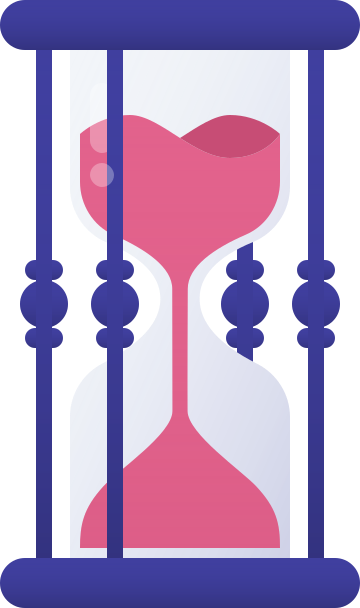

# 🖼️ Bgs Gallery

[⬅️ 回到首頁](../../README.md)

| 預覽 | 詳細資訊 |
| :--- | :--- |
|  | **bg-Aquarium-16.svg** VectorxVector | 4.01KB 更新: 2026-02-26 |
|  | **bg-Bench-f1.svg** VectorxVector | 1.76KB 更新: 2026-02-26 |
|  | **bg-Detail-0f.svg** VectorxVector | 5.25KB 更新: 2026-02-26 |
|  | **bg-Home-5b.svg** VectorxVector | 3.81KB 更新: 2026-02-26 |
|  | **bg-Houses-c0.svg** VectorxVector | 5.83KB 更新: 2026-02-26 |
|  | **bg-Icons-b6.svg** VectorxVector | 6.64KB 更新: 2026-02-26 |
|  | **bg-Interface-5c.svg** VectorxVector | 2.55KB 更新: 2026-02-26 |
|  | **bg-Office-3f.svg** VectorxVector | 2.59KB 更新: 2026-02-26 |
|  | **bg-Park-8c.svg** VectorxVector | 3.24KB 更新: 2026-02-26 |
|  | **bg-Phone-90.svg** VectorxVector | 2.47KB 更新: 2026-02-26 |
|  | **bg-Railway station-1b.svg** VectorxVector | 2.34KB 更新: 2026-02-26 |
|  | **bg-Schedule-36.svg** VectorxVector | 2.11KB 更新: 2026-02-26 |
|  | **bg-Space-f6.svg** VectorxVector | 2.78KB 更新: 2026-02-26 |
|  | **bg-Spot 01-8b.svg** VectorxVector | 595.00B 更新: 2026-02-26 |
|  | **bg-Spot 02-ed.svg** VectorxVector | 291.00B 更新: 2026-02-26 |
|  | **bg-Spot 03-5b.svg** VectorxVector | 407.00B 更新: 2026-02-26 |
|  | **bg-Stairs-3f.svg** VectorxVector | 1.39KB 更新: 2026-02-26 |
|  | **bg-Street-0d.svg** VectorxVector | 3.94KB 更新: 2026-02-26 |
|  | **bg-Tables-11.svg** VectorxVector | 1.65KB 更新: 2026-02-26 |
|  | **bg-Tropic-66.svg** VectorxVector | 6.01KB 更新: 2026-02-26 |
|  | **pr-Apple watch-10.svg** VectorxVector | 5.31KB 更新: 2026-02-26 |
|  | **pr-Bike-5b.svg** VectorxVector | 5.06KB 更新: 2026-02-26 |
|  | **pr-Bluetooth speaker-bd.svg** VectorxVector | 167.36KB 更新: 2026-02-26 |
|  | **pr-Books-83.svg** VectorxVector | 3.61KB 更新: 2026-02-26 |
|  | **pr-Calendar-48.svg** VectorxVector | 13.35KB 更新: 2026-02-26 |
|  | **pr-Camera-58.svg** VectorxVector | 3.90KB 更新: 2026-02-26 |
|  | **pr-Cash machine-bb.svg** VectorxVector | 4.18KB 更新: 2026-02-26 |
|  | **pr-Chat-60.svg** VectorxVector | 11.68KB 更新: 2026-02-26 |
|  | **pr-Coffee machine-a2.svg** VectorxVector | 4.96KB 更新: 2026-02-26 |
|  | **pr-Credit cards-36.svg** VectorxVector | 2.23KB 更新: 2026-02-26 |
|  | **pr-Detail-7e.svg** VectorxVector | 1.85KB 更新: 2026-02-26 |
|  | **pr-Fish-bb.svg** VectorxVector | 4.41KB 更新: 2026-02-26 |
|  | **pr-Girl Jumping-4b.svg** VectorxVector | 5.78KB 更新: 2026-02-26 |
|  | **pr-Girl and Macbook-72.svg** VectorxVector | 6.80KB 更新: 2026-02-26 |
|  | **pr-Girl and Phone-24.svg** VectorxVector | 7.92KB 更新: 2026-02-26 |
|  | **pr-Girl and Thing-d6.svg** VectorxVector | 6.60KB 更新: 2026-02-26 |
|  | **pr-Girl in VR-19.svg** VectorxVector | 5.90KB 更新: 2026-02-26 |
|  | **pr-Girl-ad.svg** VectorxVector | 6.63KB 更新: 2026-02-26 |
|  | **pr-Girl-s Portrait-da.svg** VectorxVector | 5.16KB 更新: 2026-02-26 |
|  | **pr-Guitar-d0.svg** VectorxVector | 5.84KB 更新: 2026-02-26 |
|  | **pr-Hand OK-18.svg** VectorxVector | 2.49KB 更新: 2026-02-26 |
|  | **pr-Hand and List-13.svg** VectorxVector | 2.36KB 更新: 2026-02-26 |
|  | **pr-Hand and iPad-ed.svg** VectorxVector | 8.93KB 更新: 2026-02-26 |
|  | **pr-Hands and iPhone-de.svg** VectorxVector | 9.62KB 更新: 2026-02-26 |
|  | **pr-Hands-80.svg** VectorxVector | 3.32KB 更新: 2026-02-26 |
|  | **pr-Hourglass-b1.svg** VectorxVector | 5.30KB 更新: 2026-02-26 |
|  | **pr-House-f2.svg** VectorxVector | 4.20KB 更新: 2026-02-26 |
|  | **pr-Lighthouse-c9.svg** VectorxVector | 7.93KB 更新: 2026-02-26 |
|  | **pr-Macbook-ec.svg** VectorxVector | 8.00KB 更新: 2026-02-26 |
|  | **pr-Mailbox-cb.svg** VectorxVector | 4.84KB 更新: 2026-02-26 |
|  | **pr-Man - Phone-2e.svg** VectorxVector | 5.16KB 更新: 2026-02-26 |
|  | **pr-Man and Macbook-c1.svg** VectorxVector | 8.92KB 更新: 2026-02-26 |
|  | **pr-Man-a6.svg** VectorxVector | 5.66KB 更新: 2026-02-26 |
|  | **pr-Money Box-02.svg** VectorxVector | 3.48KB 更新: 2026-02-26 |
|  | **pr-Navigation-99.svg** VectorxVector | 6.53KB 更新: 2026-02-26 |
|  | **pr-Nintendo swich-dc.svg** VectorxVector | 4.31KB 更新: 2026-02-26 |
|  | **pr-Power socket-7c.svg** VectorxVector | 2.95KB 更新: 2026-02-26 |
|  | **pr-Quadcopter-30.svg** VectorxVector | 5.41KB 更新: 2026-02-26 |
|  | **pr-Robot-10.svg** VectorxVector | 4.10KB 更新: 2026-02-26 |
|  | **pr-Safari-9f.svg** VectorxVector | 3.50KB 更新: 2026-02-26 |
|  | **pr-Scan-26.svg** VectorxVector | 4.79KB 更新: 2026-02-26 |
|  | **pr-Selfie-70.svg** VectorxVector | 12.73KB 更新: 2026-02-26 |
|  | **pr-Shop-f3.svg** VectorxVector | 6.15KB 更新: 2026-02-26 |
|  | **pr-Slot machine-db.svg** VectorxVector | 5.04KB 更新: 2026-02-26 |
|  | **pr-Table-c7.svg** VectorxVector | 2.41KB 更新: 2026-02-26 |
|  | **pr-Tamagotchi-82.svg** VectorxVector | 14.19KB 更新: 2026-02-26 |
|  | **pr-Wacom-12.svg** VectorxVector | 9.93KB 更新: 2026-02-26 |
|  | **pr-iMac-fc.svg** VectorxVector | 5.12KB 更新: 2026-02-26 |
|  | **pr-iPhone-65.svg** VectorxVector | 13.77KB 更新: 2026-02-26 |
|  | **sc-Battery-b7.svg** VectorxVector | 1.61KB 更新: 2026-02-26 |
|  | **sc-Board-2c.svg** VectorxVector | 1.88KB 更新: 2026-02-26 |
|  | **sc-Books-cb.svg** VectorxVector | 1.29KB 更新: 2026-02-26 |
|  | **sc-Box-e5.svg** VectorxVector | 2.15KB 更新: 2026-02-26 |
|  | **sc-Brush-da.svg** VectorxVector | 2.55KB 更新: 2026-02-26 |
|  | **sc-Bubble-f9.svg** VectorxVector | 3.18KB 更新: 2026-02-26 |
|  | **sc-Cable-b6.svg** VectorxVector | 3.05KB 更新: 2026-02-26 |
|  | **sc-Cake-a0.svg** VectorxVector | 4.04KB 更新: 2026-02-26 |
|  | **sc-Calendar-2c.svg** VectorxVector | 2.79KB 更新: 2026-02-26 |
|  | **sc-Clock-af.svg** VectorxVector | 1.75KB 更新: 2026-02-26 |
|  | **sc-Flowers-13.svg** VectorxVector | 3.09KB 更新: 2026-02-26 |
|  | **sc-Folder-a4.svg** VectorxVector | 1.77KB 更新: 2026-02-26 |
|  | **sc-Glasses-c6.svg** VectorxVector | 2.73KB 更新: 2026-02-26 |
|  | **sc-Lamp-4f.svg** VectorxVector | 878.00B 更新: 2026-02-26 |
|  | **sc-Lupa-83.svg** VectorxVector | 2.24KB 更新: 2026-02-26 |
|  | **sc-Mail-69.svg** VectorxVector | 1.52KB 更新: 2026-02-26 |
|  | **sc-Map-d1.svg** VectorxVector | 2.58KB 更新: 2026-02-26 |
|  | **sc-Nightstand-1b.svg** VectorxVector | 2.85KB 更新: 2026-02-26 |
|  | **sc-Photo-ad.svg** VectorxVector | 4.40KB 更新: 2026-02-26 |
|  | **sc-Pointer-ac.svg** VectorxVector | 2.93KB 更新: 2026-02-26 |
|  | **sc-Potion-18.svg** VectorxVector | 2.17KB 更新: 2026-02-26 |
|  | **sc-Purce-91.svg** VectorxVector | 3.12KB 更新: 2026-02-26 |
|  | **sc-Safari-04.svg** VectorxVector | 4.42KB 更新: 2026-02-26 |
|  | **sc-Sale-4b.svg** VectorxVector | 4.40KB 更新: 2026-02-26 |
|  | **sc-Schedule-7b.svg** VectorxVector | 4.04KB 更新: 2026-02-26 |
|  | **sc-Scissors-85.svg** VectorxVector | 2.16KB 更新: 2026-02-26 |
|  | **sc-Suitcase-25.svg** VectorxVector | 2.37KB 更新: 2026-02-26 |
|  | **sc-Table-86.svg** VectorxVector | 8.65KB 更新: 2026-02-26 |
|  | **sc-Trash-c2.svg** VectorxVector | 2.01KB 更新: 2026-02-26 |