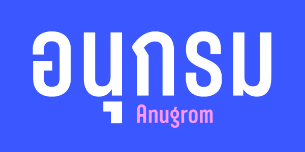
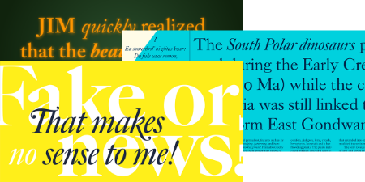
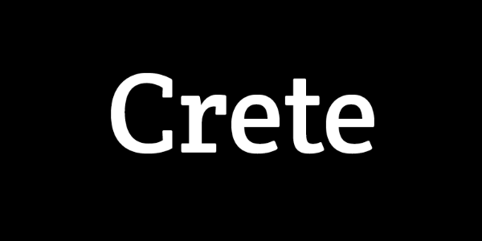

# 📂 目錄：images

> [🏠 主目錄](../README.md) / **images**

此目錄目前沒有直接存放圖片，請選擇下方子分類：

### 🗂️ 子分類列表

| 分類名稱 | 封面預覽 | 統計 |
| :--- | :--- | :--- |
| [📠**3Ds**](3Ds/README.md) | &nbsp;&nbsp;&nbsp;&nbsp;&nbsp;&nbsp;&nbsp;&nbsp;&nbsp; | 共 `641` 張 |
| [📠**Animations**](Animations/README.md) | &nbsp;&nbsp;&nbsp;&nbsp;&nbsp;&nbsp;&nbsp;&nbsp;&nbsp; | 共 `37` 張 |
| [📠**DesignSystem**](DesignSystem/README.md) | &nbsp;&nbsp;&nbsp;&nbsp;&nbsp;&nbsp;&nbsp;&nbsp;&nbsp; | 共 `167` 張 |
| [📠**Dicebear**](Dicebear/README.md) | &nbsp;&nbsp;&nbsp;&nbsp;&nbsp;&nbsp;&nbsp;&nbsp;&nbsp; | 共 `558` 張 |
| [📠**FontStyles**](FontStyles/README.md) | &nbsp;&nbsp;&nbsp;&nbsp;&nbsp;&nbsp;&nbsp;&nbsp;&nbsp; | 共 `23` 張 |
| [📠**Illustrations**](Illustrations/README.md) | &nbsp;&nbsp;&nbsp;&nbsp;&nbsp;&nbsp;&nbsp;&nbsp;&nbsp; | 共 `445` 張 |
| [📠**Resumes**](Resumes/README.md) | &nbsp;&nbsp;&nbsp;&nbsp;&nbsp;&nbsp;&nbsp;&nbsp;&nbsp; | 共 `693` 張 |
| [📠**Svg-Samples**](Svg-Samples/README.md) | &nbsp;&nbsp;&nbsp;&nbsp;&nbsp;&nbsp;&nbsp;&nbsp;&nbsp; | 共 `32` 張 |
| [📠**Svgs**](Svgs/README.md) | &nbsp; | 共 `2` 張 |
| [📠**Ux-meme**](Ux-meme/README.md) | &nbsp;&nbsp;&nbsp; | 共 `4` 張 |
| [📠**iCons**](iCons/README.md) | &nbsp;&nbsp;&nbsp;&nbsp;&nbsp;&nbsp;&nbsp;&nbsp;&nbsp; | 共 `33479` 張 |