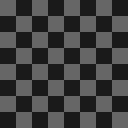
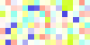

# 🖼️ 素材分類：Backgrounds

> [🏠 主目錄](../../../README.md) / [images](../../README.md) / [Resumes](../README.md) / **Backgrounds**

本目錄共有 `4` 個檔案

| 🎨 預覽 (點擊放大)  | 📋 檔案詳細資訊與連結 |
| :--- | :--- |
|  | **📂 檔名:** `32bg.svg` ✨ **格式:** `Vector (SVG)` ⚖️ **大小:** `70.82KB` 📅 **更新:** `2026-03-01`  🚀 **jsDelivr Markdown:** `` 🔗 **直接連結 (Url):** <code>https://cdn.jsdelivr.net/gh/barry028/materials@main/images/Resumes/Backgrounds/32bg.svg</code> 📥 [檢視原始檔](32bg.svg) |
|  | **📂 檔名:** `Bg-Patternpad.svg` ✨ **格式:** `Vector (SVG)` ⚖️ **大小:** `8.01KB` 📅 **更新:** `2026-03-01`  🚀 **jsDelivr Markdown:** `` 🔗 **直接連結 (Url):** <code>https://cdn.jsdelivr.net/gh/barry028/materials@main/images/Resumes/Backgrounds/Bg-Patternpad.svg</code> 📥 [檢視原始檔](Bg-Patternpad.svg) |
|  | **📂 檔名:** `Bg-Px-001.svg` ✨ **格式:** `Vector (SVG)` ⚖️ **大小:** `4.03KB` 📅 **更新:** `2026-03-01`  🚀 **jsDelivr Markdown:** `` 🔗 **直接連結 (Url):** <code>https://cdn.jsdelivr.net/gh/barry028/materials@main/images/Resumes/Backgrounds/Bg-Px-001.svg</code> 📥 [檢視原始檔](Bg-Px-001.svg) |
|  | **📂 檔名:** `Bg-Px-002.svg` ✨ **格式:** `Vector (SVG)` ⚖️ **大小:** `4.86KB` 📅 **更新:** `2026-03-01`  🚀 **jsDelivr Markdown:** `` 🔗 **直接連結 (Url):** <code>https://cdn.jsdelivr.net/gh/barry028/materials@main/images/Resumes/Backgrounds/Bg-Px-002.svg</code> 📥 [檢視原始檔](Bg-Px-002.svg) |