# 🖼️ 素材分類：Px Group

> [🏠 主目錄](../../../README.md) / [images](../../README.md) / [Resumes](../README.md) / **Px Group**

本目錄共有 `671` 個檔案

| 🎨 預覽 (點擊放大)  | 📋 檔案詳細資訊與連結 |
| :--- | :--- |
|  | **📂 檔名:** `4k-box.svg` ✨ **格式:** `Vector (SVG)` ⚖️ **大小:** `505.00B` 📅 **更新:** `2026-03-01`  🚀 **jsDelivr Markdown:** `` 🔗 **直接連結 (Url):** <code>https://cdn.jsdelivr.net/gh/barry028/materials@main/images/Resumes/Px%20Group/4k-box.svg</code> 📥 [檢視原始檔](4k-box.svg) |
| <a href="Bluetooth.svg">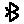</a> | **📂 檔名:** `Bluetooth.svg` ✨ **格式:** `Vector (SVG)` ⚖️ **大小:** `590.00B` 📅 **更新:** `2026-03-01`  🚀 **jsDelivr Markdown:** `` 🔗 **直接連結 (Url):** <code>https://cdn.jsdelivr.net/gh/barry028/materials@main/images/Resumes/Px%20Group/Bluetooth.svg</code> 📥 [檢視原始檔](Bluetooth.svg) |
|  | **📂 檔名:** `Delete-Document.svg` ✨ **格式:** `Vector (SVG)` ⚖️ **大小:** `615.00B` 📅 **更新:** `2026-03-01`  🚀 **jsDelivr Markdown:** `` 🔗 **直接連結 (Url):** <code>https://cdn.jsdelivr.net/gh/barry028/materials@main/images/Resumes/Px%20Group/Delete-Document.svg</code> 📥 [檢視原始檔](Delete-Document.svg) |
|  | **📂 檔名:** `Equalizer.svg` ✨ **格式:** `Vector (SVG)` ⚖️ **大小:** `1.05KB` 📅 **更新:** `2026-03-01`  🚀 **jsDelivr Markdown:** `` 🔗 **直接連結 (Url):** <code>https://cdn.jsdelivr.net/gh/barry028/materials@main/images/Resumes/Px%20Group/Equalizer.svg</code> 📥 [檢視原始檔](Equalizer.svg) |
|  | **📂 檔名:** `Geotag.svg` ✨ **格式:** `Vector (SVG)` ⚖️ **大小:** `721.00B` 📅 **更新:** `2026-03-01`  🚀 **jsDelivr Markdown:** `` 🔗 **直接連結 (Url):** <code>https://cdn.jsdelivr.net/gh/barry028/materials@main/images/Resumes/Px%20Group/Geotag.svg</code> 📥 [檢視原始檔](Geotag.svg) |
|  | **📂 檔名:** `Gift.svg` ✨ **格式:** `Vector (SVG)` ⚖️ **大小:** `516.00B` 📅 **更新:** `2026-03-01`  🚀 **jsDelivr Markdown:** `` 🔗 **直接連結 (Url):** <code>https://cdn.jsdelivr.net/gh/barry028/materials@main/images/Resumes/Px%20Group/Gift.svg</code> 📥 [檢視原始檔](Gift.svg) |
|  | **📂 檔名:** `Image.svg` ✨ **格式:** `Vector (SVG)` ⚖️ **大小:** `725.00B` 📅 **更新:** `2026-03-01`  🚀 **jsDelivr Markdown:** `` 🔗 **直接連結 (Url):** <code>https://cdn.jsdelivr.net/gh/barry028/materials@main/images/Resumes/Px%20Group/Image.svg</code> 📥 [檢視原始檔](Image.svg) |
|  | **📂 檔名:** `Inbox.svg` ✨ **格式:** `Vector (SVG)` ⚖️ **大小:** `481.00B` 📅 **更新:** `2026-03-01`  🚀 **jsDelivr Markdown:** `` 🔗 **直接連結 (Url):** <code>https://cdn.jsdelivr.net/gh/barry028/materials@main/images/Resumes/Px%20Group/Inbox.svg</code> 📥 [檢視原始檔](Inbox.svg) |
|  | **📂 檔名:** `Incoming-Call.svg` ✨ **格式:** `Vector (SVG)` ⚖️ **大小:** `788.00B` 📅 **更新:** `2026-03-01`  🚀 **jsDelivr Markdown:** `` 🔗 **直接連結 (Url):** <code>https://cdn.jsdelivr.net/gh/barry028/materials@main/images/Resumes/Px%20Group/Incoming-Call.svg</code> 📥 [檢視原始檔](Incoming-Call.svg) |
| <a href="Italic.svg">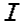</a> | **📂 檔名:** `Italic.svg` ✨ **格式:** `Vector (SVG)` ⚖️ **大小:** `461.00B` 📅 **更新:** `2026-03-01`  🚀 **jsDelivr Markdown:** `` 🔗 **直接連結 (Url):** <code>https://cdn.jsdelivr.net/gh/barry028/materials@main/images/Resumes/Px%20Group/Italic.svg</code> 📥 [檢視原始檔](Italic.svg) |
|  | **📂 檔名:** `Justify.svg` ✨ **格式:** `Vector (SVG)` ⚖️ **大小:** `675.00B` 📅 **更新:** `2026-03-01`  🚀 **jsDelivr Markdown:** `` 🔗 **直接連結 (Url):** <code>https://cdn.jsdelivr.net/gh/barry028/materials@main/images/Resumes/Px%20Group/Justify.svg</code> 📥 [檢視原始檔](Justify.svg) |
| <a href="Kebab-menu_Vertical.svg">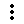</a> | **📂 檔名:** `Kebab-menu_Vertical.svg` ✨ **格式:** `Vector (SVG)` ⚖️ **大小:** `665.00B` 📅 **更新:** `2026-03-01`  🚀 **jsDelivr Markdown:** `` 🔗 **直接連結 (Url):** <code>https://cdn.jsdelivr.net/gh/barry028/materials@main/images/Resumes/Px%20Group/Kebab-menu_Vertical.svg</code> 📥 [檢視原始檔](Kebab-menu_Vertical.svg) |
|  | **📂 檔名:** `Kebab-menu_horizontal.svg` ✨ **格式:** `Vector (SVG)` ⚖️ **大小:** `669.00B` 📅 **更新:** `2026-03-01`  🚀 **jsDelivr Markdown:** `` 🔗 **直接連結 (Url):** <code>https://cdn.jsdelivr.net/gh/barry028/materials@main/images/Resumes/Px%20Group/Kebab-menu_horizontal.svg</code> 📥 [檢視原始檔](Kebab-menu_horizontal.svg) |
|  | **📂 檔名:** `Link-1.svg` ✨ **格式:** `Vector (SVG)` ⚖️ **大小:** `728.00B` 📅 **更新:** `2026-03-01`  🚀 **jsDelivr Markdown:** `` 🔗 **直接連結 (Url):** <code>https://cdn.jsdelivr.net/gh/barry028/materials@main/images/Resumes/Px%20Group/Link-1.svg</code> 📥 [檢視原始檔](Link-1.svg) |
|  | **📂 檔名:** `Next-2.svg` ✨ **格式:** `Vector (SVG)` ⚖️ **大小:** `602.00B` 📅 **更新:** `2026-03-01`  🚀 **jsDelivr Markdown:** `` 🔗 **直接連結 (Url):** <code>https://cdn.jsdelivr.net/gh/barry028/materials@main/images/Resumes/Px%20Group/Next-2.svg</code> 📥 [檢視原始檔](Next-2.svg) |
|  | **📂 檔名:** `Opened.svg` ✨ **格式:** `Vector (SVG)` ⚖️ **大小:** `602.00B` 📅 **更新:** `2026-03-01`  🚀 **jsDelivr Markdown:** `` 🔗 **直接連結 (Url):** <code>https://cdn.jsdelivr.net/gh/barry028/materials@main/images/Resumes/Px%20Group/Opened.svg</code> 📥 [檢視原始檔](Opened.svg) |
|  | **📂 檔名:** `Outgoing-call.svg` ✨ **格式:** `Vector (SVG)` ⚖️ **大小:** `802.00B` 📅 **更新:** `2026-03-01`  🚀 **jsDelivr Markdown:** `` 🔗 **直接連結 (Url):** <code>https://cdn.jsdelivr.net/gh/barry028/materials@main/images/Resumes/Px%20Group/Outgoing-call.svg</code> 📥 [檢視原始檔](Outgoing-call.svg) |
| <a href="Share.svg">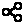</a> | **📂 檔名:** `Share.svg` ✨ **格式:** `Vector (SVG)` ⚖️ **大小:** `608.00B` 📅 **更新:** `2026-03-01`  🚀 **jsDelivr Markdown:** `` 🔗 **直接連結 (Url):** <code>https://cdn.jsdelivr.net/gh/barry028/materials@main/images/Resumes/Px%20Group/Share.svg</code> 📥 [檢視原始檔](Share.svg) |
|  | **📂 檔名:** `Show.svg` ✨ **格式:** `Vector (SVG)` ⚖️ **大小:** `711.00B` 📅 **更新:** `2026-03-01`  🚀 **jsDelivr Markdown:** `` 🔗 **直接連結 (Url):** <code>https://cdn.jsdelivr.net/gh/barry028/materials@main/images/Resumes/Px%20Group/Show.svg</code> 📥 [檢視原始檔](Show.svg) |
|  | **📂 檔名:** `Sound-Off.svg` ✨ **格式:** `Vector (SVG)` ⚖️ **大小:** `661.00B` 📅 **更新:** `2026-03-01`  🚀 **jsDelivr Markdown:** `` 🔗 **直接連結 (Url):** <code>https://cdn.jsdelivr.net/gh/barry028/materials@main/images/Resumes/Px%20Group/Sound-Off.svg</code> 📥 [檢視原始檔](Sound-Off.svg) |
|  | **📂 檔名:** `Sound-On.svg` ✨ **格式:** `Vector (SVG)` ⚖️ **大小:** `725.00B` 📅 **更新:** `2026-03-01`  🚀 **jsDelivr Markdown:** `` 🔗 **直接連結 (Url):** <code>https://cdn.jsdelivr.net/gh/barry028/materials@main/images/Resumes/Px%20Group/Sound-On.svg</code> 📥 [檢視原始檔](Sound-On.svg) |
|  | **📂 檔名:** `Stop.svg` ✨ **格式:** `Vector (SVG)` ⚖️ **大小:** `415.00B` 📅 **更新:** `2026-03-01`  🚀 **jsDelivr Markdown:** `` 🔗 **直接連結 (Url):** <code>https://cdn.jsdelivr.net/gh/barry028/materials@main/images/Resumes/Px%20Group/Stop.svg</code> 📥 [檢視原始檔](Stop.svg) |
|  | **📂 檔名:** `TV.svg` ✨ **格式:** `Vector (SVG)` ⚖️ **大小:** `450.00B` 📅 **更新:** `2026-03-01`  🚀 **jsDelivr Markdown:** `` 🔗 **直接連結 (Url):** <code>https://cdn.jsdelivr.net/gh/barry028/materials@main/images/Resumes/Px%20Group/TV.svg</code> 📥 [檢視原始檔](TV.svg) |
|  | **📂 檔名:** `Text.svg` ✨ **格式:** `Vector (SVG)` ⚖️ **大小:** `426.00B` 📅 **更新:** `2026-03-01`  🚀 **jsDelivr Markdown:** `` 🔗 **直接連結 (Url):** <code>https://cdn.jsdelivr.net/gh/barry028/materials@main/images/Resumes/Px%20Group/Text.svg</code> 📥 [檢視原始檔](Text.svg) |
|  | **📂 檔名:** `Underlined.svg` ✨ **格式:** `Vector (SVG)` ⚖️ **大小:** `593.00B` 📅 **更新:** `2026-03-01`  🚀 **jsDelivr Markdown:** `` 🔗 **直接連結 (Url):** <code>https://cdn.jsdelivr.net/gh/barry028/materials@main/images/Resumes/Px%20Group/Underlined.svg</code> 📥 [檢視原始檔](Underlined.svg) |
|  | **📂 檔名:** `Up-arrow-2.svg` ✨ **格式:** `Vector (SVG)` ⚖️ **大小:** `453.00B` 📅 **更新:** `2026-03-01`  🚀 **jsDelivr Markdown:** `` 🔗 **直接連結 (Url):** <code>https://cdn.jsdelivr.net/gh/barry028/materials@main/images/Resumes/Px%20Group/Up-arrow-2.svg</code> 📥 [檢視原始檔](Up-arrow-2.svg) |
|  | **📂 檔名:** `Up-left_arrow.svg` ✨ **格式:** `Vector (SVG)` ⚖️ **大小:** `505.00B` 📅 **更新:** `2026-03-01`  🚀 **jsDelivr Markdown:** `` 🔗 **直接連結 (Url):** <code>https://cdn.jsdelivr.net/gh/barry028/materials@main/images/Resumes/Px%20Group/Up-left_arrow.svg</code> 📥 [檢視原始檔](Up-left_arrow.svg) |
|  | **📂 檔名:** `Up-right_arrow.svg` ✨ **格式:** `Vector (SVG)` ⚖️ **大小:** `503.00B` 📅 **更新:** `2026-03-01`  🚀 **jsDelivr Markdown:** `` 🔗 **直接連結 (Url):** <code>https://cdn.jsdelivr.net/gh/barry028/materials@main/images/Resumes/Px%20Group/Up-right_arrow.svg</code> 📥 [檢視原始檔](Up-right_arrow.svg) |
|  | **📂 檔名:** `account-box.svg` ✨ **格式:** `Vector (SVG)` ⚖️ **大小:** `889.00B` 📅 **更新:** `2026-03-01`  🚀 **jsDelivr Markdown:** `` 🔗 **直接連結 (Url):** <code>https://cdn.jsdelivr.net/gh/barry028/materials@main/images/Resumes/Px%20Group/account-box.svg</code> 📥 [檢視原始檔](account-box.svg) |
| <a href="add-1.svg">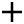</a> | **📂 檔名:** `add-1.svg` ✨ **格式:** `Vector (SVG)` ⚖️ **大小:** `448.00B` 📅 **更新:** `2026-03-01`  🚀 **jsDelivr Markdown:** `` 🔗 **直接連結 (Url):** <code>https://cdn.jsdelivr.net/gh/barry028/materials@main/images/Resumes/Px%20Group/add-1.svg</code> 📥 [檢視原始檔](add-1.svg) |
| <a href="add-bookmark.svg">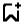</a> | **📂 檔名:** `add-bookmark.svg` ✨ **格式:** `Vector (SVG)` ⚖️ **大小:** `639.00B` 📅 **更新:** `2026-03-01`  🚀 **jsDelivr Markdown:** `` 🔗 **直接連結 (Url):** <code>https://cdn.jsdelivr.net/gh/barry028/materials@main/images/Resumes/Px%20Group/add-bookmark.svg</code> 📥 [檢視原始檔](add-bookmark.svg) |
|  | **📂 檔名:** `add-box-multiple.svg` ✨ **格式:** `Vector (SVG)` ⚖️ **大小:** `594.00B` 📅 **更新:** `2026-03-01`  🚀 **jsDelivr Markdown:** `` 🔗 **直接連結 (Url):** <code>https://cdn.jsdelivr.net/gh/barry028/materials@main/images/Resumes/Px%20Group/add-box-multiple.svg</code> 📥 [檢視原始檔](add-box-multiple.svg) |
| <a href="add-col.svg">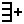</a> | **📂 檔名:** `add-col.svg` ✨ **格式:** `Vector (SVG)` ⚖️ **大小:** `468.00B` 📅 **更新:** `2026-03-01`  🚀 **jsDelivr Markdown:** `` 🔗 **直接連結 (Url):** <code>https://cdn.jsdelivr.net/gh/barry028/materials@main/images/Resumes/Px%20Group/add-col.svg</code> 📥 [檢視原始檔](add-col.svg) |
|  | **📂 檔名:** `add-folder.svg` ✨ **格式:** `Vector (SVG)` ⚖️ **大小:** `651.00B` 📅 **更新:** `2026-03-01`  🚀 **jsDelivr Markdown:** `` 🔗 **直接連結 (Url):** <code>https://cdn.jsdelivr.net/gh/barry028/materials@main/images/Resumes/Px%20Group/add-folder.svg</code> 📥 [檢視原始檔](add-folder.svg) |
|  | **📂 檔名:** `add-img.svg` ✨ **格式:** `Vector (SVG)` ⚖️ **大小:** `672.00B` 📅 **更新:** `2026-03-01`  🚀 **jsDelivr Markdown:** `` 🔗 **直接連結 (Url):** <code>https://cdn.jsdelivr.net/gh/barry028/materials@main/images/Resumes/Px%20Group/add-img.svg</code> 📥 [檢視原始檔](add-img.svg) |
|  | **📂 檔名:** `add-messages.svg` ✨ **格式:** `Vector (SVG)` ⚖️ **大小:** `642.00B` 📅 **更新:** `2026-03-01`  🚀 **jsDelivr Markdown:** `` 🔗 **直接連結 (Url):** <code>https://cdn.jsdelivr.net/gh/barry028/materials@main/images/Resumes/Px%20Group/add-messages.svg</code> 📥 [檢視原始檔](add-messages.svg) |
|  | **📂 檔名:** `add-person.svg` ✨ **格式:** `Vector (SVG)` ⚖️ **大小:** `730.00B` 📅 **更新:** `2026-03-01`  🚀 **jsDelivr Markdown:** `` 🔗 **直接連結 (Url):** <code>https://cdn.jsdelivr.net/gh/barry028/materials@main/images/Resumes/Px%20Group/add-person.svg</code> 📥 [檢視原始檔](add-person.svg) |
| <a href="add-row.svg">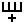</a> | **📂 檔名:** `add-row.svg` ✨ **格式:** `Vector (SVG)` ⚖️ **大小:** `467.00B` 📅 **更新:** `2026-03-01`  🚀 **jsDelivr Markdown:** `` 🔗 **直接連結 (Url):** <code>https://cdn.jsdelivr.net/gh/barry028/materials@main/images/Resumes/Px%20Group/add-row.svg</code> 📥 [檢視原始檔](add-row.svg) |
|  | **📂 檔名:** `add.svg` ✨ **格式:** `Vector (SVG)` ⚖️ **大小:** `628.00B` 📅 **更新:** `2026-03-01`  🚀 **jsDelivr Markdown:** `` 🔗 **直接連結 (Url):** <code>https://cdn.jsdelivr.net/gh/barry028/materials@main/images/Resumes/Px%20Group/add.svg</code> 📥 [檢視原始檔](add.svg) |
|  | **📂 檔名:** `alert-1.svg` ✨ **格式:** `Vector (SVG)` ⚖️ **大小:** `1.21KB` 📅 **更新:** `2026-03-01`  🚀 **jsDelivr Markdown:** `` 🔗 **直接連結 (Url):** <code>https://cdn.jsdelivr.net/gh/barry028/materials@main/images/Resumes/Px%20Group/alert-1.svg</code> 📥 [檢視原始檔](alert-1.svg) |
|  | **📂 檔名:** `alert.svg` ✨ **格式:** `Vector (SVG)` ⚖️ **大小:** `564.00B` 📅 **更新:** `2026-03-01`  🚀 **jsDelivr Markdown:** `` 🔗 **直接連結 (Url):** <code>https://cdn.jsdelivr.net/gh/barry028/materials@main/images/Resumes/Px%20Group/alert.svg</code> 📥 [檢視原始檔](alert.svg) |
|  | **📂 檔名:** `align-center-1.svg` ✨ **格式:** `Vector (SVG)` ⚖️ **大小:** `459.00B` 📅 **更新:** `2026-03-01`  🚀 **jsDelivr Markdown:** `` 🔗 **直接連結 (Url):** <code>https://cdn.jsdelivr.net/gh/barry028/materials@main/images/Resumes/Px%20Group/align-center-1.svg</code> 📥 [檢視原始檔](align-center-1.svg) |
|  | **📂 檔名:** `align-center.svg` ✨ **格式:** `Vector (SVG)` ⚖️ **大小:** `660.00B` 📅 **更新:** `2026-03-01`  🚀 **jsDelivr Markdown:** `` 🔗 **直接連結 (Url):** <code>https://cdn.jsdelivr.net/gh/barry028/materials@main/images/Resumes/Px%20Group/align-center.svg</code> 📥 [檢視原始檔](align-center.svg) |
|  | **📂 檔名:** `align-left.svg` ✨ **格式:** `Vector (SVG)` ⚖️ **大小:** `656.00B` 📅 **更新:** `2026-03-01`  🚀 **jsDelivr Markdown:** `` 🔗 **直接連結 (Url):** <code>https://cdn.jsdelivr.net/gh/barry028/materials@main/images/Resumes/Px%20Group/align-left.svg</code> 📥 [檢視原始檔](align-left.svg) |
|  | **📂 檔名:** `align-right.svg` ✨ **格式:** `Vector (SVG)` ⚖️ **大小:** `658.00B` 📅 **更新:** `2026-03-01`  🚀 **jsDelivr Markdown:** `` 🔗 **直接連結 (Url):** <code>https://cdn.jsdelivr.net/gh/barry028/materials@main/images/Resumes/Px%20Group/align-right.svg</code> 📥 [檢視原始檔](align-right.svg) |
|  | **📂 檔名:** `analytics.svg` ✨ **格式:** `Vector (SVG)` ⚖️ **大小:** `568.00B` 📅 **更新:** `2026-03-01`  🚀 **jsDelivr Markdown:** `` 🔗 **直接連結 (Url):** <code>https://cdn.jsdelivr.net/gh/barry028/materials@main/images/Resumes/Px%20Group/analytics.svg</code> 📥 [檢視原始檔](analytics.svg) |
|  | **📂 檔名:** `andriod.svg` ✨ **格式:** `Vector (SVG)` ⚖️ **大小:** `546.00B` 📅 **更新:** `2026-03-01`  🚀 **jsDelivr Markdown:** `` 🔗 **直接連結 (Url):** <code>https://cdn.jsdelivr.net/gh/barry028/materials@main/images/Resumes/Px%20Group/andriod.svg</code> 📥 [檢視原始檔](andriod.svg) |
|  | **📂 檔名:** `android.svg` ✨ **格式:** `Vector (SVG)` ⚖️ **大小:** `548.00B` 📅 **更新:** `2026-03-01`  🚀 **jsDelivr Markdown:** `` 🔗 **直接連結 (Url):** <code>https://cdn.jsdelivr.net/gh/barry028/materials@main/images/Resumes/Px%20Group/android.svg</code> 📥 [檢視原始檔](android.svg) |
| <a href="animation.svg">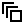</a> | **📂 檔名:** `animation.svg` ✨ **格式:** `Vector (SVG)` ⚖️ **大小:** `465.00B` 📅 **更新:** `2026-03-01`  🚀 **jsDelivr Markdown:** `` 🔗 **直接連結 (Url):** <code>https://cdn.jsdelivr.net/gh/barry028/materials@main/images/Resumes/Px%20Group/animation.svg</code> 📥 [檢視原始檔](animation.svg) |
|  | **📂 檔名:** `archer-1.svg` ✨ **格式:** `Vector (SVG)` ⚖️ **大小:** `861.00B` 📅 **更新:** `2026-03-01`  🚀 **jsDelivr Markdown:** `` 🔗 **直接連結 (Url):** <code>https://cdn.jsdelivr.net/gh/barry028/materials@main/images/Resumes/Px%20Group/archer-1.svg</code> 📥 [檢視原始檔](archer-1.svg) |
|  | **📂 檔名:** `archer-2.svg` ✨ **格式:** `Vector (SVG)` ⚖️ **大小:** `710.00B` 📅 **更新:** `2026-03-01`  🚀 **jsDelivr Markdown:** `` 🔗 **直接連結 (Url):** <code>https://cdn.jsdelivr.net/gh/barry028/materials@main/images/Resumes/Px%20Group/archer-2.svg</code> 📥 [檢視原始檔](archer-2.svg) |
|  | **📂 檔名:** `archer.svg` ✨ **格式:** `Vector (SVG)` ⚖️ **大小:** `753.00B` 📅 **更新:** `2026-03-01`  🚀 **jsDelivr Markdown:** `` 🔗 **直接連結 (Url):** <code>https://cdn.jsdelivr.net/gh/barry028/materials@main/images/Resumes/Px%20Group/archer.svg</code> 📥 [檢視原始檔](archer.svg) |
|  | **📂 檔名:** `archive.svg` ✨ **格式:** `Vector (SVG)` ⚖️ **大小:** `1.01KB` 📅 **更新:** `2026-03-01`  🚀 **jsDelivr Markdown:** `` 🔗 **直接連結 (Url):** <code>https://cdn.jsdelivr.net/gh/barry028/materials@main/images/Resumes/Px%20Group/archive.svg</code> 📥 [檢視原始檔](archive.svg) |
|  | **📂 檔名:** `arrow lefrectangle.svg` ✨ **格式:** `Vector (SVG)` ⚖️ **大小:** `576.00B` 📅 **更新:** `2026-03-01`  🚀 **jsDelivr Markdown:** `` 🔗 **直接連結 (Url):** <code>https://cdn.jsdelivr.net/gh/barry028/materials@main/images/Resumes/Px%20Group/arrow%20lefrectangle.svg</code> 📥 [檢視原始檔](arrow%20lefrectangle.svg) |
|  | **📂 檔名:** `arrow top.svg` ✨ **格式:** `Vector (SVG)` ⚖️ **大小:** `566.00B` 📅 **更新:** `2026-03-01`  🚀 **jsDelivr Markdown:** `` 🔗 **直接連結 (Url):** <code>https://cdn.jsdelivr.net/gh/barry028/materials@main/images/Resumes/Px%20Group/arrow%20top.svg</code> 📥 [檢視原始檔](arrow%20top.svg) |
| <a href="arrow-bar-left.svg">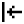</a> | **📂 檔名:** `arrow-bar-left.svg` ✨ **格式:** `Vector (SVG)` ⚖️ **大小:** `523.00B` 📅 **更新:** `2026-03-01`  🚀 **jsDelivr Markdown:** `` 🔗 **直接連結 (Url):** <code>https://cdn.jsdelivr.net/gh/barry028/materials@main/images/Resumes/Px%20Group/arrow-bar-left.svg</code> 📥 [檢視原始檔](arrow-bar-left.svg) |
| <a href="arrow-bar-up.svg">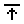</a> | **📂 檔名:** `arrow-bar-up.svg` ✨ **格式:** `Vector (SVG)` ⚖️ **大小:** `472.00B` 📅 **更新:** `2026-03-01`  🚀 **jsDelivr Markdown:** `` 🔗 **直接連結 (Url):** <code>https://cdn.jsdelivr.net/gh/barry028/materials@main/images/Resumes/Px%20Group/arrow-bar-up.svg</code> 📥 [檢視原始檔](arrow-bar-up.svg) |
|  | **📂 檔名:** `arrow-down-box.svg` ✨ **格式:** `Vector (SVG)` ⚖️ **大小:** `604.00B` 📅 **更新:** `2026-03-01`  🚀 **jsDelivr Markdown:** `` 🔗 **直接連結 (Url):** <code>https://cdn.jsdelivr.net/gh/barry028/materials@main/images/Resumes/Px%20Group/arrow-down-box.svg</code> 📥 [檢視原始檔](arrow-down-box.svg) |
|  | **📂 檔名:** `arrow-down-circle.svg` ✨ **格式:** `Vector (SVG)` ⚖️ **大小:** `689.00B` 📅 **更新:** `2026-03-01`  🚀 **jsDelivr Markdown:** `` 🔗 **直接連結 (Url):** <code>https://cdn.jsdelivr.net/gh/barry028/materials@main/images/Resumes/Px%20Group/arrow-down-circle.svg</code> 📥 [檢視原始檔](arrow-down-circle.svg) |
|  | **📂 檔名:** `arrow-left-box.svg` ✨ **格式:** `Vector (SVG)` ⚖️ **大小:** `606.00B` 📅 **更新:** `2026-03-01`  🚀 **jsDelivr Markdown:** `` 🔗 **直接連結 (Url):** <code>https://cdn.jsdelivr.net/gh/barry028/materials@main/images/Resumes/Px%20Group/arrow-left-box.svg</code> 📥 [檢視原始檔](arrow-left-box.svg) |
|  | **📂 檔名:** `arrow-left-circle.svg` ✨ **格式:** `Vector (SVG)` ⚖️ **大小:** `685.00B` 📅 **更新:** `2026-03-01`  🚀 **jsDelivr Markdown:** `` 🔗 **直接連結 (Url):** <code>https://cdn.jsdelivr.net/gh/barry028/materials@main/images/Resumes/Px%20Group/arrow-left-circle.svg</code> 📥 [檢視原始檔](arrow-left-circle.svg) |
| <a href="arrow-right-1.svg">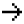</a> | **📂 檔名:** `arrow-right-1.svg` ✨ **格式:** `Vector (SVG)` ⚖️ **大小:** `521.00B` 📅 **更新:** `2026-03-01`  🚀 **jsDelivr Markdown:** `` 🔗 **直接連結 (Url):** <code>https://cdn.jsdelivr.net/gh/barry028/materials@main/images/Resumes/Px%20Group/arrow-right-1.svg</code> 📥 [檢視原始檔](arrow-right-1.svg) |
|  | **📂 檔名:** `arrow-right-circle.svg` ✨ **格式:** `Vector (SVG)` ⚖️ **大小:** `689.00B` 📅 **更新:** `2026-03-01`  🚀 **jsDelivr Markdown:** `` 🔗 **直接連結 (Url):** <code>https://cdn.jsdelivr.net/gh/barry028/materials@main/images/Resumes/Px%20Group/arrow-right-circle.svg</code> 📥 [檢視原始檔](arrow-right-circle.svg) |
|  | **📂 檔名:** `arrow-right-up.svg` ✨ **格式:** `Vector (SVG)` ⚖️ **大小:** `634.00B` 📅 **更新:** `2026-03-01`  🚀 **jsDelivr Markdown:** `` 🔗 **直接連結 (Url):** <code>https://cdn.jsdelivr.net/gh/barry028/materials@main/images/Resumes/Px%20Group/arrow-right-up.svg</code> 📥 [檢視原始檔](arrow-right-up.svg) |
| <a href="arrow-right.svg">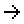</a> | **📂 檔名:** `arrow-right.svg` ✨ **格式:** `Vector (SVG)` ⚖️ **大小:** `490.00B` 📅 **更新:** `2026-03-01`  🚀 **jsDelivr Markdown:** `` 🔗 **直接連結 (Url):** <code>https://cdn.jsdelivr.net/gh/barry028/materials@main/images/Resumes/Px%20Group/arrow-right.svg</code> 📥 [檢視原始檔](arrow-right.svg) |
| <a href="arrow-top-left.svg">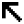</a> | **📂 檔名:** `arrow-top-left.svg` ✨ **格式:** `Vector (SVG)` ⚖️ **大小:** `654.00B` 📅 **更新:** `2026-03-01`  🚀 **jsDelivr Markdown:** `` 🔗 **直接連結 (Url):** <code>https://cdn.jsdelivr.net/gh/barry028/materials@main/images/Resumes/Px%20Group/arrow-top-left.svg</code> 📥 [檢視原始檔](arrow-top-left.svg) |
|  | **📂 檔名:** `arrow-up-box.svg` ✨ **格式:** `Vector (SVG)` ⚖️ **大小:** `601.00B` 📅 **更新:** `2026-03-01`  🚀 **jsDelivr Markdown:** `` 🔗 **直接連結 (Url):** <code>https://cdn.jsdelivr.net/gh/barry028/materials@main/images/Resumes/Px%20Group/arrow-up-box.svg</code> 📥 [檢視原始檔](arrow-up-box.svg) |
|  | **📂 檔名:** `arrow.svg` ✨ **格式:** `Vector (SVG)` ⚖️ **大小:** `578.00B` 📅 **更新:** `2026-03-01`  🚀 **jsDelivr Markdown:** `` 🔗 **直接連結 (Url):** <code>https://cdn.jsdelivr.net/gh/barry028/materials@main/images/Resumes/Px%20Group/arrow.svg</code> 📥 [檢視原始檔](arrow.svg) |
| <a href="arrow1.svg">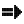</a> | **📂 檔名:** `arrow1.svg` ✨ **格式:** `Vector (SVG)` ⚖️ **大小:** `14.31KB` 📅 **更新:** `2026-03-01`  🚀 **jsDelivr Markdown:** `` 🔗 **直接連結 (Url):** <code>https://cdn.jsdelivr.net/gh/barry028/materials@main/images/Resumes/Px%20Group/arrow1.svg</code> 📥 [檢視原始檔](arrow1.svg) |
|  | **📂 檔名:** `arrow10.svg` ✨ **格式:** `Vector (SVG)` ⚖️ **大小:** `8.28KB` 📅 **更新:** `2026-03-01`  🚀 **jsDelivr Markdown:** `` 🔗 **直接連結 (Url):** <code>https://cdn.jsdelivr.net/gh/barry028/materials@main/images/Resumes/Px%20Group/arrow10.svg</code> 📥 [檢視原始檔](arrow10.svg) |
|  | **📂 檔名:** `arrow11.svg` ✨ **格式:** `Vector (SVG)` ⚖️ **大小:** `12.79KB` 📅 **更新:** `2026-03-01`  🚀 **jsDelivr Markdown:** `` 🔗 **直接連結 (Url):** <code>https://cdn.jsdelivr.net/gh/barry028/materials@main/images/Resumes/Px%20Group/arrow11.svg</code> 📥 [檢視原始檔](arrow11.svg) |
|  | **📂 檔名:** `arrow12.svg` ✨ **格式:** `Vector (SVG)` ⚖️ **大小:** `5.99KB` 📅 **更新:** `2026-03-01`  🚀 **jsDelivr Markdown:** `` 🔗 **直接連結 (Url):** <code>https://cdn.jsdelivr.net/gh/barry028/materials@main/images/Resumes/Px%20Group/arrow12.svg</code> 📥 [檢視原始檔](arrow12.svg) |
|  | **📂 檔名:** `arrow2.svg` ✨ **格式:** `Vector (SVG)` ⚖️ **大小:** `11.59KB` 📅 **更新:** `2026-03-01`  🚀 **jsDelivr Markdown:** `` 🔗 **直接連結 (Url):** <code>https://cdn.jsdelivr.net/gh/barry028/materials@main/images/Resumes/Px%20Group/arrow2.svg</code> 📥 [檢視原始檔](arrow2.svg) |
|  | **📂 檔名:** `arrow3.svg` ✨ **格式:** `Vector (SVG)` ⚖️ **大小:** `10.40KB` 📅 **更新:** `2026-03-01`  🚀 **jsDelivr Markdown:** `` 🔗 **直接連結 (Url):** <code>https://cdn.jsdelivr.net/gh/barry028/materials@main/images/Resumes/Px%20Group/arrow3.svg</code> 📥 [檢視原始檔](arrow3.svg) |
| <a href="arrow4.svg">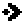</a> | **📂 檔名:** `arrow4.svg` ✨ **格式:** `Vector (SVG)` ⚖️ **大小:** `10.30KB` 📅 **更新:** `2026-03-01`  🚀 **jsDelivr Markdown:** `` 🔗 **直接連結 (Url):** <code>https://cdn.jsdelivr.net/gh/barry028/materials@main/images/Resumes/Px%20Group/arrow4.svg</code> 📥 [檢視原始檔](arrow4.svg) |
| <a href="arrow5.svg">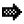</a> | **📂 檔名:** `arrow5.svg` ✨ **格式:** `Vector (SVG)` ⚖️ **大小:** `12.74KB` 📅 **更新:** `2026-03-01`  🚀 **jsDelivr Markdown:** `` 🔗 **直接連結 (Url):** <code>https://cdn.jsdelivr.net/gh/barry028/materials@main/images/Resumes/Px%20Group/arrow5.svg</code> 📥 [檢視原始檔](arrow5.svg) |
|  | **📂 檔名:** `arrow6.svg` ✨ **格式:** `Vector (SVG)` ⚖️ **大小:** `13.78KB` 📅 **更新:** `2026-03-01`  🚀 **jsDelivr Markdown:** `` 🔗 **直接連結 (Url):** <code>https://cdn.jsdelivr.net/gh/barry028/materials@main/images/Resumes/Px%20Group/arrow6.svg</code> 📥 [檢視原始檔](arrow6.svg) |
|  | **📂 檔名:** `arrow7.svg` ✨ **格式:** `Vector (SVG)` ⚖️ **大小:** `8.03KB` 📅 **更新:** `2026-03-01`  🚀 **jsDelivr Markdown:** `` 🔗 **直接連結 (Url):** <code>https://cdn.jsdelivr.net/gh/barry028/materials@main/images/Resumes/Px%20Group/arrow7.svg</code> 📥 [檢視原始檔](arrow7.svg) |
|  | **📂 檔名:** `arrow8.svg` ✨ **格式:** `Vector (SVG)` ⚖️ **大小:** `14.88KB` 📅 **更新:** `2026-03-01`  🚀 **jsDelivr Markdown:** `` 🔗 **直接連結 (Url):** <code>https://cdn.jsdelivr.net/gh/barry028/materials@main/images/Resumes/Px%20Group/arrow8.svg</code> 📥 [檢視原始檔](arrow8.svg) |
| <a href="arrow9.svg">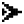</a> | **📂 檔名:** `arrow9.svg` ✨ **格式:** `Vector (SVG)` ⚖️ **大小:** `8.00KB` 📅 **更新:** `2026-03-01`  🚀 **jsDelivr Markdown:** `` 🔗 **直接連結 (Url):** <code>https://cdn.jsdelivr.net/gh/barry028/materials@main/images/Resumes/Px%20Group/arrow9.svg</code> 📥 [檢視原始檔](arrow9.svg) |
|  | **📂 檔名:** `arrowhead.svg` ✨ **格式:** `Vector (SVG)` ⚖️ **大小:** `1011.00B` 📅 **更新:** `2026-03-01`  🚀 **jsDelivr Markdown:** `` 🔗 **直接連結 (Url):** <code>https://cdn.jsdelivr.net/gh/barry028/materials@main/images/Resumes/Px%20Group/arrowhead.svg</code> 📥 [檢視原始檔](arrowhead.svg) |
|  | **📂 檔名:** `arrowheads-1.svg` ✨ **格式:** `Vector (SVG)` ⚖️ **大小:** `929.00B` 📅 **更新:** `2026-03-01`  🚀 **jsDelivr Markdown:** `` 🔗 **直接連結 (Url):** <code>https://cdn.jsdelivr.net/gh/barry028/materials@main/images/Resumes/Px%20Group/arrowheads-1.svg</code> 📥 [檢視原始檔](arrowheads-1.svg) |
|  | **📂 檔名:** `arrowheads-2.svg` ✨ **格式:** `Vector (SVG)` ⚖️ **大小:** `787.00B` 📅 **更新:** `2026-03-01`  🚀 **jsDelivr Markdown:** `` 🔗 **直接連結 (Url):** <code>https://cdn.jsdelivr.net/gh/barry028/materials@main/images/Resumes/Px%20Group/arrowheads-2.svg</code> 📥 [檢視原始檔](arrowheads-2.svg) |
|  | **📂 檔名:** `arrowheads-3.svg` ✨ **格式:** `Vector (SVG)` ⚖️ **大小:** `827.00B` 📅 **更新:** `2026-03-01`  🚀 **jsDelivr Markdown:** `` 🔗 **直接連結 (Url):** <code>https://cdn.jsdelivr.net/gh/barry028/materials@main/images/Resumes/Px%20Group/arrowheads-3.svg</code> 📥 [檢視原始檔](arrowheads-3.svg) |
|  | **📂 檔名:** `arrowheads.svg` ✨ **格式:** `Vector (SVG)` ⚖️ **大小:** `944.00B` 📅 **更新:** `2026-03-01`  🚀 **jsDelivr Markdown:** `` 🔗 **直接連結 (Url):** <code>https://cdn.jsdelivr.net/gh/barry028/materials@main/images/Resumes/Px%20Group/arrowheads.svg</code> 📥 [檢視原始檔](arrowheads.svg) |
|  | **📂 檔名:** `arrows-1.svg` ✨ **格式:** `Vector (SVG)` ⚖️ **大小:** `939.00B` 📅 **更新:** `2026-03-01`  🚀 **jsDelivr Markdown:** `` 🔗 **直接連結 (Url):** <code>https://cdn.jsdelivr.net/gh/barry028/materials@main/images/Resumes/Px%20Group/arrows-1.svg</code> 📥 [檢視原始檔](arrows-1.svg) |
| <a href="arrows-horizontal.svg">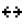</a> | **📂 檔名:** `arrows-horizontal.svg` ✨ **格式:** `Vector (SVG)` ⚖️ **大小:** `686.00B` 📅 **更新:** `2026-03-01`  🚀 **jsDelivr Markdown:** `` 🔗 **直接連結 (Url):** <code>https://cdn.jsdelivr.net/gh/barry028/materials@main/images/Resumes/Px%20Group/arrows-horizontal.svg</code> 📥 [檢視原始檔](arrows-horizontal.svg) |
|  | **📂 檔名:** `arrows.svg` ✨ **格式:** `Vector (SVG)` ⚖️ **大小:** `1.02KB` 📅 **更新:** `2026-03-01`  🚀 **jsDelivr Markdown:** `` 🔗 **直接連結 (Url):** <code>https://cdn.jsdelivr.net/gh/barry028/materials@main/images/Resumes/Px%20Group/arrows.svg</code> 📥 [檢視原始檔](arrows.svg) |
|  | **📂 檔名:** `art-text.svg` ✨ **格式:** `Vector (SVG)` ⚖️ **大小:** `459.00B` 📅 **更新:** `2026-03-01`  🚀 **jsDelivr Markdown:** `` 🔗 **直接連結 (Url):** <code>https://cdn.jsdelivr.net/gh/barry028/materials@main/images/Resumes/Px%20Group/art-text.svg</code> 📥 [檢視原始檔](art-text.svg) |
|  | **📂 檔名:** `article-multiple.svg` ✨ **格式:** `Vector (SVG)` ⚖️ **大小:** `609.00B` 📅 **更新:** `2026-03-01`  🚀 **jsDelivr Markdown:** `` 🔗 **直接連結 (Url):** <code>https://cdn.jsdelivr.net/gh/barry028/materials@main/images/Resumes/Px%20Group/article-multiple.svg</code> 📥 [檢視原始檔](article-multiple.svg) |
|  | **📂 檔名:** `article.svg` ✨ **格式:** `Vector (SVG)` ⚖️ **大小:** `543.00B` 📅 **更新:** `2026-03-01`  🚀 **jsDelivr Markdown:** `` 🔗 **直接連結 (Url):** <code>https://cdn.jsdelivr.net/gh/barry028/materials@main/images/Resumes/Px%20Group/article.svg</code> 📥 [檢視原始檔](article.svg) |
|  | **📂 檔名:** `aspect-ratio.svg` ✨ **格式:** `Vector (SVG)` ⚖️ **大小:** `469.00B` 📅 **更新:** `2026-03-01`  🚀 **jsDelivr Markdown:** `` 🔗 **直接連結 (Url):** <code>https://cdn.jsdelivr.net/gh/barry028/materials@main/images/Resumes/Px%20Group/aspect-ratio.svg</code> 📥 [檢視原始檔](aspect-ratio.svg) |
|  | **📂 檔名:** `at.svg` ✨ **格式:** `Vector (SVG)` ⚖️ **大小:** `429.00B` 📅 **更新:** `2026-03-01`  🚀 **jsDelivr Markdown:** `` 🔗 **直接連結 (Url):** <code>https://cdn.jsdelivr.net/gh/barry028/materials@main/images/Resumes/Px%20Group/at.svg</code> 📥 [檢視原始檔](at.svg) |
| <a href="attachment.svg">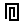</a> | **📂 檔名:** `attachment.svg` ✨ **格式:** `Vector (SVG)` ⚖️ **大小:** `445.00B` 📅 **更新:** `2026-03-01`  🚀 **jsDelivr Markdown:** `` 🔗 **直接連結 (Url):** <code>https://cdn.jsdelivr.net/gh/barry028/materials@main/images/Resumes/Px%20Group/attachment.svg</code> 📥 [檢視原始檔](attachment.svg) |
|  | **📂 檔名:** `attention.svg` ✨ **格式:** `Vector (SVG)` ⚖️ **大小:** `730.00B` 📅 **更新:** `2026-03-01`  🚀 **jsDelivr Markdown:** `` 🔗 **直接連結 (Url):** <code>https://cdn.jsdelivr.net/gh/barry028/materials@main/images/Resumes/Px%20Group/attention.svg</code> 📥 [檢視原始檔](attention.svg) |
|  | **📂 檔名:** `back.svg` ✨ **格式:** `Vector (SVG)` ⚖️ **大小:** `492.00B` 📅 **更新:** `2026-03-01`  🚀 **jsDelivr Markdown:** `` 🔗 **直接連結 (Url):** <code>https://cdn.jsdelivr.net/gh/barry028/materials@main/images/Resumes/Px%20Group/back.svg</code> 📥 [檢視原始檔](back.svg) |
| <a href="backburger.svg">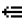</a> | **📂 檔名:** `backburger.svg` ✨ **格式:** `Vector (SVG)` ⚖️ **大小:** `580.00B` 📅 **更新:** `2026-03-01`  🚀 **jsDelivr Markdown:** `` 🔗 **直接連結 (Url):** <code>https://cdn.jsdelivr.net/gh/barry028/materials@main/images/Resumes/Px%20Group/backburger.svg</code> 📥 [檢視原始檔](backburger.svg) |
|  | **📂 檔名:** `bag.svg` ✨ **格式:** `Vector (SVG)` ⚖️ **大小:** `507.00B` 📅 **更新:** `2026-03-01`  🚀 **jsDelivr Markdown:** `` 🔗 **直接連結 (Url):** <code>https://cdn.jsdelivr.net/gh/barry028/materials@main/images/Resumes/Px%20Group/bag.svg</code> 📥 [檢視原始檔](bag.svg) |
|  | **📂 檔名:** `battery-1.svg` ✨ **格式:** `Vector (SVG)` ⚖️ **大小:** `574.00B` 📅 **更新:** `2026-03-01`  🚀 **jsDelivr Markdown:** `` 🔗 **直接連結 (Url):** <code>https://cdn.jsdelivr.net/gh/barry028/materials@main/images/Resumes/Px%20Group/battery-1.svg</code> 📥 [檢視原始檔](battery-1.svg) |
|  | **📂 檔名:** `battery.svg` ✨ **格式:** `Vector (SVG)` ⚖️ **大小:** `423.00B` 📅 **更新:** `2026-03-01`  🚀 **jsDelivr Markdown:** `` 🔗 **直接連結 (Url):** <code>https://cdn.jsdelivr.net/gh/barry028/materials@main/images/Resumes/Px%20Group/battery.svg</code> 📥 [檢視原始檔](battery.svg) |
|  | **📂 檔名:** `beauty-mirror.svg` ✨ **格式:** `Vector (SVG)` ⚖️ **大小:** `1.75KB` 📅 **更新:** `2026-03-01`  🚀 **jsDelivr Markdown:** `` 🔗 **直接連結 (Url):** <code>https://cdn.jsdelivr.net/gh/barry028/materials@main/images/Resumes/Px%20Group/beauty-mirror.svg</code> 📥 [檢視原始檔](beauty-mirror.svg) |
|  | **📂 檔名:** `block-person.svg` ✨ **格式:** `Vector (SVG)` ⚖️ **大小:** `755.00B` 📅 **更新:** `2026-03-01`  🚀 **jsDelivr Markdown:** `` 🔗 **直接連結 (Url):** <code>https://cdn.jsdelivr.net/gh/barry028/materials@main/images/Resumes/Px%20Group/block-person.svg</code> 📥 [檢視原始檔](block-person.svg) |
|  | **📂 檔名:** `block.svg` ✨ **格式:** `Vector (SVG)` ⚖️ **大小:** `559.00B` 📅 **更新:** `2026-03-01`  🚀 **jsDelivr Markdown:** `` 🔗 **直接連結 (Url):** <code>https://cdn.jsdelivr.net/gh/barry028/materials@main/images/Resumes/Px%20Group/block.svg</code> 📥 [檢視原始檔](block.svg) |
|  | **📂 檔名:** `bold.svg` ✨ **格式:** `Vector (SVG)` ⚖️ **大小:** `466.00B` 📅 **更新:** `2026-03-01`  🚀 **jsDelivr Markdown:** `` 🔗 **直接連結 (Url):** <code>https://cdn.jsdelivr.net/gh/barry028/materials@main/images/Resumes/Px%20Group/bold.svg</code> 📥 [檢視原始檔](bold.svg) |
|  | **📂 檔名:** `bookmark.svg` ✨ **格式:** `Vector (SVG)` ⚖️ **大小:** `520.00B` 📅 **更新:** `2026-03-01`  🚀 **jsDelivr Markdown:** `` 🔗 **直接連結 (Url):** <code>https://cdn.jsdelivr.net/gh/barry028/materials@main/images/Resumes/Px%20Group/bookmark.svg</code> 📥 [檢視原始檔](bookmark.svg) |
|  | **📂 檔名:** `box-outer-light-dashed-all.svg` ✨ **格式:** `Vector (SVG)` ⚖️ **大小:** `805.00B` 📅 **更新:** `2026-03-01`  🚀 **jsDelivr Markdown:** `` 🔗 **直接連結 (Url):** <code>https://cdn.jsdelivr.net/gh/barry028/materials@main/images/Resumes/Px%20Group/box-outer-light-dashed-all.svg</code> 📥 [檢視原始檔](box-outer-light-dashed-all.svg) |
|  | **📂 檔名:** `briefcase-1.svg` ✨ **格式:** `Vector (SVG)` ⚖️ **大小:** `473.00B` 📅 **更新:** `2026-03-01`  🚀 **jsDelivr Markdown:** `` 🔗 **直接連結 (Url):** <code>https://cdn.jsdelivr.net/gh/barry028/materials@main/images/Resumes/Px%20Group/briefcase-1.svg</code> 📥 [檢視原始檔](briefcase-1.svg) |
|  | **📂 檔名:** `briefcase-account.svg` ✨ **格式:** `Vector (SVG)` ⚖️ **大小:** `498.00B` 📅 **更新:** `2026-03-01`  🚀 **jsDelivr Markdown:** `` 🔗 **直接連結 (Url):** <code>https://cdn.jsdelivr.net/gh/barry028/materials@main/images/Resumes/Px%20Group/briefcase-account.svg</code> 📥 [檢視原始檔](briefcase-account.svg) |
|  | **📂 檔名:** `briefcase-check.svg` ✨ **格式:** `Vector (SVG)` ⚖️ **大小:** `519.00B` 📅 **更新:** `2026-03-01`  🚀 **jsDelivr Markdown:** `` 🔗 **直接連結 (Url):** <code>https://cdn.jsdelivr.net/gh/barry028/materials@main/images/Resumes/Px%20Group/briefcase-check.svg</code> 📥 [檢視原始檔](briefcase-check.svg) |
|  | **📂 檔名:** `briefcase-delete.svg` ✨ **格式:** `Vector (SVG)` ⚖️ **大小:** `523.00B` 📅 **更新:** `2026-03-01`  🚀 **jsDelivr Markdown:** `` 🔗 **直接連結 (Url):** <code>https://cdn.jsdelivr.net/gh/barry028/materials@main/images/Resumes/Px%20Group/briefcase-delete.svg</code> 📥 [檢視原始檔](briefcase-delete.svg) |
|  | **📂 檔名:** `briefcase-download.svg` ✨ **格式:** `Vector (SVG)` ⚖️ **大小:** `532.00B` 📅 **更新:** `2026-03-01`  🚀 **jsDelivr Markdown:** `` 🔗 **直接連結 (Url):** <code>https://cdn.jsdelivr.net/gh/barry028/materials@main/images/Resumes/Px%20Group/briefcase-download.svg</code> 📥 [檢視原始檔](briefcase-download.svg) |
|  | **📂 檔名:** `briefcase-minus.svg` ✨ **格式:** `Vector (SVG)` ⚖️ **大小:** `477.00B` 📅 **更新:** `2026-03-01`  🚀 **jsDelivr Markdown:** `` 🔗 **直接連結 (Url):** <code>https://cdn.jsdelivr.net/gh/barry028/materials@main/images/Resumes/Px%20Group/briefcase-minus.svg</code> 📥 [檢視原始檔](briefcase-minus.svg) |
|  | **📂 檔名:** `briefcase-plus.svg` ✨ **格式:** `Vector (SVG)` ⚖️ **大小:** `494.00B` 📅 **更新:** `2026-03-01`  🚀 **jsDelivr Markdown:** `` 🔗 **直接連結 (Url):** <code>https://cdn.jsdelivr.net/gh/barry028/materials@main/images/Resumes/Px%20Group/briefcase-plus.svg</code> 📥 [檢視原始檔](briefcase-plus.svg) |
|  | **📂 檔名:** `briefcase-search.svg` ✨ **格式:** `Vector (SVG)` ⚖️ **大小:** `506.00B` 📅 **更新:** `2026-03-01`  🚀 **jsDelivr Markdown:** `` 🔗 **直接連結 (Url):** <code>https://cdn.jsdelivr.net/gh/barry028/materials@main/images/Resumes/Px%20Group/briefcase-search.svg</code> 📥 [檢視原始檔](briefcase-search.svg) |
|  | **📂 檔名:** `briefcase-upload.svg` ✨ **格式:** `Vector (SVG)` ⚖️ **大小:** `525.00B` 📅 **更新:** `2026-03-01`  🚀 **jsDelivr Markdown:** `` 🔗 **直接連結 (Url):** <code>https://cdn.jsdelivr.net/gh/barry028/materials@main/images/Resumes/Px%20Group/briefcase-upload.svg</code> 📥 [檢視原始檔](briefcase-upload.svg) |
|  | **📂 檔名:** `briefcase.svg` ✨ **格式:** `Vector (SVG)` ⚖️ **大小:** `445.00B` 📅 **更新:** `2026-03-01`  🚀 **jsDelivr Markdown:** `` 🔗 **直接連結 (Url):** <code>https://cdn.jsdelivr.net/gh/barry028/materials@main/images/Resumes/Px%20Group/briefcase.svg</code> 📥 [檢視原始檔](briefcase.svg) |
|  | **📂 檔名:** `bubble.svg` ✨ **格式:** `Vector (SVG)` ⚖️ **大小:** `575.00B` 📅 **更新:** `2026-03-01`  🚀 **jsDelivr Markdown:** `` 🔗 **直接連結 (Url):** <code>https://cdn.jsdelivr.net/gh/barry028/materials@main/images/Resumes/Px%20Group/bubble.svg</code> 📥 [檢視原始檔](bubble.svg) |
|  | **📂 檔名:** `build.svg` ✨ **格式:** `Vector (SVG)` ⚖️ **大小:** `543.00B` 📅 **更新:** `2026-03-01`  🚀 **jsDelivr Markdown:** `` 🔗 **直接連結 (Url):** <code>https://cdn.jsdelivr.net/gh/barry028/materials@main/images/Resumes/Px%20Group/build.svg</code> 📥 [檢視原始檔](build.svg) |
| <a href="business-money-coin-currency.svg">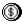</a> | **📂 檔名:** `business-money-coin-currency.svg` ✨ **格式:** `Vector (SVG)` ⚖️ **大小:** `4.50KB` 📅 **更新:** `2026-03-01`  🚀 **jsDelivr Markdown:** `` 🔗 **直接連結 (Url):** <code>https://cdn.jsdelivr.net/gh/barry028/materials@main/images/Resumes/Px%20Group/business-money-coin-currency.svg</code> 📥 [檢視原始檔](business-money-coin-currency.svg) |
|  | **📂 檔名:** `business-prodect-diamond.svg` ✨ **格式:** `Vector (SVG)` ⚖️ **大小:** `4.73KB` 📅 **更新:** `2026-03-01`  🚀 **jsDelivr Markdown:** `` 🔗 **直接連結 (Url):** <code>https://cdn.jsdelivr.net/gh/barry028/materials@main/images/Resumes/Px%20Group/business-prodect-diamond.svg</code> 📥 [檢視原始檔](business-prodect-diamond.svg) |
|  | **📂 檔名:** `business-product-startup.svg` ✨ **格式:** `Vector (SVG)` ⚖️ **大小:** `4.23KB` 📅 **更新:** `2026-03-01`  🚀 **jsDelivr Markdown:** `` 🔗 **直接連結 (Url):** <code>https://cdn.jsdelivr.net/gh/barry028/materials@main/images/Resumes/Px%20Group/business-product-startup.svg</code> 📥 [檢視原始檔](business-product-startup.svg) |
|  | **📂 檔名:** `business-products-cash-user-man-message.svg` ✨ **格式:** `Vector (SVG)` ⚖️ **大小:** `3.73KB` 📅 **更新:** `2026-03-01`  🚀 **jsDelivr Markdown:** `` 🔗 **直接連結 (Url):** <code>https://cdn.jsdelivr.net/gh/barry028/materials@main/images/Resumes/Px%20Group/business-products-cash-user-man-message.svg</code> 📥 [檢視原始檔](business-products-cash-user-man-message.svg) |
|  | **📂 檔名:** `calendar-1.svg` ✨ **格式:** `Vector (SVG)` ⚖️ **大小:** `968.00B` 📅 **更新:** `2026-03-01`  🚀 **jsDelivr Markdown:** `` 🔗 **直接連結 (Url):** <code>https://cdn.jsdelivr.net/gh/barry028/materials@main/images/Resumes/Px%20Group/calendar-1.svg</code> 📥 [檢視原始檔](calendar-1.svg) |
|  | **📂 檔名:** `calendar-alert.svg` ✨ **格式:** `Vector (SVG)` ⚖️ **大小:** `500.00B` 📅 **更新:** `2026-03-01`  🚀 **jsDelivr Markdown:** `` 🔗 **直接連結 (Url):** <code>https://cdn.jsdelivr.net/gh/barry028/materials@main/images/Resumes/Px%20Group/calendar-alert.svg</code> 📥 [檢視原始檔](calendar-alert.svg) |
|  | **📂 檔名:** `calendar-arrow-left.svg` ✨ **格式:** `Vector (SVG)` ⚖️ **大小:** `537.00B` 📅 **更新:** `2026-03-01`  🚀 **jsDelivr Markdown:** `` 🔗 **直接連結 (Url):** <code>https://cdn.jsdelivr.net/gh/barry028/materials@main/images/Resumes/Px%20Group/calendar-arrow-left.svg</code> 📥 [檢視原始檔](calendar-arrow-left.svg) |
|  | **📂 檔名:** `calendar-arrow-right.svg` ✨ **格式:** `Vector (SVG)` ⚖️ **大小:** `548.00B` 📅 **更新:** `2026-03-01`  🚀 **jsDelivr Markdown:** `` 🔗 **直接連結 (Url):** <code>https://cdn.jsdelivr.net/gh/barry028/materials@main/images/Resumes/Px%20Group/calendar-arrow-right.svg</code> 📥 [檢視原始檔](calendar-arrow-right.svg) |
|  | **📂 檔名:** `calendar-check.svg` ✨ **格式:** `Vector (SVG)` ⚖️ **大小:** `645.00B` 📅 **更新:** `2026-03-01`  🚀 **jsDelivr Markdown:** `` 🔗 **直接連結 (Url):** <code>https://cdn.jsdelivr.net/gh/barry028/materials@main/images/Resumes/Px%20Group/calendar-check.svg</code> 📥 [檢視原始檔](calendar-check.svg) |
|  | **📂 檔名:** `calendar-export.svg` ✨ **格式:** `Vector (SVG)` ⚖️ **大小:** `534.00B` 📅 **更新:** `2026-03-01`  🚀 **jsDelivr Markdown:** `` 🔗 **直接連結 (Url):** <code>https://cdn.jsdelivr.net/gh/barry028/materials@main/images/Resumes/Px%20Group/calendar-export.svg</code> 📥 [檢視原始檔](calendar-export.svg) |
|  | **📂 檔名:** `calendar-grid.svg` ✨ **格式:** `Vector (SVG)` ⚖️ **大小:** `511.00B` 📅 **更新:** `2026-03-01`  🚀 **jsDelivr Markdown:** `` 🔗 **直接連結 (Url):** <code>https://cdn.jsdelivr.net/gh/barry028/materials@main/images/Resumes/Px%20Group/calendar-grid.svg</code> 📥 [檢視原始檔](calendar-grid.svg) |
|  | **📂 檔名:** `calendar-import.svg` ✨ **格式:** `Vector (SVG)` ⚖️ **大小:** `542.00B` 📅 **更新:** `2026-03-01`  🚀 **jsDelivr Markdown:** `` 🔗 **直接連結 (Url):** <code>https://cdn.jsdelivr.net/gh/barry028/materials@main/images/Resumes/Px%20Group/calendar-import.svg</code> 📥 [檢視原始檔](calendar-import.svg) |
|  | **📂 檔名:** `calendar-minus.svg` ✨ **格式:** `Vector (SVG)` ⚖️ **大小:** `574.00B` 📅 **更新:** `2026-03-01`  🚀 **jsDelivr Markdown:** `` 🔗 **直接連結 (Url):** <code>https://cdn.jsdelivr.net/gh/barry028/materials@main/images/Resumes/Px%20Group/calendar-minus.svg</code> 📥 [檢視原始檔](calendar-minus.svg) |
|  | **📂 檔名:** `calendar-month.svg` ✨ **格式:** `Vector (SVG)` ⚖️ **大小:** `544.00B` 📅 **更新:** `2026-03-01`  🚀 **jsDelivr Markdown:** `` 🔗 **直接連結 (Url):** <code>https://cdn.jsdelivr.net/gh/barry028/materials@main/images/Resumes/Px%20Group/calendar-month.svg</code> 📥 [檢視原始檔](calendar-month.svg) |
|  | **📂 檔名:** `calendar-multiple-check.svg` ✨ **格式:** `Vector (SVG)` ⚖️ **大小:** `566.00B` 📅 **更新:** `2026-03-01`  🚀 **jsDelivr Markdown:** `` 🔗 **直接連結 (Url):** <code>https://cdn.jsdelivr.net/gh/barry028/materials@main/images/Resumes/Px%20Group/calendar-multiple-check.svg</code> 📥 [檢視原始檔](calendar-multiple-check.svg) |
|  | **📂 檔名:** `calendar-multiple.svg` ✨ **格式:** `Vector (SVG)` ⚖️ **大小:** `606.00B` 📅 **更新:** `2026-03-01`  🚀 **jsDelivr Markdown:** `` 🔗 **直接連結 (Url):** <code>https://cdn.jsdelivr.net/gh/barry028/materials@main/images/Resumes/Px%20Group/calendar-multiple.svg</code> 📥 [檢視原始檔](calendar-multiple.svg) |
|  | **📂 檔名:** `calendar-plus.svg` ✨ **格式:** `Vector (SVG)` ⚖️ **大小:** `501.00B` 📅 **更新:** `2026-03-01`  🚀 **jsDelivr Markdown:** `` 🔗 **直接連結 (Url):** <code>https://cdn.jsdelivr.net/gh/barry028/materials@main/images/Resumes/Px%20Group/calendar-plus.svg</code> 📥 [檢視原始檔](calendar-plus.svg) |
|  | **📂 檔名:** `calendar-range.svg` ✨ **格式:** `Vector (SVG)` ⚖️ **大小:** `629.00B` 📅 **更新:** `2026-03-01`  🚀 **jsDelivr Markdown:** `` 🔗 **直接連結 (Url):** <code>https://cdn.jsdelivr.net/gh/barry028/materials@main/images/Resumes/Px%20Group/calendar-range.svg</code> 📥 [檢視原始檔](calendar-range.svg) |
|  | **📂 檔名:** `calendar-remove.svg` ✨ **格式:** `Vector (SVG)` ⚖️ **大小:** `536.00B` 📅 **更新:** `2026-03-01`  🚀 **jsDelivr Markdown:** `` 🔗 **直接連結 (Url):** <code>https://cdn.jsdelivr.net/gh/barry028/materials@main/images/Resumes/Px%20Group/calendar-remove.svg</code> 📥 [檢視原始檔](calendar-remove.svg) |
|  | **📂 檔名:** `calendar-search.svg` ✨ **格式:** `Vector (SVG)` ⚖️ **大小:** `679.00B` 📅 **更新:** `2026-03-01`  🚀 **jsDelivr Markdown:** `` 🔗 **直接連結 (Url):** <code>https://cdn.jsdelivr.net/gh/barry028/materials@main/images/Resumes/Px%20Group/calendar-search.svg</code> 📥 [檢視原始檔](calendar-search.svg) |
| <a href="calendar-sort-ascending.svg">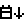</a> | **📂 檔名:** `calendar-sort-ascending.svg` ✨ **格式:** `Vector (SVG)` ⚖️ **大小:** `546.00B` 📅 **更新:** `2026-03-01`  🚀 **jsDelivr Markdown:** `` 🔗 **直接連結 (Url):** <code>https://cdn.jsdelivr.net/gh/barry028/materials@main/images/Resumes/Px%20Group/calendar-sort-ascending.svg</code> 📥 [檢視原始檔](calendar-sort-ascending.svg) |
|  | **📂 檔名:** `calendar-sort-descending.svg` ✨ **格式:** `Vector (SVG)` ⚖️ **大小:** `557.00B` 📅 **更新:** `2026-03-01`  🚀 **jsDelivr Markdown:** `` 🔗 **直接連結 (Url):** <code>https://cdn.jsdelivr.net/gh/barry028/materials@main/images/Resumes/Px%20Group/calendar-sort-descending.svg</code> 📥 [檢視原始檔](calendar-sort-descending.svg) |
|  | **📂 檔名:** `calendar-text.svg` ✨ **格式:** `Vector (SVG)` ⚖️ **大小:** `493.00B` 📅 **更新:** `2026-03-01`  🚀 **jsDelivr Markdown:** `` 🔗 **直接連結 (Url):** <code>https://cdn.jsdelivr.net/gh/barry028/materials@main/images/Resumes/Px%20Group/calendar-text.svg</code> 📥 [檢視原始檔](calendar-text.svg) |
|  | **📂 檔名:** `calendar-weekend.svg` ✨ **格式:** `Vector (SVG)` ⚖️ **大小:** `581.00B` 📅 **更新:** `2026-03-01`  🚀 **jsDelivr Markdown:** `` 🔗 **直接連結 (Url):** <code>https://cdn.jsdelivr.net/gh/barry028/materials@main/images/Resumes/Px%20Group/calendar-weekend.svg</code> 📥 [檢視原始檔](calendar-weekend.svg) |
|  | **📂 檔名:** `calendar.svg` ✨ **格式:** `Vector (SVG)` ⚖️ **大小:** `515.00B` 📅 **更新:** `2026-03-01`  🚀 **jsDelivr Markdown:** `` 🔗 **直接連結 (Url):** <code>https://cdn.jsdelivr.net/gh/barry028/materials@main/images/Resumes/Px%20Group/calendar.svg</code> 📥 [檢視原始檔](calendar.svg) |
|  | **📂 檔名:** `calendrectangletomorrow.svg` ✨ **格式:** `Vector (SVG)` ⚖️ **大小:** `643.00B` 📅 **更新:** `2026-03-01`  🚀 **jsDelivr Markdown:** `` 🔗 **直接連結 (Url):** <code>https://cdn.jsdelivr.net/gh/barry028/materials@main/images/Resumes/Px%20Group/calendrectangletomorrow.svg</code> 📥 [檢視原始檔](calendrectangletomorrow.svg) |
|  | **📂 檔名:** `call-On.svg` ✨ **格式:** `Vector (SVG)` ⚖️ **大小:** `615.00B` 📅 **更新:** `2026-03-01`  🚀 **jsDelivr Markdown:** `` 🔗 **直接連結 (Url):** <code>https://cdn.jsdelivr.net/gh/barry028/materials@main/images/Resumes/Px%20Group/call-On.svg</code> 📥 [檢視原始檔](call-On.svg) |
|  | **📂 檔名:** `calls-Add.svg` ✨ **格式:** `Vector (SVG)` ⚖️ **大小:** `773.00B` 📅 **更新:** `2026-03-01`  🚀 **jsDelivr Markdown:** `` 🔗 **直接連結 (Url):** <code>https://cdn.jsdelivr.net/gh/barry028/materials@main/images/Resumes/Px%20Group/calls-Add.svg</code> 📥 [檢視原始檔](calls-Add.svg) |
|  | **📂 檔名:** `calls-delete.svg` ✨ **格式:** `Vector (SVG)` ⚖️ **大小:** `761.00B` 📅 **更新:** `2026-03-01`  🚀 **jsDelivr Markdown:** `` 🔗 **直接連結 (Url):** <code>https://cdn.jsdelivr.net/gh/barry028/materials@main/images/Resumes/Px%20Group/calls-delete.svg</code> 📥 [檢視原始檔](calls-delete.svg) |
|  | **📂 檔名:** `calls.svg` ✨ **格式:** `Vector (SVG)` ⚖️ **大小:** `640.00B` 📅 **更新:** `2026-03-01`  🚀 **jsDelivr Markdown:** `` 🔗 **直接連結 (Url):** <code>https://cdn.jsdelivr.net/gh/barry028/materials@main/images/Resumes/Px%20Group/calls.svg</code> 📥 [檢視原始檔](calls.svg) |
|  | **📂 檔名:** `camara.svg` ✨ **格式:** `Vector (SVG)` ⚖️ **大小:** `501.00B` 📅 **更新:** `2026-03-01`  🚀 **jsDelivr Markdown:** `` 🔗 **直接連結 (Url):** <code>https://cdn.jsdelivr.net/gh/barry028/materials@main/images/Resumes/Px%20Group/camara.svg</code> 📥 [檢視原始檔](camara.svg) |
|  | **📂 檔名:** `card-id.svg` ✨ **格式:** `Vector (SVG)` ⚖️ **大小:** `471.00B` 📅 **更新:** `2026-03-01`  🚀 **jsDelivr Markdown:** `` 🔗 **直接連結 (Url):** <code>https://cdn.jsdelivr.net/gh/barry028/materials@main/images/Resumes/Px%20Group/card-id.svg</code> 📥 [檢視原始檔](card-id.svg) |
|  | **📂 檔名:** `card-stack.svg` ✨ **格式:** `Vector (SVG)` ⚖️ **大小:** `440.00B` 📅 **更新:** `2026-03-01`  🚀 **jsDelivr Markdown:** `` 🔗 **直接連結 (Url):** <code>https://cdn.jsdelivr.net/gh/barry028/materials@main/images/Resumes/Px%20Group/card-stack.svg</code> 📥 [檢視原始檔](card-stack.svg) |
|  | **📂 檔名:** `card-text.svg` ✨ **格式:** `Vector (SVG)` ⚖️ **大小:** `449.00B` 📅 **更新:** `2026-03-01`  🚀 **jsDelivr Markdown:** `` 🔗 **直接連結 (Url):** <code>https://cdn.jsdelivr.net/gh/barry028/materials@main/images/Resumes/Px%20Group/card-text.svg</code> 📥 [檢視原始檔](card-text.svg) |
|  | **📂 檔名:** `cart-1.svg` ✨ **格式:** `Vector (SVG)` ⚖️ **大小:** `521.00B` 📅 **更新:** `2026-03-01`  🚀 **jsDelivr Markdown:** `` 🔗 **直接連結 (Url):** <code>https://cdn.jsdelivr.net/gh/barry028/materials@main/images/Resumes/Px%20Group/cart-1.svg</code> 📥 [檢視原始檔](cart-1.svg) |
| <a href="cart-2.svg">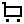</a> | **📂 檔名:** `cart-2.svg` ✨ **格式:** `Vector (SVG)` ⚖️ **大小:** `459.00B` 📅 **更新:** `2026-03-01`  🚀 **jsDelivr Markdown:** `` 🔗 **直接連結 (Url):** <code>https://cdn.jsdelivr.net/gh/barry028/materials@main/images/Resumes/Px%20Group/cart-2.svg</code> 📥 [檢視原始檔](cart-2.svg) |
|  | **📂 檔名:** `cart.svg` ✨ **格式:** `Vector (SVG)` ⚖️ **大小:** `667.00B` 📅 **更新:** `2026-03-01`  🚀 **jsDelivr Markdown:** `` 🔗 **直接連結 (Url):** <code>https://cdn.jsdelivr.net/gh/barry028/materials@main/images/Resumes/Px%20Group/cart.svg</code> 📥 [檢視原始檔](cart.svg) |
|  | **📂 檔名:** `cast.svg` ✨ **格式:** `Vector (SVG)` ⚖️ **大小:** `465.00B` 📅 **更新:** `2026-03-01`  🚀 **jsDelivr Markdown:** `` 🔗 **直接連結 (Url):** <code>https://cdn.jsdelivr.net/gh/barry028/materials@main/images/Resumes/Px%20Group/cast.svg</code> 📥 [檢視原始檔](cast.svg) |
|  | **📂 檔名:** `chart-delete.svg` ✨ **格式:** `Vector (SVG)` ⚖️ **大小:** `527.00B` 📅 **更新:** `2026-03-01`  🚀 **jsDelivr Markdown:** `` 🔗 **直接連結 (Url):** <code>https://cdn.jsdelivr.net/gh/barry028/materials@main/images/Resumes/Px%20Group/chart-delete.svg</code> 📥 [檢視原始檔](chart-delete.svg) |
|  | **📂 檔名:** `chart-minus.svg` ✨ **格式:** `Vector (SVG)` ⚖️ **大小:** `480.00B` 📅 **更新:** `2026-03-01`  🚀 **jsDelivr Markdown:** `` 🔗 **直接連結 (Url):** <code>https://cdn.jsdelivr.net/gh/barry028/materials@main/images/Resumes/Px%20Group/chart-minus.svg</code> 📥 [檢視原始檔](chart-minus.svg) |
|  | **📂 檔名:** `chat-1.svg` ✨ **格式:** `Vector (SVG)` ⚖️ **大小:** `497.00B` 📅 **更新:** `2026-03-01`  🚀 **jsDelivr Markdown:** `` 🔗 **直接連結 (Url):** <code>https://cdn.jsdelivr.net/gh/barry028/materials@main/images/Resumes/Px%20Group/chat-1.svg</code> 📥 [檢視原始檔](chat-1.svg) |
|  | **📂 檔名:** `chat-email.svg` ✨ **格式:** `Vector (SVG)` ⚖️ **大小:** `3.10KB` 📅 **更新:** `2026-03-01`  🚀 **jsDelivr Markdown:** `` 🔗 **直接連結 (Url):** <code>https://cdn.jsdelivr.net/gh/barry028/materials@main/images/Resumes/Px%20Group/chat-email.svg</code> 📥 [檢視原始檔](chat-email.svg) |
|  | **📂 檔名:** `chat.svg` ✨ **格式:** `Vector (SVG)` ⚖️ **大小:** `497.00B` 📅 **更新:** `2026-03-01`  🚀 **jsDelivr Markdown:** `` 🔗 **直接連結 (Url):** <code>https://cdn.jsdelivr.net/gh/barry028/materials@main/images/Resumes/Px%20Group/chat.svg</code> 📥 [檢視原始檔](chat.svg) |
|  | **📂 檔名:** `check-double.svg` ✨ **格式:** `Vector (SVG)` ⚖️ **大小:** `827.00B` 📅 **更新:** `2026-03-01`  🚀 **jsDelivr Markdown:** `` 🔗 **直接連結 (Url):** <code>https://cdn.jsdelivr.net/gh/barry028/materials@main/images/Resumes/Px%20Group/check-double.svg</code> 📥 [檢視原始檔](check-double.svg) |
|  | **📂 檔名:** `check.svg` ✨ **格式:** `Vector (SVG)` ⚖️ **大小:** `561.00B` 📅 **更新:** `2026-03-01`  🚀 **jsDelivr Markdown:** `` 🔗 **直接連結 (Url):** <code>https://cdn.jsdelivr.net/gh/barry028/materials@main/images/Resumes/Px%20Group/check.svg</code> 📥 [檢視原始檔](check.svg) |
|  | **📂 檔名:** `checkbox orectangle.svg` ✨ **格式:** `Vector (SVG)` ⚖️ **大小:** `502.00B` 📅 **更新:** `2026-03-01`  🚀 **jsDelivr Markdown:** `` 🔗 **直接連結 (Url):** <code>https://cdn.jsdelivr.net/gh/barry028/materials@main/images/Resumes/Px%20Group/checkbox%20orectangle.svg</code> 📥 [檢視原始檔](checkbox%20orectangle.svg) |
|  | **📂 檔名:** `checkbox.svg` ✨ **格式:** `Vector (SVG)` ⚖️ **大小:** `587.00B` 📅 **更新:** `2026-03-01`  🚀 **jsDelivr Markdown:** `` 🔗 **直接連結 (Url):** <code>https://cdn.jsdelivr.net/gh/barry028/materials@main/images/Resumes/Px%20Group/checkbox.svg</code> 📥 [檢視原始檔](checkbox.svg) |
|  | **📂 檔名:** `chess.svg` ✨ **格式:** `Vector (SVG)` ⚖️ **大小:** `480.00B` 📅 **更新:** `2026-03-01`  🚀 **jsDelivr Markdown:** `` 🔗 **直接連結 (Url):** <code>https://cdn.jsdelivr.net/gh/barry028/materials@main/images/Resumes/Px%20Group/chess.svg</code> 📥 [檢視原始檔](chess.svg) |
|  | **📂 檔名:** `chevron-right.svg` ✨ **格式:** `Vector (SVG)` ⚖️ **大小:** `495.00B` 📅 **更新:** `2026-03-01`  🚀 **jsDelivr Markdown:** `` 🔗 **直接連結 (Url):** <code>https://cdn.jsdelivr.net/gh/barry028/materials@main/images/Resumes/Px%20Group/chevron-right.svg</code> 📥 [檢視原始檔](chevron-right.svg) |
|  | **📂 檔名:** `chevrorectangledown.svg` ✨ **格式:** `Vector (SVG)` ⚖️ **大小:** `631.00B` 📅 **更新:** `2026-03-01`  🚀 **jsDelivr Markdown:** `` 🔗 **直接連結 (Url):** <code>https://cdn.jsdelivr.net/gh/barry028/materials@main/images/Resumes/Px%20Group/chevrorectangledown.svg</code> 📥 [檢視原始檔](chevrorectangledown.svg) |
|  | **📂 檔名:** `chevrorectangleleft.svg` ✨ **格式:** `Vector (SVG)` ⚖️ **大小:** `661.00B` 📅 **更新:** `2026-03-01`  🚀 **jsDelivr Markdown:** `` 🔗 **直接連結 (Url):** <code>https://cdn.jsdelivr.net/gh/barry028/materials@main/images/Resumes/Px%20Group/chevrorectangleleft.svg</code> 📥 [檢視原始檔](chevrorectangleleft.svg) |
|  | **📂 檔名:** `chevrorectangletop.svg` ✨ **格式:** `Vector (SVG)` ⚖️ **大小:** `586.00B` 📅 **更新:** `2026-03-01`  🚀 **jsDelivr Markdown:** `` 🔗 **直接連結 (Url):** <code>https://cdn.jsdelivr.net/gh/barry028/materials@main/images/Resumes/Px%20Group/chevrorectangletop.svg</code> 📥 [檢視原始檔](chevrorectangletop.svg) |
|  | **📂 檔名:** `chip-svgrepo-com.svg` ✨ **格式:** `Vector (SVG)` ⚖️ **大小:** `695.00B` 📅 **更新:** `2026-03-01`  🚀 **jsDelivr Markdown:** `` 🔗 **直接連結 (Url):** <code>https://cdn.jsdelivr.net/gh/barry028/materials@main/images/Resumes/Px%20Group/chip-svgrepo-com.svg</code> 📥 [檢視原始檔](chip-svgrepo-com.svg) |
|  | **📂 檔名:** `circle.svg` ✨ **格式:** `Vector (SVG)` ⚖️ **大小:** `468.00B` 📅 **更新:** `2026-03-01`  🚀 **jsDelivr Markdown:** `` 🔗 **直接連結 (Url):** <code>https://cdn.jsdelivr.net/gh/barry028/materials@main/images/Resumes/Px%20Group/circle.svg</code> 📥 [檢視原始檔](circle.svg) |
|  | **📂 檔名:** `clipboard.svg` ✨ **格式:** `Vector (SVG)` ⚖️ **大小:** `457.00B` 📅 **更新:** `2026-03-01`  🚀 **jsDelivr Markdown:** `` 🔗 **直接連結 (Url):** <code>https://cdn.jsdelivr.net/gh/barry028/materials@main/images/Resumes/Px%20Group/clipboard.svg</code> 📥 [檢視原始檔](clipboard.svg) |
|  | **📂 檔名:** `clock-1.svg` ✨ **格式:** `Vector (SVG)` ⚖️ **大小:** `657.00B` 📅 **更新:** `2026-03-01`  🚀 **jsDelivr Markdown:** `` 🔗 **直接連結 (Url):** <code>https://cdn.jsdelivr.net/gh/barry028/materials@main/images/Resumes/Px%20Group/clock-1.svg</code> 📥 [檢視原始檔](clock-1.svg) |
|  | **📂 檔名:** `clock.svg` ✨ **格式:** `Vector (SVG)` ⚖️ **大小:** `540.00B` 📅 **更新:** `2026-03-01`  🚀 **jsDelivr Markdown:** `` 🔗 **直接連結 (Url):** <code>https://cdn.jsdelivr.net/gh/barry028/materials@main/images/Resumes/Px%20Group/clock.svg</code> 📥 [檢視原始檔](clock.svg) |
|  | **📂 檔名:** `close.svg` ✨ **格式:** `Vector (SVG)` ⚖️ **大小:** `525.00B` 📅 **更新:** `2026-03-01`  🚀 **jsDelivr Markdown:** `` 🔗 **直接連結 (Url):** <code>https://cdn.jsdelivr.net/gh/barry028/materials@main/images/Resumes/Px%20Group/close.svg</code> 📥 [檢視原始檔](close.svg) |
|  | **📂 檔名:** `cloud-1.svg` ✨ **格式:** `Vector (SVG)` ⚖️ **大小:** `629.00B` 📅 **更新:** `2026-03-01`  🚀 **jsDelivr Markdown:** `` 🔗 **直接連結 (Url):** <code>https://cdn.jsdelivr.net/gh/barry028/materials@main/images/Resumes/Px%20Group/cloud-1.svg</code> 📥 [檢視原始檔](cloud-1.svg) |
|  | **📂 檔名:** `cloud-download-1.svg` ✨ **格式:** `Vector (SVG)` ⚖️ **大小:** `751.00B` 📅 **更新:** `2026-03-01`  🚀 **jsDelivr Markdown:** `` 🔗 **直接連結 (Url):** <code>https://cdn.jsdelivr.net/gh/barry028/materials@main/images/Resumes/Px%20Group/cloud-download-1.svg</code> 📥 [檢視原始檔](cloud-download-1.svg) |
|  | **📂 檔名:** `cloud-download.svg` ✨ **格式:** `Vector (SVG)` ⚖️ **大小:** `754.00B` 📅 **更新:** `2026-03-01`  🚀 **jsDelivr Markdown:** `` 🔗 **直接連結 (Url):** <code>https://cdn.jsdelivr.net/gh/barry028/materials@main/images/Resumes/Px%20Group/cloud-download.svg</code> 📥 [檢視原始檔](cloud-download.svg) |
|  | **📂 檔名:** `cloud.svg` ✨ **格式:** `Vector (SVG)` ⚖️ **大小:** `640.00B` 📅 **更新:** `2026-03-01`  🚀 **jsDelivr Markdown:** `` 🔗 **直接連結 (Url):** <code>https://cdn.jsdelivr.net/gh/barry028/materials@main/images/Resumes/Px%20Group/cloud.svg</code> 📥 [檢視原始檔](cloud.svg) |
|  | **📂 檔名:** `code-variable.svg` ✨ **格式:** `Vector (SVG)` ⚖️ **大小:** `481.00B` 📅 **更新:** `2026-03-01`  🚀 **jsDelivr Markdown:** `` 🔗 **直接連結 (Url):** <code>https://cdn.jsdelivr.net/gh/barry028/materials@main/images/Resumes/Px%20Group/code-variable.svg</code> 📥 [檢視原始檔](code-variable.svg) |
|  | **📂 檔名:** `code.svg` ✨ **格式:** `Vector (SVG)` ⚖️ **大小:** `551.00B` 📅 **更新:** `2026-03-01`  🚀 **jsDelivr Markdown:** `` 🔗 **直接連結 (Url):** <code>https://cdn.jsdelivr.net/gh/barry028/materials@main/images/Resumes/Px%20Group/code.svg</code> 📥 [檢視原始檔](code.svg) |
|  | **📂 檔名:** `coding-app-website-ui.svg` ✨ **格式:** `Vector (SVG)` ⚖️ **大小:** `2.23KB` 📅 **更新:** `2026-03-01`  🚀 **jsDelivr Markdown:** `` 🔗 **直接連結 (Url):** <code>https://cdn.jsdelivr.net/gh/barry028/materials@main/images/Resumes/Px%20Group/coding-app-website-ui.svg</code> 📥 [檢視原始檔](coding-app-website-ui.svg) |
|  | **📂 檔名:** `coding-apps-websites-module.svg` ✨ **格式:** `Vector (SVG)` ⚖️ **大小:** `3.33KB` 📅 **更新:** `2026-03-01`  🚀 **jsDelivr Markdown:** `` 🔗 **直接連結 (Url):** <code>https://cdn.jsdelivr.net/gh/barry028/materials@main/images/Resumes/Px%20Group/coding-apps-websites-module.svg</code> 📥 [檢視原始檔](coding-apps-websites-module.svg) |
|  | **📂 檔名:** `coding-apps-websites-plugin.svg` ✨ **格式:** `Vector (SVG)` ⚖️ **大小:** `2.29KB` 📅 **更新:** `2026-03-01`  🚀 **jsDelivr Markdown:** `` 🔗 **直接連結 (Url):** <code>https://cdn.jsdelivr.net/gh/barry028/materials@main/images/Resumes/Px%20Group/coding-apps-websites-plugin.svg</code> 📥 [檢視原始檔](coding-apps-websites-plugin.svg) |
|  | **📂 檔名:** `coffee-1.svg` ✨ **格式:** `Vector (SVG)` ⚖️ **大小:** `622.00B` 📅 **更新:** `2026-03-01`  🚀 **jsDelivr Markdown:** `` 🔗 **直接連結 (Url):** <code>https://cdn.jsdelivr.net/gh/barry028/materials@main/images/Resumes/Px%20Group/coffee-1.svg</code> 📥 [檢視原始檔](coffee-1.svg) |
|  | **📂 檔名:** `coffee.svg` ✨ **格式:** `Vector (SVG)` ⚖️ **大小:** `587.00B` 📅 **更新:** `2026-03-01`  🚀 **jsDelivr Markdown:** `` 🔗 **直接連結 (Url):** <code>https://cdn.jsdelivr.net/gh/barry028/materials@main/images/Resumes/Px%20Group/coffee.svg</code> 📥 [檢視原始檔](coffee.svg) |
|  | **📂 檔名:** `colors-swatch.svg` ✨ **格式:** `Vector (SVG)` ⚖️ **大小:** `515.00B` 📅 **更新:** `2026-03-01`  🚀 **jsDelivr Markdown:** `` 🔗 **直接連結 (Url):** <code>https://cdn.jsdelivr.net/gh/barry028/materials@main/images/Resumes/Px%20Group/colors-swatch.svg</code> 📥 [檢視原始檔](colors-swatch.svg) |
|  | **📂 檔名:** `colse.svg` ✨ **格式:** `Vector (SVG)` ⚖️ **大小:** `673.00B` 📅 **更新:** `2026-03-01`  🚀 **jsDelivr Markdown:** `` 🔗 **直接連結 (Url):** <code>https://cdn.jsdelivr.net/gh/barry028/materials@main/images/Resumes/Px%20Group/colse.svg</code> 📥 [檢視原始檔](colse.svg) |
|  | **📂 檔名:** `command.svg` ✨ **格式:** `Vector (SVG)` ⚖️ **大小:** `557.00B` 📅 **更新:** `2026-03-01`  🚀 **jsDelivr Markdown:** `` 🔗 **直接連結 (Url):** <code>https://cdn.jsdelivr.net/gh/barry028/materials@main/images/Resumes/Px%20Group/command.svg</code> 📥 [檢視原始檔](command.svg) |
|  | **📂 檔名:** `complete.svg` ✨ **格式:** `Vector (SVG)` ⚖️ **大小:** `503.00B` 📅 **更新:** `2026-03-01`  🚀 **jsDelivr Markdown:** `` 🔗 **直接連結 (Url):** <code>https://cdn.jsdelivr.net/gh/barry028/materials@main/images/Resumes/Px%20Group/complete.svg</code> 📥 [檢視原始檔](complete.svg) |
|  | **📂 檔名:** `computer-old-electronics.svg` ✨ **格式:** `Vector (SVG)` ⚖️ **大小:** `2.04KB` 📅 **更新:** `2026-03-01`  🚀 **jsDelivr Markdown:** `` 🔗 **直接連結 (Url):** <code>https://cdn.jsdelivr.net/gh/barry028/materials@main/images/Resumes/Px%20Group/computer-old-electronics.svg</code> 📥 [檢視原始檔](computer-old-electronics.svg) |
|  | **📂 檔名:** `computers-devices-electronics-tape-cassette.svg` ✨ **格式:** `Vector (SVG)` ⚖️ **大小:** `2.23KB` 📅 **更新:** `2026-03-01`  🚀 **jsDelivr Markdown:** `` 🔗 **直接連結 (Url):** <code>https://cdn.jsdelivr.net/gh/barry028/materials@main/images/Resumes/Px%20Group/computers-devices-electronics-tape-cassette.svg</code> 📥 [檢視原始檔](computers-devices-electronics-tape-cassette.svg) |
|  | **📂 檔名:** `contact-delete-1.svg` ✨ **格式:** `Vector (SVG)` ⚖️ **大小:** `734.00B` 📅 **更新:** `2026-03-01`  🚀 **jsDelivr Markdown:** `` 🔗 **直接連結 (Url):** <code>https://cdn.jsdelivr.net/gh/barry028/materials@main/images/Resumes/Px%20Group/contact-delete-1.svg</code> 📥 [檢視原始檔](contact-delete-1.svg) |
|  | **📂 檔名:** `contact-delete.svg` ✨ **格式:** `Vector (SVG)` ⚖️ **大小:** `731.00B` 📅 **更新:** `2026-03-01`  🚀 **jsDelivr Markdown:** `` 🔗 **直接連結 (Url):** <code>https://cdn.jsdelivr.net/gh/barry028/materials@main/images/Resumes/Px%20Group/contact-delete.svg</code> 📥 [檢視原始檔](contact-delete.svg) |
|  | **📂 檔名:** `content-files-archive-books.svg` ✨ **格式:** `Vector (SVG)` ⚖️ **大小:** `1.41KB` 📅 **更新:** `2026-03-01`  🚀 **jsDelivr Markdown:** `` 🔗 **直接連結 (Url):** <code>https://cdn.jsdelivr.net/gh/barry028/materials@main/images/Resumes/Px%20Group/content-files-archive-books.svg</code> 📥 [檢視原始檔](content-files-archive-books.svg) |
|  | **📂 檔名:** `content-files-close-book-bookmark.svg` ✨ **格式:** `Vector (SVG)` ⚖️ **大小:** `1.56KB` 📅 **更新:** `2026-03-01`  🚀 **jsDelivr Markdown:** `` 🔗 **直接連結 (Url):** <code>https://cdn.jsdelivr.net/gh/barry028/materials@main/images/Resumes/Px%20Group/content-files-close-book-bookmark.svg</code> 📥 [檢視原始檔](content-files-close-book-bookmark.svg) |
|  | **📂 檔名:** `content-files-newspaper.svg` ✨ **格式:** `Vector (SVG)` ⚖️ **大小:** `2.60KB` 📅 **更新:** `2026-03-01`  🚀 **jsDelivr Markdown:** `` 🔗 **直接連結 (Url):** <code>https://cdn.jsdelivr.net/gh/barry028/materials@main/images/Resumes/Px%20Group/content-files-newspaper.svg</code> 📥 [檢視原始檔](content-files-newspaper.svg) |
|  | **📂 檔名:** `content-files-pencil-brush.svg` ✨ **格式:** `Vector (SVG)` ⚖️ **大小:** `8.99KB` 📅 **更新:** `2026-03-01`  🚀 **jsDelivr Markdown:** `` 🔗 **直接連結 (Url):** <code>https://cdn.jsdelivr.net/gh/barry028/materials@main/images/Resumes/Px%20Group/content-files-pencil-brush.svg</code> 📥 [檢視原始檔](content-files-pencil-brush.svg) |
|  | **📂 檔名:** `content-files-quill-ink.svg` ✨ **格式:** `Vector (SVG)` ⚖️ **大小:** `3.27KB` 📅 **更新:** `2026-03-01`  🚀 **jsDelivr Markdown:** `` 🔗 **直接連結 (Url):** <code>https://cdn.jsdelivr.net/gh/barry028/materials@main/images/Resumes/Px%20Group/content-files-quill-ink.svg</code> 📥 [檢視原始檔](content-files-quill-ink.svg) |
|  | **📂 檔名:** `copy-document.svg` ✨ **格式:** `Vector (SVG)` ⚖️ **大小:** `634.00B` 📅 **更新:** `2026-03-01`  🚀 **jsDelivr Markdown:** `` 🔗 **直接連結 (Url):** <code>https://cdn.jsdelivr.net/gh/barry028/materials@main/images/Resumes/Px%20Group/copy-document.svg</code> 📥 [檢視原始檔](copy-document.svg) |
|  | **📂 檔名:** `copy-folder.svg` ✨ **格式:** `Vector (SVG)` ⚖️ **大小:** `655.00B` 📅 **更新:** `2026-03-01`  🚀 **jsDelivr Markdown:** `` 🔗 **直接連結 (Url):** <code>https://cdn.jsdelivr.net/gh/barry028/materials@main/images/Resumes/Px%20Group/copy-folder.svg</code> 📥 [檢視原始檔](copy-folder.svg) |
| <a href="copy.svg">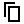</a> | **📂 檔名:** `copy.svg` ✨ **格式:** `Vector (SVG)` ⚖️ **大小:** `437.00B` 📅 **更新:** `2026-03-01`  🚀 **jsDelivr Markdown:** `` 🔗 **直接連結 (Url):** <code>https://cdn.jsdelivr.net/gh/barry028/materials@main/images/Resumes/Px%20Group/copy.svg</code> 📥 [檢視原始檔](copy.svg) |
| <a href="corner-down-right.svg">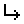</a> | **📂 檔名:** `corner-down-right.svg` ✨ **格式:** `Vector (SVG)` ⚖️ **大小:** `489.00B` 📅 **更新:** `2026-03-01`  🚀 **jsDelivr Markdown:** `` 🔗 **直接連結 (Url):** <code>https://cdn.jsdelivr.net/gh/barry028/materials@main/images/Resumes/Px%20Group/corner-down-right.svg</code> 📥 [檢視原始檔](corner-down-right.svg) |
| <a href="corner-left-down.svg">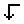</a> | **📂 檔名:** `corner-left-down.svg` ✨ **格式:** `Vector (SVG)` ⚖️ **大小:** `486.00B` 📅 **更新:** `2026-03-01`  🚀 **jsDelivr Markdown:** `` 🔗 **直接連結 (Url):** <code>https://cdn.jsdelivr.net/gh/barry028/materials@main/images/Resumes/Px%20Group/corner-left-down.svg</code> 📥 [檢視原始檔](corner-left-down.svg) |
| <a href="corner-left-up.svg">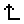</a> | **📂 檔名:** `corner-left-up.svg` ✨ **格式:** `Vector (SVG)` ⚖️ **大小:** `476.00B` 📅 **更新:** `2026-03-01`  🚀 **jsDelivr Markdown:** `` 🔗 **直接連結 (Url):** <code>https://cdn.jsdelivr.net/gh/barry028/materials@main/images/Resumes/Px%20Group/corner-left-up.svg</code> 📥 [檢視原始檔](corner-left-up.svg) |
| <a href="corner-right-down.svg">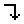</a> | **📂 檔名:** `corner-right-down.svg` ✨ **格式:** `Vector (SVG)` ⚖️ **大小:** `493.00B` 📅 **更新:** `2026-03-01`  🚀 **jsDelivr Markdown:** `` 🔗 **直接連結 (Url):** <code>https://cdn.jsdelivr.net/gh/barry028/materials@main/images/Resumes/Px%20Group/corner-right-down.svg</code> 📥 [檢視原始檔](corner-right-down.svg) |
| <a href="corner-up-left.svg">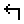</a> | **📂 檔名:** `corner-up-left.svg` ✨ **格式:** `Vector (SVG)` ⚖️ **大小:** `473.00B` 📅 **更新:** `2026-03-01`  🚀 **jsDelivr Markdown:** `` 🔗 **直接連結 (Url):** <code>https://cdn.jsdelivr.net/gh/barry028/materials@main/images/Resumes/Px%20Group/corner-up-left.svg</code> 📥 [檢視原始檔](corner-up-left.svg) |
|  | **📂 檔名:** `create-document.svg` ✨ **格式:** `Vector (SVG)` ⚖️ **大小:** `632.00B` 📅 **更新:** `2026-03-01`  🚀 **jsDelivr Markdown:** `` 🔗 **直接連結 (Url):** <code>https://cdn.jsdelivr.net/gh/barry028/materials@main/images/Resumes/Px%20Group/create-document.svg</code> 📥 [檢視原始檔](create-document.svg) |
|  | **📂 檔名:** `create-folder.svg` ✨ **格式:** `Vector (SVG)` ⚖️ **大小:** `610.00B` 📅 **更新:** `2026-03-01`  🚀 **jsDelivr Markdown:** `` 🔗 **直接連結 (Url):** <code>https://cdn.jsdelivr.net/gh/barry028/materials@main/images/Resumes/Px%20Group/create-folder.svg</code> 📥 [檢視原始檔](create-folder.svg) |
|  | **📂 檔名:** `credit-card-delete.svg` ✨ **格式:** `Vector (SVG)` ⚖️ **大小:** `523.00B` 📅 **更新:** `2026-03-01`  🚀 **jsDelivr Markdown:** `` 🔗 **直接連結 (Url):** <code>https://cdn.jsdelivr.net/gh/barry028/materials@main/images/Resumes/Px%20Group/credit-card-delete.svg</code> 📥 [檢視原始檔](credit-card-delete.svg) |
| <a href="crop.svg">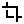</a> | **📂 檔名:** `crop.svg` ✨ **格式:** `Vector (SVG)` ⚖️ **大小:** `434.00B` 📅 **更新:** `2026-03-01`  🚀 **jsDelivr Markdown:** `` 🔗 **直接連結 (Url):** <code>https://cdn.jsdelivr.net/gh/barry028/materials@main/images/Resumes/Px%20Group/crop.svg</code> 📥 [檢視原始檔](crop.svg) |
| <a href="crossing-1.svg">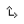</a> | **📂 檔名:** `crossing-1.svg` ✨ **格式:** `Vector (SVG)` ⚖️ **大小:** `779.00B` 📅 **更新:** `2026-03-01`  🚀 **jsDelivr Markdown:** `` 🔗 **直接連結 (Url):** <code>https://cdn.jsdelivr.net/gh/barry028/materials@main/images/Resumes/Px%20Group/crossing-1.svg</code> 📥 [檢視原始檔](crossing-1.svg) |
|  | **📂 檔名:** `crossing-2.svg` ✨ **格式:** `Vector (SVG)` ⚖️ **大小:** `816.00B` 📅 **更新:** `2026-03-01`  🚀 **jsDelivr Markdown:** `` 🔗 **直接連結 (Url):** <code>https://cdn.jsdelivr.net/gh/barry028/materials@main/images/Resumes/Px%20Group/crossing-2.svg</code> 📥 [檢視原始檔](crossing-2.svg) |
|  | **📂 檔名:** `crossing.svg` ✨ **格式:** `Vector (SVG)` ⚖️ **大小:** `743.00B` 📅 **更新:** `2026-03-01`  🚀 **jsDelivr Markdown:** `` 🔗 **直接連結 (Url):** <code>https://cdn.jsdelivr.net/gh/barry028/materials@main/images/Resumes/Px%20Group/crossing.svg</code> 📥 [檢視原始檔](crossing.svg) |
|  | **📂 檔名:** `crown.svg` ✨ **格式:** `Vector (SVG)` ⚖️ **大小:** `762.00B` 📅 **更新:** `2026-03-01`  🚀 **jsDelivr Markdown:** `` 🔗 **直接連結 (Url):** <code>https://cdn.jsdelivr.net/gh/barry028/materials@main/images/Resumes/Px%20Group/crown.svg</code> 📥 [檢視原始檔](crown.svg) |
|  | **📂 檔名:** `cut.svg` ✨ **格式:** `Vector (SVG)` ⚖️ **大小:** `527.00B` 📅 **更新:** `2026-03-01`  🚀 **jsDelivr Markdown:** `` 🔗 **直接連結 (Url):** <code>https://cdn.jsdelivr.net/gh/barry028/materials@main/images/Resumes/Px%20Group/cut.svg</code> 📥 [檢視原始檔](cut.svg) |
| <a href="dashbaord.svg">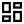</a> | **📂 檔名:** `dashbaord.svg` ✨ **格式:** `Vector (SVG)` ⚖️ **大小:** `657.00B` 📅 **更新:** `2026-03-01`  🚀 **jsDelivr Markdown:** `` 🔗 **直接連結 (Url):** <code>https://cdn.jsdelivr.net/gh/barry028/materials@main/images/Resumes/Px%20Group/dashbaord.svg</code> 📥 [檢視原始檔](dashbaord.svg) |
| <a href="delete-bookmark.svg">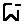</a> | **📂 檔名:** `delete-bookmark.svg` ✨ **格式:** `Vector (SVG)` ⚖️ **大小:** `628.00B` 📅 **更新:** `2026-03-01`  🚀 **jsDelivr Markdown:** `` 🔗 **直接連結 (Url):** <code>https://cdn.jsdelivr.net/gh/barry028/materials@main/images/Resumes/Px%20Group/delete-bookmark.svg</code> 📥 [檢視原始檔](delete-bookmark.svg) |
|  | **📂 檔名:** `delete-folder.svg` ✨ **格式:** `Vector (SVG)` ⚖️ **大小:** `593.00B` 📅 **更新:** `2026-03-01`  🚀 **jsDelivr Markdown:** `` 🔗 **直接連結 (Url):** <code>https://cdn.jsdelivr.net/gh/barry028/materials@main/images/Resumes/Px%20Group/delete-folder.svg</code> 📥 [檢視原始檔](delete-folder.svg) |
|  | **📂 檔名:** `delete-message.svg` ✨ **格式:** `Vector (SVG)` ⚖️ **大小:** `629.00B` 📅 **更新:** `2026-03-01`  🚀 **jsDelivr Markdown:** `` 🔗 **直接連結 (Url):** <code>https://cdn.jsdelivr.net/gh/barry028/materials@main/images/Resumes/Px%20Group/delete-message.svg</code> 📥 [檢視原始檔](delete-message.svg) |
|  | **📂 檔名:** `delete-person.svg` ✨ **格式:** `Vector (SVG)` ⚖️ **大小:** `722.00B` 📅 **更新:** `2026-03-01`  🚀 **jsDelivr Markdown:** `` 🔗 **直接連結 (Url):** <code>https://cdn.jsdelivr.net/gh/barry028/materials@main/images/Resumes/Px%20Group/delete-person.svg</code> 📥 [檢視原始檔](delete-person.svg) |
|  | **📂 檔名:** `delete.svg` ✨ **格式:** `Vector (SVG)` ⚖️ **大小:** `615.00B` 📅 **更新:** `2026-03-01`  🚀 **jsDelivr Markdown:** `` 🔗 **直接連結 (Url):** <code>https://cdn.jsdelivr.net/gh/barry028/materials@main/images/Resumes/Px%20Group/delete.svg</code> 📥 [檢視原始檔](delete.svg) |
|  | **📂 檔名:** `design-color-painting-palette.svg` ✨ **格式:** `Vector (SVG)` ⚖️ **大小:** `4.53KB` 📅 **更新:** `2026-03-01`  🚀 **jsDelivr Markdown:** `` 🔗 **直接連結 (Url):** <code>https://cdn.jsdelivr.net/gh/barry028/materials@main/images/Resumes/Px%20Group/design-color-painting-palette.svg</code> 📥 [檢視原始檔](design-color-painting-palette.svg) |
| <a href="design-color-spray.svg">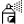</a> | **📂 檔名:** `design-color-spray.svg` ✨ **格式:** `Vector (SVG)` ⚖️ **大小:** `3.84KB` 📅 **更新:** `2026-03-01`  🚀 **jsDelivr Markdown:** `` 🔗 **直接連結 (Url):** <code>https://cdn.jsdelivr.net/gh/barry028/materials@main/images/Resumes/Px%20Group/design-color-spray.svg</code> 📥 [檢視原始檔](design-color-spray.svg) |
|  | **📂 檔名:** `deskphone.svg` ✨ **格式:** `Vector (SVG)` ⚖️ **大小:** `490.00B` 📅 **更新:** `2026-03-01`  🚀 **jsDelivr Markdown:** `` 🔗 **直接連結 (Url):** <code>https://cdn.jsdelivr.net/gh/barry028/materials@main/images/Resumes/Px%20Group/deskphone.svg</code> 📥 [檢視原始檔](deskphone.svg) |
|  | **📂 檔名:** `device-tablet.svg` ✨ **格式:** `Vector (SVG)` ⚖️ **大小:** `451.00B` 📅 **更新:** `2026-03-01`  🚀 **jsDelivr Markdown:** `` 🔗 **直接連結 (Url):** <code>https://cdn.jsdelivr.net/gh/barry028/materials@main/images/Resumes/Px%20Group/device-tablet.svg</code> 📥 [檢視原始檔](device-tablet.svg) |
|  | **📂 檔名:** `devices.svg` ✨ **格式:** `Vector (SVG)` ⚖️ **大小:** `487.00B` 📅 **更新:** `2026-03-01`  🚀 **jsDelivr Markdown:** `` 🔗 **直接連結 (Url):** <code>https://cdn.jsdelivr.net/gh/barry028/materials@main/images/Resumes/Px%20Group/devices.svg</code> 📥 [檢視原始檔](devices.svg) |
|  | **📂 檔名:** `diary.svg` ✨ **格式:** `Vector (SVG)` ⚖️ **大小:** `500.00B` 📅 **更新:** `2026-03-01`  🚀 **jsDelivr Markdown:** `` 🔗 **直接連結 (Url):** <code>https://cdn.jsdelivr.net/gh/barry028/materials@main/images/Resumes/Px%20Group/diary.svg</code> 📥 [檢視原始檔](diary.svg) |
| <a href="direction.svg">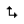</a> | **📂 檔名:** `direction.svg` ✨ **格式:** `Vector (SVG)` ⚖️ **大小:** `638.00B` 📅 **更新:** `2026-03-01`  🚀 **jsDelivr Markdown:** `` 🔗 **直接連結 (Url):** <code>https://cdn.jsdelivr.net/gh/barry028/materials@main/images/Resumes/Px%20Group/direction.svg</code> 📥 [檢視原始檔](direction.svg) |
|  | **📂 檔名:** `document.svg` ✨ **格式:** `Vector (SVG)` ⚖️ **大小:** `499.00B` 📅 **更新:** `2026-03-01`  🚀 **jsDelivr Markdown:** `` 🔗 **直接連結 (Url):** <code>https://cdn.jsdelivr.net/gh/barry028/materials@main/images/Resumes/Px%20Group/document.svg</code> 📥 [檢視原始檔](document.svg) |
|  | **📂 檔名:** `down-arrow.svg` ✨ **格式:** `Vector (SVG)` ⚖️ **大小:** `461.00B` 📅 **更新:** `2026-03-01`  🚀 **jsDelivr Markdown:** `` 🔗 **直接連結 (Url):** <code>https://cdn.jsdelivr.net/gh/barry028/materials@main/images/Resumes/Px%20Group/down-arrow.svg</code> 📥 [檢視原始檔](down-arrow.svg) |
|  | **📂 檔名:** `down-left_arrow.svg` ✨ **格式:** `Vector (SVG)` ⚖️ **大小:** `508.00B` 📅 **更新:** `2026-03-01`  🚀 **jsDelivr Markdown:** `` 🔗 **直接連結 (Url):** <code>https://cdn.jsdelivr.net/gh/barry028/materials@main/images/Resumes/Px%20Group/down-left_arrow.svg</code> 📥 [檢視原始檔](down-left_arrow.svg) |
|  | **📂 檔名:** `down-right_arrow.svg` ✨ **格式:** `Vector (SVG)` ⚖️ **大小:** `506.00B` 📅 **更新:** `2026-03-01`  🚀 **jsDelivr Markdown:** `` 🔗 **直接連結 (Url):** <code>https://cdn.jsdelivr.net/gh/barry028/materials@main/images/Resumes/Px%20Group/down-right_arrow.svg</code> 📥 [檢視原始檔](down-right_arrow.svg) |
|  | **📂 檔名:** `downasaur.svg` ✨ **格式:** `Vector (SVG)` ⚖️ **大小:** `454.00B` 📅 **更新:** `2026-03-01`  🚀 **jsDelivr Markdown:** `` 🔗 **直接連結 (Url):** <code>https://cdn.jsdelivr.net/gh/barry028/materials@main/images/Resumes/Px%20Group/downasaur.svg</code> 📥 [檢視原始檔](downasaur.svg) |
|  | **📂 檔名:** `download-1.svg` ✨ **格式:** `Vector (SVG)` ⚖️ **大小:** `711.00B` 📅 **更新:** `2026-03-01`  🚀 **jsDelivr Markdown:** `` 🔗 **直接連結 (Url):** <code>https://cdn.jsdelivr.net/gh/barry028/materials@main/images/Resumes/Px%20Group/download-1.svg</code> 📥 [檢視原始檔](download-1.svg) |
|  | **📂 檔名:** `download-2.svg` ✨ **格式:** `Vector (SVG)` ⚖️ **大小:** `661.00B` 📅 **更新:** `2026-03-01`  🚀 **jsDelivr Markdown:** `` 🔗 **直接連結 (Url):** <code>https://cdn.jsdelivr.net/gh/barry028/materials@main/images/Resumes/Px%20Group/download-2.svg</code> 📥 [檢視原始檔](download-2.svg) |
|  | **📂 檔名:** `download-3.svg` ✨ **格式:** `Vector (SVG)` ⚖️ **大小:** `613.00B` 📅 **更新:** `2026-03-01`  🚀 **jsDelivr Markdown:** `` 🔗 **直接連結 (Url):** <code>https://cdn.jsdelivr.net/gh/barry028/materials@main/images/Resumes/Px%20Group/download-3.svg</code> 📥 [檢視原始檔](download-3.svg) |
|  | **📂 檔名:** `download.svg` ✨ **格式:** `Vector (SVG)` ⚖️ **大小:** `678.00B` 📅 **更新:** `2026-03-01`  🚀 **jsDelivr Markdown:** `` 🔗 **直接連結 (Url):** <code>https://cdn.jsdelivr.net/gh/barry028/materials@main/images/Resumes/Px%20Group/download.svg</code> 📥 [檢視原始檔](download.svg) |
|  | **📂 檔名:** `downloading.svg` ✨ **格式:** `Vector (SVG)` ⚖️ **大小:** `584.00B` 📅 **更新:** `2026-03-01`  🚀 **jsDelivr Markdown:** `` 🔗 **直接連結 (Url):** <code>https://cdn.jsdelivr.net/gh/barry028/materials@main/images/Resumes/Px%20Group/downloading.svg</code> 📥 [檢視原始檔](downloading.svg) |
|  | **📂 檔名:** `draft.svg` ✨ **格式:** `Vector (SVG)` ⚖️ **大小:** `528.00B` 📅 **更新:** `2026-03-01`  🚀 **jsDelivr Markdown:** `` 🔗 **直接連結 (Url):** <code>https://cdn.jsdelivr.net/gh/barry028/materials@main/images/Resumes/Px%20Group/draft.svg</code> 📥 [檢視原始檔](draft.svg) |
|  | **📂 檔名:** `drag-and-drop.svg` ✨ **格式:** `Vector (SVG)` ⚖️ **大小:** `754.00B` 📅 **更新:** `2026-03-01`  🚀 **jsDelivr Markdown:** `` 🔗 **直接連結 (Url):** <code>https://cdn.jsdelivr.net/gh/barry028/materials@main/images/Resumes/Px%20Group/drag-and-drop.svg</code> 📥 [檢視原始檔](drag-and-drop.svg) |
|  | **📂 檔名:** `drop-half.svg` ✨ **格式:** `Vector (SVG)` ⚖️ **大小:** `481.00B` 📅 **更新:** `2026-03-01`  🚀 **jsDelivr Markdown:** `` 🔗 **直接連結 (Url):** <code>https://cdn.jsdelivr.net/gh/barry028/materials@main/images/Resumes/Px%20Group/drop-half.svg</code> 📥 [檢視原始檔](drop-half.svg) |
|  | **📂 檔名:** `duplicate-alt.svg` ✨ **格式:** `Vector (SVG)` ⚖️ **大小:** `649.00B` 📅 **更新:** `2026-03-01`  🚀 **jsDelivr Markdown:** `` 🔗 **直接連結 (Url):** <code>https://cdn.jsdelivr.net/gh/barry028/materials@main/images/Resumes/Px%20Group/duplicate-alt.svg</code> 📥 [檢視原始檔](duplicate-alt.svg) |
|  | **📂 檔名:** `duplicate.svg` ✨ **格式:** `Vector (SVG)` ⚖️ **大小:** `529.00B` 📅 **更新:** `2026-03-01`  🚀 **jsDelivr Markdown:** `` 🔗 **直接連結 (Url):** <code>https://cdn.jsdelivr.net/gh/barry028/materials@main/images/Resumes/Px%20Group/duplicate.svg</code> 📥 [檢視原始檔](duplicate.svg) |
|  | **📂 檔名:** `ecology-clean-battery.svg` ✨ **格式:** `Vector (SVG)` ⚖️ **大小:** `3.26KB` 📅 **更新:** `2026-03-01`  🚀 **jsDelivr Markdown:** `` 🔗 **直接連結 (Url):** <code>https://cdn.jsdelivr.net/gh/barry028/materials@main/images/Resumes/Px%20Group/ecology-clean-battery.svg</code> 📥 [檢視原始檔](ecology-clean-battery.svg) |
|  | **📂 檔名:** `ecology-global-warming-globe-fire.svg` ✨ **格式:** `Vector (SVG)` ⚖️ **大小:** `5.34KB` 📅 **更新:** `2026-03-01`  🚀 **jsDelivr Markdown:** `` 🔗 **直接連結 (Url):** <code>https://cdn.jsdelivr.net/gh/barry028/materials@main/images/Resumes/Px%20Group/ecology-global-warming-globe-fire.svg</code> 📥 [檢視原始檔](ecology-global-warming-globe-fire.svg) |
|  | **📂 檔名:** `ecology-plant-growth-soil-nature.svg` ✨ **格式:** `Vector (SVG)` ⚖️ **大小:** `6.47KB` 📅 **更新:** `2026-03-01`  🚀 **jsDelivr Markdown:** `` 🔗 **直接連結 (Url):** <code>https://cdn.jsdelivr.net/gh/barry028/materials@main/images/Resumes/Px%20Group/ecology-plant-growth-soil-nature.svg</code> 📥 [檢視原始檔](ecology-plant-growth-soil-nature.svg) |
|  | **📂 檔名:** `edit-1.svg` ✨ **格式:** `Vector (SVG)` ⚖️ **大小:** `646.00B` 📅 **更新:** `2026-03-01`  🚀 **jsDelivr Markdown:** `` 🔗 **直接連結 (Url):** <code>https://cdn.jsdelivr.net/gh/barry028/materials@main/images/Resumes/Px%20Group/edit-1.svg</code> 📥 [檢視原始檔](edit-1.svg) |
|  | **📂 檔名:** `edit.svg` ✨ **格式:** `Vector (SVG)` ⚖️ **大小:** `565.00B` 📅 **更新:** `2026-03-01`  🚀 **jsDelivr Markdown:** `` 🔗 **直接連結 (Url):** <code>https://cdn.jsdelivr.net/gh/barry028/materials@main/images/Resumes/Px%20Group/edit.svg</code> 📥 [檢視原始檔](edit.svg) |
|  | **📂 檔名:** `email-envelope.svg` ✨ **格式:** `Vector (SVG)` ⚖️ **大小:** `1.73KB` 📅 **更新:** `2026-03-01`  🚀 **jsDelivr Markdown:** `` 🔗 **直接連結 (Url):** <code>https://cdn.jsdelivr.net/gh/barry028/materials@main/images/Resumes/Px%20Group/email-envelope.svg</code> 📥 [檢視原始檔](email-envelope.svg) |
|  | **📂 檔名:** `email-mail-open-address.svg` ✨ **格式:** `Vector (SVG)` ⚖️ **大小:** `4.04KB` 📅 **更新:** `2026-03-01`  🚀 **jsDelivr Markdown:** `` 🔗 **直接連結 (Url):** <code>https://cdn.jsdelivr.net/gh/barry028/materials@main/images/Resumes/Px%20Group/email-mail-open-address.svg</code> 📥 [檢視原始檔](email-mail-open-address.svg) |
|  | **📂 檔名:** `email-stamp-mail.svg` ✨ **格式:** `Vector (SVG)` ⚖️ **大小:** `2.87KB` 📅 **更新:** `2026-03-01`  🚀 **jsDelivr Markdown:** `` 🔗 **直接連結 (Url):** <code>https://cdn.jsdelivr.net/gh/barry028/materials@main/images/Resumes/Px%20Group/email-stamp-mail.svg</code> 📥 [檢視原始檔](email-stamp-mail.svg) |
|  | **📂 檔名:** `entertainment-events-hobbies-film-player.svg` ✨ **格式:** `Vector (SVG)` ⚖️ **大小:** `1.50KB` 📅 **更新:** `2026-03-01`  🚀 **jsDelivr Markdown:** `` 🔗 **直接連結 (Url):** <code>https://cdn.jsdelivr.net/gh/barry028/materials@main/images/Resumes/Px%20Group/entertainment-events-hobbies-film-player.svg</code> 📥 [檢視原始檔](entertainment-events-hobbies-film-player.svg) |
| <a href="expand-1.svg">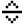</a> | **📂 檔名:** `expand-1.svg` ✨ **格式:** `Vector (SVG)` ⚖️ **大小:** `588.00B` 📅 **更新:** `2026-03-01`  🚀 **jsDelivr Markdown:** `` 🔗 **直接連結 (Url):** <code>https://cdn.jsdelivr.net/gh/barry028/materials@main/images/Resumes/Px%20Group/expand-1.svg</code> 📥 [檢視原始檔](expand-1.svg) |
| <a href="expand.svg">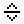</a> | **📂 檔名:** `expand.svg` ✨ **格式:** `Vector (SVG)` ⚖️ **大小:** `513.00B` 📅 **更新:** `2026-03-01`  🚀 **jsDelivr Markdown:** `` 🔗 **直接連結 (Url):** <code>https://cdn.jsdelivr.net/gh/barry028/materials@main/images/Resumes/Px%20Group/expand.svg</code> 📥 [檢視原始檔](expand.svg) |
|  | **📂 檔名:** `export-1.svg` ✨ **格式:** `Vector (SVG)` ⚖️ **大小:** `703.00B` 📅 **更新:** `2026-03-01`  🚀 **jsDelivr Markdown:** `` 🔗 **直接連結 (Url):** <code>https://cdn.jsdelivr.net/gh/barry028/materials@main/images/Resumes/Px%20Group/export-1.svg</code> 📥 [檢視原始檔](export-1.svg) |
|  | **📂 檔名:** `export.svg` ✨ **格式:** `Vector (SVG)` ⚖️ **大小:** `587.00B` 📅 **更新:** `2026-03-01`  🚀 **jsDelivr Markdown:** `` 🔗 **直接連結 (Url):** <code>https://cdn.jsdelivr.net/gh/barry028/materials@main/images/Resumes/Px%20Group/export.svg</code> 📥 [檢視原始檔](export.svg) |
|  | **📂 檔名:** `external-link.svg` ✨ **格式:** `Vector (SVG)` ⚖️ **大小:** `627.00B` 📅 **更新:** `2026-03-01`  🚀 **jsDelivr Markdown:** `` 🔗 **直接連結 (Url):** <code>https://cdn.jsdelivr.net/gh/barry028/materials@main/images/Resumes/Px%20Group/external-link.svg</code> 📥 [檢視原始檔](external-link.svg) |
|  | **📂 檔名:** `eye-closed.svg` ✨ **格式:** `Vector (SVG)` ⚖️ **大小:** `670.00B` 📅 **更新:** `2026-03-01`  🚀 **jsDelivr Markdown:** `` 🔗 **直接連結 (Url):** <code>https://cdn.jsdelivr.net/gh/barry028/materials@main/images/Resumes/Px%20Group/eye-closed.svg</code> 📥 [檢視原始檔](eye-closed.svg) |
|  | **📂 檔名:** `eye.svg` ✨ **格式:** `Vector (SVG)` ⚖️ **大小:** `741.00B` 📅 **更新:** `2026-03-01`  🚀 **jsDelivr Markdown:** `` 🔗 **直接連結 (Url):** <code>https://cdn.jsdelivr.net/gh/barry028/materials@main/images/Resumes/Px%20Group/eye.svg</code> 📥 [檢視原始檔](eye.svg) |
|  | **📂 檔名:** `favorites.svg` ✨ **格式:** `Vector (SVG)` ⚖️ **大小:** `603.00B` 📅 **更新:** `2026-03-01`  🚀 **jsDelivr Markdown:** `` 🔗 **直接連結 (Url):** <code>https://cdn.jsdelivr.net/gh/barry028/materials@main/images/Resumes/Px%20Group/favorites.svg</code> 📥 [檢視原始檔](favorites.svg) |
|  | **📂 檔名:** `figma.svg` ✨ **格式:** `Vector (SVG)` ⚖️ **大小:** `1.04KB` 📅 **更新:** `2026-03-01`  🚀 **jsDelivr Markdown:** `` 🔗 **直接連結 (Url):** <code>https://cdn.jsdelivr.net/gh/barry028/materials@main/images/Resumes/Px%20Group/figma.svg</code> 📥 [檢視原始檔](figma.svg) |
|  | **📂 檔名:** `file-add.svg` ✨ **格式:** `Vector (SVG)` ⚖️ **大小:** `790.00B` 📅 **更新:** `2026-03-01`  🚀 **jsDelivr Markdown:** `` 🔗 **直接連結 (Url):** <code>https://cdn.jsdelivr.net/gh/barry028/materials@main/images/Resumes/Px%20Group/file-add.svg</code> 📥 [檢視原始檔](file-add.svg) |
|  | **📂 檔名:** `file-delete.svg` ✨ **格式:** `Vector (SVG)` ⚖️ **大小:** `514.00B` 📅 **更新:** `2026-03-01`  🚀 **jsDelivr Markdown:** `` 🔗 **直接連結 (Url):** <code>https://cdn.jsdelivr.net/gh/barry028/materials@main/images/Resumes/Px%20Group/file-delete.svg</code> 📥 [檢視原始檔](file-delete.svg) |
|  | **📂 檔名:** `file-detail.svg` ✨ **格式:** `Vector (SVG)` ⚖️ **大小:** `866.00B` 📅 **更新:** `2026-03-01`  🚀 **jsDelivr Markdown:** `` 🔗 **直接連結 (Url):** <code>https://cdn.jsdelivr.net/gh/barry028/materials@main/images/Resumes/Px%20Group/file-detail.svg</code> 📥 [檢視原始檔](file-detail.svg) |
|  | **📂 檔名:** `file-flash.svg` ✨ **格式:** `Vector (SVG)` ⚖️ **大小:** `505.00B` 📅 **更新:** `2026-03-01`  🚀 **jsDelivr Markdown:** `` 🔗 **直接連結 (Url):** <code>https://cdn.jsdelivr.net/gh/barry028/materials@main/images/Resumes/Px%20Group/file-flash.svg</code> 📥 [檢視原始檔](file-flash.svg) |
|  | **📂 檔名:** `file-minus.svg` ✨ **格式:** `Vector (SVG)` ⚖️ **大小:** `472.00B` 📅 **更新:** `2026-03-01`  🚀 **jsDelivr Markdown:** `` 🔗 **直接連結 (Url):** <code>https://cdn.jsdelivr.net/gh/barry028/materials@main/images/Resumes/Px%20Group/file-minus.svg</code> 📥 [檢視原始檔](file-minus.svg) |
|  | **📂 檔名:** `file-multiple.svg` ✨ **格式:** `Vector (SVG)` ⚖️ **大小:** `479.00B` 📅 **更新:** `2026-03-01`  🚀 **jsDelivr Markdown:** `` 🔗 **直接連結 (Url):** <code>https://cdn.jsdelivr.net/gh/barry028/materials@main/images/Resumes/Px%20Group/file-multiple.svg</code> 📥 [檢視原始檔](file-multiple.svg) |
|  | **📂 檔名:** `file-plus.svg` ✨ **格式:** `Vector (SVG)` ⚖️ **大小:** `489.00B` 📅 **更新:** `2026-03-01`  🚀 **jsDelivr Markdown:** `` 🔗 **直接連結 (Url):** <code>https://cdn.jsdelivr.net/gh/barry028/materials@main/images/Resumes/Px%20Group/file-plus.svg</code> 📥 [檢視原始檔](file-plus.svg) |
|  | **📂 檔名:** `file-remove.svg` ✨ **格式:** `Vector (SVG)` ⚖️ **大小:** `744.00B` 📅 **更新:** `2026-03-01`  🚀 **jsDelivr Markdown:** `` 🔗 **直接連結 (Url):** <code>https://cdn.jsdelivr.net/gh/barry028/materials@main/images/Resumes/Px%20Group/file-remove.svg</code> 📥 [檢視原始檔](file-remove.svg) |
|  | **📂 檔名:** `file.svg` ✨ **格式:** `Vector (SVG)` ⚖️ **大小:** `600.00B` 📅 **更新:** `2026-03-01`  🚀 **jsDelivr Markdown:** `` 🔗 **直接連結 (Url):** <code>https://cdn.jsdelivr.net/gh/barry028/materials@main/images/Resumes/Px%20Group/file.svg</code> 📥 [檢視原始檔](file.svg) |
| <a href="fill-half.svg">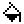</a> | **📂 檔名:** `fill-half.svg` ✨ **格式:** `Vector (SVG)` ⚖️ **大小:** `529.00B` 📅 **更新:** `2026-03-01`  🚀 **jsDelivr Markdown:** `` 🔗 **直接連結 (Url):** <code>https://cdn.jsdelivr.net/gh/barry028/materials@main/images/Resumes/Px%20Group/fill-half.svg</code> 📥 [檢視原始檔](fill-half.svg) |
| <a href="fill.svg">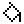</a> | **📂 檔名:** `fill.svg` ✨ **格式:** `Vector (SVG)` ⚖️ **大小:** `548.00B` 📅 **更新:** `2026-03-01`  🚀 **jsDelivr Markdown:** `` 🔗 **直接連結 (Url):** <code>https://cdn.jsdelivr.net/gh/barry028/materials@main/images/Resumes/Px%20Group/fill.svg</code> 📥 [檢視原始檔](fill.svg) |
|  | **📂 檔名:** `film.svg` ✨ **格式:** `Vector (SVG)` ⚖️ **大小:** `722.00B` 📅 **更新:** `2026-03-01`  🚀 **jsDelivr Markdown:** `` 🔗 **直接連結 (Url):** <code>https://cdn.jsdelivr.net/gh/barry028/materials@main/images/Resumes/Px%20Group/film.svg</code> 📥 [檢視原始檔](film.svg) |
| <a href="filter-1.svg">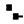</a> | **📂 檔名:** `filter-1.svg` ✨ **格式:** `Vector (SVG)` ⚖️ **大小:** `814.00B` 📅 **更新:** `2026-03-01`  🚀 **jsDelivr Markdown:** `` 🔗 **直接連結 (Url):** <code>https://cdn.jsdelivr.net/gh/barry028/materials@main/images/Resumes/Px%20Group/filter-1.svg</code> 📥 [檢視原始檔](filter-1.svg) |
|  | **📂 檔名:** `filter.svg` ✨ **格式:** `Vector (SVG)` ⚖️ **大小:** `619.00B` 📅 **更新:** `2026-03-01`  🚀 **jsDelivr Markdown:** `` 🔗 **直接連結 (Url):** <code>https://cdn.jsdelivr.net/gh/barry028/materials@main/images/Resumes/Px%20Group/filter.svg</code> 📥 [檢視原始檔](filter.svg) |
|  | **📂 檔名:** `flag-1.svg` ✨ **格式:** `Vector (SVG)` ⚖️ **大小:** `487.00B` 📅 **更新:** `2026-03-01`  🚀 **jsDelivr Markdown:** `` 🔗 **直接連結 (Url):** <code>https://cdn.jsdelivr.net/gh/barry028/materials@main/images/Resumes/Px%20Group/flag-1.svg</code> 📥 [檢視原始檔](flag-1.svg) |
|  | **📂 檔名:** `flag.svg` ✨ **格式:** `Vector (SVG)` ⚖️ **大小:** `471.00B` 📅 **更新:** `2026-03-01`  🚀 **jsDelivr Markdown:** `` 🔗 **直接連結 (Url):** <code>https://cdn.jsdelivr.net/gh/barry028/materials@main/images/Resumes/Px%20Group/flag.svg</code> 📥 [檢視原始檔](flag.svg) |
| <a href="flatten.svg">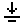</a> | **📂 檔名:** `flatten.svg` ✨ **格式:** `Vector (SVG)` ⚖️ **大小:** `470.00B` 📅 **更新:** `2026-03-01`  🚀 **jsDelivr Markdown:** `` 🔗 **直接連結 (Url):** <code>https://cdn.jsdelivr.net/gh/barry028/materials@main/images/Resumes/Px%20Group/flatten.svg</code> 📥 [檢視原始檔](flatten.svg) |
|  | **📂 檔名:** `flip.svg` ✨ **格式:** `Vector (SVG)` ⚖️ **大小:** `699.00B` 📅 **更新:** `2026-03-01`  🚀 **jsDelivr Markdown:** `` 🔗 **直接連結 (Url):** <code>https://cdn.jsdelivr.net/gh/barry028/materials@main/images/Resumes/Px%20Group/flip.svg</code> 📥 [檢視原始檔](flip.svg) |
|  | **📂 檔名:** `float-center.svg` ✨ **格式:** `Vector (SVG)` ⚖️ **大小:** `506.00B` 📅 **更新:** `2026-03-01`  🚀 **jsDelivr Markdown:** `` 🔗 **直接連結 (Url):** <code>https://cdn.jsdelivr.net/gh/barry028/materials@main/images/Resumes/Px%20Group/float-center.svg</code> 📥 [檢視原始檔](float-center.svg) |
|  | **📂 檔名:** `float-left.svg` ✨ **格式:** `Vector (SVG)` ⚖️ **大小:** `475.00B` 📅 **更新:** `2026-03-01`  🚀 **jsDelivr Markdown:** `` 🔗 **直接連結 (Url):** <code>https://cdn.jsdelivr.net/gh/barry028/materials@main/images/Resumes/Px%20Group/float-left.svg</code> 📥 [檢視原始檔](float-left.svg) |
|  | **📂 檔名:** `float-right.svg` ✨ **格式:** `Vector (SVG)` ⚖️ **大小:** `483.00B` 📅 **更新:** `2026-03-01`  🚀 **jsDelivr Markdown:** `` 🔗 **直接連結 (Url):** <code>https://cdn.jsdelivr.net/gh/barry028/materials@main/images/Resumes/Px%20Group/float-right.svg</code> 📥 [檢視原始檔](float-right.svg) |
|  | **📂 檔名:** `folder-1.svg` ✨ **格式:** `Vector (SVG)` ⚖️ **大小:** `472.00B` 📅 **更新:** `2026-03-01`  🚀 **jsDelivr Markdown:** `` 🔗 **直接連結 (Url):** <code>https://cdn.jsdelivr.net/gh/barry028/materials@main/images/Resumes/Px%20Group/folder-1.svg</code> 📥 [檢視原始檔](folder-1.svg) |
|  | **📂 檔名:** `folder-x.svg` ✨ **格式:** `Vector (SVG)` ⚖️ **大小:** `491.00B` 📅 **更新:** `2026-03-01`  🚀 **jsDelivr Markdown:** `` 🔗 **直接連結 (Url):** <code>https://cdn.jsdelivr.net/gh/barry028/materials@main/images/Resumes/Px%20Group/folder-x.svg</code> 📥 [檢視原始檔](folder-x.svg) |
|  | **📂 檔名:** `folder.svg` ✨ **格式:** `Vector (SVG)` ⚖️ **大小:** `458.00B` 📅 **更新:** `2026-03-01`  🚀 **jsDelivr Markdown:** `` 🔗 **直接連結 (Url):** <code>https://cdn.jsdelivr.net/gh/barry028/materials@main/images/Resumes/Px%20Group/folder.svg</code> 📥 [檢視原始檔](folder.svg) |
|  | **📂 檔名:** `food-drink-bread.svg` ✨ **格式:** `Vector (SVG)` ⚖️ **大小:** `2.15KB` 📅 **更新:** `2026-03-01`  🚀 **jsDelivr Markdown:** `` 🔗 **直接連結 (Url):** <code>https://cdn.jsdelivr.net/gh/barry028/materials@main/images/Resumes/Px%20Group/food-drink-bread.svg</code> 📥 [檢視原始檔](food-drink-bread.svg) |
|  | **📂 檔名:** `forward-1.svg` ✨ **格式:** `Vector (SVG)` ⚖️ **大小:** `708.00B` 📅 **更新:** `2026-03-01`  🚀 **jsDelivr Markdown:** `` 🔗 **直接連結 (Url):** <code>https://cdn.jsdelivr.net/gh/barry028/materials@main/images/Resumes/Px%20Group/forward-1.svg</code> 📥 [檢視原始檔](forward-1.svg) |
|  | **📂 檔名:** `forward.svg` ✨ **格式:** `Vector (SVG)` ⚖️ **大小:** `984.00B` 📅 **更新:** `2026-03-01`  🚀 **jsDelivr Markdown:** `` 🔗 **直接連結 (Url):** <code>https://cdn.jsdelivr.net/gh/barry028/materials@main/images/Resumes/Px%20Group/forward.svg</code> 📥 [檢視原始檔](forward.svg) |
| <a href="forwardburger.svg">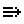</a> | **📂 檔名:** `forwardburger.svg` ✨ **格式:** `Vector (SVG)` ⚖️ **大小:** `488.00B` 📅 **更新:** `2026-03-01`  🚀 **jsDelivr Markdown:** `` 🔗 **直接連結 (Url):** <code>https://cdn.jsdelivr.net/gh/barry028/materials@main/images/Resumes/Px%20Group/forwardburger.svg</code> 📥 [檢視原始檔](forwardburger.svg) |
|  | **📂 檔名:** `foward.svg` ✨ **格式:** `Vector (SVG)` ⚖️ **大小:** `610.00B` 📅 **更新:** `2026-03-01`  🚀 **jsDelivr Markdown:** `` 🔗 **直接連結 (Url):** <code>https://cdn.jsdelivr.net/gh/barry028/materials@main/images/Resumes/Px%20Group/foward.svg</code> 📥 [檢視原始檔](foward.svg) |
|  | **📂 檔名:** `frame-add.svg` ✨ **格式:** `Vector (SVG)` ⚖️ **大小:** `459.00B` 📅 **更新:** `2026-03-01`  🚀 **jsDelivr Markdown:** `` 🔗 **直接連結 (Url):** <code>https://cdn.jsdelivr.net/gh/barry028/materials@main/images/Resumes/Px%20Group/frame-add.svg</code> 📥 [檢視原始檔](frame-add.svg) |
|  | **📂 檔名:** `frame-check.svg` ✨ **格式:** `Vector (SVG)` ⚖️ **大小:** `475.00B` 📅 **更新:** `2026-03-01`  🚀 **jsDelivr Markdown:** `` 🔗 **直接連結 (Url):** <code>https://cdn.jsdelivr.net/gh/barry028/materials@main/images/Resumes/Px%20Group/frame-check.svg</code> 📥 [檢視原始檔](frame-check.svg) |
|  | **📂 檔名:** `frame-delete.svg` ✨ **格式:** `Vector (SVG)` ⚖️ **大小:** `488.00B` 📅 **更新:** `2026-03-01`  🚀 **jsDelivr Markdown:** `` 🔗 **直接連結 (Url):** <code>https://cdn.jsdelivr.net/gh/barry028/materials@main/images/Resumes/Px%20Group/frame-delete.svg</code> 📥 [檢視原始檔](frame-delete.svg) |
|  | **📂 檔名:** `gamepad-center.svg` ✨ **格式:** `Vector (SVG)` ⚖️ **大小:** `508.00B` 📅 **更新:** `2026-03-01`  🚀 **jsDelivr Markdown:** `` 🔗 **直接連結 (Url):** <code>https://cdn.jsdelivr.net/gh/barry028/materials@main/images/Resumes/Px%20Group/gamepad-center.svg</code> 📥 [檢視原始檔](gamepad-center.svg) |
|  | **📂 檔名:** `gamepad-down-left.svg` ✨ **格式:** `Vector (SVG)` ⚖️ **大小:** `510.00B` 📅 **更新:** `2026-03-01`  🚀 **jsDelivr Markdown:** `` 🔗 **直接連結 (Url):** <code>https://cdn.jsdelivr.net/gh/barry028/materials@main/images/Resumes/Px%20Group/gamepad-down-left.svg</code> 📥 [檢視原始檔](gamepad-down-left.svg) |
|  | **📂 檔名:** `gamepad-down-right.svg` ✨ **格式:** `Vector (SVG)` ⚖️ **大小:** `515.00B` 📅 **更新:** `2026-03-01`  🚀 **jsDelivr Markdown:** `` 🔗 **直接連結 (Url):** <code>https://cdn.jsdelivr.net/gh/barry028/materials@main/images/Resumes/Px%20Group/gamepad-down-right.svg</code> 📥 [檢視原始檔](gamepad-down-right.svg) |
|  | **📂 檔名:** `gamepad-down.svg` ✨ **格式:** `Vector (SVG)` ⚖️ **大小:** `485.00B` 📅 **更新:** `2026-03-01`  🚀 **jsDelivr Markdown:** `` 🔗 **直接連結 (Url):** <code>https://cdn.jsdelivr.net/gh/barry028/materials@main/images/Resumes/Px%20Group/gamepad-down.svg</code> 📥 [檢視原始檔](gamepad-down.svg) |
|  | **📂 檔名:** `gamepad-empty.svg` ✨ **格式:** `Vector (SVG)` ⚖️ **大小:** `505.00B` 📅 **更新:** `2026-03-01`  🚀 **jsDelivr Markdown:** `` 🔗 **直接連結 (Url):** <code>https://cdn.jsdelivr.net/gh/barry028/materials@main/images/Resumes/Px%20Group/gamepad-empty.svg</code> 📥 [檢視原始檔](gamepad-empty.svg) |
|  | **📂 檔名:** `gamepad-left.svg` ✨ **格式:** `Vector (SVG)` ⚖️ **大小:** `483.00B` 📅 **更新:** `2026-03-01`  🚀 **jsDelivr Markdown:** `` 🔗 **直接連結 (Url):** <code>https://cdn.jsdelivr.net/gh/barry028/materials@main/images/Resumes/Px%20Group/gamepad-left.svg</code> 📥 [檢視原始檔](gamepad-left.svg) |
|  | **📂 檔名:** `gamepad-right.svg` ✨ **格式:** `Vector (SVG)` ⚖️ **大小:** `490.00B` 📅 **更新:** `2026-03-01`  🚀 **jsDelivr Markdown:** `` 🔗 **直接連結 (Url):** <code>https://cdn.jsdelivr.net/gh/barry028/materials@main/images/Resumes/Px%20Group/gamepad-right.svg</code> 📥 [檢視原始檔](gamepad-right.svg) |
|  | **📂 檔名:** `gamepad-up-left.svg` ✨ **格式:** `Vector (SVG)` ⚖️ **大小:** `506.00B` 📅 **更新:** `2026-03-01`  🚀 **jsDelivr Markdown:** `` 🔗 **直接連結 (Url):** <code>https://cdn.jsdelivr.net/gh/barry028/materials@main/images/Resumes/Px%20Group/gamepad-up-left.svg</code> 📥 [檢視原始檔](gamepad-up-left.svg) |
|  | **📂 檔名:** `gamepad-up-right.svg` ✨ **格式:** `Vector (SVG)` ⚖️ **大小:** `510.00B` 📅 **更新:** `2026-03-01`  🚀 **jsDelivr Markdown:** `` 🔗 **直接連結 (Url):** <code>https://cdn.jsdelivr.net/gh/barry028/materials@main/images/Resumes/Px%20Group/gamepad-up-right.svg</code> 📥 [檢視原始檔](gamepad-up-right.svg) |
|  | **📂 檔名:** `gamepad-up.svg` ✨ **格式:** `Vector (SVG)` ⚖️ **大小:** `481.00B` 📅 **更新:** `2026-03-01`  🚀 **jsDelivr Markdown:** `` 🔗 **直接連結 (Url):** <code>https://cdn.jsdelivr.net/gh/barry028/materials@main/images/Resumes/Px%20Group/gamepad-up.svg</code> 📥 [檢視原始檔](gamepad-up.svg) |
|  | **📂 檔名:** `gif.svg` ✨ **格式:** `Vector (SVG)` ⚖️ **大小:** `551.00B` 📅 **更新:** `2026-03-01`  🚀 **jsDelivr Markdown:** `` 🔗 **直接連結 (Url):** <code>https://cdn.jsdelivr.net/gh/barry028/materials@main/images/Resumes/Px%20Group/gif.svg</code> 📥 [檢視原始檔](gif.svg) |
| <a href="git-branch.svg">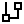</a> | **📂 檔名:** `git-branch.svg` ✨ **格式:** `Vector (SVG)` ⚖️ **大小:** `476.00B` 📅 **更新:** `2026-03-01`  🚀 **jsDelivr Markdown:** `` 🔗 **直接連結 (Url):** <code>https://cdn.jsdelivr.net/gh/barry028/materials@main/images/Resumes/Px%20Group/git-branch.svg</code> 📥 [檢視原始檔](git-branch.svg) |
|  | **📂 檔名:** `git-commit.svg` ✨ **格式:** `Vector (SVG)` ⚖️ **大小:** `445.00B` 📅 **更新:** `2026-03-01`  🚀 **jsDelivr Markdown:** `` 🔗 **直接連結 (Url):** <code>https://cdn.jsdelivr.net/gh/barry028/materials@main/images/Resumes/Px%20Group/git-commit.svg</code> 📥 [檢視原始檔](git-commit.svg) |
| <a href="git-merge.svg">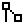</a> | **📂 檔名:** `git-merge.svg` ✨ **格式:** `Vector (SVG)` ⚖️ **大小:** `477.00B` 📅 **更新:** `2026-03-01`  🚀 **jsDelivr Markdown:** `` 🔗 **直接連結 (Url):** <code>https://cdn.jsdelivr.net/gh/barry028/materials@main/images/Resumes/Px%20Group/git-merge.svg</code> 📥 [檢視原始檔](git-merge.svg) |
|  | **📂 檔名:** `gps.svg` ✨ **格式:** `Vector (SVG)` ⚖️ **大小:** `455.00B` 📅 **更新:** `2026-03-01`  🚀 **jsDelivr Markdown:** `` 🔗 **直接連結 (Url):** <code>https://cdn.jsdelivr.net/gh/barry028/materials@main/images/Resumes/Px%20Group/gps.svg</code> 📥 [檢視原始檔](gps.svg) |
|  | **📂 檔名:** `grid.svg` ✨ **格式:** `Vector (SVG)` ⚖️ **大小:** `507.00B` 📅 **更新:** `2026-03-01`  🚀 **jsDelivr Markdown:** `` 🔗 **直接連結 (Url):** <code>https://cdn.jsdelivr.net/gh/barry028/materials@main/images/Resumes/Px%20Group/grid.svg</code> 📥 [檢視原始檔](grid.svg) |
|  | **📂 檔名:** `group.svg` ✨ **格式:** `Vector (SVG)` ⚖️ **大小:** `553.00B` 📅 **更新:** `2026-03-01`  🚀 **jsDelivr Markdown:** `` 🔗 **直接連結 (Url):** <code>https://cdn.jsdelivr.net/gh/barry028/materials@main/images/Resumes/Px%20Group/group.svg</code> 📥 [檢視原始檔](group.svg) |
|  | **📂 檔名:** `hand-awesome.svg` ✨ **格式:** `Vector (SVG)` ⚖️ **大小:** `2.38KB` 📅 **更新:** `2026-03-01`  🚀 **jsDelivr Markdown:** `` 🔗 **直接連結 (Url):** <code>https://cdn.jsdelivr.net/gh/barry028/materials@main/images/Resumes/Px%20Group/hand-awesome.svg</code> 📥 [檢視原始檔](hand-awesome.svg) |
| <a href="hand-cross-finger-heart.svg">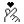</a> | **📂 檔名:** `hand-cross-finger-heart.svg` ✨ **格式:** `Vector (SVG)` ⚖️ **大小:** `4.30KB` 📅 **更新:** `2026-03-01`  🚀 **jsDelivr Markdown:** `` 🔗 **直接連結 (Url):** <code>https://cdn.jsdelivr.net/gh/barry028/materials@main/images/Resumes/Px%20Group/hand-cross-finger-heart.svg</code> 📥 [檢視原始檔](hand-cross-finger-heart.svg) |
|  | **📂 檔名:** `hand-love-sign.svg` ✨ **格式:** `Vector (SVG)` ⚖️ **大小:** `2.10KB` 📅 **更新:** `2026-03-01`  🚀 **jsDelivr Markdown:** `` 🔗 **直接連結 (Url):** <code>https://cdn.jsdelivr.net/gh/barry028/materials@main/images/Resumes/Px%20Group/hand-love-sign.svg</code> 📥 [檢視原始檔](hand-love-sign.svg) |
| <a href="hash.svg">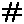</a> | **📂 檔名:** `hash.svg` ✨ **格式:** `Vector (SVG)` ⚖️ **大小:** `521.00B` 📅 **更新:** `2026-03-01`  🚀 **jsDelivr Markdown:** `` 🔗 **直接連結 (Url):** <code>https://cdn.jsdelivr.net/gh/barry028/materials@main/images/Resumes/Px%20Group/hash.svg</code> 📥 [檢視原始檔](hash.svg) |
|  | **📂 檔名:** `hd.svg` ✨ **格式:** `Vector (SVG)` ⚖️ **大小:** `443.00B` 📅 **更新:** `2026-03-01`  🚀 **jsDelivr Markdown:** `` 🔗 **直接連結 (Url):** <code>https://cdn.jsdelivr.net/gh/barry028/materials@main/images/Resumes/Px%20Group/hd.svg</code> 📥 [檢視原始檔](hd.svg) |
|  | **📂 檔名:** `headphones.svg` ✨ **格式:** `Vector (SVG)` ⚖️ **大小:** `600.00B` 📅 **更新:** `2026-03-01`  🚀 **jsDelivr Markdown:** `` 🔗 **直接連結 (Url):** <code>https://cdn.jsdelivr.net/gh/barry028/materials@main/images/Resumes/Px%20Group/headphones.svg</code> 📥 [檢視原始檔](headphones.svg) |
|  | **📂 檔名:** `health-drug-medicine-water.svg` ✨ **格式:** `Vector (SVG)` ⚖️ **大小:** `2.57KB` 📅 **更新:** `2026-03-01`  🚀 **jsDelivr Markdown:** `` 🔗 **直接連結 (Url):** <code>https://cdn.jsdelivr.net/gh/barry028/materials@main/images/Resumes/Px%20Group/health-drug-medicine-water.svg</code> 📥 [檢視原始檔](health-drug-medicine-water.svg) |
|  | **📂 檔名:** `health-drug-medicine.svg` ✨ **格式:** `Vector (SVG)` ⚖️ **大小:** `2.20KB` 📅 **更新:** `2026-03-01`  🚀 **jsDelivr Markdown:** `` 🔗 **直接連結 (Url):** <code>https://cdn.jsdelivr.net/gh/barry028/materials@main/images/Resumes/Px%20Group/health-drug-medicine.svg</code> 📥 [檢視原始檔](health-drug-medicine.svg) |
|  | **📂 檔名:** `health-drugs-pill.svg` ✨ **格式:** `Vector (SVG)` ⚖️ **大小:** `2.81KB` 📅 **更新:** `2026-03-01`  🚀 **jsDelivr Markdown:** `` 🔗 **直接連結 (Url):** <code>https://cdn.jsdelivr.net/gh/barry028/materials@main/images/Resumes/Px%20Group/health-drugs-pill.svg</code> 📥 [檢視原始檔](health-drugs-pill.svg) |
|  | **📂 檔名:** `health-laboratory-test-blood-sugar.svg` ✨ **格式:** `Vector (SVG)` ⚖️ **大小:** `7.78KB` 📅 **更新:** `2026-03-01`  🚀 **jsDelivr Markdown:** `` 🔗 **直接連結 (Url):** <code>https://cdn.jsdelivr.net/gh/barry028/materials@main/images/Resumes/Px%20Group/health-laboratory-test-blood-sugar.svg</code> 📥 [檢視原始檔](health-laboratory-test-blood-sugar.svg) |
|  | **📂 檔名:** `heart.svg` ✨ **格式:** `Vector (SVG)` ⚖️ **大小:** `652.00B` 📅 **更新:** `2026-03-01`  🚀 **jsDelivr Markdown:** `` 🔗 **直接連結 (Url):** <code>https://cdn.jsdelivr.net/gh/barry028/materials@main/images/Resumes/Px%20Group/heart.svg</code> 📥 [檢視原始檔](heart.svg) |
|  | **📂 檔名:** `hidden.svg` ✨ **格式:** `Vector (SVG)` ⚖️ **大小:** `840.00B` 📅 **更新:** `2026-03-01`  🚀 **jsDelivr Markdown:** `` 🔗 **直接連結 (Url):** <code>https://cdn.jsdelivr.net/gh/barry028/materials@main/images/Resumes/Px%20Group/hidden.svg</code> 📥 [檢視原始檔](hidden.svg) |
| <a href="hide.svg">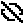</a> | **📂 檔名:** `hide.svg` ✨ **格式:** `Vector (SVG)` ⚖️ **大小:** `771.00B` 📅 **更新:** `2026-03-01`  🚀 **jsDelivr Markdown:** `` 🔗 **直接連結 (Url):** <code>https://cdn.jsdelivr.net/gh/barry028/materials@main/images/Resumes/Px%20Group/hide.svg</code> 📥 [檢視原始檔](hide.svg) |
|  | **📂 檔名:** `home-1.svg` ✨ **格式:** `Vector (SVG)` ⚖️ **大小:** `510.00B` 📅 **更新:** `2026-03-01`  🚀 **jsDelivr Markdown:** `` 🔗 **直接連結 (Url):** <code>https://cdn.jsdelivr.net/gh/barry028/materials@main/images/Resumes/Px%20Group/home-1.svg</code> 📥 [檢視原始檔](home-1.svg) |
|  | **📂 檔名:** `home.svg` ✨ **格式:** `Vector (SVG)` ⚖️ **大小:** `507.00B` 📅 **更新:** `2026-03-01`  🚀 **jsDelivr Markdown:** `` 🔗 **直接連結 (Url):** <code>https://cdn.jsdelivr.net/gh/barry028/materials@main/images/Resumes/Px%20Group/home.svg</code> 📥 [檢視原始檔](home.svg) |
|  | **📂 檔名:** `hq.svg` ✨ **格式:** `Vector (SVG)` ⚖️ **大小:** `453.00B` 📅 **更新:** `2026-03-01`  🚀 **jsDelivr Markdown:** `` 🔗 **直接連結 (Url):** <code>https://cdn.jsdelivr.net/gh/barry028/materials@main/images/Resumes/Px%20Group/hq.svg</code> 📥 [檢視原始檔](hq.svg) |
| <a href="human-height-alt.svg">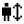</a> | **📂 檔名:** `human-height-alt.svg` ✨ **格式:** `Vector (SVG)` ⚖️ **大小:** `749.00B` 📅 **更新:** `2026-03-01`  🚀 **jsDelivr Markdown:** `` 🔗 **直接連結 (Url):** <code>https://cdn.jsdelivr.net/gh/barry028/materials@main/images/Resumes/Px%20Group/human-height-alt.svg</code> 📥 [檢視原始檔](human-height-alt.svg) |
|  | **📂 檔名:** `human.svg` ✨ **格式:** `Vector (SVG)` ⚖️ **大小:** `499.00B` 📅 **更新:** `2026-03-01`  🚀 **jsDelivr Markdown:** `` 🔗 **直接連結 (Url):** <code>https://cdn.jsdelivr.net/gh/barry028/materials@main/images/Resumes/Px%20Group/human.svg</code> 📥 [檢視原始檔](human.svg) |
|  | **📂 檔名:** `humrectanglehandsup.svg` ✨ **格式:** `Vector (SVG)` ⚖️ **大小:** `681.00B` 📅 **更新:** `2026-03-01`  🚀 **jsDelivr Markdown:** `` 🔗 **直接連結 (Url):** <code>https://cdn.jsdelivr.net/gh/barry028/materials@main/images/Resumes/Px%20Group/humrectanglehandsup.svg</code> 📥 [檢視原始檔](humrectanglehandsup.svg) |
|  | **📂 檔名:** `image-1.svg` ✨ **格式:** `Vector (SVG)` ⚖️ **大小:** `485.00B` 📅 **更新:** `2026-03-01`  🚀 **jsDelivr Markdown:** `` 🔗 **直接連結 (Url):** <code>https://cdn.jsdelivr.net/gh/barry028/materials@main/images/Resumes/Px%20Group/image-1.svg</code> 📥 [檢視原始檔](image-1.svg) |
|  | **📂 檔名:** `image-arrow-right.svg` ✨ **格式:** `Vector (SVG)` ⚖️ **大小:** `586.00B` 📅 **更新:** `2026-03-01`  🚀 **jsDelivr Markdown:** `` 🔗 **直接連結 (Url):** <code>https://cdn.jsdelivr.net/gh/barry028/materials@main/images/Resumes/Px%20Group/image-arrow-right.svg</code> 📥 [檢視原始檔](image-arrow-right.svg) |
|  | **📂 檔名:** `image-delete.svg` ✨ **格式:** `Vector (SVG)` ⚖️ **大小:** `576.00B` 📅 **更新:** `2026-03-01`  🚀 **jsDelivr Markdown:** `` 🔗 **直接連結 (Url):** <code>https://cdn.jsdelivr.net/gh/barry028/materials@main/images/Resumes/Px%20Group/image-delete.svg</code> 📥 [檢視原始檔](image-delete.svg) |
|  | **📂 檔名:** `image-flash.svg` ✨ **格式:** `Vector (SVG)` ⚖️ **大小:** `546.00B` 📅 **更新:** `2026-03-01`  🚀 **jsDelivr Markdown:** `` 🔗 **直接連結 (Url):** <code>https://cdn.jsdelivr.net/gh/barry028/materials@main/images/Resumes/Px%20Group/image-flash.svg</code> 📥 [檢視原始檔](image-flash.svg) |
|  | **📂 檔名:** `image-plus.svg` ✨ **格式:** `Vector (SVG)` ⚖️ **大小:** `536.00B` 📅 **更新:** `2026-03-01`  🚀 **jsDelivr Markdown:** `` 🔗 **直接連結 (Url):** <code>https://cdn.jsdelivr.net/gh/barry028/materials@main/images/Resumes/Px%20Group/image-plus.svg</code> 📥 [檢視原始檔](image-plus.svg) |
|  | **📂 檔名:** `insert.svg` ✨ **格式:** `Vector (SVG)` ⚖️ **大小:** `711.00B` 📅 **更新:** `2026-03-01`  🚀 **jsDelivr Markdown:** `` 🔗 **直接連結 (Url):** <code>https://cdn.jsdelivr.net/gh/barry028/materials@main/images/Resumes/Px%20Group/insert.svg</code> 📥 [檢視原始檔](insert.svg) |
|  | **📂 檔名:** `interface-essential-alert.svg` ✨ **格式:** `Vector (SVG)` ⚖️ **大小:** `6.17KB` 📅 **更新:** `2026-03-01`  🚀 **jsDelivr Markdown:** `` 🔗 **直接連結 (Url):** <code>https://cdn.jsdelivr.net/gh/barry028/materials@main/images/Resumes/Px%20Group/interface-essential-alert.svg</code> 📥 [檢視原始檔](interface-essential-alert.svg) |
|  | **📂 檔名:** `interface-essential-bookmark.svg` ✨ **格式:** `Vector (SVG)` ⚖️ **大小:** `2.04KB` 📅 **更新:** `2026-03-01`  🚀 **jsDelivr Markdown:** `` 🔗 **直接連結 (Url):** <code>https://cdn.jsdelivr.net/gh/barry028/materials@main/images/Resumes/Px%20Group/interface-essential-bookmark.svg</code> 📥 [檢視原始檔](interface-essential-bookmark.svg) |
|  | **📂 檔名:** `interface-essential-calendar-appointment.svg` ✨ **格式:** `Vector (SVG)` ⚖️ **大小:** `2.19KB` 📅 **更新:** `2026-03-01`  🚀 **jsDelivr Markdown:** `` 🔗 **直接連結 (Url):** <code>https://cdn.jsdelivr.net/gh/barry028/materials@main/images/Resumes/Px%20Group/interface-essential-calendar-appointment.svg</code> 📥 [檢視原始檔](interface-essential-calendar-appointment.svg) |
|  | **📂 檔名:** `interface-essential-clound-download.svg` ✨ **格式:** `Vector (SVG)` ⚖️ **大小:** `3.11KB` 📅 **更新:** `2026-03-01`  🚀 **jsDelivr Markdown:** `` 🔗 **直接連結 (Url):** <code>https://cdn.jsdelivr.net/gh/barry028/materials@main/images/Resumes/Px%20Group/interface-essential-clound-download.svg</code> 📥 [檢視原始檔](interface-essential-clound-download.svg) |
|  | **📂 檔名:** `interface-essential-direction-button.svg` ✨ **格式:** `Vector (SVG)` ⚖️ **大小:** `5.53KB` 📅 **更新:** `2026-03-01`  🚀 **jsDelivr Markdown:** `` 🔗 **直接連結 (Url):** <code>https://cdn.jsdelivr.net/gh/barry028/materials@main/images/Resumes/Px%20Group/interface-essential-direction-button.svg</code> 📥 [檢視原始檔](interface-essential-direction-button.svg) |
|  | **📂 檔名:** `interface-essential-floppy-disk.svg` ✨ **格式:** `Vector (SVG)` ⚖️ **大小:** `1.82KB` 📅 **更新:** `2026-03-01`  🚀 **jsDelivr Markdown:** `` 🔗 **直接連結 (Url):** <code>https://cdn.jsdelivr.net/gh/barry028/materials@main/images/Resumes/Px%20Group/interface-essential-floppy-disk.svg</code> 📥 [檢視原始檔](interface-essential-floppy-disk.svg) |
|  | **📂 檔名:** `interface-essential-heart-favorite.svg` ✨ **格式:** `Vector (SVG)` ⚖️ **大小:** `3.86KB` 📅 **更新:** `2026-03-01`  🚀 **jsDelivr Markdown:** `` 🔗 **直接連結 (Url):** <code>https://cdn.jsdelivr.net/gh/barry028/materials@main/images/Resumes/Px%20Group/interface-essential-heart-favorite.svg</code> 📥 [檢視原始檔](interface-essential-heart-favorite.svg) |
| <a href="interface-essential-hierarchy.svg">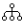</a> | **📂 檔名:** `interface-essential-hierarchy.svg` ✨ **格式:** `Vector (SVG)` ⚖️ **大小:** `2.58KB` 📅 **更新:** `2026-03-01`  🚀 **jsDelivr Markdown:** `` 🔗 **直接連結 (Url):** <code>https://cdn.jsdelivr.net/gh/barry028/materials@main/images/Resumes/Px%20Group/interface-essential-hierarchy.svg</code> 📥 [檢視原始檔](interface-essential-hierarchy.svg) |
|  | **📂 檔名:** `interface-essential-key.svg` ✨ **格式:** `Vector (SVG)` ⚖️ **大小:** `4.66KB` 📅 **更新:** `2026-03-01`  🚀 **jsDelivr Markdown:** `` 🔗 **直接連結 (Url):** <code>https://cdn.jsdelivr.net/gh/barry028/materials@main/images/Resumes/Px%20Group/interface-essential-key.svg</code> 📥 [檢視原始檔](interface-essential-key.svg) |
|  | **📂 檔名:** `interface-essential-link-broken.svg` ✨ **格式:** `Vector (SVG)` ⚖️ **大小:** `4.17KB` 📅 **更新:** `2026-03-01`  🚀 **jsDelivr Markdown:** `` 🔗 **直接連結 (Url):** <code>https://cdn.jsdelivr.net/gh/barry028/materials@main/images/Resumes/Px%20Group/interface-essential-link-broken.svg</code> 📥 [檢視原始檔](interface-essential-link-broken.svg) |
|  | **📂 檔名:** `interface-essential-paginate-filter-camera.svg` ✨ **格式:** `Vector (SVG)` ⚖️ **大小:** `1.36KB` 📅 **更新:** `2026-03-01`  🚀 **jsDelivr Markdown:** `` 🔗 **直接連結 (Url):** <code>https://cdn.jsdelivr.net/gh/barry028/materials@main/images/Resumes/Px%20Group/interface-essential-paginate-filter-camera.svg</code> 📥 [檢視原始檔](interface-essential-paginate-filter-camera.svg) |
|  | **📂 檔名:** `interface-essential-paginate-filter-music.svg` ✨ **格式:** `Vector (SVG)` ⚖️ **大小:** `1.78KB` 📅 **更新:** `2026-03-01`  🚀 **jsDelivr Markdown:** `` 🔗 **直接連結 (Url):** <code>https://cdn.jsdelivr.net/gh/barry028/materials@main/images/Resumes/Px%20Group/interface-essential-paginate-filter-music.svg</code> 📥 [檢視原始檔](interface-essential-paginate-filter-music.svg) |
|  | **📂 檔名:** `interface-essential-paginate-filter-picture.svg` ✨ **格式:** `Vector (SVG)` ⚖️ **大小:** `2.68KB` 📅 **更新:** `2026-03-01`  🚀 **jsDelivr Markdown:** `` 🔗 **直接連結 (Url):** <code>https://cdn.jsdelivr.net/gh/barry028/materials@main/images/Resumes/Px%20Group/interface-essential-paginate-filter-picture.svg</code> 📥 [檢視原始檔](interface-essential-paginate-filter-picture.svg) |
|  | **📂 檔名:** `interface-essential-pie-chart-poll-report.svg` ✨ **格式:** `Vector (SVG)` ⚖️ **大小:** `4.88KB` 📅 **更新:** `2026-03-01`  🚀 **jsDelivr Markdown:** `` 🔗 **直接連結 (Url):** <code>https://cdn.jsdelivr.net/gh/barry028/materials@main/images/Resumes/Px%20Group/interface-essential-pie-chart-poll-report.svg</code> 📥 [檢視原始檔](interface-essential-pie-chart-poll-report.svg) |
|  | **📂 檔名:** `interface-essential-pin.svg` ✨ **格式:** `Vector (SVG)` ⚖️ **大小:** `4.23KB` 📅 **更新:** `2026-03-01`  🚀 **jsDelivr Markdown:** `` 🔗 **直接連結 (Url):** <code>https://cdn.jsdelivr.net/gh/barry028/materials@main/images/Resumes/Px%20Group/interface-essential-pin.svg</code> 📥 [檢視原始檔](interface-essential-pin.svg) |
|  | **📂 檔名:** `interface-essential-setting-cog.svg` ✨ **格式:** `Vector (SVG)` ⚖️ **大小:** `5.47KB` 📅 **更新:** `2026-03-01`  🚀 **jsDelivr Markdown:** `` 🔗 **直接連結 (Url):** <code>https://cdn.jsdelivr.net/gh/barry028/materials@main/images/Resumes/Px%20Group/interface-essential-setting-cog.svg</code> 📥 [檢視原始檔](interface-essential-setting-cog.svg) |
|  | **📂 檔名:** `interface-essential-switch-off.svg` ✨ **格式:** `Vector (SVG)` ⚖️ **大小:** `2.69KB` 📅 **更新:** `2026-03-01`  🚀 **jsDelivr Markdown:** `` 🔗 **直接連結 (Url):** <code>https://cdn.jsdelivr.net/gh/barry028/materials@main/images/Resumes/Px%20Group/interface-essential-switch-off.svg</code> 📥 [檢視原始檔](interface-essential-switch-off.svg) |
|  | **📂 檔名:** `interface-essential-translate.svg` ✨ **格式:** `Vector (SVG)` ⚖️ **大小:** `4.62KB` 📅 **更新:** `2026-03-01`  🚀 **jsDelivr Markdown:** `` 🔗 **直接連結 (Url):** <code>https://cdn.jsdelivr.net/gh/barry028/materials@main/images/Resumes/Px%20Group/interface-essential-translate.svg</code> 📥 [檢視原始檔](interface-essential-translate.svg) |
|  | **📂 檔名:** `interface-essential-waiting-hourglass-loading.svg` ✨ **格式:** `Vector (SVG)` ⚖️ **大小:** `1.98KB` 📅 **更新:** `2026-03-01`  🚀 **jsDelivr Markdown:** `` 🔗 **直接連結 (Url):** <code>https://cdn.jsdelivr.net/gh/barry028/materials@main/images/Resumes/Px%20Group/interface-essential-waiting-hourglass-loading.svg</code> 📥 [檢視原始檔](interface-essential-waiting-hourglass-loading.svg) |
|  | **📂 檔名:** `interface-essential-wifi-feed.svg` ✨ **格式:** `Vector (SVG)` ⚖️ **大小:** `1.36KB` 📅 **更新:** `2026-03-01`  🚀 **jsDelivr Markdown:** `` 🔗 **直接連結 (Url):** <code>https://cdn.jsdelivr.net/gh/barry028/materials@main/images/Resumes/Px%20Group/interface-essential-wifi-feed.svg</code> 📥 [檢視原始檔](interface-essential-wifi-feed.svg) |
|  | **📂 檔名:** `internet-network-www.svg` ✨ **格式:** `Vector (SVG)` ⚖️ **大小:** `4.76KB` 📅 **更新:** `2026-03-01`  🚀 **jsDelivr Markdown:** `` 🔗 **直接連結 (Url):** <code>https://cdn.jsdelivr.net/gh/barry028/materials@main/images/Resumes/Px%20Group/internet-network-www.svg</code> 📥 [檢視原始檔](internet-network-www.svg) |
|  | **📂 檔名:** `invert.svg` ✨ **格式:** `Vector (SVG)` ⚖️ **大小:** `438.00B` 📅 **更新:** `2026-03-01`  🚀 **jsDelivr Markdown:** `` 🔗 **直接連結 (Url):** <code>https://cdn.jsdelivr.net/gh/barry028/materials@main/images/Resumes/Px%20Group/invert.svg</code> 📥 [檢視原始檔](invert.svg) |
|  | **📂 檔名:** `iso.svg` ✨ **格式:** `Vector (SVG)` ⚖️ **大小:** `488.00B` 📅 **更新:** `2026-03-01`  🚀 **jsDelivr Markdown:** `` 🔗 **直接連結 (Url):** <code>https://cdn.jsdelivr.net/gh/barry028/materials@main/images/Resumes/Px%20Group/iso.svg</code> 📥 [檢視原始檔](iso.svg) |
|  | **📂 檔名:** `kanban.svg` ✨ **格式:** `Vector (SVG)` ⚖️ **大小:** `527.00B` 📅 **更新:** `2026-03-01`  🚀 **jsDelivr Markdown:** `` 🔗 **直接連結 (Url):** <code>https://cdn.jsdelivr.net/gh/barry028/materials@main/images/Resumes/Px%20Group/kanban.svg</code> 📥 [檢視原始檔](kanban.svg) |
|  | **📂 檔名:** `label-alt-multiple.svg` ✨ **格式:** `Vector (SVG)` ⚖️ **大小:** `498.00B` 📅 **更新:** `2026-03-01`  🚀 **jsDelivr Markdown:** `` 🔗 **直接連結 (Url):** <code>https://cdn.jsdelivr.net/gh/barry028/materials@main/images/Resumes/Px%20Group/label-alt-multiple.svg</code> 📥 [檢視原始檔](label-alt-multiple.svg) |
|  | **📂 檔名:** `label-alt.svg` ✨ **格式:** `Vector (SVG)` ⚖️ **大小:** `471.00B` 📅 **更新:** `2026-03-01`  🚀 **jsDelivr Markdown:** `` 🔗 **直接連結 (Url):** <code>https://cdn.jsdelivr.net/gh/barry028/materials@main/images/Resumes/Px%20Group/label-alt.svg</code> 📥 [檢視原始檔](label-alt.svg) |
|  | **📂 檔名:** `layout-align-bottom.svg` ✨ **格式:** `Vector (SVG)` ⚖️ **大小:** `469.00B` 📅 **更新:** `2026-03-01`  🚀 **jsDelivr Markdown:** `` 🔗 **直接連結 (Url):** <code>https://cdn.jsdelivr.net/gh/barry028/materials@main/images/Resumes/Px%20Group/layout-align-bottom.svg</code> 📥 [檢視原始檔](layout-align-bottom.svg) |
|  | **📂 檔名:** `layout-align-left.svg` ✨ **格式:** `Vector (SVG)` ⚖️ **大小:** `463.00B` 📅 **更新:** `2026-03-01`  🚀 **jsDelivr Markdown:** `` 🔗 **直接連結 (Url):** <code>https://cdn.jsdelivr.net/gh/barry028/materials@main/images/Resumes/Px%20Group/layout-align-left.svg</code> 📥 [檢視原始檔](layout-align-left.svg) |
|  | **📂 檔名:** `layout-align-right.svg` ✨ **格式:** `Vector (SVG)` ⚖️ **大小:** `466.00B` 📅 **更新:** `2026-03-01`  🚀 **jsDelivr Markdown:** `` 🔗 **直接連結 (Url):** <code>https://cdn.jsdelivr.net/gh/barry028/materials@main/images/Resumes/Px%20Group/layout-align-right.svg</code> 📥 [檢視原始檔](layout-align-right.svg) |
|  | **📂 檔名:** `layout-align-top.svg` ✨ **格式:** `Vector (SVG)` ⚖️ **大小:** `457.00B` 📅 **更新:** `2026-03-01`  🚀 **jsDelivr Markdown:** `` 🔗 **直接連結 (Url):** <code>https://cdn.jsdelivr.net/gh/barry028/materials@main/images/Resumes/Px%20Group/layout-align-top.svg</code> 📥 [檢視原始檔](layout-align-top.svg) |
|  | **📂 檔名:** `layout-columns.svg` ✨ **格式:** `Vector (SVG)` ⚖️ **大小:** `452.00B` 📅 **更新:** `2026-03-01`  🚀 **jsDelivr Markdown:** `` 🔗 **直接連結 (Url):** <code>https://cdn.jsdelivr.net/gh/barry028/materials@main/images/Resumes/Px%20Group/layout-columns.svg</code> 📥 [檢視原始檔](layout-columns.svg) |
|  | **📂 檔名:** `layout-footer.svg` ✨ **格式:** `Vector (SVG)` ⚖️ **大小:** `450.00B` 📅 **更新:** `2026-03-01`  🚀 **jsDelivr Markdown:** `` 🔗 **直接連結 (Url):** <code>https://cdn.jsdelivr.net/gh/barry028/materials@main/images/Resumes/Px%20Group/layout-footer.svg</code> 📥 [檢視原始檔](layout-footer.svg) |
|  | **📂 檔名:** `layout-sidebar-left.svg` ✨ **格式:** `Vector (SVG)` ⚖️ **大小:** `468.00B` 📅 **更新:** `2026-03-01`  🚀 **jsDelivr Markdown:** `` 🔗 **直接連結 (Url):** <code>https://cdn.jsdelivr.net/gh/barry028/materials@main/images/Resumes/Px%20Group/layout-sidebar-left.svg</code> 📥 [檢視原始檔](layout-sidebar-left.svg) |
|  | **📂 檔名:** `layout-sidebar-right.svg` ✨ **格式:** `Vector (SVG)` ⚖️ **大小:** `474.00B` 📅 **更新:** `2026-03-01`  🚀 **jsDelivr Markdown:** `` 🔗 **直接連結 (Url):** <code>https://cdn.jsdelivr.net/gh/barry028/materials@main/images/Resumes/Px%20Group/layout-sidebar-right.svg</code> 📥 [檢視原始檔](layout-sidebar-right.svg) |
|  | **📂 檔名:** `layout.svg` ✨ **格式:** `Vector (SVG)` ⚖️ **大小:** `440.00B` 📅 **更新:** `2026-03-01`  🚀 **jsDelivr Markdown:** `` 🔗 **直接連結 (Url):** <code>https://cdn.jsdelivr.net/gh/barry028/materials@main/images/Resumes/Px%20Group/layout.svg</code> 📥 [檢視原始檔](layout.svg) |
|  | **📂 檔名:** `left-Turn.svg` ✨ **格式:** `Vector (SVG)` ⚖️ **大小:** `567.00B` 📅 **更新:** `2026-03-01`  🚀 **jsDelivr Markdown:** `` 🔗 **直接連結 (Url):** <code>https://cdn.jsdelivr.net/gh/barry028/materials@main/images/Resumes/Px%20Group/left-Turn.svg</code> 📥 [檢視原始檔](left-Turn.svg) |
|  | **📂 檔名:** `left-arrow.svg` ✨ **格式:** `Vector (SVG)` ⚖️ **大小:** `455.00B` 📅 **更新:** `2026-03-01`  🚀 **jsDelivr Markdown:** `` 🔗 **直接連結 (Url):** <code>https://cdn.jsdelivr.net/gh/barry028/materials@main/images/Resumes/Px%20Group/left-arrow.svg</code> 📥 [檢視原始檔](left-arrow.svg) |
|  | **📂 檔名:** `letters-abc-in-pixelated-form-svgrepo-com.svg` ✨ **格式:** `Vector (SVG)` ⚖️ **大小:** `1.39KB` 📅 **更新:** `2026-03-01`  🚀 **jsDelivr Markdown:** `` 🔗 **直接連結 (Url):** <code>https://cdn.jsdelivr.net/gh/barry028/materials@main/images/Resumes/Px%20Group/letters-abc-in-pixelated-form-svgrepo-com.svg</code> 📥 [檢視原始檔](letters-abc-in-pixelated-form-svgrepo-com.svg) |
|  | **📂 檔名:** `levels-1.svg` ✨ **格式:** `Vector (SVG)` ⚖️ **大小:** `586.00B` 📅 **更新:** `2026-03-01`  🚀 **jsDelivr Markdown:** `` 🔗 **直接連結 (Url):** <code>https://cdn.jsdelivr.net/gh/barry028/materials@main/images/Resumes/Px%20Group/levels-1.svg</code> 📥 [檢視原始檔](levels-1.svg) |
|  | **📂 檔名:** `levels-2.svg` ✨ **格式:** `Vector (SVG)` ⚖️ **大小:** `586.00B` 📅 **更新:** `2026-03-01`  🚀 **jsDelivr Markdown:** `` 🔗 **直接連結 (Url):** <code>https://cdn.jsdelivr.net/gh/barry028/materials@main/images/Resumes/Px%20Group/levels-2.svg</code> 📥 [檢視原始檔](levels-2.svg) |
|  | **📂 檔名:** `link.svg` ✨ **格式:** `Vector (SVG)` ⚖️ **大小:** `440.00B` 📅 **更新:** `2026-03-01`  🚀 **jsDelivr Markdown:** `` 🔗 **直接連結 (Url):** <code>https://cdn.jsdelivr.net/gh/barry028/materials@main/images/Resumes/Px%20Group/link.svg</code> 📥 [檢視原始檔](link.svg) |
|  | **📂 檔名:** `list.svg` ✨ **格式:** `Vector (SVG)` ⚖️ **大小:** `459.00B` 📅 **更新:** `2026-03-01`  🚀 **jsDelivr Markdown:** `` 🔗 **直接連結 (Url):** <code>https://cdn.jsdelivr.net/gh/barry028/materials@main/images/Resumes/Px%20Group/list.svg</code> 📥 [檢視原始檔](list.svg) |
|  | **📂 檔名:** `load.svg` ✨ **格式:** `Vector (SVG)` ⚖️ **大小:** `546.00B` 📅 **更新:** `2026-03-01`  🚀 **jsDelivr Markdown:** `` 🔗 **直接連結 (Url):** <code>https://cdn.jsdelivr.net/gh/barry028/materials@main/images/Resumes/Px%20Group/load.svg</code> 📥 [檢視原始檔](load.svg) |
|  | **📂 檔名:** `lock-open.svg` ✨ **格式:** `Vector (SVG)` ⚖️ **大小:** `465.00B` 📅 **更新:** `2026-03-01`  🚀 **jsDelivr Markdown:** `` 🔗 **直接連結 (Url):** <code>https://cdn.jsdelivr.net/gh/barry028/materials@main/images/Resumes/Px%20Group/lock-open.svg</code> 📥 [檢視原始檔](lock-open.svg) |
|  | **📂 檔名:** `lock.svg` ✨ **格式:** `Vector (SVG)` ⚖️ **大小:** `453.00B` 📅 **更新:** `2026-03-01`  🚀 **jsDelivr Markdown:** `` 🔗 **直接連結 (Url):** <code>https://cdn.jsdelivr.net/gh/barry028/materials@main/images/Resumes/Px%20Group/lock.svg</code> 📥 [檢視原始檔](lock.svg) |
|  | **📂 檔名:** `logo-social-media-old-instagram.svg` ✨ **格式:** `Vector (SVG)` ⚖️ **大小:** `3.18KB` 📅 **更新:** `2026-03-01`  🚀 **jsDelivr Markdown:** `` 🔗 **直接連結 (Url):** <code>https://cdn.jsdelivr.net/gh/barry028/materials@main/images/Resumes/Px%20Group/logo-social-media-old-instagram.svg</code> 📥 [檢視原始檔](logo-social-media-old-instagram.svg) |
|  | **📂 檔名:** `logo-social-media-tiktok.svg` ✨ **格式:** `Vector (SVG)` ⚖️ **大小:** `2.39KB` 📅 **更新:** `2026-03-01`  🚀 **jsDelivr Markdown:** `` 🔗 **直接連結 (Url):** <code>https://cdn.jsdelivr.net/gh/barry028/materials@main/images/Resumes/Px%20Group/logo-social-media-tiktok.svg</code> 📥 [檢視原始檔](logo-social-media-tiktok.svg) |
|  | **📂 檔名:** `mail-arrow-right.svg` ✨ **格式:** `Vector (SVG)` ⚖️ **大小:** `762.00B` 📅 **更新:** `2026-03-01`  🚀 **jsDelivr Markdown:** `` 🔗 **直接連結 (Url):** <code>https://cdn.jsdelivr.net/gh/barry028/materials@main/images/Resumes/Px%20Group/mail-arrow-right.svg</code> 📥 [檢視原始檔](mail-arrow-right.svg) |
|  | **📂 檔名:** `mail-delete.svg` ✨ **格式:** `Vector (SVG)` ⚖️ **大小:** `548.00B` 📅 **更新:** `2026-03-01`  🚀 **jsDelivr Markdown:** `` 🔗 **直接連結 (Url):** <code>https://cdn.jsdelivr.net/gh/barry028/materials@main/images/Resumes/Px%20Group/mail-delete.svg</code> 📥 [檢視原始檔](mail-delete.svg) |
|  | **📂 檔名:** `mail-flash.svg` ✨ **格式:** `Vector (SVG)` ⚖️ **大小:** `520.00B` 📅 **更新:** `2026-03-01`  🚀 **jsDelivr Markdown:** `` 🔗 **直接連結 (Url):** <code>https://cdn.jsdelivr.net/gh/barry028/materials@main/images/Resumes/Px%20Group/mail-flash.svg</code> 📥 [檢視原始檔](mail-flash.svg) |
|  | **📂 檔名:** `mail-multiple.svg` ✨ **格式:** `Vector (SVG)` ⚖️ **大小:** `592.00B` 📅 **更新:** `2026-03-01`  🚀 **jsDelivr Markdown:** `` 🔗 **直接連結 (Url):** <code>https://cdn.jsdelivr.net/gh/barry028/materials@main/images/Resumes/Px%20Group/mail-multiple.svg</code> 📥 [檢視原始檔](mail-multiple.svg) |
|  | **📂 檔名:** `mail-unread.svg` ✨ **格式:** `Vector (SVG)` ⚖️ **大小:** `489.00B` 📅 **更新:** `2026-03-01`  🚀 **jsDelivr Markdown:** `` 🔗 **直接連結 (Url):** <code>https://cdn.jsdelivr.net/gh/barry028/materials@main/images/Resumes/Px%20Group/mail-unread.svg</code> 📥 [檢視原始檔](mail-unread.svg) |
|  | **📂 檔名:** `mail.svg` ✨ **格式:** `Vector (SVG)` ⚖️ **大小:** `462.00B` 📅 **更新:** `2026-03-01`  🚀 **jsDelivr Markdown:** `` 🔗 **直接連結 (Url):** <code>https://cdn.jsdelivr.net/gh/barry028/materials@main/images/Resumes/Px%20Group/mail.svg</code> 📥 [檢視原始檔](mail.svg) |
|  | **📂 檔名:** `map-navigation-pin-location.svg` ✨ **格式:** `Vector (SVG)` ⚖️ **大小:** `3.52KB` 📅 **更新:** `2026-03-01`  🚀 **jsDelivr Markdown:** `` 🔗 **直接連結 (Url):** <code>https://cdn.jsdelivr.net/gh/barry028/materials@main/images/Resumes/Px%20Group/map-navigation-pin-location.svg</code> 📥 [檢視原始檔](map-navigation-pin-location.svg) |
|  | **📂 檔名:** `maximize-1.svg` ✨ **格式:** `Vector (SVG)` ⚖️ **大小:** `746.00B` 📅 **更新:** `2026-03-01`  🚀 **jsDelivr Markdown:** `` 🔗 **直接連結 (Url):** <code>https://cdn.jsdelivr.net/gh/barry028/materials@main/images/Resumes/Px%20Group/maximize-1.svg</code> 📥 [檢視原始檔](maximize-1.svg) |
|  | **📂 檔名:** `maximize-2.svg` ✨ **格式:** `Vector (SVG)` ⚖️ **大小:** `1000.00B` 📅 **更新:** `2026-03-01`  🚀 **jsDelivr Markdown:** `` 🔗 **直接連結 (Url):** <code>https://cdn.jsdelivr.net/gh/barry028/materials@main/images/Resumes/Px%20Group/maximize-2.svg</code> 📥 [檢視原始檔](maximize-2.svg) |
|  | **📂 檔名:** `maximize-3.svg` ✨ **格式:** `Vector (SVG)` ⚖️ **大小:** `713.00B` 📅 **更新:** `2026-03-01`  🚀 **jsDelivr Markdown:** `` 🔗 **直接連結 (Url):** <code>https://cdn.jsdelivr.net/gh/barry028/materials@main/images/Resumes/Px%20Group/maximize-3.svg</code> 📥 [檢視原始檔](maximize-3.svg) |
|  | **📂 檔名:** `maximize-4.svg` ✨ **格式:** `Vector (SVG)` ⚖️ **大小:** `718.00B` 📅 **更新:** `2026-03-01`  🚀 **jsDelivr Markdown:** `` 🔗 **直接連結 (Url):** <code>https://cdn.jsdelivr.net/gh/barry028/materials@main/images/Resumes/Px%20Group/maximize-4.svg</code> 📥 [檢視原始檔](maximize-4.svg) |
|  | **📂 檔名:** `maximize.svg` ✨ **格式:** `Vector (SVG)` ⚖️ **大小:** `747.00B` 📅 **更新:** `2026-03-01`  🚀 **jsDelivr Markdown:** `` 🔗 **直接連結 (Url):** <code>https://cdn.jsdelivr.net/gh/barry028/materials@main/images/Resumes/Px%20Group/maximize.svg</code> 📥 [檢視原始檔](maximize.svg) |
|  | **📂 檔名:** `menu-1.svg` ✨ **格式:** `Vector (SVG)` ⚖️ **大小:** `422.00B` 📅 **更新:** `2026-03-01`  🚀 **jsDelivr Markdown:** `` 🔗 **直接連結 (Url):** <code>https://cdn.jsdelivr.net/gh/barry028/materials@main/images/Resumes/Px%20Group/menu-1.svg</code> 📥 [檢視原始檔](menu-1.svg) |
|  | **📂 檔名:** `menu-top-left.svg` ✨ **格式:** `Vector (SVG)` ⚖️ **大小:** `627.00B` 📅 **更新:** `2026-03-01`  🚀 **jsDelivr Markdown:** `` 🔗 **直接連結 (Url):** <code>https://cdn.jsdelivr.net/gh/barry028/materials@main/images/Resumes/Px%20Group/menu-top-left.svg</code> 📥 [檢視原始檔](menu-top-left.svg) |
|  | **📂 檔名:** `menu.svg` ✨ **格式:** `Vector (SVG)` ⚖️ **大小:** `607.00B` 📅 **更新:** `2026-03-01`  🚀 **jsDelivr Markdown:** `` 🔗 **直接連結 (Url):** <code>https://cdn.jsdelivr.net/gh/barry028/materials@main/images/Resumes/Px%20Group/menu.svg</code> 📥 [檢視原始檔](menu.svg) |
|  | **📂 檔名:** `message-arrow-left.svg` ✨ **格式:** `Vector (SVG)` ⚖️ **大小:** `523.00B` 📅 **更新:** `2026-03-01`  🚀 **jsDelivr Markdown:** `` 🔗 **直接連結 (Url):** <code>https://cdn.jsdelivr.net/gh/barry028/materials@main/images/Resumes/Px%20Group/message-arrow-left.svg</code> 📥 [檢視原始檔](message-arrow-left.svg) |
|  | **📂 檔名:** `message-bookmark.svg` ✨ **格式:** `Vector (SVG)` ⚖️ **大小:** `482.00B` 📅 **更新:** `2026-03-01`  🚀 **jsDelivr Markdown:** `` 🔗 **直接連結 (Url):** <code>https://cdn.jsdelivr.net/gh/barry028/materials@main/images/Resumes/Px%20Group/message-bookmark.svg</code> 📥 [檢視原始檔](message-bookmark.svg) |
|  | **📂 檔名:** `message-clock.svg` ✨ **格式:** `Vector (SVG)` ⚖️ **大小:** `515.00B` 📅 **更新:** `2026-03-01`  🚀 **jsDelivr Markdown:** `` 🔗 **直接連結 (Url):** <code>https://cdn.jsdelivr.net/gh/barry028/materials@main/images/Resumes/Px%20Group/message-clock.svg</code> 📥 [檢視原始檔](message-clock.svg) |
|  | **📂 檔名:** `message-delete.svg` ✨ **格式:** `Vector (SVG)` ⚖️ **大小:** `504.00B` 📅 **更新:** `2026-03-01`  🚀 **jsDelivr Markdown:** `` 🔗 **直接連結 (Url):** <code>https://cdn.jsdelivr.net/gh/barry028/materials@main/images/Resumes/Px%20Group/message-delete.svg</code> 📥 [檢視原始檔](message-delete.svg) |
|  | **📂 檔名:** `message-flash.svg` ✨ **格式:** `Vector (SVG)` ⚖️ **大小:** `501.00B` 📅 **更新:** `2026-03-01`  🚀 **jsDelivr Markdown:** `` 🔗 **直接連結 (Url):** <code>https://cdn.jsdelivr.net/gh/barry028/materials@main/images/Resumes/Px%20Group/message-flash.svg</code> 📥 [檢視原始檔](message-flash.svg) |
|  | **📂 檔名:** `message-image.svg` ✨ **格式:** `Vector (SVG)` ⚖️ **大小:** `521.00B` 📅 **更新:** `2026-03-01`  🚀 **jsDelivr Markdown:** `` 🔗 **直接連結 (Url):** <code>https://cdn.jsdelivr.net/gh/barry028/materials@main/images/Resumes/Px%20Group/message-image.svg</code> 📥 [檢視原始檔](message-image.svg) |
|  | **📂 檔名:** `message-minus.svg` ✨ **格式:** `Vector (SVG)` ⚖️ **大小:** `460.00B` 📅 **更新:** `2026-03-01`  🚀 **jsDelivr Markdown:** `` 🔗 **直接連結 (Url):** <code>https://cdn.jsdelivr.net/gh/barry028/materials@main/images/Resumes/Px%20Group/message-minus.svg</code> 📥 [檢視原始檔](message-minus.svg) |
|  | **📂 檔名:** `message-processing.svg` ✨ **格式:** `Vector (SVG)` ⚖️ **大小:** `522.00B` 📅 **更新:** `2026-03-01`  🚀 **jsDelivr Markdown:** `` 🔗 **直接連結 (Url):** <code>https://cdn.jsdelivr.net/gh/barry028/materials@main/images/Resumes/Px%20Group/message-processing.svg</code> 📥 [檢視原始檔](message-processing.svg) |
|  | **📂 檔名:** `messages.svg` ✨ **格式:** `Vector (SVG)` ⚖️ **大小:** `549.00B` 📅 **更新:** `2026-03-01`  🚀 **jsDelivr Markdown:** `` 🔗 **直接連結 (Url):** <code>https://cdn.jsdelivr.net/gh/barry028/materials@main/images/Resumes/Px%20Group/messages.svg</code> 📥 [檢視原始檔](messages.svg) |
|  | **📂 檔名:** `microphone-Off.svg` ✨ **格式:** `Vector (SVG)` ⚖️ **大小:** `737.00B` 📅 **更新:** `2026-03-01`  🚀 **jsDelivr Markdown:** `` 🔗 **直接連結 (Url):** <code>https://cdn.jsdelivr.net/gh/barry028/materials@main/images/Resumes/Px%20Group/microphone-Off.svg</code> 📥 [檢視原始檔](microphone-Off.svg) |
|  | **📂 檔名:** `microphone-On.svg` ✨ **格式:** `Vector (SVG)` ⚖️ **大小:** `623.00B` 📅 **更新:** `2026-03-01`  🚀 **jsDelivr Markdown:** `` 🔗 **直接連結 (Url):** <code>https://cdn.jsdelivr.net/gh/barry028/materials@main/images/Resumes/Px%20Group/microphone-On.svg</code> 📥 [檢視原始檔](microphone-On.svg) |
|  | **📂 檔名:** `microphone.svg` ✨ **格式:** `Vector (SVG)` ⚖️ **大小:** `3.86KB` 📅 **更新:** `2026-03-01`  🚀 **jsDelivr Markdown:** `` 🔗 **直接連結 (Url):** <code>https://cdn.jsdelivr.net/gh/barry028/materials@main/images/Resumes/Px%20Group/microphone.svg</code> 📥 [檢視原始檔](microphone.svg) |
|  | **📂 檔名:** `minimize-1.svg` ✨ **格式:** `Vector (SVG)` ⚖️ **大小:** `963.00B` 📅 **更新:** `2026-03-01`  🚀 **jsDelivr Markdown:** `` 🔗 **直接連結 (Url):** <code>https://cdn.jsdelivr.net/gh/barry028/materials@main/images/Resumes/Px%20Group/minimize-1.svg</code> 📥 [檢視原始檔](minimize-1.svg) |
|  | **📂 檔名:** `minimize-2.svg` ✨ **格式:** `Vector (SVG)` ⚖️ **大小:** `902.00B` 📅 **更新:** `2026-03-01`  🚀 **jsDelivr Markdown:** `` 🔗 **直接連結 (Url):** <code>https://cdn.jsdelivr.net/gh/barry028/materials@main/images/Resumes/Px%20Group/minimize-2.svg</code> 📥 [檢視原始檔](minimize-2.svg) |
|  | **📂 檔名:** `minimize.svg` ✨ **格式:** `Vector (SVG)` ⚖️ **大小:** `684.00B` 📅 **更新:** `2026-03-01`  🚀 **jsDelivr Markdown:** `` 🔗 **直接連結 (Url):** <code>https://cdn.jsdelivr.net/gh/barry028/materials@main/images/Resumes/Px%20Group/minimize.svg</code> 📥 [檢視原始檔](minimize.svg) |
|  | **📂 檔名:** `minus.svg` ✨ **格式:** `Vector (SVG)` ⚖️ **大小:** `405.00B` 📅 **更新:** `2026-03-01`  🚀 **jsDelivr Markdown:** `` 🔗 **直接連結 (Url):** <code>https://cdn.jsdelivr.net/gh/barry028/materials@main/images/Resumes/Px%20Group/minus.svg</code> 📥 [檢視原始檔](minus.svg) |
|  | **📂 檔名:** `missed-call.svg` ✨ **格式:** `Vector (SVG)` ⚖️ **大小:** `792.00B` 📅 **更新:** `2026-03-01`  🚀 **jsDelivr Markdown:** `` 🔗 **直接連結 (Url):** <code>https://cdn.jsdelivr.net/gh/barry028/materials@main/images/Resumes/Px%20Group/missed-call.svg</code> 📥 [檢視原始檔](missed-call.svg) |
|  | **📂 檔名:** `money-payments-accounting-bill-money.svg` ✨ **格式:** `Vector (SVG)` ⚖️ **大小:** `4.13KB` 📅 **更新:** `2026-03-01`  🚀 **jsDelivr Markdown:** `` 🔗 **直接連結 (Url):** <code>https://cdn.jsdelivr.net/gh/barry028/materials@main/images/Resumes/Px%20Group/money-payments-accounting-bill-money.svg</code> 📥 [檢視原始檔](money-payments-accounting-bill-money.svg) |
|  | **📂 檔名:** `money-payments-accounting-calculator.svg` ✨ **格式:** `Vector (SVG)` ⚖️ **大小:** `2.92KB` 📅 **更新:** `2026-03-01`  🚀 **jsDelivr Markdown:** `` 🔗 **直接連結 (Url):** <code>https://cdn.jsdelivr.net/gh/barry028/materials@main/images/Resumes/Px%20Group/money-payments-accounting-calculator.svg</code> 📥 [檢視原始檔](money-payments-accounting-calculator.svg) |
|  | **📂 檔名:** `more-horizontal.svg` ✨ **格式:** `Vector (SVG)` ⚖️ **大小:** `583.00B` 📅 **更新:** `2026-03-01`  🚀 **jsDelivr Markdown:** `` 🔗 **直接連結 (Url):** <code>https://cdn.jsdelivr.net/gh/barry028/materials@main/images/Resumes/Px%20Group/more-horizontal.svg</code> 📥 [檢視原始檔](more-horizontal.svg) |
|  | **📂 檔名:** `more.svg` ✨ **格式:** `Vector (SVG)` ⚖️ **大小:** `570.00B` 📅 **更新:** `2026-03-01`  🚀 **jsDelivr Markdown:** `` 🔗 **直接連結 (Url):** <code>https://cdn.jsdelivr.net/gh/barry028/materials@main/images/Resumes/Px%20Group/more.svg</code> 📥 [檢視原始檔](more.svg) |
|  | **📂 檔名:** `mouse.svg` ✨ **格式:** `Vector (SVG)` ⚖️ **大小:** `494.00B` 📅 **更新:** `2026-03-01`  🚀 **jsDelivr Markdown:** `` 🔗 **直接連結 (Url):** <code>https://cdn.jsdelivr.net/gh/barry028/materials@main/images/Resumes/Px%20Group/mouse.svg</code> 📥 [檢視原始檔](mouse.svg) |
|  | **📂 檔名:** `move.svg` ✨ **格式:** `Vector (SVG)` ⚖️ **大小:** `793.00B` 📅 **更新:** `2026-03-01`  🚀 **jsDelivr Markdown:** `` 🔗 **直接連結 (Url):** <code>https://cdn.jsdelivr.net/gh/barry028/materials@main/images/Resumes/Px%20Group/move.svg</code> 📥 [檢視原始檔](move.svg) |
|  | **📂 檔名:** `movie.svg` ✨ **格式:** `Vector (SVG)` ⚖️ **大小:** `709.00B` 📅 **更新:** `2026-03-01`  🚀 **jsDelivr Markdown:** `` 🔗 **直接連結 (Url):** <code>https://cdn.jsdelivr.net/gh/barry028/materials@main/images/Resumes/Px%20Group/movie.svg</code> 📥 [檢視原始檔](movie.svg) |
|  | **📂 檔名:** `multiple.svg` ✨ **格式:** `Vector (SVG)` ⚖️ **大小:** `619.00B` 📅 **更新:** `2026-03-01`  🚀 **jsDelivr Markdown:** `` 🔗 **直接連結 (Url):** <code>https://cdn.jsdelivr.net/gh/barry028/materials@main/images/Resumes/Px%20Group/multiple.svg</code> 📥 [檢視原始檔](multiple.svg) |
|  | **📂 檔名:** `multiply.svg` ✨ **格式:** `Vector (SVG)` ⚖️ **大小:** `526.00B` 📅 **更新:** `2026-03-01`  🚀 **jsDelivr Markdown:** `` 🔗 **直接連結 (Url):** <code>https://cdn.jsdelivr.net/gh/barry028/materials@main/images/Resumes/Px%20Group/multiply.svg</code> 📥 [檢視原始檔](multiply.svg) |
|  | **📂 檔名:** `music-disk-cd.svg` ✨ **格式:** `Vector (SVG)` ⚖️ **大小:** `5.41KB` 📅 **更新:** `2026-03-01`  🚀 **jsDelivr Markdown:** `` 🔗 **直接連結 (Url):** <code>https://cdn.jsdelivr.net/gh/barry028/materials@main/images/Resumes/Px%20Group/music-disk-cd.svg</code> 📥 [檢視原始檔](music-disk-cd.svg) |
|  | **📂 檔名:** `music-notes-music.svg` ✨ **格式:** `Vector (SVG)` ⚖️ **大小:** `1.50KB` 📅 **更新:** `2026-03-01`  🚀 **jsDelivr Markdown:** `` 🔗 **直接連結 (Url):** <code>https://cdn.jsdelivr.net/gh/barry028/materials@main/images/Resumes/Px%20Group/music-notes-music.svg</code> 📥 [檢視原始檔](music-notes-music.svg) |
|  | **📂 檔名:** `mute-1.svg` ✨ **格式:** `Vector (SVG)` ⚖️ **大小:** `4.33KB` 📅 **更新:** `2026-03-01`  🚀 **jsDelivr Markdown:** `` 🔗 **直接連結 (Url):** <code>https://cdn.jsdelivr.net/gh/barry028/materials@main/images/Resumes/Px%20Group/mute-1.svg</code> 📥 [檢視原始檔](mute-1.svg) |
|  | **📂 檔名:** `mute.svg` ✨ **格式:** `Vector (SVG)` ⚖️ **大小:** `808.00B` 📅 **更新:** `2026-03-01`  🚀 **jsDelivr Markdown:** `` 🔗 **直接連結 (Url):** <code>https://cdn.jsdelivr.net/gh/barry028/materials@main/images/Resumes/Px%20Group/mute.svg</code> 📥 [檢視原始檔](mute.svg) |
|  | **📂 檔名:** `necklace.svg` ✨ **格式:** `Vector (SVG)` ⚖️ **大小:** `791.00B` 📅 **更新:** `2026-03-01`  🚀 **jsDelivr Markdown:** `` 🔗 **直接連結 (Url):** <code>https://cdn.jsdelivr.net/gh/barry028/materials@main/images/Resumes/Px%20Group/necklace.svg</code> 📥 [檢視原始檔](necklace.svg) |
|  | **📂 檔名:** `next-1.svg` ✨ **格式:** `Vector (SVG)` ⚖️ **大小:** `710.00B` 📅 **更新:** `2026-03-01`  🚀 **jsDelivr Markdown:** `` 🔗 **直接連結 (Url):** <code>https://cdn.jsdelivr.net/gh/barry028/materials@main/images/Resumes/Px%20Group/next-1.svg</code> 📥 [檢視原始檔](next-1.svg) |
|  | **📂 檔名:** `next-3.svg` ✨ **格式:** `Vector (SVG)` ⚖️ **大小:** `474.00B` 📅 **更新:** `2026-03-01`  🚀 **jsDelivr Markdown:** `` 🔗 **直接連結 (Url):** <code>https://cdn.jsdelivr.net/gh/barry028/materials@main/images/Resumes/Px%20Group/next-3.svg</code> 📥 [檢視原始檔](next-3.svg) |
|  | **📂 檔名:** `next-4.svg` ✨ **格式:** `Vector (SVG)` ⚖️ **大小:** `761.00B` 📅 **更新:** `2026-03-01`  🚀 **jsDelivr Markdown:** `` 🔗 **直接連結 (Url):** <code>https://cdn.jsdelivr.net/gh/barry028/materials@main/images/Resumes/Px%20Group/next-4.svg</code> 📥 [檢視原始檔](next-4.svg) |
|  | **📂 檔名:** `next.svg` ✨ **格式:** `Vector (SVG)` ⚖️ **大小:** `918.00B` 📅 **更新:** `2026-03-01`  🚀 **jsDelivr Markdown:** `` 🔗 **直接連結 (Url):** <code>https://cdn.jsdelivr.net/gh/barry028/materials@main/images/Resumes/Px%20Group/next.svg</code> 📥 [檢視原始檔](next.svg) |
|  | **📂 檔名:** `non-gmo-fertilizer.svg` ✨ **格式:** `Vector (SVG)` ⚖️ **大小:** `4.38KB` 📅 **更新:** `2026-03-01`  🚀 **jsDelivr Markdown:** `` 🔗 **直接連結 (Url):** <code>https://cdn.jsdelivr.net/gh/barry028/materials@main/images/Resumes/Px%20Group/non-gmo-fertilizer.svg</code> 📥 [檢視原始檔](non-gmo-fertilizer.svg) |
|  | **📂 檔名:** `note-delete.svg` ✨ **格式:** `Vector (SVG)` ⚖️ **大小:** `508.00B` 📅 **更新:** `2026-03-01`  🚀 **jsDelivr Markdown:** `` 🔗 **直接連結 (Url):** <code>https://cdn.jsdelivr.net/gh/barry028/materials@main/images/Resumes/Px%20Group/note-delete.svg</code> 📥 [檢視原始檔](note-delete.svg) |
|  | **📂 檔名:** `note-multiple-1.svg` ✨ **格式:** `Vector (SVG)` ⚖️ **大小:** `485.00B` 📅 **更新:** `2026-03-01`  🚀 **jsDelivr Markdown:** `` 🔗 **直接連結 (Url):** <code>https://cdn.jsdelivr.net/gh/barry028/materials@main/images/Resumes/Px%20Group/note-multiple-1.svg</code> 📥 [檢視原始檔](note-multiple-1.svg) |
|  | **📂 檔名:** `note-multiple.svg` ✨ **格式:** `Vector (SVG)` ⚖️ **大小:** `571.00B` 📅 **更新:** `2026-03-01`  🚀 **jsDelivr Markdown:** `` 🔗 **直接連結 (Url):** <code>https://cdn.jsdelivr.net/gh/barry028/materials@main/images/Resumes/Px%20Group/note-multiple.svg</code> 📥 [檢視原始檔](note-multiple.svg) |
|  | **📂 檔名:** `note-plus.svg` ✨ **格式:** `Vector (SVG)` ⚖️ **大小:** `493.00B` 📅 **更新:** `2026-03-01`  🚀 **jsDelivr Markdown:** `` 🔗 **直接連結 (Url):** <code>https://cdn.jsdelivr.net/gh/barry028/materials@main/images/Resumes/Px%20Group/note-plus.svg</code> 📥 [檢視原始檔](note-plus.svg) |
|  | **📂 檔名:** `note.svg` ✨ **格式:** `Vector (SVG)` ⚖️ **大小:** `437.00B` 📅 **更新:** `2026-03-01`  🚀 **jsDelivr Markdown:** `` 🔗 **直接連結 (Url):** <code>https://cdn.jsdelivr.net/gh/barry028/materials@main/images/Resumes/Px%20Group/note.svg</code> 📥 [檢視原始檔](note.svg) |
|  | **📂 檔名:** `notification-1.svg` ✨ **格式:** `Vector (SVG)` ⚖️ **大小:** `524.00B` 📅 **更新:** `2026-03-01`  🚀 **jsDelivr Markdown:** `` 🔗 **直接連結 (Url):** <code>https://cdn.jsdelivr.net/gh/barry028/materials@main/images/Resumes/Px%20Group/notification-1.svg</code> 📥 [檢視原始檔](notification-1.svg) |
|  | **📂 檔名:** `notification.svg` ✨ **格式:** `Vector (SVG)` ⚖️ **大小:** `628.00B` 📅 **更新:** `2026-03-01`  🚀 **jsDelivr Markdown:** `` 🔗 **直接連結 (Url):** <code>https://cdn.jsdelivr.net/gh/barry028/materials@main/images/Resumes/Px%20Group/notification.svg</code> 📥 [檢視原始檔](notification.svg) |
|  | **📂 檔名:** `open-1.svg` ✨ **格式:** `Vector (SVG)` ⚖️ **大小:** `477.00B` 📅 **更新:** `2026-03-01`  🚀 **jsDelivr Markdown:** `` 🔗 **直接連結 (Url):** <code>https://cdn.jsdelivr.net/gh/barry028/materials@main/images/Resumes/Px%20Group/open-1.svg</code> 📥 [檢視原始檔](open-1.svg) |
|  | **📂 檔名:** `open.svg` ✨ **格式:** `Vector (SVG)` ⚖️ **大小:** `663.00B` 📅 **更新:** `2026-03-01`  🚀 **jsDelivr Markdown:** `` 🔗 **直接連結 (Url):** <code>https://cdn.jsdelivr.net/gh/barry028/materials@main/images/Resumes/Px%20Group/open.svg</code> 📥 [檢視原始檔](open.svg) |
|  | **📂 檔名:** `paperclip.svg` ✨ **格式:** `Vector (SVG)` ⚖️ **大小:** `443.00B` 📅 **更新:** `2026-03-01`  🚀 **jsDelivr Markdown:** `` 🔗 **直接連結 (Url):** <code>https://cdn.jsdelivr.net/gh/barry028/materials@main/images/Resumes/Px%20Group/paperclip.svg</code> 📥 [檢視原始檔](paperclip.svg) |
|  | **📂 檔名:** `paste-document.svg` ✨ **格式:** `Vector (SVG)` ⚖️ **大小:** `637.00B` 📅 **更新:** `2026-03-01`  🚀 **jsDelivr Markdown:** `` 🔗 **直接連結 (Url):** <code>https://cdn.jsdelivr.net/gh/barry028/materials@main/images/Resumes/Px%20Group/paste-document.svg</code> 📥 [檢視原始檔](paste-document.svg) |
|  | **📂 檔名:** `paste-folder.svg` ✨ **格式:** `Vector (SVG)` ⚖️ **大小:** `633.00B` 📅 **更新:** `2026-03-01`  🚀 **jsDelivr Markdown:** `` 🔗 **直接連結 (Url):** <code>https://cdn.jsdelivr.net/gh/barry028/materials@main/images/Resumes/Px%20Group/paste-folder.svg</code> 📥 [檢視原始檔](paste-folder.svg) |
|  | **📂 檔名:** `path 6682.svg` ✨ **格式:** `Vector (SVG)` ⚖️ **大小:** `804.00B` 📅 **更新:** `2026-03-01`  🚀 **jsDelivr Markdown:** `` 🔗 **直接連結 (Url):** <code>https://cdn.jsdelivr.net/gh/barry028/materials@main/images/Resumes/Px%20Group/path%206682.svg</code> 📥 [檢視原始檔](path%206682.svg) |
|  | **📂 檔名:** `pause.svg` ✨ **格式:** `Vector (SVG)` ⚖️ **大小:** `434.00B` 📅 **更新:** `2026-03-01`  🚀 **jsDelivr Markdown:** `` 🔗 **直接連結 (Url):** <code>https://cdn.jsdelivr.net/gh/barry028/materials@main/images/Resumes/Px%20Group/pause.svg</code> 📥 [檢視原始檔](pause.svg) |
|  | **📂 檔名:** `pen.svg` ✨ **格式:** `Vector (SVG)` ⚖️ **大小:** `567.00B` 📅 **更新:** `2026-03-01`  🚀 **jsDelivr Markdown:** `` 🔗 **直接連結 (Url):** <code>https://cdn.jsdelivr.net/gh/barry028/materials@main/images/Resumes/Px%20Group/pen.svg</code> 📥 [檢視原始檔](pen.svg) |
|  | **📂 檔名:** `person-Group.svg` ✨ **格式:** `Vector (SVG)` ⚖️ **大小:** `848.00B` 📅 **更新:** `2026-03-01`  🚀 **jsDelivr Markdown:** `` 🔗 **直接連結 (Url):** <code>https://cdn.jsdelivr.net/gh/barry028/materials@main/images/Resumes/Px%20Group/person-Group.svg</code> 📥 [檢視原始檔](person-Group.svg) |
|  | **📂 檔名:** `person-added.svg` ✨ **格式:** `Vector (SVG)` ⚖️ **大小:** `755.00B` 📅 **更新:** `2026-03-01`  🚀 **jsDelivr Markdown:** `` 🔗 **直接連結 (Url):** <code>https://cdn.jsdelivr.net/gh/barry028/materials@main/images/Resumes/Px%20Group/person-added.svg</code> 📥 [檢視原始檔](person-added.svg) |
|  | **📂 檔名:** `person.svg` ✨ **格式:** `Vector (SVG)` ⚖️ **大小:** `662.00B` 📅 **更新:** `2026-03-01`  🚀 **jsDelivr Markdown:** `` 🔗 **直接連結 (Url):** <code>https://cdn.jsdelivr.net/gh/barry028/materials@main/images/Resumes/Px%20Group/person.svg</code> 📥 [檢視原始檔](person.svg) |
|  | **📂 檔名:** `pgone.svg` ✨ **格式:** `Vector (SVG)` ⚖️ **大小:** `1.79KB` 📅 **更新:** `2026-03-01`  🚀 **jsDelivr Markdown:** `` 🔗 **直接連結 (Url):** <code>https://cdn.jsdelivr.net/gh/barry028/materials@main/images/Resumes/Px%20Group/pgone.svg</code> 📥 [檢視原始檔](pgone.svg) |
|  | **📂 檔名:** `phone-Vibrate.svg` ✨ **格式:** `Vector (SVG)` ⚖️ **大小:** `1.78KB` 📅 **更新:** `2026-03-01`  🚀 **jsDelivr Markdown:** `` 🔗 **直接連結 (Url):** <code>https://cdn.jsdelivr.net/gh/barry028/materials@main/images/Resumes/Px%20Group/phone-Vibrate.svg</code> 📥 [檢視原始檔](phone-Vibrate.svg) |
|  | **📂 檔名:** `phone.svg` ✨ **格式:** `Vector (SVG)` ⚖️ **大小:** `711.00B` 📅 **更新:** `2026-03-01`  🚀 **jsDelivr Markdown:** `` 🔗 **直接連結 (Url):** <code>https://cdn.jsdelivr.net/gh/barry028/materials@main/images/Resumes/Px%20Group/phone.svg</code> 📥 [檢視原始檔](phone.svg) |
|  | **📂 檔名:** `photo.svg` ✨ **格式:** `Vector (SVG)` ⚖️ **大小:** `647.00B` 📅 **更新:** `2026-03-01`  🚀 **jsDelivr Markdown:** `` 🔗 **直接連結 (Url):** <code>https://cdn.jsdelivr.net/gh/barry028/materials@main/images/Resumes/Px%20Group/photo.svg</code> 📥 [檢視原始檔](photo.svg) |
|  | **📂 檔名:** `photography-camera.svg` ✨ **格式:** `Vector (SVG)` ⚖️ **大小:** `2.87KB` 📅 **更新:** `2026-03-01`  🚀 **jsDelivr Markdown:** `` 🔗 **直接連結 (Url):** <code>https://cdn.jsdelivr.net/gh/barry028/materials@main/images/Resumes/Px%20Group/photography-camera.svg</code> 📥 [檢視原始檔](photography-camera.svg) |
|  | **📂 檔名:** `pickaxe.svg` ✨ **格式:** `Vector (SVG)` ⚖️ **大小:** `897.00B` 📅 **更新:** `2026-03-01`  🚀 **jsDelivr Markdown:** `` 🔗 **直接連結 (Url):** <code>https://cdn.jsdelivr.net/gh/barry028/materials@main/images/Resumes/Px%20Group/pickaxe.svg</code> 📥 [檢視原始檔](pickaxe.svg) |
|  | **📂 檔名:** `picture-in-picture-alt.svg` ✨ **格式:** `Vector (SVG)` ⚖️ **大小:** `489.00B` 📅 **更新:** `2026-03-01`  🚀 **jsDelivr Markdown:** `` 🔗 **直接連結 (Url):** <code>https://cdn.jsdelivr.net/gh/barry028/materials@main/images/Resumes/Px%20Group/picture-in-picture-alt.svg</code> 📥 [檢視原始檔](picture-in-picture-alt.svg) |
|  | **📂 檔名:** `pixelarticons-svgrepo-com.svg` ✨ **格式:** `Vector (SVG)` ⚖️ **大小:** `645.00B` 📅 **更新:** `2026-03-01`  🚀 **jsDelivr Markdown:** `` 🔗 **直接連結 (Url):** <code>https://cdn.jsdelivr.net/gh/barry028/materials@main/images/Resumes/Px%20Group/pixelarticons-svgrepo-com.svg</code> 📥 [檢視原始檔](pixelarticons-svgrepo-com.svg) |
|  | **📂 檔名:** `pixelated-Icons-Logo.svg` ✨ **格式:** `Vector (SVG)` ⚖️ **大小:** `519.00B` 📅 **更新:** `2026-03-01`  🚀 **jsDelivr Markdown:** `` 🔗 **直接連結 (Url):** <code>https://cdn.jsdelivr.net/gh/barry028/materials@main/images/Resumes/Px%20Group/pixelated-Icons-Logo.svg</code> 📥 [檢視原始檔](pixelated-Icons-Logo.svg) |
|  | **📂 檔名:** `pixelated-person-svgrepo-com.svg` ✨ **格式:** `Vector (SVG)` ⚖️ **大小:** `958.00B` 📅 **更新:** `2026-03-01`  🚀 **jsDelivr Markdown:** `` 🔗 **直接連結 (Url):** <code>https://cdn.jsdelivr.net/gh/barry028/materials@main/images/Resumes/Px%20Group/pixelated-person-svgrepo-com.svg</code> 📥 [檢視原始檔](pixelated-person-svgrepo-com.svg) |
|  | **📂 檔名:** `pixels.svg` ✨ **格式:** `Vector (SVG)` ⚖️ **大小:** `3.10KB` 📅 **更新:** `2026-03-01`  🚀 **jsDelivr Markdown:** `` 🔗 **直接連結 (Url):** <code>https://cdn.jsdelivr.net/gh/barry028/materials@main/images/Resumes/Px%20Group/pixels.svg</code> 📥 [檢視原始檔](pixels.svg) |
|  | **📂 檔名:** `play-1.svg` ✨ **格式:** `Vector (SVG)` ⚖️ **大小:** `789.00B` 📅 **更新:** `2026-03-01`  🚀 **jsDelivr Markdown:** `` 🔗 **直接連結 (Url):** <code>https://cdn.jsdelivr.net/gh/barry028/materials@main/images/Resumes/Px%20Group/play-1.svg</code> 📥 [檢視原始檔](play-1.svg) |
|  | **📂 檔名:** `play-2.svg` ✨ **格式:** `Vector (SVG)` ⚖️ **大小:** `490.00B` 📅 **更新:** `2026-03-01`  🚀 **jsDelivr Markdown:** `` 🔗 **直接連結 (Url):** <code>https://cdn.jsdelivr.net/gh/barry028/materials@main/images/Resumes/Px%20Group/play-2.svg</code> 📥 [檢視原始檔](play-2.svg) |
|  | **📂 檔名:** `play-3.svg` ✨ **格式:** `Vector (SVG)` ⚖️ **大小:** `718.00B` 📅 **更新:** `2026-03-01`  🚀 **jsDelivr Markdown:** `` 🔗 **直接連結 (Url):** <code>https://cdn.jsdelivr.net/gh/barry028/materials@main/images/Resumes/Px%20Group/play-3.svg</code> 📥 [檢視原始檔](play-3.svg) |
|  | **📂 檔名:** `play.svg` ✨ **格式:** `Vector (SVG)` ⚖️ **大小:** `575.00B` 📅 **更新:** `2026-03-01`  🚀 **jsDelivr Markdown:** `` 🔗 **直接連結 (Url):** <code>https://cdn.jsdelivr.net/gh/barry028/materials@main/images/Resumes/Px%20Group/play.svg</code> 📥 [檢視原始檔](play.svg) |
|  | **📂 檔名:** `player-1.svg` ✨ **格式:** `Vector (SVG)` ⚖️ **大小:** `637.00B` 📅 **更新:** `2026-03-01`  🚀 **jsDelivr Markdown:** `` 🔗 **直接連結 (Url):** <code>https://cdn.jsdelivr.net/gh/barry028/materials@main/images/Resumes/Px%20Group/player-1.svg</code> 📥 [檢視原始檔](player-1.svg) |
|  | **📂 檔名:** `player.svg` ✨ **格式:** `Vector (SVG)` ⚖️ **大小:** `723.00B` 📅 **更新:** `2026-03-01`  🚀 **jsDelivr Markdown:** `` 🔗 **直接連結 (Url):** <code>https://cdn.jsdelivr.net/gh/barry028/materials@main/images/Resumes/Px%20Group/player.svg</code> 📥 [檢視原始檔](player.svg) |
|  | **📂 檔名:** `plus-box-fill.svg` ✨ **格式:** `Vector (SVG)` ⚖️ **大小:** `616.00B` 📅 **更新:** `2026-03-01`  🚀 **jsDelivr Markdown:** `` 🔗 **直接連結 (Url):** <code>https://cdn.jsdelivr.net/gh/barry028/materials@main/images/Resumes/Px%20Group/plus-box-fill.svg</code> 📥 [檢視原始檔](plus-box-fill.svg) |
|  | **📂 檔名:** `plus-circle-fill.svg` ✨ **格式:** `Vector (SVG)` ⚖️ **大小:** `556.00B` 📅 **更新:** `2026-03-01`  🚀 **jsDelivr Markdown:** `` 🔗 **直接連結 (Url):** <code>https://cdn.jsdelivr.net/gh/barry028/materials@main/images/Resumes/Px%20Group/plus-circle-fill.svg</code> 📥 [檢視原始檔](plus-circle-fill.svg) |
|  | **📂 檔名:** `plus-circle.svg` ✨ **格式:** `Vector (SVG)` ⚖️ **大小:** `623.00B` 📅 **更新:** `2026-03-01`  🚀 **jsDelivr Markdown:** `` 🔗 **直接連結 (Url):** <code>https://cdn.jsdelivr.net/gh/barry028/materials@main/images/Resumes/Px%20Group/plus-circle.svg</code> 📥 [檢視原始檔](plus-circle.svg) |
|  | **📂 檔名:** `plus.svg` ✨ **格式:** `Vector (SVG)` ⚖️ **大小:** `420.00B` 📅 **更新:** `2026-03-01`  🚀 **jsDelivr Markdown:** `` 🔗 **直接連結 (Url):** <code>https://cdn.jsdelivr.net/gh/barry028/materials@main/images/Resumes/Px%20Group/plus.svg</code> 📥 [檢視原始檔](plus.svg) |
|  | **📂 檔名:** `point.svg` ✨ **格式:** `Vector (SVG)` ⚖️ **大小:** `859.00B` 📅 **更新:** `2026-03-01`  🚀 **jsDelivr Markdown:** `` 🔗 **直接連結 (Url):** <code>https://cdn.jsdelivr.net/gh/barry028/materials@main/images/Resumes/Px%20Group/point.svg</code> 📥 [檢視原始檔](point.svg) |
|  | **📂 檔名:** `pointer-Right.svg` ✨ **格式:** `Vector (SVG)` ⚖️ **大小:** `494.00B` 📅 **更新:** `2026-03-01`  🚀 **jsDelivr Markdown:** `` 🔗 **直接連結 (Url):** <code>https://cdn.jsdelivr.net/gh/barry028/materials@main/images/Resumes/Px%20Group/pointer-Right.svg</code> 📥 [檢視原始檔](pointer-Right.svg) |
|  | **📂 檔名:** `pointer-arrow.svg` ✨ **格式:** `Vector (SVG)` ⚖️ **大小:** `460.00B` 📅 **更新:** `2026-03-01`  🚀 **jsDelivr Markdown:** `` 🔗 **直接連結 (Url):** <code>https://cdn.jsdelivr.net/gh/barry028/materials@main/images/Resumes/Px%20Group/pointer-arrow.svg</code> 📥 [檢視原始檔](pointer-arrow.svg) |
|  | **📂 檔名:** `pointer-down.svg` ✨ **格式:** `Vector (SVG)` ⚖️ **大小:** `453.00B` 📅 **更新:** `2026-03-01`  🚀 **jsDelivr Markdown:** `` 🔗 **直接連結 (Url):** <code>https://cdn.jsdelivr.net/gh/barry028/materials@main/images/Resumes/Px%20Group/pointer-down.svg</code> 📥 [檢視原始檔](pointer-down.svg) |
|  | **📂 檔名:** `pointer-left.svg` ✨ **格式:** `Vector (SVG)` ⚖️ **大小:** `489.00B` 📅 **更新:** `2026-03-01`  🚀 **jsDelivr Markdown:** `` 🔗 **直接連結 (Url):** <code>https://cdn.jsdelivr.net/gh/barry028/materials@main/images/Resumes/Px%20Group/pointer-left.svg</code> 📥 [檢視原始檔](pointer-left.svg) |
|  | **📂 檔名:** `pointer.svg` ✨ **格式:** `Vector (SVG)` ⚖️ **大小:** `549.00B` 📅 **更新:** `2026-03-01`  🚀 **jsDelivr Markdown:** `` 🔗 **直接連結 (Url):** <code>https://cdn.jsdelivr.net/gh/barry028/materials@main/images/Resumes/Px%20Group/pointer.svg</code> 📥 [檢視原始檔](pointer.svg) |
|  | **📂 檔名:** `power.svg` ✨ **格式:** `Vector (SVG)` ⚖️ **大小:** `510.00B` 📅 **更新:** `2026-03-01`  🚀 **jsDelivr Markdown:** `` 🔗 **直接連結 (Url):** <code>https://cdn.jsdelivr.net/gh/barry028/materials@main/images/Resumes/Px%20Group/power.svg</code> 📥 [檢視原始檔](power.svg) |
|  | **📂 檔名:** `print.svg` ✨ **格式:** `Vector (SVG)` ⚖️ **大小:** `507.00B` 📅 **更新:** `2026-03-01`  🚀 **jsDelivr Markdown:** `` 🔗 **直接連結 (Url):** <code>https://cdn.jsdelivr.net/gh/barry028/materials@main/images/Resumes/Px%20Group/print.svg</code> 📥 [檢視原始檔](print.svg) |
|  | **📂 檔名:** `program.svg` ✨ **格式:** `Vector (SVG)` ⚖️ **大小:** `852.00B` 📅 **更新:** `2026-03-01`  🚀 **jsDelivr Markdown:** `` 🔗 **直接連結 (Url):** <code>https://cdn.jsdelivr.net/gh/barry028/materials@main/images/Resumes/Px%20Group/program.svg</code> 📥 [檢視原始檔](program.svg) |
|  | **📂 檔名:** `protection.svg` ✨ **格式:** `Vector (SVG)` ⚖️ **大小:** `603.00B` 📅 **更新:** `2026-03-01`  🚀 **jsDelivr Markdown:** `` 🔗 **直接連結 (Url):** <code>https://cdn.jsdelivr.net/gh/barry028/materials@main/images/Resumes/Px%20Group/protection.svg</code> 📥 [檢視原始檔](protection.svg) |
|  | **📂 檔名:** `px-icon1.svg` ✨ **格式:** `Vector (SVG)` ⚖️ **大小:** `5.18KB` 📅 **更新:** `2026-03-01`  🚀 **jsDelivr Markdown:** `` 🔗 **直接連結 (Url):** <code>https://cdn.jsdelivr.net/gh/barry028/materials@main/images/Resumes/Px%20Group/px-icon1.svg</code> 📥 [檢視原始檔](px-icon1.svg) |
|  | **📂 檔名:** `px-icon10.svg` ✨ **格式:** `Vector (SVG)` ⚖️ **大小:** `5.58KB` 📅 **更新:** `2026-03-01`  🚀 **jsDelivr Markdown:** `` 🔗 **直接連結 (Url):** <code>https://cdn.jsdelivr.net/gh/barry028/materials@main/images/Resumes/Px%20Group/px-icon10.svg</code> 📥 [檢視原始檔](px-icon10.svg) |
|  | **📂 檔名:** `px-icon11.svg` ✨ **格式:** `Vector (SVG)` ⚖️ **大小:** `3.99KB` 📅 **更新:** `2026-03-01`  🚀 **jsDelivr Markdown:** `` 🔗 **直接連結 (Url):** <code>https://cdn.jsdelivr.net/gh/barry028/materials@main/images/Resumes/Px%20Group/px-icon11.svg</code> 📥 [檢視原始檔](px-icon11.svg) |
|  | **📂 檔名:** `px-icon12.svg` ✨ **格式:** `Vector (SVG)` ⚖️ **大小:** `6.10KB` 📅 **更新:** `2026-03-01`  🚀 **jsDelivr Markdown:** `` 🔗 **直接連結 (Url):** <code>https://cdn.jsdelivr.net/gh/barry028/materials@main/images/Resumes/Px%20Group/px-icon12.svg</code> 📥 [檢視原始檔](px-icon12.svg) |
|  | **📂 檔名:** `px-icon13.svg` ✨ **格式:** `Vector (SVG)` ⚖️ **大小:** `7.65KB` 📅 **更新:** `2026-03-01`  🚀 **jsDelivr Markdown:** `` 🔗 **直接連結 (Url):** <code>https://cdn.jsdelivr.net/gh/barry028/materials@main/images/Resumes/Px%20Group/px-icon13.svg</code> 📥 [檢視原始檔](px-icon13.svg) |
|  | **📂 檔名:** `px-icon14.svg` ✨ **格式:** `Vector (SVG)` ⚖️ **大小:** `6.74KB` 📅 **更新:** `2026-03-01`  🚀 **jsDelivr Markdown:** `` 🔗 **直接連結 (Url):** <code>https://cdn.jsdelivr.net/gh/barry028/materials@main/images/Resumes/Px%20Group/px-icon14.svg</code> 📥 [檢視原始檔](px-icon14.svg) |
|  | **📂 檔名:** `px-icon15.svg` ✨ **格式:** `Vector (SVG)` ⚖️ **大小:** `5.57KB` 📅 **更新:** `2026-03-01`  🚀 **jsDelivr Markdown:** `` 🔗 **直接連結 (Url):** <code>https://cdn.jsdelivr.net/gh/barry028/materials@main/images/Resumes/Px%20Group/px-icon15.svg</code> 📥 [檢視原始檔](px-icon15.svg) |
|  | **📂 檔名:** `px-icon16.svg` ✨ **格式:** `Vector (SVG)` ⚖️ **大小:** `6.10KB` 📅 **更新:** `2026-03-01`  🚀 **jsDelivr Markdown:** `` 🔗 **直接連結 (Url):** <code>https://cdn.jsdelivr.net/gh/barry028/materials@main/images/Resumes/Px%20Group/px-icon16.svg</code> 📥 [檢視原始檔](px-icon16.svg) |
|  | **📂 檔名:** `px-icon17.svg` ✨ **格式:** `Vector (SVG)` ⚖️ **大小:** `6.23KB` 📅 **更新:** `2026-03-01`  🚀 **jsDelivr Markdown:** `` 🔗 **直接連結 (Url):** <code>https://cdn.jsdelivr.net/gh/barry028/materials@main/images/Resumes/Px%20Group/px-icon17.svg</code> 📥 [檢視原始檔](px-icon17.svg) |
|  | **📂 檔名:** `px-icon18.svg` ✨ **格式:** `Vector (SVG)` ⚖️ **大小:** `6.69KB` 📅 **更新:** `2026-03-01`  🚀 **jsDelivr Markdown:** `` 🔗 **直接連結 (Url):** <code>https://cdn.jsdelivr.net/gh/barry028/materials@main/images/Resumes/Px%20Group/px-icon18.svg</code> 📥 [檢視原始檔](px-icon18.svg) |
|  | **📂 檔名:** `px-icon19.svg` ✨ **格式:** `Vector (SVG)` ⚖️ **大小:** `5.06KB` 📅 **更新:** `2026-03-01`  🚀 **jsDelivr Markdown:** `` 🔗 **直接連結 (Url):** <code>https://cdn.jsdelivr.net/gh/barry028/materials@main/images/Resumes/Px%20Group/px-icon19.svg</code> 📥 [檢視原始檔](px-icon19.svg) |
|  | **📂 檔名:** `px-icon2.svg` ✨ **格式:** `Vector (SVG)` ⚖️ **大小:** `6.87KB` 📅 **更新:** `2026-03-01`  🚀 **jsDelivr Markdown:** `` 🔗 **直接連結 (Url):** <code>https://cdn.jsdelivr.net/gh/barry028/materials@main/images/Resumes/Px%20Group/px-icon2.svg</code> 📥 [檢視原始檔](px-icon2.svg) |
|  | **📂 檔名:** `px-icon20.svg` ✨ **格式:** `Vector (SVG)` ⚖️ **大小:** `6.75KB` 📅 **更新:** `2026-03-01`  🚀 **jsDelivr Markdown:** `` 🔗 **直接連結 (Url):** <code>https://cdn.jsdelivr.net/gh/barry028/materials@main/images/Resumes/Px%20Group/px-icon20.svg</code> 📥 [檢視原始檔](px-icon20.svg) |
|  | **📂 檔名:** `px-icon21.svg` ✨ **格式:** `Vector (SVG)` ⚖️ **大小:** `5.84KB` 📅 **更新:** `2026-03-01`  🚀 **jsDelivr Markdown:** `` 🔗 **直接連結 (Url):** <code>https://cdn.jsdelivr.net/gh/barry028/materials@main/images/Resumes/Px%20Group/px-icon21.svg</code> 📥 [檢視原始檔](px-icon21.svg) |
|  | **📂 檔名:** `px-icon22.svg` ✨ **格式:** `Vector (SVG)` ⚖️ **大小:** `4.80KB` 📅 **更新:** `2026-03-01`  🚀 **jsDelivr Markdown:** `` 🔗 **直接連結 (Url):** <code>https://cdn.jsdelivr.net/gh/barry028/materials@main/images/Resumes/Px%20Group/px-icon22.svg</code> 📥 [檢視原始檔](px-icon22.svg) |
|  | **📂 檔名:** `px-icon23.svg` ✨ **格式:** `Vector (SVG)` ⚖️ **大小:** `5.84KB` 📅 **更新:** `2026-03-01`  🚀 **jsDelivr Markdown:** `` 🔗 **直接連結 (Url):** <code>https://cdn.jsdelivr.net/gh/barry028/materials@main/images/Resumes/Px%20Group/px-icon23.svg</code> 📥 [檢視原始檔](px-icon23.svg) |
|  | **📂 檔名:** `px-icon24.svg` ✨ **格式:** `Vector (SVG)` ⚖️ **大小:** `6.22KB` 📅 **更新:** `2026-03-01`  🚀 **jsDelivr Markdown:** `` 🔗 **直接連結 (Url):** <code>https://cdn.jsdelivr.net/gh/barry028/materials@main/images/Resumes/Px%20Group/px-icon24.svg</code> 📥 [檢視原始檔](px-icon24.svg) |
|  | **📂 檔名:** `px-icon25.svg` ✨ **格式:** `Vector (SVG)` ⚖️ **大小:** `5.67KB` 📅 **更新:** `2026-03-01`  🚀 **jsDelivr Markdown:** `` 🔗 **直接連結 (Url):** <code>https://cdn.jsdelivr.net/gh/barry028/materials@main/images/Resumes/Px%20Group/px-icon25.svg</code> 📥 [檢視原始檔](px-icon25.svg) |
|  | **📂 檔名:** `px-icon26.svg` ✨ **格式:** `Vector (SVG)` ⚖️ **大小:** `4.03KB` 📅 **更新:** `2026-03-01`  🚀 **jsDelivr Markdown:** `` 🔗 **直接連結 (Url):** <code>https://cdn.jsdelivr.net/gh/barry028/materials@main/images/Resumes/Px%20Group/px-icon26.svg</code> 📥 [檢視原始檔](px-icon26.svg) |
|  | **📂 檔名:** `px-icon27.svg` ✨ **格式:** `Vector (SVG)` ⚖️ **大小:** `4.55KB` 📅 **更新:** `2026-03-01`  🚀 **jsDelivr Markdown:** `` 🔗 **直接連結 (Url):** <code>https://cdn.jsdelivr.net/gh/barry028/materials@main/images/Resumes/Px%20Group/px-icon27.svg</code> 📥 [檢視原始檔](px-icon27.svg) |
|  | **📂 檔名:** `px-icon28.svg` ✨ **格式:** `Vector (SVG)` ⚖️ **大小:** `5.84KB` 📅 **更新:** `2026-03-01`  🚀 **jsDelivr Markdown:** `` 🔗 **直接連結 (Url):** <code>https://cdn.jsdelivr.net/gh/barry028/materials@main/images/Resumes/Px%20Group/px-icon28.svg</code> 📥 [檢視原始檔](px-icon28.svg) |
|  | **📂 檔名:** `px-icon29.svg` ✨ **格式:** `Vector (SVG)` ⚖️ **大小:** `6.74KB` 📅 **更新:** `2026-03-01`  🚀 **jsDelivr Markdown:** `` 🔗 **直接連結 (Url):** <code>https://cdn.jsdelivr.net/gh/barry028/materials@main/images/Resumes/Px%20Group/px-icon29.svg</code> 📥 [檢視原始檔](px-icon29.svg) |
|  | **📂 檔名:** `px-icon3.svg` ✨ **格式:** `Vector (SVG)` ⚖️ **大小:** `7.00KB` 📅 **更新:** `2026-03-01`  🚀 **jsDelivr Markdown:** `` 🔗 **直接連結 (Url):** <code>https://cdn.jsdelivr.net/gh/barry028/materials@main/images/Resumes/Px%20Group/px-icon3.svg</code> 📥 [檢視原始檔](px-icon3.svg) |
|  | **📂 檔名:** `px-icon30.svg` ✨ **格式:** `Vector (SVG)` ⚖️ **大小:** `6.99KB` 📅 **更新:** `2026-03-01`  🚀 **jsDelivr Markdown:** `` 🔗 **直接連結 (Url):** <code>https://cdn.jsdelivr.net/gh/barry028/materials@main/images/Resumes/Px%20Group/px-icon30.svg</code> 📥 [檢視原始檔](px-icon30.svg) |
|  | **📂 檔名:** `px-icon31.svg` ✨ **格式:** `Vector (SVG)` ⚖️ **大小:** `7.92KB` 📅 **更新:** `2026-03-01`  🚀 **jsDelivr Markdown:** `` 🔗 **直接連結 (Url):** <code>https://cdn.jsdelivr.net/gh/barry028/materials@main/images/Resumes/Px%20Group/px-icon31.svg</code> 📥 [檢視原始檔](px-icon31.svg) |
|  | **📂 檔名:** `px-icon32.svg` ✨ **格式:** `Vector (SVG)` ⚖️ **大小:** `6.69KB` 📅 **更新:** `2026-03-01`  🚀 **jsDelivr Markdown:** `` 🔗 **直接連結 (Url):** <code>https://cdn.jsdelivr.net/gh/barry028/materials@main/images/Resumes/Px%20Group/px-icon32.svg</code> 📥 [檢視原始檔](px-icon32.svg) |
|  | **📂 檔名:** `px-icon33.svg` ✨ **格式:** `Vector (SVG)` ⚖️ **大小:** `5.32KB` 📅 **更新:** `2026-03-01`  🚀 **jsDelivr Markdown:** `` 🔗 **直接連結 (Url):** <code>https://cdn.jsdelivr.net/gh/barry028/materials@main/images/Resumes/Px%20Group/px-icon33.svg</code> 📥 [檢視原始檔](px-icon33.svg) |
|  | **📂 檔名:** `px-icon34.svg` ✨ **格式:** `Vector (SVG)` ⚖️ **大小:** `5.83KB` 📅 **更新:** `2026-03-01`  🚀 **jsDelivr Markdown:** `` 🔗 **直接連結 (Url):** <code>https://cdn.jsdelivr.net/gh/barry028/materials@main/images/Resumes/Px%20Group/px-icon34.svg</code> 📥 [檢視原始檔](px-icon34.svg) |
|  | **📂 檔名:** `px-icon35.svg` ✨ **格式:** `Vector (SVG)` ⚖️ **大小:** `5.32KB` 📅 **更新:** `2026-03-01`  🚀 **jsDelivr Markdown:** `` 🔗 **直接連結 (Url):** <code>https://cdn.jsdelivr.net/gh/barry028/materials@main/images/Resumes/Px%20Group/px-icon35.svg</code> 📥 [檢視原始檔](px-icon35.svg) |
|  | **📂 檔名:** `px-icon36.svg` ✨ **格式:** `Vector (SVG)` ⚖️ **大小:** `3.61KB` 📅 **更新:** `2026-03-01`  🚀 **jsDelivr Markdown:** `` 🔗 **直接連結 (Url):** <code>https://cdn.jsdelivr.net/gh/barry028/materials@main/images/Resumes/Px%20Group/px-icon36.svg</code> 📥 [檢視原始檔](px-icon36.svg) |
|  | **📂 檔名:** `px-icon37.svg` ✨ **格式:** `Vector (SVG)` ⚖️ **大小:** `2.66KB` 📅 **更新:** `2026-03-01`  🚀 **jsDelivr Markdown:** `` 🔗 **直接連結 (Url):** <code>https://cdn.jsdelivr.net/gh/barry028/materials@main/images/Resumes/Px%20Group/px-icon37.svg</code> 📥 [檢視原始檔](px-icon37.svg) |
|  | **📂 檔名:** `px-icon38.svg` ✨ **格式:** `Vector (SVG)` ⚖️ **大小:** `4.28KB` 📅 **更新:** `2026-03-01`  🚀 **jsDelivr Markdown:** `` 🔗 **直接連結 (Url):** <code>https://cdn.jsdelivr.net/gh/barry028/materials@main/images/Resumes/Px%20Group/px-icon38.svg</code> 📥 [檢視原始檔](px-icon38.svg) |
|  | **📂 檔名:** `px-icon39.svg` ✨ **格式:** `Vector (SVG)` ⚖️ **大小:** `3.15KB` 📅 **更新:** `2026-03-01`  🚀 **jsDelivr Markdown:** `` 🔗 **直接連結 (Url):** <code>https://cdn.jsdelivr.net/gh/barry028/materials@main/images/Resumes/Px%20Group/px-icon39.svg</code> 📥 [檢視原始檔](px-icon39.svg) |
|  | **📂 檔名:** `px-icon4.svg` ✨ **格式:** `Vector (SVG)` ⚖️ **大小:** `9.00KB` 📅 **更新:** `2026-03-01`  🚀 **jsDelivr Markdown:** `` 🔗 **直接連結 (Url):** <code>https://cdn.jsdelivr.net/gh/barry028/materials@main/images/Resumes/Px%20Group/px-icon4.svg</code> 📥 [檢視原始檔](px-icon4.svg) |
|  | **📂 檔名:** `px-icon40.svg` ✨ **格式:** `Vector (SVG)` ⚖️ **大小:** `5.54KB` 📅 **更新:** `2026-03-01`  🚀 **jsDelivr Markdown:** `` 🔗 **直接連結 (Url):** <code>https://cdn.jsdelivr.net/gh/barry028/materials@main/images/Resumes/Px%20Group/px-icon40.svg</code> 📥 [檢視原始檔](px-icon40.svg) |
|  | **📂 檔名:** `px-icon41.svg` ✨ **格式:** `Vector (SVG)` ⚖️ **大小:** `4.29KB` 📅 **更新:** `2026-03-01`  🚀 **jsDelivr Markdown:** `` 🔗 **直接連結 (Url):** <code>https://cdn.jsdelivr.net/gh/barry028/materials@main/images/Resumes/Px%20Group/px-icon41.svg</code> 📥 [檢視原始檔](px-icon41.svg) |
|  | **📂 檔名:** `px-icon42.svg` ✨ **格式:** `Vector (SVG)` ⚖️ **大小:** `2.50KB` 📅 **更新:** `2026-03-01`  🚀 **jsDelivr Markdown:** `` 🔗 **直接連結 (Url):** <code>https://cdn.jsdelivr.net/gh/barry028/materials@main/images/Resumes/Px%20Group/px-icon42.svg</code> 📥 [檢視原始檔](px-icon42.svg) |
|  | **📂 檔名:** `px-icon43.svg` ✨ **格式:** `Vector (SVG)` ⚖️ **大小:** `6.50KB` 📅 **更新:** `2026-03-01`  🚀 **jsDelivr Markdown:** `` 🔗 **直接連結 (Url):** <code>https://cdn.jsdelivr.net/gh/barry028/materials@main/images/Resumes/Px%20Group/px-icon43.svg</code> 📥 [檢視原始檔](px-icon43.svg) |
|  | **📂 檔名:** `px-icon44.svg` ✨ **格式:** `Vector (SVG)` ⚖️ **大小:** `5.84KB` 📅 **更新:** `2026-03-01`  🚀 **jsDelivr Markdown:** `` 🔗 **直接連結 (Url):** <code>https://cdn.jsdelivr.net/gh/barry028/materials@main/images/Resumes/Px%20Group/px-icon44.svg</code> 📥 [檢視原始檔](px-icon44.svg) |
|  | **📂 檔名:** `px-icon45.svg` ✨ **格式:** `Vector (SVG)` ⚖️ **大小:** `5.84KB` 📅 **更新:** `2026-03-01`  🚀 **jsDelivr Markdown:** `` 🔗 **直接連結 (Url):** <code>https://cdn.jsdelivr.net/gh/barry028/materials@main/images/Resumes/Px%20Group/px-icon45.svg</code> 📥 [檢視原始檔](px-icon45.svg) |
|  | **📂 檔名:** `px-icon46.svg` ✨ **格式:** `Vector (SVG)` ⚖️ **大小:** `5.67KB` 📅 **更新:** `2026-03-01`  🚀 **jsDelivr Markdown:** `` 🔗 **直接連結 (Url):** <code>https://cdn.jsdelivr.net/gh/barry028/materials@main/images/Resumes/Px%20Group/px-icon46.svg</code> 📥 [檢視原始檔](px-icon46.svg) |
|  | **📂 檔名:** `px-icon47.svg` ✨ **格式:** `Vector (SVG)` ⚖️ **大小:** `5.06KB` 📅 **更新:** `2026-03-01`  🚀 **jsDelivr Markdown:** `` 🔗 **直接連結 (Url):** <code>https://cdn.jsdelivr.net/gh/barry028/materials@main/images/Resumes/Px%20Group/px-icon47.svg</code> 📥 [檢視原始檔](px-icon47.svg) |
|  | **📂 檔名:** `px-icon48.svg` ✨ **格式:** `Vector (SVG)` ⚖️ **大小:** `5.71KB` 📅 **更新:** `2026-03-01`  🚀 **jsDelivr Markdown:** `` 🔗 **直接連結 (Url):** <code>https://cdn.jsdelivr.net/gh/barry028/materials@main/images/Resumes/Px%20Group/px-icon48.svg</code> 📥 [檢視原始檔](px-icon48.svg) |
|  | **📂 檔名:** `px-icon49.svg` ✨ **格式:** `Vector (SVG)` ⚖️ **大小:** `7.39KB` 📅 **更新:** `2026-03-01`  🚀 **jsDelivr Markdown:** `` 🔗 **直接連結 (Url):** <code>https://cdn.jsdelivr.net/gh/barry028/materials@main/images/Resumes/Px%20Group/px-icon49.svg</code> 📥 [檢視原始檔](px-icon49.svg) |
|  | **📂 檔名:** `px-icon5.svg` ✨ **格式:** `Vector (SVG)` ⚖️ **大小:** `6.48KB` 📅 **更新:** `2026-03-01`  🚀 **jsDelivr Markdown:** `` 🔗 **直接連結 (Url):** <code>https://cdn.jsdelivr.net/gh/barry028/materials@main/images/Resumes/Px%20Group/px-icon5.svg</code> 📥 [檢視原始檔](px-icon5.svg) |
|  | **📂 檔名:** `px-icon6.svg` ✨ **格式:** `Vector (SVG)` ⚖️ **大小:** `3.11KB` 📅 **更新:** `2026-03-01`  🚀 **jsDelivr Markdown:** `` 🔗 **直接連結 (Url):** <code>https://cdn.jsdelivr.net/gh/barry028/materials@main/images/Resumes/Px%20Group/px-icon6.svg</code> 📥 [檢視原始檔](px-icon6.svg) |
|  | **📂 檔名:** `px-icon7.svg` ✨ **格式:** `Vector (SVG)` ⚖️ **大小:** `4.80KB` 📅 **更新:** `2026-03-01`  🚀 **jsDelivr Markdown:** `` 🔗 **直接連結 (Url):** <code>https://cdn.jsdelivr.net/gh/barry028/materials@main/images/Resumes/Px%20Group/px-icon7.svg</code> 📥 [檢視原始檔](px-icon7.svg) |
|  | **📂 檔名:** `px-icon8.svg` ✨ **格式:** `Vector (SVG)` ⚖️ **大小:** `8.04KB` 📅 **更新:** `2026-03-01`  🚀 **jsDelivr Markdown:** `` 🔗 **直接連結 (Url):** <code>https://cdn.jsdelivr.net/gh/barry028/materials@main/images/Resumes/Px%20Group/px-icon8.svg</code> 📥 [檢視原始檔](px-icon8.svg) |
|  | **📂 檔名:** `px-icon9.svg` ✨ **格式:** `Vector (SVG)` ⚖️ **大小:** `4.54KB` 📅 **更新:** `2026-03-01`  🚀 **jsDelivr Markdown:** `` 🔗 **直接連結 (Url):** <code>https://cdn.jsdelivr.net/gh/barry028/materials@main/images/Resumes/Px%20Group/px-icon9.svg</code> 📥 [檢視原始檔](px-icon9.svg) |
|  | **📂 檔名:** `radio-handheld.svg` ✨ **格式:** `Vector (SVG)` ⚖️ **大小:** `453.00B` 📅 **更新:** `2026-03-01`  🚀 **jsDelivr Markdown:** `` 🔗 **直接連結 (Url):** <code>https://cdn.jsdelivr.net/gh/barry028/materials@main/images/Resumes/Px%20Group/radio-handheld.svg</code> 📥 [檢視原始檔](radio-handheld.svg) |
|  | **📂 檔名:** `real-estate-building-ad.svg` ✨ **格式:** `Vector (SVG)` ⚖️ **大小:** `2.33KB` 📅 **更新:** `2026-03-01`  🚀 **jsDelivr Markdown:** `` 🔗 **直接連結 (Url):** <code>https://cdn.jsdelivr.net/gh/barry028/materials@main/images/Resumes/Px%20Group/real-estate-building-ad.svg</code> 📥 [檢視原始檔](real-estate-building-ad.svg) |
|  | **📂 檔名:** `real-estate-building-house.svg` ✨ **格式:** `Vector (SVG)` ⚖️ **大小:** `1.98KB` 📅 **更新:** `2026-03-01`  🚀 **jsDelivr Markdown:** `` 🔗 **直接連結 (Url):** <code>https://cdn.jsdelivr.net/gh/barry028/materials@main/images/Resumes/Px%20Group/real-estate-building-house.svg</code> 📥 [檢視原始檔](real-estate-building-house.svg) |
|  | **📂 檔名:** `redo-1.svg` ✨ **格式:** `Vector (SVG)` ⚖️ **大小:** `519.00B` 📅 **更新:** `2026-03-01`  🚀 **jsDelivr Markdown:** `` 🔗 **直接連結 (Url):** <code>https://cdn.jsdelivr.net/gh/barry028/materials@main/images/Resumes/Px%20Group/redo-1.svg</code> 📥 [檢視原始檔](redo-1.svg) |
|  | **📂 檔名:** `redo-2.svg` ✨ **格式:** `Vector (SVG)` ⚖️ **大小:** `679.00B` 📅 **更新:** `2026-03-01`  🚀 **jsDelivr Markdown:** `` 🔗 **直接連結 (Url):** <code>https://cdn.jsdelivr.net/gh/barry028/materials@main/images/Resumes/Px%20Group/redo-2.svg</code> 📥 [檢視原始檔](redo-2.svg) |
|  | **📂 檔名:** `redo.svg` ✨ **格式:** `Vector (SVG)` ⚖️ **大小:** `529.00B` 📅 **更新:** `2026-03-01`  🚀 **jsDelivr Markdown:** `` 🔗 **直接連結 (Url):** <code>https://cdn.jsdelivr.net/gh/barry028/materials@main/images/Resumes/Px%20Group/redo.svg</code> 📥 [檢視原始檔](redo.svg) |
|  | **📂 檔名:** `reload-1.svg` ✨ **格式:** `Vector (SVG)` ⚖️ **大小:** `844.00B` 📅 **更新:** `2026-03-01`  🚀 **jsDelivr Markdown:** `` 🔗 **直接連結 (Url):** <code>https://cdn.jsdelivr.net/gh/barry028/materials@main/images/Resumes/Px%20Group/reload-1.svg</code> 📥 [檢視原始檔](reload-1.svg) |
|  | **📂 檔名:** `reload.svg` ✨ **格式:** `Vector (SVG)` ⚖️ **大小:** `506.00B` 📅 **更新:** `2026-03-01`  🚀 **jsDelivr Markdown:** `` 🔗 **直接連結 (Url):** <code>https://cdn.jsdelivr.net/gh/barry028/materials@main/images/Resumes/Px%20Group/reload.svg</code> 📥 [檢視原始檔](reload.svg) |
|  | **📂 檔名:** `remove-box-multiple.svg` ✨ **格式:** `Vector (SVG)` ⚖️ **大小:** `487.00B` 📅 **更新:** `2026-03-01`  🚀 **jsDelivr Markdown:** `` 🔗 **直接連結 (Url):** <code>https://cdn.jsdelivr.net/gh/barry028/materials@main/images/Resumes/Px%20Group/remove-box-multiple.svg</code> 📥 [檢視原始檔](remove-box-multiple.svg) |
|  | **📂 檔名:** `remove-folder.svg` ✨ **格式:** `Vector (SVG)` ⚖️ **大小:** `645.00B` 📅 **更新:** `2026-03-01`  🚀 **jsDelivr Markdown:** `` 🔗 **直接連結 (Url):** <code>https://cdn.jsdelivr.net/gh/barry028/materials@main/images/Resumes/Px%20Group/remove-folder.svg</code> 📥 [檢視原始檔](remove-folder.svg) |
|  | **📂 檔名:** `repeat.svg` ✨ **格式:** `Vector (SVG)` ⚖️ **大小:** `535.00B` 📅 **更新:** `2026-03-01`  🚀 **jsDelivr Markdown:** `` 🔗 **直接連結 (Url):** <code>https://cdn.jsdelivr.net/gh/barry028/materials@main/images/Resumes/Px%20Group/repeat.svg</code> 📥 [檢視原始檔](repeat.svg) |
|  | **📂 檔名:** `replay.svg` ✨ **格式:** `Vector (SVG)` ⚖️ **大小:** `606.00B` 📅 **更新:** `2026-03-01`  🚀 **jsDelivr Markdown:** `` 🔗 **直接連結 (Url):** <code>https://cdn.jsdelivr.net/gh/barry028/materials@main/images/Resumes/Px%20Group/replay.svg</code> 📥 [檢視原始檔](replay.svg) |
|  | **📂 檔名:** `right-1.svg` ✨ **格式:** `Vector (SVG)` ⚖️ **大小:** `1.06KB` 📅 **更新:** `2026-03-01`  🚀 **jsDelivr Markdown:** `` 🔗 **直接連結 (Url):** <code>https://cdn.jsdelivr.net/gh/barry028/materials@main/images/Resumes/Px%20Group/right-1.svg</code> 📥 [檢視原始檔](right-1.svg) |
|  | **📂 檔名:** `right-Turn.svg` ✨ **格式:** `Vector (SVG)` ⚖️ **大小:** `571.00B` 📅 **更新:** `2026-03-01`  🚀 **jsDelivr Markdown:** `` 🔗 **直接連結 (Url):** <code>https://cdn.jsdelivr.net/gh/barry028/materials@main/images/Resumes/Px%20Group/right-Turn.svg</code> 📥 [檢視原始檔](right-Turn.svg) |
|  | **📂 檔名:** `right-arrow-1.svg` ✨ **格式:** `Vector (SVG)` ⚖️ **大小:** `1.09KB` 📅 **更新:** `2026-03-01`  🚀 **jsDelivr Markdown:** `` 🔗 **直接連結 (Url):** <code>https://cdn.jsdelivr.net/gh/barry028/materials@main/images/Resumes/Px%20Group/right-arrow-1.svg</code> 📥 [檢視原始檔](right-arrow-1.svg) |
|  | **📂 檔名:** `right-arrow.svg` ✨ **格式:** `Vector (SVG)` ⚖️ **大小:** `430.00B` 📅 **更新:** `2026-03-01`  🚀 **jsDelivr Markdown:** `` 🔗 **直接連結 (Url):** <code>https://cdn.jsdelivr.net/gh/barry028/materials@main/images/Resumes/Px%20Group/right-arrow.svg</code> 📥 [檢視原始檔](right-arrow.svg) |
|  | **📂 檔名:** `right-arrows-1.svg` ✨ **格式:** `Vector (SVG)` ⚖️ **大小:** `1.09KB` 📅 **更新:** `2026-03-01`  🚀 **jsDelivr Markdown:** `` 🔗 **直接連結 (Url):** <code>https://cdn.jsdelivr.net/gh/barry028/materials@main/images/Resumes/Px%20Group/right-arrows-1.svg</code> 📥 [檢視原始檔](right-arrows-1.svg) |
|  | **📂 檔名:** `right-arrows-2.svg` ✨ **格式:** `Vector (SVG)` ⚖️ **大小:** `683.00B` 📅 **更新:** `2026-03-01`  🚀 **jsDelivr Markdown:** `` 🔗 **直接連結 (Url):** <code>https://cdn.jsdelivr.net/gh/barry028/materials@main/images/Resumes/Px%20Group/right-arrows-2.svg</code> 📥 [檢視原始檔](right-arrows-2.svg) |
|  | **📂 檔名:** `right-arrows-3.svg` ✨ **格式:** `Vector (SVG)` ⚖️ **大小:** `842.00B` 📅 **更新:** `2026-03-01`  🚀 **jsDelivr Markdown:** `` 🔗 **直接連結 (Url):** <code>https://cdn.jsdelivr.net/gh/barry028/materials@main/images/Resumes/Px%20Group/right-arrows-3.svg</code> 📥 [檢視原始檔](right-arrows-3.svg) |
|  | **📂 檔名:** `right-arrows-4.svg` ✨ **格式:** `Vector (SVG)` ⚖️ **大小:** `1.03KB` 📅 **更新:** `2026-03-01`  🚀 **jsDelivr Markdown:** `` 🔗 **直接連結 (Url):** <code>https://cdn.jsdelivr.net/gh/barry028/materials@main/images/Resumes/Px%20Group/right-arrows-4.svg</code> 📥 [檢視原始檔](right-arrows-4.svg) |
|  | **📂 檔名:** `right-arrows-5.svg` ✨ **格式:** `Vector (SVG)` ⚖️ **大小:** `871.00B` 📅 **更新:** `2026-03-01`  🚀 **jsDelivr Markdown:** `` 🔗 **直接連結 (Url):** <code>https://cdn.jsdelivr.net/gh/barry028/materials@main/images/Resumes/Px%20Group/right-arrows-5.svg</code> 📥 [檢視原始檔](right-arrows-5.svg) |
|  | **📂 檔名:** `right-arrows.svg` ✨ **格式:** `Vector (SVG)` ⚖️ **大小:** `1.24KB` 📅 **更新:** `2026-03-01`  🚀 **jsDelivr Markdown:** `` 🔗 **直接連結 (Url):** <code>https://cdn.jsdelivr.net/gh/barry028/materials@main/images/Resumes/Px%20Group/right-arrows.svg</code> 📥 [檢視原始檔](right-arrows.svg) |
|  | **📂 檔名:** `right.svg` ✨ **格式:** `Vector (SVG)` ⚖️ **大小:** `693.00B` 📅 **更新:** `2026-03-01`  🚀 **jsDelivr Markdown:** `` 🔗 **直接連結 (Url):** <code>https://cdn.jsdelivr.net/gh/barry028/materials@main/images/Resumes/Px%20Group/right.svg</code> 📥 [檢視原始檔](right.svg) |
|  | **📂 檔名:** `rotate.svg` ✨ **格式:** `Vector (SVG)` ⚖️ **大小:** `794.00B` 📅 **更新:** `2026-03-01`  🚀 **jsDelivr Markdown:** `` 🔗 **直接連結 (Url):** <code>https://cdn.jsdelivr.net/gh/barry028/materials@main/images/Resumes/Px%20Group/rotate.svg</code> 📥 [檢視原始檔](rotate.svg) |
|  | **📂 檔名:** `rounded-corner.svg` ✨ **格式:** `Vector (SVG)` ⚖️ **大小:** `582.00B` 📅 **更新:** `2026-03-01`  🚀 **jsDelivr Markdown:** `` 🔗 **直接連結 (Url):** <code>https://cdn.jsdelivr.net/gh/barry028/materials@main/images/Resumes/Px%20Group/rounded-corner.svg</code> 📥 [檢視原始檔](rounded-corner.svg) |
|  | **📂 檔名:** `save.svg` ✨ **格式:** `Vector (SVG)` ⚖️ **大小:** `479.00B` 📅 **更新:** `2026-03-01`  🚀 **jsDelivr Markdown:** `` 🔗 **直接連結 (Url):** <code>https://cdn.jsdelivr.net/gh/barry028/materials@main/images/Resumes/Px%20Group/save.svg</code> 📥 [檢視原始檔](save.svg) |
|  | **📂 檔名:** `scale.svg` ✨ **格式:** `Vector (SVG)` ⚖️ **大小:** `610.00B` 📅 **更新:** `2026-03-01`  🚀 **jsDelivr Markdown:** `` 🔗 **直接連結 (Url):** <code>https://cdn.jsdelivr.net/gh/barry028/materials@main/images/Resumes/Px%20Group/scale.svg</code> 📥 [檢視原始檔](scale.svg) |
|  | **📂 檔名:** `school-science-test-flask.svg` ✨ **格式:** `Vector (SVG)` ⚖️ **大小:** `3.25KB` 📅 **更新:** `2026-03-01`  🚀 **jsDelivr Markdown:** `` 🔗 **直接連結 (Url):** <code>https://cdn.jsdelivr.net/gh/barry028/materials@main/images/Resumes/Px%20Group/school-science-test-flask.svg</code> 📥 [檢視原始檔](school-science-test-flask.svg) |
|  | **📂 檔名:** `script-1.svg` ✨ **格式:** `Vector (SVG)` ⚖️ **大小:** `686.00B` 📅 **更新:** `2026-03-01`  🚀 **jsDelivr Markdown:** `` 🔗 **直接連結 (Url):** <code>https://cdn.jsdelivr.net/gh/barry028/materials@main/images/Resumes/Px%20Group/script-1.svg</code> 📥 [檢視原始檔](script-1.svg) |
|  | **📂 檔名:** `script-text.svg` ✨ **格式:** `Vector (SVG)` ⚖️ **大小:** `501.00B` 📅 **更新:** `2026-03-01`  🚀 **jsDelivr Markdown:** `` 🔗 **直接連結 (Url):** <code>https://cdn.jsdelivr.net/gh/barry028/materials@main/images/Resumes/Px%20Group/script-text.svg</code> 📥 [檢視原始檔](script-text.svg) |
|  | **📂 檔名:** `script.svg` ✨ **格式:** `Vector (SVG)` ⚖️ **大小:** `467.00B` 📅 **更新:** `2026-03-01`  🚀 **jsDelivr Markdown:** `` 🔗 **直接連結 (Url):** <code>https://cdn.jsdelivr.net/gh/barry028/materials@main/images/Resumes/Px%20Group/script.svg</code> 📥 [檢視原始檔](script.svg) |
|  | **📂 檔名:** `scroll-horizontal.svg` ✨ **格式:** `Vector (SVG)` ⚖️ **大小:** `544.00B` 📅 **更新:** `2026-03-01`  🚀 **jsDelivr Markdown:** `` 🔗 **直接連結 (Url):** <code>https://cdn.jsdelivr.net/gh/barry028/materials@main/images/Resumes/Px%20Group/scroll-horizontal.svg</code> 📥 [檢視原始檔](scroll-horizontal.svg) |
|  | **📂 檔名:** `scroll.svg` ✨ **格式:** `Vector (SVG)` ⚖️ **大小:** `772.00B` 📅 **更新:** `2026-03-01`  🚀 **jsDelivr Markdown:** `` 🔗 **直接連結 (Url):** <code>https://cdn.jsdelivr.net/gh/barry028/materials@main/images/Resumes/Px%20Group/scroll.svg</code> 📥 [檢視原始檔](scroll.svg) |
|  | **📂 檔名:** `sd.svg` ✨ **格式:** `Vector (SVG)` ⚖️ **大小:** `441.00B` 📅 **更新:** `2026-03-01`  🚀 **jsDelivr Markdown:** `` 🔗 **直接連結 (Url):** <code>https://cdn.jsdelivr.net/gh/barry028/materials@main/images/Resumes/Px%20Group/sd.svg</code> 📥 [檢視原始檔](sd.svg) |
|  | **📂 檔名:** `search.svg` ✨ **格式:** `Vector (SVG)` ⚖️ **大小:** `514.00B` 📅 **更新:** `2026-03-01`  🚀 **jsDelivr Markdown:** `` 🔗 **直接連結 (Url):** <code>https://cdn.jsdelivr.net/gh/barry028/materials@main/images/Resumes/Px%20Group/search.svg</code> 📥 [檢視原始檔](search.svg) |
|  | **📂 檔名:** `section-minus.svg` ✨ **格式:** `Vector (SVG)` ⚖️ **大小:** `580.00B` 📅 **更新:** `2026-03-01`  🚀 **jsDelivr Markdown:** `` 🔗 **直接連結 (Url):** <code>https://cdn.jsdelivr.net/gh/barry028/materials@main/images/Resumes/Px%20Group/section-minus.svg</code> 📥 [檢視原始檔](section-minus.svg) |
|  | **📂 檔名:** `section-plus.svg` ✨ **格式:** `Vector (SVG)` ⚖️ **大小:** `816.00B` 📅 **更新:** `2026-03-01`  🚀 **jsDelivr Markdown:** `` 🔗 **直接連結 (Url):** <code>https://cdn.jsdelivr.net/gh/barry028/materials@main/images/Resumes/Px%20Group/section-plus.svg</code> 📥 [檢視原始檔](section-plus.svg) |
|  | **📂 檔名:** `section.svg` ✨ **格式:** `Vector (SVG)` ⚖️ **大小:** `592.00B` 📅 **更新:** `2026-03-01`  🚀 **jsDelivr Markdown:** `` 🔗 **直接連結 (Url):** <code>https://cdn.jsdelivr.net/gh/barry028/materials@main/images/Resumes/Px%20Group/section.svg</code> 📥 [檢視原始檔](section.svg) |
|  | **📂 檔名:** `shield-off.svg` ✨ **格式:** `Vector (SVG)` ⚖️ **大小:** `571.00B` 📅 **更新:** `2026-03-01`  🚀 **jsDelivr Markdown:** `` 🔗 **直接連結 (Url):** <code>https://cdn.jsdelivr.net/gh/barry028/materials@main/images/Resumes/Px%20Group/shield-off.svg</code> 📥 [檢視原始檔](shield-off.svg) |
|  | **📂 檔名:** `shield.svg` ✨ **格式:** `Vector (SVG)` ⚖️ **大小:** `548.00B` 📅 **更新:** `2026-03-01`  🚀 **jsDelivr Markdown:** `` 🔗 **直接連結 (Url):** <code>https://cdn.jsdelivr.net/gh/barry028/materials@main/images/Resumes/Px%20Group/shield.svg</code> 📥 [檢視原始檔](shield.svg) |
|  | **📂 檔名:** `shopping-shipping-bag.svg` ✨ **格式:** `Vector (SVG)` ⚖️ **大小:** `842.00B` 📅 **更新:** `2026-03-01`  🚀 **jsDelivr Markdown:** `` 🔗 **直接連結 (Url):** <code>https://cdn.jsdelivr.net/gh/barry028/materials@main/images/Resumes/Px%20Group/shopping-shipping-bag.svg</code> 📥 [檢視原始檔](shopping-shipping-bag.svg) |
|  | **📂 檔名:** `shopping-shipping-basket.svg` ✨ **格式:** `Vector (SVG)` ⚖️ **大小:** `1.80KB` 📅 **更新:** `2026-03-01`  🚀 **jsDelivr Markdown:** `` 🔗 **直接連結 (Url):** <code>https://cdn.jsdelivr.net/gh/barry028/materials@main/images/Resumes/Px%20Group/shopping-shipping-basket.svg</code> 📥 [檢視原始檔](shopping-shipping-basket.svg) |
|  | **📂 檔名:** `shopping-shipping-discount-coupon.svg` ✨ **格式:** `Vector (SVG)` ⚖️ **大小:** `1.83KB` 📅 **更新:** `2026-03-01`  🚀 **jsDelivr Markdown:** `` 🔗 **直接連結 (Url):** <code>https://cdn.jsdelivr.net/gh/barry028/materials@main/images/Resumes/Px%20Group/shopping-shipping-discount-coupon.svg</code> 📥 [檢視原始檔](shopping-shipping-discount-coupon.svg) |
|  | **📂 檔名:** `shopping-shipping-products-gift.svg` ✨ **格式:** `Vector (SVG)` ⚖️ **大小:** `3.79KB` 📅 **更新:** `2026-03-01`  🚀 **jsDelivr Markdown:** `` 🔗 **直接連結 (Url):** <code>https://cdn.jsdelivr.net/gh/barry028/materials@main/images/Resumes/Px%20Group/shopping-shipping-products-gift.svg</code> 📥 [檢視原始檔](shopping-shipping-products-gift.svg) |
|  | **📂 檔名:** `shopping-shipping-receipt-slip.svg` ✨ **格式:** `Vector (SVG)` ⚖️ **大小:** `6.10KB` 📅 **更新:** `2026-03-01`  🚀 **jsDelivr Markdown:** `` 🔗 **直接連結 (Url):** <code>https://cdn.jsdelivr.net/gh/barry028/materials@main/images/Resumes/Px%20Group/shopping-shipping-receipt-slip.svg</code> 📥 [檢視原始檔](shopping-shipping-receipt-slip.svg) |
|  | **📂 檔名:** `shopping-shipping-shop.svg` ✨ **格式:** `Vector (SVG)` ⚖️ **大小:** `2.32KB` 📅 **更新:** `2026-03-01`  🚀 **jsDelivr Markdown:** `` 🔗 **直接連結 (Url):** <code>https://cdn.jsdelivr.net/gh/barry028/materials@main/images/Resumes/Px%20Group/shopping-shipping-shop.svg</code> 📥 [檢視原始檔](shopping-shipping-shop.svg) |
|  | **📂 檔名:** `shuffle.svg` ✨ **格式:** `Vector (SVG)` ⚖️ **大小:** `1.04KB` 📅 **更新:** `2026-03-01`  🚀 **jsDelivr Markdown:** `` 🔗 **直接連結 (Url):** <code>https://cdn.jsdelivr.net/gh/barry028/materials@main/images/Resumes/Px%20Group/shuffle.svg</code> 📥 [檢視原始檔](shuffle.svg) |
|  | **📂 檔名:** `skip-1.svg` ✨ **格式:** `Vector (SVG)` ⚖️ **大小:** `618.00B` 📅 **更新:** `2026-03-01`  🚀 **jsDelivr Markdown:** `` 🔗 **直接連結 (Url):** <code>https://cdn.jsdelivr.net/gh/barry028/materials@main/images/Resumes/Px%20Group/skip-1.svg</code> 📥 [檢視原始檔](skip-1.svg) |
|  | **📂 檔名:** `skip.svg` ✨ **格式:** `Vector (SVG)` ⚖️ **大小:** `789.00B` 📅 **更新:** `2026-03-01`  🚀 **jsDelivr Markdown:** `` 🔗 **直接連結 (Url):** <code>https://cdn.jsdelivr.net/gh/barry028/materials@main/images/Resumes/Px%20Group/skip.svg</code> 📥 [檢視原始檔](skip.svg) |
|  | **📂 檔名:** `skull.svg` ✨ **格式:** `Vector (SVG)` ⚖️ **大小:** `583.00B` 📅 **更新:** `2026-03-01`  🚀 **jsDelivr Markdown:** `` 🔗 **直接連結 (Url):** <code>https://cdn.jsdelivr.net/gh/barry028/materials@main/images/Resumes/Px%20Group/skull.svg</code> 📥 [檢視原始檔](skull.svg) |
|  | **📂 檔名:** `social-rewards-flag.svg` ✨ **格式:** `Vector (SVG)` ⚖️ **大小:** `1.10KB` 📅 **更新:** `2026-03-01`  🚀 **jsDelivr Markdown:** `` 🔗 **直接連結 (Url):** <code>https://cdn.jsdelivr.net/gh/barry028/materials@main/images/Resumes/Px%20Group/social-rewards-flag.svg</code> 📥 [檢視原始檔](social-rewards-flag.svg) |
|  | **📂 檔名:** `social-rewards-heart-like-circle.svg` ✨ **格式:** `Vector (SVG)` ⚖️ **大小:** `3.72KB` 📅 **更新:** `2026-03-01`  🚀 **jsDelivr Markdown:** `` 🔗 **直接連結 (Url):** <code>https://cdn.jsdelivr.net/gh/barry028/materials@main/images/Resumes/Px%20Group/social-rewards-heart-like-circle.svg</code> 📥 [檢視原始檔](social-rewards-heart-like-circle.svg) |
|  | **📂 檔名:** `sort-alpabetic.svg` ✨ **格式:** `Vector (SVG)` ⚖️ **大小:** `578.00B` 📅 **更新:** `2026-03-01`  🚀 **jsDelivr Markdown:** `` 🔗 **直接連結 (Url):** <code>https://cdn.jsdelivr.net/gh/barry028/materials@main/images/Resumes/Px%20Group/sort-alpabetic.svg</code> 📥 [檢視原始檔](sort-alpabetic.svg) |
|  | **📂 檔名:** `sort-numeric.svg` ✨ **格式:** `Vector (SVG)` ⚖️ **大小:** `556.00B` 📅 **更新:** `2026-03-01`  🚀 **jsDelivr Markdown:** `` 🔗 **直接連結 (Url):** <code>https://cdn.jsdelivr.net/gh/barry028/materials@main/images/Resumes/Px%20Group/sort-numeric.svg</code> 📥 [檢視原始檔](sort-numeric.svg) |
|  | **📂 檔名:** `sort.svg` ✨ **格式:** `Vector (SVG)` ⚖️ **大小:** `487.00B` 📅 **更新:** `2026-03-01`  🚀 **jsDelivr Markdown:** `` 🔗 **直接連結 (Url):** <code>https://cdn.jsdelivr.net/gh/barry028/materials@main/images/Resumes/Px%20Group/sort.svg</code> 📥 [檢視原始檔](sort.svg) |
|  | **📂 檔名:** `speaker.svg` ✨ **格式:** `Vector (SVG)` ⚖️ **大小:** `547.00B` 📅 **更新:** `2026-03-01`  🚀 **jsDelivr Markdown:** `` 🔗 **直接連結 (Url):** <code>https://cdn.jsdelivr.net/gh/barry028/materials@main/images/Resumes/Px%20Group/speaker.svg</code> 📥 [檢視原始檔](speaker.svg) |
|  | **📂 檔名:** `spotlight.svg` ✨ **格式:** `Vector (SVG)` ⚖️ **大小:** `454.00B` 📅 **更新:** `2026-03-01`  🚀 **jsDelivr Markdown:** `` 🔗 **直接連結 (Url):** <code>https://cdn.jsdelivr.net/gh/barry028/materials@main/images/Resumes/Px%20Group/spotlight.svg</code> 📥 [檢視原始檔](spotlight.svg) |
|  | **📂 檔名:** `start.svg` ✨ **格式:** `Vector (SVG)` ⚖️ **大小:** `460.00B` 📅 **更新:** `2026-03-01`  🚀 **jsDelivr Markdown:** `` 🔗 **直接連結 (Url):** <code>https://cdn.jsdelivr.net/gh/barry028/materials@main/images/Resumes/Px%20Group/start.svg</code> 📥 [檢視原始檔](start.svg) |
|  | **📂 檔名:** `statistics.svg` ✨ **格式:** `Vector (SVG)` ⚖️ **大小:** `705.00B` 📅 **更新:** `2026-03-01`  🚀 **jsDelivr Markdown:** `` 🔗 **直接連結 (Url):** <code>https://cdn.jsdelivr.net/gh/barry028/materials@main/images/Resumes/Px%20Group/statistics.svg</code> 📥 [檢視原始檔](statistics.svg) |
|  | **📂 檔名:** `stop-1.svg` ✨ **格式:** `Vector (SVG)` ⚖️ **大小:** `478.00B` 📅 **更新:** `2026-03-01`  🚀 **jsDelivr Markdown:** `` 🔗 **直接連結 (Url):** <code>https://cdn.jsdelivr.net/gh/barry028/materials@main/images/Resumes/Px%20Group/stop-1.svg</code> 📥 [檢視原始檔](stop-1.svg) |
|  | **📂 檔名:** `store.svg` ✨ **格式:** `Vector (SVG)` ⚖️ **大小:** `461.00B` 📅 **更新:** `2026-03-01`  🚀 **jsDelivr Markdown:** `` 🔗 **直接連結 (Url):** <code>https://cdn.jsdelivr.net/gh/barry028/materials@main/images/Resumes/Px%20Group/store.svg</code> 📥 [檢視原始檔](store.svg) |
|  | **📂 檔名:** `streamline-bubble.svg` ✨ **格式:** `Vector (SVG)` ⚖️ **大小:** `4.02KB` 📅 **更新:** `2026-03-01`  🚀 **jsDelivr Markdown:** `` 🔗 **直接連結 (Url):** <code>https://cdn.jsdelivr.net/gh/barry028/materials@main/images/Resumes/Px%20Group/streamline-bubble.svg</code> 📥 [檢視原始檔](streamline-bubble.svg) |
|  | **📂 檔名:** `sun-1.svg` ✨ **格式:** `Vector (SVG)` ⚖️ **大小:** `774.00B` 📅 **更新:** `2026-03-01`  🚀 **jsDelivr Markdown:** `` 🔗 **直接連結 (Url):** <code>https://cdn.jsdelivr.net/gh/barry028/materials@main/images/Resumes/Px%20Group/sun-1.svg</code> 📥 [檢視原始檔](sun-1.svg) |
|  | **📂 檔名:** `sun.svg` ✨ **格式:** `Vector (SVG)` ⚖️ **大小:** `1.92KB` 📅 **更新:** `2026-03-01`  🚀 **jsDelivr Markdown:** `` 🔗 **直接連結 (Url):** <code>https://cdn.jsdelivr.net/gh/barry028/materials@main/images/Resumes/Px%20Group/sun.svg</code> 📥 [檢視原始檔](sun.svg) |
|  | **📂 檔名:** `svg.svg` ✨ **格式:** `Vector (SVG)` ⚖️ **大小:** `1.06KB` 📅 **更新:** `2026-03-01`  🚀 **jsDelivr Markdown:** `` 🔗 **直接連結 (Url):** <code>https://cdn.jsdelivr.net/gh/barry028/materials@main/images/Resumes/Px%20Group/svg.svg</code> 📥 [檢視原始檔](svg.svg) |
|  | **📂 檔名:** `sword.svg` ✨ **格式:** `Vector (SVG)` ⚖️ **大小:** `1015.00B` 📅 **更新:** `2026-03-01`  🚀 **jsDelivr Markdown:** `` 🔗 **直接連結 (Url):** <code>https://cdn.jsdelivr.net/gh/barry028/materials@main/images/Resumes/Px%20Group/sword.svg</code> 📥 [檢視原始檔](sword.svg) |
|  | **📂 檔名:** `tag-text.svg` ✨ **格式:** `Vector (SVG)` ⚖️ **大小:** `772.00B` 📅 **更新:** `2026-03-01`  🚀 **jsDelivr Markdown:** `` 🔗 **直接連結 (Url):** <code>https://cdn.jsdelivr.net/gh/barry028/materials@main/images/Resumes/Px%20Group/tag-text.svg</code> 📥 [檢視原始檔](tag-text.svg) |
|  | **📂 檔名:** `tag.svg` ✨ **格式:** `Vector (SVG)` ⚖️ **大小:** `666.00B` 📅 **更新:** `2026-03-01`  🚀 **jsDelivr Markdown:** `` 🔗 **直接連結 (Url):** <code>https://cdn.jsdelivr.net/gh/barry028/materials@main/images/Resumes/Px%20Group/tag.svg</code> 📥 [檢視原始檔](tag.svg) |
|  | **📂 檔名:** `target.svg` ✨ **格式:** `Vector (SVG)` ⚖️ **大小:** `721.00B` 📅 **更新:** `2026-03-01`  🚀 **jsDelivr Markdown:** `` 🔗 **直接連結 (Url):** <code>https://cdn.jsdelivr.net/gh/barry028/materials@main/images/Resumes/Px%20Group/target.svg</code> 📥 [檢視原始檔](target.svg) |
|  | **📂 檔名:** `tea.svg` ✨ **格式:** `Vector (SVG)` ⚖️ **大小:** `563.00B` 📅 **更新:** `2026-03-01`  🚀 **jsDelivr Markdown:** `` 🔗 **直接連結 (Url):** <code>https://cdn.jsdelivr.net/gh/barry028/materials@main/images/Resumes/Px%20Group/tea.svg</code> 📥 [檢視原始檔](tea.svg) |
|  | **📂 檔名:** `terminal.svg` ✨ **格式:** `Vector (SVG)` ⚖️ **大小:** `674.00B` 📅 **更新:** `2026-03-01`  🚀 **jsDelivr Markdown:** `` 🔗 **直接連結 (Url):** <code>https://cdn.jsdelivr.net/gh/barry028/materials@main/images/Resumes/Px%20Group/terminal.svg</code> 📥 [檢視原始檔](terminal.svg) |
|  | **📂 檔名:** `texrectanglesearch.svg` ✨ **格式:** `Vector (SVG)` ⚖️ **大小:** `644.00B` 📅 **更新:** `2026-03-01`  🚀 **jsDelivr Markdown:** `` 🔗 **直接連結 (Url):** <code>https://cdn.jsdelivr.net/gh/barry028/materials@main/images/Resumes/Px%20Group/texrectanglesearch.svg</code> 📥 [檢視原始檔](texrectanglesearch.svg) |
|  | **📂 檔名:** `text-box.svg` ✨ **格式:** `Vector (SVG)` ⚖️ **大小:** `670.00B` 📅 **更新:** `2026-03-01`  🚀 **jsDelivr Markdown:** `` 🔗 **直接連結 (Url):** <code>https://cdn.jsdelivr.net/gh/barry028/materials@main/images/Resumes/Px%20Group/text-box.svg</code> 📥 [檢視原始檔](text-box.svg) |
|  | **📂 檔名:** `text-image.svg` ✨ **格式:** `Vector (SVG)` ⚖️ **大小:** `556.00B` 📅 **更新:** `2026-03-01`  🚀 **jsDelivr Markdown:** `` 🔗 **直接連結 (Url):** <code>https://cdn.jsdelivr.net/gh/barry028/materials@main/images/Resumes/Px%20Group/text-image.svg</code> 📥 [檢視原始檔](text-image.svg) |
|  | **📂 檔名:** `text-wrap.svg` ✨ **格式:** `Vector (SVG)` ⚖️ **大小:** `493.00B` 📅 **更新:** `2026-03-01`  🚀 **jsDelivr Markdown:** `` 🔗 **直接連結 (Url):** <code>https://cdn.jsdelivr.net/gh/barry028/materials@main/images/Resumes/Px%20Group/text-wrap.svg</code> 📥 [檢視原始檔](text-wrap.svg) |
|  | **📂 檔名:** `timeline.svg` ✨ **格式:** `Vector (SVG)` ⚖️ **大小:** `480.00B` 📅 **更新:** `2026-03-01`  🚀 **jsDelivr Markdown:** `` 🔗 **直接連結 (Url):** <code>https://cdn.jsdelivr.net/gh/barry028/materials@main/images/Resumes/Px%20Group/timeline.svg</code> 📥 [檢視原始檔](timeline.svg) |
|  | **📂 檔名:** `toggle-switch-off.svg` ✨ **格式:** `Vector (SVG)` ⚖️ **大小:** `531.00B` 📅 **更新:** `2026-03-01`  🚀 **jsDelivr Markdown:** `` 🔗 **直接連結 (Url):** <code>https://cdn.jsdelivr.net/gh/barry028/materials@main/images/Resumes/Px%20Group/toggle-switch-off.svg</code> 📥 [檢視原始檔](toggle-switch-off.svg) |
|  | **📂 檔名:** `toggle-switch-on.svg` ✨ **格式:** `Vector (SVG)` ⚖️ **大小:** `500.00B` 📅 **更新:** `2026-03-01`  🚀 **jsDelivr Markdown:** `` 🔗 **直接連結 (Url):** <code>https://cdn.jsdelivr.net/gh/barry028/materials@main/images/Resumes/Px%20Group/toggle-switch-on.svg</code> 📥 [檢視原始檔](toggle-switch-on.svg) |
|  | **📂 檔名:** `toolbox.svg` ✨ **格式:** `Vector (SVG)` ⚖️ **大小:** `515.00B` 📅 **更新:** `2026-03-01`  🚀 **jsDelivr Markdown:** `` 🔗 **直接連結 (Url):** <code>https://cdn.jsdelivr.net/gh/barry028/materials@main/images/Resumes/Px%20Group/toolbox.svg</code> 📥 [檢視原始檔](toolbox.svg) |
|  | **📂 檔名:** `tooltip-above-alert.svg` ✨ **格式:** `Vector (SVG)` ⚖️ **大小:** `566.00B` 📅 **更新:** `2026-03-01`  🚀 **jsDelivr Markdown:** `` 🔗 **直接連結 (Url):** <code>https://cdn.jsdelivr.net/gh/barry028/materials@main/images/Resumes/Px%20Group/tooltip-above-alert.svg</code> 📥 [檢視原始檔](tooltip-above-alert.svg) |
|  | **📂 檔名:** `tooltip-above-text.svg` ✨ **格式:** `Vector (SVG)` ⚖️ **大小:** `562.00B` 📅 **更新:** `2026-03-01`  🚀 **jsDelivr Markdown:** `` 🔗 **直接連結 (Url):** <code>https://cdn.jsdelivr.net/gh/barry028/materials@main/images/Resumes/Px%20Group/tooltip-above-text.svg</code> 📥 [檢視原始檔](tooltip-above-text.svg) |
|  | **📂 檔名:** `tooltip-above.svg` ✨ **格式:** `Vector (SVG)` ⚖️ **大小:** `523.00B` 📅 **更新:** `2026-03-01`  🚀 **jsDelivr Markdown:** `` 🔗 **直接連結 (Url):** <code>https://cdn.jsdelivr.net/gh/barry028/materials@main/images/Resumes/Px%20Group/tooltip-above.svg</code> 📥 [檢視原始檔](tooltip-above.svg) |
|  | **📂 檔名:** `tooltip-below-alert.svg` ✨ **格式:** `Vector (SVG)` ⚖️ **大小:** `562.00B` 📅 **更新:** `2026-03-01`  🚀 **jsDelivr Markdown:** `` 🔗 **直接連結 (Url):** <code>https://cdn.jsdelivr.net/gh/barry028/materials@main/images/Resumes/Px%20Group/tooltip-below-alert.svg</code> 📥 [檢視原始檔](tooltip-below-alert.svg) |
|  | **📂 檔名:** `tooltip-below-text.svg` ✨ **格式:** `Vector (SVG)` ⚖️ **大小:** `561.00B` 📅 **更新:** `2026-03-01`  🚀 **jsDelivr Markdown:** `` 🔗 **直接連結 (Url):** <code>https://cdn.jsdelivr.net/gh/barry028/materials@main/images/Resumes/Px%20Group/tooltip-below-text.svg</code> 📥 [檢視原始檔](tooltip-below-text.svg) |
|  | **📂 檔名:** `tooltip-below.svg` ✨ **格式:** `Vector (SVG)` ⚖️ **大小:** `518.00B` 📅 **更新:** `2026-03-01`  🚀 **jsDelivr Markdown:** `` 🔗 **直接連結 (Url):** <code>https://cdn.jsdelivr.net/gh/barry028/materials@main/images/Resumes/Px%20Group/tooltip-below.svg</code> 📥 [檢視原始檔](tooltip-below.svg) |
|  | **📂 檔名:** `tooltip-end-alert.svg` ✨ **格式:** `Vector (SVG)` ⚖️ **大小:** `554.00B` 📅 **更新:** `2026-03-01`  🚀 **jsDelivr Markdown:** `` 🔗 **直接連結 (Url):** <code>https://cdn.jsdelivr.net/gh/barry028/materials@main/images/Resumes/Px%20Group/tooltip-end-alert.svg</code> 📥 [檢視原始檔](tooltip-end-alert.svg) |
|  | **📂 檔名:** `tooltip-end-text.svg` ✨ **格式:** `Vector (SVG)` ⚖️ **大小:** `558.00B` 📅 **更新:** `2026-03-01`  🚀 **jsDelivr Markdown:** `` 🔗 **直接連結 (Url):** <code>https://cdn.jsdelivr.net/gh/barry028/materials@main/images/Resumes/Px%20Group/tooltip-end-text.svg</code> 📥 [檢視原始檔](tooltip-end-text.svg) |
|  | **📂 檔名:** `tooltip-end.svg` ✨ **格式:** `Vector (SVG)` ⚖️ **大小:** `509.00B` 📅 **更新:** `2026-03-01`  🚀 **jsDelivr Markdown:** `` 🔗 **直接連結 (Url):** <code>https://cdn.jsdelivr.net/gh/barry028/materials@main/images/Resumes/Px%20Group/tooltip-end.svg</code> 📥 [檢視原始檔](tooltip-end.svg) |
|  | **📂 檔名:** `tooltip-start-alert.svg` ✨ **格式:** `Vector (SVG)` ⚖️ **大小:** `562.00B` 📅 **更新:** `2026-03-01`  🚀 **jsDelivr Markdown:** `` 🔗 **直接連結 (Url):** <code>https://cdn.jsdelivr.net/gh/barry028/materials@main/images/Resumes/Px%20Group/tooltip-start-alert.svg</code> 📥 [檢視原始檔](tooltip-start-alert.svg) |
|  | **📂 檔名:** `tooltip-start-text.svg` ✨ **格式:** `Vector (SVG)` ⚖️ **大小:** `569.00B` 📅 **更新:** `2026-03-01`  🚀 **jsDelivr Markdown:** `` 🔗 **直接連結 (Url):** <code>https://cdn.jsdelivr.net/gh/barry028/materials@main/images/Resumes/Px%20Group/tooltip-start-text.svg</code> 📥 [檢視原始檔](tooltip-start-text.svg) |
|  | **📂 檔名:** `tooltip-start.svg` ✨ **格式:** `Vector (SVG)` ⚖️ **大小:** `519.00B` 📅 **更新:** `2026-03-01`  🚀 **jsDelivr Markdown:** `` 🔗 **直接連結 (Url):** <code>https://cdn.jsdelivr.net/gh/barry028/materials@main/images/Resumes/Px%20Group/tooltip-start.svg</code> 📥 [檢視原始檔](tooltip-start.svg) |
|  | **📂 檔名:** `tournament.svg` ✨ **格式:** `Vector (SVG)` ⚖️ **大小:** `465.00B` 📅 **更新:** `2026-03-01`  🚀 **jsDelivr Markdown:** `` 🔗 **直接連結 (Url):** <code>https://cdn.jsdelivr.net/gh/barry028/materials@main/images/Resumes/Px%20Group/tournament.svg</code> 📥 [檢視原始檔](tournament.svg) |
|  | **📂 檔名:** `transportation-motorcycle.svg` ✨ **格式:** `Vector (SVG)` ⚖️ **大小:** `3.37KB` 📅 **更新:** `2026-03-01`  🚀 **jsDelivr Markdown:** `` 🔗 **直接連結 (Url):** <code>https://cdn.jsdelivr.net/gh/barry028/materials@main/images/Resumes/Px%20Group/transportation-motorcycle.svg</code> 📥 [檢視原始檔](transportation-motorcycle.svg) |
|  | **📂 檔名:** `transportation-train.svg` ✨ **格式:** `Vector (SVG)` ⚖️ **大小:** `2.69KB` 📅 **更新:** `2026-03-01`  🚀 **jsDelivr Markdown:** `` 🔗 **直接連結 (Url):** <code>https://cdn.jsdelivr.net/gh/barry028/materials@main/images/Resumes/Px%20Group/transportation-train.svg</code> 📥 [檢視原始檔](transportation-train.svg) |
|  | **📂 檔名:** `trash-1.svg` ✨ **格式:** `Vector (SVG)` ⚖️ **大小:** `563.00B` 📅 **更新:** `2026-03-01`  🚀 **jsDelivr Markdown:** `` 🔗 **直接連結 (Url):** <code>https://cdn.jsdelivr.net/gh/barry028/materials@main/images/Resumes/Px%20Group/trash-1.svg</code> 📥 [檢視原始檔](trash-1.svg) |
|  | **📂 檔名:** `trash.svg` ✨ **格式:** `Vector (SVG)` ⚖️ **大小:** `470.00B` 📅 **更新:** `2026-03-01`  🚀 **jsDelivr Markdown:** `` 🔗 **直接連結 (Url):** <code>https://cdn.jsdelivr.net/gh/barry028/materials@main/images/Resumes/Px%20Group/trash.svg</code> 📥 [檢視原始檔](trash.svg) |
|  | **📂 檔名:** `travel-wayfinding-balloon.svg` ✨ **格式:** `Vector (SVG)` ⚖️ **大小:** `2.45KB` 📅 **更新:** `2026-03-01`  🚀 **jsDelivr Markdown:** `` 🔗 **直接連結 (Url):** <code>https://cdn.jsdelivr.net/gh/barry028/materials@main/images/Resumes/Px%20Group/travel-wayfinding-balloon.svg</code> 📥 [檢視原始檔](travel-wayfinding-balloon.svg) |
|  | **📂 檔名:** `travel-wayfinding-beach-umbrella.svg` ✨ **格式:** `Vector (SVG)` ⚖️ **大小:** `4.63KB` 📅 **更新:** `2026-03-01`  🚀 **jsDelivr Markdown:** `` 🔗 **直接連結 (Url):** <code>https://cdn.jsdelivr.net/gh/barry028/materials@main/images/Resumes/Px%20Group/travel-wayfinding-beach-umbrella.svg</code> 📥 [檢視原始檔](travel-wayfinding-beach-umbrella.svg) |
|  | **📂 檔名:** `trending.svg` ✨ **格式:** `Vector (SVG)` ⚖️ **大小:** `631.00B` 📅 **更新:** `2026-03-01`  🚀 **jsDelivr Markdown:** `` 🔗 **直接連結 (Url):** <code>https://cdn.jsdelivr.net/gh/barry028/materials@main/images/Resumes/Px%20Group/trending.svg</code> 📥 [檢視原始檔](trending.svg) |
|  | **📂 檔名:** `ui-design-website.svg` ✨ **格式:** `Vector (SVG)` ⚖️ **大小:** `2.36KB` 📅 **更新:** `2026-03-01`  🚀 **jsDelivr Markdown:** `` 🔗 **直接連結 (Url):** <code>https://cdn.jsdelivr.net/gh/barry028/materials@main/images/Resumes/Px%20Group/ui-design-website.svg</code> 📥 [檢視原始檔](ui-design-website.svg) |
|  | **📂 檔名:** `undo.svg` ✨ **格式:** `Vector (SVG)` ⚖️ **大小:** `663.00B` 📅 **更新:** `2026-03-01`  🚀 **jsDelivr Markdown:** `` 🔗 **直接連結 (Url):** <code>https://cdn.jsdelivr.net/gh/barry028/materials@main/images/Resumes/Px%20Group/undo.svg</code> 📥 [檢視原始檔](undo.svg) |
|  | **📂 檔名:** `ungroup.svg` ✨ **格式:** `Vector (SVG)` ⚖️ **大小:** `652.00B` 📅 **更新:** `2026-03-01`  🚀 **jsDelivr Markdown:** `` 🔗 **直接連結 (Url):** <code>https://cdn.jsdelivr.net/gh/barry028/materials@main/images/Resumes/Px%20Group/ungroup.svg</code> 📥 [檢視原始檔](ungroup.svg) |
|  | **📂 檔名:** `up-arrow-1.svg` ✨ **格式:** `Vector (SVG)` ⚖️ **大小:** `739.00B` 📅 **更新:** `2026-03-01`  🚀 **jsDelivr Markdown:** `` 🔗 **直接連結 (Url):** <code>https://cdn.jsdelivr.net/gh/barry028/materials@main/images/Resumes/Px%20Group/up-arrow-1.svg</code> 📥 [檢視原始檔](up-arrow-1.svg) |
|  | **📂 檔名:** `up-arrow.svg` ✨ **格式:** `Vector (SVG)` ⚖️ **大小:** `749.00B` 📅 **更新:** `2026-03-01`  🚀 **jsDelivr Markdown:** `` 🔗 **直接連結 (Url):** <code>https://cdn.jsdelivr.net/gh/barry028/materials@main/images/Resumes/Px%20Group/up-arrow.svg</code> 📥 [檢視原始檔](up-arrow.svg) |
|  | **📂 檔名:** `up.svg` ✨ **格式:** `Vector (SVG)` ⚖️ **大小:** `825.00B` 📅 **更新:** `2026-03-01`  🚀 **jsDelivr Markdown:** `` 🔗 **直接連結 (Url):** <code>https://cdn.jsdelivr.net/gh/barry028/materials@main/images/Resumes/Px%20Group/up.svg</code> 📥 [檢視原始檔](up.svg) |
|  | **📂 檔名:** `upload-1.svg` ✨ **格式:** `Vector (SVG)` ⚖️ **大小:** `651.00B` 📅 **更新:** `2026-03-01`  🚀 **jsDelivr Markdown:** `` 🔗 **直接連結 (Url):** <code>https://cdn.jsdelivr.net/gh/barry028/materials@main/images/Resumes/Px%20Group/upload-1.svg</code> 📥 [檢視原始檔](upload-1.svg) |
|  | **📂 檔名:** `upload.svg` ✨ **格式:** `Vector (SVG)` ⚖️ **大小:** `693.00B` 📅 **更新:** `2026-03-01`  🚀 **jsDelivr Markdown:** `` 🔗 **直接連結 (Url):** <code>https://cdn.jsdelivr.net/gh/barry028/materials@main/images/Resumes/Px%20Group/upload.svg</code> 📥 [檢視原始檔](upload.svg) |
|  | **📂 檔名:** `user-add.svg` ✨ **格式:** `Vector (SVG)` ⚖️ **大小:** `668.00B` 📅 **更新:** `2026-03-01`  🚀 **jsDelivr Markdown:** `` 🔗 **直接連結 (Url):** <code>https://cdn.jsdelivr.net/gh/barry028/materials@main/images/Resumes/Px%20Group/user-add.svg</code> 📥 [檢視原始檔](user-add.svg) |
|  | **📂 檔名:** `user-gender-female-male.svg` ✨ **格式:** `Vector (SVG)` ⚖️ **大小:** `3.56KB` 📅 **更新:** `2026-03-01`  🚀 **jsDelivr Markdown:** `` 🔗 **直接連結 (Url):** <code>https://cdn.jsdelivr.net/gh/barry028/materials@main/images/Resumes/Px%20Group/user-gender-female-male.svg</code> 📥 [檢視原始檔](user-gender-female-male.svg) |
|  | **📂 檔名:** `user-minus.svg` ✨ **格式:** `Vector (SVG)` ⚖️ **大小:** `492.00B` 📅 **更新:** `2026-03-01`  🚀 **jsDelivr Markdown:** `` 🔗 **直接連結 (Url):** <code>https://cdn.jsdelivr.net/gh/barry028/materials@main/images/Resumes/Px%20Group/user-minus.svg</code> 📥 [檢視原始檔](user-minus.svg) |
|  | **📂 檔名:** `user-x.svg` ✨ **格式:** `Vector (SVG)` ⚖️ **大小:** `520.00B` 📅 **更新:** `2026-03-01`  🚀 **jsDelivr Markdown:** `` 🔗 **直接連結 (Url):** <code>https://cdn.jsdelivr.net/gh/barry028/materials@main/images/Resumes/Px%20Group/user-x.svg</code> 📥 [檢視原始檔](user-x.svg) |
|  | **📂 檔名:** `user.svg` ✨ **格式:** `Vector (SVG)` ⚖️ **大小:** `460.00B` 📅 **更新:** `2026-03-01`  🚀 **jsDelivr Markdown:** `` 🔗 **直接連結 (Url):** <code>https://cdn.jsdelivr.net/gh/barry028/materials@main/images/Resumes/Px%20Group/user.svg</code> 📥 [檢視原始檔](user.svg) |
|  | **📂 檔名:** `users.svg` ✨ **格式:** `Vector (SVG)` ⚖️ **大小:** `689.00B` 📅 **更新:** `2026-03-01`  🚀 **jsDelivr Markdown:** `` 🔗 **直接連結 (Url):** <code>https://cdn.jsdelivr.net/gh/barry028/materials@main/images/Resumes/Px%20Group/users.svg</code> 📥 [檢視原始檔](users.svg) |
|  | **📂 檔名:** `view-col.svg` ✨ **格式:** `Vector (SVG)` ⚖️ **大小:** `443.00B` 📅 **更新:** `2026-03-01`  🚀 **jsDelivr Markdown:** `` 🔗 **直接連結 (Url):** <code>https://cdn.jsdelivr.net/gh/barry028/materials@main/images/Resumes/Px%20Group/view-col.svg</code> 📥 [檢視原始檔](view-col.svg) |
|  | **📂 檔名:** `viewport-wide.svg` ✨ **格式:** `Vector (SVG)` ⚖️ **大小:** `557.00B` 📅 **更新:** `2026-03-01`  🚀 **jsDelivr Markdown:** `` 🔗 **直接連結 (Url):** <code>https://cdn.jsdelivr.net/gh/barry028/materials@main/images/Resumes/Px%20Group/viewport-wide.svg</code> 📥 [檢視原始檔](viewport-wide.svg) |
|  | **📂 檔名:** `volume-high.svg` ✨ **格式:** `Vector (SVG)` ⚖️ **大小:** `992.00B` 📅 **更新:** `2026-03-01`  🚀 **jsDelivr Markdown:** `` 🔗 **直接連結 (Url):** <code>https://cdn.jsdelivr.net/gh/barry028/materials@main/images/Resumes/Px%20Group/volume-high.svg</code> 📥 [檢視原始檔](volume-high.svg) |
|  | **📂 檔名:** `volume-low.svg` ✨ **格式:** `Vector (SVG)` ⚖️ **大小:** `572.00B` 📅 **更新:** `2026-03-01`  🚀 **jsDelivr Markdown:** `` 🔗 **直接連結 (Url):** <code>https://cdn.jsdelivr.net/gh/barry028/materials@main/images/Resumes/Px%20Group/volume-low.svg</code> 📥 [檢視原始檔](volume-low.svg) |
|  | **📂 檔名:** `volume-medium.svg` ✨ **格式:** `Vector (SVG)` ⚖️ **大小:** `706.00B` 📅 **更新:** `2026-03-01`  🚀 **jsDelivr Markdown:** `` 🔗 **直接連結 (Url):** <code>https://cdn.jsdelivr.net/gh/barry028/materials@main/images/Resumes/Px%20Group/volume-medium.svg</code> 📥 [檢視原始檔](volume-medium.svg) |
|  | **📂 檔名:** `volume-mute.svg` ✨ **格式:** `Vector (SVG)` ⚖️ **大小:** `854.00B` 📅 **更新:** `2026-03-01`  🚀 **jsDelivr Markdown:** `` 🔗 **直接連結 (Url):** <code>https://cdn.jsdelivr.net/gh/barry028/materials@main/images/Resumes/Px%20Group/volume-mute.svg</code> 📥 [檢視原始檔](volume-mute.svg) |
|  | **📂 檔名:** `volume.svg` ✨ **格式:** `Vector (SVG)` ⚖️ **大小:** `452.00B` 📅 **更新:** `2026-03-01`  🚀 **jsDelivr Markdown:** `` 🔗 **直接連結 (Url):** <code>https://cdn.jsdelivr.net/gh/barry028/materials@main/images/Resumes/Px%20Group/volume.svg</code> 📥 [檢視原始檔](volume.svg) |
|  | **📂 檔名:** `volumrectangleplus.svg` ✨ **格式:** `Vector (SVG)` ⚖️ **大小:** `568.00B` 📅 **更新:** `2026-03-01`  🚀 **jsDelivr Markdown:** `` 🔗 **直接連結 (Url):** <code>https://cdn.jsdelivr.net/gh/barry028/materials@main/images/Resumes/Px%20Group/volumrectangleplus.svg</code> 📥 [檢視原始檔](volumrectangleplus.svg) |
|  | **📂 檔名:** `wait.svg` ✨ **格式:** `Vector (SVG)` ⚖️ **大小:** `495.00B` 📅 **更新:** `2026-03-01`  🚀 **jsDelivr Markdown:** `` 🔗 **直接連結 (Url):** <code>https://cdn.jsdelivr.net/gh/barry028/materials@main/images/Resumes/Px%20Group/wait.svg</code> 📥 [檢視原始檔](wait.svg) |
|  | **📂 檔名:** `wall-fill.svg` ✨ **格式:** `Vector (SVG)` ⚖️ **大小:** `568.00B` 📅 **更新:** `2026-03-01`  🚀 **jsDelivr Markdown:** `` 🔗 **直接連結 (Url):** <code>https://cdn.jsdelivr.net/gh/barry028/materials@main/images/Resumes/Px%20Group/wall-fill.svg</code> 📥 [檢視原始檔](wall-fill.svg) |
|  | **📂 檔名:** `wall.svg` ✨ **格式:** `Vector (SVG)` ⚖️ **大小:** `492.00B` 📅 **更新:** `2026-03-01`  🚀 **jsDelivr Markdown:** `` 🔗 **直接連結 (Url):** <code>https://cdn.jsdelivr.net/gh/barry028/materials@main/images/Resumes/Px%20Group/wall.svg</code> 📥 [檢視原始檔](wall.svg) |
|  | **📂 檔名:** `wallet.svg` ✨ **格式:** `Vector (SVG)` ⚖️ **大小:** `479.00B` 📅 **更新:** `2026-03-01`  🚀 **jsDelivr Markdown:** `` 🔗 **直接連結 (Url):** <code>https://cdn.jsdelivr.net/gh/barry028/materials@main/images/Resumes/Px%20Group/wallet.svg</code> 📥 [檢視原始檔](wallet.svg) |
|  | **📂 檔名:** `warning.svg` ✨ **格式:** `Vector (SVG)` ⚖️ **大小:** `533.00B` 📅 **更新:** `2026-03-01`  🚀 **jsDelivr Markdown:** `` 🔗 **直接連結 (Url):** <code>https://cdn.jsdelivr.net/gh/barry028/materials@main/images/Resumes/Px%20Group/warning.svg</code> 📥 [檢視原始檔](warning.svg) |
|  | **📂 檔名:** `water.svg` ✨ **格式:** `Vector (SVG)` ⚖️ **大小:** `499.00B` 📅 **更新:** `2026-03-01`  🚀 **jsDelivr Markdown:** `` 🔗 **直接連結 (Url):** <code>https://cdn.jsdelivr.net/gh/barry028/materials@main/images/Resumes/Px%20Group/water.svg</code> 📥 [檢視原始檔](water.svg) |
|  | **📂 檔名:** `weapon.svg` ✨ **格式:** `Vector (SVG)` ⚖️ **大小:** `886.00B` 📅 **更新:** `2026-03-01`  🚀 **jsDelivr Markdown:** `` 🔗 **直接連結 (Url):** <code>https://cdn.jsdelivr.net/gh/barry028/materials@main/images/Resumes/Px%20Group/weapon.svg</code> 📥 [檢視原始檔](weapon.svg) |
|  | **📂 檔名:** `well.svg` ✨ **格式:** `Vector (SVG)` ⚖️ **大小:** `527.00B` 📅 **更新:** `2026-03-01`  🚀 **jsDelivr Markdown:** `` 🔗 **直接連結 (Url):** <code>https://cdn.jsdelivr.net/gh/barry028/materials@main/images/Resumes/Px%20Group/well.svg</code> 📥 [檢視原始檔](well.svg) |
|  | **📂 檔名:** `wifi-Strong.svg` ✨ **格式:** `Vector (SVG)` ⚖️ **大小:** `3.37KB` 📅 **更新:** `2026-03-01`  🚀 **jsDelivr Markdown:** `` 🔗 **直接連結 (Url):** <code>https://cdn.jsdelivr.net/gh/barry028/materials@main/images/Resumes/Px%20Group/wifi-Strong.svg</code> 📥 [檢視原始檔](wifi-Strong.svg) |
|  | **📂 檔名:** `window.svg` ✨ **格式:** `Vector (SVG)` ⚖️ **大小:** `423.00B` 📅 **更新:** `2026-03-01`  🚀 **jsDelivr Markdown:** `` 🔗 **直接連結 (Url):** <code>https://cdn.jsdelivr.net/gh/barry028/materials@main/images/Resumes/Px%20Group/window.svg</code> 📥 [檢視原始檔](window.svg) |
|  | **📂 檔名:** `work.svg` ✨ **格式:** `Vector (SVG)` ⚖️ **大小:** `496.00B` 📅 **更新:** `2026-03-01`  🚀 **jsDelivr Markdown:** `` 🔗 **直接連結 (Url):** <code>https://cdn.jsdelivr.net/gh/barry028/materials@main/images/Resumes/Px%20Group/work.svg</code> 📥 [檢視原始檔](work.svg) |
|  | **📂 檔名:** `zoom-Up.svg` ✨ **格式:** `Vector (SVG)` ⚖️ **大小:** `671.00B` 📅 **更新:** `2026-03-01`  🚀 **jsDelivr Markdown:** `` 🔗 **直接連結 (Url):** <code>https://cdn.jsdelivr.net/gh/barry028/materials@main/images/Resumes/Px%20Group/zoom-Up.svg</code> 📥 [檢視原始檔](zoom-Up.svg) |
|  | **📂 檔名:** `zoom-down.svg` ✨ **格式:** `Vector (SVG)` ⚖️ **大小:** `656.00B` 📅 **更新:** `2026-03-01`  🚀 **jsDelivr Markdown:** `` 🔗 **直接連結 (Url):** <code>https://cdn.jsdelivr.net/gh/barry028/materials@main/images/Resumes/Px%20Group/zoom-down.svg</code> 📥 [檢視原始檔](zoom-down.svg) |
|  | **📂 檔名:** `zoom.svg` ✨ **格式:** `Vector (SVG)` ⚖️ **大小:** `540.00B` 📅 **更新:** `2026-03-01`  🚀 **jsDelivr Markdown:** `` 🔗 **直接連結 (Url):** <code>https://cdn.jsdelivr.net/gh/barry028/materials@main/images/Resumes/Px%20Group/zoom.svg</code> 📥 [檢視原始檔](zoom.svg) |
|  | **📂 檔名:** `zoomin.svg` ✨ **格式:** `Vector (SVG)` ⚖️ **大小:** `542.00B` 📅 **更新:** `2026-03-01`  🚀 **jsDelivr Markdown:** `` 🔗 **直接連結 (Url):** <code>https://cdn.jsdelivr.net/gh/barry028/materials@main/images/Resumes/Px%20Group/zoomin.svg</code> 📥 [檢視原始檔](zoomin.svg) |
|  | **📂 檔名:** `zoomout.svg` ✨ **格式:** `Vector (SVG)` ⚖️ **大小:** `525.00B` 📅 **更新:** `2026-03-01`  🚀 **jsDelivr Markdown:** `` 🔗 **直接連結 (Url):** <code>https://cdn.jsdelivr.net/gh/barry028/materials@main/images/Resumes/Px%20Group/zoomout.svg</code> 📥 [檢視原始檔](zoomout.svg) |
|  | **📂 檔名:** `Сlosed.svg` ✨ **格式:** `Vector (SVG)` ⚖️ **大小:** `625.00B` 📅 **更新:** `2026-03-01`  🚀 **jsDelivr Markdown:** `` 🔗 **直接連結 (Url):** <code>https://cdn.jsdelivr.net/gh/barry028/materials@main/images/Resumes/Px%20Group/%D0%A1losed.svg</code> 📥 [檢視原始檔](%D0%A1losed.svg) |