# 🖼️ 素材分類：Px-Group

> [🏠 主目錄](../../../README.md) / **Px-Group**

本目錄共有 `671` 個檔案

| 🎨 預覽 (點擊放大) | 📋 檔案詳細資訊 |
| :--- | :--- |
|  | **📂 檔名:** `4k-box.svg` ✨ **格式:** `Vector (SVG)` ⚖️ **大小:** `505.00B` 📅 **更新:** `2026-02-27`  🔗 [直接查看原始檔](4k-box.svg) |
|  | **📂 檔名:** `Bluetooth.svg` ✨ **格式:** `Vector (SVG)` ⚖️ **大小:** `590.00B` 📅 **更新:** `2026-02-27`  🔗 [直接查看原始檔](Bluetooth.svg) |
|  | **📂 檔名:** `Delete-Document.svg` ✨ **格式:** `Vector (SVG)` ⚖️ **大小:** `615.00B` 📅 **更新:** `2026-02-27`  🔗 [直接查看原始檔](Delete-Document.svg) |
|  | **📂 檔名:** `Equalizer.svg` ✨ **格式:** `Vector (SVG)` ⚖️ **大小:** `1.05KB` 📅 **更新:** `2026-02-27`  🔗 [直接查看原始檔](Equalizer.svg) |
|  | **📂 檔名:** `Geotag.svg` ✨ **格式:** `Vector (SVG)` ⚖️ **大小:** `721.00B` 📅 **更新:** `2026-02-27`  🔗 [直接查看原始檔](Geotag.svg) |
|  | **📂 檔名:** `Gift.svg` ✨ **格式:** `Vector (SVG)` ⚖️ **大小:** `516.00B` 📅 **更新:** `2026-02-27`  🔗 [直接查看原始檔](Gift.svg) |
|  | **📂 檔名:** `Image.svg` ✨ **格式:** `Vector (SVG)` ⚖️ **大小:** `725.00B` 📅 **更新:** `2026-02-27`  🔗 [直接查看原始檔](Image.svg) |
|  | **📂 檔名:** `Inbox.svg` ✨ **格式:** `Vector (SVG)` ⚖️ **大小:** `481.00B` 📅 **更新:** `2026-02-27`  🔗 [直接查看原始檔](Inbox.svg) |
|  | **📂 檔名:** `Incoming-Call.svg` ✨ **格式:** `Vector (SVG)` ⚖️ **大小:** `788.00B` 📅 **更新:** `2026-02-27`  🔗 [直接查看原始檔](Incoming-Call.svg) |
|  | **📂 檔名:** `Italic.svg` ✨ **格式:** `Vector (SVG)` ⚖️ **大小:** `461.00B` 📅 **更新:** `2026-02-27`  🔗 [直接查看原始檔](Italic.svg) |
|  | **📂 檔名:** `Justify.svg` ✨ **格式:** `Vector (SVG)` ⚖️ **大小:** `675.00B` 📅 **更新:** `2026-02-27`  🔗 [直接查看原始檔](Justify.svg) |
|  | **📂 檔名:** `Kebab-menu_Vertical.svg` ✨ **格式:** `Vector (SVG)` ⚖️ **大小:** `665.00B` 📅 **更新:** `2026-02-27`  🔗 [直接查看原始檔](Kebab-menu_Vertical.svg) |
|  | **📂 檔名:** `Kebab-menu_horizontal.svg` ✨ **格式:** `Vector (SVG)` ⚖️ **大小:** `669.00B` 📅 **更新:** `2026-02-27`  🔗 [直接查看原始檔](Kebab-menu_horizontal.svg) |
|  | **📂 檔名:** `Link-1.svg` ✨ **格式:** `Vector (SVG)` ⚖️ **大小:** `728.00B` 📅 **更新:** `2026-02-27`  🔗 [直接查看原始檔](Link-1.svg) |
|  | **📂 檔名:** `Next-2.svg` ✨ **格式:** `Vector (SVG)` ⚖️ **大小:** `602.00B` 📅 **更新:** `2026-02-27`  🔗 [直接查看原始檔](Next-2.svg) |
|  | **📂 檔名:** `Opened.svg` ✨ **格式:** `Vector (SVG)` ⚖️ **大小:** `602.00B` 📅 **更新:** `2026-02-27`  🔗 [直接查看原始檔](Opened.svg) |
|  | **📂 檔名:** `Outgoing-call.svg` ✨ **格式:** `Vector (SVG)` ⚖️ **大小:** `802.00B` 📅 **更新:** `2026-02-27`  🔗 [直接查看原始檔](Outgoing-call.svg) |
|  | **📂 檔名:** `Share.svg` ✨ **格式:** `Vector (SVG)` ⚖️ **大小:** `608.00B` 📅 **更新:** `2026-02-27`  🔗 [直接查看原始檔](Share.svg) |
|  | **📂 檔名:** `Show.svg` ✨ **格式:** `Vector (SVG)` ⚖️ **大小:** `711.00B` 📅 **更新:** `2026-02-27`  🔗 [直接查看原始檔](Show.svg) |
|  | **📂 檔名:** `Sound-Off.svg` ✨ **格式:** `Vector (SVG)` ⚖️ **大小:** `661.00B` 📅 **更新:** `2026-02-27`  🔗 [直接查看原始檔](Sound-Off.svg) |
|  | **📂 檔名:** `Sound-On.svg` ✨ **格式:** `Vector (SVG)` ⚖️ **大小:** `725.00B` 📅 **更新:** `2026-02-27`  🔗 [直接查看原始檔](Sound-On.svg) |
|  | **📂 檔名:** `Stop.svg` ✨ **格式:** `Vector (SVG)` ⚖️ **大小:** `415.00B` 📅 **更新:** `2026-02-27`  🔗 [直接查看原始檔](Stop.svg) |
|  | **📂 檔名:** `TV.svg` ✨ **格式:** `Vector (SVG)` ⚖️ **大小:** `450.00B` 📅 **更新:** `2026-02-27`  🔗 [直接查看原始檔](TV.svg) |
|  | **📂 檔名:** `Text.svg` ✨ **格式:** `Vector (SVG)` ⚖️ **大小:** `426.00B` 📅 **更新:** `2026-02-27`  🔗 [直接查看原始檔](Text.svg) |
| <a href="Underlined.svg">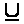</a> | **📂 檔名:** `Underlined.svg` ✨ **格式:** `Vector (SVG)` ⚖️ **大小:** `593.00B` 📅 **更新:** `2026-02-27`  🔗 [直接查看原始檔](Underlined.svg) |
|  | **📂 檔名:** `Up-arrow-2.svg` ✨ **格式:** `Vector (SVG)` ⚖️ **大小:** `453.00B` 📅 **更新:** `2026-02-27`  🔗 [直接查看原始檔](Up-arrow-2.svg) |
|  | **📂 檔名:** `Up-left_arrow.svg` ✨ **格式:** `Vector (SVG)` ⚖️ **大小:** `505.00B` 📅 **更新:** `2026-02-27`  🔗 [直接查看原始檔](Up-left_arrow.svg) |
| <a href="Up-right_arrow.svg">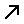</a> | **📂 檔名:** `Up-right_arrow.svg` ✨ **格式:** `Vector (SVG)` ⚖️ **大小:** `503.00B` 📅 **更新:** `2026-02-27`  🔗 [直接查看原始檔](Up-right_arrow.svg) |
|  | **📂 檔名:** `account-box.svg` ✨ **格式:** `Vector (SVG)` ⚖️ **大小:** `889.00B` 📅 **更新:** `2026-02-27`  🔗 [直接查看原始檔](account-box.svg) |
|  | **📂 檔名:** `add-1.svg` ✨ **格式:** `Vector (SVG)` ⚖️ **大小:** `448.00B` 📅 **更新:** `2026-02-27`  🔗 [直接查看原始檔](add-1.svg) |
|  | **📂 檔名:** `add-bookmark.svg` ✨ **格式:** `Vector (SVG)` ⚖️ **大小:** `639.00B` 📅 **更新:** `2026-02-27`  🔗 [直接查看原始檔](add-bookmark.svg) |
|  | **📂 檔名:** `add-box-multiple.svg` ✨ **格式:** `Vector (SVG)` ⚖️ **大小:** `594.00B` 📅 **更新:** `2026-02-27`  🔗 [直接查看原始檔](add-box-multiple.svg) |
|  | **📂 檔名:** `add-col.svg` ✨ **格式:** `Vector (SVG)` ⚖️ **大小:** `468.00B` 📅 **更新:** `2026-02-27`  🔗 [直接查看原始檔](add-col.svg) |
|  | **📂 檔名:** `add-folder.svg` ✨ **格式:** `Vector (SVG)` ⚖️ **大小:** `651.00B` 📅 **更新:** `2026-02-27`  🔗 [直接查看原始檔](add-folder.svg) |
|  | **📂 檔名:** `add-img.svg` ✨ **格式:** `Vector (SVG)` ⚖️ **大小:** `672.00B` 📅 **更新:** `2026-02-27`  🔗 [直接查看原始檔](add-img.svg) |
|  | **📂 檔名:** `add-messages.svg` ✨ **格式:** `Vector (SVG)` ⚖️ **大小:** `642.00B` 📅 **更新:** `2026-02-27`  🔗 [直接查看原始檔](add-messages.svg) |
|  | **📂 檔名:** `add-person.svg` ✨ **格式:** `Vector (SVG)` ⚖️ **大小:** `730.00B` 📅 **更新:** `2026-02-27`  🔗 [直接查看原始檔](add-person.svg) |
|  | **📂 檔名:** `add-row.svg` ✨ **格式:** `Vector (SVG)` ⚖️ **大小:** `467.00B` 📅 **更新:** `2026-02-27`  🔗 [直接查看原始檔](add-row.svg) |
|  | **📂 檔名:** `add.svg` ✨ **格式:** `Vector (SVG)` ⚖️ **大小:** `628.00B` 📅 **更新:** `2026-02-27`  🔗 [直接查看原始檔](add.svg) |
|  | **📂 檔名:** `alert-1.svg` ✨ **格式:** `Vector (SVG)` ⚖️ **大小:** `1.21KB` 📅 **更新:** `2026-02-27`  🔗 [直接查看原始檔](alert-1.svg) |
|  | **📂 檔名:** `alert.svg` ✨ **格式:** `Vector (SVG)` ⚖️ **大小:** `564.00B` 📅 **更新:** `2026-02-27`  🔗 [直接查看原始檔](alert.svg) |
|  | **📂 檔名:** `align-center-1.svg` ✨ **格式:** `Vector (SVG)` ⚖️ **大小:** `459.00B` 📅 **更新:** `2026-02-27`  🔗 [直接查看原始檔](align-center-1.svg) |
|  | **📂 檔名:** `align-center.svg` ✨ **格式:** `Vector (SVG)` ⚖️ **大小:** `660.00B` 📅 **更新:** `2026-02-27`  🔗 [直接查看原始檔](align-center.svg) |
|  | **📂 檔名:** `align-left.svg` ✨ **格式:** `Vector (SVG)` ⚖️ **大小:** `656.00B` 📅 **更新:** `2026-02-27`  🔗 [直接查看原始檔](align-left.svg) |
| <a href="align-right.svg">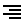</a> | **📂 檔名:** `align-right.svg` ✨ **格式:** `Vector (SVG)` ⚖️ **大小:** `658.00B` 📅 **更新:** `2026-02-27`  🔗 [直接查看原始檔](align-right.svg) |
|  | **📂 檔名:** `analytics.svg` ✨ **格式:** `Vector (SVG)` ⚖️ **大小:** `568.00B` 📅 **更新:** `2026-02-27`  🔗 [直接查看原始檔](analytics.svg) |
|  | **📂 檔名:** `andriod.svg` ✨ **格式:** `Vector (SVG)` ⚖️ **大小:** `546.00B` 📅 **更新:** `2026-02-27`  🔗 [直接查看原始檔](andriod.svg) |
|  | **📂 檔名:** `android.svg` ✨ **格式:** `Vector (SVG)` ⚖️ **大小:** `548.00B` 📅 **更新:** `2026-02-27`  🔗 [直接查看原始檔](android.svg) |
|  | **📂 檔名:** `animation.svg` ✨ **格式:** `Vector (SVG)` ⚖️ **大小:** `465.00B` 📅 **更新:** `2026-02-27`  🔗 [直接查看原始檔](animation.svg) |
|  | **📂 檔名:** `archer-1.svg` ✨ **格式:** `Vector (SVG)` ⚖️ **大小:** `861.00B` 📅 **更新:** `2026-02-27`  🔗 [直接查看原始檔](archer-1.svg) |
|  | **📂 檔名:** `archer-2.svg` ✨ **格式:** `Vector (SVG)` ⚖️ **大小:** `710.00B` 📅 **更新:** `2026-02-27`  🔗 [直接查看原始檔](archer-2.svg) |
| <a href="archer.svg">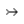</a> | **📂 檔名:** `archer.svg` ✨ **格式:** `Vector (SVG)` ⚖️ **大小:** `753.00B` 📅 **更新:** `2026-02-27`  🔗 [直接查看原始檔](archer.svg) |
|  | **📂 檔名:** `archive.svg` ✨ **格式:** `Vector (SVG)` ⚖️ **大小:** `1.01KB` 📅 **更新:** `2026-02-27`  🔗 [直接查看原始檔](archive.svg) |
|  | **📂 檔名:** `arrow lefrectangle.svg` ✨ **格式:** `Vector (SVG)` ⚖️ **大小:** `576.00B` 📅 **更新:** `2026-02-27`  🔗 [直接查看原始檔](arrow%20lefrectangle.svg) |
|  | **📂 檔名:** `arrow top.svg` ✨ **格式:** `Vector (SVG)` ⚖️ **大小:** `566.00B` 📅 **更新:** `2026-02-27`  🔗 [直接查看原始檔](arrow%20top.svg) |
|  | **📂 檔名:** `arrow-bar-left.svg` ✨ **格式:** `Vector (SVG)` ⚖️ **大小:** `523.00B` 📅 **更新:** `2026-02-27`  🔗 [直接查看原始檔](arrow-bar-left.svg) |
|  | **📂 檔名:** `arrow-bar-up.svg` ✨ **格式:** `Vector (SVG)` ⚖️ **大小:** `472.00B` 📅 **更新:** `2026-02-27`  🔗 [直接查看原始檔](arrow-bar-up.svg) |
|  | **📂 檔名:** `arrow-down-box.svg` ✨ **格式:** `Vector (SVG)` ⚖️ **大小:** `604.00B` 📅 **更新:** `2026-02-27`  🔗 [直接查看原始檔](arrow-down-box.svg) |
|  | **📂 檔名:** `arrow-down-circle.svg` ✨ **格式:** `Vector (SVG)` ⚖️ **大小:** `689.00B` 📅 **更新:** `2026-02-27`  🔗 [直接查看原始檔](arrow-down-circle.svg) |
|  | **📂 檔名:** `arrow-left-box.svg` ✨ **格式:** `Vector (SVG)` ⚖️ **大小:** `606.00B` 📅 **更新:** `2026-02-27`  🔗 [直接查看原始檔](arrow-left-box.svg) |
|  | **📂 檔名:** `arrow-left-circle.svg` ✨ **格式:** `Vector (SVG)` ⚖️ **大小:** `685.00B` 📅 **更新:** `2026-02-27`  🔗 [直接查看原始檔](arrow-left-circle.svg) |
|  | **📂 檔名:** `arrow-right-1.svg` ✨ **格式:** `Vector (SVG)` ⚖️ **大小:** `521.00B` 📅 **更新:** `2026-02-27`  🔗 [直接查看原始檔](arrow-right-1.svg) |
|  | **📂 檔名:** `arrow-right-circle.svg` ✨ **格式:** `Vector (SVG)` ⚖️ **大小:** `689.00B` 📅 **更新:** `2026-02-27`  🔗 [直接查看原始檔](arrow-right-circle.svg) |
|  | **📂 檔名:** `arrow-right-up.svg` ✨ **格式:** `Vector (SVG)` ⚖️ **大小:** `634.00B` 📅 **更新:** `2026-02-27`  🔗 [直接查看原始檔](arrow-right-up.svg) |
|  | **📂 檔名:** `arrow-right.svg` ✨ **格式:** `Vector (SVG)` ⚖️ **大小:** `490.00B` 📅 **更新:** `2026-02-27`  🔗 [直接查看原始檔](arrow-right.svg) |
|  | **📂 檔名:** `arrow-top-left.svg` ✨ **格式:** `Vector (SVG)` ⚖️ **大小:** `654.00B` 📅 **更新:** `2026-02-27`  🔗 [直接查看原始檔](arrow-top-left.svg) |
|  | **📂 檔名:** `arrow-up-box.svg` ✨ **格式:** `Vector (SVG)` ⚖️ **大小:** `601.00B` 📅 **更新:** `2026-02-27`  🔗 [直接查看原始檔](arrow-up-box.svg) |
|  | **📂 檔名:** `arrow.svg` ✨ **格式:** `Vector (SVG)` ⚖️ **大小:** `578.00B` 📅 **更新:** `2026-02-27`  🔗 [直接查看原始檔](arrow.svg) |
|  | **📂 檔名:** `arrow1.svg` ✨ **格式:** `Vector (SVG)` ⚖️ **大小:** `14.31KB` 📅 **更新:** `2026-02-27`  🔗 [直接查看原始檔](arrow1.svg) |
|  | **📂 檔名:** `arrow10.svg` ✨ **格式:** `Vector (SVG)` ⚖️ **大小:** `8.28KB` 📅 **更新:** `2026-02-27`  🔗 [直接查看原始檔](arrow10.svg) |
|  | **📂 檔名:** `arrow11.svg` ✨ **格式:** `Vector (SVG)` ⚖️ **大小:** `12.79KB` 📅 **更新:** `2026-02-27`  🔗 [直接查看原始檔](arrow11.svg) |
|  | **📂 檔名:** `arrow12.svg` ✨ **格式:** `Vector (SVG)` ⚖️ **大小:** `5.99KB` 📅 **更新:** `2026-02-27`  🔗 [直接查看原始檔](arrow12.svg) |
|  | **📂 檔名:** `arrow2.svg` ✨ **格式:** `Vector (SVG)` ⚖️ **大小:** `11.59KB` 📅 **更新:** `2026-02-27`  🔗 [直接查看原始檔](arrow2.svg) |
| <a href="arrow3.svg">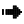</a> | **📂 檔名:** `arrow3.svg` ✨ **格式:** `Vector (SVG)` ⚖️ **大小:** `10.40KB` 📅 **更新:** `2026-02-27`  🔗 [直接查看原始檔](arrow3.svg) |
|  | **📂 檔名:** `arrow4.svg` ✨ **格式:** `Vector (SVG)` ⚖️ **大小:** `10.30KB` 📅 **更新:** `2026-02-27`  🔗 [直接查看原始檔](arrow4.svg) |
|  | **📂 檔名:** `arrow5.svg` ✨ **格式:** `Vector (SVG)` ⚖️ **大小:** `12.74KB` 📅 **更新:** `2026-02-27`  🔗 [直接查看原始檔](arrow5.svg) |
|  | **📂 檔名:** `arrow6.svg` ✨ **格式:** `Vector (SVG)` ⚖️ **大小:** `13.78KB` 📅 **更新:** `2026-02-27`  🔗 [直接查看原始檔](arrow6.svg) |
|  | **📂 檔名:** `arrow7.svg` ✨ **格式:** `Vector (SVG)` ⚖️ **大小:** `8.03KB` 📅 **更新:** `2026-02-27`  🔗 [直接查看原始檔](arrow7.svg) |
|  | **📂 檔名:** `arrow8.svg` ✨ **格式:** `Vector (SVG)` ⚖️ **大小:** `14.88KB` 📅 **更新:** `2026-02-27`  🔗 [直接查看原始檔](arrow8.svg) |
|  | **📂 檔名:** `arrow9.svg` ✨ **格式:** `Vector (SVG)` ⚖️ **大小:** `8.00KB` 📅 **更新:** `2026-02-27`  🔗 [直接查看原始檔](arrow9.svg) |
|  | **📂 檔名:** `arrowhead.svg` ✨ **格式:** `Vector (SVG)` ⚖️ **大小:** `1011.00B` 📅 **更新:** `2026-02-27`  🔗 [直接查看原始檔](arrowhead.svg) |
|  | **📂 檔名:** `arrowheads-1.svg` ✨ **格式:** `Vector (SVG)` ⚖️ **大小:** `929.00B` 📅 **更新:** `2026-02-27`  🔗 [直接查看原始檔](arrowheads-1.svg) |
|  | **📂 檔名:** `arrowheads-2.svg` ✨ **格式:** `Vector (SVG)` ⚖️ **大小:** `787.00B` 📅 **更新:** `2026-02-27`  🔗 [直接查看原始檔](arrowheads-2.svg) |
|  | **📂 檔名:** `arrowheads-3.svg` ✨ **格式:** `Vector (SVG)` ⚖️ **大小:** `827.00B` 📅 **更新:** `2026-02-27`  🔗 [直接查看原始檔](arrowheads-3.svg) |
|  | **📂 檔名:** `arrowheads.svg` ✨ **格式:** `Vector (SVG)` ⚖️ **大小:** `944.00B` 📅 **更新:** `2026-02-27`  🔗 [直接查看原始檔](arrowheads.svg) |
|  | **📂 檔名:** `arrows-1.svg` ✨ **格式:** `Vector (SVG)` ⚖️ **大小:** `939.00B` 📅 **更新:** `2026-02-27`  🔗 [直接查看原始檔](arrows-1.svg) |
|  | **📂 檔名:** `arrows-horizontal.svg` ✨ **格式:** `Vector (SVG)` ⚖️ **大小:** `686.00B` 📅 **更新:** `2026-02-27`  🔗 [直接查看原始檔](arrows-horizontal.svg) |
| <a href="arrows.svg">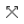</a> | **📂 檔名:** `arrows.svg` ✨ **格式:** `Vector (SVG)` ⚖️ **大小:** `1.02KB` 📅 **更新:** `2026-02-27`  🔗 [直接查看原始檔](arrows.svg) |
|  | **📂 檔名:** `art-text.svg` ✨ **格式:** `Vector (SVG)` ⚖️ **大小:** `459.00B` 📅 **更新:** `2026-02-27`  🔗 [直接查看原始檔](art-text.svg) |
|  | **📂 檔名:** `article-multiple.svg` ✨ **格式:** `Vector (SVG)` ⚖️ **大小:** `609.00B` 📅 **更新:** `2026-02-27`  🔗 [直接查看原始檔](article-multiple.svg) |
|  | **📂 檔名:** `article.svg` ✨ **格式:** `Vector (SVG)` ⚖️ **大小:** `543.00B` 📅 **更新:** `2026-02-27`  🔗 [直接查看原始檔](article.svg) |
|  | **📂 檔名:** `aspect-ratio.svg` ✨ **格式:** `Vector (SVG)` ⚖️ **大小:** `469.00B` 📅 **更新:** `2026-02-27`  🔗 [直接查看原始檔](aspect-ratio.svg) |
|  | **📂 檔名:** `at.svg` ✨ **格式:** `Vector (SVG)` ⚖️ **大小:** `429.00B` 📅 **更新:** `2026-02-27`  🔗 [直接查看原始檔](at.svg) |
|  | **📂 檔名:** `attachment.svg` ✨ **格式:** `Vector (SVG)` ⚖️ **大小:** `445.00B` 📅 **更新:** `2026-02-27`  🔗 [直接查看原始檔](attachment.svg) |
|  | **📂 檔名:** `attention.svg` ✨ **格式:** `Vector (SVG)` ⚖️ **大小:** `730.00B` 📅 **更新:** `2026-02-27`  🔗 [直接查看原始檔](attention.svg) |
| <a href="back.svg">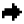</a> | **📂 檔名:** `back.svg` ✨ **格式:** `Vector (SVG)` ⚖️ **大小:** `492.00B` 📅 **更新:** `2026-02-27`  🔗 [直接查看原始檔](back.svg) |
|  | **📂 檔名:** `backburger.svg` ✨ **格式:** `Vector (SVG)` ⚖️ **大小:** `580.00B` 📅 **更新:** `2026-02-27`  🔗 [直接查看原始檔](backburger.svg) |
|  | **📂 檔名:** `bag.svg` ✨ **格式:** `Vector (SVG)` ⚖️ **大小:** `507.00B` 📅 **更新:** `2026-02-27`  🔗 [直接查看原始檔](bag.svg) |
|  | **📂 檔名:** `battery-1.svg` ✨ **格式:** `Vector (SVG)` ⚖️ **大小:** `574.00B` 📅 **更新:** `2026-02-27`  🔗 [直接查看原始檔](battery-1.svg) |
|  | **📂 檔名:** `battery.svg` ✨ **格式:** `Vector (SVG)` ⚖️ **大小:** `423.00B` 📅 **更新:** `2026-02-27`  🔗 [直接查看原始檔](battery.svg) |
|  | **📂 檔名:** `beauty-mirror.svg` ✨ **格式:** `Vector (SVG)` ⚖️ **大小:** `1.75KB` 📅 **更新:** `2026-02-27`  🔗 [直接查看原始檔](beauty-mirror.svg) |
|  | **📂 檔名:** `block-person.svg` ✨ **格式:** `Vector (SVG)` ⚖️ **大小:** `755.00B` 📅 **更新:** `2026-02-27`  🔗 [直接查看原始檔](block-person.svg) |
|  | **📂 檔名:** `block.svg` ✨ **格式:** `Vector (SVG)` ⚖️ **大小:** `559.00B` 📅 **更新:** `2026-02-27`  🔗 [直接查看原始檔](block.svg) |
| <a href="bold.svg">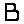</a> | **📂 檔名:** `bold.svg` ✨ **格式:** `Vector (SVG)` ⚖️ **大小:** `466.00B` 📅 **更新:** `2026-02-27`  🔗 [直接查看原始檔](bold.svg) |
|  | **📂 檔名:** `bookmark.svg` ✨ **格式:** `Vector (SVG)` ⚖️ **大小:** `520.00B` 📅 **更新:** `2026-02-27`  🔗 [直接查看原始檔](bookmark.svg) |
|  | **📂 檔名:** `box-outer-light-dashed-all.svg` ✨ **格式:** `Vector (SVG)` ⚖️ **大小:** `805.00B` 📅 **更新:** `2026-02-27`  🔗 [直接查看原始檔](box-outer-light-dashed-all.svg) |
|  | **📂 檔名:** `briefcase-1.svg` ✨ **格式:** `Vector (SVG)` ⚖️ **大小:** `473.00B` 📅 **更新:** `2026-02-27`  🔗 [直接查看原始檔](briefcase-1.svg) |
|  | **📂 檔名:** `briefcase-account.svg` ✨ **格式:** `Vector (SVG)` ⚖️ **大小:** `498.00B` 📅 **更新:** `2026-02-27`  🔗 [直接查看原始檔](briefcase-account.svg) |
|  | **📂 檔名:** `briefcase-check.svg` ✨ **格式:** `Vector (SVG)` ⚖️ **大小:** `519.00B` 📅 **更新:** `2026-02-27`  🔗 [直接查看原始檔](briefcase-check.svg) |
|  | **📂 檔名:** `briefcase-delete.svg` ✨ **格式:** `Vector (SVG)` ⚖️ **大小:** `523.00B` 📅 **更新:** `2026-02-27`  🔗 [直接查看原始檔](briefcase-delete.svg) |
|  | **📂 檔名:** `briefcase-download.svg` ✨ **格式:** `Vector (SVG)` ⚖️ **大小:** `532.00B` 📅 **更新:** `2026-02-27`  🔗 [直接查看原始檔](briefcase-download.svg) |
|  | **📂 檔名:** `briefcase-minus.svg` ✨ **格式:** `Vector (SVG)` ⚖️ **大小:** `477.00B` 📅 **更新:** `2026-02-27`  🔗 [直接查看原始檔](briefcase-minus.svg) |
|  | **📂 檔名:** `briefcase-plus.svg` ✨ **格式:** `Vector (SVG)` ⚖️ **大小:** `494.00B` 📅 **更新:** `2026-02-27`  🔗 [直接查看原始檔](briefcase-plus.svg) |
|  | **📂 檔名:** `briefcase-search.svg` ✨ **格式:** `Vector (SVG)` ⚖️ **大小:** `506.00B` 📅 **更新:** `2026-02-27`  🔗 [直接查看原始檔](briefcase-search.svg) |
|  | **📂 檔名:** `briefcase-upload.svg` ✨ **格式:** `Vector (SVG)` ⚖️ **大小:** `525.00B` 📅 **更新:** `2026-02-27`  🔗 [直接查看原始檔](briefcase-upload.svg) |
|  | **📂 檔名:** `briefcase.svg` ✨ **格式:** `Vector (SVG)` ⚖️ **大小:** `445.00B` 📅 **更新:** `2026-02-27`  🔗 [直接查看原始檔](briefcase.svg) |
|  | **📂 檔名:** `bubble.svg` ✨ **格式:** `Vector (SVG)` ⚖️ **大小:** `575.00B` 📅 **更新:** `2026-02-27`  🔗 [直接查看原始檔](bubble.svg) |
|  | **📂 檔名:** `build.svg` ✨ **格式:** `Vector (SVG)` ⚖️ **大小:** `543.00B` 📅 **更新:** `2026-02-27`  🔗 [直接查看原始檔](build.svg) |
|  | **📂 檔名:** `business-money-coin-currency.svg` ✨ **格式:** `Vector (SVG)` ⚖️ **大小:** `4.50KB` 📅 **更新:** `2026-02-27`  🔗 [直接查看原始檔](business-money-coin-currency.svg) |
|  | **📂 檔名:** `business-prodect-diamond.svg` ✨ **格式:** `Vector (SVG)` ⚖️ **大小:** `4.73KB` 📅 **更新:** `2026-02-27`  🔗 [直接查看原始檔](business-prodect-diamond.svg) |
| <a href="business-product-startup.svg">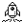</a> | **📂 檔名:** `business-product-startup.svg` ✨ **格式:** `Vector (SVG)` ⚖️ **大小:** `4.23KB` 📅 **更新:** `2026-02-27`  🔗 [直接查看原始檔](business-product-startup.svg) |
|  | **📂 檔名:** `business-products-cash-user-man-message.svg` ✨ **格式:** `Vector (SVG)` ⚖️ **大小:** `3.73KB` 📅 **更新:** `2026-02-27`  🔗 [直接查看原始檔](business-products-cash-user-man-message.svg) |
|  | **📂 檔名:** `calendar-1.svg` ✨ **格式:** `Vector (SVG)` ⚖️ **大小:** `968.00B` 📅 **更新:** `2026-02-27`  🔗 [直接查看原始檔](calendar-1.svg) |
|  | **📂 檔名:** `calendar-alert.svg` ✨ **格式:** `Vector (SVG)` ⚖️ **大小:** `500.00B` 📅 **更新:** `2026-02-27`  🔗 [直接查看原始檔](calendar-alert.svg) |
| <a href="calendar-arrow-left.svg">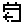</a> | **📂 檔名:** `calendar-arrow-left.svg` ✨ **格式:** `Vector (SVG)` ⚖️ **大小:** `537.00B` 📅 **更新:** `2026-02-27`  🔗 [直接查看原始檔](calendar-arrow-left.svg) |
|  | **📂 檔名:** `calendar-arrow-right.svg` ✨ **格式:** `Vector (SVG)` ⚖️ **大小:** `548.00B` 📅 **更新:** `2026-02-27`  🔗 [直接查看原始檔](calendar-arrow-right.svg) |
|  | **📂 檔名:** `calendar-check.svg` ✨ **格式:** `Vector (SVG)` ⚖️ **大小:** `645.00B` 📅 **更新:** `2026-02-27`  🔗 [直接查看原始檔](calendar-check.svg) |
|  | **📂 檔名:** `calendar-export.svg` ✨ **格式:** `Vector (SVG)` ⚖️ **大小:** `534.00B` 📅 **更新:** `2026-02-27`  🔗 [直接查看原始檔](calendar-export.svg) |
|  | **📂 檔名:** `calendar-grid.svg` ✨ **格式:** `Vector (SVG)` ⚖️ **大小:** `511.00B` 📅 **更新:** `2026-02-27`  🔗 [直接查看原始檔](calendar-grid.svg) |
|  | **📂 檔名:** `calendar-import.svg` ✨ **格式:** `Vector (SVG)` ⚖️ **大小:** `542.00B` 📅 **更新:** `2026-02-27`  🔗 [直接查看原始檔](calendar-import.svg) |
|  | **📂 檔名:** `calendar-minus.svg` ✨ **格式:** `Vector (SVG)` ⚖️ **大小:** `574.00B` 📅 **更新:** `2026-02-27`  🔗 [直接查看原始檔](calendar-minus.svg) |
|  | **📂 檔名:** `calendar-month.svg` ✨ **格式:** `Vector (SVG)` ⚖️ **大小:** `544.00B` 📅 **更新:** `2026-02-27`  🔗 [直接查看原始檔](calendar-month.svg) |
|  | **📂 檔名:** `calendar-multiple-check.svg` ✨ **格式:** `Vector (SVG)` ⚖️ **大小:** `566.00B` 📅 **更新:** `2026-02-27`  🔗 [直接查看原始檔](calendar-multiple-check.svg) |
|  | **📂 檔名:** `calendar-multiple.svg` ✨ **格式:** `Vector (SVG)` ⚖️ **大小:** `606.00B` 📅 **更新:** `2026-02-27`  🔗 [直接查看原始檔](calendar-multiple.svg) |
|  | **📂 檔名:** `calendar-plus.svg` ✨ **格式:** `Vector (SVG)` ⚖️ **大小:** `501.00B` 📅 **更新:** `2026-02-27`  🔗 [直接查看原始檔](calendar-plus.svg) |
|  | **📂 檔名:** `calendar-range.svg` ✨ **格式:** `Vector (SVG)` ⚖️ **大小:** `629.00B` 📅 **更新:** `2026-02-27`  🔗 [直接查看原始檔](calendar-range.svg) |
|  | **📂 檔名:** `calendar-remove.svg` ✨ **格式:** `Vector (SVG)` ⚖️ **大小:** `536.00B` 📅 **更新:** `2026-02-27`  🔗 [直接查看原始檔](calendar-remove.svg) |
|  | **📂 檔名:** `calendar-search.svg` ✨ **格式:** `Vector (SVG)` ⚖️ **大小:** `679.00B` 📅 **更新:** `2026-02-27`  🔗 [直接查看原始檔](calendar-search.svg) |
|  | **📂 檔名:** `calendar-sort-ascending.svg` ✨ **格式:** `Vector (SVG)` ⚖️ **大小:** `546.00B` 📅 **更新:** `2026-02-27`  🔗 [直接查看原始檔](calendar-sort-ascending.svg) |
|  | **📂 檔名:** `calendar-sort-descending.svg` ✨ **格式:** `Vector (SVG)` ⚖️ **大小:** `557.00B` 📅 **更新:** `2026-02-27`  🔗 [直接查看原始檔](calendar-sort-descending.svg) |
|  | **📂 檔名:** `calendar-text.svg` ✨ **格式:** `Vector (SVG)` ⚖️ **大小:** `493.00B` 📅 **更新:** `2026-02-27`  🔗 [直接查看原始檔](calendar-text.svg) |
|  | **📂 檔名:** `calendar-weekend.svg` ✨ **格式:** `Vector (SVG)` ⚖️ **大小:** `581.00B` 📅 **更新:** `2026-02-27`  🔗 [直接查看原始檔](calendar-weekend.svg) |
|  | **📂 檔名:** `calendar.svg` ✨ **格式:** `Vector (SVG)` ⚖️ **大小:** `515.00B` 📅 **更新:** `2026-02-27`  🔗 [直接查看原始檔](calendar.svg) |
|  | **📂 檔名:** `calendrectangletomorrow.svg` ✨ **格式:** `Vector (SVG)` ⚖️ **大小:** `643.00B` 📅 **更新:** `2026-02-27`  🔗 [直接查看原始檔](calendrectangletomorrow.svg) |
|  | **📂 檔名:** `call-On.svg` ✨ **格式:** `Vector (SVG)` ⚖️ **大小:** `615.00B` 📅 **更新:** `2026-02-27`  🔗 [直接查看原始檔](call-On.svg) |
|  | **📂 檔名:** `calls-Add.svg` ✨ **格式:** `Vector (SVG)` ⚖️ **大小:** `773.00B` 📅 **更新:** `2026-02-27`  🔗 [直接查看原始檔](calls-Add.svg) |
|  | **📂 檔名:** `calls-delete.svg` ✨ **格式:** `Vector (SVG)` ⚖️ **大小:** `761.00B` 📅 **更新:** `2026-02-27`  🔗 [直接查看原始檔](calls-delete.svg) |
|  | **📂 檔名:** `calls.svg` ✨ **格式:** `Vector (SVG)` ⚖️ **大小:** `640.00B` 📅 **更新:** `2026-02-27`  🔗 [直接查看原始檔](calls.svg) |
|  | **📂 檔名:** `camara.svg` ✨ **格式:** `Vector (SVG)` ⚖️ **大小:** `501.00B` 📅 **更新:** `2026-02-27`  🔗 [直接查看原始檔](camara.svg) |
|  | **📂 檔名:** `card-id.svg` ✨ **格式:** `Vector (SVG)` ⚖️ **大小:** `471.00B` 📅 **更新:** `2026-02-27`  🔗 [直接查看原始檔](card-id.svg) |
|  | **📂 檔名:** `card-stack.svg` ✨ **格式:** `Vector (SVG)` ⚖️ **大小:** `440.00B` 📅 **更新:** `2026-02-27`  🔗 [直接查看原始檔](card-stack.svg) |
|  | **📂 檔名:** `card-text.svg` ✨ **格式:** `Vector (SVG)` ⚖️ **大小:** `449.00B` 📅 **更新:** `2026-02-27`  🔗 [直接查看原始檔](card-text.svg) |
|  | **📂 檔名:** `cart-1.svg` ✨ **格式:** `Vector (SVG)` ⚖️ **大小:** `521.00B` 📅 **更新:** `2026-02-27`  🔗 [直接查看原始檔](cart-1.svg) |
|  | **📂 檔名:** `cart-2.svg` ✨ **格式:** `Vector (SVG)` ⚖️ **大小:** `459.00B` 📅 **更新:** `2026-02-27`  🔗 [直接查看原始檔](cart-2.svg) |
|  | **📂 檔名:** `cart.svg` ✨ **格式:** `Vector (SVG)` ⚖️ **大小:** `667.00B` 📅 **更新:** `2026-02-27`  🔗 [直接查看原始檔](cart.svg) |
|  | **📂 檔名:** `cast.svg` ✨ **格式:** `Vector (SVG)` ⚖️ **大小:** `465.00B` 📅 **更新:** `2026-02-27`  🔗 [直接查看原始檔](cast.svg) |
|  | **📂 檔名:** `chart-delete.svg` ✨ **格式:** `Vector (SVG)` ⚖️ **大小:** `527.00B` 📅 **更新:** `2026-02-27`  🔗 [直接查看原始檔](chart-delete.svg) |
|  | **📂 檔名:** `chart-minus.svg` ✨ **格式:** `Vector (SVG)` ⚖️ **大小:** `480.00B` 📅 **更新:** `2026-02-27`  🔗 [直接查看原始檔](chart-minus.svg) |
|  | **📂 檔名:** `chat-1.svg` ✨ **格式:** `Vector (SVG)` ⚖️ **大小:** `497.00B` 📅 **更新:** `2026-02-27`  🔗 [直接查看原始檔](chat-1.svg) |
|  | **📂 檔名:** `chat-email.svg` ✨ **格式:** `Vector (SVG)` ⚖️ **大小:** `3.10KB` 📅 **更新:** `2026-02-27`  🔗 [直接查看原始檔](chat-email.svg) |
|  | **📂 檔名:** `chat.svg` ✨ **格式:** `Vector (SVG)` ⚖️ **大小:** `497.00B` 📅 **更新:** `2026-02-27`  🔗 [直接查看原始檔](chat.svg) |
|  | **📂 檔名:** `check-double.svg` ✨ **格式:** `Vector (SVG)` ⚖️ **大小:** `827.00B` 📅 **更新:** `2026-02-27`  🔗 [直接查看原始檔](check-double.svg) |
|  | **📂 檔名:** `check.svg` ✨ **格式:** `Vector (SVG)` ⚖️ **大小:** `561.00B` 📅 **更新:** `2026-02-27`  🔗 [直接查看原始檔](check.svg) |
|  | **📂 檔名:** `checkbox orectangle.svg` ✨ **格式:** `Vector (SVG)` ⚖️ **大小:** `502.00B` 📅 **更新:** `2026-02-27`  🔗 [直接查看原始檔](checkbox%20orectangle.svg) |
|  | **📂 檔名:** `checkbox.svg` ✨ **格式:** `Vector (SVG)` ⚖️ **大小:** `587.00B` 📅 **更新:** `2026-02-27`  🔗 [直接查看原始檔](checkbox.svg) |
|  | **📂 檔名:** `chess.svg` ✨ **格式:** `Vector (SVG)` ⚖️ **大小:** `480.00B` 📅 **更新:** `2026-02-27`  🔗 [直接查看原始檔](chess.svg) |
|  | **📂 檔名:** `chevron-right.svg` ✨ **格式:** `Vector (SVG)` ⚖️ **大小:** `495.00B` 📅 **更新:** `2026-02-27`  🔗 [直接查看原始檔](chevron-right.svg) |
|  | **📂 檔名:** `chevrorectangledown.svg` ✨ **格式:** `Vector (SVG)` ⚖️ **大小:** `631.00B` 📅 **更新:** `2026-02-27`  🔗 [直接查看原始檔](chevrorectangledown.svg) |
|  | **📂 檔名:** `chevrorectangleleft.svg` ✨ **格式:** `Vector (SVG)` ⚖️ **大小:** `661.00B` 📅 **更新:** `2026-02-27`  🔗 [直接查看原始檔](chevrorectangleleft.svg) |
|  | **📂 檔名:** `chevrorectangletop.svg` ✨ **格式:** `Vector (SVG)` ⚖️ **大小:** `586.00B` 📅 **更新:** `2026-02-27`  🔗 [直接查看原始檔](chevrorectangletop.svg) |
|  | **📂 檔名:** `chip-svgrepo-com.svg` ✨ **格式:** `Vector (SVG)` ⚖️ **大小:** `695.00B` 📅 **更新:** `2026-02-27`  🔗 [直接查看原始檔](chip-svgrepo-com.svg) |
|  | **📂 檔名:** `circle.svg` ✨ **格式:** `Vector (SVG)` ⚖️ **大小:** `468.00B` 📅 **更新:** `2026-02-27`  🔗 [直接查看原始檔](circle.svg) |
|  | **📂 檔名:** `clipboard.svg` ✨ **格式:** `Vector (SVG)` ⚖️ **大小:** `457.00B` 📅 **更新:** `2026-02-27`  🔗 [直接查看原始檔](clipboard.svg) |
|  | **📂 檔名:** `clock-1.svg` ✨ **格式:** `Vector (SVG)` ⚖️ **大小:** `657.00B` 📅 **更新:** `2026-02-27`  🔗 [直接查看原始檔](clock-1.svg) |
|  | **📂 檔名:** `clock.svg` ✨ **格式:** `Vector (SVG)` ⚖️ **大小:** `540.00B` 📅 **更新:** `2026-02-27`  🔗 [直接查看原始檔](clock.svg) |
| <a href="close.svg">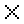</a> | **📂 檔名:** `close.svg` ✨ **格式:** `Vector (SVG)` ⚖️ **大小:** `525.00B` 📅 **更新:** `2026-02-27`  🔗 [直接查看原始檔](close.svg) |
|  | **📂 檔名:** `cloud-1.svg` ✨ **格式:** `Vector (SVG)` ⚖️ **大小:** `629.00B` 📅 **更新:** `2026-02-27`  🔗 [直接查看原始檔](cloud-1.svg) |
|  | **📂 檔名:** `cloud-download-1.svg` ✨ **格式:** `Vector (SVG)` ⚖️ **大小:** `751.00B` 📅 **更新:** `2026-02-27`  🔗 [直接查看原始檔](cloud-download-1.svg) |
| <a href="cloud-download.svg">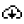</a> | **📂 檔名:** `cloud-download.svg` ✨ **格式:** `Vector (SVG)` ⚖️ **大小:** `754.00B` 📅 **更新:** `2026-02-27`  🔗 [直接查看原始檔](cloud-download.svg) |
|  | **📂 檔名:** `cloud.svg` ✨ **格式:** `Vector (SVG)` ⚖️ **大小:** `640.00B` 📅 **更新:** `2026-02-27`  🔗 [直接查看原始檔](cloud.svg) |
|  | **📂 檔名:** `code-variable.svg` ✨ **格式:** `Vector (SVG)` ⚖️ **大小:** `481.00B` 📅 **更新:** `2026-02-27`  🔗 [直接查看原始檔](code-variable.svg) |
|  | **📂 檔名:** `code.svg` ✨ **格式:** `Vector (SVG)` ⚖️ **大小:** `551.00B` 📅 **更新:** `2026-02-27`  🔗 [直接查看原始檔](code.svg) |
|  | **📂 檔名:** `coding-app-website-ui.svg` ✨ **格式:** `Vector (SVG)` ⚖️ **大小:** `2.23KB` 📅 **更新:** `2026-02-27`  🔗 [直接查看原始檔](coding-app-website-ui.svg) |
|  | **📂 檔名:** `coding-apps-websites-module.svg` ✨ **格式:** `Vector (SVG)` ⚖️ **大小:** `3.33KB` 📅 **更新:** `2026-02-27`  🔗 [直接查看原始檔](coding-apps-websites-module.svg) |
|  | **📂 檔名:** `coding-apps-websites-plugin.svg` ✨ **格式:** `Vector (SVG)` ⚖️ **大小:** `2.29KB` 📅 **更新:** `2026-02-27`  🔗 [直接查看原始檔](coding-apps-websites-plugin.svg) |
|  | **📂 檔名:** `coffee-1.svg` ✨ **格式:** `Vector (SVG)` ⚖️ **大小:** `622.00B` 📅 **更新:** `2026-02-27`  🔗 [直接查看原始檔](coffee-1.svg) |
|  | **📂 檔名:** `coffee.svg` ✨ **格式:** `Vector (SVG)` ⚖️ **大小:** `587.00B` 📅 **更新:** `2026-02-27`  🔗 [直接查看原始檔](coffee.svg) |
|  | **📂 檔名:** `colors-swatch.svg` ✨ **格式:** `Vector (SVG)` ⚖️ **大小:** `515.00B` 📅 **更新:** `2026-02-27`  🔗 [直接查看原始檔](colors-swatch.svg) |
|  | **📂 檔名:** `colse.svg` ✨ **格式:** `Vector (SVG)` ⚖️ **大小:** `673.00B` 📅 **更新:** `2026-02-27`  🔗 [直接查看原始檔](colse.svg) |
|  | **📂 檔名:** `command.svg` ✨ **格式:** `Vector (SVG)` ⚖️ **大小:** `557.00B` 📅 **更新:** `2026-02-27`  🔗 [直接查看原始檔](command.svg) |
|  | **📂 檔名:** `complete.svg` ✨ **格式:** `Vector (SVG)` ⚖️ **大小:** `503.00B` 📅 **更新:** `2026-02-27`  🔗 [直接查看原始檔](complete.svg) |
|  | **📂 檔名:** `computer-old-electronics.svg` ✨ **格式:** `Vector (SVG)` ⚖️ **大小:** `2.04KB` 📅 **更新:** `2026-02-27`  🔗 [直接查看原始檔](computer-old-electronics.svg) |
|  | **📂 檔名:** `computers-devices-electronics-tape-cassette.svg` ✨ **格式:** `Vector (SVG)` ⚖️ **大小:** `2.23KB` 📅 **更新:** `2026-02-27`  🔗 [直接查看原始檔](computers-devices-electronics-tape-cassette.svg) |
|  | **📂 檔名:** `contact-delete-1.svg` ✨ **格式:** `Vector (SVG)` ⚖️ **大小:** `734.00B` 📅 **更新:** `2026-02-27`  🔗 [直接查看原始檔](contact-delete-1.svg) |
|  | **📂 檔名:** `contact-delete.svg` ✨ **格式:** `Vector (SVG)` ⚖️ **大小:** `731.00B` 📅 **更新:** `2026-02-27`  🔗 [直接查看原始檔](contact-delete.svg) |
|  | **📂 檔名:** `content-files-archive-books.svg` ✨ **格式:** `Vector (SVG)` ⚖️ **大小:** `1.41KB` 📅 **更新:** `2026-02-27`  🔗 [直接查看原始檔](content-files-archive-books.svg) |
|  | **📂 檔名:** `content-files-close-book-bookmark.svg` ✨ **格式:** `Vector (SVG)` ⚖️ **大小:** `1.56KB` 📅 **更新:** `2026-02-27`  🔗 [直接查看原始檔](content-files-close-book-bookmark.svg) |
|  | **📂 檔名:** `content-files-newspaper.svg` ✨ **格式:** `Vector (SVG)` ⚖️ **大小:** `2.60KB` 📅 **更新:** `2026-02-27`  🔗 [直接查看原始檔](content-files-newspaper.svg) |
|  | **📂 檔名:** `content-files-pencil-brush.svg` ✨ **格式:** `Vector (SVG)` ⚖️ **大小:** `8.99KB` 📅 **更新:** `2026-02-27`  🔗 [直接查看原始檔](content-files-pencil-brush.svg) |
|  | **📂 檔名:** `content-files-quill-ink.svg` ✨ **格式:** `Vector (SVG)` ⚖️ **大小:** `3.27KB` 📅 **更新:** `2026-02-27`  🔗 [直接查看原始檔](content-files-quill-ink.svg) |
|  | **📂 檔名:** `copy-document.svg` ✨ **格式:** `Vector (SVG)` ⚖️ **大小:** `634.00B` 📅 **更新:** `2026-02-27`  🔗 [直接查看原始檔](copy-document.svg) |
|  | **📂 檔名:** `copy-folder.svg` ✨ **格式:** `Vector (SVG)` ⚖️ **大小:** `655.00B` 📅 **更新:** `2026-02-27`  🔗 [直接查看原始檔](copy-folder.svg) |
|  | **📂 檔名:** `copy.svg` ✨ **格式:** `Vector (SVG)` ⚖️ **大小:** `437.00B` 📅 **更新:** `2026-02-27`  🔗 [直接查看原始檔](copy.svg) |
|  | **📂 檔名:** `corner-down-right.svg` ✨ **格式:** `Vector (SVG)` ⚖️ **大小:** `489.00B` 📅 **更新:** `2026-02-27`  🔗 [直接查看原始檔](corner-down-right.svg) |
|  | **📂 檔名:** `corner-left-down.svg` ✨ **格式:** `Vector (SVG)` ⚖️ **大小:** `486.00B` 📅 **更新:** `2026-02-27`  🔗 [直接查看原始檔](corner-left-down.svg) |
|  | **📂 檔名:** `corner-left-up.svg` ✨ **格式:** `Vector (SVG)` ⚖️ **大小:** `476.00B` 📅 **更新:** `2026-02-27`  🔗 [直接查看原始檔](corner-left-up.svg) |
|  | **📂 檔名:** `corner-right-down.svg` ✨ **格式:** `Vector (SVG)` ⚖️ **大小:** `493.00B` 📅 **更新:** `2026-02-27`  🔗 [直接查看原始檔](corner-right-down.svg) |
|  | **📂 檔名:** `corner-up-left.svg` ✨ **格式:** `Vector (SVG)` ⚖️ **大小:** `473.00B` 📅 **更新:** `2026-02-27`  🔗 [直接查看原始檔](corner-up-left.svg) |
|  | **📂 檔名:** `create-document.svg` ✨ **格式:** `Vector (SVG)` ⚖️ **大小:** `632.00B` 📅 **更新:** `2026-02-27`  🔗 [直接查看原始檔](create-document.svg) |
|  | **📂 檔名:** `create-folder.svg` ✨ **格式:** `Vector (SVG)` ⚖️ **大小:** `610.00B` 📅 **更新:** `2026-02-27`  🔗 [直接查看原始檔](create-folder.svg) |
|  | **📂 檔名:** `credit-card-delete.svg` ✨ **格式:** `Vector (SVG)` ⚖️ **大小:** `523.00B` 📅 **更新:** `2026-02-27`  🔗 [直接查看原始檔](credit-card-delete.svg) |
|  | **📂 檔名:** `crop.svg` ✨ **格式:** `Vector (SVG)` ⚖️ **大小:** `434.00B` 📅 **更新:** `2026-02-27`  🔗 [直接查看原始檔](crop.svg) |
|  | **📂 檔名:** `crossing-1.svg` ✨ **格式:** `Vector (SVG)` ⚖️ **大小:** `779.00B` 📅 **更新:** `2026-02-27`  🔗 [直接查看原始檔](crossing-1.svg) |
|  | **📂 檔名:** `crossing-2.svg` ✨ **格式:** `Vector (SVG)` ⚖️ **大小:** `816.00B` 📅 **更新:** `2026-02-27`  🔗 [直接查看原始檔](crossing-2.svg) |
|  | **📂 檔名:** `crossing.svg` ✨ **格式:** `Vector (SVG)` ⚖️ **大小:** `743.00B` 📅 **更新:** `2026-02-27`  🔗 [直接查看原始檔](crossing.svg) |
|  | **📂 檔名:** `crown.svg` ✨ **格式:** `Vector (SVG)` ⚖️ **大小:** `762.00B` 📅 **更新:** `2026-02-27`  🔗 [直接查看原始檔](crown.svg) |
| <a href="cut.svg">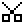</a> | **📂 檔名:** `cut.svg` ✨ **格式:** `Vector (SVG)` ⚖️ **大小:** `527.00B` 📅 **更新:** `2026-02-27`  🔗 [直接查看原始檔](cut.svg) |
|  | **📂 檔名:** `dashbaord.svg` ✨ **格式:** `Vector (SVG)` ⚖️ **大小:** `657.00B` 📅 **更新:** `2026-02-27`  🔗 [直接查看原始檔](dashbaord.svg) |
|  | **📂 檔名:** `delete-bookmark.svg` ✨ **格式:** `Vector (SVG)` ⚖️ **大小:** `628.00B` 📅 **更新:** `2026-02-27`  🔗 [直接查看原始檔](delete-bookmark.svg) |
|  | **📂 檔名:** `delete-folder.svg` ✨ **格式:** `Vector (SVG)` ⚖️ **大小:** `593.00B` 📅 **更新:** `2026-02-27`  🔗 [直接查看原始檔](delete-folder.svg) |
|  | **📂 檔名:** `delete-message.svg` ✨ **格式:** `Vector (SVG)` ⚖️ **大小:** `629.00B` 📅 **更新:** `2026-02-27`  🔗 [直接查看原始檔](delete-message.svg) |
| <a href="delete-person.svg">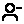</a> | **📂 檔名:** `delete-person.svg` ✨ **格式:** `Vector (SVG)` ⚖️ **大小:** `722.00B` 📅 **更新:** `2026-02-27`  🔗 [直接查看原始檔](delete-person.svg) |
|  | **📂 檔名:** `delete.svg` ✨ **格式:** `Vector (SVG)` ⚖️ **大小:** `615.00B` 📅 **更新:** `2026-02-27`  🔗 [直接查看原始檔](delete.svg) |
|  | **📂 檔名:** `design-color-painting-palette.svg` ✨ **格式:** `Vector (SVG)` ⚖️ **大小:** `4.53KB` 📅 **更新:** `2026-02-27`  🔗 [直接查看原始檔](design-color-painting-palette.svg) |
|  | **📂 檔名:** `design-color-spray.svg` ✨ **格式:** `Vector (SVG)` ⚖️ **大小:** `3.84KB` 📅 **更新:** `2026-02-27`  🔗 [直接查看原始檔](design-color-spray.svg) |
|  | **📂 檔名:** `deskphone.svg` ✨ **格式:** `Vector (SVG)` ⚖️ **大小:** `490.00B` 📅 **更新:** `2026-02-27`  🔗 [直接查看原始檔](deskphone.svg) |
|  | **📂 檔名:** `device-tablet.svg` ✨ **格式:** `Vector (SVG)` ⚖️ **大小:** `451.00B` 📅 **更新:** `2026-02-27`  🔗 [直接查看原始檔](device-tablet.svg) |
|  | **📂 檔名:** `devices.svg` ✨ **格式:** `Vector (SVG)` ⚖️ **大小:** `487.00B` 📅 **更新:** `2026-02-27`  🔗 [直接查看原始檔](devices.svg) |
|  | **📂 檔名:** `diary.svg` ✨ **格式:** `Vector (SVG)` ⚖️ **大小:** `500.00B` 📅 **更新:** `2026-02-27`  🔗 [直接查看原始檔](diary.svg) |
|  | **📂 檔名:** `direction.svg` ✨ **格式:** `Vector (SVG)` ⚖️ **大小:** `638.00B` 📅 **更新:** `2026-02-27`  🔗 [直接查看原始檔](direction.svg) |
|  | **📂 檔名:** `document.svg` ✨ **格式:** `Vector (SVG)` ⚖️ **大小:** `499.00B` 📅 **更新:** `2026-02-27`  🔗 [直接查看原始檔](document.svg) |
|  | **📂 檔名:** `down-arrow.svg` ✨ **格式:** `Vector (SVG)` ⚖️ **大小:** `461.00B` 📅 **更新:** `2026-02-27`  🔗 [直接查看原始檔](down-arrow.svg) |
|  | **📂 檔名:** `down-left_arrow.svg` ✨ **格式:** `Vector (SVG)` ⚖️ **大小:** `508.00B` 📅 **更新:** `2026-02-27`  🔗 [直接查看原始檔](down-left_arrow.svg) |
|  | **📂 檔名:** `down-right_arrow.svg` ✨ **格式:** `Vector (SVG)` ⚖️ **大小:** `506.00B` 📅 **更新:** `2026-02-27`  🔗 [直接查看原始檔](down-right_arrow.svg) |
| <a href="downasaur.svg">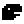</a> | **📂 檔名:** `downasaur.svg` ✨ **格式:** `Vector (SVG)` ⚖️ **大小:** `454.00B` 📅 **更新:** `2026-02-27`  🔗 [直接查看原始檔](downasaur.svg) |
|  | **📂 檔名:** `download-1.svg` ✨ **格式:** `Vector (SVG)` ⚖️ **大小:** `711.00B` 📅 **更新:** `2026-02-27`  🔗 [直接查看原始檔](download-1.svg) |
|  | **📂 檔名:** `download-2.svg` ✨ **格式:** `Vector (SVG)` ⚖️ **大小:** `661.00B` 📅 **更新:** `2026-02-27`  🔗 [直接查看原始檔](download-2.svg) |
|  | **📂 檔名:** `download-3.svg` ✨ **格式:** `Vector (SVG)` ⚖️ **大小:** `613.00B` 📅 **更新:** `2026-02-27`  🔗 [直接查看原始檔](download-3.svg) |
|  | **📂 檔名:** `download.svg` ✨ **格式:** `Vector (SVG)` ⚖️ **大小:** `678.00B` 📅 **更新:** `2026-02-27`  🔗 [直接查看原始檔](download.svg) |
| <a href="downloading.svg">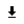</a> | **📂 檔名:** `downloading.svg` ✨ **格式:** `Vector (SVG)` ⚖️ **大小:** `584.00B` 📅 **更新:** `2026-02-27`  🔗 [直接查看原始檔](downloading.svg) |
|  | **📂 檔名:** `draft.svg` ✨ **格式:** `Vector (SVG)` ⚖️ **大小:** `528.00B` 📅 **更新:** `2026-02-27`  🔗 [直接查看原始檔](draft.svg) |
|  | **📂 檔名:** `drag-and-drop.svg` ✨ **格式:** `Vector (SVG)` ⚖️ **大小:** `754.00B` 📅 **更新:** `2026-02-27`  🔗 [直接查看原始檔](drag-and-drop.svg) |
|  | **📂 檔名:** `drop-half.svg` ✨ **格式:** `Vector (SVG)` ⚖️ **大小:** `481.00B` 📅 **更新:** `2026-02-27`  🔗 [直接查看原始檔](drop-half.svg) |
| <a href="duplicate-alt.svg">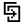</a> | **📂 檔名:** `duplicate-alt.svg` ✨ **格式:** `Vector (SVG)` ⚖️ **大小:** `649.00B` 📅 **更新:** `2026-02-27`  🔗 [直接查看原始檔](duplicate-alt.svg) |
|  | **📂 檔名:** `duplicate.svg` ✨ **格式:** `Vector (SVG)` ⚖️ **大小:** `529.00B` 📅 **更新:** `2026-02-27`  🔗 [直接查看原始檔](duplicate.svg) |
|  | **📂 檔名:** `ecology-clean-battery.svg` ✨ **格式:** `Vector (SVG)` ⚖️ **大小:** `3.26KB` 📅 **更新:** `2026-02-27`  🔗 [直接查看原始檔](ecology-clean-battery.svg) |
|  | **📂 檔名:** `ecology-global-warming-globe-fire.svg` ✨ **格式:** `Vector (SVG)` ⚖️ **大小:** `5.34KB` 📅 **更新:** `2026-02-27`  🔗 [直接查看原始檔](ecology-global-warming-globe-fire.svg) |
|  | **📂 檔名:** `ecology-plant-growth-soil-nature.svg` ✨ **格式:** `Vector (SVG)` ⚖️ **大小:** `6.47KB` 📅 **更新:** `2026-02-27`  🔗 [直接查看原始檔](ecology-plant-growth-soil-nature.svg) |
|  | **📂 檔名:** `edit-1.svg` ✨ **格式:** `Vector (SVG)` ⚖️ **大小:** `646.00B` 📅 **更新:** `2026-02-27`  🔗 [直接查看原始檔](edit-1.svg) |
|  | **📂 檔名:** `edit.svg` ✨ **格式:** `Vector (SVG)` ⚖️ **大小:** `565.00B` 📅 **更新:** `2026-02-27`  🔗 [直接查看原始檔](edit.svg) |
|  | **📂 檔名:** `email-envelope.svg` ✨ **格式:** `Vector (SVG)` ⚖️ **大小:** `1.73KB` 📅 **更新:** `2026-02-27`  🔗 [直接查看原始檔](email-envelope.svg) |
|  | **📂 檔名:** `email-mail-open-address.svg` ✨ **格式:** `Vector (SVG)` ⚖️ **大小:** `4.04KB` 📅 **更新:** `2026-02-27`  🔗 [直接查看原始檔](email-mail-open-address.svg) |
|  | **📂 檔名:** `email-stamp-mail.svg` ✨ **格式:** `Vector (SVG)` ⚖️ **大小:** `2.87KB` 📅 **更新:** `2026-02-27`  🔗 [直接查看原始檔](email-stamp-mail.svg) |
|  | **📂 檔名:** `entertainment-events-hobbies-film-player.svg` ✨ **格式:** `Vector (SVG)` ⚖️ **大小:** `1.50KB` 📅 **更新:** `2026-02-27`  🔗 [直接查看原始檔](entertainment-events-hobbies-film-player.svg) |
|  | **📂 檔名:** `expand-1.svg` ✨ **格式:** `Vector (SVG)` ⚖️ **大小:** `588.00B` 📅 **更新:** `2026-02-27`  🔗 [直接查看原始檔](expand-1.svg) |
|  | **📂 檔名:** `expand.svg` ✨ **格式:** `Vector (SVG)` ⚖️ **大小:** `513.00B` 📅 **更新:** `2026-02-27`  🔗 [直接查看原始檔](expand.svg) |
|  | **📂 檔名:** `export-1.svg` ✨ **格式:** `Vector (SVG)` ⚖️ **大小:** `703.00B` 📅 **更新:** `2026-02-27`  🔗 [直接查看原始檔](export-1.svg) |
|  | **📂 檔名:** `export.svg` ✨ **格式:** `Vector (SVG)` ⚖️ **大小:** `587.00B` 📅 **更新:** `2026-02-27`  🔗 [直接查看原始檔](export.svg) |
|  | **📂 檔名:** `external-link.svg` ✨ **格式:** `Vector (SVG)` ⚖️ **大小:** `627.00B` 📅 **更新:** `2026-02-27`  🔗 [直接查看原始檔](external-link.svg) |
|  | **📂 檔名:** `eye-closed.svg` ✨ **格式:** `Vector (SVG)` ⚖️ **大小:** `670.00B` 📅 **更新:** `2026-02-27`  🔗 [直接查看原始檔](eye-closed.svg) |
|  | **📂 檔名:** `eye.svg` ✨ **格式:** `Vector (SVG)` ⚖️ **大小:** `741.00B` 📅 **更新:** `2026-02-27`  🔗 [直接查看原始檔](eye.svg) |
|  | **📂 檔名:** `favorites.svg` ✨ **格式:** `Vector (SVG)` ⚖️ **大小:** `603.00B` 📅 **更新:** `2026-02-27`  🔗 [直接查看原始檔](favorites.svg) |
|  | **📂 檔名:** `figma.svg` ✨ **格式:** `Vector (SVG)` ⚖️ **大小:** `1.04KB` 📅 **更新:** `2026-02-27`  🔗 [直接查看原始檔](figma.svg) |
|  | **📂 檔名:** `file-add.svg` ✨ **格式:** `Vector (SVG)` ⚖️ **大小:** `790.00B` 📅 **更新:** `2026-02-27`  🔗 [直接查看原始檔](file-add.svg) |
|  | **📂 檔名:** `file-delete.svg` ✨ **格式:** `Vector (SVG)` ⚖️ **大小:** `514.00B` 📅 **更新:** `2026-02-27`  🔗 [直接查看原始檔](file-delete.svg) |
|  | **📂 檔名:** `file-detail.svg` ✨ **格式:** `Vector (SVG)` ⚖️ **大小:** `866.00B` 📅 **更新:** `2026-02-27`  🔗 [直接查看原始檔](file-detail.svg) |
|  | **📂 檔名:** `file-flash.svg` ✨ **格式:** `Vector (SVG)` ⚖️ **大小:** `505.00B` 📅 **更新:** `2026-02-27`  🔗 [直接查看原始檔](file-flash.svg) |
|  | **📂 檔名:** `file-minus.svg` ✨ **格式:** `Vector (SVG)` ⚖️ **大小:** `472.00B` 📅 **更新:** `2026-02-27`  🔗 [直接查看原始檔](file-minus.svg) |
|  | **📂 檔名:** `file-multiple.svg` ✨ **格式:** `Vector (SVG)` ⚖️ **大小:** `479.00B` 📅 **更新:** `2026-02-27`  🔗 [直接查看原始檔](file-multiple.svg) |
|  | **📂 檔名:** `file-plus.svg` ✨ **格式:** `Vector (SVG)` ⚖️ **大小:** `489.00B` 📅 **更新:** `2026-02-27`  🔗 [直接查看原始檔](file-plus.svg) |
|  | **📂 檔名:** `file-remove.svg` ✨ **格式:** `Vector (SVG)` ⚖️ **大小:** `744.00B` 📅 **更新:** `2026-02-27`  🔗 [直接查看原始檔](file-remove.svg) |
|  | **📂 檔名:** `file.svg` ✨ **格式:** `Vector (SVG)` ⚖️ **大小:** `600.00B` 📅 **更新:** `2026-02-27`  🔗 [直接查看原始檔](file.svg) |
|  | **📂 檔名:** `fill-half.svg` ✨ **格式:** `Vector (SVG)` ⚖️ **大小:** `529.00B` 📅 **更新:** `2026-02-27`  🔗 [直接查看原始檔](fill-half.svg) |
|  | **📂 檔名:** `fill.svg` ✨ **格式:** `Vector (SVG)` ⚖️ **大小:** `548.00B` 📅 **更新:** `2026-02-27`  🔗 [直接查看原始檔](fill.svg) |
|  | **📂 檔名:** `film.svg` ✨ **格式:** `Vector (SVG)` ⚖️ **大小:** `722.00B` 📅 **更新:** `2026-02-27`  🔗 [直接查看原始檔](film.svg) |
|  | **📂 檔名:** `filter-1.svg` ✨ **格式:** `Vector (SVG)` ⚖️ **大小:** `814.00B` 📅 **更新:** `2026-02-27`  🔗 [直接查看原始檔](filter-1.svg) |
|  | **📂 檔名:** `filter.svg` ✨ **格式:** `Vector (SVG)` ⚖️ **大小:** `619.00B` 📅 **更新:** `2026-02-27`  🔗 [直接查看原始檔](filter.svg) |
|  | **📂 檔名:** `flag-1.svg` ✨ **格式:** `Vector (SVG)` ⚖️ **大小:** `487.00B` 📅 **更新:** `2026-02-27`  🔗 [直接查看原始檔](flag-1.svg) |
|  | **📂 檔名:** `flag.svg` ✨ **格式:** `Vector (SVG)` ⚖️ **大小:** `471.00B` 📅 **更新:** `2026-02-27`  🔗 [直接查看原始檔](flag.svg) |
|  | **📂 檔名:** `flatten.svg` ✨ **格式:** `Vector (SVG)` ⚖️ **大小:** `470.00B` 📅 **更新:** `2026-02-27`  🔗 [直接查看原始檔](flatten.svg) |
|  | **📂 檔名:** `flip.svg` ✨ **格式:** `Vector (SVG)` ⚖️ **大小:** `699.00B` 📅 **更新:** `2026-02-27`  🔗 [直接查看原始檔](flip.svg) |
|  | **📂 檔名:** `float-center.svg` ✨ **格式:** `Vector (SVG)` ⚖️ **大小:** `506.00B` 📅 **更新:** `2026-02-27`  🔗 [直接查看原始檔](float-center.svg) |
|  | **📂 檔名:** `float-left.svg` ✨ **格式:** `Vector (SVG)` ⚖️ **大小:** `475.00B` 📅 **更新:** `2026-02-27`  🔗 [直接查看原始檔](float-left.svg) |
|  | **📂 檔名:** `float-right.svg` ✨ **格式:** `Vector (SVG)` ⚖️ **大小:** `483.00B` 📅 **更新:** `2026-02-27`  🔗 [直接查看原始檔](float-right.svg) |
|  | **📂 檔名:** `folder-1.svg` ✨ **格式:** `Vector (SVG)` ⚖️ **大小:** `472.00B` 📅 **更新:** `2026-02-27`  🔗 [直接查看原始檔](folder-1.svg) |
|  | **📂 檔名:** `folder-x.svg` ✨ **格式:** `Vector (SVG)` ⚖️ **大小:** `491.00B` 📅 **更新:** `2026-02-27`  🔗 [直接查看原始檔](folder-x.svg) |
|  | **📂 檔名:** `folder.svg` ✨ **格式:** `Vector (SVG)` ⚖️ **大小:** `458.00B` 📅 **更新:** `2026-02-27`  🔗 [直接查看原始檔](folder.svg) |
|  | **📂 檔名:** `food-drink-bread.svg` ✨ **格式:** `Vector (SVG)` ⚖️ **大小:** `2.15KB` 📅 **更新:** `2026-02-27`  🔗 [直接查看原始檔](food-drink-bread.svg) |
|  | **📂 檔名:** `forward-1.svg` ✨ **格式:** `Vector (SVG)` ⚖️ **大小:** `708.00B` 📅 **更新:** `2026-02-27`  🔗 [直接查看原始檔](forward-1.svg) |
|  | **📂 檔名:** `forward.svg` ✨ **格式:** `Vector (SVG)` ⚖️ **大小:** `984.00B` 📅 **更新:** `2026-02-27`  🔗 [直接查看原始檔](forward.svg) |
|  | **📂 檔名:** `forwardburger.svg` ✨ **格式:** `Vector (SVG)` ⚖️ **大小:** `488.00B` 📅 **更新:** `2026-02-27`  🔗 [直接查看原始檔](forwardburger.svg) |
|  | **📂 檔名:** `foward.svg` ✨ **格式:** `Vector (SVG)` ⚖️ **大小:** `610.00B` 📅 **更新:** `2026-02-27`  🔗 [直接查看原始檔](foward.svg) |
|  | **📂 檔名:** `frame-add.svg` ✨ **格式:** `Vector (SVG)` ⚖️ **大小:** `459.00B` 📅 **更新:** `2026-02-27`  🔗 [直接查看原始檔](frame-add.svg) |
|  | **📂 檔名:** `frame-check.svg` ✨ **格式:** `Vector (SVG)` ⚖️ **大小:** `475.00B` 📅 **更新:** `2026-02-27`  🔗 [直接查看原始檔](frame-check.svg) |
|  | **📂 檔名:** `frame-delete.svg` ✨ **格式:** `Vector (SVG)` ⚖️ **大小:** `488.00B` 📅 **更新:** `2026-02-27`  🔗 [直接查看原始檔](frame-delete.svg) |
|  | **📂 檔名:** `gamepad-center.svg` ✨ **格式:** `Vector (SVG)` ⚖️ **大小:** `508.00B` 📅 **更新:** `2026-02-27`  🔗 [直接查看原始檔](gamepad-center.svg) |
|  | **📂 檔名:** `gamepad-down-left.svg` ✨ **格式:** `Vector (SVG)` ⚖️ **大小:** `510.00B` 📅 **更新:** `2026-02-27`  🔗 [直接查看原始檔](gamepad-down-left.svg) |
|  | **📂 檔名:** `gamepad-down-right.svg` ✨ **格式:** `Vector (SVG)` ⚖️ **大小:** `515.00B` 📅 **更新:** `2026-02-27`  🔗 [直接查看原始檔](gamepad-down-right.svg) |
|  | **📂 檔名:** `gamepad-down.svg` ✨ **格式:** `Vector (SVG)` ⚖️ **大小:** `485.00B` 📅 **更新:** `2026-02-27`  🔗 [直接查看原始檔](gamepad-down.svg) |
|  | **📂 檔名:** `gamepad-empty.svg` ✨ **格式:** `Vector (SVG)` ⚖️ **大小:** `505.00B` 📅 **更新:** `2026-02-27`  🔗 [直接查看原始檔](gamepad-empty.svg) |
|  | **📂 檔名:** `gamepad-left.svg` ✨ **格式:** `Vector (SVG)` ⚖️ **大小:** `483.00B` 📅 **更新:** `2026-02-27`  🔗 [直接查看原始檔](gamepad-left.svg) |
|  | **📂 檔名:** `gamepad-right.svg` ✨ **格式:** `Vector (SVG)` ⚖️ **大小:** `490.00B` 📅 **更新:** `2026-02-27`  🔗 [直接查看原始檔](gamepad-right.svg) |
|  | **📂 檔名:** `gamepad-up-left.svg` ✨ **格式:** `Vector (SVG)` ⚖️ **大小:** `506.00B` 📅 **更新:** `2026-02-27`  🔗 [直接查看原始檔](gamepad-up-left.svg) |
|  | **📂 檔名:** `gamepad-up-right.svg` ✨ **格式:** `Vector (SVG)` ⚖️ **大小:** `510.00B` 📅 **更新:** `2026-02-27`  🔗 [直接查看原始檔](gamepad-up-right.svg) |
|  | **📂 檔名:** `gamepad-up.svg` ✨ **格式:** `Vector (SVG)` ⚖️ **大小:** `481.00B` 📅 **更新:** `2026-02-27`  🔗 [直接查看原始檔](gamepad-up.svg) |
|  | **📂 檔名:** `gif.svg` ✨ **格式:** `Vector (SVG)` ⚖️ **大小:** `551.00B` 📅 **更新:** `2026-02-27`  🔗 [直接查看原始檔](gif.svg) |
|  | **📂 檔名:** `git-branch.svg` ✨ **格式:** `Vector (SVG)` ⚖️ **大小:** `476.00B` 📅 **更新:** `2026-02-27`  🔗 [直接查看原始檔](git-branch.svg) |
|  | **📂 檔名:** `git-commit.svg` ✨ **格式:** `Vector (SVG)` ⚖️ **大小:** `445.00B` 📅 **更新:** `2026-02-27`  🔗 [直接查看原始檔](git-commit.svg) |
|  | **📂 檔名:** `git-merge.svg` ✨ **格式:** `Vector (SVG)` ⚖️ **大小:** `477.00B` 📅 **更新:** `2026-02-27`  🔗 [直接查看原始檔](git-merge.svg) |
|  | **📂 檔名:** `gps.svg` ✨ **格式:** `Vector (SVG)` ⚖️ **大小:** `455.00B` 📅 **更新:** `2026-02-27`  🔗 [直接查看原始檔](gps.svg) |
|  | **📂 檔名:** `grid.svg` ✨ **格式:** `Vector (SVG)` ⚖️ **大小:** `507.00B` 📅 **更新:** `2026-02-27`  🔗 [直接查看原始檔](grid.svg) |
|  | **📂 檔名:** `group.svg` ✨ **格式:** `Vector (SVG)` ⚖️ **大小:** `553.00B` 📅 **更新:** `2026-02-27`  🔗 [直接查看原始檔](group.svg) |
|  | **📂 檔名:** `hand-awesome.svg` ✨ **格式:** `Vector (SVG)` ⚖️ **大小:** `2.38KB` 📅 **更新:** `2026-02-27`  🔗 [直接查看原始檔](hand-awesome.svg) |
|  | **📂 檔名:** `hand-cross-finger-heart.svg` ✨ **格式:** `Vector (SVG)` ⚖️ **大小:** `4.30KB` 📅 **更新:** `2026-02-27`  🔗 [直接查看原始檔](hand-cross-finger-heart.svg) |
| <a href="hand-love-sign.svg">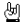</a> | **📂 檔名:** `hand-love-sign.svg` ✨ **格式:** `Vector (SVG)` ⚖️ **大小:** `2.10KB` 📅 **更新:** `2026-02-27`  🔗 [直接查看原始檔](hand-love-sign.svg) |
|  | **📂 檔名:** `hash.svg` ✨ **格式:** `Vector (SVG)` ⚖️ **大小:** `521.00B` 📅 **更新:** `2026-02-27`  🔗 [直接查看原始檔](hash.svg) |
|  | **📂 檔名:** `hd.svg` ✨ **格式:** `Vector (SVG)` ⚖️ **大小:** `443.00B` 📅 **更新:** `2026-02-27`  🔗 [直接查看原始檔](hd.svg) |
|  | **📂 檔名:** `headphones.svg` ✨ **格式:** `Vector (SVG)` ⚖️ **大小:** `600.00B` 📅 **更新:** `2026-02-27`  🔗 [直接查看原始檔](headphones.svg) |
|  | **📂 檔名:** `health-drug-medicine-water.svg` ✨ **格式:** `Vector (SVG)` ⚖️ **大小:** `2.57KB` 📅 **更新:** `2026-02-27`  🔗 [直接查看原始檔](health-drug-medicine-water.svg) |
| <a href="health-drug-medicine.svg">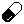</a> | **📂 檔名:** `health-drug-medicine.svg` ✨ **格式:** `Vector (SVG)` ⚖️ **大小:** `2.20KB` 📅 **更新:** `2026-02-27`  🔗 [直接查看原始檔](health-drug-medicine.svg) |
|  | **📂 檔名:** `health-drugs-pill.svg` ✨ **格式:** `Vector (SVG)` ⚖️ **大小:** `2.81KB` 📅 **更新:** `2026-02-27`  🔗 [直接查看原始檔](health-drugs-pill.svg) |
|  | **📂 檔名:** `health-laboratory-test-blood-sugar.svg` ✨ **格式:** `Vector (SVG)` ⚖️ **大小:** `7.78KB` 📅 **更新:** `2026-02-27`  🔗 [直接查看原始檔](health-laboratory-test-blood-sugar.svg) |
|  | **📂 檔名:** `heart.svg` ✨ **格式:** `Vector (SVG)` ⚖️ **大小:** `652.00B` 📅 **更新:** `2026-02-27`  🔗 [直接查看原始檔](heart.svg) |
|  | **📂 檔名:** `hidden.svg` ✨ **格式:** `Vector (SVG)` ⚖️ **大小:** `840.00B` 📅 **更新:** `2026-02-27`  🔗 [直接查看原始檔](hidden.svg) |
|  | **📂 檔名:** `hide.svg` ✨ **格式:** `Vector (SVG)` ⚖️ **大小:** `771.00B` 📅 **更新:** `2026-02-27`  🔗 [直接查看原始檔](hide.svg) |
|  | **📂 檔名:** `home-1.svg` ✨ **格式:** `Vector (SVG)` ⚖️ **大小:** `510.00B` 📅 **更新:** `2026-02-27`  🔗 [直接查看原始檔](home-1.svg) |
|  | **📂 檔名:** `home.svg` ✨ **格式:** `Vector (SVG)` ⚖️ **大小:** `507.00B` 📅 **更新:** `2026-02-27`  🔗 [直接查看原始檔](home.svg) |
|  | **📂 檔名:** `hq.svg` ✨ **格式:** `Vector (SVG)` ⚖️ **大小:** `453.00B` 📅 **更新:** `2026-02-27`  🔗 [直接查看原始檔](hq.svg) |
|  | **📂 檔名:** `human-height-alt.svg` ✨ **格式:** `Vector (SVG)` ⚖️ **大小:** `749.00B` 📅 **更新:** `2026-02-27`  🔗 [直接查看原始檔](human-height-alt.svg) |
|  | **📂 檔名:** `human.svg` ✨ **格式:** `Vector (SVG)` ⚖️ **大小:** `499.00B` 📅 **更新:** `2026-02-27`  🔗 [直接查看原始檔](human.svg) |
|  | **📂 檔名:** `humrectanglehandsup.svg` ✨ **格式:** `Vector (SVG)` ⚖️ **大小:** `681.00B` 📅 **更新:** `2026-02-27`  🔗 [直接查看原始檔](humrectanglehandsup.svg) |
|  | **📂 檔名:** `image-1.svg` ✨ **格式:** `Vector (SVG)` ⚖️ **大小:** `485.00B` 📅 **更新:** `2026-02-27`  🔗 [直接查看原始檔](image-1.svg) |
|  | **📂 檔名:** `image-arrow-right.svg` ✨ **格式:** `Vector (SVG)` ⚖️ **大小:** `586.00B` 📅 **更新:** `2026-02-27`  🔗 [直接查看原始檔](image-arrow-right.svg) |
|  | **📂 檔名:** `image-delete.svg` ✨ **格式:** `Vector (SVG)` ⚖️ **大小:** `576.00B` 📅 **更新:** `2026-02-27`  🔗 [直接查看原始檔](image-delete.svg) |
|  | **📂 檔名:** `image-flash.svg` ✨ **格式:** `Vector (SVG)` ⚖️ **大小:** `546.00B` 📅 **更新:** `2026-02-27`  🔗 [直接查看原始檔](image-flash.svg) |
|  | **📂 檔名:** `image-plus.svg` ✨ **格式:** `Vector (SVG)` ⚖️ **大小:** `536.00B` 📅 **更新:** `2026-02-27`  🔗 [直接查看原始檔](image-plus.svg) |
|  | **📂 檔名:** `insert.svg` ✨ **格式:** `Vector (SVG)` ⚖️ **大小:** `711.00B` 📅 **更新:** `2026-02-27`  🔗 [直接查看原始檔](insert.svg) |
|  | **📂 檔名:** `interface-essential-alert.svg` ✨ **格式:** `Vector (SVG)` ⚖️ **大小:** `6.17KB` 📅 **更新:** `2026-02-27`  🔗 [直接查看原始檔](interface-essential-alert.svg) |
|  | **📂 檔名:** `interface-essential-bookmark.svg` ✨ **格式:** `Vector (SVG)` ⚖️ **大小:** `2.04KB` 📅 **更新:** `2026-02-27`  🔗 [直接查看原始檔](interface-essential-bookmark.svg) |
|  | **📂 檔名:** `interface-essential-calendar-appointment.svg` ✨ **格式:** `Vector (SVG)` ⚖️ **大小:** `2.19KB` 📅 **更新:** `2026-02-27`  🔗 [直接查看原始檔](interface-essential-calendar-appointment.svg) |
|  | **📂 檔名:** `interface-essential-clound-download.svg` ✨ **格式:** `Vector (SVG)` ⚖️ **大小:** `3.11KB` 📅 **更新:** `2026-02-27`  🔗 [直接查看原始檔](interface-essential-clound-download.svg) |
|  | **📂 檔名:** `interface-essential-direction-button.svg` ✨ **格式:** `Vector (SVG)` ⚖️ **大小:** `5.53KB` 📅 **更新:** `2026-02-27`  🔗 [直接查看原始檔](interface-essential-direction-button.svg) |
| <a href="interface-essential-floppy-disk.svg">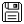</a> | **📂 檔名:** `interface-essential-floppy-disk.svg` ✨ **格式:** `Vector (SVG)` ⚖️ **大小:** `1.82KB` 📅 **更新:** `2026-02-27`  🔗 [直接查看原始檔](interface-essential-floppy-disk.svg) |
|  | **📂 檔名:** `interface-essential-heart-favorite.svg` ✨ **格式:** `Vector (SVG)` ⚖️ **大小:** `3.86KB` 📅 **更新:** `2026-02-27`  🔗 [直接查看原始檔](interface-essential-heart-favorite.svg) |
|  | **📂 檔名:** `interface-essential-hierarchy.svg` ✨ **格式:** `Vector (SVG)` ⚖️ **大小:** `2.58KB` 📅 **更新:** `2026-02-27`  🔗 [直接查看原始檔](interface-essential-hierarchy.svg) |
|  | **📂 檔名:** `interface-essential-key.svg` ✨ **格式:** `Vector (SVG)` ⚖️ **大小:** `4.66KB` 📅 **更新:** `2026-02-27`  🔗 [直接查看原始檔](interface-essential-key.svg) |
|  | **📂 檔名:** `interface-essential-link-broken.svg` ✨ **格式:** `Vector (SVG)` ⚖️ **大小:** `4.17KB` 📅 **更新:** `2026-02-27`  🔗 [直接查看原始檔](interface-essential-link-broken.svg) |
|  | **📂 檔名:** `interface-essential-paginate-filter-camera.svg` ✨ **格式:** `Vector (SVG)` ⚖️ **大小:** `1.36KB` 📅 **更新:** `2026-02-27`  🔗 [直接查看原始檔](interface-essential-paginate-filter-camera.svg) |
| <a href="interface-essential-paginate-filter-music.svg">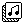</a> | **📂 檔名:** `interface-essential-paginate-filter-music.svg` ✨ **格式:** `Vector (SVG)` ⚖️ **大小:** `1.78KB` 📅 **更新:** `2026-02-27`  🔗 [直接查看原始檔](interface-essential-paginate-filter-music.svg) |
|  | **📂 檔名:** `interface-essential-paginate-filter-picture.svg` ✨ **格式:** `Vector (SVG)` ⚖️ **大小:** `2.68KB` 📅 **更新:** `2026-02-27`  🔗 [直接查看原始檔](interface-essential-paginate-filter-picture.svg) |
|  | **📂 檔名:** `interface-essential-pie-chart-poll-report.svg` ✨ **格式:** `Vector (SVG)` ⚖️ **大小:** `4.88KB` 📅 **更新:** `2026-02-27`  🔗 [直接查看原始檔](interface-essential-pie-chart-poll-report.svg) |
|  | **📂 檔名:** `interface-essential-pin.svg` ✨ **格式:** `Vector (SVG)` ⚖️ **大小:** `4.23KB` 📅 **更新:** `2026-02-27`  🔗 [直接查看原始檔](interface-essential-pin.svg) |
|  | **📂 檔名:** `interface-essential-setting-cog.svg` ✨ **格式:** `Vector (SVG)` ⚖️ **大小:** `5.47KB` 📅 **更新:** `2026-02-27`  🔗 [直接查看原始檔](interface-essential-setting-cog.svg) |
|  | **📂 檔名:** `interface-essential-switch-off.svg` ✨ **格式:** `Vector (SVG)` ⚖️ **大小:** `2.69KB` 📅 **更新:** `2026-02-27`  🔗 [直接查看原始檔](interface-essential-switch-off.svg) |
|  | **📂 檔名:** `interface-essential-translate.svg` ✨ **格式:** `Vector (SVG)` ⚖️ **大小:** `4.62KB` 📅 **更新:** `2026-02-27`  🔗 [直接查看原始檔](interface-essential-translate.svg) |
|  | **📂 檔名:** `interface-essential-waiting-hourglass-loading.svg` ✨ **格式:** `Vector (SVG)` ⚖️ **大小:** `1.98KB` 📅 **更新:** `2026-02-27`  🔗 [直接查看原始檔](interface-essential-waiting-hourglass-loading.svg) |
|  | **📂 檔名:** `interface-essential-wifi-feed.svg` ✨ **格式:** `Vector (SVG)` ⚖️ **大小:** `1.36KB` 📅 **更新:** `2026-02-27`  🔗 [直接查看原始檔](interface-essential-wifi-feed.svg) |
|  | **📂 檔名:** `internet-network-www.svg` ✨ **格式:** `Vector (SVG)` ⚖️ **大小:** `4.76KB` 📅 **更新:** `2026-02-27`  🔗 [直接查看原始檔](internet-network-www.svg) |
|  | **📂 檔名:** `invert.svg` ✨ **格式:** `Vector (SVG)` ⚖️ **大小:** `438.00B` 📅 **更新:** `2026-02-27`  🔗 [直接查看原始檔](invert.svg) |
|  | **📂 檔名:** `iso.svg` ✨ **格式:** `Vector (SVG)` ⚖️ **大小:** `488.00B` 📅 **更新:** `2026-02-27`  🔗 [直接查看原始檔](iso.svg) |
|  | **📂 檔名:** `kanban.svg` ✨ **格式:** `Vector (SVG)` ⚖️ **大小:** `527.00B` 📅 **更新:** `2026-02-27`  🔗 [直接查看原始檔](kanban.svg) |
|  | **📂 檔名:** `label-alt-multiple.svg` ✨ **格式:** `Vector (SVG)` ⚖️ **大小:** `498.00B` 📅 **更新:** `2026-02-27`  🔗 [直接查看原始檔](label-alt-multiple.svg) |
|  | **📂 檔名:** `label-alt.svg` ✨ **格式:** `Vector (SVG)` ⚖️ **大小:** `471.00B` 📅 **更新:** `2026-02-27`  🔗 [直接查看原始檔](label-alt.svg) |
|  | **📂 檔名:** `layout-align-bottom.svg` ✨ **格式:** `Vector (SVG)` ⚖️ **大小:** `469.00B` 📅 **更新:** `2026-02-27`  🔗 [直接查看原始檔](layout-align-bottom.svg) |
|  | **📂 檔名:** `layout-align-left.svg` ✨ **格式:** `Vector (SVG)` ⚖️ **大小:** `463.00B` 📅 **更新:** `2026-02-27`  🔗 [直接查看原始檔](layout-align-left.svg) |
|  | **📂 檔名:** `layout-align-right.svg` ✨ **格式:** `Vector (SVG)` ⚖️ **大小:** `466.00B` 📅 **更新:** `2026-02-27`  🔗 [直接查看原始檔](layout-align-right.svg) |
|  | **📂 檔名:** `layout-align-top.svg` ✨ **格式:** `Vector (SVG)` ⚖️ **大小:** `457.00B` 📅 **更新:** `2026-02-27`  🔗 [直接查看原始檔](layout-align-top.svg) |
|  | **📂 檔名:** `layout-columns.svg` ✨ **格式:** `Vector (SVG)` ⚖️ **大小:** `452.00B` 📅 **更新:** `2026-02-27`  🔗 [直接查看原始檔](layout-columns.svg) |
|  | **📂 檔名:** `layout-footer.svg` ✨ **格式:** `Vector (SVG)` ⚖️ **大小:** `450.00B` 📅 **更新:** `2026-02-27`  🔗 [直接查看原始檔](layout-footer.svg) |
|  | **📂 檔名:** `layout-sidebar-left.svg` ✨ **格式:** `Vector (SVG)` ⚖️ **大小:** `468.00B` 📅 **更新:** `2026-02-27`  🔗 [直接查看原始檔](layout-sidebar-left.svg) |
|  | **📂 檔名:** `layout-sidebar-right.svg` ✨ **格式:** `Vector (SVG)` ⚖️ **大小:** `474.00B` 📅 **更新:** `2026-02-27`  🔗 [直接查看原始檔](layout-sidebar-right.svg) |
|  | **📂 檔名:** `layout.svg` ✨ **格式:** `Vector (SVG)` ⚖️ **大小:** `440.00B` 📅 **更新:** `2026-02-27`  🔗 [直接查看原始檔](layout.svg) |
|  | **📂 檔名:** `left-Turn.svg` ✨ **格式:** `Vector (SVG)` ⚖️ **大小:** `567.00B` 📅 **更新:** `2026-02-27`  🔗 [直接查看原始檔](left-Turn.svg) |
|  | **📂 檔名:** `left-arrow.svg` ✨ **格式:** `Vector (SVG)` ⚖️ **大小:** `455.00B` 📅 **更新:** `2026-02-27`  🔗 [直接查看原始檔](left-arrow.svg) |
|  | **📂 檔名:** `letters-abc-in-pixelated-form-svgrepo-com.svg` ✨ **格式:** `Vector (SVG)` ⚖️ **大小:** `1.39KB` 📅 **更新:** `2026-02-27`  🔗 [直接查看原始檔](letters-abc-in-pixelated-form-svgrepo-com.svg) |
|  | **📂 檔名:** `levels-1.svg` ✨ **格式:** `Vector (SVG)` ⚖️ **大小:** `586.00B` 📅 **更新:** `2026-02-27`  🔗 [直接查看原始檔](levels-1.svg) |
|  | **📂 檔名:** `levels-2.svg` ✨ **格式:** `Vector (SVG)` ⚖️ **大小:** `586.00B` 📅 **更新:** `2026-02-27`  🔗 [直接查看原始檔](levels-2.svg) |
|  | **📂 檔名:** `link.svg` ✨ **格式:** `Vector (SVG)` ⚖️ **大小:** `440.00B` 📅 **更新:** `2026-02-27`  🔗 [直接查看原始檔](link.svg) |
|  | **📂 檔名:** `list.svg` ✨ **格式:** `Vector (SVG)` ⚖️ **大小:** `459.00B` 📅 **更新:** `2026-02-27`  🔗 [直接查看原始檔](list.svg) |
|  | **📂 檔名:** `load.svg` ✨ **格式:** `Vector (SVG)` ⚖️ **大小:** `546.00B` 📅 **更新:** `2026-02-27`  🔗 [直接查看原始檔](load.svg) |
|  | **📂 檔名:** `lock-open.svg` ✨ **格式:** `Vector (SVG)` ⚖️ **大小:** `465.00B` 📅 **更新:** `2026-02-27`  🔗 [直接查看原始檔](lock-open.svg) |
|  | **📂 檔名:** `lock.svg` ✨ **格式:** `Vector (SVG)` ⚖️ **大小:** `453.00B` 📅 **更新:** `2026-02-27`  🔗 [直接查看原始檔](lock.svg) |
|  | **📂 檔名:** `logo-social-media-old-instagram.svg` ✨ **格式:** `Vector (SVG)` ⚖️ **大小:** `3.18KB` 📅 **更新:** `2026-02-27`  🔗 [直接查看原始檔](logo-social-media-old-instagram.svg) |
|  | **📂 檔名:** `logo-social-media-tiktok.svg` ✨ **格式:** `Vector (SVG)` ⚖️ **大小:** `2.39KB` 📅 **更新:** `2026-02-27`  🔗 [直接查看原始檔](logo-social-media-tiktok.svg) |
|  | **📂 檔名:** `mail-arrow-right.svg` ✨ **格式:** `Vector (SVG)` ⚖️ **大小:** `762.00B` 📅 **更新:** `2026-02-27`  🔗 [直接查看原始檔](mail-arrow-right.svg) |
|  | **📂 檔名:** `mail-delete.svg` ✨ **格式:** `Vector (SVG)` ⚖️ **大小:** `548.00B` 📅 **更新:** `2026-02-27`  🔗 [直接查看原始檔](mail-delete.svg) |
|  | **📂 檔名:** `mail-flash.svg` ✨ **格式:** `Vector (SVG)` ⚖️ **大小:** `520.00B` 📅 **更新:** `2026-02-27`  🔗 [直接查看原始檔](mail-flash.svg) |
|  | **📂 檔名:** `mail-multiple.svg` ✨ **格式:** `Vector (SVG)` ⚖️ **大小:** `592.00B` 📅 **更新:** `2026-02-27`  🔗 [直接查看原始檔](mail-multiple.svg) |
|  | **📂 檔名:** `mail-unread.svg` ✨ **格式:** `Vector (SVG)` ⚖️ **大小:** `489.00B` 📅 **更新:** `2026-02-27`  🔗 [直接查看原始檔](mail-unread.svg) |
|  | **📂 檔名:** `mail.svg` ✨ **格式:** `Vector (SVG)` ⚖️ **大小:** `462.00B` 📅 **更新:** `2026-02-27`  🔗 [直接查看原始檔](mail.svg) |
|  | **📂 檔名:** `map-navigation-pin-location.svg` ✨ **格式:** `Vector (SVG)` ⚖️ **大小:** `3.52KB` 📅 **更新:** `2026-02-27`  🔗 [直接查看原始檔](map-navigation-pin-location.svg) |
|  | **📂 檔名:** `maximize-1.svg` ✨ **格式:** `Vector (SVG)` ⚖️ **大小:** `746.00B` 📅 **更新:** `2026-02-27`  🔗 [直接查看原始檔](maximize-1.svg) |
|  | **📂 檔名:** `maximize-2.svg` ✨ **格式:** `Vector (SVG)` ⚖️ **大小:** `1000.00B` 📅 **更新:** `2026-02-27`  🔗 [直接查看原始檔](maximize-2.svg) |
|  | **📂 檔名:** `maximize-3.svg` ✨ **格式:** `Vector (SVG)` ⚖️ **大小:** `713.00B` 📅 **更新:** `2026-02-27`  🔗 [直接查看原始檔](maximize-3.svg) |
|  | **📂 檔名:** `maximize-4.svg` ✨ **格式:** `Vector (SVG)` ⚖️ **大小:** `718.00B` 📅 **更新:** `2026-02-27`  🔗 [直接查看原始檔](maximize-4.svg) |
|  | **📂 檔名:** `maximize.svg` ✨ **格式:** `Vector (SVG)` ⚖️ **大小:** `747.00B` 📅 **更新:** `2026-02-27`  🔗 [直接查看原始檔](maximize.svg) |
|  | **📂 檔名:** `menu-1.svg` ✨ **格式:** `Vector (SVG)` ⚖️ **大小:** `422.00B` 📅 **更新:** `2026-02-27`  🔗 [直接查看原始檔](menu-1.svg) |
|  | **📂 檔名:** `menu-top-left.svg` ✨ **格式:** `Vector (SVG)` ⚖️ **大小:** `627.00B` 📅 **更新:** `2026-02-27`  🔗 [直接查看原始檔](menu-top-left.svg) |
|  | **📂 檔名:** `menu.svg` ✨ **格式:** `Vector (SVG)` ⚖️ **大小:** `607.00B` 📅 **更新:** `2026-02-27`  🔗 [直接查看原始檔](menu.svg) |
|  | **📂 檔名:** `message-arrow-left.svg` ✨ **格式:** `Vector (SVG)` ⚖️ **大小:** `523.00B` 📅 **更新:** `2026-02-27`  🔗 [直接查看原始檔](message-arrow-left.svg) |
|  | **📂 檔名:** `message-bookmark.svg` ✨ **格式:** `Vector (SVG)` ⚖️ **大小:** `482.00B` 📅 **更新:** `2026-02-27`  🔗 [直接查看原始檔](message-bookmark.svg) |
|  | **📂 檔名:** `message-clock.svg` ✨ **格式:** `Vector (SVG)` ⚖️ **大小:** `515.00B` 📅 **更新:** `2026-02-27`  🔗 [直接查看原始檔](message-clock.svg) |
|  | **📂 檔名:** `message-delete.svg` ✨ **格式:** `Vector (SVG)` ⚖️ **大小:** `504.00B` 📅 **更新:** `2026-02-27`  🔗 [直接查看原始檔](message-delete.svg) |
|  | **📂 檔名:** `message-flash.svg` ✨ **格式:** `Vector (SVG)` ⚖️ **大小:** `501.00B` 📅 **更新:** `2026-02-27`  🔗 [直接查看原始檔](message-flash.svg) |
|  | **📂 檔名:** `message-image.svg` ✨ **格式:** `Vector (SVG)` ⚖️ **大小:** `521.00B` 📅 **更新:** `2026-02-27`  🔗 [直接查看原始檔](message-image.svg) |
|  | **📂 檔名:** `message-minus.svg` ✨ **格式:** `Vector (SVG)` ⚖️ **大小:** `460.00B` 📅 **更新:** `2026-02-27`  🔗 [直接查看原始檔](message-minus.svg) |
|  | **📂 檔名:** `message-processing.svg` ✨ **格式:** `Vector (SVG)` ⚖️ **大小:** `522.00B` 📅 **更新:** `2026-02-27`  🔗 [直接查看原始檔](message-processing.svg) |
|  | **📂 檔名:** `messages.svg` ✨ **格式:** `Vector (SVG)` ⚖️ **大小:** `549.00B` 📅 **更新:** `2026-02-27`  🔗 [直接查看原始檔](messages.svg) |
|  | **📂 檔名:** `microphone-Off.svg` ✨ **格式:** `Vector (SVG)` ⚖️ **大小:** `737.00B` 📅 **更新:** `2026-02-27`  🔗 [直接查看原始檔](microphone-Off.svg) |
| <a href="microphone-On.svg">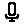</a> | **📂 檔名:** `microphone-On.svg` ✨ **格式:** `Vector (SVG)` ⚖️ **大小:** `623.00B` 📅 **更新:** `2026-02-27`  🔗 [直接查看原始檔](microphone-On.svg) |
| <a href="microphone.svg">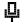</a> | **📂 檔名:** `microphone.svg` ✨ **格式:** `Vector (SVG)` ⚖️ **大小:** `3.86KB` 📅 **更新:** `2026-02-27`  🔗 [直接查看原始檔](microphone.svg) |
|  | **📂 檔名:** `minimize-1.svg` ✨ **格式:** `Vector (SVG)` ⚖️ **大小:** `963.00B` 📅 **更新:** `2026-02-27`  🔗 [直接查看原始檔](minimize-1.svg) |
|  | **📂 檔名:** `minimize-2.svg` ✨ **格式:** `Vector (SVG)` ⚖️ **大小:** `902.00B` 📅 **更新:** `2026-02-27`  🔗 [直接查看原始檔](minimize-2.svg) |
|  | **📂 檔名:** `minimize.svg` ✨ **格式:** `Vector (SVG)` ⚖️ **大小:** `684.00B` 📅 **更新:** `2026-02-27`  🔗 [直接查看原始檔](minimize.svg) |
|  | **📂 檔名:** `minus.svg` ✨ **格式:** `Vector (SVG)` ⚖️ **大小:** `405.00B` 📅 **更新:** `2026-02-27`  🔗 [直接查看原始檔](minus.svg) |
|  | **📂 檔名:** `missed-call.svg` ✨ **格式:** `Vector (SVG)` ⚖️ **大小:** `792.00B` 📅 **更新:** `2026-02-27`  🔗 [直接查看原始檔](missed-call.svg) |
|  | **📂 檔名:** `money-payments-accounting-bill-money.svg` ✨ **格式:** `Vector (SVG)` ⚖️ **大小:** `4.13KB` 📅 **更新:** `2026-02-27`  🔗 [直接查看原始檔](money-payments-accounting-bill-money.svg) |
|  | **📂 檔名:** `money-payments-accounting-calculator.svg` ✨ **格式:** `Vector (SVG)` ⚖️ **大小:** `2.92KB` 📅 **更新:** `2026-02-27`  🔗 [直接查看原始檔](money-payments-accounting-calculator.svg) |
|  | **📂 檔名:** `more-horizontal.svg` ✨ **格式:** `Vector (SVG)` ⚖️ **大小:** `583.00B` 📅 **更新:** `2026-02-27`  🔗 [直接查看原始檔](more-horizontal.svg) |
|  | **📂 檔名:** `more.svg` ✨ **格式:** `Vector (SVG)` ⚖️ **大小:** `570.00B` 📅 **更新:** `2026-02-27`  🔗 [直接查看原始檔](more.svg) |
|  | **📂 檔名:** `mouse.svg` ✨ **格式:** `Vector (SVG)` ⚖️ **大小:** `494.00B` 📅 **更新:** `2026-02-27`  🔗 [直接查看原始檔](mouse.svg) |
|  | **📂 檔名:** `move.svg` ✨ **格式:** `Vector (SVG)` ⚖️ **大小:** `793.00B` 📅 **更新:** `2026-02-27`  🔗 [直接查看原始檔](move.svg) |
|  | **📂 檔名:** `movie.svg` ✨ **格式:** `Vector (SVG)` ⚖️ **大小:** `709.00B` 📅 **更新:** `2026-02-27`  🔗 [直接查看原始檔](movie.svg) |
|  | **📂 檔名:** `multiple.svg` ✨ **格式:** `Vector (SVG)` ⚖️ **大小:** `619.00B` 📅 **更新:** `2026-02-27`  🔗 [直接查看原始檔](multiple.svg) |
|  | **📂 檔名:** `multiply.svg` ✨ **格式:** `Vector (SVG)` ⚖️ **大小:** `526.00B` 📅 **更新:** `2026-02-27`  🔗 [直接查看原始檔](multiply.svg) |
|  | **📂 檔名:** `music-disk-cd.svg` ✨ **格式:** `Vector (SVG)` ⚖️ **大小:** `5.41KB` 📅 **更新:** `2026-02-27`  🔗 [直接查看原始檔](music-disk-cd.svg) |
|  | **📂 檔名:** `music-notes-music.svg` ✨ **格式:** `Vector (SVG)` ⚖️ **大小:** `1.50KB` 📅 **更新:** `2026-02-27`  🔗 [直接查看原始檔](music-notes-music.svg) |
|  | **📂 檔名:** `mute-1.svg` ✨ **格式:** `Vector (SVG)` ⚖️ **大小:** `4.33KB` 📅 **更新:** `2026-02-27`  🔗 [直接查看原始檔](mute-1.svg) |
|  | **📂 檔名:** `mute.svg` ✨ **格式:** `Vector (SVG)` ⚖️ **大小:** `808.00B` 📅 **更新:** `2026-02-27`  🔗 [直接查看原始檔](mute.svg) |
|  | **📂 檔名:** `necklace.svg` ✨ **格式:** `Vector (SVG)` ⚖️ **大小:** `791.00B` 📅 **更新:** `2026-02-27`  🔗 [直接查看原始檔](necklace.svg) |
|  | **📂 檔名:** `next-1.svg` ✨ **格式:** `Vector (SVG)` ⚖️ **大小:** `710.00B` 📅 **更新:** `2026-02-27`  🔗 [直接查看原始檔](next-1.svg) |
|  | **📂 檔名:** `next-3.svg` ✨ **格式:** `Vector (SVG)` ⚖️ **大小:** `474.00B` 📅 **更新:** `2026-02-27`  🔗 [直接查看原始檔](next-3.svg) |
|  | **📂 檔名:** `next-4.svg` ✨ **格式:** `Vector (SVG)` ⚖️ **大小:** `761.00B` 📅 **更新:** `2026-02-27`  🔗 [直接查看原始檔](next-4.svg) |
|  | **📂 檔名:** `next.svg` ✨ **格式:** `Vector (SVG)` ⚖️ **大小:** `918.00B` 📅 **更新:** `2026-02-27`  🔗 [直接查看原始檔](next.svg) |
|  | **📂 檔名:** `non-gmo-fertilizer.svg` ✨ **格式:** `Vector (SVG)` ⚖️ **大小:** `4.38KB` 📅 **更新:** `2026-02-27`  🔗 [直接查看原始檔](non-gmo-fertilizer.svg) |
|  | **📂 檔名:** `note-delete.svg` ✨ **格式:** `Vector (SVG)` ⚖️ **大小:** `508.00B` 📅 **更新:** `2026-02-27`  🔗 [直接查看原始檔](note-delete.svg) |
|  | **📂 檔名:** `note-multiple-1.svg` ✨ **格式:** `Vector (SVG)` ⚖️ **大小:** `485.00B` 📅 **更新:** `2026-02-27`  🔗 [直接查看原始檔](note-multiple-1.svg) |
|  | **📂 檔名:** `note-multiple.svg` ✨ **格式:** `Vector (SVG)` ⚖️ **大小:** `571.00B` 📅 **更新:** `2026-02-27`  🔗 [直接查看原始檔](note-multiple.svg) |
|  | **📂 檔名:** `note-plus.svg` ✨ **格式:** `Vector (SVG)` ⚖️ **大小:** `493.00B` 📅 **更新:** `2026-02-27`  🔗 [直接查看原始檔](note-plus.svg) |
|  | **📂 檔名:** `note.svg` ✨ **格式:** `Vector (SVG)` ⚖️ **大小:** `437.00B` 📅 **更新:** `2026-02-27`  🔗 [直接查看原始檔](note.svg) |
|  | **📂 檔名:** `notification-1.svg` ✨ **格式:** `Vector (SVG)` ⚖️ **大小:** `524.00B` 📅 **更新:** `2026-02-27`  🔗 [直接查看原始檔](notification-1.svg) |
|  | **📂 檔名:** `notification.svg` ✨ **格式:** `Vector (SVG)` ⚖️ **大小:** `628.00B` 📅 **更新:** `2026-02-27`  🔗 [直接查看原始檔](notification.svg) |
|  | **📂 檔名:** `open-1.svg` ✨ **格式:** `Vector (SVG)` ⚖️ **大小:** `477.00B` 📅 **更新:** `2026-02-27`  🔗 [直接查看原始檔](open-1.svg) |
|  | **📂 檔名:** `open.svg` ✨ **格式:** `Vector (SVG)` ⚖️ **大小:** `663.00B` 📅 **更新:** `2026-02-27`  🔗 [直接查看原始檔](open.svg) |
|  | **📂 檔名:** `paperclip.svg` ✨ **格式:** `Vector (SVG)` ⚖️ **大小:** `443.00B` 📅 **更新:** `2026-02-27`  🔗 [直接查看原始檔](paperclip.svg) |
|  | **📂 檔名:** `paste-document.svg` ✨ **格式:** `Vector (SVG)` ⚖️ **大小:** `637.00B` 📅 **更新:** `2026-02-27`  🔗 [直接查看原始檔](paste-document.svg) |
|  | **📂 檔名:** `paste-folder.svg` ✨ **格式:** `Vector (SVG)` ⚖️ **大小:** `633.00B` 📅 **更新:** `2026-02-27`  🔗 [直接查看原始檔](paste-folder.svg) |
|  | **📂 檔名:** `path 6682.svg` ✨ **格式:** `Vector (SVG)` ⚖️ **大小:** `804.00B` 📅 **更新:** `2026-02-27`  🔗 [直接查看原始檔](path%206682.svg) |
|  | **📂 檔名:** `pause.svg` ✨ **格式:** `Vector (SVG)` ⚖️ **大小:** `434.00B` 📅 **更新:** `2026-02-27`  🔗 [直接查看原始檔](pause.svg) |
|  | **📂 檔名:** `pen.svg` ✨ **格式:** `Vector (SVG)` ⚖️ **大小:** `567.00B` 📅 **更新:** `2026-02-27`  🔗 [直接查看原始檔](pen.svg) |
|  | **📂 檔名:** `person-Group.svg` ✨ **格式:** `Vector (SVG)` ⚖️ **大小:** `848.00B` 📅 **更新:** `2026-02-27`  🔗 [直接查看原始檔](person-Group.svg) |
| <a href="person-added.svg">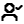</a> | **📂 檔名:** `person-added.svg` ✨ **格式:** `Vector (SVG)` ⚖️ **大小:** `755.00B` 📅 **更新:** `2026-02-27`  🔗 [直接查看原始檔](person-added.svg) |
|  | **📂 檔名:** `person.svg` ✨ **格式:** `Vector (SVG)` ⚖️ **大小:** `662.00B` 📅 **更新:** `2026-02-27`  🔗 [直接查看原始檔](person.svg) |
|  | **📂 檔名:** `pgone.svg` ✨ **格式:** `Vector (SVG)` ⚖️ **大小:** `1.79KB` 📅 **更新:** `2026-02-27`  🔗 [直接查看原始檔](pgone.svg) |
|  | **📂 檔名:** `phone-Vibrate.svg` ✨ **格式:** `Vector (SVG)` ⚖️ **大小:** `1.78KB` 📅 **更新:** `2026-02-27`  🔗 [直接查看原始檔](phone-Vibrate.svg) |
|  | **📂 檔名:** `phone.svg` ✨ **格式:** `Vector (SVG)` ⚖️ **大小:** `711.00B` 📅 **更新:** `2026-02-27`  🔗 [直接查看原始檔](phone.svg) |
|  | **📂 檔名:** `photo.svg` ✨ **格式:** `Vector (SVG)` ⚖️ **大小:** `647.00B` 📅 **更新:** `2026-02-27`  🔗 [直接查看原始檔](photo.svg) |
|  | **📂 檔名:** `photography-camera.svg` ✨ **格式:** `Vector (SVG)` ⚖️ **大小:** `2.87KB` 📅 **更新:** `2026-02-27`  🔗 [直接查看原始檔](photography-camera.svg) |
|  | **📂 檔名:** `pickaxe.svg` ✨ **格式:** `Vector (SVG)` ⚖️ **大小:** `897.00B` 📅 **更新:** `2026-02-27`  🔗 [直接查看原始檔](pickaxe.svg) |
|  | **📂 檔名:** `picture-in-picture-alt.svg` ✨ **格式:** `Vector (SVG)` ⚖️ **大小:** `489.00B` 📅 **更新:** `2026-02-27`  🔗 [直接查看原始檔](picture-in-picture-alt.svg) |
|  | **📂 檔名:** `pixelarticons-svgrepo-com.svg` ✨ **格式:** `Vector (SVG)` ⚖️ **大小:** `645.00B` 📅 **更新:** `2026-02-27`  🔗 [直接查看原始檔](pixelarticons-svgrepo-com.svg) |
|  | **📂 檔名:** `pixelated-Icons-Logo.svg` ✨ **格式:** `Vector (SVG)` ⚖️ **大小:** `519.00B` 📅 **更新:** `2026-02-27`  🔗 [直接查看原始檔](pixelated-Icons-Logo.svg) |
|  | **📂 檔名:** `pixelated-person-svgrepo-com.svg` ✨ **格式:** `Vector (SVG)` ⚖️ **大小:** `958.00B` 📅 **更新:** `2026-02-27`  🔗 [直接查看原始檔](pixelated-person-svgrepo-com.svg) |
|  | **📂 檔名:** `pixels.svg` ✨ **格式:** `Vector (SVG)` ⚖️ **大小:** `3.10KB` 📅 **更新:** `2026-02-27`  🔗 [直接查看原始檔](pixels.svg) |
|  | **📂 檔名:** `play-1.svg` ✨ **格式:** `Vector (SVG)` ⚖️ **大小:** `789.00B` 📅 **更新:** `2026-02-27`  🔗 [直接查看原始檔](play-1.svg) |
|  | **📂 檔名:** `play-2.svg` ✨ **格式:** `Vector (SVG)` ⚖️ **大小:** `490.00B` 📅 **更新:** `2026-02-27`  🔗 [直接查看原始檔](play-2.svg) |
|  | **📂 檔名:** `play-3.svg` ✨ **格式:** `Vector (SVG)` ⚖️ **大小:** `718.00B` 📅 **更新:** `2026-02-27`  🔗 [直接查看原始檔](play-3.svg) |
|  | **📂 檔名:** `play.svg` ✨ **格式:** `Vector (SVG)` ⚖️ **大小:** `575.00B` 📅 **更新:** `2026-02-27`  🔗 [直接查看原始檔](play.svg) |
|  | **📂 檔名:** `player-1.svg` ✨ **格式:** `Vector (SVG)` ⚖️ **大小:** `637.00B` 📅 **更新:** `2026-02-27`  🔗 [直接查看原始檔](player-1.svg) |
|  | **📂 檔名:** `player.svg` ✨ **格式:** `Vector (SVG)` ⚖️ **大小:** `723.00B` 📅 **更新:** `2026-02-27`  🔗 [直接查看原始檔](player.svg) |
|  | **📂 檔名:** `plus-box-fill.svg` ✨ **格式:** `Vector (SVG)` ⚖️ **大小:** `616.00B` 📅 **更新:** `2026-02-27`  🔗 [直接查看原始檔](plus-box-fill.svg) |
|  | **📂 檔名:** `plus-circle-fill.svg` ✨ **格式:** `Vector (SVG)` ⚖️ **大小:** `556.00B` 📅 **更新:** `2026-02-27`  🔗 [直接查看原始檔](plus-circle-fill.svg) |
|  | **📂 檔名:** `plus-circle.svg` ✨ **格式:** `Vector (SVG)` ⚖️ **大小:** `623.00B` 📅 **更新:** `2026-02-27`  🔗 [直接查看原始檔](plus-circle.svg) |
|  | **📂 檔名:** `plus.svg` ✨ **格式:** `Vector (SVG)` ⚖️ **大小:** `420.00B` 📅 **更新:** `2026-02-27`  🔗 [直接查看原始檔](plus.svg) |
|  | **📂 檔名:** `point.svg` ✨ **格式:** `Vector (SVG)` ⚖️ **大小:** `859.00B` 📅 **更新:** `2026-02-27`  🔗 [直接查看原始檔](point.svg) |
|  | **📂 檔名:** `pointer-Right.svg` ✨ **格式:** `Vector (SVG)` ⚖️ **大小:** `494.00B` 📅 **更新:** `2026-02-27`  🔗 [直接查看原始檔](pointer-Right.svg) |
|  | **📂 檔名:** `pointer-arrow.svg` ✨ **格式:** `Vector (SVG)` ⚖️ **大小:** `460.00B` 📅 **更新:** `2026-02-27`  🔗 [直接查看原始檔](pointer-arrow.svg) |
|  | **📂 檔名:** `pointer-down.svg` ✨ **格式:** `Vector (SVG)` ⚖️ **大小:** `453.00B` 📅 **更新:** `2026-02-27`  🔗 [直接查看原始檔](pointer-down.svg) |
|  | **📂 檔名:** `pointer-left.svg` ✨ **格式:** `Vector (SVG)` ⚖️ **大小:** `489.00B` 📅 **更新:** `2026-02-27`  🔗 [直接查看原始檔](pointer-left.svg) |
|  | **📂 檔名:** `pointer.svg` ✨ **格式:** `Vector (SVG)` ⚖️ **大小:** `549.00B` 📅 **更新:** `2026-02-27`  🔗 [直接查看原始檔](pointer.svg) |
|  | **📂 檔名:** `power.svg` ✨ **格式:** `Vector (SVG)` ⚖️ **大小:** `510.00B` 📅 **更新:** `2026-02-27`  🔗 [直接查看原始檔](power.svg) |
|  | **📂 檔名:** `print.svg` ✨ **格式:** `Vector (SVG)` ⚖️ **大小:** `507.00B` 📅 **更新:** `2026-02-27`  🔗 [直接查看原始檔](print.svg) |
|  | **📂 檔名:** `program.svg` ✨ **格式:** `Vector (SVG)` ⚖️ **大小:** `852.00B` 📅 **更新:** `2026-02-27`  🔗 [直接查看原始檔](program.svg) |
|  | **📂 檔名:** `protection.svg` ✨ **格式:** `Vector (SVG)` ⚖️ **大小:** `603.00B` 📅 **更新:** `2026-02-27`  🔗 [直接查看原始檔](protection.svg) |
|  | **📂 檔名:** `px-icon1.svg` ✨ **格式:** `Vector (SVG)` ⚖️ **大小:** `5.18KB` 📅 **更新:** `2026-02-27`  🔗 [直接查看原始檔](px-icon1.svg) |
|  | **📂 檔名:** `px-icon10.svg` ✨ **格式:** `Vector (SVG)` ⚖️ **大小:** `5.58KB` 📅 **更新:** `2026-02-27`  🔗 [直接查看原始檔](px-icon10.svg) |
| <a href="px-icon11.svg">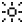</a> | **📂 檔名:** `px-icon11.svg` ✨ **格式:** `Vector (SVG)` ⚖️ **大小:** `3.99KB` 📅 **更新:** `2026-02-27`  🔗 [直接查看原始檔](px-icon11.svg) |
|  | **📂 檔名:** `px-icon12.svg` ✨ **格式:** `Vector (SVG)` ⚖️ **大小:** `6.10KB` 📅 **更新:** `2026-02-27`  🔗 [直接查看原始檔](px-icon12.svg) |
|  | **📂 檔名:** `px-icon13.svg` ✨ **格式:** `Vector (SVG)` ⚖️ **大小:** `7.65KB` 📅 **更新:** `2026-02-27`  🔗 [直接查看原始檔](px-icon13.svg) |
|  | **📂 檔名:** `px-icon14.svg` ✨ **格式:** `Vector (SVG)` ⚖️ **大小:** `6.74KB` 📅 **更新:** `2026-02-27`  🔗 [直接查看原始檔](px-icon14.svg) |
|  | **📂 檔名:** `px-icon15.svg` ✨ **格式:** `Vector (SVG)` ⚖️ **大小:** `5.57KB` 📅 **更新:** `2026-02-27`  🔗 [直接查看原始檔](px-icon15.svg) |
|  | **📂 檔名:** `px-icon16.svg` ✨ **格式:** `Vector (SVG)` ⚖️ **大小:** `6.10KB` 📅 **更新:** `2026-02-27`  🔗 [直接查看原始檔](px-icon16.svg) |
| <a href="px-icon17.svg">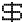</a> | **📂 檔名:** `px-icon17.svg` ✨ **格式:** `Vector (SVG)` ⚖️ **大小:** `6.23KB` 📅 **更新:** `2026-02-27`  🔗 [直接查看原始檔](px-icon17.svg) |
|  | **📂 檔名:** `px-icon18.svg` ✨ **格式:** `Vector (SVG)` ⚖️ **大小:** `6.69KB` 📅 **更新:** `2026-02-27`  🔗 [直接查看原始檔](px-icon18.svg) |
|  | **📂 檔名:** `px-icon19.svg` ✨ **格式:** `Vector (SVG)` ⚖️ **大小:** `5.06KB` 📅 **更新:** `2026-02-27`  🔗 [直接查看原始檔](px-icon19.svg) |
| <a href="px-icon2.svg">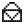</a> | **📂 檔名:** `px-icon2.svg` ✨ **格式:** `Vector (SVG)` ⚖️ **大小:** `6.87KB` 📅 **更新:** `2026-02-27`  🔗 [直接查看原始檔](px-icon2.svg) |
|  | **📂 檔名:** `px-icon20.svg` ✨ **格式:** `Vector (SVG)` ⚖️ **大小:** `6.75KB` 📅 **更新:** `2026-02-27`  🔗 [直接查看原始檔](px-icon20.svg) |
|  | **📂 檔名:** `px-icon21.svg` ✨ **格式:** `Vector (SVG)` ⚖️ **大小:** `5.84KB` 📅 **更新:** `2026-02-27`  🔗 [直接查看原始檔](px-icon21.svg) |
|  | **📂 檔名:** `px-icon22.svg` ✨ **格式:** `Vector (SVG)` ⚖️ **大小:** `4.80KB` 📅 **更新:** `2026-02-27`  🔗 [直接查看原始檔](px-icon22.svg) |
|  | **📂 檔名:** `px-icon23.svg` ✨ **格式:** `Vector (SVG)` ⚖️ **大小:** `5.84KB` 📅 **更新:** `2026-02-27`  🔗 [直接查看原始檔](px-icon23.svg) |
|  | **📂 檔名:** `px-icon24.svg` ✨ **格式:** `Vector (SVG)` ⚖️ **大小:** `6.22KB` 📅 **更新:** `2026-02-27`  🔗 [直接查看原始檔](px-icon24.svg) |
|  | **📂 檔名:** `px-icon25.svg` ✨ **格式:** `Vector (SVG)` ⚖️ **大小:** `5.67KB` 📅 **更新:** `2026-02-27`  🔗 [直接查看原始檔](px-icon25.svg) |
|  | **📂 檔名:** `px-icon26.svg` ✨ **格式:** `Vector (SVG)` ⚖️ **大小:** `4.03KB` 📅 **更新:** `2026-02-27`  🔗 [直接查看原始檔](px-icon26.svg) |
|  | **📂 檔名:** `px-icon27.svg` ✨ **格式:** `Vector (SVG)` ⚖️ **大小:** `4.55KB` 📅 **更新:** `2026-02-27`  🔗 [直接查看原始檔](px-icon27.svg) |
|  | **📂 檔名:** `px-icon28.svg` ✨ **格式:** `Vector (SVG)` ⚖️ **大小:** `5.84KB` 📅 **更新:** `2026-02-27`  🔗 [直接查看原始檔](px-icon28.svg) |
|  | **📂 檔名:** `px-icon29.svg` ✨ **格式:** `Vector (SVG)` ⚖️ **大小:** `6.74KB` 📅 **更新:** `2026-02-27`  🔗 [直接查看原始檔](px-icon29.svg) |
|  | **📂 檔名:** `px-icon3.svg` ✨ **格式:** `Vector (SVG)` ⚖️ **大小:** `7.00KB` 📅 **更新:** `2026-02-27`  🔗 [直接查看原始檔](px-icon3.svg) |
| <a href="px-icon30.svg">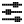</a> | **📂 檔名:** `px-icon30.svg` ✨ **格式:** `Vector (SVG)` ⚖️ **大小:** `6.99KB` 📅 **更新:** `2026-02-27`  🔗 [直接查看原始檔](px-icon30.svg) |
|  | **📂 檔名:** `px-icon31.svg` ✨ **格式:** `Vector (SVG)` ⚖️ **大小:** `7.92KB` 📅 **更新:** `2026-02-27`  🔗 [直接查看原始檔](px-icon31.svg) |
|  | **📂 檔名:** `px-icon32.svg` ✨ **格式:** `Vector (SVG)` ⚖️ **大小:** `6.69KB` 📅 **更新:** `2026-02-27`  🔗 [直接查看原始檔](px-icon32.svg) |
|  | **📂 檔名:** `px-icon33.svg` ✨ **格式:** `Vector (SVG)` ⚖️ **大小:** `5.32KB` 📅 **更新:** `2026-02-27`  🔗 [直接查看原始檔](px-icon33.svg) |
|  | **📂 檔名:** `px-icon34.svg` ✨ **格式:** `Vector (SVG)` ⚖️ **大小:** `5.83KB` 📅 **更新:** `2026-02-27`  🔗 [直接查看原始檔](px-icon34.svg) |
|  | **📂 檔名:** `px-icon35.svg` ✨ **格式:** `Vector (SVG)` ⚖️ **大小:** `5.32KB` 📅 **更新:** `2026-02-27`  🔗 [直接查看原始檔](px-icon35.svg) |
|  | **📂 檔名:** `px-icon36.svg` ✨ **格式:** `Vector (SVG)` ⚖️ **大小:** `3.61KB` 📅 **更新:** `2026-02-27`  🔗 [直接查看原始檔](px-icon36.svg) |
|  | **📂 檔名:** `px-icon37.svg` ✨ **格式:** `Vector (SVG)` ⚖️ **大小:** `2.66KB` 📅 **更新:** `2026-02-27`  🔗 [直接查看原始檔](px-icon37.svg) |
|  | **📂 檔名:** `px-icon38.svg` ✨ **格式:** `Vector (SVG)` ⚖️ **大小:** `4.28KB` 📅 **更新:** `2026-02-27`  🔗 [直接查看原始檔](px-icon38.svg) |
|  | **📂 檔名:** `px-icon39.svg` ✨ **格式:** `Vector (SVG)` ⚖️ **大小:** `3.15KB` 📅 **更新:** `2026-02-27`  🔗 [直接查看原始檔](px-icon39.svg) |
|  | **📂 檔名:** `px-icon4.svg` ✨ **格式:** `Vector (SVG)` ⚖️ **大小:** `9.00KB` 📅 **更新:** `2026-02-27`  🔗 [直接查看原始檔](px-icon4.svg) |
|  | **📂 檔名:** `px-icon40.svg` ✨ **格式:** `Vector (SVG)` ⚖️ **大小:** `5.54KB` 📅 **更新:** `2026-02-27`  🔗 [直接查看原始檔](px-icon40.svg) |
|  | **📂 檔名:** `px-icon41.svg` ✨ **格式:** `Vector (SVG)` ⚖️ **大小:** `4.29KB` 📅 **更新:** `2026-02-27`  🔗 [直接查看原始檔](px-icon41.svg) |
|  | **📂 檔名:** `px-icon42.svg` ✨ **格式:** `Vector (SVG)` ⚖️ **大小:** `2.50KB` 📅 **更新:** `2026-02-27`  🔗 [直接查看原始檔](px-icon42.svg) |
|  | **📂 檔名:** `px-icon43.svg` ✨ **格式:** `Vector (SVG)` ⚖️ **大小:** `6.50KB` 📅 **更新:** `2026-02-27`  🔗 [直接查看原始檔](px-icon43.svg) |
|  | **📂 檔名:** `px-icon44.svg` ✨ **格式:** `Vector (SVG)` ⚖️ **大小:** `5.84KB` 📅 **更新:** `2026-02-27`  🔗 [直接查看原始檔](px-icon44.svg) |
|  | **📂 檔名:** `px-icon45.svg` ✨ **格式:** `Vector (SVG)` ⚖️ **大小:** `5.84KB` 📅 **更新:** `2026-02-27`  🔗 [直接查看原始檔](px-icon45.svg) |
|  | **📂 檔名:** `px-icon46.svg` ✨ **格式:** `Vector (SVG)` ⚖️ **大小:** `5.67KB` 📅 **更新:** `2026-02-27`  🔗 [直接查看原始檔](px-icon46.svg) |
|  | **📂 檔名:** `px-icon47.svg` ✨ **格式:** `Vector (SVG)` ⚖️ **大小:** `5.06KB` 📅 **更新:** `2026-02-27`  🔗 [直接查看原始檔](px-icon47.svg) |
|  | **📂 檔名:** `px-icon48.svg` ✨ **格式:** `Vector (SVG)` ⚖️ **大小:** `5.71KB` 📅 **更新:** `2026-02-27`  🔗 [直接查看原始檔](px-icon48.svg) |
|  | **📂 檔名:** `px-icon49.svg` ✨ **格式:** `Vector (SVG)` ⚖️ **大小:** `7.39KB` 📅 **更新:** `2026-02-27`  🔗 [直接查看原始檔](px-icon49.svg) |
|  | **📂 檔名:** `px-icon5.svg` ✨ **格式:** `Vector (SVG)` ⚖️ **大小:** `6.48KB` 📅 **更新:** `2026-02-27`  🔗 [直接查看原始檔](px-icon5.svg) |
|  | **📂 檔名:** `px-icon6.svg` ✨ **格式:** `Vector (SVG)` ⚖️ **大小:** `3.11KB` 📅 **更新:** `2026-02-27`  🔗 [直接查看原始檔](px-icon6.svg) |
|  | **📂 檔名:** `px-icon7.svg` ✨ **格式:** `Vector (SVG)` ⚖️ **大小:** `4.80KB` 📅 **更新:** `2026-02-27`  🔗 [直接查看原始檔](px-icon7.svg) |
|  | **📂 檔名:** `px-icon8.svg` ✨ **格式:** `Vector (SVG)` ⚖️ **大小:** `8.04KB` 📅 **更新:** `2026-02-27`  🔗 [直接查看原始檔](px-icon8.svg) |
| <a href="px-icon9.svg">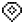</a> | **📂 檔名:** `px-icon9.svg` ✨ **格式:** `Vector (SVG)` ⚖️ **大小:** `4.54KB` 📅 **更新:** `2026-02-27`  🔗 [直接查看原始檔](px-icon9.svg) |
|  | **📂 檔名:** `radio-handheld.svg` ✨ **格式:** `Vector (SVG)` ⚖️ **大小:** `453.00B` 📅 **更新:** `2026-02-27`  🔗 [直接查看原始檔](radio-handheld.svg) |
|  | **📂 檔名:** `real-estate-building-ad.svg` ✨ **格式:** `Vector (SVG)` ⚖️ **大小:** `2.33KB` 📅 **更新:** `2026-02-27`  🔗 [直接查看原始檔](real-estate-building-ad.svg) |
|  | **📂 檔名:** `real-estate-building-house.svg` ✨ **格式:** `Vector (SVG)` ⚖️ **大小:** `1.98KB` 📅 **更新:** `2026-02-27`  🔗 [直接查看原始檔](real-estate-building-house.svg) |
|  | **📂 檔名:** `redo-1.svg` ✨ **格式:** `Vector (SVG)` ⚖️ **大小:** `519.00B` 📅 **更新:** `2026-02-27`  🔗 [直接查看原始檔](redo-1.svg) |
|  | **📂 檔名:** `redo-2.svg` ✨ **格式:** `Vector (SVG)` ⚖️ **大小:** `679.00B` 📅 **更新:** `2026-02-27`  🔗 [直接查看原始檔](redo-2.svg) |
|  | **📂 檔名:** `redo.svg` ✨ **格式:** `Vector (SVG)` ⚖️ **大小:** `529.00B` 📅 **更新:** `2026-02-27`  🔗 [直接查看原始檔](redo.svg) |
|  | **📂 檔名:** `reload-1.svg` ✨ **格式:** `Vector (SVG)` ⚖️ **大小:** `844.00B` 📅 **更新:** `2026-02-27`  🔗 [直接查看原始檔](reload-1.svg) |
|  | **📂 檔名:** `reload.svg` ✨ **格式:** `Vector (SVG)` ⚖️ **大小:** `506.00B` 📅 **更新:** `2026-02-27`  🔗 [直接查看原始檔](reload.svg) |
|  | **📂 檔名:** `remove-box-multiple.svg` ✨ **格式:** `Vector (SVG)` ⚖️ **大小:** `487.00B` 📅 **更新:** `2026-02-27`  🔗 [直接查看原始檔](remove-box-multiple.svg) |
|  | **📂 檔名:** `remove-folder.svg` ✨ **格式:** `Vector (SVG)` ⚖️ **大小:** `645.00B` 📅 **更新:** `2026-02-27`  🔗 [直接查看原始檔](remove-folder.svg) |
|  | **📂 檔名:** `repeat.svg` ✨ **格式:** `Vector (SVG)` ⚖️ **大小:** `535.00B` 📅 **更新:** `2026-02-27`  🔗 [直接查看原始檔](repeat.svg) |
|  | **📂 檔名:** `replay.svg` ✨ **格式:** `Vector (SVG)` ⚖️ **大小:** `606.00B` 📅 **更新:** `2026-02-27`  🔗 [直接查看原始檔](replay.svg) |
|  | **📂 檔名:** `right-1.svg` ✨ **格式:** `Vector (SVG)` ⚖️ **大小:** `1.06KB` 📅 **更新:** `2026-02-27`  🔗 [直接查看原始檔](right-1.svg) |
|  | **📂 檔名:** `right-Turn.svg` ✨ **格式:** `Vector (SVG)` ⚖️ **大小:** `571.00B` 📅 **更新:** `2026-02-27`  🔗 [直接查看原始檔](right-Turn.svg) |
|  | **📂 檔名:** `right-arrow-1.svg` ✨ **格式:** `Vector (SVG)` ⚖️ **大小:** `1.09KB` 📅 **更新:** `2026-02-27`  🔗 [直接查看原始檔](right-arrow-1.svg) |
|  | **📂 檔名:** `right-arrow.svg` ✨ **格式:** `Vector (SVG)` ⚖️ **大小:** `430.00B` 📅 **更新:** `2026-02-27`  🔗 [直接查看原始檔](right-arrow.svg) |
|  | **📂 檔名:** `right-arrows-1.svg` ✨ **格式:** `Vector (SVG)` ⚖️ **大小:** `1.09KB` 📅 **更新:** `2026-02-27`  🔗 [直接查看原始檔](right-arrows-1.svg) |
|  | **📂 檔名:** `right-arrows-2.svg` ✨ **格式:** `Vector (SVG)` ⚖️ **大小:** `683.00B` 📅 **更新:** `2026-02-27`  🔗 [直接查看原始檔](right-arrows-2.svg) |
|  | **📂 檔名:** `right-arrows-3.svg` ✨ **格式:** `Vector (SVG)` ⚖️ **大小:** `842.00B` 📅 **更新:** `2026-02-27`  🔗 [直接查看原始檔](right-arrows-3.svg) |
|  | **📂 檔名:** `right-arrows-4.svg` ✨ **格式:** `Vector (SVG)` ⚖️ **大小:** `1.03KB` 📅 **更新:** `2026-02-27`  🔗 [直接查看原始檔](right-arrows-4.svg) |
|  | **📂 檔名:** `right-arrows-5.svg` ✨ **格式:** `Vector (SVG)` ⚖️ **大小:** `871.00B` 📅 **更新:** `2026-02-27`  🔗 [直接查看原始檔](right-arrows-5.svg) |
|  | **📂 檔名:** `right-arrows.svg` ✨ **格式:** `Vector (SVG)` ⚖️ **大小:** `1.24KB` 📅 **更新:** `2026-02-27`  🔗 [直接查看原始檔](right-arrows.svg) |
|  | **📂 檔名:** `right.svg` ✨ **格式:** `Vector (SVG)` ⚖️ **大小:** `693.00B` 📅 **更新:** `2026-02-27`  🔗 [直接查看原始檔](right.svg) |
|  | **📂 檔名:** `rotate.svg` ✨ **格式:** `Vector (SVG)` ⚖️ **大小:** `794.00B` 📅 **更新:** `2026-02-27`  🔗 [直接查看原始檔](rotate.svg) |
|  | **📂 檔名:** `rounded-corner.svg` ✨ **格式:** `Vector (SVG)` ⚖️ **大小:** `582.00B` 📅 **更新:** `2026-02-27`  🔗 [直接查看原始檔](rounded-corner.svg) |
|  | **📂 檔名:** `save.svg` ✨ **格式:** `Vector (SVG)` ⚖️ **大小:** `479.00B` 📅 **更新:** `2026-02-27`  🔗 [直接查看原始檔](save.svg) |
|  | **📂 檔名:** `scale.svg` ✨ **格式:** `Vector (SVG)` ⚖️ **大小:** `610.00B` 📅 **更新:** `2026-02-27`  🔗 [直接查看原始檔](scale.svg) |
|  | **📂 檔名:** `school-science-test-flask.svg` ✨ **格式:** `Vector (SVG)` ⚖️ **大小:** `3.25KB` 📅 **更新:** `2026-02-27`  🔗 [直接查看原始檔](school-science-test-flask.svg) |
|  | **📂 檔名:** `script-1.svg` ✨ **格式:** `Vector (SVG)` ⚖️ **大小:** `686.00B` 📅 **更新:** `2026-02-27`  🔗 [直接查看原始檔](script-1.svg) |
|  | **📂 檔名:** `script-text.svg` ✨ **格式:** `Vector (SVG)` ⚖️ **大小:** `501.00B` 📅 **更新:** `2026-02-27`  🔗 [直接查看原始檔](script-text.svg) |
|  | **📂 檔名:** `script.svg` ✨ **格式:** `Vector (SVG)` ⚖️ **大小:** `467.00B` 📅 **更新:** `2026-02-27`  🔗 [直接查看原始檔](script.svg) |
|  | **📂 檔名:** `scroll-horizontal.svg` ✨ **格式:** `Vector (SVG)` ⚖️ **大小:** `544.00B` 📅 **更新:** `2026-02-27`  🔗 [直接查看原始檔](scroll-horizontal.svg) |
|  | **📂 檔名:** `scroll.svg` ✨ **格式:** `Vector (SVG)` ⚖️ **大小:** `772.00B` 📅 **更新:** `2026-02-27`  🔗 [直接查看原始檔](scroll.svg) |
|  | **📂 檔名:** `sd.svg` ✨ **格式:** `Vector (SVG)` ⚖️ **大小:** `441.00B` 📅 **更新:** `2026-02-27`  🔗 [直接查看原始檔](sd.svg) |
|  | **📂 檔名:** `search.svg` ✨ **格式:** `Vector (SVG)` ⚖️ **大小:** `514.00B` 📅 **更新:** `2026-02-27`  🔗 [直接查看原始檔](search.svg) |
|  | **📂 檔名:** `section-minus.svg` ✨ **格式:** `Vector (SVG)` ⚖️ **大小:** `580.00B` 📅 **更新:** `2026-02-27`  🔗 [直接查看原始檔](section-minus.svg) |
|  | **📂 檔名:** `section-plus.svg` ✨ **格式:** `Vector (SVG)` ⚖️ **大小:** `816.00B` 📅 **更新:** `2026-02-27`  🔗 [直接查看原始檔](section-plus.svg) |
|  | **📂 檔名:** `section.svg` ✨ **格式:** `Vector (SVG)` ⚖️ **大小:** `592.00B` 📅 **更新:** `2026-02-27`  🔗 [直接查看原始檔](section.svg) |
|  | **📂 檔名:** `shield-off.svg` ✨ **格式:** `Vector (SVG)` ⚖️ **大小:** `571.00B` 📅 **更新:** `2026-02-27`  🔗 [直接查看原始檔](shield-off.svg) |
|  | **📂 檔名:** `shield.svg` ✨ **格式:** `Vector (SVG)` ⚖️ **大小:** `548.00B` 📅 **更新:** `2026-02-27`  🔗 [直接查看原始檔](shield.svg) |
|  | **📂 檔名:** `shopping-shipping-bag.svg` ✨ **格式:** `Vector (SVG)` ⚖️ **大小:** `842.00B` 📅 **更新:** `2026-02-27`  🔗 [直接查看原始檔](shopping-shipping-bag.svg) |
|  | **📂 檔名:** `shopping-shipping-basket.svg` ✨ **格式:** `Vector (SVG)` ⚖️ **大小:** `1.80KB` 📅 **更新:** `2026-02-27`  🔗 [直接查看原始檔](shopping-shipping-basket.svg) |
|  | **📂 檔名:** `shopping-shipping-discount-coupon.svg` ✨ **格式:** `Vector (SVG)` ⚖️ **大小:** `1.83KB` 📅 **更新:** `2026-02-27`  🔗 [直接查看原始檔](shopping-shipping-discount-coupon.svg) |
|  | **📂 檔名:** `shopping-shipping-products-gift.svg` ✨ **格式:** `Vector (SVG)` ⚖️ **大小:** `3.79KB` 📅 **更新:** `2026-02-27`  🔗 [直接查看原始檔](shopping-shipping-products-gift.svg) |
|  | **📂 檔名:** `shopping-shipping-receipt-slip.svg` ✨ **格式:** `Vector (SVG)` ⚖️ **大小:** `6.10KB` 📅 **更新:** `2026-02-27`  🔗 [直接查看原始檔](shopping-shipping-receipt-slip.svg) |
|  | **📂 檔名:** `shopping-shipping-shop.svg` ✨ **格式:** `Vector (SVG)` ⚖️ **大小:** `2.32KB` 📅 **更新:** `2026-02-27`  🔗 [直接查看原始檔](shopping-shipping-shop.svg) |
|  | **📂 檔名:** `shuffle.svg` ✨ **格式:** `Vector (SVG)` ⚖️ **大小:** `1.04KB` 📅 **更新:** `2026-02-27`  🔗 [直接查看原始檔](shuffle.svg) |
|  | **📂 檔名:** `skip-1.svg` ✨ **格式:** `Vector (SVG)` ⚖️ **大小:** `618.00B` 📅 **更新:** `2026-02-27`  🔗 [直接查看原始檔](skip-1.svg) |
|  | **📂 檔名:** `skip.svg` ✨ **格式:** `Vector (SVG)` ⚖️ **大小:** `789.00B` 📅 **更新:** `2026-02-27`  🔗 [直接查看原始檔](skip.svg) |
|  | **📂 檔名:** `skull.svg` ✨ **格式:** `Vector (SVG)` ⚖️ **大小:** `583.00B` 📅 **更新:** `2026-02-27`  🔗 [直接查看原始檔](skull.svg) |
|  | **📂 檔名:** `social-rewards-flag.svg` ✨ **格式:** `Vector (SVG)` ⚖️ **大小:** `1.10KB` 📅 **更新:** `2026-02-27`  🔗 [直接查看原始檔](social-rewards-flag.svg) |
|  | **📂 檔名:** `social-rewards-heart-like-circle.svg` ✨ **格式:** `Vector (SVG)` ⚖️ **大小:** `3.72KB` 📅 **更新:** `2026-02-27`  🔗 [直接查看原始檔](social-rewards-heart-like-circle.svg) |
|  | **📂 檔名:** `sort-alpabetic.svg` ✨ **格式:** `Vector (SVG)` ⚖️ **大小:** `578.00B` 📅 **更新:** `2026-02-27`  🔗 [直接查看原始檔](sort-alpabetic.svg) |
|  | **📂 檔名:** `sort-numeric.svg` ✨ **格式:** `Vector (SVG)` ⚖️ **大小:** `556.00B` 📅 **更新:** `2026-02-27`  🔗 [直接查看原始檔](sort-numeric.svg) |
|  | **📂 檔名:** `sort.svg` ✨ **格式:** `Vector (SVG)` ⚖️ **大小:** `487.00B` 📅 **更新:** `2026-02-27`  🔗 [直接查看原始檔](sort.svg) |
|  | **📂 檔名:** `speaker.svg` ✨ **格式:** `Vector (SVG)` ⚖️ **大小:** `547.00B` 📅 **更新:** `2026-02-27`  🔗 [直接查看原始檔](speaker.svg) |
|  | **📂 檔名:** `spotlight.svg` ✨ **格式:** `Vector (SVG)` ⚖️ **大小:** `454.00B` 📅 **更新:** `2026-02-27`  🔗 [直接查看原始檔](spotlight.svg) |
|  | **📂 檔名:** `start.svg` ✨ **格式:** `Vector (SVG)` ⚖️ **大小:** `460.00B` 📅 **更新:** `2026-02-27`  🔗 [直接查看原始檔](start.svg) |
|  | **📂 檔名:** `statistics.svg` ✨ **格式:** `Vector (SVG)` ⚖️ **大小:** `705.00B` 📅 **更新:** `2026-02-27`  🔗 [直接查看原始檔](statistics.svg) |
|  | **📂 檔名:** `stop-1.svg` ✨ **格式:** `Vector (SVG)` ⚖️ **大小:** `478.00B` 📅 **更新:** `2026-02-27`  🔗 [直接查看原始檔](stop-1.svg) |
|  | **📂 檔名:** `store.svg` ✨ **格式:** `Vector (SVG)` ⚖️ **大小:** `461.00B` 📅 **更新:** `2026-02-27`  🔗 [直接查看原始檔](store.svg) |
|  | **📂 檔名:** `streamline-bubble.svg` ✨ **格式:** `Vector (SVG)` ⚖️ **大小:** `4.02KB` 📅 **更新:** `2026-02-27`  🔗 [直接查看原始檔](streamline-bubble.svg) |
|  | **📂 檔名:** `sun-1.svg` ✨ **格式:** `Vector (SVG)` ⚖️ **大小:** `774.00B` 📅 **更新:** `2026-02-27`  🔗 [直接查看原始檔](sun-1.svg) |
|  | **📂 檔名:** `sun.svg` ✨ **格式:** `Vector (SVG)` ⚖️ **大小:** `1.92KB` 📅 **更新:** `2026-02-27`  🔗 [直接查看原始檔](sun.svg) |
|  | **📂 檔名:** `svg.svg` ✨ **格式:** `Vector (SVG)` ⚖️ **大小:** `1.06KB` 📅 **更新:** `2026-02-27`  🔗 [直接查看原始檔](svg.svg) |
|  | **📂 檔名:** `sword.svg` ✨ **格式:** `Vector (SVG)` ⚖️ **大小:** `1015.00B` 📅 **更新:** `2026-02-27`  🔗 [直接查看原始檔](sword.svg) |
|  | **📂 檔名:** `tag-text.svg` ✨ **格式:** `Vector (SVG)` ⚖️ **大小:** `772.00B` 📅 **更新:** `2026-02-27`  🔗 [直接查看原始檔](tag-text.svg) |
|  | **📂 檔名:** `tag.svg` ✨ **格式:** `Vector (SVG)` ⚖️ **大小:** `666.00B` 📅 **更新:** `2026-02-27`  🔗 [直接查看原始檔](tag.svg) |
|  | **📂 檔名:** `target.svg` ✨ **格式:** `Vector (SVG)` ⚖️ **大小:** `721.00B` 📅 **更新:** `2026-02-27`  🔗 [直接查看原始檔](target.svg) |
|  | **📂 檔名:** `tea.svg` ✨ **格式:** `Vector (SVG)` ⚖️ **大小:** `563.00B` 📅 **更新:** `2026-02-27`  🔗 [直接查看原始檔](tea.svg) |
|  | **📂 檔名:** `terminal.svg` ✨ **格式:** `Vector (SVG)` ⚖️ **大小:** `674.00B` 📅 **更新:** `2026-02-27`  🔗 [直接查看原始檔](terminal.svg) |
|  | **📂 檔名:** `texrectanglesearch.svg` ✨ **格式:** `Vector (SVG)` ⚖️ **大小:** `644.00B` 📅 **更新:** `2026-02-27`  🔗 [直接查看原始檔](texrectanglesearch.svg) |
|  | **📂 檔名:** `text-box.svg` ✨ **格式:** `Vector (SVG)` ⚖️ **大小:** `670.00B` 📅 **更新:** `2026-02-27`  🔗 [直接查看原始檔](text-box.svg) |
|  | **📂 檔名:** `text-image.svg` ✨ **格式:** `Vector (SVG)` ⚖️ **大小:** `556.00B` 📅 **更新:** `2026-02-27`  🔗 [直接查看原始檔](text-image.svg) |
|  | **📂 檔名:** `text-wrap.svg` ✨ **格式:** `Vector (SVG)` ⚖️ **大小:** `493.00B` 📅 **更新:** `2026-02-27`  🔗 [直接查看原始檔](text-wrap.svg) |
|  | **📂 檔名:** `timeline.svg` ✨ **格式:** `Vector (SVG)` ⚖️ **大小:** `480.00B` 📅 **更新:** `2026-02-27`  🔗 [直接查看原始檔](timeline.svg) |
|  | **📂 檔名:** `toggle-switch-off.svg` ✨ **格式:** `Vector (SVG)` ⚖️ **大小:** `531.00B` 📅 **更新:** `2026-02-27`  🔗 [直接查看原始檔](toggle-switch-off.svg) |
|  | **📂 檔名:** `toggle-switch-on.svg` ✨ **格式:** `Vector (SVG)` ⚖️ **大小:** `500.00B` 📅 **更新:** `2026-02-27`  🔗 [直接查看原始檔](toggle-switch-on.svg) |
|  | **📂 檔名:** `toolbox.svg` ✨ **格式:** `Vector (SVG)` ⚖️ **大小:** `515.00B` 📅 **更新:** `2026-02-27`  🔗 [直接查看原始檔](toolbox.svg) |
|  | **📂 檔名:** `tooltip-above-alert.svg` ✨ **格式:** `Vector (SVG)` ⚖️ **大小:** `566.00B` 📅 **更新:** `2026-02-27`  🔗 [直接查看原始檔](tooltip-above-alert.svg) |
|  | **📂 檔名:** `tooltip-above-text.svg` ✨ **格式:** `Vector (SVG)` ⚖️ **大小:** `562.00B` 📅 **更新:** `2026-02-27`  🔗 [直接查看原始檔](tooltip-above-text.svg) |
|  | **📂 檔名:** `tooltip-above.svg` ✨ **格式:** `Vector (SVG)` ⚖️ **大小:** `523.00B` 📅 **更新:** `2026-02-27`  🔗 [直接查看原始檔](tooltip-above.svg) |
|  | **📂 檔名:** `tooltip-below-alert.svg` ✨ **格式:** `Vector (SVG)` ⚖️ **大小:** `562.00B` 📅 **更新:** `2026-02-27`  🔗 [直接查看原始檔](tooltip-below-alert.svg) |
|  | **📂 檔名:** `tooltip-below-text.svg` ✨ **格式:** `Vector (SVG)` ⚖️ **大小:** `561.00B` 📅 **更新:** `2026-02-27`  🔗 [直接查看原始檔](tooltip-below-text.svg) |
|  | **📂 檔名:** `tooltip-below.svg` ✨ **格式:** `Vector (SVG)` ⚖️ **大小:** `518.00B` 📅 **更新:** `2026-02-27`  🔗 [直接查看原始檔](tooltip-below.svg) |
|  | **📂 檔名:** `tooltip-end-alert.svg` ✨ **格式:** `Vector (SVG)` ⚖️ **大小:** `554.00B` 📅 **更新:** `2026-02-27`  🔗 [直接查看原始檔](tooltip-end-alert.svg) |
|  | **📂 檔名:** `tooltip-end-text.svg` ✨ **格式:** `Vector (SVG)` ⚖️ **大小:** `558.00B` 📅 **更新:** `2026-02-27`  🔗 [直接查看原始檔](tooltip-end-text.svg) |
|  | **📂 檔名:** `tooltip-end.svg` ✨ **格式:** `Vector (SVG)` ⚖️ **大小:** `509.00B` 📅 **更新:** `2026-02-27`  🔗 [直接查看原始檔](tooltip-end.svg) |
|  | **📂 檔名:** `tooltip-start-alert.svg` ✨ **格式:** `Vector (SVG)` ⚖️ **大小:** `562.00B` 📅 **更新:** `2026-02-27`  🔗 [直接查看原始檔](tooltip-start-alert.svg) |
|  | **📂 檔名:** `tooltip-start-text.svg` ✨ **格式:** `Vector (SVG)` ⚖️ **大小:** `569.00B` 📅 **更新:** `2026-02-27`  🔗 [直接查看原始檔](tooltip-start-text.svg) |
|  | **📂 檔名:** `tooltip-start.svg` ✨ **格式:** `Vector (SVG)` ⚖️ **大小:** `519.00B` 📅 **更新:** `2026-02-27`  🔗 [直接查看原始檔](tooltip-start.svg) |
|  | **📂 檔名:** `tournament.svg` ✨ **格式:** `Vector (SVG)` ⚖️ **大小:** `465.00B` 📅 **更新:** `2026-02-27`  🔗 [直接查看原始檔](tournament.svg) |
|  | **📂 檔名:** `transportation-motorcycle.svg` ✨ **格式:** `Vector (SVG)` ⚖️ **大小:** `3.37KB` 📅 **更新:** `2026-02-27`  🔗 [直接查看原始檔](transportation-motorcycle.svg) |
|  | **📂 檔名:** `transportation-train.svg` ✨ **格式:** `Vector (SVG)` ⚖️ **大小:** `2.69KB` 📅 **更新:** `2026-02-27`  🔗 [直接查看原始檔](transportation-train.svg) |
|  | **📂 檔名:** `trash-1.svg` ✨ **格式:** `Vector (SVG)` ⚖️ **大小:** `563.00B` 📅 **更新:** `2026-02-27`  🔗 [直接查看原始檔](trash-1.svg) |
|  | **📂 檔名:** `trash.svg` ✨ **格式:** `Vector (SVG)` ⚖️ **大小:** `470.00B` 📅 **更新:** `2026-02-27`  🔗 [直接查看原始檔](trash.svg) |
|  | **📂 檔名:** `travel-wayfinding-balloon.svg` ✨ **格式:** `Vector (SVG)` ⚖️ **大小:** `2.45KB` 📅 **更新:** `2026-02-27`  🔗 [直接查看原始檔](travel-wayfinding-balloon.svg) |
|  | **📂 檔名:** `travel-wayfinding-beach-umbrella.svg` ✨ **格式:** `Vector (SVG)` ⚖️ **大小:** `4.63KB` 📅 **更新:** `2026-02-27`  🔗 [直接查看原始檔](travel-wayfinding-beach-umbrella.svg) |
|  | **📂 檔名:** `trending.svg` ✨ **格式:** `Vector (SVG)` ⚖️ **大小:** `631.00B` 📅 **更新:** `2026-02-27`  🔗 [直接查看原始檔](trending.svg) |
|  | **📂 檔名:** `ui-design-website.svg` ✨ **格式:** `Vector (SVG)` ⚖️ **大小:** `2.36KB` 📅 **更新:** `2026-02-27`  🔗 [直接查看原始檔](ui-design-website.svg) |
|  | **📂 檔名:** `undo.svg` ✨ **格式:** `Vector (SVG)` ⚖️ **大小:** `663.00B` 📅 **更新:** `2026-02-27`  🔗 [直接查看原始檔](undo.svg) |
|  | **📂 檔名:** `ungroup.svg` ✨ **格式:** `Vector (SVG)` ⚖️ **大小:** `652.00B` 📅 **更新:** `2026-02-27`  🔗 [直接查看原始檔](ungroup.svg) |
|  | **📂 檔名:** `up-arrow-1.svg` ✨ **格式:** `Vector (SVG)` ⚖️ **大小:** `739.00B` 📅 **更新:** `2026-02-27`  🔗 [直接查看原始檔](up-arrow-1.svg) |
|  | **📂 檔名:** `up-arrow.svg` ✨ **格式:** `Vector (SVG)` ⚖️ **大小:** `749.00B` 📅 **更新:** `2026-02-27`  🔗 [直接查看原始檔](up-arrow.svg) |
|  | **📂 檔名:** `up.svg` ✨ **格式:** `Vector (SVG)` ⚖️ **大小:** `825.00B` 📅 **更新:** `2026-02-27`  🔗 [直接查看原始檔](up.svg) |
|  | **📂 檔名:** `upload-1.svg` ✨ **格式:** `Vector (SVG)` ⚖️ **大小:** `651.00B` 📅 **更新:** `2026-02-27`  🔗 [直接查看原始檔](upload-1.svg) |
|  | **📂 檔名:** `upload.svg` ✨ **格式:** `Vector (SVG)` ⚖️ **大小:** `693.00B` 📅 **更新:** `2026-02-27`  🔗 [直接查看原始檔](upload.svg) |
|  | **📂 檔名:** `user-add.svg` ✨ **格式:** `Vector (SVG)` ⚖️ **大小:** `668.00B` 📅 **更新:** `2026-02-27`  🔗 [直接查看原始檔](user-add.svg) |
|  | **📂 檔名:** `user-gender-female-male.svg` ✨ **格式:** `Vector (SVG)` ⚖️ **大小:** `3.56KB` 📅 **更新:** `2026-02-27`  🔗 [直接查看原始檔](user-gender-female-male.svg) |
| <a href="user-minus.svg">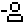</a> | **📂 檔名:** `user-minus.svg` ✨ **格式:** `Vector (SVG)` ⚖️ **大小:** `492.00B` 📅 **更新:** `2026-02-27`  🔗 [直接查看原始檔](user-minus.svg) |
|  | **📂 檔名:** `user-x.svg` ✨ **格式:** `Vector (SVG)` ⚖️ **大小:** `520.00B` 📅 **更新:** `2026-02-27`  🔗 [直接查看原始檔](user-x.svg) |
|  | **📂 檔名:** `user.svg` ✨ **格式:** `Vector (SVG)` ⚖️ **大小:** `460.00B` 📅 **更新:** `2026-02-27`  🔗 [直接查看原始檔](user.svg) |
|  | **📂 檔名:** `users.svg` ✨ **格式:** `Vector (SVG)` ⚖️ **大小:** `689.00B` 📅 **更新:** `2026-02-27`  🔗 [直接查看原始檔](users.svg) |
|  | **📂 檔名:** `view-col.svg` ✨ **格式:** `Vector (SVG)` ⚖️ **大小:** `443.00B` 📅 **更新:** `2026-02-27`  🔗 [直接查看原始檔](view-col.svg) |
|  | **📂 檔名:** `viewport-wide.svg` ✨ **格式:** `Vector (SVG)` ⚖️ **大小:** `557.00B` 📅 **更新:** `2026-02-27`  🔗 [直接查看原始檔](viewport-wide.svg) |
|  | **📂 檔名:** `volume-high.svg` ✨ **格式:** `Vector (SVG)` ⚖️ **大小:** `992.00B` 📅 **更新:** `2026-02-27`  🔗 [直接查看原始檔](volume-high.svg) |
|  | **📂 檔名:** `volume-low.svg` ✨ **格式:** `Vector (SVG)` ⚖️ **大小:** `572.00B` 📅 **更新:** `2026-02-27`  🔗 [直接查看原始檔](volume-low.svg) |
|  | **📂 檔名:** `volume-medium.svg` ✨ **格式:** `Vector (SVG)` ⚖️ **大小:** `706.00B` 📅 **更新:** `2026-02-27`  🔗 [直接查看原始檔](volume-medium.svg) |
| <a href="volume-mute.svg">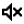</a> | **📂 檔名:** `volume-mute.svg` ✨ **格式:** `Vector (SVG)` ⚖️ **大小:** `854.00B` 📅 **更新:** `2026-02-27`  🔗 [直接查看原始檔](volume-mute.svg) |
|  | **📂 檔名:** `volume.svg` ✨ **格式:** `Vector (SVG)` ⚖️ **大小:** `452.00B` 📅 **更新:** `2026-02-27`  🔗 [直接查看原始檔](volume.svg) |
|  | **📂 檔名:** `volumrectangleplus.svg` ✨ **格式:** `Vector (SVG)` ⚖️ **大小:** `568.00B` 📅 **更新:** `2026-02-27`  🔗 [直接查看原始檔](volumrectangleplus.svg) |
|  | **📂 檔名:** `wait.svg` ✨ **格式:** `Vector (SVG)` ⚖️ **大小:** `495.00B` 📅 **更新:** `2026-02-27`  🔗 [直接查看原始檔](wait.svg) |
|  | **📂 檔名:** `wall-fill.svg` ✨ **格式:** `Vector (SVG)` ⚖️ **大小:** `568.00B` 📅 **更新:** `2026-02-27`  🔗 [直接查看原始檔](wall-fill.svg) |
|  | **📂 檔名:** `wall.svg` ✨ **格式:** `Vector (SVG)` ⚖️ **大小:** `492.00B` 📅 **更新:** `2026-02-27`  🔗 [直接查看原始檔](wall.svg) |
|  | **📂 檔名:** `wallet.svg` ✨ **格式:** `Vector (SVG)` ⚖️ **大小:** `479.00B` 📅 **更新:** `2026-02-27`  🔗 [直接查看原始檔](wallet.svg) |
|  | **📂 檔名:** `warning.svg` ✨ **格式:** `Vector (SVG)` ⚖️ **大小:** `533.00B` 📅 **更新:** `2026-02-27`  🔗 [直接查看原始檔](warning.svg) |
|  | **📂 檔名:** `water.svg` ✨ **格式:** `Vector (SVG)` ⚖️ **大小:** `499.00B` 📅 **更新:** `2026-02-27`  🔗 [直接查看原始檔](water.svg) |
|  | **📂 檔名:** `weapon.svg` ✨ **格式:** `Vector (SVG)` ⚖️ **大小:** `886.00B` 📅 **更新:** `2026-02-27`  🔗 [直接查看原始檔](weapon.svg) |
|  | **📂 檔名:** `well.svg` ✨ **格式:** `Vector (SVG)` ⚖️ **大小:** `527.00B` 📅 **更新:** `2026-02-27`  🔗 [直接查看原始檔](well.svg) |
|  | **📂 檔名:** `wifi-Strong.svg` ✨ **格式:** `Vector (SVG)` ⚖️ **大小:** `3.37KB` 📅 **更新:** `2026-02-27`  🔗 [直接查看原始檔](wifi-Strong.svg) |
|  | **📂 檔名:** `window.svg` ✨ **格式:** `Vector (SVG)` ⚖️ **大小:** `423.00B` 📅 **更新:** `2026-02-27`  🔗 [直接查看原始檔](window.svg) |
|  | **📂 檔名:** `work.svg` ✨ **格式:** `Vector (SVG)` ⚖️ **大小:** `496.00B` 📅 **更新:** `2026-02-27`  🔗 [直接查看原始檔](work.svg) |
|  | **📂 檔名:** `zoom-Up.svg` ✨ **格式:** `Vector (SVG)` ⚖️ **大小:** `671.00B` 📅 **更新:** `2026-02-27`  🔗 [直接查看原始檔](zoom-Up.svg) |
|  | **📂 檔名:** `zoom-down.svg` ✨ **格式:** `Vector (SVG)` ⚖️ **大小:** `656.00B` 📅 **更新:** `2026-02-27`  🔗 [直接查看原始檔](zoom-down.svg) |
|  | **📂 檔名:** `zoom.svg` ✨ **格式:** `Vector (SVG)` ⚖️ **大小:** `540.00B` 📅 **更新:** `2026-02-27`  🔗 [直接查看原始檔](zoom.svg) |
|  | **📂 檔名:** `zoomin.svg` ✨ **格式:** `Vector (SVG)` ⚖️ **大小:** `542.00B` 📅 **更新:** `2026-02-27`  🔗 [直接查看原始檔](zoomin.svg) |
|  | **📂 檔名:** `zoomout.svg` ✨ **格式:** `Vector (SVG)` ⚖️ **大小:** `525.00B` 📅 **更新:** `2026-02-27`  🔗 [直接查看原始檔](zoomout.svg) |
|  | **📂 檔名:** `Сlosed.svg` ✨ **格式:** `Vector (SVG)` ⚖️ **大小:** `625.00B` 📅 **更新:** `2026-02-27`  🔗 [直接查看原始檔](%D0%A1losed.svg) |