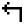

# 🖼️ Px-Group

[⬅️ 返回主目錄](../../../README.md)

| 預覽 | 資訊 |
| :--- | :--- |
|  | **4k-box.svg** |
|  | **Bluetooth.svg** |
|  | **Delete-Document.svg** |
|  | **Equalizer.svg** |
|  | **Geotag.svg** |
|  | **Gift.svg** |
|  | **Image.svg** |
|  | **Inbox.svg** |
|  | **Incoming-Call.svg** |
|  | **Italic.svg** |
|  | **Justify.svg** |
|  | **Kebab-menu_Vertical.svg** |
|  | **Kebab-menu_horizontal.svg** |
|  | **Link-1.svg** |
|  | **Next-2.svg** |
|  | **Opened.svg** |
|  | **Outgoing-call.svg** |
|  | **Share.svg** |
|  | **Show.svg** |
|  | **Sound-Off.svg** |
|  | **Sound-On.svg** |
|  | **Stop.svg** |
|  | **TV.svg** |
|  | **Text.svg** |
|  | **Underlined.svg** |
|  | **Up-arrow-2.svg** |
|  | **Up-left_arrow.svg** |
|  | **Up-right_arrow.svg** |
|  | **account-box.svg** |
|  | **add-1.svg** |
|  | **add-bookmark.svg** |
|  | **add-box-multiple.svg** |
|  | **add-col.svg** |
|  | **add-folder.svg** |
|  | **add-img.svg** |
|  | **add-messages.svg** |
|  | **add-person.svg** |
|  | **add-row.svg** |
|  | **add.svg** |
|  | **alert-1.svg** |
|  | **alert.svg** |
|  | **align-center-1.svg** |
|  | **align-center.svg** |
|  | **align-left.svg** |
|  | **align-right.svg** |
|  | **analytics.svg** |
|  | **andriod.svg** |
|  | **android.svg** |
|  | **animation.svg** |
|  | **archer-1.svg** |
|  | **archer-2.svg** |
|  | **archer.svg** |
|  | **archive.svg** |
|  | **arrow lefrectangle.svg** |
|  | **arrow top.svg** |
|  | **arrow-bar-left.svg** |
|  | **arrow-bar-up.svg** |
|  | **arrow-down-box.svg** |
|  | **arrow-down-circle.svg** |
|  | **arrow-left-box.svg** |
|  | **arrow-left-circle.svg** |
|  | **arrow-right-1.svg** |
|  | **arrow-right-circle.svg** |
|  | **arrow-right-up.svg** |
|  | **arrow-right.svg** |
|  | **arrow-top-left.svg** |
|  | **arrow-up-box.svg** |
|  | **arrow.svg** |
|  | **arrow1.svg** |
|  | **arrow10.svg** |
|  | **arrow11.svg** |
|  | **arrow12.svg** |
|  | **arrow2.svg** |
|  | **arrow3.svg** |
|  | **arrow4.svg** |
|  | **arrow5.svg** |
|  | **arrow6.svg** |
|  | **arrow7.svg** |
|  | **arrow8.svg** |
|  | **arrow9.svg** |
|  | **arrowhead.svg** |
|  | **arrowheads-1.svg** |
|  | **arrowheads-2.svg** |
|  | **arrowheads-3.svg** |
|  | **arrowheads.svg** |
|  | **arrows-1.svg** |
|  | **arrows-horizontal.svg** |
|  | **arrows.svg** |
|  | **art-text.svg** |
|  | **article-multiple.svg** |
|  | **article.svg** |
|  | **aspect-ratio.svg** |
|  | **at.svg** |
|  | **attachment.svg** |
|  | **attention.svg** |
|  | **back.svg** |
|  | **backburger.svg** |
|  | **bag.svg** |
|  | **battery-1.svg** |
|  | **battery.svg** |
|  | **beauty-mirror.svg** |
|  | **block-person.svg** |
|  | **block.svg** |
|  | **bold.svg** |
|  | **bookmark.svg** |
|  | **box-outer-light-dashed-all.svg** |
|  | **briefcase-1.svg** |
|  | **briefcase-account.svg** |
|  | **briefcase-check.svg** |
|  | **briefcase-delete.svg** |
|  | **briefcase-download.svg** |
|  | **briefcase-minus.svg** |
|  | **briefcase-plus.svg** |
|  | **briefcase-search.svg** |
|  | **briefcase-upload.svg** |
|  | **briefcase.svg** |
|  | **bubble.svg** |
|  | **build.svg** |
|  | **business-money-coin-currency.svg** |
|  | **business-prodect-diamond.svg** |
|  | **business-product-startup.svg** |
|  | **business-products-cash-user-man-message.svg** |
|  | **calendar-1.svg** |
|  | **calendar-alert.svg** |
|  | **calendar-arrow-left.svg** |
|  | **calendar-arrow-right.svg** |
|  | **calendar-check.svg** |
|  | **calendar-export.svg** |
|  | **calendar-grid.svg** |
|  | **calendar-import.svg** |
|  | **calendar-minus.svg** |
|  | **calendar-month.svg** |
|  | **calendar-multiple-check.svg** |
|  | **calendar-multiple.svg** |
|  | **calendar-plus.svg** |
|  | **calendar-range.svg** |
|  | **calendar-remove.svg** |
|  | **calendar-search.svg** |
|  | **calendar-sort-ascending.svg** |
|  | **calendar-sort-descending.svg** |
|  | **calendar-text.svg** |
|  | **calendar-weekend.svg** |
|  | **calendar.svg** |
|  | **calendrectangletomorrow.svg** |
|  | **call-On.svg** |
|  | **calls-Add.svg** |
|  | **calls-delete.svg** |
|  | **calls.svg** |
|  | **camara.svg** |
|  | **card-id.svg** |
|  | **card-stack.svg** |
|  | **card-text.svg** |
|  | **cart-1.svg** |
|  | **cart-2.svg** |
|  | **cart.svg** |
|  | **cast.svg** |
|  | **chart-delete.svg** |
|  | **chart-minus.svg** |
|  | **chat-1.svg** |
|  | **chat-email.svg** |
|  | **chat.svg** |
|  | **check-double.svg** |
|  | **check.svg** |
|  | **checkbox orectangle.svg** |
|  | **checkbox.svg** |
|  | **chess.svg** |
|  | **chevron-right.svg** |
|  | **chevrorectangledown.svg** |
|  | **chevrorectangleleft.svg** |
|  | **chevrorectangletop.svg** |
|  | **chip-svgrepo-com.svg** |
|  | **circle.svg** |
|  | **clipboard.svg** |
|  | **clock-1.svg** |
|  | **clock.svg** |
|  | **close.svg** |
|  | **cloud-1.svg** |
|  | **cloud-download-1.svg** |
|  | **cloud-download.svg** |
|  | **cloud.svg** |
|  | **code-variable.svg** |
|  | **code.svg** |
|  | **coding-app-website-ui.svg** |
|  | **coding-apps-websites-module.svg** |
|  | **coding-apps-websites-plugin.svg** |
|  | **coffee-1.svg** |
|  | **coffee.svg** |
|  | **colors-swatch.svg** |
|  | **colse.svg** |
|  | **command.svg** |
|  | **complete.svg** |
|  | **computer-old-electronics.svg** |
|  | **computers-devices-electronics-tape-cassette.svg** |
|  | **contact-delete-1.svg** |
|  | **contact-delete.svg** |
|  | **content-files-archive-books.svg** |
|  | **content-files-close-book-bookmark.svg** |
|  | **content-files-newspaper.svg** |
|  | **content-files-pencil-brush.svg** |
|  | **content-files-quill-ink.svg** |
|  | **copy-document.svg** |
|  | **copy-folder.svg** |
|  | **copy.svg** |
|  | **corner-down-right.svg** |
|  | **corner-left-down.svg** |
|  | **corner-left-up.svg** |
|  | **corner-right-down.svg** |
|  | **corner-up-left.svg** |
|  | **create-document.svg** |
|  | **create-folder.svg** |
|  | **credit-card-delete.svg** |
|  | **crop.svg** |
|  | **crossing-1.svg** |
|  | **crossing-2.svg** |
|  | **crossing.svg** |
|  | **crown.svg** |
|  | **cut.svg** |
|  | **dashbaord.svg** |
|  | **delete-bookmark.svg** |
|  | **delete-folder.svg** |
|  | **delete-message.svg** |
|  | **delete-person.svg** |
|  | **delete.svg** |
|  | **design-color-painting-palette.svg** |
|  | **design-color-spray.svg** |
|  | **deskphone.svg** |
|  | **device-tablet.svg** |
|  | **devices.svg** |
|  | **diary.svg** |
|  | **direction.svg** |
|  | **document.svg** |
|  | **down-arrow.svg** |
|  | **down-left_arrow.svg** |
|  | **down-right_arrow.svg** |
|  | **downasaur.svg** |
|  | **download-1.svg** |
|  | **download-2.svg** |
|  | **download-3.svg** |
|  | **download.svg** |
|  | **downloading.svg** |
|  | **draft.svg** |
|  | **drag-and-drop.svg** |
|  | **drop-half.svg** |
|  | **duplicate-alt.svg** |
|  | **duplicate.svg** |
|  | **ecology-clean-battery.svg** |
|  | **ecology-global-warming-globe-fire.svg** |
|  | **ecology-plant-growth-soil-nature.svg** |
|  | **edit-1.svg** |
|  | **edit.svg** |
|  | **email-envelope.svg** |
|  | **email-mail-open-address.svg** |
|  | **email-stamp-mail.svg** |
|  | **entertainment-events-hobbies-film-player.svg** |
|  | **expand-1.svg** |
|  | **expand.svg** |
|  | **export-1.svg** |
|  | **export.svg** |
|  | **external-link.svg** |
|  | **eye-closed.svg** |
|  | **eye.svg** |
|  | **favorites.svg** |
|  | **figma.svg** |
|  | **file-add.svg** |
|  | **file-delete.svg** |
|  | **file-detail.svg** |
|  | **file-flash.svg** |
|  | **file-minus.svg** |
|  | **file-multiple.svg** |
|  | **file-plus.svg** |
|  | **file-remove.svg** |
|  | **file.svg** |
|  | **fill-half.svg** |
|  | **fill.svg** |
|  | **film.svg** |
|  | **filter-1.svg** |
|  | **filter.svg** |
|  | **flag-1.svg** |
|  | **flag.svg** |
|  | **flatten.svg** |
|  | **flip.svg** |
|  | **float-center.svg** |
|  | **float-left.svg** |
|  | **float-right.svg** |
|  | **folder-1.svg** |
|  | **folder-x.svg** |
|  | **folder.svg** |
|  | **food-drink-bread.svg** |
|  | **forward-1.svg** |
|  | **forward.svg** |
|  | **forwardburger.svg** |
|  | **foward.svg** |
|  | **frame-add.svg** |
|  | **frame-check.svg** |
|  | **frame-delete.svg** |
|  | **gamepad-center.svg** |
|  | **gamepad-down-left.svg** |
|  | **gamepad-down-right.svg** |
|  | **gamepad-down.svg** |
|  | **gamepad-empty.svg** |
|  | **gamepad-left.svg** |
|  | **gamepad-right.svg** |
|  | **gamepad-up-left.svg** |
|  | **gamepad-up-right.svg** |
|  | **gamepad-up.svg** |
|  | **gif.svg** |
|  | **git-branch.svg** |
|  | **git-commit.svg** |
|  | **git-merge.svg** |
|  | **gps.svg** |
|  | **grid.svg** |
|  | **group.svg** |
|  | **hand-awesome.svg** |
|  | **hand-cross-finger-heart.svg** |
|  | **hand-love-sign.svg** |
|  | **hash.svg** |
|  | **hd.svg** |
|  | **headphones.svg** |
|  | **health-drug-medicine-water.svg** |
|  | **health-drug-medicine.svg** |
|  | **health-drugs-pill.svg** |
|  | **health-laboratory-test-blood-sugar.svg** |
|  | **heart.svg** |
|  | **hidden.svg** |
|  | **hide.svg** |
|  | **home-1.svg** |
|  | **home.svg** |
|  | **hq.svg** |
|  | **human-height-alt.svg** |
|  | **human.svg** |
|  | **humrectanglehandsup.svg** |
|  | **image-1.svg** |
|  | **image-arrow-right.svg** |
|  | **image-delete.svg** |
|  | **image-flash.svg** |
|  | **image-plus.svg** |
|  | **insert.svg** |
|  | **interface-essential-alert.svg** |
|  | **interface-essential-bookmark.svg** |
|  | **interface-essential-calendar-appointment.svg** |
|  | **interface-essential-clound-download.svg** |
|  | **interface-essential-direction-button.svg** |
|  | **interface-essential-floppy-disk.svg** |
|  | **interface-essential-heart-favorite.svg** |
|  | **interface-essential-hierarchy.svg** |
|  | **interface-essential-key.svg** |
|  | **interface-essential-link-broken.svg** |
|  | **interface-essential-paginate-filter-camera.svg** |
|  | **interface-essential-paginate-filter-music.svg** |
|  | **interface-essential-paginate-filter-picture.svg** |
|  | **interface-essential-pie-chart-poll-report.svg** |
|  | **interface-essential-pin.svg** |
|  | **interface-essential-setting-cog.svg** |
|  | **interface-essential-switch-off.svg** |
|  | **interface-essential-translate.svg** |
|  | **interface-essential-waiting-hourglass-loading.svg** |
|  | **interface-essential-wifi-feed.svg** |
|  | **internet-network-www.svg** |
|  | **invert.svg** |
|  | **iso.svg** |
|  | **kanban.svg** |
|  | **label-alt-multiple.svg** |
|  | **label-alt.svg** |
|  | **layout-align-bottom.svg** |
|  | **layout-align-left.svg** |
|  | **layout-align-right.svg** |
|  | **layout-align-top.svg** |
|  | **layout-columns.svg** |
|  | **layout-footer.svg** |
|  | **layout-sidebar-left.svg** |
|  | **layout-sidebar-right.svg** |
|  | **layout.svg** |
|  | **left-Turn.svg** |
|  | **left-arrow.svg** |
|  | **letters-abc-in-pixelated-form-svgrepo-com.svg** |
|  | **levels-1.svg** |
|  | **levels-2.svg** |
|  | **link.svg** |
|  | **list.svg** |
|  | **load.svg** |
|  | **lock-open.svg** |
|  | **lock.svg** |
|  | **logo-social-media-old-instagram.svg** |
|  | **logo-social-media-tiktok.svg** |
|  | **mail-arrow-right.svg** |
|  | **mail-delete.svg** |
|  | **mail-flash.svg** |
|  | **mail-multiple.svg** |
|  | **mail-unread.svg** |
|  | **mail.svg** |
|  | **map-navigation-pin-location.svg** |
|  | **maximize-1.svg** |
|  | **maximize-2.svg** |
|  | **maximize-3.svg** |
|  | **maximize-4.svg** |
|  | **maximize.svg** |
|  | **menu-1.svg** |
|  | **menu-top-left.svg** |
|  | **menu.svg** |
|  | **message-arrow-left.svg** |
|  | **message-bookmark.svg** |
|  | **message-clock.svg** |
|  | **message-delete.svg** |
|  | **message-flash.svg** |
|  | **message-image.svg** |
|  | **message-minus.svg** |
|  | **message-processing.svg** |
|  | **messages.svg** |
|  | **microphone-Off.svg** |
|  | **microphone-On.svg** |
|  | **microphone.svg** |
|  | **minimize-1.svg** |
|  | **minimize-2.svg** |
|  | **minimize.svg** |
|  | **minus.svg** |
|  | **missed-call.svg** |
|  | **money-payments-accounting-bill-money.svg** |
|  | **money-payments-accounting-calculator.svg** |
|  | **more-horizontal.svg** |
|  | **more.svg** |
|  | **mouse.svg** |
|  | **move.svg** |
|  | **movie.svg** |
|  | **multiple.svg** |
|  | **multiply.svg** |
|  | **music-disk-cd.svg** |
|  | **music-notes-music.svg** |
|  | **mute-1.svg** |
|  | **mute.svg** |
|  | **necklace.svg** |
|  | **next-1.svg** |
|  | **next-3.svg** |
|  | **next-4.svg** |
|  | **next.svg** |
|  | **non-gmo-fertilizer.svg** |
|  | **note-delete.svg** |
|  | **note-multiple-1.svg** |
|  | **note-multiple.svg** |
|  | **note-plus.svg** |
|  | **note.svg** |
|  | **notification-1.svg** |
|  | **notification.svg** |
|  | **open-1.svg** |
|  | **open.svg** |
|  | **paperclip.svg** |
|  | **paste-document.svg** |
|  | **paste-folder.svg** |
|  | **path 6682.svg** |
|  | **pause.svg** |
|  | **pen.svg** |
|  | **person-Group.svg** |
|  | **person-added.svg** |
|  | **person.svg** |
|  | **pgone.svg** |
|  | **phone-Vibrate.svg** |
|  | **phone.svg** |
|  | **photo.svg** |
|  | **photography-camera.svg** |
|  | **pickaxe.svg** |
|  | **picture-in-picture-alt.svg** |
|  | **pixelarticons-svgrepo-com.svg** |
|  | **pixelated-Icons-Logo.svg** |
|  | **pixelated-person-svgrepo-com.svg** |
|  | **pixels.svg** |
|  | **play-1.svg** |
|  | **play-2.svg** |
|  | **play-3.svg** |
|  | **play.svg** |
|  | **player-1.svg** |
|  | **player.svg** |
|  | **plus-box-fill.svg** |
|  | **plus-circle-fill.svg** |
|  | **plus-circle.svg** |
|  | **plus.svg** |
|  | **point.svg** |
|  | **pointer-Right.svg** |
|  | **pointer-arrow.svg** |
|  | **pointer-down.svg** |
|  | **pointer-left.svg** |
|  | **pointer.svg** |
|  | **power.svg** |
|  | **print.svg** |
|  | **program.svg** |
|  | **protection.svg** |
|  | **px-icon1.svg** |
|  | **px-icon10.svg** |
|  | **px-icon11.svg** |
|  | **px-icon12.svg** |
|  | **px-icon13.svg** |
|  | **px-icon14.svg** |
|  | **px-icon15.svg** |
|  | **px-icon16.svg** |
|  | **px-icon17.svg** |
|  | **px-icon18.svg** |
|  | **px-icon19.svg** |
|  | **px-icon2.svg** |
|  | **px-icon20.svg** |
|  | **px-icon21.svg** |
|  | **px-icon22.svg** |
|  | **px-icon23.svg** |
|  | **px-icon24.svg** |
|  | **px-icon25.svg** |
|  | **px-icon26.svg** |
|  | **px-icon27.svg** |
|  | **px-icon28.svg** |
|  | **px-icon29.svg** |
|  | **px-icon3.svg** |
|  | **px-icon30.svg** |
|  | **px-icon31.svg** |
|  | **px-icon32.svg** |
|  | **px-icon33.svg** |
|  | **px-icon34.svg** |
|  | **px-icon35.svg** |
|  | **px-icon36.svg** |
|  | **px-icon37.svg** |
|  | **px-icon38.svg** |
|  | **px-icon39.svg** |
|  | **px-icon4.svg** |
|  | **px-icon40.svg** |
|  | **px-icon41.svg** |
|  | **px-icon42.svg** |
|  | **px-icon43.svg** |
|  | **px-icon44.svg** |
|  | **px-icon45.svg** |
|  | **px-icon46.svg** |
|  | **px-icon47.svg** |
|  | **px-icon48.svg** |
|  | **px-icon49.svg** |
|  | **px-icon5.svg** |
|  | **px-icon6.svg** |
|  | **px-icon7.svg** |
|  | **px-icon8.svg** |
|  | **px-icon9.svg** |
|  | **radio-handheld.svg** |
|  | **real-estate-building-ad.svg** |
|  | **real-estate-building-house.svg** |
|  | **redo-1.svg** |
|  | **redo-2.svg** |
|  | **redo.svg** |
|  | **reload-1.svg** |
|  | **reload.svg** |
|  | **remove-box-multiple.svg** |
|  | **remove-folder.svg** |
|  | **repeat.svg** |
|  | **replay.svg** |
|  | **right-1.svg** |
|  | **right-Turn.svg** |
|  | **right-arrow-1.svg** |
|  | **right-arrow.svg** |
|  | **right-arrows-1.svg** |
|  | **right-arrows-2.svg** |
|  | **right-arrows-3.svg** |
|  | **right-arrows-4.svg** |
|  | **right-arrows-5.svg** |
|  | **right-arrows.svg** |
|  | **right.svg** |
|  | **rotate.svg** |
|  | **rounded-corner.svg** |
|  | **save.svg** |
|  | **scale.svg** |
|  | **school-science-test-flask.svg** |
|  | **script-1.svg** |
|  | **script-text.svg** |
|  | **script.svg** |
|  | **scroll-horizontal.svg** |
|  | **scroll.svg** |
|  | **sd.svg** |
|  | **search.svg** |
|  | **section-minus.svg** |
|  | **section-plus.svg** |
|  | **section.svg** |
|  | **shield-off.svg** |
|  | **shield.svg** |
|  | **shopping-shipping-bag.svg** |
|  | **shopping-shipping-basket.svg** |
|  | **shopping-shipping-discount-coupon.svg** |
|  | **shopping-shipping-products-gift.svg** |
|  | **shopping-shipping-receipt-slip.svg** |
|  | **shopping-shipping-shop.svg** |
|  | **shuffle.svg** |
|  | **skip-1.svg** |
|  | **skip.svg** |
|  | **skull.svg** |
|  | **social-rewards-flag.svg** |
|  | **social-rewards-heart-like-circle.svg** |
|  | **sort-alpabetic.svg** |
|  | **sort-numeric.svg** |
|  | **sort.svg** |
|  | **speaker.svg** |
|  | **spotlight.svg** |
|  | **start.svg** |
|  | **statistics.svg** |
|  | **stop-1.svg** |
|  | **store.svg** |
|  | **streamline-bubble.svg** |
|  | **sun-1.svg** |
|  | **sun.svg** |
|  | **svg.svg** |
|  | **sword.svg** |
|  | **tag-text.svg** |
|  | **tag.svg** |
|  | **target.svg** |
|  | **tea.svg** |
|  | **terminal.svg** |
|  | **texrectanglesearch.svg** |
|  | **text-box.svg** |
|  | **text-image.svg** |
|  | **text-wrap.svg** |
|  | **timeline.svg** |
|  | **toggle-switch-off.svg** |
|  | **toggle-switch-on.svg** |
|  | **toolbox.svg** |
|  | **tooltip-above-alert.svg** |
|  | **tooltip-above-text.svg** |
|  | **tooltip-above.svg** |
|  | **tooltip-below-alert.svg** |
|  | **tooltip-below-text.svg** |
|  | **tooltip-below.svg** |
|  | **tooltip-end-alert.svg** |
|  | **tooltip-end-text.svg** |
|  | **tooltip-end.svg** |
|  | **tooltip-start-alert.svg** |
|  | **tooltip-start-text.svg** |
|  | **tooltip-start.svg** |
|  | **tournament.svg** |
|  | **transportation-motorcycle.svg** |
|  | **transportation-train.svg** |
|  | **trash-1.svg** |
|  | **trash.svg** |
|  | **travel-wayfinding-balloon.svg** |
|  | **travel-wayfinding-beach-umbrella.svg** |
|  | **trending.svg** |
|  | **ui-design-website.svg** |
|  | **undo.svg** |
|  | **ungroup.svg** |
|  | **up-arrow-1.svg** |
|  | **up-arrow.svg** |
|  | **up.svg** |
|  | **upload-1.svg** |
|  | **upload.svg** |
|  | **user-add.svg** |
|  | **user-gender-female-male.svg** |
|  | **user-minus.svg** |
|  | **user-x.svg** |
|  | **user.svg** |
|  | **users.svg** |
|  | **view-col.svg** |
|  | **viewport-wide.svg** |
|  | **volume-high.svg** |
|  | **volume-low.svg** |
|  | **volume-medium.svg** |
|  | **volume-mute.svg** |
|  | **volume.svg** |
|  | **volumrectangleplus.svg** |
|  | **wait.svg** |
|  | **wall-fill.svg** |
|  | **wall.svg** |
|  | **wallet.svg** |
|  | **warning.svg** |
|  | **water.svg** |
|  | **weapon.svg** |
|  | **well.svg** |
|  | **wifi-Strong.svg** |
|  | **window.svg** |
|  | **work.svg** |
|  | **zoom-Up.svg** |
|  | **zoom-down.svg** |
|  | **zoom.svg** |
|  | **zoomin.svg** |
|  | **zoomout.svg** |
|  | **Сlosed.svg** |