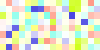
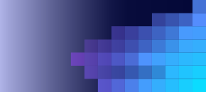
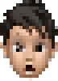
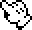

# 📂 目錄：Resumes

> [🏠 主目錄](../../README.md) / [images](../README.md) / **Resumes**

此目錄目前沒有直接存放圖片，請選擇下方子分類：

### 🗂️ 子分類列表

| 分類名稱 | 封面預覽 | 統計 |
| :--- | :--- | :--- |
| [📠**Backgrounds**](Backgrounds/README.md) | &nbsp;&nbsp;&nbsp; | 共 `4` 張 |
| [📠**BarrY**](BarrY/README.md) | &nbsp;&nbsp;&nbsp;&nbsp;&nbsp;&nbsp;&nbsp;&nbsp;&nbsp;&nbsp; | 共 `11` 張 |
| [📠**Px-Cursots**](Px-Cursots/README.md) | &nbsp;&nbsp;&nbsp;&nbsp;&nbsp;&nbsp; | 共 `7` 張 |
| [📠**Px-Group**](Px-Group/README.md) | &nbsp;&nbsp;&nbsp;&nbsp;&nbsp;&nbsp;&nbsp;&nbsp;&nbsp;&nbsp;&nbsp;&nbsp;&nbsp;&nbsp;&nbsp;&nbsp;&nbsp;&nbsp;&nbsp; | 共 `671` 張 |