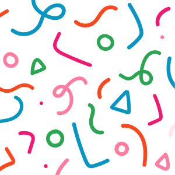
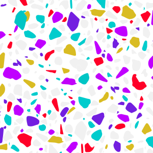
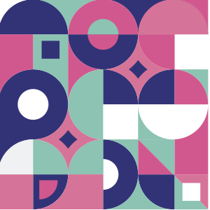
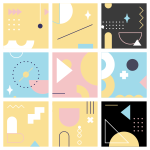
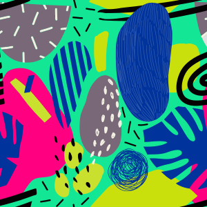
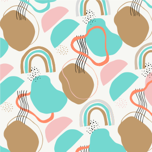
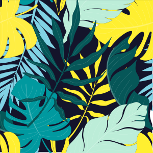

# 🖼️ 素材分類：Patterns

> [🏠 主目錄](../../../README.md) / [images](../../README.md) / [Svg Samples](../README.md) / **Patterns**

本目錄共有 `20` 個檔案

| 🎨 預覽 (點擊放大)  | 📋 檔案詳細資訊與連結 |
| :--- | :--- |
|  | **📂 檔名:** `bg-pattern-flowers-%-1.svg` ✨ **格式:** `Vector (SVG)` ⚖️ **大小:** `114.78KB` 📅 **更新:** `2026-02-28`  🚀 **jsDelivr Markdown:** `` 🔗 **直接連結 (Url):** <code>https://cdn.jsdelivr.net/gh/barry028/materials@main/images/Svg%20Samples/Patterns/bg-pattern-flowers-%25-1.svg</code> 📥 [檢視原始檔](bg-pattern-flowers-%25-1.svg) |
|  | **📂 檔名:** `bg-pattern-flowers-%-2.svg` ✨ **格式:** `Vector (SVG)` ⚖️ **大小:** `99.87KB` 📅 **更新:** `2026-02-28`  🚀 **jsDelivr Markdown:** `` 🔗 **直接連結 (Url):** <code>https://cdn.jsdelivr.net/gh/barry028/materials@main/images/Svg%20Samples/Patterns/bg-pattern-flowers-%25-2.svg</code> 📥 [檢視原始檔](bg-pattern-flowers-%25-2.svg) |
|  | **📂 檔名:** `bg-pattern-flowers-%-3.svg` ✨ **格式:** `Vector (SVG)` ⚖️ **大小:** `15.26KB` 📅 **更新:** `2026-02-28`  🚀 **jsDelivr Markdown:** `` 🔗 **直接連結 (Url):** <code>https://cdn.jsdelivr.net/gh/barry028/materials@main/images/Svg%20Samples/Patterns/bg-pattern-flowers-%25-3.svg</code> 📥 [檢視原始檔](bg-pattern-flowers-%25-3.svg) |
|  | **📂 檔名:** `bg-pattern-flowers-%0v.svg` ✨ **格式:** `Vector (SVG)` ⚖️ **大小:** `208.49KB` 📅 **更新:** `2026-02-28`  🚀 **jsDelivr Markdown:** `` 🔗 **直接連結 (Url):** <code>https://cdn.jsdelivr.net/gh/barry028/materials@main/images/Svg%20Samples/Patterns/bg-pattern-flowers-%250v.svg</code> 📥 [檢視原始檔](bg-pattern-flowers-%250v.svg) |
|  | **📂 檔名:** `bg-pattern-geometry-1.svg` ✨ **格式:** `Vector (SVG)` ⚖️ **大小:** `8.75KB` 📅 **更新:** `2026-02-28`  🚀 **jsDelivr Markdown:** `` 🔗 **直接連結 (Url):** <code>https://cdn.jsdelivr.net/gh/barry028/materials@main/images/Svg%20Samples/Patterns/bg-pattern-geometry-1.svg</code> 📥 [檢視原始檔](bg-pattern-geometry-1.svg) |
|  | **📂 檔名:** `bg-pattern-geometry.svg` ✨ **格式:** `Vector (SVG)` ⚖️ **大小:** `4.32KB` 📅 **更新:** `2026-02-28`  🚀 **jsDelivr Markdown:** `` 🔗 **直接連結 (Url):** <code>https://cdn.jsdelivr.net/gh/barry028/materials@main/images/Svg%20Samples/Patterns/bg-pattern-geometry.svg</code> 📥 [檢視原始檔](bg-pattern-geometry.svg) |
|  | **📂 檔名:** `bg-pattern-line.svg` ✨ **格式:** `Vector (SVG)` ⚖️ **大小:** `13.84KB` 📅 **更新:** `2026-02-28`  🚀 **jsDelivr Markdown:** `` 🔗 **直接連結 (Url):** <code>https://cdn.jsdelivr.net/gh/barry028/materials@main/images/Svg%20Samples/Patterns/bg-pattern-line.svg</code> 📥 [檢視原始檔](bg-pattern-line.svg) |
|  | **📂 檔名:** `bg-pattern-mixed.svg` ✨ **格式:** `Vector (SVG)` ⚖️ **大小:** `12.83KB` 📅 **更新:** `2026-02-28`  🚀 **jsDelivr Markdown:** `` 🔗 **直接連結 (Url):** <code>https://cdn.jsdelivr.net/gh/barry028/materials@main/images/Svg%20Samples/Patterns/bg-pattern-mixed.svg</code> 📥 [檢視原始檔](bg-pattern-mixed.svg) |
|  | **📂 檔名:** `bg-pattern-shapes-1.svg` ✨ **格式:** `Vector (SVG)` ⚖️ **大小:** `108.37KB` 📅 **更新:** `2026-02-28`  🚀 **jsDelivr Markdown:** `` 🔗 **直接連結 (Url):** <code>https://cdn.jsdelivr.net/gh/barry028/materials@main/images/Svg%20Samples/Patterns/bg-pattern-shapes-1.svg</code> 📥 [檢視原始檔](bg-pattern-shapes-1.svg) |
|  | **📂 檔名:** `bg-pattern-shapes.svg` ✨ **格式:** `Vector (SVG)` ⚖️ **大小:** `54.19KB` 📅 **更新:** `2026-02-28`  🚀 **jsDelivr Markdown:** `` 🔗 **直接連結 (Url):** <code>https://cdn.jsdelivr.net/gh/barry028/materials@main/images/Svg%20Samples/Patterns/bg-pattern-shapes.svg</code> 📥 [檢視原始檔](bg-pattern-shapes.svg) |
|  | **📂 檔名:** `pattern-001.svg` ✨ **格式:** `Vector (SVG)` ⚖️ **大小:** `53.42KB` 📅 **更新:** `2026-02-28`  🚀 **jsDelivr Markdown:** `` 🔗 **直接連結 (Url):** <code>https://cdn.jsdelivr.net/gh/barry028/materials@main/images/Svg%20Samples/Patterns/pattern-001.svg</code> 📥 [檢視原始檔](pattern-001.svg) |
|  | **📂 檔名:** `pattern-002.svg` ✨ **格式:** `Vector (SVG)` ⚖️ **大小:** `4.40KB` 📅 **更新:** `2026-02-28`  🚀 **jsDelivr Markdown:** `` 🔗 **直接連結 (Url):** <code>https://cdn.jsdelivr.net/gh/barry028/materials@main/images/Svg%20Samples/Patterns/pattern-002.svg</code> 📥 [檢視原始檔](pattern-002.svg) |
|  | **📂 檔名:** `pattern-003.svg` ✨ **格式:** `Vector (SVG)` ⚖️ **大小:** `12.66KB` 📅 **更新:** `2026-02-28`  🚀 **jsDelivr Markdown:** `` 🔗 **直接連結 (Url):** <code>https://cdn.jsdelivr.net/gh/barry028/materials@main/images/Svg%20Samples/Patterns/pattern-003.svg</code> 📥 [檢視原始檔](pattern-003.svg) |
|  | **📂 檔名:** `pattern-004.svg` ✨ **格式:** `Vector (SVG)` ⚖️ **大小:** `13.46KB` 📅 **更新:** `2026-02-28`  🚀 **jsDelivr Markdown:** `` 🔗 **直接連結 (Url):** <code>https://cdn.jsdelivr.net/gh/barry028/materials@main/images/Svg%20Samples/Patterns/pattern-004.svg</code> 📥 [檢視原始檔](pattern-004.svg) |
|  | **📂 檔名:** `pattern-005.svg` ✨ **格式:** `Vector (SVG)` ⚖️ **大小:** `211.85KB` 📅 **更新:** `2026-02-28`  🚀 **jsDelivr Markdown:** `` 🔗 **直接連結 (Url):** <code>https://cdn.jsdelivr.net/gh/barry028/materials@main/images/Svg%20Samples/Patterns/pattern-005.svg</code> 📥 [檢視原始檔](pattern-005.svg) |
|  | **📂 檔名:** `pattern-006.svg` ✨ **格式:** `Vector (SVG)` ⚖️ **大小:** `15.61KB` 📅 **更新:** `2026-02-28`  🚀 **jsDelivr Markdown:** `` 🔗 **直接連結 (Url):** <code>https://cdn.jsdelivr.net/gh/barry028/materials@main/images/Svg%20Samples/Patterns/pattern-006.svg</code> 📥 [檢視原始檔](pattern-006.svg) |
|  | **📂 檔名:** `pattern-007.svg` ✨ **格式:** `Vector (SVG)` ⚖️ **大小:** `102.89KB` 📅 **更新:** `2026-02-28`  🚀 **jsDelivr Markdown:** `` 🔗 **直接連結 (Url):** <code>https://cdn.jsdelivr.net/gh/barry028/materials@main/images/Svg%20Samples/Patterns/pattern-007.svg</code> 📥 [檢視原始檔](pattern-007.svg) |
|  | **📂 檔名:** `pattern-008.svg` ✨ **格式:** `Vector (SVG)` ⚖️ **大小:** `109.64KB` 📅 **更新:** `2026-02-28`  🚀 **jsDelivr Markdown:** `` 🔗 **直接連結 (Url):** <code>https://cdn.jsdelivr.net/gh/barry028/materials@main/images/Svg%20Samples/Patterns/pattern-008.svg</code> 📥 [檢視原始檔](pattern-008.svg) |
|  | **📂 檔名:** `pattern-009.svg` ✨ **格式:** `Vector (SVG)` ⚖️ **大小:** `5.80KB` 📅 **更新:** `2026-02-28`  🚀 **jsDelivr Markdown:** `` 🔗 **直接連結 (Url):** <code>https://cdn.jsdelivr.net/gh/barry028/materials@main/images/Svg%20Samples/Patterns/pattern-009.svg</code> 📥 [檢視原始檔](pattern-009.svg) |
|  | **📂 檔名:** `pattern-010.svg` ✨ **格式:** `Vector (SVG)` ⚖️ **大小:** `95.88KB` 📅 **更新:** `2026-02-28`  🚀 **jsDelivr Markdown:** `` 🔗 **直接連結 (Url):** <code>https://cdn.jsdelivr.net/gh/barry028/materials@main/images/Svg%20Samples/Patterns/pattern-010.svg</code> 📥 [檢視原始檔](pattern-010.svg) |