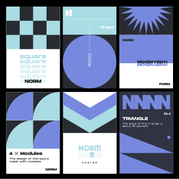

# 🖼️ 素材分類：Prints

> [🏠 主目錄](../../../README.md) / [images](../../README.md) / [Svg Samples](../README.md) / **Prints**

本目錄共有 `3` 個檔案

| 🎨 預覽 (點擊放大)  | 📋 檔案詳細資訊與連結 |
| :--- | :--- |
|  | **📂 檔名:** `Poster-01.svg` ✨ **格式:** `Vector (SVG)` ⚖️ **大小:** `225.03KB` 📅 **更新:** `2026-03-01`  🚀 **jsDelivr Markdown:** `` 🔗 **直接連結 (Url):** <code>https://cdn.jsdelivr.net/gh/barry028/materials@main/images/Svg%20Samples/Prints/Poster-01.svg</code> 📥 [檢視原始檔](Poster-01.svg) |
|  | **📂 檔名:** `Poster-02.svg` ✨ **格式:** `Vector (SVG)` ⚖️ **大小:** `47.95KB` 📅 **更新:** `2026-03-01`  🚀 **jsDelivr Markdown:** `` 🔗 **直接連結 (Url):** <code>https://cdn.jsdelivr.net/gh/barry028/materials@main/images/Svg%20Samples/Prints/Poster-02.svg</code> 📥 [檢視原始檔](Poster-02.svg) |
|  | **📂 檔名:** `Poster-03.svg` ✨ **格式:** `Vector (SVG)` ⚖️ **大小:** `141.07KB` 📅 **更新:** `2026-03-01`  🚀 **jsDelivr Markdown:** `` 🔗 **直接連結 (Url):** <code>https://cdn.jsdelivr.net/gh/barry028/materials@main/images/Svg%20Samples/Prints/Poster-03.svg</code> 📥 [檢視原始檔](Poster-03.svg) |