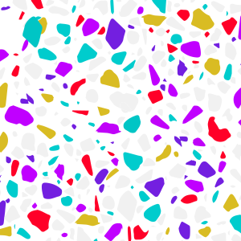
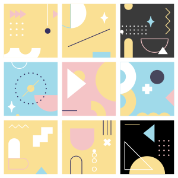
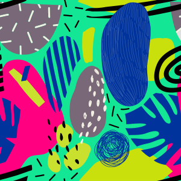
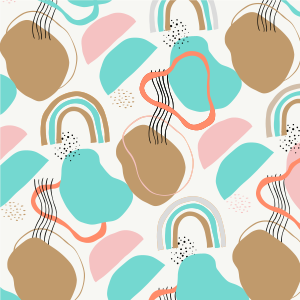

# 🖼️ Patterns Gallery

[⬅️ 回到首頁](../../README.md)

| 預覽 | 詳細資訊 |
| :--- | :--- |
|  | **bg-pattern-flowers-%-1.svg** VectorxVector | 114.78KB 更新: 2026-02-26 |
|  | **bg-pattern-flowers-%-2.svg** VectorxVector | 99.87KB 更新: 2026-02-26 |
|  | **bg-pattern-flowers-%-3.svg** VectorxVector | 15.26KB 更新: 2026-02-26 |
|  | **bg-pattern-flowers-%0v.svg** VectorxVector | 208.49KB 更新: 2026-02-26 |
|  | **bg-pattern-geometry-1.svg** VectorxVector | 8.75KB 更新: 2026-02-26 |
|  | **bg-pattern-geometry.svg** VectorxVector | 4.32KB 更新: 2026-02-26 |
|  | **bg-pattern-line.svg** VectorxVector | 13.84KB 更新: 2026-02-26 |
|  | **bg-pattern-mixed.svg** VectorxVector | 12.83KB 更新: 2026-02-26 |
|  | **bg-pattern-shapes-1.svg** VectorxVector | 108.37KB 更新: 2026-02-26 |
|  | **bg-pattern-shapes.svg** VectorxVector | 54.19KB 更新: 2026-02-26 |
|  | **pattern-001.svg** VectorxVector | 53.42KB 更新: 2026-02-26 |
|  | **pattern-002.svg** VectorxVector | 4.40KB 更新: 2026-02-26 |
|  | **pattern-003.svg** VectorxVector | 12.66KB 更新: 2026-02-26 |
|  | **pattern-004.svg** VectorxVector | 13.46KB 更新: 2026-02-26 |
|  | **pattern-005.svg** VectorxVector | 211.85KB 更新: 2026-02-26 |
|  | **pattern-006.svg** VectorxVector | 15.61KB 更新: 2026-02-26 |
|  | **pattern-007.svg** VectorxVector | 102.89KB 更新: 2026-02-26 |
|  | **pattern-008.svg** VectorxVector | 109.64KB 更新: 2026-02-26 |
|  | **pattern-009.svg** VectorxVector | 5.80KB 更新: 2026-02-26 |
|  | **pattern-010.svg** VectorxVector | 95.88KB 更新: 2026-02-26 |