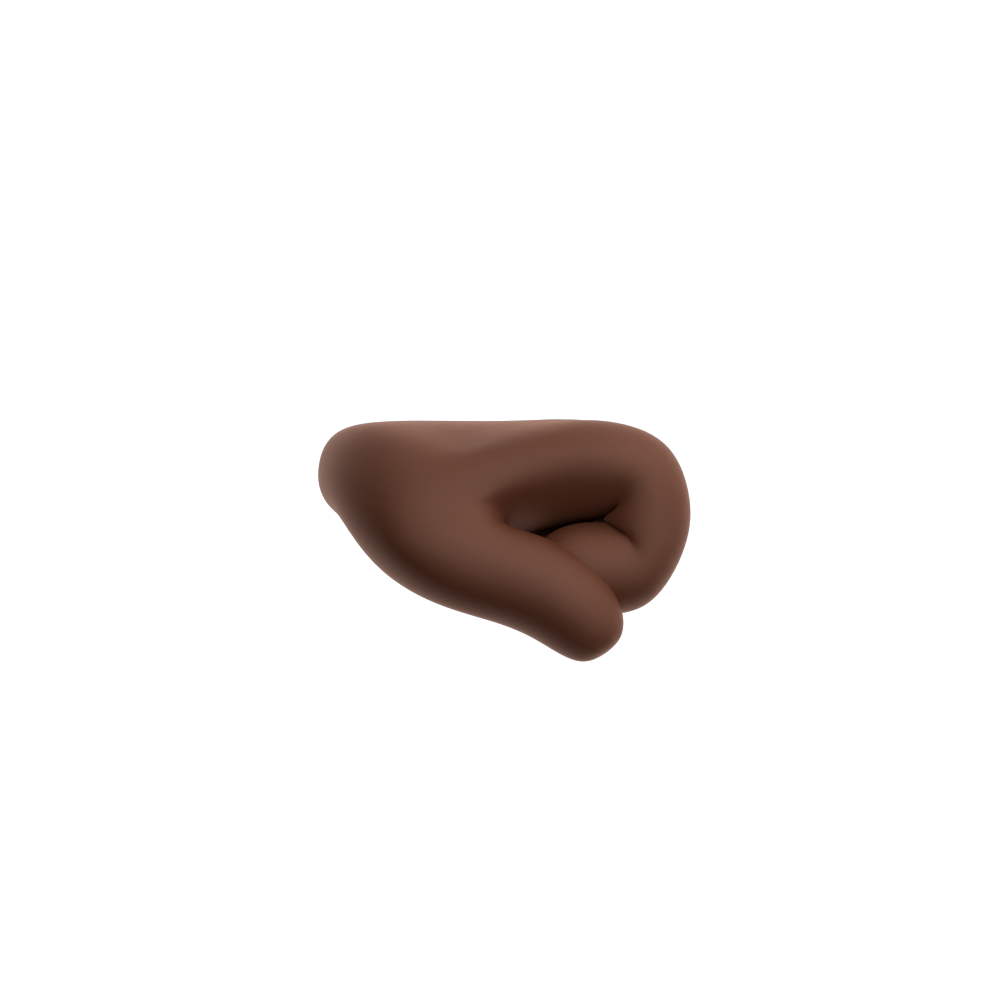

# 🖼️ Black 素材庫

[⬅️ 返回主目錄](../../../../README.md)

| 預覽 (點擊放大) | 檔案資訊 |
| :--- | :--- |
|  | **call-me.svg** Vector (SVG) | 121.35KB |
|  | **claps.svg** Vector (SVG) | 239.91KB |
|  | **crossed.svg** Vector (SVG) | 139.96KB |
|  | **giving-left.svg** Vector (SVG) | 109.68KB |
|  | **giving-right.svg** Vector (SVG) | 107.12KB |
|  | **hand-holding-pencil-left.svg** Vector (SVG) | 136.78KB |
|  | **hand-holding-pencil-right.svg** Vector (SVG) | 136.05KB |
|  | **hand.svg** Vector (SVG) | 164.31KB |
|  | **horns.svg** Vector (SVG) | 138.86KB |
|  | **love.svg** Vector (SVG) | 150.78KB |
|  | **middle-finger.svg** Vector (SVG) | 121.93KB |
|  | **ok-left.svg** Vector (SVG) | 127.20KB |
|  | **ok-right.svg** Vector (SVG) | 123.69KB |
|  | **oncoming-fist.svg** Vector (SVG) | 101.94KB |
|  | **pinch.svg** Vector (SVG) | 93.79KB |
|  | **pinching-left.svg** Vector (SVG) | 141.44KB |
|  | **pinching-right.svg** Vector (SVG) | 139.22KB |
|  | **point-up-face.svg** Vector (SVG) | 137.60KB |
|  | **point-up.svg** Vector (SVG) | 120.67KB |
|  | **pointing-down.svg** Vector (SVG) | 124.90KB |
|  | **pointing-left.svg** Vector (SVG) | 117.11KB |
|  | **pointing-right.svg** Vector (SVG) | 118.11KB |
|  | **poke.svg** Vector (SVG) | 94.54KB |
|  | **pray.svg** Vector (SVG) | 144.45KB |
|  | **punch-left.svg** Vector (SVG) | 83.16KB |
|  | **punch-right.svg** Vector (SVG) | 84.65KB |
|  | **raised-fist.svg** Vector (SVG) | 126.26KB |
|  | **thumbs-down.svg** Vector (SVG) | 143.99KB |
|  | **thumbs-up.svg** Vector (SVG) | 137.73KB |
|  | **victory.svg** Vector (SVG) | 148.04KB |
|  | **vulcan-salute.svg** Vector (SVG) | 164.14KB |
|  | **wave.svg** Vector (SVG) | 230.30KB |