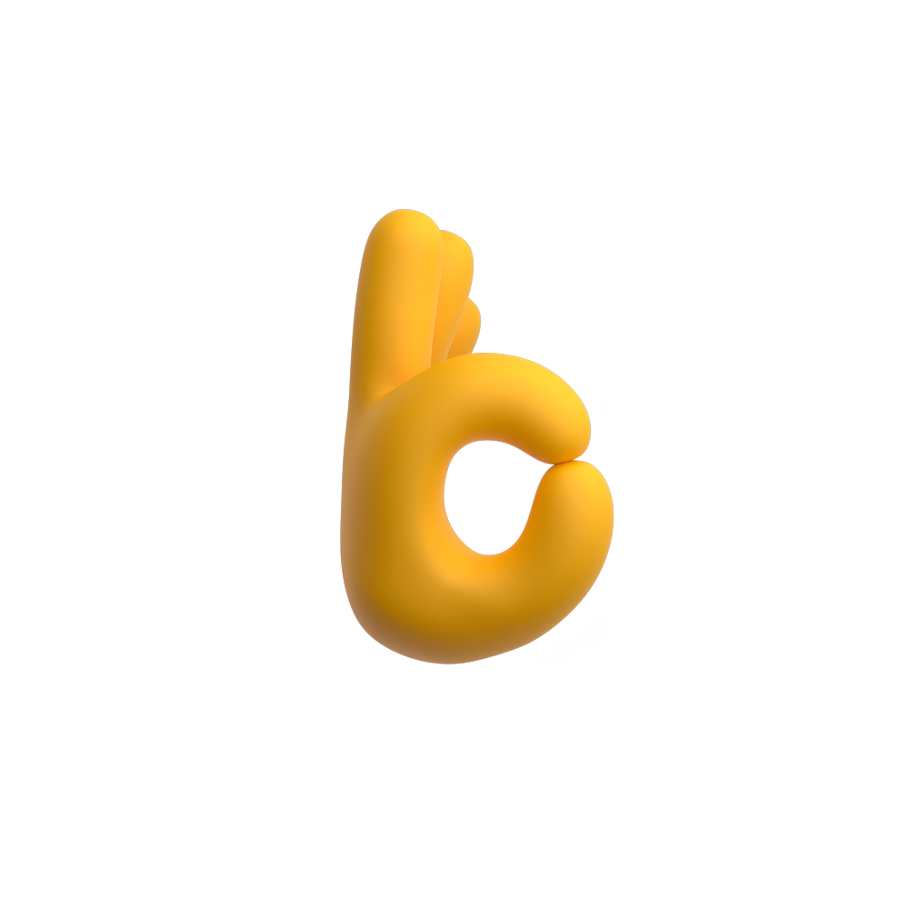
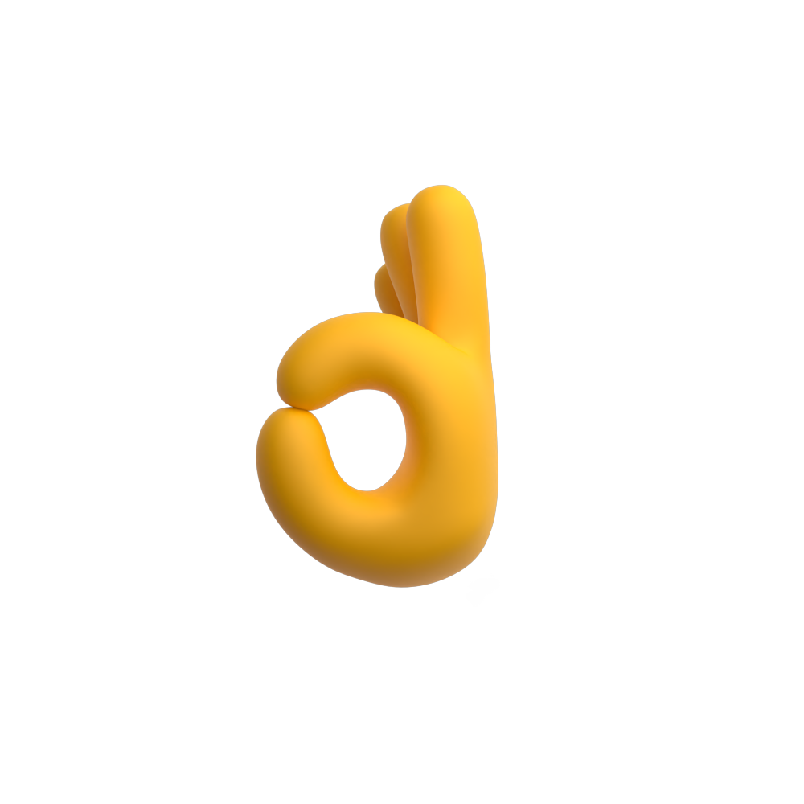
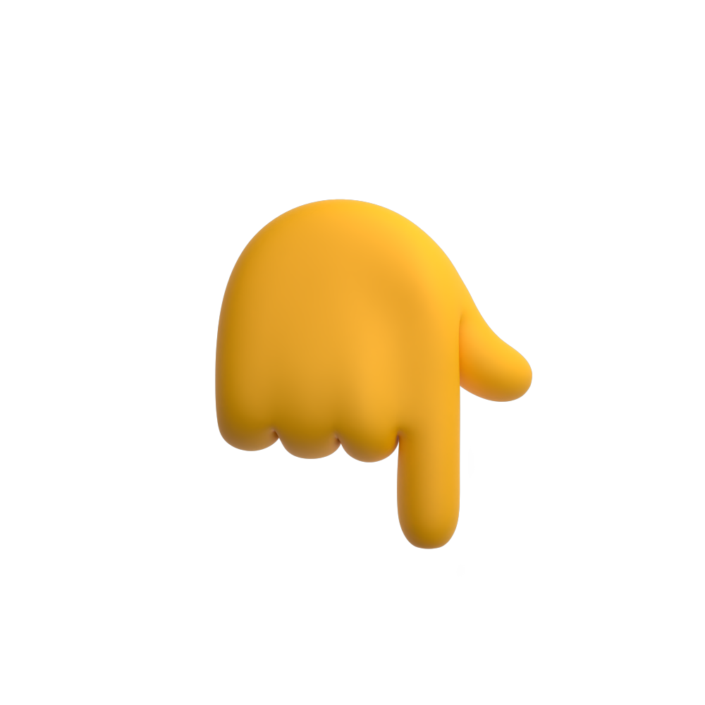
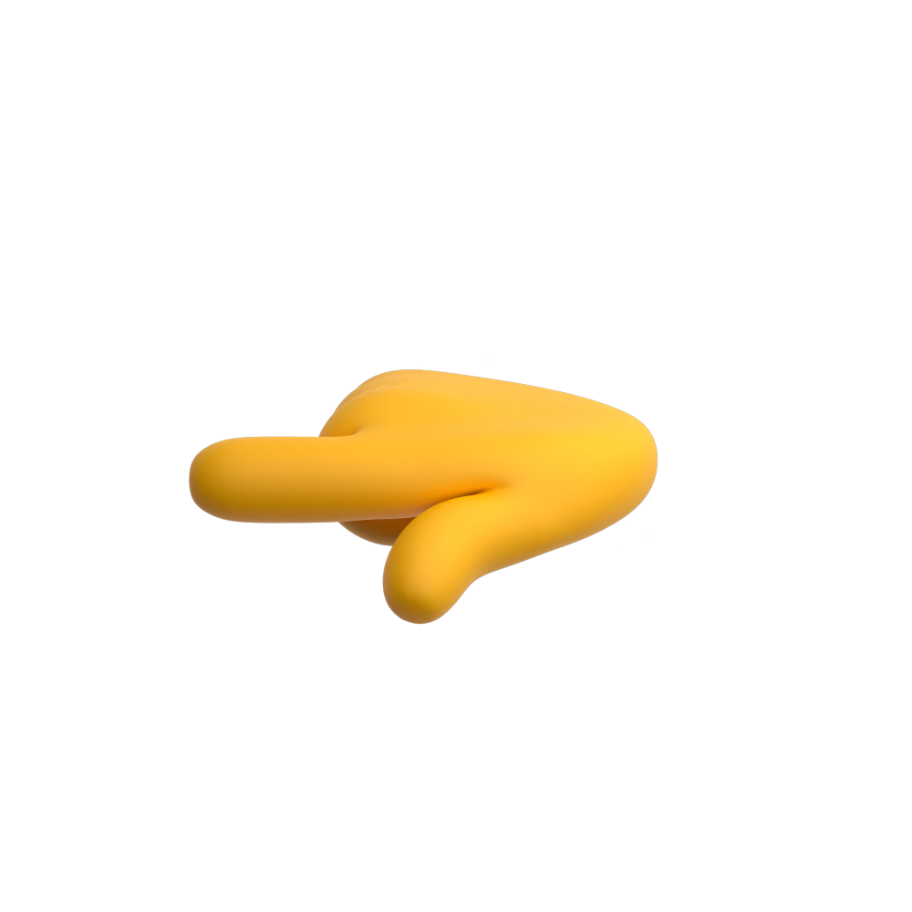
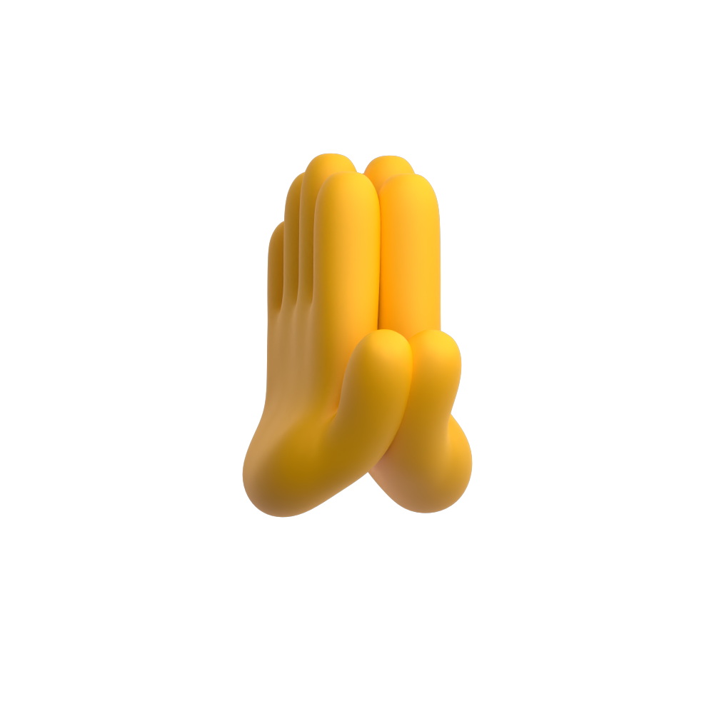
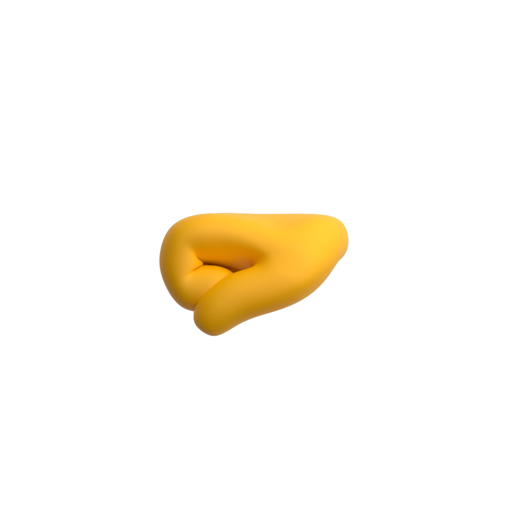
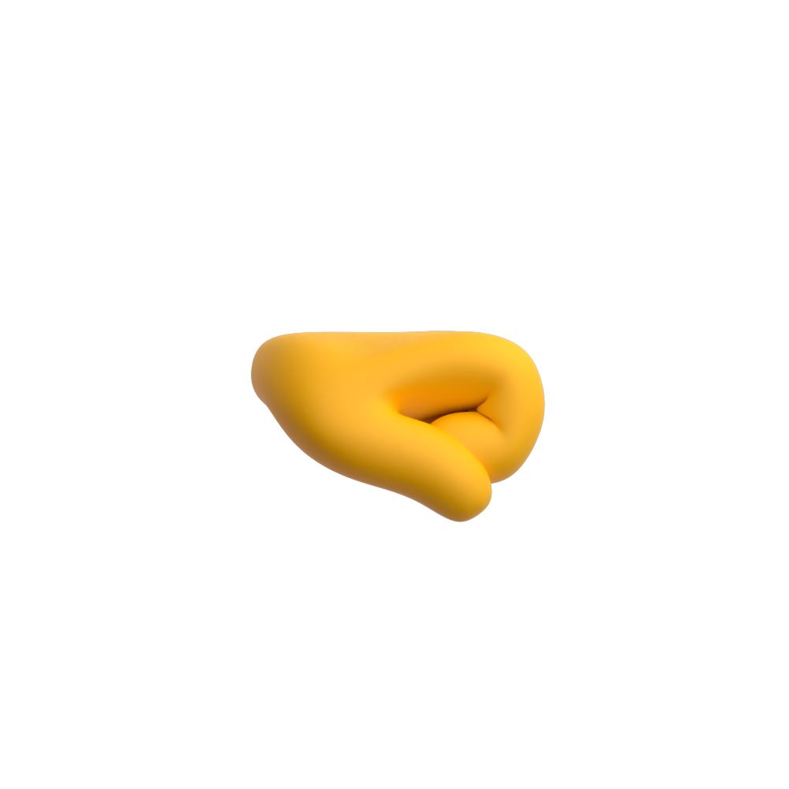
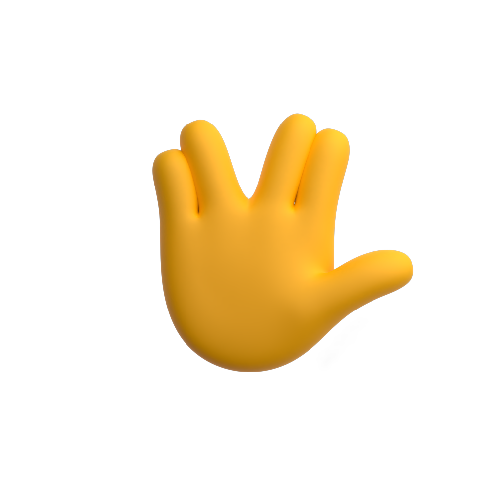

# 🖼️ 素材分類：Default

> [🏠 主目錄](../../../../README.md) / **Default**

本目錄共有 `31` 個檔案

| 🎨 預覽 (點擊放大) | 📋 檔案詳細資訊與連結 |
| :--- | :--- |
|  | **📂 檔名:** `call-me.svg` ✨ **格式:** `Vector (SVG)` ⚖️ **大小:** `135.50KB` 📅 **更新:** `2026-02-27`  🔗 **複製 Markdown 語法:** `` 📥 [檢視原始檔](call-me.svg) |
|  | **📂 檔名:** `claps.svg` ✨ **格式:** `Vector (SVG)` ⚖️ **大小:** `265.82KB` 📅 **更新:** `2026-02-27`  🔗 **複製 Markdown 語法:** `` 📥 [檢視原始檔](claps.svg) |
|  | **📂 檔名:** `crossed.svg` ✨ **格式:** `Vector (SVG)` ⚖️ **大小:** `151.67KB` 📅 **更新:** `2026-02-27`  🔗 **複製 Markdown 語法:** `` 📥 [檢視原始檔](crossed.svg) |
|  | **📂 檔名:** `giving-left.svg` ✨ **格式:** `Vector (SVG)` ⚖️ **大小:** `117.33KB` 📅 **更新:** `2026-02-27`  🔗 **複製 Markdown 語法:** `` 📥 [檢視原始檔](giving-left.svg) |
|  | **📂 檔名:** `giving-right.svg` ✨ **格式:** `Vector (SVG)` ⚖️ **大小:** `114.33KB` 📅 **更新:** `2026-02-27`  🔗 **複製 Markdown 語法:** `` 📥 [檢視原始檔](giving-right.svg) |
|  | **📂 檔名:** `hand-holding-pencil-right.svg` ✨ **格式:** `Vector (SVG)` ⚖️ **大小:** `144.97KB` 📅 **更新:** `2026-02-27`  🔗 **複製 Markdown 語法:** `` 📥 [檢視原始檔](hand-holding-pencil-right.svg) |
|  | **📂 檔名:** `hand.svg` ✨ **格式:** `Vector (SVG)` ⚖️ **大小:** `181.96KB` 📅 **更新:** `2026-02-27`  🔗 **複製 Markdown 語法:** `` 📥 [檢視原始檔](hand.svg) |
|  | **📂 檔名:** `horns.svg` ✨ **格式:** `Vector (SVG)` ⚖️ **大小:** `155.53KB` 📅 **更新:** `2026-02-27`  🔗 **複製 Markdown 語法:** `` 📥 [檢視原始檔](horns.svg) |
|  | **📂 檔名:** `love.svg` ✨ **格式:** `Vector (SVG)` ⚖️ **大小:** `166.75KB` 📅 **更新:** `2026-02-27`  🔗 **複製 Markdown 語法:** `` 📥 [檢視原始檔](love.svg) |
|  | **📂 檔名:** `middle-finger.svg` ✨ **格式:** `Vector (SVG)` ⚖️ **大小:** `135.49KB` 📅 **更新:** `2026-02-27`  🔗 **複製 Markdown 語法:** `` 📥 [檢視原始檔](middle-finger.svg) |
|  | **📂 檔名:** `ok-right.svg` ✨ **格式:** `Vector (SVG)` ⚖️ **大小:** `131.71KB` 📅 **更新:** `2026-02-27`  🔗 **複製 Markdown 語法:** `` 📥 [檢視原始檔](ok-right.svg) |
|  | **📂 檔名:** `ok.svg` ✨ **格式:** `Vector (SVG)` ⚖️ **大小:** `132.77KB` 📅 **更新:** `2026-02-27`  🔗 **複製 Markdown 語法:** `` 📥 [檢視原始檔](ok.svg) |
|  | **📂 檔名:** `oncoming-fist.svg` ✨ **格式:** `Vector (SVG)` ⚖️ **大小:** `107.85KB` 📅 **更新:** `2026-02-27`  🔗 **複製 Markdown 語法:** `` 📥 [檢視原始檔](oncoming-fist.svg) |
|  | **📂 檔名:** `pinch.svg` ✨ **格式:** `Vector (SVG)` ⚖️ **大小:** `101.50KB` 📅 **更新:** `2026-02-27`  🔗 **複製 Markdown 語法:** `` 📥 [檢視原始檔](pinch.svg) |
|  | **📂 檔名:** `pinching-left.svg` ✨ **格式:** `Vector (SVG)` ⚖️ **大小:** `155.19KB` 📅 **更新:** `2026-02-27`  🔗 **複製 Markdown 語法:** `` 📥 [檢視原始檔](pinching-left.svg) |
|  | **📂 檔名:** `pinching-right.svg` ✨ **格式:** `Vector (SVG)` ⚖️ **大小:** `159.44KB` 📅 **更新:** `2026-02-27`  🔗 **複製 Markdown 語法:** `` 📥 [檢視原始檔](pinching-right.svg) |
|  | **📂 檔名:** `point-up-face.svg` ✨ **格式:** `Vector (SVG)` ⚖️ **大小:** `150.10KB` 📅 **更新:** `2026-02-27`  🔗 **複製 Markdown 語法:** `` 📥 [檢視原始檔](point-up-face.svg) |
|  | **📂 檔名:** `point-up.svg` ✨ **格式:** `Vector (SVG)` ⚖️ **大小:** `136.32KB` 📅 **更新:** `2026-02-27`  🔗 **複製 Markdown 語法:** `` 📥 [檢視原始檔](point-up.svg) |
|  | **📂 檔名:** `pointing-down.svg` ✨ **格式:** `Vector (SVG)` ⚖️ **大小:** `138.33KB` 📅 **更新:** `2026-02-27`  🔗 **複製 Markdown 語法:** `` 📥 [檢視原始檔](pointing-down.svg) |
|  | **📂 檔名:** `pointing-left.svg` ✨ **格式:** `Vector (SVG)` ⚖️ **大小:** `131.88KB` 📅 **更新:** `2026-02-27`  🔗 **複製 Markdown 語法:** `` 📥 [檢視原始檔](pointing-left.svg) |
|  | **📂 檔名:** `pointing-right.svg` ✨ **格式:** `Vector (SVG)` ⚖️ **大小:** `133.83KB` 📅 **更新:** `2026-02-27`  🔗 **複製 Markdown 語法:** `` 📥 [檢視原始檔](pointing-right.svg) |
|  | **📂 檔名:** `poke.svg` ✨ **格式:** `Vector (SVG)` ⚖️ **大小:** `102.57KB` 📅 **更新:** `2026-02-27`  🔗 **複製 Markdown 語法:** `` 📥 [檢視原始檔](poke.svg) |
|  | **📂 檔名:** `pray.svg` ✨ **格式:** `Vector (SVG)` ⚖️ **大小:** `152.31KB` 📅 **更新:** `2026-02-27`  🔗 **複製 Markdown 語法:** `` 📥 [檢視原始檔](pray.svg) |
|  | **📂 檔名:** `punch-left.svg` ✨ **格式:** `Vector (SVG)` ⚖️ **大小:** `90.83KB` 📅 **更新:** `2026-02-27`  🔗 **複製 Markdown 語法:** `` 📥 [檢視原始檔](punch-left.svg) |
|  | **📂 檔名:** `punch-right.svg` ✨ **格式:** `Vector (SVG)` ⚖️ **大小:** `89.90KB` 📅 **更新:** `2026-02-27`  🔗 **複製 Markdown 語法:** `` 📥 [檢視原始檔](punch-right.svg) |
|  | **📂 檔名:** `raisedfist.svg` ✨ **格式:** `Vector (SVG)` ⚖️ **大小:** `141.14KB` 📅 **更新:** `2026-02-27`  🔗 **複製 Markdown 語法:** `` 📥 [檢視原始檔](raisedfist.svg) |
|  | **📂 檔名:** `thumbs-down.svg` ✨ **格式:** `Vector (SVG)` ⚖️ **大小:** `159.03KB` 📅 **更新:** `2026-02-27`  🔗 **複製 Markdown 語法:** `` 📥 [檢視原始檔](thumbs-down.svg) |
|  | **📂 檔名:** `thumbs-up.svg` ✨ **格式:** `Vector (SVG)` ⚖️ **大小:** `153.67KB` 📅 **更新:** `2026-02-27`  🔗 **複製 Markdown 語法:** `` 📥 [檢視原始檔](thumbs-up.svg) |
|  | **📂 檔名:** `victory.svg` ✨ **格式:** `Vector (SVG)` ⚖️ **大小:** `161.42KB` 📅 **更新:** `2026-02-27`  🔗 **複製 Markdown 語法:** `` 📥 [檢視原始檔](victory.svg) |
|  | **📂 檔名:** `vulcan-salute.svg` ✨ **格式:** `Vector (SVG)` ⚖️ **大小:** `181.89KB` 📅 **更新:** `2026-02-27`  🔗 **複製 Markdown 語法:** `` 📥 [檢視原始檔](vulcan-salute.svg) |
|  | **📂 檔名:** `wave.svg` ✨ **格式:** `Vector (SVG)` ⚖️ **大小:** `254.85KB` 📅 **更新:** `2026-02-27`  🔗 **複製 Markdown 語法:** `` 📥 [檢視原始檔](wave.svg) |