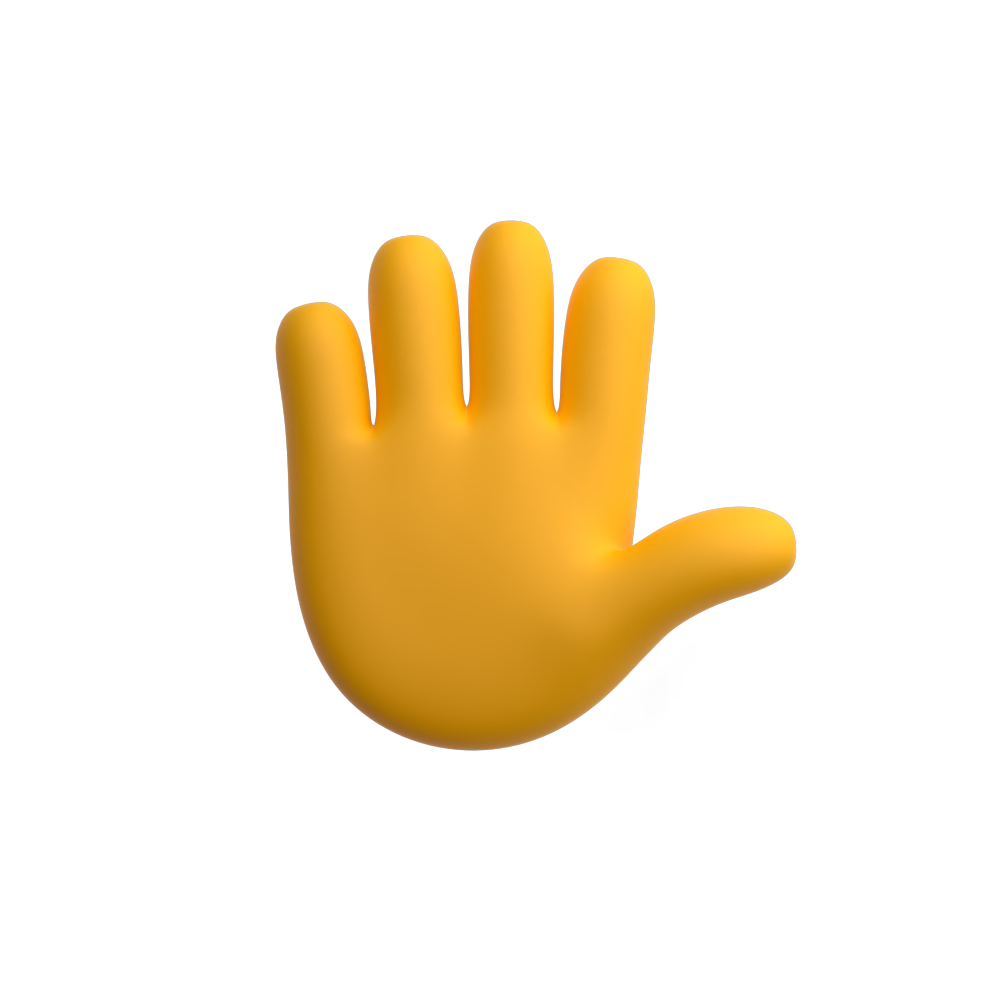
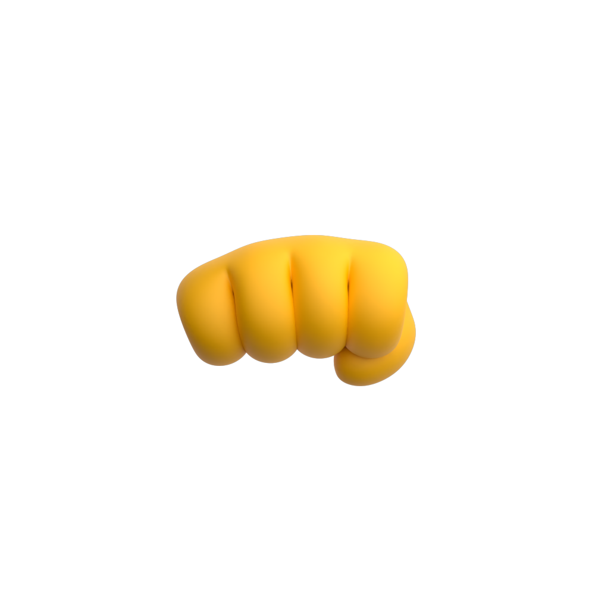
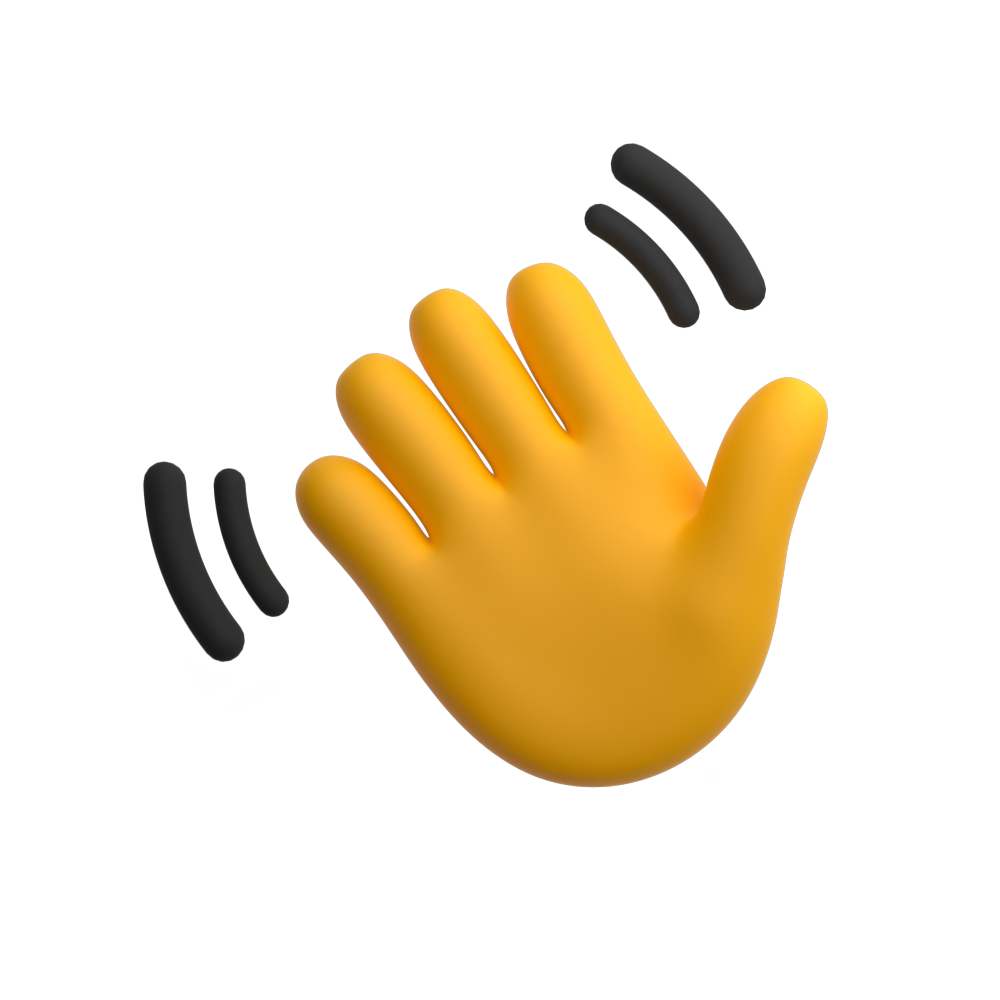

# 🖼️ Default 素材庫

[⬅️ 返回主目錄](../../../../README.md)

| 預覽 (點擊放大) | 檔案資訊 |
| :--- | :--- |
|  | **call-me.svg** Vector (SVG) | 135.50KB |
|  | **claps.svg** Vector (SVG) | 265.82KB |
|  | **crossed.svg** Vector (SVG) | 151.67KB |
|  | **giving-left.svg** Vector (SVG) | 117.33KB |
|  | **giving-right.svg** Vector (SVG) | 114.33KB |
|  | **hand-holding-pencil-right.svg** Vector (SVG) | 144.97KB |
|  | **hand.svg** Vector (SVG) | 181.96KB |
|  | **horns.svg** Vector (SVG) | 155.53KB |
|  | **love.svg** Vector (SVG) | 166.75KB |
|  | **middle-finger.svg** Vector (SVG) | 135.49KB |
|  | **ok-right.svg** Vector (SVG) | 131.71KB |
|  | **ok.svg** Vector (SVG) | 132.77KB |
|  | **oncoming-fist.svg** Vector (SVG) | 107.85KB |
|  | **pinch.svg** Vector (SVG) | 101.50KB |
|  | **pinching-left.svg** Vector (SVG) | 155.19KB |
|  | **pinching-right.svg** Vector (SVG) | 159.44KB |
|  | **point-up-face.svg** Vector (SVG) | 150.10KB |
|  | **point-up.svg** Vector (SVG) | 136.32KB |
|  | **pointing-down.svg** Vector (SVG) | 138.33KB |
|  | **pointing-left.svg** Vector (SVG) | 131.88KB |
|  | **pointing-right.svg** Vector (SVG) | 133.83KB |
|  | **poke.svg** Vector (SVG) | 102.57KB |
|  | **pray.svg** Vector (SVG) | 152.31KB |
|  | **punch-left.svg** Vector (SVG) | 90.83KB |
|  | **punch-right.svg** Vector (SVG) | 89.90KB |
|  | **raisedfist.svg** Vector (SVG) | 141.14KB |
|  | **thumbs-down.svg** Vector (SVG) | 159.03KB |
|  | **thumbs-up.svg** Vector (SVG) | 153.67KB |
|  | **victory.svg** Vector (SVG) | 161.42KB |
|  | **vulcan-salute.svg** Vector (SVG) | 181.89KB |
|  | **wave.svg** Vector (SVG) | 254.85KB |