# 🖼️ 素材分類：Light

> [🏠 主目錄](../../../../README.md) / [images](../../../README.md) / [iCons](../../README.md) / [3D Hand Emojis](../README.md) / **Light**

本目錄共有 `31` 個檔案

| 🎨 預覽 (點擊放大)  | 📋 檔案詳細資訊與連結 |
| :--- | :--- |
|  | **📂 檔名:** `call-me.svg` ✨ **格式:** `Vector (SVG)` ⚖️ **大小:** `127.98KB` 📅 **更新:** `2026-03-02`  🚀 **jsDelivr Markdown:** `` 🔗 **直接連結 (Url):** <code>https://cdn.jsdelivr.net/gh/barry028/materials@main/images/iCons/3D%20Hand%20Emojis/Light/call-me.svg</code> 📥 [檢視原始檔](call-me.svg) |
| <a href="claps.svg">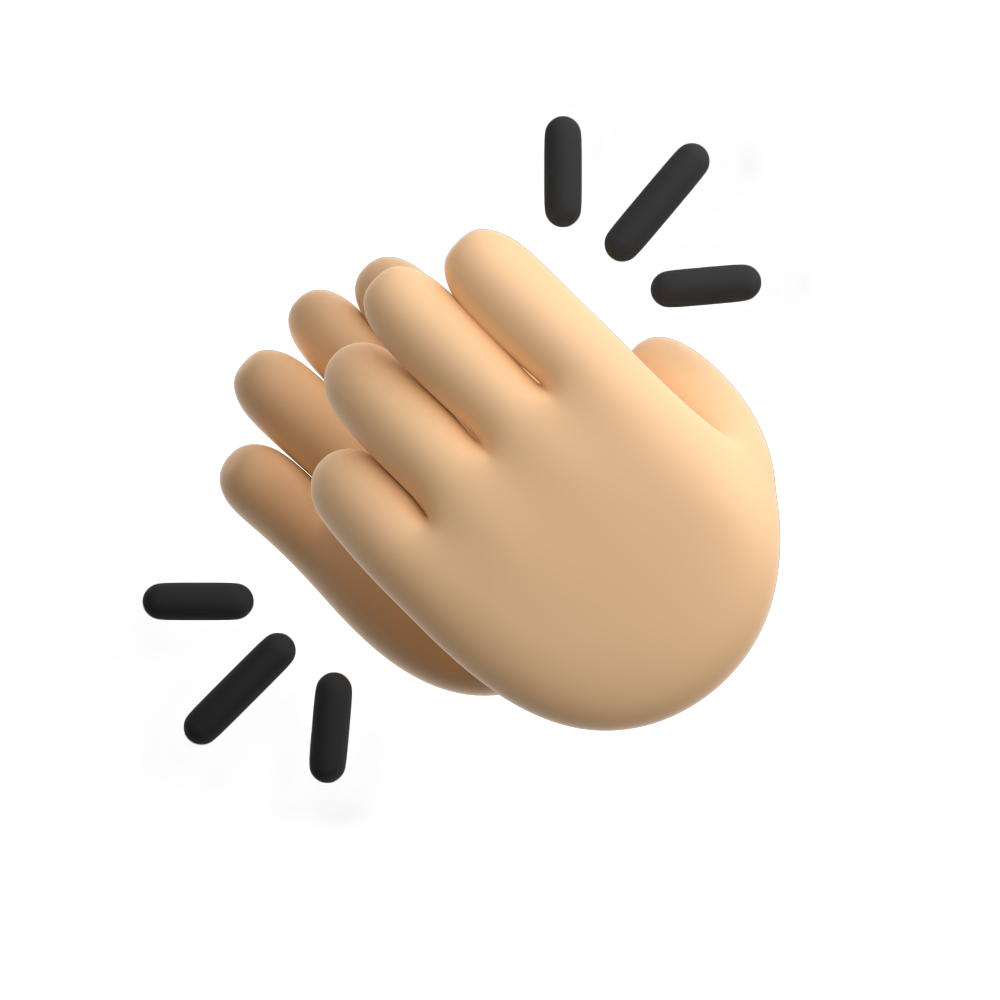</a> | **📂 檔名:** `claps.svg` ✨ **格式:** `Vector (SVG)` ⚖️ **大小:** `262.01KB` 📅 **更新:** `2026-03-02`  🚀 **jsDelivr Markdown:** `` 🔗 **直接連結 (Url):** <code>https://cdn.jsdelivr.net/gh/barry028/materials@main/images/iCons/3D%20Hand%20Emojis/Light/claps.svg</code> 📥 [檢視原始檔](claps.svg) |
| <a href="crossed.svg">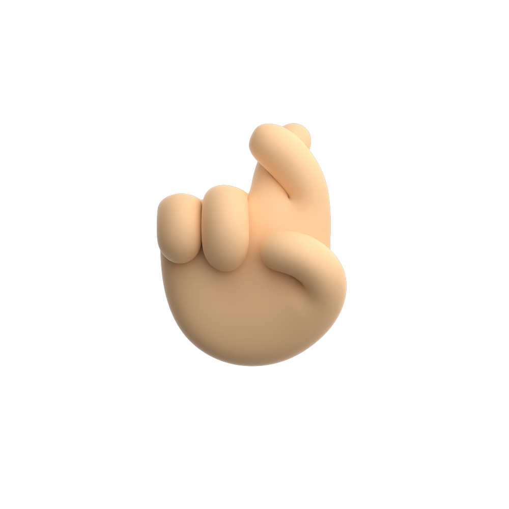</a> | **📂 檔名:** `crossed.svg` ✨ **格式:** `Vector (SVG)` ⚖️ **大小:** `144.51KB` 📅 **更新:** `2026-03-02`  🚀 **jsDelivr Markdown:** `` 🔗 **直接連結 (Url):** <code>https://cdn.jsdelivr.net/gh/barry028/materials@main/images/iCons/3D%20Hand%20Emojis/Light/crossed.svg</code> 📥 [檢視原始檔](crossed.svg) |
| <a href="giving-left.svg">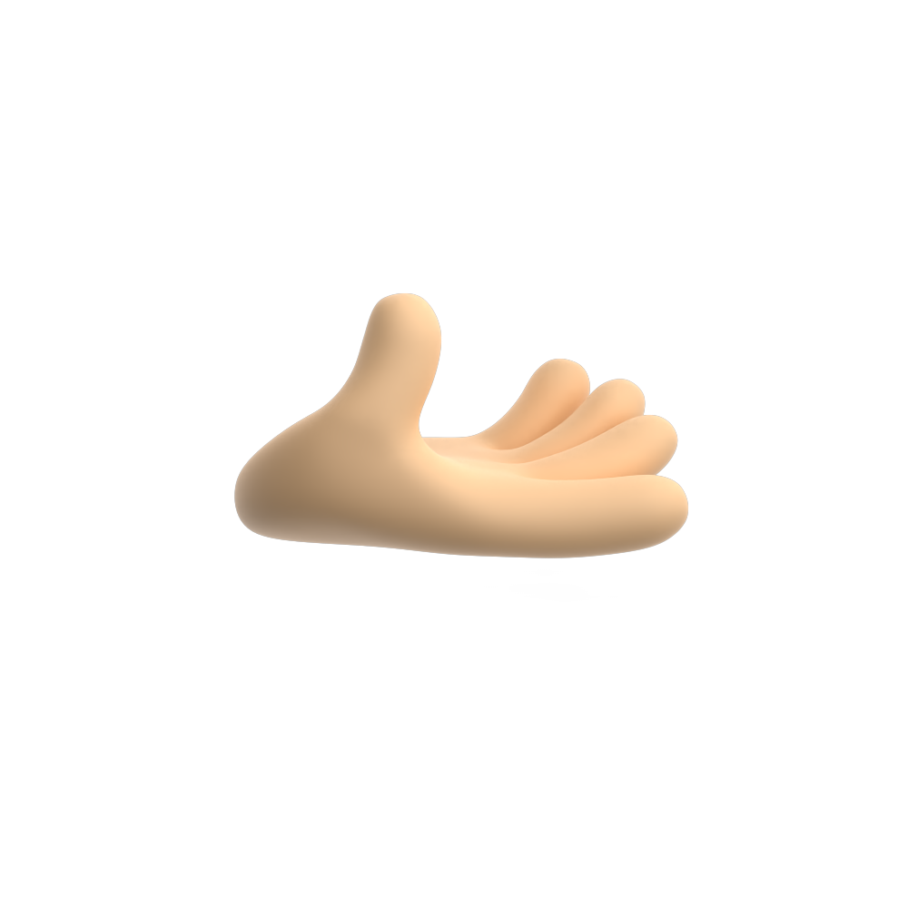</a> | **📂 檔名:** `giving-left.svg` ✨ **格式:** `Vector (SVG)` ⚖️ **大小:** `107.59KB` 📅 **更新:** `2026-03-02`  🚀 **jsDelivr Markdown:** `` 🔗 **直接連結 (Url):** <code>https://cdn.jsdelivr.net/gh/barry028/materials@main/images/iCons/3D%20Hand%20Emojis/Light/giving-left.svg</code> 📥 [檢視原始檔](giving-left.svg) |
| <a href="giving-right.svg">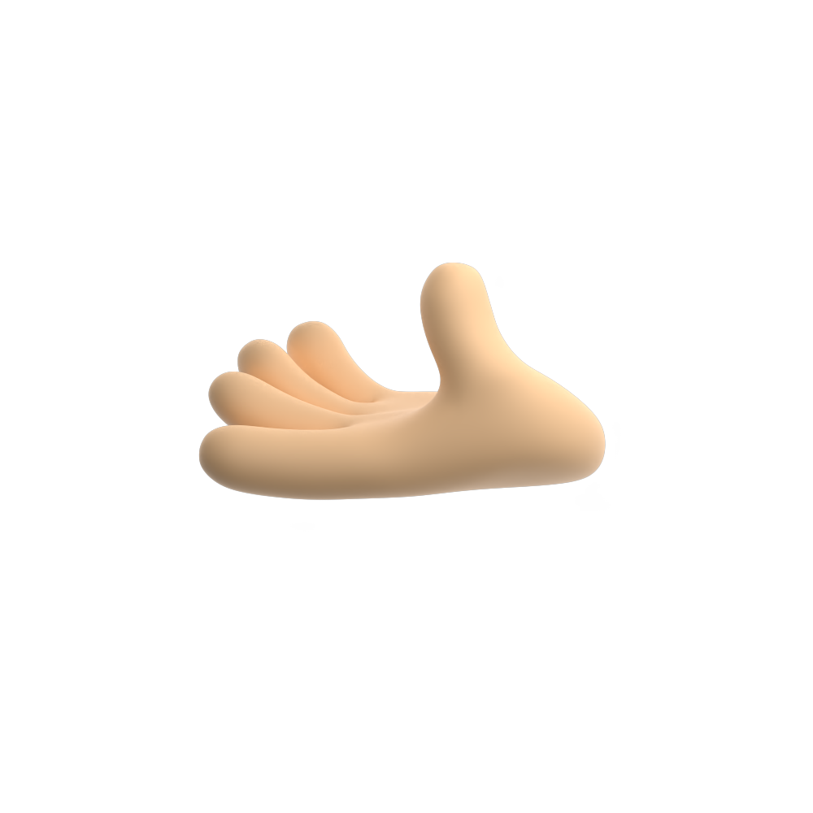</a> | **📂 檔名:** `giving-right.svg` ✨ **格式:** `Vector (SVG)` ⚖️ **大小:** `108.42KB` 📅 **更新:** `2026-03-02`  🚀 **jsDelivr Markdown:** `` 🔗 **直接連結 (Url):** <code>https://cdn.jsdelivr.net/gh/barry028/materials@main/images/iCons/3D%20Hand%20Emojis/Light/giving-right.svg</code> 📥 [檢視原始檔](giving-right.svg) |
| <a href="hand-holding-pencil-left.svg">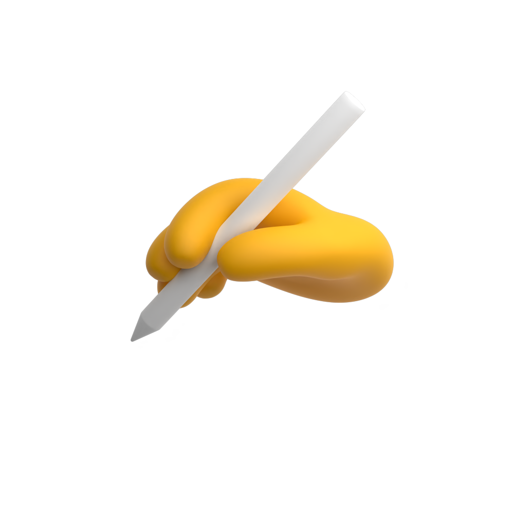</a> | **📂 檔名:** `hand-holding-pencil-left.svg` ✨ **格式:** `Vector (SVG)` ⚖️ **大小:** `150.30KB` 📅 **更新:** `2026-03-02`  🚀 **jsDelivr Markdown:** `` 🔗 **直接連結 (Url):** <code>https://cdn.jsdelivr.net/gh/barry028/materials@main/images/iCons/3D%20Hand%20Emojis/Light/hand-holding-pencil-left.svg</code> 📥 [檢視原始檔](hand-holding-pencil-left.svg) |
| <a href="hand-holding-pencil-right.svg">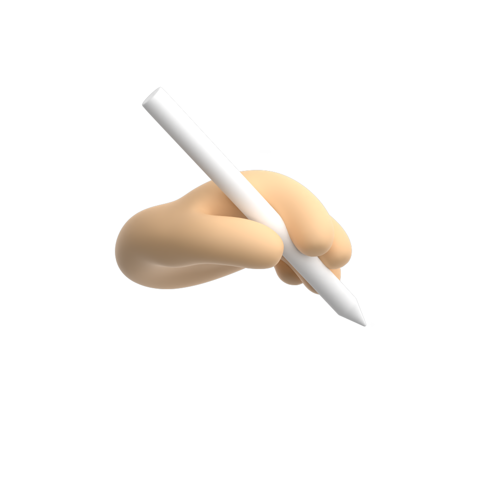</a> | **📂 檔名:** `hand-holding-pencil-right.svg` ✨ **格式:** `Vector (SVG)` ⚖️ **大小:** `135.73KB` 📅 **更新:** `2026-03-02`  🚀 **jsDelivr Markdown:** `` 🔗 **直接連結 (Url):** <code>https://cdn.jsdelivr.net/gh/barry028/materials@main/images/iCons/3D%20Hand%20Emojis/Light/hand-holding-pencil-right.svg</code> 📥 [檢視原始檔](hand-holding-pencil-right.svg) |
| <a href="hand.svg">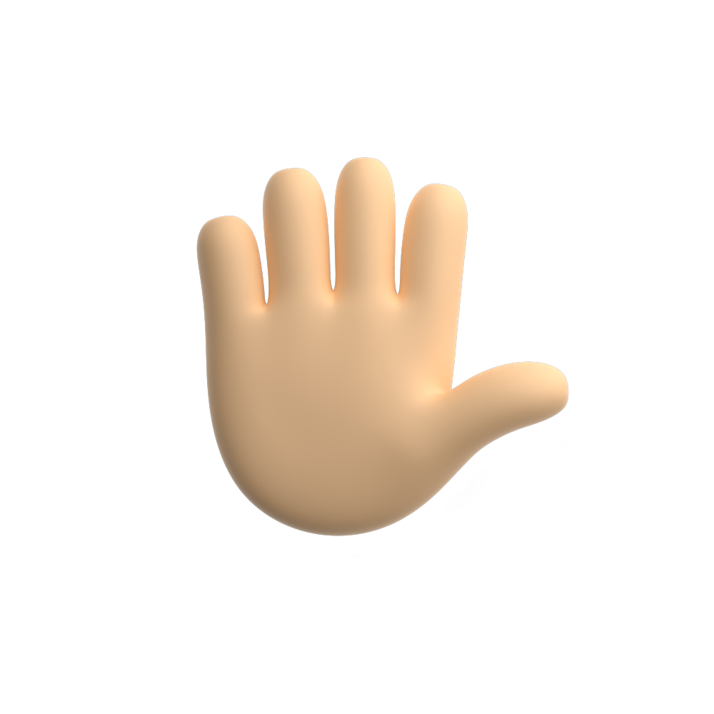</a> | **📂 檔名:** `hand.svg` ✨ **格式:** `Vector (SVG)` ⚖️ **大小:** `170.87KB` 📅 **更新:** `2026-03-02`  🚀 **jsDelivr Markdown:** `` 🔗 **直接連結 (Url):** <code>https://cdn.jsdelivr.net/gh/barry028/materials@main/images/iCons/3D%20Hand%20Emojis/Light/hand.svg</code> 📥 [檢視原始檔](hand.svg) |
| <a href="horns.svg">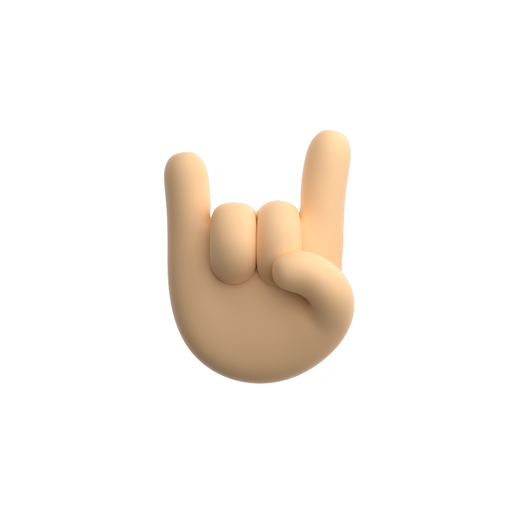</a> | **📂 檔名:** `horns.svg` ✨ **格式:** `Vector (SVG)` ⚖️ **大小:** `147.63KB` 📅 **更新:** `2026-03-02`  🚀 **jsDelivr Markdown:** `` 🔗 **直接連結 (Url):** <code>https://cdn.jsdelivr.net/gh/barry028/materials@main/images/iCons/3D%20Hand%20Emojis/Light/horns.svg</code> 📥 [檢視原始檔](horns.svg) |
| <a href="middle-finger.svg">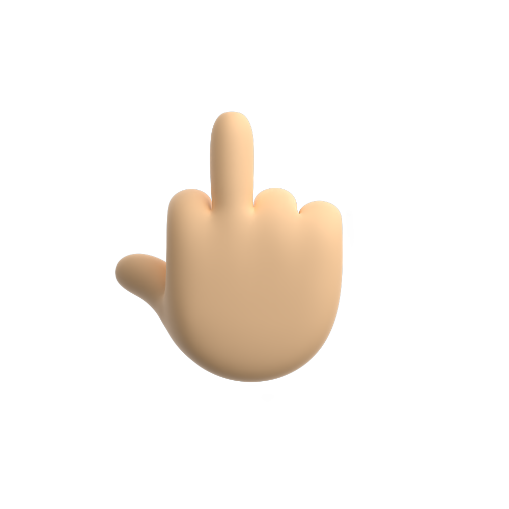</a> | **📂 檔名:** `middle-finger.svg` ✨ **格式:** `Vector (SVG)` ⚖️ **大小:** `130.56KB` 📅 **更新:** `2026-03-02`  🚀 **jsDelivr Markdown:** `` 🔗 **直接連結 (Url):** <code>https://cdn.jsdelivr.net/gh/barry028/materials@main/images/iCons/3D%20Hand%20Emojis/Light/middle-finger.svg</code> 📥 [檢視原始檔](middle-finger.svg) |
| <a href="ok-left.svg">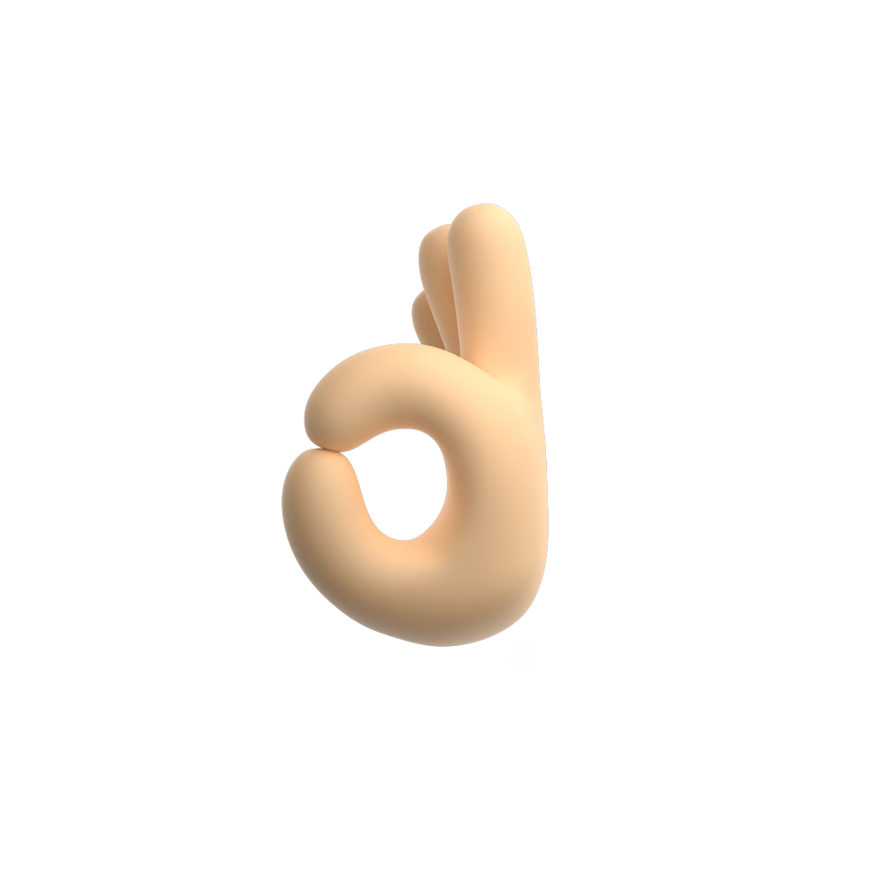</a> | **📂 檔名:** `ok-left.svg` ✨ **格式:** `Vector (SVG)` ⚖️ **大小:** `123.50KB` 📅 **更新:** `2026-03-02`  🚀 **jsDelivr Markdown:** `` 🔗 **直接連結 (Url):** <code>https://cdn.jsdelivr.net/gh/barry028/materials@main/images/iCons/3D%20Hand%20Emojis/Light/ok-left.svg</code> 📥 [檢視原始檔](ok-left.svg) |
| <a href="ok-right.svg">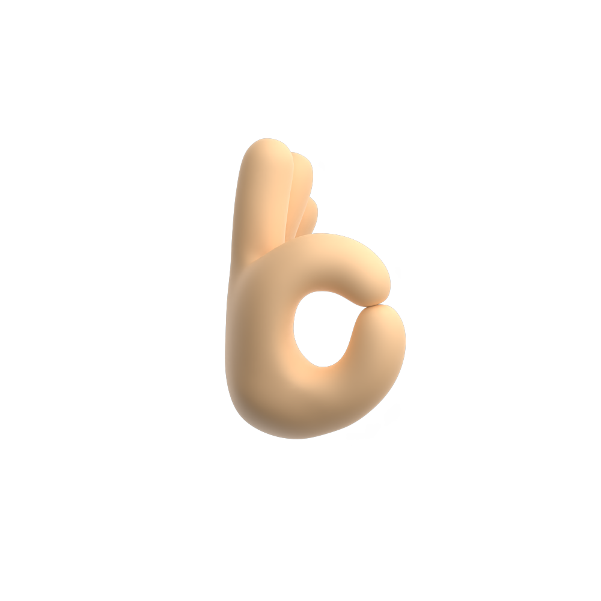</a> | **📂 檔名:** `ok-right.svg` ✨ **格式:** `Vector (SVG)` ⚖️ **大小:** `121.15KB` 📅 **更新:** `2026-03-02`  🚀 **jsDelivr Markdown:** `` 🔗 **直接連結 (Url):** <code>https://cdn.jsdelivr.net/gh/barry028/materials@main/images/iCons/3D%20Hand%20Emojis/Light/ok-right.svg</code> 📥 [檢視原始檔](ok-right.svg) |
| <a href="oncoming-fist.svg">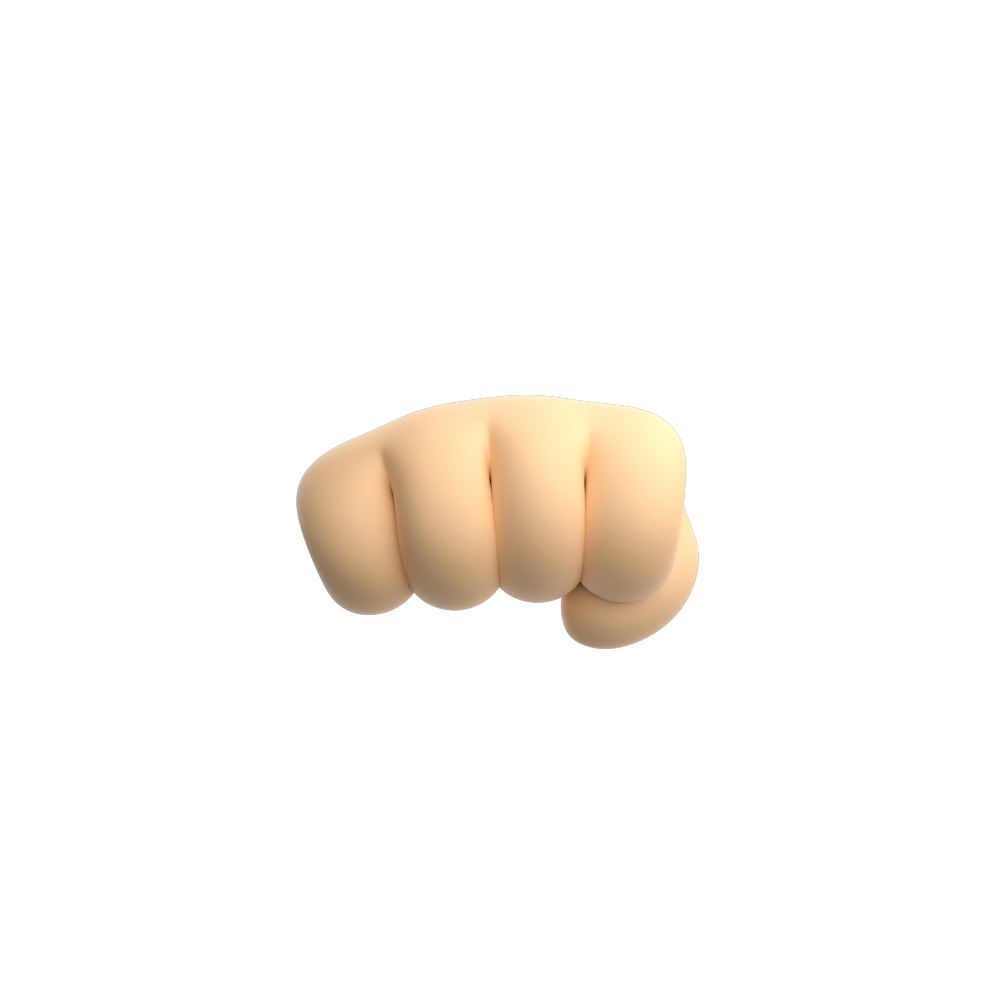</a> | **📂 檔名:** `oncoming-fist.svg` ✨ **格式:** `Vector (SVG)` ⚖️ **大小:** `104.03KB` 📅 **更新:** `2026-03-02`  🚀 **jsDelivr Markdown:** `` 🔗 **直接連結 (Url):** <code>https://cdn.jsdelivr.net/gh/barry028/materials@main/images/iCons/3D%20Hand%20Emojis/Light/oncoming-fist.svg</code> 📥 [檢視原始檔](oncoming-fist.svg) |
| <a href="pinch.svg">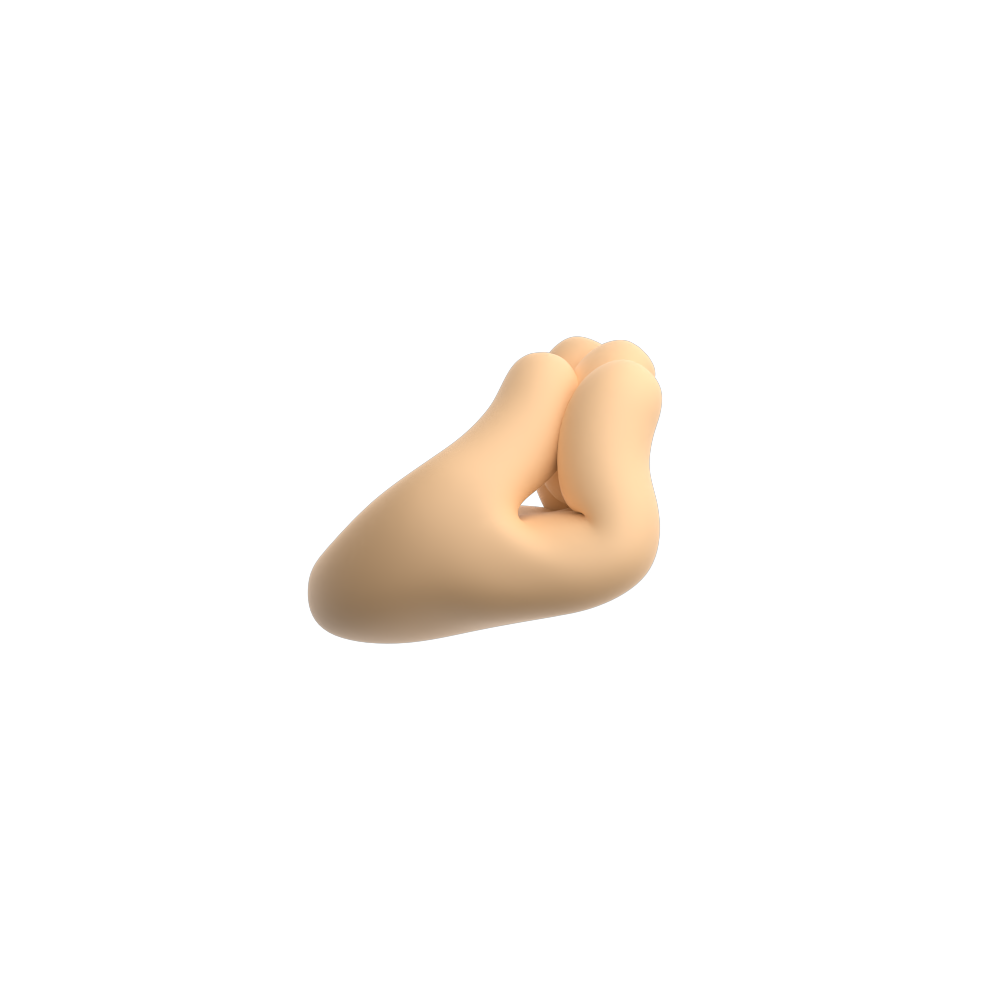</a> | **📂 檔名:** `pinch.svg` ✨ **格式:** `Vector (SVG)` ⚖️ **大小:** `95.20KB` 📅 **更新:** `2026-03-02`  🚀 **jsDelivr Markdown:** `` 🔗 **直接連結 (Url):** <code>https://cdn.jsdelivr.net/gh/barry028/materials@main/images/iCons/3D%20Hand%20Emojis/Light/pinch.svg</code> 📥 [檢視原始檔](pinch.svg) |
| <a href="pinching-left.svg">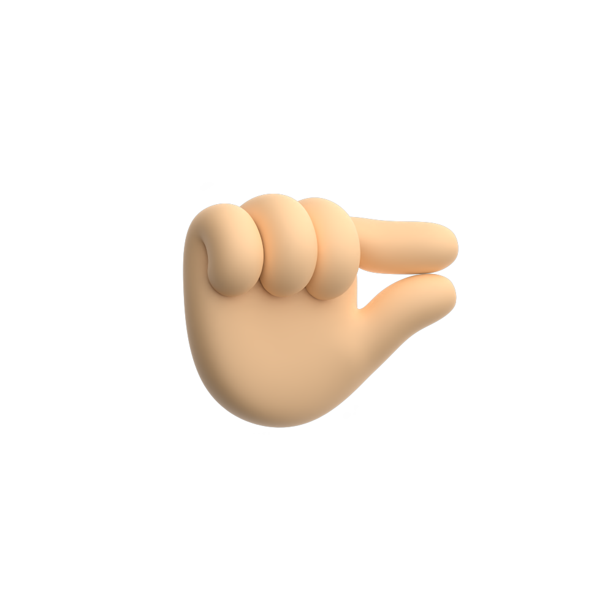</a> | **📂 檔名:** `pinching-left.svg` ✨ **格式:** `Vector (SVG)` ⚖️ **大小:** `147.97KB` 📅 **更新:** `2026-03-02`  🚀 **jsDelivr Markdown:** `` 🔗 **直接連結 (Url):** <code>https://cdn.jsdelivr.net/gh/barry028/materials@main/images/iCons/3D%20Hand%20Emojis/Light/pinching-left.svg</code> 📥 [檢視原始檔](pinching-left.svg) |
| <a href="pinching-right.svg">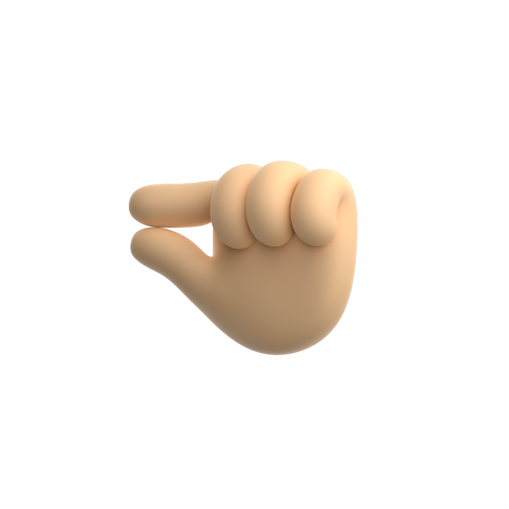</a> | **📂 檔名:** `pinching-right.svg` ✨ **格式:** `Vector (SVG)` ⚖️ **大小:** `149.86KB` 📅 **更新:** `2026-03-02`  🚀 **jsDelivr Markdown:** `` 🔗 **直接連結 (Url):** <code>https://cdn.jsdelivr.net/gh/barry028/materials@main/images/iCons/3D%20Hand%20Emojis/Light/pinching-right.svg</code> 📥 [檢視原始檔](pinching-right.svg) |
| <a href="point-up-face.svg">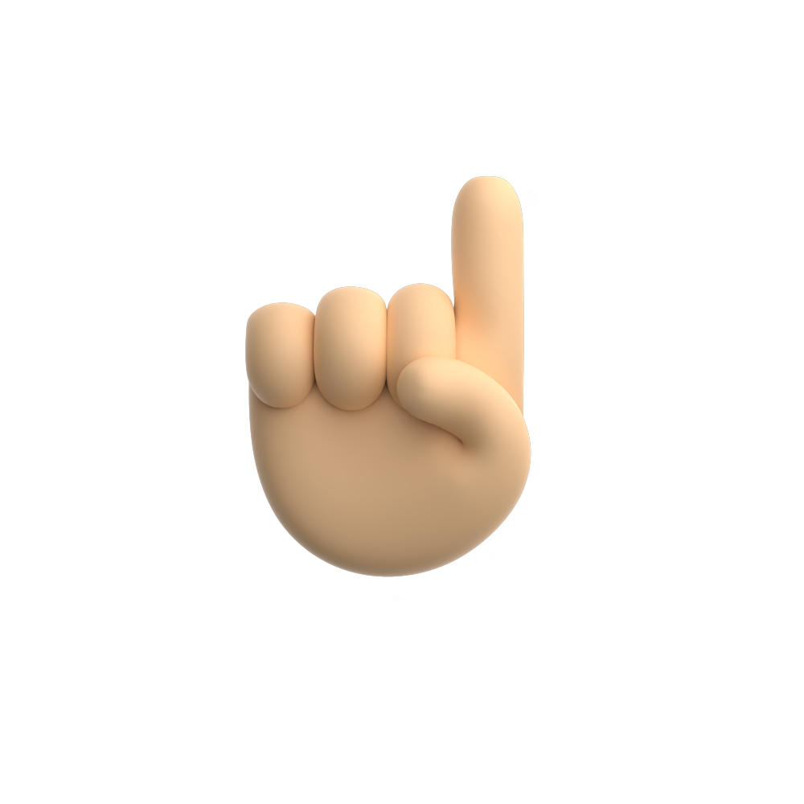</a> | **📂 檔名:** `point-up-face.svg` ✨ **格式:** `Vector (SVG)` ⚖️ **大小:** `144.97KB` 📅 **更新:** `2026-03-02`  🚀 **jsDelivr Markdown:** `` 🔗 **直接連結 (Url):** <code>https://cdn.jsdelivr.net/gh/barry028/materials@main/images/iCons/3D%20Hand%20Emojis/Light/point-up-face.svg</code> 📥 [檢視原始檔](point-up-face.svg) |
| <a href="point-up.svg">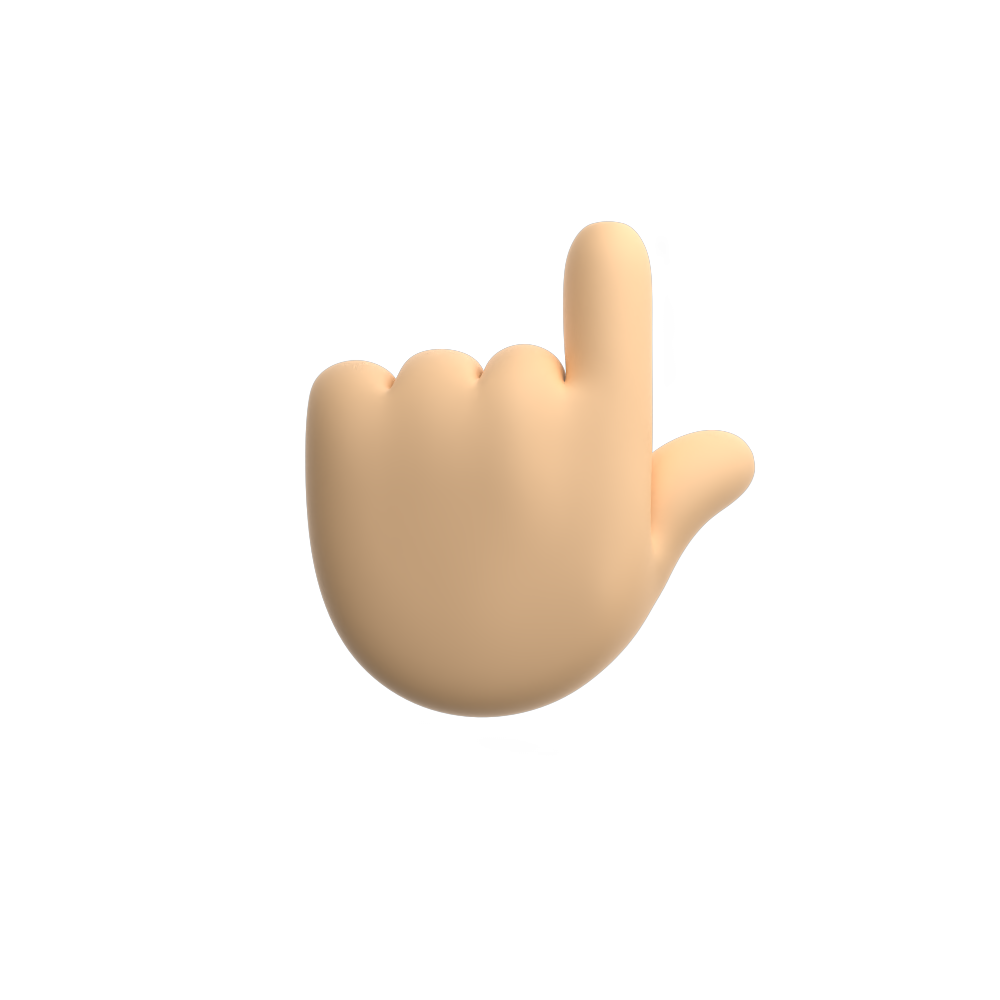</a> | **📂 檔名:** `point-up.svg` ✨ **格式:** `Vector (SVG)` ⚖️ **大小:** `129.97KB` 📅 **更新:** `2026-03-02`  🚀 **jsDelivr Markdown:** `` 🔗 **直接連結 (Url):** <code>https://cdn.jsdelivr.net/gh/barry028/materials@main/images/iCons/3D%20Hand%20Emojis/Light/point-up.svg</code> 📥 [檢視原始檔](point-up.svg) |
| <a href="pointing-down.svg">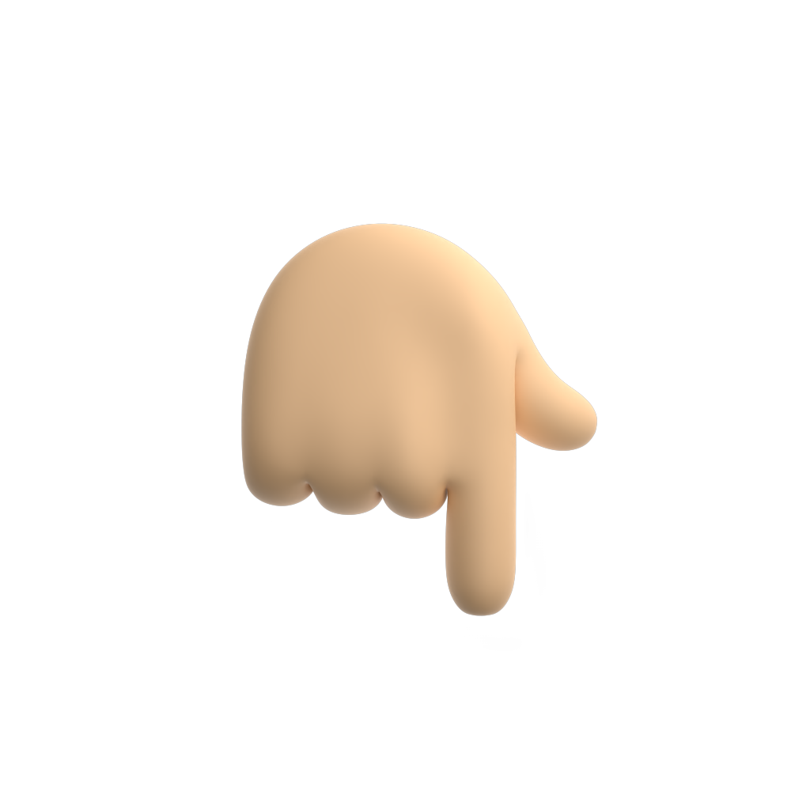</a> | **📂 檔名:** `pointing-down.svg` ✨ **格式:** `Vector (SVG)` ⚖️ **大小:** `127.99KB` 📅 **更新:** `2026-03-02`  🚀 **jsDelivr Markdown:** `` 🔗 **直接連結 (Url):** <code>https://cdn.jsdelivr.net/gh/barry028/materials@main/images/iCons/3D%20Hand%20Emojis/Light/pointing-down.svg</code> 📥 [檢視原始檔](pointing-down.svg) |
| <a href="pointing-left.svg">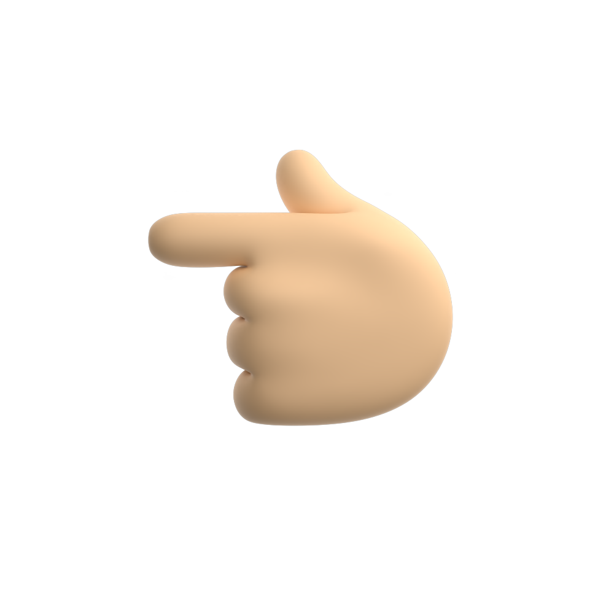</a> | **📂 檔名:** `pointing-left.svg` ✨ **格式:** `Vector (SVG)` ⚖️ **大小:** `122.92KB` 📅 **更新:** `2026-03-02`  🚀 **jsDelivr Markdown:** `` 🔗 **直接連結 (Url):** <code>https://cdn.jsdelivr.net/gh/barry028/materials@main/images/iCons/3D%20Hand%20Emojis/Light/pointing-left.svg</code> 📥 [檢視原始檔](pointing-left.svg) |
| <a href="pointing-right.svg">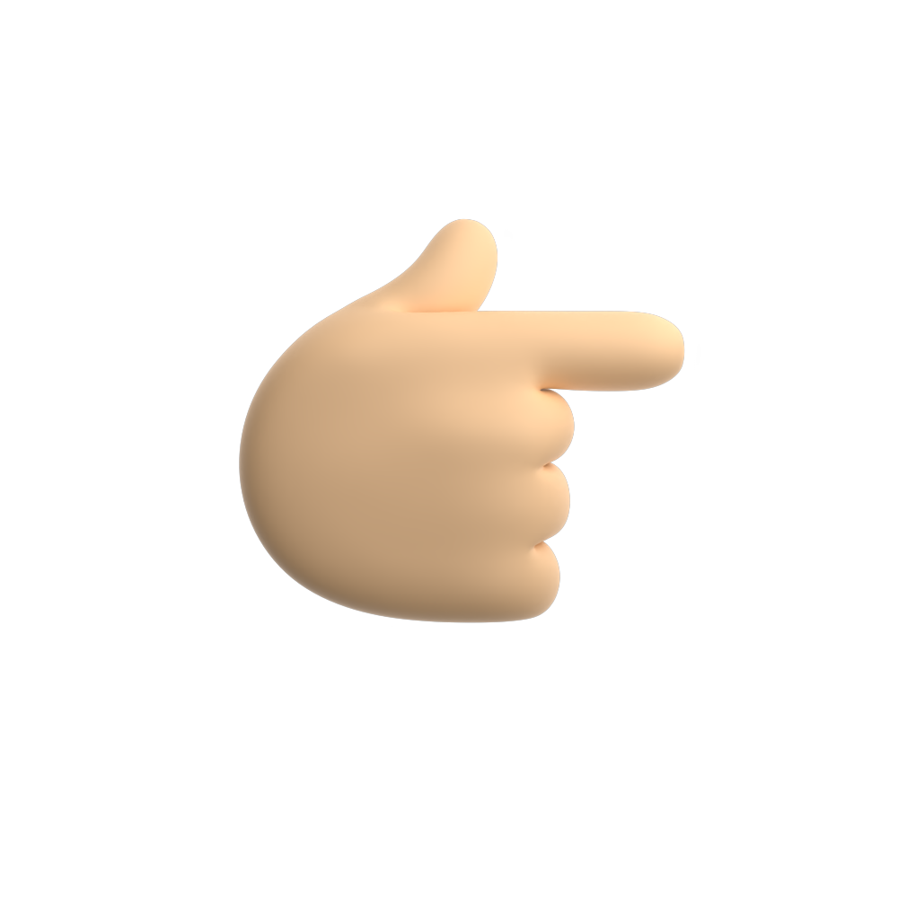</a> | **📂 檔名:** `pointing-right.svg` ✨ **格式:** `Vector (SVG)` ⚖️ **大小:** `125.19KB` 📅 **更新:** `2026-03-02`  🚀 **jsDelivr Markdown:** `` 🔗 **直接連結 (Url):** <code>https://cdn.jsdelivr.net/gh/barry028/materials@main/images/iCons/3D%20Hand%20Emojis/Light/pointing-right.svg</code> 📥 [檢視原始檔](pointing-right.svg) |
| <a href="poke.svg">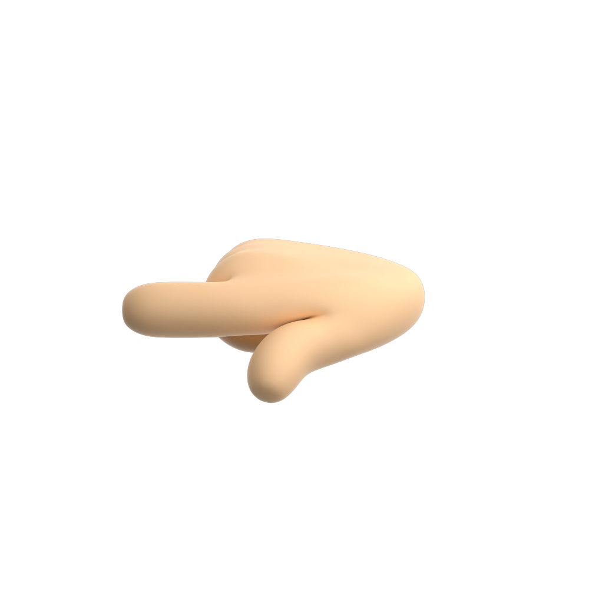</a> | **📂 檔名:** `poke.svg` ✨ **格式:** `Vector (SVG)` ⚖️ **大小:** `97.85KB` 📅 **更新:** `2026-03-02`  🚀 **jsDelivr Markdown:** `` 🔗 **直接連結 (Url):** <code>https://cdn.jsdelivr.net/gh/barry028/materials@main/images/iCons/3D%20Hand%20Emojis/Light/poke.svg</code> 📥 [檢視原始檔](poke.svg) |
| <a href="pray.svg">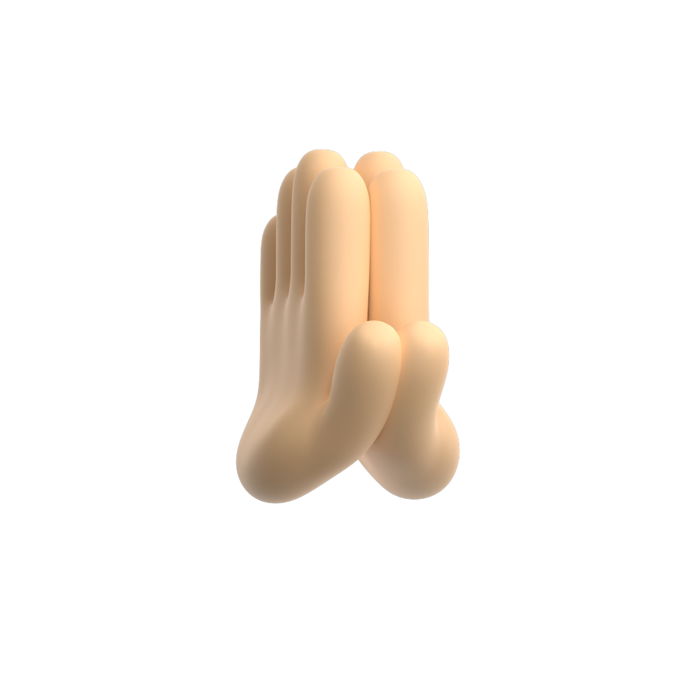</a> | **📂 檔名:** `pray.svg` ✨ **格式:** `Vector (SVG)` ⚖️ **大小:** `144.24KB` 📅 **更新:** `2026-03-02`  🚀 **jsDelivr Markdown:** `` 🔗 **直接連結 (Url):** <code>https://cdn.jsdelivr.net/gh/barry028/materials@main/images/iCons/3D%20Hand%20Emojis/Light/pray.svg</code> 📥 [檢視原始檔](pray.svg) |
| <a href="punch-left.svg">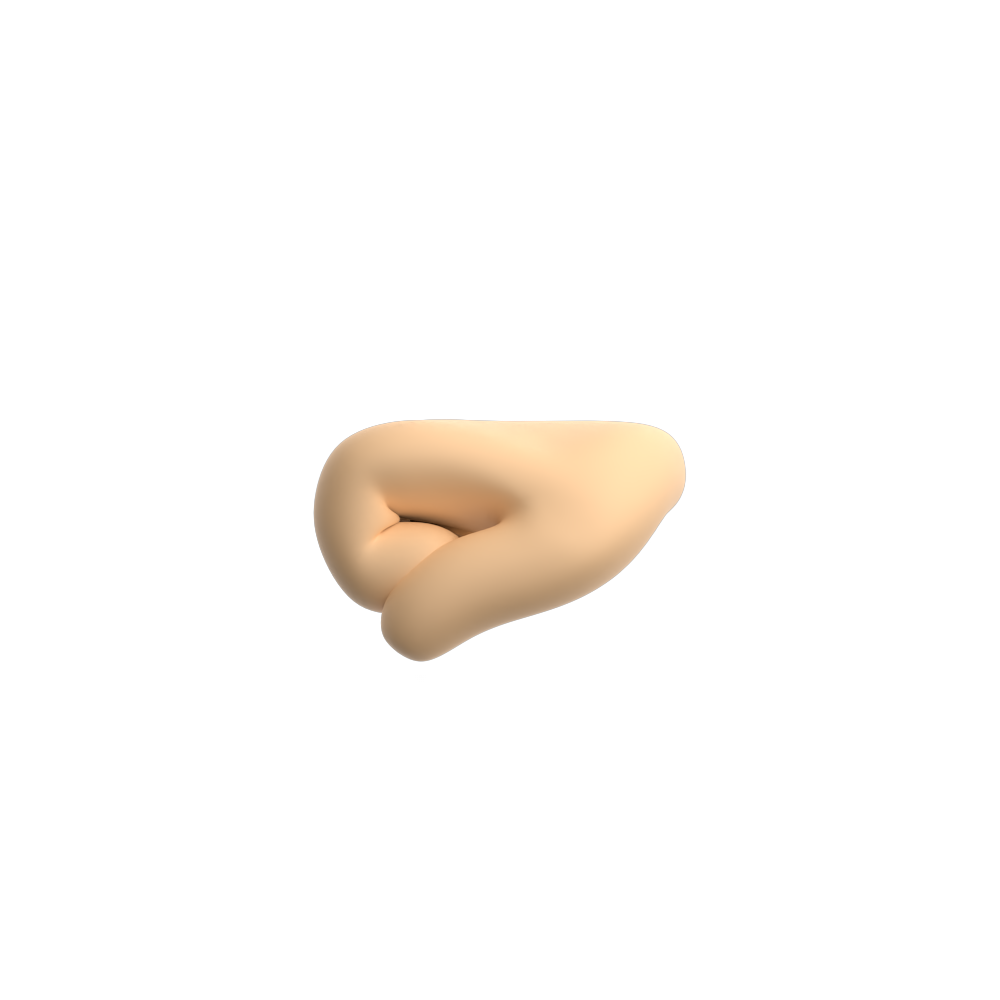</a> | **📂 檔名:** `punch-left.svg` ✨ **格式:** `Vector (SVG)` ⚖️ **大小:** `85.15KB` 📅 **更新:** `2026-03-02`  🚀 **jsDelivr Markdown:** `` 🔗 **直接連結 (Url):** <code>https://cdn.jsdelivr.net/gh/barry028/materials@main/images/iCons/3D%20Hand%20Emojis/Light/punch-left.svg</code> 📥 [檢視原始檔](punch-left.svg) |
| <a href="punch-right.svg">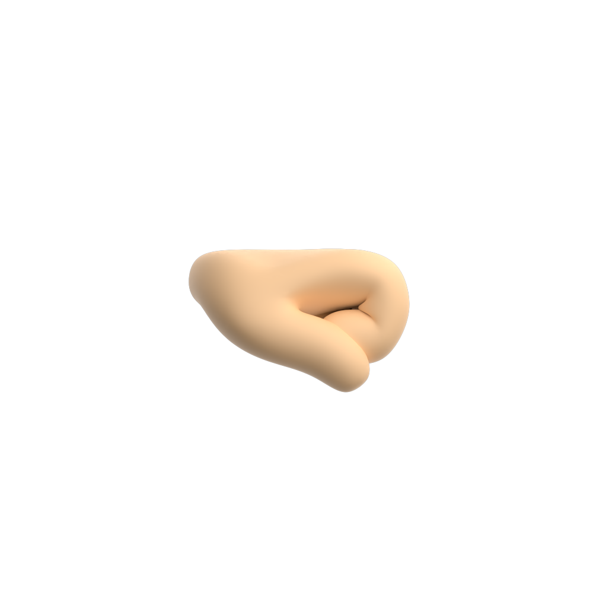</a> | **📂 檔名:** `punch-right.svg` ✨ **格式:** `Vector (SVG)` ⚖️ **大小:** `84.75KB` 📅 **更新:** `2026-03-02`  🚀 **jsDelivr Markdown:** `` 🔗 **直接連結 (Url):** <code>https://cdn.jsdelivr.net/gh/barry028/materials@main/images/iCons/3D%20Hand%20Emojis/Light/punch-right.svg</code> 📥 [檢視原始檔](punch-right.svg) |
|  | **📂 檔名:** `raised-fist.svg` ✨ **格式:** `Vector (SVG)` ⚖️ **大小:** `133.94KB` 📅 **更新:** `2026-03-02`  🚀 **jsDelivr Markdown:** `` 🔗 **直接連結 (Url):** <code>https://cdn.jsdelivr.net/gh/barry028/materials@main/images/iCons/3D%20Hand%20Emojis/Light/raised-fist.svg</code> 📥 [檢視原始檔](raised-fist.svg) |
|  | **📂 檔名:** `thumbs-down.svg` ✨ **格式:** `Vector (SVG)` ⚖️ **大小:** `148.99KB` 📅 **更新:** `2026-03-02`  🚀 **jsDelivr Markdown:** `` 🔗 **直接連結 (Url):** <code>https://cdn.jsdelivr.net/gh/barry028/materials@main/images/iCons/3D%20Hand%20Emojis/Light/thumbs-down.svg</code> 📥 [檢視原始檔](thumbs-down.svg) |
|  | **📂 檔名:** `thumbs-up.svg` ✨ **格式:** `Vector (SVG)` ⚖️ **大小:** `143.91KB` 📅 **更新:** `2026-03-02`  🚀 **jsDelivr Markdown:** `` 🔗 **直接連結 (Url):** <code>https://cdn.jsdelivr.net/gh/barry028/materials@main/images/iCons/3D%20Hand%20Emojis/Light/thumbs-up.svg</code> 📥 [檢視原始檔](thumbs-up.svg) |
|  | **📂 檔名:** `victory.svg` ✨ **格式:** `Vector (SVG)` ⚖️ **大小:** `153.46KB` 📅 **更新:** `2026-03-02`  🚀 **jsDelivr Markdown:** `` 🔗 **直接連結 (Url):** <code>https://cdn.jsdelivr.net/gh/barry028/materials@main/images/iCons/3D%20Hand%20Emojis/Light/victory.svg</code> 📥 [檢視原始檔](victory.svg) |
| <a href="vulcan-salute.svg">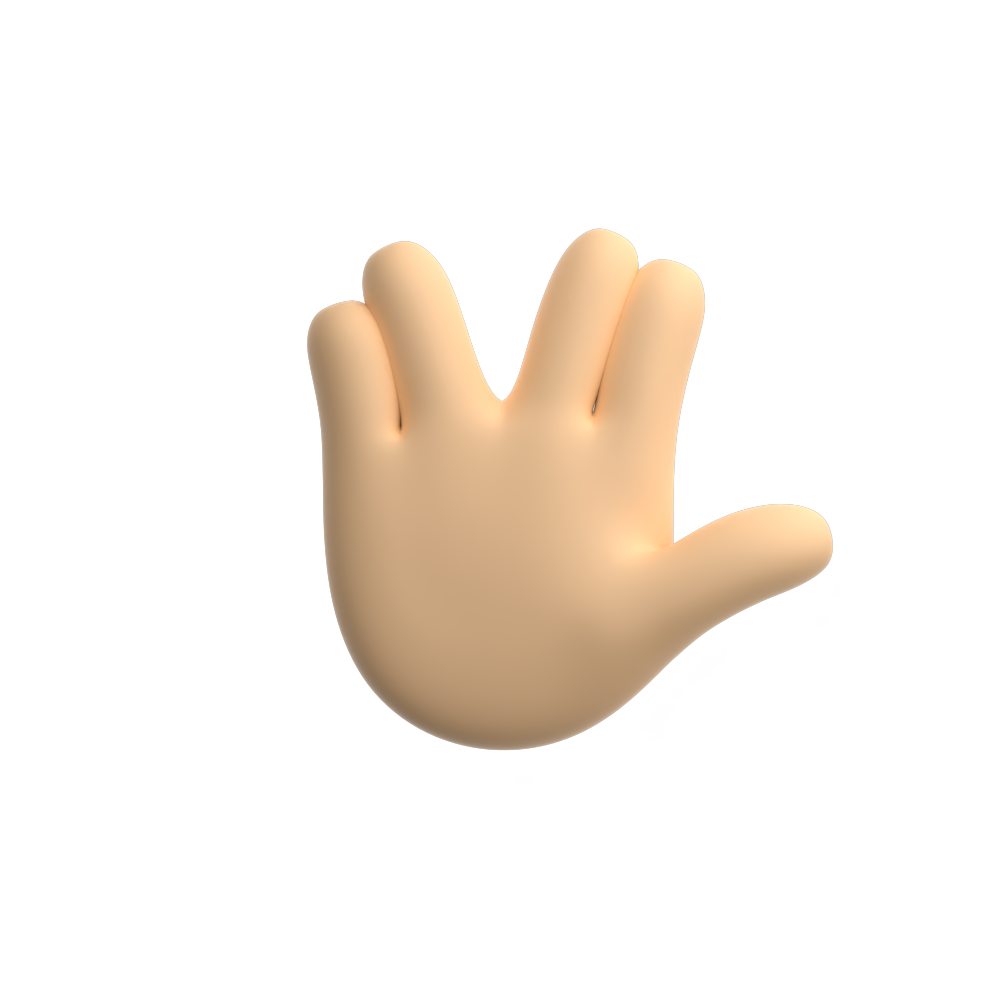</a> | **📂 檔名:** `vulcan-salute.svg` ✨ **格式:** `Vector (SVG)` ⚖️ **大小:** `171.50KB` 📅 **更新:** `2026-03-02`  🚀 **jsDelivr Markdown:** `` 🔗 **直接連結 (Url):** <code>https://cdn.jsdelivr.net/gh/barry028/materials@main/images/iCons/3D%20Hand%20Emojis/Light/vulcan-salute.svg</code> 📥 [檢視原始檔](vulcan-salute.svg) |
| <a href="wave.svg">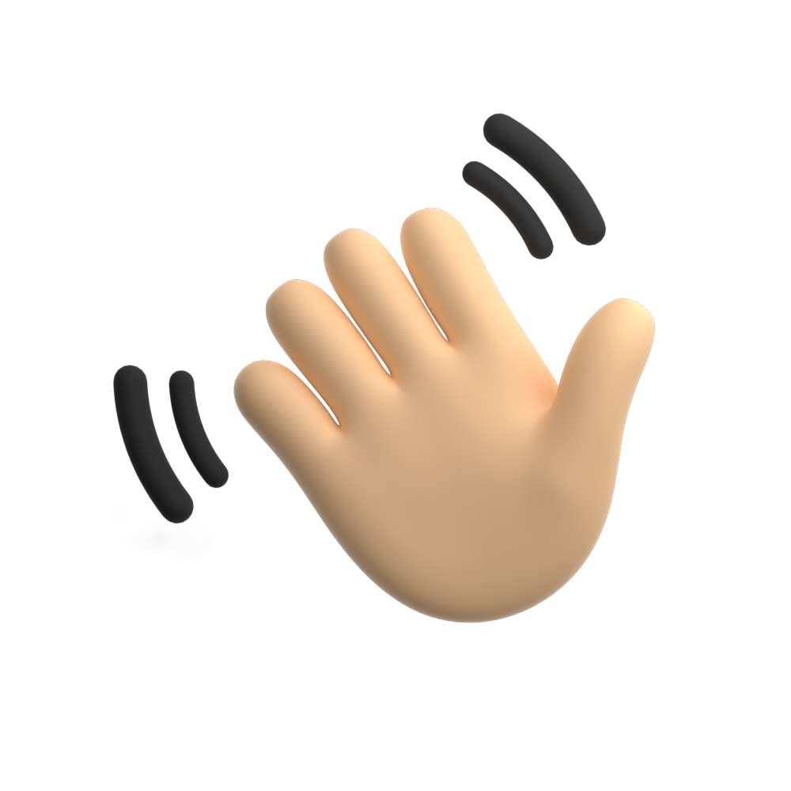</a> | **📂 檔名:** `wave.svg` ✨ **格式:** `Vector (SVG)` ⚖️ **大小:** `241.67KB` 📅 **更新:** `2026-03-02`  🚀 **jsDelivr Markdown:** `` 🔗 **直接連結 (Url):** <code>https://cdn.jsdelivr.net/gh/barry028/materials@main/images/iCons/3D%20Hand%20Emojis/Light/wave.svg</code> 📥 [檢視原始檔](wave.svg) |