# 🖼️ 素材分類：Adobe Creative Software iCons

> [🏠 主目錄](../../../README.md) / [images](../../README.md) / [iCons](../README.md) / **Adobe Creative Software iCons**

本目錄共有 `27` 個檔案

| 🎨 預覽 (點擊放大)  | 📋 檔案詳細資訊與連結 |
| :--- | :--- |
| <a href="001-aftereffects.svg">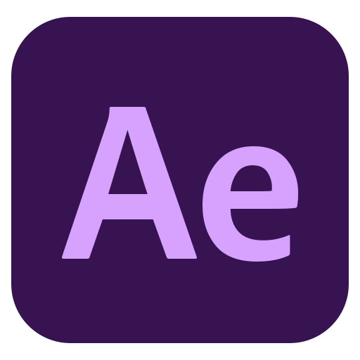</a> | **📂 檔名:** `001-aftereffects.svg` ✨ **格式:** `Vector (SVG)` ⚖️ **大小:** `1.42KB` 📅 **更新:** `2026-03-02`  🚀 **jsDelivr Markdown:** `` 🔗 **直接連結 (Url):** <code>https://cdn.jsdelivr.net/gh/barry028/materials@main/images/iCons/Adobe%20Creative%20Software%20iCons/001-aftereffects.svg</code> 📥 [檢視原始檔](001-aftereffects.svg) |
| <a href="002-aftereffects.svg">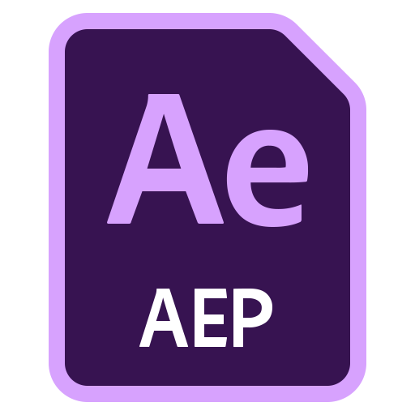</a> | **📂 檔名:** `002-aftereffects.svg` ✨ **格式:** `Vector (SVG)` ⚖️ **大小:** `2.35KB` 📅 **更新:** `2026-03-02`  🚀 **jsDelivr Markdown:** `` 🔗 **直接連結 (Url):** <code>https://cdn.jsdelivr.net/gh/barry028/materials@main/images/iCons/Adobe%20Creative%20Software%20iCons/002-aftereffects.svg</code> 📥 [檢視原始檔](002-aftereffects.svg) |
| <a href="003-aftereffects.svg">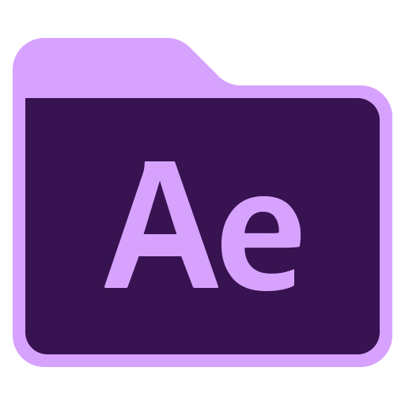</a> | **📂 檔名:** `003-aftereffects.svg` ✨ **格式:** `Vector (SVG)` ⚖️ **大小:** `1.24KB` 📅 **更新:** `2026-03-02`  🚀 **jsDelivr Markdown:** `` 🔗 **直接連結 (Url):** <code>https://cdn.jsdelivr.net/gh/barry028/materials@main/images/iCons/Adobe%20Creative%20Software%20iCons/003-aftereffects.svg</code> 📥 [檢視原始檔](003-aftereffects.svg) |
|  | **📂 檔名:** `004-animate.svg` ✨ **格式:** `Vector (SVG)` ⚖️ **大小:** `1.28KB` 📅 **更新:** `2026-03-02`  🚀 **jsDelivr Markdown:** `` 🔗 **直接連結 (Url):** <code>https://cdn.jsdelivr.net/gh/barry028/materials@main/images/iCons/Adobe%20Creative%20Software%20iCons/004-animate.svg</code> 📥 [檢視原始檔](004-animate.svg) |
| <a href="005-animate.svg">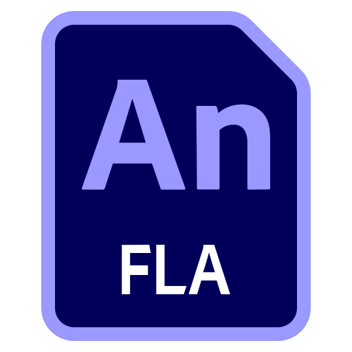</a> | **📂 檔名:** `005-animate.svg` ✨ **格式:** `Vector (SVG)` ⚖️ **大小:** `1.83KB` 📅 **更新:** `2026-03-02`  🚀 **jsDelivr Markdown:** `` 🔗 **直接連結 (Url):** <code>https://cdn.jsdelivr.net/gh/barry028/materials@main/images/iCons/Adobe%20Creative%20Software%20iCons/005-animate.svg</code> 📥 [檢視原始檔](005-animate.svg) |
|  | **📂 檔名:** `006-animate.svg` ✨ **格式:** `Vector (SVG)` ⚖️ **大小:** `1.31KB` 📅 **更新:** `2026-03-02`  🚀 **jsDelivr Markdown:** `` 🔗 **直接連結 (Url):** <code>https://cdn.jsdelivr.net/gh/barry028/materials@main/images/iCons/Adobe%20Creative%20Software%20iCons/006-animate.svg</code> 📥 [檢視原始檔](006-animate.svg) |
| <a href="007-illustrator.svg">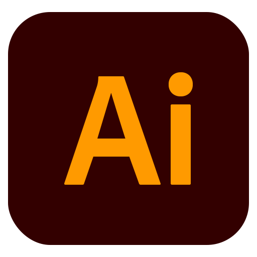</a> | **📂 檔名:** `007-illustrator.svg` ✨ **格式:** `Vector (SVG)` ⚖️ **大小:** `1.00KB` 📅 **更新:** `2026-03-02`  🚀 **jsDelivr Markdown:** `` 🔗 **直接連結 (Url):** <code>https://cdn.jsdelivr.net/gh/barry028/materials@main/images/iCons/Adobe%20Creative%20Software%20iCons/007-illustrator.svg</code> 📥 [檢視原始檔](007-illustrator.svg) |
|  | **📂 檔名:** `008-illustrator.svg` ✨ **格式:** `Vector (SVG)` ⚖️ **大小:** `1.65KB` 📅 **更新:** `2026-03-02`  🚀 **jsDelivr Markdown:** `` 🔗 **直接連結 (Url):** <code>https://cdn.jsdelivr.net/gh/barry028/materials@main/images/iCons/Adobe%20Creative%20Software%20iCons/008-illustrator.svg</code> 📥 [檢視原始檔](008-illustrator.svg) |
|  | **📂 檔名:** `009-illustrator.svg` ✨ **格式:** `Vector (SVG)` ⚖️ **大小:** `1.02KB` 📅 **更新:** `2026-03-02`  🚀 **jsDelivr Markdown:** `` 🔗 **直接連結 (Url):** <code>https://cdn.jsdelivr.net/gh/barry028/materials@main/images/iCons/Adobe%20Creative%20Software%20iCons/009-illustrator.svg</code> 📥 [檢視原始檔](009-illustrator.svg) |
|  | **📂 檔名:** `010-indesign.svg` ✨ **格式:** `Vector (SVG)` ⚖️ **大小:** `963.00B` 📅 **更新:** `2026-03-02`  🚀 **jsDelivr Markdown:** `` 🔗 **直接連結 (Url):** <code>https://cdn.jsdelivr.net/gh/barry028/materials@main/images/iCons/Adobe%20Creative%20Software%20iCons/010-indesign.svg</code> 📥 [檢視原始檔](010-indesign.svg) |
| <a href="011-indesign.svg">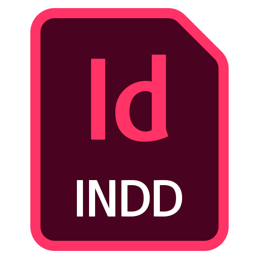</a> | **📂 檔名:** `011-indesign.svg` ✨ **格式:** `Vector (SVG)` ⚖️ **大小:** `2.44KB` 📅 **更新:** `2026-03-02`  🚀 **jsDelivr Markdown:** `` 🔗 **直接連結 (Url):** <code>https://cdn.jsdelivr.net/gh/barry028/materials@main/images/iCons/Adobe%20Creative%20Software%20iCons/011-indesign.svg</code> 📥 [檢視原始檔](011-indesign.svg) |
|  | **📂 檔名:** `012-indesign.svg` ✨ **格式:** `Vector (SVG)` ⚖️ **大小:** `1.02KB` 📅 **更新:** `2026-03-02`  🚀 **jsDelivr Markdown:** `` 🔗 **直接連結 (Url):** <code>https://cdn.jsdelivr.net/gh/barry028/materials@main/images/iCons/Adobe%20Creative%20Software%20iCons/012-indesign.svg</code> 📥 [檢視原始檔](012-indesign.svg) |
|  | **📂 檔名:** `013-lightroom.svg` ✨ **格式:** `Vector (SVG)` ⚖️ **大小:** `853.00B` 📅 **更新:** `2026-03-02`  🚀 **jsDelivr Markdown:** `` 🔗 **直接連結 (Url):** <code>https://cdn.jsdelivr.net/gh/barry028/materials@main/images/iCons/Adobe%20Creative%20Software%20iCons/013-lightroom.svg</code> 📥 [檢視原始檔](013-lightroom.svg) |
| <a href="014-lightroom.svg">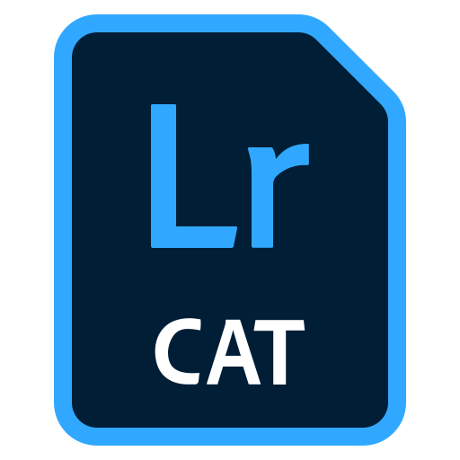</a> | **📂 檔名:** `014-lightroom.svg` ✨ **格式:** `Vector (SVG)` ⚖️ **大小:** `1.66KB` 📅 **更新:** `2026-03-02`  🚀 **jsDelivr Markdown:** `` 🔗 **直接連結 (Url):** <code>https://cdn.jsdelivr.net/gh/barry028/materials@main/images/iCons/Adobe%20Creative%20Software%20iCons/014-lightroom.svg</code> 📥 [檢視原始檔](014-lightroom.svg) |
|  | **📂 檔名:** `015-lightroom.svg` ✨ **格式:** `Vector (SVG)` ⚖️ **大小:** `946.00B` 📅 **更新:** `2026-03-02`  🚀 **jsDelivr Markdown:** `` 🔗 **直接連結 (Url):** <code>https://cdn.jsdelivr.net/gh/barry028/materials@main/images/iCons/Adobe%20Creative%20Software%20iCons/015-lightroom.svg</code> 📥 [檢視原始檔](015-lightroom.svg) |
| <a href="016-photoshop.svg">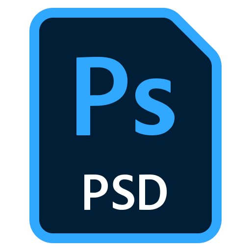</a> | **📂 檔名:** `016-photoshop.svg` ✨ **格式:** `Vector (SVG)` ⚖️ **大小:** `3.07KB` 📅 **更新:** `2026-03-02`  🚀 **jsDelivr Markdown:** `` 🔗 **直接連結 (Url):** <code>https://cdn.jsdelivr.net/gh/barry028/materials@main/images/iCons/Adobe%20Creative%20Software%20iCons/016-photoshop.svg</code> 📥 [檢視原始檔](016-photoshop.svg) |
|  | **📂 檔名:** `017-Premiere.svg` ✨ **格式:** `Vector (SVG)` ⚖️ **大小:** `1.03KB` 📅 **更新:** `2026-03-02`  🚀 **jsDelivr Markdown:** `` 🔗 **直接連結 (Url):** <code>https://cdn.jsdelivr.net/gh/barry028/materials@main/images/iCons/Adobe%20Creative%20Software%20iCons/017-Premiere.svg</code> 📥 [檢視原始檔](017-Premiere.svg) |
|  | **📂 檔名:** `018-Premiere.svg` ✨ **格式:** `Vector (SVG)` ⚖️ **大小:** `2.68KB` 📅 **更新:** `2026-03-02`  🚀 **jsDelivr Markdown:** `` 🔗 **直接連結 (Url):** <code>https://cdn.jsdelivr.net/gh/barry028/materials@main/images/iCons/Adobe%20Creative%20Software%20iCons/018-Premiere.svg</code> 📥 [檢視原始檔](018-Premiere.svg) |
|  | **📂 檔名:** `019-Premiere.svg` ✨ **格式:** `Vector (SVG)` ⚖️ **大小:** `1.10KB` 📅 **更新:** `2026-03-02`  🚀 **jsDelivr Markdown:** `` 🔗 **直接連結 (Url):** <code>https://cdn.jsdelivr.net/gh/barry028/materials@main/images/iCons/Adobe%20Creative%20Software%20iCons/019-Premiere.svg</code> 📥 [檢視原始檔](019-Premiere.svg) |
| <a href="020-rush.svg">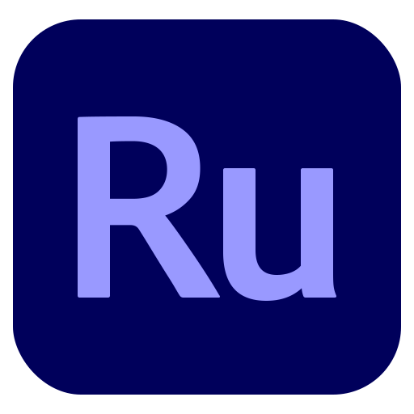</a> | **📂 檔名:** `020-rush.svg` ✨ **格式:** `Vector (SVG)` ⚖️ **大小:** `1.29KB` 📅 **更新:** `2026-03-02`  🚀 **jsDelivr Markdown:** `` 🔗 **直接連結 (Url):** <code>https://cdn.jsdelivr.net/gh/barry028/materials@main/images/iCons/Adobe%20Creative%20Software%20iCons/020-rush.svg</code> 📥 [檢視原始檔](020-rush.svg) |
|  | **📂 檔名:** `021-rush.svg` ✨ **格式:** `Vector (SVG)` ⚖️ **大小:** `1.26KB` 📅 **更新:** `2026-03-02`  🚀 **jsDelivr Markdown:** `` 🔗 **直接連結 (Url):** <code>https://cdn.jsdelivr.net/gh/barry028/materials@main/images/iCons/Adobe%20Creative%20Software%20iCons/021-rush.svg</code> 📥 [檢視原始檔](021-rush.svg) |
|  | **📂 檔名:** `022-spark.svg` ✨ **格式:** `Vector (SVG)` ⚖️ **大小:** `1.39KB` 📅 **更新:** `2026-03-02`  🚀 **jsDelivr Markdown:** `` 🔗 **直接連結 (Url):** <code>https://cdn.jsdelivr.net/gh/barry028/materials@main/images/iCons/Adobe%20Creative%20Software%20iCons/022-spark.svg</code> 📥 [檢視原始檔](022-spark.svg) |
| <a href="023-spark.svg">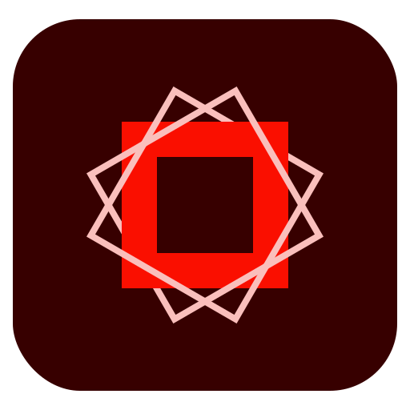</a> | **📂 檔名:** `023-spark.svg` ✨ **格式:** `Vector (SVG)` ⚖️ **大小:** `676.00B` 📅 **更新:** `2026-03-02`  🚀 **jsDelivr Markdown:** `` 🔗 **直接連結 (Url):** <code>https://cdn.jsdelivr.net/gh/barry028/materials@main/images/iCons/Adobe%20Creative%20Software%20iCons/023-spark.svg</code> 📥 [檢視原始檔](023-spark.svg) |
| <a href="024-sparkpage.svg">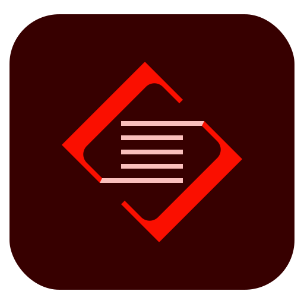</a> | **📂 檔名:** `024-sparkpage.svg` ✨ **格式:** `Vector (SVG)` ⚖️ **大小:** `753.00B` 📅 **更新:** `2026-03-02`  🚀 **jsDelivr Markdown:** `` 🔗 **直接連結 (Url):** <code>https://cdn.jsdelivr.net/gh/barry028/materials@main/images/iCons/Adobe%20Creative%20Software%20iCons/024-sparkpage.svg</code> 📥 [檢視原始檔](024-sparkpage.svg) |
| <a href="025-xd.svg">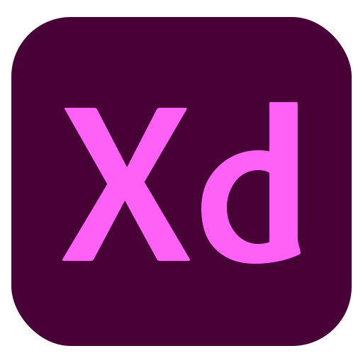</a> | **📂 檔名:** `025-xd.svg` ✨ **格式:** `Vector (SVG)` ⚖️ **大小:** `1.15KB` 📅 **更新:** `2026-03-02`  🚀 **jsDelivr Markdown:** `` 🔗 **直接連結 (Url):** <code>https://cdn.jsdelivr.net/gh/barry028/materials@main/images/iCons/Adobe%20Creative%20Software%20iCons/025-xd.svg</code> 📥 [檢視原始檔](025-xd.svg) |
| <a href="026-xd.svg">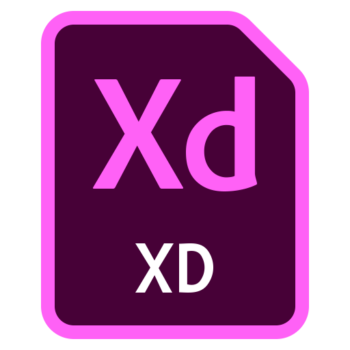</a> | **📂 檔名:** `026-xd.svg` ✨ **格式:** `Vector (SVG)` ⚖️ **大小:** `1.71KB` 📅 **更新:** `2026-03-02`  🚀 **jsDelivr Markdown:** `` 🔗 **直接連結 (Url):** <code>https://cdn.jsdelivr.net/gh/barry028/materials@main/images/iCons/Adobe%20Creative%20Software%20iCons/026-xd.svg</code> 📥 [檢視原始檔](026-xd.svg) |
| <a href="027-xd.svg">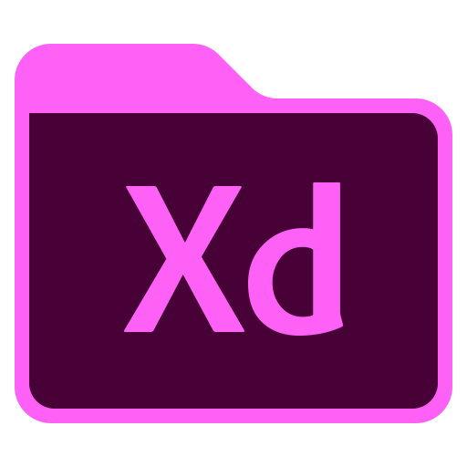</a> | **📂 檔名:** `027-xd.svg` ✨ **格式:** `Vector (SVG)` ⚖️ **大小:** `1.23KB` 📅 **更新:** `2026-03-02`  🚀 **jsDelivr Markdown:** `` 🔗 **直接連結 (Url):** <code>https://cdn.jsdelivr.net/gh/barry028/materials@main/images/iCons/Adobe%20Creative%20Software%20iCons/027-xd.svg</code> 📥 [檢視原始檔](027-xd.svg) |