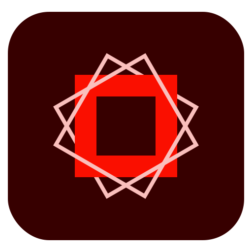

# 🖼️ AdobeCreativeSoftwareiiCons Gallery

[⬅️ 回到首頁](../../README.md)

| 預覽 | 詳細資訊 |
| :--- | :--- |
|  | **001-aftereffects.svg** VectorxVector | 1.42KB 更新: 2026-02-26 |
|  | **002-aftereffects.svg** VectorxVector | 2.35KB 更新: 2026-02-26 |
|  | **003-aftereffects.svg** VectorxVector | 1.24KB 更新: 2026-02-26 |
|  | **004-animate.svg** VectorxVector | 1.28KB 更新: 2026-02-26 |
|  | **005-animate.svg** VectorxVector | 1.83KB 更新: 2026-02-26 |
|  | **006-animate.svg** VectorxVector | 1.31KB 更新: 2026-02-26 |
|  | **007-illustrator.svg** VectorxVector | 1.00KB 更新: 2026-02-26 |
|  | **008-illustrator.svg** VectorxVector | 1.65KB 更新: 2026-02-26 |
|  | **009-illustrator.svg** VectorxVector | 1.02KB 更新: 2026-02-26 |
|  | **010-indesign.svg** VectorxVector | 963.00B 更新: 2026-02-26 |
|  | **011-indesign.svg** VectorxVector | 2.44KB 更新: 2026-02-26 |
|  | **012-indesign.svg** VectorxVector | 1.02KB 更新: 2026-02-26 |
|  | **013-lightroom.svg** VectorxVector | 853.00B 更新: 2026-02-26 |
|  | **014-lightroom.svg** VectorxVector | 1.66KB 更新: 2026-02-26 |
|  | **015-lightroom.svg** VectorxVector | 946.00B 更新: 2026-02-26 |
|  | **016-photoshop.svg** VectorxVector | 3.07KB 更新: 2026-02-26 |
|  | **017-Premiere.svg** VectorxVector | 1.03KB 更新: 2026-02-26 |
|  | **018-Premiere.svg** VectorxVector | 2.68KB 更新: 2026-02-26 |
|  | **019-Premiere.svg** VectorxVector | 1.10KB 更新: 2026-02-26 |
|  | **020-rush.svg** VectorxVector | 1.29KB 更新: 2026-02-26 |
|  | **021-rush.svg** VectorxVector | 1.26KB 更新: 2026-02-26 |
|  | **022-spark.svg** VectorxVector | 1.39KB 更新: 2026-02-26 |
|  | **023-spark.svg** VectorxVector | 676.00B 更新: 2026-02-26 |
|  | **024-sparkpage.svg** VectorxVector | 753.00B 更新: 2026-02-26 |
|  | **025-xd.svg** VectorxVector | 1.15KB 更新: 2026-02-26 |
|  | **026-xd.svg** VectorxVector | 1.71KB 更新: 2026-02-26 |
|  | **027-xd.svg** VectorxVector | 1.23KB 更新: 2026-02-26 |