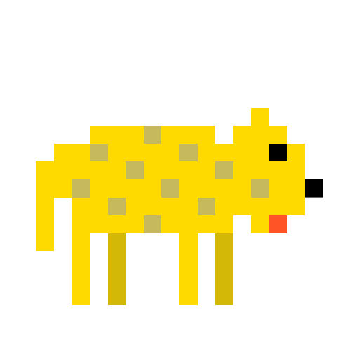

# 🖼️ 素材分類：Animal Pixel Art Vectors

> [🏠 主目錄](../../../README.md) / [images](../../README.md) / [iCons](../README.md) / **Animal Pixel Art Vectors**

本目錄共有 `12` 個檔案

| 🎨 預覽 (點擊放大)  | 📋 檔案詳細資訊與連結 |
| :--- | :--- |
|  | **📂 檔名:** `bee.svg` ✨ **格式:** `Vector (SVG)` ⚖️ **大小:** `3.45KB` 📅 **更新:** `2026-02-27`  🚀 **jsDelivr Markdown:** `` 🔗 **直接連結 (Url):** <code>https://cdn.jsdelivr.net/gh/barry028/materials@main/images/iCons/Animal%20Pixel%20Art%20Vectors/bee.svg</code> 📥 [檢視原始檔](bee.svg) |
|  | **📂 檔名:** `chick.svg` ✨ **格式:** `Vector (SVG)` ⚖️ **大小:** `32.55KB` 📅 **更新:** `2026-02-27`  🚀 **jsDelivr Markdown:** `` 🔗 **直接連結 (Url):** <code>https://cdn.jsdelivr.net/gh/barry028/materials@main/images/iCons/Animal%20Pixel%20Art%20Vectors/chick.svg</code> 📥 [檢視原始檔](chick.svg) |
|  | **📂 檔名:** `cock.svg` ✨ **格式:** `Vector (SVG)` ⚖️ **大小:** `3.32KB` 📅 **更新:** `2026-02-27`  🚀 **jsDelivr Markdown:** `` 🔗 **直接連結 (Url):** <code>https://cdn.jsdelivr.net/gh/barry028/materials@main/images/iCons/Animal%20Pixel%20Art%20Vectors/cock.svg</code> 📥 [檢視原始檔](cock.svg) |
|  | **📂 檔名:** `dog.svg` ✨ **格式:** `Vector (SVG)` ⚖️ **大小:** `1.40KB` 📅 **更新:** `2026-02-27`  🚀 **jsDelivr Markdown:** `` 🔗 **直接連結 (Url):** <code>https://cdn.jsdelivr.net/gh/barry028/materials@main/images/iCons/Animal%20Pixel%20Art%20Vectors/dog.svg</code> 📥 [檢視原始檔](dog.svg) |
|  | **📂 檔名:** `elephant.svg` ✨ **格式:** `Vector (SVG)` ⚖️ **大小:** `1.85KB` 📅 **更新:** `2026-02-27`  🚀 **jsDelivr Markdown:** `` 🔗 **直接連結 (Url):** <code>https://cdn.jsdelivr.net/gh/barry028/materials@main/images/iCons/Animal%20Pixel%20Art%20Vectors/elephant.svg</code> 📥 [檢視原始檔](elephant.svg) |
|  | **📂 檔名:** `horse.svg` ✨ **格式:** `Vector (SVG)` ⚖️ **大小:** `1.19KB` 📅 **更新:** `2026-02-27`  🚀 **jsDelivr Markdown:** `` 🔗 **直接連結 (Url):** <code>https://cdn.jsdelivr.net/gh/barry028/materials@main/images/iCons/Animal%20Pixel%20Art%20Vectors/horse.svg</code> 📥 [檢視原始檔](horse.svg) |
|  | **📂 檔名:** `lion.svg` ✨ **格式:** `Vector (SVG)` ⚖️ **大小:** `2.04KB` 📅 **更新:** `2026-02-27`  🚀 **jsDelivr Markdown:** `` 🔗 **直接連結 (Url):** <code>https://cdn.jsdelivr.net/gh/barry028/materials@main/images/iCons/Animal%20Pixel%20Art%20Vectors/lion.svg</code> 📥 [檢視原始檔](lion.svg) |
|  | **📂 檔名:** `monkey.svg` ✨ **格式:** `Vector (SVG)` ⚖️ **大小:** `1.87KB` 📅 **更新:** `2026-02-27`  🚀 **jsDelivr Markdown:** `` 🔗 **直接連結 (Url):** <code>https://cdn.jsdelivr.net/gh/barry028/materials@main/images/iCons/Animal%20Pixel%20Art%20Vectors/monkey.svg</code> 📥 [檢視原始檔](monkey.svg) |
|  | **📂 檔名:** `ounce.svg` ✨ **格式:** `Vector (SVG)` ⚖️ **大小:** `2.26KB` 📅 **更新:** `2026-02-27`  🚀 **jsDelivr Markdown:** `` 🔗 **直接連結 (Url):** <code>https://cdn.jsdelivr.net/gh/barry028/materials@main/images/iCons/Animal%20Pixel%20Art%20Vectors/ounce.svg</code> 📥 [檢視原始檔](ounce.svg) |
|  | **📂 檔名:** `rat.svg` ✨ **格式:** `Vector (SVG)` ⚖️ **大小:** `1.29KB` 📅 **更新:** `2026-02-27`  🚀 **jsDelivr Markdown:** `` 🔗 **直接連結 (Url):** <code>https://cdn.jsdelivr.net/gh/barry028/materials@main/images/iCons/Animal%20Pixel%20Art%20Vectors/rat.svg</code> 📥 [檢視原始檔](rat.svg) |
|  | **📂 檔名:** `wolf.svg` ✨ **格式:** `Vector (SVG)` ⚖️ **大小:** `1.21KB` 📅 **更新:** `2026-02-27`  🚀 **jsDelivr Markdown:** `` 🔗 **直接連結 (Url):** <code>https://cdn.jsdelivr.net/gh/barry028/materials@main/images/iCons/Animal%20Pixel%20Art%20Vectors/wolf.svg</code> 📥 [檢視原始檔](wolf.svg) |
|  | **📂 檔名:** `zebra.svg` ✨ **格式:** `Vector (SVG)` ⚖️ **大小:** `3.04KB` 📅 **更新:** `2026-02-27`  🚀 **jsDelivr Markdown:** `` 🔗 **直接連結 (Url):** <code>https://cdn.jsdelivr.net/gh/barry028/materials@main/images/iCons/Animal%20Pixel%20Art%20Vectors/zebra.svg</code> 📥 [檢視原始檔](zebra.svg) |