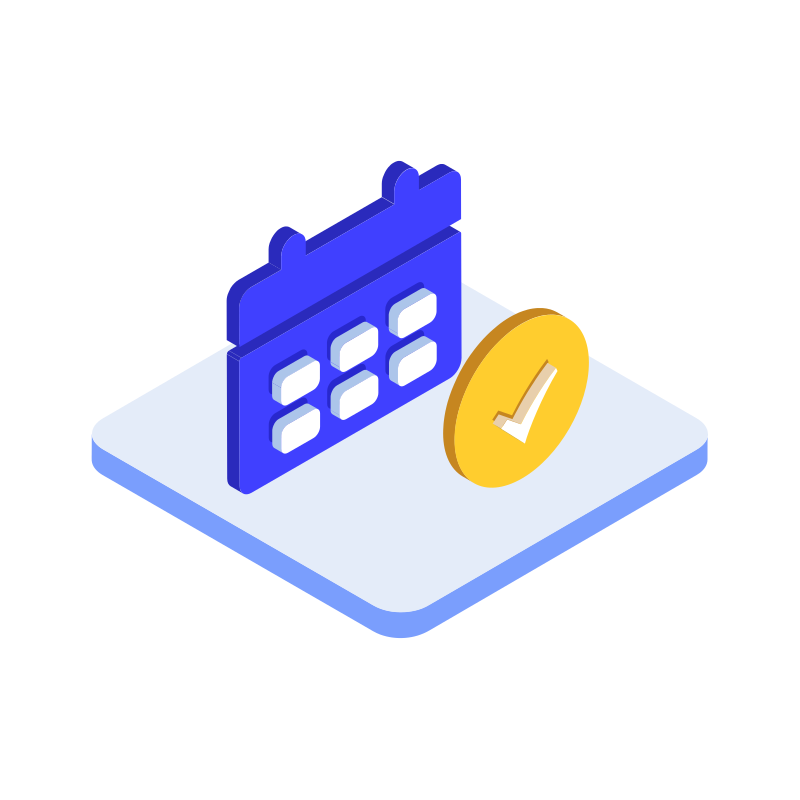
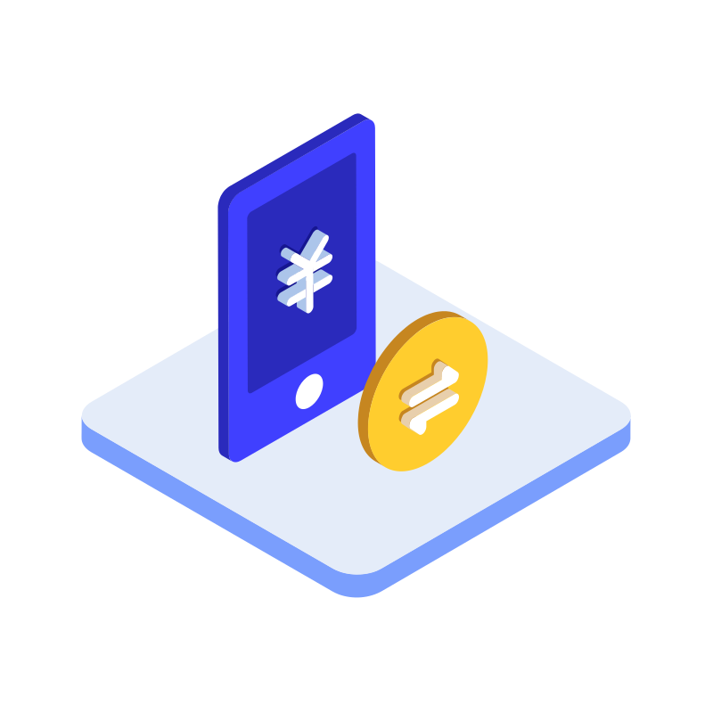

# 🖼️ 素材分類：Banking Isometric 3D Vectors

> [🏠 主目錄](../../../README.md) / [images](../../README.md) / [iCons](../README.md) / **Banking Isometric 3D Vectors**

本目錄共有 `20` 個檔案

| 🎨 預覽 (點擊放大)  | 📋 檔案詳細資訊與連結 |
| :--- | :--- |
|  | **📂 檔名:** `check-in.svg` ✨ **格式:** `Vector (SVG)` ⚖️ **大小:** `24.56KB` 📅 **更新:** `2026-03-02`  🚀 **jsDelivr Markdown:** `` 🔗 **直接連結 (Url):** <code>https://cdn.jsdelivr.net/gh/barry028/materials@main/images/iCons/Banking%20Isometric%203D%20Vectors/check-in.svg</code> 📥 [檢視原始檔](check-in.svg) |
|  | **📂 檔名:** `credit-report.svg` ✨ **格式:** `Vector (SVG)` ⚖️ **大小:** `8.63KB` 📅 **更新:** `2026-03-02`  🚀 **jsDelivr Markdown:** `` 🔗 **直接連結 (Url):** <code>https://cdn.jsdelivr.net/gh/barry028/materials@main/images/iCons/Banking%20Isometric%203D%20Vectors/credit-report.svg</code> 📥 [檢視原始檔](credit-report.svg) |
|  | **📂 檔名:** `currency-exchange.svg` ✨ **格式:** `Vector (SVG)` ⚖️ **大小:** `29.62KB` 📅 **更新:** `2026-03-02`  🚀 **jsDelivr Markdown:** `` 🔗 **直接連結 (Url):** <code>https://cdn.jsdelivr.net/gh/barry028/materials@main/images/iCons/Banking%20Isometric%203D%20Vectors/currency-exchange.svg</code> 📥 [檢視原始檔](currency-exchange.svg) |
|  | **📂 檔名:** `customer-service.svg` ✨ **格式:** `Vector (SVG)` ⚖️ **大小:** `28.05KB` 📅 **更新:** `2026-03-02`  🚀 **jsDelivr Markdown:** `` 🔗 **直接連結 (Url):** <code>https://cdn.jsdelivr.net/gh/barry028/materials@main/images/iCons/Banking%20Isometric%203D%20Vectors/customer-service.svg</code> 📥 [檢視原始檔](customer-service.svg) |
|  | **📂 檔名:** `deposit.svg` ✨ **格式:** `Vector (SVG)` ⚖️ **大小:** `29.42KB` 📅 **更新:** `2026-03-02`  🚀 **jsDelivr Markdown:** `` 🔗 **直接連結 (Url):** <code>https://cdn.jsdelivr.net/gh/barry028/materials@main/images/iCons/Banking%20Isometric%203D%20Vectors/deposit.svg</code> 📥 [檢視原始檔](deposit.svg) |
|  | **📂 檔名:** `financial-security.svg` ✨ **格式:** `Vector (SVG)` ⚖️ **大小:** `25.58KB` 📅 **更新:** `2026-03-02`  🚀 **jsDelivr Markdown:** `` 🔗 **直接連結 (Url):** <code>https://cdn.jsdelivr.net/gh/barry028/materials@main/images/iCons/Banking%20Isometric%203D%20Vectors/financial-security.svg</code> 📥 [檢視原始檔](financial-security.svg) |
|  | **📂 檔名:** `help.svg` ✨ **格式:** `Vector (SVG)` ⚖️ **大小:** `25.18KB` 📅 **更新:** `2026-03-02`  🚀 **jsDelivr Markdown:** `` 🔗 **直接連結 (Url):** <code>https://cdn.jsdelivr.net/gh/barry028/materials@main/images/iCons/Banking%20Isometric%203D%20Vectors/help.svg</code> 📥 [檢視原始檔](help.svg) |
|  | **📂 檔名:** `loan.svg` ✨ **格式:** `Vector (SVG)` ⚖️ **大小:** `19.62KB` 📅 **更新:** `2026-03-02`  🚀 **jsDelivr Markdown:** `` 🔗 **直接連結 (Url):** <code>https://cdn.jsdelivr.net/gh/barry028/materials@main/images/iCons/Banking%20Isometric%203D%20Vectors/loan.svg</code> 📥 [檢視原始檔](loan.svg) |
|  | **📂 檔名:** `market-analysis.svg` ✨ **格式:** `Vector (SVG)` ⚖️ **大小:** `23.23KB` 📅 **更新:** `2026-03-02`  🚀 **jsDelivr Markdown:** `` 🔗 **直接連結 (Url):** <code>https://cdn.jsdelivr.net/gh/barry028/materials@main/images/iCons/Banking%20Isometric%203D%20Vectors/market-analysis.svg</code> 📥 [檢視原始檔](market-analysis.svg) |
|  | **📂 檔名:** `message-center.svg` ✨ **格式:** `Vector (SVG)` ⚖️ **大小:** `11.52KB` 📅 **更新:** `2026-03-02`  🚀 **jsDelivr Markdown:** `` 🔗 **直接連結 (Url):** <code>https://cdn.jsdelivr.net/gh/barry028/materials@main/images/iCons/Banking%20Isometric%203D%20Vectors/message-center.svg</code> 📥 [檢視原始檔](message-center.svg) |
|  | **📂 檔名:** `mobile-phone-binding.svg` ✨ **格式:** `Vector (SVG)` ⚖️ **大小:** `31.33KB` 📅 **更新:** `2026-03-02`  🚀 **jsDelivr Markdown:** `` 🔗 **直接連結 (Url):** <code>https://cdn.jsdelivr.net/gh/barry028/materials@main/images/iCons/Banking%20Isometric%203D%20Vectors/mobile-phone-binding.svg</code> 📥 [檢視原始檔](mobile-phone-binding.svg) |
|  | **📂 檔名:** `mobile-phone-transfer.svg` ✨ **格式:** `Vector (SVG)` ⚖️ **大小:** `21.78KB` 📅 **更新:** `2026-03-02`  🚀 **jsDelivr Markdown:** `` 🔗 **直接連結 (Url):** <code>https://cdn.jsdelivr.net/gh/barry028/materials@main/images/iCons/Banking%20Isometric%203D%20Vectors/mobile-phone-transfer.svg</code> 📥 [檢視原始檔](mobile-phone-transfer.svg) |
|  | **📂 檔名:** `open-an-account.svg` ✨ **格式:** `Vector (SVG)` ⚖️ **大小:** `19.01KB` 📅 **更新:** `2026-03-02`  🚀 **jsDelivr Markdown:** `` 🔗 **直接連結 (Url):** <code>https://cdn.jsdelivr.net/gh/barry028/materials@main/images/iCons/Banking%20Isometric%203D%20Vectors/open-an-account.svg</code> 📥 [檢視原始檔](open-an-account.svg) |
|  | **📂 檔名:** `password-management.svg` ✨ **格式:** `Vector (SVG)` ⚖️ **大小:** `25.75KB` 📅 **更新:** `2026-03-02`  🚀 **jsDelivr Markdown:** `` 🔗 **直接連結 (Url):** <code>https://cdn.jsdelivr.net/gh/barry028/materials@main/images/iCons/Banking%20Isometric%203D%20Vectors/password-management.svg</code> 📥 [檢視原始檔](password-management.svg) |
|  | **📂 檔名:** `provident-fund-inquiry.svg` ✨ **格式:** `Vector (SVG)` ⚖️ **大小:** `15.72KB` 📅 **更新:** `2026-03-02`  🚀 **jsDelivr Markdown:** `` 🔗 **直接連結 (Url):** <code>https://cdn.jsdelivr.net/gh/barry028/materials@main/images/iCons/Banking%20Isometric%203D%20Vectors/provident-fund-inquiry.svg</code> 📥 [檢視原始檔](provident-fund-inquiry.svg) |
|  | **📂 檔名:** `risk-assessment.svg` ✨ **格式:** `Vector (SVG)` ⚖️ **大小:** `24.05KB` 📅 **更新:** `2026-03-02`  🚀 **jsDelivr Markdown:** `` 🔗 **直接連結 (Url):** <code>https://cdn.jsdelivr.net/gh/barry028/materials@main/images/iCons/Banking%20Isometric%203D%20Vectors/risk-assessment.svg</code> 📥 [檢視原始檔](risk-assessment.svg) |
|  | **📂 檔名:** `stock-movement.svg` ✨ **格式:** `Vector (SVG)` ⚖️ **大小:** `31.03KB` 📅 **更新:** `2026-03-02`  🚀 **jsDelivr Markdown:** `` 🔗 **直接連結 (Url):** <code>https://cdn.jsdelivr.net/gh/barry028/materials@main/images/iCons/Banking%20Isometric%203D%20Vectors/stock-movement.svg</code> 📥 [檢視原始檔](stock-movement.svg) |
|  | **📂 檔名:** `transaction-record.svg` ✨ **格式:** `Vector (SVG)` ⚖️ **大小:** `8.63KB` 📅 **更新:** `2026-03-02`  🚀 **jsDelivr Markdown:** `` 🔗 **直接連結 (Url):** <code>https://cdn.jsdelivr.net/gh/barry028/materials@main/images/iCons/Banking%20Isometric%203D%20Vectors/transaction-record.svg</code> 📥 [檢視原始檔](transaction-record.svg) |
|  | **📂 檔名:** `verified.svg` ✨ **格式:** `Vector (SVG)` ⚖️ **大小:** `23.40KB` 📅 **更新:** `2026-03-02`  🚀 **jsDelivr Markdown:** `` 🔗 **直接連結 (Url):** <code>https://cdn.jsdelivr.net/gh/barry028/materials@main/images/iCons/Banking%20Isometric%203D%20Vectors/verified.svg</code> 📥 [檢視原始檔](verified.svg) |
|  | **📂 檔名:** `vip.svg` ✨ **格式:** `Vector (SVG)` ⚖️ **大小:** `19.52KB` 📅 **更新:** `2026-03-02`  🚀 **jsDelivr Markdown:** `` 🔗 **直接連結 (Url):** <code>https://cdn.jsdelivr.net/gh/barry028/materials@main/images/iCons/Banking%20Isometric%203D%20Vectors/vip.svg</code> 📥 [檢視原始檔](vip.svg) |