# 🖼️ 素材分類：Brands

> [🏠 主目錄](../../../README.md) / [images](../../README.md) / [iCons](../README.md) / **Brands**

本目錄共有 `1752` 個檔案

| 🎨 預覽 (點擊放大)  | 📋 檔案詳細資訊與連結 |
| :--- | :--- |
|  | **📂 檔名:** `100tb.svg` ✨ **格式:** `Vector (SVG)` ⚖️ **大小:** `5.45KB` 📅 **更新:** `2026-03-02`  🚀 **jsDelivr Markdown:** `` 🔗 **直接連結 (Url):** <code>https://cdn.jsdelivr.net/gh/barry028/materials@main/images/iCons/Brands/100tb.svg</code> 📥 [檢視原始檔](100tb.svg) |
|  | **📂 檔名:** `500px.svg` ✨ **格式:** `Vector (SVG)` ⚖️ **大小:** `4.26KB` 📅 **更新:** `2026-03-02`  🚀 **jsDelivr Markdown:** `` 🔗 **直接連結 (Url):** <code>https://cdn.jsdelivr.net/gh/barry028/materials@main/images/iCons/Brands/500px.svg</code> 📥 [檢視原始檔](500px.svg) |
|  | **📂 檔名:** `active-campaign-icon.svg` ✨ **格式:** `Vector (SVG)` ⚖️ **大小:** `2.02KB` 📅 **更新:** `2026-03-02`  🚀 **jsDelivr Markdown:** `` 🔗 **直接連結 (Url):** <code>https://cdn.jsdelivr.net/gh/barry028/materials@main/images/iCons/Brands/active-campaign-icon.svg</code> 📥 [檢視原始檔](active-campaign-icon.svg) |
|  | **📂 檔名:** `active-campaign.svg` ✨ **格式:** `Vector (SVG)` ⚖️ **大小:** `14.48KB` 📅 **更新:** `2026-03-02`  🚀 **jsDelivr Markdown:** `` 🔗 **直接連結 (Url):** <code>https://cdn.jsdelivr.net/gh/barry028/materials@main/images/iCons/Brands/active-campaign.svg</code> 📥 [檢視原始檔](active-campaign.svg) |
| <a href="adobe-after-effects.svg">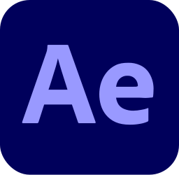</a> | **📂 檔名:** `adobe-after-effects.svg` ✨ **格式:** `Vector (SVG)` ⚖️ **大小:** `5.30KB` 📅 **更新:** `2026-03-02`  🚀 **jsDelivr Markdown:** `` 🔗 **直接連結 (Url):** <code>https://cdn.jsdelivr.net/gh/barry028/materials@main/images/iCons/Brands/adobe-after-effects.svg</code> 📥 [檢視原始檔](adobe-after-effects.svg) |
| <a href="adobe-animate.svg">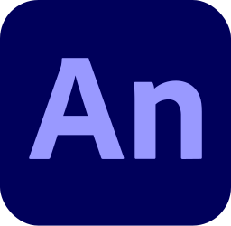</a> | **📂 檔名:** `adobe-animate.svg` ✨ **格式:** `Vector (SVG)` ⚖️ **大小:** `4.14KB` 📅 **更新:** `2026-03-02`  🚀 **jsDelivr Markdown:** `` 🔗 **直接連結 (Url):** <code>https://cdn.jsdelivr.net/gh/barry028/materials@main/images/iCons/Brands/adobe-animate.svg</code> 📥 [檢視原始檔](adobe-animate.svg) |
|  | **📂 檔名:** `adobe-dreamweaver.svg` ✨ **格式:** `Vector (SVG)` ⚖️ **大小:** `9.62KB` 📅 **更新:** `2026-03-02`  🚀 **jsDelivr Markdown:** `` 🔗 **直接連結 (Url):** <code>https://cdn.jsdelivr.net/gh/barry028/materials@main/images/iCons/Brands/adobe-dreamweaver.svg</code> 📥 [檢視原始檔](adobe-dreamweaver.svg) |
|  | **📂 檔名:** `adobe-illustrator.svg` ✨ **格式:** `Vector (SVG)` ⚖️ **大小:** `3.23KB` 📅 **更新:** `2026-03-02`  🚀 **jsDelivr Markdown:** `` 🔗 **直接連結 (Url):** <code>https://cdn.jsdelivr.net/gh/barry028/materials@main/images/iCons/Brands/adobe-illustrator.svg</code> 📥 [檢視原始檔](adobe-illustrator.svg) |
|  | **📂 檔名:** `adobe-incopy.svg` ✨ **格式:** `Vector (SVG)` ⚖️ **大小:** `2.55KB` 📅 **更新:** `2026-03-02`  🚀 **jsDelivr Markdown:** `` 🔗 **直接連結 (Url):** <code>https://cdn.jsdelivr.net/gh/barry028/materials@main/images/iCons/Brands/adobe-incopy.svg</code> 📥 [檢視原始檔](adobe-incopy.svg) |
|  | **📂 檔名:** `adobe-indesign.svg` ✨ **格式:** `Vector (SVG)` ⚖️ **大小:** `3.09KB` 📅 **更新:** `2026-03-02`  🚀 **jsDelivr Markdown:** `` 🔗 **直接連結 (Url):** <code>https://cdn.jsdelivr.net/gh/barry028/materials@main/images/iCons/Brands/adobe-indesign.svg</code> 📥 [檢視原始檔](adobe-indesign.svg) |
|  | **📂 檔名:** `adobe-lightroom.svg` ✨ **格式:** `Vector (SVG)` ⚖️ **大小:** `2.52KB` 📅 **更新:** `2026-03-02`  🚀 **jsDelivr Markdown:** `` 🔗 **直接連結 (Url):** <code>https://cdn.jsdelivr.net/gh/barry028/materials@main/images/iCons/Brands/adobe-lightroom.svg</code> 📥 [檢視原始檔](adobe-lightroom.svg) |
|  | **📂 檔名:** `adobe-photoshop.svg` ✨ **格式:** `Vector (SVG)` ⚖️ **大小:** `6.02KB` 📅 **更新:** `2026-03-02`  🚀 **jsDelivr Markdown:** `` 🔗 **直接連結 (Url):** <code>https://cdn.jsdelivr.net/gh/barry028/materials@main/images/iCons/Brands/adobe-photoshop.svg</code> 📥 [檢視原始檔](adobe-photoshop.svg) |
|  | **📂 檔名:** `adobe-premiere.svg` ✨ **格式:** `Vector (SVG)` ⚖️ **大小:** `4.82KB` 📅 **更新:** `2026-03-02`  🚀 **jsDelivr Markdown:** `` 🔗 **直接連結 (Url):** <code>https://cdn.jsdelivr.net/gh/barry028/materials@main/images/iCons/Brands/adobe-premiere.svg</code> 📥 [檢視原始檔](adobe-premiere.svg) |
|  | **📂 檔名:** `adobe-xd.svg` ✨ **格式:** `Vector (SVG)` ⚖️ **大小:** `4.80KB` 📅 **更新:** `2026-03-02`  🚀 **jsDelivr Markdown:** `` 🔗 **直接連結 (Url):** <code>https://cdn.jsdelivr.net/gh/barry028/materials@main/images/iCons/Brands/adobe-xd.svg</code> 📥 [檢視原始檔](adobe-xd.svg) |
|  | **📂 檔名:** `adonisjs-icon.svg` ✨ **格式:** `Vector (SVG)` ⚖️ **大小:** `1.37KB` 📅 **更新:** `2026-03-02`  🚀 **jsDelivr Markdown:** `` 🔗 **直接連結 (Url):** <code>https://cdn.jsdelivr.net/gh/barry028/materials@main/images/iCons/Brands/adonisjs-icon.svg</code> 📥 [檢視原始檔](adonisjs-icon.svg) |
|  | **📂 檔名:** `adonisjs.svg` ✨ **格式:** `Vector (SVG)` ⚖️ **大小:** `12.09KB` 📅 **更新:** `2026-03-02`  🚀 **jsDelivr Markdown:** `` 🔗 **直接連結 (Url):** <code>https://cdn.jsdelivr.net/gh/barry028/materials@main/images/iCons/Brands/adonisjs.svg</code> 📥 [檢視原始檔](adonisjs.svg) |
|  | **📂 檔名:** `adroll.svg` ✨ **格式:** `Vector (SVG)` ⚖️ **大小:** `3.84KB` 📅 **更新:** `2026-03-02`  🚀 **jsDelivr Markdown:** `` 🔗 **直接連結 (Url):** <code>https://cdn.jsdelivr.net/gh/barry028/materials@main/images/iCons/Brands/adroll.svg</code> 📥 [檢視原始檔](adroll.svg) |
|  | **📂 檔名:** `adyen.svg` ✨ **格式:** `Vector (SVG)` ⚖️ **大小:** `2.55KB` 📅 **更新:** `2026-03-02`  🚀 **jsDelivr Markdown:** `` 🔗 **直接連結 (Url):** <code>https://cdn.jsdelivr.net/gh/barry028/materials@main/images/iCons/Brands/adyen.svg</code> 📥 [檢視原始檔](adyen.svg) |
|  | **📂 檔名:** `aerogear.svg` ✨ **格式:** `Vector (SVG)` ⚖️ **大小:** `15.96KB` 📅 **更新:** `2026-03-02`  🚀 **jsDelivr Markdown:** `` 🔗 **直接連結 (Url):** <code>https://cdn.jsdelivr.net/gh/barry028/materials@main/images/iCons/Brands/aerogear.svg</code> 📥 [檢視原始檔](aerogear.svg) |
| <a href="aerospike-icon.svg">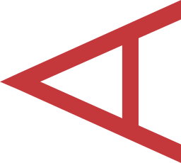</a> | **📂 檔名:** `aerospike-icon.svg` ✨ **格式:** `Vector (SVG)` ⚖️ **大小:** `533.00B` 📅 **更新:** `2026-03-02`  🚀 **jsDelivr Markdown:** `` 🔗 **直接連結 (Url):** <code>https://cdn.jsdelivr.net/gh/barry028/materials@main/images/iCons/Brands/aerospike-icon.svg</code> 📥 [檢視原始檔](aerospike-icon.svg) |
|  | **📂 檔名:** `aerospike.svg` ✨ **格式:** `Vector (SVG)` ⚖️ **大小:** `8.59KB` 📅 **更新:** `2026-03-02`  🚀 **jsDelivr Markdown:** `` 🔗 **直接連結 (Url):** <code>https://cdn.jsdelivr.net/gh/barry028/materials@main/images/iCons/Brands/aerospike.svg</code> 📥 [檢視原始檔](aerospike.svg) |
|  | **📂 檔名:** `aha.svg` ✨ **格式:** `Vector (SVG)` ⚖️ **大小:** `5.68KB` 📅 **更新:** `2026-03-02`  🚀 **jsDelivr Markdown:** `` 🔗 **直接連結 (Url):** <code>https://cdn.jsdelivr.net/gh/barry028/materials@main/images/iCons/Brands/aha.svg</code> 📥 [檢視原始檔](aha.svg) |
| <a href="airbnb-icon.svg">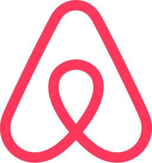</a> | **📂 檔名:** `airbnb-icon.svg` ✨ **格式:** `Vector (SVG)` ⚖️ **大小:** `5.32KB` 📅 **更新:** `2026-03-02`  🚀 **jsDelivr Markdown:** `` 🔗 **直接連結 (Url):** <code>https://cdn.jsdelivr.net/gh/barry028/materials@main/images/iCons/Brands/airbnb-icon.svg</code> 📥 [檢視原始檔](airbnb-icon.svg) |
|  | **📂 檔名:** `airbnb.svg` ✨ **格式:** `Vector (SVG)` ⚖️ **大小:** `12.93KB` 📅 **更新:** `2026-03-02`  🚀 **jsDelivr Markdown:** `` 🔗 **直接連結 (Url):** <code>https://cdn.jsdelivr.net/gh/barry028/materials@main/images/iCons/Brands/airbnb.svg</code> 📥 [檢視原始檔](airbnb.svg) |
|  | **📂 檔名:** `airbrake.svg` ✨ **格式:** `Vector (SVG)` ⚖️ **大小:** `4.89KB` 📅 **更新:** `2026-03-02`  🚀 **jsDelivr Markdown:** `` 🔗 **直接連結 (Url):** <code>https://cdn.jsdelivr.net/gh/barry028/materials@main/images/iCons/Brands/airbrake.svg</code> 📥 [檢視原始檔](airbrake.svg) |
|  | **📂 檔名:** `airflow-icon.svg` ✨ **格式:** `Vector (SVG)` ⚖️ **大小:** `3.49KB` 📅 **更新:** `2026-03-02`  🚀 **jsDelivr Markdown:** `` 🔗 **直接連結 (Url):** <code>https://cdn.jsdelivr.net/gh/barry028/materials@main/images/iCons/Brands/airflow-icon.svg</code> 📥 [檢視原始檔](airflow-icon.svg) |
|  | **📂 檔名:** `airflow.svg` ✨ **格式:** `Vector (SVG)` ⚖️ **大小:** `55.58KB` 📅 **更新:** `2026-03-02`  🚀 **jsDelivr Markdown:** `` 🔗 **直接連結 (Url):** <code>https://cdn.jsdelivr.net/gh/barry028/materials@main/images/iCons/Brands/airflow.svg</code> 📥 [檢視原始檔](airflow.svg) |
| <a href="airtable.svg">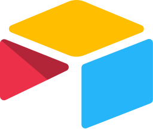</a> | **📂 檔名:** `airtable.svg` ✨ **格式:** `Vector (SVG)` ⚖️ **大小:** `1.89KB` 📅 **更新:** `2026-03-02`  🚀 **jsDelivr Markdown:** `` 🔗 **直接連結 (Url):** <code>https://cdn.jsdelivr.net/gh/barry028/materials@main/images/iCons/Brands/airtable.svg</code> 📥 [檢視原始檔](airtable.svg) |
| <a href="aix.svg">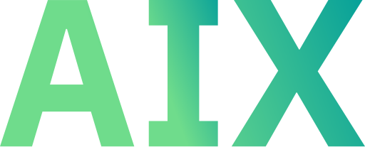</a> | **📂 檔名:** `aix.svg` ✨ **格式:** `Vector (SVG)` ⚖️ **大小:** `2.43KB` 📅 **更新:** `2026-03-02`  🚀 **jsDelivr Markdown:** `` 🔗 **直接連結 (Url):** <code>https://cdn.jsdelivr.net/gh/barry028/materials@main/images/iCons/Brands/aix.svg</code> 📥 [檢視原始檔](aix.svg) |
|  | **📂 檔名:** `akamai.svg` ✨ **格式:** `Vector (SVG)` ⚖️ **大小:** `5.65KB` 📅 **更新:** `2026-03-02`  🚀 **jsDelivr Markdown:** `` 🔗 **直接連結 (Url):** <code>https://cdn.jsdelivr.net/gh/barry028/materials@main/images/iCons/Brands/akamai.svg</code> 📥 [檢視原始檔](akamai.svg) |
|  | **📂 檔名:** `akka.svg` ✨ **格式:** `Vector (SVG)` ⚖️ **大小:** `964.00B` 📅 **更新:** `2026-03-02`  🚀 **jsDelivr Markdown:** `` 🔗 **直接連結 (Url):** <code>https://cdn.jsdelivr.net/gh/barry028/materials@main/images/iCons/Brands/akka.svg</code> 📥 [檢視原始檔](akka.svg) |
|  | **📂 檔名:** `alfresco.svg` ✨ **格式:** `Vector (SVG)` ⚖️ **大小:** `7.48KB` 📅 **更新:** `2026-03-02`  🚀 **jsDelivr Markdown:** `` 🔗 **直接連結 (Url):** <code>https://cdn.jsdelivr.net/gh/barry028/materials@main/images/iCons/Brands/alfresco.svg</code> 📥 [檢視原始檔](alfresco.svg) |
|  | **📂 檔名:** `algolia.svg` ✨ **格式:** `Vector (SVG)` ⚖️ **大小:** `11.60KB` 📅 **更新:** `2026-03-02`  🚀 **jsDelivr Markdown:** `` 🔗 **直接連結 (Url):** <code>https://cdn.jsdelivr.net/gh/barry028/materials@main/images/iCons/Brands/algolia.svg</code> 📥 [檢視原始檔](algolia.svg) |
|  | **📂 檔名:** `alpinejs-icon.svg` ✨ **格式:** `Vector (SVG)` ⚖️ **大小:** `507.00B` 📅 **更新:** `2026-03-02`  🚀 **jsDelivr Markdown:** `` 🔗 **直接連結 (Url):** <code>https://cdn.jsdelivr.net/gh/barry028/materials@main/images/iCons/Brands/alpinejs-icon.svg</code> 📥 [檢視原始檔](alpinejs-icon.svg) |
|  | **📂 檔名:** `alpinejs.svg` ✨ **格式:** `Vector (SVG)` ⚖️ **大小:** `9.76KB` 📅 **更新:** `2026-03-02`  🚀 **jsDelivr Markdown:** `` 🔗 **直接連結 (Url):** <code>https://cdn.jsdelivr.net/gh/barry028/materials@main/images/iCons/Brands/alpinejs.svg</code> 📥 [檢視原始檔](alpinejs.svg) |
| <a href="altair.svg">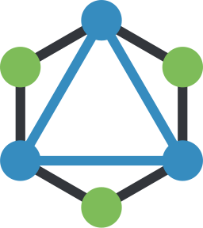</a> | **📂 檔名:** `altair.svg` ✨ **格式:** `Vector (SVG)` ⚖️ **大小:** `2.41KB` 📅 **更新:** `2026-03-02`  🚀 **jsDelivr Markdown:** `` 🔗 **直接連結 (Url):** <code>https://cdn.jsdelivr.net/gh/barry028/materials@main/images/iCons/Brands/altair.svg</code> 📥 [檢視原始檔](altair.svg) |
| <a href="amazon-chime.svg">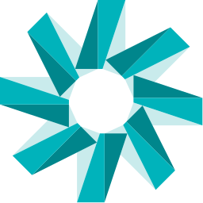</a> | **📂 檔名:** `amazon-chime.svg` ✨ **格式:** `Vector (SVG)` ⚖️ **大小:** `4.08KB` 📅 **更新:** `2026-03-02`  🚀 **jsDelivr Markdown:** `` 🔗 **直接連結 (Url):** <code>https://cdn.jsdelivr.net/gh/barry028/materials@main/images/iCons/Brands/amazon-chime.svg</code> 📥 [檢視原始檔](amazon-chime.svg) |
|  | **📂 檔名:** `amazon-connect.svg` ✨ **格式:** `Vector (SVG)` ⚖️ **大小:** `6.07KB` 📅 **更新:** `2026-03-02`  🚀 **jsDelivr Markdown:** `` 🔗 **直接連結 (Url):** <code>https://cdn.jsdelivr.net/gh/barry028/materials@main/images/iCons/Brands/amazon-connect.svg</code> 📥 [檢視原始檔](amazon-connect.svg) |
|  | **📂 檔名:** `amd.svg` ✨ **格式:** `Vector (SVG)` ⚖️ **大小:** `1.58KB` 📅 **更新:** `2026-03-02`  🚀 **jsDelivr Markdown:** `` 🔗 **直接連結 (Url):** <code>https://cdn.jsdelivr.net/gh/barry028/materials@main/images/iCons/Brands/amd.svg</code> 📥 [檢視原始檔](amd.svg) |
|  | **📂 檔名:** `amex-digital.svg` ✨ **格式:** `Vector (SVG)` ⚖️ **大小:** `1.86KB` 📅 **更新:** `2026-03-02`  🚀 **jsDelivr Markdown:** `` 🔗 **直接連結 (Url):** <code>https://cdn.jsdelivr.net/gh/barry028/materials@main/images/iCons/Brands/amex-digital.svg</code> 📥 [檢視原始檔](amex-digital.svg) |
|  | **📂 檔名:** `amex.svg` ✨ **格式:** `Vector (SVG)` ⚖️ **大小:** `8.52KB` 📅 **更新:** `2026-03-02`  🚀 **jsDelivr Markdown:** `` 🔗 **直接連結 (Url):** <code>https://cdn.jsdelivr.net/gh/barry028/materials@main/images/iCons/Brands/amex.svg</code> 📥 [檢視原始檔](amex.svg) |
| <a href="amp-icon.svg">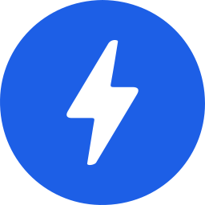</a> | **📂 檔名:** `amp-icon.svg` ✨ **格式:** `Vector (SVG)` ⚖️ **大小:** `1.76KB` 📅 **更新:** `2026-03-02`  🚀 **jsDelivr Markdown:** `` 🔗 **直接連結 (Url):** <code>https://cdn.jsdelivr.net/gh/barry028/materials@main/images/iCons/Brands/amp-icon.svg</code> 📥 [檢視原始檔](amp-icon.svg) |
|  | **📂 檔名:** `amp.svg` ✨ **格式:** `Vector (SVG)` ⚖️ **大小:** `7.03KB` 📅 **更新:** `2026-03-02`  🚀 **jsDelivr Markdown:** `` 🔗 **直接連結 (Url):** <code>https://cdn.jsdelivr.net/gh/barry028/materials@main/images/iCons/Brands/amp.svg</code> 📥 [檢視原始檔](amp.svg) |
|  | **📂 檔名:** `ampersand.svg` ✨ **格式:** `Vector (SVG)` ⚖️ **大小:** `5.56KB` 📅 **更新:** `2026-03-02`  🚀 **jsDelivr Markdown:** `` 🔗 **直接連結 (Url):** <code>https://cdn.jsdelivr.net/gh/barry028/materials@main/images/iCons/Brands/ampersand.svg</code> 📥 [檢視原始檔](ampersand.svg) |
| <a href="amplication-icon.svg">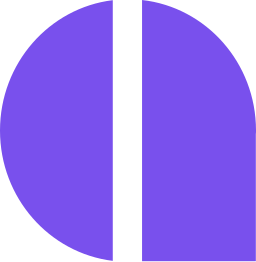</a> | **📂 檔名:** `amplication-icon.svg` ✨ **格式:** `Vector (SVG)` ⚖️ **大小:** `643.00B` 📅 **更新:** `2026-03-02`  🚀 **jsDelivr Markdown:** `` 🔗 **直接連結 (Url):** <code>https://cdn.jsdelivr.net/gh/barry028/materials@main/images/iCons/Brands/amplication-icon.svg</code> 📥 [檢視原始檔](amplication-icon.svg) |
|  | **📂 檔名:** `amplication.svg` ✨ **格式:** `Vector (SVG)` ⚖️ **大小:** `6.50KB` 📅 **更新:** `2026-03-02`  🚀 **jsDelivr Markdown:** `` 🔗 **直接連結 (Url):** <code>https://cdn.jsdelivr.net/gh/barry028/materials@main/images/iCons/Brands/amplication.svg</code> 📥 [檢視原始檔](amplication.svg) |
| <a href="amplitude-icon.svg">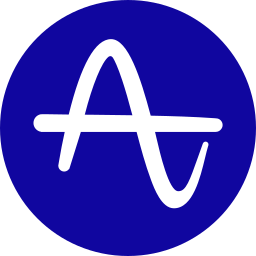</a> | **📂 檔名:** `amplitude-icon.svg` ✨ **格式:** `Vector (SVG)` ⚖️ **大小:** `3.47KB` 📅 **更新:** `2026-03-02`  🚀 **jsDelivr Markdown:** `` 🔗 **直接連結 (Url):** <code>https://cdn.jsdelivr.net/gh/barry028/materials@main/images/iCons/Brands/amplitude-icon.svg</code> 📥 [檢視原始檔](amplitude-icon.svg) |
| <a href="amplitude.svg">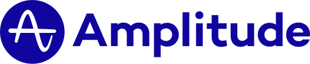</a> | **📂 檔名:** `amplitude.svg` ✨ **格式:** `Vector (SVG)` ⚖️ **大小:** `8.55KB` 📅 **更新:** `2026-03-02`  🚀 **jsDelivr Markdown:** `` 🔗 **直接連結 (Url):** <code>https://cdn.jsdelivr.net/gh/barry028/materials@main/images/iCons/Brands/amplitude.svg</code> 📥 [檢視原始檔](amplitude.svg) |
|  | **📂 檔名:** `android-icon.svg` ✨ **格式:** `Vector (SVG)` ⚖️ **大小:** `1.50KB` 📅 **更新:** `2026-03-02`  🚀 **jsDelivr Markdown:** `` 🔗 **直接連結 (Url):** <code>https://cdn.jsdelivr.net/gh/barry028/materials@main/images/iCons/Brands/android-icon.svg</code> 📥 [檢視原始檔](android-icon.svg) |
|  | **📂 檔名:** `android-vertical.svg` ✨ **格式:** `Vector (SVG)` ⚖️ **大小:** `5.86KB` 📅 **更新:** `2026-03-02`  🚀 **jsDelivr Markdown:** `` 🔗 **直接連結 (Url):** <code>https://cdn.jsdelivr.net/gh/barry028/materials@main/images/iCons/Brands/android-vertical.svg</code> 📥 [檢視原始檔](android-vertical.svg) |
|  | **📂 檔名:** `android.svg` ✨ **格式:** `Vector (SVG)` ⚖️ **大小:** `5.80KB` 📅 **更新:** `2026-03-02`  🚀 **jsDelivr Markdown:** `` 🔗 **直接連結 (Url):** <code>https://cdn.jsdelivr.net/gh/barry028/materials@main/images/iCons/Brands/android.svg</code> 📥 [檢視原始檔](android.svg) |
|  | **📂 檔名:** `angellist.svg` ✨ **格式:** `Vector (SVG)` ⚖️ **大小:** `7.49KB` 📅 **更新:** `2026-03-02`  🚀 **jsDelivr Markdown:** `` 🔗 **直接連結 (Url):** <code>https://cdn.jsdelivr.net/gh/barry028/materials@main/images/iCons/Brands/angellist.svg</code> 📥 [檢視原始檔](angellist.svg) |
| <a href="angular-icon.svg">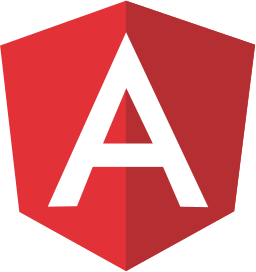</a> | **📂 檔名:** `angular-icon.svg` ✨ **格式:** `Vector (SVG)` ⚖️ **大小:** `1.06KB` 📅 **更新:** `2026-03-02`  🚀 **jsDelivr Markdown:** `` 🔗 **直接連結 (Url):** <code>https://cdn.jsdelivr.net/gh/barry028/materials@main/images/iCons/Brands/angular-icon.svg</code> 📥 [檢視原始檔](angular-icon.svg) |
|  | **📂 檔名:** `angular.svg` ✨ **格式:** `Vector (SVG)` ⚖️ **大小:** `2.27KB` 📅 **更新:** `2026-03-02`  🚀 **jsDelivr Markdown:** `` 🔗 **直接連結 (Url):** <code>https://cdn.jsdelivr.net/gh/barry028/materials@main/images/iCons/Brands/angular.svg</code> 📥 [檢視原始檔](angular.svg) |
| <a href="ansible.svg">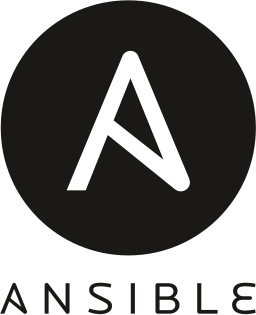</a> | **📂 檔名:** `ansible.svg` ✨ **格式:** `Vector (SVG)` ⚖️ **大小:** `5.55KB` 📅 **更新:** `2026-03-02`  🚀 **jsDelivr Markdown:** `` 🔗 **直接連結 (Url):** <code>https://cdn.jsdelivr.net/gh/barry028/materials@main/images/iCons/Brands/ansible.svg</code> 📥 [檢視原始檔](ansible.svg) |
| <a href="ant-design.svg">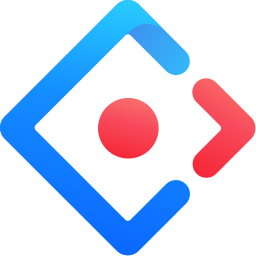</a> | **📂 檔名:** `ant-design.svg` ✨ **格式:** `Vector (SVG)` ⚖️ **大小:** `4.11KB` 📅 **更新:** `2026-03-02`  🚀 **jsDelivr Markdown:** `` 🔗 **直接連結 (Url):** <code>https://cdn.jsdelivr.net/gh/barry028/materials@main/images/iCons/Brands/ant-design.svg</code> 📥 [檢視原始檔](ant-design.svg) |
|  | **📂 檔名:** `apache-camel.svg` ✨ **格式:** `Vector (SVG)` ⚖️ **大小:** `3.79KB` 📅 **更新:** `2026-03-02`  🚀 **jsDelivr Markdown:** `` 🔗 **直接連結 (Url):** <code>https://cdn.jsdelivr.net/gh/barry028/materials@main/images/iCons/Brands/apache-camel.svg</code> 📥 [檢視原始檔](apache-camel.svg) |
|  | **📂 檔名:** `apache.svg` ✨ **格式:** `Vector (SVG)` ⚖️ **大小:** `11.86KB` 📅 **更新:** `2026-03-02`  🚀 **jsDelivr Markdown:** `` 🔗 **直接連結 (Url):** <code>https://cdn.jsdelivr.net/gh/barry028/materials@main/images/iCons/Brands/apache.svg</code> 📥 [檢視原始檔](apache.svg) |
|  | **📂 檔名:** `apache_cloudstack.svg` ✨ **格式:** `Vector (SVG)` ⚖️ **大小:** `9.12KB` 📅 **更新:** `2026-03-02`  🚀 **jsDelivr Markdown:** `` 🔗 **直接連結 (Url):** <code>https://cdn.jsdelivr.net/gh/barry028/materials@main/images/iCons/Brands/apache_cloudstack.svg</code> 📥 [檢視原始檔](apache_cloudstack.svg) |
| <a href="apiary.svg">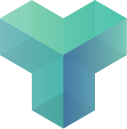</a> | **📂 檔名:** `apiary.svg` ✨ **格式:** `Vector (SVG)` ⚖️ **大小:** `2.80KB` 📅 **更新:** `2026-03-02`  🚀 **jsDelivr Markdown:** `` 🔗 **直接連結 (Url):** <code>https://cdn.jsdelivr.net/gh/barry028/materials@main/images/iCons/Brands/apiary.svg</code> 📥 [檢視原始檔](apiary.svg) |
|  | **📂 檔名:** `apollostack.svg` ✨ **格式:** `Vector (SVG)` ⚖️ **大小:** `1.21KB` 📅 **更新:** `2026-03-02`  🚀 **jsDelivr Markdown:** `` 🔗 **直接連結 (Url):** <code>https://cdn.jsdelivr.net/gh/barry028/materials@main/images/iCons/Brands/apollostack.svg</code> 📥 [檢視原始檔](apollostack.svg) |
| <a href="apostrophe.svg">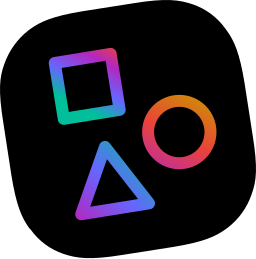</a> | **📂 檔名:** `apostrophe.svg` ✨ **格式:** `Vector (SVG)` ⚖️ **大小:** `4.01KB` 📅 **更新:** `2026-03-02`  🚀 **jsDelivr Markdown:** `` 🔗 **直接連結 (Url):** <code>https://cdn.jsdelivr.net/gh/barry028/materials@main/images/iCons/Brands/apostrophe.svg</code> 📥 [檢視原始檔](apostrophe.svg) |
| <a href="appbaseio-icon.svg">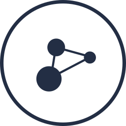</a> | **📂 檔名:** `appbaseio-icon.svg` ✨ **格式:** `Vector (SVG)` ⚖️ **大小:** `2.18KB` 📅 **更新:** `2026-03-02`  🚀 **jsDelivr Markdown:** `` 🔗 **直接連結 (Url):** <code>https://cdn.jsdelivr.net/gh/barry028/materials@main/images/iCons/Brands/appbaseio-icon.svg</code> 📥 [檢視原始檔](appbaseio-icon.svg) |
|  | **📂 檔名:** `appbaseio.svg` ✨ **格式:** `Vector (SVG)` ⚖️ **大小:** `9.31KB` 📅 **更新:** `2026-03-02`  🚀 **jsDelivr Markdown:** `` 🔗 **直接連結 (Url):** <code>https://cdn.jsdelivr.net/gh/barry028/materials@main/images/iCons/Brands/appbaseio.svg</code> 📥 [檢視原始檔](appbaseio.svg) |
| <a href="appcenter-icon.svg">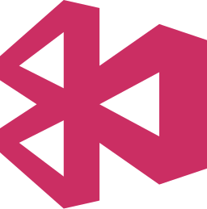</a> | **📂 檔名:** `appcenter-icon.svg` ✨ **格式:** `Vector (SVG)` ⚖️ **大小:** `891.00B` 📅 **更新:** `2026-03-02`  🚀 **jsDelivr Markdown:** `` 🔗 **直接連結 (Url):** <code>https://cdn.jsdelivr.net/gh/barry028/materials@main/images/iCons/Brands/appcenter-icon.svg</code> 📥 [檢視原始檔](appcenter-icon.svg) |
|  | **📂 檔名:** `appcenter.svg` ✨ **格式:** `Vector (SVG)` ⚖️ **大小:** `9.72KB` 📅 **更新:** `2026-03-02`  🚀 **jsDelivr Markdown:** `` 🔗 **直接連結 (Url):** <code>https://cdn.jsdelivr.net/gh/barry028/materials@main/images/iCons/Brands/appcenter.svg</code> 📥 [檢視原始檔](appcenter.svg) |
| <a href="appcircle-icon.svg">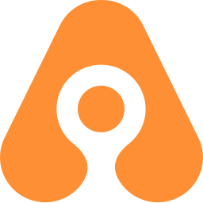</a> | **📂 檔名:** `appcircle-icon.svg` ✨ **格式:** `Vector (SVG)` ⚖️ **大小:** `1.66KB` 📅 **更新:** `2026-03-02`  🚀 **jsDelivr Markdown:** `` 🔗 **直接連結 (Url):** <code>https://cdn.jsdelivr.net/gh/barry028/materials@main/images/iCons/Brands/appcircle-icon.svg</code> 📥 [檢視原始檔](appcircle-icon.svg) |
|  | **📂 檔名:** `appcircle.svg` ✨ **格式:** `Vector (SVG)` ⚖️ **大小:** `10.19KB` 📅 **更新:** `2026-03-02`  🚀 **jsDelivr Markdown:** `` 🔗 **直接連結 (Url):** <code>https://cdn.jsdelivr.net/gh/barry028/materials@main/images/iCons/Brands/appcircle.svg</code> 📥 [檢視原始檔](appcircle.svg) |
| <a href="appcode.svg">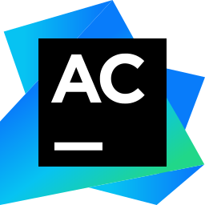</a> | **📂 檔名:** `appcode.svg` ✨ **格式:** `Vector (SVG)` ⚖️ **大小:** `2.81KB` 📅 **更新:** `2026-03-02`  🚀 **jsDelivr Markdown:** `` 🔗 **直接連結 (Url):** <code>https://cdn.jsdelivr.net/gh/barry028/materials@main/images/iCons/Brands/appcode.svg</code> 📥 [檢視原始檔](appcode.svg) |
|  | **📂 檔名:** `appdynamics-icon.svg` ✨ **格式:** `Vector (SVG)` ⚖️ **大小:** `956.00B` 📅 **更新:** `2026-03-02`  🚀 **jsDelivr Markdown:** `` 🔗 **直接連結 (Url):** <code>https://cdn.jsdelivr.net/gh/barry028/materials@main/images/iCons/Brands/appdynamics-icon.svg</code> 📥 [檢視原始檔](appdynamics-icon.svg) |
|  | **📂 檔名:** `appdynamics.svg` ✨ **格式:** `Vector (SVG)` ⚖️ **大小:** `15.23KB` 📅 **更新:** `2026-03-02`  🚀 **jsDelivr Markdown:** `` 🔗 **直接連結 (Url):** <code>https://cdn.jsdelivr.net/gh/barry028/materials@main/images/iCons/Brands/appdynamics.svg</code> 📥 [檢視原始檔](appdynamics.svg) |
|  | **📂 檔名:** `appium.svg` ✨ **格式:** `Vector (SVG)` ⚖️ **大小:** `1021.00B` 📅 **更新:** `2026-03-02`  🚀 **jsDelivr Markdown:** `` 🔗 **直接連結 (Url):** <code>https://cdn.jsdelivr.net/gh/barry028/materials@main/images/iCons/Brands/appium.svg</code> 📥 [檢視原始檔](appium.svg) |
|  | **📂 檔名:** `apple-app-store.svg` ✨ **格式:** `Vector (SVG)` ⚖️ **大小:** `3.06KB` 📅 **更新:** `2026-03-02`  🚀 **jsDelivr Markdown:** `` 🔗 **直接連結 (Url):** <code>https://cdn.jsdelivr.net/gh/barry028/materials@main/images/iCons/Brands/apple-app-store.svg</code> 📥 [檢視原始檔](apple-app-store.svg) |
|  | **📂 檔名:** `apple-pay.svg` ✨ **格式:** `Vector (SVG)` ⚖️ **大小:** `3.21KB` 📅 **更新:** `2026-03-02`  🚀 **jsDelivr Markdown:** `` 🔗 **直接連結 (Url):** <code>https://cdn.jsdelivr.net/gh/barry028/materials@main/images/iCons/Brands/apple-pay.svg</code> 📥 [檢視原始檔](apple-pay.svg) |
|  | **📂 檔名:** `apple.svg` ✨ **格式:** `Vector (SVG)` ⚖️ **大小:** `1.36KB` 📅 **更新:** `2026-03-02`  🚀 **jsDelivr Markdown:** `` 🔗 **直接連結 (Url):** <code>https://cdn.jsdelivr.net/gh/barry028/materials@main/images/iCons/Brands/apple.svg</code> 📥 [檢視原始檔](apple.svg) |
| <a href="applitools-icon.svg">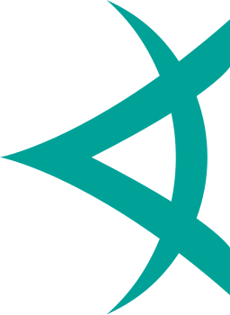</a> | **📂 檔名:** `applitools-icon.svg` ✨ **格式:** `Vector (SVG)` ⚖️ **大小:** `1.31KB` 📅 **更新:** `2026-03-02`  🚀 **jsDelivr Markdown:** `` 🔗 **直接連結 (Url):** <code>https://cdn.jsdelivr.net/gh/barry028/materials@main/images/iCons/Brands/applitools-icon.svg</code> 📥 [檢視原始檔](applitools-icon.svg) |
|  | **📂 檔名:** `applitools.svg` ✨ **格式:** `Vector (SVG)` ⚖️ **大小:** `7.11KB` 📅 **更新:** `2026-03-02`  🚀 **jsDelivr Markdown:** `` 🔗 **直接連結 (Url):** <code>https://cdn.jsdelivr.net/gh/barry028/materials@main/images/iCons/Brands/applitools.svg</code> 📥 [檢視原始檔](applitools.svg) |
| <a href="appsignal-icon.svg">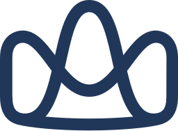</a> | **📂 檔名:** `appsignal-icon.svg` ✨ **格式:** `Vector (SVG)` ⚖️ **大小:** `2.27KB` 📅 **更新:** `2026-03-02`  🚀 **jsDelivr Markdown:** `` 🔗 **直接連結 (Url):** <code>https://cdn.jsdelivr.net/gh/barry028/materials@main/images/iCons/Brands/appsignal-icon.svg</code> 📥 [檢視原始檔](appsignal-icon.svg) |
|  | **📂 檔名:** `appsignal.svg` ✨ **格式:** `Vector (SVG)` ⚖️ **大小:** `13.25KB` 📅 **更新:** `2026-03-02`  🚀 **jsDelivr Markdown:** `` 🔗 **直接連結 (Url):** <code>https://cdn.jsdelivr.net/gh/barry028/materials@main/images/iCons/Brands/appsignal.svg</code> 📥 [檢視原始檔](appsignal.svg) |
|  | **📂 檔名:** `apptentive.svg` ✨ **格式:** `Vector (SVG)` ⚖️ **大小:** `10.04KB` 📅 **更新:** `2026-03-02`  🚀 **jsDelivr Markdown:** `` 🔗 **直接連結 (Url):** <code>https://cdn.jsdelivr.net/gh/barry028/materials@main/images/iCons/Brands/apptentive.svg</code> 📥 [檢視原始檔](apptentive.svg) |
|  | **📂 檔名:** `appveyor.svg` ✨ **格式:** `Vector (SVG)` ⚖️ **大小:** `1.34KB` 📅 **更新:** `2026-03-02`  🚀 **jsDelivr Markdown:** `` 🔗 **直接連結 (Url):** <code>https://cdn.jsdelivr.net/gh/barry028/materials@main/images/iCons/Brands/appveyor.svg</code> 📥 [檢視原始檔](appveyor.svg) |
|  | **📂 檔名:** `appwrite-icon.svg` ✨ **格式:** `Vector (SVG)` ⚖️ **大小:** `3.21KB` 📅 **更新:** `2026-03-02`  🚀 **jsDelivr Markdown:** `` 🔗 **直接連結 (Url):** <code>https://cdn.jsdelivr.net/gh/barry028/materials@main/images/iCons/Brands/appwrite-icon.svg</code> 📥 [檢視原始檔](appwrite-icon.svg) |
|  | **📂 檔名:** `appwrite.svg` ✨ **格式:** `Vector (SVG)` ⚖️ **大小:** `10.91KB` 📅 **更新:** `2026-03-02`  🚀 **jsDelivr Markdown:** `` 🔗 **直接連結 (Url):** <code>https://cdn.jsdelivr.net/gh/barry028/materials@main/images/iCons/Brands/appwrite.svg</code> 📥 [檢視原始檔](appwrite.svg) |
| <a href="arangodb-icon.svg">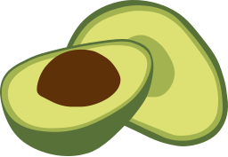</a> | **📂 檔名:** `arangodb-icon.svg` ✨ **格式:** `Vector (SVG)` ⚖️ **大小:** `7.96KB` 📅 **更新:** `2026-03-02`  🚀 **jsDelivr Markdown:** `` 🔗 **直接連結 (Url):** <code>https://cdn.jsdelivr.net/gh/barry028/materials@main/images/iCons/Brands/arangodb-icon.svg</code> 📥 [檢視原始檔](arangodb-icon.svg) |
|  | **📂 檔名:** `arangodb.svg` ✨ **格式:** `Vector (SVG)` ⚖️ **大小:** `17.83KB` 📅 **更新:** `2026-03-02`  🚀 **jsDelivr Markdown:** `` 🔗 **直接連結 (Url):** <code>https://cdn.jsdelivr.net/gh/barry028/materials@main/images/iCons/Brands/arangodb.svg</code> 📥 [檢視原始檔](arangodb.svg) |
| <a href="arc.svg">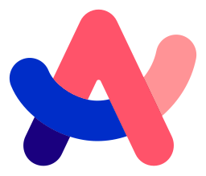</a> | **📂 檔名:** `arc.svg` ✨ **格式:** `Vector (SVG)` ⚖️ **大小:** `4.74KB` 📅 **更新:** `2026-03-02`  🚀 **jsDelivr Markdown:** `` 🔗 **直接連結 (Url):** <code>https://cdn.jsdelivr.net/gh/barry028/materials@main/images/iCons/Brands/arc.svg</code> 📥 [檢視原始檔](arc.svg) |
|  | **📂 檔名:** `architect-icon.svg` ✨ **格式:** `Vector (SVG)` ⚖️ **大小:** `2.11KB` 📅 **更新:** `2026-03-02`  🚀 **jsDelivr Markdown:** `` 🔗 **直接連結 (Url):** <code>https://cdn.jsdelivr.net/gh/barry028/materials@main/images/iCons/Brands/architect-icon.svg</code> 📥 [檢視原始檔](architect-icon.svg) |
|  | **📂 檔名:** `architect.svg` ✨ **格式:** `Vector (SVG)` ⚖️ **大小:** `10.28KB` 📅 **更新:** `2026-03-02`  🚀 **jsDelivr Markdown:** `` 🔗 **直接連結 (Url):** <code>https://cdn.jsdelivr.net/gh/barry028/materials@main/images/iCons/Brands/architect.svg</code> 📥 [檢視原始檔](architect.svg) |
| <a href="archlinux.svg">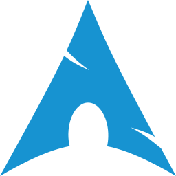</a> | **📂 檔名:** `archlinux.svg` ✨ **格式:** `Vector (SVG)` ⚖️ **大小:** `1.18KB` 📅 **更新:** `2026-03-02`  🚀 **jsDelivr Markdown:** `` 🔗 **直接連結 (Url):** <code>https://cdn.jsdelivr.net/gh/barry028/materials@main/images/iCons/Brands/archlinux.svg</code> 📥 [檢視原始檔](archlinux.svg) |
| <a href="arduino.svg">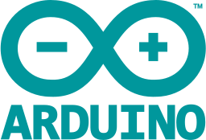</a> | **📂 檔名:** `arduino.svg` ✨ **格式:** `Vector (SVG)` ⚖️ **大小:** `6.83KB` 📅 **更新:** `2026-03-02`  🚀 **jsDelivr Markdown:** `` 🔗 **直接連結 (Url):** <code>https://cdn.jsdelivr.net/gh/barry028/materials@main/images/iCons/Brands/arduino.svg</code> 📥 [檢視原始檔](arduino.svg) |
|  | **📂 檔名:** `argo-icon.svg` ✨ **格式:** `Vector (SVG)` ⚖️ **大小:** `22.90KB` 📅 **更新:** `2026-03-02`  🚀 **jsDelivr Markdown:** `` 🔗 **直接連結 (Url):** <code>https://cdn.jsdelivr.net/gh/barry028/materials@main/images/iCons/Brands/argo-icon.svg</code> 📥 [檢視原始檔](argo-icon.svg) |
|  | **📂 檔名:** `argo.svg` ✨ **格式:** `Vector (SVG)` ⚖️ **大小:** `28.52KB` 📅 **更新:** `2026-03-02`  🚀 **jsDelivr Markdown:** `` 🔗 **直接連結 (Url):** <code>https://cdn.jsdelivr.net/gh/barry028/materials@main/images/iCons/Brands/argo.svg</code> 📥 [檢視原始檔](argo.svg) |
|  | **📂 檔名:** `arm.svg` ✨ **格式:** `Vector (SVG)` ⚖️ **大小:** `2.58KB` 📅 **更新:** `2026-03-02`  🚀 **jsDelivr Markdown:** `` 🔗 **直接連結 (Url):** <code>https://cdn.jsdelivr.net/gh/barry028/materials@main/images/iCons/Brands/arm.svg</code> 📥 [檢視原始檔](arm.svg) |
|  | **📂 檔名:** `armory-icon.svg` ✨ **格式:** `Vector (SVG)` ⚖️ **大小:** `3.25KB` 📅 **更新:** `2026-03-02`  🚀 **jsDelivr Markdown:** `` 🔗 **直接連結 (Url):** <code>https://cdn.jsdelivr.net/gh/barry028/materials@main/images/iCons/Brands/armory-icon.svg</code> 📥 [檢視原始檔](armory-icon.svg) |
|  | **📂 檔名:** `armory.svg` ✨ **格式:** `Vector (SVG)` ⚖️ **大小:** `14.84KB` 📅 **更新:** `2026-03-02`  🚀 **jsDelivr Markdown:** `` 🔗 **直接連結 (Url):** <code>https://cdn.jsdelivr.net/gh/barry028/materials@main/images/iCons/Brands/armory.svg</code> 📥 [檢視原始檔](armory.svg) |
|  | **📂 檔名:** `asana-icon.svg` ✨ **格式:** `Vector (SVG)` ⚖️ **大小:** `1.10KB` 📅 **更新:** `2026-03-02`  🚀 **jsDelivr Markdown:** `` 🔗 **直接連結 (Url):** <code>https://cdn.jsdelivr.net/gh/barry028/materials@main/images/iCons/Brands/asana-icon.svg</code> 📥 [檢視原始檔](asana-icon.svg) |
|  | **📂 檔名:** `asana.svg` ✨ **格式:** `Vector (SVG)` ⚖️ **大小:** `11.43KB` 📅 **更新:** `2026-03-02`  🚀 **jsDelivr Markdown:** `` 🔗 **直接連結 (Url):** <code>https://cdn.jsdelivr.net/gh/barry028/materials@main/images/iCons/Brands/asana.svg</code> 📥 [檢視原始檔](asana.svg) |
| <a href="asciidoctor.svg">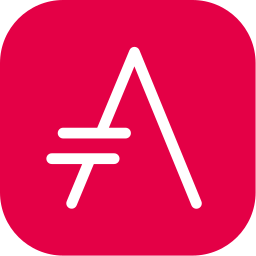</a> | **📂 檔名:** `asciidoctor.svg` ✨ **格式:** `Vector (SVG)` ⚖️ **大小:** `2.37KB` 📅 **更新:** `2026-03-02`  🚀 **jsDelivr Markdown:** `` 🔗 **直接連結 (Url):** <code>https://cdn.jsdelivr.net/gh/barry028/materials@main/images/iCons/Brands/asciidoctor.svg</code> 📥 [檢視原始檔](asciidoctor.svg) |
| <a href="assembla-icon.svg">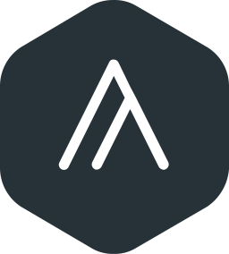</a> | **📂 檔名:** `assembla-icon.svg` ✨ **格式:** `Vector (SVG)` ⚖️ **大小:** `1.83KB` 📅 **更新:** `2026-03-02`  🚀 **jsDelivr Markdown:** `` 🔗 **直接連結 (Url):** <code>https://cdn.jsdelivr.net/gh/barry028/materials@main/images/iCons/Brands/assembla-icon.svg</code> 📥 [檢視原始檔](assembla-icon.svg) |
|  | **📂 檔名:** `assembla.svg` ✨ **格式:** `Vector (SVG)` ⚖️ **大小:** `14.24KB` 📅 **更新:** `2026-03-02`  🚀 **jsDelivr Markdown:** `` 🔗 **直接連結 (Url):** <code>https://cdn.jsdelivr.net/gh/barry028/materials@main/images/iCons/Brands/assembla.svg</code> 📥 [檢視原始檔](assembla.svg) |
| <a href="astro-icon.svg">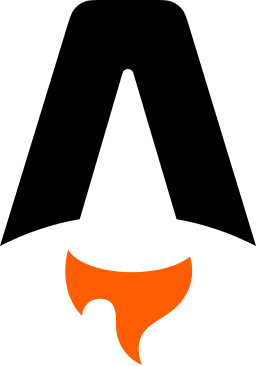</a> | **📂 檔名:** `astro-icon.svg` ✨ **格式:** `Vector (SVG)` ⚖️ **大小:** `1.92KB` 📅 **更新:** `2026-03-02`  🚀 **jsDelivr Markdown:** `` 🔗 **直接連結 (Url):** <code>https://cdn.jsdelivr.net/gh/barry028/materials@main/images/iCons/Brands/astro-icon.svg</code> 📥 [檢視原始檔](astro-icon.svg) |
|  | **📂 檔名:** `astro.svg` ✨ **格式:** `Vector (SVG)` ⚖️ **大小:** `5.58KB` 📅 **更新:** `2026-03-02`  🚀 **jsDelivr Markdown:** `` 🔗 **直接連結 (Url):** <code>https://cdn.jsdelivr.net/gh/barry028/materials@main/images/iCons/Brands/astro.svg</code> 📥 [檢視原始檔](astro.svg) |
|  | **📂 檔名:** `astronomer.svg` ✨ **格式:** `Vector (SVG)` ⚖️ **大小:** `7.75KB` 📅 **更新:** `2026-03-02`  🚀 **jsDelivr Markdown:** `` 🔗 **直接連結 (Url):** <code>https://cdn.jsdelivr.net/gh/barry028/materials@main/images/iCons/Brands/astronomer.svg</code> 📥 [檢視原始檔](astronomer.svg) |
| <a href="async-api-icon.svg">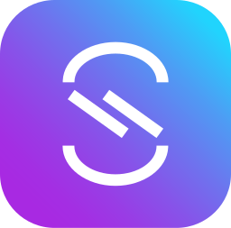</a> | **📂 檔名:** `async-api-icon.svg` ✨ **格式:** `Vector (SVG)` ⚖️ **大小:** `2.46KB` 📅 **更新:** `2026-03-02`  🚀 **jsDelivr Markdown:** `` 🔗 **直接連結 (Url):** <code>https://cdn.jsdelivr.net/gh/barry028/materials@main/images/iCons/Brands/async-api-icon.svg</code> 📥 [檢視原始檔](async-api-icon.svg) |
|  | **📂 檔名:** `async-api.svg` ✨ **格式:** `Vector (SVG)` ⚖️ **大小:** `9.42KB` 📅 **更新:** `2026-03-02`  🚀 **jsDelivr Markdown:** `` 🔗 **直接連結 (Url):** <code>https://cdn.jsdelivr.net/gh/barry028/materials@main/images/iCons/Brands/async-api.svg</code> 📥 [檢視原始檔](async-api.svg) |
| <a href="atlassian.svg">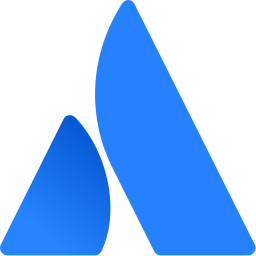</a> | **📂 檔名:** `atlassian.svg` ✨ **格式:** `Vector (SVG)` ⚖️ **大小:** `1.45KB` 📅 **更新:** `2026-03-02`  🚀 **jsDelivr Markdown:** `` 🔗 **直接連結 (Url):** <code>https://cdn.jsdelivr.net/gh/barry028/materials@main/images/iCons/Brands/atlassian.svg</code> 📥 [檢視原始檔](atlassian.svg) |
|  | **📂 檔名:** `atom-icon.svg` ✨ **格式:** `Vector (SVG)` ⚖️ **大小:** `11.49KB` 📅 **更新:** `2026-03-02`  🚀 **jsDelivr Markdown:** `` 🔗 **直接連結 (Url):** <code>https://cdn.jsdelivr.net/gh/barry028/materials@main/images/iCons/Brands/atom-icon.svg</code> 📥 [檢視原始檔](atom-icon.svg) |
|  | **📂 檔名:** `atom.svg` ✨ **格式:** `Vector (SVG)` ⚖️ **大小:** `14.14KB` 📅 **更新:** `2026-03-02`  🚀 **jsDelivr Markdown:** `` 🔗 **直接連結 (Url):** <code>https://cdn.jsdelivr.net/gh/barry028/materials@main/images/iCons/Brands/atom.svg</code> 📥 [檢視原始檔](atom.svg) |
| <a href="atomic-icon.svg">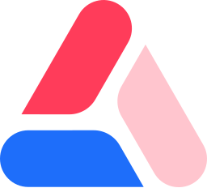</a> | **📂 檔名:** `atomic-icon.svg` ✨ **格式:** `Vector (SVG)` ⚖️ **大小:** `1.18KB` 📅 **更新:** `2026-03-02`  🚀 **jsDelivr Markdown:** `` 🔗 **直接連結 (Url):** <code>https://cdn.jsdelivr.net/gh/barry028/materials@main/images/iCons/Brands/atomic-icon.svg</code> 📥 [檢視原始檔](atomic-icon.svg) |
|  | **📂 檔名:** `atomic.svg` ✨ **格式:** `Vector (SVG)` ⚖️ **大小:** `5.25KB` 📅 **更新:** `2026-03-02`  🚀 **jsDelivr Markdown:** `` 🔗 **直接連結 (Url):** <code>https://cdn.jsdelivr.net/gh/barry028/materials@main/images/iCons/Brands/atomic.svg</code> 📥 [檢視原始檔](atomic.svg) |
|  | **📂 檔名:** `atomicojs-icon.svg` ✨ **格式:** `Vector (SVG)` ⚖️ **大小:** `4.93KB` 📅 **更新:** `2026-03-02`  🚀 **jsDelivr Markdown:** `` 🔗 **直接連結 (Url):** <code>https://cdn.jsdelivr.net/gh/barry028/materials@main/images/iCons/Brands/atomicojs-icon.svg</code> 📥 [檢視原始檔](atomicojs-icon.svg) |
|  | **📂 檔名:** `atomicojs.svg` ✨ **格式:** `Vector (SVG)` ⚖️ **大小:** `9.43KB` 📅 **更新:** `2026-03-02`  🚀 **jsDelivr Markdown:** `` 🔗 **直接連結 (Url):** <code>https://cdn.jsdelivr.net/gh/barry028/materials@main/images/iCons/Brands/atomicojs.svg</code> 📥 [檢視原始檔](atomicojs.svg) |
|  | **📂 檔名:** `aurelia.svg` ✨ **格式:** `Vector (SVG)` ⚖️ **大小:** `6.49KB` 📅 **更新:** `2026-03-02`  🚀 **jsDelivr Markdown:** `` 🔗 **直接連結 (Url):** <code>https://cdn.jsdelivr.net/gh/barry028/materials@main/images/iCons/Brands/aurelia.svg</code> 📥 [檢視原始檔](aurelia.svg) |
| <a href="aurora.svg">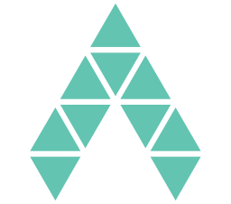</a> | **📂 檔名:** `aurora.svg` ✨ **格式:** `Vector (SVG)` ⚖️ **大小:** `3.21KB` 📅 **更新:** `2026-03-02`  🚀 **jsDelivr Markdown:** `` 🔗 **直接連結 (Url):** <code>https://cdn.jsdelivr.net/gh/barry028/materials@main/images/iCons/Brands/aurora.svg</code> 📥 [檢視原始檔](aurora.svg) |
|  | **📂 檔名:** `auth0-icon.svg` ✨ **格式:** `Vector (SVG)` ⚖️ **大小:** `877.00B` 📅 **更新:** `2026-03-02`  🚀 **jsDelivr Markdown:** `` 🔗 **直接連結 (Url):** <code>https://cdn.jsdelivr.net/gh/barry028/materials@main/images/iCons/Brands/auth0-icon.svg</code> 📥 [檢視原始檔](auth0-icon.svg) |
|  | **📂 檔名:** `auth0.svg` ✨ **格式:** `Vector (SVG)` ⚖️ **大小:** `4.18KB` 📅 **更新:** `2026-03-02`  🚀 **jsDelivr Markdown:** `` 🔗 **直接連結 (Url):** <code>https://cdn.jsdelivr.net/gh/barry028/materials@main/images/iCons/Brands/auth0.svg</code> 📥 [檢視原始檔](auth0.svg) |
|  | **📂 檔名:** `authy.svg` ✨ **格式:** `Vector (SVG)` ⚖️ **大小:** `2.34KB` 📅 **更新:** `2026-03-02`  🚀 **jsDelivr Markdown:** `` 🔗 **直接連結 (Url):** <code>https://cdn.jsdelivr.net/gh/barry028/materials@main/images/iCons/Brands/authy.svg</code> 📥 [檢視原始檔](authy.svg) |
|  | **📂 檔名:** `autoit.svg` ✨ **格式:** `Vector (SVG)` ⚖️ **大小:** `1.19KB` 📅 **更新:** `2026-03-02`  🚀 **jsDelivr Markdown:** `` 🔗 **直接連結 (Url):** <code>https://cdn.jsdelivr.net/gh/barry028/materials@main/images/iCons/Brands/autoit.svg</code> 📥 [檢視原始檔](autoit.svg) |
|  | **📂 檔名:** `autoprefixer.svg` ✨ **格式:** `Vector (SVG)` ⚖️ **大小:** `870.00B` 📅 **更新:** `2026-03-02`  🚀 **jsDelivr Markdown:** `` 🔗 **直接連結 (Url):** <code>https://cdn.jsdelivr.net/gh/barry028/materials@main/images/iCons/Brands/autoprefixer.svg</code> 📥 [檢視原始檔](autoprefixer.svg) |
| <a href="ava.svg">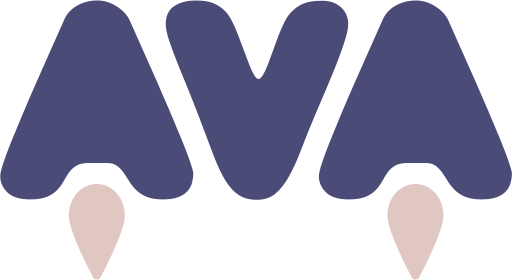</a> | **📂 檔名:** `ava.svg` ✨ **格式:** `Vector (SVG)` ⚖️ **大小:** `9.02KB` 📅 **更新:** `2026-03-02`  🚀 **jsDelivr Markdown:** `` 🔗 **直接連結 (Url):** <code>https://cdn.jsdelivr.net/gh/barry028/materials@main/images/iCons/Brands/ava.svg</code> 📥 [檢視原始檔](ava.svg) |
| <a href="awesome.svg">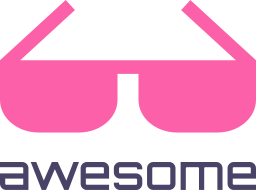</a> | **📂 檔名:** `awesome.svg` ✨ **格式:** `Vector (SVG)` ⚖️ **大小:** `8.40KB` 📅 **更新:** `2026-03-02`  🚀 **jsDelivr Markdown:** `` 🔗 **直接連結 (Url):** <code>https://cdn.jsdelivr.net/gh/barry028/materials@main/images/iCons/Brands/awesome.svg</code> 📥 [檢視原始檔](awesome.svg) |
|  | **📂 檔名:** `aws-amplify.svg` ✨ **格式:** `Vector (SVG)` ⚖️ **大小:** `1006.00B` 📅 **更新:** `2026-03-02`  🚀 **jsDelivr Markdown:** `` 🔗 **直接連結 (Url):** <code>https://cdn.jsdelivr.net/gh/barry028/materials@main/images/iCons/Brands/aws-amplify.svg</code> 📥 [檢視原始檔](aws-amplify.svg) |
| <a href="aws-api-gateway.svg">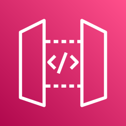</a> | **📂 檔名:** `aws-api-gateway.svg` ✨ **格式:** `Vector (SVG)` ⚖️ **大小:** `3.08KB` 📅 **更新:** `2026-03-02`  🚀 **jsDelivr Markdown:** `` 🔗 **直接連結 (Url):** <code>https://cdn.jsdelivr.net/gh/barry028/materials@main/images/iCons/Brands/aws-api-gateway.svg</code> 📥 [檢視原始檔](aws-api-gateway.svg) |
| <a href="aws-app-mesh.svg">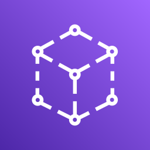</a> | **📂 檔名:** `aws-app-mesh.svg` ✨ **格式:** `Vector (SVG)` ⚖️ **大小:** `7.66KB` 📅 **更新:** `2026-03-02`  🚀 **jsDelivr Markdown:** `` 🔗 **直接連結 (Url):** <code>https://cdn.jsdelivr.net/gh/barry028/materials@main/images/iCons/Brands/aws-app-mesh.svg</code> 📥 [檢視原始檔](aws-app-mesh.svg) |
| <a href="aws-appflow.svg">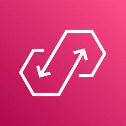</a> | **📂 檔名:** `aws-appflow.svg` ✨ **格式:** `Vector (SVG)` ⚖️ **大小:** `1.24KB` 📅 **更新:** `2026-03-02`  🚀 **jsDelivr Markdown:** `` 🔗 **直接連結 (Url):** <code>https://cdn.jsdelivr.net/gh/barry028/materials@main/images/iCons/Brands/aws-appflow.svg</code> 📥 [檢視原始檔](aws-appflow.svg) |
| <a href="aws-appsync.svg">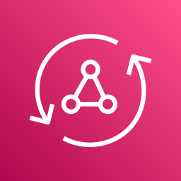</a> | **📂 檔名:** `aws-appsync.svg` ✨ **格式:** `Vector (SVG)` ⚖️ **大小:** `3.88KB` 📅 **更新:** `2026-03-02`  🚀 **jsDelivr Markdown:** `` 🔗 **直接連結 (Url):** <code>https://cdn.jsdelivr.net/gh/barry028/materials@main/images/iCons/Brands/aws-appsync.svg</code> 📥 [檢視原始檔](aws-appsync.svg) |
| <a href="aws-athena.svg">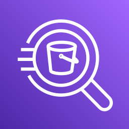</a> | **📂 檔名:** `aws-athena.svg` ✨ **格式:** `Vector (SVG)` ⚖️ **大小:** `5.16KB` 📅 **更新:** `2026-03-02`  🚀 **jsDelivr Markdown:** `` 🔗 **直接連結 (Url):** <code>https://cdn.jsdelivr.net/gh/barry028/materials@main/images/iCons/Brands/aws-athena.svg</code> 📥 [檢視原始檔](aws-athena.svg) |
|  | **📂 檔名:** `aws-aurora.svg` ✨ **格式:** `Vector (SVG)` ⚖️ **大小:** `3.98KB` 📅 **更新:** `2026-03-02`  🚀 **jsDelivr Markdown:** `` 🔗 **直接連結 (Url):** <code>https://cdn.jsdelivr.net/gh/barry028/materials@main/images/iCons/Brands/aws-aurora.svg</code> 📥 [檢視原始檔](aws-aurora.svg) |
|  | **📂 檔名:** `aws-backup.svg` ✨ **格式:** `Vector (SVG)` ⚖️ **大小:** `4.20KB` 📅 **更新:** `2026-03-02`  🚀 **jsDelivr Markdown:** `` 🔗 **直接連結 (Url):** <code>https://cdn.jsdelivr.net/gh/barry028/materials@main/images/iCons/Brands/aws-backup.svg</code> 📥 [檢視原始檔](aws-backup.svg) |
| <a href="aws-batch.svg">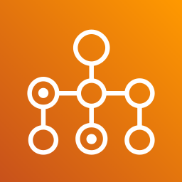</a> | **📂 檔名:** `aws-batch.svg` ✨ **格式:** `Vector (SVG)` ⚖️ **大小:** `4.58KB` 📅 **更新:** `2026-03-02`  🚀 **jsDelivr Markdown:** `` 🔗 **直接連結 (Url):** <code>https://cdn.jsdelivr.net/gh/barry028/materials@main/images/iCons/Brands/aws-batch.svg</code> 📥 [檢視原始檔](aws-batch.svg) |
|  | **📂 檔名:** `aws-certificate-manager.svg` ✨ **格式:** `Vector (SVG)` ⚖️ **大小:** `2.52KB` 📅 **更新:** `2026-03-02`  🚀 **jsDelivr Markdown:** `` 🔗 **直接連結 (Url):** <code>https://cdn.jsdelivr.net/gh/barry028/materials@main/images/iCons/Brands/aws-certificate-manager.svg</code> 📥 [檢視原始檔](aws-certificate-manager.svg) |
|  | **📂 檔名:** `aws-cloudformation.svg` ✨ **格式:** `Vector (SVG)` ⚖️ **大小:** `2.71KB` 📅 **更新:** `2026-03-02`  🚀 **jsDelivr Markdown:** `` 🔗 **直接連結 (Url):** <code>https://cdn.jsdelivr.net/gh/barry028/materials@main/images/iCons/Brands/aws-cloudformation.svg</code> 📥 [檢視原始檔](aws-cloudformation.svg) |
|  | **📂 檔名:** `aws-cloudfront.svg` ✨ **格式:** `Vector (SVG)` ⚖️ **大小:** `4.47KB` 📅 **更新:** `2026-03-02`  🚀 **jsDelivr Markdown:** `` 🔗 **直接連結 (Url):** <code>https://cdn.jsdelivr.net/gh/barry028/materials@main/images/iCons/Brands/aws-cloudfront.svg</code> 📥 [檢視原始檔](aws-cloudfront.svg) |
|  | **📂 檔名:** `aws-cloudsearch.svg` ✨ **格式:** `Vector (SVG)` ⚖️ **大小:** `3.63KB` 📅 **更新:** `2026-03-02`  🚀 **jsDelivr Markdown:** `` 🔗 **直接連結 (Url):** <code>https://cdn.jsdelivr.net/gh/barry028/materials@main/images/iCons/Brands/aws-cloudsearch.svg</code> 📥 [檢視原始檔](aws-cloudsearch.svg) |
|  | **📂 檔名:** `aws-cloudtrail.svg` ✨ **格式:** `Vector (SVG)` ⚖️ **大小:** `2.52KB` 📅 **更新:** `2026-03-02`  🚀 **jsDelivr Markdown:** `` 🔗 **直接連結 (Url):** <code>https://cdn.jsdelivr.net/gh/barry028/materials@main/images/iCons/Brands/aws-cloudtrail.svg</code> 📥 [檢視原始檔](aws-cloudtrail.svg) |
|  | **📂 檔名:** `aws-cloudwatch.svg` ✨ **格式:** `Vector (SVG)` ⚖️ **大小:** `4.23KB` 📅 **更新:** `2026-03-02`  🚀 **jsDelivr Markdown:** `` 🔗 **直接連結 (Url):** <code>https://cdn.jsdelivr.net/gh/barry028/materials@main/images/iCons/Brands/aws-cloudwatch.svg</code> 📥 [檢視原始檔](aws-cloudwatch.svg) |
| <a href="aws-codebuild.svg">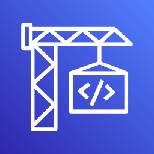</a> | **📂 檔名:** `aws-codebuild.svg` ✨ **格式:** `Vector (SVG)` ⚖️ **大小:** `3.37KB` 📅 **更新:** `2026-03-02`  🚀 **jsDelivr Markdown:** `` 🔗 **直接連結 (Url):** <code>https://cdn.jsdelivr.net/gh/barry028/materials@main/images/iCons/Brands/aws-codebuild.svg</code> 📥 [檢視原始檔](aws-codebuild.svg) |
|  | **📂 檔名:** `aws-codecommit.svg` ✨ **格式:** `Vector (SVG)` ⚖️ **大小:** `4.88KB` 📅 **更新:** `2026-03-02`  🚀 **jsDelivr Markdown:** `` 🔗 **直接連結 (Url):** <code>https://cdn.jsdelivr.net/gh/barry028/materials@main/images/iCons/Brands/aws-codecommit.svg</code> 📥 [檢視原始檔](aws-codecommit.svg) |
| <a href="aws-codedeploy.svg">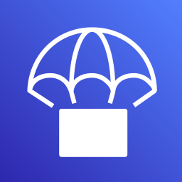</a> | **📂 檔名:** `aws-codedeploy.svg` ✨ **格式:** `Vector (SVG)` ⚖️ **大小:** `4.38KB` 📅 **更新:** `2026-03-02`  🚀 **jsDelivr Markdown:** `` 🔗 **直接連結 (Url):** <code>https://cdn.jsdelivr.net/gh/barry028/materials@main/images/iCons/Brands/aws-codedeploy.svg</code> 📥 [檢視原始檔](aws-codedeploy.svg) |
|  | **📂 檔名:** `aws-codepipeline.svg` ✨ **格式:** `Vector (SVG)` ⚖️ **大小:** `2.01KB` 📅 **更新:** `2026-03-02`  🚀 **jsDelivr Markdown:** `` 🔗 **直接連結 (Url):** <code>https://cdn.jsdelivr.net/gh/barry028/materials@main/images/iCons/Brands/aws-codepipeline.svg</code> 📥 [檢視原始檔](aws-codepipeline.svg) |
|  | **📂 檔名:** `aws-codestar.svg` ✨ **格式:** `Vector (SVG)` ⚖️ **大小:** `7.47KB` 📅 **更新:** `2026-03-02`  🚀 **jsDelivr Markdown:** `` 🔗 **直接連結 (Url):** <code>https://cdn.jsdelivr.net/gh/barry028/materials@main/images/iCons/Brands/aws-codestar.svg</code> 📥 [檢視原始檔](aws-codestar.svg) |
|  | **📂 檔名:** `aws-cognito.svg` ✨ **格式:** `Vector (SVG)` ⚖️ **大小:** `4.88KB` 📅 **更新:** `2026-03-02`  🚀 **jsDelivr Markdown:** `` 🔗 **直接連結 (Url):** <code>https://cdn.jsdelivr.net/gh/barry028/materials@main/images/iCons/Brands/aws-cognito.svg</code> 📥 [檢視原始檔](aws-cognito.svg) |
| <a href="aws-config.svg">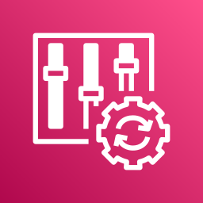</a> | **📂 檔名:** `aws-config.svg` ✨ **格式:** `Vector (SVG)` ⚖️ **大小:** `10.82KB` 📅 **更新:** `2026-03-02`  🚀 **jsDelivr Markdown:** `` 🔗 **直接連結 (Url):** <code>https://cdn.jsdelivr.net/gh/barry028/materials@main/images/iCons/Brands/aws-config.svg</code> 📥 [檢視原始檔](aws-config.svg) |
|  | **📂 檔名:** `aws-documentdb.svg` ✨ **格式:** `Vector (SVG)` ⚖️ **大小:** `4.71KB` 📅 **更新:** `2026-03-02`  🚀 **jsDelivr Markdown:** `` 🔗 **直接連結 (Url):** <code>https://cdn.jsdelivr.net/gh/barry028/materials@main/images/iCons/Brands/aws-documentdb.svg</code> 📥 [檢視原始檔](aws-documentdb.svg) |
|  | **📂 檔名:** `aws-dynamodb.svg` ✨ **格式:** `Vector (SVG)` ⚖️ **大小:** `5.96KB` 📅 **更新:** `2026-03-02`  🚀 **jsDelivr Markdown:** `` 🔗 **直接連結 (Url):** <code>https://cdn.jsdelivr.net/gh/barry028/materials@main/images/iCons/Brands/aws-dynamodb.svg</code> 📥 [檢視原始檔](aws-dynamodb.svg) |
|  | **📂 檔名:** `aws-ec2.svg` ✨ **格式:** `Vector (SVG)` ⚖️ **大小:** `2.67KB` 📅 **更新:** `2026-03-02`  🚀 **jsDelivr Markdown:** `` 🔗 **直接連結 (Url):** <code>https://cdn.jsdelivr.net/gh/barry028/materials@main/images/iCons/Brands/aws-ec2.svg</code> 📥 [檢視原始檔](aws-ec2.svg) |
| <a href="aws-ecs.svg">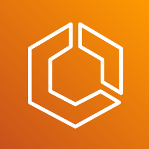</a> | **📂 檔名:** `aws-ecs.svg` ✨ **格式:** `Vector (SVG)` ⚖️ **大小:** `2.53KB` 📅 **更新:** `2026-03-02`  🚀 **jsDelivr Markdown:** `` 🔗 **直接連結 (Url):** <code>https://cdn.jsdelivr.net/gh/barry028/materials@main/images/iCons/Brands/aws-ecs.svg</code> 📥 [檢視原始檔](aws-ecs.svg) |
| <a href="aws-eks.svg">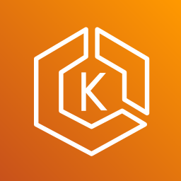</a> | **📂 檔名:** `aws-eks.svg` ✨ **格式:** `Vector (SVG)` ⚖️ **大小:** `2.76KB` 📅 **更新:** `2026-03-02`  🚀 **jsDelivr Markdown:** `` 🔗 **直接連結 (Url):** <code>https://cdn.jsdelivr.net/gh/barry028/materials@main/images/iCons/Brands/aws-eks.svg</code> 📥 [檢視原始檔](aws-eks.svg) |
|  | **📂 檔名:** `aws-elastic-beanstalk.svg` ✨ **格式:** `Vector (SVG)` ⚖️ **大小:** `4.45KB` 📅 **更新:** `2026-03-02`  🚀 **jsDelivr Markdown:** `` 🔗 **直接連結 (Url):** <code>https://cdn.jsdelivr.net/gh/barry028/materials@main/images/iCons/Brands/aws-elastic-beanstalk.svg</code> 📥 [檢視原始檔](aws-elastic-beanstalk.svg) |
|  | **📂 檔名:** `aws-elasticache.svg` ✨ **格式:** `Vector (SVG)` ⚖️ **大小:** `5.40KB` 📅 **更新:** `2026-03-02`  🚀 **jsDelivr Markdown:** `` 🔗 **直接連結 (Url):** <code>https://cdn.jsdelivr.net/gh/barry028/materials@main/images/iCons/Brands/aws-elasticache.svg</code> 📥 [檢視原始檔](aws-elasticache.svg) |
|  | **📂 檔名:** `aws-elb.svg` ✨ **格式:** `Vector (SVG)` ⚖️ **大小:** `2.26KB` 📅 **更新:** `2026-03-02`  🚀 **jsDelivr Markdown:** `` 🔗 **直接連結 (Url):** <code>https://cdn.jsdelivr.net/gh/barry028/materials@main/images/iCons/Brands/aws-elb.svg</code> 📥 [檢視原始檔](aws-elb.svg) |
|  | **📂 檔名:** `aws-eventbridge.svg` ✨ **格式:** `Vector (SVG)` ⚖️ **大小:** `4.24KB` 📅 **更新:** `2026-03-02`  🚀 **jsDelivr Markdown:** `` 🔗 **直接連結 (Url):** <code>https://cdn.jsdelivr.net/gh/barry028/materials@main/images/iCons/Brands/aws-eventbridge.svg</code> 📥 [檢視原始檔](aws-eventbridge.svg) |
| <a href="aws-fargate.svg">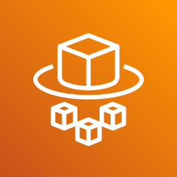</a> | **📂 檔名:** `aws-fargate.svg` ✨ **格式:** `Vector (SVG)` ⚖️ **大小:** `3.72KB` 📅 **更新:** `2026-03-02`  🚀 **jsDelivr Markdown:** `` 🔗 **直接連結 (Url):** <code>https://cdn.jsdelivr.net/gh/barry028/materials@main/images/iCons/Brands/aws-fargate.svg</code> 📥 [檢視原始檔](aws-fargate.svg) |
| <a href="aws-glacier.svg">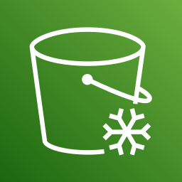</a> | **📂 檔名:** `aws-glacier.svg` ✨ **格式:** `Vector (SVG)` ⚖️ **大小:** `3.78KB` 📅 **更新:** `2026-03-02`  🚀 **jsDelivr Markdown:** `` 🔗 **直接連結 (Url):** <code>https://cdn.jsdelivr.net/gh/barry028/materials@main/images/iCons/Brands/aws-glacier.svg</code> 📥 [檢視原始檔](aws-glacier.svg) |
| <a href="aws-glue.svg">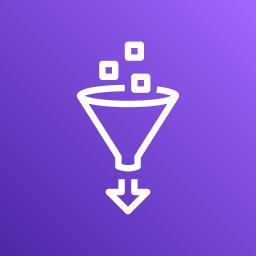</a> | **📂 檔名:** `aws-glue.svg` ✨ **格式:** `Vector (SVG)` ⚖️ **大小:** `3.07KB` 📅 **更新:** `2026-03-02`  🚀 **jsDelivr Markdown:** `` 🔗 **直接連結 (Url):** <code>https://cdn.jsdelivr.net/gh/barry028/materials@main/images/iCons/Brands/aws-glue.svg</code> 📥 [檢視原始檔](aws-glue.svg) |
|  | **📂 檔名:** `aws-iam.svg` ✨ **格式:** `Vector (SVG)` ⚖️ **大小:** `2.52KB` 📅 **更新:** `2026-03-02`  🚀 **jsDelivr Markdown:** `` 🔗 **直接連結 (Url):** <code>https://cdn.jsdelivr.net/gh/barry028/materials@main/images/iCons/Brands/aws-iam.svg</code> 📥 [檢視原始檔](aws-iam.svg) |
| <a href="aws-keyspaces.svg">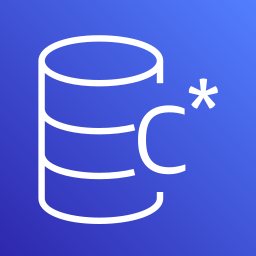</a> | **📂 檔名:** `aws-keyspaces.svg` ✨ **格式:** `Vector (SVG)` ⚖️ **大小:** `3.07KB` 📅 **更新:** `2026-03-02`  🚀 **jsDelivr Markdown:** `` 🔗 **直接連結 (Url):** <code>https://cdn.jsdelivr.net/gh/barry028/materials@main/images/iCons/Brands/aws-keyspaces.svg</code> 📥 [檢視原始檔](aws-keyspaces.svg) |
|  | **📂 檔名:** `aws-kinesis.svg` ✨ **格式:** `Vector (SVG)` ⚖️ **大小:** `1.35KB` 📅 **更新:** `2026-03-02`  🚀 **jsDelivr Markdown:** `` 🔗 **直接連結 (Url):** <code>https://cdn.jsdelivr.net/gh/barry028/materials@main/images/iCons/Brands/aws-kinesis.svg</code> 📥 [檢視原始檔](aws-kinesis.svg) |
|  | **📂 檔名:** `aws-kms.svg` ✨ **格式:** `Vector (SVG)` ⚖️ **大小:** `5.06KB` 📅 **更新:** `2026-03-02`  🚀 **jsDelivr Markdown:** `` 🔗 **直接連結 (Url):** <code>https://cdn.jsdelivr.net/gh/barry028/materials@main/images/iCons/Brands/aws-kms.svg</code> 📥 [檢視原始檔](aws-kms.svg) |
| <a href="aws-lake-formation.svg">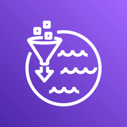</a> | **📂 檔名:** `aws-lake-formation.svg` ✨ **格式:** `Vector (SVG)` ⚖️ **大小:** `7.04KB` 📅 **更新:** `2026-03-02`  🚀 **jsDelivr Markdown:** `` 🔗 **直接連結 (Url):** <code>https://cdn.jsdelivr.net/gh/barry028/materials@main/images/iCons/Brands/aws-lake-formation.svg</code> 📥 [檢視原始檔](aws-lake-formation.svg) |
| <a href="aws-lambda.svg">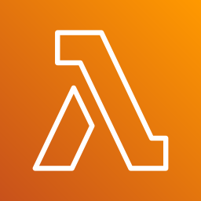</a> | **📂 檔名:** `aws-lambda.svg` ✨ **格式:** `Vector (SVG)` ⚖️ **大小:** `1.99KB` 📅 **更新:** `2026-03-02`  🚀 **jsDelivr Markdown:** `` 🔗 **直接連結 (Url):** <code>https://cdn.jsdelivr.net/gh/barry028/materials@main/images/iCons/Brands/aws-lambda.svg</code> 📥 [檢視原始檔](aws-lambda.svg) |
| <a href="aws-lightsail.svg">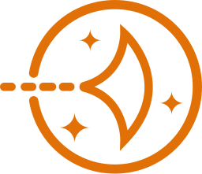</a> | **📂 檔名:** `aws-lightsail.svg` ✨ **格式:** `Vector (SVG)` ⚖️ **大小:** `4.48KB` 📅 **更新:** `2026-03-02`  🚀 **jsDelivr Markdown:** `` 🔗 **直接連結 (Url):** <code>https://cdn.jsdelivr.net/gh/barry028/materials@main/images/iCons/Brands/aws-lightsail.svg</code> 📥 [檢視原始檔](aws-lightsail.svg) |
| <a href="aws-mq.svg">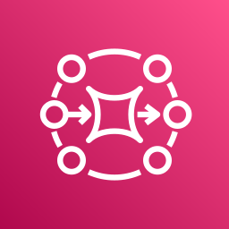</a> | **📂 檔名:** `aws-mq.svg` ✨ **格式:** `Vector (SVG)` ⚖️ **大小:** `5.63KB` 📅 **更新:** `2026-03-02`  🚀 **jsDelivr Markdown:** `` 🔗 **直接連結 (Url):** <code>https://cdn.jsdelivr.net/gh/barry028/materials@main/images/iCons/Brands/aws-mq.svg</code> 📥 [檢視原始檔](aws-mq.svg) |
| <a href="aws-msk.svg">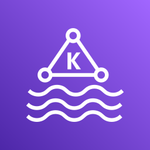</a> | **📂 檔名:** `aws-msk.svg` ✨ **格式:** `Vector (SVG)` ⚖️ **大小:** `6.21KB` 📅 **更新:** `2026-03-02`  🚀 **jsDelivr Markdown:** `` 🔗 **直接連結 (Url):** <code>https://cdn.jsdelivr.net/gh/barry028/materials@main/images/iCons/Brands/aws-msk.svg</code> 📥 [檢視原始檔](aws-msk.svg) |
|  | **📂 檔名:** `aws-neptune.svg` ✨ **格式:** `Vector (SVG)` ⚖️ **大小:** `4.41KB` 📅 **更新:** `2026-03-02`  🚀 **jsDelivr Markdown:** `` 🔗 **直接連結 (Url):** <code>https://cdn.jsdelivr.net/gh/barry028/materials@main/images/iCons/Brands/aws-neptune.svg</code> 📥 [檢視原始檔](aws-neptune.svg) |
|  | **📂 檔名:** `aws-open-search.svg` ✨ **格式:** `Vector (SVG)` ⚖️ **大小:** `3.24KB` 📅 **更新:** `2026-03-02`  🚀 **jsDelivr Markdown:** `` 🔗 **直接連結 (Url):** <code>https://cdn.jsdelivr.net/gh/barry028/materials@main/images/iCons/Brands/aws-open-search.svg</code> 📥 [檢視原始檔](aws-open-search.svg) |
| <a href="aws-opsworks.svg">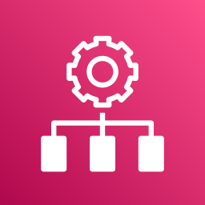</a> | **📂 檔名:** `aws-opsworks.svg` ✨ **格式:** `Vector (SVG)` ⚖️ **大小:** `6.11KB` 📅 **更新:** `2026-03-02`  🚀 **jsDelivr Markdown:** `` 🔗 **直接連結 (Url):** <code>https://cdn.jsdelivr.net/gh/barry028/materials@main/images/iCons/Brands/aws-opsworks.svg</code> 📥 [檢視原始檔](aws-opsworks.svg) |
| <a href="aws-quicksight.svg">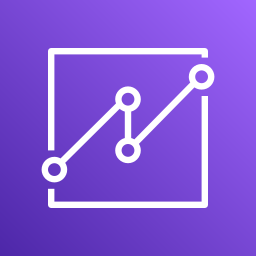</a> | **📂 檔名:** `aws-quicksight.svg` ✨ **格式:** `Vector (SVG)` ⚖️ **大小:** `2.89KB` 📅 **更新:** `2026-03-02`  🚀 **jsDelivr Markdown:** `` 🔗 **直接連結 (Url):** <code>https://cdn.jsdelivr.net/gh/barry028/materials@main/images/iCons/Brands/aws-quicksight.svg</code> 📥 [檢視原始檔](aws-quicksight.svg) |
|  | **📂 檔名:** `aws-rds.svg` ✨ **格式:** `Vector (SVG)` ⚖️ **大小:** `3.13KB` 📅 **更新:** `2026-03-02`  🚀 **jsDelivr Markdown:** `` 🔗 **直接連結 (Url):** <code>https://cdn.jsdelivr.net/gh/barry028/materials@main/images/iCons/Brands/aws-rds.svg</code> 📥 [檢視原始檔](aws-rds.svg) |
|  | **📂 檔名:** `aws-redshift.svg` ✨ **格式:** `Vector (SVG)` ⚖️ **大小:** `4.24KB` 📅 **更新:** `2026-03-02`  🚀 **jsDelivr Markdown:** `` 🔗 **直接連結 (Url):** <code>https://cdn.jsdelivr.net/gh/barry028/materials@main/images/iCons/Brands/aws-redshift.svg</code> 📥 [檢視原始檔](aws-redshift.svg) |
|  | **📂 檔名:** `aws-route53.svg` ✨ **格式:** `Vector (SVG)` ⚖️ **大小:** `7.09KB` 📅 **更新:** `2026-03-02`  🚀 **jsDelivr Markdown:** `` 🔗 **直接連結 (Url):** <code>https://cdn.jsdelivr.net/gh/barry028/materials@main/images/iCons/Brands/aws-route53.svg</code> 📥 [檢視原始檔](aws-route53.svg) |
|  | **📂 檔名:** `aws-s3.svg` ✨ **格式:** `Vector (SVG)` ⚖️ **大小:** `2.55KB` 📅 **更新:** `2026-03-02`  🚀 **jsDelivr Markdown:** `` 🔗 **直接連結 (Url):** <code>https://cdn.jsdelivr.net/gh/barry028/materials@main/images/iCons/Brands/aws-s3.svg</code> 📥 [檢視原始檔](aws-s3.svg) |
|  | **📂 檔名:** `aws-secrets-manager.svg` ✨ **格式:** `Vector (SVG)` ⚖️ **大小:** `3.63KB` 📅 **更新:** `2026-03-02`  🚀 **jsDelivr Markdown:** `` 🔗 **直接連結 (Url):** <code>https://cdn.jsdelivr.net/gh/barry028/materials@main/images/iCons/Brands/aws-secrets-manager.svg</code> 📥 [檢視原始檔](aws-secrets-manager.svg) |
|  | **📂 檔名:** `aws-ses.svg` ✨ **格式:** `Vector (SVG)` ⚖️ **大小:** `3.49KB` 📅 **更新:** `2026-03-02`  🚀 **jsDelivr Markdown:** `` 🔗 **直接連結 (Url):** <code>https://cdn.jsdelivr.net/gh/barry028/materials@main/images/iCons/Brands/aws-ses.svg</code> 📥 [檢視原始檔](aws-ses.svg) |
|  | **📂 檔名:** `aws-shield.svg` ✨ **格式:** `Vector (SVG)` ⚖️ **大小:** `3.13KB` 📅 **更新:** `2026-03-02`  🚀 **jsDelivr Markdown:** `` 🔗 **直接連結 (Url):** <code>https://cdn.jsdelivr.net/gh/barry028/materials@main/images/iCons/Brands/aws-shield.svg</code> 📥 [檢視原始檔](aws-shield.svg) |
|  | **📂 檔名:** `aws-sns.svg` ✨ **格式:** `Vector (SVG)` ⚖️ **大小:** `3.77KB` 📅 **更新:** `2026-03-02`  🚀 **jsDelivr Markdown:** `` 🔗 **直接連結 (Url):** <code>https://cdn.jsdelivr.net/gh/barry028/materials@main/images/iCons/Brands/aws-sns.svg</code> 📥 [檢視原始檔](aws-sns.svg) |
| <a href="aws-sqs.svg">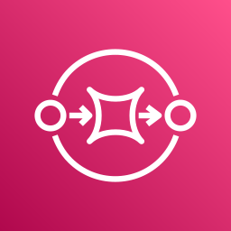</a> | **📂 檔名:** `aws-sqs.svg` ✨ **格式:** `Vector (SVG)` ⚖️ **大小:** `5.95KB` 📅 **更新:** `2026-03-02`  🚀 **jsDelivr Markdown:** `` 🔗 **直接連結 (Url):** <code>https://cdn.jsdelivr.net/gh/barry028/materials@main/images/iCons/Brands/aws-sqs.svg</code> 📥 [檢視原始檔](aws-sqs.svg) |
| <a href="aws-step-functions.svg">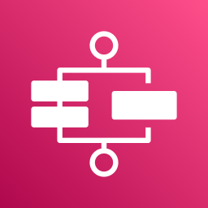</a> | **📂 檔名:** `aws-step-functions.svg` ✨ **格式:** `Vector (SVG)` ⚖️ **大小:** `2.63KB` 📅 **更新:** `2026-03-02`  🚀 **jsDelivr Markdown:** `` 🔗 **直接連結 (Url):** <code>https://cdn.jsdelivr.net/gh/barry028/materials@main/images/iCons/Brands/aws-step-functions.svg</code> 📥 [檢視原始檔](aws-step-functions.svg) |
|  | **📂 檔名:** `aws-systems-manager.svg` ✨ **格式:** `Vector (SVG)` ⚖️ **大小:** `7.58KB` 📅 **更新:** `2026-03-02`  🚀 **jsDelivr Markdown:** `` 🔗 **直接連結 (Url):** <code>https://cdn.jsdelivr.net/gh/barry028/materials@main/images/iCons/Brands/aws-systems-manager.svg</code> 📥 [檢視原始檔](aws-systems-manager.svg) |
| <a href="aws-timestream.svg">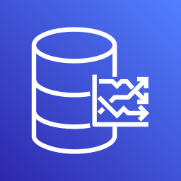</a> | **📂 檔名:** `aws-timestream.svg` ✨ **格式:** `Vector (SVG)` ⚖️ **大小:** `3.15KB` 📅 **更新:** `2026-03-02`  🚀 **jsDelivr Markdown:** `` 🔗 **直接連結 (Url):** <code>https://cdn.jsdelivr.net/gh/barry028/materials@main/images/iCons/Brands/aws-timestream.svg</code> 📥 [檢視原始檔](aws-timestream.svg) |
|  | **📂 檔名:** `aws-vpc.svg` ✨ **格式:** `Vector (SVG)` ⚖️ **大小:** `3.72KB` 📅 **更新:** `2026-03-02`  🚀 **jsDelivr Markdown:** `` 🔗 **直接連結 (Url):** <code>https://cdn.jsdelivr.net/gh/barry028/materials@main/images/iCons/Brands/aws-vpc.svg</code> 📥 [檢視原始檔](aws-vpc.svg) |
| <a href="aws-waf.svg">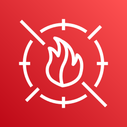</a> | **📂 檔名:** `aws-waf.svg` ✨ **格式:** `Vector (SVG)` ⚖️ **大小:** `4.46KB` 📅 **更新:** `2026-03-02`  🚀 **jsDelivr Markdown:** `` 🔗 **直接連結 (Url):** <code>https://cdn.jsdelivr.net/gh/barry028/materials@main/images/iCons/Brands/aws-waf.svg</code> 📥 [檢視原始檔](aws-waf.svg) |
|  | **📂 檔名:** `aws-xray.svg` ✨ **格式:** `Vector (SVG)` ⚖️ **大小:** `2.92KB` 📅 **更新:** `2026-03-02`  🚀 **jsDelivr Markdown:** `` 🔗 **直接連結 (Url):** <code>https://cdn.jsdelivr.net/gh/barry028/materials@main/images/iCons/Brands/aws-xray.svg</code> 📥 [檢視原始檔](aws-xray.svg) |
|  | **📂 檔名:** `aws.svg` ✨ **格式:** `Vector (SVG)` ⚖️ **大小:** `8.04KB` 📅 **更新:** `2026-03-02`  🚀 **jsDelivr Markdown:** `` 🔗 **直接連結 (Url):** <code>https://cdn.jsdelivr.net/gh/barry028/materials@main/images/iCons/Brands/aws.svg</code> 📥 [檢視原始檔](aws.svg) |
|  | **📂 檔名:** `axios.svg` ✨ **格式:** `Vector (SVG)` ⚖️ **大小:** `6.05KB` 📅 **更新:** `2026-03-02`  🚀 **jsDelivr Markdown:** `` 🔗 **直接連結 (Url):** <code>https://cdn.jsdelivr.net/gh/barry028/materials@main/images/iCons/Brands/axios.svg</code> 📥 [檢視原始檔](axios.svg) |
| <a href="babel.svg">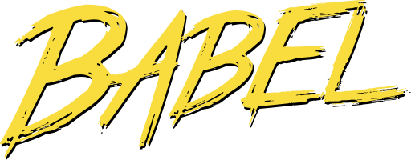</a> | **📂 檔名:** `babel.svg` ✨ **格式:** `Vector (SVG)` ⚖️ **大小:** `68.71KB` 📅 **更新:** `2026-03-02`  🚀 **jsDelivr Markdown:** `` 🔗 **直接連結 (Url):** <code>https://cdn.jsdelivr.net/gh/barry028/materials@main/images/iCons/Brands/babel.svg</code> 📥 [檢視原始檔](babel.svg) |
|  | **📂 檔名:** `backbone-icon.svg` ✨ **格式:** `Vector (SVG)` ⚖️ **大小:** `1.16KB` 📅 **更新:** `2026-03-02`  🚀 **jsDelivr Markdown:** `` 🔗 **直接連結 (Url):** <code>https://cdn.jsdelivr.net/gh/barry028/materials@main/images/iCons/Brands/backbone-icon.svg</code> 📥 [檢視原始檔](backbone-icon.svg) |
|  | **📂 檔名:** `backbone.svg` ✨ **格式:** `Vector (SVG)` ⚖️ **大小:** `10.19KB` 📅 **更新:** `2026-03-02`  🚀 **jsDelivr Markdown:** `` 🔗 **直接連結 (Url):** <code>https://cdn.jsdelivr.net/gh/barry028/materials@main/images/iCons/Brands/backbone.svg</code> 📥 [檢視原始檔](backbone.svg) |
| <a href="backerkit.svg">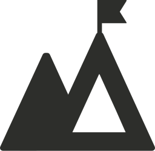</a> | **📂 檔名:** `backerkit.svg` ✨ **格式:** `Vector (SVG)` ⚖️ **大小:** `1.39KB` 📅 **更新:** `2026-03-02`  🚀 **jsDelivr Markdown:** `` 🔗 **直接連結 (Url):** <code>https://cdn.jsdelivr.net/gh/barry028/materials@main/images/iCons/Brands/backerkit.svg</code> 📥 [檢視原始檔](backerkit.svg) |
|  | **📂 檔名:** `baker-street.svg` ✨ **格式:** `Vector (SVG)` ⚖️ **大小:** `2.37KB` 📅 **更新:** `2026-03-02`  🚀 **jsDelivr Markdown:** `` 🔗 **直接連結 (Url):** <code>https://cdn.jsdelivr.net/gh/barry028/materials@main/images/iCons/Brands/baker-street.svg</code> 📥 [檢視原始檔](baker-street.svg) |
| <a href="balena.svg">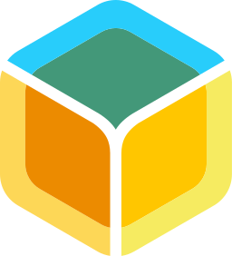</a> | **📂 檔名:** `balena.svg` ✨ **格式:** `Vector (SVG)` ⚖️ **大小:** `3.25KB` 📅 **更新:** `2026-03-02`  🚀 **jsDelivr Markdown:** `` 🔗 **直接連結 (Url):** <code>https://cdn.jsdelivr.net/gh/barry028/materials@main/images/iCons/Brands/balena.svg</code> 📥 [檢視原始檔](balena.svg) |
|  | **📂 檔名:** `bamboo.svg` ✨ **格式:** `Vector (SVG)` ⚖️ **大小:** `2.20KB` 📅 **更新:** `2026-03-02`  🚀 **jsDelivr Markdown:** `` 🔗 **直接連結 (Url):** <code>https://cdn.jsdelivr.net/gh/barry028/materials@main/images/iCons/Brands/bamboo.svg</code> 📥 [檢視原始檔](bamboo.svg) |
|  | **📂 檔名:** `basecamp-icon.svg` ✨ **格式:** `Vector (SVG)` ⚖️ **大小:** `3.46KB` 📅 **更新:** `2026-03-02`  🚀 **jsDelivr Markdown:** `` 🔗 **直接連結 (Url):** <code>https://cdn.jsdelivr.net/gh/barry028/materials@main/images/iCons/Brands/basecamp-icon.svg</code> 📥 [檢視原始檔](basecamp-icon.svg) |
|  | **📂 檔名:** `basecamp.svg` ✨ **格式:** `Vector (SVG)` ⚖️ **大小:** `10.42KB` 📅 **更新:** `2026-03-02`  🚀 **jsDelivr Markdown:** `` 🔗 **直接連結 (Url):** <code>https://cdn.jsdelivr.net/gh/barry028/materials@main/images/iCons/Brands/basecamp.svg</code> 📥 [檢視原始檔](basecamp.svg) |
|  | **📂 檔名:** `basekit.svg` ✨ **格式:** `Vector (SVG)` ⚖️ **大小:** `1.30KB` 📅 **更新:** `2026-03-02`  🚀 **jsDelivr Markdown:** `` 🔗 **直接連結 (Url):** <code>https://cdn.jsdelivr.net/gh/barry028/materials@main/images/iCons/Brands/basekit.svg</code> 📥 [檢視原始檔](basekit.svg) |
|  | **📂 檔名:** `baseline.svg` ✨ **格式:** `Vector (SVG)` ⚖️ **大小:** `974.00B` 📅 **更新:** `2026-03-02`  🚀 **jsDelivr Markdown:** `` 🔗 **直接連結 (Url):** <code>https://cdn.jsdelivr.net/gh/barry028/materials@main/images/iCons/Brands/baseline.svg</code> 📥 [檢視原始檔](baseline.svg) |
|  | **📂 檔名:** `bash-icon.svg` ✨ **格式:** `Vector (SVG)` ⚖️ **大小:** `4.37KB` 📅 **更新:** `2026-03-02`  🚀 **jsDelivr Markdown:** `` 🔗 **直接連結 (Url):** <code>https://cdn.jsdelivr.net/gh/barry028/materials@main/images/iCons/Brands/bash-icon.svg</code> 📥 [檢視原始檔](bash-icon.svg) |
| <a href="bash.svg">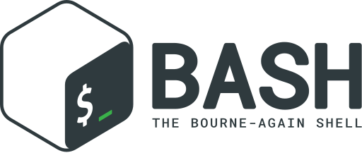</a> | **📂 檔名:** `bash.svg` ✨ **格式:** `Vector (SVG)` ⚖️ **大小:** `28.08KB` 📅 **更新:** `2026-03-02`  🚀 **jsDelivr Markdown:** `` 🔗 **直接連結 (Url):** <code>https://cdn.jsdelivr.net/gh/barry028/materials@main/images/iCons/Brands/bash.svg</code> 📥 [檢視原始檔](bash.svg) |
|  | **📂 檔名:** `batch.svg` ✨ **格式:** `Vector (SVG)` ⚖️ **大小:** `15.13KB` 📅 **更新:** `2026-03-02`  🚀 **jsDelivr Markdown:** `` 🔗 **直接連結 (Url):** <code>https://cdn.jsdelivr.net/gh/barry028/materials@main/images/iCons/Brands/batch.svg</code> 📥 [檢視原始檔](batch.svg) |
|  | **📂 檔名:** `beats.svg` ✨ **格式:** `Vector (SVG)` ⚖️ **大小:** `1.14KB` 📅 **更新:** `2026-03-02`  🚀 **jsDelivr Markdown:** `` 🔗 **直接連結 (Url):** <code>https://cdn.jsdelivr.net/gh/barry028/materials@main/images/iCons/Brands/beats.svg</code> 📥 [檢視原始檔](beats.svg) |
|  | **📂 檔名:** `behance.svg` ✨ **格式:** `Vector (SVG)` ⚖️ **大小:** `12.51KB` 📅 **更新:** `2026-03-02`  🚀 **jsDelivr Markdown:** `` 🔗 **直接連結 (Url):** <code>https://cdn.jsdelivr.net/gh/barry028/materials@main/images/iCons/Brands/behance.svg</code> 📥 [檢視原始檔](behance.svg) |
|  | **📂 檔名:** `bem-2.svg` ✨ **格式:** `Vector (SVG)` ⚖️ **大小:** `1.03KB` 📅 **更新:** `2026-03-02`  🚀 **jsDelivr Markdown:** `` 🔗 **直接連結 (Url):** <code>https://cdn.jsdelivr.net/gh/barry028/materials@main/images/iCons/Brands/bem-2.svg</code> 📥 [檢視原始檔](bem-2.svg) |
|  | **📂 檔名:** `bem.svg` ✨ **格式:** `Vector (SVG)` ⚖️ **大小:** `1.99KB` 📅 **更新:** `2026-03-02`  🚀 **jsDelivr Markdown:** `` 🔗 **直接連結 (Url):** <code>https://cdn.jsdelivr.net/gh/barry028/materials@main/images/iCons/Brands/bem.svg</code> 📥 [檢視原始檔](bem.svg) |
|  | **📂 檔名:** `bigpanda.svg` ✨ **格式:** `Vector (SVG)` ⚖️ **大小:** `12.26KB` 📅 **更新:** `2026-03-02`  🚀 **jsDelivr Markdown:** `` 🔗 **直接連結 (Url):** <code>https://cdn.jsdelivr.net/gh/barry028/materials@main/images/iCons/Brands/bigpanda.svg</code> 📥 [檢視原始檔](bigpanda.svg) |
|  | **📂 檔名:** `bing.svg` ✨ **格式:** `Vector (SVG)` ⚖️ **大小:** `7.04KB` 📅 **更新:** `2026-03-02`  🚀 **jsDelivr Markdown:** `` 🔗 **直接連結 (Url):** <code>https://cdn.jsdelivr.net/gh/barry028/materials@main/images/iCons/Brands/bing.svg</code> 📥 [檢視原始檔](bing.svg) |
|  | **📂 檔名:** `bitbar.svg` ✨ **格式:** `Vector (SVG)` ⚖️ **大小:** `2.54KB` 📅 **更新:** `2026-03-02`  🚀 **jsDelivr Markdown:** `` 🔗 **直接連結 (Url):** <code>https://cdn.jsdelivr.net/gh/barry028/materials@main/images/iCons/Brands/bitbar.svg</code> 📥 [檢視原始檔](bitbar.svg) |
|  | **📂 檔名:** `bitbucket.svg` ✨ **格式:** `Vector (SVG)` ⚖️ **大小:** `1.66KB` 📅 **更新:** `2026-03-02`  🚀 **jsDelivr Markdown:** `` 🔗 **直接連結 (Url):** <code>https://cdn.jsdelivr.net/gh/barry028/materials@main/images/iCons/Brands/bitbucket.svg</code> 📥 [檢視原始檔](bitbucket.svg) |
|  | **📂 檔名:** `bitcoin.svg` ✨ **格式:** `Vector (SVG)` ⚖️ **大小:** `2.41KB` 📅 **更新:** `2026-03-02`  🚀 **jsDelivr Markdown:** `` 🔗 **直接連結 (Url):** <code>https://cdn.jsdelivr.net/gh/barry028/materials@main/images/iCons/Brands/bitcoin.svg</code> 📥 [檢視原始檔](bitcoin.svg) |
| <a href="bitnami.svg">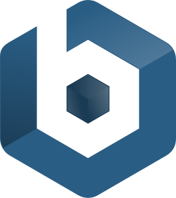</a> | **📂 檔名:** `bitnami.svg` ✨ **格式:** `Vector (SVG)` ⚖️ **大小:** `3.07KB` 📅 **更新:** `2026-03-02`  🚀 **jsDelivr Markdown:** `` 🔗 **直接連結 (Url):** <code>https://cdn.jsdelivr.net/gh/barry028/materials@main/images/iCons/Brands/bitnami.svg</code> 📥 [檢視原始檔](bitnami.svg) |
|  | **📂 檔名:** `bitrise-icon.svg` ✨ **格式:** `Vector (SVG)` ⚖️ **大小:** `3.41KB` 📅 **更新:** `2026-03-02`  🚀 **jsDelivr Markdown:** `` 🔗 **直接連結 (Url):** <code>https://cdn.jsdelivr.net/gh/barry028/materials@main/images/iCons/Brands/bitrise-icon.svg</code> 📥 [檢視原始檔](bitrise-icon.svg) |
|  | **📂 檔名:** `bitrise.svg` ✨ **格式:** `Vector (SVG)` ⚖️ **大小:** `7.72KB` 📅 **更新:** `2026-03-02`  🚀 **jsDelivr Markdown:** `` 🔗 **直接連結 (Url):** <code>https://cdn.jsdelivr.net/gh/barry028/materials@main/images/iCons/Brands/bitrise.svg</code> 📥 [檢視原始檔](bitrise.svg) |
|  | **📂 檔名:** `blender.svg` ✨ **格式:** `Vector (SVG)` ⚖️ **大小:** `3.79KB` 📅 **更新:** `2026-03-02`  🚀 **jsDelivr Markdown:** `` 🔗 **直接連結 (Url):** <code>https://cdn.jsdelivr.net/gh/barry028/materials@main/images/iCons/Brands/blender.svg</code> 📥 [檢視原始檔](blender.svg) |
| <a href="blitzjs-icon.svg">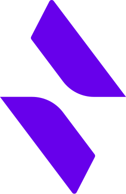</a> | **📂 檔名:** `blitzjs-icon.svg` ✨ **格式:** `Vector (SVG)` ⚖️ **大小:** `941.00B` 📅 **更新:** `2026-03-02`  🚀 **jsDelivr Markdown:** `` 🔗 **直接連結 (Url):** <code>https://cdn.jsdelivr.net/gh/barry028/materials@main/images/iCons/Brands/blitzjs-icon.svg</code> 📥 [檢視原始檔](blitzjs-icon.svg) |
|  | **📂 檔名:** `blitzjs.svg` ✨ **格式:** `Vector (SVG)` ⚖️ **大小:** `6.53KB` 📅 **更新:** `2026-03-02`  🚀 **jsDelivr Markdown:** `` 🔗 **直接連結 (Url):** <code>https://cdn.jsdelivr.net/gh/barry028/materials@main/images/iCons/Brands/blitzjs.svg</code> 📥 [檢視原始檔](blitzjs.svg) |
|  | **📂 檔名:** `blocs.svg` ✨ **格式:** `Vector (SVG)` ⚖️ **大小:** `2.60KB` 📅 **更新:** `2026-03-02`  🚀 **jsDelivr Markdown:** `` 🔗 **直接連結 (Url):** <code>https://cdn.jsdelivr.net/gh/barry028/materials@main/images/iCons/Brands/blocs.svg</code> 📥 [檢視原始檔](blocs.svg) |
|  | **📂 檔名:** `blogger.svg` ✨ **格式:** `Vector (SVG)` ⚖️ **大小:** `3.51KB` 📅 **更新:** `2026-03-02`  🚀 **jsDelivr Markdown:** `` 🔗 **直接連結 (Url):** <code>https://cdn.jsdelivr.net/gh/barry028/materials@main/images/iCons/Brands/blogger.svg</code> 📥 [檢視原始檔](blogger.svg) |
|  | **📂 檔名:** `blossom.svg` ✨ **格式:** `Vector (SVG)` ⚖️ **大小:** `2.01KB` 📅 **更新:** `2026-03-02`  🚀 **jsDelivr Markdown:** `` 🔗 **直接連結 (Url):** <code>https://cdn.jsdelivr.net/gh/barry028/materials@main/images/iCons/Brands/blossom.svg</code> 📥 [檢視原始檔](blossom.svg) |
| <a href="blueprint.svg">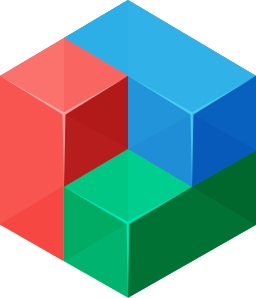</a> | **📂 檔名:** `blueprint.svg` ✨ **格式:** `Vector (SVG)` ⚖️ **大小:** `3.33KB` 📅 **更新:** `2026-03-02`  🚀 **jsDelivr Markdown:** `` 🔗 **直接連結 (Url):** <code>https://cdn.jsdelivr.net/gh/barry028/materials@main/images/iCons/Brands/blueprint.svg</code> 📥 [檢視原始檔](blueprint.svg) |
| <a href="bluetooth.svg">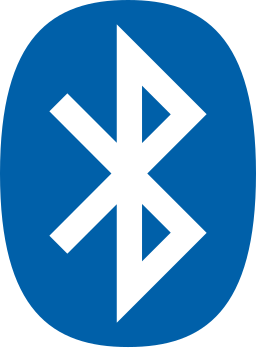</a> | **📂 檔名:** `bluetooth.svg` ✨ **格式:** `Vector (SVG)` ⚖️ **大小:** `1.22KB` 📅 **更新:** `2026-03-02`  🚀 **jsDelivr Markdown:** `` 🔗 **直接連結 (Url):** <code>https://cdn.jsdelivr.net/gh/barry028/materials@main/images/iCons/Brands/bluetooth.svg</code> 📥 [檢視原始檔](bluetooth.svg) |
|  | **📂 檔名:** `booqable-icon.svg` ✨ **格式:** `Vector (SVG)` ⚖️ **大小:** `4.69KB` 📅 **更新:** `2026-03-02`  🚀 **jsDelivr Markdown:** `` 🔗 **直接連結 (Url):** <code>https://cdn.jsdelivr.net/gh/barry028/materials@main/images/iCons/Brands/booqable-icon.svg</code> 📥 [檢視原始檔](booqable-icon.svg) |
|  | **📂 檔名:** `booqable.svg` ✨ **格式:** `Vector (SVG)` ⚖️ **大小:** `12.22KB` 📅 **更新:** `2026-03-02`  🚀 **jsDelivr Markdown:** `` 🔗 **直接連結 (Url):** <code>https://cdn.jsdelivr.net/gh/barry028/materials@main/images/iCons/Brands/booqable.svg</code> 📥 [檢視原始檔](booqable.svg) |
|  | **📂 檔名:** `bootstrap.svg` ✨ **格式:** `Vector (SVG)` ⚖️ **大小:** `2.08KB` 📅 **更新:** `2026-03-02`  🚀 **jsDelivr Markdown:** `` 🔗 **直接連結 (Url):** <code>https://cdn.jsdelivr.net/gh/barry028/materials@main/images/iCons/Brands/bootstrap.svg</code> 📥 [檢視原始檔](bootstrap.svg) |
| <a href="bosun.svg">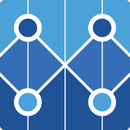</a> | **📂 檔名:** `bosun.svg` ✨ **格式:** `Vector (SVG)` ⚖️ **大小:** `6.32KB` 📅 **更新:** `2026-03-02`  🚀 **jsDelivr Markdown:** `` 🔗 **直接連結 (Url):** <code>https://cdn.jsdelivr.net/gh/barry028/materials@main/images/iCons/Brands/bosun.svg</code> 📥 [檢視原始檔](bosun.svg) |
|  | **📂 檔名:** `botanalytics.svg` ✨ **格式:** `Vector (SVG)` ⚖️ **大小:** `2.75KB` 📅 **更新:** `2026-03-02`  🚀 **jsDelivr Markdown:** `` 🔗 **直接連結 (Url):** <code>https://cdn.jsdelivr.net/gh/barry028/materials@main/images/iCons/Brands/botanalytics.svg</code> 📥 [檢視原始檔](botanalytics.svg) |
|  | **📂 檔名:** `bourbon.svg` ✨ **格式:** `Vector (SVG)` ⚖️ **大小:** `3.68KB` 📅 **更新:** `2026-03-02`  🚀 **jsDelivr Markdown:** `` 🔗 **直接連結 (Url):** <code>https://cdn.jsdelivr.net/gh/barry028/materials@main/images/iCons/Brands/bourbon.svg</code> 📥 [檢視原始檔](bourbon.svg) |
| <a href="bower.svg">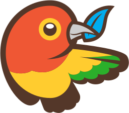</a> | **📂 檔名:** `bower.svg` ✨ **格式:** `Vector (SVG)` ⚖️ **大小:** `6.58KB` 📅 **更新:** `2026-03-02`  🚀 **jsDelivr Markdown:** `` 🔗 **直接連結 (Url):** <code>https://cdn.jsdelivr.net/gh/barry028/materials@main/images/iCons/Brands/bower.svg</code> 📥 [檢視原始檔](bower.svg) |
|  | **📂 檔名:** `box.svg` ✨ **格式:** `Vector (SVG)` ⚖️ **大小:** `2.23KB` 📅 **更新:** `2026-03-02`  🚀 **jsDelivr Markdown:** `` 🔗 **直接連結 (Url):** <code>https://cdn.jsdelivr.net/gh/barry028/materials@main/images/iCons/Brands/box.svg</code> 📥 [檢視原始檔](box.svg) |
|  | **📂 檔名:** `brackets.svg` ✨ **格式:** `Vector (SVG)` ⚖️ **大小:** `3.45KB` 📅 **更新:** `2026-03-02`  🚀 **jsDelivr Markdown:** `` 🔗 **直接連結 (Url):** <code>https://cdn.jsdelivr.net/gh/barry028/materials@main/images/iCons/Brands/brackets.svg</code> 📥 [檢視原始檔](brackets.svg) |
| <a href="brainjs.svg">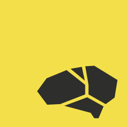</a> | **📂 檔名:** `brainjs.svg` ✨ **格式:** `Vector (SVG)` ⚖️ **大小:** `838.00B` 📅 **更新:** `2026-03-02`  🚀 **jsDelivr Markdown:** `` 🔗 **直接連結 (Url):** <code>https://cdn.jsdelivr.net/gh/barry028/materials@main/images/iCons/Brands/brainjs.svg</code> 📥 [檢視原始檔](brainjs.svg) |
| <a href="branch-icon.svg">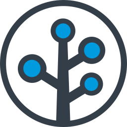</a> | **📂 檔名:** `branch-icon.svg` ✨ **格式:** `Vector (SVG)` ⚖️ **大小:** `3.93KB` 📅 **更新:** `2026-03-02`  🚀 **jsDelivr Markdown:** `` 🔗 **直接連結 (Url):** <code>https://cdn.jsdelivr.net/gh/barry028/materials@main/images/iCons/Brands/branch-icon.svg</code> 📥 [檢視原始檔](branch-icon.svg) |
|  | **📂 檔名:** `branch.svg` ✨ **格式:** `Vector (SVG)` ⚖️ **大小:** `12.45KB` 📅 **更新:** `2026-03-02`  🚀 **jsDelivr Markdown:** `` 🔗 **直接連結 (Url):** <code>https://cdn.jsdelivr.net/gh/barry028/materials@main/images/iCons/Brands/branch.svg</code> 📥 [檢視原始檔](branch.svg) |
|  | **📂 檔名:** `brandfolder-icon.svg` ✨ **格式:** `Vector (SVG)` ⚖️ **大小:** `3.27KB` 📅 **更新:** `2026-03-02`  🚀 **jsDelivr Markdown:** `` 🔗 **直接連結 (Url):** <code>https://cdn.jsdelivr.net/gh/barry028/materials@main/images/iCons/Brands/brandfolder-icon.svg</code> 📥 [檢視原始檔](brandfolder-icon.svg) |
|  | **📂 檔名:** `brandfolder.svg` ✨ **格式:** `Vector (SVG)` ⚖️ **大小:** `16.81KB` 📅 **更新:** `2026-03-02`  🚀 **jsDelivr Markdown:** `` 🔗 **直接連結 (Url):** <code>https://cdn.jsdelivr.net/gh/barry028/materials@main/images/iCons/Brands/brandfolder.svg</code> 📥 [檢視原始檔](brandfolder.svg) |
|  | **📂 檔名:** `brave.svg` ✨ **格式:** `Vector (SVG)` ⚖️ **大小:** `7.73KB` 📅 **更新:** `2026-03-02`  🚀 **jsDelivr Markdown:** `` 🔗 **直接連結 (Url):** <code>https://cdn.jsdelivr.net/gh/barry028/materials@main/images/iCons/Brands/brave.svg</code> 📥 [檢視原始檔](brave.svg) |
| <a href="braze-icon.svg">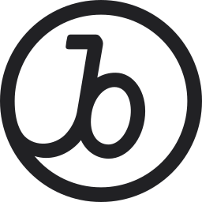</a> | **📂 檔名:** `braze-icon.svg` ✨ **格式:** `Vector (SVG)` ⚖️ **大小:** `2.06KB` 📅 **更新:** `2026-03-02`  🚀 **jsDelivr Markdown:** `` 🔗 **直接連結 (Url):** <code>https://cdn.jsdelivr.net/gh/barry028/materials@main/images/iCons/Brands/braze-icon.svg</code> 📥 [檢視原始檔](braze-icon.svg) |
|  | **📂 檔名:** `braze.svg` ✨ **格式:** `Vector (SVG)` ⚖️ **大小:** `6.84KB` 📅 **更新:** `2026-03-02`  🚀 **jsDelivr Markdown:** `` 🔗 **直接連結 (Url):** <code>https://cdn.jsdelivr.net/gh/barry028/materials@main/images/iCons/Brands/braze.svg</code> 📥 [檢視原始檔](braze.svg) |
|  | **📂 檔名:** `broadcom-icon.svg` ✨ **格式:** `Vector (SVG)` ⚖️ **大小:** `2.43KB` 📅 **更新:** `2026-03-02`  🚀 **jsDelivr Markdown:** `` 🔗 **直接連結 (Url):** <code>https://cdn.jsdelivr.net/gh/barry028/materials@main/images/iCons/Brands/broadcom-icon.svg</code> 📥 [檢視原始檔](broadcom-icon.svg) |
|  | **📂 檔名:** `broadcom.svg` ✨ **格式:** `Vector (SVG)` ⚖️ **大小:** `6.64KB` 📅 **更新:** `2026-03-02`  🚀 **jsDelivr Markdown:** `` 🔗 **直接連結 (Url):** <code>https://cdn.jsdelivr.net/gh/barry028/materials@main/images/iCons/Brands/broadcom.svg</code> 📥 [檢視原始檔](broadcom.svg) |
|  | **📂 檔名:** `broccoli.svg` ✨ **格式:** `Vector (SVG)` ⚖️ **大小:** `4.06KB` 📅 **更新:** `2026-03-02`  🚀 **jsDelivr Markdown:** `` 🔗 **直接連結 (Url):** <code>https://cdn.jsdelivr.net/gh/barry028/materials@main/images/iCons/Brands/broccoli.svg</code> 📥 [檢視原始檔](broccoli.svg) |
|  | **📂 檔名:** `brotli.svg` ✨ **格式:** `Vector (SVG)` ⚖️ **大小:** `1.51KB` 📅 **更新:** `2026-03-02`  🚀 **jsDelivr Markdown:** `` 🔗 **直接連結 (Url):** <code>https://cdn.jsdelivr.net/gh/barry028/materials@main/images/iCons/Brands/brotli.svg</code> 📥 [檢視原始檔](brotli.svg) |
|  | **📂 檔名:** `browserify-icon.svg` ✨ **格式:** `Vector (SVG)` ⚖️ **大小:** `16.04KB` 📅 **更新:** `2026-03-02`  🚀 **jsDelivr Markdown:** `` 🔗 **直接連結 (Url):** <code>https://cdn.jsdelivr.net/gh/barry028/materials@main/images/iCons/Brands/browserify-icon.svg</code> 📥 [檢視原始檔](browserify-icon.svg) |
|  | **📂 檔名:** `browserify.svg` ✨ **格式:** `Vector (SVG)` ⚖️ **大小:** `111.95KB` 📅 **更新:** `2026-03-02`  🚀 **jsDelivr Markdown:** `` 🔗 **直接連結 (Url):** <code>https://cdn.jsdelivr.net/gh/barry028/materials@main/images/iCons/Brands/browserify.svg</code> 📥 [檢視原始檔](browserify.svg) |
|  | **📂 檔名:** `browserling.svg` ✨ **格式:** `Vector (SVG)` ⚖️ **大小:** `3.06KB` 📅 **更新:** `2026-03-02`  🚀 **jsDelivr Markdown:** `` 🔗 **直接連結 (Url):** <code>https://cdn.jsdelivr.net/gh/barry028/materials@main/images/iCons/Brands/browserling.svg</code> 📥 [檢視原始檔](browserling.svg) |
|  | **📂 檔名:** `browserslist.svg` ✨ **格式:** `Vector (SVG)` ⚖️ **大小:** `2.92KB` 📅 **更新:** `2026-03-02`  🚀 **jsDelivr Markdown:** `` 🔗 **直接連結 (Url):** <code>https://cdn.jsdelivr.net/gh/barry028/materials@main/images/iCons/Brands/browserslist.svg</code> 📥 [檢視原始檔](browserslist.svg) |
|  | **📂 檔名:** `browserstack.svg` ✨ **格式:** `Vector (SVG)` ⚖️ **大小:** `1.69KB` 📅 **更新:** `2026-03-02`  🚀 **jsDelivr Markdown:** `` 🔗 **直接連結 (Url):** <code>https://cdn.jsdelivr.net/gh/barry028/materials@main/images/iCons/Brands/browserstack.svg</code> 📥 [檢視原始檔](browserstack.svg) |
|  | **📂 檔名:** `browsersync.svg` ✨ **格式:** `Vector (SVG)` ⚖️ **大小:** `1.03KB` 📅 **更新:** `2026-03-02`  🚀 **jsDelivr Markdown:** `` 🔗 **直接連結 (Url):** <code>https://cdn.jsdelivr.net/gh/barry028/materials@main/images/iCons/Brands/browsersync.svg</code> 📥 [檢視原始檔](browsersync.svg) |
|  | **📂 檔名:** `brunch.svg` ✨ **格式:** `Vector (SVG)` ⚖️ **大小:** `3.14KB` 📅 **更新:** `2026-03-02`  🚀 **jsDelivr Markdown:** `` 🔗 **直接連結 (Url):** <code>https://cdn.jsdelivr.net/gh/barry028/materials@main/images/iCons/Brands/brunch.svg</code> 📥 [檢視原始檔](brunch.svg) |
|  | **📂 檔名:** `bubble-icon.svg` ✨ **格式:** `Vector (SVG)` ⚖️ **大小:** `1.24KB` 📅 **更新:** `2026-03-02`  🚀 **jsDelivr Markdown:** `` 🔗 **直接連結 (Url):** <code>https://cdn.jsdelivr.net/gh/barry028/materials@main/images/iCons/Brands/bubble-icon.svg</code> 📥 [檢視原始檔](bubble-icon.svg) |
|  | **📂 檔名:** `bubble.svg` ✨ **格式:** `Vector (SVG)` ⚖️ **大小:** `3.95KB` 📅 **更新:** `2026-03-02`  🚀 **jsDelivr Markdown:** `` 🔗 **直接連結 (Url):** <code>https://cdn.jsdelivr.net/gh/barry028/materials@main/images/iCons/Brands/bubble.svg</code> 📥 [檢視原始檔](bubble.svg) |
|  | **📂 檔名:** `buck.svg` ✨ **格式:** `Vector (SVG)` ⚖️ **大小:** `1.24KB` 📅 **更新:** `2026-03-02`  🚀 **jsDelivr Markdown:** `` 🔗 **直接連結 (Url):** <code>https://cdn.jsdelivr.net/gh/barry028/materials@main/images/iCons/Brands/buck.svg</code> 📥 [檢視原始檔](buck.svg) |
|  | **📂 檔名:** `buddy.svg` ✨ **格式:** `Vector (SVG)` ⚖️ **大小:** `2.25KB` 📅 **更新:** `2026-03-02`  🚀 **jsDelivr Markdown:** `` 🔗 **直接連結 (Url):** <code>https://cdn.jsdelivr.net/gh/barry028/materials@main/images/iCons/Brands/buddy.svg</code> 📥 [檢視原始檔](buddy.svg) |
|  | **📂 檔名:** `buffer.svg` ✨ **格式:** `Vector (SVG)` ⚖️ **大小:** `3.14KB` 📅 **更新:** `2026-03-02`  🚀 **jsDelivr Markdown:** `` 🔗 **直接連結 (Url):** <code>https://cdn.jsdelivr.net/gh/barry028/materials@main/images/iCons/Brands/buffer.svg</code> 📥 [檢視原始檔](buffer.svg) |
|  | **📂 檔名:** `bugherd-icon.svg` ✨ **格式:** `Vector (SVG)` ⚖️ **大小:** `11.61KB` 📅 **更新:** `2026-03-02`  🚀 **jsDelivr Markdown:** `` 🔗 **直接連結 (Url):** <code>https://cdn.jsdelivr.net/gh/barry028/materials@main/images/iCons/Brands/bugherd-icon.svg</code> 📥 [檢視原始檔](bugherd-icon.svg) |
| <a href="bugherd.svg">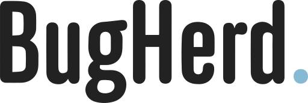</a> | **📂 檔名:** `bugherd.svg` ✨ **格式:** `Vector (SVG)` ⚖️ **大小:** `11.55KB` 📅 **更新:** `2026-03-02`  🚀 **jsDelivr Markdown:** `` 🔗 **直接連結 (Url):** <code>https://cdn.jsdelivr.net/gh/barry028/materials@main/images/iCons/Brands/bugherd.svg</code> 📥 [檢視原始檔](bugherd.svg) |
|  | **📂 檔名:** `bugsee.svg` ✨ **格式:** `Vector (SVG)` ⚖️ **大小:** `1.40KB` 📅 **更新:** `2026-03-02`  🚀 **jsDelivr Markdown:** `` 🔗 **直接連結 (Url):** <code>https://cdn.jsdelivr.net/gh/barry028/materials@main/images/iCons/Brands/bugsee.svg</code> 📥 [檢視原始檔](bugsee.svg) |
| <a href="bugsnag.svg">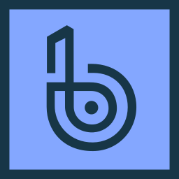</a> | **📂 檔名:** `bugsnag.svg` ✨ **格式:** `Vector (SVG)` ⚖️ **大小:** `2.24KB` 📅 **更新:** `2026-03-02`  🚀 **jsDelivr Markdown:** `` 🔗 **直接連結 (Url):** <code>https://cdn.jsdelivr.net/gh/barry028/materials@main/images/iCons/Brands/bugsnag.svg</code> 📥 [檢視原始檔](bugsnag.svg) |
|  | **📂 檔名:** `builder-io-icon.svg` ✨ **格式:** `Vector (SVG)` ⚖️ **大小:** `2.12KB` 📅 **更新:** `2026-03-02`  🚀 **jsDelivr Markdown:** `` 🔗 **直接連結 (Url):** <code>https://cdn.jsdelivr.net/gh/barry028/materials@main/images/iCons/Brands/builder-io-icon.svg</code> 📥 [檢視原始檔](builder-io-icon.svg) |
|  | **📂 檔名:** `builder-io.svg` ✨ **格式:** `Vector (SVG)` ⚖️ **大小:** `7.36KB` 📅 **更新:** `2026-03-02`  🚀 **jsDelivr Markdown:** `` 🔗 **直接連結 (Url):** <code>https://cdn.jsdelivr.net/gh/barry028/materials@main/images/iCons/Brands/builder-io.svg</code> 📥 [檢視原始檔](builder-io.svg) |
| <a href="buildkite-icon.svg">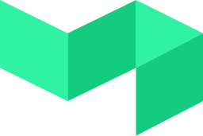</a> | **📂 檔名:** `buildkite-icon.svg` ✨ **格式:** `Vector (SVG)` ⚖️ **大小:** `686.00B` 📅 **更新:** `2026-03-02`  🚀 **jsDelivr Markdown:** `` 🔗 **直接連結 (Url):** <code>https://cdn.jsdelivr.net/gh/barry028/materials@main/images/iCons/Brands/buildkite-icon.svg</code> 📥 [檢視原始檔](buildkite-icon.svg) |
|  | **📂 檔名:** `buildkite.svg` ✨ **格式:** `Vector (SVG)` ⚖️ **大小:** `5.61KB` 📅 **更新:** `2026-03-02`  🚀 **jsDelivr Markdown:** `` 🔗 **直接連結 (Url):** <code>https://cdn.jsdelivr.net/gh/barry028/materials@main/images/iCons/Brands/buildkite.svg</code> 📥 [檢視原始檔](buildkite.svg) |
|  | **📂 檔名:** `bulma.svg` ✨ **格式:** `Vector (SVG)` ⚖️ **大小:** `437.00B` 📅 **更新:** `2026-03-02`  🚀 **jsDelivr Markdown:** `` 🔗 **直接連結 (Url):** <code>https://cdn.jsdelivr.net/gh/barry028/materials@main/images/iCons/Brands/bulma.svg</code> 📥 [檢視原始檔](bulma.svg) |
|  | **📂 檔名:** `bun.svg` ✨ **格式:** `Vector (SVG)` ⚖️ **大小:** `9.86KB` 📅 **更新:** `2026-03-02`  🚀 **jsDelivr Markdown:** `` 🔗 **直接連結 (Url):** <code>https://cdn.jsdelivr.net/gh/barry028/materials@main/images/iCons/Brands/bun.svg</code> 📥 [檢視原始檔](bun.svg) |
|  | **📂 檔名:** `bunny-net-icon.svg` ✨ **格式:** `Vector (SVG)` ⚖️ **大小:** `7.38KB` 📅 **更新:** `2026-03-02`  🚀 **jsDelivr Markdown:** `` 🔗 **直接連結 (Url):** <code>https://cdn.jsdelivr.net/gh/barry028/materials@main/images/iCons/Brands/bunny-net-icon.svg</code> 📥 [檢視原始檔](bunny-net-icon.svg) |
|  | **📂 檔名:** `bunny-net.svg` ✨ **格式:** `Vector (SVG)` ⚖️ **大小:** `16.01KB` 📅 **更新:** `2026-03-02`  🚀 **jsDelivr Markdown:** `` 🔗 **直接連結 (Url):** <code>https://cdn.jsdelivr.net/gh/barry028/materials@main/images/iCons/Brands/bunny-net.svg</code> 📥 [檢視原始檔](bunny-net.svg) |
|  | **📂 檔名:** `c-plusplus.svg` ✨ **格式:** `Vector (SVG)` ⚖️ **大小:** `3.51KB` 📅 **更新:** `2026-03-02`  🚀 **jsDelivr Markdown:** `` 🔗 **直接連結 (Url):** <code>https://cdn.jsdelivr.net/gh/barry028/materials@main/images/iCons/Brands/c-plusplus.svg</code> 📥 [檢視原始檔](c-plusplus.svg) |
|  | **📂 檔名:** `c-sharp.svg` ✨ **格式:** `Vector (SVG)` ⚖️ **大小:** `1.74KB` 📅 **更新:** `2026-03-02`  🚀 **jsDelivr Markdown:** `` 🔗 **直接連結 (Url):** <code>https://cdn.jsdelivr.net/gh/barry028/materials@main/images/iCons/Brands/c-sharp.svg</code> 📥 [檢視原始檔](c-sharp.svg) |
| <a href="c.svg">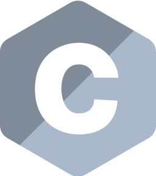</a> | **📂 檔名:** `c.svg` ✨ **格式:** `Vector (SVG)` ⚖️ **大小:** `1.76KB` 📅 **更新:** `2026-03-02`  🚀 **jsDelivr Markdown:** `` 🔗 **直接連結 (Url):** <code>https://cdn.jsdelivr.net/gh/barry028/materials@main/images/iCons/Brands/c.svg</code> 📥 [檢視原始檔](c.svg) |
|  | **📂 檔名:** `cachet.svg` ✨ **格式:** `Vector (SVG)` ⚖️ **大小:** `13.63KB` 📅 **更新:** `2026-03-02`  🚀 **jsDelivr Markdown:** `` 🔗 **直接連結 (Url):** <code>https://cdn.jsdelivr.net/gh/barry028/materials@main/images/iCons/Brands/cachet.svg</code> 📥 [檢視原始檔](cachet.svg) |
|  | **📂 檔名:** `cakephp-icon.svg` ✨ **格式:** `Vector (SVG)` ⚖️ **大小:** `1.17KB` 📅 **更新:** `2026-03-02`  🚀 **jsDelivr Markdown:** `` 🔗 **直接連結 (Url):** <code>https://cdn.jsdelivr.net/gh/barry028/materials@main/images/iCons/Brands/cakephp-icon.svg</code> 📥 [檢視原始檔](cakephp-icon.svg) |
|  | **📂 檔名:** `cakephp.svg` ✨ **格式:** `Vector (SVG)` ⚖️ **大小:** `5.29KB` 📅 **更新:** `2026-03-02`  🚀 **jsDelivr Markdown:** `` 🔗 **直接連結 (Url):** <code>https://cdn.jsdelivr.net/gh/barry028/materials@main/images/iCons/Brands/cakephp.svg</code> 📥 [檢視原始檔](cakephp.svg) |
| <a href="calibre-icon.svg">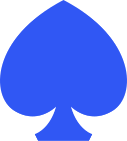</a> | **📂 檔名:** `calibre-icon.svg` ✨ **格式:** `Vector (SVG)` ⚖️ **大小:** `756.00B` 📅 **更新:** `2026-03-02`  🚀 **jsDelivr Markdown:** `` 🔗 **直接連結 (Url):** <code>https://cdn.jsdelivr.net/gh/barry028/materials@main/images/iCons/Brands/calibre-icon.svg</code> 📥 [檢視原始檔](calibre-icon.svg) |
|  | **📂 檔名:** `calibre.svg` ✨ **格式:** `Vector (SVG)` ⚖️ **大小:** `10.51KB` 📅 **更新:** `2026-03-02`  🚀 **jsDelivr Markdown:** `` 🔗 **直接連結 (Url):** <code>https://cdn.jsdelivr.net/gh/barry028/materials@main/images/iCons/Brands/calibre.svg</code> 📥 [檢視原始檔](calibre.svg) |
|  | **📂 檔名:** `campaignmonitor-icon.svg` ✨ **格式:** `Vector (SVG)` ⚖️ **大小:** `951.00B` 📅 **更新:** `2026-03-02`  🚀 **jsDelivr Markdown:** `` 🔗 **直接連結 (Url):** <code>https://cdn.jsdelivr.net/gh/barry028/materials@main/images/iCons/Brands/campaignmonitor-icon.svg</code> 📥 [檢視原始檔](campaignmonitor-icon.svg) |
|  | **📂 檔名:** `campaignmonitor.svg` ✨ **格式:** `Vector (SVG)` ⚖️ **大小:** `16.30KB` 📅 **更新:** `2026-03-02`  🚀 **jsDelivr Markdown:** `` 🔗 **直接連結 (Url):** <code>https://cdn.jsdelivr.net/gh/barry028/materials@main/images/iCons/Brands/campaignmonitor.svg</code> 📥 [檢視原始檔](campaignmonitor.svg) |
|  | **📂 檔名:** `canjs.svg` ✨ **格式:** `Vector (SVG)` ⚖️ **大小:** `12.27KB` 📅 **更新:** `2026-03-02`  🚀 **jsDelivr Markdown:** `` 🔗 **直接連結 (Url):** <code>https://cdn.jsdelivr.net/gh/barry028/materials@main/images/iCons/Brands/canjs.svg</code> 📥 [檢視原始檔](canjs.svg) |
|  | **📂 檔名:** `capacitorjs-icon.svg` ✨ **格式:** `Vector (SVG)` ⚖️ **大小:** `1.17KB` 📅 **更新:** `2026-03-02`  🚀 **jsDelivr Markdown:** `` 🔗 **直接連結 (Url):** <code>https://cdn.jsdelivr.net/gh/barry028/materials@main/images/iCons/Brands/capacitorjs-icon.svg</code> 📥 [檢視原始檔](capacitorjs-icon.svg) |
|  | **📂 檔名:** `capacitorjs.svg` ✨ **格式:** `Vector (SVG)` ⚖️ **大小:** `6.08KB` 📅 **更新:** `2026-03-02`  🚀 **jsDelivr Markdown:** `` 🔗 **直接連結 (Url):** <code>https://cdn.jsdelivr.net/gh/barry028/materials@main/images/iCons/Brands/capacitorjs.svg</code> 📥 [檢視原始檔](capacitorjs.svg) |
| <a href="capistrano.svg">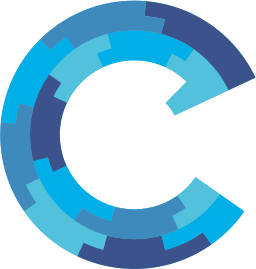</a> | **📂 檔名:** `capistrano.svg` ✨ **格式:** `Vector (SVG)` ⚖️ **大小:** `24.86KB` 📅 **更新:** `2026-03-02`  🚀 **jsDelivr Markdown:** `` 🔗 **直接連結 (Url):** <code>https://cdn.jsdelivr.net/gh/barry028/materials@main/images/iCons/Brands/capistrano.svg</code> 📥 [檢視原始檔](capistrano.svg) |
|  | **📂 檔名:** `carbide.svg` ✨ **格式:** `Vector (SVG)` ⚖️ **大小:** `1.08KB` 📅 **更新:** `2026-03-02`  🚀 **jsDelivr Markdown:** `` 🔗 **直接連結 (Url):** <code>https://cdn.jsdelivr.net/gh/barry028/materials@main/images/iCons/Brands/carbide.svg</code> 📥 [檢視原始檔](carbide.svg) |
| <a href="cardano-icon.svg">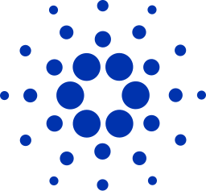</a> | **📂 檔名:** `cardano-icon.svg` ✨ **格式:** `Vector (SVG)` ⚖️ **大小:** `10.77KB` 📅 **更新:** `2026-03-02`  🚀 **jsDelivr Markdown:** `` 🔗 **直接連結 (Url):** <code>https://cdn.jsdelivr.net/gh/barry028/materials@main/images/iCons/Brands/cardano-icon.svg</code> 📥 [檢視原始檔](cardano-icon.svg) |
|  | **📂 檔名:** `cardano.svg` ✨ **格式:** `Vector (SVG)` ⚖️ **大小:** `17.17KB` 📅 **更新:** `2026-03-02`  🚀 **jsDelivr Markdown:** `` 🔗 **直接連結 (Url):** <code>https://cdn.jsdelivr.net/gh/barry028/materials@main/images/iCons/Brands/cardano.svg</code> 📥 [檢視原始檔](cardano.svg) |
|  | **📂 檔名:** `cassandra.svg` ✨ **格式:** `Vector (SVG)` ⚖️ **大小:** `14.97KB` 📅 **更新:** `2026-03-02`  🚀 **jsDelivr Markdown:** `` 🔗 **直接連結 (Url):** <code>https://cdn.jsdelivr.net/gh/barry028/materials@main/images/iCons/Brands/cassandra.svg</code> 📥 [檢視原始檔](cassandra.svg) |
|  | **📂 檔名:** `centos-icon.svg` ✨ **格式:** `Vector (SVG)` ⚖️ **大小:** `5.21KB` 📅 **更新:** `2026-03-02`  🚀 **jsDelivr Markdown:** `` 🔗 **直接連結 (Url):** <code>https://cdn.jsdelivr.net/gh/barry028/materials@main/images/iCons/Brands/centos-icon.svg</code> 📥 [檢視原始檔](centos-icon.svg) |
|  | **📂 檔名:** `centos.svg` ✨ **格式:** `Vector (SVG)` ⚖️ **大小:** `9.57KB` 📅 **更新:** `2026-03-02`  🚀 **jsDelivr Markdown:** `` 🔗 **直接連結 (Url):** <code>https://cdn.jsdelivr.net/gh/barry028/materials@main/images/iCons/Brands/centos.svg</code> 📥 [檢視原始檔](centos.svg) |
| <a href="certbot.svg">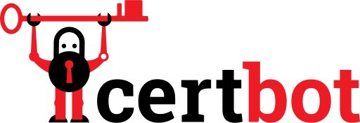</a> | **📂 檔名:** `certbot.svg` ✨ **格式:** `Vector (SVG)` ⚖️ **大小:** `16.55KB` 📅 **更新:** `2026-03-02`  🚀 **jsDelivr Markdown:** `` 🔗 **直接連結 (Url):** <code>https://cdn.jsdelivr.net/gh/barry028/materials@main/images/iCons/Brands/certbot.svg</code> 📥 [檢視原始檔](certbot.svg) |
|  | **📂 檔名:** `ceylon.svg` ✨ **格式:** `Vector (SVG)` ⚖️ **大小:** `15.26KB` 📅 **更新:** `2026-03-02`  🚀 **jsDelivr Markdown:** `` 🔗 **直接連結 (Url):** <code>https://cdn.jsdelivr.net/gh/barry028/materials@main/images/iCons/Brands/ceylon.svg</code> 📥 [檢視原始檔](ceylon.svg) |
|  | **📂 檔名:** `chai.svg` ✨ **格式:** `Vector (SVG)` ⚖️ **大小:** `4.17KB` 📅 **更新:** `2026-03-02`  🚀 **jsDelivr Markdown:** `` 🔗 **直接連結 (Url):** <code>https://cdn.jsdelivr.net/gh/barry028/materials@main/images/iCons/Brands/chai.svg</code> 📥 [檢視原始檔](chai.svg) |
|  | **📂 檔名:** `chalk.svg` ✨ **格式:** `Vector (SVG)` ⚖️ **大小:** `188.25KB` 📅 **更新:** `2026-03-02`  🚀 **jsDelivr Markdown:** `` 🔗 **直接連結 (Url):** <code>https://cdn.jsdelivr.net/gh/barry028/materials@main/images/iCons/Brands/chalk.svg</code> 📥 [檢視原始檔](chalk.svg) |
|  | **📂 檔名:** `chargebee-icon.svg` ✨ **格式:** `Vector (SVG)` ⚖️ **大小:** `9.03KB` 📅 **更新:** `2026-03-02`  🚀 **jsDelivr Markdown:** `` 🔗 **直接連結 (Url):** <code>https://cdn.jsdelivr.net/gh/barry028/materials@main/images/iCons/Brands/chargebee-icon.svg</code> 📥 [檢視原始檔](chargebee-icon.svg) |
| <a href="chargebee.svg">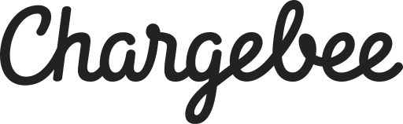</a> | **📂 檔名:** `chargebee.svg` ✨ **格式:** `Vector (SVG)` ⚖️ **大小:** `9.29KB` 📅 **更新:** `2026-03-02`  🚀 **jsDelivr Markdown:** `` 🔗 **直接連結 (Url):** <code>https://cdn.jsdelivr.net/gh/barry028/materials@main/images/iCons/Brands/chargebee.svg</code> 📥 [檢視原始檔](chargebee.svg) |
| <a href="chef.svg">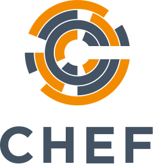</a> | **📂 檔名:** `chef.svg` ✨ **格式:** `Vector (SVG)` ⚖️ **大小:** `6.85KB` 📅 **更新:** `2026-03-02`  🚀 **jsDelivr Markdown:** `` 🔗 **直接連結 (Url):** <code>https://cdn.jsdelivr.net/gh/barry028/materials@main/images/iCons/Brands/chef.svg</code> 📥 [檢視原始檔](chef.svg) |
|  | **📂 檔名:** `chevereto.svg` ✨ **格式:** `Vector (SVG)` ⚖️ **大小:** `21.66KB` 📅 **更新:** `2026-03-02`  🚀 **jsDelivr Markdown:** `` 🔗 **直接連結 (Url):** <code>https://cdn.jsdelivr.net/gh/barry028/materials@main/images/iCons/Brands/chevereto.svg</code> 📥 [檢視原始檔](chevereto.svg) |
|  | **📂 檔名:** `chroma.svg` ✨ **格式:** `Vector (SVG)` ⚖️ **大小:** `807.00B` 📅 **更新:** `2026-03-02`  🚀 **jsDelivr Markdown:** `` 🔗 **直接連結 (Url):** <code>https://cdn.jsdelivr.net/gh/barry028/materials@main/images/iCons/Brands/chroma.svg</code> 📥 [檢視原始檔](chroma.svg) |
|  | **📂 檔名:** `chromatic-icon.svg` ✨ **格式:** `Vector (SVG)` ⚖️ **大小:** `2.60KB` 📅 **更新:** `2026-03-02`  🚀 **jsDelivr Markdown:** `` 🔗 **直接連結 (Url):** <code>https://cdn.jsdelivr.net/gh/barry028/materials@main/images/iCons/Brands/chromatic-icon.svg</code> 📥 [檢視原始檔](chromatic-icon.svg) |
|  | **📂 檔名:** `chromatic.svg` ✨ **格式:** `Vector (SVG)` ⚖️ **大小:** `8.20KB` 📅 **更新:** `2026-03-02`  🚀 **jsDelivr Markdown:** `` 🔗 **直接連結 (Url):** <code>https://cdn.jsdelivr.net/gh/barry028/materials@main/images/iCons/Brands/chromatic.svg</code> 📥 [檢視原始檔](chromatic.svg) |
|  | **📂 檔名:** `chrome-web-store.svg` ✨ **格式:** `Vector (SVG)` ⚖️ **大小:** `3.59KB` 📅 **更新:** `2026-03-02`  🚀 **jsDelivr Markdown:** `` 🔗 **直接連結 (Url):** <code>https://cdn.jsdelivr.net/gh/barry028/materials@main/images/iCons/Brands/chrome-web-store.svg</code> 📥 [檢視原始檔](chrome-web-store.svg) |
|  | **📂 檔名:** `chrome.svg` ✨ **格式:** `Vector (SVG)` ⚖️ **大小:** `2.98KB` 📅 **更新:** `2026-03-02`  🚀 **jsDelivr Markdown:** `` 🔗 **直接連結 (Url):** <code>https://cdn.jsdelivr.net/gh/barry028/materials@main/images/iCons/Brands/chrome.svg</code> 📥 [檢視原始檔](chrome.svg) |
|  | **📂 檔名:** `cinder.svg` ✨ **格式:** `Vector (SVG)` ⚖️ **大小:** `6.92KB` 📅 **更新:** `2026-03-02`  🚀 **jsDelivr Markdown:** `` 🔗 **直接連結 (Url):** <code>https://cdn.jsdelivr.net/gh/barry028/materials@main/images/iCons/Brands/cinder.svg</code> 📥 [檢視原始檔](cinder.svg) |
|  | **📂 檔名:** `circleci.svg` ✨ **格式:** `Vector (SVG)` ⚖️ **大小:** `1.33KB` 📅 **更新:** `2026-03-02`  🚀 **jsDelivr Markdown:** `` 🔗 **直接連結 (Url):** <code>https://cdn.jsdelivr.net/gh/barry028/materials@main/images/iCons/Brands/circleci.svg</code> 📥 [檢視原始檔](circleci.svg) |
| <a href="cirrus-ci.svg">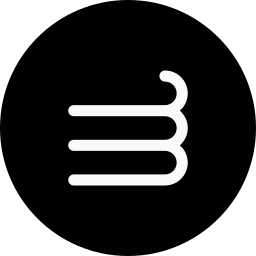</a> | **📂 檔名:** `cirrus-ci.svg` ✨ **格式:** `Vector (SVG)` ⚖️ **大小:** `1.89KB` 📅 **更新:** `2026-03-02`  🚀 **jsDelivr Markdown:** `` 🔗 **直接連結 (Url):** <code>https://cdn.jsdelivr.net/gh/barry028/materials@main/images/iCons/Brands/cirrus-ci.svg</code> 📥 [檢視原始檔](cirrus-ci.svg) |
| <a href="cirrus.svg">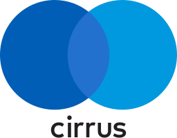</a> | **📂 檔名:** `cirrus.svg` ✨ **格式:** `Vector (SVG)` ⚖️ **大小:** `6.16KB` 📅 **更新:** `2026-03-02`  🚀 **jsDelivr Markdown:** `` 🔗 **直接連結 (Url):** <code>https://cdn.jsdelivr.net/gh/barry028/materials@main/images/iCons/Brands/cirrus.svg</code> 📥 [檢視原始檔](cirrus.svg) |
| <a href="clio-lang.svg">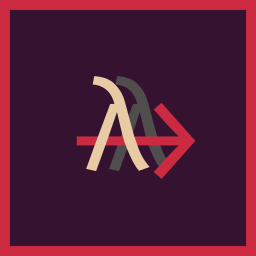</a> | **📂 檔名:** `clio-lang.svg` ✨ **格式:** `Vector (SVG)` ⚖️ **大小:** `3.84KB` 📅 **更新:** `2026-03-02`  🚀 **jsDelivr Markdown:** `` 🔗 **直接連結 (Url):** <code>https://cdn.jsdelivr.net/gh/barry028/materials@main/images/iCons/Brands/clio-lang.svg</code> 📥 [檢視原始檔](clio-lang.svg) |
| <a href="clion.svg">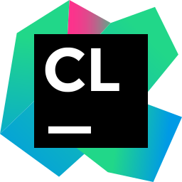</a> | **📂 檔名:** `clion.svg` ✨ **格式:** `Vector (SVG)` ⚖️ **大小:** `3.40KB` 📅 **更新:** `2026-03-02`  🚀 **jsDelivr Markdown:** `` 🔗 **直接連結 (Url):** <code>https://cdn.jsdelivr.net/gh/barry028/materials@main/images/iCons/Brands/clion.svg</code> 📥 [檢視原始檔](clion.svg) |
|  | **📂 檔名:** `cljs.svg` ✨ **格式:** `Vector (SVG)` ⚖️ **大小:** `3.71KB` 📅 **更新:** `2026-03-02`  🚀 **jsDelivr Markdown:** `` 🔗 **直接連結 (Url):** <code>https://cdn.jsdelivr.net/gh/barry028/materials@main/images/iCons/Brands/cljs.svg</code> 📥 [檢視原始檔](cljs.svg) |
| <a href="clojure.svg">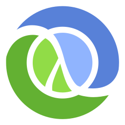</a> | **📂 檔名:** `clojure.svg` ✨ **格式:** `Vector (SVG)` ⚖️ **大小:** `2.89KB` 📅 **更新:** `2026-03-02`  🚀 **jsDelivr Markdown:** `` 🔗 **直接連結 (Url):** <code>https://cdn.jsdelivr.net/gh/barry028/materials@main/images/iCons/Brands/clojure.svg</code> 📥 [檢視原始檔](clojure.svg) |
| <a href="close.svg">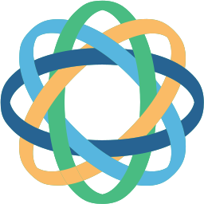</a> | **📂 檔名:** `close.svg` ✨ **格式:** `Vector (SVG)` ⚖️ **大小:** `31.95KB` 📅 **更新:** `2026-03-02`  🚀 **jsDelivr Markdown:** `` 🔗 **直接連結 (Url):** <code>https://cdn.jsdelivr.net/gh/barry028/materials@main/images/iCons/Brands/close.svg</code> 📥 [檢視原始檔](close.svg) |
|  | **📂 檔名:** `cloud9.svg` ✨ **格式:** `Vector (SVG)` ⚖️ **大小:** `13.11KB` 📅 **更新:** `2026-03-02`  🚀 **jsDelivr Markdown:** `` 🔗 **直接連結 (Url):** <code>https://cdn.jsdelivr.net/gh/barry028/materials@main/images/iCons/Brands/cloud9.svg</code> 📥 [檢視原始檔](cloud9.svg) |
|  | **📂 檔名:** `cloudacademy-icon.svg` ✨ **格式:** `Vector (SVG)` ⚖️ **大小:** `9.21KB` 📅 **更新:** `2026-03-02`  🚀 **jsDelivr Markdown:** `` 🔗 **直接連結 (Url):** <code>https://cdn.jsdelivr.net/gh/barry028/materials@main/images/iCons/Brands/cloudacademy-icon.svg</code> 📥 [檢視原始檔](cloudacademy-icon.svg) |
|  | **📂 檔名:** `cloudacademy.svg` ✨ **格式:** `Vector (SVG)` ⚖️ **大小:** `27.30KB` 📅 **更新:** `2026-03-02`  🚀 **jsDelivr Markdown:** `` 🔗 **直接連結 (Url):** <code>https://cdn.jsdelivr.net/gh/barry028/materials@main/images/iCons/Brands/cloudacademy.svg</code> 📥 [檢視原始檔](cloudacademy.svg) |
| <a href="cloudcraft.svg">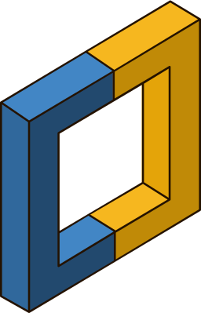</a> | **📂 檔名:** `cloudcraft.svg` ✨ **格式:** `Vector (SVG)` ⚖️ **大小:** `3.88KB` 📅 **更新:** `2026-03-02`  🚀 **jsDelivr Markdown:** `` 🔗 **直接連結 (Url):** <code>https://cdn.jsdelivr.net/gh/barry028/materials@main/images/iCons/Brands/cloudcraft.svg</code> 📥 [檢視原始檔](cloudcraft.svg) |
|  | **📂 檔名:** `cloudflare-workers-icon.svg` ✨ **格式:** `Vector (SVG)` ⚖️ **大小:** `5.90KB` 📅 **更新:** `2026-03-02`  🚀 **jsDelivr Markdown:** `` 🔗 **直接連結 (Url):** <code>https://cdn.jsdelivr.net/gh/barry028/materials@main/images/iCons/Brands/cloudflare-workers-icon.svg</code> 📥 [檢視原始檔](cloudflare-workers-icon.svg) |
|  | **📂 檔名:** `cloudflare-workers.svg` ✨ **格式:** `Vector (SVG)` ⚖️ **大小:** `14.18KB` 📅 **更新:** `2026-03-02`  🚀 **jsDelivr Markdown:** `` 🔗 **直接連結 (Url):** <code>https://cdn.jsdelivr.net/gh/barry028/materials@main/images/iCons/Brands/cloudflare-workers.svg</code> 📥 [檢視原始檔](cloudflare-workers.svg) |
|  | **📂 檔名:** `cloudflare.svg` ✨ **格式:** `Vector (SVG)` ⚖️ **大小:** `2.24KB` 📅 **更新:** `2026-03-02`  🚀 **jsDelivr Markdown:** `` 🔗 **直接連結 (Url):** <code>https://cdn.jsdelivr.net/gh/barry028/materials@main/images/iCons/Brands/cloudflare.svg</code> 📥 [檢視原始檔](cloudflare.svg) |
|  | **📂 檔名:** `cloudinary-icon.svg` ✨ **格式:** `Vector (SVG)` ⚖️ **大小:** `4.25KB` 📅 **更新:** `2026-03-02`  🚀 **jsDelivr Markdown:** `` 🔗 **直接連結 (Url):** <code>https://cdn.jsdelivr.net/gh/barry028/materials@main/images/iCons/Brands/cloudinary-icon.svg</code> 📥 [檢視原始檔](cloudinary-icon.svg) |
|  | **📂 檔名:** `cloudinary.svg` ✨ **格式:** `Vector (SVG)` ⚖️ **大小:** `15.11KB` 📅 **更新:** `2026-03-02`  🚀 **jsDelivr Markdown:** `` 🔗 **直接連結 (Url):** <code>https://cdn.jsdelivr.net/gh/barry028/materials@main/images/iCons/Brands/cloudinary.svg</code> 📥 [檢視原始檔](cloudinary.svg) |
| <a href="cloudlinux.svg">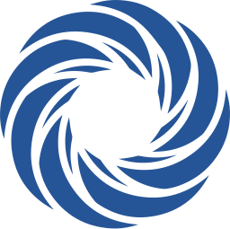</a> | **📂 檔名:** `cloudlinux.svg` ✨ **格式:** `Vector (SVG)` ⚖️ **大小:** `9.18KB` 📅 **更新:** `2026-03-02`  🚀 **jsDelivr Markdown:** `` 🔗 **直接連結 (Url):** <code>https://cdn.jsdelivr.net/gh/barry028/materials@main/images/iCons/Brands/cloudlinux.svg</code> 📥 [檢視原始檔](cloudlinux.svg) |
| <a href="cobalt.svg">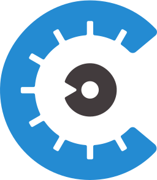</a> | **📂 檔名:** `cobalt.svg` ✨ **格式:** `Vector (SVG)` ⚖️ **大小:** `4.25KB` 📅 **更新:** `2026-03-02`  🚀 **jsDelivr Markdown:** `` 🔗 **直接連結 (Url):** <code>https://cdn.jsdelivr.net/gh/barry028/materials@main/images/iCons/Brands/cobalt.svg</code> 📥 [檢視原始檔](cobalt.svg) |
|  | **📂 檔名:** `cockpit.svg` ✨ **格式:** `Vector (SVG)` ⚖️ **大小:** `863.00B` 📅 **更新:** `2026-03-02`  🚀 **jsDelivr Markdown:** `` 🔗 **直接連結 (Url):** <code>https://cdn.jsdelivr.net/gh/barry028/materials@main/images/iCons/Brands/cockpit.svg</code> 📥 [檢視原始檔](cockpit.svg) |
| <a href="cocoapods.svg">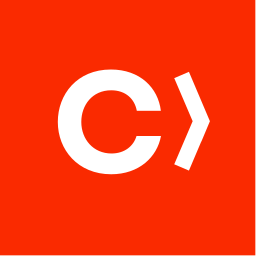</a> | **📂 檔名:** `cocoapods.svg` ✨ **格式:** `Vector (SVG)` ⚖️ **大小:** `1.22KB` 📅 **更新:** `2026-03-02`  🚀 **jsDelivr Markdown:** `` 🔗 **直接連結 (Url):** <code>https://cdn.jsdelivr.net/gh/barry028/materials@main/images/iCons/Brands/cocoapods.svg</code> 📥 [檢視原始檔](cocoapods.svg) |
| <a href="coda-icon.svg">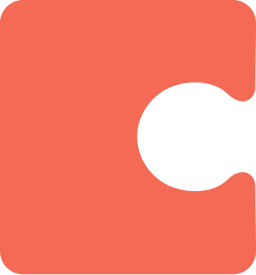</a> | **📂 檔名:** `coda-icon.svg` ✨ **格式:** `Vector (SVG)` ⚖️ **大小:** `1.43KB` 📅 **更新:** `2026-03-02`  🚀 **jsDelivr Markdown:** `` 🔗 **直接連結 (Url):** <code>https://cdn.jsdelivr.net/gh/barry028/materials@main/images/iCons/Brands/coda-icon.svg</code> 📥 [檢視原始檔](coda-icon.svg) |
|  | **📂 檔名:** `coda.svg` ✨ **格式:** `Vector (SVG)` ⚖️ **大小:** `3.04KB` 📅 **更新:** `2026-03-02`  🚀 **jsDelivr Markdown:** `` 🔗 **直接連結 (Url):** <code>https://cdn.jsdelivr.net/gh/barry028/materials@main/images/iCons/Brands/coda.svg</code> 📥 [檢視原始檔](coda.svg) |
|  | **📂 檔名:** `codacy.svg` ✨ **格式:** `Vector (SVG)` ⚖️ **大小:** `1.87KB` 📅 **更新:** `2026-03-02`  🚀 **jsDelivr Markdown:** `` 🔗 **直接連結 (Url):** <code>https://cdn.jsdelivr.net/gh/barry028/materials@main/images/iCons/Brands/codacy.svg</code> 📥 [檢視原始檔](codacy.svg) |
|  | **📂 檔名:** `codebase.svg` ✨ **格式:** `Vector (SVG)` ⚖️ **大小:** `9.28KB` 📅 **更新:** `2026-03-02`  🚀 **jsDelivr Markdown:** `` 🔗 **直接連結 (Url):** <code>https://cdn.jsdelivr.net/gh/barry028/materials@main/images/iCons/Brands/codebase.svg</code> 📥 [檢視原始檔](codebase.svg) |
| <a href="codebeat.svg">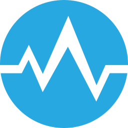</a> | **📂 檔名:** `codebeat.svg` ✨ **格式:** `Vector (SVG)` ⚖️ **大小:** `856.00B` 📅 **更新:** `2026-03-02`  🚀 **jsDelivr Markdown:** `` 🔗 **直接連結 (Url):** <code>https://cdn.jsdelivr.net/gh/barry028/materials@main/images/iCons/Brands/codebeat.svg</code> 📥 [檢視原始檔](codebeat.svg) |
|  | **📂 檔名:** `codecademy.svg` ✨ **格式:** `Vector (SVG)` ⚖️ **大小:** `17.05KB` 📅 **更新:** `2026-03-02`  🚀 **jsDelivr Markdown:** `` 🔗 **直接連結 (Url):** <code>https://cdn.jsdelivr.net/gh/barry028/materials@main/images/iCons/Brands/codecademy.svg</code> 📥 [檢視原始檔](codecademy.svg) |
|  | **📂 檔名:** `codeception.svg` ✨ **格式:** `Vector (SVG)` ⚖️ **大小:** `1.54KB` 📅 **更新:** `2026-03-02`  🚀 **jsDelivr Markdown:** `` 🔗 **直接連結 (Url):** <code>https://cdn.jsdelivr.net/gh/barry028/materials@main/images/iCons/Brands/codeception.svg</code> 📥 [檢視原始檔](codeception.svg) |
|  | **📂 檔名:** `codeclimate-icon.svg` ✨ **格式:** `Vector (SVG)` ⚖️ **大小:** `730.00B` 📅 **更新:** `2026-03-02`  🚀 **jsDelivr Markdown:** `` 🔗 **直接連結 (Url):** <code>https://cdn.jsdelivr.net/gh/barry028/materials@main/images/iCons/Brands/codeclimate-icon.svg</code> 📥 [檢視原始檔](codeclimate-icon.svg) |
|  | **📂 檔名:** `codeclimate.svg` ✨ **格式:** `Vector (SVG)` ⚖️ **大小:** `8.22KB` 📅 **更新:** `2026-03-02`  🚀 **jsDelivr Markdown:** `` 🔗 **直接連結 (Url):** <code>https://cdn.jsdelivr.net/gh/barry028/materials@main/images/iCons/Brands/codeclimate.svg</code> 📥 [檢視原始檔](codeclimate.svg) |
| <a href="codecov-icon.svg">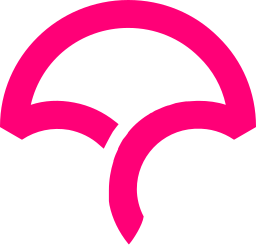</a> | **📂 檔名:** `codecov-icon.svg` ✨ **格式:** `Vector (SVG)` ⚖️ **大小:** `3.11KB` 📅 **更新:** `2026-03-02`  🚀 **jsDelivr Markdown:** `` 🔗 **直接連結 (Url):** <code>https://cdn.jsdelivr.net/gh/barry028/materials@main/images/iCons/Brands/codecov-icon.svg</code> 📥 [檢視原始檔](codecov-icon.svg) |
|  | **📂 檔名:** `codecov.svg` ✨ **格式:** `Vector (SVG)` ⚖️ **大小:** `7.26KB` 📅 **更新:** `2026-03-02`  🚀 **jsDelivr Markdown:** `` 🔗 **直接連結 (Url):** <code>https://cdn.jsdelivr.net/gh/barry028/materials@main/images/iCons/Brands/codecov.svg</code> 📥 [檢視原始檔](codecov.svg) |
| <a href="codefactor-icon.svg">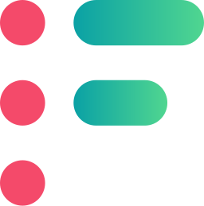</a> | **📂 檔名:** `codefactor-icon.svg` ✨ **格式:** `Vector (SVG)` ⚖️ **大小:** `2.36KB` 📅 **更新:** `2026-03-02`  🚀 **jsDelivr Markdown:** `` 🔗 **直接連結 (Url):** <code>https://cdn.jsdelivr.net/gh/barry028/materials@main/images/iCons/Brands/codefactor-icon.svg</code> 📥 [檢視原始檔](codefactor-icon.svg) |
|  | **📂 檔名:** `codefactor.svg` ✨ **格式:** `Vector (SVG)` ⚖️ **大小:** `10.82KB` 📅 **更新:** `2026-03-02`  🚀 **jsDelivr Markdown:** `` 🔗 **直接連結 (Url):** <code>https://cdn.jsdelivr.net/gh/barry028/materials@main/images/iCons/Brands/codefactor.svg</code> 📥 [檢視原始檔](codefactor.svg) |
|  | **📂 檔名:** `codeigniter-icon.svg` ✨ **格式:** `Vector (SVG)` ⚖️ **大小:** `2.04KB` 📅 **更新:** `2026-03-02`  🚀 **jsDelivr Markdown:** `` 🔗 **直接連結 (Url):** <code>https://cdn.jsdelivr.net/gh/barry028/materials@main/images/iCons/Brands/codeigniter-icon.svg</code> 📥 [檢視原始檔](codeigniter-icon.svg) |
|  | **📂 檔名:** `codeigniter.svg` ✨ **格式:** `Vector (SVG)` ⚖️ **大小:** `18.23KB` 📅 **更新:** `2026-03-02`  🚀 **jsDelivr Markdown:** `` 🔗 **直接連結 (Url):** <code>https://cdn.jsdelivr.net/gh/barry028/materials@main/images/iCons/Brands/codeigniter.svg</code> 📥 [檢視原始檔](codeigniter.svg) |
|  | **📂 檔名:** `codepen-icon.svg` ✨ **格式:** `Vector (SVG)` ⚖️ **大小:** `2.68KB` 📅 **更新:** `2026-03-02`  🚀 **jsDelivr Markdown:** `` 🔗 **直接連結 (Url):** <code>https://cdn.jsdelivr.net/gh/barry028/materials@main/images/iCons/Brands/codepen-icon.svg</code> 📥 [檢視原始檔](codepen-icon.svg) |
|  | **📂 檔名:** `codepen.svg` ✨ **格式:** `Vector (SVG)` ⚖️ **大小:** `8.94KB` 📅 **更新:** `2026-03-02`  🚀 **jsDelivr Markdown:** `` 🔗 **直接連結 (Url):** <code>https://cdn.jsdelivr.net/gh/barry028/materials@main/images/iCons/Brands/codepen.svg</code> 📥 [檢視原始檔](codepen.svg) |
|  | **📂 檔名:** `codersrank-icon.svg` ✨ **格式:** `Vector (SVG)` ⚖️ **大小:** `3.20KB` 📅 **更新:** `2026-03-02`  🚀 **jsDelivr Markdown:** `` 🔗 **直接連結 (Url):** <code>https://cdn.jsdelivr.net/gh/barry028/materials@main/images/iCons/Brands/codersrank-icon.svg</code> 📥 [檢視原始檔](codersrank-icon.svg) |
|  | **📂 檔名:** `codersrank.svg` ✨ **格式:** `Vector (SVG)` ⚖️ **大小:** `14.69KB` 📅 **更新:** `2026-03-02`  🚀 **jsDelivr Markdown:** `` 🔗 **直接連結 (Url):** <code>https://cdn.jsdelivr.net/gh/barry028/materials@main/images/iCons/Brands/codersrank.svg</code> 📥 [檢視原始檔](codersrank.svg) |
| <a href="coderwall.svg">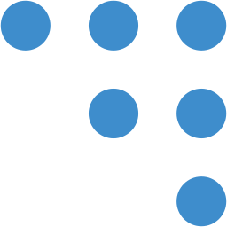</a> | **📂 檔名:** `coderwall.svg` ✨ **格式:** `Vector (SVG)` ⚖️ **大小:** `641.00B` 📅 **更新:** `2026-03-02`  🚀 **jsDelivr Markdown:** `` 🔗 **直接連結 (Url):** <code>https://cdn.jsdelivr.net/gh/barry028/materials@main/images/iCons/Brands/coderwall.svg</code> 📥 [檢視原始檔](coderwall.svg) |
|  | **📂 檔名:** `codesandbox-icon.svg` ✨ **格式:** `Vector (SVG)` ⚖️ **大小:** `426.00B` 📅 **更新:** `2026-03-02`  🚀 **jsDelivr Markdown:** `` 🔗 **直接連結 (Url):** <code>https://cdn.jsdelivr.net/gh/barry028/materials@main/images/iCons/Brands/codesandbox-icon.svg</code> 📥 [檢視原始檔](codesandbox-icon.svg) |
|  | **📂 檔名:** `codesandbox.svg` ✨ **格式:** `Vector (SVG)` ⚖️ **大小:** `7.46KB` 📅 **更新:** `2026-03-02`  🚀 **jsDelivr Markdown:** `` 🔗 **直接連結 (Url):** <code>https://cdn.jsdelivr.net/gh/barry028/materials@main/images/iCons/Brands/codesandbox.svg</code> 📥 [檢視原始檔](codesandbox.svg) |
|  | **📂 檔名:** `codesee-icon.svg` ✨ **格式:** `Vector (SVG)` ⚖️ **大小:** `1.20KB` 📅 **更新:** `2026-03-02`  🚀 **jsDelivr Markdown:** `` 🔗 **直接連結 (Url):** <code>https://cdn.jsdelivr.net/gh/barry028/materials@main/images/iCons/Brands/codesee-icon.svg</code> 📥 [檢視原始檔](codesee-icon.svg) |
|  | **📂 檔名:** `codesee.svg` ✨ **格式:** `Vector (SVG)` ⚖️ **大小:** `6.00KB` 📅 **更新:** `2026-03-02`  🚀 **jsDelivr Markdown:** `` 🔗 **直接連結 (Url):** <code>https://cdn.jsdelivr.net/gh/barry028/materials@main/images/iCons/Brands/codesee.svg</code> 📥 [檢視原始檔](codesee.svg) |
|  | **📂 檔名:** `codio.svg` ✨ **格式:** `Vector (SVG)` ⚖️ **大小:** `1.04KB` 📅 **更新:** `2026-03-02`  🚀 **jsDelivr Markdown:** `` 🔗 **直接連結 (Url):** <code>https://cdn.jsdelivr.net/gh/barry028/materials@main/images/iCons/Brands/codio.svg</code> 📥 [檢視原始檔](codio.svg) |
|  | **📂 檔名:** `coffeescript.svg` ✨ **格式:** `Vector (SVG)` ⚖️ **大小:** `4.04KB` 📅 **更新:** `2026-03-02`  🚀 **jsDelivr Markdown:** `` 🔗 **直接連結 (Url):** <code>https://cdn.jsdelivr.net/gh/barry028/materials@main/images/iCons/Brands/coffeescript.svg</code> 📥 [檢視原始檔](coffeescript.svg) |
|  | **📂 檔名:** `commitizen.svg` ✨ **格式:** `Vector (SVG)` ⚖️ **大小:** `28.99KB` 📅 **更新:** `2026-03-02`  🚀 **jsDelivr Markdown:** `` 🔗 **直接連結 (Url):** <code>https://cdn.jsdelivr.net/gh/barry028/materials@main/images/iCons/Brands/commitizen.svg</code> 📥 [檢視原始檔](commitizen.svg) |
|  | **📂 檔名:** `compass.svg` ✨ **格式:** `Vector (SVG)` ⚖️ **大小:** `3.83KB` 📅 **更新:** `2026-03-02`  🚀 **jsDelivr Markdown:** `` 🔗 **直接連結 (Url):** <code>https://cdn.jsdelivr.net/gh/barry028/materials@main/images/iCons/Brands/compass.svg</code> 📥 [檢視原始檔](compass.svg) |
| <a href="componentkit.svg">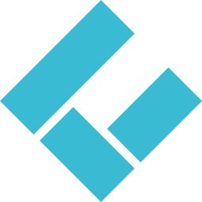</a> | **📂 檔名:** `componentkit.svg` ✨ **格式:** `Vector (SVG)` ⚖️ **大小:** `579.00B` 📅 **更新:** `2026-03-02`  🚀 **jsDelivr Markdown:** `` 🔗 **直接連結 (Url):** <code>https://cdn.jsdelivr.net/gh/barry028/materials@main/images/iCons/Brands/componentkit.svg</code> 📥 [檢視原始檔](componentkit.svg) |
| <a href="compose-multiplatform.svg">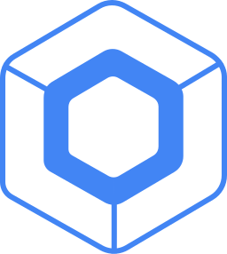</a> | **📂 檔名:** `compose-multiplatform.svg` ✨ **格式:** `Vector (SVG)` ⚖️ **大小:** `5.53KB` 📅 **更新:** `2026-03-02`  🚀 **jsDelivr Markdown:** `` 🔗 **直接連結 (Url):** <code>https://cdn.jsdelivr.net/gh/barry028/materials@main/images/iCons/Brands/compose-multiplatform.svg</code> 📥 [檢視原始檔](compose-multiplatform.svg) |
|  | **📂 檔名:** `compose.svg` ✨ **格式:** `Vector (SVG)` ⚖️ **大小:** `1.38KB` 📅 **更新:** `2026-03-02`  🚀 **jsDelivr Markdown:** `` 🔗 **直接連結 (Url):** <code>https://cdn.jsdelivr.net/gh/barry028/materials@main/images/iCons/Brands/compose.svg</code> 📥 [檢視原始檔](compose.svg) |
|  | **📂 檔名:** `composer.svg` ✨ **格式:** `Vector (SVG)` ⚖️ **大小:** `198.54KB` 📅 **更新:** `2026-03-02`  🚀 **jsDelivr Markdown:** `` 🔗 **直接連結 (Url):** <code>https://cdn.jsdelivr.net/gh/barry028/materials@main/images/iCons/Brands/composer.svg</code> 📥 [檢視原始檔](composer.svg) |
| <a href="conan-io.svg">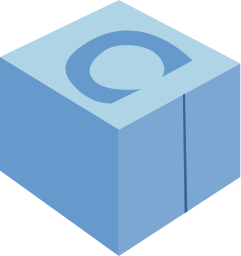</a> | **📂 檔名:** `conan-io.svg` ✨ **格式:** `Vector (SVG)` ⚖️ **大小:** `1.08KB` 📅 **更新:** `2026-03-02`  🚀 **jsDelivr Markdown:** `` 🔗 **直接連結 (Url):** <code>https://cdn.jsdelivr.net/gh/barry028/materials@main/images/iCons/Brands/conan-io.svg</code> 📥 [檢視原始檔](conan-io.svg) |
| <a href="concourse.svg">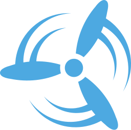</a> | **📂 檔名:** `concourse.svg` ✨ **格式:** `Vector (SVG)` ⚖️ **大小:** `13.64KB` 📅 **更新:** `2026-03-02`  🚀 **jsDelivr Markdown:** `` 🔗 **直接連結 (Url):** <code>https://cdn.jsdelivr.net/gh/barry028/materials@main/images/iCons/Brands/concourse.svg</code> 📥 [檢視原始檔](concourse.svg) |
|  | **📂 檔名:** `concretecms-icon.svg` ✨ **格式:** `Vector (SVG)` ⚖️ **大小:** `2.34KB` 📅 **更新:** `2026-03-02`  🚀 **jsDelivr Markdown:** `` 🔗 **直接連結 (Url):** <code>https://cdn.jsdelivr.net/gh/barry028/materials@main/images/iCons/Brands/concretecms-icon.svg</code> 📥 [檢視原始檔](concretecms-icon.svg) |
|  | **📂 檔名:** `concretecms.svg` ✨ **格式:** `Vector (SVG)` ⚖️ **大小:** `15.50KB` 📅 **更新:** `2026-03-02`  🚀 **jsDelivr Markdown:** `` 🔗 **直接連結 (Url):** <code>https://cdn.jsdelivr.net/gh/barry028/materials@main/images/iCons/Brands/concretecms.svg</code> 📥 [檢視原始檔](concretecms.svg) |
|  | **📂 檔名:** `conda.svg` ✨ **格式:** `Vector (SVG)` ⚖️ **大小:** `19.39KB` 📅 **更新:** `2026-03-02`  🚀 **jsDelivr Markdown:** `` 🔗 **直接連結 (Url):** <code>https://cdn.jsdelivr.net/gh/barry028/materials@main/images/iCons/Brands/conda.svg</code> 📥 [檢視原始檔](conda.svg) |
|  | **📂 檔名:** `confluence.svg` ✨ **格式:** `Vector (SVG)` ⚖️ **大小:** `2.49KB` 📅 **更新:** `2026-03-02`  🚀 **jsDelivr Markdown:** `` 🔗 **直接連結 (Url):** <code>https://cdn.jsdelivr.net/gh/barry028/materials@main/images/iCons/Brands/confluence.svg</code> 📥 [檢視原始檔](confluence.svg) |
| <a href="consul.svg">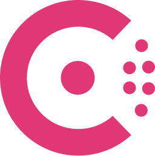</a> | **📂 檔名:** `consul.svg` ✨ **格式:** `Vector (SVG)` ⚖️ **大小:** `2.75KB` 📅 **更新:** `2026-03-02`  🚀 **jsDelivr Markdown:** `` 🔗 **直接連結 (Url):** <code>https://cdn.jsdelivr.net/gh/barry028/materials@main/images/iCons/Brands/consul.svg</code> 📥 [檢視原始檔](consul.svg) |
| <a href="contentful.svg">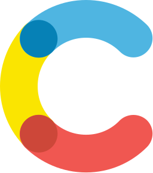</a> | **📂 檔名:** `contentful.svg` ✨ **格式:** `Vector (SVG)` ⚖️ **大小:** `2.10KB` 📅 **更新:** `2026-03-02`  🚀 **jsDelivr Markdown:** `` 🔗 **直接連結 (Url):** <code>https://cdn.jsdelivr.net/gh/barry028/materials@main/images/iCons/Brands/contentful.svg</code> 📥 [檢視原始檔](contentful.svg) |
|  | **📂 檔名:** `convox-icon.svg` ✨ **格式:** `Vector (SVG)` ⚖️ **大小:** `858.00B` 📅 **更新:** `2026-03-02`  🚀 **jsDelivr Markdown:** `` 🔗 **直接連結 (Url):** <code>https://cdn.jsdelivr.net/gh/barry028/materials@main/images/iCons/Brands/convox-icon.svg</code> 📥 [檢視原始檔](convox-icon.svg) |
|  | **📂 檔名:** `convox.svg` ✨ **格式:** `Vector (SVG)` ⚖️ **大小:** `6.00KB` 📅 **更新:** `2026-03-02`  🚀 **jsDelivr Markdown:** `` 🔗 **直接連結 (Url):** <code>https://cdn.jsdelivr.net/gh/barry028/materials@main/images/iCons/Brands/convox.svg</code> 📥 [檢視原始檔](convox.svg) |
|  | **📂 檔名:** `copyleft-pirate.svg` ✨ **格式:** `Vector (SVG)` ⚖️ **大小:** `9.09KB` 📅 **更新:** `2026-03-02`  🚀 **jsDelivr Markdown:** `` 🔗 **直接連結 (Url):** <code>https://cdn.jsdelivr.net/gh/barry028/materials@main/images/iCons/Brands/copyleft-pirate.svg</code> 📥 [檢視原始檔](copyleft-pirate.svg) |
|  | **📂 檔名:** `copyleft.svg` ✨ **格式:** `Vector (SVG)` ⚖️ **大小:** `1.31KB` 📅 **更新:** `2026-03-02`  🚀 **jsDelivr Markdown:** `` 🔗 **直接連結 (Url):** <code>https://cdn.jsdelivr.net/gh/barry028/materials@main/images/iCons/Brands/copyleft.svg</code> 📥 [檢視原始檔](copyleft.svg) |
|  | **📂 檔名:** `corda.svg` ✨ **格式:** `Vector (SVG)` ⚖️ **大小:** `2.77KB` 📅 **更新:** `2026-03-02`  🚀 **jsDelivr Markdown:** `` 🔗 **直接連結 (Url):** <code>https://cdn.jsdelivr.net/gh/barry028/materials@main/images/iCons/Brands/corda.svg</code> 📥 [檢視原始檔](corda.svg) |
| <a href="cordova.svg">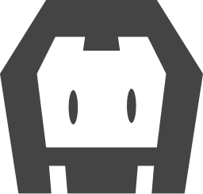</a> | **📂 檔名:** `cordova.svg` ✨ **格式:** `Vector (SVG)` ⚖️ **大小:** `1.36KB` 📅 **更新:** `2026-03-02`  🚀 **jsDelivr Markdown:** `` 🔗 **直接連結 (Url):** <code>https://cdn.jsdelivr.net/gh/barry028/materials@main/images/iCons/Brands/cordova.svg</code> 📥 [檢視原始檔](cordova.svg) |
|  | **📂 檔名:** `couchbase.svg` ✨ **格式:** `Vector (SVG)` ⚖️ **大小:** `1.35KB` 📅 **更新:** `2026-03-02`  🚀 **jsDelivr Markdown:** `` 🔗 **直接連結 (Url):** <code>https://cdn.jsdelivr.net/gh/barry028/materials@main/images/iCons/Brands/couchbase.svg</code> 📥 [檢視原始檔](couchbase.svg) |
|  | **📂 檔名:** `couchdb-icon.svg` ✨ **格式:** `Vector (SVG)` ⚖️ **大小:** `2.39KB` 📅 **更新:** `2026-03-02`  🚀 **jsDelivr Markdown:** `` 🔗 **直接連結 (Url):** <code>https://cdn.jsdelivr.net/gh/barry028/materials@main/images/iCons/Brands/couchdb-icon.svg</code> 📥 [檢視原始檔](couchdb-icon.svg) |
|  | **📂 檔名:** `couchdb.svg` ✨ **格式:** `Vector (SVG)` ⚖️ **大小:** `11.33KB` 📅 **更新:** `2026-03-02`  🚀 **jsDelivr Markdown:** `` 🔗 **直接連結 (Url):** <code>https://cdn.jsdelivr.net/gh/barry028/materials@main/images/iCons/Brands/couchdb.svg</code> 📥 [檢視原始檔](couchdb.svg) |
|  | **📂 檔名:** `coursera.svg` ✨ **格式:** `Vector (SVG)` ⚖️ **大小:** `5.19KB` 📅 **更新:** `2026-03-02`  🚀 **jsDelivr Markdown:** `` 🔗 **直接連結 (Url):** <code>https://cdn.jsdelivr.net/gh/barry028/materials@main/images/iCons/Brands/coursera.svg</code> 📥 [檢視原始檔](coursera.svg) |
|  | **📂 檔名:** `coveralls.svg` ✨ **格式:** `Vector (SVG)` ⚖️ **大小:** `22.67KB` 📅 **更新:** `2026-03-02`  🚀 **jsDelivr Markdown:** `` 🔗 **直接連結 (Url):** <code>https://cdn.jsdelivr.net/gh/barry028/materials@main/images/iCons/Brands/coveralls.svg</code> 📥 [檢視原始檔](coveralls.svg) |
|  | **📂 檔名:** `cpanel.svg` ✨ **格式:** `Vector (SVG)` ⚖️ **大小:** `8.92KB` 📅 **更新:** `2026-03-02`  🚀 **jsDelivr Markdown:** `` 🔗 **直接連結 (Url):** <code>https://cdn.jsdelivr.net/gh/barry028/materials@main/images/iCons/Brands/cpanel.svg</code> 📥 [檢視原始檔](cpanel.svg) |
|  | **📂 檔名:** `craftcms.svg` ✨ **格式:** `Vector (SVG)` ⚖️ **大小:** `6.25KB` 📅 **更新:** `2026-03-02`  🚀 **jsDelivr Markdown:** `` 🔗 **直接連結 (Url):** <code>https://cdn.jsdelivr.net/gh/barry028/materials@main/images/iCons/Brands/craftcms.svg</code> 📥 [檢視原始檔](craftcms.svg) |
|  | **📂 檔名:** `crashlytics.svg` ✨ **格式:** `Vector (SVG)` ⚖️ **大小:** `2.08KB` 📅 **更新:** `2026-03-02`  🚀 **jsDelivr Markdown:** `` 🔗 **直接連結 (Url):** <code>https://cdn.jsdelivr.net/gh/barry028/materials@main/images/iCons/Brands/crashlytics.svg</code> 📥 [檢視原始檔](crashlytics.svg) |
|  | **📂 檔名:** `crateio.svg` ✨ **格式:** `Vector (SVG)` ⚖️ **大小:** `406.00B` 📅 **更新:** `2026-03-02`  🚀 **jsDelivr Markdown:** `` 🔗 **直接連結 (Url):** <code>https://cdn.jsdelivr.net/gh/barry028/materials@main/images/iCons/Brands/crateio.svg</code> 📥 [檢視原始檔](crateio.svg) |
|  | **📂 檔名:** `create-react-app.svg` ✨ **格式:** `Vector (SVG)` ⚖️ **大小:** `21.85KB` 📅 **更新:** `2026-03-02`  🚀 **jsDelivr Markdown:** `` 🔗 **直接連結 (Url):** <code>https://cdn.jsdelivr.net/gh/barry028/materials@main/images/iCons/Brands/create-react-app.svg</code> 📥 [檢視原始檔](create-react-app.svg) |
|  | **📂 檔名:** `createjs.svg` ✨ **格式:** `Vector (SVG)` ⚖️ **大小:** `1.94KB` 📅 **更新:** `2026-03-02`  🚀 **jsDelivr Markdown:** `` 🔗 **直接連結 (Url):** <code>https://cdn.jsdelivr.net/gh/barry028/materials@main/images/iCons/Brands/createjs.svg</code> 📥 [檢視原始檔](createjs.svg) |
|  | **📂 檔名:** `crucible.svg` ✨ **格式:** `Vector (SVG)` ⚖️ **大小:** `1.69KB` 📅 **更新:** `2026-03-02`  🚀 **jsDelivr Markdown:** `` 🔗 **直接連結 (Url):** <code>https://cdn.jsdelivr.net/gh/barry028/materials@main/images/iCons/Brands/crucible.svg</code> 📥 [檢視原始檔](crucible.svg) |
|  | **📂 檔名:** `crystal.svg` ✨ **格式:** `Vector (SVG)` ⚖️ **大小:** `452.00B` 📅 **更新:** `2026-03-02`  🚀 **jsDelivr Markdown:** `` 🔗 **直接連結 (Url):** <code>https://cdn.jsdelivr.net/gh/barry028/materials@main/images/iCons/Brands/crystal.svg</code> 📥 [檢視原始檔](crystal.svg) |
|  | **📂 檔名:** `css-3.svg` ✨ **格式:** `Vector (SVG)` ⚖️ **大小:** `2.44KB` 📅 **更新:** `2026-03-02`  🚀 **jsDelivr Markdown:** `` 🔗 **直接連結 (Url):** <code>https://cdn.jsdelivr.net/gh/barry028/materials@main/images/iCons/Brands/css-3.svg</code> 📥 [檢視原始檔](css-3.svg) |
|  | **📂 檔名:** `css-3_official.svg` ✨ **格式:** `Vector (SVG)` ⚖️ **大小:** `647.00B` 📅 **更新:** `2026-03-02`  🚀 **jsDelivr Markdown:** `` 🔗 **直接連結 (Url):** <code>https://cdn.jsdelivr.net/gh/barry028/materials@main/images/iCons/Brands/css-3_official.svg</code> 📥 [檢視原始檔](css-3_official.svg) |
| <a href="cssnext.svg">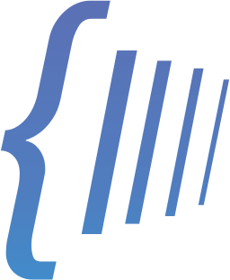</a> | **📂 檔名:** `cssnext.svg` ✨ **格式:** `Vector (SVG)` ⚖️ **大小:** `5.13KB` 📅 **更新:** `2026-03-02`  🚀 **jsDelivr Markdown:** `` 🔗 **直接連結 (Url):** <code>https://cdn.jsdelivr.net/gh/barry028/materials@main/images/iCons/Brands/cssnext.svg</code> 📥 [檢視原始檔](cssnext.svg) |
|  | **📂 檔名:** `cube-icon.svg` ✨ **格式:** `Vector (SVG)` ⚖️ **大小:** `1.08KB` 📅 **更新:** `2026-03-02`  🚀 **jsDelivr Markdown:** `` 🔗 **直接連結 (Url):** <code>https://cdn.jsdelivr.net/gh/barry028/materials@main/images/iCons/Brands/cube-icon.svg</code> 📥 [檢視原始檔](cube-icon.svg) |
|  | **📂 檔名:** `cube.svg` ✨ **格式:** `Vector (SVG)` ⚖️ **大小:** `3.76KB` 📅 **更新:** `2026-03-02`  🚀 **jsDelivr Markdown:** `` 🔗 **直接連結 (Url):** <code>https://cdn.jsdelivr.net/gh/barry028/materials@main/images/iCons/Brands/cube.svg</code> 📥 [檢視原始檔](cube.svg) |
|  | **📂 檔名:** `cucumber.svg` ✨ **格式:** `Vector (SVG)` ⚖️ **大小:** `5.54KB` 📅 **更新:** `2026-03-02`  🚀 **jsDelivr Markdown:** `` 🔗 **直接連結 (Url):** <code>https://cdn.jsdelivr.net/gh/barry028/materials@main/images/iCons/Brands/cucumber.svg</code> 📥 [檢視原始檔](cucumber.svg) |
| <a href="curl.svg">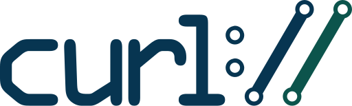</a> | **📂 檔名:** `curl.svg` ✨ **格式:** `Vector (SVG)` ⚖️ **大小:** `8.17KB` 📅 **更新:** `2026-03-02`  🚀 **jsDelivr Markdown:** `` 🔗 **直接連結 (Url):** <code>https://cdn.jsdelivr.net/gh/barry028/materials@main/images/iCons/Brands/curl.svg</code> 📥 [檢視原始檔](curl.svg) |
|  | **📂 檔名:** `customerio-icon.svg` ✨ **格式:** `Vector (SVG)` ⚖️ **大小:** `1.70KB` 📅 **更新:** `2026-03-02`  🚀 **jsDelivr Markdown:** `` 🔗 **直接連結 (Url):** <code>https://cdn.jsdelivr.net/gh/barry028/materials@main/images/iCons/Brands/customerio-icon.svg</code> 📥 [檢視原始檔](customerio-icon.svg) |
|  | **📂 檔名:** `customerio.svg` ✨ **格式:** `Vector (SVG)` ⚖️ **大小:** `12.25KB` 📅 **更新:** `2026-03-02`  🚀 **jsDelivr Markdown:** `` 🔗 **直接連結 (Url):** <code>https://cdn.jsdelivr.net/gh/barry028/materials@main/images/iCons/Brands/customerio.svg</code> 📥 [檢視原始檔](customerio.svg) |
| <a href="cyclejs.svg">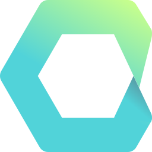</a> | **📂 檔名:** `cyclejs.svg` ✨ **格式:** `Vector (SVG)` ⚖️ **大小:** `1.55KB` 📅 **更新:** `2026-03-02`  🚀 **jsDelivr Markdown:** `` 🔗 **直接連結 (Url):** <code>https://cdn.jsdelivr.net/gh/barry028/materials@main/images/iCons/Brands/cyclejs.svg</code> 📥 [檢視原始檔](cyclejs.svg) |
|  | **📂 檔名:** `cypress-icon.svg` ✨ **格式:** `Vector (SVG)` ⚖️ **大小:** `4.24KB` 📅 **更新:** `2026-03-02`  🚀 **jsDelivr Markdown:** `` 🔗 **直接連結 (Url):** <code>https://cdn.jsdelivr.net/gh/barry028/materials@main/images/iCons/Brands/cypress-icon.svg</code> 📥 [檢視原始檔](cypress-icon.svg) |
| <a href="cypress.svg">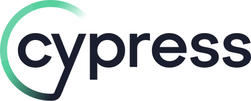</a> | **📂 檔名:** `cypress.svg` ✨ **格式:** `Vector (SVG)` ⚖️ **大小:** `8.05KB` 📅 **更新:** `2026-03-02`  🚀 **jsDelivr Markdown:** `` 🔗 **直接連結 (Url):** <code>https://cdn.jsdelivr.net/gh/barry028/materials@main/images/iCons/Brands/cypress.svg</code> 📥 [檢視原始檔](cypress.svg) |
|  | **📂 檔名:** `d3.svg` ✨ **格式:** `Vector (SVG)` ⚖️ **大小:** `4.90KB` 📅 **更新:** `2026-03-02`  🚀 **jsDelivr Markdown:** `` 🔗 **直接連結 (Url):** <code>https://cdn.jsdelivr.net/gh/barry028/materials@main/images/iCons/Brands/d3.svg</code> 📥 [檢視原始檔](d3.svg) |
|  | **📂 檔名:** `dailydev-icon.svg` ✨ **格式:** `Vector (SVG)` ⚖️ **大小:** `1.22KB` 📅 **更新:** `2026-03-02`  🚀 **jsDelivr Markdown:** `` 🔗 **直接連結 (Url):** <code>https://cdn.jsdelivr.net/gh/barry028/materials@main/images/iCons/Brands/dailydev-icon.svg</code> 📥 [檢視原始檔](dailydev-icon.svg) |
|  | **📂 檔名:** `dailydev.svg` ✨ **格式:** `Vector (SVG)` ⚖️ **大小:** `7.58KB` 📅 **更新:** `2026-03-02`  🚀 **jsDelivr Markdown:** `` 🔗 **直接連結 (Url):** <code>https://cdn.jsdelivr.net/gh/barry028/materials@main/images/iCons/Brands/dailydev.svg</code> 📥 [檢視原始檔](dailydev.svg) |
|  | **📂 檔名:** `daisyUI.svg` ✨ **格式:** `Vector (SVG)` ⚖️ **大小:** `8.13KB` 📅 **更新:** `2026-03-02`  🚀 **jsDelivr Markdown:** `` 🔗 **直接連結 (Url):** <code>https://cdn.jsdelivr.net/gh/barry028/materials@main/images/iCons/Brands/daisyUI.svg</code> 📥 [檢視原始檔](daisyUI.svg) |
|  | **📂 檔名:** `danfo.svg` ✨ **格式:** `Vector (SVG)` ⚖️ **大小:** `1.50KB` 📅 **更新:** `2026-03-02`  🚀 **jsDelivr Markdown:** `` 🔗 **直接連結 (Url):** <code>https://cdn.jsdelivr.net/gh/barry028/materials@main/images/iCons/Brands/danfo.svg</code> 📥 [檢視原始檔](danfo.svg) |
| <a href="dart.svg">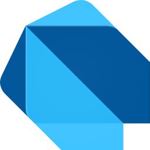</a> | **📂 檔名:** `dart.svg` ✨ **格式:** `Vector (SVG)` ⚖️ **大小:** `3.27KB` 📅 **更新:** `2026-03-02`  🚀 **jsDelivr Markdown:** `` 🔗 **直接連結 (Url):** <code>https://cdn.jsdelivr.net/gh/barry028/materials@main/images/iCons/Brands/dart.svg</code> 📥 [檢視原始檔](dart.svg) |
|  | **📂 檔名:** `dashlane-icon.svg` ✨ **格式:** `Vector (SVG)` ⚖️ **大小:** `2.87KB` 📅 **更新:** `2026-03-02`  🚀 **jsDelivr Markdown:** `` 🔗 **直接連結 (Url):** <code>https://cdn.jsdelivr.net/gh/barry028/materials@main/images/iCons/Brands/dashlane-icon.svg</code> 📥 [檢視原始檔](dashlane-icon.svg) |
|  | **📂 檔名:** `dashlane.svg` ✨ **格式:** `Vector (SVG)` ⚖️ **大小:** `14.03KB` 📅 **更新:** `2026-03-02`  🚀 **jsDelivr Markdown:** `` 🔗 **直接連結 (Url):** <code>https://cdn.jsdelivr.net/gh/barry028/materials@main/images/iCons/Brands/dashlane.svg</code> 📥 [檢視原始檔](dashlane.svg) |
|  | **📂 檔名:** `data-station.svg` ✨ **格式:** `Vector (SVG)` ⚖️ **大小:** `1.68KB` 📅 **更新:** `2026-03-02`  🚀 **jsDelivr Markdown:** `` 🔗 **直接連結 (Url):** <code>https://cdn.jsdelivr.net/gh/barry028/materials@main/images/iCons/Brands/data-station.svg</code> 📥 [檢視原始檔](data-station.svg) |
| <a href="database-labs.svg">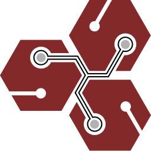</a> | **📂 檔名:** `database-labs.svg` ✨ **格式:** `Vector (SVG)` ⚖️ **大小:** `4.44KB` 📅 **更新:** `2026-03-02`  🚀 **jsDelivr Markdown:** `` 🔗 **直接連結 (Url):** <code>https://cdn.jsdelivr.net/gh/barry028/materials@main/images/iCons/Brands/database-labs.svg</code> 📥 [檢視原始檔](database-labs.svg) |
|  | **📂 檔名:** `datadog.svg` ✨ **格式:** `Vector (SVG)` ⚖️ **大小:** `7.89KB` 📅 **更新:** `2026-03-02`  🚀 **jsDelivr Markdown:** `` 🔗 **直接連結 (Url):** <code>https://cdn.jsdelivr.net/gh/barry028/materials@main/images/iCons/Brands/datadog.svg</code> 📥 [檢視原始檔](datadog.svg) |
| <a href="datagrip.svg">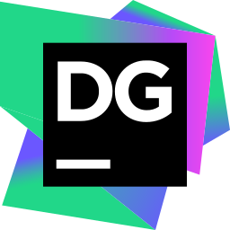</a> | **📂 檔名:** `datagrip.svg` ✨ **格式:** `Vector (SVG)` ⚖️ **大小:** `4.07KB` 📅 **更新:** `2026-03-02`  🚀 **jsDelivr Markdown:** `` 🔗 **直接連結 (Url):** <code>https://cdn.jsdelivr.net/gh/barry028/materials@main/images/iCons/Brands/datagrip.svg</code> 📥 [檢視原始檔](datagrip.svg) |
| <a href="dataspell.svg">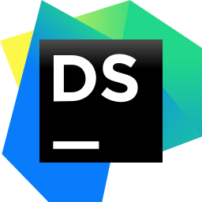</a> | **📂 檔名:** `dataspell.svg` ✨ **格式:** `Vector (SVG)` ⚖️ **大小:** `3.39KB` 📅 **更新:** `2026-03-02`  🚀 **jsDelivr Markdown:** `` 🔗 **直接連結 (Url):** <code>https://cdn.jsdelivr.net/gh/barry028/materials@main/images/iCons/Brands/dataspell.svg</code> 📥 [檢視原始檔](dataspell.svg) |
| <a href="datocms-icon.svg">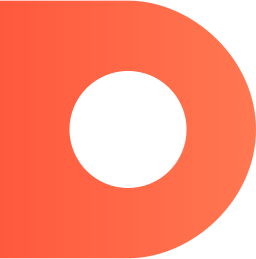</a> | **📂 檔名:** `datocms-icon.svg` ✨ **格式:** `Vector (SVG)` ⚖️ **大小:** `1.16KB` 📅 **更新:** `2026-03-02`  🚀 **jsDelivr Markdown:** `` 🔗 **直接連結 (Url):** <code>https://cdn.jsdelivr.net/gh/barry028/materials@main/images/iCons/Brands/datocms-icon.svg</code> 📥 [檢視原始檔](datocms-icon.svg) |
|  | **📂 檔名:** `datocms.svg` ✨ **格式:** `Vector (SVG)` ⚖️ **大小:** `4.95KB` 📅 **更新:** `2026-03-02`  🚀 **jsDelivr Markdown:** `` 🔗 **直接連結 (Url):** <code>https://cdn.jsdelivr.net/gh/barry028/materials@main/images/iCons/Brands/datocms.svg</code> 📥 [檢視原始檔](datocms.svg) |
| <a href="dbt-icon.svg">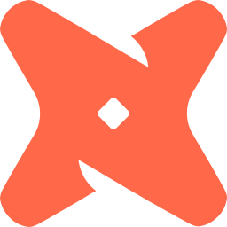</a> | **📂 檔名:** `dbt-icon.svg` ✨ **格式:** `Vector (SVG)` ⚖️ **大小:** `2.97KB` 📅 **更新:** `2026-03-02`  🚀 **jsDelivr Markdown:** `` 🔗 **直接連結 (Url):** <code>https://cdn.jsdelivr.net/gh/barry028/materials@main/images/iCons/Brands/dbt-icon.svg</code> 📥 [檢視原始檔](dbt-icon.svg) |
|  | **📂 檔名:** `dbt.svg` ✨ **格式:** `Vector (SVG)` ⚖️ **大小:** `6.32KB` 📅 **更新:** `2026-03-02`  🚀 **jsDelivr Markdown:** `` 🔗 **直接連結 (Url):** <code>https://cdn.jsdelivr.net/gh/barry028/materials@main/images/iCons/Brands/dbt.svg</code> 📥 [檢視原始檔](dbt.svg) |
|  | **📂 檔名:** `dcos-icon.svg` ✨ **格式:** `Vector (SVG)` ⚖️ **大小:** `2.02KB` 📅 **更新:** `2026-03-02`  🚀 **jsDelivr Markdown:** `` 🔗 **直接連結 (Url):** <code>https://cdn.jsdelivr.net/gh/barry028/materials@main/images/iCons/Brands/dcos-icon.svg</code> 📥 [檢視原始檔](dcos-icon.svg) |
|  | **📂 檔名:** `dcos.svg` ✨ **格式:** `Vector (SVG)` ⚖️ **大小:** `11.88KB` 📅 **更新:** `2026-03-02`  🚀 **jsDelivr Markdown:** `` 🔗 **直接連結 (Url):** <code>https://cdn.jsdelivr.net/gh/barry028/materials@main/images/iCons/Brands/dcos.svg</code> 📥 [檢視原始檔](dcos.svg) |
|  | **📂 檔名:** `debian.svg` ✨ **格式:** `Vector (SVG)` ⚖️ **大小:** `7.88KB` 📅 **更新:** `2026-03-02`  🚀 **jsDelivr Markdown:** `` 🔗 **直接連結 (Url):** <code>https://cdn.jsdelivr.net/gh/barry028/materials@main/images/iCons/Brands/debian.svg</code> 📥 [檢視原始檔](debian.svg) |
| <a href="delighted-icon.svg">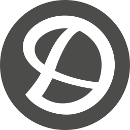</a> | **📂 檔名:** `delighted-icon.svg` ✨ **格式:** `Vector (SVG)` ⚖️ **大小:** `1.23KB` 📅 **更新:** `2026-03-02`  🚀 **jsDelivr Markdown:** `` 🔗 **直接連結 (Url):** <code>https://cdn.jsdelivr.net/gh/barry028/materials@main/images/iCons/Brands/delighted-icon.svg</code> 📥 [檢視原始檔](delighted-icon.svg) |
|  | **📂 檔名:** `delighted.svg` ✨ **格式:** `Vector (SVG)` ⚖️ **大小:** `10.05KB` 📅 **更新:** `2026-03-02`  🚀 **jsDelivr Markdown:** `` 🔗 **直接連結 (Url):** <code>https://cdn.jsdelivr.net/gh/barry028/materials@main/images/iCons/Brands/delighted.svg</code> 📥 [檢視原始檔](delighted.svg) |
|  | **📂 檔名:** `deno.svg` ✨ **格式:** `Vector (SVG)` ⚖️ **大小:** `5.77KB` 📅 **更新:** `2026-03-02`  🚀 **jsDelivr Markdown:** `` 🔗 **直接連結 (Url):** <code>https://cdn.jsdelivr.net/gh/barry028/materials@main/images/iCons/Brands/deno.svg</code> 📥 [檢視原始檔](deno.svg) |
|  | **📂 檔名:** `dependabot.svg` ✨ **格式:** `Vector (SVG)` ⚖️ **大小:** `3.44KB` 📅 **更新:** `2026-03-02`  🚀 **jsDelivr Markdown:** `` 🔗 **直接連結 (Url):** <code>https://cdn.jsdelivr.net/gh/barry028/materials@main/images/iCons/Brands/dependabot.svg</code> 📥 [檢視原始檔](dependabot.svg) |
| <a href="deployhq-icon.svg">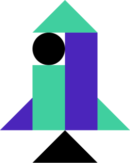</a> | **📂 檔名:** `deployhq-icon.svg` ✨ **格式:** `Vector (SVG)` ⚖️ **大小:** `1.93KB` 📅 **更新:** `2026-03-02`  🚀 **jsDelivr Markdown:** `` 🔗 **直接連結 (Url):** <code>https://cdn.jsdelivr.net/gh/barry028/materials@main/images/iCons/Brands/deployhq-icon.svg</code> 📥 [檢視原始檔](deployhq-icon.svg) |
| <a href="deployhq.svg">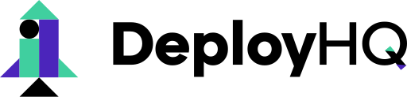</a> | **📂 檔名:** `deployhq.svg` ✨ **格式:** `Vector (SVG)` ⚖️ **大小:** `8.04KB` 📅 **更新:** `2026-03-02`  🚀 **jsDelivr Markdown:** `` 🔗 **直接連結 (Url):** <code>https://cdn.jsdelivr.net/gh/barry028/materials@main/images/iCons/Brands/deployhq.svg</code> 📥 [檢視原始檔](deployhq.svg) |
|  | **📂 檔名:** `derby.svg` ✨ **格式:** `Vector (SVG)` ⚖️ **大小:** `2.76KB` 📅 **更新:** `2026-03-02`  🚀 **jsDelivr Markdown:** `` 🔗 **直接連結 (Url):** <code>https://cdn.jsdelivr.net/gh/barry028/materials@main/images/iCons/Brands/derby.svg</code> 📥 [檢視原始檔](derby.svg) |
|  | **📂 檔名:** `descript-icon.svg` ✨ **格式:** `Vector (SVG)` ⚖️ **大小:** `1.58KB` 📅 **更新:** `2026-03-02`  🚀 **jsDelivr Markdown:** `` 🔗 **直接連結 (Url):** <code>https://cdn.jsdelivr.net/gh/barry028/materials@main/images/iCons/Brands/descript-icon.svg</code> 📥 [檢視原始檔](descript-icon.svg) |
|  | **📂 檔名:** `descript.svg` ✨ **格式:** `Vector (SVG)` ⚖️ **大小:** `6.36KB` 📅 **更新:** `2026-03-02`  🚀 **jsDelivr Markdown:** `` 🔗 **直接連結 (Url):** <code>https://cdn.jsdelivr.net/gh/barry028/materials@main/images/iCons/Brands/descript.svg</code> 📥 [檢視原始檔](descript.svg) |
|  | **📂 檔名:** `designernews.svg` ✨ **格式:** `Vector (SVG)` ⚖️ **大小:** `1.62KB` 📅 **更新:** `2026-03-02`  🚀 **jsDelivr Markdown:** `` 🔗 **直接連結 (Url):** <code>https://cdn.jsdelivr.net/gh/barry028/materials@main/images/iCons/Brands/designernews.svg</code> 📥 [檢視原始檔](designernews.svg) |
|  | **📂 檔名:** `deviantart-icon.svg` ✨ **格式:** `Vector (SVG)` ⚖️ **大小:** `824.00B` 📅 **更新:** `2026-03-02`  🚀 **jsDelivr Markdown:** `` 🔗 **直接連結 (Url):** <code>https://cdn.jsdelivr.net/gh/barry028/materials@main/images/iCons/Brands/deviantart-icon.svg</code> 📥 [檢視原始檔](deviantart-icon.svg) |
|  | **📂 檔名:** `deviantart.svg` ✨ **格式:** `Vector (SVG)` ⚖️ **大小:** `3.80KB` 📅 **更新:** `2026-03-02`  🚀 **jsDelivr Markdown:** `` 🔗 **直接連結 (Url):** <code>https://cdn.jsdelivr.net/gh/barry028/materials@main/images/iCons/Brands/deviantart.svg</code> 📥 [檢視原始檔](deviantart.svg) |
| <a href="dgraph-icon.svg">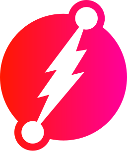</a> | **📂 檔名:** `dgraph-icon.svg` ✨ **格式:** `Vector (SVG)` ⚖️ **大小:** `2.20KB` 📅 **更新:** `2026-03-02`  🚀 **jsDelivr Markdown:** `` 🔗 **直接連結 (Url):** <code>https://cdn.jsdelivr.net/gh/barry028/materials@main/images/iCons/Brands/dgraph-icon.svg</code> 📥 [檢視原始檔](dgraph-icon.svg) |
|  | **📂 檔名:** `dgraph.svg` ✨ **格式:** `Vector (SVG)` ⚖️ **大小:** `9.86KB` 📅 **更新:** `2026-03-02`  🚀 **jsDelivr Markdown:** `` 🔗 **直接連結 (Url):** <code>https://cdn.jsdelivr.net/gh/barry028/materials@main/images/iCons/Brands/dgraph.svg</code> 📥 [檢視原始檔](dgraph.svg) |
|  | **📂 檔名:** `dialogflow.svg` ✨ **格式:** `Vector (SVG)` ⚖️ **大小:** `1.78KB` 📅 **更新:** `2026-03-02`  🚀 **jsDelivr Markdown:** `` 🔗 **直接連結 (Url):** <code>https://cdn.jsdelivr.net/gh/barry028/materials@main/images/iCons/Brands/dialogflow.svg</code> 📥 [檢視原始檔](dialogflow.svg) |
|  | **📂 檔名:** `digital-ocean.svg` ✨ **格式:** `Vector (SVG)` ⚖️ **大小:** `12.39KB` 📅 **更新:** `2026-03-02`  🚀 **jsDelivr Markdown:** `` 🔗 **直接連結 (Url):** <code>https://cdn.jsdelivr.net/gh/barry028/materials@main/images/iCons/Brands/digital-ocean.svg</code> 📥 [檢視原始檔](digital-ocean.svg) |
|  | **📂 檔名:** `dimer.svg` ✨ **格式:** `Vector (SVG)` ⚖️ **大小:** `11.34KB` 📅 **更新:** `2026-03-02`  🚀 **jsDelivr Markdown:** `` 🔗 **直接連結 (Url):** <code>https://cdn.jsdelivr.net/gh/barry028/materials@main/images/iCons/Brands/dimer.svg</code> 📥 [檢視原始檔](dimer.svg) |
|  | **📂 檔名:** `dinersclub.svg` ✨ **格式:** `Vector (SVG)` ⚖️ **大小:** `25.04KB` 📅 **更新:** `2026-03-02`  🚀 **jsDelivr Markdown:** `` 🔗 **直接連結 (Url):** <code>https://cdn.jsdelivr.net/gh/barry028/materials@main/images/iCons/Brands/dinersclub.svg</code> 📥 [檢視原始檔](dinersclub.svg) |
|  | **📂 檔名:** `discord-icon.svg` ✨ **格式:** `Vector (SVG)` ⚖️ **大小:** `1.91KB` 📅 **更新:** `2026-03-02`  🚀 **jsDelivr Markdown:** `` 🔗 **直接連結 (Url):** <code>https://cdn.jsdelivr.net/gh/barry028/materials@main/images/iCons/Brands/discord-icon.svg</code> 📥 [檢視原始檔](discord-icon.svg) |
|  | **📂 檔名:** `discord.svg` ✨ **格式:** `Vector (SVG)` ⚖️ **大小:** `9.10KB` 📅 **更新:** `2026-03-02`  🚀 **jsDelivr Markdown:** `` 🔗 **直接連結 (Url):** <code>https://cdn.jsdelivr.net/gh/barry028/materials@main/images/iCons/Brands/discord.svg</code> 📥 [檢視原始檔](discord.svg) |
|  | **📂 檔名:** `discourse-icon.svg` ✨ **格式:** `Vector (SVG)` ⚖️ **大小:** `2.37KB` 📅 **更新:** `2026-03-02`  🚀 **jsDelivr Markdown:** `` 🔗 **直接連結 (Url):** <code>https://cdn.jsdelivr.net/gh/barry028/materials@main/images/iCons/Brands/discourse-icon.svg</code> 📥 [檢視原始檔](discourse-icon.svg) |
|  | **📂 檔名:** `discourse.svg` ✨ **格式:** `Vector (SVG)` ⚖️ **大小:** `10.46KB` 📅 **更新:** `2026-03-02`  🚀 **jsDelivr Markdown:** `` 🔗 **直接連結 (Url):** <code>https://cdn.jsdelivr.net/gh/barry028/materials@main/images/iCons/Brands/discourse.svg</code> 📥 [檢視原始檔](discourse.svg) |
|  | **📂 檔名:** `discover.svg` ✨ **格式:** `Vector (SVG)` ⚖️ **大小:** `5.04KB` 📅 **更新:** `2026-03-02`  🚀 **jsDelivr Markdown:** `` 🔗 **直接連結 (Url):** <code>https://cdn.jsdelivr.net/gh/barry028/materials@main/images/iCons/Brands/discover.svg</code> 📥 [檢視原始檔](discover.svg) |
|  | **📂 檔名:** `disqus.svg` ✨ **格式:** `Vector (SVG)` ⚖️ **大小:** `1.21KB` 📅 **更新:** `2026-03-02`  🚀 **jsDelivr Markdown:** `` 🔗 **直接連結 (Url):** <code>https://cdn.jsdelivr.net/gh/barry028/materials@main/images/iCons/Brands/disqus.svg</code> 📥 [檢視原始檔](disqus.svg) |
|  | **📂 檔名:** `django-icon.svg` ✨ **格式:** `Vector (SVG)` ⚖️ **大小:** `1.50KB` 📅 **更新:** `2026-03-02`  🚀 **jsDelivr Markdown:** `` 🔗 **直接連結 (Url):** <code>https://cdn.jsdelivr.net/gh/barry028/materials@main/images/iCons/Brands/django-icon.svg</code> 📥 [檢視原始檔](django-icon.svg) |
|  | **📂 檔名:** `django.svg` ✨ **格式:** `Vector (SVG)` ⚖️ **大小:** `4.68KB` 📅 **更新:** `2026-03-02`  🚀 **jsDelivr Markdown:** `` 🔗 **直接連結 (Url):** <code>https://cdn.jsdelivr.net/gh/barry028/materials@main/images/iCons/Brands/django.svg</code> 📥 [檢視原始檔](django.svg) |
|  | **📂 檔名:** `dockbit.svg` ✨ **格式:** `Vector (SVG)` ⚖️ **大小:** `1.62KB` 📅 **更新:** `2026-03-02`  🚀 **jsDelivr Markdown:** `` 🔗 **直接連結 (Url):** <code>https://cdn.jsdelivr.net/gh/barry028/materials@main/images/iCons/Brands/dockbit.svg</code> 📥 [檢視原始檔](dockbit.svg) |
|  | **📂 檔名:** `docker-icon.svg` ✨ **格式:** `Vector (SVG)` ⚖️ **大小:** `2.31KB` 📅 **更新:** `2026-03-02`  🚀 **jsDelivr Markdown:** `` 🔗 **直接連結 (Url):** <code>https://cdn.jsdelivr.net/gh/barry028/materials@main/images/iCons/Brands/docker-icon.svg</code> 📥 [檢視原始檔](docker-icon.svg) |
|  | **📂 檔名:** `docker.svg` ✨ **格式:** `Vector (SVG)` ⚖️ **大小:** `12.37KB` 📅 **更新:** `2026-03-02`  🚀 **jsDelivr Markdown:** `` 🔗 **直接連結 (Url):** <code>https://cdn.jsdelivr.net/gh/barry028/materials@main/images/iCons/Brands/docker.svg</code> 📥 [檢視原始檔](docker.svg) |
|  | **📂 檔名:** `doctrine.svg` ✨ **格式:** `Vector (SVG)` ⚖️ **大小:** `1.28KB` 📅 **更新:** `2026-03-02`  🚀 **jsDelivr Markdown:** `` 🔗 **直接連結 (Url):** <code>https://cdn.jsdelivr.net/gh/barry028/materials@main/images/iCons/Brands/doctrine.svg</code> 📥 [檢視原始檔](doctrine.svg) |
|  | **📂 檔名:** `docusaurus.svg` ✨ **格式:** `Vector (SVG)` ⚖️ **大小:** `18.73KB` 📅 **更新:** `2026-03-02`  🚀 **jsDelivr Markdown:** `` 🔗 **直接連結 (Url):** <code>https://cdn.jsdelivr.net/gh/barry028/materials@main/images/iCons/Brands/docusaurus.svg</code> 📥 [檢視原始檔](docusaurus.svg) |
|  | **📂 檔名:** `dojo-icon.svg` ✨ **格式:** `Vector (SVG)` ⚖️ **大小:** `20.59KB` 📅 **更新:** `2026-03-02`  🚀 **jsDelivr Markdown:** `` 🔗 **直接連結 (Url):** <code>https://cdn.jsdelivr.net/gh/barry028/materials@main/images/iCons/Brands/dojo-icon.svg</code> 📥 [檢視原始檔](dojo-icon.svg) |
|  | **📂 檔名:** `dojo-toolkit.svg` ✨ **格式:** `Vector (SVG)` ⚖️ **大小:** `3.83KB` 📅 **更新:** `2026-03-02`  🚀 **jsDelivr Markdown:** `` 🔗 **直接連結 (Url):** <code>https://cdn.jsdelivr.net/gh/barry028/materials@main/images/iCons/Brands/dojo-toolkit.svg</code> 📥 [檢視原始檔](dojo-toolkit.svg) |
|  | **📂 檔名:** `dojo.svg` ✨ **格式:** `Vector (SVG)` ⚖️ **大小:** `22.69KB` 📅 **更新:** `2026-03-02`  🚀 **jsDelivr Markdown:** `` 🔗 **直接連結 (Url):** <code>https://cdn.jsdelivr.net/gh/barry028/materials@main/images/iCons/Brands/dojo.svg</code> 📥 [檢視原始檔](dojo.svg) |
|  | **📂 檔名:** `dolt.svg` ✨ **格式:** `Vector (SVG)` ⚖️ **大小:** `3.20KB` 📅 **更新:** `2026-03-02`  🚀 **jsDelivr Markdown:** `` 🔗 **直接連結 (Url):** <code>https://cdn.jsdelivr.net/gh/barry028/materials@main/images/iCons/Brands/dolt.svg</code> 📥 [檢視原始檔](dolt.svg) |
|  | **📂 檔名:** `dotnet.svg` ✨ **格式:** `Vector (SVG)` ⚖️ **大小:** `3.00KB` 📅 **更新:** `2026-03-02`  🚀 **jsDelivr Markdown:** `` 🔗 **直接連結 (Url):** <code>https://cdn.jsdelivr.net/gh/barry028/materials@main/images/iCons/Brands/dotnet.svg</code> 📥 [檢視原始檔](dotnet.svg) |
|  | **📂 檔名:** `dovetail-icon.svg` ✨ **格式:** `Vector (SVG)` ⚖️ **大小:** `649.00B` 📅 **更新:** `2026-03-02`  🚀 **jsDelivr Markdown:** `` 🔗 **直接連結 (Url):** <code>https://cdn.jsdelivr.net/gh/barry028/materials@main/images/iCons/Brands/dovetail-icon.svg</code> 📥 [檢視原始檔](dovetail-icon.svg) |
|  | **📂 檔名:** `dovetail.svg` ✨ **格式:** `Vector (SVG)` ⚖️ **大小:** `6.45KB` 📅 **更新:** `2026-03-02`  🚀 **jsDelivr Markdown:** `` 🔗 **直接連結 (Url):** <code>https://cdn.jsdelivr.net/gh/barry028/materials@main/images/iCons/Brands/dovetail.svg</code> 📥 [檢視原始檔](dovetail.svg) |
|  | **📂 檔名:** `dreamhost.svg` ✨ **格式:** `Vector (SVG)` ⚖️ **大小:** `1.18KB` 📅 **更新:** `2026-03-02`  🚀 **jsDelivr Markdown:** `` 🔗 **直接連結 (Url):** <code>https://cdn.jsdelivr.net/gh/barry028/materials@main/images/iCons/Brands/dreamhost.svg</code> 📥 [檢視原始檔](dreamhost.svg) |
|  | **📂 檔名:** `dribbble-icon.svg` ✨ **格式:** `Vector (SVG)` ⚖️ **大小:** `1.69KB` 📅 **更新:** `2026-03-02`  🚀 **jsDelivr Markdown:** `` 🔗 **直接連結 (Url):** <code>https://cdn.jsdelivr.net/gh/barry028/materials@main/images/iCons/Brands/dribbble-icon.svg</code> 📥 [檢視原始檔](dribbble-icon.svg) |
|  | **📂 檔名:** `dribbble.svg` ✨ **格式:** `Vector (SVG)` ⚖️ **大小:** `7.26KB` 📅 **更新:** `2026-03-02`  🚀 **jsDelivr Markdown:** `` 🔗 **直接連結 (Url):** <code>https://cdn.jsdelivr.net/gh/barry028/materials@main/images/iCons/Brands/dribbble.svg</code> 📥 [檢視原始檔](dribbble.svg) |
|  | **📂 檔名:** `drift.svg` ✨ **格式:** `Vector (SVG)` ⚖️ **大小:** `3.43KB` 📅 **更新:** `2026-03-02`  🚀 **jsDelivr Markdown:** `` 🔗 **直接連結 (Url):** <code>https://cdn.jsdelivr.net/gh/barry028/materials@main/images/iCons/Brands/drift.svg</code> 📥 [檢視原始檔](drift.svg) |
|  | **📂 檔名:** `drip.svg` ✨ **格式:** `Vector (SVG)` ⚖️ **大小:** `4.04KB` 📅 **更新:** `2026-03-02`  🚀 **jsDelivr Markdown:** `` 🔗 **直接連結 (Url):** <code>https://cdn.jsdelivr.net/gh/barry028/materials@main/images/iCons/Brands/drip.svg</code> 📥 [檢視原始檔](drip.svg) |
|  | **📂 檔名:** `drizzle-icon.svg` ✨ **格式:** `Vector (SVG)` ⚖️ **大小:** `10.33KB` 📅 **更新:** `2026-03-02`  🚀 **jsDelivr Markdown:** `` 🔗 **直接連結 (Url):** <code>https://cdn.jsdelivr.net/gh/barry028/materials@main/images/iCons/Brands/drizzle-icon.svg</code> 📥 [檢視原始檔](drizzle-icon.svg) |
| <a href="drizzle.svg">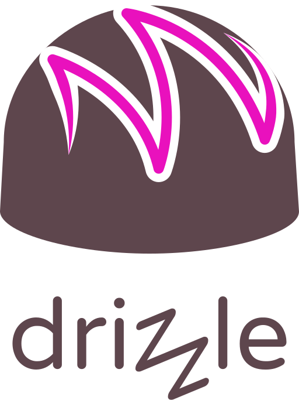</a> | **📂 檔名:** `drizzle.svg` ✨ **格式:** `Vector (SVG)` ⚖️ **大小:** `18.50KB` 📅 **更新:** `2026-03-02`  🚀 **jsDelivr Markdown:** `` 🔗 **直接連結 (Url):** <code>https://cdn.jsdelivr.net/gh/barry028/materials@main/images/iCons/Brands/drizzle.svg</code> 📥 [檢視原始檔](drizzle.svg) |
|  | **📂 檔名:** `drone-icon.svg` ✨ **格式:** `Vector (SVG)` ⚖️ **大小:** `2.10KB` 📅 **更新:** `2026-03-02`  🚀 **jsDelivr Markdown:** `` 🔗 **直接連結 (Url):** <code>https://cdn.jsdelivr.net/gh/barry028/materials@main/images/iCons/Brands/drone-icon.svg</code> 📥 [檢視原始檔](drone-icon.svg) |
|  | **📂 檔名:** `drone.svg` ✨ **格式:** `Vector (SVG)` ⚖️ **大小:** `5.85KB` 📅 **更新:** `2026-03-02`  🚀 **jsDelivr Markdown:** `` 🔗 **直接連結 (Url):** <code>https://cdn.jsdelivr.net/gh/barry028/materials@main/images/iCons/Brands/drone.svg</code> 📥 [檢視原始檔](drone.svg) |
|  | **📂 檔名:** `drools-icon.svg` ✨ **格式:** `Vector (SVG)` ⚖️ **大小:** `3.67KB` 📅 **更新:** `2026-03-02`  🚀 **jsDelivr Markdown:** `` 🔗 **直接連結 (Url):** <code>https://cdn.jsdelivr.net/gh/barry028/materials@main/images/iCons/Brands/drools-icon.svg</code> 📥 [檢視原始檔](drools-icon.svg) |
|  | **📂 檔名:** `drools.svg` ✨ **格式:** `Vector (SVG)` ⚖️ **大小:** `10.28KB` 📅 **更新:** `2026-03-02`  🚀 **jsDelivr Markdown:** `` 🔗 **直接連結 (Url):** <code>https://cdn.jsdelivr.net/gh/barry028/materials@main/images/iCons/Brands/drools.svg</code> 📥 [檢視原始檔](drools.svg) |
| <a href="dropbox.svg">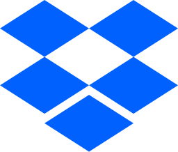</a> | **📂 檔名:** `dropbox.svg` ✨ **格式:** `Vector (SVG)` ⚖️ **大小:** `752.00B` 📅 **更新:** `2026-03-02`  🚀 **jsDelivr Markdown:** `` 🔗 **直接連結 (Url):** <code>https://cdn.jsdelivr.net/gh/barry028/materials@main/images/iCons/Brands/dropbox.svg</code> 📥 [檢視原始檔](dropbox.svg) |
| <a href="dropmark.svg">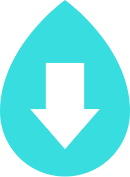</a> | **📂 檔名:** `dropmark.svg` ✨ **格式:** `Vector (SVG)` ⚖️ **大小:** `818.00B` 📅 **更新:** `2026-03-02`  🚀 **jsDelivr Markdown:** `` 🔗 **直接連結 (Url):** <code>https://cdn.jsdelivr.net/gh/barry028/materials@main/images/iCons/Brands/dropmark.svg</code> 📥 [檢視原始檔](dropmark.svg) |
|  | **📂 檔名:** `dropzone.svg` ✨ **格式:** `Vector (SVG)` ⚖️ **大小:** `1.70KB` 📅 **更新:** `2026-03-02`  🚀 **jsDelivr Markdown:** `` 🔗 **直接連結 (Url):** <code>https://cdn.jsdelivr.net/gh/barry028/materials@main/images/iCons/Brands/dropzone.svg</code> 📥 [檢視原始檔](dropzone.svg) |
| <a href="drupal-icon.svg">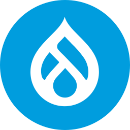</a> | **📂 檔名:** `drupal-icon.svg` ✨ **格式:** `Vector (SVG)` ⚖️ **大小:** `3.51KB` 📅 **更新:** `2026-03-02`  🚀 **jsDelivr Markdown:** `` 🔗 **直接連結 (Url):** <code>https://cdn.jsdelivr.net/gh/barry028/materials@main/images/iCons/Brands/drupal-icon.svg</code> 📥 [檢視原始檔](drupal-icon.svg) |
|  | **📂 檔名:** `drupal.svg` ✨ **格式:** `Vector (SVG)` ⚖️ **大小:** `6.38KB` 📅 **更新:** `2026-03-02`  🚀 **jsDelivr Markdown:** `` 🔗 **直接連結 (Url):** <code>https://cdn.jsdelivr.net/gh/barry028/materials@main/images/iCons/Brands/drupal.svg</code> 📥 [檢視原始檔](drupal.svg) |
|  | **📂 檔名:** `duckduckgo.svg` ✨ **格式:** `Vector (SVG)` ⚖️ **大小:** `8.08KB` 📅 **更新:** `2026-03-02`  🚀 **jsDelivr Markdown:** `` 🔗 **直接連結 (Url):** <code>https://cdn.jsdelivr.net/gh/barry028/materials@main/images/iCons/Brands/duckduckgo.svg</code> 📥 [檢視原始檔](duckduckgo.svg) |
| <a href="dynatrace-icon.svg">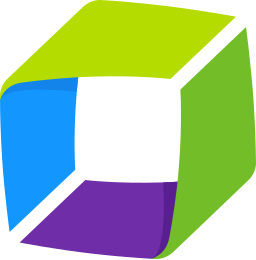</a> | **📂 檔名:** `dynatrace-icon.svg` ✨ **格式:** `Vector (SVG)` ⚖️ **大小:** `3.51KB` 📅 **更新:** `2026-03-02`  🚀 **jsDelivr Markdown:** `` 🔗 **直接連結 (Url):** <code>https://cdn.jsdelivr.net/gh/barry028/materials@main/images/iCons/Brands/dynatrace-icon.svg</code> 📥 [檢視原始檔](dynatrace-icon.svg) |
|  | **📂 檔名:** `dynatrace.svg` ✨ **格式:** `Vector (SVG)` ⚖️ **大小:** `11.73KB` 📅 **更新:** `2026-03-02`  🚀 **jsDelivr Markdown:** `` 🔗 **直接連結 (Url):** <code>https://cdn.jsdelivr.net/gh/barry028/materials@main/images/iCons/Brands/dynatrace.svg</code> 📥 [檢視原始檔](dynatrace.svg) |
|  | **📂 檔名:** `dyndns.svg` ✨ **格式:** `Vector (SVG)` ⚖️ **大小:** `2.21KB` 📅 **更新:** `2026-03-02`  🚀 **jsDelivr Markdown:** `` 🔗 **直接連結 (Url):** <code>https://cdn.jsdelivr.net/gh/barry028/materials@main/images/iCons/Brands/dyndns.svg</code> 📥 [檢視原始檔](dyndns.svg) |
|  | **📂 檔名:** `ebanx.svg` ✨ **格式:** `Vector (SVG)` ⚖️ **大小:** `3.47KB` 📅 **更新:** `2026-03-02`  🚀 **jsDelivr Markdown:** `` 🔗 **直接連結 (Url):** <code>https://cdn.jsdelivr.net/gh/barry028/materials@main/images/iCons/Brands/ebanx.svg</code> 📥 [檢視原始檔](ebanx.svg) |
|  | **📂 檔名:** `eclipse-icon.svg` ✨ **格式:** `Vector (SVG)` ⚖️ **大小:** `4.39KB` 📅 **更新:** `2026-03-02`  🚀 **jsDelivr Markdown:** `` 🔗 **直接連結 (Url):** <code>https://cdn.jsdelivr.net/gh/barry028/materials@main/images/iCons/Brands/eclipse-icon.svg</code> 📥 [檢視原始檔](eclipse-icon.svg) |
|  | **📂 檔名:** `eclipse.svg` ✨ **格式:** `Vector (SVG)` ⚖️ **大小:** `11.05KB` 📅 **更新:** `2026-03-02`  🚀 **jsDelivr Markdown:** `` 🔗 **直接連結 (Url):** <code>https://cdn.jsdelivr.net/gh/barry028/materials@main/images/iCons/Brands/eclipse.svg</code> 📥 [檢視原始檔](eclipse.svg) |
|  | **📂 檔名:** `ecma.svg` ✨ **格式:** `Vector (SVG)` ⚖️ **大小:** `11.65KB` 📅 **更新:** `2026-03-02`  🚀 **jsDelivr Markdown:** `` 🔗 **直接連結 (Url):** <code>https://cdn.jsdelivr.net/gh/barry028/materials@main/images/iCons/Brands/ecma.svg</code> 📥 [檢視原始檔](ecma.svg) |
| <a href="edgedb.svg">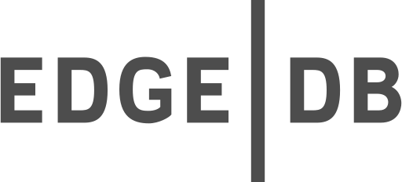</a> | **📂 檔名:** `edgedb.svg` ✨ **格式:** `Vector (SVG)` ⚖️ **大小:** `3.34KB` 📅 **更新:** `2026-03-02`  🚀 **jsDelivr Markdown:** `` 🔗 **直接連結 (Url):** <code>https://cdn.jsdelivr.net/gh/barry028/materials@main/images/iCons/Brands/edgedb.svg</code> 📥 [檢視原始檔](edgedb.svg) |
| <a href="edgio-icon.svg">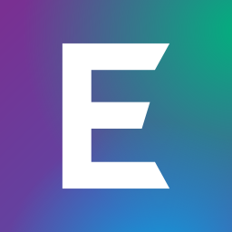</a> | **📂 檔名:** `edgio-icon.svg` ✨ **格式:** `Vector (SVG)` ⚖️ **大小:** `1.71KB` 📅 **更新:** `2026-03-02`  🚀 **jsDelivr Markdown:** `` 🔗 **直接連結 (Url):** <code>https://cdn.jsdelivr.net/gh/barry028/materials@main/images/iCons/Brands/edgio-icon.svg</code> 📥 [檢視原始檔](edgio-icon.svg) |
|  | **📂 檔名:** `edgio.svg` ✨ **格式:** `Vector (SVG)` ⚖️ **大小:** `4.81KB` 📅 **更新:** `2026-03-02`  🚀 **jsDelivr Markdown:** `` 🔗 **直接連結 (Url):** <code>https://cdn.jsdelivr.net/gh/barry028/materials@main/images/iCons/Brands/edgio.svg</code> 📥 [檢視原始檔](edgio.svg) |
|  | **📂 檔名:** `editorconfig.svg` ✨ **格式:** `Vector (SVG)` ⚖️ **大小:** `12.19KB` 📅 **更新:** `2026-03-02`  🚀 **jsDelivr Markdown:** `` 🔗 **直接連結 (Url):** <code>https://cdn.jsdelivr.net/gh/barry028/materials@main/images/iCons/Brands/editorconfig.svg</code> 📥 [檢視原始檔](editorconfig.svg) |
| <a href="egghead.svg">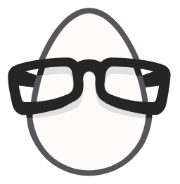</a> | **📂 檔名:** `egghead.svg` ✨ **格式:** `Vector (SVG)` ⚖️ **大小:** `11.01KB` 📅 **更新:** `2026-03-02`  🚀 **jsDelivr Markdown:** `` 🔗 **直接連結 (Url):** <code>https://cdn.jsdelivr.net/gh/barry028/materials@main/images/iCons/Brands/egghead.svg</code> 📥 [檢視原始檔](egghead.svg) |
|  | **📂 檔名:** `elasticpath-icon.svg` ✨ **格式:** `Vector (SVG)` ⚖️ **大小:** `2.74KB` 📅 **更新:** `2026-03-02`  🚀 **jsDelivr Markdown:** `` 🔗 **直接連結 (Url):** <code>https://cdn.jsdelivr.net/gh/barry028/materials@main/images/iCons/Brands/elasticpath-icon.svg</code> 📥 [檢視原始檔](elasticpath-icon.svg) |
|  | **📂 檔名:** `elasticpath.svg` ✨ **格式:** `Vector (SVG)` ⚖️ **大小:** `11.39KB` 📅 **更新:** `2026-03-02`  🚀 **jsDelivr Markdown:** `` 🔗 **直接連結 (Url):** <code>https://cdn.jsdelivr.net/gh/barry028/materials@main/images/iCons/Brands/elasticpath.svg</code> 📥 [檢視原始檔](elasticpath.svg) |
| <a href="elasticsearch.svg">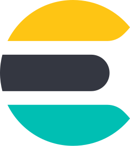</a> | **📂 檔名:** `elasticsearch.svg` ✨ **格式:** `Vector (SVG)` ⚖️ **大小:** `1.26KB` 📅 **更新:** `2026-03-02`  🚀 **jsDelivr Markdown:** `` 🔗 **直接連結 (Url):** <code>https://cdn.jsdelivr.net/gh/barry028/materials@main/images/iCons/Brands/elasticsearch.svg</code> 📥 [檢視原始檔](elasticsearch.svg) |
|  | **📂 檔名:** `electron.svg` ✨ **格式:** `Vector (SVG)` ⚖️ **大小:** `5.31KB` 📅 **更新:** `2026-03-02`  🚀 **jsDelivr Markdown:** `` 🔗 **直接連結 (Url):** <code>https://cdn.jsdelivr.net/gh/barry028/materials@main/images/iCons/Brands/electron.svg</code> 📥 [檢視原始檔](electron.svg) |
|  | **📂 檔名:** `element.svg` ✨ **格式:** `Vector (SVG)` ⚖️ **大小:** `2.13KB` 📅 **更新:** `2026-03-02`  🚀 **jsDelivr Markdown:** `` 🔗 **直接連結 (Url):** <code>https://cdn.jsdelivr.net/gh/barry028/materials@main/images/iCons/Brands/element.svg</code> 📥 [檢視原始檔](element.svg) |
| <a href="elemental-ui.svg">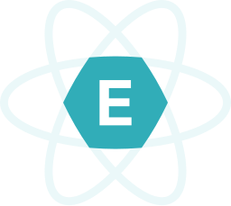</a> | **📂 檔名:** `elemental-ui.svg` ✨ **格式:** `Vector (SVG)` ⚖️ **大小:** `5.22KB` 📅 **更新:** `2026-03-02`  🚀 **jsDelivr Markdown:** `` 🔗 **直接連結 (Url):** <code>https://cdn.jsdelivr.net/gh/barry028/materials@main/images/iCons/Brands/elemental-ui.svg</code> 📥 [檢視原始檔](elemental-ui.svg) |
|  | **📂 檔名:** `elementary.svg` ✨ **格式:** `Vector (SVG)` ⚖️ **大小:** `2.94KB` 📅 **更新:** `2026-03-02`  🚀 **jsDelivr Markdown:** `` 🔗 **直接連結 (Url):** <code>https://cdn.jsdelivr.net/gh/barry028/materials@main/images/iCons/Brands/elementary.svg</code> 📥 [檢視原始檔](elementary.svg) |
|  | **📂 檔名:** `eleventy.svg` ✨ **格式:** `Vector (SVG)` ⚖️ **大小:** `11.98KB` 📅 **更新:** `2026-03-02`  🚀 **jsDelivr Markdown:** `` 🔗 **直接連結 (Url):** <code>https://cdn.jsdelivr.net/gh/barry028/materials@main/images/iCons/Brands/eleventy.svg</code> 📥 [檢視原始檔](eleventy.svg) |
|  | **📂 檔名:** `ello.svg` ✨ **格式:** `Vector (SVG)` ⚖️ **大小:** `860.00B` 📅 **更新:** `2026-03-02`  🚀 **jsDelivr Markdown:** `` 🔗 **直接連結 (Url):** <code>https://cdn.jsdelivr.net/gh/barry028/materials@main/images/iCons/Brands/ello.svg</code> 📥 [檢視原始檔](ello.svg) |
| <a href="elm-classic.svg">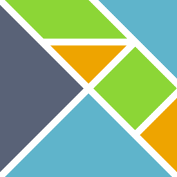</a> | **📂 檔名:** `elm-classic.svg` ✨ **格式:** `Vector (SVG)` ⚖️ **大小:** `940.00B` 📅 **更新:** `2026-03-02`  🚀 **jsDelivr Markdown:** `` 🔗 **直接連結 (Url):** <code>https://cdn.jsdelivr.net/gh/barry028/materials@main/images/iCons/Brands/elm-classic.svg</code> 📥 [檢視原始檔](elm-classic.svg) |
| <a href="elm.svg">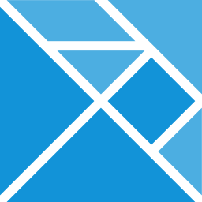</a> | **📂 檔名:** `elm.svg` ✨ **格式:** `Vector (SVG)` ⚖️ **大小:** `1.09KB` 📅 **更新:** `2026-03-02`  🚀 **jsDelivr Markdown:** `` 🔗 **直接連結 (Url):** <code>https://cdn.jsdelivr.net/gh/barry028/materials@main/images/iCons/Brands/elm.svg</code> 📥 [檢視原始檔](elm.svg) |
|  | **📂 檔名:** `elo.svg` ✨ **格式:** `Vector (SVG)` ⚖️ **大小:** `3.85KB` 📅 **更新:** `2026-03-02`  🚀 **jsDelivr Markdown:** `` 🔗 **直接連結 (Url):** <code>https://cdn.jsdelivr.net/gh/barry028/materials@main/images/iCons/Brands/elo.svg</code> 📥 [檢視原始檔](elo.svg) |
|  | **📂 檔名:** `emacs-classic.svg` ✨ **格式:** `Vector (SVG)` ⚖️ **大小:** `12.15KB` 📅 **更新:** `2026-03-02`  🚀 **jsDelivr Markdown:** `` 🔗 **直接連結 (Url):** <code>https://cdn.jsdelivr.net/gh/barry028/materials@main/images/iCons/Brands/emacs-classic.svg</code> 📥 [檢視原始檔](emacs-classic.svg) |
|  | **📂 檔名:** `emacs.svg` ✨ **格式:** `Vector (SVG)` ⚖️ **大小:** `3.69KB` 📅 **更新:** `2026-03-02`  🚀 **jsDelivr Markdown:** `` 🔗 **直接連結 (Url):** <code>https://cdn.jsdelivr.net/gh/barry028/materials@main/images/iCons/Brands/emacs.svg</code> 📥 [檢視原始檔](emacs.svg) |
|  | **📂 檔名:** `embedly.svg` ✨ **格式:** `Vector (SVG)` ⚖️ **大小:** `988.00B` 📅 **更新:** `2026-03-02`  🚀 **jsDelivr Markdown:** `` 🔗 **直接連結 (Url):** <code>https://cdn.jsdelivr.net/gh/barry028/materials@main/images/iCons/Brands/embedly.svg</code> 📥 [檢視原始檔](embedly.svg) |
| <a href="ember-tomster.svg">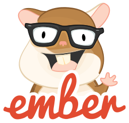</a> | **📂 檔名:** `ember-tomster.svg` ✨ **格式:** `Vector (SVG)` ⚖️ **大小:** `54.29KB` 📅 **更新:** `2026-03-02`  🚀 **jsDelivr Markdown:** `` 🔗 **直接連結 (Url):** <code>https://cdn.jsdelivr.net/gh/barry028/materials@main/images/iCons/Brands/ember-tomster.svg</code> 📥 [檢視原始檔](ember-tomster.svg) |
| <a href="ember.svg">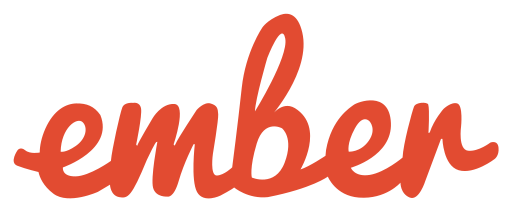</a> | **📂 檔名:** `ember.svg` ✨ **格式:** `Vector (SVG)` ⚖️ **大小:** `10.45KB` 📅 **更新:** `2026-03-02`  🚀 **jsDelivr Markdown:** `` 🔗 **直接連結 (Url):** <code>https://cdn.jsdelivr.net/gh/barry028/materials@main/images/iCons/Brands/ember.svg</code> 📥 [檢視原始檔](ember.svg) |
|  | **📂 檔名:** `emmet.svg` ✨ **格式:** `Vector (SVG)` ⚖️ **大小:** `885.00B` 📅 **更新:** `2026-03-02`  🚀 **jsDelivr Markdown:** `` 🔗 **直接連結 (Url):** <code>https://cdn.jsdelivr.net/gh/barry028/materials@main/images/iCons/Brands/emmet.svg</code> 📥 [檢視原始檔](emmet.svg) |
|  | **📂 檔名:** `enact.svg` ✨ **格式:** `Vector (SVG)` ⚖️ **大小:** `1005.00B` 📅 **更新:** `2026-03-02`  🚀 **jsDelivr Markdown:** `` 🔗 **直接連結 (Url):** <code>https://cdn.jsdelivr.net/gh/barry028/materials@main/images/iCons/Brands/enact.svg</code> 📥 [檢視原始檔](enact.svg) |
|  | **📂 檔名:** `engine-yard-icon.svg` ✨ **格式:** `Vector (SVG)` ⚖️ **大小:** `2.18KB` 📅 **更新:** `2026-03-02`  🚀 **jsDelivr Markdown:** `` 🔗 **直接連結 (Url):** <code>https://cdn.jsdelivr.net/gh/barry028/materials@main/images/iCons/Brands/engine-yard-icon.svg</code> 📥 [檢視原始檔](engine-yard-icon.svg) |
|  | **📂 檔名:** `engine-yard.svg` ✨ **格式:** `Vector (SVG)` ⚖️ **大小:** `13.82KB` 📅 **更新:** `2026-03-02`  🚀 **jsDelivr Markdown:** `` 🔗 **直接連結 (Url):** <code>https://cdn.jsdelivr.net/gh/barry028/materials@main/images/iCons/Brands/engine-yard.svg</code> 📥 [檢視原始檔](engine-yard.svg) |
|  | **📂 檔名:** `envato.svg` ✨ **格式:** `Vector (SVG)` ⚖️ **大小:** `6.25KB` 📅 **更新:** `2026-03-02`  🚀 **jsDelivr Markdown:** `` 🔗 **直接連結 (Url):** <code>https://cdn.jsdelivr.net/gh/barry028/materials@main/images/iCons/Brands/envato.svg</code> 📥 [檢視原始檔](envato.svg) |
| <a href="envoy-icon.svg">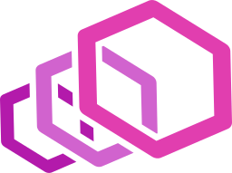</a> | **📂 檔名:** `envoy-icon.svg` ✨ **格式:** `Vector (SVG)` ⚖️ **大小:** `2.89KB` 📅 **更新:** `2026-03-02`  🚀 **jsDelivr Markdown:** `` 🔗 **直接連結 (Url):** <code>https://cdn.jsdelivr.net/gh/barry028/materials@main/images/iCons/Brands/envoy-icon.svg</code> 📥 [檢視原始檔](envoy-icon.svg) |
|  | **📂 檔名:** `envoy.svg` ✨ **格式:** `Vector (SVG)` ⚖️ **大小:** `9.29KB` 📅 **更新:** `2026-03-02`  🚀 **jsDelivr Markdown:** `` 🔗 **直接連結 (Url):** <code>https://cdn.jsdelivr.net/gh/barry028/materials@main/images/iCons/Brands/envoy.svg</code> 📥 [檢視原始檔](envoy.svg) |
|  | **📂 檔名:** `envoyer.svg` ✨ **格式:** `Vector (SVG)` ⚖️ **大小:** `2.75KB` 📅 **更新:** `2026-03-02`  🚀 **jsDelivr Markdown:** `` 🔗 **直接連結 (Url):** <code>https://cdn.jsdelivr.net/gh/barry028/materials@main/images/iCons/Brands/envoyer.svg</code> 📥 [檢視原始檔](envoyer.svg) |
| <a href="epsagon-icon.svg">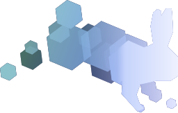</a> | **📂 檔名:** `epsagon-icon.svg` ✨ **格式:** `Vector (SVG)` ⚖️ **大小:** `16.50KB` 📅 **更新:** `2026-03-02`  🚀 **jsDelivr Markdown:** `` 🔗 **直接連結 (Url):** <code>https://cdn.jsdelivr.net/gh/barry028/materials@main/images/iCons/Brands/epsagon-icon.svg</code> 📥 [檢視原始檔](epsagon-icon.svg) |
|  | **📂 檔名:** `epsagon.svg` ✨ **格式:** `Vector (SVG)` ⚖️ **大小:** `27.65KB` 📅 **更新:** `2026-03-02`  🚀 **jsDelivr Markdown:** `` 🔗 **直接連結 (Url):** <code>https://cdn.jsdelivr.net/gh/barry028/materials@main/images/iCons/Brands/epsagon.svg</code> 📥 [檢視原始檔](epsagon.svg) |
|  | **📂 檔名:** `eraser-icon.svg` ✨ **格式:** `Vector (SVG)` ⚖️ **大小:** `743.00B` 📅 **更新:** `2026-03-02`  🚀 **jsDelivr Markdown:** `` 🔗 **直接連結 (Url):** <code>https://cdn.jsdelivr.net/gh/barry028/materials@main/images/iCons/Brands/eraser-icon.svg</code> 📥 [檢視原始檔](eraser-icon.svg) |
|  | **📂 檔名:** `eraser.svg` ✨ **格式:** `Vector (SVG)` ⚖️ **大小:** `7.49KB` 📅 **更新:** `2026-03-02`  🚀 **jsDelivr Markdown:** `` 🔗 **直接連結 (Url):** <code>https://cdn.jsdelivr.net/gh/barry028/materials@main/images/iCons/Brands/eraser.svg</code> 📥 [檢視原始檔](eraser.svg) |
| <a href="erlang.svg">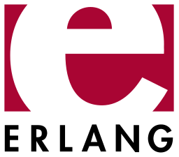</a> | **📂 檔名:** `erlang.svg` ✨ **格式:** `Vector (SVG)` ⚖️ **大小:** `4.04KB` 📅 **更新:** `2026-03-02`  🚀 **jsDelivr Markdown:** `` 🔗 **直接連結 (Url):** <code>https://cdn.jsdelivr.net/gh/barry028/materials@main/images/iCons/Brands/erlang.svg</code> 📥 [檢視原始檔](erlang.svg) |
|  | **📂 檔名:** `esbuild.svg` ✨ **格式:** `Vector (SVG)` ⚖️ **大小:** `642.00B` 📅 **更新:** `2026-03-02`  🚀 **jsDelivr Markdown:** `` 🔗 **直接連結 (Url):** <code>https://cdn.jsdelivr.net/gh/barry028/materials@main/images/iCons/Brands/esbuild.svg</code> 📥 [檢視原始檔](esbuild.svg) |
|  | **📂 檔名:** `esdoc.svg` ✨ **格式:** `Vector (SVG)` ⚖️ **大小:** `2.76KB` 📅 **更新:** `2026-03-02`  🚀 **jsDelivr Markdown:** `` 🔗 **直接連結 (Url):** <code>https://cdn.jsdelivr.net/gh/barry028/materials@main/images/iCons/Brands/esdoc.svg</code> 📥 [檢視原始檔](esdoc.svg) |
| <a href="eslint-old.svg">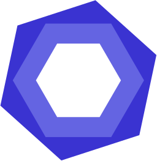</a> | **📂 檔名:** `eslint-old.svg` ✨ **格式:** `Vector (SVG)` ⚖️ **大小:** `1.06KB` 📅 **更新:** `2026-03-02`  🚀 **jsDelivr Markdown:** `` 🔗 **直接連結 (Url):** <code>https://cdn.jsdelivr.net/gh/barry028/materials@main/images/iCons/Brands/eslint-old.svg</code> 📥 [檢視原始檔](eslint-old.svg) |
| <a href="eslint.svg">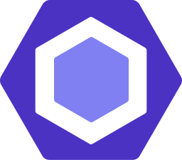</a> | **📂 檔名:** `eslint.svg` ✨ **格式:** `Vector (SVG)` ⚖️ **大小:** `1.97KB` 📅 **更新:** `2026-03-02`  🚀 **jsDelivr Markdown:** `` 🔗 **直接連結 (Url):** <code>https://cdn.jsdelivr.net/gh/barry028/materials@main/images/iCons/Brands/eslint.svg</code> 📥 [檢視原始檔](eslint.svg) |
| <a href="eta-icon.svg">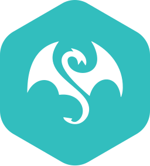</a> | **📂 檔名:** `eta-icon.svg` ✨ **格式:** `Vector (SVG)` ⚖️ **大小:** `3.04KB` 📅 **更新:** `2026-03-02`  🚀 **jsDelivr Markdown:** `` 🔗 **直接連結 (Url):** <code>https://cdn.jsdelivr.net/gh/barry028/materials@main/images/iCons/Brands/eta-icon.svg</code> 📥 [檢視原始檔](eta-icon.svg) |
|  | **📂 檔名:** `eta.svg` ✨ **格式:** `Vector (SVG)` ⚖️ **大小:** `7.51KB` 📅 **更新:** `2026-03-02`  🚀 **jsDelivr Markdown:** `` 🔗 **直接連結 (Url):** <code>https://cdn.jsdelivr.net/gh/barry028/materials@main/images/iCons/Brands/eta.svg</code> 📥 [檢視原始檔](eta.svg) |
|  | **📂 檔名:** `etcd.svg` ✨ **格式:** `Vector (SVG)` ⚖️ **大小:** `3.84KB` 📅 **更新:** `2026-03-02`  🚀 **jsDelivr Markdown:** `` 🔗 **直接連結 (Url):** <code>https://cdn.jsdelivr.net/gh/barry028/materials@main/images/iCons/Brands/etcd.svg</code> 📥 [檢視原始檔](etcd.svg) |
| <a href="ethereum-color.svg">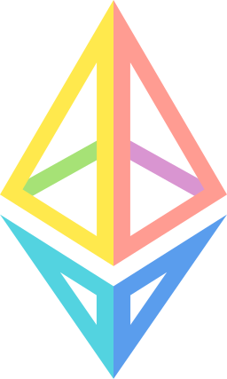</a> | **📂 檔名:** `ethereum-color.svg` ✨ **格式:** `Vector (SVG)` ⚖️ **大小:** `1.36KB` 📅 **更新:** `2026-03-02`  🚀 **jsDelivr Markdown:** `` 🔗 **直接連結 (Url):** <code>https://cdn.jsdelivr.net/gh/barry028/materials@main/images/iCons/Brands/ethereum-color.svg</code> 📥 [檢視原始檔](ethereum-color.svg) |
| <a href="ethereum.svg">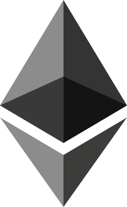</a> | **📂 檔名:** `ethereum.svg` ✨ **格式:** `Vector (SVG)` ⚖️ **大小:** `895.00B` 📅 **更新:** `2026-03-02`  🚀 **jsDelivr Markdown:** `` 🔗 **直接連結 (Url):** <code>https://cdn.jsdelivr.net/gh/barry028/materials@main/images/iCons/Brands/ethereum.svg</code> 📥 [檢視原始檔](ethereum.svg) |
|  | **📂 檔名:** `ethers.svg` ✨ **格式:** `Vector (SVG)` ⚖️ **大小:** `1.10KB` 📅 **更新:** `2026-03-02`  🚀 **jsDelivr Markdown:** `` 🔗 **直接連結 (Url):** <code>https://cdn.jsdelivr.net/gh/barry028/materials@main/images/iCons/Brands/ethers.svg</code> 📥 [檢視原始檔](ethers.svg) |
|  | **📂 檔名:** `ethnio.svg` ✨ **格式:** `Vector (SVG)` ⚖️ **大小:** `1.01KB` 📅 **更新:** `2026-03-02`  🚀 **jsDelivr Markdown:** `` 🔗 **直接連結 (Url):** <code>https://cdn.jsdelivr.net/gh/barry028/materials@main/images/iCons/Brands/ethnio.svg</code> 📥 [檢視原始檔](ethnio.svg) |
| <a href="eventbrite-icon.svg">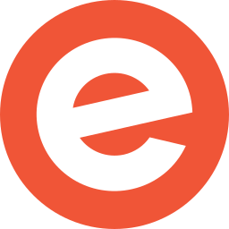</a> | **📂 檔名:** `eventbrite-icon.svg` ✨ **格式:** `Vector (SVG)` ⚖️ **大小:** `1.12KB` 📅 **更新:** `2026-03-02`  🚀 **jsDelivr Markdown:** `` 🔗 **直接連結 (Url):** <code>https://cdn.jsdelivr.net/gh/barry028/materials@main/images/iCons/Brands/eventbrite-icon.svg</code> 📥 [檢視原始檔](eventbrite-icon.svg) |
|  | **📂 檔名:** `eventbrite.svg` ✨ **格式:** `Vector (SVG)` ⚖️ **大小:** `5.55KB` 📅 **更新:** `2026-03-02`  🚀 **jsDelivr Markdown:** `` 🔗 **直接連結 (Url):** <code>https://cdn.jsdelivr.net/gh/barry028/materials@main/images/iCons/Brands/eventbrite.svg</code> 📥 [檢視原始檔](eventbrite.svg) |
|  | **📂 檔名:** `eventsentry.svg` ✨ **格式:** `Vector (SVG)` ⚖️ **大小:** `1.98KB` 📅 **更新:** `2026-03-02`  🚀 **jsDelivr Markdown:** `` 🔗 **直接連結 (Url):** <code>https://cdn.jsdelivr.net/gh/barry028/materials@main/images/iCons/Brands/eventsentry.svg</code> 📥 [檢視原始檔](eventsentry.svg) |
| <a href="evergreen-icon.svg">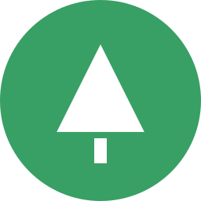</a> | **📂 檔名:** `evergreen-icon.svg` ✨ **格式:** `Vector (SVG)` ⚖️ **大小:** `741.00B` 📅 **更新:** `2026-03-02`  🚀 **jsDelivr Markdown:** `` 🔗 **直接連結 (Url):** <code>https://cdn.jsdelivr.net/gh/barry028/materials@main/images/iCons/Brands/evergreen-icon.svg</code> 📥 [檢視原始檔](evergreen-icon.svg) |
|  | **📂 檔名:** `evergreen.svg` ✨ **格式:** `Vector (SVG)` ⚖️ **大小:** `4.38KB` 📅 **更新:** `2026-03-02`  🚀 **jsDelivr Markdown:** `` 🔗 **直接連結 (Url):** <code>https://cdn.jsdelivr.net/gh/barry028/materials@main/images/iCons/Brands/evergreen.svg</code> 📥 [檢視原始檔](evergreen.svg) |
|  | **📂 檔名:** `expo-icon.svg` ✨ **格式:** `Vector (SVG)` ⚖️ **大小:** `1.20KB` 📅 **更新:** `2026-03-02`  🚀 **jsDelivr Markdown:** `` 🔗 **直接連結 (Url):** <code>https://cdn.jsdelivr.net/gh/barry028/materials@main/images/iCons/Brands/expo-icon.svg</code> 📥 [檢視原始檔](expo-icon.svg) |
|  | **📂 檔名:** `expo.svg` ✨ **格式:** `Vector (SVG)` ⚖️ **大小:** `3.03KB` 📅 **更新:** `2026-03-02`  🚀 **jsDelivr Markdown:** `` 🔗 **直接連結 (Url):** <code>https://cdn.jsdelivr.net/gh/barry028/materials@main/images/iCons/Brands/expo.svg</code> 📥 [檢視原始檔](expo.svg) |
|  | **📂 檔名:** `express.svg` ✨ **格式:** `Vector (SVG)` ⚖️ **大小:** `11.29KB` 📅 **更新:** `2026-03-02`  🚀 **jsDelivr Markdown:** `` 🔗 **直接連結 (Url):** <code>https://cdn.jsdelivr.net/gh/barry028/materials@main/images/iCons/Brands/express.svg</code> 📥 [檢視原始檔](express.svg) |
|  | **📂 檔名:** `fabric.svg` ✨ **格式:** `Vector (SVG)` ⚖️ **大小:** `3.88KB` 📅 **更新:** `2026-03-02`  🚀 **jsDelivr Markdown:** `` 🔗 **直接連結 (Url):** <code>https://cdn.jsdelivr.net/gh/barry028/materials@main/images/iCons/Brands/fabric.svg</code> 📥 [檢視原始檔](fabric.svg) |
|  | **📂 檔名:** `facebook.svg` ✨ **格式:** `Vector (SVG)` ⚖️ **大小:** `1020.00B` 📅 **更新:** `2026-03-02`  🚀 **jsDelivr Markdown:** `` 🔗 **直接連結 (Url):** <code>https://cdn.jsdelivr.net/gh/barry028/materials@main/images/iCons/Brands/facebook.svg</code> 📥 [檢視原始檔](facebook.svg) |
| <a href="falcor.svg">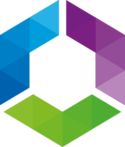</a> | **📂 檔名:** `falcor.svg` ✨ **格式:** `Vector (SVG)` ⚖️ **大小:** `2.32KB` 📅 **更新:** `2026-03-02`  🚀 **jsDelivr Markdown:** `` 🔗 **直接連結 (Url):** <code>https://cdn.jsdelivr.net/gh/barry028/materials@main/images/iCons/Brands/falcor.svg</code> 📥 [檢視原始檔](falcor.svg) |
|  | **📂 檔名:** `fastify-icon.svg` ✨ **格式:** `Vector (SVG)` ⚖️ **大小:** `2.64KB` 📅 **更新:** `2026-03-02`  🚀 **jsDelivr Markdown:** `` 🔗 **直接連結 (Url):** <code>https://cdn.jsdelivr.net/gh/barry028/materials@main/images/iCons/Brands/fastify-icon.svg</code> 📥 [檢視原始檔](fastify-icon.svg) |
|  | **📂 檔名:** `fastify.svg` ✨ **格式:** `Vector (SVG)` ⚖️ **大小:** `7.13KB` 📅 **更新:** `2026-03-02`  🚀 **jsDelivr Markdown:** `` 🔗 **直接連結 (Url):** <code>https://cdn.jsdelivr.net/gh/barry028/materials@main/images/iCons/Brands/fastify.svg</code> 📥 [檢視原始檔](fastify.svg) |
|  | **📂 檔名:** `fastlane.svg` ✨ **格式:** `Vector (SVG)` ⚖️ **大小:** `3.59KB` 📅 **更新:** `2026-03-02`  🚀 **jsDelivr Markdown:** `` 🔗 **直接連結 (Url):** <code>https://cdn.jsdelivr.net/gh/barry028/materials@main/images/iCons/Brands/fastlane.svg</code> 📥 [檢視原始檔](fastlane.svg) |
|  | **📂 檔名:** `fastly.svg` ✨ **格式:** `Vector (SVG)` ⚖️ **大小:** `14.10KB` 📅 **更新:** `2026-03-02`  🚀 **jsDelivr Markdown:** `` 🔗 **直接連結 (Url):** <code>https://cdn.jsdelivr.net/gh/barry028/materials@main/images/iCons/Brands/fastly.svg</code> 📥 [檢視原始檔](fastly.svg) |
|  | **📂 檔名:** `fauna-icon.svg` ✨ **格式:** `Vector (SVG)` ⚖️ **大小:** `1.25KB` 📅 **更新:** `2026-03-02`  🚀 **jsDelivr Markdown:** `` 🔗 **直接連結 (Url):** <code>https://cdn.jsdelivr.net/gh/barry028/materials@main/images/iCons/Brands/fauna-icon.svg</code> 📥 [檢視原始檔](fauna-icon.svg) |
|  | **📂 檔名:** `fauna.svg` ✨ **格式:** `Vector (SVG)` ⚖️ **大小:** `4.10KB` 📅 **更新:** `2026-03-02`  🚀 **jsDelivr Markdown:** `` 🔗 **直接連結 (Url):** <code>https://cdn.jsdelivr.net/gh/barry028/materials@main/images/iCons/Brands/fauna.svg</code> 📥 [檢視原始檔](fauna.svg) |
|  | **📂 檔名:** `feathersjs.svg` ✨ **格式:** `Vector (SVG)` ⚖️ **大小:** `1.74KB` 📅 **更新:** `2026-03-02`  🚀 **jsDelivr Markdown:** `` 🔗 **直接連結 (Url):** <code>https://cdn.jsdelivr.net/gh/barry028/materials@main/images/iCons/Brands/feathersjs.svg</code> 📥 [檢視原始檔](feathersjs.svg) |
|  | **📂 檔名:** `fedora.svg` ✨ **格式:** `Vector (SVG)` ⚖️ **大小:** `2.32KB` 📅 **更新:** `2026-03-02`  🚀 **jsDelivr Markdown:** `` 🔗 **直接連結 (Url):** <code>https://cdn.jsdelivr.net/gh/barry028/materials@main/images/iCons/Brands/fedora.svg</code> 📥 [檢視原始檔](fedora.svg) |
|  | **📂 檔名:** `fetch.svg` ✨ **格式:** `Vector (SVG)` ⚖️ **大小:** `1.40KB` 📅 **更新:** `2026-03-02`  🚀 **jsDelivr Markdown:** `` 🔗 **直接連結 (Url):** <code>https://cdn.jsdelivr.net/gh/barry028/materials@main/images/iCons/Brands/fetch.svg</code> 📥 [檢視原始檔](fetch.svg) |
|  | **📂 檔名:** `ffmpeg-icon.svg` ✨ **格式:** `Vector (SVG)` ⚖️ **大小:** `4.04KB` 📅 **更新:** `2026-03-02`  🚀 **jsDelivr Markdown:** `` 🔗 **直接連結 (Url):** <code>https://cdn.jsdelivr.net/gh/barry028/materials@main/images/iCons/Brands/ffmpeg-icon.svg</code> 📥 [檢視原始檔](ffmpeg-icon.svg) |
|  | **📂 檔名:** `ffmpeg.svg` ✨ **格式:** `Vector (SVG)` ⚖️ **大小:** `8.92KB` 📅 **更新:** `2026-03-02`  🚀 **jsDelivr Markdown:** `` 🔗 **直接連結 (Url):** <code>https://cdn.jsdelivr.net/gh/barry028/materials@main/images/iCons/Brands/ffmpeg.svg</code> 📥 [檢視原始檔](ffmpeg.svg) |
| <a href="figma.svg">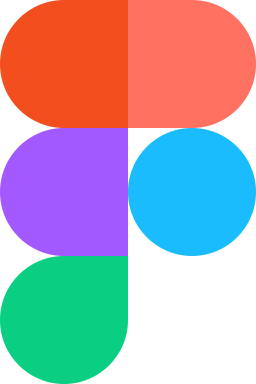</a> | **📂 檔名:** `figma.svg` ✨ **格式:** `Vector (SVG)` ⚖️ **大小:** `973.00B` 📅 **更新:** `2026-03-02`  🚀 **jsDelivr Markdown:** `` 🔗 **直接連結 (Url):** <code>https://cdn.jsdelivr.net/gh/barry028/materials@main/images/iCons/Brands/figma.svg</code> 📥 [檢視原始檔](figma.svg) |
| <a href="firebase.svg">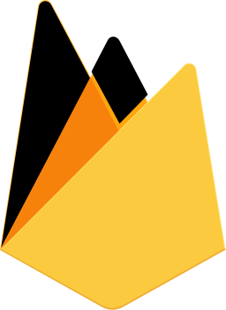</a> | **📂 檔名:** `firebase.svg` ✨ **格式:** `Vector (SVG)` ⚖️ **大小:** `3.77KB` 📅 **更新:** `2026-03-02`  🚀 **jsDelivr Markdown:** `` 🔗 **直接連結 (Url):** <code>https://cdn.jsdelivr.net/gh/barry028/materials@main/images/iCons/Brands/firebase.svg</code> 📥 [檢視原始檔](firebase.svg) |
|  | **📂 檔名:** `firefox.svg` ✨ **格式:** `Vector (SVG)` ⚖️ **大小:** `15.49KB` 📅 **更新:** `2026-03-02`  🚀 **jsDelivr Markdown:** `` 🔗 **直接連結 (Url):** <code>https://cdn.jsdelivr.net/gh/barry028/materials@main/images/iCons/Brands/firefox.svg</code> 📥 [檢視原始檔](firefox.svg) |
|  | **📂 檔名:** `flannel.svg` ✨ **格式:** `Vector (SVG)` ⚖️ **大小:** `6.47KB` 📅 **更新:** `2026-03-02`  🚀 **jsDelivr Markdown:** `` 🔗 **直接連結 (Url):** <code>https://cdn.jsdelivr.net/gh/barry028/materials@main/images/iCons/Brands/flannel.svg</code> 📥 [檢視原始檔](flannel.svg) |
|  | **📂 檔名:** `flarum.svg` ✨ **格式:** `Vector (SVG)` ⚖️ **大小:** `4.25KB` 📅 **更新:** `2026-03-02`  🚀 **jsDelivr Markdown:** `` 🔗 **直接連結 (Url):** <code>https://cdn.jsdelivr.net/gh/barry028/materials@main/images/iCons/Brands/flarum.svg</code> 📥 [檢視原始檔](flarum.svg) |
|  | **📂 檔名:** `flask.svg` ✨ **格式:** `Vector (SVG)` ⚖️ **大小:** `36.17KB` 📅 **更新:** `2026-03-02`  🚀 **jsDelivr Markdown:** `` 🔗 **直接連結 (Url):** <code>https://cdn.jsdelivr.net/gh/barry028/materials@main/images/iCons/Brands/flask.svg</code> 📥 [檢視原始檔](flask.svg) |
| <a href="flat-ui.svg">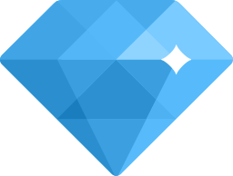</a> | **📂 檔名:** `flat-ui.svg` ✨ **格式:** `Vector (SVG)` ⚖️ **大小:** `3.18KB` 📅 **更新:** `2026-03-02`  🚀 **jsDelivr Markdown:** `` 🔗 **直接連結 (Url):** <code>https://cdn.jsdelivr.net/gh/barry028/materials@main/images/iCons/Brands/flat-ui.svg</code> 📥 [檢視原始檔](flat-ui.svg) |
|  | **📂 檔名:** `flattr-icon.svg` ✨ **格式:** `Vector (SVG)` ⚖️ **大小:** `4.54KB` 📅 **更新:** `2026-03-02`  🚀 **jsDelivr Markdown:** `` 🔗 **直接連結 (Url):** <code>https://cdn.jsdelivr.net/gh/barry028/materials@main/images/iCons/Brands/flattr-icon.svg</code> 📥 [檢視原始檔](flattr-icon.svg) |
|  | **📂 檔名:** `flattr.svg` ✨ **格式:** `Vector (SVG)` ⚖️ **大小:** `2.59KB` 📅 **更新:** `2026-03-02`  🚀 **jsDelivr Markdown:** `` 🔗 **直接連結 (Url):** <code>https://cdn.jsdelivr.net/gh/barry028/materials@main/images/iCons/Brands/flattr.svg</code> 📥 [檢視原始檔](flattr.svg) |
|  | **📂 檔名:** `fleep.svg` ✨ **格式:** `Vector (SVG)` ⚖️ **大小:** `4.68KB` 📅 **更新:** `2026-03-02`  🚀 **jsDelivr Markdown:** `` 🔗 **直接連結 (Url):** <code>https://cdn.jsdelivr.net/gh/barry028/materials@main/images/iCons/Brands/fleep.svg</code> 📥 [檢視原始檔](fleep.svg) |
|  | **📂 檔名:** `flickr-icon.svg` ✨ **格式:** `Vector (SVG)` ⚖️ **大小:** `788.00B` 📅 **更新:** `2026-03-02`  🚀 **jsDelivr Markdown:** `` 🔗 **直接連結 (Url):** <code>https://cdn.jsdelivr.net/gh/barry028/materials@main/images/iCons/Brands/flickr-icon.svg</code> 📥 [檢視原始檔](flickr-icon.svg) |
|  | **📂 檔名:** `flickr.svg` ✨ **格式:** `Vector (SVG)` ⚖️ **大小:** `2.58KB` 📅 **更新:** `2026-03-02`  🚀 **jsDelivr Markdown:** `` 🔗 **直接連結 (Url):** <code>https://cdn.jsdelivr.net/gh/barry028/materials@main/images/iCons/Brands/flickr.svg</code> 📥 [檢視原始檔](flickr.svg) |
| <a href="flight.svg">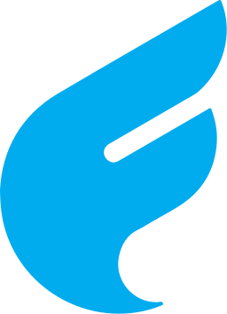</a> | **📂 檔名:** `flight.svg` ✨ **格式:** `Vector (SVG)` ⚖️ **大小:** `1.86KB` 📅 **更新:** `2026-03-02`  🚀 **jsDelivr Markdown:** `` 🔗 **直接連結 (Url):** <code>https://cdn.jsdelivr.net/gh/barry028/materials@main/images/iCons/Brands/flight.svg</code> 📥 [檢視原始檔](flight.svg) |
|  | **📂 檔名:** `floodio.svg` ✨ **格式:** `Vector (SVG)` ⚖️ **大小:** `2.05KB` 📅 **更新:** `2026-03-02`  🚀 **jsDelivr Markdown:** `` 🔗 **直接連結 (Url):** <code>https://cdn.jsdelivr.net/gh/barry028/materials@main/images/iCons/Brands/floodio.svg</code> 📥 [檢視原始檔](floodio.svg) |
|  | **📂 檔名:** `flow.svg` ✨ **格式:** `Vector (SVG)` ⚖️ **大小:** `1.68KB` 📅 **更新:** `2026-03-02`  🚀 **jsDelivr Markdown:** `` 🔗 **直接連結 (Url):** <code>https://cdn.jsdelivr.net/gh/barry028/materials@main/images/iCons/Brands/flow.svg</code> 📥 [檢視原始檔](flow.svg) |
|  | **📂 檔名:** `flowxo.svg` ✨ **格式:** `Vector (SVG)` ⚖️ **大小:** `2.41KB` 📅 **更新:** `2026-03-02`  🚀 **jsDelivr Markdown:** `` 🔗 **直接連結 (Url):** <code>https://cdn.jsdelivr.net/gh/barry028/materials@main/images/iCons/Brands/flowxo.svg</code> 📥 [檢視原始檔](flowxo.svg) |
| <a href="floydhub.svg">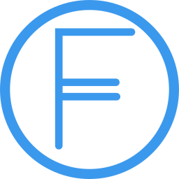</a> | **📂 檔名:** `floydhub.svg` ✨ **格式:** `Vector (SVG)` ⚖️ **大小:** `1.91KB` 📅 **更新:** `2026-03-02`  🚀 **jsDelivr Markdown:** `` 🔗 **直接連結 (Url):** <code>https://cdn.jsdelivr.net/gh/barry028/materials@main/images/iCons/Brands/floydhub.svg</code> 📥 [檢視原始檔](floydhub.svg) |
|  | **📂 檔名:** `flutter.svg` ✨ **格式:** `Vector (SVG)` ⚖️ **大小:** `1.23KB` 📅 **更新:** `2026-03-02`  🚀 **jsDelivr Markdown:** `` 🔗 **直接連結 (Url):** <code>https://cdn.jsdelivr.net/gh/barry028/materials@main/images/iCons/Brands/flutter.svg</code> 📥 [檢視原始檔](flutter.svg) |
|  | **📂 檔名:** `flux.svg` ✨ **格式:** `Vector (SVG)` ⚖️ **大小:** `1.95KB` 📅 **更新:** `2026-03-02`  🚀 **jsDelivr Markdown:** `` 🔗 **直接連結 (Url):** <code>https://cdn.jsdelivr.net/gh/barry028/materials@main/images/iCons/Brands/flux.svg</code> 📥 [檢視原始檔](flux.svg) |
| <a href="fluxxor.svg">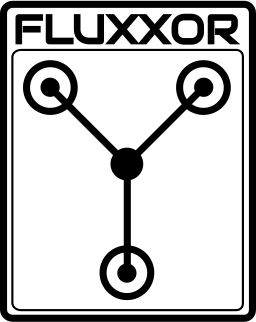</a> | **📂 檔名:** `fluxxor.svg` ✨ **格式:** `Vector (SVG)` ⚖️ **大小:** `8.75KB` 📅 **更新:** `2026-03-02`  🚀 **jsDelivr Markdown:** `` 🔗 **直接連結 (Url):** <code>https://cdn.jsdelivr.net/gh/barry028/materials@main/images/iCons/Brands/fluxxor.svg</code> 📥 [檢視原始檔](fluxxor.svg) |
|  | **📂 檔名:** `fly-icon.svg` ✨ **格式:** `Vector (SVG)` ⚖️ **大小:** `13.83KB` 📅 **更新:** `2026-03-02`  🚀 **jsDelivr Markdown:** `` 🔗 **直接連結 (Url):** <code>https://cdn.jsdelivr.net/gh/barry028/materials@main/images/iCons/Brands/fly-icon.svg</code> 📥 [檢視原始檔](fly-icon.svg) |
|  | **📂 檔名:** `fly.svg` ✨ **格式:** `Vector (SVG)` ⚖️ **大小:** `21.59KB` 📅 **更新:** `2026-03-02`  🚀 **jsDelivr Markdown:** `` 🔗 **直接連結 (Url):** <code>https://cdn.jsdelivr.net/gh/barry028/materials@main/images/iCons/Brands/fly.svg</code> 📥 [檢視原始檔](fly.svg) |
| <a href="fogbugz-icon.svg">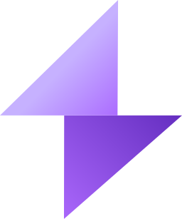</a> | **📂 檔名:** `fogbugz-icon.svg` ✨ **格式:** `Vector (SVG)` ⚖️ **大小:** `1.14KB` 📅 **更新:** `2026-03-02`  🚀 **jsDelivr Markdown:** `` 🔗 **直接連結 (Url):** <code>https://cdn.jsdelivr.net/gh/barry028/materials@main/images/iCons/Brands/fogbugz-icon.svg</code> 📥 [檢視原始檔](fogbugz-icon.svg) |
|  | **📂 檔名:** `fogbugz.svg` ✨ **格式:** `Vector (SVG)` ⚖️ **大小:** `14.76KB` 📅 **更新:** `2026-03-02`  🚀 **jsDelivr Markdown:** `` 🔗 **直接連結 (Url):** <code>https://cdn.jsdelivr.net/gh/barry028/materials@main/images/iCons/Brands/fogbugz.svg</code> 📥 [檢視原始檔](fogbugz.svg) |
|  | **📂 檔名:** `fomo-icon.svg` ✨ **格式:** `Vector (SVG)` ⚖️ **大小:** `2.95KB` 📅 **更新:** `2026-03-02`  🚀 **jsDelivr Markdown:** `` 🔗 **直接連結 (Url):** <code>https://cdn.jsdelivr.net/gh/barry028/materials@main/images/iCons/Brands/fomo-icon.svg</code> 📥 [檢視原始檔](fomo-icon.svg) |
|  | **📂 檔名:** `fomo.svg` ✨ **格式:** `Vector (SVG)` ⚖️ **大小:** `5.39KB` 📅 **更新:** `2026-03-02`  🚀 **jsDelivr Markdown:** `` 🔗 **直接連結 (Url):** <code>https://cdn.jsdelivr.net/gh/barry028/materials@main/images/iCons/Brands/fomo.svg</code> 📥 [檢視原始檔](fomo.svg) |
|  | **📂 檔名:** `font-awesome.svg` ✨ **格式:** `Vector (SVG)` ⚖️ **大小:** `3.99KB` 📅 **更新:** `2026-03-02`  🚀 **jsDelivr Markdown:** `` 🔗 **直接連結 (Url):** <code>https://cdn.jsdelivr.net/gh/barry028/materials@main/images/iCons/Brands/font-awesome.svg</code> 📥 [檢視原始檔](font-awesome.svg) |
|  | **📂 檔名:** `forestadmin-icon.svg` ✨ **格式:** `Vector (SVG)` ⚖️ **大小:** `1.41KB` 📅 **更新:** `2026-03-02`  🚀 **jsDelivr Markdown:** `` 🔗 **直接連結 (Url):** <code>https://cdn.jsdelivr.net/gh/barry028/materials@main/images/iCons/Brands/forestadmin-icon.svg</code> 📥 [檢視原始檔](forestadmin-icon.svg) |
|  | **📂 檔名:** `forestadmin.svg` ✨ **格式:** `Vector (SVG)` ⚖️ **大小:** `11.05KB` 📅 **更新:** `2026-03-02`  🚀 **jsDelivr Markdown:** `` 🔗 **直接連結 (Url):** <code>https://cdn.jsdelivr.net/gh/barry028/materials@main/images/iCons/Brands/forestadmin.svg</code> 📥 [檢視原始檔](forestadmin.svg) |
|  | **📂 檔名:** `forever.svg` ✨ **格式:** `Vector (SVG)` ⚖️ **大小:** `2.04KB` 📅 **更新:** `2026-03-02`  🚀 **jsDelivr Markdown:** `` 🔗 **直接連結 (Url):** <code>https://cdn.jsdelivr.net/gh/barry028/materials@main/images/iCons/Brands/forever.svg</code> 📥 [檢視原始檔](forever.svg) |
|  | **📂 檔名:** `formkeep.svg` ✨ **格式:** `Vector (SVG)` ⚖️ **大小:** `2.57KB` 📅 **更新:** `2026-03-02`  🚀 **jsDelivr Markdown:** `` 🔗 **直接連結 (Url):** <code>https://cdn.jsdelivr.net/gh/barry028/materials@main/images/iCons/Brands/formkeep.svg</code> 📥 [檢視原始檔](formkeep.svg) |
|  | **📂 檔名:** `fortran.svg` ✨ **格式:** `Vector (SVG)` ⚖️ **大小:** `2.59KB` 📅 **更新:** `2026-03-02`  🚀 **jsDelivr Markdown:** `` 🔗 **直接連結 (Url):** <code>https://cdn.jsdelivr.net/gh/barry028/materials@main/images/iCons/Brands/fortran.svg</code> 📥 [檢視原始檔](fortran.svg) |
|  | **📂 檔名:** `foundation.svg` ✨ **格式:** `Vector (SVG)` ⚖️ **大小:** `27.36KB` 📅 **更新:** `2026-03-02`  🚀 **jsDelivr Markdown:** `` 🔗 **直接連結 (Url):** <code>https://cdn.jsdelivr.net/gh/barry028/materials@main/images/iCons/Brands/foundation.svg</code> 📥 [檢視原始檔](foundation.svg) |
|  | **📂 檔名:** `foundationdb-icon.svg` ✨ **格式:** `Vector (SVG)` ⚖️ **大小:** `1012.00B` 📅 **更新:** `2026-03-02`  🚀 **jsDelivr Markdown:** `` 🔗 **直接連結 (Url):** <code>https://cdn.jsdelivr.net/gh/barry028/materials@main/images/iCons/Brands/foundationdb-icon.svg</code> 📥 [檢視原始檔](foundationdb-icon.svg) |
|  | **📂 檔名:** `foundationdb.svg` ✨ **格式:** `Vector (SVG)` ⚖️ **大小:** `7.79KB` 📅 **更新:** `2026-03-02`  🚀 **jsDelivr Markdown:** `` 🔗 **直接連結 (Url):** <code>https://cdn.jsdelivr.net/gh/barry028/materials@main/images/iCons/Brands/foundationdb.svg</code> 📥 [檢視原始檔](foundationdb.svg) |
|  | **📂 檔名:** `framer.svg` ✨ **格式:** `Vector (SVG)` ⚖️ **大小:** `405.00B` 📅 **更新:** `2026-03-02`  🚀 **jsDelivr Markdown:** `` 🔗 **直接連結 (Url):** <code>https://cdn.jsdelivr.net/gh/barry028/materials@main/images/iCons/Brands/framer.svg</code> 📥 [檢視原始檔](framer.svg) |
| <a href="framework7-icon.svg">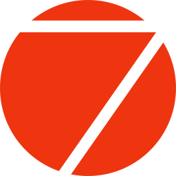</a> | **📂 檔名:** `framework7-icon.svg` ✨ **格式:** `Vector (SVG)` ⚖️ **大小:** `797.00B` 📅 **更新:** `2026-03-02`  🚀 **jsDelivr Markdown:** `` 🔗 **直接連結 (Url):** <code>https://cdn.jsdelivr.net/gh/barry028/materials@main/images/iCons/Brands/framework7-icon.svg</code> 📥 [檢視原始檔](framework7-icon.svg) |
| <a href="framework7.svg">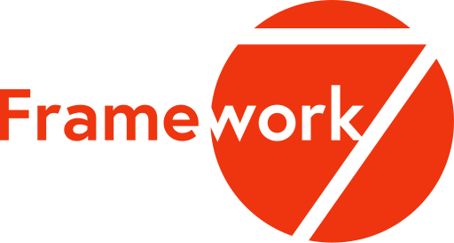</a> | **📂 檔名:** `framework7.svg` ✨ **格式:** `Vector (SVG)` ⚖️ **大小:** `11.02KB` 📅 **更新:** `2026-03-02`  🚀 **jsDelivr Markdown:** `` 🔗 **直接連結 (Url):** <code>https://cdn.jsdelivr.net/gh/barry028/materials@main/images/iCons/Brands/framework7.svg</code> 📥 [檢視原始檔](framework7.svg) |
|  | **📂 檔名:** `freebsd.svg` ✨ **格式:** `Vector (SVG)` ⚖️ **大小:** `1.69KB` 📅 **更新:** `2026-03-02`  🚀 **jsDelivr Markdown:** `` 🔗 **直接連結 (Url):** <code>https://cdn.jsdelivr.net/gh/barry028/materials@main/images/iCons/Brands/freebsd.svg</code> 📥 [檢視原始檔](freebsd.svg) |
|  | **📂 檔名:** `freedcamp-icon.svg` ✨ **格式:** `Vector (SVG)` ⚖️ **大小:** `11.21KB` 📅 **更新:** `2026-03-02`  🚀 **jsDelivr Markdown:** `` 🔗 **直接連結 (Url):** <code>https://cdn.jsdelivr.net/gh/barry028/materials@main/images/iCons/Brands/freedcamp-icon.svg</code> 📥 [檢視原始檔](freedcamp-icon.svg) |
|  | **📂 檔名:** `freedcamp.svg` ✨ **格式:** `Vector (SVG)` ⚖️ **大小:** `19.97KB` 📅 **更新:** `2026-03-02`  🚀 **jsDelivr Markdown:** `` 🔗 **直接連結 (Url):** <code>https://cdn.jsdelivr.net/gh/barry028/materials@main/images/iCons/Brands/freedcamp.svg</code> 📥 [檢視原始檔](freedcamp.svg) |
|  | **📂 檔名:** `freedomdefined.svg` ✨ **格式:** `Vector (SVG)` ⚖️ **大小:** `4.66KB` 📅 **更新:** `2026-03-02`  🚀 **jsDelivr Markdown:** `` 🔗 **直接連結 (Url):** <code>https://cdn.jsdelivr.net/gh/barry028/materials@main/images/iCons/Brands/freedomdefined.svg</code> 📥 [檢視原始檔](freedomdefined.svg) |
| <a href="fresh.svg">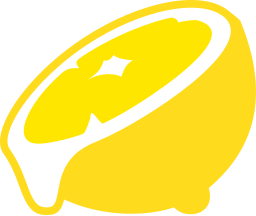</a> | **📂 檔名:** `fresh.svg` ✨ **格式:** `Vector (SVG)` ⚖️ **大小:** `4.48KB` 📅 **更新:** `2026-03-02`  🚀 **jsDelivr Markdown:** `` 🔗 **直接連結 (Url):** <code>https://cdn.jsdelivr.net/gh/barry028/materials@main/images/iCons/Brands/fresh.svg</code> 📥 [檢視原始檔](fresh.svg) |
|  | **📂 檔名:** `frontapp.svg` ✨ **格式:** `Vector (SVG)` ⚖️ **大小:** `1.37KB` 📅 **更新:** `2026-03-02`  🚀 **jsDelivr Markdown:** `` 🔗 **直接連結 (Url):** <code>https://cdn.jsdelivr.net/gh/barry028/materials@main/images/iCons/Brands/frontapp.svg</code> 📥 [檢視原始檔](frontapp.svg) |
| <a href="fsharp.svg">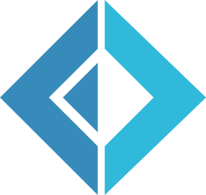</a> | **📂 檔名:** `fsharp.svg` ✨ **格式:** `Vector (SVG)` ⚖️ **大小:** `780.00B` 📅 **更新:** `2026-03-02`  🚀 **jsDelivr Markdown:** `` 🔗 **直接連結 (Url):** <code>https://cdn.jsdelivr.net/gh/barry028/materials@main/images/iCons/Brands/fsharp.svg</code> 📥 [檢視原始檔](fsharp.svg) |
|  | **📂 檔名:** `fuchsia.svg` ✨ **格式:** `Vector (SVG)` ⚖️ **大小:** `2.79KB` 📅 **更新:** `2026-03-02`  🚀 **jsDelivr Markdown:** `` 🔗 **直接連結 (Url):** <code>https://cdn.jsdelivr.net/gh/barry028/materials@main/images/iCons/Brands/fuchsia.svg</code> 📥 [檢視原始檔](fuchsia.svg) |
| <a href="galliumos.svg">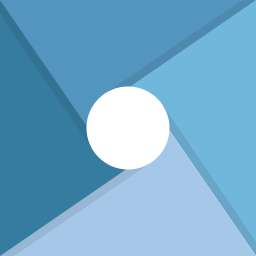</a> | **📂 檔名:** `galliumos.svg` ✨ **格式:** `Vector (SVG)` ⚖️ **大小:** `3.22KB` 📅 **更新:** `2026-03-02`  🚀 **jsDelivr Markdown:** `` 🔗 **直接連結 (Url):** <code>https://cdn.jsdelivr.net/gh/barry028/materials@main/images/iCons/Brands/galliumos.svg</code> 📥 [檢視原始檔](galliumos.svg) |
|  | **📂 檔名:** `game-analytics-icon.svg` ✨ **格式:** `Vector (SVG)` ⚖️ **大小:** `1.67KB` 📅 **更新:** `2026-03-02`  🚀 **jsDelivr Markdown:** `` 🔗 **直接連結 (Url):** <code>https://cdn.jsdelivr.net/gh/barry028/materials@main/images/iCons/Brands/game-analytics-icon.svg</code> 📥 [檢視原始檔](game-analytics-icon.svg) |
|  | **📂 檔名:** `game-analytics.svg` ✨ **格式:** `Vector (SVG)` ⚖️ **大小:** `8.35KB` 📅 **更新:** `2026-03-02`  🚀 **jsDelivr Markdown:** `` 🔗 **直接連結 (Url):** <code>https://cdn.jsdelivr.net/gh/barry028/materials@main/images/iCons/Brands/game-analytics.svg</code> 📥 [檢視原始檔](game-analytics.svg) |
|  | **📂 檔名:** `ganache-icon.svg` ✨ **格式:** `Vector (SVG)` ⚖️ **大小:** `5.32KB` 📅 **更新:** `2026-03-02`  🚀 **jsDelivr Markdown:** `` 🔗 **直接連結 (Url):** <code>https://cdn.jsdelivr.net/gh/barry028/materials@main/images/iCons/Brands/ganache-icon.svg</code> 📥 [檢視原始檔](ganache-icon.svg) |
| <a href="ganache.svg">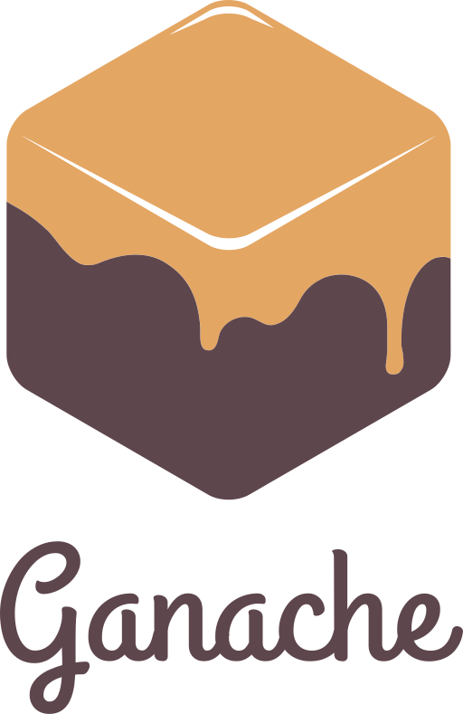</a> | **📂 檔名:** `ganache.svg` ✨ **格式:** `Vector (SVG)` ⚖️ **大小:** `29.85KB` 📅 **更新:** `2026-03-02`  🚀 **jsDelivr Markdown:** `` 🔗 **直接連結 (Url):** <code>https://cdn.jsdelivr.net/gh/barry028/materials@main/images/iCons/Brands/ganache.svg</code> 📥 [檢視原始檔](ganache.svg) |
|  | **📂 檔名:** `gatsby.svg` ✨ **格式:** `Vector (SVG)` ⚖️ **大小:** `1.15KB` 📅 **更新:** `2026-03-02`  🚀 **jsDelivr Markdown:** `` 🔗 **直接連結 (Url):** <code>https://cdn.jsdelivr.net/gh/barry028/materials@main/images/iCons/Brands/gatsby.svg</code> 📥 [檢視原始檔](gatsby.svg) |
|  | **📂 檔名:** `geekbot.svg` ✨ **格式:** `Vector (SVG)` ⚖️ **大小:** `7.92KB` 📅 **更新:** `2026-03-02`  🚀 **jsDelivr Markdown:** `` 🔗 **直接連結 (Url):** <code>https://cdn.jsdelivr.net/gh/barry028/materials@main/images/iCons/Brands/geekbot.svg</code> 📥 [檢視原始檔](geekbot.svg) |
|  | **📂 檔名:** `geetest-icon.svg` ✨ **格式:** `Vector (SVG)` ⚖️ **大小:** `2.05KB` 📅 **更新:** `2026-03-02`  🚀 **jsDelivr Markdown:** `` 🔗 **直接連結 (Url):** <code>https://cdn.jsdelivr.net/gh/barry028/materials@main/images/iCons/Brands/geetest-icon.svg</code> 📥 [檢視原始檔](geetest-icon.svg) |
|  | **📂 檔名:** `geetest.svg` ✨ **格式:** `Vector (SVG)` ⚖️ **大小:** `12.95KB` 📅 **更新:** `2026-03-02`  🚀 **jsDelivr Markdown:** `` 🔗 **直接連結 (Url):** <code>https://cdn.jsdelivr.net/gh/barry028/materials@main/images/iCons/Brands/geetest.svg</code> 📥 [檢視原始檔](geetest.svg) |
|  | **📂 檔名:** `getyourguide.svg` ✨ **格式:** `Vector (SVG)` ⚖️ **大小:** `8.08KB` 📅 **更新:** `2026-03-02`  🚀 **jsDelivr Markdown:** `` 🔗 **直接連結 (Url):** <code>https://cdn.jsdelivr.net/gh/barry028/materials@main/images/iCons/Brands/getyourguide.svg</code> 📥 [檢視原始檔](getyourguide.svg) |
|  | **📂 檔名:** `ghost.svg` ✨ **格式:** `Vector (SVG)` ⚖️ **大小:** `6.72KB` 📅 **更新:** `2026-03-02`  🚀 **jsDelivr Markdown:** `` 🔗 **直接連結 (Url):** <code>https://cdn.jsdelivr.net/gh/barry028/materials@main/images/iCons/Brands/ghost.svg</code> 📥 [檢視原始檔](ghost.svg) |
|  | **📂 檔名:** `giantswarm.svg` ✨ **格式:** `Vector (SVG)` ⚖️ **大小:** `3.41KB` 📅 **更新:** `2026-03-02`  🚀 **jsDelivr Markdown:** `` 🔗 **直接連結 (Url):** <code>https://cdn.jsdelivr.net/gh/barry028/materials@main/images/iCons/Brands/giantswarm.svg</code> 📥 [檢視原始檔](giantswarm.svg) |
| <a href="gin.svg">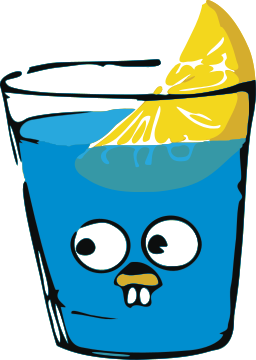</a> | **📂 檔名:** `gin.svg` ✨ **格式:** `Vector (SVG)` ⚖️ **大小:** `101.43KB` 📅 **更新:** `2026-03-02`  🚀 **jsDelivr Markdown:** `` 🔗 **直接連結 (Url):** <code>https://cdn.jsdelivr.net/gh/barry028/materials@main/images/iCons/Brands/gin.svg</code> 📥 [檢視原始檔](gin.svg) |
|  | **📂 檔名:** `git-icon.svg` ✨ **格式:** `Vector (SVG)` ⚖️ **大小:** `1.67KB` 📅 **更新:** `2026-03-02`  🚀 **jsDelivr Markdown:** `` 🔗 **直接連結 (Url):** <code>https://cdn.jsdelivr.net/gh/barry028/materials@main/images/iCons/Brands/git-icon.svg</code> 📥 [檢視原始檔](git-icon.svg) |
|  | **📂 檔名:** `git.svg` ✨ **格式:** `Vector (SVG)` ⚖️ **大小:** `4.93KB` 📅 **更新:** `2026-03-02`  🚀 **jsDelivr Markdown:** `` 🔗 **直接連結 (Url):** <code>https://cdn.jsdelivr.net/gh/barry028/materials@main/images/iCons/Brands/git.svg</code> 📥 [檢視原始檔](git.svg) |
| <a href="gitboard.svg">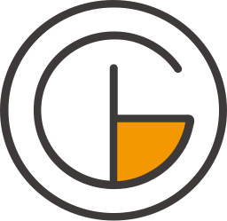</a> | **📂 檔名:** `gitboard.svg` ✨ **格式:** `Vector (SVG)` ⚖️ **大小:** `2.30KB` 📅 **更新:** `2026-03-02`  🚀 **jsDelivr Markdown:** `` 🔗 **直接連結 (Url):** <code>https://cdn.jsdelivr.net/gh/barry028/materials@main/images/iCons/Brands/gitboard.svg</code> 📥 [檢視原始檔](gitboard.svg) |
|  | **📂 檔名:** `github-actions.svg` ✨ **格式:** `Vector (SVG)` ⚖️ **大小:** `6.75KB` 📅 **更新:** `2026-03-02`  🚀 **jsDelivr Markdown:** `` 🔗 **直接連結 (Url):** <code>https://cdn.jsdelivr.net/gh/barry028/materials@main/images/iCons/Brands/github-actions.svg</code> 📥 [檢視原始檔](github-actions.svg) |
|  | **📂 檔名:** `github-copilot.svg` ✨ **格式:** `Vector (SVG)` ⚖️ **大小:** `3.32KB` 📅 **更新:** `2026-03-02`  🚀 **jsDelivr Markdown:** `` 🔗 **直接連結 (Url):** <code>https://cdn.jsdelivr.net/gh/barry028/materials@main/images/iCons/Brands/github-copilot.svg</code> 📥 [檢視原始檔](github-copilot.svg) |
|  | **📂 檔名:** `github-icon.svg` ✨ **格式:** `Vector (SVG)` ⚖️ **大小:** `3.82KB` 📅 **更新:** `2026-03-02`  🚀 **jsDelivr Markdown:** `` 🔗 **直接連結 (Url):** <code>https://cdn.jsdelivr.net/gh/barry028/materials@main/images/iCons/Brands/github-icon.svg</code> 📥 [檢視原始檔](github-icon.svg) |
|  | **📂 檔名:** `github-octocat.svg` ✨ **格式:** `Vector (SVG)` ⚖️ **大小:** `5.47KB` 📅 **更新:** `2026-03-02`  🚀 **jsDelivr Markdown:** `` 🔗 **直接連結 (Url):** <code>https://cdn.jsdelivr.net/gh/barry028/materials@main/images/iCons/Brands/github-octocat.svg</code> 📥 [檢視原始檔](github-octocat.svg) |
|  | **📂 檔名:** `github.svg` ✨ **格式:** `Vector (SVG)` ⚖️ **大小:** `5.97KB` 📅 **更新:** `2026-03-02`  🚀 **jsDelivr Markdown:** `` 🔗 **直接連結 (Url):** <code>https://cdn.jsdelivr.net/gh/barry028/materials@main/images/iCons/Brands/github.svg</code> 📥 [檢視原始檔](github.svg) |
|  | **📂 檔名:** `gitkraken.svg` ✨ **格式:** `Vector (SVG)` ⚖️ **大小:** `4.27KB` 📅 **更新:** `2026-03-02`  🚀 **jsDelivr Markdown:** `` 🔗 **直接連結 (Url):** <code>https://cdn.jsdelivr.net/gh/barry028/materials@main/images/iCons/Brands/gitkraken.svg</code> 📥 [檢視原始檔](gitkraken.svg) |
|  | **📂 檔名:** `gitlab.svg` ✨ **格式:** `Vector (SVG)` ⚖️ **大小:** `1.65KB` 📅 **更新:** `2026-03-02`  🚀 **jsDelivr Markdown:** `` 🔗 **直接連結 (Url):** <code>https://cdn.jsdelivr.net/gh/barry028/materials@main/images/iCons/Brands/gitlab.svg</code> 📥 [檢視原始檔](gitlab.svg) |
|  | **📂 檔名:** `gitter.svg` ✨ **格式:** `Vector (SVG)` ⚖️ **大小:** `955.00B` 📅 **更新:** `2026-03-02`  🚀 **jsDelivr Markdown:** `` 🔗 **直接連結 (Url):** <code>https://cdn.jsdelivr.net/gh/barry028/materials@main/images/iCons/Brands/gitter.svg</code> 📥 [檢視原始檔](gitter.svg) |
| <a href="gitup.svg">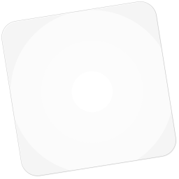</a> | **📂 檔名:** `gitup.svg` ✨ **格式:** `Vector (SVG)` ⚖️ **大小:** `4.07KB` 📅 **更新:** `2026-03-02`  🚀 **jsDelivr Markdown:** `` 🔗 **直接連結 (Url):** <code>https://cdn.jsdelivr.net/gh/barry028/materials@main/images/iCons/Brands/gitup.svg</code> 📥 [檢視原始檔](gitup.svg) |
|  | **📂 檔名:** `glamorous-icon.svg` ✨ **格式:** `Vector (SVG)` ⚖️ **大小:** `1.96KB` 📅 **更新:** `2026-03-02`  🚀 **jsDelivr Markdown:** `` 🔗 **直接連結 (Url):** <code>https://cdn.jsdelivr.net/gh/barry028/materials@main/images/iCons/Brands/glamorous-icon.svg</code> 📥 [檢視原始檔](glamorous-icon.svg) |
|  | **📂 檔名:** `glamorous.svg` ✨ **格式:** `Vector (SVG)` ⚖️ **大小:** `21.19KB` 📅 **更新:** `2026-03-02`  🚀 **jsDelivr Markdown:** `` 🔗 **直接連結 (Url):** <code>https://cdn.jsdelivr.net/gh/barry028/materials@main/images/iCons/Brands/glamorous.svg</code> 📥 [檢視原始檔](glamorous.svg) |
| <a href="gleam.svg">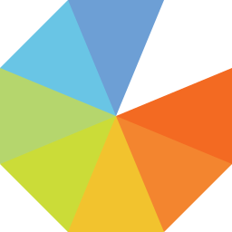</a> | **📂 檔名:** `gleam.svg` ✨ **格式:** `Vector (SVG)` ⚖️ **大小:** `989.00B` 📅 **更新:** `2026-03-02`  🚀 **jsDelivr Markdown:** `` 🔗 **直接連結 (Url):** <code>https://cdn.jsdelivr.net/gh/barry028/materials@main/images/iCons/Brands/gleam.svg</code> 📥 [檢視原始檔](gleam.svg) |
| <a href="glimmerjs.svg">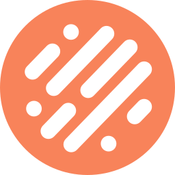</a> | **📂 檔名:** `glimmerjs.svg` ✨ **格式:** `Vector (SVG)` ⚖️ **大小:** `3.05KB` 📅 **更新:** `2026-03-02`  🚀 **jsDelivr Markdown:** `` 🔗 **直接連結 (Url):** <code>https://cdn.jsdelivr.net/gh/barry028/materials@main/images/iCons/Brands/glimmerjs.svg</code> 📥 [檢視原始檔](glimmerjs.svg) |
|  | **📂 檔名:** `glint.svg` ✨ **格式:** `Vector (SVG)` ⚖️ **大小:** `2.40KB` 📅 **更新:** `2026-03-02`  🚀 **jsDelivr Markdown:** `` 🔗 **直接連結 (Url):** <code>https://cdn.jsdelivr.net/gh/barry028/materials@main/images/iCons/Brands/glint.svg</code> 📥 [檢視原始檔](glint.svg) |
| <a href="glitch-icon.svg">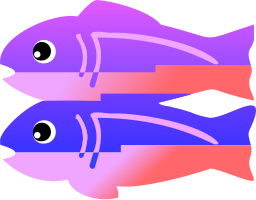</a> | **📂 檔名:** `glitch-icon.svg` ✨ **格式:** `Vector (SVG)` ⚖️ **大小:** `14.01KB` 📅 **更新:** `2026-03-02`  🚀 **jsDelivr Markdown:** `` 🔗 **直接連結 (Url):** <code>https://cdn.jsdelivr.net/gh/barry028/materials@main/images/iCons/Brands/glitch-icon.svg</code> 📥 [檢視原始檔](glitch-icon.svg) |
|  | **📂 檔名:** `glitch.svg` ✨ **格式:** `Vector (SVG)` ⚖️ **大小:** `16.74KB` 📅 **更新:** `2026-03-02`  🚀 **jsDelivr Markdown:** `` 🔗 **直接連結 (Url):** <code>https://cdn.jsdelivr.net/gh/barry028/materials@main/images/iCons/Brands/glitch.svg</code> 📥 [檢視原始檔](glitch.svg) |
|  | **📂 檔名:** `gnome-icon.svg` ✨ **格式:** `Vector (SVG)` ⚖️ **大小:** `1.30KB` 📅 **更新:** `2026-03-02`  🚀 **jsDelivr Markdown:** `` 🔗 **直接連結 (Url):** <code>https://cdn.jsdelivr.net/gh/barry028/materials@main/images/iCons/Brands/gnome-icon.svg</code> 📥 [檢視原始檔](gnome-icon.svg) |
|  | **📂 檔名:** `gnome.svg` ✨ **格式:** `Vector (SVG)` ⚖️ **大小:** `4.49KB` 📅 **更新:** `2026-03-02`  🚀 **jsDelivr Markdown:** `` 🔗 **直接連結 (Url):** <code>https://cdn.jsdelivr.net/gh/barry028/materials@main/images/iCons/Brands/gnome.svg</code> 📥 [檢視原始檔](gnome.svg) |
| <a href="gnu-net.svg">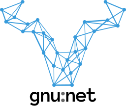</a> | **📂 檔名:** `gnu-net.svg` ✨ **格式:** `Vector (SVG)` ⚖️ **大小:** `25.18KB` 📅 **更新:** `2026-03-02`  🚀 **jsDelivr Markdown:** `` 🔗 **直接連結 (Url):** <code>https://cdn.jsdelivr.net/gh/barry028/materials@main/images/iCons/Brands/gnu-net.svg</code> 📥 [檢視原始檔](gnu-net.svg) |
|  | **📂 檔名:** `gnu.svg` ✨ **格式:** `Vector (SVG)` ⚖️ **大小:** `37.59KB` 📅 **更新:** `2026-03-02`  🚀 **jsDelivr Markdown:** `` 🔗 **直接連結 (Url):** <code>https://cdn.jsdelivr.net/gh/barry028/materials@main/images/iCons/Brands/gnu.svg</code> 📥 [檢視原始檔](gnu.svg) |
|  | **📂 檔名:** `gnupg-icon.svg` ✨ **格式:** `Vector (SVG)` ⚖️ **大小:** `4.72KB` 📅 **更新:** `2026-03-02`  🚀 **jsDelivr Markdown:** `` 🔗 **直接連結 (Url):** <code>https://cdn.jsdelivr.net/gh/barry028/materials@main/images/iCons/Brands/gnupg-icon.svg</code> 📥 [檢視原始檔](gnupg-icon.svg) |
|  | **📂 檔名:** `gnupg.svg` ✨ **格式:** `Vector (SVG)` ⚖️ **大小:** `10.53KB` 📅 **更新:** `2026-03-02`  🚀 **jsDelivr Markdown:** `` 🔗 **直接連結 (Url):** <code>https://cdn.jsdelivr.net/gh/barry028/materials@main/images/iCons/Brands/gnupg.svg</code> 📥 [檢視原始檔](gnupg.svg) |
|  | **📂 檔名:** `go.svg` ✨ **格式:** `Vector (SVG)` ⚖️ **大小:** `4.00KB` 📅 **更新:** `2026-03-02`  🚀 **jsDelivr Markdown:** `` 🔗 **直接連結 (Url):** <code>https://cdn.jsdelivr.net/gh/barry028/materials@main/images/iCons/Brands/go.svg</code> 📥 [檢視原始檔](go.svg) |
|  | **📂 檔名:** `gocd.svg` ✨ **格式:** `Vector (SVG)` ⚖️ **大小:** `5.98KB` 📅 **更新:** `2026-03-02`  🚀 **jsDelivr Markdown:** `` 🔗 **直接連結 (Url):** <code>https://cdn.jsdelivr.net/gh/barry028/materials@main/images/iCons/Brands/gocd.svg</code> 📥 [檢視原始檔](gocd.svg) |
|  | **📂 檔名:** `godot-icon.svg` ✨ **格式:** `Vector (SVG)` ⚖️ **大小:** `6.46KB` 📅 **更新:** `2026-03-02`  🚀 **jsDelivr Markdown:** `` 🔗 **直接連結 (Url):** <code>https://cdn.jsdelivr.net/gh/barry028/materials@main/images/iCons/Brands/godot-icon.svg</code> 📥 [檢視原始檔](godot-icon.svg) |
|  | **📂 檔名:** `godot.svg` ✨ **格式:** `Vector (SVG)` ⚖️ **大小:** `12.13KB` 📅 **更新:** `2026-03-02`  🚀 **jsDelivr Markdown:** `` 🔗 **直接連結 (Url):** <code>https://cdn.jsdelivr.net/gh/barry028/materials@main/images/iCons/Brands/godot.svg</code> 📥 [檢視原始檔](godot.svg) |
|  | **📂 檔名:** `gohorse.svg` ✨ **格式:** `Vector (SVG)` ⚖️ **大小:** `98.77KB` 📅 **更新:** `2026-03-02`  🚀 **jsDelivr Markdown:** `` 🔗 **直接連結 (Url):** <code>https://cdn.jsdelivr.net/gh/barry028/materials@main/images/iCons/Brands/gohorse.svg</code> 📥 [檢視原始檔](gohorse.svg) |
|  | **📂 檔名:** `goland.svg` ✨ **格式:** `Vector (SVG)` ⚖️ **大小:** `4.31KB` 📅 **更新:** `2026-03-02`  🚀 **jsDelivr Markdown:** `` 🔗 **直接連結 (Url):** <code>https://cdn.jsdelivr.net/gh/barry028/materials@main/images/iCons/Brands/goland.svg</code> 📥 [檢視原始檔](goland.svg) |
|  | **📂 檔名:** `google-360suite.svg` ✨ **格式:** `Vector (SVG)` ⚖️ **大小:** `17.10KB` 📅 **更新:** `2026-03-02`  🚀 **jsDelivr Markdown:** `` 🔗 **直接連結 (Url):** <code>https://cdn.jsdelivr.net/gh/barry028/materials@main/images/iCons/Brands/google-360suite.svg</code> 📥 [檢視原始檔](google-360suite.svg) |
|  | **📂 檔名:** `google-admob.svg` ✨ **格式:** `Vector (SVG)` ⚖️ **大小:** `1.59KB` 📅 **更新:** `2026-03-02`  🚀 **jsDelivr Markdown:** `` 🔗 **直接連結 (Url):** <code>https://cdn.jsdelivr.net/gh/barry028/materials@main/images/iCons/Brands/google-admob.svg</code> 📥 [檢視原始檔](google-admob.svg) |
|  | **📂 檔名:** `google-ads.svg` ✨ **格式:** `Vector (SVG)` ⚖️ **大小:** `975.00B` 📅 **更新:** `2026-03-02`  🚀 **jsDelivr Markdown:** `` 🔗 **直接連結 (Url):** <code>https://cdn.jsdelivr.net/gh/barry028/materials@main/images/iCons/Brands/google-ads.svg</code> 📥 [檢視原始檔](google-ads.svg) |
|  | **📂 檔名:** `google-adsense.svg` ✨ **格式:** `Vector (SVG)` ⚖️ **大小:** `1.62KB` 📅 **更新:** `2026-03-02`  🚀 **jsDelivr Markdown:** `` 🔗 **直接連結 (Url):** <code>https://cdn.jsdelivr.net/gh/barry028/materials@main/images/iCons/Brands/google-adsense.svg</code> 📥 [檢視原始檔](google-adsense.svg) |
|  | **📂 檔名:** `google-analytics.svg` ✨ **格式:** `Vector (SVG)` ⚖️ **大小:** `1.52KB` 📅 **更新:** `2026-03-02`  🚀 **jsDelivr Markdown:** `` 🔗 **直接連結 (Url):** <code>https://cdn.jsdelivr.net/gh/barry028/materials@main/images/iCons/Brands/google-analytics.svg</code> 📥 [檢視原始檔](google-analytics.svg) |
| <a href="google-bard-icon.svg">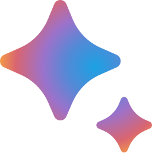</a> | **📂 檔名:** `google-bard-icon.svg` ✨ **格式:** `Vector (SVG)` ⚖️ **大小:** `3.12KB` 📅 **更新:** `2026-03-02`  🚀 **jsDelivr Markdown:** `` 🔗 **直接連結 (Url):** <code>https://cdn.jsdelivr.net/gh/barry028/materials@main/images/iCons/Brands/google-bard-icon.svg</code> 📥 [檢視原始檔](google-bard-icon.svg) |
| <a href="google-bard.svg">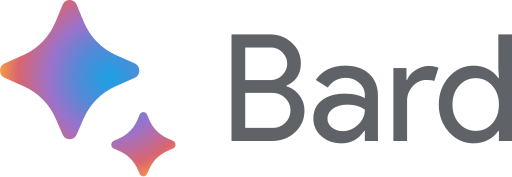</a> | **📂 檔名:** `google-bard.svg` ✨ **格式:** `Vector (SVG)` ⚖️ **大小:** `7.76KB` 📅 **更新:** `2026-03-02`  🚀 **jsDelivr Markdown:** `` 🔗 **直接連結 (Url):** <code>https://cdn.jsdelivr.net/gh/barry028/materials@main/images/iCons/Brands/google-bard.svg</code> 📥 [檢視原始檔](google-bard.svg) |
|  | **📂 檔名:** `google-calendar.svg` ✨ **格式:** `Vector (SVG)` ⚖️ **大小:** `3.71KB` 📅 **更新:** `2026-03-02`  🚀 **jsDelivr Markdown:** `` 🔗 **直接連結 (Url):** <code>https://cdn.jsdelivr.net/gh/barry028/materials@main/images/iCons/Brands/google-calendar.svg</code> 📥 [檢視原始檔](google-calendar.svg) |
| <a href="google-cloud-functions.svg">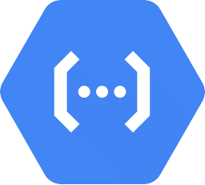</a> | **📂 檔名:** `google-cloud-functions.svg` ✨ **格式:** `Vector (SVG)` ⚖️ **大小:** `3.01KB` 📅 **更新:** `2026-03-02`  🚀 **jsDelivr Markdown:** `` 🔗 **直接連結 (Url):** <code>https://cdn.jsdelivr.net/gh/barry028/materials@main/images/iCons/Brands/google-cloud-functions.svg</code> 📥 [檢視原始檔](google-cloud-functions.svg) |
|  | **📂 檔名:** `google-cloud-run.svg` ✨ **格式:** `Vector (SVG)` ⚖️ **大小:** `1.79KB` 📅 **更新:** `2026-03-02`  🚀 **jsDelivr Markdown:** `` 🔗 **直接連結 (Url):** <code>https://cdn.jsdelivr.net/gh/barry028/materials@main/images/iCons/Brands/google-cloud-run.svg</code> 📥 [檢視原始檔](google-cloud-run.svg) |
|  | **📂 檔名:** `google-cloud.svg` ✨ **格式:** `Vector (SVG)` ⚖️ **大小:** `1.69KB` 📅 **更新:** `2026-03-02`  🚀 **jsDelivr Markdown:** `` 🔗 **直接連結 (Url):** <code>https://cdn.jsdelivr.net/gh/barry028/materials@main/images/iCons/Brands/google-cloud.svg</code> 📥 [檢視原始檔](google-cloud.svg) |
| <a href="google-data-studio.svg">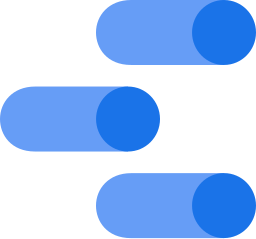</a> | **📂 檔名:** `google-data-studio.svg` ✨ **格式:** `Vector (SVG)` ⚖️ **大小:** `1.32KB` 📅 **更新:** `2026-03-02`  🚀 **jsDelivr Markdown:** `` 🔗 **直接連結 (Url):** <code>https://cdn.jsdelivr.net/gh/barry028/materials@main/images/iCons/Brands/google-data-studio.svg</code> 📥 [檢視原始檔](google-data-studio.svg) |
|  | **📂 檔名:** `google-developers.svg` ✨ **格式:** `Vector (SVG)` ⚖️ **大小:** `2.79KB` 📅 **更新:** `2026-03-02`  🚀 **jsDelivr Markdown:** `` 🔗 **直接連結 (Url):** <code>https://cdn.jsdelivr.net/gh/barry028/materials@main/images/iCons/Brands/google-developers.svg</code> 📥 [檢視原始檔](google-developers.svg) |
|  | **📂 檔名:** `google-domains-icon.svg` ✨ **格式:** `Vector (SVG)` ⚖️ **大小:** `1.39KB` 📅 **更新:** `2026-03-02`  🚀 **jsDelivr Markdown:** `` 🔗 **直接連結 (Url):** <code>https://cdn.jsdelivr.net/gh/barry028/materials@main/images/iCons/Brands/google-domains-icon.svg</code> 📥 [檢視原始檔](google-domains-icon.svg) |
|  | **📂 檔名:** `google-domains.svg` ✨ **格式:** `Vector (SVG)` ⚖️ **大小:** `12.59KB` 📅 **更新:** `2026-03-02`  🚀 **jsDelivr Markdown:** `` 🔗 **直接連結 (Url):** <code>https://cdn.jsdelivr.net/gh/barry028/materials@main/images/iCons/Brands/google-domains.svg</code> 📥 [檢視原始檔](google-domains.svg) |
| <a href="google-drive.svg">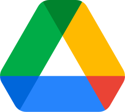</a> | **📂 檔名:** `google-drive.svg` ✨ **格式:** `Vector (SVG)` ⚖️ **大小:** `2.50KB` 📅 **更新:** `2026-03-02`  🚀 **jsDelivr Markdown:** `` 🔗 **直接連結 (Url):** <code>https://cdn.jsdelivr.net/gh/barry028/materials@main/images/iCons/Brands/google-drive.svg</code> 📥 [檢視原始檔](google-drive.svg) |
|  | **📂 檔名:** `google-fit.svg` ✨ **格式:** `Vector (SVG)` ⚖️ **大小:** `3.05KB` 📅 **更新:** `2026-03-02`  🚀 **jsDelivr Markdown:** `` 🔗 **直接連結 (Url):** <code>https://cdn.jsdelivr.net/gh/barry028/materials@main/images/iCons/Brands/google-fit.svg</code> 📥 [檢視原始檔](google-fit.svg) |
|  | **📂 檔名:** `google-gmail.svg` ✨ **格式:** `Vector (SVG)` ⚖️ **大小:** `1.29KB` 📅 **更新:** `2026-03-02`  🚀 **jsDelivr Markdown:** `` 🔗 **直接連結 (Url):** <code>https://cdn.jsdelivr.net/gh/barry028/materials@main/images/iCons/Brands/google-gmail.svg</code> 📥 [檢視原始檔](google-gmail.svg) |
|  | **📂 檔名:** `google-home.svg` ✨ **格式:** `Vector (SVG)` ⚖️ **大小:** `3.35KB` 📅 **更新:** `2026-03-02`  🚀 **jsDelivr Markdown:** `` 🔗 **直接連結 (Url):** <code>https://cdn.jsdelivr.net/gh/barry028/materials@main/images/iCons/Brands/google-home.svg</code> 📥 [檢視原始檔](google-home.svg) |
|  | **📂 檔名:** `google-icon.svg` ✨ **格式:** `Vector (SVG)` ⚖️ **大小:** `1.31KB` 📅 **更新:** `2026-03-02`  🚀 **jsDelivr Markdown:** `` 🔗 **直接連結 (Url):** <code>https://cdn.jsdelivr.net/gh/barry028/materials@main/images/iCons/Brands/google-icon.svg</code> 📥 [檢視原始檔](google-icon.svg) |
|  | **📂 檔名:** `google-keep.svg` ✨ **格式:** `Vector (SVG)` ⚖️ **大小:** `799.00B` 📅 **更新:** `2026-03-02`  🚀 **jsDelivr Markdown:** `` 🔗 **直接連結 (Url):** <code>https://cdn.jsdelivr.net/gh/barry028/materials@main/images/iCons/Brands/google-keep.svg</code> 📥 [檢視原始檔](google-keep.svg) |
|  | **📂 檔名:** `google-maps.svg` ✨ **格式:** `Vector (SVG)` ⚖️ **大小:** `2.33KB` 📅 **更新:** `2026-03-02`  🚀 **jsDelivr Markdown:** `` 🔗 **直接連結 (Url):** <code>https://cdn.jsdelivr.net/gh/barry028/materials@main/images/iCons/Brands/google-maps.svg</code> 📥 [檢視原始檔](google-maps.svg) |
|  | **📂 檔名:** `google-marketing-platform.svg` ✨ **格式:** `Vector (SVG)` ⚖️ **大小:** `1.66KB` 📅 **更新:** `2026-03-02`  🚀 **jsDelivr Markdown:** `` 🔗 **直接連結 (Url):** <code>https://cdn.jsdelivr.net/gh/barry028/materials@main/images/iCons/Brands/google-marketing-platform.svg</code> 📥 [檢視原始檔](google-marketing-platform.svg) |
|  | **📂 檔名:** `google-meet.svg` ✨ **格式:** `Vector (SVG)` ⚖️ **大小:** `1.76KB` 📅 **更新:** `2026-03-02`  🚀 **jsDelivr Markdown:** `` 🔗 **直接連結 (Url):** <code>https://cdn.jsdelivr.net/gh/barry028/materials@main/images/iCons/Brands/google-meet.svg</code> 📥 [檢視原始檔](google-meet.svg) |
|  | **📂 檔名:** `google-one.svg` ✨ **格式:** `Vector (SVG)` ⚖️ **大小:** `4.51KB` 📅 **更新:** `2026-03-02`  🚀 **jsDelivr Markdown:** `` 🔗 **直接連結 (Url):** <code>https://cdn.jsdelivr.net/gh/barry028/materials@main/images/iCons/Brands/google-one.svg</code> 📥 [檢視原始檔](google-one.svg) |
|  | **📂 檔名:** `google-optimize.svg` ✨ **格式:** `Vector (SVG)` ⚖️ **大小:** `1.36KB` 📅 **更新:** `2026-03-02`  🚀 **jsDelivr Markdown:** `` 🔗 **直接連結 (Url):** <code>https://cdn.jsdelivr.net/gh/barry028/materials@main/images/iCons/Brands/google-optimize.svg</code> 📥 [檢視原始檔](google-optimize.svg) |
|  | **📂 檔名:** `google-pay.svg` ✨ **格式:** `Vector (SVG)` ⚖️ **大小:** `4.18KB` 📅 **更新:** `2026-03-02`  🚀 **jsDelivr Markdown:** `` 🔗 **直接連結 (Url):** <code>https://cdn.jsdelivr.net/gh/barry028/materials@main/images/iCons/Brands/google-pay.svg</code> 📥 [檢視原始檔](google-pay.svg) |
| <a href="google-photos.svg">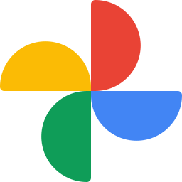</a> | **📂 檔名:** `google-photos.svg` ✨ **格式:** `Vector (SVG)` ⚖️ **大小:** `1.22KB` 📅 **更新:** `2026-03-02`  🚀 **jsDelivr Markdown:** `` 🔗 **直接連結 (Url):** <code>https://cdn.jsdelivr.net/gh/barry028/materials@main/images/iCons/Brands/google-photos.svg</code> 📥 [檢視原始檔](google-photos.svg) |
|  | **📂 檔名:** `google-play-console-icon.svg` ✨ **格式:** `Vector (SVG)` ⚖️ **大小:** `1.05KB` 📅 **更新:** `2026-03-02`  🚀 **jsDelivr Markdown:** `` 🔗 **直接連結 (Url):** <code>https://cdn.jsdelivr.net/gh/barry028/materials@main/images/iCons/Brands/google-play-console-icon.svg</code> 📥 [檢視原始檔](google-play-console-icon.svg) |
|  | **📂 檔名:** `google-play-console.svg` ✨ **格式:** `Vector (SVG)` ⚖️ **大小:** `13.60KB` 📅 **更新:** `2026-03-02`  🚀 **jsDelivr Markdown:** `` 🔗 **直接連結 (Url):** <code>https://cdn.jsdelivr.net/gh/barry028/materials@main/images/iCons/Brands/google-play-console.svg</code> 📥 [檢視原始檔](google-play-console.svg) |
|  | **📂 檔名:** `google-play-icon.svg` ✨ **格式:** `Vector (SVG)` ⚖️ **大小:** `1.34KB` 📅 **更新:** `2026-03-02`  🚀 **jsDelivr Markdown:** `` 🔗 **直接連結 (Url):** <code>https://cdn.jsdelivr.net/gh/barry028/materials@main/images/iCons/Brands/google-play-icon.svg</code> 📥 [檢視原始檔](google-play-icon.svg) |
|  | **📂 檔名:** `google-play.svg` ✨ **格式:** `Vector (SVG)` ⚖️ **大小:** `8.13KB` 📅 **更新:** `2026-03-02`  🚀 **jsDelivr Markdown:** `` 🔗 **直接連結 (Url):** <code>https://cdn.jsdelivr.net/gh/barry028/materials@main/images/iCons/Brands/google-play.svg</code> 📥 [檢視原始檔](google-play.svg) |
|  | **📂 檔名:** `google-search-console.svg` ✨ **格式:** `Vector (SVG)` ⚖️ **大小:** `3.52KB` 📅 **更新:** `2026-03-02`  🚀 **jsDelivr Markdown:** `` 🔗 **直接連結 (Url):** <code>https://cdn.jsdelivr.net/gh/barry028/materials@main/images/iCons/Brands/google-search-console.svg</code> 📥 [檢視原始檔](google-search-console.svg) |
|  | **📂 檔名:** `google-tag-manager.svg` ✨ **格式:** `Vector (SVG)` ⚖️ **大小:** `1.05KB` 📅 **更新:** `2026-03-02`  🚀 **jsDelivr Markdown:** `` 🔗 **直接連結 (Url):** <code>https://cdn.jsdelivr.net/gh/barry028/materials@main/images/iCons/Brands/google-tag-manager.svg</code> 📥 [檢視原始檔](google-tag-manager.svg) |
|  | **📂 檔名:** `google-workspace.svg` ✨ **格式:** `Vector (SVG)` ⚖️ **大小:** `12.85KB` 📅 **更新:** `2026-03-02`  🚀 **jsDelivr Markdown:** `` 🔗 **直接連結 (Url):** <code>https://cdn.jsdelivr.net/gh/barry028/materials@main/images/iCons/Brands/google-workspace.svg</code> 📥 [檢視原始檔](google-workspace.svg) |
|  | **📂 檔名:** `google.svg` ✨ **格式:** `Vector (SVG)` ⚖️ **大小:** `4.42KB` 📅 **更新:** `2026-03-02`  🚀 **jsDelivr Markdown:** `` 🔗 **直接連結 (Url):** <code>https://cdn.jsdelivr.net/gh/barry028/materials@main/images/iCons/Brands/google.svg</code> 📥 [檢視原始檔](google.svg) |
|  | **📂 檔名:** `gopher.svg` ✨ **格式:** `Vector (SVG)` ⚖️ **大小:** `21.19KB` 📅 **更新:** `2026-03-02`  🚀 **jsDelivr Markdown:** `` 🔗 **直接連結 (Url):** <code>https://cdn.jsdelivr.net/gh/barry028/materials@main/images/iCons/Brands/gopher.svg</code> 📥 [檢視原始檔](gopher.svg) |
|  | **📂 檔名:** `gradle.svg` ✨ **格式:** `Vector (SVG)` ⚖️ **大小:** `2.89KB` 📅 **更新:** `2026-03-02`  🚀 **jsDelivr Markdown:** `` 🔗 **直接連結 (Url):** <code>https://cdn.jsdelivr.net/gh/barry028/materials@main/images/iCons/Brands/gradle.svg</code> 📥 [檢視原始檔](gradle.svg) |
|  | **📂 檔名:** `grafana.svg` ✨ **格式:** `Vector (SVG)` ⚖️ **大小:** `14.04KB` 📅 **更新:** `2026-03-02`  🚀 **jsDelivr Markdown:** `` 🔗 **直接連結 (Url):** <code>https://cdn.jsdelivr.net/gh/barry028/materials@main/images/iCons/Brands/grafana.svg</code> 📥 [檢視原始檔](grafana.svg) |
|  | **📂 檔名:** `grails.svg` ✨ **格式:** `Vector (SVG)` ⚖️ **大小:** `12.44KB` 📅 **更新:** `2026-03-02`  🚀 **jsDelivr Markdown:** `` 🔗 **直接連結 (Url):** <code>https://cdn.jsdelivr.net/gh/barry028/materials@main/images/iCons/Brands/grails.svg</code> 📥 [檢視原始檔](grails.svg) |
|  | **📂 檔名:** `grammarly-icon.svg` ✨ **格式:** `Vector (SVG)` ⚖️ **大小:** `1.65KB` 📅 **更新:** `2026-03-02`  🚀 **jsDelivr Markdown:** `` 🔗 **直接連結 (Url):** <code>https://cdn.jsdelivr.net/gh/barry028/materials@main/images/iCons/Brands/grammarly-icon.svg</code> 📥 [檢視原始檔](grammarly-icon.svg) |
|  | **📂 檔名:** `grammarly.svg` ✨ **格式:** `Vector (SVG)` ⚖️ **大小:** `10.89KB` 📅 **更新:** `2026-03-02`  🚀 **jsDelivr Markdown:** `` 🔗 **直接連結 (Url):** <code>https://cdn.jsdelivr.net/gh/barry028/materials@main/images/iCons/Brands/grammarly.svg</code> 📥 [檢視原始檔](grammarly.svg) |
| <a href="graphene.svg">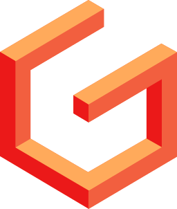</a> | **📂 檔名:** `graphene.svg` ✨ **格式:** `Vector (SVG)` ⚖️ **大小:** `2.29KB` 📅 **更新:** `2026-03-02`  🚀 **jsDelivr Markdown:** `` 🔗 **直接連結 (Url):** <code>https://cdn.jsdelivr.net/gh/barry028/materials@main/images/iCons/Brands/graphene.svg</code> 📥 [檢視原始檔](graphene.svg) |
| <a href="graphql.svg">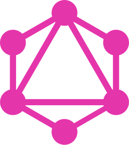</a> | **📂 檔名:** `graphql.svg` ✨ **格式:** `Vector (SVG)` ⚖️ **大小:** `3.48KB` 📅 **更新:** `2026-03-02`  🚀 **jsDelivr Markdown:** `` 🔗 **直接連結 (Url):** <code>https://cdn.jsdelivr.net/gh/barry028/materials@main/images/iCons/Brands/graphql.svg</code> 📥 [檢視原始檔](graphql.svg) |
|  | **📂 檔名:** `grav.svg` ✨ **格式:** `Vector (SVG)` ⚖️ **大小:** `5.56KB` 📅 **更新:** `2026-03-02`  🚀 **jsDelivr Markdown:** `` 🔗 **直接連結 (Url):** <code>https://cdn.jsdelivr.net/gh/barry028/materials@main/images/iCons/Brands/grav.svg</code> 📥 [檢視原始檔](grav.svg) |
|  | **📂 檔名:** `gravatar-icon.svg` ✨ **格式:** `Vector (SVG)` ⚖️ **大小:** `1.19KB` 📅 **更新:** `2026-03-02`  🚀 **jsDelivr Markdown:** `` 🔗 **直接連結 (Url):** <code>https://cdn.jsdelivr.net/gh/barry028/materials@main/images/iCons/Brands/gravatar-icon.svg</code> 📥 [檢視原始檔](gravatar-icon.svg) |
|  | **📂 檔名:** `gravatar.svg` ✨ **格式:** `Vector (SVG)` ⚖️ **大小:** `14.04KB` 📅 **更新:** `2026-03-02`  🚀 **jsDelivr Markdown:** `` 🔗 **直接連結 (Url):** <code>https://cdn.jsdelivr.net/gh/barry028/materials@main/images/iCons/Brands/gravatar.svg</code> 📥 [檢視原始檔](gravatar.svg) |
| <a href="graylog-icon.svg">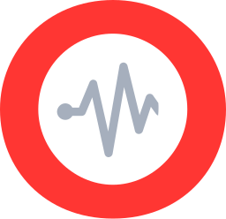</a> | **📂 檔名:** `graylog-icon.svg` ✨ **格式:** `Vector (SVG)` ⚖️ **大小:** `2.45KB` 📅 **更新:** `2026-03-02`  🚀 **jsDelivr Markdown:** `` 🔗 **直接連結 (Url):** <code>https://cdn.jsdelivr.net/gh/barry028/materials@main/images/iCons/Brands/graylog-icon.svg</code> 📥 [檢視原始檔](graylog-icon.svg) |
|  | **📂 檔名:** `graylog.svg` ✨ **格式:** `Vector (SVG)` ⚖️ **大小:** `6.36KB` 📅 **更新:** `2026-03-02`  🚀 **jsDelivr Markdown:** `` 🔗 **直接連結 (Url):** <code>https://cdn.jsdelivr.net/gh/barry028/materials@main/images/iCons/Brands/graylog.svg</code> 📥 [檢視原始檔](graylog.svg) |
| <a href="greensock-icon.svg">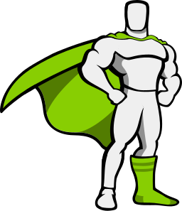</a> | **📂 檔名:** `greensock-icon.svg` ✨ **格式:** `Vector (SVG)` ⚖️ **大小:** `38.55KB` 📅 **更新:** `2026-03-02`  🚀 **jsDelivr Markdown:** `` 🔗 **直接連結 (Url):** <code>https://cdn.jsdelivr.net/gh/barry028/materials@main/images/iCons/Brands/greensock-icon.svg</code> 📥 [檢視原始檔](greensock-icon.svg) |
| <a href="greensock.svg">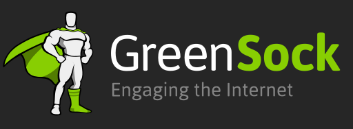</a> | **📂 檔名:** `greensock.svg` ✨ **格式:** `Vector (SVG)` ⚖️ **大小:** `62.80KB` 📅 **更新:** `2026-03-02`  🚀 **jsDelivr Markdown:** `` 🔗 **直接連結 (Url):** <code>https://cdn.jsdelivr.net/gh/barry028/materials@main/images/iCons/Brands/greensock.svg</code> 📥 [檢視原始檔](greensock.svg) |
|  | **📂 檔名:** `gridsome-icon.svg` ✨ **格式:** `Vector (SVG)` ⚖️ **大小:** `3.70KB` 📅 **更新:** `2026-03-02`  🚀 **jsDelivr Markdown:** `` 🔗 **直接連結 (Url):** <code>https://cdn.jsdelivr.net/gh/barry028/materials@main/images/iCons/Brands/gridsome-icon.svg</code> 📥 [檢視原始檔](gridsome-icon.svg) |
|  | **📂 檔名:** `gridsome.svg` ✨ **格式:** `Vector (SVG)` ⚖️ **大小:** `12.73KB` 📅 **更新:** `2026-03-02`  🚀 **jsDelivr Markdown:** `` 🔗 **直接連結 (Url):** <code>https://cdn.jsdelivr.net/gh/barry028/materials@main/images/iCons/Brands/gridsome.svg</code> 📥 [檢視原始檔](gridsome.svg) |
|  | **📂 檔名:** `grommet.svg` ✨ **格式:** `Vector (SVG)` ⚖️ **大小:** `8.92KB` 📅 **更新:** `2026-03-02`  🚀 **jsDelivr Markdown:** `` 🔗 **直接連結 (Url):** <code>https://cdn.jsdelivr.net/gh/barry028/materials@main/images/iCons/Brands/grommet.svg</code> 📥 [檢視原始檔](grommet.svg) |
|  | **📂 檔名:** `groovehq.svg` ✨ **格式:** `Vector (SVG)` ⚖️ **大小:** `5.49KB` 📅 **更新:** `2026-03-02`  🚀 **jsDelivr Markdown:** `` 🔗 **直接連結 (Url):** <code>https://cdn.jsdelivr.net/gh/barry028/materials@main/images/iCons/Brands/groovehq.svg</code> 📥 [檢視原始檔](groovehq.svg) |
|  | **📂 檔名:** `grove.svg` ✨ **格式:** `Vector (SVG)` ⚖️ **大小:** `2.17KB` 📅 **更新:** `2026-03-02`  🚀 **jsDelivr Markdown:** `` 🔗 **直接連結 (Url):** <code>https://cdn.jsdelivr.net/gh/barry028/materials@main/images/iCons/Brands/grove.svg</code> 📥 [檢視原始檔](grove.svg) |
|  | **📂 檔名:** `growth-book-icon.svg` ✨ **格式:** `Vector (SVG)` ⚖️ **大小:** `1.31KB` 📅 **更新:** `2026-03-02`  🚀 **jsDelivr Markdown:** `` 🔗 **直接連結 (Url):** <code>https://cdn.jsdelivr.net/gh/barry028/materials@main/images/iCons/Brands/growth-book-icon.svg</code> 📥 [檢視原始檔](growth-book-icon.svg) |
|  | **📂 檔名:** `growth-book.svg` ✨ **格式:** `Vector (SVG)` ⚖️ **大小:** `6.71KB` 📅 **更新:** `2026-03-02`  🚀 **jsDelivr Markdown:** `` 🔗 **直接連結 (Url):** <code>https://cdn.jsdelivr.net/gh/barry028/materials@main/images/iCons/Brands/growth-book.svg</code> 📥 [檢視原始檔](growth-book.svg) |
| <a href="grpc.svg">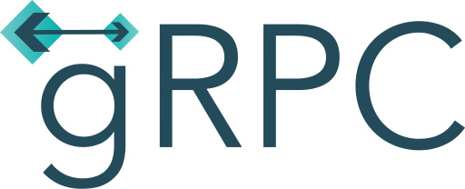</a> | **📂 檔名:** `grpc.svg` ✨ **格式:** `Vector (SVG)` ⚖️ **大小:** `8.33KB` 📅 **更新:** `2026-03-02`  🚀 **jsDelivr Markdown:** `` 🔗 **直接連結 (Url):** <code>https://cdn.jsdelivr.net/gh/barry028/materials@main/images/iCons/Brands/grpc.svg</code> 📥 [檢視原始檔](grpc.svg) |
|  | **📂 檔名:** `grunt.svg` ✨ **格式:** `Vector (SVG)` ⚖️ **大小:** `39.42KB` 📅 **更新:** `2026-03-02`  🚀 **jsDelivr Markdown:** `` 🔗 **直接連結 (Url):** <code>https://cdn.jsdelivr.net/gh/barry028/materials@main/images/iCons/Brands/grunt.svg</code> 📥 [檢視原始檔](grunt.svg) |
| <a href="gulp.svg">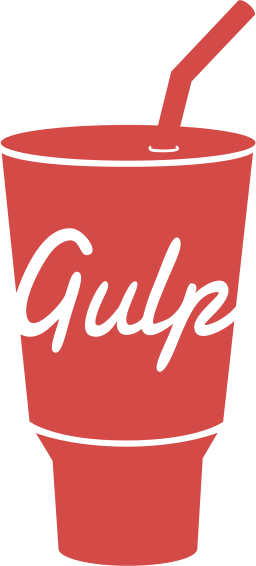</a> | **📂 檔名:** `gulp.svg` ✨ **格式:** `Vector (SVG)` ⚖️ **大小:** `3.67KB` 📅 **更新:** `2026-03-02`  🚀 **jsDelivr Markdown:** `` 🔗 **直接連結 (Url):** <code>https://cdn.jsdelivr.net/gh/barry028/materials@main/images/iCons/Brands/gulp.svg</code> 📥 [檢視原始檔](gulp.svg) |
| <a href="gunicorn.svg">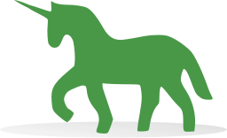</a> | **📂 檔名:** `gunicorn.svg` ✨ **格式:** `Vector (SVG)` ⚖️ **大小:** `5.66KB` 📅 **更新:** `2026-03-02`  🚀 **jsDelivr Markdown:** `` 🔗 **直接連結 (Url):** <code>https://cdn.jsdelivr.net/gh/barry028/materials@main/images/iCons/Brands/gunicorn.svg</code> 📥 [檢視原始檔](gunicorn.svg) |
|  | **📂 檔名:** `gunjs.svg` ✨ **格式:** `Vector (SVG)` ⚖️ **大小:** `52.06KB` 📅 **更新:** `2026-03-02`  🚀 **jsDelivr Markdown:** `` 🔗 **直接連結 (Url):** <code>https://cdn.jsdelivr.net/gh/barry028/materials@main/images/iCons/Brands/gunjs.svg</code> 📥 [檢視原始檔](gunjs.svg) |
|  | **📂 檔名:** `gusto.svg` ✨ **格式:** `Vector (SVG)` ⚖️ **大小:** `4.61KB` 📅 **更新:** `2026-03-02`  🚀 **jsDelivr Markdown:** `` 🔗 **直接連結 (Url):** <code>https://cdn.jsdelivr.net/gh/barry028/materials@main/images/iCons/Brands/gusto.svg</code> 📥 [檢視原始檔](gusto.svg) |
| <a href="gwt.svg">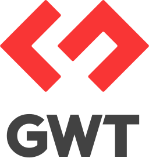</a> | **📂 檔名:** `gwt.svg` ✨ **格式:** `Vector (SVG)` ⚖️ **大小:** `3.29KB` 📅 **更新:** `2026-03-02`  🚀 **jsDelivr Markdown:** `` 🔗 **直接連結 (Url):** <code>https://cdn.jsdelivr.net/gh/barry028/materials@main/images/iCons/Brands/gwt.svg</code> 📥 [檢視原始檔](gwt.svg) |
| <a href="hack.svg">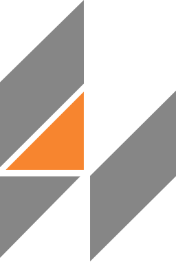</a> | **📂 檔名:** `hack.svg` ✨ **格式:** `Vector (SVG)` ⚖️ **大小:** `798.00B` 📅 **更新:** `2026-03-02`  🚀 **jsDelivr Markdown:** `` 🔗 **直接連結 (Url):** <code>https://cdn.jsdelivr.net/gh/barry028/materials@main/images/iCons/Brands/hack.svg</code> 📥 [檢視原始檔](hack.svg) |
|  | **📂 檔名:** `hacker-one.svg` ✨ **格式:** `Vector (SVG)` ⚖️ **大小:** `1.62KB` 📅 **更新:** `2026-03-02`  🚀 **jsDelivr Markdown:** `` 🔗 **直接連結 (Url):** <code>https://cdn.jsdelivr.net/gh/barry028/materials@main/images/iCons/Brands/hacker-one.svg</code> 📥 [檢視原始檔](hacker-one.svg) |
|  | **📂 檔名:** `hadoop.svg` ✨ **格式:** `Vector (SVG)` ⚖️ **大小:** `37.63KB` 📅 **更新:** `2026-03-02`  🚀 **jsDelivr Markdown:** `` 🔗 **直接連結 (Url):** <code>https://cdn.jsdelivr.net/gh/barry028/materials@main/images/iCons/Brands/hadoop.svg</code> 📥 [檢視原始檔](hadoop.svg) |
|  | **📂 檔名:** `haiku-icon.svg` ✨ **格式:** `Vector (SVG)` ⚖️ **大小:** `4.10KB` 📅 **更新:** `2026-03-02`  🚀 **jsDelivr Markdown:** `` 🔗 **直接連結 (Url):** <code>https://cdn.jsdelivr.net/gh/barry028/materials@main/images/iCons/Brands/haiku-icon.svg</code> 📥 [檢視原始檔](haiku-icon.svg) |
|  | **📂 檔名:** `haiku.svg` ✨ **格式:** `Vector (SVG)` ⚖️ **大小:** `6.77KB` 📅 **更新:** `2026-03-02`  🚀 **jsDelivr Markdown:** `` 🔗 **直接連結 (Url):** <code>https://cdn.jsdelivr.net/gh/barry028/materials@main/images/iCons/Brands/haiku.svg</code> 📥 [檢視原始檔](haiku.svg) |
| <a href="haml.svg">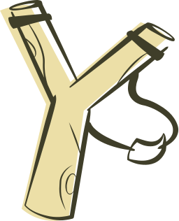</a> | **📂 檔名:** `haml.svg` ✨ **格式:** `Vector (SVG)` ⚖️ **大小:** `21.91KB` 📅 **更新:** `2026-03-02`  🚀 **jsDelivr Markdown:** `` 🔗 **直接連結 (Url):** <code>https://cdn.jsdelivr.net/gh/barry028/materials@main/images/iCons/Brands/haml.svg</code> 📥 [檢視原始檔](haml.svg) |
|  | **📂 檔名:** `hanami.svg` ✨ **格式:** `Vector (SVG)` ⚖️ **大小:** `1.45KB` 📅 **更新:** `2026-03-02`  🚀 **jsDelivr Markdown:** `` 🔗 **直接連結 (Url):** <code>https://cdn.jsdelivr.net/gh/barry028/materials@main/images/iCons/Brands/hanami.svg</code> 📥 [檢視原始檔](hanami.svg) |
|  | **📂 檔名:** `handlebars.svg` ✨ **格式:** `Vector (SVG)` ⚖️ **大小:** `2.84KB` 📅 **更新:** `2026-03-02`  🚀 **jsDelivr Markdown:** `` 🔗 **直接連結 (Url):** <code>https://cdn.jsdelivr.net/gh/barry028/materials@main/images/iCons/Brands/handlebars.svg</code> 📥 [檢視原始檔](handlebars.svg) |
| <a href="hapi.svg">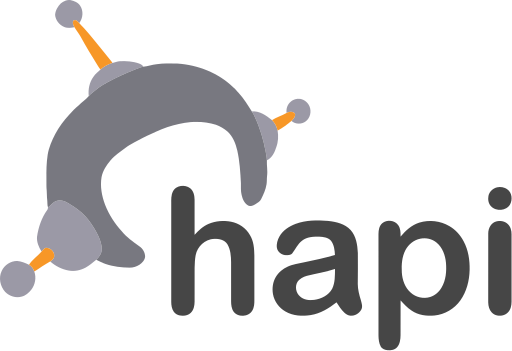</a> | **📂 檔名:** `hapi.svg` ✨ **格式:** `Vector (SVG)` ⚖️ **大小:** `15.11KB` 📅 **更新:** `2026-03-02`  🚀 **jsDelivr Markdown:** `` 🔗 **直接連結 (Url):** <code>https://cdn.jsdelivr.net/gh/barry028/materials@main/images/iCons/Brands/hapi.svg</code> 📥 [檢視原始檔](hapi.svg) |
|  | **📂 檔名:** `hardhat-icon.svg` ✨ **格式:** `Vector (SVG)` ⚖️ **大小:** `4.39KB` 📅 **更新:** `2026-03-02`  🚀 **jsDelivr Markdown:** `` 🔗 **直接連結 (Url):** <code>https://cdn.jsdelivr.net/gh/barry028/materials@main/images/iCons/Brands/hardhat-icon.svg</code> 📥 [檢視原始檔](hardhat-icon.svg) |
|  | **📂 檔名:** `hardhat.svg` ✨ **格式:** `Vector (SVG)` ⚖️ **大小:** `8.45KB` 📅 **更新:** `2026-03-02`  🚀 **jsDelivr Markdown:** `` 🔗 **直接連結 (Url):** <code>https://cdn.jsdelivr.net/gh/barry028/materials@main/images/iCons/Brands/hardhat.svg</code> 📥 [檢視原始檔](hardhat.svg) |
|  | **📂 檔名:** `harness-icon.svg` ✨ **格式:** `Vector (SVG)` ⚖️ **大小:** `2.33KB` 📅 **更新:** `2026-03-02`  🚀 **jsDelivr Markdown:** `` 🔗 **直接連結 (Url):** <code>https://cdn.jsdelivr.net/gh/barry028/materials@main/images/iCons/Brands/harness-icon.svg</code> 📥 [檢視原始檔](harness-icon.svg) |
|  | **📂 檔名:** `harness.svg` ✨ **格式:** `Vector (SVG)` ⚖️ **大小:** `10.75KB` 📅 **更新:** `2026-03-02`  🚀 **jsDelivr Markdown:** `` 🔗 **直接連結 (Url):** <code>https://cdn.jsdelivr.net/gh/barry028/materials@main/images/iCons/Brands/harness.svg</code> 📥 [檢視原始檔](harness.svg) |
|  | **📂 檔名:** `hashicorp-icon.svg` ✨ **格式:** `Vector (SVG)` ⚖️ **大小:** `827.00B` 📅 **更新:** `2026-03-02`  🚀 **jsDelivr Markdown:** `` 🔗 **直接連結 (Url):** <code>https://cdn.jsdelivr.net/gh/barry028/materials@main/images/iCons/Brands/hashicorp-icon.svg</code> 📥 [檢視原始檔](hashicorp-icon.svg) |
|  | **📂 檔名:** `hashicorp.svg` ✨ **格式:** `Vector (SVG)` ⚖️ **大小:** `6.06KB` 📅 **更新:** `2026-03-02`  🚀 **jsDelivr Markdown:** `` 🔗 **直接連結 (Url):** <code>https://cdn.jsdelivr.net/gh/barry028/materials@main/images/iCons/Brands/hashicorp.svg</code> 📥 [檢視原始檔](hashicorp.svg) |
| <a href="hashnode-icon.svg">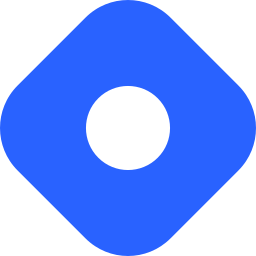</a> | **📂 檔名:** `hashnode-icon.svg` ✨ **格式:** `Vector (SVG)` ⚖️ **大小:** `970.00B` 📅 **更新:** `2026-03-02`  🚀 **jsDelivr Markdown:** `` 🔗 **直接連結 (Url):** <code>https://cdn.jsdelivr.net/gh/barry028/materials@main/images/iCons/Brands/hashnode-icon.svg</code> 📥 [檢視原始檔](hashnode-icon.svg) |
|  | **📂 檔名:** `hashnode.svg` ✨ **格式:** `Vector (SVG)` ⚖️ **大小:** `6.44KB` 📅 **更新:** `2026-03-02`  🚀 **jsDelivr Markdown:** `` 🔗 **直接連結 (Url):** <code>https://cdn.jsdelivr.net/gh/barry028/materials@main/images/iCons/Brands/hashnode.svg</code> 📥 [檢視原始檔](hashnode.svg) |
|  | **📂 檔名:** `haskell-icon.svg` ✨ **格式:** `Vector (SVG)` ⚖️ **大小:** `855.00B` 📅 **更新:** `2026-03-02`  🚀 **jsDelivr Markdown:** `` 🔗 **直接連結 (Url):** <code>https://cdn.jsdelivr.net/gh/barry028/materials@main/images/iCons/Brands/haskell-icon.svg</code> 📥 [檢視原始檔](haskell-icon.svg) |
|  | **📂 檔名:** `haskell.svg` ✨ **格式:** `Vector (SVG)` ⚖️ **大小:** `9.25KB` 📅 **更新:** `2026-03-02`  🚀 **jsDelivr Markdown:** `` 🔗 **直接連結 (Url):** <code>https://cdn.jsdelivr.net/gh/barry028/materials@main/images/iCons/Brands/haskell.svg</code> 📥 [檢視原始檔](haskell.svg) |
| <a href="hasura-icon.svg">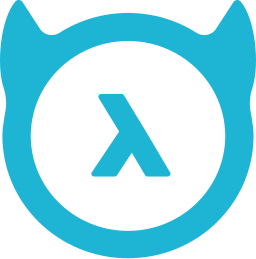</a> | **📂 檔名:** `hasura-icon.svg` ✨ **格式:** `Vector (SVG)` ⚖️ **大小:** `2.98KB` 📅 **更新:** `2026-03-02`  🚀 **jsDelivr Markdown:** `` 🔗 **直接連結 (Url):** <code>https://cdn.jsdelivr.net/gh/barry028/materials@main/images/iCons/Brands/hasura-icon.svg</code> 📥 [檢視原始檔](hasura-icon.svg) |
|  | **📂 檔名:** `hasura.svg` ✨ **格式:** `Vector (SVG)` ⚖️ **大小:** `6.74KB` 📅 **更新:** `2026-03-02`  🚀 **jsDelivr Markdown:** `` 🔗 **直接連結 (Url):** <code>https://cdn.jsdelivr.net/gh/barry028/materials@main/images/iCons/Brands/hasura.svg</code> 📥 [檢視原始檔](hasura.svg) |
|  | **📂 檔名:** `haxe.svg` ✨ **格式:** `Vector (SVG)` ⚖️ **大小:** `3.27KB` 📅 **更新:** `2026-03-02`  🚀 **jsDelivr Markdown:** `` 🔗 **直接連結 (Url):** <code>https://cdn.jsdelivr.net/gh/barry028/materials@main/images/iCons/Brands/haxe.svg</code> 📥 [檢視原始檔](haxe.svg) |
|  | **📂 檔名:** `haxl.svg` ✨ **格式:** `Vector (SVG)` ⚖️ **大小:** `833.00B` 📅 **更新:** `2026-03-02`  🚀 **jsDelivr Markdown:** `` 🔗 **直接連結 (Url):** <code>https://cdn.jsdelivr.net/gh/barry028/materials@main/images/iCons/Brands/haxl.svg</code> 📥 [檢視原始檔](haxl.svg) |
|  | **📂 檔名:** `hbase.svg` ✨ **格式:** `Vector (SVG)` ⚖️ **大小:** `8.48KB` 📅 **更新:** `2026-03-02`  🚀 **jsDelivr Markdown:** `` 🔗 **直接連結 (Url):** <code>https://cdn.jsdelivr.net/gh/barry028/materials@main/images/iCons/Brands/hbase.svg</code> 📥 [檢視原始檔](hbase.svg) |
|  | **📂 檔名:** `hcaptcha-icon.svg` ✨ **格式:** `Vector (SVG)` ⚖️ **大小:** `13.61KB` 📅 **更新:** `2026-03-02`  🚀 **jsDelivr Markdown:** `` 🔗 **直接連結 (Url):** <code>https://cdn.jsdelivr.net/gh/barry028/materials@main/images/iCons/Brands/hcaptcha-icon.svg</code> 📥 [檢視原始檔](hcaptcha-icon.svg) |
|  | **📂 檔名:** `hcaptcha.svg` ✨ **格式:** `Vector (SVG)` ⚖️ **大小:** `19.78KB` 📅 **更新:** `2026-03-02`  🚀 **jsDelivr Markdown:** `` 🔗 **直接連結 (Url):** <code>https://cdn.jsdelivr.net/gh/barry028/materials@main/images/iCons/Brands/hcaptcha.svg</code> 📥 [檢視原始檔](hcaptcha.svg) |
|  | **📂 檔名:** `headlessui-icon.svg` ✨ **格式:** `Vector (SVG)` ⚖️ **大小:** `3.88KB` 📅 **更新:** `2026-03-02`  🚀 **jsDelivr Markdown:** `` 🔗 **直接連結 (Url):** <code>https://cdn.jsdelivr.net/gh/barry028/materials@main/images/iCons/Brands/headlessui-icon.svg</code> 📥 [檢視原始檔](headlessui-icon.svg) |
|  | **📂 檔名:** `headlessui.svg` ✨ **格式:** `Vector (SVG)` ⚖️ **大小:** `11.58KB` 📅 **更新:** `2026-03-02`  🚀 **jsDelivr Markdown:** `` 🔗 **直接連結 (Url):** <code>https://cdn.jsdelivr.net/gh/barry028/materials@main/images/iCons/Brands/headlessui.svg</code> 📥 [檢視原始檔](headlessui.svg) |
| <a href="heap-icon.svg">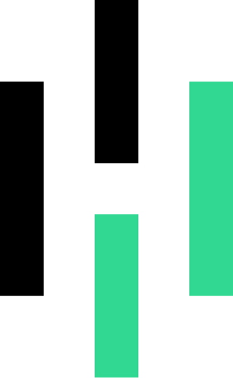</a> | **📂 檔名:** `heap-icon.svg` ✨ **格式:** `Vector (SVG)` ⚖️ **大小:** `657.00B` 📅 **更新:** `2026-03-02`  🚀 **jsDelivr Markdown:** `` 🔗 **直接連結 (Url):** <code>https://cdn.jsdelivr.net/gh/barry028/materials@main/images/iCons/Brands/heap-icon.svg</code> 📥 [檢視原始檔](heap-icon.svg) |
|  | **📂 檔名:** `heap.svg` ✨ **格式:** `Vector (SVG)` ⚖️ **大小:** `3.40KB` 📅 **更新:** `2026-03-02`  🚀 **jsDelivr Markdown:** `` 🔗 **直接連結 (Url):** <code>https://cdn.jsdelivr.net/gh/barry028/materials@main/images/iCons/Brands/heap.svg</code> 📥 [檢視原始檔](heap.svg) |
| <a href="helm.svg">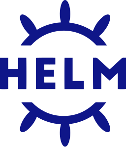</a> | **📂 檔名:** `helm.svg` ✨ **格式:** `Vector (SVG)` ⚖️ **大小:** `19.96KB` 📅 **更新:** `2026-03-02`  🚀 **jsDelivr Markdown:** `` 🔗 **直接連結 (Url):** <code>https://cdn.jsdelivr.net/gh/barry028/materials@main/images/iCons/Brands/helm.svg</code> 📥 [檢視原始檔](helm.svg) |
|  | **📂 檔名:** `helpscout-icon.svg` ✨ **格式:** `Vector (SVG)` ⚖️ **大小:** `1.13KB` 📅 **更新:** `2026-03-02`  🚀 **jsDelivr Markdown:** `` 🔗 **直接連結 (Url):** <code>https://cdn.jsdelivr.net/gh/barry028/materials@main/images/iCons/Brands/helpscout-icon.svg</code> 📥 [檢視原始檔](helpscout-icon.svg) |
|  | **📂 檔名:** `helpscout.svg` ✨ **格式:** `Vector (SVG)` ⚖️ **大小:** `9.32KB` 📅 **更新:** `2026-03-02`  🚀 **jsDelivr Markdown:** `` 🔗 **直接連結 (Url):** <code>https://cdn.jsdelivr.net/gh/barry028/materials@main/images/iCons/Brands/helpscout.svg</code> 📥 [檢視原始檔](helpscout.svg) |
|  | **📂 檔名:** `hermes.svg` ✨ **格式:** `Vector (SVG)` ⚖️ **大小:** `9.60KB` 📅 **更新:** `2026-03-02`  🚀 **jsDelivr Markdown:** `` 🔗 **直接連結 (Url):** <code>https://cdn.jsdelivr.net/gh/barry028/materials@main/images/iCons/Brands/hermes.svg</code> 📥 [檢視原始檔](hermes.svg) |
|  | **📂 檔名:** `heroku-icon.svg` ✨ **格式:** `Vector (SVG)` ⚖️ **大小:** `1.80KB` 📅 **更新:** `2026-03-02`  🚀 **jsDelivr Markdown:** `` 🔗 **直接連結 (Url):** <code>https://cdn.jsdelivr.net/gh/barry028/materials@main/images/iCons/Brands/heroku-icon.svg</code> 📥 [檢視原始檔](heroku-icon.svg) |
|  | **📂 檔名:** `heroku-redis.svg` ✨ **格式:** `Vector (SVG)` ⚖️ **大小:** `1.51KB` 📅 **更新:** `2026-03-02`  🚀 **jsDelivr Markdown:** `` 🔗 **直接連結 (Url):** <code>https://cdn.jsdelivr.net/gh/barry028/materials@main/images/iCons/Brands/heroku-redis.svg</code> 📥 [檢視原始檔](heroku-redis.svg) |
|  | **📂 檔名:** `heroku.svg` ✨ **格式:** `Vector (SVG)` ⚖️ **大小:** `4.39KB` 📅 **更新:** `2026-03-02`  🚀 **jsDelivr Markdown:** `` 🔗 **直接連結 (Url):** <code>https://cdn.jsdelivr.net/gh/barry028/materials@main/images/iCons/Brands/heroku.svg</code> 📥 [檢視原始檔](heroku.svg) |
|  | **📂 檔名:** `hexo.svg` ✨ **格式:** `Vector (SVG)` ⚖️ **大小:** `1.03KB` 📅 **更新:** `2026-03-02`  🚀 **jsDelivr Markdown:** `` 🔗 **直接連結 (Url):** <code>https://cdn.jsdelivr.net/gh/barry028/materials@main/images/iCons/Brands/hexo.svg</code> 📥 [檢視原始檔](hexo.svg) |
| <a href="hhvm.svg">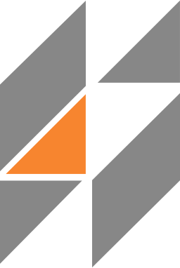</a> | **📂 檔名:** `hhvm.svg` ✨ **格式:** `Vector (SVG)` ⚖️ **大小:** `897.00B` 📅 **更新:** `2026-03-02`  🚀 **jsDelivr Markdown:** `` 🔗 **直接連結 (Url):** <code>https://cdn.jsdelivr.net/gh/barry028/materials@main/images/iCons/Brands/hhvm.svg</code> 📥 [檢視原始檔](hhvm.svg) |
| <a href="hibernate.svg">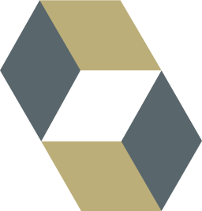</a> | **📂 檔名:** `hibernate.svg` ✨ **格式:** `Vector (SVG)` ⚖️ **大小:** `829.00B` 📅 **更新:** `2026-03-02`  🚀 **jsDelivr Markdown:** `` 🔗 **直接連結 (Url):** <code>https://cdn.jsdelivr.net/gh/barry028/materials@main/images/iCons/Brands/hibernate.svg</code> 📥 [檢視原始檔](hibernate.svg) |
| <a href="highcharts.svg">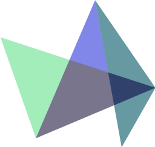</a> | **📂 檔名:** `highcharts.svg` ✨ **格式:** `Vector (SVG)` ⚖️ **大小:** `923.00B` 📅 **更新:** `2026-03-02`  🚀 **jsDelivr Markdown:** `` 🔗 **直接連結 (Url):** <code>https://cdn.jsdelivr.net/gh/barry028/materials@main/images/iCons/Brands/highcharts.svg</code> 📥 [檢視原始檔](highcharts.svg) |
|  | **📂 檔名:** `hipercard.svg` ✨ **格式:** `Vector (SVG)` ⚖️ **大小:** `7.08KB` 📅 **更新:** `2026-03-02`  🚀 **jsDelivr Markdown:** `` 🔗 **直接連結 (Url):** <code>https://cdn.jsdelivr.net/gh/barry028/materials@main/images/iCons/Brands/hipercard.svg</code> 📥 [檢視原始檔](hipercard.svg) |
|  | **📂 檔名:** `homebrew.svg` ✨ **格式:** `Vector (SVG)` ⚖️ **大小:** `23.51KB` 📅 **更新:** `2026-03-02`  🚀 **jsDelivr Markdown:** `` 🔗 **直接連結 (Url):** <code>https://cdn.jsdelivr.net/gh/barry028/materials@main/images/iCons/Brands/homebrew.svg</code> 📥 [檢視原始檔](homebrew.svg) |
| <a href="hookstate.svg">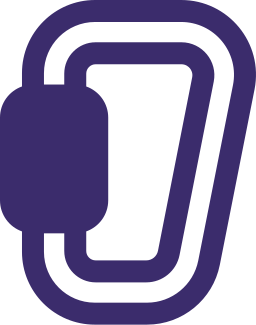</a> | **📂 檔名:** `hookstate.svg` ✨ **格式:** `Vector (SVG)` ⚖️ **大小:** `2.29KB` 📅 **更新:** `2026-03-02`  🚀 **jsDelivr Markdown:** `` 🔗 **直接連結 (Url):** <code>https://cdn.jsdelivr.net/gh/barry028/materials@main/images/iCons/Brands/hookstate.svg</code> 📥 [檢視原始檔](hookstate.svg) |
|  | **📂 檔名:** `hootsuite-icon.svg` ✨ **格式:** `Vector (SVG)` ⚖️ **大小:** `4.23KB` 📅 **更新:** `2026-03-02`  🚀 **jsDelivr Markdown:** `` 🔗 **直接連結 (Url):** <code>https://cdn.jsdelivr.net/gh/barry028/materials@main/images/iCons/Brands/hootsuite-icon.svg</code> 📥 [檢視原始檔](hootsuite-icon.svg) |
|  | **📂 檔名:** `hootsuite.svg` ✨ **格式:** `Vector (SVG)` ⚖️ **大小:** `13.21KB` 📅 **更新:** `2026-03-02`  🚀 **jsDelivr Markdown:** `` 🔗 **直接連結 (Url):** <code>https://cdn.jsdelivr.net/gh/barry028/materials@main/images/iCons/Brands/hootsuite.svg</code> 📥 [檢視原始檔](hootsuite.svg) |
|  | **📂 檔名:** `hosted-graphite.svg` ✨ **格式:** `Vector (SVG)` ⚖️ **大小:** `927.00B` 📅 **更新:** `2026-03-02`  🚀 **jsDelivr Markdown:** `` 🔗 **直接連結 (Url):** <code>https://cdn.jsdelivr.net/gh/barry028/materials@main/images/iCons/Brands/hosted-graphite.svg</code> 📥 [檢視原始檔](hosted-graphite.svg) |
|  | **📂 檔名:** `hostgator-icon.svg` ✨ **格式:** `Vector (SVG)` ⚖️ **大小:** `17.57KB` 📅 **更新:** `2026-03-02`  🚀 **jsDelivr Markdown:** `` 🔗 **直接連結 (Url):** <code>https://cdn.jsdelivr.net/gh/barry028/materials@main/images/iCons/Brands/hostgator-icon.svg</code> 📥 [檢視原始檔](hostgator-icon.svg) |
|  | **📂 檔名:** `hostgator.svg` ✨ **格式:** `Vector (SVG)` ⚖️ **大小:** `23.56KB` 📅 **更新:** `2026-03-02`  🚀 **jsDelivr Markdown:** `` 🔗 **直接連結 (Url):** <code>https://cdn.jsdelivr.net/gh/barry028/materials@main/images/iCons/Brands/hostgator.svg</code> 📥 [檢視原始檔](hostgator.svg) |
|  | **📂 檔名:** `hotjar-icon.svg` ✨ **格式:** `Vector (SVG)` ⚖️ **大小:** `2.12KB` 📅 **更新:** `2026-03-02`  🚀 **jsDelivr Markdown:** `` 🔗 **直接連結 (Url):** <code>https://cdn.jsdelivr.net/gh/barry028/materials@main/images/iCons/Brands/hotjar-icon.svg</code> 📥 [檢視原始檔](hotjar-icon.svg) |
|  | **📂 檔名:** `hotjar.svg` ✨ **格式:** `Vector (SVG)` ⚖️ **大小:** `7.92KB` 📅 **更新:** `2026-03-02`  🚀 **jsDelivr Markdown:** `` 🔗 **直接連結 (Url):** <code>https://cdn.jsdelivr.net/gh/barry028/materials@main/images/iCons/Brands/hotjar.svg</code> 📥 [檢視原始檔](hotjar.svg) |
|  | **📂 檔名:** `houndci.svg` ✨ **格式:** `Vector (SVG)` ⚖️ **大小:** `996.00B` 📅 **更新:** `2026-03-02`  🚀 **jsDelivr Markdown:** `` 🔗 **直接連結 (Url):** <code>https://cdn.jsdelivr.net/gh/barry028/materials@main/images/iCons/Brands/houndci.svg</code> 📥 [檢視原始檔](houndci.svg) |
|  | **📂 檔名:** `html-5.svg` ✨ **格式:** `Vector (SVG)` ⚖️ **大小:** `2.75KB` 📅 **更新:** `2026-03-02`  🚀 **jsDelivr Markdown:** `` 🔗 **直接連結 (Url):** <code>https://cdn.jsdelivr.net/gh/barry028/materials@main/images/iCons/Brands/html-5.svg</code> 📥 [檢視原始檔](html-5.svg) |
|  | **📂 檔名:** `html5-boilerplate.svg` ✨ **格式:** `Vector (SVG)` ⚖️ **大小:** `1.12KB` 📅 **更新:** `2026-03-02`  🚀 **jsDelivr Markdown:** `` 🔗 **直接連結 (Url):** <code>https://cdn.jsdelivr.net/gh/barry028/materials@main/images/iCons/Brands/html5-boilerplate.svg</code> 📥 [檢視原始檔](html5-boilerplate.svg) |
|  | **📂 檔名:** `httpie-icon.svg` ✨ **格式:** `Vector (SVG)` ⚖️ **大小:** `1.24KB` 📅 **更新:** `2026-03-02`  🚀 **jsDelivr Markdown:** `` 🔗 **直接連結 (Url):** <code>https://cdn.jsdelivr.net/gh/barry028/materials@main/images/iCons/Brands/httpie-icon.svg</code> 📥 [檢視原始檔](httpie-icon.svg) |
|  | **📂 檔名:** `httpie.svg` ✨ **格式:** `Vector (SVG)` ⚖️ **大小:** `11.75KB` 📅 **更新:** `2026-03-02`  🚀 **jsDelivr Markdown:** `` 🔗 **直接連結 (Url):** <code>https://cdn.jsdelivr.net/gh/barry028/materials@main/images/iCons/Brands/httpie.svg</code> 📥 [檢視原始檔](httpie.svg) |
|  | **📂 檔名:** `hubspot.svg` ✨ **格式:** `Vector (SVG)` ⚖️ **大小:** `4.84KB` 📅 **更新:** `2026-03-02`  🚀 **jsDelivr Markdown:** `` 🔗 **直接連結 (Url):** <code>https://cdn.jsdelivr.net/gh/barry028/materials@main/images/iCons/Brands/hubspot.svg</code> 📥 [檢視原始檔](hubspot.svg) |
|  | **📂 檔名:** `huggy.svg` ✨ **格式:** `Vector (SVG)` ⚖️ **大小:** `6.78KB` 📅 **更新:** `2026-03-02`  🚀 **jsDelivr Markdown:** `` 🔗 **直接連結 (Url):** <code>https://cdn.jsdelivr.net/gh/barry028/materials@main/images/iCons/Brands/huggy.svg</code> 📥 [檢視原始檔](huggy.svg) |
|  | **📂 檔名:** `hugo.svg` ✨ **格式:** `Vector (SVG)` ⚖️ **大小:** `365.01KB` 📅 **更新:** `2026-03-02`  🚀 **jsDelivr Markdown:** `` 🔗 **直接連結 (Url):** <code>https://cdn.jsdelivr.net/gh/barry028/materials@main/images/iCons/Brands/hugo.svg</code> 📥 [檢視原始檔](hugo.svg) |
| <a href="humongous.svg">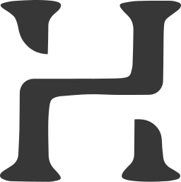</a> | **📂 檔名:** `humongous.svg` ✨ **格式:** `Vector (SVG)` ⚖️ **大小:** `5.16KB` 📅 **更新:** `2026-03-02`  🚀 **jsDelivr Markdown:** `` 🔗 **直接連結 (Url):** <code>https://cdn.jsdelivr.net/gh/barry028/materials@main/images/iCons/Brands/humongous.svg</code> 📥 [檢視原始檔](humongous.svg) |
| <a href="hyper.svg">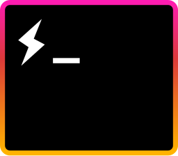</a> | **📂 檔名:** `hyper.svg` ✨ **格式:** `Vector (SVG)` ⚖️ **大小:** `1.84KB` 📅 **更新:** `2026-03-02`  🚀 **jsDelivr Markdown:** `` 🔗 **直接連結 (Url):** <code>https://cdn.jsdelivr.net/gh/barry028/materials@main/images/iCons/Brands/hyper.svg</code> 📥 [檢視原始檔](hyper.svg) |
|  | **📂 檔名:** `hyperapp.svg` ✨ **格式:** `Vector (SVG)` ⚖️ **大小:** `5.86KB` 📅 **更新:** `2026-03-02`  🚀 **jsDelivr Markdown:** `` 🔗 **直接連結 (Url):** <code>https://cdn.jsdelivr.net/gh/barry028/materials@main/images/iCons/Brands/hyperapp.svg</code> 📥 [檢視原始檔](hyperapp.svg) |
|  | **📂 檔名:** `ibm.svg` ✨ **格式:** `Vector (SVG)` ⚖️ **大小:** `4.66KB` 📅 **更新:** `2026-03-02`  🚀 **jsDelivr Markdown:** `` 🔗 **直接連結 (Url):** <code>https://cdn.jsdelivr.net/gh/barry028/materials@main/images/iCons/Brands/ibm.svg</code> 📥 [檢視原始檔](ibm.svg) |
| <a href="ieee.svg">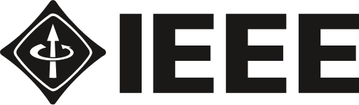</a> | **📂 檔名:** `ieee.svg` ✨ **格式:** `Vector (SVG)` ⚖️ **大小:** `5.95KB` 📅 **更新:** `2026-03-02`  🚀 **jsDelivr Markdown:** `` 🔗 **直接連結 (Url):** <code>https://cdn.jsdelivr.net/gh/barry028/materials@main/images/iCons/Brands/ieee.svg</code> 📥 [檢視原始檔](ieee.svg) |
| <a href="ietf.svg">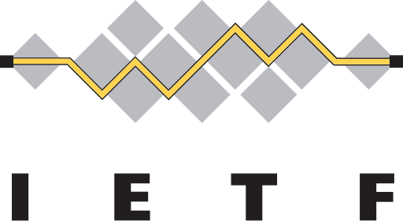</a> | **📂 檔名:** `ietf.svg` ✨ **格式:** `Vector (SVG)` ⚖️ **大小:** `14.61KB` 📅 **更新:** `2026-03-02`  🚀 **jsDelivr Markdown:** `` 🔗 **直接連結 (Url):** <code>https://cdn.jsdelivr.net/gh/barry028/materials@main/images/iCons/Brands/ietf.svg</code> 📥 [檢視原始檔](ietf.svg) |
|  | **📂 檔名:** `ifttt.svg` ✨ **格式:** `Vector (SVG)` ⚖️ **大小:** `1.14KB` 📅 **更新:** `2026-03-02`  🚀 **jsDelivr Markdown:** `` 🔗 **直接連結 (Url):** <code>https://cdn.jsdelivr.net/gh/barry028/materials@main/images/iCons/Brands/ifttt.svg</code> 📥 [檢視原始檔](ifttt.svg) |
|  | **📂 檔名:** `imagemin.svg` ✨ **格式:** `Vector (SVG)` ⚖️ **大小:** `25.79KB` 📅 **更新:** `2026-03-02`  🚀 **jsDelivr Markdown:** `` 🔗 **直接連結 (Url):** <code>https://cdn.jsdelivr.net/gh/barry028/materials@main/images/iCons/Brands/imagemin.svg</code> 📥 [檢視原始檔](imagemin.svg) |
|  | **📂 檔名:** `imba-icon.svg` ✨ **格式:** `Vector (SVG)` ⚖️ **大小:** `732.00B` 📅 **更新:** `2026-03-02`  🚀 **jsDelivr Markdown:** `` 🔗 **直接連結 (Url):** <code>https://cdn.jsdelivr.net/gh/barry028/materials@main/images/iCons/Brands/imba-icon.svg</code> 📥 [檢視原始檔](imba-icon.svg) |
|  | **📂 檔名:** `imba.svg` ✨ **格式:** `Vector (SVG)` ⚖️ **大小:** `8.63KB` 📅 **更新:** `2026-03-02`  🚀 **jsDelivr Markdown:** `` 🔗 **直接連結 (Url):** <code>https://cdn.jsdelivr.net/gh/barry028/materials@main/images/iCons/Brands/imba.svg</code> 📥 [檢視原始檔](imba.svg) |
| <a href="immer-icon.svg">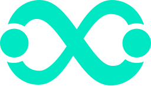</a> | **📂 檔名:** `immer-icon.svg` ✨ **格式:** `Vector (SVG)` ⚖️ **大小:** `2.76KB` 📅 **更新:** `2026-03-02`  🚀 **jsDelivr Markdown:** `` 🔗 **直接連結 (Url):** <code>https://cdn.jsdelivr.net/gh/barry028/materials@main/images/iCons/Brands/immer-icon.svg</code> 📥 [檢視原始檔](immer-icon.svg) |
| <a href="immer.svg">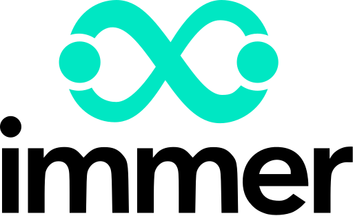</a> | **📂 檔名:** `immer.svg` ✨ **格式:** `Vector (SVG)` ⚖️ **大小:** `6.77KB` 📅 **更新:** `2026-03-02`  🚀 **jsDelivr Markdown:** `` 🔗 **直接連結 (Url):** <code>https://cdn.jsdelivr.net/gh/barry028/materials@main/images/iCons/Brands/immer.svg</code> 📥 [檢視原始檔](immer.svg) |
|  | **📂 檔名:** `immutable.svg` ✨ **格式:** `Vector (SVG)` ⚖️ **大小:** `10.65KB` 📅 **更新:** `2026-03-02`  🚀 **jsDelivr Markdown:** `` 🔗 **直接連結 (Url):** <code>https://cdn.jsdelivr.net/gh/barry028/materials@main/images/iCons/Brands/immutable.svg</code> 📥 [檢視原始檔](immutable.svg) |
|  | **📂 檔名:** `impala.svg` ✨ **格式:** `Vector (SVG)` ⚖️ **大小:** `4.52KB` 📅 **更新:** `2026-03-02`  🚀 **jsDelivr Markdown:** `` 🔗 **直接連結 (Url):** <code>https://cdn.jsdelivr.net/gh/barry028/materials@main/images/iCons/Brands/impala.svg</code> 📥 [檢視原始檔](impala.svg) |
| <a href="importio.svg">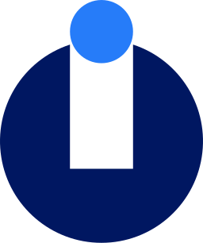</a> | **📂 檔名:** `importio.svg` ✨ **格式:** `Vector (SVG)` ⚖️ **大小:** `722.00B` 📅 **更新:** `2026-03-02`  🚀 **jsDelivr Markdown:** `` 🔗 **直接連結 (Url):** <code>https://cdn.jsdelivr.net/gh/barry028/materials@main/images/iCons/Brands/importio.svg</code> 📥 [檢視原始檔](importio.svg) |
|  | **📂 檔名:** `incident-icon.svg` ✨ **格式:** `Vector (SVG)` ⚖️ **大小:** `1.44KB` 📅 **更新:** `2026-03-02`  🚀 **jsDelivr Markdown:** `` 🔗 **直接連結 (Url):** <code>https://cdn.jsdelivr.net/gh/barry028/materials@main/images/iCons/Brands/incident-icon.svg</code> 📥 [檢視原始檔](incident-icon.svg) |
|  | **📂 檔名:** `incident.svg` ✨ **格式:** `Vector (SVG)` ⚖️ **大小:** `6.73KB` 📅 **更新:** `2026-03-02`  🚀 **jsDelivr Markdown:** `` 🔗 **直接連結 (Url):** <code>https://cdn.jsdelivr.net/gh/barry028/materials@main/images/iCons/Brands/incident.svg</code> 📥 [檢視原始檔](incident.svg) |
|  | **📂 檔名:** `infer.svg` ✨ **格式:** `Vector (SVG)` ⚖️ **大小:** `871.00B` 📅 **更新:** `2026-03-02`  🚀 **jsDelivr Markdown:** `` 🔗 **直接連結 (Url):** <code>https://cdn.jsdelivr.net/gh/barry028/materials@main/images/iCons/Brands/infer.svg</code> 📥 [檢視原始檔](infer.svg) |
|  | **📂 檔名:** `inferno.svg` ✨ **格式:** `Vector (SVG)` ⚖️ **大小:** `1.70KB` 📅 **更新:** `2026-03-02`  🚀 **jsDelivr Markdown:** `` 🔗 **直接連結 (Url):** <code>https://cdn.jsdelivr.net/gh/barry028/materials@main/images/iCons/Brands/inferno.svg</code> 📥 [檢視原始檔](inferno.svg) |
| <a href="influxdb-icon.svg">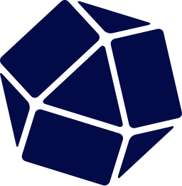</a> | **📂 檔名:** `influxdb-icon.svg` ✨ **格式:** `Vector (SVG)` ⚖️ **大小:** `4.46KB` 📅 **更新:** `2026-03-02`  🚀 **jsDelivr Markdown:** `` 🔗 **直接連結 (Url):** <code>https://cdn.jsdelivr.net/gh/barry028/materials@main/images/iCons/Brands/influxdb-icon.svg</code> 📥 [檢視原始檔](influxdb-icon.svg) |
|  | **📂 檔名:** `influxdb.svg` ✨ **格式:** `Vector (SVG)` ⚖️ **大小:** `10.94KB` 📅 **更新:** `2026-03-02`  🚀 **jsDelivr Markdown:** `` 🔗 **直接連結 (Url):** <code>https://cdn.jsdelivr.net/gh/barry028/materials@main/images/iCons/Brands/influxdb.svg</code> 📥 [檢視原始檔](influxdb.svg) |
| <a href="ink.svg">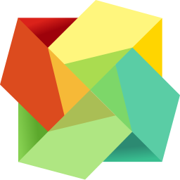</a> | **📂 檔名:** `ink.svg` ✨ **格式:** `Vector (SVG)` ⚖️ **大小:** `2.70KB` 📅 **更新:** `2026-03-02`  🚀 **jsDelivr Markdown:** `` 🔗 **直接連結 (Url):** <code>https://cdn.jsdelivr.net/gh/barry028/materials@main/images/iCons/Brands/ink.svg</code> 📥 [檢視原始檔](ink.svg) |
|  | **📂 檔名:** `insomnia.svg` ✨ **格式:** `Vector (SVG)` ⚖️ **大小:** `1.65KB` 📅 **更新:** `2026-03-02`  🚀 **jsDelivr Markdown:** `` 🔗 **直接連結 (Url):** <code>https://cdn.jsdelivr.net/gh/barry028/materials@main/images/iCons/Brands/insomnia.svg</code> 📥 [檢視原始檔](insomnia.svg) |
|  | **📂 檔名:** `instagram-icon.svg` ✨ **格式:** `Vector (SVG)` ⚖️ **大小:** `4.21KB` 📅 **更新:** `2026-03-02`  🚀 **jsDelivr Markdown:** `` 🔗 **直接連結 (Url):** <code>https://cdn.jsdelivr.net/gh/barry028/materials@main/images/iCons/Brands/instagram-icon.svg</code> 📥 [檢視原始檔](instagram-icon.svg) |
|  | **📂 檔名:** `instagram.svg` ✨ **格式:** `Vector (SVG)` ⚖️ **大小:** `13.59KB` 📅 **更新:** `2026-03-02`  🚀 **jsDelivr Markdown:** `` 🔗 **直接連結 (Url):** <code>https://cdn.jsdelivr.net/gh/barry028/materials@main/images/iCons/Brands/instagram.svg</code> 📥 [檢視原始檔](instagram.svg) |
|  | **📂 檔名:** `intel.svg` ✨ **格式:** `Vector (SVG)` ⚖️ **大小:** `3.67KB` 📅 **更新:** `2026-03-02`  🚀 **jsDelivr Markdown:** `` 🔗 **直接連結 (Url):** <code>https://cdn.jsdelivr.net/gh/barry028/materials@main/images/iCons/Brands/intel.svg</code> 📥 [檢視原始檔](intel.svg) |
|  | **📂 檔名:** `intellij-idea.svg` ✨ **格式:** `Vector (SVG)` ⚖️ **大小:** `3.79KB` 📅 **更新:** `2026-03-02`  🚀 **jsDelivr Markdown:** `` 🔗 **直接連結 (Url):** <code>https://cdn.jsdelivr.net/gh/barry028/materials@main/images/iCons/Brands/intellij-idea.svg</code> 📥 [檢視原始檔](intellij-idea.svg) |
|  | **📂 檔名:** `intercom-icon.svg` ✨ **格式:** `Vector (SVG)` ⚖️ **大小:** `5.31KB` 📅 **更新:** `2026-03-02`  🚀 **jsDelivr Markdown:** `` 🔗 **直接連結 (Url):** <code>https://cdn.jsdelivr.net/gh/barry028/materials@main/images/iCons/Brands/intercom-icon.svg</code> 📥 [檢視原始檔](intercom-icon.svg) |
|  | **📂 檔名:** `intercom.svg` ✨ **格式:** `Vector (SVG)` ⚖️ **大小:** `11.88KB` 📅 **更新:** `2026-03-02`  🚀 **jsDelivr Markdown:** `` 🔗 **直接連結 (Url):** <code>https://cdn.jsdelivr.net/gh/barry028/materials@main/images/iCons/Brands/intercom.svg</code> 📥 [檢視原始檔](intercom.svg) |
|  | **📂 檔名:** `internetexplorer.svg` ✨ **格式:** `Vector (SVG)` ⚖️ **大小:** `3.43KB` 📅 **更新:** `2026-03-02`  🚀 **jsDelivr Markdown:** `` 🔗 **直接連結 (Url):** <code>https://cdn.jsdelivr.net/gh/barry028/materials@main/images/iCons/Brands/internetexplorer.svg</code> 📥 [檢視原始檔](internetexplorer.svg) |
|  | **📂 檔名:** `invision-icon.svg` ✨ **格式:** `Vector (SVG)` ⚖️ **大小:** `2.14KB` 📅 **更新:** `2026-03-02`  🚀 **jsDelivr Markdown:** `` 🔗 **直接連結 (Url):** <code>https://cdn.jsdelivr.net/gh/barry028/materials@main/images/iCons/Brands/invision-icon.svg</code> 📥 [檢視原始檔](invision-icon.svg) |
|  | **📂 檔名:** `invision.svg` ✨ **格式:** `Vector (SVG)` ⚖️ **大小:** `4.56KB` 📅 **更新:** `2026-03-02`  🚀 **jsDelivr Markdown:** `` 🔗 **直接連結 (Url):** <code>https://cdn.jsdelivr.net/gh/barry028/materials@main/images/iCons/Brands/invision.svg</code> 📥 [檢視原始檔](invision.svg) |
|  | **📂 檔名:** `ionic-icon.svg` ✨ **格式:** `Vector (SVG)` ⚖️ **大小:** `1.86KB` 📅 **更新:** `2026-03-02`  🚀 **jsDelivr Markdown:** `` 🔗 **直接連結 (Url):** <code>https://cdn.jsdelivr.net/gh/barry028/materials@main/images/iCons/Brands/ionic-icon.svg</code> 📥 [檢視原始檔](ionic-icon.svg) |
|  | **📂 檔名:** `ionic.svg` ✨ **格式:** `Vector (SVG)` ⚖️ **大小:** `3.99KB` 📅 **更新:** `2026-03-02`  🚀 **jsDelivr Markdown:** `` 🔗 **直接連結 (Url):** <code>https://cdn.jsdelivr.net/gh/barry028/materials@main/images/iCons/Brands/ionic.svg</code> 📥 [檢視原始檔](ionic.svg) |
|  | **📂 檔名:** `ios.svg` ✨ **格式:** `Vector (SVG)` ⚖️ **大小:** `2.12KB` 📅 **更新:** `2026-03-02`  🚀 **jsDelivr Markdown:** `` 🔗 **直接連結 (Url):** <code>https://cdn.jsdelivr.net/gh/barry028/materials@main/images/iCons/Brands/ios.svg</code> 📥 [檢視原始檔](ios.svg) |
| <a href="iron-icon.svg">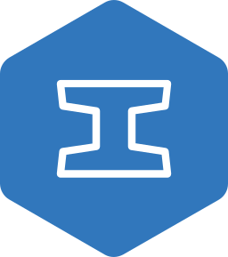</a> | **📂 檔名:** `iron-icon.svg` ✨ **格式:** `Vector (SVG)` ⚖️ **大小:** `2.89KB` 📅 **更新:** `2026-03-02`  🚀 **jsDelivr Markdown:** `` 🔗 **直接連結 (Url):** <code>https://cdn.jsdelivr.net/gh/barry028/materials@main/images/iCons/Brands/iron-icon.svg</code> 📥 [檢視原始檔](iron-icon.svg) |
|  | **📂 檔名:** `iron.svg` ✨ **格式:** `Vector (SVG)` ⚖️ **大小:** `5.49KB` 📅 **更新:** `2026-03-02`  🚀 **jsDelivr Markdown:** `` 🔗 **直接連結 (Url):** <code>https://cdn.jsdelivr.net/gh/barry028/materials@main/images/iCons/Brands/iron.svg</code> 📥 [檢視原始檔](iron.svg) |
|  | **📂 檔名:** `itsalive-icon.svg` ✨ **格式:** `Vector (SVG)` ⚖️ **大小:** `1.48KB` 📅 **更新:** `2026-03-02`  🚀 **jsDelivr Markdown:** `` 🔗 **直接連結 (Url):** <code>https://cdn.jsdelivr.net/gh/barry028/materials@main/images/iCons/Brands/itsalive-icon.svg</code> 📥 [檢視原始檔](itsalive-icon.svg) |
|  | **📂 檔名:** `itsalive.svg` ✨ **格式:** `Vector (SVG)` ⚖️ **大小:** `12.16KB` 📅 **更新:** `2026-03-02`  🚀 **jsDelivr Markdown:** `` 🔗 **直接連結 (Url):** <code>https://cdn.jsdelivr.net/gh/barry028/materials@main/images/iCons/Brands/itsalive.svg</code> 📥 [檢視原始檔](itsalive.svg) |
| <a href="jade.svg">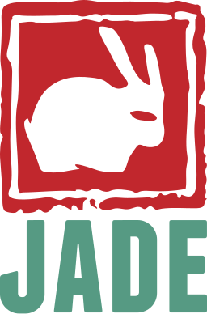</a> | **📂 檔名:** `jade.svg` ✨ **格式:** `Vector (SVG)` ⚖️ **大小:** `20.04KB` 📅 **更新:** `2026-03-02`  🚀 **jsDelivr Markdown:** `` 🔗 **直接連結 (Url):** <code>https://cdn.jsdelivr.net/gh/barry028/materials@main/images/iCons/Brands/jade.svg</code> 📥 [檢視原始檔](jade.svg) |
|  | **📂 檔名:** `jamstack-icon.svg` ✨ **格式:** `Vector (SVG)` ⚖️ **大小:** `893.00B` 📅 **更新:** `2026-03-02`  🚀 **jsDelivr Markdown:** `` 🔗 **直接連結 (Url):** <code>https://cdn.jsdelivr.net/gh/barry028/materials@main/images/iCons/Brands/jamstack-icon.svg</code> 📥 [檢視原始檔](jamstack-icon.svg) |
|  | **📂 檔名:** `jamstack.svg` ✨ **格式:** `Vector (SVG)` ⚖️ **大小:** `6.05KB` 📅 **更新:** `2026-03-02`  🚀 **jsDelivr Markdown:** `` 🔗 **直接連結 (Url):** <code>https://cdn.jsdelivr.net/gh/barry028/materials@main/images/iCons/Brands/jamstack.svg</code> 📥 [檢視原始檔](jamstack.svg) |
|  | **📂 檔名:** `jasmine.svg` ✨ **格式:** `Vector (SVG)` ⚖️ **大小:** `2.63KB` 📅 **更新:** `2026-03-02`  🚀 **jsDelivr Markdown:** `` 🔗 **直接連結 (Url):** <code>https://cdn.jsdelivr.net/gh/barry028/materials@main/images/iCons/Brands/jasmine.svg</code> 📥 [檢視原始檔](jasmine.svg) |
|  | **📂 檔名:** `java.svg` ✨ **格式:** `Vector (SVG)` ⚖️ **大小:** `3.10KB` 📅 **更新:** `2026-03-02`  🚀 **jsDelivr Markdown:** `` 🔗 **直接連結 (Url):** <code>https://cdn.jsdelivr.net/gh/barry028/materials@main/images/iCons/Brands/java.svg</code> 📥 [檢視原始檔](java.svg) |
|  | **📂 檔名:** `javascript.svg` ✨ **格式:** `Vector (SVG)` ⚖️ **大小:** `1.67KB` 📅 **更新:** `2026-03-02`  🚀 **jsDelivr Markdown:** `` 🔗 **直接連結 (Url):** <code>https://cdn.jsdelivr.net/gh/barry028/materials@main/images/iCons/Brands/javascript.svg</code> 📥 [檢視原始檔](javascript.svg) |
|  | **📂 檔名:** `jcb.svg` ✨ **格式:** `Vector (SVG)` ⚖️ **大小:** `5.60KB` 📅 **更新:** `2026-03-02`  🚀 **jsDelivr Markdown:** `` 🔗 **直接連結 (Url):** <code>https://cdn.jsdelivr.net/gh/barry028/materials@main/images/iCons/Brands/jcb.svg</code> 📥 [檢視原始檔](jcb.svg) |
|  | **📂 檔名:** `jekyll.svg` ✨ **格式:** `Vector (SVG)` ⚖️ **大小:** `19.21KB` 📅 **更新:** `2026-03-02`  🚀 **jsDelivr Markdown:** `` 🔗 **直接連結 (Url):** <code>https://cdn.jsdelivr.net/gh/barry028/materials@main/images/iCons/Brands/jekyll.svg</code> 📥 [檢視原始檔](jekyll.svg) |
|  | **📂 檔名:** `jenkins.svg` ✨ **格式:** `Vector (SVG)` ⚖️ **大小:** `47.21KB` 📅 **更新:** `2026-03-02`  🚀 **jsDelivr Markdown:** `` 🔗 **直接連結 (Url):** <code>https://cdn.jsdelivr.net/gh/barry028/materials@main/images/iCons/Brands/jenkins.svg</code> 📥 [檢視原始檔](jenkins.svg) |
|  | **📂 檔名:** `jest.svg` ✨ **格式:** `Vector (SVG)` ⚖️ **大小:** `6.91KB` 📅 **更新:** `2026-03-02`  🚀 **jsDelivr Markdown:** `` 🔗 **直接連結 (Url):** <code>https://cdn.jsdelivr.net/gh/barry028/materials@main/images/iCons/Brands/jest.svg</code> 📥 [檢視原始檔](jest.svg) |
|  | **📂 檔名:** `jetbrains-icon.svg` ✨ **格式:** `Vector (SVG)` ⚖️ **大小:** `4.40KB` 📅 **更新:** `2026-03-02`  🚀 **jsDelivr Markdown:** `` 🔗 **直接連結 (Url):** <code>https://cdn.jsdelivr.net/gh/barry028/materials@main/images/iCons/Brands/jetbrains-icon.svg</code> 📥 [檢視原始檔](jetbrains-icon.svg) |
| <a href="jetbrains-space-icon.svg">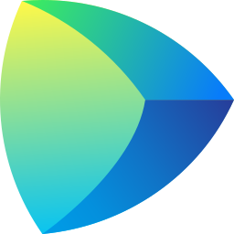</a> | **📂 檔名:** `jetbrains-space-icon.svg` ✨ **格式:** `Vector (SVG)` ⚖️ **大小:** `2.21KB` 📅 **更新:** `2026-03-02`  🚀 **jsDelivr Markdown:** `` 🔗 **直接連結 (Url):** <code>https://cdn.jsdelivr.net/gh/barry028/materials@main/images/iCons/Brands/jetbrains-space-icon.svg</code> 📥 [檢視原始檔](jetbrains-space-icon.svg) |
|  | **📂 檔名:** `jetbrains-space.svg` ✨ **格式:** `Vector (SVG)` ⚖️ **大小:** `8.29KB` 📅 **更新:** `2026-03-02`  🚀 **jsDelivr Markdown:** `` 🔗 **直接連結 (Url):** <code>https://cdn.jsdelivr.net/gh/barry028/materials@main/images/iCons/Brands/jetbrains-space.svg</code> 📥 [檢視原始檔](jetbrains-space.svg) |
|  | **📂 檔名:** `jetbrains.svg` ✨ **格式:** `Vector (SVG)` ⚖️ **大小:** `8.31KB` 📅 **更新:** `2026-03-02`  🚀 **jsDelivr Markdown:** `` 🔗 **直接連結 (Url):** <code>https://cdn.jsdelivr.net/gh/barry028/materials@main/images/iCons/Brands/jetbrains.svg</code> 📥 [檢視原始檔](jetbrains.svg) |
|  | **📂 檔名:** `jfrog.svg` ✨ **格式:** `Vector (SVG)` ⚖️ **大小:** `9.62KB` 📅 **更新:** `2026-03-02`  🚀 **jsDelivr Markdown:** `` 🔗 **直接連結 (Url):** <code>https://cdn.jsdelivr.net/gh/barry028/materials@main/images/iCons/Brands/jfrog.svg</code> 📥 [檢視原始檔](jfrog.svg) |
|  | **📂 檔名:** `jhipster-icon.svg` ✨ **格式:** `Vector (SVG)` ⚖️ **大小:** `843.00B` 📅 **更新:** `2026-03-02`  🚀 **jsDelivr Markdown:** `` 🔗 **直接連結 (Url):** <code>https://cdn.jsdelivr.net/gh/barry028/materials@main/images/iCons/Brands/jhipster-icon.svg</code> 📥 [檢視原始檔](jhipster-icon.svg) |
|  | **📂 檔名:** `jhipster.svg` ✨ **格式:** `Vector (SVG)` ⚖️ **大小:** `33.22KB` 📅 **更新:** `2026-03-02`  🚀 **jsDelivr Markdown:** `` 🔗 **直接連結 (Url):** <code>https://cdn.jsdelivr.net/gh/barry028/materials@main/images/iCons/Brands/jhipster.svg</code> 📥 [檢視原始檔](jhipster.svg) |
|  | **📂 檔名:** `jira.svg` ✨ **格式:** `Vector (SVG)` ⚖️ **大小:** `1.87KB` 📅 **更新:** `2026-03-02`  🚀 **jsDelivr Markdown:** `` 🔗 **直接連結 (Url):** <code>https://cdn.jsdelivr.net/gh/barry028/materials@main/images/iCons/Brands/jira.svg</code> 📥 [檢視原始檔](jira.svg) |
|  | **📂 檔名:** `joomla.svg` ✨ **格式:** `Vector (SVG)` ⚖️ **大小:** `2.89KB` 📅 **更新:** `2026-03-02`  🚀 **jsDelivr Markdown:** `` 🔗 **直接連結 (Url):** <code>https://cdn.jsdelivr.net/gh/barry028/materials@main/images/iCons/Brands/joomla.svg</code> 📥 [檢視原始檔](joomla.svg) |
|  | **📂 檔名:** `jotai.svg` ✨ **格式:** `Vector (SVG)` ⚖️ **大小:** `6.00KB` 📅 **更新:** `2026-03-02`  🚀 **jsDelivr Markdown:** `` 🔗 **直接連結 (Url):** <code>https://cdn.jsdelivr.net/gh/barry028/materials@main/images/iCons/Brands/jotai.svg</code> 📥 [檢視原始檔](jotai.svg) |
|  | **📂 檔名:** `jquery-mobile.svg` ✨ **格式:** `Vector (SVG)` ⚖️ **大小:** `1.95KB` 📅 **更新:** `2026-03-02`  🚀 **jsDelivr Markdown:** `` 🔗 **直接連結 (Url):** <code>https://cdn.jsdelivr.net/gh/barry028/materials@main/images/iCons/Brands/jquery-mobile.svg</code> 📥 [檢視原始檔](jquery-mobile.svg) |
|  | **📂 檔名:** `jquery.svg` ✨ **格式:** `Vector (SVG)` ⚖️ **大小:** `7.63KB` 📅 **更新:** `2026-03-02`  🚀 **jsDelivr Markdown:** `` 🔗 **直接連結 (Url):** <code>https://cdn.jsdelivr.net/gh/barry028/materials@main/images/iCons/Brands/jquery.svg</code> 📥 [檢視原始檔](jquery.svg) |
| <a href="jruby.svg">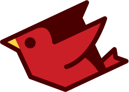</a> | **📂 檔名:** `jruby.svg` ✨ **格式:** `Vector (SVG)` ⚖️ **大小:** `2.25KB` 📅 **更新:** `2026-03-02`  🚀 **jsDelivr Markdown:** `` 🔗 **直接連結 (Url):** <code>https://cdn.jsdelivr.net/gh/barry028/materials@main/images/iCons/Brands/jruby.svg</code> 📥 [檢視原始檔](jruby.svg) |
|  | **📂 檔名:** `jsbin.svg` ✨ **格式:** `Vector (SVG)` ⚖️ **大小:** `13.10KB` 📅 **更新:** `2026-03-02`  🚀 **jsDelivr Markdown:** `` 🔗 **直接連結 (Url):** <code>https://cdn.jsdelivr.net/gh/barry028/materials@main/images/iCons/Brands/jsbin.svg</code> 📥 [檢視原始檔](jsbin.svg) |
|  | **📂 檔名:** `jsdelivr.svg` ✨ **格式:** `Vector (SVG)` ⚖️ **大小:** `3.77KB` 📅 **更新:** `2026-03-02`  🚀 **jsDelivr Markdown:** `` 🔗 **直接連結 (Url):** <code>https://cdn.jsdelivr.net/gh/barry028/materials@main/images/iCons/Brands/jsdelivr.svg</code> 📥 [檢視原始檔](jsdelivr.svg) |
|  | **📂 檔名:** `jsdom.svg` ✨ **格式:** `Vector (SVG)` ⚖️ **大小:** `2.21KB` 📅 **更新:** `2026-03-02`  🚀 **jsDelivr Markdown:** `` 🔗 **直接連結 (Url):** <code>https://cdn.jsdelivr.net/gh/barry028/materials@main/images/iCons/Brands/jsdom.svg</code> 📥 [檢視原始檔](jsdom.svg) |
|  | **📂 檔名:** `jsfiddle.svg` ✨ **格式:** `Vector (SVG)` ⚖️ **大小:** `4.20KB` 📅 **更新:** `2026-03-02`  🚀 **jsDelivr Markdown:** `` 🔗 **直接連結 (Url):** <code>https://cdn.jsdelivr.net/gh/barry028/materials@main/images/iCons/Brands/jsfiddle.svg</code> 📥 [檢視原始檔](jsfiddle.svg) |
| <a href="json-ld.svg">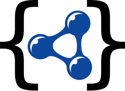</a> | **📂 檔名:** `json-ld.svg` ✨ **格式:** `Vector (SVG)` ⚖️ **大小:** `7.08KB` 📅 **更新:** `2026-03-02`  🚀 **jsDelivr Markdown:** `` 🔗 **直接連結 (Url):** <code>https://cdn.jsdelivr.net/gh/barry028/materials@main/images/iCons/Brands/json-ld.svg</code> 📥 [檢視原始檔](json-ld.svg) |
| <a href="json.svg">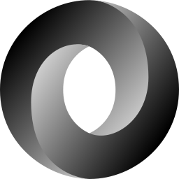</a> | **📂 檔名:** `json.svg` ✨ **格式:** `Vector (SVG)` ⚖️ **大小:** `1.93KB` 📅 **更新:** `2026-03-02`  🚀 **jsDelivr Markdown:** `` 🔗 **直接連結 (Url):** <code>https://cdn.jsdelivr.net/gh/barry028/materials@main/images/iCons/Brands/json.svg</code> 📥 [檢視原始檔](json.svg) |
| <a href="jspm.svg">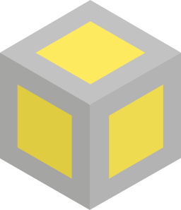</a> | **📂 檔名:** `jspm.svg` ✨ **格式:** `Vector (SVG)` ⚖️ **大小:** `1.54KB` 📅 **更新:** `2026-03-02`  🚀 **jsDelivr Markdown:** `` 🔗 **直接連結 (Url):** <code>https://cdn.jsdelivr.net/gh/barry028/materials@main/images/iCons/Brands/jspm.svg</code> 📥 [檢視原始檔](jspm.svg) |
|  | **📂 檔名:** `jss.svg` ✨ **格式:** `Vector (SVG)` ⚖️ **大小:** `2.91KB` 📅 **更新:** `2026-03-02`  🚀 **jsDelivr Markdown:** `` 🔗 **直接連結 (Url):** <code>https://cdn.jsdelivr.net/gh/barry028/materials@main/images/iCons/Brands/jss.svg</code> 📥 [檢視原始檔](jss.svg) |
|  | **📂 檔名:** `juju.svg` ✨ **格式:** `Vector (SVG)` ⚖️ **大小:** `4.99KB` 📅 **更新:** `2026-03-02`  🚀 **jsDelivr Markdown:** `` 🔗 **直接連結 (Url):** <code>https://cdn.jsdelivr.net/gh/barry028/materials@main/images/iCons/Brands/juju.svg</code> 📥 [檢視原始檔](juju.svg) |
|  | **📂 檔名:** `julia.svg` ✨ **格式:** `Vector (SVG)` ⚖️ **大小:** `7.62KB` 📅 **更新:** `2026-03-02`  🚀 **jsDelivr Markdown:** `` 🔗 **直接連結 (Url):** <code>https://cdn.jsdelivr.net/gh/barry028/materials@main/images/iCons/Brands/julia.svg</code> 📥 [檢視原始檔](julia.svg) |
| <a href="jupyter.svg">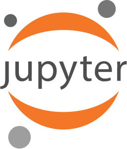</a> | **📂 檔名:** `jupyter.svg` ✨ **格式:** `Vector (SVG)` ⚖️ **大小:** `9.44KB` 📅 **更新:** `2026-03-02`  🚀 **jsDelivr Markdown:** `` 🔗 **直接連結 (Url):** <code>https://cdn.jsdelivr.net/gh/barry028/materials@main/images/iCons/Brands/jupyter.svg</code> 📥 [檢視原始檔](jupyter.svg) |
| <a href="jwt-icon.svg">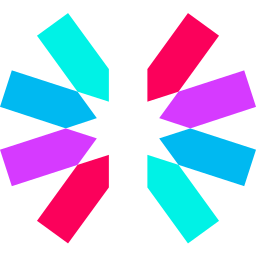</a> | **📂 檔名:** `jwt-icon.svg` ✨ **格式:** `Vector (SVG)` ⚖️ **大小:** `1.79KB` 📅 **更新:** `2026-03-02`  🚀 **jsDelivr Markdown:** `` 🔗 **直接連結 (Url):** <code>https://cdn.jsdelivr.net/gh/barry028/materials@main/images/iCons/Brands/jwt-icon.svg</code> 📥 [檢視原始檔](jwt-icon.svg) |
|  | **📂 檔名:** `jwt.svg` ✨ **格式:** `Vector (SVG)` ⚖️ **大小:** `3.42KB` 📅 **更新:** `2026-03-02`  🚀 **jsDelivr Markdown:** `` 🔗 **直接連結 (Url):** <code>https://cdn.jsdelivr.net/gh/barry028/materials@main/images/iCons/Brands/jwt.svg</code> 📥 [檢視原始檔](jwt.svg) |
| <a href="kafka-icon.svg">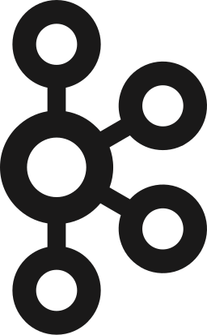</a> | **📂 檔名:** `kafka-icon.svg` ✨ **格式:** `Vector (SVG)` ⚖️ **大小:** `6.74KB` 📅 **更新:** `2026-03-02`  🚀 **jsDelivr Markdown:** `` 🔗 **直接連結 (Url):** <code>https://cdn.jsdelivr.net/gh/barry028/materials@main/images/iCons/Brands/kafka-icon.svg</code> 📥 [檢視原始檔](kafka-icon.svg) |
|  | **📂 檔名:** `kafka.svg` ✨ **格式:** `Vector (SVG)` ⚖️ **大小:** `9.44KB` 📅 **更新:** `2026-03-02`  🚀 **jsDelivr Markdown:** `` 🔗 **直接連結 (Url):** <code>https://cdn.jsdelivr.net/gh/barry028/materials@main/images/iCons/Brands/kafka.svg</code> 📥 [檢視原始檔](kafka.svg) |
|  | **📂 檔名:** `kaios.svg` ✨ **格式:** `Vector (SVG)` ⚖️ **大小:** `4.04KB` 📅 **更新:** `2026-03-02`  🚀 **jsDelivr Markdown:** `` 🔗 **直接連結 (Url):** <code>https://cdn.jsdelivr.net/gh/barry028/materials@main/images/iCons/Brands/kaios.svg</code> 📥 [檢視原始檔](kaios.svg) |
| <a href="kallithea.svg">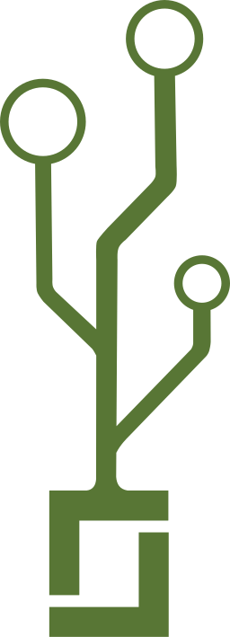</a> | **📂 檔名:** `kallithea.svg` ✨ **格式:** `Vector (SVG)` ⚖️ **大小:** `4.03KB` 📅 **更新:** `2026-03-02`  🚀 **jsDelivr Markdown:** `` 🔗 **直接連結 (Url):** <code>https://cdn.jsdelivr.net/gh/barry028/materials@main/images/iCons/Brands/kallithea.svg</code> 📥 [檢視原始檔](kallithea.svg) |
|  | **📂 檔名:** `karma.svg` ✨ **格式:** `Vector (SVG)` ⚖️ **大小:** `1.02KB` 📅 **更新:** `2026-03-02`  🚀 **jsDelivr Markdown:** `` 🔗 **直接連結 (Url):** <code>https://cdn.jsdelivr.net/gh/barry028/materials@main/images/iCons/Brands/karma.svg</code> 📥 [檢視原始檔](karma.svg) |
|  | **📂 檔名:** `katalon-icon.svg` ✨ **格式:** `Vector (SVG)` ⚖️ **大小:** `542.00B` 📅 **更新:** `2026-03-02`  🚀 **jsDelivr Markdown:** `` 🔗 **直接連結 (Url):** <code>https://cdn.jsdelivr.net/gh/barry028/materials@main/images/iCons/Brands/katalon-icon.svg</code> 📥 [檢視原始檔](katalon-icon.svg) |
|  | **📂 檔名:** `katalon.svg` ✨ **格式:** `Vector (SVG)` ⚖️ **大小:** `4.19KB` 📅 **更新:** `2026-03-02`  🚀 **jsDelivr Markdown:** `` 🔗 **直接連結 (Url):** <code>https://cdn.jsdelivr.net/gh/barry028/materials@main/images/iCons/Brands/katalon.svg</code> 📥 [檢視原始檔](katalon.svg) |
| <a href="kde.svg">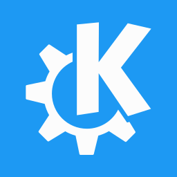</a> | **📂 檔名:** `kde.svg` ✨ **格式:** `Vector (SVG)` ⚖️ **大小:** `2.48KB` 📅 **更新:** `2026-03-02`  🚀 **jsDelivr Markdown:** `` 🔗 **直接連結 (Url):** <code>https://cdn.jsdelivr.net/gh/barry028/materials@main/images/iCons/Brands/kde.svg</code> 📥 [檢視原始檔](kde.svg) |
|  | **📂 檔名:** `keen.svg` ✨ **格式:** `Vector (SVG)` ⚖️ **大小:** `5.43KB` 📅 **更新:** `2026-03-02`  🚀 **jsDelivr Markdown:** `` 🔗 **直接連結 (Url):** <code>https://cdn.jsdelivr.net/gh/barry028/materials@main/images/iCons/Brands/keen.svg</code> 📥 [檢視原始檔](keen.svg) |
|  | **📂 檔名:** `kemal.svg` ✨ **格式:** `Vector (SVG)` ⚖️ **大小:** `685.00B` 📅 **更新:** `2026-03-02`  🚀 **jsDelivr Markdown:** `` 🔗 **直接連結 (Url):** <code>https://cdn.jsdelivr.net/gh/barry028/materials@main/images/iCons/Brands/kemal.svg</code> 📥 [檢視原始檔](kemal.svg) |
|  | **📂 檔名:** `keycdn-icon.svg` ✨ **格式:** `Vector (SVG)` ⚖️ **大小:** `4.94KB` 📅 **更新:** `2026-03-02`  🚀 **jsDelivr Markdown:** `` 🔗 **直接連結 (Url):** <code>https://cdn.jsdelivr.net/gh/barry028/materials@main/images/iCons/Brands/keycdn-icon.svg</code> 📥 [檢視原始檔](keycdn-icon.svg) |
|  | **📂 檔名:** `keycdn.svg` ✨ **格式:** `Vector (SVG)` ⚖️ **大小:** `11.87KB` 📅 **更新:** `2026-03-02`  🚀 **jsDelivr Markdown:** `` 🔗 **直接連結 (Url):** <code>https://cdn.jsdelivr.net/gh/barry028/materials@main/images/iCons/Brands/keycdn.svg</code> 📥 [檢視原始檔](keycdn.svg) |
| <a href="keydb-icon.svg">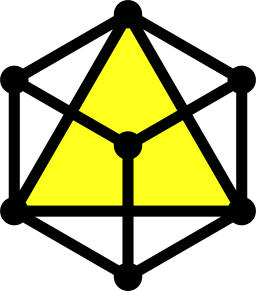</a> | **📂 檔名:** `keydb-icon.svg` ✨ **格式:** `Vector (SVG)` ⚖️ **大小:** `3.89KB` 📅 **更新:** `2026-03-02`  🚀 **jsDelivr Markdown:** `` 🔗 **直接連結 (Url):** <code>https://cdn.jsdelivr.net/gh/barry028/materials@main/images/iCons/Brands/keydb-icon.svg</code> 📥 [檢視原始檔](keydb-icon.svg) |
| <a href="keydb.svg">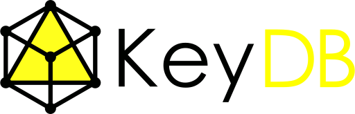</a> | **📂 檔名:** `keydb.svg` ✨ **格式:** `Vector (SVG)` ⚖️ **大小:** `8.46KB` 📅 **更新:** `2026-03-02`  🚀 **jsDelivr Markdown:** `` 🔗 **直接連結 (Url):** <code>https://cdn.jsdelivr.net/gh/barry028/materials@main/images/iCons/Brands/keydb.svg</code> 📥 [檢視原始檔](keydb.svg) |
| <a href="keystonejs.svg">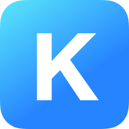</a> | **📂 檔名:** `keystonejs.svg` ✨ **格式:** `Vector (SVG)` ⚖️ **大小:** `1.65KB` 📅 **更新:** `2026-03-02`  🚀 **jsDelivr Markdown:** `` 🔗 **直接連結 (Url):** <code>https://cdn.jsdelivr.net/gh/barry028/materials@main/images/iCons/Brands/keystonejs.svg</code> 📥 [檢視原始檔](keystonejs.svg) |
|  | **📂 檔名:** `khan_academy-icon.svg` ✨ **格式:** `Vector (SVG)` ⚖️ **大小:** `1.55KB` 📅 **更新:** `2026-03-02`  🚀 **jsDelivr Markdown:** `` 🔗 **直接連結 (Url):** <code>https://cdn.jsdelivr.net/gh/barry028/materials@main/images/iCons/Brands/khan_academy-icon.svg</code> 📥 [檢視原始檔](khan_academy-icon.svg) |
|  | **📂 檔名:** `khan_academy.svg` ✨ **格式:** `Vector (SVG)` ⚖️ **大小:** `13.46KB` 📅 **更新:** `2026-03-02`  🚀 **jsDelivr Markdown:** `` 🔗 **直接連結 (Url):** <code>https://cdn.jsdelivr.net/gh/barry028/materials@main/images/iCons/Brands/khan_academy.svg</code> 📥 [檢視原始檔](khan_academy.svg) |
|  | **📂 檔名:** `kibana.svg` ✨ **格式:** `Vector (SVG)` ⚖️ **大小:** `690.00B` 📅 **更新:** `2026-03-02`  🚀 **jsDelivr Markdown:** `` 🔗 **直接連結 (Url):** <code>https://cdn.jsdelivr.net/gh/barry028/materials@main/images/iCons/Brands/kibana.svg</code> 📥 [檢視原始檔](kibana.svg) |
| <a href="kickstarter-icon.svg">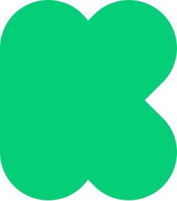</a> | **📂 檔名:** `kickstarter-icon.svg` ✨ **格式:** `Vector (SVG)` ⚖️ **大小:** `719.00B` 📅 **更新:** `2026-03-02`  🚀 **jsDelivr Markdown:** `` 🔗 **直接連結 (Url):** <code>https://cdn.jsdelivr.net/gh/barry028/materials@main/images/iCons/Brands/kickstarter-icon.svg</code> 📥 [檢視原始檔](kickstarter-icon.svg) |
|  | **📂 檔名:** `kickstarter.svg` ✨ **格式:** `Vector (SVG)` ⚖️ **大小:** `5.82KB` 📅 **更新:** `2026-03-02`  🚀 **jsDelivr Markdown:** `` 🔗 **直接連結 (Url):** <code>https://cdn.jsdelivr.net/gh/barry028/materials@main/images/iCons/Brands/kickstarter.svg</code> 📥 [檢視原始檔](kickstarter.svg) |
|  | **📂 檔名:** `kinto-icon.svg` ✨ **格式:** `Vector (SVG)` ⚖️ **大小:** `11.69KB` 📅 **更新:** `2026-03-02`  🚀 **jsDelivr Markdown:** `` 🔗 **直接連結 (Url):** <code>https://cdn.jsdelivr.net/gh/barry028/materials@main/images/iCons/Brands/kinto-icon.svg</code> 📥 [檢視原始檔](kinto-icon.svg) |
|  | **📂 檔名:** `kinto.svg` ✨ **格式:** `Vector (SVG)` ⚖️ **大小:** `16.78KB` 📅 **更新:** `2026-03-02`  🚀 **jsDelivr Markdown:** `` 🔗 **直接連結 (Url):** <code>https://cdn.jsdelivr.net/gh/barry028/materials@main/images/iCons/Brands/kinto.svg</code> 📥 [檢視原始檔](kinto.svg) |
|  | **📂 檔名:** `kirby-icon.svg` ✨ **格式:** `Vector (SVG)` ⚖️ **大小:** `834.00B` 📅 **更新:** `2026-03-02`  🚀 **jsDelivr Markdown:** `` 🔗 **直接連結 (Url):** <code>https://cdn.jsdelivr.net/gh/barry028/materials@main/images/iCons/Brands/kirby-icon.svg</code> 📥 [檢視原始檔](kirby-icon.svg) |
|  | **📂 檔名:** `kirby.svg` ✨ **格式:** `Vector (SVG)` ⚖️ **大小:** `3.48KB` 📅 **更新:** `2026-03-02`  🚀 **jsDelivr Markdown:** `` 🔗 **直接連結 (Url):** <code>https://cdn.jsdelivr.net/gh/barry028/materials@main/images/iCons/Brands/kirby.svg</code> 📥 [檢視原始檔](kirby.svg) |
|  | **📂 檔名:** `knex.svg` ✨ **格式:** `Vector (SVG)` ⚖️ **大小:** `8.83KB` 📅 **更新:** `2026-03-02`  🚀 **jsDelivr Markdown:** `` 🔗 **直接連結 (Url):** <code>https://cdn.jsdelivr.net/gh/barry028/materials@main/images/iCons/Brands/knex.svg</code> 📥 [檢視原始檔](knex.svg) |
|  | **📂 檔名:** `knockout.svg` ✨ **格式:** `Vector (SVG)` ⚖️ **大小:** `34.32KB` 📅 **更新:** `2026-03-02`  🚀 **jsDelivr Markdown:** `` 🔗 **直接連結 (Url):** <code>https://cdn.jsdelivr.net/gh/barry028/materials@main/images/iCons/Brands/knockout.svg</code> 📥 [檢視原始檔](knockout.svg) |
|  | **📂 檔名:** `koa.svg` ✨ **格式:** `Vector (SVG)` ⚖️ **大小:** `2.24KB` 📅 **更新:** `2026-03-02`  🚀 **jsDelivr Markdown:** `` 🔗 **直接連結 (Url):** <code>https://cdn.jsdelivr.net/gh/barry028/materials@main/images/iCons/Brands/koa.svg</code> 📥 [檢視原始檔](koa.svg) |
| <a href="kong-icon.svg">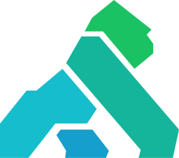</a> | **📂 檔名:** `kong-icon.svg` ✨ **格式:** `Vector (SVG)` ⚖️ **大小:** `1.12KB` 📅 **更新:** `2026-03-02`  🚀 **jsDelivr Markdown:** `` 🔗 **直接連結 (Url):** <code>https://cdn.jsdelivr.net/gh/barry028/materials@main/images/iCons/Brands/kong-icon.svg</code> 📥 [檢視原始檔](kong-icon.svg) |
|  | **📂 檔名:** `kong.svg` ✨ **格式:** `Vector (SVG)` ⚖️ **大小:** `3.75KB` 📅 **更新:** `2026-03-02`  🚀 **jsDelivr Markdown:** `` 🔗 **直接連結 (Url):** <code>https://cdn.jsdelivr.net/gh/barry028/materials@main/images/iCons/Brands/kong.svg</code> 📥 [檢視原始檔](kong.svg) |
|  | **📂 檔名:** `kops.svg` ✨ **格式:** `Vector (SVG)` ⚖️ **大小:** `11.81KB` 📅 **更新:** `2026-03-02`  🚀 **jsDelivr Markdown:** `` 🔗 **直接連結 (Url):** <code>https://cdn.jsdelivr.net/gh/barry028/materials@main/images/iCons/Brands/kops.svg</code> 📥 [檢視原始檔](kops.svg) |
| <a href="koreio.svg">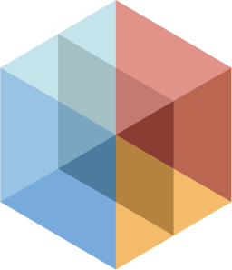</a> | **📂 檔名:** `koreio.svg` ✨ **格式:** `Vector (SVG)` ⚖️ **大小:** `2.87KB` 📅 **更新:** `2026-03-02`  🚀 **jsDelivr Markdown:** `` 🔗 **直接連結 (Url):** <code>https://cdn.jsdelivr.net/gh/barry028/materials@main/images/iCons/Brands/koreio.svg</code> 📥 [檢視原始檔](koreio.svg) |
| <a href="kotlin-icon.svg">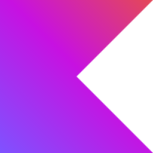</a> | **📂 檔名:** `kotlin-icon.svg` ✨ **格式:** `Vector (SVG)` ⚖️ **大小:** `755.00B` 📅 **更新:** `2026-03-02`  🚀 **jsDelivr Markdown:** `` 🔗 **直接連結 (Url):** <code>https://cdn.jsdelivr.net/gh/barry028/materials@main/images/iCons/Brands/kotlin-icon.svg</code> 📥 [檢視原始檔](kotlin-icon.svg) |
|  | **📂 檔名:** `kotlin.svg` ✨ **格式:** `Vector (SVG)` ⚖️ **大小:** `4.72KB` 📅 **更新:** `2026-03-02`  🚀 **jsDelivr Markdown:** `` 🔗 **直接連結 (Url):** <code>https://cdn.jsdelivr.net/gh/barry028/materials@main/images/iCons/Brands/kotlin.svg</code> 📥 [檢視原始檔](kotlin.svg) |
| <a href="kraken.svg">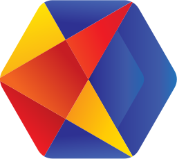</a> | **📂 檔名:** `kraken.svg` ✨ **格式:** `Vector (SVG)` ⚖️ **大小:** `4.72KB` 📅 **更新:** `2026-03-02`  🚀 **jsDelivr Markdown:** `` 🔗 **直接連結 (Url):** <code>https://cdn.jsdelivr.net/gh/barry028/materials@main/images/iCons/Brands/kraken.svg</code> 📥 [檢視原始檔](kraken.svg) |
|  | **📂 檔名:** `krakenjs.svg` ✨ **格式:** `Vector (SVG)` ⚖️ **大小:** `26.56KB` 📅 **更新:** `2026-03-02`  🚀 **jsDelivr Markdown:** `` 🔗 **直接連結 (Url):** <code>https://cdn.jsdelivr.net/gh/barry028/materials@main/images/iCons/Brands/krakenjs.svg</code> 📥 [檢視原始檔](krakenjs.svg) |
| <a href="ktor-icon.svg">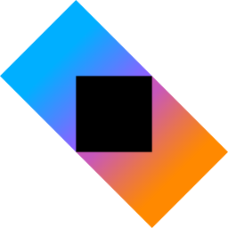</a> | **📂 檔名:** `ktor-icon.svg` ✨ **格式:** `Vector (SVG)` ⚖️ **大小:** `1.50KB` 📅 **更新:** `2026-03-02`  🚀 **jsDelivr Markdown:** `` 🔗 **直接連結 (Url):** <code>https://cdn.jsdelivr.net/gh/barry028/materials@main/images/iCons/Brands/ktor-icon.svg</code> 📥 [檢視原始檔](ktor-icon.svg) |
| <a href="ktor.svg">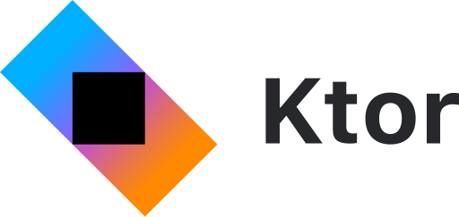</a> | **📂 檔名:** `ktor.svg` ✨ **格式:** `Vector (SVG)` ⚖️ **大小:** `3.55KB` 📅 **更新:** `2026-03-02`  🚀 **jsDelivr Markdown:** `` 🔗 **直接連結 (Url):** <code>https://cdn.jsdelivr.net/gh/barry028/materials@main/images/iCons/Brands/ktor.svg</code> 📥 [檢視原始檔](ktor.svg) |
|  | **📂 檔名:** `kubernetes.svg` ✨ **格式:** `Vector (SVG)` ⚖️ **大小:** `15.03KB` 📅 **更新:** `2026-03-02`  🚀 **jsDelivr Markdown:** `` 🔗 **直接連結 (Url):** <code>https://cdn.jsdelivr.net/gh/barry028/materials@main/images/iCons/Brands/kubernetes.svg</code> 📥 [檢視原始檔](kubernetes.svg) |
|  | **📂 檔名:** `kustomer.svg` ✨ **格式:** `Vector (SVG)` ⚖️ **大小:** `8.40KB` 📅 **更新:** `2026-03-02`  🚀 **jsDelivr Markdown:** `` 🔗 **直接連結 (Url):** <code>https://cdn.jsdelivr.net/gh/barry028/materials@main/images/iCons/Brands/kustomer.svg</code> 📥 [檢視原始檔](kustomer.svg) |
|  | **📂 檔名:** `languagetool.svg` ✨ **格式:** `Vector (SVG)` ⚖️ **大小:** `3.67KB` 📅 **更新:** `2026-03-02`  🚀 **jsDelivr Markdown:** `` 🔗 **直接連結 (Url):** <code>https://cdn.jsdelivr.net/gh/barry028/materials@main/images/iCons/Brands/languagetool.svg</code> 📥 [檢視原始檔](languagetool.svg) |
| <a href="laravel.svg">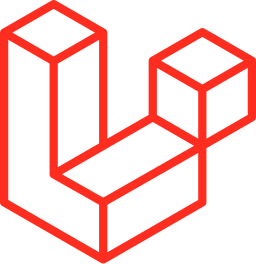</a> | **📂 檔名:** `laravel.svg` ✨ **格式:** `Vector (SVG)` ⚖️ **大小:** `4.94KB` 📅 **更新:** `2026-03-02`  🚀 **jsDelivr Markdown:** `` 🔗 **直接連結 (Url):** <code>https://cdn.jsdelivr.net/gh/barry028/materials@main/images/iCons/Brands/laravel.svg</code> 📥 [檢視原始檔](laravel.svg) |
|  | **📂 檔名:** `lastfm.svg` ✨ **格式:** `Vector (SVG)` ⚖️ **大小:** `4.33KB` 📅 **更新:** `2026-03-02`  🚀 **jsDelivr Markdown:** `` 🔗 **直接連結 (Url):** <code>https://cdn.jsdelivr.net/gh/barry028/materials@main/images/iCons/Brands/lastfm.svg</code> 📥 [檢視原始檔](lastfm.svg) |
|  | **📂 檔名:** `lateral-icon.svg` ✨ **格式:** `Vector (SVG)` ⚖️ **大小:** `19.44KB` 📅 **更新:** `2026-03-02`  🚀 **jsDelivr Markdown:** `` 🔗 **直接連結 (Url):** <code>https://cdn.jsdelivr.net/gh/barry028/materials@main/images/iCons/Brands/lateral-icon.svg</code> 📥 [檢視原始檔](lateral-icon.svg) |
|  | **📂 檔名:** `lateral.svg` ✨ **格式:** `Vector (SVG)` ⚖️ **大小:** `24.38KB` 📅 **更新:** `2026-03-02`  🚀 **jsDelivr Markdown:** `` 🔗 **直接連結 (Url):** <code>https://cdn.jsdelivr.net/gh/barry028/materials@main/images/iCons/Brands/lateral.svg</code> 📥 [檢視原始檔](lateral.svg) |
|  | **📂 檔名:** `launchdarkly-icon.svg` ✨ **格式:** `Vector (SVG)` ⚖️ **大小:** `1.46KB` 📅 **更新:** `2026-03-02`  🚀 **jsDelivr Markdown:** `` 🔗 **直接連結 (Url):** <code>https://cdn.jsdelivr.net/gh/barry028/materials@main/images/iCons/Brands/launchdarkly-icon.svg</code> 📥 [檢視原始檔](launchdarkly-icon.svg) |
|  | **📂 檔名:** `launchdarkly.svg` ✨ **格式:** `Vector (SVG)` ⚖️ **大小:** `11.42KB` 📅 **更新:** `2026-03-02`  🚀 **jsDelivr Markdown:** `` 🔗 **直接連結 (Url):** <code>https://cdn.jsdelivr.net/gh/barry028/materials@main/images/iCons/Brands/launchdarkly.svg</code> 📥 [檢視原始檔](launchdarkly.svg) |
|  | **📂 檔名:** `launchrock.svg` ✨ **格式:** `Vector (SVG)` ⚖️ **大小:** `2.08KB` 📅 **更新:** `2026-03-02`  🚀 **jsDelivr Markdown:** `` 🔗 **直接連結 (Url):** <code>https://cdn.jsdelivr.net/gh/barry028/materials@main/images/iCons/Brands/launchrock.svg</code> 📥 [檢視原始檔](launchrock.svg) |
|  | **📂 檔名:** `leaflet.svg` ✨ **格式:** `Vector (SVG)` ⚖️ **大小:** `8.20KB` 📅 **更新:** `2026-03-02`  🚀 **jsDelivr Markdown:** `` 🔗 **直接連結 (Url):** <code>https://cdn.jsdelivr.net/gh/barry028/materials@main/images/iCons/Brands/leaflet.svg</code> 📥 [檢視原始檔](leaflet.svg) |
|  | **📂 檔名:** `leankit-icon.svg` ✨ **格式:** `Vector (SVG)` ⚖️ **大小:** `1.46KB` 📅 **更新:** `2026-03-02`  🚀 **jsDelivr Markdown:** `` 🔗 **直接連結 (Url):** <code>https://cdn.jsdelivr.net/gh/barry028/materials@main/images/iCons/Brands/leankit-icon.svg</code> 📥 [檢視原始檔](leankit-icon.svg) |
|  | **📂 檔名:** `leankit.svg` ✨ **格式:** `Vector (SVG)` ⚖️ **大小:** `32.93KB` 📅 **更新:** `2026-03-02`  🚀 **jsDelivr Markdown:** `` 🔗 **直接連結 (Url):** <code>https://cdn.jsdelivr.net/gh/barry028/materials@main/images/iCons/Brands/leankit.svg</code> 📥 [檢視原始檔](leankit.svg) |
|  | **📂 檔名:** `lerna.svg` ✨ **格式:** `Vector (SVG)` ⚖️ **大小:** `329.07KB` 📅 **更新:** `2026-03-02`  🚀 **jsDelivr Markdown:** `` 🔗 **直接連結 (Url):** <code>https://cdn.jsdelivr.net/gh/barry028/materials@main/images/iCons/Brands/lerna.svg</code> 📥 [檢視原始檔](lerna.svg) |
|  | **📂 檔名:** `less.svg` ✨ **格式:** `Vector (SVG)` ⚖️ **大小:** `4.71KB` 📅 **更新:** `2026-03-02`  🚀 **jsDelivr Markdown:** `` 🔗 **直接連結 (Url):** <code>https://cdn.jsdelivr.net/gh/barry028/materials@main/images/iCons/Brands/less.svg</code> 📥 [檢視原始檔](less.svg) |
|  | **📂 檔名:** `lets-cloud.svg` ✨ **格式:** `Vector (SVG)` ⚖️ **大小:** `15.44KB` 📅 **更新:** `2026-03-02`  🚀 **jsDelivr Markdown:** `` 🔗 **直接連結 (Url):** <code>https://cdn.jsdelivr.net/gh/barry028/materials@main/images/iCons/Brands/lets-cloud.svg</code> 📥 [檢視原始檔](lets-cloud.svg) |
|  | **📂 檔名:** `letsencrypt.svg` ✨ **格式:** `Vector (SVG)` ⚖️ **大小:** `17.20KB` 📅 **更新:** `2026-03-02`  🚀 **jsDelivr Markdown:** `` 🔗 **直接連結 (Url):** <code>https://cdn.jsdelivr.net/gh/barry028/materials@main/images/iCons/Brands/letsencrypt.svg</code> 📥 [檢視原始檔](letsencrypt.svg) |
|  | **📂 檔名:** `leveldb.svg` ✨ **格式:** `Vector (SVG)` ⚖️ **大小:** `893.00B` 📅 **更新:** `2026-03-02`  🚀 **jsDelivr Markdown:** `` 🔗 **直接連結 (Url):** <code>https://cdn.jsdelivr.net/gh/barry028/materials@main/images/iCons/Brands/leveldb.svg</code> 📥 [檢視原始檔](leveldb.svg) |
| <a href="lexical-icon.svg">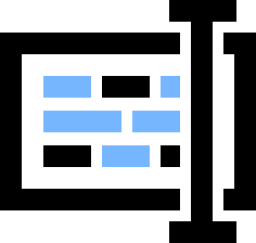</a> | **📂 檔名:** `lexical-icon.svg` ✨ **格式:** `Vector (SVG)` ⚖️ **大小:** `2.04KB` 📅 **更新:** `2026-03-02`  🚀 **jsDelivr Markdown:** `` 🔗 **直接連結 (Url):** <code>https://cdn.jsdelivr.net/gh/barry028/materials@main/images/iCons/Brands/lexical-icon.svg</code> 📥 [檢視原始檔](lexical-icon.svg) |
|  | **📂 檔名:** `lexical.svg` ✨ **格式:** `Vector (SVG)` ⚖️ **大小:** `8.00KB` 📅 **更新:** `2026-03-02`  🚀 **jsDelivr Markdown:** `` 🔗 **直接連結 (Url):** <code>https://cdn.jsdelivr.net/gh/barry028/materials@main/images/iCons/Brands/lexical.svg</code> 📥 [檢視原始檔](lexical.svg) |
|  | **📂 檔名:** `liftweb.svg` ✨ **格式:** `Vector (SVG)` ⚖️ **大小:** `1.21KB` 📅 **更新:** `2026-03-02`  🚀 **jsDelivr Markdown:** `` 🔗 **直接連結 (Url):** <code>https://cdn.jsdelivr.net/gh/barry028/materials@main/images/iCons/Brands/liftweb.svg</code> 📥 [檢視原始檔](liftweb.svg) |
|  | **📂 檔名:** `lighthouse.svg` ✨ **格式:** `Vector (SVG)` ⚖️ **大小:** `14.79KB` 📅 **更新:** `2026-03-02`  🚀 **jsDelivr Markdown:** `` 🔗 **直接連結 (Url):** <code>https://cdn.jsdelivr.net/gh/barry028/materials@main/images/iCons/Brands/lighthouse.svg</code> 📥 [檢視原始檔](lighthouse.svg) |
| <a href="lightstep-icon.svg">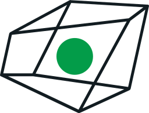</a> | **📂 檔名:** `lightstep-icon.svg` ✨ **格式:** `Vector (SVG)` ⚖️ **大小:** `1.99KB` 📅 **更新:** `2026-03-02`  🚀 **jsDelivr Markdown:** `` 🔗 **直接連結 (Url):** <code>https://cdn.jsdelivr.net/gh/barry028/materials@main/images/iCons/Brands/lightstep-icon.svg</code> 📥 [檢視原始檔](lightstep-icon.svg) |
| <a href="lightstep.svg">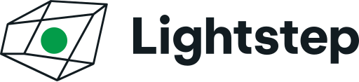</a> | **📂 檔名:** `lightstep.svg` ✨ **格式:** `Vector (SVG)` ⚖️ **大小:** `7.35KB` 📅 **更新:** `2026-03-02`  🚀 **jsDelivr Markdown:** `` 🔗 **直接連結 (Url):** <code>https://cdn.jsdelivr.net/gh/barry028/materials@main/images/iCons/Brands/lightstep.svg</code> 📥 [檢視原始檔](lightstep.svg) |
|  | **📂 檔名:** `lighttpd.svg` ✨ **格式:** `Vector (SVG)` ⚖️ **大小:** `728.00B` 📅 **更新:** `2026-03-02`  🚀 **jsDelivr Markdown:** `` 🔗 **直接連結 (Url):** <code>https://cdn.jsdelivr.net/gh/barry028/materials@main/images/iCons/Brands/lighttpd.svg</code> 📥 [檢視原始檔](lighttpd.svg) |
|  | **📂 檔名:** `linear-icon.svg` ✨ **格式:** `Vector (SVG)` ⚖️ **大小:** `1.79KB` 📅 **更新:** `2026-03-02`  🚀 **jsDelivr Markdown:** `` 🔗 **直接連結 (Url):** <code>https://cdn.jsdelivr.net/gh/barry028/materials@main/images/iCons/Brands/linear-icon.svg</code> 📥 [檢視原始檔](linear-icon.svg) |
|  | **📂 檔名:** `linear.svg` ✨ **格式:** `Vector (SVG)` ⚖️ **大小:** `8.53KB` 📅 **更新:** `2026-03-02`  🚀 **jsDelivr Markdown:** `` 🔗 **直接連結 (Url):** <code>https://cdn.jsdelivr.net/gh/barry028/materials@main/images/iCons/Brands/linear.svg</code> 📥 [檢視原始檔](linear.svg) |
|  | **📂 檔名:** `linkedin-icon.svg` ✨ **格式:** `Vector (SVG)` ⚖️ **大小:** `1.59KB` 📅 **更新:** `2026-03-02`  🚀 **jsDelivr Markdown:** `` 🔗 **直接連結 (Url):** <code>https://cdn.jsdelivr.net/gh/barry028/materials@main/images/iCons/Brands/linkedin-icon.svg</code> 📥 [檢視原始檔](linkedin-icon.svg) |
|  | **📂 檔名:** `linkedin.svg` ✨ **格式:** `Vector (SVG)` ⚖️ **大小:** `4.71KB` 📅 **更新:** `2026-03-02`  🚀 **jsDelivr Markdown:** `` 🔗 **直接連結 (Url):** <code>https://cdn.jsdelivr.net/gh/barry028/materials@main/images/iCons/Brands/linkedin.svg</code> 📥 [檢視原始檔](linkedin.svg) |
| <a href="linkerd.svg">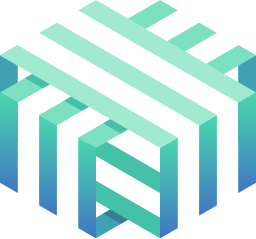</a> | **📂 檔名:** `linkerd.svg` ✨ **格式:** `Vector (SVG)` ⚖️ **大小:** `3.66KB` 📅 **更新:** `2026-03-02`  🚀 **jsDelivr Markdown:** `` 🔗 **直接連結 (Url):** <code>https://cdn.jsdelivr.net/gh/barry028/materials@main/images/iCons/Brands/linkerd.svg</code> 📥 [檢視原始檔](linkerd.svg) |
| <a href="linode.svg">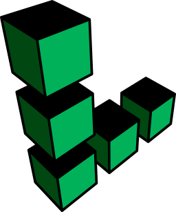</a> | **📂 檔名:** `linode.svg` ✨ **格式:** `Vector (SVG)` ⚖️ **大小:** `9.68KB` 📅 **更新:** `2026-03-02`  🚀 **jsDelivr Markdown:** `` 🔗 **直接連結 (Url):** <code>https://cdn.jsdelivr.net/gh/barry028/materials@main/images/iCons/Brands/linode.svg</code> 📥 [檢視原始檔](linode.svg) |
|  | **📂 檔名:** `linux-mint.svg` ✨ **格式:** `Vector (SVG)` ⚖️ **大小:** `2.01KB` 📅 **更新:** `2026-03-02`  🚀 **jsDelivr Markdown:** `` 🔗 **直接連結 (Url):** <code>https://cdn.jsdelivr.net/gh/barry028/materials@main/images/iCons/Brands/linux-mint.svg</code> 📥 [檢視原始檔](linux-mint.svg) |
|  | **📂 檔名:** `linux-tux.svg` ✨ **格式:** `Vector (SVG)` ⚖️ **大小:** `18.02KB` 📅 **更新:** `2026-03-02`  🚀 **jsDelivr Markdown:** `` 🔗 **直接連結 (Url):** <code>https://cdn.jsdelivr.net/gh/barry028/materials@main/images/iCons/Brands/linux-tux.svg</code> 📥 [檢視原始檔](linux-tux.svg) |
|  | **📂 檔名:** `lit-icon.svg` ✨ **格式:** `Vector (SVG)` ⚖️ **大小:** `831.00B` 📅 **更新:** `2026-03-02`  🚀 **jsDelivr Markdown:** `` 🔗 **直接連結 (Url):** <code>https://cdn.jsdelivr.net/gh/barry028/materials@main/images/iCons/Brands/lit-icon.svg</code> 📥 [檢視原始檔](lit-icon.svg) |
|  | **📂 檔名:** `lit.svg` ✨ **格式:** `Vector (SVG)` ⚖️ **大小:** `2.25KB` 📅 **更新:** `2026-03-02`  🚀 **jsDelivr Markdown:** `` 🔗 **直接連結 (Url):** <code>https://cdn.jsdelivr.net/gh/barry028/materials@main/images/iCons/Brands/lit.svg</code> 📥 [檢視原始檔](lit.svg) |
| <a href="litmus.svg">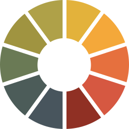</a> | **📂 檔名:** `litmus.svg` ✨ **格式:** `Vector (SVG)` ⚖️ **大小:** `2.09KB` 📅 **更新:** `2026-03-02`  🚀 **jsDelivr Markdown:** `` 🔗 **直接連結 (Url):** <code>https://cdn.jsdelivr.net/gh/barry028/materials@main/images/iCons/Brands/litmus.svg</code> 📥 [檢視原始檔](litmus.svg) |
| <a href="loader.svg">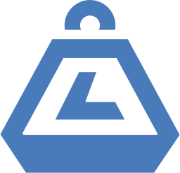</a> | **📂 檔名:** `loader.svg` ✨ **格式:** `Vector (SVG)` ⚖️ **大小:** `1.52KB` 📅 **更新:** `2026-03-02`  🚀 **jsDelivr Markdown:** `` 🔗 **直接連結 (Url):** <code>https://cdn.jsdelivr.net/gh/barry028/materials@main/images/iCons/Brands/loader.svg</code> 📥 [檢視原始檔](loader.svg) |
|  | **📂 檔名:** `lodash.svg` ✨ **格式:** `Vector (SVG)` ⚖️ **大小:** `1.86KB` 📅 **更新:** `2026-03-02`  🚀 **jsDelivr Markdown:** `` 🔗 **直接連結 (Url):** <code>https://cdn.jsdelivr.net/gh/barry028/materials@main/images/iCons/Brands/lodash.svg</code> 📥 [檢視原始檔](lodash.svg) |
|  | **📂 檔名:** `logentries.svg` ✨ **格式:** `Vector (SVG)` ⚖️ **大小:** `4.50KB` 📅 **更新:** `2026-03-02`  🚀 **jsDelivr Markdown:** `` 🔗 **直接連結 (Url):** <code>https://cdn.jsdelivr.net/gh/barry028/materials@main/images/iCons/Brands/logentries.svg</code> 📥 [檢視原始檔](logentries.svg) |
|  | **📂 檔名:** `logstash.svg` ✨ **格式:** `Vector (SVG)` ⚖️ **大小:** `723.00B` 📅 **更新:** `2026-03-02`  🚀 **jsDelivr Markdown:** `` 🔗 **直接連結 (Url):** <code>https://cdn.jsdelivr.net/gh/barry028/materials@main/images/iCons/Brands/logstash.svg</code> 📥 [檢視原始檔](logstash.svg) |
|  | **📂 檔名:** `lookback.svg` ✨ **格式:** `Vector (SVG)` ⚖️ **大小:** `4.72KB` 📅 **更新:** `2026-03-02`  🚀 **jsDelivr Markdown:** `` 🔗 **直接連結 (Url):** <code>https://cdn.jsdelivr.net/gh/barry028/materials@main/images/iCons/Brands/lookback.svg</code> 📥 [檢視原始檔](lookback.svg) |
|  | **📂 檔名:** `looker-icon.svg` ✨ **格式:** `Vector (SVG)` ⚖️ **大小:** `2.73KB` 📅 **更新:** `2026-03-02`  🚀 **jsDelivr Markdown:** `` 🔗 **直接連結 (Url):** <code>https://cdn.jsdelivr.net/gh/barry028/materials@main/images/iCons/Brands/looker-icon.svg</code> 📥 [檢視原始檔](looker-icon.svg) |
|  | **📂 檔名:** `looker.svg` ✨ **格式:** `Vector (SVG)` ⚖️ **大小:** `8.32KB` 📅 **更新:** `2026-03-02`  🚀 **jsDelivr Markdown:** `` 🔗 **直接連結 (Url):** <code>https://cdn.jsdelivr.net/gh/barry028/materials@main/images/iCons/Brands/looker.svg</code> 📥 [檢視原始檔](looker.svg) |
|  | **📂 檔名:** `loom-icon.svg` ✨ **格式:** `Vector (SVG)` ⚖️ **大小:** `1.31KB` 📅 **更新:** `2026-03-02`  🚀 **jsDelivr Markdown:** `` 🔗 **直接連結 (Url):** <code>https://cdn.jsdelivr.net/gh/barry028/materials@main/images/iCons/Brands/loom-icon.svg</code> 📥 [檢視原始檔](loom-icon.svg) |
|  | **📂 檔名:** `loom.svg` ✨ **格式:** `Vector (SVG)` ⚖️ **大小:** `3.40KB` 📅 **更新:** `2026-03-02`  🚀 **jsDelivr Markdown:** `` 🔗 **直接連結 (Url):** <code>https://cdn.jsdelivr.net/gh/barry028/materials@main/images/iCons/Brands/loom.svg</code> 📥 [檢視原始檔](loom.svg) |
| <a href="loopback-icon.svg">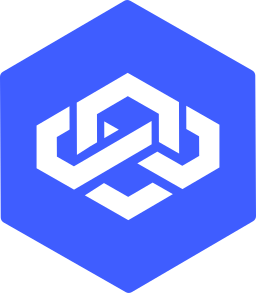</a> | **📂 檔名:** `loopback-icon.svg` ✨ **格式:** `Vector (SVG)` ⚖️ **大小:** `1.88KB` 📅 **更新:** `2026-03-02`  🚀 **jsDelivr Markdown:** `` 🔗 **直接連結 (Url):** <code>https://cdn.jsdelivr.net/gh/barry028/materials@main/images/iCons/Brands/loopback-icon.svg</code> 📥 [檢視原始檔](loopback-icon.svg) |
|  | **📂 檔名:** `loopback.svg` ✨ **格式:** `Vector (SVG)` ⚖️ **大小:** `6.37KB` 📅 **更新:** `2026-03-02`  🚀 **jsDelivr Markdown:** `` 🔗 **直接連結 (Url):** <code>https://cdn.jsdelivr.net/gh/barry028/materials@main/images/iCons/Brands/loopback.svg</code> 📥 [檢視原始檔](loopback.svg) |
| <a href="losant.svg">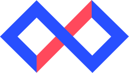</a> | **📂 檔名:** `losant.svg` ✨ **格式:** `Vector (SVG)` ⚖️ **大小:** `774.00B` 📅 **更新:** `2026-03-02`  🚀 **jsDelivr Markdown:** `` 🔗 **直接連結 (Url):** <code>https://cdn.jsdelivr.net/gh/barry028/materials@main/images/iCons/Brands/losant.svg</code> 📥 [檢視原始檔](losant.svg) |
| <a href="lua.svg">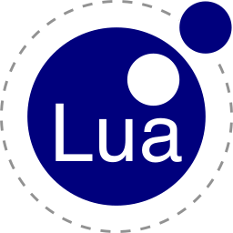</a> | **📂 檔名:** `lua.svg` ✨ **格式:** `Vector (SVG)` ⚖️ **大小:** `11.94KB` 📅 **更新:** `2026-03-02`  🚀 **jsDelivr Markdown:** `` 🔗 **直接連結 (Url):** <code>https://cdn.jsdelivr.net/gh/barry028/materials@main/images/iCons/Brands/lua.svg</code> 📥 [檢視原始檔](lua.svg) |
|  | **📂 檔名:** `lucene.net.svg` ✨ **格式:** `Vector (SVG)` ⚖️ **大小:** `2.64KB` 📅 **更新:** `2026-03-02`  🚀 **jsDelivr Markdown:** `` 🔗 **直接連結 (Url):** <code>https://cdn.jsdelivr.net/gh/barry028/materials@main/images/iCons/Brands/lucene.net.svg</code> 📥 [檢視原始檔](lucene.net.svg) |
| <a href="lucene.svg">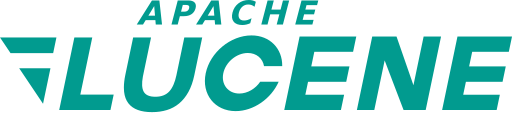</a> | **📂 檔名:** `lucene.svg` ✨ **格式:** `Vector (SVG)` ⚖️ **大小:** `6.33KB` 📅 **更新:** `2026-03-02`  🚀 **jsDelivr Markdown:** `` 🔗 **直接連結 (Url):** <code>https://cdn.jsdelivr.net/gh/barry028/materials@main/images/iCons/Brands/lucene.svg</code> 📥 [檢視原始檔](lucene.svg) |
| <a href="lumen.svg">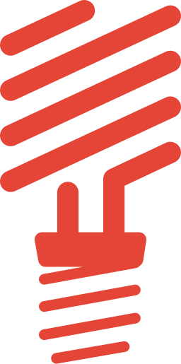</a> | **📂 檔名:** `lumen.svg` ✨ **格式:** `Vector (SVG)` ⚖️ **大小:** `4.26KB` 📅 **更新:** `2026-03-02`  🚀 **jsDelivr Markdown:** `` 🔗 **直接連結 (Url):** <code>https://cdn.jsdelivr.net/gh/barry028/materials@main/images/iCons/Brands/lumen.svg</code> 📥 [檢視原始檔](lumen.svg) |
|  | **📂 檔名:** `macOS.svg` ✨ **格式:** `Vector (SVG)` ⚖️ **大小:** `4.09KB` 📅 **更新:** `2026-03-02`  🚀 **jsDelivr Markdown:** `` 🔗 **直接連結 (Url):** <code>https://cdn.jsdelivr.net/gh/barry028/materials@main/images/iCons/Brands/macOS.svg</code> 📥 [檢視原始檔](macOS.svg) |
|  | **📂 檔名:** `madge.svg` ✨ **格式:** `Vector (SVG)` ⚖️ **大小:** `6.22KB` 📅 **更新:** `2026-03-02`  🚀 **jsDelivr Markdown:** `` 🔗 **直接連結 (Url):** <code>https://cdn.jsdelivr.net/gh/barry028/materials@main/images/iCons/Brands/madge.svg</code> 📥 [檢視原始檔](madge.svg) |
| <a href="maestro.svg">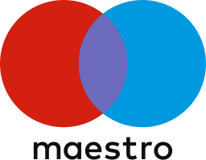</a> | **📂 檔名:** `maestro.svg` ✨ **格式:** `Vector (SVG)` ⚖️ **大小:** `7.87KB` 📅 **更新:** `2026-03-02`  🚀 **jsDelivr Markdown:** `` 🔗 **直接連結 (Url):** <code>https://cdn.jsdelivr.net/gh/barry028/materials@main/images/iCons/Brands/maestro.svg</code> 📥 [檢視原始檔](maestro.svg) |
|  | **📂 檔名:** `mageia.svg` ✨ **格式:** `Vector (SVG)` ⚖️ **大小:** `7.22KB` 📅 **更新:** `2026-03-02`  🚀 **jsDelivr Markdown:** `` 🔗 **直接連結 (Url):** <code>https://cdn.jsdelivr.net/gh/barry028/materials@main/images/iCons/Brands/mageia.svg</code> 📥 [檢視原始檔](mageia.svg) |
|  | **📂 檔名:** `mailchimp-freddie.svg` ✨ **格式:** `Vector (SVG)` ⚖️ **大小:** `127.09KB` 📅 **更新:** `2026-03-02`  🚀 **jsDelivr Markdown:** `` 🔗 **直接連結 (Url):** <code>https://cdn.jsdelivr.net/gh/barry028/materials@main/images/iCons/Brands/mailchimp-freddie.svg</code> 📥 [檢視原始檔](mailchimp-freddie.svg) |
|  | **📂 檔名:** `mailchimp.svg` ✨ **格式:** `Vector (SVG)` ⚖️ **大小:** `16.24KB` 📅 **更新:** `2026-03-02`  🚀 **jsDelivr Markdown:** `` 🔗 **直接連結 (Url):** <code>https://cdn.jsdelivr.net/gh/barry028/materials@main/images/iCons/Brands/mailchimp.svg</code> 📥 [檢視原始檔](mailchimp.svg) |
|  | **📂 檔名:** `maildeveloper.svg` ✨ **格式:** `Vector (SVG)` ⚖️ **大小:** `1.70KB` 📅 **更新:** `2026-03-02`  🚀 **jsDelivr Markdown:** `` 🔗 **直接連結 (Url):** <code>https://cdn.jsdelivr.net/gh/barry028/materials@main/images/iCons/Brands/maildeveloper.svg</code> 📥 [檢視原始檔](maildeveloper.svg) |
| <a href="mailgun-icon.svg">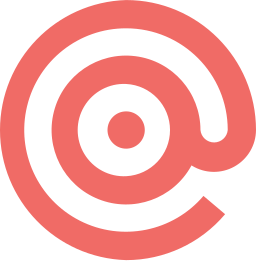</a> | **📂 檔名:** `mailgun-icon.svg` ✨ **格式:** `Vector (SVG)` ⚖️ **大小:** `2.07KB` 📅 **更新:** `2026-03-02`  🚀 **jsDelivr Markdown:** `` 🔗 **直接連結 (Url):** <code>https://cdn.jsdelivr.net/gh/barry028/materials@main/images/iCons/Brands/mailgun-icon.svg</code> 📥 [檢視原始檔](mailgun-icon.svg) |
|  | **📂 檔名:** `mailgun.svg` ✨ **格式:** `Vector (SVG)` ⚖️ **大小:** `8.88KB` 📅 **更新:** `2026-03-02`  🚀 **jsDelivr Markdown:** `` 🔗 **直接連結 (Url):** <code>https://cdn.jsdelivr.net/gh/barry028/materials@main/images/iCons/Brands/mailgun.svg</code> 📥 [檢視原始檔](mailgun.svg) |
| <a href="mailjet-icon.svg">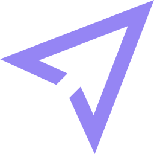</a> | **📂 檔名:** `mailjet-icon.svg` ✨ **格式:** `Vector (SVG)` ⚖️ **大小:** `522.00B` 📅 **更新:** `2026-03-02`  🚀 **jsDelivr Markdown:** `` 🔗 **直接連結 (Url):** <code>https://cdn.jsdelivr.net/gh/barry028/materials@main/images/iCons/Brands/mailjet-icon.svg</code> 📥 [檢視原始檔](mailjet-icon.svg) |
|  | **📂 檔名:** `mailjet.svg` ✨ **格式:** `Vector (SVG)` ⚖️ **大小:** `5.80KB` 📅 **更新:** `2026-03-02`  🚀 **jsDelivr Markdown:** `` 🔗 **直接連結 (Url):** <code>https://cdn.jsdelivr.net/gh/barry028/materials@main/images/iCons/Brands/mailjet.svg</code> 📥 [檢視原始檔](mailjet.svg) |
| <a href="malinajs.svg">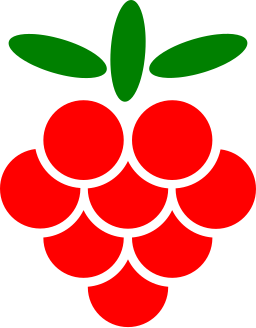</a> | **📂 檔名:** `malinajs.svg` ✨ **格式:** `Vector (SVG)` ⚖️ **大小:** `7.74KB` 📅 **更新:** `2026-03-02`  🚀 **jsDelivr Markdown:** `` 🔗 **直接連結 (Url):** <code>https://cdn.jsdelivr.net/gh/barry028/materials@main/images/iCons/Brands/malinajs.svg</code> 📥 [檢視原始檔](malinajs.svg) |
| <a href="manjaro.svg">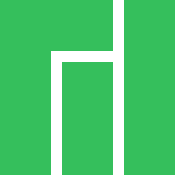</a> | **📂 檔名:** `manjaro.svg` ✨ **格式:** `Vector (SVG)` ⚖️ **大小:** `654.00B` 📅 **更新:** `2026-03-02`  🚀 **jsDelivr Markdown:** `` 🔗 **直接連結 (Url):** <code>https://cdn.jsdelivr.net/gh/barry028/materials@main/images/iCons/Brands/manjaro.svg</code> 📥 [檢視原始檔](manjaro.svg) |
|  | **📂 檔名:** `mantine-icon.svg` ✨ **格式:** `Vector (SVG)` ⚖️ **大小:** `2.69KB` 📅 **更新:** `2026-03-02`  🚀 **jsDelivr Markdown:** `` 🔗 **直接連結 (Url):** <code>https://cdn.jsdelivr.net/gh/barry028/materials@main/images/iCons/Brands/mantine-icon.svg</code> 📥 [檢視原始檔](mantine-icon.svg) |
|  | **📂 檔名:** `mantine.svg` ✨ **格式:** `Vector (SVG)` ⚖️ **大小:** `14.62KB` 📅 **更新:** `2026-03-02`  🚀 **jsDelivr Markdown:** `` 🔗 **直接連結 (Url):** <code>https://cdn.jsdelivr.net/gh/barry028/materials@main/images/iCons/Brands/mantine.svg</code> 📥 [檢視原始檔](mantine.svg) |
|  | **📂 檔名:** `mapbox-icon.svg` ✨ **格式:** `Vector (SVG)` ⚖️ **大小:** `984.00B` 📅 **更新:** `2026-03-02`  🚀 **jsDelivr Markdown:** `` 🔗 **直接連結 (Url):** <code>https://cdn.jsdelivr.net/gh/barry028/materials@main/images/iCons/Brands/mapbox-icon.svg</code> 📥 [檢視原始檔](mapbox-icon.svg) |
|  | **📂 檔名:** `mapbox.svg` ✨ **格式:** `Vector (SVG)` ⚖️ **大小:** `7.96KB` 📅 **更新:** `2026-03-02`  🚀 **jsDelivr Markdown:** `` 🔗 **直接連結 (Url):** <code>https://cdn.jsdelivr.net/gh/barry028/materials@main/images/iCons/Brands/mapbox.svg</code> 📥 [檢視原始檔](mapbox.svg) |
|  | **📂 檔名:** `maps-me.svg` ✨ **格式:** `Vector (SVG)` ⚖️ **大小:** `3.55KB` 📅 **更新:** `2026-03-02`  🚀 **jsDelivr Markdown:** `` 🔗 **直接連結 (Url):** <code>https://cdn.jsdelivr.net/gh/barry028/materials@main/images/iCons/Brands/maps-me.svg</code> 📥 [檢視原始檔](maps-me.svg) |
| <a href="mapzen-icon.svg">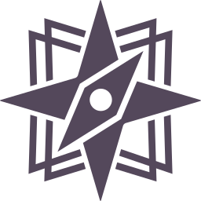</a> | **📂 檔名:** `mapzen-icon.svg` ✨ **格式:** `Vector (SVG)` ⚖️ **大小:** `3.20KB` 📅 **更新:** `2026-03-02`  🚀 **jsDelivr Markdown:** `` 🔗 **直接連結 (Url):** <code>https://cdn.jsdelivr.net/gh/barry028/materials@main/images/iCons/Brands/mapzen-icon.svg</code> 📥 [檢視原始檔](mapzen-icon.svg) |
| <a href="mapzen.svg">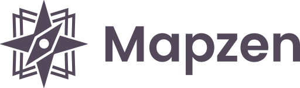</a> | **📂 檔名:** `mapzen.svg` ✨ **格式:** `Vector (SVG)` ⚖️ **大小:** `6.40KB` 📅 **更新:** `2026-03-02`  🚀 **jsDelivr Markdown:** `` 🔗 **直接連結 (Url):** <code>https://cdn.jsdelivr.net/gh/barry028/materials@main/images/iCons/Brands/mapzen.svg</code> 📥 [檢視原始檔](mapzen.svg) |
|  | **📂 檔名:** `mariadb-icon.svg` ✨ **格式:** `Vector (SVG)` ⚖️ **大小:** `5.28KB` 📅 **更新:** `2026-03-02`  🚀 **jsDelivr Markdown:** `` 🔗 **直接連結 (Url):** <code>https://cdn.jsdelivr.net/gh/barry028/materials@main/images/iCons/Brands/mariadb-icon.svg</code> 📥 [檢視原始檔](mariadb-icon.svg) |
|  | **📂 檔名:** `mariadb.svg` ✨ **格式:** `Vector (SVG)` ⚖️ **大小:** `11.65KB` 📅 **更新:** `2026-03-02`  🚀 **jsDelivr Markdown:** `` 🔗 **直接連結 (Url):** <code>https://cdn.jsdelivr.net/gh/barry028/materials@main/images/iCons/Brands/mariadb.svg</code> 📥 [檢視原始檔](mariadb.svg) |
|  | **📂 檔名:** `marionette.svg` ✨ **格式:** `Vector (SVG)` ⚖️ **大小:** `7.79KB` 📅 **更新:** `2026-03-02`  🚀 **jsDelivr Markdown:** `` 🔗 **直接連結 (Url):** <code>https://cdn.jsdelivr.net/gh/barry028/materials@main/images/iCons/Brands/marionette.svg</code> 📥 [檢視原始檔](marionette.svg) |
|  | **📂 檔名:** `markdown.svg` ✨ **格式:** `Vector (SVG)` ⚖️ **大小:** `1.55KB` 📅 **更新:** `2026-03-02`  🚀 **jsDelivr Markdown:** `` 🔗 **直接連結 (Url):** <code>https://cdn.jsdelivr.net/gh/barry028/materials@main/images/iCons/Brands/markdown.svg</code> 📥 [檢視原始檔](markdown.svg) |
| <a href="marko.svg">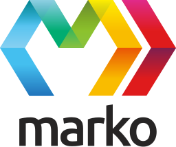</a> | **📂 檔名:** `marko.svg` ✨ **格式:** `Vector (SVG)` ⚖️ **大小:** `10.32KB` 📅 **更新:** `2026-03-02`  🚀 **jsDelivr Markdown:** `` 🔗 **直接連結 (Url):** <code>https://cdn.jsdelivr.net/gh/barry028/materials@main/images/iCons/Brands/marko.svg</code> 📥 [檢視原始檔](marko.svg) |
|  | **📂 檔名:** `marvel.svg` ✨ **格式:** `Vector (SVG)` ⚖️ **大小:** `6.10KB` 📅 **更新:** `2026-03-02`  🚀 **jsDelivr Markdown:** `` 🔗 **直接連結 (Url):** <code>https://cdn.jsdelivr.net/gh/barry028/materials@main/images/iCons/Brands/marvel.svg</code> 📥 [檢視原始檔](marvel.svg) |
| <a href="mastercard.svg">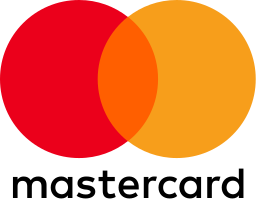</a> | **📂 檔名:** `mastercard.svg` ✨ **格式:** `Vector (SVG)` ⚖️ **大小:** `7.98KB` 📅 **更新:** `2026-03-02`  🚀 **jsDelivr Markdown:** `` 🔗 **直接連結 (Url):** <code>https://cdn.jsdelivr.net/gh/barry028/materials@main/images/iCons/Brands/mastercard.svg</code> 📥 [檢視原始檔](mastercard.svg) |
|  | **📂 檔名:** `mastodon-icon.svg` ✨ **格式:** `Vector (SVG)` ⚖️ **大小:** `2.25KB` 📅 **更新:** `2026-03-02`  🚀 **jsDelivr Markdown:** `` 🔗 **直接連結 (Url):** <code>https://cdn.jsdelivr.net/gh/barry028/materials@main/images/iCons/Brands/mastodon-icon.svg</code> 📥 [檢視原始檔](mastodon-icon.svg) |
|  | **📂 檔名:** `mastodon.svg` ✨ **格式:** `Vector (SVG)` ⚖️ **大小:** `9.16KB` 📅 **更新:** `2026-03-02`  🚀 **jsDelivr Markdown:** `` 🔗 **直接連結 (Url):** <code>https://cdn.jsdelivr.net/gh/barry028/materials@main/images/iCons/Brands/mastodon.svg</code> 📥 [檢視原始檔](mastodon.svg) |
|  | **📂 檔名:** `material-ui.svg` ✨ **格式:** `Vector (SVG)` ⚖️ **大小:** `3.15KB` 📅 **更新:** `2026-03-02`  🚀 **jsDelivr Markdown:** `` 🔗 **直接連結 (Url):** <code>https://cdn.jsdelivr.net/gh/barry028/materials@main/images/iCons/Brands/material-ui.svg</code> 📥 [檢視原始檔](material-ui.svg) |
|  | **📂 檔名:** `materializecss.svg` ✨ **格式:** `Vector (SVG)` ⚖️ **大小:** `7.51KB` 📅 **更新:** `2026-03-02`  🚀 **jsDelivr Markdown:** `` 🔗 **直接連結 (Url):** <code>https://cdn.jsdelivr.net/gh/barry028/materials@main/images/iCons/Brands/materializecss.svg</code> 📥 [檢視原始檔](materializecss.svg) |
|  | **📂 檔名:** `matomo-icon.svg` ✨ **格式:** `Vector (SVG)` ⚖️ **大小:** `8.22KB` 📅 **更新:** `2026-03-02`  🚀 **jsDelivr Markdown:** `` 🔗 **直接連結 (Url):** <code>https://cdn.jsdelivr.net/gh/barry028/materials@main/images/iCons/Brands/matomo-icon.svg</code> 📥 [檢視原始檔](matomo-icon.svg) |
|  | **📂 檔名:** `matomo.svg` ✨ **格式:** `Vector (SVG)` ⚖️ **大小:** `14.06KB` 📅 **更新:** `2026-03-02`  🚀 **jsDelivr Markdown:** `` 🔗 **直接連結 (Url):** <code>https://cdn.jsdelivr.net/gh/barry028/materials@main/images/iCons/Brands/matomo.svg</code> 📥 [檢視原始檔](matomo.svg) |
| <a href="matplotlib-icon.svg">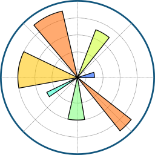</a> | **📂 檔名:** `matplotlib-icon.svg` ✨ **格式:** `Vector (SVG)` ⚖️ **大小:** `269.35KB` 📅 **更新:** `2026-03-02`  🚀 **jsDelivr Markdown:** `` 🔗 **直接連結 (Url):** <code>https://cdn.jsdelivr.net/gh/barry028/materials@main/images/iCons/Brands/matplotlib-icon.svg</code> 📥 [檢視原始檔](matplotlib-icon.svg) |
|  | **📂 檔名:** `matplotlib.svg` ✨ **格式:** `Vector (SVG)` ⚖️ **大小:** `301.10KB` 📅 **更新:** `2026-03-02`  🚀 **jsDelivr Markdown:** `` 🔗 **直接連結 (Url):** <code>https://cdn.jsdelivr.net/gh/barry028/materials@main/images/iCons/Brands/matplotlib.svg</code> 📥 [檢視原始檔](matplotlib.svg) |
|  | **📂 檔名:** `matter-icon.svg` ✨ **格式:** `Vector (SVG)` ⚖️ **大小:** `1.34KB` 📅 **更新:** `2026-03-02`  🚀 **jsDelivr Markdown:** `` 🔗 **直接連結 (Url):** <code>https://cdn.jsdelivr.net/gh/barry028/materials@main/images/iCons/Brands/matter-icon.svg</code> 📥 [檢視原始檔](matter-icon.svg) |
|  | **📂 檔名:** `matter.svg` ✨ **格式:** `Vector (SVG)` ⚖️ **大小:** `4.79KB` 📅 **更新:** `2026-03-02`  🚀 **jsDelivr Markdown:** `` 🔗 **直接連結 (Url):** <code>https://cdn.jsdelivr.net/gh/barry028/materials@main/images/iCons/Brands/matter.svg</code> 📥 [檢視原始檔](matter.svg) |
|  | **📂 檔名:** `mattermost-icon.svg` ✨ **格式:** `Vector (SVG)` ⚖️ **大小:** `2.49KB` 📅 **更新:** `2026-03-02`  🚀 **jsDelivr Markdown:** `` 🔗 **直接連結 (Url):** <code>https://cdn.jsdelivr.net/gh/barry028/materials@main/images/iCons/Brands/mattermost-icon.svg</code> 📥 [檢視原始檔](mattermost-icon.svg) |
|  | **📂 檔名:** `mattermost.svg` ✨ **格式:** `Vector (SVG)` ⚖️ **大小:** `19.13KB` 📅 **更新:** `2026-03-02`  🚀 **jsDelivr Markdown:** `` 🔗 **直接連結 (Url):** <code>https://cdn.jsdelivr.net/gh/barry028/materials@main/images/iCons/Brands/mattermost.svg</code> 📥 [檢視原始檔](mattermost.svg) |
|  | **📂 檔名:** `mautic-icon.svg` ✨ **格式:** `Vector (SVG)` ⚖️ **大小:** `1.59KB` 📅 **更新:** `2026-03-02`  🚀 **jsDelivr Markdown:** `` 🔗 **直接連結 (Url):** <code>https://cdn.jsdelivr.net/gh/barry028/materials@main/images/iCons/Brands/mautic-icon.svg</code> 📥 [檢視原始檔](mautic-icon.svg) |
|  | **📂 檔名:** `mautic.svg` ✨ **格式:** `Vector (SVG)` ⚖️ **大小:** `4.94KB` 📅 **更新:** `2026-03-02`  🚀 **jsDelivr Markdown:** `` 🔗 **直接連結 (Url):** <code>https://cdn.jsdelivr.net/gh/barry028/materials@main/images/iCons/Brands/mautic.svg</code> 📥 [檢視原始檔](mautic.svg) |
|  | **📂 檔名:** `maven.svg` ✨ **格式:** `Vector (SVG)` ⚖️ **大小:** `62.20KB` 📅 **更新:** `2026-03-02`  🚀 **jsDelivr Markdown:** `` 🔗 **直接連結 (Url):** <code>https://cdn.jsdelivr.net/gh/barry028/materials@main/images/iCons/Brands/maven.svg</code> 📥 [檢視原始檔](maven.svg) |
|  | **📂 檔名:** `mdn.svg` ✨ **格式:** `Vector (SVG)` ⚖️ **大小:** `4.61KB` 📅 **更新:** `2026-03-02`  🚀 **jsDelivr Markdown:** `` 🔗 **直接連結 (Url):** <code>https://cdn.jsdelivr.net/gh/barry028/materials@main/images/iCons/Brands/mdn.svg</code> 📥 [檢視原始檔](mdn.svg) |
| <a href="mdx.svg">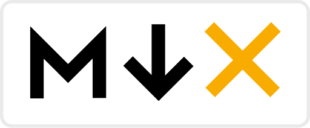</a> | **📂 檔名:** `mdx.svg` ✨ **格式:** `Vector (SVG)` ⚖️ **大小:** `2.10KB` 📅 **更新:** `2026-03-02`  🚀 **jsDelivr Markdown:** `` 🔗 **直接連結 (Url):** <code>https://cdn.jsdelivr.net/gh/barry028/materials@main/images/iCons/Brands/mdx.svg</code> 📥 [檢視原始檔](mdx.svg) |
|  | **📂 檔名:** `medium-icon.svg` ✨ **格式:** `Vector (SVG)` ⚖️ **大小:** `1.12KB` 📅 **更新:** `2026-03-02`  🚀 **jsDelivr Markdown:** `` 🔗 **直接連結 (Url):** <code>https://cdn.jsdelivr.net/gh/barry028/materials@main/images/iCons/Brands/medium-icon.svg</code> 📥 [檢視原始檔](medium-icon.svg) |
|  | **📂 檔名:** `medium.svg` ✨ **格式:** `Vector (SVG)` ⚖️ **大小:** `6.76KB` 📅 **更新:** `2026-03-02`  🚀 **jsDelivr Markdown:** `` 🔗 **直接連結 (Url):** <code>https://cdn.jsdelivr.net/gh/barry028/materials@main/images/iCons/Brands/medium.svg</code> 📥 [檢視原始檔](medium.svg) |
| <a href="medusa-icon.svg">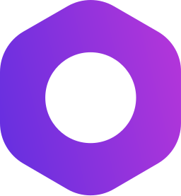</a> | **📂 檔名:** `medusa-icon.svg` ✨ **格式:** `Vector (SVG)` ⚖️ **大小:** `1.37KB` 📅 **更新:** `2026-03-02`  🚀 **jsDelivr Markdown:** `` 🔗 **直接連結 (Url):** <code>https://cdn.jsdelivr.net/gh/barry028/materials@main/images/iCons/Brands/medusa-icon.svg</code> 📥 [檢視原始檔](medusa-icon.svg) |
|  | **📂 檔名:** `medusa.svg` ✨ **格式:** `Vector (SVG)` ⚖️ **大小:** `7.77KB` 📅 **更新:** `2026-03-02`  🚀 **jsDelivr Markdown:** `` 🔗 **直接連結 (Url):** <code>https://cdn.jsdelivr.net/gh/barry028/materials@main/images/iCons/Brands/medusa.svg</code> 📥 [檢視原始檔](medusa.svg) |
|  | **📂 檔名:** `meilisearch.svg` ✨ **格式:** `Vector (SVG)` ⚖️ **大小:** `1.95KB` 📅 **更新:** `2026-03-02`  🚀 **jsDelivr Markdown:** `` 🔗 **直接連結 (Url):** <code>https://cdn.jsdelivr.net/gh/barry028/materials@main/images/iCons/Brands/meilisearch.svg</code> 📥 [檢視原始檔](meilisearch.svg) |
|  | **📂 檔名:** `memcached.svg` ✨ **格式:** `Vector (SVG)` ⚖️ **大小:** `5.89KB` 📅 **更新:** `2026-03-02`  🚀 **jsDelivr Markdown:** `` 🔗 **直接連結 (Url):** <code>https://cdn.jsdelivr.net/gh/barry028/materials@main/images/iCons/Brands/memcached.svg</code> 📥 [檢視原始檔](memcached.svg) |
| <a href="memgraph.svg">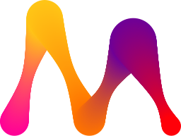</a> | **📂 檔名:** `memgraph.svg` ✨ **格式:** `Vector (SVG)` ⚖️ **大小:** `185.66KB` 📅 **更新:** `2026-03-02`  🚀 **jsDelivr Markdown:** `` 🔗 **直接連結 (Url):** <code>https://cdn.jsdelivr.net/gh/barry028/materials@main/images/iCons/Brands/memgraph.svg</code> 📥 [檢視原始檔](memgraph.svg) |
|  | **📂 檔名:** `mention.svg` ✨ **格式:** `Vector (SVG)` ⚖️ **大小:** `7.64KB` 📅 **更新:** `2026-03-02`  🚀 **jsDelivr Markdown:** `` 🔗 **直接連結 (Url):** <code>https://cdn.jsdelivr.net/gh/barry028/materials@main/images/iCons/Brands/mention.svg</code> 📥 [檢視原始檔](mention.svg) |
| <a href="mercurial.svg">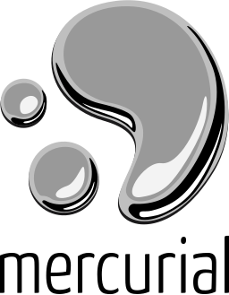</a> | **📂 檔名:** `mercurial.svg` ✨ **格式:** `Vector (SVG)` ⚖️ **大小:** `14.30KB` 📅 **更新:** `2026-03-02`  🚀 **jsDelivr Markdown:** `` 🔗 **直接連結 (Url):** <code>https://cdn.jsdelivr.net/gh/barry028/materials@main/images/iCons/Brands/mercurial.svg</code> 📥 [檢視原始檔](mercurial.svg) |
| <a href="mesos.svg">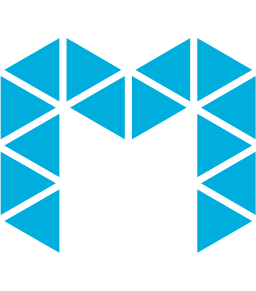</a> | **📂 檔名:** `mesos.svg` ✨ **格式:** `Vector (SVG)` ⚖️ **大小:** `3.20KB` 📅 **更新:** `2026-03-02`  🚀 **jsDelivr Markdown:** `` 🔗 **直接連結 (Url):** <code>https://cdn.jsdelivr.net/gh/barry028/materials@main/images/iCons/Brands/mesos.svg</code> 📥 [檢視原始檔](mesos.svg) |
|  | **📂 檔名:** `messenger.svg` ✨ **格式:** `Vector (SVG)` ⚖️ **大小:** `1.74KB` 📅 **更新:** `2026-03-02`  🚀 **jsDelivr Markdown:** `` 🔗 **直接連結 (Url):** <code>https://cdn.jsdelivr.net/gh/barry028/materials@main/images/iCons/Brands/messenger.svg</code> 📥 [檢視原始檔](messenger.svg) |
| <a href="metabase.svg">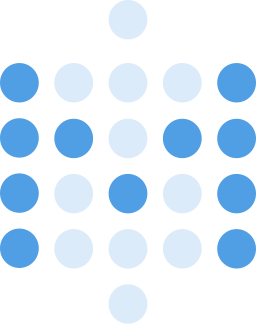</a> | **📂 檔名:** `metabase.svg` ✨ **格式:** `Vector (SVG)` ⚖️ **大小:** `2.19KB` 📅 **更新:** `2026-03-02`  🚀 **jsDelivr Markdown:** `` 🔗 **直接連結 (Url):** <code>https://cdn.jsdelivr.net/gh/barry028/materials@main/images/iCons/Brands/metabase.svg</code> 📥 [檢視原始檔](metabase.svg) |
| <a href="metamask-icon.svg">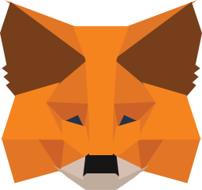</a> | **📂 檔名:** `metamask-icon.svg` ✨ **格式:** `Vector (SVG)` ⚖️ **大小:** `4.91KB` 📅 **更新:** `2026-03-02`  🚀 **jsDelivr Markdown:** `` 🔗 **直接連結 (Url):** <code>https://cdn.jsdelivr.net/gh/barry028/materials@main/images/iCons/Brands/metamask-icon.svg</code> 📥 [檢視原始檔](metamask-icon.svg) |
|  | **📂 檔名:** `metamask.svg` ✨ **格式:** `Vector (SVG)` ⚖️ **大小:** `15.50KB` 📅 **更新:** `2026-03-02`  🚀 **jsDelivr Markdown:** `` 🔗 **直接連結 (Url):** <code>https://cdn.jsdelivr.net/gh/barry028/materials@main/images/iCons/Brands/metamask.svg</code> 📥 [檢視原始檔](metamask.svg) |
| <a href="meteor-icon.svg">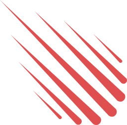</a> | **📂 檔名:** `meteor-icon.svg` ✨ **格式:** `Vector (SVG)` ⚖️ **大小:** `1.97KB` 📅 **更新:** `2026-03-02`  🚀 **jsDelivr Markdown:** `` 🔗 **直接連結 (Url):** <code>https://cdn.jsdelivr.net/gh/barry028/materials@main/images/iCons/Brands/meteor-icon.svg</code> 📥 [檢視原始檔](meteor-icon.svg) |
|  | **📂 檔名:** `meteor.svg` ✨ **格式:** `Vector (SVG)` ⚖️ **大小:** `3.91KB` 📅 **更新:** `2026-03-02`  🚀 **jsDelivr Markdown:** `` 🔗 **直接連結 (Url):** <code>https://cdn.jsdelivr.net/gh/barry028/materials@main/images/iCons/Brands/meteor.svg</code> 📥 [檢視原始檔](meteor.svg) |
| <a href="micro-icon.svg">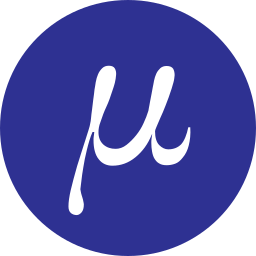</a> | **📂 檔名:** `micro-icon.svg` ✨ **格式:** `Vector (SVG)` ⚖️ **大小:** `5.38KB` 📅 **更新:** `2026-03-02`  🚀 **jsDelivr Markdown:** `` 🔗 **直接連結 (Url):** <code>https://cdn.jsdelivr.net/gh/barry028/materials@main/images/iCons/Brands/micro-icon.svg</code> 📥 [檢視原始檔](micro-icon.svg) |
|  | **📂 檔名:** `micro-python.svg` ✨ **格式:** `Vector (SVG)` ⚖️ **大小:** `647.00B` 📅 **更新:** `2026-03-02`  🚀 **jsDelivr Markdown:** `` 🔗 **直接連結 (Url):** <code>https://cdn.jsdelivr.net/gh/barry028/materials@main/images/iCons/Brands/micro-python.svg</code> 📥 [檢視原始檔](micro-python.svg) |
|  | **📂 檔名:** `micro.svg` ✨ **格式:** `Vector (SVG)` ⚖️ **大小:** `18.76KB` 📅 **更新:** `2026-03-02`  🚀 **jsDelivr Markdown:** `` 🔗 **直接連結 (Url):** <code>https://cdn.jsdelivr.net/gh/barry028/materials@main/images/iCons/Brands/micro.svg</code> 📥 [檢視原始檔](micro.svg) |
| <a href="microcosm.svg">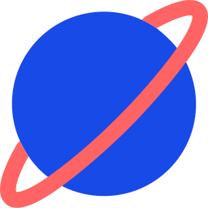</a> | **📂 檔名:** `microcosm.svg` ✨ **格式:** `Vector (SVG)` ⚖️ **大小:** `2.45KB` 📅 **更新:** `2026-03-02`  🚀 **jsDelivr Markdown:** `` 🔗 **直接連結 (Url):** <code>https://cdn.jsdelivr.net/gh/barry028/materials@main/images/iCons/Brands/microcosm.svg</code> 📥 [檢視原始檔](microcosm.svg) |
|  | **📂 檔名:** `micron-icon.svg` ✨ **格式:** `Vector (SVG)` ⚖️ **大小:** `3.52KB` 📅 **更新:** `2026-03-02`  🚀 **jsDelivr Markdown:** `` 🔗 **直接連結 (Url):** <code>https://cdn.jsdelivr.net/gh/barry028/materials@main/images/iCons/Brands/micron-icon.svg</code> 📥 [檢視原始檔](micron-icon.svg) |
|  | **📂 檔名:** `micron.svg` ✨ **格式:** `Vector (SVG)` ⚖️ **大小:** `5.92KB` 📅 **更新:** `2026-03-02`  🚀 **jsDelivr Markdown:** `` 🔗 **直接連結 (Url):** <code>https://cdn.jsdelivr.net/gh/barry028/materials@main/images/iCons/Brands/micron.svg</code> 📥 [檢視原始檔](micron.svg) |
|  | **📂 檔名:** `microsoft-azure.svg` ✨ **格式:** `Vector (SVG)` ⚖️ **大小:** `3.33KB` 📅 **更新:** `2026-03-02`  🚀 **jsDelivr Markdown:** `` 🔗 **直接連結 (Url):** <code>https://cdn.jsdelivr.net/gh/barry028/materials@main/images/iCons/Brands/microsoft-azure.svg</code> 📥 [檢視原始檔](microsoft-azure.svg) |
| <a href="microsoft-edge.svg">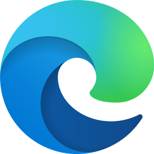</a> | **📂 檔名:** `microsoft-edge.svg` ✨ **格式:** `Vector (SVG)` ⚖️ **大小:** `4.68KB` 📅 **更新:** `2026-03-02`  🚀 **jsDelivr Markdown:** `` 🔗 **直接連結 (Url):** <code>https://cdn.jsdelivr.net/gh/barry028/materials@main/images/iCons/Brands/microsoft-edge.svg</code> 📥 [檢視原始檔](microsoft-edge.svg) |
|  | **📂 檔名:** `microsoft-icon.svg` ✨ **格式:** `Vector (SVG)` ⚖️ **大小:** `689.00B` 📅 **更新:** `2026-03-02`  🚀 **jsDelivr Markdown:** `` 🔗 **直接連結 (Url):** <code>https://cdn.jsdelivr.net/gh/barry028/materials@main/images/iCons/Brands/microsoft-icon.svg</code> 📥 [檢視原始檔](microsoft-icon.svg) |
|  | **📂 檔名:** `microsoft-onedrive.svg` ✨ **格式:** `Vector (SVG)` ⚖️ **大小:** `1.66KB` 📅 **更新:** `2026-03-02`  🚀 **jsDelivr Markdown:** `` 🔗 **直接連結 (Url):** <code>https://cdn.jsdelivr.net/gh/barry028/materials@main/images/iCons/Brands/microsoft-onedrive.svg</code> 📥 [檢視原始檔](microsoft-onedrive.svg) |
|  | **📂 檔名:** `microsoft-power-bi.svg` ✨ **格式:** `Vector (SVG)` ⚖️ **大小:** `2.84KB` 📅 **更新:** `2026-03-02`  🚀 **jsDelivr Markdown:** `` 🔗 **直接連結 (Url):** <code>https://cdn.jsdelivr.net/gh/barry028/materials@main/images/iCons/Brands/microsoft-power-bi.svg</code> 📥 [檢視原始檔](microsoft-power-bi.svg) |
|  | **📂 檔名:** `microsoft-teams.svg` ✨ **格式:** `Vector (SVG)` ⚖️ **大小:** `5.45KB` 📅 **更新:** `2026-03-02`  🚀 **jsDelivr Markdown:** `` 🔗 **直接連結 (Url):** <code>https://cdn.jsdelivr.net/gh/barry028/materials@main/images/iCons/Brands/microsoft-teams.svg</code> 📥 [檢視原始檔](microsoft-teams.svg) |
|  | **📂 檔名:** `microsoft-windows-icon.svg` ✨ **格式:** `Vector (SVG)` ⚖️ **大小:** `674.00B` 📅 **更新:** `2026-03-02`  🚀 **jsDelivr Markdown:** `` 🔗 **直接連結 (Url):** <code>https://cdn.jsdelivr.net/gh/barry028/materials@main/images/iCons/Brands/microsoft-windows-icon.svg</code> 📥 [檢視原始檔](microsoft-windows-icon.svg) |
|  | **📂 檔名:** `microsoft-windows.svg` ✨ **格式:** `Vector (SVG)` ⚖️ **大小:** `5.12KB` 📅 **更新:** `2026-03-02`  🚀 **jsDelivr Markdown:** `` 🔗 **直接連結 (Url):** <code>https://cdn.jsdelivr.net/gh/barry028/materials@main/images/iCons/Brands/microsoft-windows.svg</code> 📥 [檢視原始檔](microsoft-windows.svg) |
|  | **📂 檔名:** `microsoft.svg` ✨ **格式:** `Vector (SVG)` ⚖️ **大小:** `9.34KB` 📅 **更新:** `2026-03-02`  🚀 **jsDelivr Markdown:** `` 🔗 **直接連結 (Url):** <code>https://cdn.jsdelivr.net/gh/barry028/materials@main/images/iCons/Brands/microsoft.svg</code> 📥 [檢視原始檔](microsoft.svg) |
|  | **📂 檔名:** `mida-icon.svg` ✨ **格式:** `Vector (SVG)` ⚖️ **大小:** `3.60KB` 📅 **更新:** `2026-03-02`  🚀 **jsDelivr Markdown:** `` 🔗 **直接連結 (Url):** <code>https://cdn.jsdelivr.net/gh/barry028/materials@main/images/iCons/Brands/mida-icon.svg</code> 📥 [檢視原始檔](mida-icon.svg) |
|  | **📂 檔名:** `mida.svg` ✨ **格式:** `Vector (SVG)` ⚖️ **大小:** `5.43KB` 📅 **更新:** `2026-03-02`  🚀 **jsDelivr Markdown:** `` 🔗 **直接連結 (Url):** <code>https://cdn.jsdelivr.net/gh/barry028/materials@main/images/iCons/Brands/mida.svg</code> 📥 [檢視原始檔](mida.svg) |
|  | **📂 檔名:** `middleman.svg` ✨ **格式:** `Vector (SVG)` ⚖️ **大小:** `1.58KB` 📅 **更新:** `2026-03-02`  🚀 **jsDelivr Markdown:** `` 🔗 **直接連結 (Url):** <code>https://cdn.jsdelivr.net/gh/barry028/materials@main/images/iCons/Brands/middleman.svg</code> 📥 [檢視原始檔](middleman.svg) |
|  | **📂 檔名:** `milligram.svg` ✨ **格式:** `Vector (SVG)` ⚖️ **大小:** `1.36KB` 📅 **更新:** `2026-03-02`  🚀 **jsDelivr Markdown:** `` 🔗 **直接連結 (Url):** <code>https://cdn.jsdelivr.net/gh/barry028/materials@main/images/iCons/Brands/milligram.svg</code> 📥 [檢視原始檔](milligram.svg) |
| <a href="mindsdb-icon.svg">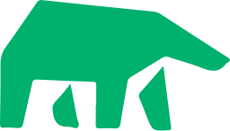</a> | **📂 檔名:** `mindsdb-icon.svg` ✨ **格式:** `Vector (SVG)` ⚖️ **大小:** `4.33KB` 📅 **更新:** `2026-03-02`  🚀 **jsDelivr Markdown:** `` 🔗 **直接連結 (Url):** <code>https://cdn.jsdelivr.net/gh/barry028/materials@main/images/iCons/Brands/mindsdb-icon.svg</code> 📥 [檢視原始檔](mindsdb-icon.svg) |
|  | **📂 檔名:** `mindsdb.svg` ✨ **格式:** `Vector (SVG)` ⚖️ **大小:** `13.19KB` 📅 **更新:** `2026-03-02`  🚀 **jsDelivr Markdown:** `` 🔗 **直接連結 (Url):** <code>https://cdn.jsdelivr.net/gh/barry028/materials@main/images/iCons/Brands/mindsdb.svg</code> 📥 [檢視原始檔](mindsdb.svg) |
|  | **📂 檔名:** `mint-lang.svg` ✨ **格式:** `Vector (SVG)` ⚖️ **大小:** `8.64KB` 📅 **更新:** `2026-03-02`  🚀 **jsDelivr Markdown:** `` 🔗 **直接連結 (Url):** <code>https://cdn.jsdelivr.net/gh/barry028/materials@main/images/iCons/Brands/mint-lang.svg</code> 📥 [檢視原始檔](mint-lang.svg) |
|  | **📂 檔名:** `mio.svg` ✨ **格式:** `Vector (SVG)` ⚖️ **大小:** `5.93KB` 📅 **更新:** `2026-03-02`  🚀 **jsDelivr Markdown:** `` 🔗 **直接連結 (Url):** <code>https://cdn.jsdelivr.net/gh/barry028/materials@main/images/iCons/Brands/mio.svg</code> 📥 [檢視原始檔](mio.svg) |
|  | **📂 檔名:** `mist.svg` ✨ **格式:** `Vector (SVG)` ⚖️ **大小:** `2.72KB` 📅 **更新:** `2026-03-02`  🚀 **jsDelivr Markdown:** `` 🔗 **直接連結 (Url):** <code>https://cdn.jsdelivr.net/gh/barry028/materials@main/images/iCons/Brands/mist.svg</code> 📥 [檢視原始檔](mist.svg) |
|  | **📂 檔名:** `mithril.svg` ✨ **格式:** `Vector (SVG)` ⚖️ **大小:** `3.08KB` 📅 **更新:** `2026-03-02`  🚀 **jsDelivr Markdown:** `` 🔗 **直接連結 (Url):** <code>https://cdn.jsdelivr.net/gh/barry028/materials@main/images/iCons/Brands/mithril.svg</code> 📥 [檢視原始檔](mithril.svg) |
| <a href="mixmax.svg">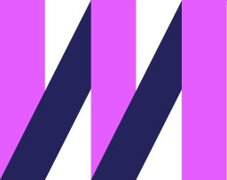</a> | **📂 檔名:** `mixmax.svg` ✨ **格式:** `Vector (SVG)` ⚖️ **大小:** `836.00B` 📅 **更新:** `2026-03-02`  🚀 **jsDelivr Markdown:** `` 🔗 **直接連結 (Url):** <code>https://cdn.jsdelivr.net/gh/barry028/materials@main/images/iCons/Brands/mixmax.svg</code> 📥 [檢視原始檔](mixmax.svg) |
|  | **📂 檔名:** `mixpanel.svg` ✨ **格式:** `Vector (SVG)` ⚖️ **大小:** `7.29KB` 📅 **更新:** `2026-03-02`  🚀 **jsDelivr Markdown:** `` 🔗 **直接連結 (Url):** <code>https://cdn.jsdelivr.net/gh/barry028/materials@main/images/iCons/Brands/mixpanel.svg</code> 📥 [檢視原始檔](mixpanel.svg) |
|  | **📂 檔名:** `mlab.svg` ✨ **格式:** `Vector (SVG)` ⚖️ **大小:** `8.58KB` 📅 **更新:** `2026-03-02`  🚀 **jsDelivr Markdown:** `` 🔗 **直接連結 (Url):** <code>https://cdn.jsdelivr.net/gh/barry028/materials@main/images/iCons/Brands/mlab.svg</code> 📥 [檢視原始檔](mlab.svg) |
|  | **📂 檔名:** `mobx.svg` ✨ **格式:** `Vector (SVG)` ⚖️ **大小:** `2.07KB` 📅 **更新:** `2026-03-02`  🚀 **jsDelivr Markdown:** `` 🔗 **直接連結 (Url):** <code>https://cdn.jsdelivr.net/gh/barry028/materials@main/images/iCons/Brands/mobx.svg</code> 📥 [檢視原始檔](mobx.svg) |
|  | **📂 檔名:** `mocha.svg` ✨ **格式:** `Vector (SVG)` ⚖️ **大小:** `7.69KB` 📅 **更新:** `2026-03-02`  🚀 **jsDelivr Markdown:** `` 🔗 **直接連結 (Url):** <code>https://cdn.jsdelivr.net/gh/barry028/materials@main/images/iCons/Brands/mocha.svg</code> 📥 [檢視原始檔](mocha.svg) |
| <a href="mockflow-icon.svg">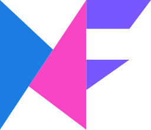</a> | **📂 檔名:** `mockflow-icon.svg` ✨ **格式:** `Vector (SVG)` ⚖️ **大小:** `838.00B` 📅 **更新:** `2026-03-02`  🚀 **jsDelivr Markdown:** `` 🔗 **直接連結 (Url):** <code>https://cdn.jsdelivr.net/gh/barry028/materials@main/images/iCons/Brands/mockflow-icon.svg</code> 📥 [檢視原始檔](mockflow-icon.svg) |
|  | **📂 檔名:** `mockflow.svg` ✨ **格式:** `Vector (SVG)` ⚖️ **大小:** `6.40KB` 📅 **更新:** `2026-03-02`  🚀 **jsDelivr Markdown:** `` 🔗 **直接連結 (Url):** <code>https://cdn.jsdelivr.net/gh/barry028/materials@main/images/iCons/Brands/mockflow.svg</code> 📥 [檢視原始檔](mockflow.svg) |
|  | **📂 檔名:** `modernizr.svg` ✨ **格式:** `Vector (SVG)` ⚖️ **大小:** `524.00B` 📅 **更新:** `2026-03-02`  🚀 **jsDelivr Markdown:** `` 🔗 **直接連結 (Url):** <code>https://cdn.jsdelivr.net/gh/barry028/materials@main/images/iCons/Brands/modernizr.svg</code> 📥 [檢視原始檔](modernizr.svg) |
|  | **📂 檔名:** `modx-icon.svg` ✨ **格式:** `Vector (SVG)` ⚖️ **大小:** `938.00B` 📅 **更新:** `2026-03-02`  🚀 **jsDelivr Markdown:** `` 🔗 **直接連結 (Url):** <code>https://cdn.jsdelivr.net/gh/barry028/materials@main/images/iCons/Brands/modx-icon.svg</code> 📥 [檢視原始檔](modx-icon.svg) |
|  | **📂 檔名:** `modx.svg` ✨ **格式:** `Vector (SVG)` ⚖️ **大小:** `2.56KB` 📅 **更新:** `2026-03-02`  🚀 **jsDelivr Markdown:** `` 🔗 **直接連結 (Url):** <code>https://cdn.jsdelivr.net/gh/barry028/materials@main/images/iCons/Brands/modx.svg</code> 📥 [檢視原始檔](modx.svg) |
| <a href="momentjs.svg">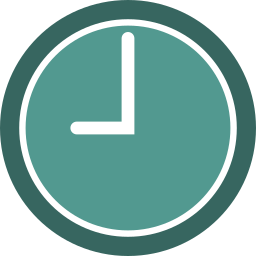</a> | **📂 檔名:** `momentjs.svg` ✨ **格式:** `Vector (SVG)` ⚖️ **大小:** `1.13KB` 📅 **更新:** `2026-03-02`  🚀 **jsDelivr Markdown:** `` 🔗 **直接連結 (Url):** <code>https://cdn.jsdelivr.net/gh/barry028/materials@main/images/iCons/Brands/momentjs.svg</code> 📥 [檢視原始檔](momentjs.svg) |
|  | **📂 檔名:** `monday-icon.svg` ✨ **格式:** `Vector (SVG)` ⚖️ **大小:** `1.37KB` 📅 **更新:** `2026-03-02`  🚀 **jsDelivr Markdown:** `` 🔗 **直接連結 (Url):** <code>https://cdn.jsdelivr.net/gh/barry028/materials@main/images/iCons/Brands/monday-icon.svg</code> 📥 [檢視原始檔](monday-icon.svg) |
|  | **📂 檔名:** `monday.svg` ✨ **格式:** `Vector (SVG)` ⚖️ **大小:** `7.79KB` 📅 **更新:** `2026-03-02`  🚀 **jsDelivr Markdown:** `` 🔗 **直接連結 (Url):** <code>https://cdn.jsdelivr.net/gh/barry028/materials@main/images/iCons/Brands/monday.svg</code> 📥 [檢視原始檔](monday.svg) |
|  | **📂 檔名:** `monero.svg` ✨ **格式:** `Vector (SVG)` ⚖️ **大小:** `1022.00B` 📅 **更新:** `2026-03-02`  🚀 **jsDelivr Markdown:** `` 🔗 **直接連結 (Url):** <code>https://cdn.jsdelivr.net/gh/barry028/materials@main/images/iCons/Brands/monero.svg</code> 📥 [檢視原始檔](monero.svg) |
| <a href="mongodb-icon.svg">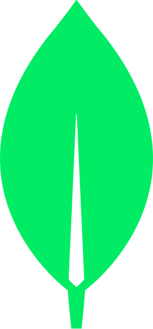</a> | **📂 檔名:** `mongodb-icon.svg` ✨ **格式:** `Vector (SVG)` ⚖️ **大小:** `1.15KB` 📅 **更新:** `2026-03-02`  🚀 **jsDelivr Markdown:** `` 🔗 **直接連結 (Url):** <code>https://cdn.jsdelivr.net/gh/barry028/materials@main/images/iCons/Brands/mongodb-icon.svg</code> 📥 [檢視原始檔](mongodb-icon.svg) |
|  | **📂 檔名:** `mongodb.svg` ✨ **格式:** `Vector (SVG)` ⚖️ **大小:** `13.85KB` 📅 **更新:** `2026-03-02`  🚀 **jsDelivr Markdown:** `` 🔗 **直接連結 (Url):** <code>https://cdn.jsdelivr.net/gh/barry028/materials@main/images/iCons/Brands/mongodb.svg</code> 📥 [檢視原始檔](mongodb.svg) |
|  | **📂 檔名:** `mono.svg` ✨ **格式:** `Vector (SVG)` ⚖️ **大小:** `9.25KB` 📅 **更新:** `2026-03-02`  🚀 **jsDelivr Markdown:** `` 🔗 **直接連結 (Url):** <code>https://cdn.jsdelivr.net/gh/barry028/materials@main/images/iCons/Brands/mono.svg</code> 📥 [檢視原始檔](mono.svg) |
| <a href="moon.svg">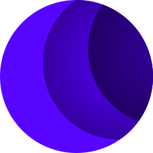</a> | **📂 檔名:** `moon.svg` ✨ **格式:** `Vector (SVG)` ⚖️ **大小:** `1.41KB` 📅 **更新:** `2026-03-02`  🚀 **jsDelivr Markdown:** `` 🔗 **直接連結 (Url):** <code>https://cdn.jsdelivr.net/gh/barry028/materials@main/images/iCons/Brands/moon.svg</code> 📥 [檢視原始檔](moon.svg) |
|  | **📂 檔名:** `mootools.svg` ✨ **格式:** `Vector (SVG)` ⚖️ **大小:** `7.61KB` 📅 **更新:** `2026-03-02`  🚀 **jsDelivr Markdown:** `` 🔗 **直接連結 (Url):** <code>https://cdn.jsdelivr.net/gh/barry028/materials@main/images/iCons/Brands/mootools.svg</code> 📥 [檢視原始檔](mootools.svg) |
| <a href="morpheus-icon.svg">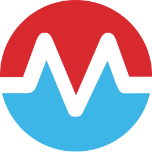</a> | **📂 檔名:** `morpheus-icon.svg` ✨ **格式:** `Vector (SVG)` ⚖️ **大小:** `1.77KB` 📅 **更新:** `2026-03-02`  🚀 **jsDelivr Markdown:** `` 🔗 **直接連結 (Url):** <code>https://cdn.jsdelivr.net/gh/barry028/materials@main/images/iCons/Brands/morpheus-icon.svg</code> 📥 [檢視原始檔](morpheus-icon.svg) |
|  | **📂 檔名:** `morpheus.svg` ✨ **格式:** `Vector (SVG)` ⚖️ **大小:** `6.60KB` 📅 **更新:** `2026-03-02`  🚀 **jsDelivr Markdown:** `` 🔗 **直接連結 (Url):** <code>https://cdn.jsdelivr.net/gh/barry028/materials@main/images/iCons/Brands/morpheus.svg</code> 📥 [檢視原始檔](morpheus.svg) |
|  | **📂 檔名:** `mozilla.svg` ✨ **格式:** `Vector (SVG)` ⚖️ **大小:** `4.01KB` 📅 **更新:** `2026-03-02`  🚀 **jsDelivr Markdown:** `` 🔗 **直接連結 (Url):** <code>https://cdn.jsdelivr.net/gh/barry028/materials@main/images/iCons/Brands/mozilla.svg</code> 📥 [檢視原始檔](mozilla.svg) |
|  | **📂 檔名:** `mparticle-icon.svg` ✨ **格式:** `Vector (SVG)` ⚖️ **大小:** `841.00B` 📅 **更新:** `2026-03-02`  🚀 **jsDelivr Markdown:** `` 🔗 **直接連結 (Url):** <code>https://cdn.jsdelivr.net/gh/barry028/materials@main/images/iCons/Brands/mparticle-icon.svg</code> 📥 [檢視原始檔](mparticle-icon.svg) |
|  | **📂 檔名:** `mparticle.svg` ✨ **格式:** `Vector (SVG)` ⚖️ **大小:** `5.91KB` 📅 **更新:** `2026-03-02`  🚀 **jsDelivr Markdown:** `` 🔗 **直接連結 (Url):** <code>https://cdn.jsdelivr.net/gh/barry028/materials@main/images/iCons/Brands/mparticle.svg</code> 📥 [檢視原始檔](mparticle.svg) |
| <a href="mps-icon.svg">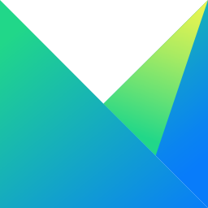</a> | **📂 檔名:** `mps-icon.svg` ✨ **格式:** `Vector (SVG)` ⚖️ **大小:** `1.76KB` 📅 **更新:** `2026-03-02`  🚀 **jsDelivr Markdown:** `` 🔗 **直接連結 (Url):** <code>https://cdn.jsdelivr.net/gh/barry028/materials@main/images/iCons/Brands/mps-icon.svg</code> 📥 [檢視原始檔](mps-icon.svg) |
|  | **📂 檔名:** `mps.svg` ✨ **格式:** `Vector (SVG)` ⚖️ **大小:** `6.14KB` 📅 **更新:** `2026-03-02`  🚀 **jsDelivr Markdown:** `` 🔗 **直接連結 (Url):** <code>https://cdn.jsdelivr.net/gh/barry028/materials@main/images/iCons/Brands/mps.svg</code> 📥 [檢視原始檔](mps.svg) |
|  | **📂 檔名:** `msw-icon.svg` ✨ **格式:** `Vector (SVG)` ⚖️ **大小:** `2.32KB` 📅 **更新:** `2026-03-02`  🚀 **jsDelivr Markdown:** `` 🔗 **直接連結 (Url):** <code>https://cdn.jsdelivr.net/gh/barry028/materials@main/images/iCons/Brands/msw-icon.svg</code> 📥 [檢視原始檔](msw-icon.svg) |
|  | **📂 檔名:** `msw.svg` ✨ **格式:** `Vector (SVG)` ⚖️ **大小:** `2.70KB` 📅 **更新:** `2026-03-02`  🚀 **jsDelivr Markdown:** `` 🔗 **直接連結 (Url):** <code>https://cdn.jsdelivr.net/gh/barry028/materials@main/images/iCons/Brands/msw.svg</code> 📥 [檢視原始檔](msw.svg) |
|  | **📂 檔名:** `multipass.svg` ✨ **格式:** `Vector (SVG)` ⚖️ **大小:** `2.65KB` 📅 **更新:** `2026-03-02`  🚀 **jsDelivr Markdown:** `` 🔗 **直接連結 (Url):** <code>https://cdn.jsdelivr.net/gh/barry028/materials@main/images/iCons/Brands/multipass.svg</code> 📥 [檢視原始檔](multipass.svg) |
|  | **📂 檔名:** `mysql-icon.svg` ✨ **格式:** `Vector (SVG)` ⚖️ **大小:** `5.89KB` 📅 **更新:** `2026-03-02`  🚀 **jsDelivr Markdown:** `` 🔗 **直接連結 (Url):** <code>https://cdn.jsdelivr.net/gh/barry028/materials@main/images/iCons/Brands/mysql-icon.svg</code> 📥 [檢視原始檔](mysql-icon.svg) |
|  | **📂 檔名:** `mysql.svg` ✨ **格式:** `Vector (SVG)` ⚖️ **大小:** `11.11KB` 📅 **更新:** `2026-03-02`  🚀 **jsDelivr Markdown:** `` 🔗 **直接連結 (Url):** <code>https://cdn.jsdelivr.net/gh/barry028/materials@main/images/iCons/Brands/mysql.svg</code> 📥 [檢視原始檔](mysql.svg) |
|  | **📂 檔名:** `naiveui.svg` ✨ **格式:** `Vector (SVG)` ⚖️ **大小:** `4.14KB` 📅 **更新:** `2026-03-02`  🚀 **jsDelivr Markdown:** `` 🔗 **直接連結 (Url):** <code>https://cdn.jsdelivr.net/gh/barry028/materials@main/images/iCons/Brands/naiveui.svg</code> 📥 [檢視原始檔](naiveui.svg) |
|  | **📂 檔名:** `namecheap.svg` ✨ **格式:** `Vector (SVG)` ⚖️ **大小:** `3.47KB` 📅 **更新:** `2026-03-02`  🚀 **jsDelivr Markdown:** `` 🔗 **直接連結 (Url):** <code>https://cdn.jsdelivr.net/gh/barry028/materials@main/images/iCons/Brands/namecheap.svg</code> 📥 [檢視原始檔](namecheap.svg) |
| <a href="nanonets.svg">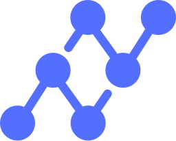</a> | **📂 檔名:** `nanonets.svg` ✨ **格式:** `Vector (SVG)` ⚖️ **大小:** `2.69KB` 📅 **更新:** `2026-03-02`  🚀 **jsDelivr Markdown:** `` 🔗 **直接連結 (Url):** <code>https://cdn.jsdelivr.net/gh/barry028/materials@main/images/iCons/Brands/nanonets.svg</code> 📥 [檢視原始檔](nanonets.svg) |
| <a href="nasm.svg">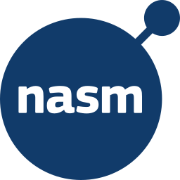</a> | **📂 檔名:** `nasm.svg` ✨ **格式:** `Vector (SVG)` ⚖️ **大小:** `11.86KB` 📅 **更新:** `2026-03-02`  🚀 **jsDelivr Markdown:** `` 🔗 **直接連結 (Url):** <code>https://cdn.jsdelivr.net/gh/barry028/materials@main/images/iCons/Brands/nasm.svg</code> 📥 [檢視原始檔](nasm.svg) |
|  | **📂 檔名:** `nativescript.svg` ✨ **格式:** `Vector (SVG)` ⚖️ **大小:** `2.29KB` 📅 **更新:** `2026-03-02`  🚀 **jsDelivr Markdown:** `` 🔗 **直接連結 (Url):** <code>https://cdn.jsdelivr.net/gh/barry028/materials@main/images/iCons/Brands/nativescript.svg</code> 📥 [檢視原始檔](nativescript.svg) |
|  | **📂 檔名:** `nats-icon.svg` ✨ **格式:** `Vector (SVG)` ⚖️ **大小:** `1.02KB` 📅 **更新:** `2026-03-02`  🚀 **jsDelivr Markdown:** `` 🔗 **直接連結 (Url):** <code>https://cdn.jsdelivr.net/gh/barry028/materials@main/images/iCons/Brands/nats-icon.svg</code> 📥 [檢視原始檔](nats-icon.svg) |
|  | **📂 檔名:** `nats.svg` ✨ **格式:** `Vector (SVG)` ⚖️ **大小:** `3.08KB` 📅 **更新:** `2026-03-02`  🚀 **jsDelivr Markdown:** `` 🔗 **直接連結 (Url):** <code>https://cdn.jsdelivr.net/gh/barry028/materials@main/images/iCons/Brands/nats.svg</code> 📥 [檢視原始檔](nats.svg) |
|  | **📂 檔名:** `neat.svg` ✨ **格式:** `Vector (SVG)` ⚖️ **大小:** `2.13KB` 📅 **更新:** `2026-03-02`  🚀 **jsDelivr Markdown:** `` 🔗 **直接連結 (Url):** <code>https://cdn.jsdelivr.net/gh/barry028/materials@main/images/iCons/Brands/neat.svg</code> 📥 [檢視原始檔](neat.svg) |
|  | **📂 檔名:** `neo4j.svg` ✨ **格式:** `Vector (SVG)` ⚖️ **大小:** `5.22KB` 📅 **更新:** `2026-03-02`  🚀 **jsDelivr Markdown:** `` 🔗 **直接連結 (Url):** <code>https://cdn.jsdelivr.net/gh/barry028/materials@main/images/iCons/Brands/neo4j.svg</code> 📥 [檢視原始檔](neo4j.svg) |
|  | **📂 檔名:** `neon-icon.svg` ✨ **格式:** `Vector (SVG)` ⚖️ **大小:** `4.07KB` 📅 **更新:** `2026-03-02`  🚀 **jsDelivr Markdown:** `` 🔗 **直接連結 (Url):** <code>https://cdn.jsdelivr.net/gh/barry028/materials@main/images/iCons/Brands/neon-icon.svg</code> 📥 [檢視原始檔](neon-icon.svg) |
|  | **📂 檔名:** `neon.svg` ✨ **格式:** `Vector (SVG)` ⚖️ **大小:** `5.67KB` 📅 **更新:** `2026-03-02`  🚀 **jsDelivr Markdown:** `` 🔗 **直接連結 (Url):** <code>https://cdn.jsdelivr.net/gh/barry028/materials@main/images/iCons/Brands/neon.svg</code> 📥 [檢視原始檔](neon.svg) |
|  | **📂 檔名:** `neovim.svg` ✨ **格式:** `Vector (SVG)` ⚖️ **大小:** `10.55KB` 📅 **更新:** `2026-03-02`  🚀 **jsDelivr Markdown:** `` 🔗 **直接連結 (Url):** <code>https://cdn.jsdelivr.net/gh/barry028/materials@main/images/iCons/Brands/neovim.svg</code> 📥 [檢視原始檔](neovim.svg) |
|  | **📂 檔名:** `nestjs.svg` ✨ **格式:** `Vector (SVG)` ⚖️ **大小:** `18.07KB` 📅 **更新:** `2026-03-02`  🚀 **jsDelivr Markdown:** `` 🔗 **直接連結 (Url):** <code>https://cdn.jsdelivr.net/gh/barry028/materials@main/images/iCons/Brands/nestjs.svg</code> 📥 [檢視原始檔](nestjs.svg) |
| <a href="netbeans.svg">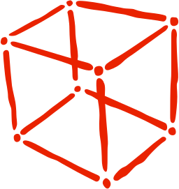</a> | **📂 檔名:** `netbeans.svg` ✨ **格式:** `Vector (SVG)` ⚖️ **大小:** `9.76KB` 📅 **更新:** `2026-03-02`  🚀 **jsDelivr Markdown:** `` 🔗 **直接連結 (Url):** <code>https://cdn.jsdelivr.net/gh/barry028/materials@main/images/iCons/Brands/netbeans.svg</code> 📥 [檢視原始檔](netbeans.svg) |
|  | **📂 檔名:** `netflix-icon.svg` ✨ **格式:** `Vector (SVG)` ⚖️ **大小:** `6.61KB` 📅 **更新:** `2026-03-02`  🚀 **jsDelivr Markdown:** `` 🔗 **直接連結 (Url):** <code>https://cdn.jsdelivr.net/gh/barry028/materials@main/images/iCons/Brands/netflix-icon.svg</code> 📥 [檢視原始檔](netflix-icon.svg) |
|  | **📂 檔名:** `netflix.svg` ✨ **格式:** `Vector (SVG)` ⚖️ **大小:** `2.38KB` 📅 **更新:** `2026-03-02`  🚀 **jsDelivr Markdown:** `` 🔗 **直接連結 (Url):** <code>https://cdn.jsdelivr.net/gh/barry028/materials@main/images/iCons/Brands/netflix.svg</code> 📥 [檢視原始檔](netflix.svg) |
| <a href="netlify-icon.svg">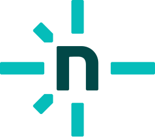</a> | **📂 檔名:** `netlify-icon.svg` ✨ **格式:** `Vector (SVG)` ⚖️ **大小:** `2.09KB` 📅 **更新:** `2026-03-02`  🚀 **jsDelivr Markdown:** `` 🔗 **直接連結 (Url):** <code>https://cdn.jsdelivr.net/gh/barry028/materials@main/images/iCons/Brands/netlify-icon.svg</code> 📥 [檢視原始檔](netlify-icon.svg) |
| <a href="netlify.svg">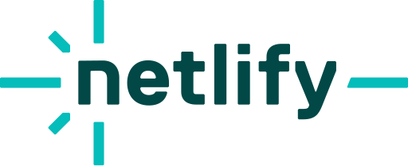</a> | **📂 檔名:** `netlify.svg` ✨ **格式:** `Vector (SVG)` ⚖️ **大小:** `4.28KB` 📅 **更新:** `2026-03-02`  🚀 **jsDelivr Markdown:** `` 🔗 **直接連結 (Url):** <code>https://cdn.jsdelivr.net/gh/barry028/materials@main/images/iCons/Brands/netlify.svg</code> 📥 [檢視原始檔](netlify.svg) |
| <a href="neverinstall-icon.svg">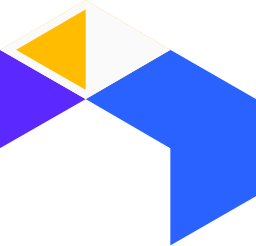</a> | **📂 檔名:** `neverinstall-icon.svg` ✨ **格式:** `Vector (SVG)` ⚖️ **大小:** `986.00B` 📅 **更新:** `2026-03-02`  🚀 **jsDelivr Markdown:** `` 🔗 **直接連結 (Url):** <code>https://cdn.jsdelivr.net/gh/barry028/materials@main/images/iCons/Brands/neverinstall-icon.svg</code> 📥 [檢視原始檔](neverinstall-icon.svg) |
|  | **📂 檔名:** `neverinstall.svg` ✨ **格式:** `Vector (SVG)` ⚖️ **大小:** `10.88KB` 📅 **更新:** `2026-03-02`  🚀 **jsDelivr Markdown:** `` 🔗 **直接連結 (Url):** <code>https://cdn.jsdelivr.net/gh/barry028/materials@main/images/iCons/Brands/neverinstall.svg</code> 📥 [檢視原始檔](neverinstall.svg) |
| <a href="new-relic-icon.svg">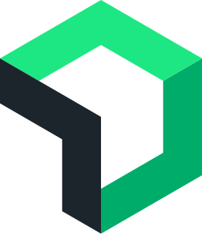</a> | **📂 檔名:** `new-relic-icon.svg` ✨ **格式:** `Vector (SVG)` ⚖️ **大小:** `735.00B` 📅 **更新:** `2026-03-02`  🚀 **jsDelivr Markdown:** `` 🔗 **直接連結 (Url):** <code>https://cdn.jsdelivr.net/gh/barry028/materials@main/images/iCons/Brands/new-relic-icon.svg</code> 📥 [檢視原始檔](new-relic-icon.svg) |
|  | **📂 檔名:** `new-relic.svg` ✨ **格式:** `Vector (SVG)` ⚖️ **大小:** `8.17KB` 📅 **更新:** `2026-03-02`  🚀 **jsDelivr Markdown:** `` 🔗 **直接連結 (Url):** <code>https://cdn.jsdelivr.net/gh/barry028/materials@main/images/iCons/Brands/new-relic.svg</code> 📥 [檢視原始檔](new-relic.svg) |
|  | **📂 檔名:** `nextjs-icon.svg` ✨ **格式:** `Vector (SVG)` ⚖️ **大小:** `1.47KB` 📅 **更新:** `2026-03-02`  🚀 **jsDelivr Markdown:** `` 🔗 **直接連結 (Url):** <code>https://cdn.jsdelivr.net/gh/barry028/materials@main/images/iCons/Brands/nextjs-icon.svg</code> 📥 [檢視原始檔](nextjs-icon.svg) |
|  | **📂 檔名:** `nextjs.svg` ✨ **格式:** `Vector (SVG)` ⚖️ **大小:** `5.14KB` 📅 **更新:** `2026-03-02`  🚀 **jsDelivr Markdown:** `` 🔗 **直接連結 (Url):** <code>https://cdn.jsdelivr.net/gh/barry028/materials@main/images/iCons/Brands/nextjs.svg</code> 📥 [檢視原始檔](nextjs.svg) |
|  | **📂 檔名:** `nginx.svg` ✨ **格式:** `Vector (SVG)` ⚖️ **大小:** `1.74KB` 📅 **更新:** `2026-03-02`  🚀 **jsDelivr Markdown:** `` 🔗 **直接連結 (Url):** <code>https://cdn.jsdelivr.net/gh/barry028/materials@main/images/iCons/Brands/nginx.svg</code> 📥 [檢視原始檔](nginx.svg) |
|  | **📂 檔名:** `nhost-icon.svg` ✨ **格式:** `Vector (SVG)` ⚖️ **大小:** `3.03KB` 📅 **更新:** `2026-03-02`  🚀 **jsDelivr Markdown:** `` 🔗 **直接連結 (Url):** <code>https://cdn.jsdelivr.net/gh/barry028/materials@main/images/iCons/Brands/nhost-icon.svg</code> 📥 [檢視原始檔](nhost-icon.svg) |
|  | **📂 檔名:** `nhost.svg` ✨ **格式:** `Vector (SVG)` ⚖️ **大小:** `6.36KB` 📅 **更新:** `2026-03-02`  🚀 **jsDelivr Markdown:** `` 🔗 **直接連結 (Url):** <code>https://cdn.jsdelivr.net/gh/barry028/materials@main/images/iCons/Brands/nhost.svg</code> 📥 [檢視原始檔](nhost.svg) |
|  | **📂 檔名:** `nightwatch.svg` ✨ **格式:** `Vector (SVG)` ⚖️ **大小:** `8.30KB` 📅 **更新:** `2026-03-02`  🚀 **jsDelivr Markdown:** `` 🔗 **直接連結 (Url):** <code>https://cdn.jsdelivr.net/gh/barry028/materials@main/images/iCons/Brands/nightwatch.svg</code> 📥 [檢視原始檔](nightwatch.svg) |
|  | **📂 檔名:** `nim-lang.svg` ✨ **格式:** `Vector (SVG)` ⚖️ **大小:** `2.96KB` 📅 **更新:** `2026-03-02`  🚀 **jsDelivr Markdown:** `` 🔗 **直接連結 (Url):** <code>https://cdn.jsdelivr.net/gh/barry028/materials@main/images/iCons/Brands/nim-lang.svg</code> 📥 [檢視原始檔](nim-lang.svg) |
|  | **📂 檔名:** `nocodb.svg` ✨ **格式:** `Vector (SVG)` ⚖️ **大小:** `4.25KB` 📅 **更新:** `2026-03-02`  🚀 **jsDelivr Markdown:** `` 🔗 **直接連結 (Url):** <code>https://cdn.jsdelivr.net/gh/barry028/materials@main/images/iCons/Brands/nocodb.svg</code> 📥 [檢視原始檔](nocodb.svg) |
| <a href="nodal.svg">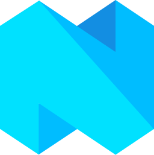</a> | **📂 檔名:** `nodal.svg` ✨ **格式:** `Vector (SVG)` ⚖️ **大小:** `947.00B` 📅 **更新:** `2026-03-02`  🚀 **jsDelivr Markdown:** `` 🔗 **直接連結 (Url):** <code>https://cdn.jsdelivr.net/gh/barry028/materials@main/images/iCons/Brands/nodal.svg</code> 📥 [檢視原始檔](nodal.svg) |
| <a href="node-sass.svg">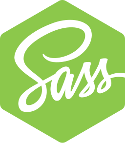</a> | **📂 檔名:** `node-sass.svg` ✨ **格式:** `Vector (SVG)` ⚖️ **大小:** `6.08KB` 📅 **更新:** `2026-03-02`  🚀 **jsDelivr Markdown:** `` 🔗 **直接連結 (Url):** <code>https://cdn.jsdelivr.net/gh/barry028/materials@main/images/iCons/Brands/node-sass.svg</code> 📥 [檢視原始檔](node-sass.svg) |
|  | **📂 檔名:** `nodebots.svg` ✨ **格式:** `Vector (SVG)` ⚖️ **大小:** `2.53KB` 📅 **更新:** `2026-03-02`  🚀 **jsDelivr Markdown:** `` 🔗 **直接連結 (Url):** <code>https://cdn.jsdelivr.net/gh/barry028/materials@main/images/iCons/Brands/nodebots.svg</code> 📥 [檢視原始檔](nodebots.svg) |
|  | **📂 檔名:** `nodejs-icon-alt.svg` ✨ **格式:** `Vector (SVG)` ⚖️ **大小:** `4.35KB` 📅 **更新:** `2026-03-02`  🚀 **jsDelivr Markdown:** `` 🔗 **直接連結 (Url):** <code>https://cdn.jsdelivr.net/gh/barry028/materials@main/images/iCons/Brands/nodejs-icon-alt.svg</code> 📥 [檢視原始檔](nodejs-icon-alt.svg) |
|  | **📂 檔名:** `nodejs-icon.svg` ✨ **格式:** `Vector (SVG)` ⚖️ **大小:** `3.28KB` 📅 **更新:** `2026-03-02`  🚀 **jsDelivr Markdown:** `` 🔗 **直接連結 (Url):** <code>https://cdn.jsdelivr.net/gh/barry028/materials@main/images/iCons/Brands/nodejs-icon.svg</code> 📥 [檢視原始檔](nodejs-icon.svg) |
|  | **📂 檔名:** `nodejs.svg` ✨ **格式:** `Vector (SVG)` ⚖️ **大小:** `14.79KB` 📅 **更新:** `2026-03-02`  🚀 **jsDelivr Markdown:** `` 🔗 **直接連結 (Url):** <code>https://cdn.jsdelivr.net/gh/barry028/materials@main/images/iCons/Brands/nodejs.svg</code> 📥 [檢視原始檔](nodejs.svg) |
|  | **📂 檔名:** `nodemon.svg` ✨ **格式:** `Vector (SVG)` ⚖️ **大小:** `2.34KB` 📅 **更新:** `2026-03-02`  🚀 **jsDelivr Markdown:** `` 🔗 **直接連結 (Url):** <code>https://cdn.jsdelivr.net/gh/barry028/materials@main/images/iCons/Brands/nodemon.svg</code> 📥 [檢視原始檔](nodemon.svg) |
| <a href="nodeos.svg">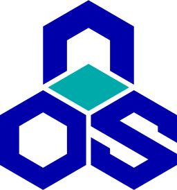</a> | **📂 檔名:** `nodeos.svg` ✨ **格式:** `Vector (SVG)` ⚖️ **大小:** `1.36KB` 📅 **更新:** `2026-03-02`  🚀 **jsDelivr Markdown:** `` 🔗 **直接連結 (Url):** <code>https://cdn.jsdelivr.net/gh/barry028/materials@main/images/iCons/Brands/nodeos.svg</code> 📥 [檢視原始檔](nodeos.svg) |
|  | **📂 檔名:** `nodewebkit.svg` ✨ **格式:** `Vector (SVG)` ⚖️ **大小:** `4.60KB` 📅 **更新:** `2026-03-02`  🚀 **jsDelivr Markdown:** `` 🔗 **直接連結 (Url):** <code>https://cdn.jsdelivr.net/gh/barry028/materials@main/images/iCons/Brands/nodewebkit.svg</code> 📥 [檢視原始檔](nodewebkit.svg) |
| <a href="nomad-icon.svg">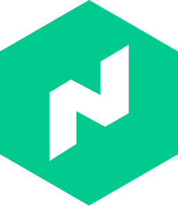</a> | **📂 檔名:** `nomad-icon.svg` ✨ **格式:** `Vector (SVG)` ⚖️ **大小:** `659.00B` 📅 **更新:** `2026-03-02`  🚀 **jsDelivr Markdown:** `` 🔗 **直接連結 (Url):** <code>https://cdn.jsdelivr.net/gh/barry028/materials@main/images/iCons/Brands/nomad-icon.svg</code> 📥 [檢視原始檔](nomad-icon.svg) |
|  | **📂 檔名:** `nomad.svg` ✨ **格式:** `Vector (SVG)` ⚖️ **大小:** `4.05KB` 📅 **更新:** `2026-03-02`  🚀 **jsDelivr Markdown:** `` 🔗 **直接連結 (Url):** <code>https://cdn.jsdelivr.net/gh/barry028/materials@main/images/iCons/Brands/nomad.svg</code> 📥 [檢視原始檔](nomad.svg) |
|  | **📂 檔名:** `notion-icon.svg` ✨ **格式:** `Vector (SVG)` ⚖️ **大小:** `2.93KB` 📅 **更新:** `2026-03-02`  🚀 **jsDelivr Markdown:** `` 🔗 **直接連結 (Url):** <code>https://cdn.jsdelivr.net/gh/barry028/materials@main/images/iCons/Brands/notion-icon.svg</code> 📥 [檢視原始檔](notion-icon.svg) |
|  | **📂 檔名:** `notion.svg` ✨ **格式:** `Vector (SVG)` ⚖️ **大小:** `5.92KB` 📅 **更新:** `2026-03-02`  🚀 **jsDelivr Markdown:** `` 🔗 **直接連結 (Url):** <code>https://cdn.jsdelivr.net/gh/barry028/materials@main/images/iCons/Brands/notion.svg</code> 📥 [檢視原始檔](notion.svg) |
| <a href="noysi.svg">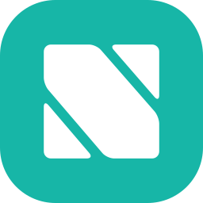</a> | **📂 檔名:** `noysi.svg` ✨ **格式:** `Vector (SVG)` ⚖️ **大小:** `1.43KB` 📅 **更新:** `2026-03-02`  🚀 **jsDelivr Markdown:** `` 🔗 **直接連結 (Url):** <code>https://cdn.jsdelivr.net/gh/barry028/materials@main/images/iCons/Brands/noysi.svg</code> 📥 [檢視原始檔](noysi.svg) |
|  | **📂 檔名:** `npm-icon.svg` ✨ **格式:** `Vector (SVG)` ⚖️ **大小:** `417.00B` 📅 **更新:** `2026-03-02`  🚀 **jsDelivr Markdown:** `` 🔗 **直接連結 (Url):** <code>https://cdn.jsdelivr.net/gh/barry028/materials@main/images/iCons/Brands/npm-icon.svg</code> 📥 [檢視原始檔](npm-icon.svg) |
|  | **📂 檔名:** `npm.svg` ✨ **格式:** `Vector (SVG)` ⚖️ **大小:** `956.00B` 📅 **更新:** `2026-03-02`  🚀 **jsDelivr Markdown:** `` 🔗 **直接連結 (Url):** <code>https://cdn.jsdelivr.net/gh/barry028/materials@main/images/iCons/Brands/npm.svg</code> 📥 [檢視原始檔](npm.svg) |
|  | **📂 檔名:** `nuclide.svg` ✨ **格式:** `Vector (SVG)` ⚖️ **大小:** `2.38KB` 📅 **更新:** `2026-03-02`  🚀 **jsDelivr Markdown:** `` 🔗 **直接連結 (Url):** <code>https://cdn.jsdelivr.net/gh/barry028/materials@main/images/iCons/Brands/nuclide.svg</code> 📥 [檢視原始檔](nuclide.svg) |
| <a href="numpy.svg">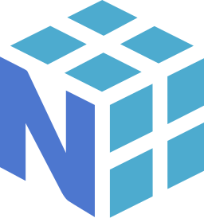</a> | **📂 檔名:** `numpy.svg` ✨ **格式:** `Vector (SVG)` ⚖️ **大小:** `1.75KB` 📅 **更新:** `2026-03-02`  🚀 **jsDelivr Markdown:** `` 🔗 **直接連結 (Url):** <code>https://cdn.jsdelivr.net/gh/barry028/materials@main/images/iCons/Brands/numpy.svg</code> 📥 [檢視原始檔](numpy.svg) |
| <a href="nuxt-icon.svg">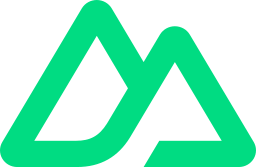</a> | **📂 檔名:** `nuxt-icon.svg` ✨ **格式:** `Vector (SVG)` ⚖️ **大小:** `1.83KB` 📅 **更新:** `2026-03-02`  🚀 **jsDelivr Markdown:** `` 🔗 **直接連結 (Url):** <code>https://cdn.jsdelivr.net/gh/barry028/materials@main/images/iCons/Brands/nuxt-icon.svg</code> 📥 [檢視原始檔](nuxt-icon.svg) |
|  | **📂 檔名:** `nuxt.svg` ✨ **格式:** `Vector (SVG)` ⚖️ **大小:** `3.59KB` 📅 **更新:** `2026-03-02`  🚀 **jsDelivr Markdown:** `` 🔗 **直接連結 (Url):** <code>https://cdn.jsdelivr.net/gh/barry028/materials@main/images/iCons/Brands/nuxt.svg</code> 📥 [檢視原始檔](nuxt.svg) |
|  | **📂 檔名:** `nvidia.svg` ✨ **格式:** `Vector (SVG)` ⚖️ **大小:** `3.94KB` 📅 **更新:** `2026-03-02`  🚀 **jsDelivr Markdown:** `` 🔗 **直接連結 (Url):** <code>https://cdn.jsdelivr.net/gh/barry028/materials@main/images/iCons/Brands/nvidia.svg</code> 📥 [檢視原始檔](nvidia.svg) |
|  | **📂 檔名:** `nvm.svg` ✨ **格式:** `Vector (SVG)` ⚖️ **大小:** `10.44KB` 📅 **更新:** `2026-03-02`  🚀 **jsDelivr Markdown:** `` 🔗 **直接連結 (Url):** <code>https://cdn.jsdelivr.net/gh/barry028/materials@main/images/iCons/Brands/nvm.svg</code> 📥 [檢視原始檔](nvm.svg) |
|  | **📂 檔名:** `nx.svg` ✨ **格式:** `Vector (SVG)` ⚖️ **大小:** `4.72KB` 📅 **更新:** `2026-03-02`  🚀 **jsDelivr Markdown:** `` 🔗 **直接連結 (Url):** <code>https://cdn.jsdelivr.net/gh/barry028/materials@main/images/iCons/Brands/nx.svg</code> 📥 [檢視原始檔](nx.svg) |
|  | **📂 檔名:** `oauth.svg` ✨ **格式:** `Vector (SVG)` ⚖️ **大小:** `15.72KB` 📅 **更新:** `2026-03-02`  🚀 **jsDelivr Markdown:** `` 🔗 **直接連結 (Url):** <code>https://cdn.jsdelivr.net/gh/barry028/materials@main/images/iCons/Brands/oauth.svg</code> 📥 [檢視原始檔](oauth.svg) |
|  | **📂 檔名:** `observablehq.svg` ✨ **格式:** `Vector (SVG)` ⚖️ **大小:** `1.99KB` 📅 **更新:** `2026-03-02`  🚀 **jsDelivr Markdown:** `` 🔗 **直接連結 (Url):** <code>https://cdn.jsdelivr.net/gh/barry028/materials@main/images/iCons/Brands/observablehq.svg</code> 📥 [檢視原始檔](observablehq.svg) |
|  | **📂 檔名:** `obsidian-icon.svg` ✨ **格式:** `Vector (SVG)` ⚖️ **大小:** `10.47KB` 📅 **更新:** `2026-03-02`  🚀 **jsDelivr Markdown:** `` 🔗 **直接連結 (Url):** <code>https://cdn.jsdelivr.net/gh/barry028/materials@main/images/iCons/Brands/obsidian-icon.svg</code> 📥 [檢視原始檔](obsidian-icon.svg) |
|  | **📂 檔名:** `obsidian.svg` ✨ **格式:** `Vector (SVG)` ⚖️ **大小:** `7.29KB` 📅 **更新:** `2026-03-02`  🚀 **jsDelivr Markdown:** `` 🔗 **直接連結 (Url):** <code>https://cdn.jsdelivr.net/gh/barry028/materials@main/images/iCons/Brands/obsidian.svg</code> 📥 [檢視原始檔](obsidian.svg) |
|  | **📂 檔名:** `ocaml.svg` ✨ **格式:** `Vector (SVG)` ⚖️ **大小:** `19.49KB` 📅 **更新:** `2026-03-02`  🚀 **jsDelivr Markdown:** `` 🔗 **直接連結 (Url):** <code>https://cdn.jsdelivr.net/gh/barry028/materials@main/images/iCons/Brands/ocaml.svg</code> 📥 [檢視原始檔](ocaml.svg) |
| <a href="octodns.svg">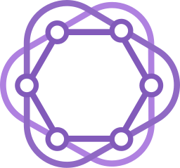</a> | **📂 檔名:** `octodns.svg` ✨ **格式:** `Vector (SVG)` ⚖️ **大小:** `7.31KB` 📅 **更新:** `2026-03-02`  🚀 **jsDelivr Markdown:** `` 🔗 **直接連結 (Url):** <code>https://cdn.jsdelivr.net/gh/barry028/materials@main/images/iCons/Brands/octodns.svg</code> 📥 [檢視原始檔](octodns.svg) |
|  | **📂 檔名:** `octopus-deploy.svg` ✨ **格式:** `Vector (SVG)` ⚖️ **大小:** `1.56KB` 📅 **更新:** `2026-03-02`  🚀 **jsDelivr Markdown:** `` 🔗 **直接連結 (Url):** <code>https://cdn.jsdelivr.net/gh/barry028/materials@main/images/iCons/Brands/octopus-deploy.svg</code> 📥 [檢視原始檔](octopus-deploy.svg) |
|  | **📂 檔名:** `okta-icon.svg` ✨ **格式:** `Vector (SVG)` ⚖️ **大小:** `7.89KB` 📅 **更新:** `2026-03-02`  🚀 **jsDelivr Markdown:** `` 🔗 **直接連結 (Url):** <code>https://cdn.jsdelivr.net/gh/barry028/materials@main/images/iCons/Brands/okta-icon.svg</code> 📥 [檢視原始檔](okta-icon.svg) |
|  | **📂 檔名:** `okta.svg` ✨ **格式:** `Vector (SVG)` ⚖️ **大小:** `10.24KB` 📅 **更新:** `2026-03-02`  🚀 **jsDelivr Markdown:** `` 🔗 **直接連結 (Url):** <code>https://cdn.jsdelivr.net/gh/barry028/materials@main/images/iCons/Brands/okta.svg</code> 📥 [檢視原始檔](okta.svg) |
|  | **📂 檔名:** `olark.svg` ✨ **格式:** `Vector (SVG)` ⚖️ **大小:** `7.58KB` 📅 **更新:** `2026-03-02`  🚀 **jsDelivr Markdown:** `` 🔗 **直接連結 (Url):** <code>https://cdn.jsdelivr.net/gh/barry028/materials@main/images/iCons/Brands/olark.svg</code> 📥 [檢視原始檔](olark.svg) |
| <a href="onesignal.svg">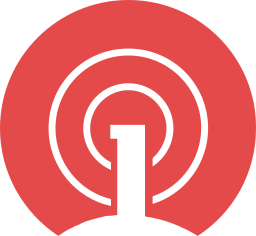</a> | **📂 檔名:** `onesignal.svg` ✨ **格式:** `Vector (SVG)` ⚖️ **大小:** `2.84KB` 📅 **更新:** `2026-03-02`  🚀 **jsDelivr Markdown:** `` 🔗 **直接連結 (Url):** <code>https://cdn.jsdelivr.net/gh/barry028/materials@main/images/iCons/Brands/onesignal.svg</code> 📥 [檢視原始檔](onesignal.svg) |
| <a href="open-graph.svg">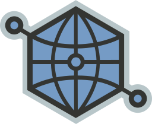</a> | **📂 檔名:** `open-graph.svg` ✨ **格式:** `Vector (SVG)` ⚖️ **大小:** `8.78KB` 📅 **更新:** `2026-03-02`  🚀 **jsDelivr Markdown:** `` 🔗 **直接連結 (Url):** <code>https://cdn.jsdelivr.net/gh/barry028/materials@main/images/iCons/Brands/open-graph.svg</code> 📥 [檢視原始檔](open-graph.svg) |
|  | **📂 檔名:** `open-zeppelin-icon.svg` ✨ **格式:** `Vector (SVG)` ⚖️ **大小:** `864.00B` 📅 **更新:** `2026-03-02`  🚀 **jsDelivr Markdown:** `` 🔗 **直接連結 (Url):** <code>https://cdn.jsdelivr.net/gh/barry028/materials@main/images/iCons/Brands/open-zeppelin-icon.svg</code> 📥 [檢視原始檔](open-zeppelin-icon.svg) |
|  | **📂 檔名:** `open-zeppelin.svg` ✨ **格式:** `Vector (SVG)` ⚖️ **大小:** `7.54KB` 📅 **更新:** `2026-03-02`  🚀 **jsDelivr Markdown:** `` 🔗 **直接連結 (Url):** <code>https://cdn.jsdelivr.net/gh/barry028/materials@main/images/iCons/Brands/open-zeppelin.svg</code> 📥 [檢視原始檔](open-zeppelin.svg) |
|  | **📂 檔名:** `openai-icon.svg` ✨ **格式:** `Vector (SVG)` ⚖️ **大小:** `3.65KB` 📅 **更新:** `2026-03-02`  🚀 **jsDelivr Markdown:** `` 🔗 **直接連結 (Url):** <code>https://cdn.jsdelivr.net/gh/barry028/materials@main/images/iCons/Brands/openai-icon.svg</code> 📥 [檢視原始檔](openai-icon.svg) |
|  | **📂 檔名:** `openai.svg` ✨ **格式:** `Vector (SVG)` ⚖️ **大小:** `7.21KB` 📅 **更新:** `2026-03-02`  🚀 **jsDelivr Markdown:** `` 🔗 **直接連結 (Url):** <code>https://cdn.jsdelivr.net/gh/barry028/materials@main/images/iCons/Brands/openai.svg</code> 📥 [檢視原始檔](openai.svg) |
| <a href="openapi-icon.svg">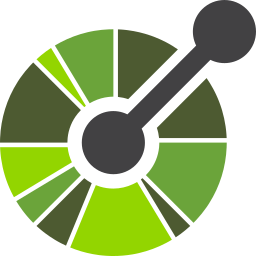</a> | **📂 檔名:** `openapi-icon.svg` ✨ **格式:** `Vector (SVG)` ⚖️ **大小:** `17.98KB` 📅 **更新:** `2026-03-02`  🚀 **jsDelivr Markdown:** `` 🔗 **直接連結 (Url):** <code>https://cdn.jsdelivr.net/gh/barry028/materials@main/images/iCons/Brands/openapi-icon.svg</code> 📥 [檢視原始檔](openapi-icon.svg) |
| <a href="openapi.svg">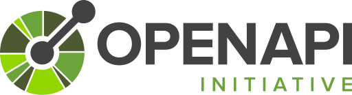</a> | **📂 檔名:** `openapi.svg` ✨ **格式:** `Vector (SVG)` ⚖️ **大小:** `22.45KB` 📅 **更新:** `2026-03-02`  🚀 **jsDelivr Markdown:** `` 🔗 **直接連結 (Url):** <code>https://cdn.jsdelivr.net/gh/barry028/materials@main/images/iCons/Brands/openapi.svg</code> 📥 [檢視原始檔](openapi.svg) |
|  | **📂 檔名:** `opencart.svg` ✨ **格式:** `Vector (SVG)` ⚖️ **大小:** `7.83KB` 📅 **更新:** `2026-03-02`  🚀 **jsDelivr Markdown:** `` 🔗 **直接連結 (Url):** <code>https://cdn.jsdelivr.net/gh/barry028/materials@main/images/iCons/Brands/opencart.svg</code> 📥 [檢視原始檔](opencart.svg) |
| <a href="opencollective.svg">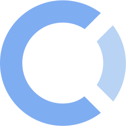</a> | **📂 檔名:** `opencollective.svg` ✨ **格式:** `Vector (SVG)` ⚖️ **大小:** `1.24KB` 📅 **更新:** `2026-03-02`  🚀 **jsDelivr Markdown:** `` 🔗 **直接連結 (Url):** <code>https://cdn.jsdelivr.net/gh/barry028/materials@main/images/iCons/Brands/opencollective.svg</code> 📥 [檢視原始檔](opencollective.svg) |
| <a href="opencv.svg">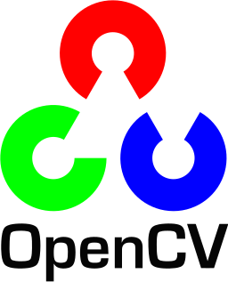</a> | **📂 檔名:** `opencv.svg` ✨ **格式:** `Vector (SVG)` ⚖️ **大小:** `9.71KB` 📅 **更新:** `2026-03-02`  🚀 **jsDelivr Markdown:** `` 🔗 **直接連結 (Url):** <code>https://cdn.jsdelivr.net/gh/barry028/materials@main/images/iCons/Brands/opencv.svg</code> 📥 [檢視原始檔](opencv.svg) |
|  | **📂 檔名:** `openframeworks.svg` ✨ **格式:** `Vector (SVG)` ⚖️ **大小:** `809.00B` 📅 **更新:** `2026-03-02`  🚀 **jsDelivr Markdown:** `` 🔗 **直接連結 (Url):** <code>https://cdn.jsdelivr.net/gh/barry028/materials@main/images/iCons/Brands/openframeworks.svg</code> 📥 [檢視原始檔](openframeworks.svg) |
|  | **📂 檔名:** `opengl.svg` ✨ **格式:** `Vector (SVG)` ⚖️ **大小:** `9.73KB` 📅 **更新:** `2026-03-02`  🚀 **jsDelivr Markdown:** `` 🔗 **直接連結 (Url):** <code>https://cdn.jsdelivr.net/gh/barry028/materials@main/images/iCons/Brands/opengl.svg</code> 📥 [檢視原始檔](opengl.svg) |
| <a href="openjs-foundation-icon.svg">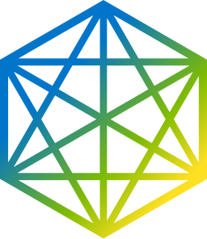</a> | **📂 檔名:** `openjs-foundation-icon.svg` ✨ **格式:** `Vector (SVG)` ⚖️ **大小:** `3.45KB` 📅 **更新:** `2026-03-02`  🚀 **jsDelivr Markdown:** `` 🔗 **直接連結 (Url):** <code>https://cdn.jsdelivr.net/gh/barry028/materials@main/images/iCons/Brands/openjs-foundation-icon.svg</code> 📥 [檢視原始檔](openjs-foundation-icon.svg) |
|  | **📂 檔名:** `openjs-foundation.svg` ✨ **格式:** `Vector (SVG)` ⚖️ **大小:** `15.74KB` 📅 **更新:** `2026-03-02`  🚀 **jsDelivr Markdown:** `` 🔗 **直接連結 (Url):** <code>https://cdn.jsdelivr.net/gh/barry028/materials@main/images/iCons/Brands/openjs-foundation.svg</code> 📥 [檢視原始檔](openjs-foundation.svg) |
|  | **📂 檔名:** `openlayers.svg` ✨ **格式:** `Vector (SVG)` ⚖️ **大小:** `2.00KB` 📅 **更新:** `2026-03-02`  🚀 **jsDelivr Markdown:** `` 🔗 **直接連結 (Url):** <code>https://cdn.jsdelivr.net/gh/barry028/materials@main/images/iCons/Brands/openlayers.svg</code> 📥 [檢視原始檔](openlayers.svg) |
|  | **📂 檔名:** `openshift.svg` ✨ **格式:** `Vector (SVG)` ⚖️ **大小:** `4.97KB` 📅 **更新:** `2026-03-02`  🚀 **jsDelivr Markdown:** `` 🔗 **直接連結 (Url):** <code>https://cdn.jsdelivr.net/gh/barry028/materials@main/images/iCons/Brands/openshift.svg</code> 📥 [檢視原始檔](openshift.svg) |
|  | **📂 檔名:** `opensource.svg` ✨ **格式:** `Vector (SVG)` ⚖️ **大小:** `5.81KB` 📅 **更新:** `2026-03-02`  🚀 **jsDelivr Markdown:** `` 🔗 **直接連結 (Url):** <code>https://cdn.jsdelivr.net/gh/barry028/materials@main/images/iCons/Brands/opensource.svg</code> 📥 [檢視原始檔](opensource.svg) |
| <a href="openstack-icon.svg">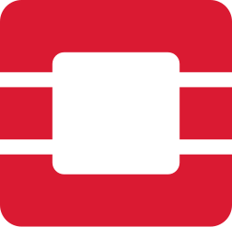</a> | **📂 檔名:** `openstack-icon.svg` ✨ **格式:** `Vector (SVG)` ⚖️ **大小:** `1.40KB` 📅 **更新:** `2026-03-02`  🚀 **jsDelivr Markdown:** `` 🔗 **直接連結 (Url):** <code>https://cdn.jsdelivr.net/gh/barry028/materials@main/images/iCons/Brands/openstack-icon.svg</code> 📥 [檢視原始檔](openstack-icon.svg) |
|  | **📂 檔名:** `openstack.svg` ✨ **格式:** `Vector (SVG)` ⚖️ **大小:** `8.32KB` 📅 **更新:** `2026-03-02`  🚀 **jsDelivr Markdown:** `` 🔗 **直接連結 (Url):** <code>https://cdn.jsdelivr.net/gh/barry028/materials@main/images/iCons/Brands/openstack.svg</code> 📥 [檢視原始檔](openstack.svg) |
|  | **📂 檔名:** `opentelemetry-icon.svg` ✨ **格式:** `Vector (SVG)` ⚖️ **大小:** `2.65KB` 📅 **更新:** `2026-03-02`  🚀 **jsDelivr Markdown:** `` 🔗 **直接連結 (Url):** <code>https://cdn.jsdelivr.net/gh/barry028/materials@main/images/iCons/Brands/opentelemetry-icon.svg</code> 📥 [檢視原始檔](opentelemetry-icon.svg) |
| <a href="opentelemetry.svg">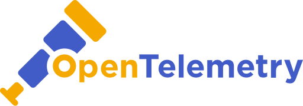</a> | **📂 檔名:** `opentelemetry.svg` ✨ **格式:** `Vector (SVG)` ⚖️ **大小:** `9.42KB` 📅 **更新:** `2026-03-02`  🚀 **jsDelivr Markdown:** `` 🔗 **直接連結 (Url):** <code>https://cdn.jsdelivr.net/gh/barry028/materials@main/images/iCons/Brands/opentelemetry.svg</code> 📥 [檢視原始檔](opentelemetry.svg) |
|  | **📂 檔名:** `opera.svg` ✨ **格式:** `Vector (SVG)` ⚖️ **大小:** `1.85KB` 📅 **更新:** `2026-03-02`  🚀 **jsDelivr Markdown:** `` 🔗 **直接連結 (Url):** <code>https://cdn.jsdelivr.net/gh/barry028/materials@main/images/iCons/Brands/opera.svg</code> 📥 [檢視原始檔](opera.svg) |
|  | **📂 檔名:** `opsgenie.svg` ✨ **格式:** `Vector (SVG)` ⚖️ **大小:** `1.96KB` 📅 **更新:** `2026-03-02`  🚀 **jsDelivr Markdown:** `` 🔗 **直接連結 (Url):** <code>https://cdn.jsdelivr.net/gh/barry028/materials@main/images/iCons/Brands/opsgenie.svg</code> 📥 [檢視原始檔](opsgenie.svg) |
| <a href="optimizely-icon.svg">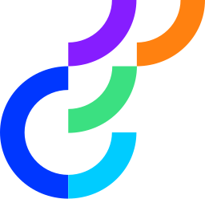</a> | **📂 檔名:** `optimizely-icon.svg` ✨ **格式:** `Vector (SVG)` ⚖️ **大小:** `2.58KB` 📅 **更新:** `2026-03-02`  🚀 **jsDelivr Markdown:** `` 🔗 **直接連結 (Url):** <code>https://cdn.jsdelivr.net/gh/barry028/materials@main/images/iCons/Brands/optimizely-icon.svg</code> 📥 [檢視原始檔](optimizely-icon.svg) |
|  | **📂 檔名:** `optimizely.svg` ✨ **格式:** `Vector (SVG)` ⚖️ **大小:** `14.25KB` 📅 **更新:** `2026-03-02`  🚀 **jsDelivr Markdown:** `` 🔗 **直接連結 (Url):** <code>https://cdn.jsdelivr.net/gh/barry028/materials@main/images/iCons/Brands/optimizely.svg</code> 📥 [檢視原始檔](optimizely.svg) |
|  | **📂 檔名:** `oracle.svg` ✨ **格式:** `Vector (SVG)` ⚖️ **大小:** `3.18KB` 📅 **更新:** `2026-03-02`  🚀 **jsDelivr Markdown:** `` 🔗 **直接連結 (Url):** <code>https://cdn.jsdelivr.net/gh/barry028/materials@main/images/iCons/Brands/oracle.svg</code> 📥 [檢視原始檔](oracle.svg) |
|  | **📂 檔名:** `oreilly.svg` ✨ **格式:** `Vector (SVG)` ⚖️ **大小:** `2.14KB` 📅 **更新:** `2026-03-02`  🚀 **jsDelivr Markdown:** `` 🔗 **直接連結 (Url):** <code>https://cdn.jsdelivr.net/gh/barry028/materials@main/images/iCons/Brands/oreilly.svg</code> 📥 [檢視原始檔](oreilly.svg) |
|  | **📂 檔名:** `origami.svg` ✨ **格式:** `Vector (SVG)` ⚖️ **大小:** `3.36KB` 📅 **更新:** `2026-03-02`  🚀 **jsDelivr Markdown:** `` 🔗 **直接連結 (Url):** <code>https://cdn.jsdelivr.net/gh/barry028/materials@main/images/iCons/Brands/origami.svg</code> 📥 [檢視原始檔](origami.svg) |
|  | **📂 檔名:** `origin.svg` ✨ **格式:** `Vector (SVG)` ⚖️ **大小:** `2.41KB` 📅 **更新:** `2026-03-02`  🚀 **jsDelivr Markdown:** `` 🔗 **直接連結 (Url):** <code>https://cdn.jsdelivr.net/gh/barry028/materials@main/images/iCons/Brands/origin.svg</code> 📥 [檢視原始檔](origin.svg) |
| <a href="oshw.svg">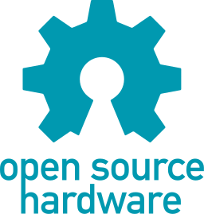</a> | **📂 檔名:** `oshw.svg` ✨ **格式:** `Vector (SVG)` ⚖️ **大小:** `16.32KB` 📅 **更新:** `2026-03-02`  🚀 **jsDelivr Markdown:** `` 🔗 **直接連結 (Url):** <code>https://cdn.jsdelivr.net/gh/barry028/materials@main/images/iCons/Brands/oshw.svg</code> 📥 [檢視原始檔](oshw.svg) |
| <a href="osquery.svg">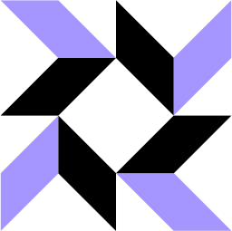</a> | **📂 檔名:** `osquery.svg` ✨ **格式:** `Vector (SVG)` ⚖️ **大小:** `1.42KB` 📅 **更新:** `2026-03-02`  🚀 **jsDelivr Markdown:** `` 🔗 **直接連結 (Url):** <code>https://cdn.jsdelivr.net/gh/barry028/materials@main/images/iCons/Brands/osquery.svg</code> 📥 [檢視原始檔](osquery.svg) |
|  | **📂 檔名:** `overloop-icon.svg` ✨ **格式:** `Vector (SVG)` ⚖️ **大小:** `3.39KB` 📅 **更新:** `2026-03-02`  🚀 **jsDelivr Markdown:** `` 🔗 **直接連結 (Url):** <code>https://cdn.jsdelivr.net/gh/barry028/materials@main/images/iCons/Brands/overloop-icon.svg</code> 📥 [檢視原始檔](overloop-icon.svg) |
|  | **📂 檔名:** `overloop.svg` ✨ **格式:** `Vector (SVG)` ⚖️ **大小:** `9.65KB` 📅 **更新:** `2026-03-02`  🚀 **jsDelivr Markdown:** `` 🔗 **直接連結 (Url):** <code>https://cdn.jsdelivr.net/gh/barry028/materials@main/images/iCons/Brands/overloop.svg</code> 📥 [檢視原始檔](overloop.svg) |
|  | **📂 檔名:** `p5js.svg` ✨ **格式:** `Vector (SVG)` ⚖️ **大小:** `7.77KB` 📅 **更新:** `2026-03-02`  🚀 **jsDelivr Markdown:** `` 🔗 **直接連結 (Url):** <code>https://cdn.jsdelivr.net/gh/barry028/materials@main/images/iCons/Brands/p5js.svg</code> 📥 [檢視原始檔](p5js.svg) |
|  | **📂 檔名:** `packer.svg` ✨ **格式:** `Vector (SVG)` ⚖️ **大小:** `698.00B` 📅 **更新:** `2026-03-02`  🚀 **jsDelivr Markdown:** `` 🔗 **直接連結 (Url):** <code>https://cdn.jsdelivr.net/gh/barry028/materials@main/images/iCons/Brands/packer.svg</code> 📥 [檢視原始檔](packer.svg) |
| <a href="pagekit.svg">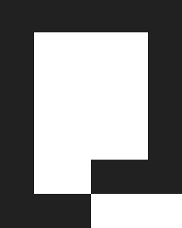</a> | **📂 檔名:** `pagekit.svg` ✨ **格式:** `Vector (SVG)` ⚖️ **大小:** `415.00B` 📅 **更新:** `2026-03-02`  🚀 **jsDelivr Markdown:** `` 🔗 **直接連結 (Url):** <code>https://cdn.jsdelivr.net/gh/barry028/materials@main/images/iCons/Brands/pagekit.svg</code> 📥 [檢視原始檔](pagekit.svg) |
|  | **📂 檔名:** `pagekite.svg` ✨ **格式:** `Vector (SVG)` ⚖️ **大小:** `815.00B` 📅 **更新:** `2026-03-02`  🚀 **jsDelivr Markdown:** `` 🔗 **直接連結 (Url):** <code>https://cdn.jsdelivr.net/gh/barry028/materials@main/images/iCons/Brands/pagekite.svg</code> 📥 [檢視原始檔](pagekite.svg) |
|  | **📂 檔名:** `pagerduty-icon.svg` ✨ **格式:** `Vector (SVG)` ⚖️ **大小:** `977.00B` 📅 **更新:** `2026-03-02`  🚀 **jsDelivr Markdown:** `` 🔗 **直接連結 (Url):** <code>https://cdn.jsdelivr.net/gh/barry028/materials@main/images/iCons/Brands/pagerduty-icon.svg</code> 📥 [檢視原始檔](pagerduty-icon.svg) |
|  | **📂 檔名:** `pagerduty.svg` ✨ **格式:** `Vector (SVG)` ⚖️ **大小:** `6.56KB` 📅 **更新:** `2026-03-02`  🚀 **jsDelivr Markdown:** `` 🔗 **直接連結 (Url):** <code>https://cdn.jsdelivr.net/gh/barry028/materials@main/images/iCons/Brands/pagerduty.svg</code> 📥 [檢視原始檔](pagerduty.svg) |
|  | **📂 檔名:** `panda.svg` ✨ **格式:** `Vector (SVG)` ⚖️ **大小:** `4.65KB` 📅 **更新:** `2026-03-02`  🚀 **jsDelivr Markdown:** `` 🔗 **直接連結 (Url):** <code>https://cdn.jsdelivr.net/gh/barry028/materials@main/images/iCons/Brands/panda.svg</code> 📥 [檢視原始檔](panda.svg) |
| <a href="pandas-icon.svg">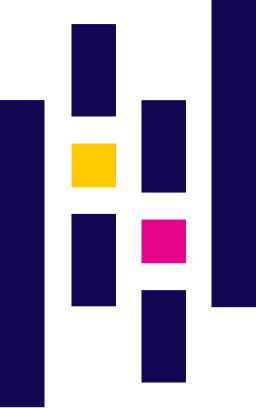</a> | **📂 檔名:** `pandas-icon.svg` ✨ **格式:** `Vector (SVG)` ⚖️ **大小:** `1.12KB` 📅 **更新:** `2026-03-02`  🚀 **jsDelivr Markdown:** `` 🔗 **直接連結 (Url):** <code>https://cdn.jsdelivr.net/gh/barry028/materials@main/images/iCons/Brands/pandas-icon.svg</code> 📥 [檢視原始檔](pandas-icon.svg) |
|  | **📂 檔名:** `pandas.svg` ✨ **格式:** `Vector (SVG)` ⚖️ **大小:** `5.27KB` 📅 **更新:** `2026-03-02`  🚀 **jsDelivr Markdown:** `` 🔗 **直接連結 (Url):** <code>https://cdn.jsdelivr.net/gh/barry028/materials@main/images/iCons/Brands/pandas.svg</code> 📥 [檢視原始檔](pandas.svg) |
| <a href="parcel-icon.svg">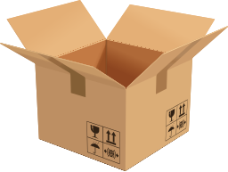</a> | **📂 檔名:** `parcel-icon.svg` ✨ **格式:** `Vector (SVG)` ⚖️ **大小:** `27.06KB` 📅 **更新:** `2026-03-02`  🚀 **jsDelivr Markdown:** `` 🔗 **直接連結 (Url):** <code>https://cdn.jsdelivr.net/gh/barry028/materials@main/images/iCons/Brands/parcel-icon.svg</code> 📥 [檢視原始檔](parcel-icon.svg) |
|  | **📂 檔名:** `parcel.svg` ✨ **格式:** `Vector (SVG)` ⚖️ **大小:** `5.63KB` 📅 **更新:** `2026-03-02`  🚀 **jsDelivr Markdown:** `` 🔗 **直接連結 (Url):** <code>https://cdn.jsdelivr.net/gh/barry028/materials@main/images/iCons/Brands/parcel.svg</code> 📥 [檢視原始檔](parcel.svg) |
| <a href="parse.svg">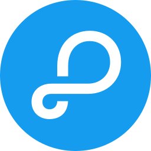</a> | **📂 檔名:** `parse.svg` ✨ **格式:** `Vector (SVG)` ⚖️ **大小:** `1.25KB` 📅 **更新:** `2026-03-02`  🚀 **jsDelivr Markdown:** `` 🔗 **直接連結 (Url):** <code>https://cdn.jsdelivr.net/gh/barry028/materials@main/images/iCons/Brands/parse.svg</code> 📥 [檢視原始檔](parse.svg) |
|  | **📂 檔名:** `parsehub.svg` ✨ **格式:** `Vector (SVG)` ⚖️ **大小:** `1.02KB` 📅 **更新:** `2026-03-02`  🚀 **jsDelivr Markdown:** `` 🔗 **直接連結 (Url):** <code>https://cdn.jsdelivr.net/gh/barry028/materials@main/images/iCons/Brands/parsehub.svg</code> 📥 [檢視原始檔](parsehub.svg) |
|  | **📂 檔名:** `partytown-icon.svg` ✨ **格式:** `Vector (SVG)` ⚖️ **大小:** `8.64KB` 📅 **更新:** `2026-03-02`  🚀 **jsDelivr Markdown:** `` 🔗 **直接連結 (Url):** <code>https://cdn.jsdelivr.net/gh/barry028/materials@main/images/iCons/Brands/partytown-icon.svg</code> 📥 [檢視原始檔](partytown-icon.svg) |
|  | **📂 檔名:** `partytown.svg` ✨ **格式:** `Vector (SVG)` ⚖️ **大小:** `23.84KB` 📅 **更新:** `2026-03-02`  🚀 **jsDelivr Markdown:** `` 🔗 **直接連結 (Url):** <code>https://cdn.jsdelivr.net/gh/barry028/materials@main/images/iCons/Brands/partytown.svg</code> 📥 [檢視原始檔](partytown.svg) |
| <a href="passbolt-icon.svg">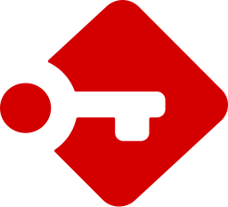</a> | **📂 檔名:** `passbolt-icon.svg` ✨ **格式:** `Vector (SVG)` ⚖️ **大小:** `2.47KB` 📅 **更新:** `2026-03-02`  🚀 **jsDelivr Markdown:** `` 🔗 **直接連結 (Url):** <code>https://cdn.jsdelivr.net/gh/barry028/materials@main/images/iCons/Brands/passbolt-icon.svg</code> 📥 [檢視原始檔](passbolt-icon.svg) |
|  | **📂 檔名:** `passbolt.svg` ✨ **格式:** `Vector (SVG)` ⚖️ **大小:** `9.44KB` 📅 **更新:** `2026-03-02`  🚀 **jsDelivr Markdown:** `` 🔗 **直接連結 (Url):** <code>https://cdn.jsdelivr.net/gh/barry028/materials@main/images/iCons/Brands/passbolt.svg</code> 📥 [檢視原始檔](passbolt.svg) |
| <a href="passport.svg">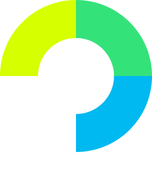</a> | **📂 檔名:** `passport.svg` ✨ **格式:** `Vector (SVG)` ⚖️ **大小:** `768.00B` 📅 **更新:** `2026-03-02`  🚀 **jsDelivr Markdown:** `` 🔗 **直接連結 (Url):** <code>https://cdn.jsdelivr.net/gh/barry028/materials@main/images/iCons/Brands/passport.svg</code> 📥 [檢視原始檔](passport.svg) |
|  | **📂 檔名:** `patreon.svg` ✨ **格式:** `Vector (SVG)` ⚖️ **大小:** `587.00B` 📅 **更新:** `2026-03-02`  🚀 **jsDelivr Markdown:** `` 🔗 **直接連結 (Url):** <code>https://cdn.jsdelivr.net/gh/barry028/materials@main/images/iCons/Brands/patreon.svg</code> 📥 [檢視原始檔](patreon.svg) |
|  | **📂 檔名:** `payload.svg` ✨ **格式:** `Vector (SVG)` ⚖️ **大小:** `484.00B` 📅 **更新:** `2026-03-02`  🚀 **jsDelivr Markdown:** `` 🔗 **直接連結 (Url):** <code>https://cdn.jsdelivr.net/gh/barry028/materials@main/images/iCons/Brands/payload.svg</code> 📥 [檢視原始檔](payload.svg) |
|  | **📂 檔名:** `paypal.svg` ✨ **格式:** `Vector (SVG)` ⚖️ **大小:** `3.47KB` 📅 **更新:** `2026-03-02`  🚀 **jsDelivr Markdown:** `` 🔗 **直接連結 (Url):** <code>https://cdn.jsdelivr.net/gh/barry028/materials@main/images/iCons/Brands/paypal.svg</code> 📥 [檢視原始檔](paypal.svg) |
|  | **📂 檔名:** `peer5.svg` ✨ **格式:** `Vector (SVG)` ⚖️ **大小:** `1.18KB` 📅 **更新:** `2026-03-02`  🚀 **jsDelivr Markdown:** `` 🔗 **直接連結 (Url):** <code>https://cdn.jsdelivr.net/gh/barry028/materials@main/images/iCons/Brands/peer5.svg</code> 📥 [檢視原始檔](peer5.svg) |
|  | **📂 檔名:** `pepperoni.svg` ✨ **格式:** `Vector (SVG)` ⚖️ **大小:** `12.09KB` 📅 **更新:** `2026-03-02`  🚀 **jsDelivr Markdown:** `` 🔗 **直接連結 (Url):** <code>https://cdn.jsdelivr.net/gh/barry028/materials@main/images/iCons/Brands/pepperoni.svg</code> 📥 [檢視原始檔](pepperoni.svg) |
|  | **📂 檔名:** `percona.svg` ✨ **格式:** `Vector (SVG)` ⚖️ **大小:** `1.44KB` 📅 **更新:** `2026-03-02`  🚀 **jsDelivr Markdown:** `` 🔗 **直接連結 (Url):** <code>https://cdn.jsdelivr.net/gh/barry028/materials@main/images/iCons/Brands/percona.svg</code> 📥 [檢視原始檔](percona.svg) |
|  | **📂 檔名:** `percy-icon.svg` ✨ **格式:** `Vector (SVG)` ⚖️ **大小:** `4.40KB` 📅 **更新:** `2026-03-02`  🚀 **jsDelivr Markdown:** `` 🔗 **直接連結 (Url):** <code>https://cdn.jsdelivr.net/gh/barry028/materials@main/images/iCons/Brands/percy-icon.svg</code> 📥 [檢視原始檔](percy-icon.svg) |
|  | **📂 檔名:** `percy.svg` ✨ **格式:** `Vector (SVG)` ⚖️ **大小:** `11.32KB` 📅 **更新:** `2026-03-02`  🚀 **jsDelivr Markdown:** `` 🔗 **直接連結 (Url):** <code>https://cdn.jsdelivr.net/gh/barry028/materials@main/images/iCons/Brands/percy.svg</code> 📥 [檢視原始檔](percy.svg) |
|  | **📂 檔名:** `perf-rocks.svg` ✨ **格式:** `Vector (SVG)` ⚖️ **大小:** `11.34KB` 📅 **更新:** `2026-03-02`  🚀 **jsDelivr Markdown:** `` 🔗 **直接連結 (Url):** <code>https://cdn.jsdelivr.net/gh/barry028/materials@main/images/iCons/Brands/perf-rocks.svg</code> 📥 [檢視原始檔](perf-rocks.svg) |
| <a href="perl.svg">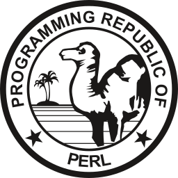</a> | **📂 檔名:** `perl.svg` ✨ **格式:** `Vector (SVG)` ⚖️ **大小:** `42.71KB` 📅 **更新:** `2026-03-02`  🚀 **jsDelivr Markdown:** `` 🔗 **直接連結 (Url):** <code>https://cdn.jsdelivr.net/gh/barry028/materials@main/images/iCons/Brands/perl.svg</code> 📥 [檢視原始檔](perl.svg) |
| <a href="phalcon.svg">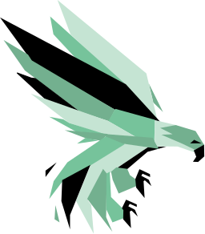</a> | **📂 檔名:** `phalcon.svg` ✨ **格式:** `Vector (SVG)` ⚖️ **大小:** `5.57KB` 📅 **更新:** `2026-03-02`  🚀 **jsDelivr Markdown:** `` 🔗 **直接連結 (Url):** <code>https://cdn.jsdelivr.net/gh/barry028/materials@main/images/iCons/Brands/phalcon.svg</code> 📥 [檢視原始檔](phalcon.svg) |
|  | **📂 檔名:** `phoenix.svg` ✨ **格式:** `Vector (SVG)` ⚖️ **大小:** `6.34KB` 📅 **更新:** `2026-03-02`  🚀 **jsDelivr Markdown:** `` 🔗 **直接連結 (Url):** <code>https://cdn.jsdelivr.net/gh/barry028/materials@main/images/iCons/Brands/phoenix.svg</code> 📥 [檢視原始檔](phoenix.svg) |
|  | **📂 檔名:** `php-alt.svg` ✨ **格式:** `Vector (SVG)` ⚖️ **大小:** `2.78KB` 📅 **更新:** `2026-03-02`  🚀 **jsDelivr Markdown:** `` 🔗 **直接連結 (Url):** <code>https://cdn.jsdelivr.net/gh/barry028/materials@main/images/iCons/Brands/php-alt.svg</code> 📥 [檢視原始檔](php-alt.svg) |
|  | **📂 檔名:** `php.svg` ✨ **格式:** `Vector (SVG)` ⚖️ **大小:** `2.91KB` 📅 **更新:** `2026-03-02`  🚀 **jsDelivr Markdown:** `` 🔗 **直接連結 (Url):** <code>https://cdn.jsdelivr.net/gh/barry028/materials@main/images/iCons/Brands/php.svg</code> 📥 [檢視原始檔](php.svg) |
| <a href="phpstorm.svg">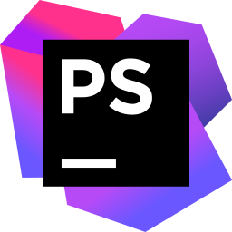</a> | **📂 檔名:** `phpstorm.svg` ✨ **格式:** `Vector (SVG)` ⚖️ **大小:** `6.49KB` 📅 **更新:** `2026-03-02`  🚀 **jsDelivr Markdown:** `` 🔗 **直接連結 (Url):** <code>https://cdn.jsdelivr.net/gh/barry028/materials@main/images/iCons/Brands/phpstorm.svg</code> 📥 [檢視原始檔](phpstorm.svg) |
|  | **📂 檔名:** `pinecone-icon.svg` ✨ **格式:** `Vector (SVG)` ⚖️ **大小:** `3.40KB` 📅 **更新:** `2026-03-02`  🚀 **jsDelivr Markdown:** `` 🔗 **直接連結 (Url):** <code>https://cdn.jsdelivr.net/gh/barry028/materials@main/images/iCons/Brands/pinecone-icon.svg</code> 📥 [檢視原始檔](pinecone-icon.svg) |
|  | **📂 檔名:** `pinecone.svg` ✨ **格式:** `Vector (SVG)` ⚖️ **大小:** `8.26KB` 📅 **更新:** `2026-03-02`  🚀 **jsDelivr Markdown:** `` 🔗 **直接連結 (Url):** <code>https://cdn.jsdelivr.net/gh/barry028/materials@main/images/iCons/Brands/pinecone.svg</code> 📥 [檢視原始檔](pinecone.svg) |
|  | **📂 檔名:** `pinia.svg` ✨ **格式:** `Vector (SVG)` ⚖️ **大小:** `9.78KB` 📅 **更新:** `2026-03-02`  🚀 **jsDelivr Markdown:** `` 🔗 **直接連結 (Url):** <code>https://cdn.jsdelivr.net/gh/barry028/materials@main/images/iCons/Brands/pinia.svg</code> 📥 [檢視原始檔](pinia.svg) |
|  | **📂 檔名:** `pinterest.svg` ✨ **格式:** `Vector (SVG)` ⚖️ **大小:** `1.45KB` 📅 **更新:** `2026-03-02`  🚀 **jsDelivr Markdown:** `` 🔗 **直接連結 (Url):** <code>https://cdn.jsdelivr.net/gh/barry028/materials@main/images/iCons/Brands/pinterest.svg</code> 📥 [檢視原始檔](pinterest.svg) |
|  | **📂 檔名:** `pipedream.svg` ✨ **格式:** `Vector (SVG)` ⚖️ **大小:** `12.67KB` 📅 **更新:** `2026-03-02`  🚀 **jsDelivr Markdown:** `` 🔗 **直接連結 (Url):** <code>https://cdn.jsdelivr.net/gh/barry028/materials@main/images/iCons/Brands/pipedream.svg</code> 📥 [檢視原始檔](pipedream.svg) |
|  | **📂 檔名:** `pipedrive.svg` ✨ **格式:** `Vector (SVG)` ⚖️ **大小:** `12.31KB` 📅 **更新:** `2026-03-02`  🚀 **jsDelivr Markdown:** `` 🔗 **直接連結 (Url):** <code>https://cdn.jsdelivr.net/gh/barry028/materials@main/images/iCons/Brands/pipedrive.svg</code> 📥 [檢視原始檔](pipedrive.svg) |
|  | **📂 檔名:** `pipefy.svg` ✨ **格式:** `Vector (SVG)` ⚖️ **大小:** `7.10KB` 📅 **更新:** `2026-03-02`  🚀 **jsDelivr Markdown:** `` 🔗 **直接連結 (Url):** <code>https://cdn.jsdelivr.net/gh/barry028/materials@main/images/iCons/Brands/pipefy.svg</code> 📥 [檢視原始檔](pipefy.svg) |
|  | **📂 檔名:** `pivotal_tracker.svg` ✨ **格式:** `Vector (SVG)` ⚖️ **大小:** `2.21KB` 📅 **更新:** `2026-03-02`  🚀 **jsDelivr Markdown:** `` 🔗 **直接連結 (Url):** <code>https://cdn.jsdelivr.net/gh/barry028/materials@main/images/iCons/Brands/pivotal_tracker.svg</code> 📥 [檢視原始檔](pivotal_tracker.svg) |
|  | **📂 檔名:** `pixijs.svg` ✨ **格式:** `Vector (SVG)` ⚖️ **大小:** `3.78KB` 📅 **更新:** `2026-03-02`  🚀 **jsDelivr Markdown:** `` 🔗 **直接連結 (Url):** <code>https://cdn.jsdelivr.net/gh/barry028/materials@main/images/iCons/Brands/pixijs.svg</code> 📥 [檢視原始檔](pixijs.svg) |
|  | **📂 檔名:** `pkg.svg` ✨ **格式:** `Vector (SVG)` ⚖️ **大小:** `1.05KB` 📅 **更新:** `2026-03-02`  🚀 **jsDelivr Markdown:** `` 🔗 **直接連結 (Url):** <code>https://cdn.jsdelivr.net/gh/barry028/materials@main/images/iCons/Brands/pkg.svg</code> 📥 [檢視原始檔](pkg.svg) |
|  | **📂 檔名:** `planetscale.svg` ✨ **格式:** `Vector (SVG)` ⚖️ **大小:** `640.00B` 📅 **更新:** `2026-03-02`  🚀 **jsDelivr Markdown:** `` 🔗 **直接連結 (Url):** <code>https://cdn.jsdelivr.net/gh/barry028/materials@main/images/iCons/Brands/planetscale.svg</code> 📥 [檢視原始檔](planetscale.svg) |
| <a href="planless-icon.svg">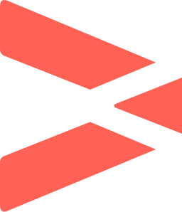</a> | **📂 檔名:** `planless-icon.svg` ✨ **格式:** `Vector (SVG)` ⚖️ **大小:** `1010.00B` 📅 **更新:** `2026-03-02`  🚀 **jsDelivr Markdown:** `` 🔗 **直接連結 (Url):** <code>https://cdn.jsdelivr.net/gh/barry028/materials@main/images/iCons/Brands/planless-icon.svg</code> 📥 [檢視原始檔](planless-icon.svg) |
|  | **📂 檔名:** `planless.svg` ✨ **格式:** `Vector (SVG)` ⚖️ **大小:** `9.26KB` 📅 **更新:** `2026-03-02`  🚀 **jsDelivr Markdown:** `` 🔗 **直接連結 (Url):** <code>https://cdn.jsdelivr.net/gh/barry028/materials@main/images/iCons/Brands/planless.svg</code> 📥 [檢視原始檔](planless.svg) |
|  | **📂 檔名:** `plasmic.svg` ✨ **格式:** `Vector (SVG)` ⚖️ **大小:** `1.88KB` 📅 **更新:** `2026-03-02`  🚀 **jsDelivr Markdown:** `` 🔗 **直接連結 (Url):** <code>https://cdn.jsdelivr.net/gh/barry028/materials@main/images/iCons/Brands/plasmic.svg</code> 📥 [檢視原始檔](plasmic.svg) |
| <a href="plastic-scm.svg">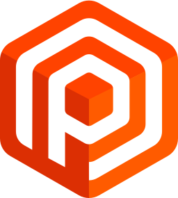</a> | **📂 檔名:** `plastic-scm.svg` ✨ **格式:** `Vector (SVG)` ⚖️ **大小:** `3.71KB` 📅 **更新:** `2026-03-02`  🚀 **jsDelivr Markdown:** `` 🔗 **直接連結 (Url):** <code>https://cdn.jsdelivr.net/gh/barry028/materials@main/images/iCons/Brands/plastic-scm.svg</code> 📥 [檢視原始檔](plastic-scm.svg) |
|  | **📂 檔名:** `platformio.svg` ✨ **格式:** `Vector (SVG)` ⚖️ **大小:** `3.02KB` 📅 **更新:** `2026-03-02`  🚀 **jsDelivr Markdown:** `` 🔗 **直接連結 (Url):** <code>https://cdn.jsdelivr.net/gh/barry028/materials@main/images/iCons/Brands/platformio.svg</code> 📥 [檢視原始檔](platformio.svg) |
|  | **📂 檔名:** `play.svg` ✨ **格式:** `Vector (SVG)` ⚖️ **大小:** `4.87KB` 📅 **更新:** `2026-03-02`  🚀 **jsDelivr Markdown:** `` 🔗 **直接連結 (Url):** <code>https://cdn.jsdelivr.net/gh/barry028/materials@main/images/iCons/Brands/play.svg</code> 📥 [檢視原始檔](play.svg) |
|  | **📂 檔名:** `playwright.svg` ✨ **格式:** `Vector (SVG)` ⚖️ **大小:** `7.17KB` 📅 **更新:** `2026-03-02`  🚀 **jsDelivr Markdown:** `` 🔗 **直接連結 (Url):** <code>https://cdn.jsdelivr.net/gh/barry028/materials@main/images/iCons/Brands/playwright.svg</code> 📥 [檢視原始檔](playwright.svg) |
|  | **📂 檔名:** `pluralsight-icon.svg` ✨ **格式:** `Vector (SVG)` ⚖️ **大小:** `1.23KB` 📅 **更新:** `2026-03-02`  🚀 **jsDelivr Markdown:** `` 🔗 **直接連結 (Url):** <code>https://cdn.jsdelivr.net/gh/barry028/materials@main/images/iCons/Brands/pluralsight-icon.svg</code> 📥 [檢視原始檔](pluralsight-icon.svg) |
|  | **📂 檔名:** `pluralsight.svg` ✨ **格式:** `Vector (SVG)` ⚖️ **大小:** `5.91KB` 📅 **更新:** `2026-03-02`  🚀 **jsDelivr Markdown:** `` 🔗 **直接連結 (Url):** <code>https://cdn.jsdelivr.net/gh/barry028/materials@main/images/iCons/Brands/pluralsight.svg</code> 📥 [檢視原始檔](pluralsight.svg) |
| <a href="pm2-icon.svg">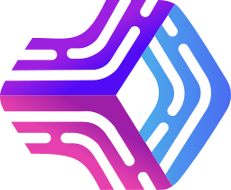</a> | **📂 檔名:** `pm2-icon.svg` ✨ **格式:** `Vector (SVG)` ⚖️ **大小:** `6.56KB` 📅 **更新:** `2026-03-02`  🚀 **jsDelivr Markdown:** `` 🔗 **直接連結 (Url):** <code>https://cdn.jsdelivr.net/gh/barry028/materials@main/images/iCons/Brands/pm2-icon.svg</code> 📥 [檢視原始檔](pm2-icon.svg) |
|  | **📂 檔名:** `pm2.svg` ✨ **格式:** `Vector (SVG)` ⚖️ **大小:** `11.69KB` 📅 **更新:** `2026-03-02`  🚀 **jsDelivr Markdown:** `` 🔗 **直接連結 (Url):** <code>https://cdn.jsdelivr.net/gh/barry028/materials@main/images/iCons/Brands/pm2.svg</code> 📥 [檢視原始檔](pm2.svg) |
| <a href="pnpm.svg">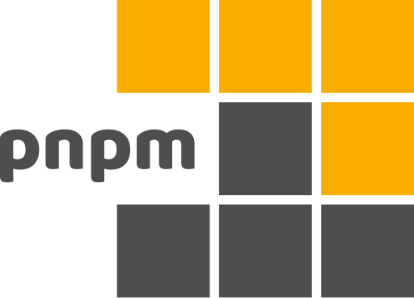</a> | **📂 檔名:** `pnpm.svg` ✨ **格式:** `Vector (SVG)` ⚖️ **大小:** `9.71KB` 📅 **更新:** `2026-03-02`  🚀 **jsDelivr Markdown:** `` 🔗 **直接連結 (Url):** <code>https://cdn.jsdelivr.net/gh/barry028/materials@main/images/iCons/Brands/pnpm.svg</code> 📥 [檢視原始檔](pnpm.svg) |
|  | **📂 檔名:** `pocket-base.svg` ✨ **格式:** `Vector (SVG)` ⚖️ **大小:** `5.65KB` 📅 **更新:** `2026-03-02`  🚀 **jsDelivr Markdown:** `` 🔗 **直接連結 (Url):** <code>https://cdn.jsdelivr.net/gh/barry028/materials@main/images/iCons/Brands/pocket-base.svg</code> 📥 [檢視原始檔](pocket-base.svg) |
|  | **📂 檔名:** `poeditor.svg` ✨ **格式:** `Vector (SVG)` ⚖️ **大小:** `3.88KB` 📅 **更新:** `2026-03-02`  🚀 **jsDelivr Markdown:** `` 🔗 **直接連結 (Url):** <code>https://cdn.jsdelivr.net/gh/barry028/materials@main/images/iCons/Brands/poeditor.svg</code> 📥 [檢視原始檔](poeditor.svg) |
|  | **📂 檔名:** `polymer.svg` ✨ **格式:** `Vector (SVG)` ⚖️ **大小:** `4.58KB` 📅 **更新:** `2026-03-02`  🚀 **jsDelivr Markdown:** `` 🔗 **直接連結 (Url):** <code>https://cdn.jsdelivr.net/gh/barry028/materials@main/images/iCons/Brands/polymer.svg</code> 📥 [檢視原始檔](polymer.svg) |
|  | **📂 檔名:** `postcss.svg` ✨ **格式:** `Vector (SVG)` ⚖️ **大小:** `59.37KB` 📅 **更新:** `2026-03-02`  🚀 **jsDelivr Markdown:** `` 🔗 **直接連結 (Url):** <code>https://cdn.jsdelivr.net/gh/barry028/materials@main/images/iCons/Brands/postcss.svg</code> 📥 [檢視原始檔](postcss.svg) |
|  | **📂 檔名:** `postgraphile.svg` ✨ **格式:** `Vector (SVG)` ⚖️ **大小:** `5.07KB` 📅 **更新:** `2026-03-02`  🚀 **jsDelivr Markdown:** `` 🔗 **直接連結 (Url):** <code>https://cdn.jsdelivr.net/gh/barry028/materials@main/images/iCons/Brands/postgraphile.svg</code> 📥 [檢視原始檔](postgraphile.svg) |
|  | **📂 檔名:** `postgresql.svg` ✨ **格式:** `Vector (SVG)` ⚖️ **大小:** `12.91KB` 📅 **更新:** `2026-03-02`  🚀 **jsDelivr Markdown:** `` 🔗 **直接連結 (Url):** <code>https://cdn.jsdelivr.net/gh/barry028/materials@main/images/iCons/Brands/postgresql.svg</code> 📥 [檢視原始檔](postgresql.svg) |
|  | **📂 檔名:** `posthog-icon.svg` ✨ **格式:** `Vector (SVG)` ⚖️ **大小:** `4.38KB` 📅 **更新:** `2026-03-02`  🚀 **jsDelivr Markdown:** `` 🔗 **直接連結 (Url):** <code>https://cdn.jsdelivr.net/gh/barry028/materials@main/images/iCons/Brands/posthog-icon.svg</code> 📥 [檢視原始檔](posthog-icon.svg) |
|  | **📂 檔名:** `posthog.svg` ✨ **格式:** `Vector (SVG)` ⚖️ **大小:** `8.61KB` 📅 **更新:** `2026-03-02`  🚀 **jsDelivr Markdown:** `` 🔗 **直接連結 (Url):** <code>https://cdn.jsdelivr.net/gh/barry028/materials@main/images/iCons/Brands/posthog.svg</code> 📥 [檢視原始檔](posthog.svg) |
|  | **📂 檔名:** `postman-icon.svg` ✨ **格式:** `Vector (SVG)` ⚖️ **大小:** `12.31KB` 📅 **更新:** `2026-03-02`  🚀 **jsDelivr Markdown:** `` 🔗 **直接連結 (Url):** <code>https://cdn.jsdelivr.net/gh/barry028/materials@main/images/iCons/Brands/postman-icon.svg</code> 📥 [檢視原始檔](postman-icon.svg) |
|  | **📂 檔名:** `postman.svg` ✨ **格式:** `Vector (SVG)` ⚖️ **大小:** `20.52KB` 📅 **更新:** `2026-03-02`  🚀 **jsDelivr Markdown:** `` 🔗 **直接連結 (Url):** <code>https://cdn.jsdelivr.net/gh/barry028/materials@main/images/iCons/Brands/postman.svg</code> 📥 [檢視原始檔](postman.svg) |
| <a href="pouchdb.svg">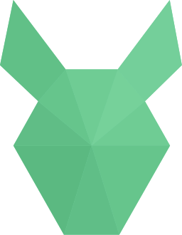</a> | **📂 檔名:** `pouchdb.svg` ✨ **格式:** `Vector (SVG)` ⚖️ **大小:** `1.93KB` 📅 **更新:** `2026-03-02`  🚀 **jsDelivr Markdown:** `` 🔗 **直接連結 (Url):** <code>https://cdn.jsdelivr.net/gh/barry028/materials@main/images/iCons/Brands/pouchdb.svg</code> 📥 [檢視原始檔](pouchdb.svg) |
|  | **📂 檔名:** `preact.svg` ✨ **格式:** `Vector (SVG)` ⚖️ **大小:** `2.42KB` 📅 **更新:** `2026-03-02`  🚀 **jsDelivr Markdown:** `` 🔗 **直接連結 (Url):** <code>https://cdn.jsdelivr.net/gh/barry028/materials@main/images/iCons/Brands/preact.svg</code> 📥 [檢視原始檔](preact.svg) |
|  | **📂 檔名:** `precursor.svg` ✨ **格式:** `Vector (SVG)` ⚖️ **大小:** `817.00B` 📅 **更新:** `2026-03-02`  🚀 **jsDelivr Markdown:** `` 🔗 **直接連結 (Url):** <code>https://cdn.jsdelivr.net/gh/barry028/materials@main/images/iCons/Brands/precursor.svg</code> 📥 [檢視原始檔](precursor.svg) |
|  | **📂 檔名:** `prerender-icon.svg` ✨ **格式:** `Vector (SVG)` ⚖️ **大小:** `795.00B` 📅 **更新:** `2026-03-02`  🚀 **jsDelivr Markdown:** `` 🔗 **直接連結 (Url):** <code>https://cdn.jsdelivr.net/gh/barry028/materials@main/images/iCons/Brands/prerender-icon.svg</code> 📥 [檢視原始檔](prerender-icon.svg) |
|  | **📂 檔名:** `prerender.svg` ✨ **格式:** `Vector (SVG)` ⚖️ **大小:** `10.56KB` 📅 **更新:** `2026-03-02`  🚀 **jsDelivr Markdown:** `` 🔗 **直接連結 (Url):** <code>https://cdn.jsdelivr.net/gh/barry028/materials@main/images/iCons/Brands/prerender.svg</code> 📥 [檢視原始檔](prerender.svg) |
|  | **📂 檔名:** `prestashop.svg` ✨ **格式:** `Vector (SVG)` ⚖️ **大小:** `31.14KB` 📅 **更新:** `2026-03-02`  🚀 **jsDelivr Markdown:** `` 🔗 **直接連結 (Url):** <code>https://cdn.jsdelivr.net/gh/barry028/materials@main/images/iCons/Brands/prestashop.svg</code> 📥 [檢視原始檔](prestashop.svg) |
| <a href="presto.svg">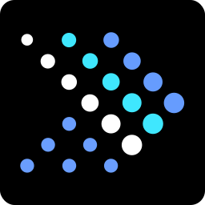</a> | **📂 檔名:** `presto.svg` ✨ **格式:** `Vector (SVG)` ⚖️ **大小:** `5.10KB` 📅 **更新:** `2026-03-02`  🚀 **jsDelivr Markdown:** `` 🔗 **直接連結 (Url):** <code>https://cdn.jsdelivr.net/gh/barry028/materials@main/images/iCons/Brands/presto.svg</code> 📥 [檢視原始檔](presto.svg) |
| <a href="prettier.svg">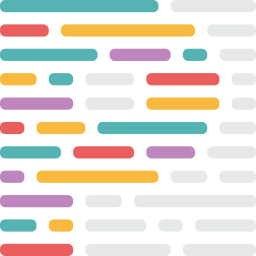</a> | **📂 檔名:** `prettier.svg` ✨ **格式:** `Vector (SVG)` ⚖️ **大小:** `4.64KB` 📅 **更新:** `2026-03-02`  🚀 **jsDelivr Markdown:** `` 🔗 **直接連結 (Url):** <code>https://cdn.jsdelivr.net/gh/barry028/materials@main/images/iCons/Brands/prettier.svg</code> 📥 [檢視原始檔](prettier.svg) |
|  | **📂 檔名:** `prisma.svg` ✨ **格式:** `Vector (SVG)` ⚖️ **大小:** `1.21KB` 📅 **更新:** `2026-03-02`  🚀 **jsDelivr Markdown:** `` 🔗 **直接連結 (Url):** <code>https://cdn.jsdelivr.net/gh/barry028/materials@main/images/iCons/Brands/prisma.svg</code> 📥 [檢視原始檔](prisma.svg) |
|  | **📂 檔名:** `prismic-icon.svg` ✨ **格式:** `Vector (SVG)` ⚖️ **大小:** `6.73KB` 📅 **更新:** `2026-03-02`  🚀 **jsDelivr Markdown:** `` 🔗 **直接連結 (Url):** <code>https://cdn.jsdelivr.net/gh/barry028/materials@main/images/iCons/Brands/prismic-icon.svg</code> 📥 [檢視原始檔](prismic-icon.svg) |
|  | **📂 檔名:** `prismic.svg` ✨ **格式:** `Vector (SVG)` ⚖️ **大小:** `19.38KB` 📅 **更新:** `2026-03-02`  🚀 **jsDelivr Markdown:** `` 🔗 **直接連結 (Url):** <code>https://cdn.jsdelivr.net/gh/barry028/materials@main/images/iCons/Brands/prismic.svg</code> 📥 [檢視原始檔](prismic.svg) |
|  | **📂 檔名:** `processing.svg` ✨ **格式:** `Vector (SVG)` ⚖️ **大小:** `1.12KB` 📅 **更新:** `2026-03-02`  🚀 **jsDelivr Markdown:** `` 🔗 **直接連結 (Url):** <code>https://cdn.jsdelivr.net/gh/barry028/materials@main/images/iCons/Brands/processing.svg</code> 📥 [檢視原始檔](processing.svg) |
|  | **📂 檔名:** `processwire-icon.svg` ✨ **格式:** `Vector (SVG)` ⚖️ **大小:** `4.12KB` 📅 **更新:** `2026-03-02`  🚀 **jsDelivr Markdown:** `` 🔗 **直接連結 (Url):** <code>https://cdn.jsdelivr.net/gh/barry028/materials@main/images/iCons/Brands/processwire-icon.svg</code> 📥 [檢視原始檔](processwire-icon.svg) |
|  | **📂 檔名:** `processwire.svg` ✨ **格式:** `Vector (SVG)` ⚖️ **大小:** `21.28KB` 📅 **更新:** `2026-03-02`  🚀 **jsDelivr Markdown:** `` 🔗 **直接連結 (Url):** <code>https://cdn.jsdelivr.net/gh/barry028/materials@main/images/iCons/Brands/processwire.svg</code> 📥 [檢視原始檔](processwire.svg) |
| <a href="productboard-icon.svg">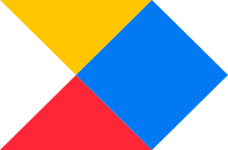</a> | **📂 檔名:** `productboard-icon.svg` ✨ **格式:** `Vector (SVG)` ⚖️ **大小:** `568.00B` 📅 **更新:** `2026-03-02`  🚀 **jsDelivr Markdown:** `` 🔗 **直接連結 (Url):** <code>https://cdn.jsdelivr.net/gh/barry028/materials@main/images/iCons/Brands/productboard-icon.svg</code> 📥 [檢視原始檔](productboard-icon.svg) |
|  | **📂 檔名:** `productboard.svg` ✨ **格式:** `Vector (SVG)` ⚖️ **大小:** `13.06KB` 📅 **更新:** `2026-03-02`  🚀 **jsDelivr Markdown:** `` 🔗 **直接連結 (Url):** <code>https://cdn.jsdelivr.net/gh/barry028/materials@main/images/iCons/Brands/productboard.svg</code> 📥 [檢視原始檔](productboard.svg) |
|  | **📂 檔名:** `producthunt.svg` ✨ **格式:** `Vector (SVG)` ⚖️ **大小:** `1.08KB` 📅 **更新:** `2026-03-02`  🚀 **jsDelivr Markdown:** `` 🔗 **直接連結 (Url):** <code>https://cdn.jsdelivr.net/gh/barry028/materials@main/images/iCons/Brands/producthunt.svg</code> 📥 [檢視原始檔](producthunt.svg) |
|  | **📂 檔名:** `progress.svg` ✨ **格式:** `Vector (SVG)` ⚖️ **大小:** `668.00B` 📅 **更新:** `2026-03-02`  🚀 **jsDelivr Markdown:** `` 🔗 **直接連結 (Url):** <code>https://cdn.jsdelivr.net/gh/barry028/materials@main/images/iCons/Brands/progress.svg</code> 📥 [檢視原始檔](progress.svg) |
|  | **📂 檔名:** `prometheus.svg` ✨ **格式:** `Vector (SVG)` ⚖️ **大小:** `2.06KB` 📅 **更新:** `2026-03-02`  🚀 **jsDelivr Markdown:** `` 🔗 **直接連結 (Url):** <code>https://cdn.jsdelivr.net/gh/barry028/materials@main/images/iCons/Brands/prometheus.svg</code> 📥 [檢視原始檔](prometheus.svg) |
| <a href="promises.svg">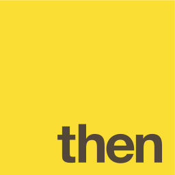</a> | **📂 檔名:** `promises.svg` ✨ **格式:** `Vector (SVG)` ⚖️ **大小:** `4.75KB` 📅 **更新:** `2026-03-02`  🚀 **jsDelivr Markdown:** `` 🔗 **直接連結 (Url):** <code>https://cdn.jsdelivr.net/gh/barry028/materials@main/images/iCons/Brands/promises.svg</code> 📥 [檢視原始檔](promises.svg) |
|  | **📂 檔名:** `proofy.svg` ✨ **格式:** `Vector (SVG)` ⚖️ **大小:** `1.69KB` 📅 **更新:** `2026-03-02`  🚀 **jsDelivr Markdown:** `` 🔗 **直接連結 (Url):** <code>https://cdn.jsdelivr.net/gh/barry028/materials@main/images/iCons/Brands/proofy.svg</code> 📥 [檢視原始檔](proofy.svg) |
|  | **📂 檔名:** `protoio.svg` ✨ **格式:** `Vector (SVG)` ⚖️ **大小:** `3.67KB` 📅 **更新:** `2026-03-02`  🚀 **jsDelivr Markdown:** `` 🔗 **直接連結 (Url):** <code>https://cdn.jsdelivr.net/gh/barry028/materials@main/images/iCons/Brands/protoio.svg</code> 📥 [檢視原始檔](protoio.svg) |
|  | **📂 檔名:** `protonet.svg` ✨ **格式:** `Vector (SVG)` ⚖️ **大小:** `6.64KB` 📅 **更新:** `2026-03-02`  🚀 **jsDelivr Markdown:** `` 🔗 **直接連結 (Url):** <code>https://cdn.jsdelivr.net/gh/barry028/materials@main/images/iCons/Brands/protonet.svg</code> 📥 [檢視原始檔](protonet.svg) |
|  | **📂 檔名:** `protractor.svg` ✨ **格式:** `Vector (SVG)` ⚖️ **大小:** `1.78KB` 📅 **更新:** `2026-03-02`  🚀 **jsDelivr Markdown:** `` 🔗 **直接連結 (Url):** <code>https://cdn.jsdelivr.net/gh/barry028/materials@main/images/iCons/Brands/protractor.svg</code> 📥 [檢視原始檔](protractor.svg) |
|  | **📂 檔名:** `prott.svg` ✨ **格式:** `Vector (SVG)` ⚖️ **大小:** `4.45KB` 📅 **更新:** `2026-03-02`  🚀 **jsDelivr Markdown:** `` 🔗 **直接連結 (Url):** <code>https://cdn.jsdelivr.net/gh/barry028/materials@main/images/iCons/Brands/prott.svg</code> 📥 [檢視原始檔](prott.svg) |
|  | **📂 檔名:** `pug.svg` ✨ **格式:** `Vector (SVG)` ⚖️ **大小:** `8.55KB` 📅 **更新:** `2026-03-02`  🚀 **jsDelivr Markdown:** `` 🔗 **直接連結 (Url):** <code>https://cdn.jsdelivr.net/gh/barry028/materials@main/images/iCons/Brands/pug.svg</code> 📥 [檢視原始檔](pug.svg) |
|  | **📂 檔名:** `pumpkindb.svg` ✨ **格式:** `Vector (SVG)` ⚖️ **大小:** `3.52KB` 📅 **更新:** `2026-03-02`  🚀 **jsDelivr Markdown:** `` 🔗 **直接連結 (Url):** <code>https://cdn.jsdelivr.net/gh/barry028/materials@main/images/iCons/Brands/pumpkindb.svg</code> 📥 [檢視原始檔](pumpkindb.svg) |
|  | **📂 檔名:** `puppet-icon.svg` ✨ **格式:** `Vector (SVG)` ⚖️ **大小:** `839.00B` 📅 **更新:** `2026-03-02`  🚀 **jsDelivr Markdown:** `` 🔗 **直接連結 (Url):** <code>https://cdn.jsdelivr.net/gh/barry028/materials@main/images/iCons/Brands/puppet-icon.svg</code> 📥 [檢視原始檔](puppet-icon.svg) |
|  | **📂 檔名:** `puppet.svg` ✨ **格式:** `Vector (SVG)` ⚖️ **大小:** `4.86KB` 📅 **更新:** `2026-03-02`  🚀 **jsDelivr Markdown:** `` 🔗 **直接連結 (Url):** <code>https://cdn.jsdelivr.net/gh/barry028/materials@main/images/iCons/Brands/puppet.svg</code> 📥 [檢視原始檔](puppet.svg) |
| <a href="puppeteer.svg">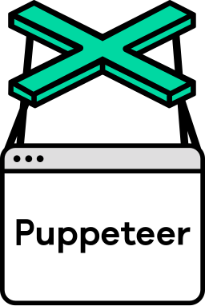</a> | **📂 檔名:** `puppeteer.svg` ✨ **格式:** `Vector (SVG)` ⚖️ **大小:** `12.47KB` 📅 **更新:** `2026-03-02`  🚀 **jsDelivr Markdown:** `` 🔗 **直接連結 (Url):** <code>https://cdn.jsdelivr.net/gh/barry028/materials@main/images/iCons/Brands/puppeteer.svg</code> 📥 [檢視原始檔](puppeteer.svg) |
|  | **📂 檔名:** `purescript-icon.svg` ✨ **格式:** `Vector (SVG)` ⚖️ **大小:** `1.23KB` 📅 **更新:** `2026-03-02`  🚀 **jsDelivr Markdown:** `` 🔗 **直接連結 (Url):** <code>https://cdn.jsdelivr.net/gh/barry028/materials@main/images/iCons/Brands/purescript-icon.svg</code> 📥 [檢視原始檔](purescript-icon.svg) |
|  | **📂 檔名:** `purescript.svg` ✨ **格式:** `Vector (SVG)` ⚖️ **大小:** `8.05KB` 📅 **更新:** `2026-03-02`  🚀 **jsDelivr Markdown:** `` 🔗 **直接連結 (Url):** <code>https://cdn.jsdelivr.net/gh/barry028/materials@main/images/iCons/Brands/purescript.svg</code> 📥 [檢視原始檔](purescript.svg) |
|  | **📂 檔名:** `pushbullet.svg` ✨ **格式:** `Vector (SVG)` ⚖️ **大小:** `1.74KB` 📅 **更新:** `2026-03-02`  🚀 **jsDelivr Markdown:** `` 🔗 **直接連結 (Url):** <code>https://cdn.jsdelivr.net/gh/barry028/materials@main/images/iCons/Brands/pushbullet.svg</code> 📥 [檢視原始檔](pushbullet.svg) |
|  | **📂 檔名:** `pusher-icon.svg` ✨ **格式:** `Vector (SVG)` ⚖️ **大小:** `3.80KB` 📅 **更新:** `2026-03-02`  🚀 **jsDelivr Markdown:** `` 🔗 **直接連結 (Url):** <code>https://cdn.jsdelivr.net/gh/barry028/materials@main/images/iCons/Brands/pusher-icon.svg</code> 📥 [檢視原始檔](pusher-icon.svg) |
|  | **📂 檔名:** `pusher.svg` ✨ **格式:** `Vector (SVG)` ⚖️ **大小:** `12.49KB` 📅 **更新:** `2026-03-02`  🚀 **jsDelivr Markdown:** `` 🔗 **直接連結 (Url):** <code>https://cdn.jsdelivr.net/gh/barry028/materials@main/images/iCons/Brands/pusher.svg</code> 📥 [檢視原始檔](pusher.svg) |
|  | **📂 檔名:** `pwa.svg` ✨ **格式:** `Vector (SVG)` ⚖️ **大小:** `1.52KB` 📅 **更新:** `2026-03-02`  🚀 **jsDelivr Markdown:** `` 🔗 **直接連結 (Url):** <code>https://cdn.jsdelivr.net/gh/barry028/materials@main/images/iCons/Brands/pwa.svg</code> 📥 [檢視原始檔](pwa.svg) |
| <a href="pycharm.svg">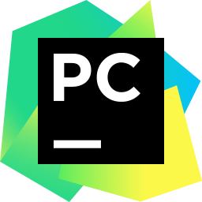</a> | **📂 檔名:** `pycharm.svg` ✨ **格式:** `Vector (SVG)` ⚖️ **大小:** `5.56KB` 📅 **更新:** `2026-03-02`  🚀 **jsDelivr Markdown:** `` 🔗 **直接連結 (Url):** <code>https://cdn.jsdelivr.net/gh/barry028/materials@main/images/iCons/Brands/pycharm.svg</code> 📥 [檢視原始檔](pycharm.svg) |
|  | **📂 檔名:** `pypi.svg` ✨ **格式:** `Vector (SVG)` ⚖️ **大小:** `17.48KB` 📅 **更新:** `2026-03-02`  🚀 **jsDelivr Markdown:** `` 🔗 **直接連結 (Url):** <code>https://cdn.jsdelivr.net/gh/barry028/materials@main/images/iCons/Brands/pypi.svg</code> 📥 [檢視原始檔](pypi.svg) |
| <a href="pyscript.svg">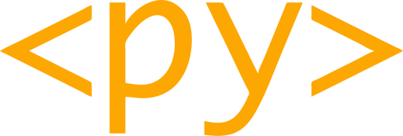</a> | **📂 檔名:** `pyscript.svg` ✨ **格式:** `Vector (SVG)` ⚖️ **大小:** `4.76KB` 📅 **更新:** `2026-03-02`  🚀 **jsDelivr Markdown:** `` 🔗 **直接連結 (Url):** <code>https://cdn.jsdelivr.net/gh/barry028/materials@main/images/iCons/Brands/pyscript.svg</code> 📥 [檢視原始檔](pyscript.svg) |
|  | **📂 檔名:** `python.svg` ✨ **格式:** `Vector (SVG)` ⚖️ **大小:** `2.84KB` 📅 **更新:** `2026-03-02`  🚀 **jsDelivr Markdown:** `` 🔗 **直接連結 (Url):** <code>https://cdn.jsdelivr.net/gh/barry028/materials@main/images/iCons/Brands/python.svg</code> 📥 [檢視原始檔](python.svg) |
| <a href="pytorch-icon.svg">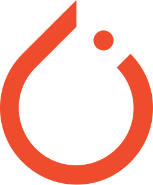</a> | **📂 檔名:** `pytorch-icon.svg` ✨ **格式:** `Vector (SVG)` ⚖️ **大小:** `1.10KB` 📅 **更新:** `2026-03-02`  🚀 **jsDelivr Markdown:** `` 🔗 **直接連結 (Url):** <code>https://cdn.jsdelivr.net/gh/barry028/materials@main/images/iCons/Brands/pytorch-icon.svg</code> 📥 [檢視原始檔](pytorch-icon.svg) |
|  | **📂 檔名:** `pytorch.svg` ✨ **格式:** `Vector (SVG)` ⚖️ **大小:** `6.10KB` 📅 **更新:** `2026-03-02`  🚀 **jsDelivr Markdown:** `` 🔗 **直接連結 (Url):** <code>https://cdn.jsdelivr.net/gh/barry028/materials@main/images/iCons/Brands/pytorch.svg</code> 📥 [檢視原始檔](pytorch.svg) |
| <a href="pyup.svg">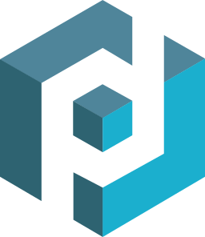</a> | **📂 檔名:** `pyup.svg` ✨ **格式:** `Vector (SVG)` ⚖️ **大小:** `1.36KB` 📅 **更新:** `2026-03-02`  🚀 **jsDelivr Markdown:** `` 🔗 **直接連結 (Url):** <code>https://cdn.jsdelivr.net/gh/barry028/materials@main/images/iCons/Brands/pyup.svg</code> 📥 [檢視原始檔](pyup.svg) |
| <a href="q.svg">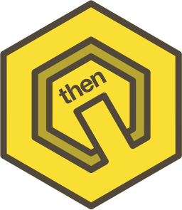</a> | **📂 檔名:** `q.svg` ✨ **格式:** `Vector (SVG)` ⚖️ **大小:** `11.93KB` 📅 **更新:** `2026-03-02`  🚀 **jsDelivr Markdown:** `` 🔗 **直接連結 (Url):** <code>https://cdn.jsdelivr.net/gh/barry028/materials@main/images/iCons/Brands/q.svg</code> 📥 [檢視原始檔](q.svg) |
|  | **📂 檔名:** `qlik.svg` ✨ **格式:** `Vector (SVG)` ⚖️ **大小:** `4.40KB` 📅 **更新:** `2026-03-02`  🚀 **jsDelivr Markdown:** `` 🔗 **直接連結 (Url):** <code>https://cdn.jsdelivr.net/gh/barry028/materials@main/images/iCons/Brands/qlik.svg</code> 📥 [檢視原始檔](qlik.svg) |
|  | **📂 檔名:** `qt.svg` ✨ **格式:** `Vector (SVG)` ⚖️ **大小:** `2.40KB` 📅 **更新:** `2026-03-02`  🚀 **jsDelivr Markdown:** `` 🔗 **直接連結 (Url):** <code>https://cdn.jsdelivr.net/gh/barry028/materials@main/images/iCons/Brands/qt.svg</code> 📥 [檢視原始檔](qt.svg) |
|  | **📂 檔名:** `qualcomm.svg` ✨ **格式:** `Vector (SVG)` ⚖️ **大小:** `6.64KB` 📅 **更新:** `2026-03-02`  🚀 **jsDelivr Markdown:** `` 🔗 **直接連結 (Url):** <code>https://cdn.jsdelivr.net/gh/barry028/materials@main/images/iCons/Brands/qualcomm.svg</code> 📥 [檢視原始檔](qualcomm.svg) |
| <a href="quarkus-icon.svg">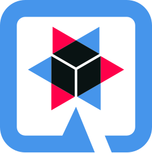</a> | **📂 檔名:** `quarkus-icon.svg` ✨ **格式:** `Vector (SVG)` ⚖️ **大小:** `2.18KB` 📅 **更新:** `2026-03-02`  🚀 **jsDelivr Markdown:** `` 🔗 **直接連結 (Url):** <code>https://cdn.jsdelivr.net/gh/barry028/materials@main/images/iCons/Brands/quarkus-icon.svg</code> 📥 [檢視原始檔](quarkus-icon.svg) |
|  | **📂 檔名:** `quarkus.svg` ✨ **格式:** `Vector (SVG)` ⚖️ **大小:** `7.77KB` 📅 **更新:** `2026-03-02`  🚀 **jsDelivr Markdown:** `` 🔗 **直接連結 (Url):** <code>https://cdn.jsdelivr.net/gh/barry028/materials@main/images/iCons/Brands/quarkus.svg</code> 📥 [檢視原始檔](quarkus.svg) |
|  | **📂 檔名:** `quay.svg` ✨ **格式:** `Vector (SVG)` ⚖️ **大小:** `1.01KB` 📅 **更新:** `2026-03-02`  🚀 **jsDelivr Markdown:** `` 🔗 **直接連結 (Url):** <code>https://cdn.jsdelivr.net/gh/barry028/materials@main/images/iCons/Brands/quay.svg</code> 📥 [檢視原始檔](quay.svg) |
|  | **📂 檔名:** `quobyte.svg` ✨ **格式:** `Vector (SVG)` ⚖️ **大小:** `3.40KB` 📅 **更新:** `2026-03-02`  🚀 **jsDelivr Markdown:** `` 🔗 **直接連結 (Url):** <code>https://cdn.jsdelivr.net/gh/barry028/materials@main/images/iCons/Brands/quobyte.svg</code> 📥 [檢視原始檔](quobyte.svg) |
|  | **📂 檔名:** `quora.svg` ✨ **格式:** `Vector (SVG)` ⚖️ **大小:** `4.26KB` 📅 **更新:** `2026-03-02`  🚀 **jsDelivr Markdown:** `` 🔗 **直接連結 (Url):** <code>https://cdn.jsdelivr.net/gh/barry028/materials@main/images/iCons/Brands/quora.svg</code> 📥 [檢視原始檔](quora.svg) |
|  | **📂 檔名:** `qwik-icon.svg` ✨ **格式:** `Vector (SVG)` ⚖️ **大小:** `1.71KB` 📅 **更新:** `2026-03-02`  🚀 **jsDelivr Markdown:** `` 🔗 **直接連結 (Url):** <code>https://cdn.jsdelivr.net/gh/barry028/materials@main/images/iCons/Brands/qwik-icon.svg</code> 📥 [檢視原始檔](qwik-icon.svg) |
|  | **📂 檔名:** `qwik.svg` ✨ **格式:** `Vector (SVG)` ⚖️ **大小:** `4.31KB` 📅 **更新:** `2026-03-02`  🚀 **jsDelivr Markdown:** `` 🔗 **直接連結 (Url):** <code>https://cdn.jsdelivr.net/gh/barry028/materials@main/images/iCons/Brands/qwik.svg</code> 📥 [檢視原始檔](qwik.svg) |
|  | **📂 檔名:** `r-lang.svg` ✨ **格式:** `Vector (SVG)` ⚖️ **大小:** `1.53KB` 📅 **更新:** `2026-03-02`  🚀 **jsDelivr Markdown:** `` 🔗 **直接連結 (Url):** <code>https://cdn.jsdelivr.net/gh/barry028/materials@main/images/iCons/Brands/r-lang.svg</code> 📥 [檢視原始檔](r-lang.svg) |
|  | **📂 檔名:** `rabbitmq-icon.svg` ✨ **格式:** `Vector (SVG)` ⚖️ **大小:** `2.49KB` 📅 **更新:** `2026-03-02`  🚀 **jsDelivr Markdown:** `` 🔗 **直接連結 (Url):** <code>https://cdn.jsdelivr.net/gh/barry028/materials@main/images/iCons/Brands/rabbitmq-icon.svg</code> 📥 [檢視原始檔](rabbitmq-icon.svg) |
|  | **📂 檔名:** `rabbitmq.svg` ✨ **格式:** `Vector (SVG)` ⚖️ **大小:** `8.17KB` 📅 **更新:** `2026-03-02`  🚀 **jsDelivr Markdown:** `` 🔗 **直接連結 (Url):** <code>https://cdn.jsdelivr.net/gh/barry028/materials@main/images/iCons/Brands/rabbitmq.svg</code> 📥 [檢視原始檔](rabbitmq.svg) |
|  | **📂 檔名:** `rackspace-icon.svg` ✨ **格式:** `Vector (SVG)` ⚖️ **大小:** `651.00B` 📅 **更新:** `2026-03-02`  🚀 **jsDelivr Markdown:** `` 🔗 **直接連結 (Url):** <code>https://cdn.jsdelivr.net/gh/barry028/materials@main/images/iCons/Brands/rackspace-icon.svg</code> 📥 [檢視原始檔](rackspace-icon.svg) |
|  | **📂 檔名:** `rackspace.svg` ✨ **格式:** `Vector (SVG)` ⚖️ **大小:** `6.37KB` 📅 **更新:** `2026-03-02`  🚀 **jsDelivr Markdown:** `` 🔗 **直接連結 (Url):** <code>https://cdn.jsdelivr.net/gh/barry028/materials@main/images/iCons/Brands/rackspace.svg</code> 📥 [檢視原始檔](rackspace.svg) |
|  | **📂 檔名:** `rails.svg` ✨ **格式:** `Vector (SVG)` ⚖️ **大小:** `4.76KB` 📅 **更新:** `2026-03-02`  🚀 **jsDelivr Markdown:** `` 🔗 **直接連結 (Url):** <code>https://cdn.jsdelivr.net/gh/barry028/materials@main/images/iCons/Brands/rails.svg</code> 📥 [檢視原始檔](rails.svg) |
| <a href="ramda.svg">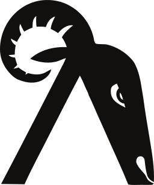</a> | **📂 檔名:** `ramda.svg` ✨ **格式:** `Vector (SVG)` ⚖️ **大小:** `5.10KB` 📅 **更新:** `2026-03-02`  🚀 **jsDelivr Markdown:** `` 🔗 **直接連結 (Url):** <code>https://cdn.jsdelivr.net/gh/barry028/materials@main/images/iCons/Brands/ramda.svg</code> 📥 [檢視原始檔](ramda.svg) |
|  | **📂 檔名:** `raml.svg` ✨ **格式:** `Vector (SVG)` ⚖️ **大小:** `3.35KB` 📅 **更新:** `2026-03-02`  🚀 **jsDelivr Markdown:** `` 🔗 **直接連結 (Url):** <code>https://cdn.jsdelivr.net/gh/barry028/materials@main/images/iCons/Brands/raml.svg</code> 📥 [檢視原始檔](raml.svg) |
|  | **📂 檔名:** `rancher-icon.svg` ✨ **格式:** `Vector (SVG)` ⚖️ **大小:** `3.47KB` 📅 **更新:** `2026-03-02`  🚀 **jsDelivr Markdown:** `` 🔗 **直接連結 (Url):** <code>https://cdn.jsdelivr.net/gh/barry028/materials@main/images/iCons/Brands/rancher-icon.svg</code> 📥 [檢視原始檔](rancher-icon.svg) |
|  | **📂 檔名:** `rancher.svg` ✨ **格式:** `Vector (SVG)` ⚖️ **大小:** `13.19KB` 📅 **更新:** `2026-03-02`  🚀 **jsDelivr Markdown:** `` 🔗 **直接連結 (Url):** <code>https://cdn.jsdelivr.net/gh/barry028/materials@main/images/iCons/Brands/rancher.svg</code> 📥 [檢視原始檔](rancher.svg) |
|  | **📂 檔名:** `raphael.svg` ✨ **格式:** `Vector (SVG)` ⚖️ **大小:** `4.26KB` 📅 **更新:** `2026-03-02`  🚀 **jsDelivr Markdown:** `` 🔗 **直接連結 (Url):** <code>https://cdn.jsdelivr.net/gh/barry028/materials@main/images/iCons/Brands/raphael.svg</code> 📥 [檢視原始檔](raphael.svg) |
| <a href="raspberry-pi.svg">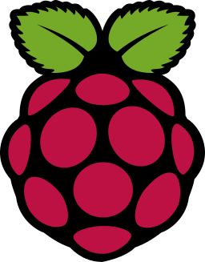</a> | **📂 檔名:** `raspberry-pi.svg` ✨ **格式:** `Vector (SVG)` ⚖️ **大小:** `7.71KB` 📅 **更新:** `2026-03-02`  🚀 **jsDelivr Markdown:** `` 🔗 **直接連結 (Url):** <code>https://cdn.jsdelivr.net/gh/barry028/materials@main/images/iCons/Brands/raspberry-pi.svg</code> 📥 [檢視原始檔](raspberry-pi.svg) |
|  | **📂 檔名:** `rax.svg` ✨ **格式:** `Vector (SVG)` ⚖️ **大小:** `753.00B` 📅 **更新:** `2026-03-02`  🚀 **jsDelivr Markdown:** `` 🔗 **直接連結 (Url):** <code>https://cdn.jsdelivr.net/gh/barry028/materials@main/images/iCons/Brands/rax.svg</code> 📥 [檢視原始檔](rax.svg) |
|  | **📂 檔名:** `react-query-icon.svg` ✨ **格式:** `Vector (SVG)` ⚖️ **大小:** `9.78KB` 📅 **更新:** `2026-03-02`  🚀 **jsDelivr Markdown:** `` 🔗 **直接連結 (Url):** <code>https://cdn.jsdelivr.net/gh/barry028/materials@main/images/iCons/Brands/react-query-icon.svg</code> 📥 [檢視原始檔](react-query-icon.svg) |
|  | **📂 檔名:** `react-query.svg` ✨ **格式:** `Vector (SVG)` ⚖️ **大小:** `19.42KB` 📅 **更新:** `2026-03-02`  🚀 **jsDelivr Markdown:** `` 🔗 **直接連結 (Url):** <code>https://cdn.jsdelivr.net/gh/barry028/materials@main/images/iCons/Brands/react-query.svg</code> 📥 [檢視原始檔](react-query.svg) |
|  | **📂 檔名:** `react-router.svg` ✨ **格式:** `Vector (SVG)` ⚖️ **大小:** `2.15KB` 📅 **更新:** `2026-03-02`  🚀 **jsDelivr Markdown:** `` 🔗 **直接連結 (Url):** <code>https://cdn.jsdelivr.net/gh/barry028/materials@main/images/iCons/Brands/react-router.svg</code> 📥 [檢視原始檔](react-router.svg) |
| <a href="react-spring.svg">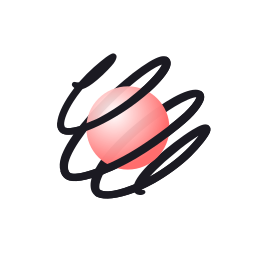</a> | **📂 檔名:** `react-spring.svg` ✨ **格式:** `Vector (SVG)` ⚖️ **大小:** `12.35KB` 📅 **更新:** `2026-03-02`  🚀 **jsDelivr Markdown:** `` 🔗 **直接連結 (Url):** <code>https://cdn.jsdelivr.net/gh/barry028/materials@main/images/iCons/Brands/react-spring.svg</code> 📥 [檢視原始檔](react-spring.svg) |
|  | **📂 檔名:** `react-styleguidist.svg` ✨ **格式:** `Vector (SVG)` ⚖️ **大小:** `32.63KB` 📅 **更新:** `2026-03-02`  🚀 **jsDelivr Markdown:** `` 🔗 **直接連結 (Url):** <code>https://cdn.jsdelivr.net/gh/barry028/materials@main/images/iCons/Brands/react-styleguidist.svg</code> 📥 [檢視原始檔](react-styleguidist.svg) |
|  | **📂 檔名:** `react.svg` ✨ **格式:** `Vector (SVG)` ⚖️ **大小:** `7.72KB` 📅 **更新:** `2026-03-02`  🚀 **jsDelivr Markdown:** `` 🔗 **直接連結 (Url):** <code>https://cdn.jsdelivr.net/gh/barry028/materials@main/images/iCons/Brands/react.svg</code> 📥 [檢視原始檔](react.svg) |
|  | **📂 檔名:** `reactivex.svg` ✨ **格式:** `Vector (SVG)` ⚖️ **大小:** `4.97KB` 📅 **更新:** `2026-03-02`  🚀 **jsDelivr Markdown:** `` 🔗 **直接連結 (Url):** <code>https://cdn.jsdelivr.net/gh/barry028/materials@main/images/iCons/Brands/reactivex.svg</code> 📥 [檢視原始檔](reactivex.svg) |
| <a href="realm.svg">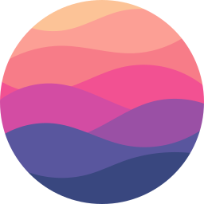</a> | **📂 檔名:** `realm.svg` ✨ **格式:** `Vector (SVG)` ⚖️ **大小:** `4.46KB` 📅 **更新:** `2026-03-02`  🚀 **jsDelivr Markdown:** `` 🔗 **直接連結 (Url):** <code>https://cdn.jsdelivr.net/gh/barry028/materials@main/images/iCons/Brands/realm.svg</code> 📥 [檢視原始檔](realm.svg) |
|  | **📂 檔名:** `reapp.svg` ✨ **格式:** `Vector (SVG)` ⚖️ **大小:** `1.25KB` 📅 **更新:** `2026-03-02`  🚀 **jsDelivr Markdown:** `` 🔗 **直接連結 (Url):** <code>https://cdn.jsdelivr.net/gh/barry028/materials@main/images/iCons/Brands/reapp.svg</code> 📥 [檢視原始檔](reapp.svg) |
|  | **📂 檔名:** `reasonml-icon.svg` ✨ **格式:** `Vector (SVG)` ⚖️ **大小:** `1.18KB` 📅 **更新:** `2026-03-02`  🚀 **jsDelivr Markdown:** `` 🔗 **直接連結 (Url):** <code>https://cdn.jsdelivr.net/gh/barry028/materials@main/images/iCons/Brands/reasonml-icon.svg</code> 📥 [檢視原始檔](reasonml-icon.svg) |
|  | **📂 檔名:** `reasonml.svg` ✨ **格式:** `Vector (SVG)` ⚖️ **大小:** `3.08KB` 📅 **更新:** `2026-03-02`  🚀 **jsDelivr Markdown:** `` 🔗 **直接連結 (Url):** <code>https://cdn.jsdelivr.net/gh/barry028/materials@main/images/iCons/Brands/reasonml.svg</code> 📥 [檢視原始檔](reasonml.svg) |
| <a href="recaptcha.svg">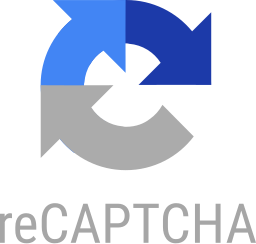</a> | **📂 檔名:** `recaptcha.svg` ✨ **格式:** `Vector (SVG)` ⚖️ **大小:** `12.15KB` 📅 **更新:** `2026-03-02`  🚀 **jsDelivr Markdown:** `` 🔗 **直接連結 (Url):** <code>https://cdn.jsdelivr.net/gh/barry028/materials@main/images/iCons/Brands/recaptcha.svg</code> 📥 [檢視原始檔](recaptcha.svg) |
|  | **📂 檔名:** `recoil-icon.svg` ✨ **格式:** `Vector (SVG)` ⚖️ **大小:** `3.00KB` 📅 **更新:** `2026-03-02`  🚀 **jsDelivr Markdown:** `` 🔗 **直接連結 (Url):** <code>https://cdn.jsdelivr.net/gh/barry028/materials@main/images/iCons/Brands/recoil-icon.svg</code> 📥 [檢視原始檔](recoil-icon.svg) |
|  | **📂 檔名:** `recoil.svg` ✨ **格式:** `Vector (SVG)` ⚖️ **大小:** `7.58KB` 📅 **更新:** `2026-03-02`  🚀 **jsDelivr Markdown:** `` 🔗 **直接連結 (Url):** <code>https://cdn.jsdelivr.net/gh/barry028/materials@main/images/iCons/Brands/recoil.svg</code> 📥 [檢視原始檔](recoil.svg) |
|  | **📂 檔名:** `reddit-icon.svg` ✨ **格式:** `Vector (SVG)` ⚖️ **大小:** `2.73KB` 📅 **更新:** `2026-03-02`  🚀 **jsDelivr Markdown:** `` 🔗 **直接連結 (Url):** <code>https://cdn.jsdelivr.net/gh/barry028/materials@main/images/iCons/Brands/reddit-icon.svg</code> 📥 [檢視原始檔](reddit-icon.svg) |
|  | **📂 檔名:** `reddit.svg` ✨ **格式:** `Vector (SVG)` ⚖️ **大小:** `7.72KB` 📅 **更新:** `2026-03-02`  🚀 **jsDelivr Markdown:** `` 🔗 **直接連結 (Url):** <code>https://cdn.jsdelivr.net/gh/barry028/materials@main/images/iCons/Brands/reddit.svg</code> 📥 [檢視原始檔](reddit.svg) |
|  | **📂 檔名:** `redhat-icon.svg` ✨ **格式:** `Vector (SVG)` ⚖️ **大小:** `2.07KB` 📅 **更新:** `2026-03-02`  🚀 **jsDelivr Markdown:** `` 🔗 **直接連結 (Url):** <code>https://cdn.jsdelivr.net/gh/barry028/materials@main/images/iCons/Brands/redhat-icon.svg</code> 📥 [檢視原始檔](redhat-icon.svg) |
|  | **📂 檔名:** `redhat.svg` ✨ **格式:** `Vector (SVG)` ⚖️ **大小:** `5.97KB` 📅 **更新:** `2026-03-02`  🚀 **jsDelivr Markdown:** `` 🔗 **直接連結 (Url):** <code>https://cdn.jsdelivr.net/gh/barry028/materials@main/images/iCons/Brands/redhat.svg</code> 📥 [檢視原始檔](redhat.svg) |
|  | **📂 檔名:** `redis.svg` ✨ **格式:** `Vector (SVG)` ⚖️ **大小:** `4.90KB` 📅 **更新:** `2026-03-02`  🚀 **jsDelivr Markdown:** `` 🔗 **直接連結 (Url):** <code>https://cdn.jsdelivr.net/gh/barry028/materials@main/images/iCons/Brands/redis.svg</code> 📥 [檢視原始檔](redis.svg) |
| <a href="redsmin.svg">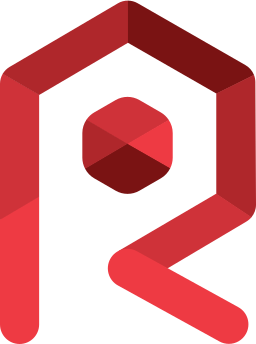</a> | **📂 檔名:** `redsmin.svg` ✨ **格式:** `Vector (SVG)` ⚖️ **大小:** `3.00KB` 📅 **更新:** `2026-03-02`  🚀 **jsDelivr Markdown:** `` 🔗 **直接連結 (Url):** <code>https://cdn.jsdelivr.net/gh/barry028/materials@main/images/iCons/Brands/redsmin.svg</code> 📥 [檢視原始檔](redsmin.svg) |
| <a href="redux-observable.svg">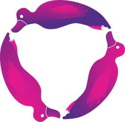</a> | **📂 檔名:** `redux-observable.svg` ✨ **格式:** `Vector (SVG)` ⚖️ **大小:** `29.78KB` 📅 **更新:** `2026-03-02`  🚀 **jsDelivr Markdown:** `` 🔗 **直接連結 (Url):** <code>https://cdn.jsdelivr.net/gh/barry028/materials@main/images/iCons/Brands/redux-observable.svg</code> 📥 [檢視原始檔](redux-observable.svg) |
|  | **📂 檔名:** `redux-saga.svg` ✨ **格式:** `Vector (SVG)` ⚖️ **大小:** `5.75KB` 📅 **更新:** `2026-03-02`  🚀 **jsDelivr Markdown:** `` 🔗 **直接連結 (Url):** <code>https://cdn.jsdelivr.net/gh/barry028/materials@main/images/iCons/Brands/redux-saga.svg</code> 📥 [檢視原始檔](redux-saga.svg) |
|  | **📂 檔名:** `redux.svg` ✨ **格式:** `Vector (SVG)` ⚖️ **大小:** `3.15KB` 📅 **更新:** `2026-03-02`  🚀 **jsDelivr Markdown:** `` 🔗 **直接連結 (Url):** <code>https://cdn.jsdelivr.net/gh/barry028/materials@main/images/iCons/Brands/redux.svg</code> 📥 [檢視原始檔](redux.svg) |
|  | **📂 檔名:** `redwoodjs.svg` ✨ **格式:** `Vector (SVG)` ⚖️ **大小:** `6.36KB` 📅 **更新:** `2026-03-02`  🚀 **jsDelivr Markdown:** `` 🔗 **直接連結 (Url):** <code>https://cdn.jsdelivr.net/gh/barry028/materials@main/images/iCons/Brands/redwoodjs.svg</code> 📥 [檢視原始檔](redwoodjs.svg) |
|  | **📂 檔名:** `reindex.svg` ✨ **格式:** `Vector (SVG)` ⚖️ **大小:** `2.78KB` 📅 **更新:** `2026-03-02`  🚀 **jsDelivr Markdown:** `` 🔗 **直接連結 (Url):** <code>https://cdn.jsdelivr.net/gh/barry028/materials@main/images/iCons/Brands/reindex.svg</code> 📥 [檢視原始檔](reindex.svg) |
| <a href="relay.svg">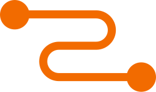</a> | **📂 檔名:** `relay.svg` ✨ **格式:** `Vector (SVG)` ⚖️ **大小:** `1.43KB` 📅 **更新:** `2026-03-02`  🚀 **jsDelivr Markdown:** `` 🔗 **直接連結 (Url):** <code>https://cdn.jsdelivr.net/gh/barry028/materials@main/images/iCons/Brands/relay.svg</code> 📥 [檢視原始檔](relay.svg) |
|  | **📂 檔名:** `release.svg` ✨ **格式:** `Vector (SVG)` ⚖️ **大小:** `2.79KB` 📅 **更新:** `2026-03-02`  🚀 **jsDelivr Markdown:** `` 🔗 **直接連結 (Url):** <code>https://cdn.jsdelivr.net/gh/barry028/materials@main/images/iCons/Brands/release.svg</code> 📥 [檢視原始檔](release.svg) |
|  | **📂 檔名:** `remix-icon.svg` ✨ **格式:** `Vector (SVG)` ⚖️ **大小:** `2.93KB` 📅 **更新:** `2026-03-02`  🚀 **jsDelivr Markdown:** `` 🔗 **直接連結 (Url):** <code>https://cdn.jsdelivr.net/gh/barry028/materials@main/images/iCons/Brands/remix-icon.svg</code> 📥 [檢視原始檔](remix-icon.svg) |
|  | **📂 檔名:** `remix.svg` ✨ **格式:** `Vector (SVG)` ⚖️ **大小:** `6.47KB` 📅 **更新:** `2026-03-02`  🚀 **jsDelivr Markdown:** `` 🔗 **直接連結 (Url):** <code>https://cdn.jsdelivr.net/gh/barry028/materials@main/images/iCons/Brands/remix.svg</code> 📥 [檢視原始檔](remix.svg) |
|  | **📂 檔名:** `renovatebot.svg` ✨ **格式:** `Vector (SVG)` ⚖️ **大小:** `3.94KB` 📅 **更新:** `2026-03-02`  🚀 **jsDelivr Markdown:** `` 🔗 **直接連結 (Url):** <code>https://cdn.jsdelivr.net/gh/barry028/materials@main/images/iCons/Brands/renovatebot.svg</code> 📥 [檢視原始檔](renovatebot.svg) |
|  | **📂 檔名:** `replit-icon.svg` ✨ **格式:** `Vector (SVG)` ⚖️ **大小:** `773.00B` 📅 **更新:** `2026-03-02`  🚀 **jsDelivr Markdown:** `` 🔗 **直接連結 (Url):** <code>https://cdn.jsdelivr.net/gh/barry028/materials@main/images/iCons/Brands/replit-icon.svg</code> 📥 [檢視原始檔](replit-icon.svg) |
|  | **📂 檔名:** `replit.svg` ✨ **格式:** `Vector (SVG)` ⚖️ **大小:** `6.71KB` 📅 **更新:** `2026-03-02`  🚀 **jsDelivr Markdown:** `` 🔗 **直接連結 (Url):** <code>https://cdn.jsdelivr.net/gh/barry028/materials@main/images/iCons/Brands/replit.svg</code> 📥 [檢視原始檔](replit.svg) |
| <a href="require.svg">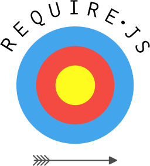</a> | **📂 檔名:** `require.svg` ✨ **格式:** `Vector (SVG)` ⚖️ **大小:** `13.71KB` 📅 **更新:** `2026-03-02`  🚀 **jsDelivr Markdown:** `` 🔗 **直接連結 (Url):** <code>https://cdn.jsdelivr.net/gh/barry028/materials@main/images/iCons/Brands/require.svg</code> 📥 [檢視原始檔](require.svg) |
|  | **📂 檔名:** `rescript-icon.svg` ✨ **格式:** `Vector (SVG)` ⚖️ **大小:** `2.09KB` 📅 **更新:** `2026-03-02`  🚀 **jsDelivr Markdown:** `` 🔗 **直接連結 (Url):** <code>https://cdn.jsdelivr.net/gh/barry028/materials@main/images/iCons/Brands/rescript-icon.svg</code> 📥 [檢視原始檔](rescript-icon.svg) |
|  | **📂 檔名:** `rescript.svg` ✨ **格式:** `Vector (SVG)` ⚖️ **大小:** `16.42KB` 📅 **更新:** `2026-03-02`  🚀 **jsDelivr Markdown:** `` 🔗 **直接連結 (Url):** <code>https://cdn.jsdelivr.net/gh/barry028/materials@main/images/iCons/Brands/rescript.svg</code> 📥 [檢視原始檔](rescript.svg) |
|  | **📂 檔名:** `rest-li.svg` ✨ **格式:** `Vector (SVG)` ⚖️ **大小:** `10.72KB` 📅 **更新:** `2026-03-02`  🚀 **jsDelivr Markdown:** `` 🔗 **直接連結 (Url):** <code>https://cdn.jsdelivr.net/gh/barry028/materials@main/images/iCons/Brands/rest-li.svg</code> 📥 [檢視原始檔](rest-li.svg) |
|  | **📂 檔名:** `rethinkdb.svg` ✨ **格式:** `Vector (SVG)` ⚖️ **大小:** `13.19KB` 📅 **更新:** `2026-03-02`  🚀 **jsDelivr Markdown:** `` 🔗 **直接連結 (Url):** <code>https://cdn.jsdelivr.net/gh/barry028/materials@main/images/iCons/Brands/rethinkdb.svg</code> 📥 [檢視原始檔](rethinkdb.svg) |
|  | **📂 檔名:** `retool-icon.svg` ✨ **格式:** `Vector (SVG)` ⚖️ **大小:** `1.21KB` 📅 **更新:** `2026-03-02`  🚀 **jsDelivr Markdown:** `` 🔗 **直接連結 (Url):** <code>https://cdn.jsdelivr.net/gh/barry028/materials@main/images/iCons/Brands/retool-icon.svg</code> 📥 [檢視原始檔](retool-icon.svg) |
|  | **📂 檔名:** `retool.svg` ✨ **格式:** `Vector (SVG)` ⚖️ **大小:** `4.32KB` 📅 **更新:** `2026-03-02`  🚀 **jsDelivr Markdown:** `` 🔗 **直接連結 (Url):** <code>https://cdn.jsdelivr.net/gh/barry028/materials@main/images/iCons/Brands/retool.svg</code> 📥 [檢視原始檔](retool.svg) |
| <a href="riak.svg">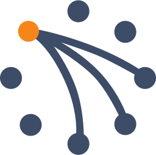</a> | **📂 檔名:** `riak.svg` ✨ **格式:** `Vector (SVG)` ⚖️ **大小:** `3.99KB` 📅 **更新:** `2026-03-02`  🚀 **jsDelivr Markdown:** `` 🔗 **直接連結 (Url):** <code>https://cdn.jsdelivr.net/gh/barry028/materials@main/images/iCons/Brands/riak.svg</code> 📥 [檢視原始檔](riak.svg) |
| <a href="rider.svg">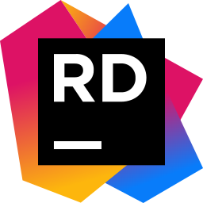</a> | **📂 檔名:** `rider.svg` ✨ **格式:** `Vector (SVG)` ⚖️ **大小:** `3.00KB` 📅 **更新:** `2026-03-02`  🚀 **jsDelivr Markdown:** `` 🔗 **直接連結 (Url):** <code>https://cdn.jsdelivr.net/gh/barry028/materials@main/images/iCons/Brands/rider.svg</code> 📥 [檢視原始檔](rider.svg) |
|  | **📂 檔名:** `riot.svg` ✨ **格式:** `Vector (SVG)` ⚖️ **大小:** `1.34KB` 📅 **更新:** `2026-03-02`  🚀 **jsDelivr Markdown:** `` 🔗 **直接連結 (Url):** <code>https://cdn.jsdelivr.net/gh/barry028/materials@main/images/iCons/Brands/riot.svg</code> 📥 [檢視原始檔](riot.svg) |
|  | **📂 檔名:** `risingwave-icon.svg` ✨ **格式:** `Vector (SVG)` ⚖️ **大小:** `3.28KB` 📅 **更新:** `2026-03-02`  🚀 **jsDelivr Markdown:** `` 🔗 **直接連結 (Url):** <code>https://cdn.jsdelivr.net/gh/barry028/materials@main/images/iCons/Brands/risingwave-icon.svg</code> 📥 [檢視原始檔](risingwave-icon.svg) |
|  | **📂 檔名:** `risingwave.svg` ✨ **格式:** `Vector (SVG)` ⚖️ **大小:** `16.99KB` 📅 **更新:** `2026-03-02`  🚀 **jsDelivr Markdown:** `` 🔗 **直接連結 (Url):** <code>https://cdn.jsdelivr.net/gh/barry028/materials@main/images/iCons/Brands/risingwave.svg</code> 📥 [檢視原始檔](risingwave.svg) |
|  | **📂 檔名:** `rocket-chat-icon.svg` ✨ **格式:** `Vector (SVG)` ⚖️ **大小:** `2.97KB` 📅 **更新:** `2026-03-02`  🚀 **jsDelivr Markdown:** `` 🔗 **直接連結 (Url):** <code>https://cdn.jsdelivr.net/gh/barry028/materials@main/images/iCons/Brands/rocket-chat-icon.svg</code> 📥 [檢視原始檔](rocket-chat-icon.svg) |
|  | **📂 檔名:** `rocket-chat.svg` ✨ **格式:** `Vector (SVG)` ⚖️ **大小:** `9.58KB` 📅 **更新:** `2026-03-02`  🚀 **jsDelivr Markdown:** `` 🔗 **直接連結 (Url):** <code>https://cdn.jsdelivr.net/gh/barry028/materials@main/images/iCons/Brands/rocket-chat.svg</code> 📥 [檢視原始檔](rocket-chat.svg) |
|  | **📂 檔名:** `rocksdb.svg` ✨ **格式:** `Vector (SVG)` ⚖️ **大小:** `9.09KB` 📅 **更新:** `2026-03-02`  🚀 **jsDelivr Markdown:** `` 🔗 **直接連結 (Url):** <code>https://cdn.jsdelivr.net/gh/barry028/materials@main/images/iCons/Brands/rocksdb.svg</code> 📥 [檢視原始檔](rocksdb.svg) |
|  | **📂 檔名:** `rocky-linux-icon.svg` ✨ **格式:** `Vector (SVG)` ⚖️ **大小:** `730.00B` 📅 **更新:** `2026-03-02`  🚀 **jsDelivr Markdown:** `` 🔗 **直接連結 (Url):** <code>https://cdn.jsdelivr.net/gh/barry028/materials@main/images/iCons/Brands/rocky-linux-icon.svg</code> 📥 [檢視原始檔](rocky-linux-icon.svg) |
|  | **📂 檔名:** `rocky-linux.svg` ✨ **格式:** `Vector (SVG)` ⚖️ **大小:** `8.37KB` 📅 **更新:** `2026-03-02`  🚀 **jsDelivr Markdown:** `` 🔗 **直接連結 (Url):** <code>https://cdn.jsdelivr.net/gh/barry028/materials@main/images/iCons/Brands/rocky-linux.svg</code> 📥 [檢視原始檔](rocky-linux.svg) |
|  | **📂 檔名:** `rollbar-icon.svg` ✨ **格式:** `Vector (SVG)` ⚖️ **大小:** `2.86KB` 📅 **更新:** `2026-03-02`  🚀 **jsDelivr Markdown:** `` 🔗 **直接連結 (Url):** <code>https://cdn.jsdelivr.net/gh/barry028/materials@main/images/iCons/Brands/rollbar-icon.svg</code> 📥 [檢視原始檔](rollbar-icon.svg) |
|  | **📂 檔名:** `rollbar.svg` ✨ **格式:** `Vector (SVG)` ⚖️ **大小:** `8.48KB` 📅 **更新:** `2026-03-02`  🚀 **jsDelivr Markdown:** `` 🔗 **直接連結 (Url):** <code>https://cdn.jsdelivr.net/gh/barry028/materials@main/images/iCons/Brands/rollbar.svg</code> 📥 [檢視原始檔](rollbar.svg) |
|  | **📂 檔名:** `rollupjs.svg` ✨ **格式:** `Vector (SVG)` ⚖️ **大小:** `5.82KB` 📅 **更新:** `2026-03-02`  🚀 **jsDelivr Markdown:** `` 🔗 **直接連結 (Url):** <code>https://cdn.jsdelivr.net/gh/barry028/materials@main/images/iCons/Brands/rollupjs.svg</code> 📥 [檢視原始檔](rollupjs.svg) |
|  | **📂 檔名:** `rome-icon.svg` ✨ **格式:** `Vector (SVG)` ⚖️ **大小:** `2.56KB` 📅 **更新:** `2026-03-02`  🚀 **jsDelivr Markdown:** `` 🔗 **直接連結 (Url):** <code>https://cdn.jsdelivr.net/gh/barry028/materials@main/images/iCons/Brands/rome-icon.svg</code> 📥 [檢視原始檔](rome-icon.svg) |
|  | **📂 檔名:** `rome.svg` ✨ **格式:** `Vector (SVG)` ⚖️ **大小:** `13.55KB` 📅 **更新:** `2026-03-02`  🚀 **jsDelivr Markdown:** `` 🔗 **直接連結 (Url):** <code>https://cdn.jsdelivr.net/gh/barry028/materials@main/images/iCons/Brands/rome.svg</code> 📥 [檢視原始檔](rome.svg) |
|  | **📂 檔名:** `ros.svg` ✨ **格式:** `Vector (SVG)` ⚖️ **大小:** `7.83KB` 📅 **更新:** `2026-03-02`  🚀 **jsDelivr Markdown:** `` 🔗 **直接連結 (Url):** <code>https://cdn.jsdelivr.net/gh/barry028/materials@main/images/iCons/Brands/ros.svg</code> 📥 [檢視原始檔](ros.svg) |
|  | **📂 檔名:** `rsa.svg` ✨ **格式:** `Vector (SVG)` ⚖️ **大小:** `2.23KB` 📅 **更新:** `2026-03-02`  🚀 **jsDelivr Markdown:** `` 🔗 **直接連結 (Url):** <code>https://cdn.jsdelivr.net/gh/barry028/materials@main/images/iCons/Brands/rsa.svg</code> 📥 [檢視原始檔](rsa.svg) |
|  | **📂 檔名:** `rsmq.svg` ✨ **格式:** `Vector (SVG)` ⚖️ **大小:** `1.88KB` 📅 **更新:** `2026-03-02`  🚀 **jsDelivr Markdown:** `` 🔗 **直接連結 (Url):** <code>https://cdn.jsdelivr.net/gh/barry028/materials@main/images/iCons/Brands/rsmq.svg</code> 📥 [檢視原始檔](rsmq.svg) |
|  | **📂 檔名:** `rubocop.svg` ✨ **格式:** `Vector (SVG)` ⚖️ **大小:** `2.81KB` 📅 **更新:** `2026-03-02`  🚀 **jsDelivr Markdown:** `` 🔗 **直接連結 (Url):** <code>https://cdn.jsdelivr.net/gh/barry028/materials@main/images/iCons/Brands/rubocop.svg</code> 📥 [檢視原始檔](rubocop.svg) |
|  | **📂 檔名:** `ruby.svg` ✨ **格式:** `Vector (SVG)` ⚖️ **大小:** `10.92KB` 📅 **更新:** `2026-03-02`  🚀 **jsDelivr Markdown:** `` 🔗 **直接連結 (Url):** <code>https://cdn.jsdelivr.net/gh/barry028/materials@main/images/iCons/Brands/ruby.svg</code> 📥 [檢視原始檔](ruby.svg) |
|  | **📂 檔名:** `rubygems.svg` ✨ **格式:** `Vector (SVG)` ⚖️ **大小:** `910.00B` 📅 **更新:** `2026-03-02`  🚀 **jsDelivr Markdown:** `` 🔗 **直接連結 (Url):** <code>https://cdn.jsdelivr.net/gh/barry028/materials@main/images/iCons/Brands/rubygems.svg</code> 📥 [檢視原始檔](rubygems.svg) |
| <a href="rubymine.svg">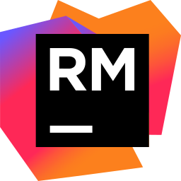</a> | **📂 檔名:** `rubymine.svg` ✨ **格式:** `Vector (SVG)` ⚖️ **大小:** `3.49KB` 📅 **更新:** `2026-03-02`  🚀 **jsDelivr Markdown:** `` 🔗 **直接連結 (Url):** <code>https://cdn.jsdelivr.net/gh/barry028/materials@main/images/iCons/Brands/rubymine.svg</code> 📥 [檢視原始檔](rubymine.svg) |
| <a href="rum.svg">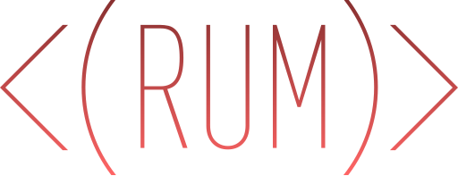</a> | **📂 檔名:** `rum.svg` ✨ **格式:** `Vector (SVG)` ⚖️ **大小:** `3.72KB` 📅 **更新:** `2026-03-02`  🚀 **jsDelivr Markdown:** `` 🔗 **直接連結 (Url):** <code>https://cdn.jsdelivr.net/gh/barry028/materials@main/images/iCons/Brands/rum.svg</code> 📥 [檢視原始檔](rum.svg) |
| <a href="runscope.svg">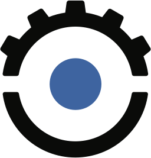</a> | **📂 檔名:** `runscope.svg` ✨ **格式:** `Vector (SVG)` ⚖️ **大小:** `3.47KB` 📅 **更新:** `2026-03-02`  🚀 **jsDelivr Markdown:** `` 🔗 **直接連結 (Url):** <code>https://cdn.jsdelivr.net/gh/barry028/materials@main/images/iCons/Brands/runscope.svg</code> 📥 [檢視原始檔](runscope.svg) |
|  | **📂 檔名:** `rush-icon.svg` ✨ **格式:** `Vector (SVG)` ⚖️ **大小:** `8.71KB` 📅 **更新:** `2026-03-02`  🚀 **jsDelivr Markdown:** `` 🔗 **直接連結 (Url):** <code>https://cdn.jsdelivr.net/gh/barry028/materials@main/images/iCons/Brands/rush-icon.svg</code> 📥 [檢視原始檔](rush-icon.svg) |
|  | **📂 檔名:** `rush.svg` ✨ **格式:** `Vector (SVG)` ⚖️ **大小:** `16.40KB` 📅 **更新:** `2026-03-02`  🚀 **jsDelivr Markdown:** `` 🔗 **直接連結 (Url):** <code>https://cdn.jsdelivr.net/gh/barry028/materials@main/images/iCons/Brands/rush.svg</code> 📥 [檢視原始檔](rush.svg) |
|  | **📂 檔名:** `rust.svg` ✨ **格式:** `Vector (SVG)` ⚖️ **大小:** `12.16KB` 📅 **更新:** `2026-03-02`  🚀 **jsDelivr Markdown:** `` 🔗 **直接連結 (Url):** <code>https://cdn.jsdelivr.net/gh/barry028/materials@main/images/iCons/Brands/rust.svg</code> 📥 [檢視原始檔](rust.svg) |
|  | **📂 檔名:** `rxdb.svg` ✨ **格式:** `Vector (SVG)` ⚖️ **大小:** `4.00KB` 📅 **更新:** `2026-03-02`  🚀 **jsDelivr Markdown:** `` 🔗 **直接連結 (Url):** <code>https://cdn.jsdelivr.net/gh/barry028/materials@main/images/iCons/Brands/rxdb.svg</code> 📥 [檢視原始檔](rxdb.svg) |
|  | **📂 檔名:** `safari.svg` ✨ **格式:** `Vector (SVG)` ⚖️ **大小:** `68.67KB` 📅 **更新:** `2026-03-02`  🚀 **jsDelivr Markdown:** `` 🔗 **直接連結 (Url):** <code>https://cdn.jsdelivr.net/gh/barry028/materials@main/images/iCons/Brands/safari.svg</code> 📥 [檢視原始檔](safari.svg) |
|  | **📂 檔名:** `sagui.svg` ✨ **格式:** `Vector (SVG)` ⚖️ **大小:** `6.21KB` 📅 **更新:** `2026-03-02`  🚀 **jsDelivr Markdown:** `` 🔗 **直接連結 (Url):** <code>https://cdn.jsdelivr.net/gh/barry028/materials@main/images/iCons/Brands/sagui.svg</code> 📥 [檢視原始檔](sagui.svg) |
| <a href="sails.svg">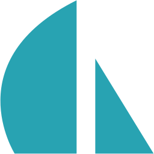</a> | **📂 檔名:** `sails.svg` ✨ **格式:** `Vector (SVG)` ⚖️ **大小:** `581.00B` 📅 **更新:** `2026-03-02`  🚀 **jsDelivr Markdown:** `` 🔗 **直接連結 (Url):** <code>https://cdn.jsdelivr.net/gh/barry028/materials@main/images/iCons/Brands/sails.svg</code> 📥 [檢視原始檔](sails.svg) |
|  | **📂 檔名:** `salesforce.svg` ✨ **格式:** `Vector (SVG)` ⚖️ **大小:** `17.86KB` 📅 **更新:** `2026-03-02`  🚀 **jsDelivr Markdown:** `` 🔗 **直接連結 (Url):** <code>https://cdn.jsdelivr.net/gh/barry028/materials@main/images/iCons/Brands/salesforce.svg</code> 📥 [檢視原始檔](salesforce.svg) |
|  | **📂 檔名:** `sameroom.svg` ✨ **格式:** `Vector (SVG)` ⚖️ **大小:** `2.08KB` 📅 **更新:** `2026-03-02`  🚀 **jsDelivr Markdown:** `` 🔗 **直接連結 (Url):** <code>https://cdn.jsdelivr.net/gh/barry028/materials@main/images/iCons/Brands/sameroom.svg</code> 📥 [檢視原始檔](sameroom.svg) |
|  | **📂 檔名:** `samsung.svg` ✨ **格式:** `Vector (SVG)` ⚖️ **大小:** `17.04KB` 📅 **更新:** `2026-03-02`  🚀 **jsDelivr Markdown:** `` 🔗 **直接連結 (Url):** <code>https://cdn.jsdelivr.net/gh/barry028/materials@main/images/iCons/Brands/samsung.svg</code> 📥 [檢視原始檔](samsung.svg) |
|  | **📂 檔名:** `sanity.svg` ✨ **格式:** `Vector (SVG)` ⚖️ **大小:** `3.22KB` 📅 **更新:** `2026-03-02`  🚀 **jsDelivr Markdown:** `` 🔗 **直接連結 (Url):** <code>https://cdn.jsdelivr.net/gh/barry028/materials@main/images/iCons/Brands/sanity.svg</code> 📥 [檢視原始檔](sanity.svg) |
|  | **📂 檔名:** `sap.svg` ✨ **格式:** `Vector (SVG)` ⚖️ **大小:** `3.01KB` 📅 **更新:** `2026-03-02`  🚀 **jsDelivr Markdown:** `` 🔗 **直接連結 (Url):** <code>https://cdn.jsdelivr.net/gh/barry028/materials@main/images/iCons/Brands/sap.svg</code> 📥 [檢視原始檔](sap.svg) |
|  | **📂 檔名:** `sass-doc.svg` ✨ **格式:** `Vector (SVG)` ⚖️ **大小:** `14.82KB` 📅 **更新:** `2026-03-02`  🚀 **jsDelivr Markdown:** `` 🔗 **直接連結 (Url):** <code>https://cdn.jsdelivr.net/gh/barry028/materials@main/images/iCons/Brands/sass-doc.svg</code> 📥 [檢視原始檔](sass-doc.svg) |
|  | **📂 檔名:** `sass.svg` ✨ **格式:** `Vector (SVG)` ⚖️ **大小:** `7.95KB` 📅 **更新:** `2026-03-02`  🚀 **jsDelivr Markdown:** `` 🔗 **直接連結 (Url):** <code>https://cdn.jsdelivr.net/gh/barry028/materials@main/images/iCons/Brands/sass.svg</code> 📥 [檢視原始檔](sass.svg) |
|  | **📂 檔名:** `saucelabs.svg` ✨ **格式:** `Vector (SVG)` ⚖️ **大小:** `1.73KB` 📅 **更新:** `2026-03-02`  🚀 **jsDelivr Markdown:** `` 🔗 **直接連結 (Url):** <code>https://cdn.jsdelivr.net/gh/barry028/materials@main/images/iCons/Brands/saucelabs.svg</code> 📥 [檢視原始檔](saucelabs.svg) |
|  | **📂 檔名:** `scala.svg` ✨ **格式:** `Vector (SVG)` ⚖️ **大小:** `2.13KB` 📅 **更新:** `2026-03-02`  🚀 **jsDelivr Markdown:** `` 🔗 **直接連結 (Url):** <code>https://cdn.jsdelivr.net/gh/barry028/materials@main/images/iCons/Brands/scala.svg</code> 📥 [檢視原始檔](scala.svg) |
| <a href="scaledrone.svg">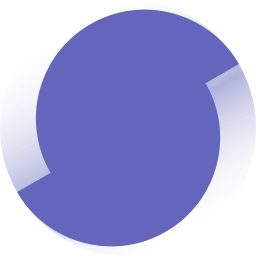</a> | **📂 檔名:** `scaledrone.svg` ✨ **格式:** `Vector (SVG)` ⚖️ **大小:** `967.00B` 📅 **更新:** `2026-03-02`  🚀 **jsDelivr Markdown:** `` 🔗 **直接連結 (Url):** <code>https://cdn.jsdelivr.net/gh/barry028/materials@main/images/iCons/Brands/scaledrone.svg</code> 📥 [檢視原始檔](scaledrone.svg) |
| <a href="scribd-icon.svg">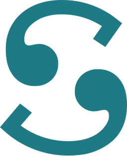</a> | **📂 檔名:** `scribd-icon.svg` ✨ **格式:** `Vector (SVG)` ⚖️ **大小:** `2.60KB` 📅 **更新:** `2026-03-02`  🚀 **jsDelivr Markdown:** `` 🔗 **直接連結 (Url):** <code>https://cdn.jsdelivr.net/gh/barry028/materials@main/images/iCons/Brands/scribd-icon.svg</code> 📥 [檢視原始檔](scribd-icon.svg) |
|  | **📂 檔名:** `scribd.svg` ✨ **格式:** `Vector (SVG)` ⚖️ **大小:** `6.33KB` 📅 **更新:** `2026-03-02`  🚀 **jsDelivr Markdown:** `` 🔗 **直接連結 (Url):** <code>https://cdn.jsdelivr.net/gh/barry028/materials@main/images/iCons/Brands/scribd.svg</code> 📥 [檢視原始檔](scribd.svg) |
|  | **📂 檔名:** `seaborn-icon.svg` ✨ **格式:** `Vector (SVG)` ⚖️ **大小:** `67.69KB` 📅 **更新:** `2026-03-02`  🚀 **jsDelivr Markdown:** `` 🔗 **直接連結 (Url):** <code>https://cdn.jsdelivr.net/gh/barry028/materials@main/images/iCons/Brands/seaborn-icon.svg</code> 📥 [檢視原始檔](seaborn-icon.svg) |
|  | **📂 檔名:** `seaborn.svg` ✨ **格式:** `Vector (SVG)` ⚖️ **大小:** `80.81KB` 📅 **更新:** `2026-03-02`  🚀 **jsDelivr Markdown:** `` 🔗 **直接連結 (Url):** <code>https://cdn.jsdelivr.net/gh/barry028/materials@main/images/iCons/Brands/seaborn.svg</code> 📥 [檢視原始檔](seaborn.svg) |
| <a href="section-icon.svg">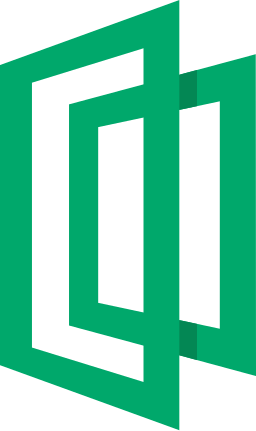</a> | **📂 檔名:** `section-icon.svg` ✨ **格式:** `Vector (SVG)` ⚖️ **大小:** `1.05KB` 📅 **更新:** `2026-03-02`  🚀 **jsDelivr Markdown:** `` 🔗 **直接連結 (Url):** <code>https://cdn.jsdelivr.net/gh/barry028/materials@main/images/iCons/Brands/section-icon.svg</code> 📥 [檢視原始檔](section-icon.svg) |
|  | **📂 檔名:** `section.svg` ✨ **格式:** `Vector (SVG)` ⚖️ **大小:** `5.56KB` 📅 **更新:** `2026-03-02`  🚀 **jsDelivr Markdown:** `` 🔗 **直接連結 (Url):** <code>https://cdn.jsdelivr.net/gh/barry028/materials@main/images/iCons/Brands/section.svg</code> 📥 [檢視原始檔](section.svg) |
| <a href="segment-icon.svg">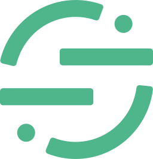</a> | **📂 檔名:** `segment-icon.svg` ✨ **格式:** `Vector (SVG)` ⚖️ **大小:** `3.76KB` 📅 **更新:** `2026-03-02`  🚀 **jsDelivr Markdown:** `` 🔗 **直接連結 (Url):** <code>https://cdn.jsdelivr.net/gh/barry028/materials@main/images/iCons/Brands/segment-icon.svg</code> 📥 [檢視原始檔](segment-icon.svg) |
|  | **📂 檔名:** `segment.svg` ✨ **格式:** `Vector (SVG)` ⚖️ **大小:** `13.53KB` 📅 **更新:** `2026-03-02`  🚀 **jsDelivr Markdown:** `` 🔗 **直接連結 (Url):** <code>https://cdn.jsdelivr.net/gh/barry028/materials@main/images/iCons/Brands/segment.svg</code> 📥 [檢視原始檔](segment.svg) |
|  | **📂 檔名:** `selenium.svg` ✨ **格式:** `Vector (SVG)` ⚖️ **大小:** `4.24KB` 📅 **更新:** `2026-03-02`  🚀 **jsDelivr Markdown:** `` 🔗 **直接連結 (Url):** <code>https://cdn.jsdelivr.net/gh/barry028/materials@main/images/iCons/Brands/selenium.svg</code> 📥 [檢視原始檔](selenium.svg) |
|  | **📂 檔名:** `semantic-release.svg` ✨ **格式:** `Vector (SVG)` ⚖️ **大小:** `2.72KB` 📅 **更新:** `2026-03-02`  🚀 **jsDelivr Markdown:** `` 🔗 **直接連結 (Url):** <code>https://cdn.jsdelivr.net/gh/barry028/materials@main/images/iCons/Brands/semantic-release.svg</code> 📥 [檢視原始檔](semantic-release.svg) |
|  | **📂 檔名:** `semantic-ui.svg` ✨ **格式:** `Vector (SVG)` ⚖️ **大小:** `1.10KB` 📅 **更新:** `2026-03-02`  🚀 **jsDelivr Markdown:** `` 🔗 **直接連結 (Url):** <code>https://cdn.jsdelivr.net/gh/barry028/materials@main/images/iCons/Brands/semantic-ui.svg</code> 📥 [檢視原始檔](semantic-ui.svg) |
|  | **📂 檔名:** `semantic-web.svg` ✨ **格式:** `Vector (SVG)` ⚖️ **大小:** `19.02KB` 📅 **更新:** `2026-03-02`  🚀 **jsDelivr Markdown:** `` 🔗 **直接連結 (Url):** <code>https://cdn.jsdelivr.net/gh/barry028/materials@main/images/iCons/Brands/semantic-web.svg</code> 📥 [檢視原始檔](semantic-web.svg) |
|  | **📂 檔名:** `semaphoreci.svg` ✨ **格式:** `Vector (SVG)` ⚖️ **大小:** `1.11KB` 📅 **更新:** `2026-03-02`  🚀 **jsDelivr Markdown:** `` 🔗 **直接連結 (Url):** <code>https://cdn.jsdelivr.net/gh/barry028/materials@main/images/iCons/Brands/semaphoreci.svg</code> 📥 [檢視原始檔](semaphoreci.svg) |
|  | **📂 檔名:** `sencha.svg` ✨ **格式:** `Vector (SVG)` ⚖️ **大小:** `12.52KB` 📅 **更新:** `2026-03-02`  🚀 **jsDelivr Markdown:** `` 🔗 **直接連結 (Url):** <code>https://cdn.jsdelivr.net/gh/barry028/materials@main/images/iCons/Brands/sencha.svg</code> 📥 [檢視原始檔](sencha.svg) |
|  | **📂 檔名:** `sendgrid-icon.svg` ✨ **格式:** `Vector (SVG)` ⚖️ **大小:** `1.13KB` 📅 **更新:** `2026-03-02`  🚀 **jsDelivr Markdown:** `` 🔗 **直接連結 (Url):** <code>https://cdn.jsdelivr.net/gh/barry028/materials@main/images/iCons/Brands/sendgrid-icon.svg</code> 📥 [檢視原始檔](sendgrid-icon.svg) |
|  | **📂 檔名:** `sendgrid.svg` ✨ **格式:** `Vector (SVG)` ⚖️ **大小:** `6.15KB` 📅 **更新:** `2026-03-02`  🚀 **jsDelivr Markdown:** `` 🔗 **直接連結 (Url):** <code>https://cdn.jsdelivr.net/gh/barry028/materials@main/images/iCons/Brands/sendgrid.svg</code> 📥 [檢視原始檔](sendgrid.svg) |
|  | **📂 檔名:** `seneca.svg` ✨ **格式:** `Vector (SVG)` ⚖️ **大小:** `1.92KB` 📅 **更新:** `2026-03-02`  🚀 **jsDelivr Markdown:** `` 🔗 **直接連結 (Url):** <code>https://cdn.jsdelivr.net/gh/barry028/materials@main/images/iCons/Brands/seneca.svg</code> 📥 [檢視原始檔](seneca.svg) |
|  | **📂 檔名:** `sensu-icon.svg` ✨ **格式:** `Vector (SVG)` ⚖️ **大小:** `1.08KB` 📅 **更新:** `2026-03-02`  🚀 **jsDelivr Markdown:** `` 🔗 **直接連結 (Url):** <code>https://cdn.jsdelivr.net/gh/barry028/materials@main/images/iCons/Brands/sensu-icon.svg</code> 📥 [檢視原始檔](sensu-icon.svg) |
|  | **📂 檔名:** `sensu.svg` ✨ **格式:** `Vector (SVG)` ⚖️ **大小:** `7.54KB` 📅 **更新:** `2026-03-02`  🚀 **jsDelivr Markdown:** `` 🔗 **直接連結 (Url):** <code>https://cdn.jsdelivr.net/gh/barry028/materials@main/images/iCons/Brands/sensu.svg</code> 📥 [檢視原始檔](sensu.svg) |
|  | **📂 檔名:** `sentry-icon.svg` ✨ **格式:** `Vector (SVG)` ⚖️ **大小:** `2.03KB` 📅 **更新:** `2026-03-02`  🚀 **jsDelivr Markdown:** `` 🔗 **直接連結 (Url):** <code>https://cdn.jsdelivr.net/gh/barry028/materials@main/images/iCons/Brands/sentry-icon.svg</code> 📥 [檢視原始檔](sentry-icon.svg) |
|  | **📂 檔名:** `sentry.svg` ✨ **格式:** `Vector (SVG)` ⚖️ **大小:** `4.39KB` 📅 **更新:** `2026-03-02`  🚀 **jsDelivr Markdown:** `` 🔗 **直接連結 (Url):** <code>https://cdn.jsdelivr.net/gh/barry028/materials@main/images/iCons/Brands/sentry.svg</code> 📥 [檢視原始檔](sentry.svg) |
|  | **📂 檔名:** `sequelize.svg` ✨ **格式:** `Vector (SVG)` ⚖️ **大小:** `4.19KB` 📅 **更新:** `2026-03-02`  🚀 **jsDelivr Markdown:** `` 🔗 **直接連結 (Url):** <code>https://cdn.jsdelivr.net/gh/barry028/materials@main/images/iCons/Brands/sequelize.svg</code> 📥 [檢視原始檔](sequelize.svg) |
|  | **📂 檔名:** `serverless.svg` ✨ **格式:** `Vector (SVG)` ⚖️ **大小:** `920.00B` 📅 **更新:** `2026-03-02`  🚀 **jsDelivr Markdown:** `` 🔗 **直接連結 (Url):** <code>https://cdn.jsdelivr.net/gh/barry028/materials@main/images/iCons/Brands/serverless.svg</code> 📥 [檢視原始檔](serverless.svg) |
| <a href="sherlock-icon.svg">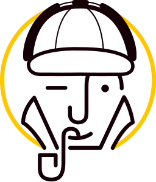</a> | **📂 檔名:** `sherlock-icon.svg` ✨ **格式:** `Vector (SVG)` ⚖️ **大小:** `13.01KB` 📅 **更新:** `2026-03-02`  🚀 **jsDelivr Markdown:** `` 🔗 **直接連結 (Url):** <code>https://cdn.jsdelivr.net/gh/barry028/materials@main/images/iCons/Brands/sherlock-icon.svg</code> 📥 [檢視原始檔](sherlock-icon.svg) |
|  | **📂 檔名:** `sherlock.svg` ✨ **格式:** `Vector (SVG)` ⚖️ **大小:** `19.74KB` 📅 **更新:** `2026-03-02`  🚀 **jsDelivr Markdown:** `` 🔗 **直接連結 (Url):** <code>https://cdn.jsdelivr.net/gh/barry028/materials@main/images/iCons/Brands/sherlock.svg</code> 📥 [檢視原始檔](sherlock.svg) |
|  | **📂 檔名:** `shields.svg` ✨ **格式:** `Vector (SVG)` ⚖️ **大小:** `6.60KB` 📅 **更新:** `2026-03-02`  🚀 **jsDelivr Markdown:** `` 🔗 **直接連結 (Url):** <code>https://cdn.jsdelivr.net/gh/barry028/materials@main/images/iCons/Brands/shields.svg</code> 📥 [檢視原始檔](shields.svg) |
|  | **📂 檔名:** `shipit.svg` ✨ **格式:** `Vector (SVG)` ⚖️ **大小:** `13.32KB` 📅 **更新:** `2026-03-02`  🚀 **jsDelivr Markdown:** `` 🔗 **直接連結 (Url):** <code>https://cdn.jsdelivr.net/gh/barry028/materials@main/images/iCons/Brands/shipit.svg</code> 📥 [檢視原始檔](shipit.svg) |
|  | **📂 檔名:** `shogun.svg` ✨ **格式:** `Vector (SVG)` ⚖️ **大小:** `7.58KB` 📅 **更新:** `2026-03-02`  🚀 **jsDelivr Markdown:** `` 🔗 **直接連結 (Url):** <code>https://cdn.jsdelivr.net/gh/barry028/materials@main/images/iCons/Brands/shogun.svg</code> 📥 [檢視原始檔](shogun.svg) |
|  | **📂 檔名:** `shopify.svg` ✨ **格式:** `Vector (SVG)` ⚖️ **大小:** `3.32KB` 📅 **更新:** `2026-03-02`  🚀 **jsDelivr Markdown:** `` 🔗 **直接連結 (Url):** <code>https://cdn.jsdelivr.net/gh/barry028/materials@main/images/iCons/Brands/shopify.svg</code> 📥 [檢視原始檔](shopify.svg) |
| <a href="shortcut-icon.svg">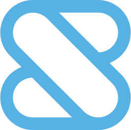</a> | **📂 檔名:** `shortcut-icon.svg` ✨ **格式:** `Vector (SVG)` ⚖️ **大小:** `2.57KB` 📅 **更新:** `2026-03-02`  🚀 **jsDelivr Markdown:** `` 🔗 **直接連結 (Url):** <code>https://cdn.jsdelivr.net/gh/barry028/materials@main/images/iCons/Brands/shortcut-icon.svg</code> 📥 [檢視原始檔](shortcut-icon.svg) |
|  | **📂 檔名:** `shortcut.svg` ✨ **格式:** `Vector (SVG)` ⚖️ **大小:** `7.46KB` 📅 **更新:** `2026-03-02`  🚀 **jsDelivr Markdown:** `` 🔗 **直接連結 (Url):** <code>https://cdn.jsdelivr.net/gh/barry028/materials@main/images/iCons/Brands/shortcut.svg</code> 📥 [檢視原始檔](shortcut.svg) |
|  | **📂 檔名:** `sidekiq-icon.svg` ✨ **格式:** `Vector (SVG)` ⚖️ **大小:** `11.51KB` 📅 **更新:** `2026-03-02`  🚀 **jsDelivr Markdown:** `` 🔗 **直接連結 (Url):** <code>https://cdn.jsdelivr.net/gh/barry028/materials@main/images/iCons/Brands/sidekiq-icon.svg</code> 📥 [檢視原始檔](sidekiq-icon.svg) |
|  | **📂 檔名:** `sidekiq.svg` ✨ **格式:** `Vector (SVG)` ⚖️ **大小:** `20.63KB` 📅 **更新:** `2026-03-02`  🚀 **jsDelivr Markdown:** `` 🔗 **直接連結 (Url):** <code>https://cdn.jsdelivr.net/gh/barry028/materials@main/images/iCons/Brands/sidekiq.svg</code> 📥 [檢視原始檔](sidekiq.svg) |
|  | **📂 檔名:** `signal.svg` ✨ **格式:** `Vector (SVG)` ⚖️ **大小:** `4.29KB` 📅 **更新:** `2026-03-02`  🚀 **jsDelivr Markdown:** `` 🔗 **直接連結 (Url):** <code>https://cdn.jsdelivr.net/gh/barry028/materials@main/images/iCons/Brands/signal.svg</code> 📥 [檢視原始檔](signal.svg) |
|  | **📂 檔名:** `sigstore-icon.svg` ✨ **格式:** `Vector (SVG)` ⚖️ **大小:** `14.41KB` 📅 **更新:** `2026-03-02`  🚀 **jsDelivr Markdown:** `` 🔗 **直接連結 (Url):** <code>https://cdn.jsdelivr.net/gh/barry028/materials@main/images/iCons/Brands/sigstore-icon.svg</code> 📥 [檢視原始檔](sigstore-icon.svg) |
|  | **📂 檔名:** `sigstore.svg` ✨ **格式:** `Vector (SVG)` ⚖️ **大小:** `25.40KB` 📅 **更新:** `2026-03-02`  🚀 **jsDelivr Markdown:** `` 🔗 **直接連結 (Url):** <code>https://cdn.jsdelivr.net/gh/barry028/materials@main/images/iCons/Brands/sigstore.svg</code> 📥 [檢視原始檔](sigstore.svg) |
|  | **📂 檔名:** `sinatra.svg` ✨ **格式:** `Vector (SVG)` ⚖️ **大小:** `5.09KB` 📅 **更新:** `2026-03-02`  🚀 **jsDelivr Markdown:** `` 🔗 **直接連結 (Url):** <code>https://cdn.jsdelivr.net/gh/barry028/materials@main/images/iCons/Brands/sinatra.svg</code> 📥 [檢視原始檔](sinatra.svg) |
|  | **📂 檔名:** `singlestore-icon.svg` ✨ **格式:** `Vector (SVG)` ⚖️ **大小:** `2.75KB` 📅 **更新:** `2026-03-02`  🚀 **jsDelivr Markdown:** `` 🔗 **直接連結 (Url):** <code>https://cdn.jsdelivr.net/gh/barry028/materials@main/images/iCons/Brands/singlestore-icon.svg</code> 📥 [檢視原始檔](singlestore-icon.svg) |
|  | **📂 檔名:** `singlestore.svg` ✨ **格式:** `Vector (SVG)` ⚖️ **大小:** `14.39KB` 📅 **更新:** `2026-03-02`  🚀 **jsDelivr Markdown:** `` 🔗 **直接連結 (Url):** <code>https://cdn.jsdelivr.net/gh/barry028/materials@main/images/iCons/Brands/singlestore.svg</code> 📥 [檢視原始檔](singlestore.svg) |
|  | **📂 檔名:** `sitepoint.svg` ✨ **格式:** `Vector (SVG)` ⚖️ **大小:** `1.29KB` 📅 **更新:** `2026-03-02`  🚀 **jsDelivr Markdown:** `` 🔗 **直接連結 (Url):** <code>https://cdn.jsdelivr.net/gh/barry028/materials@main/images/iCons/Brands/sitepoint.svg</code> 📥 [檢視原始檔](sitepoint.svg) |
|  | **📂 檔名:** `sk-hynix.svg` ✨ **格式:** `Vector (SVG)` ⚖️ **大小:** `7.81KB` 📅 **更新:** `2026-03-02`  🚀 **jsDelivr Markdown:** `` 🔗 **直接連結 (Url):** <code>https://cdn.jsdelivr.net/gh/barry028/materials@main/images/iCons/Brands/sk-hynix.svg</code> 📥 [檢視原始檔](sk-hynix.svg) |
|  | **📂 檔名:** `skaffolder.svg` ✨ **格式:** `Vector (SVG)` ⚖️ **大小:** `5.63KB` 📅 **更新:** `2026-03-02`  🚀 **jsDelivr Markdown:** `` 🔗 **直接連結 (Url):** <code>https://cdn.jsdelivr.net/gh/barry028/materials@main/images/iCons/Brands/skaffolder.svg</code> 📥 [檢視原始檔](skaffolder.svg) |
| <a href="sketch.svg">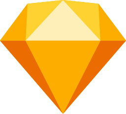</a> | **📂 檔名:** `sketch.svg` ✨ **格式:** `Vector (SVG)` ⚖️ **大小:** `1.10KB` 📅 **更新:** `2026-03-02`  🚀 **jsDelivr Markdown:** `` 🔗 **直接連結 (Url):** <code>https://cdn.jsdelivr.net/gh/barry028/materials@main/images/iCons/Brands/sketch.svg</code> 📥 [檢視原始檔](sketch.svg) |
|  | **📂 檔名:** `skylight.svg` ✨ **格式:** `Vector (SVG)` ⚖️ **大小:** `2.09KB` 📅 **更新:** `2026-03-02`  🚀 **jsDelivr Markdown:** `` 🔗 **直接連結 (Url):** <code>https://cdn.jsdelivr.net/gh/barry028/materials@main/images/iCons/Brands/skylight.svg</code> 📥 [檢視原始檔](skylight.svg) |
|  | **📂 檔名:** `skype.svg` ✨ **格式:** `Vector (SVG)` ⚖️ **大小:** `6.76KB` 📅 **更新:** `2026-03-02`  🚀 **jsDelivr Markdown:** `` 🔗 **直接連結 (Url):** <code>https://cdn.jsdelivr.net/gh/barry028/materials@main/images/iCons/Brands/skype.svg</code> 📥 [檢視原始檔](skype.svg) |
| <a href="slack-icon.svg">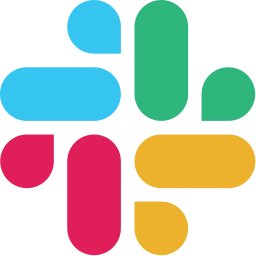</a> | **📂 檔名:** `slack-icon.svg` ✨ **格式:** `Vector (SVG)` ⚖️ **大小:** `2.74KB` 📅 **更新:** `2026-03-02`  🚀 **jsDelivr Markdown:** `` 🔗 **直接連結 (Url):** <code>https://cdn.jsdelivr.net/gh/barry028/materials@main/images/iCons/Brands/slack-icon.svg</code> 📥 [檢視原始檔](slack-icon.svg) |
|  | **📂 檔名:** `slack.svg` ✨ **格式:** `Vector (SVG)` ⚖️ **大小:** `5.15KB` 📅 **更新:** `2026-03-02`  🚀 **jsDelivr Markdown:** `` 🔗 **直接連結 (Url):** <code>https://cdn.jsdelivr.net/gh/barry028/materials@main/images/iCons/Brands/slack.svg</code> 📥 [檢視原始檔](slack.svg) |
|  | **📂 檔名:** `slides.svg` ✨ **格式:** `Vector (SVG)` ⚖️ **大小:** `2.66KB` 📅 **更新:** `2026-03-02`  🚀 **jsDelivr Markdown:** `` 🔗 **直接連結 (Url):** <code>https://cdn.jsdelivr.net/gh/barry028/materials@main/images/iCons/Brands/slides.svg</code> 📥 [檢視原始檔](slides.svg) |
|  | **📂 檔名:** `slim.svg` ✨ **格式:** `Vector (SVG)` ⚖️ **大小:** `2.66KB` 📅 **更新:** `2026-03-02`  🚀 **jsDelivr Markdown:** `` 🔗 **直接連結 (Url):** <code>https://cdn.jsdelivr.net/gh/barry028/materials@main/images/iCons/Brands/slim.svg</code> 📥 [檢視原始檔](slim.svg) |
| <a href="smartling.svg">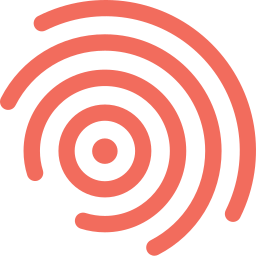</a> | **📂 檔名:** `smartling.svg` ✨ **格式:** `Vector (SVG)` ⚖️ **大小:** `3.43KB` 📅 **更新:** `2026-03-02`  🚀 **jsDelivr Markdown:** `` 🔗 **直接連結 (Url):** <code>https://cdn.jsdelivr.net/gh/barry028/materials@main/images/iCons/Brands/smartling.svg</code> 📥 [檢視原始檔](smartling.svg) |
|  | **📂 檔名:** `smashingmagazine.svg` ✨ **格式:** `Vector (SVG)` ⚖️ **大小:** `2.21KB` 📅 **更新:** `2026-03-02`  🚀 **jsDelivr Markdown:** `` 🔗 **直接連結 (Url):** <code>https://cdn.jsdelivr.net/gh/barry028/materials@main/images/iCons/Brands/smashingmagazine.svg</code> 📥 [檢視原始檔](smashingmagazine.svg) |
|  | **📂 檔名:** `snap-svg.svg` ✨ **格式:** `Vector (SVG)` ⚖️ **大小:** `2.75KB` 📅 **更新:** `2026-03-02`  🚀 **jsDelivr Markdown:** `` 🔗 **直接連結 (Url):** <code>https://cdn.jsdelivr.net/gh/barry028/materials@main/images/iCons/Brands/snap-svg.svg</code> 📥 [檢視原始檔](snap-svg.svg) |
|  | **📂 檔名:** `snaplet-icon.svg` ✨ **格式:** `Vector (SVG)` ⚖️ **大小:** `12.94KB` 📅 **更新:** `2026-03-02`  🚀 **jsDelivr Markdown:** `` 🔗 **直接連結 (Url):** <code>https://cdn.jsdelivr.net/gh/barry028/materials@main/images/iCons/Brands/snaplet-icon.svg</code> 📥 [檢視原始檔](snaplet-icon.svg) |
|  | **📂 檔名:** `snaplet.svg` ✨ **格式:** `Vector (SVG)` ⚖️ **大小:** `31.00KB` 📅 **更新:** `2026-03-02`  🚀 **jsDelivr Markdown:** `` 🔗 **直接連結 (Url):** <code>https://cdn.jsdelivr.net/gh/barry028/materials@main/images/iCons/Brands/snaplet.svg</code> 📥 [檢視原始檔](snaplet.svg) |
| <a href="snowflake-icon.svg">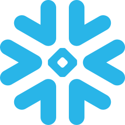</a> | **📂 檔名:** `snowflake-icon.svg` ✨ **格式:** `Vector (SVG)` ⚖️ **大小:** `5.40KB` 📅 **更新:** `2026-03-02`  🚀 **jsDelivr Markdown:** `` 🔗 **直接連結 (Url):** <code>https://cdn.jsdelivr.net/gh/barry028/materials@main/images/iCons/Brands/snowflake-icon.svg</code> 📥 [檢視原始檔](snowflake-icon.svg) |
|  | **📂 檔名:** `snowflake.svg` ✨ **格式:** `Vector (SVG)` ⚖️ **大小:** `21.84KB` 📅 **更新:** `2026-03-02`  🚀 **jsDelivr Markdown:** `` 🔗 **直接連結 (Url):** <code>https://cdn.jsdelivr.net/gh/barry028/materials@main/images/iCons/Brands/snowflake.svg</code> 📥 [檢視原始檔](snowflake.svg) |
|  | **📂 檔名:** `snowpack.svg` ✨ **格式:** `Vector (SVG)` ⚖️ **大小:** `902.00B` 📅 **更新:** `2026-03-02`  🚀 **jsDelivr Markdown:** `` 🔗 **直接連結 (Url):** <code>https://cdn.jsdelivr.net/gh/barry028/materials@main/images/iCons/Brands/snowpack.svg</code> 📥 [檢視原始檔](snowpack.svg) |
| <a href="snyk.svg">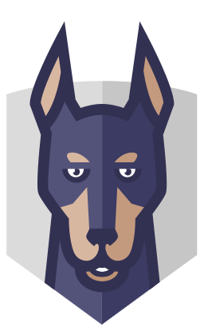</a> | **📂 檔名:** `snyk.svg` ✨ **格式:** `Vector (SVG)` ⚖️ **大小:** `11.77KB` 📅 **更新:** `2026-03-02`  🚀 **jsDelivr Markdown:** `` 🔗 **直接連結 (Url):** <code>https://cdn.jsdelivr.net/gh/barry028/materials@main/images/iCons/Brands/snyk.svg</code> 📥 [檢視原始檔](snyk.svg) |
|  | **📂 檔名:** `socket.io.svg` ✨ **格式:** `Vector (SVG)` ⚖️ **大小:** `1.72KB` 📅 **更新:** `2026-03-02`  🚀 **jsDelivr Markdown:** `` 🔗 **直接連結 (Url):** <code>https://cdn.jsdelivr.net/gh/barry028/materials@main/images/iCons/Brands/socket.io.svg</code> 📥 [檢視原始檔](socket.io.svg) |
|  | **📂 檔名:** `solarwinds.svg` ✨ **格式:** `Vector (SVG)` ⚖️ **大小:** `6.99KB` 📅 **更新:** `2026-03-02`  🚀 **jsDelivr Markdown:** `` 🔗 **直接連結 (Url):** <code>https://cdn.jsdelivr.net/gh/barry028/materials@main/images/iCons/Brands/solarwinds.svg</code> 📥 [檢視原始檔](solarwinds.svg) |
|  | **📂 檔名:** `solid.svg` ✨ **格式:** `Vector (SVG)` ⚖️ **大小:** `2.48KB` 📅 **更新:** `2026-03-02`  🚀 **jsDelivr Markdown:** `` 🔗 **直接連結 (Url):** <code>https://cdn.jsdelivr.net/gh/barry028/materials@main/images/iCons/Brands/solid.svg</code> 📥 [檢視原始檔](solid.svg) |
|  | **📂 檔名:** `solidity.svg` ✨ **格式:** `Vector (SVG)` ⚖️ **大小:** `1.13KB` 📅 **更新:** `2026-03-02`  🚀 **jsDelivr Markdown:** `` 🔗 **直接連結 (Url):** <code>https://cdn.jsdelivr.net/gh/barry028/materials@main/images/iCons/Brands/solidity.svg</code> 📥 [檢視原始檔](solidity.svg) |
|  | **📂 檔名:** `solidjs-icon.svg` ✨ **格式:** `Vector (SVG)` ⚖️ **大小:** `3.15KB` 📅 **更新:** `2026-03-02`  🚀 **jsDelivr Markdown:** `` 🔗 **直接連結 (Url):** <code>https://cdn.jsdelivr.net/gh/barry028/materials@main/images/iCons/Brands/solidjs-icon.svg</code> 📥 [檢視原始檔](solidjs-icon.svg) |
|  | **📂 檔名:** `solidjs.svg` ✨ **格式:** `Vector (SVG)` ⚖️ **大小:** `7.70KB` 📅 **更新:** `2026-03-02`  🚀 **jsDelivr Markdown:** `` 🔗 **直接連結 (Url):** <code>https://cdn.jsdelivr.net/gh/barry028/materials@main/images/iCons/Brands/solidjs.svg</code> 📥 [檢視原始檔](solidjs.svg) |
|  | **📂 檔名:** `solr.svg` ✨ **格式:** `Vector (SVG)` ⚖️ **大小:** `8.11KB` 📅 **更新:** `2026-03-02`  🚀 **jsDelivr Markdown:** `` 🔗 **直接連結 (Url):** <code>https://cdn.jsdelivr.net/gh/barry028/materials@main/images/iCons/Brands/solr.svg</code> 📥 [檢視原始檔](solr.svg) |
| <a href="sonarcloud-icon.svg">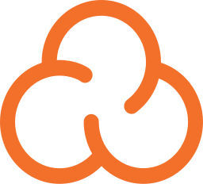</a> | **📂 檔名:** `sonarcloud-icon.svg` ✨ **格式:** `Vector (SVG)` ⚖️ **大小:** `2.60KB` 📅 **更新:** `2026-03-02`  🚀 **jsDelivr Markdown:** `` 🔗 **直接連結 (Url):** <code>https://cdn.jsdelivr.net/gh/barry028/materials@main/images/iCons/Brands/sonarcloud-icon.svg</code> 📥 [檢視原始檔](sonarcloud-icon.svg) |
|  | **📂 檔名:** `sonarcloud.svg` ✨ **格式:** `Vector (SVG)` ⚖️ **大小:** `9.28KB` 📅 **更新:** `2026-03-02`  🚀 **jsDelivr Markdown:** `` 🔗 **直接連結 (Url):** <code>https://cdn.jsdelivr.net/gh/barry028/materials@main/images/iCons/Brands/sonarcloud.svg</code> 📥 [檢視原始檔](sonarcloud.svg) |
| <a href="sonarlint-icon.svg">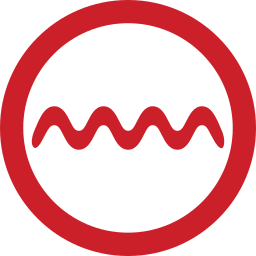</a> | **📂 檔名:** `sonarlint-icon.svg` ✨ **格式:** `Vector (SVG)` ⚖️ **大小:** `3.08KB` 📅 **更新:** `2026-03-02`  🚀 **jsDelivr Markdown:** `` 🔗 **直接連結 (Url):** <code>https://cdn.jsdelivr.net/gh/barry028/materials@main/images/iCons/Brands/sonarlint-icon.svg</code> 📥 [檢視原始檔](sonarlint-icon.svg) |
|  | **📂 檔名:** `sonarlint.svg` ✨ **格式:** `Vector (SVG)` ⚖️ **大小:** `8.18KB` 📅 **更新:** `2026-03-02`  🚀 **jsDelivr Markdown:** `` 🔗 **直接連結 (Url):** <code>https://cdn.jsdelivr.net/gh/barry028/materials@main/images/iCons/Brands/sonarlint.svg</code> 📥 [檢視原始檔](sonarlint.svg) |
|  | **📂 檔名:** `sonarqube.svg` ✨ **格式:** `Vector (SVG)` ⚖️ **大小:** `7.40KB` 📅 **更新:** `2026-03-02`  🚀 **jsDelivr Markdown:** `` 🔗 **直接連結 (Url):** <code>https://cdn.jsdelivr.net/gh/barry028/materials@main/images/iCons/Brands/sonarqube.svg</code> 📥 [檢視原始檔](sonarqube.svg) |
|  | **📂 檔名:** `soundcloud.svg` ✨ **格式:** `Vector (SVG)` ⚖️ **大小:** `17.25KB` 📅 **更新:** `2026-03-02`  🚀 **jsDelivr Markdown:** `` 🔗 **直接連結 (Url):** <code>https://cdn.jsdelivr.net/gh/barry028/materials@main/images/iCons/Brands/soundcloud.svg</code> 📥 [檢視原始檔](soundcloud.svg) |
| <a href="sourcegraph.svg">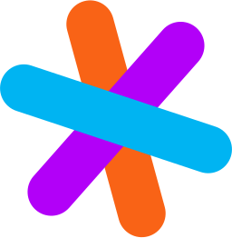</a> | **📂 檔名:** `sourcegraph.svg` ✨ **格式:** `Vector (SVG)` ⚖️ **大小:** `1.39KB` 📅 **更新:** `2026-03-02`  🚀 **jsDelivr Markdown:** `` 🔗 **直接連結 (Url):** <code>https://cdn.jsdelivr.net/gh/barry028/materials@main/images/iCons/Brands/sourcegraph.svg</code> 📥 [檢視原始檔](sourcegraph.svg) |
|  | **📂 檔名:** `sourcetree.svg` ✨ **格式:** `Vector (SVG)` ⚖️ **大小:** `1.85KB` 📅 **更新:** `2026-03-02`  🚀 **jsDelivr Markdown:** `` 🔗 **直接連結 (Url):** <code>https://cdn.jsdelivr.net/gh/barry028/materials@main/images/iCons/Brands/sourcetree.svg</code> 📥 [檢視原始檔](sourcetree.svg) |
| <a href="spark.svg">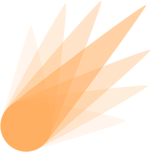</a> | **📂 檔名:** `spark.svg` ✨ **格式:** `Vector (SVG)` ⚖️ **大小:** `2.63KB` 📅 **更新:** `2026-03-02`  🚀 **jsDelivr Markdown:** `` 🔗 **直接連結 (Url):** <code>https://cdn.jsdelivr.net/gh/barry028/materials@main/images/iCons/Brands/spark.svg</code> 📥 [檢視原始檔](spark.svg) |
|  | **📂 檔名:** `sparkpost.svg` ✨ **格式:** `Vector (SVG)` ⚖️ **大小:** `5.57KB` 📅 **更新:** `2026-03-02`  🚀 **jsDelivr Markdown:** `` 🔗 **直接連結 (Url):** <code>https://cdn.jsdelivr.net/gh/barry028/materials@main/images/iCons/Brands/sparkpost.svg</code> 📥 [檢視原始檔](sparkpost.svg) |
|  | **📂 檔名:** `speakerdeck.svg` ✨ **格式:** `Vector (SVG)` ⚖️ **大小:** `1.35KB` 📅 **更新:** `2026-03-02`  🚀 **jsDelivr Markdown:** `` 🔗 **直接連結 (Url):** <code>https://cdn.jsdelivr.net/gh/barry028/materials@main/images/iCons/Brands/speakerdeck.svg</code> 📥 [檢視原始檔](speakerdeck.svg) |
|  | **📂 檔名:** `speedcurve.svg` ✨ **格式:** `Vector (SVG)` ⚖️ **大小:** `2.79KB` 📅 **更新:** `2026-03-02`  🚀 **jsDelivr Markdown:** `` 🔗 **直接連結 (Url):** <code>https://cdn.jsdelivr.net/gh/barry028/materials@main/images/iCons/Brands/speedcurve.svg</code> 📥 [檢視原始檔](speedcurve.svg) |
|  | **📂 檔名:** `spidermonkey-icon.svg` ✨ **格式:** `Vector (SVG)` ⚖️ **大小:** `3.67KB` 📅 **更新:** `2026-03-02`  🚀 **jsDelivr Markdown:** `` 🔗 **直接連結 (Url):** <code>https://cdn.jsdelivr.net/gh/barry028/materials@main/images/iCons/Brands/spidermonkey-icon.svg</code> 📥 [檢視原始檔](spidermonkey-icon.svg) |
|  | **📂 檔名:** `spidermonkey.svg` ✨ **格式:** `Vector (SVG)` ⚖️ **大小:** `13.40KB` 📅 **更新:** `2026-03-02`  🚀 **jsDelivr Markdown:** `` 🔗 **直接連結 (Url):** <code>https://cdn.jsdelivr.net/gh/barry028/materials@main/images/iCons/Brands/spidermonkey.svg</code> 📥 [檢視原始檔](spidermonkey.svg) |
| <a href="spinnaker.svg">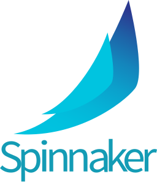</a> | **📂 檔名:** `spinnaker.svg` ✨ **格式:** `Vector (SVG)` ⚖️ **大小:** `12.76KB` 📅 **更新:** `2026-03-02`  🚀 **jsDelivr Markdown:** `` 🔗 **直接連結 (Url):** <code>https://cdn.jsdelivr.net/gh/barry028/materials@main/images/iCons/Brands/spinnaker.svg</code> 📥 [檢視原始檔](spinnaker.svg) |
|  | **📂 檔名:** `splunk.svg` ✨ **格式:** `Vector (SVG)` ⚖️ **大小:** `7.02KB` 📅 **更新:** `2026-03-02`  🚀 **jsDelivr Markdown:** `` 🔗 **直接連結 (Url):** <code>https://cdn.jsdelivr.net/gh/barry028/materials@main/images/iCons/Brands/splunk.svg</code> 📥 [檢視原始檔](splunk.svg) |
|  | **📂 檔名:** `spotify-icon.svg` ✨ **格式:** `Vector (SVG)` ⚖️ **大小:** `1.83KB` 📅 **更新:** `2026-03-02`  🚀 **jsDelivr Markdown:** `` 🔗 **直接連結 (Url):** <code>https://cdn.jsdelivr.net/gh/barry028/materials@main/images/iCons/Brands/spotify-icon.svg</code> 📥 [檢視原始檔](spotify-icon.svg) |
|  | **📂 檔名:** `spotify.svg` ✨ **格式:** `Vector (SVG)` ⚖️ **大小:** `8.45KB` 📅 **更新:** `2026-03-02`  🚀 **jsDelivr Markdown:** `` 🔗 **直接連結 (Url):** <code>https://cdn.jsdelivr.net/gh/barry028/materials@main/images/iCons/Brands/spotify.svg</code> 📥 [檢視原始檔](spotify.svg) |
|  | **📂 檔名:** `spree.svg` ✨ **格式:** `Vector (SVG)` ⚖️ **大小:** `9.45KB` 📅 **更新:** `2026-03-02`  🚀 **jsDelivr Markdown:** `` 🔗 **直接連結 (Url):** <code>https://cdn.jsdelivr.net/gh/barry028/materials@main/images/iCons/Brands/spree.svg</code> 📥 [檢視原始檔](spree.svg) |
|  | **📂 檔名:** `spring-icon.svg` ✨ **格式:** `Vector (SVG)` ⚖️ **大小:** `3.53KB` 📅 **更新:** `2026-03-02`  🚀 **jsDelivr Markdown:** `` 🔗 **直接連結 (Url):** <code>https://cdn.jsdelivr.net/gh/barry028/materials@main/images/iCons/Brands/spring-icon.svg</code> 📥 [檢視原始檔](spring-icon.svg) |
|  | **📂 檔名:** `spring.svg` ✨ **格式:** `Vector (SVG)` ⚖️ **大小:** `10.21KB` 📅 **更新:** `2026-03-02`  🚀 **jsDelivr Markdown:** `` 🔗 **直接連結 (Url):** <code>https://cdn.jsdelivr.net/gh/barry028/materials@main/images/iCons/Brands/spring.svg</code> 📥 [檢視原始檔](spring.svg) |
|  | **📂 檔名:** `sqlite.svg` ✨ **格式:** `Vector (SVG)` ⚖️ **大小:** `11.35KB` 📅 **更新:** `2026-03-02`  🚀 **jsDelivr Markdown:** `` 🔗 **直接連結 (Url):** <code>https://cdn.jsdelivr.net/gh/barry028/materials@main/images/iCons/Brands/sqlite.svg</code> 📥 [檢視原始檔](sqlite.svg) |
|  | **📂 檔名:** `square.svg` ✨ **格式:** `Vector (SVG)` ⚖️ **大小:** `1.43KB` 📅 **更新:** `2026-03-02`  🚀 **jsDelivr Markdown:** `` 🔗 **直接連結 (Url):** <code>https://cdn.jsdelivr.net/gh/barry028/materials@main/images/iCons/Brands/square.svg</code> 📥 [檢視原始檔](square.svg) |
|  | **📂 檔名:** `squarespace.svg` ✨ **格式:** `Vector (SVG)` ⚖️ **大小:** `2.44KB` 📅 **更新:** `2026-03-02`  🚀 **jsDelivr Markdown:** `` 🔗 **直接連結 (Url):** <code>https://cdn.jsdelivr.net/gh/barry028/materials@main/images/iCons/Brands/squarespace.svg</code> 📥 [檢視原始檔](squarespace.svg) |
|  | **📂 檔名:** `stackbit-icon.svg` ✨ **格式:** `Vector (SVG)` ⚖️ **大小:** `1.32KB` 📅 **更新:** `2026-03-02`  🚀 **jsDelivr Markdown:** `` 🔗 **直接連結 (Url):** <code>https://cdn.jsdelivr.net/gh/barry028/materials@main/images/iCons/Brands/stackbit-icon.svg</code> 📥 [檢視原始檔](stackbit-icon.svg) |
|  | **📂 檔名:** `stackbit.svg` ✨ **格式:** `Vector (SVG)` ⚖️ **大小:** `6.36KB` 📅 **更新:** `2026-03-02`  🚀 **jsDelivr Markdown:** `` 🔗 **直接連結 (Url):** <code>https://cdn.jsdelivr.net/gh/barry028/materials@main/images/iCons/Brands/stackbit.svg</code> 📥 [檢視原始檔](stackbit.svg) |
| <a href="stackblitz-icon.svg">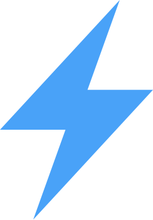</a> | **📂 檔名:** `stackblitz-icon.svg` ✨ **格式:** `Vector (SVG)` ⚖️ **大小:** `424.00B` 📅 **更新:** `2026-03-02`  🚀 **jsDelivr Markdown:** `` 🔗 **直接連結 (Url):** <code>https://cdn.jsdelivr.net/gh/barry028/materials@main/images/iCons/Brands/stackblitz-icon.svg</code> 📥 [檢視原始檔](stackblitz-icon.svg) |
|  | **📂 檔名:** `stackblitz.svg` ✨ **格式:** `Vector (SVG)` ⚖️ **大小:** `5.43KB` 📅 **更新:** `2026-03-02`  🚀 **jsDelivr Markdown:** `` 🔗 **直接連結 (Url):** <code>https://cdn.jsdelivr.net/gh/barry028/materials@main/images/iCons/Brands/stackblitz.svg</code> 📥 [檢視原始檔](stackblitz.svg) |
|  | **📂 檔名:** `stackoverflow-icon.svg` ✨ **格式:** `Vector (SVG)` ⚖️ **大小:** `1.07KB` 📅 **更新:** `2026-03-02`  🚀 **jsDelivr Markdown:** `` 🔗 **直接連結 (Url):** <code>https://cdn.jsdelivr.net/gh/barry028/materials@main/images/iCons/Brands/stackoverflow-icon.svg</code> 📥 [檢視原始檔](stackoverflow-icon.svg) |
|  | **📂 檔名:** `stackoverflow.svg` ✨ **格式:** `Vector (SVG)` ⚖️ **大小:** `10.05KB` 📅 **更新:** `2026-03-02`  🚀 **jsDelivr Markdown:** `` 🔗 **直接連結 (Url):** <code>https://cdn.jsdelivr.net/gh/barry028/materials@main/images/iCons/Brands/stackoverflow.svg</code> 📥 [檢視原始檔](stackoverflow.svg) |
|  | **📂 檔名:** `stackshare.svg` ✨ **格式:** `Vector (SVG)` ⚖️ **大小:** `2.88KB` 📅 **更新:** `2026-03-02`  🚀 **jsDelivr Markdown:** `` 🔗 **直接連結 (Url):** <code>https://cdn.jsdelivr.net/gh/barry028/materials@main/images/iCons/Brands/stackshare.svg</code> 📥 [檢視原始檔](stackshare.svg) |
|  | **📂 檔名:** `stately-icon.svg` ✨ **格式:** `Vector (SVG)` ⚖️ **大小:** `1.44KB` 📅 **更新:** `2026-03-02`  🚀 **jsDelivr Markdown:** `` 🔗 **直接連結 (Url):** <code>https://cdn.jsdelivr.net/gh/barry028/materials@main/images/iCons/Brands/stately-icon.svg</code> 📥 [檢視原始檔](stately-icon.svg) |
|  | **📂 檔名:** `stately.svg` ✨ **格式:** `Vector (SVG)` ⚖️ **大小:** `3.81KB` 📅 **更新:** `2026-03-02`  🚀 **jsDelivr Markdown:** `` 🔗 **直接連結 (Url):** <code>https://cdn.jsdelivr.net/gh/barry028/materials@main/images/iCons/Brands/stately.svg</code> 📥 [檢視原始檔](stately.svg) |
|  | **📂 檔名:** `statuspage.svg` ✨ **格式:** `Vector (SVG)` ⚖️ **大小:** `1.22KB` 📅 **更新:** `2026-03-02`  🚀 **jsDelivr Markdown:** `` 🔗 **直接連結 (Url):** <code>https://cdn.jsdelivr.net/gh/barry028/materials@main/images/iCons/Brands/statuspage.svg</code> 📥 [檢視原始檔](statuspage.svg) |
| <a href="stdlib-icon.svg">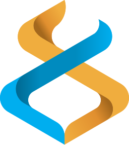</a> | **📂 檔名:** `stdlib-icon.svg` ✨ **格式:** `Vector (SVG)` ⚖️ **大小:** `7.40KB` 📅 **更新:** `2026-03-02`  🚀 **jsDelivr Markdown:** `` 🔗 **直接連結 (Url):** <code>https://cdn.jsdelivr.net/gh/barry028/materials@main/images/iCons/Brands/stdlib-icon.svg</code> 📥 [檢視原始檔](stdlib-icon.svg) |
|  | **📂 檔名:** `stdlib.svg` ✨ **格式:** `Vector (SVG)` ⚖️ **大小:** `12.57KB` 📅 **更新:** `2026-03-02`  🚀 **jsDelivr Markdown:** `` 🔗 **直接連結 (Url):** <code>https://cdn.jsdelivr.net/gh/barry028/materials@main/images/iCons/Brands/stdlib.svg</code> 📥 [檢視原始檔](stdlib.svg) |
|  | **📂 檔名:** `steam.svg` ✨ **格式:** `Vector (SVG)` ⚖️ **大小:** `2.28KB` 📅 **更新:** `2026-03-02`  🚀 **jsDelivr Markdown:** `` 🔗 **直接連結 (Url):** <code>https://cdn.jsdelivr.net/gh/barry028/materials@main/images/iCons/Brands/steam.svg</code> 📥 [檢視原始檔](steam.svg) |
|  | **📂 檔名:** `stenciljs-icon.svg` ✨ **格式:** `Vector (SVG)` ⚖️ **大小:** `651.00B` 📅 **更新:** `2026-03-02`  🚀 **jsDelivr Markdown:** `` 🔗 **直接連結 (Url):** <code>https://cdn.jsdelivr.net/gh/barry028/materials@main/images/iCons/Brands/stenciljs-icon.svg</code> 📥 [檢視原始檔](stenciljs-icon.svg) |
|  | **📂 檔名:** `stenciljs.svg` ✨ **格式:** `Vector (SVG)` ⚖️ **大小:** `3.77KB` 📅 **更新:** `2026-03-02`  🚀 **jsDelivr Markdown:** `` 🔗 **直接連結 (Url):** <code>https://cdn.jsdelivr.net/gh/barry028/materials@main/images/iCons/Brands/stenciljs.svg</code> 📥 [檢視原始檔](stenciljs.svg) |
|  | **📂 檔名:** `stepsize-icon.svg` ✨ **格式:** `Vector (SVG)` ⚖️ **大小:** `3.83KB` 📅 **更新:** `2026-03-02`  🚀 **jsDelivr Markdown:** `` 🔗 **直接連結 (Url):** <code>https://cdn.jsdelivr.net/gh/barry028/materials@main/images/iCons/Brands/stepsize-icon.svg</code> 📥 [檢視原始檔](stepsize-icon.svg) |
|  | **📂 檔名:** `stepsize.svg` ✨ **格式:** `Vector (SVG)` ⚖️ **大小:** `8.53KB` 📅 **更新:** `2026-03-02`  🚀 **jsDelivr Markdown:** `` 🔗 **直接連結 (Url):** <code>https://cdn.jsdelivr.net/gh/barry028/materials@main/images/iCons/Brands/stepsize.svg</code> 📥 [檢視原始檔](stepsize.svg) |
|  | **📂 檔名:** `stetho.svg` ✨ **格式:** `Vector (SVG)` ⚖️ **大小:** `3.26KB` 📅 **更新:** `2026-03-02`  🚀 **jsDelivr Markdown:** `` 🔗 **直接連結 (Url):** <code>https://cdn.jsdelivr.net/gh/barry028/materials@main/images/iCons/Brands/stetho.svg</code> 📥 [檢視原始檔](stetho.svg) |
|  | **📂 檔名:** `stickermule.svg` ✨ **格式:** `Vector (SVG)` ⚖️ **大小:** `15.09KB` 📅 **更新:** `2026-03-02`  🚀 **jsDelivr Markdown:** `` 🔗 **直接連結 (Url):** <code>https://cdn.jsdelivr.net/gh/barry028/materials@main/images/iCons/Brands/stickermule.svg</code> 📥 [檢視原始檔](stickermule.svg) |
|  | **📂 檔名:** `stigg-icon.svg` ✨ **格式:** `Vector (SVG)` ⚖️ **大小:** `3.74KB` 📅 **更新:** `2026-03-02`  🚀 **jsDelivr Markdown:** `` 🔗 **直接連結 (Url):** <code>https://cdn.jsdelivr.net/gh/barry028/materials@main/images/iCons/Brands/stigg-icon.svg</code> 📥 [檢視原始檔](stigg-icon.svg) |
|  | **📂 檔名:** `stigg.svg` ✨ **格式:** `Vector (SVG)` ⚖️ **大小:** `7.64KB` 📅 **更新:** `2026-03-02`  🚀 **jsDelivr Markdown:** `` 🔗 **直接連結 (Url):** <code>https://cdn.jsdelivr.net/gh/barry028/materials@main/images/iCons/Brands/stigg.svg</code> 📥 [檢視原始檔](stigg.svg) |
|  | **📂 檔名:** `stimulus-icon.svg` ✨ **格式:** `Vector (SVG)` ⚖️ **大小:** `2.73KB` 📅 **更新:** `2026-03-02`  🚀 **jsDelivr Markdown:** `` 🔗 **直接連結 (Url):** <code>https://cdn.jsdelivr.net/gh/barry028/materials@main/images/iCons/Brands/stimulus-icon.svg</code> 📥 [檢視原始檔](stimulus-icon.svg) |
|  | **📂 檔名:** `stimulus.svg` ✨ **格式:** `Vector (SVG)` ⚖️ **大小:** `9.14KB` 📅 **更新:** `2026-03-02`  🚀 **jsDelivr Markdown:** `` 🔗 **直接連結 (Url):** <code>https://cdn.jsdelivr.net/gh/barry028/materials@main/images/iCons/Brands/stimulus.svg</code> 📥 [檢視原始檔](stimulus.svg) |
| <a href="stitch.svg">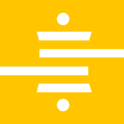</a> | **📂 檔名:** `stitch.svg` ✨ **格式:** `Vector (SVG)` ⚖️ **大小:** `1.31KB` 📅 **更新:** `2026-03-02`  🚀 **jsDelivr Markdown:** `` 🔗 **直接連結 (Url):** <code>https://cdn.jsdelivr.net/gh/barry028/materials@main/images/iCons/Brands/stitch.svg</code> 📥 [檢視原始檔](stitch.svg) |
|  | **📂 檔名:** `stoplight.svg` ✨ **格式:** `Vector (SVG)` ⚖️ **大小:** `3.23KB` 📅 **更新:** `2026-03-02`  🚀 **jsDelivr Markdown:** `` 🔗 **直接連結 (Url):** <code>https://cdn.jsdelivr.net/gh/barry028/materials@main/images/iCons/Brands/stoplight.svg</code> 📥 [檢視原始檔](stoplight.svg) |
|  | **📂 檔名:** `storyblocks-icon.svg` ✨ **格式:** `Vector (SVG)` ⚖️ **大小:** `852.00B` 📅 **更新:** `2026-03-02`  🚀 **jsDelivr Markdown:** `` 🔗 **直接連結 (Url):** <code>https://cdn.jsdelivr.net/gh/barry028/materials@main/images/iCons/Brands/storyblocks-icon.svg</code> 📥 [檢視原始檔](storyblocks-icon.svg) |
|  | **📂 檔名:** `storyblocks.svg` ✨ **格式:** `Vector (SVG)` ⚖️ **大小:** `9.71KB` 📅 **更新:** `2026-03-02`  🚀 **jsDelivr Markdown:** `` 🔗 **直接連結 (Url):** <code>https://cdn.jsdelivr.net/gh/barry028/materials@main/images/iCons/Brands/storyblocks.svg</code> 📥 [檢視原始檔](storyblocks.svg) |
|  | **📂 檔名:** `storyblok-icon.svg` ✨ **格式:** `Vector (SVG)` ⚖️ **大小:** `2.45KB` 📅 **更新:** `2026-03-02`  🚀 **jsDelivr Markdown:** `` 🔗 **直接連結 (Url):** <code>https://cdn.jsdelivr.net/gh/barry028/materials@main/images/iCons/Brands/storyblok-icon.svg</code> 📥 [檢視原始檔](storyblok-icon.svg) |
|  | **📂 檔名:** `storyblok.svg` ✨ **格式:** `Vector (SVG)` ⚖️ **大小:** `11.06KB` 📅 **更新:** `2026-03-02`  🚀 **jsDelivr Markdown:** `` 🔗 **直接連結 (Url):** <code>https://cdn.jsdelivr.net/gh/barry028/materials@main/images/iCons/Brands/storyblok.svg</code> 📥 [檢視原始檔](storyblok.svg) |
|  | **📂 檔名:** `storybook-icon.svg` ✨ **格式:** `Vector (SVG)` ⚖️ **大小:** `2.25KB` 📅 **更新:** `2026-03-02`  🚀 **jsDelivr Markdown:** `` 🔗 **直接連結 (Url):** <code>https://cdn.jsdelivr.net/gh/barry028/materials@main/images/iCons/Brands/storybook-icon.svg</code> 📥 [檢視原始檔](storybook-icon.svg) |
|  | **📂 檔名:** `storybook.svg` ✨ **格式:** `Vector (SVG)` ⚖️ **大小:** `9.75KB` 📅 **更新:** `2026-03-02`  🚀 **jsDelivr Markdown:** `` 🔗 **直接連結 (Url):** <code>https://cdn.jsdelivr.net/gh/barry028/materials@main/images/iCons/Brands/storybook.svg</code> 📥 [檢視原始檔](storybook.svg) |
|  | **📂 檔名:** `strapi-icon.svg` ✨ **格式:** `Vector (SVG)` ⚖️ **大小:** `1.62KB` 📅 **更新:** `2026-03-02`  🚀 **jsDelivr Markdown:** `` 🔗 **直接連結 (Url):** <code>https://cdn.jsdelivr.net/gh/barry028/materials@main/images/iCons/Brands/strapi-icon.svg</code> 📥 [檢視原始檔](strapi-icon.svg) |
|  | **📂 檔名:** `strapi.svg` ✨ **格式:** `Vector (SVG)` ⚖️ **大小:** `9.35KB` 📅 **更新:** `2026-03-02`  🚀 **jsDelivr Markdown:** `` 🔗 **直接連結 (Url):** <code>https://cdn.jsdelivr.net/gh/barry028/materials@main/images/iCons/Brands/strapi.svg</code> 📥 [檢視原始檔](strapi.svg) |
|  | **📂 檔名:** `streamlit.svg` ✨ **格式:** `Vector (SVG)` ⚖️ **大小:** `2.98KB` 📅 **更新:** `2026-03-02`  🚀 **jsDelivr Markdown:** `` 🔗 **直接連結 (Url):** <code>https://cdn.jsdelivr.net/gh/barry028/materials@main/images/iCons/Brands/streamlit.svg</code> 📥 [檢視原始檔](streamlit.svg) |
|  | **📂 檔名:** `strider.svg` ✨ **格式:** `Vector (SVG)` ⚖️ **大小:** `2.12KB` 📅 **更新:** `2026-03-02`  🚀 **jsDelivr Markdown:** `` 🔗 **直接連結 (Url):** <code>https://cdn.jsdelivr.net/gh/barry028/materials@main/images/iCons/Brands/strider.svg</code> 📥 [檢視原始檔](strider.svg) |
|  | **📂 檔名:** `stripe.svg` ✨ **格式:** `Vector (SVG)` ⚖️ **大小:** `3.19KB` 📅 **更新:** `2026-03-02`  🚀 **jsDelivr Markdown:** `` 🔗 **直接連結 (Url):** <code>https://cdn.jsdelivr.net/gh/barry028/materials@main/images/iCons/Brands/stripe.svg</code> 📥 [檢視原始檔](stripe.svg) |
| <a href="struts.svg">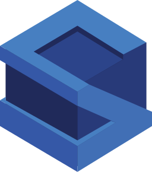</a> | **📂 檔名:** `struts.svg` ✨ **格式:** `Vector (SVG)` ⚖️ **大小:** `2.06KB` 📅 **更新:** `2026-03-02`  🚀 **jsDelivr Markdown:** `` 🔗 **直接連結 (Url):** <code>https://cdn.jsdelivr.net/gh/barry028/materials@main/images/iCons/Brands/struts.svg</code> 📥 [檢視原始檔](struts.svg) |
|  | **📂 檔名:** `styleci.svg` ✨ **格式:** `Vector (SVG)` ⚖️ **大小:** `1.05KB` 📅 **更新:** `2026-03-02`  🚀 **jsDelivr Markdown:** `` 🔗 **直接連結 (Url):** <code>https://cdn.jsdelivr.net/gh/barry028/materials@main/images/iCons/Brands/styleci.svg</code> 📥 [檢視原始檔](styleci.svg) |
|  | **📂 檔名:** `stylefmt.svg` ✨ **格式:** `Vector (SVG)` ⚖️ **大小:** `3.60KB` 📅 **更新:** `2026-03-02`  🚀 **jsDelivr Markdown:** `` 🔗 **直接連結 (Url):** <code>https://cdn.jsdelivr.net/gh/barry028/materials@main/images/iCons/Brands/stylefmt.svg</code> 📥 [檢視原始檔](stylefmt.svg) |
|  | **📂 檔名:** `stylelint.svg` ✨ **格式:** `Vector (SVG)` ⚖️ **大小:** `2.50KB` 📅 **更新:** `2026-03-02`  🚀 **jsDelivr Markdown:** `` 🔗 **直接連結 (Url):** <code>https://cdn.jsdelivr.net/gh/barry028/materials@main/images/iCons/Brands/stylelint.svg</code> 📥 [檢視原始檔](stylelint.svg) |
|  | **📂 檔名:** `stylis.svg` ✨ **格式:** `Vector (SVG)` ⚖️ **大小:** `3.51KB` 📅 **更新:** `2026-03-02`  🚀 **jsDelivr Markdown:** `` 🔗 **直接連結 (Url):** <code>https://cdn.jsdelivr.net/gh/barry028/materials@main/images/iCons/Brands/stylis.svg</code> 📥 [檢視原始檔](stylis.svg) |
|  | **📂 檔名:** `stylus.svg` ✨ **格式:** `Vector (SVG)` ⚖️ **大小:** `6.56KB` 📅 **更新:** `2026-03-02`  🚀 **jsDelivr Markdown:** `` 🔗 **直接連結 (Url):** <code>https://cdn.jsdelivr.net/gh/barry028/materials@main/images/iCons/Brands/stylus.svg</code> 📥 [檢視原始檔](stylus.svg) |
|  | **📂 檔名:** `stytch.svg` ✨ **格式:** `Vector (SVG)` ⚖️ **大小:** `5.76KB` 📅 **更新:** `2026-03-02`  🚀 **jsDelivr Markdown:** `` 🔗 **直接連結 (Url):** <code>https://cdn.jsdelivr.net/gh/barry028/materials@main/images/iCons/Brands/stytch.svg</code> 📥 [檢視原始檔](stytch.svg) |
|  | **📂 檔名:** `sublimetext-icon.svg` ✨ **格式:** `Vector (SVG)` ⚖️ **大小:** `1.79KB` 📅 **更新:** `2026-03-02`  🚀 **jsDelivr Markdown:** `` 🔗 **直接連結 (Url):** <code>https://cdn.jsdelivr.net/gh/barry028/materials@main/images/iCons/Brands/sublimetext-icon.svg</code> 📥 [檢視原始檔](sublimetext-icon.svg) |
|  | **📂 檔名:** `sublimetext.svg` ✨ **格式:** `Vector (SVG)` ⚖️ **大小:** `14.65KB` 📅 **更新:** `2026-03-02`  🚀 **jsDelivr Markdown:** `` 🔗 **直接連結 (Url):** <code>https://cdn.jsdelivr.net/gh/barry028/materials@main/images/iCons/Brands/sublimetext.svg</code> 📥 [檢視原始檔](sublimetext.svg) |
|  | **📂 檔名:** `subversion.svg` ✨ **格式:** `Vector (SVG)` ⚖️ **大小:** `3.31KB` 📅 **更新:** `2026-03-02`  🚀 **jsDelivr Markdown:** `` 🔗 **直接連結 (Url):** <code>https://cdn.jsdelivr.net/gh/barry028/materials@main/images/iCons/Brands/subversion.svg</code> 📥 [檢視原始檔](subversion.svg) |
|  | **📂 檔名:** `sugarss.svg` ✨ **格式:** `Vector (SVG)` ⚖️ **大小:** `75.66KB` 📅 **更新:** `2026-03-02`  🚀 **jsDelivr Markdown:** `` 🔗 **直接連結 (Url):** <code>https://cdn.jsdelivr.net/gh/barry028/materials@main/images/iCons/Brands/sugarss.svg</code> 📥 [檢視原始檔](sugarss.svg) |
|  | **📂 檔名:** `supabase-icon.svg` ✨ **格式:** `Vector (SVG)` ⚖️ **大小:** `1.67KB` 📅 **更新:** `2026-03-02`  🚀 **jsDelivr Markdown:** `` 🔗 **直接連結 (Url):** <code>https://cdn.jsdelivr.net/gh/barry028/materials@main/images/iCons/Brands/supabase-icon.svg</code> 📥 [檢視原始檔](supabase-icon.svg) |
|  | **📂 檔名:** `supabase.svg` ✨ **格式:** `Vector (SVG)` ⚖️ **大小:** `13.78KB` 📅 **更新:** `2026-03-02`  🚀 **jsDelivr Markdown:** `` 🔗 **直接連結 (Url):** <code>https://cdn.jsdelivr.net/gh/barry028/materials@main/images/iCons/Brands/supabase.svg</code> 📥 [檢視原始檔](supabase.svg) |
|  | **📂 檔名:** `supertokens-icon.svg` ✨ **格式:** `Vector (SVG)` ⚖️ **大小:** `7.56KB` 📅 **更新:** `2026-03-02`  🚀 **jsDelivr Markdown:** `` 🔗 **直接連結 (Url):** <code>https://cdn.jsdelivr.net/gh/barry028/materials@main/images/iCons/Brands/supertokens-icon.svg</code> 📥 [檢視原始檔](supertokens-icon.svg) |
|  | **📂 檔名:** `supertokens.svg` ✨ **格式:** `Vector (SVG)` ⚖️ **大小:** `15.90KB` 📅 **更新:** `2026-03-02`  🚀 **jsDelivr Markdown:** `` 🔗 **直接連結 (Url):** <code>https://cdn.jsdelivr.net/gh/barry028/materials@main/images/iCons/Brands/supertokens.svg</code> 📥 [檢視原始檔](supertokens.svg) |
| <a href="surge.svg">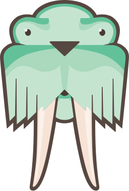</a> | **📂 檔名:** `surge.svg` ✨ **格式:** `Vector (SVG)` ⚖️ **大小:** `11.45KB` 📅 **更新:** `2026-03-02`  🚀 **jsDelivr Markdown:** `` 🔗 **直接連結 (Url):** <code>https://cdn.jsdelivr.net/gh/barry028/materials@main/images/iCons/Brands/surge.svg</code> 📥 [檢視原始檔](surge.svg) |
|  | **📂 檔名:** `surrealdb-icon.svg` ✨ **格式:** `Vector (SVG)` ⚖️ **大小:** `1.98KB` 📅 **更新:** `2026-03-02`  🚀 **jsDelivr Markdown:** `` 🔗 **直接連結 (Url):** <code>https://cdn.jsdelivr.net/gh/barry028/materials@main/images/iCons/Brands/surrealdb-icon.svg</code> 📥 [檢視原始檔](surrealdb-icon.svg) |
|  | **📂 檔名:** `surrealdb.svg` ✨ **格式:** `Vector (SVG)` ⚖️ **大小:** `7.08KB` 📅 **更新:** `2026-03-02`  🚀 **jsDelivr Markdown:** `` 🔗 **直接連結 (Url):** <code>https://cdn.jsdelivr.net/gh/barry028/materials@main/images/iCons/Brands/surrealdb.svg</code> 📥 [檢視原始檔](surrealdb.svg) |
| <a href="survicate-icon.svg">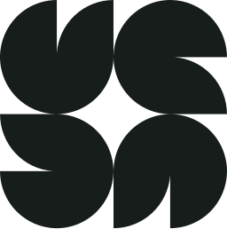</a> | **📂 檔名:** `survicate-icon.svg` ✨ **格式:** `Vector (SVG)` ⚖️ **大小:** `2.80KB` 📅 **更新:** `2026-03-02`  🚀 **jsDelivr Markdown:** `` 🔗 **直接連結 (Url):** <code>https://cdn.jsdelivr.net/gh/barry028/materials@main/images/iCons/Brands/survicate-icon.svg</code> 📥 [檢視原始檔](survicate-icon.svg) |
|  | **📂 檔名:** `survicate.svg` ✨ **格式:** `Vector (SVG)` ⚖️ **大小:** `12.38KB` 📅 **更新:** `2026-03-02`  🚀 **jsDelivr Markdown:** `` 🔗 **直接連結 (Url):** <code>https://cdn.jsdelivr.net/gh/barry028/materials@main/images/iCons/Brands/survicate.svg</code> 📥 [檢視原始檔](survicate.svg) |
|  | **📂 檔名:** `suse.svg` ✨ **格式:** `Vector (SVG)` ⚖️ **大小:** `10.44KB` 📅 **更新:** `2026-03-02`  🚀 **jsDelivr Markdown:** `` 🔗 **直接連結 (Url):** <code>https://cdn.jsdelivr.net/gh/barry028/materials@main/images/iCons/Brands/suse.svg</code> 📥 [檢視原始檔](suse.svg) |
| <a href="susy.svg">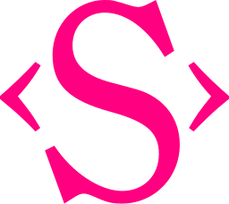</a> | **📂 檔名:** `susy.svg` ✨ **格式:** `Vector (SVG)` ⚖️ **大小:** `2.41KB` 📅 **更新:** `2026-03-02`  🚀 **jsDelivr Markdown:** `` 🔗 **直接連結 (Url):** <code>https://cdn.jsdelivr.net/gh/barry028/materials@main/images/iCons/Brands/susy.svg</code> 📥 [檢視原始檔](susy.svg) |
|  | **📂 檔名:** `svelte-icon.svg` ✨ **格式:** `Vector (SVG)` ⚖️ **大小:** `3.43KB` 📅 **更新:** `2026-03-02`  🚀 **jsDelivr Markdown:** `` 🔗 **直接連結 (Url):** <code>https://cdn.jsdelivr.net/gh/barry028/materials@main/images/iCons/Brands/svelte-icon.svg</code> 📥 [檢視原始檔](svelte-icon.svg) |
|  | **📂 檔名:** `svelte-kit.svg` ✨ **格式:** `Vector (SVG)` ⚖️ **大小:** `7.72KB` 📅 **更新:** `2026-03-02`  🚀 **jsDelivr Markdown:** `` 🔗 **直接連結 (Url):** <code>https://cdn.jsdelivr.net/gh/barry028/materials@main/images/iCons/Brands/svelte-kit.svg</code> 📥 [檢視原始檔](svelte-kit.svg) |
|  | **📂 檔名:** `svelte.svg` ✨ **格式:** `Vector (SVG)` ⚖️ **大小:** `7.09KB` 📅 **更新:** `2026-03-02`  🚀 **jsDelivr Markdown:** `` 🔗 **直接連結 (Url):** <code>https://cdn.jsdelivr.net/gh/barry028/materials@main/images/iCons/Brands/svelte.svg</code> 📥 [檢視原始檔](svelte.svg) |
|  | **📂 檔名:** `svg.svg` ✨ **格式:** `Vector (SVG)` ⚖️ **大小:** `4.29KB` 📅 **更新:** `2026-03-02`  🚀 **jsDelivr Markdown:** `` 🔗 **直接連結 (Url):** <code>https://cdn.jsdelivr.net/gh/barry028/materials@main/images/iCons/Brands/svg.svg</code> 📥 [檢視原始檔](svg.svg) |
|  | **📂 檔名:** `svgator.svg` ✨ **格式:** `Vector (SVG)` ⚖️ **大小:** `14.06KB` 📅 **更新:** `2026-03-02`  🚀 **jsDelivr Markdown:** `` 🔗 **直接連結 (Url):** <code>https://cdn.jsdelivr.net/gh/barry028/materials@main/images/iCons/Brands/svgator.svg</code> 📥 [檢視原始檔](svgator.svg) |
|  | **📂 檔名:** `swagger.svg` ✨ **格式:** `Vector (SVG)` ⚖️ **大小:** `4.89KB` 📅 **更新:** `2026-03-02`  🚀 **jsDelivr Markdown:** `` 🔗 **直接連結 (Url):** <code>https://cdn.jsdelivr.net/gh/barry028/materials@main/images/iCons/Brands/swagger.svg</code> 📥 [檢視原始檔](swagger.svg) |
| <a href="swc.svg">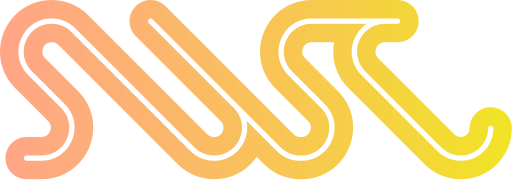</a> | **📂 檔名:** `swc.svg` ✨ **格式:** `Vector (SVG)` ⚖️ **大小:** `7.79KB` 📅 **更新:** `2026-03-02`  🚀 **jsDelivr Markdown:** `` 🔗 **直接連結 (Url):** <code>https://cdn.jsdelivr.net/gh/barry028/materials@main/images/iCons/Brands/swc.svg</code> 📥 [檢視原始檔](swc.svg) |
| <a href="swift.svg">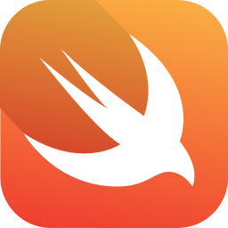</a> | **📂 檔名:** `swift.svg` ✨ **格式:** `Vector (SVG)` ⚖️ **大小:** `2.16KB` 📅 **更新:** `2026-03-02`  🚀 **jsDelivr Markdown:** `` 🔗 **直接連結 (Url):** <code>https://cdn.jsdelivr.net/gh/barry028/materials@main/images/iCons/Brands/swift.svg</code> 📥 [檢視原始檔](swift.svg) |
|  | **📂 檔名:** `swiftype.svg` ✨ **格式:** `Vector (SVG)` ⚖️ **大小:** `1.26KB` 📅 **更新:** `2026-03-02`  🚀 **jsDelivr Markdown:** `` 🔗 **直接連結 (Url):** <code>https://cdn.jsdelivr.net/gh/barry028/materials@main/images/iCons/Brands/swiftype.svg</code> 📥 [檢視原始檔](swiftype.svg) |
|  | **📂 檔名:** `swimm.svg` ✨ **格式:** `Vector (SVG)` ⚖️ **大小:** `7.24KB` 📅 **更新:** `2026-03-02`  🚀 **jsDelivr Markdown:** `` 🔗 **直接連結 (Url):** <code>https://cdn.jsdelivr.net/gh/barry028/materials@main/images/iCons/Brands/swimm.svg</code> 📥 [檢視原始檔](swimm.svg) |
|  | **📂 檔名:** `swr.svg` ✨ **格式:** `Vector (SVG)` ⚖️ **大小:** `2.42KB` 📅 **更新:** `2026-03-02`  🚀 **jsDelivr Markdown:** `` 🔗 **直接連結 (Url):** <code>https://cdn.jsdelivr.net/gh/barry028/materials@main/images/iCons/Brands/swr.svg</code> 📥 [檢視原始檔](swr.svg) |
|  | **📂 檔名:** `symfony.svg` ✨ **格式:** `Vector (SVG)` ⚖️ **大小:** `3.26KB` 📅 **更新:** `2026-03-02`  🚀 **jsDelivr Markdown:** `` 🔗 **直接連結 (Url):** <code>https://cdn.jsdelivr.net/gh/barry028/materials@main/images/iCons/Brands/symfony.svg</code> 📥 [檢視原始檔](symfony.svg) |
| <a href="sysdig-icon.svg">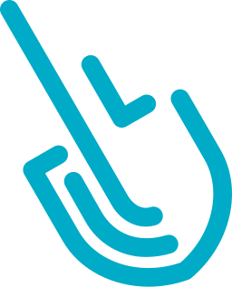</a> | **📂 檔名:** `sysdig-icon.svg` ✨ **格式:** `Vector (SVG)` ⚖️ **大小:** `3.38KB` 📅 **更新:** `2026-03-02`  🚀 **jsDelivr Markdown:** `` 🔗 **直接連結 (Url):** <code>https://cdn.jsdelivr.net/gh/barry028/materials@main/images/iCons/Brands/sysdig-icon.svg</code> 📥 [檢視原始檔](sysdig-icon.svg) |
|  | **📂 檔名:** `sysdig.svg` ✨ **格式:** `Vector (SVG)` ⚖️ **大小:** `9.39KB` 📅 **更新:** `2026-03-02`  🚀 **jsDelivr Markdown:** `` 🔗 **直接連結 (Url):** <code>https://cdn.jsdelivr.net/gh/barry028/materials@main/images/iCons/Brands/sysdig.svg</code> 📥 [檢視原始檔](sysdig.svg) |
|  | **📂 檔名:** `t3.svg` ✨ **格式:** `Vector (SVG)` ⚖️ **大小:** `4.23KB` 📅 **更新:** `2026-03-02`  🚀 **jsDelivr Markdown:** `` 🔗 **直接連結 (Url):** <code>https://cdn.jsdelivr.net/gh/barry028/materials@main/images/iCons/Brands/t3.svg</code> 📥 [檢視原始檔](t3.svg) |
|  | **📂 檔名:** `tableau-icon.svg` ✨ **格式:** `Vector (SVG)` ⚖️ **大小:** `3.14KB` 📅 **更新:** `2026-03-02`  🚀 **jsDelivr Markdown:** `` 🔗 **直接連結 (Url):** <code>https://cdn.jsdelivr.net/gh/barry028/materials@main/images/iCons/Brands/tableau-icon.svg</code> 📥 [檢視原始檔](tableau-icon.svg) |
|  | **📂 檔名:** `tableau.svg` ✨ **格式:** `Vector (SVG)` ⚖️ **大小:** `16.63KB` 📅 **更新:** `2026-03-02`  🚀 **jsDelivr Markdown:** `` 🔗 **直接連結 (Url):** <code>https://cdn.jsdelivr.net/gh/barry028/materials@main/images/iCons/Brands/tableau.svg</code> 📥 [檢視原始檔](tableau.svg) |
| <a href="taiga.svg">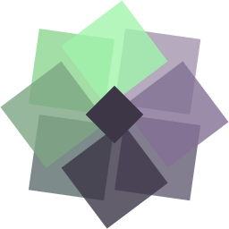</a> | **📂 檔名:** `taiga.svg` ✨ **格式:** `Vector (SVG)` ⚖️ **大小:** `1.89KB` 📅 **更新:** `2026-03-02`  🚀 **jsDelivr Markdown:** `` 🔗 **直接連結 (Url):** <code>https://cdn.jsdelivr.net/gh/barry028/materials@main/images/iCons/Brands/taiga.svg</code> 📥 [檢視原始檔](taiga.svg) |
|  | **📂 檔名:** `tailwindcss-icon.svg` ✨ **格式:** `Vector (SVG)` ⚖️ **大小:** `1.43KB` 📅 **更新:** `2026-03-02`  🚀 **jsDelivr Markdown:** `` 🔗 **直接連結 (Url):** <code>https://cdn.jsdelivr.net/gh/barry028/materials@main/images/iCons/Brands/tailwindcss-icon.svg</code> 📥 [檢視原始檔](tailwindcss-icon.svg) |
|  | **📂 檔名:** `tailwindcss.svg` ✨ **格式:** `Vector (SVG)` ⚖️ **大小:** `7.15KB` 📅 **更新:** `2026-03-02`  🚀 **jsDelivr Markdown:** `` 🔗 **直接連結 (Url):** <code>https://cdn.jsdelivr.net/gh/barry028/materials@main/images/iCons/Brands/tailwindcss.svg</code> 📥 [檢視原始檔](tailwindcss.svg) |
| <a href="tapcart-icon.svg">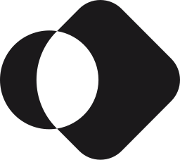</a> | **📂 檔名:** `tapcart-icon.svg` ✨ **格式:** `Vector (SVG)` ⚖️ **大小:** `2.01KB` 📅 **更新:** `2026-03-02`  🚀 **jsDelivr Markdown:** `` 🔗 **直接連結 (Url):** <code>https://cdn.jsdelivr.net/gh/barry028/materials@main/images/iCons/Brands/tapcart-icon.svg</code> 📥 [檢視原始檔](tapcart-icon.svg) |
|  | **📂 檔名:** `tapcart.svg` ✨ **格式:** `Vector (SVG)` ⚖️ **大小:** `9.77KB` 📅 **更新:** `2026-03-02`  🚀 **jsDelivr Markdown:** `` 🔗 **直接連結 (Url):** <code>https://cdn.jsdelivr.net/gh/barry028/materials@main/images/iCons/Brands/tapcart.svg</code> 📥 [檢視原始檔](tapcart.svg) |
|  | **📂 檔名:** `taskade-icon.svg` ✨ **格式:** `Vector (SVG)` ⚖️ **大小:** `18.79KB` 📅 **更新:** `2026-03-02`  🚀 **jsDelivr Markdown:** `` 🔗 **直接連結 (Url):** <code>https://cdn.jsdelivr.net/gh/barry028/materials@main/images/iCons/Brands/taskade-icon.svg</code> 📥 [檢視原始檔](taskade-icon.svg) |
|  | **📂 檔名:** `taskade.svg` ✨ **格式:** `Vector (SVG)` ⚖️ **大小:** `31.18KB` 📅 **更新:** `2026-03-02`  🚀 **jsDelivr Markdown:** `` 🔗 **直接連結 (Url):** <code>https://cdn.jsdelivr.net/gh/barry028/materials@main/images/iCons/Brands/taskade.svg</code> 📥 [檢視原始檔](taskade.svg) |
|  | **📂 檔名:** `tastejs.svg` ✨ **格式:** `Vector (SVG)` ⚖️ **大小:** `82.13KB` 📅 **更新:** `2026-03-02`  🚀 **jsDelivr Markdown:** `` 🔗 **直接連結 (Url):** <code>https://cdn.jsdelivr.net/gh/barry028/materials@main/images/iCons/Brands/tastejs.svg</code> 📥 [檢視原始檔](tastejs.svg) |
| <a href="tauri.svg">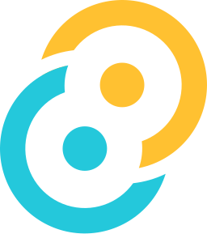</a> | **📂 檔名:** `tauri.svg` ✨ **格式:** `Vector (SVG)` ⚖️ **大小:** `2.41KB` 📅 **更新:** `2026-03-02`  🚀 **jsDelivr Markdown:** `` 🔗 **直接連結 (Url):** <code>https://cdn.jsdelivr.net/gh/barry028/materials@main/images/iCons/Brands/tauri.svg</code> 📥 [檢視原始檔](tauri.svg) |
|  | **📂 檔名:** `tealium.svg` ✨ **格式:** `Vector (SVG)` ⚖️ **大小:** `3.88KB` 📅 **更新:** `2026-03-02`  🚀 **jsDelivr Markdown:** `` 🔗 **直接連結 (Url):** <code>https://cdn.jsdelivr.net/gh/barry028/materials@main/images/iCons/Brands/tealium.svg</code> 📥 [檢視原始檔](tealium.svg) |
| <a href="teamcity.svg">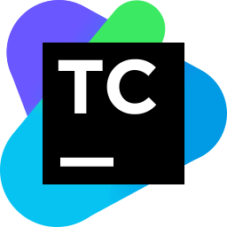</a> | **📂 檔名:** `teamcity.svg` ✨ **格式:** `Vector (SVG)` ⚖️ **大小:** `4.70KB` 📅 **更新:** `2026-03-02`  🚀 **jsDelivr Markdown:** `` 🔗 **直接連結 (Url):** <code>https://cdn.jsdelivr.net/gh/barry028/materials@main/images/iCons/Brands/teamcity.svg</code> 📥 [檢視原始檔](teamcity.svg) |
| <a href="teamgrid.svg">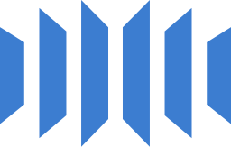</a> | **📂 檔名:** `teamgrid.svg` ✨ **格式:** `Vector (SVG)` ⚖️ **大小:** `774.00B` 📅 **更新:** `2026-03-02`  🚀 **jsDelivr Markdown:** `` 🔗 **直接連結 (Url):** <code>https://cdn.jsdelivr.net/gh/barry028/materials@main/images/iCons/Brands/teamgrid.svg</code> 📥 [檢視原始檔](teamgrid.svg) |
|  | **📂 檔名:** `teamwork-icon.svg` ✨ **格式:** `Vector (SVG)` ⚖️ **大小:** `1.86KB` 📅 **更新:** `2026-03-02`  🚀 **jsDelivr Markdown:** `` 🔗 **直接連結 (Url):** <code>https://cdn.jsdelivr.net/gh/barry028/materials@main/images/iCons/Brands/teamwork-icon.svg</code> 📥 [檢視原始檔](teamwork-icon.svg) |
|  | **📂 檔名:** `teamwork.svg` ✨ **格式:** `Vector (SVG)` ⚖️ **大小:** `8.79KB` 📅 **更新:** `2026-03-02`  🚀 **jsDelivr Markdown:** `` 🔗 **直接連結 (Url):** <code>https://cdn.jsdelivr.net/gh/barry028/materials@main/images/iCons/Brands/teamwork.svg</code> 📥 [檢視原始檔](teamwork.svg) |
|  | **📂 檔名:** `telegram.svg` ✨ **格式:** `Vector (SVG)` ⚖️ **大小:** `1.71KB` 📅 **更新:** `2026-03-02`  🚀 **jsDelivr Markdown:** `` 🔗 **直接連結 (Url):** <code>https://cdn.jsdelivr.net/gh/barry028/materials@main/images/iCons/Brands/telegram.svg</code> 📥 [檢視原始檔](telegram.svg) |
| <a href="tensorflow.svg">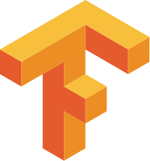</a> | **📂 檔名:** `tensorflow.svg` ✨ **格式:** `Vector (SVG)` ⚖️ **大小:** `1.58KB` 📅 **更新:** `2026-03-02`  🚀 **jsDelivr Markdown:** `` 🔗 **直接連結 (Url):** <code>https://cdn.jsdelivr.net/gh/barry028/materials@main/images/iCons/Brands/tensorflow.svg</code> 📥 [檢視原始檔](tensorflow.svg) |
| <a href="terminal.svg">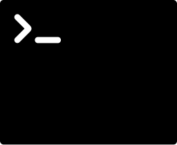</a> | **📂 檔名:** `terminal.svg` ✨ **格式:** `Vector (SVG)` ⚖️ **大小:** `1.81KB` 📅 **更新:** `2026-03-02`  🚀 **jsDelivr Markdown:** `` 🔗 **直接連結 (Url):** <code>https://cdn.jsdelivr.net/gh/barry028/materials@main/images/iCons/Brands/terminal.svg</code> 📥 [檢視原始檔](terminal.svg) |
|  | **📂 檔名:** `terraform-icon.svg` ✨ **格式:** `Vector (SVG)` ⚖️ **大小:** `672.00B` 📅 **更新:** `2026-03-02`  🚀 **jsDelivr Markdown:** `` 🔗 **直接連結 (Url):** <code>https://cdn.jsdelivr.net/gh/barry028/materials@main/images/iCons/Brands/terraform-icon.svg</code> 📥 [檢視原始檔](terraform-icon.svg) |
|  | **📂 檔名:** `terraform.svg` ✨ **格式:** `Vector (SVG)` ⚖️ **大小:** `5.40KB` 📅 **更新:** `2026-03-02`  🚀 **jsDelivr Markdown:** `` 🔗 **直接連結 (Url):** <code>https://cdn.jsdelivr.net/gh/barry028/materials@main/images/iCons/Brands/terraform.svg</code> 📥 [檢視原始檔](terraform.svg) |
|  | **📂 檔名:** `terser-icon.svg` ✨ **格式:** `Vector (SVG)` ⚖️ **大小:** `2.11KB` 📅 **更新:** `2026-03-02`  🚀 **jsDelivr Markdown:** `` 🔗 **直接連結 (Url):** <code>https://cdn.jsdelivr.net/gh/barry028/materials@main/images/iCons/Brands/terser-icon.svg</code> 📥 [檢視原始檔](terser-icon.svg) |
| <a href="terser.svg">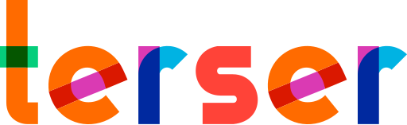</a> | **📂 檔名:** `terser.svg` ✨ **格式:** `Vector (SVG)` ⚖️ **大小:** `4.87KB` 📅 **更新:** `2026-03-02`  🚀 **jsDelivr Markdown:** `` 🔗 **直接連結 (Url):** <code>https://cdn.jsdelivr.net/gh/barry028/materials@main/images/iCons/Brands/terser.svg</code> 📥 [檢視原始檔](terser.svg) |
|  | **📂 檔名:** `testcafe.svg` ✨ **格式:** `Vector (SVG)` ⚖️ **大小:** `718.00B` 📅 **更新:** `2026-03-02`  🚀 **jsDelivr Markdown:** `` 🔗 **直接連結 (Url):** <code>https://cdn.jsdelivr.net/gh/barry028/materials@main/images/iCons/Brands/testcafe.svg</code> 📥 [檢視原始檔](testcafe.svg) |
|  | **📂 檔名:** `testing-library.svg` ✨ **格式:** `Vector (SVG)` ⚖️ **大小:** `51.85KB` 📅 **更新:** `2026-03-02`  🚀 **jsDelivr Markdown:** `` 🔗 **直接連結 (Url):** <code>https://cdn.jsdelivr.net/gh/barry028/materials@main/images/iCons/Brands/testing-library.svg</code> 📥 [檢視原始檔](testing-library.svg) |
| <a href="testlodge.svg">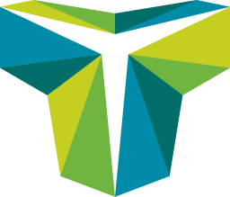</a> | **📂 檔名:** `testlodge.svg` ✨ **格式:** `Vector (SVG)` ⚖️ **大小:** `1.59KB` 📅 **更新:** `2026-03-02`  🚀 **jsDelivr Markdown:** `` 🔗 **直接連結 (Url):** <code>https://cdn.jsdelivr.net/gh/barry028/materials@main/images/iCons/Brands/testlodge.svg</code> 📥 [檢視原始檔](testlodge.svg) |
|  | **📂 檔名:** `threejs.svg` ✨ **格式:** `Vector (SVG)` ⚖️ **大小:** `2.10KB` 📅 **更新:** `2026-03-02`  🚀 **jsDelivr Markdown:** `` 🔗 **直接連結 (Url):** <code>https://cdn.jsdelivr.net/gh/barry028/materials@main/images/iCons/Brands/threejs.svg</code> 📥 [檢視原始檔](threejs.svg) |
|  | **📂 檔名:** `thymeleaf-icon.svg` ✨ **格式:** `Vector (SVG)` ⚖️ **大小:** `1.31KB` 📅 **更新:** `2026-03-02`  🚀 **jsDelivr Markdown:** `` 🔗 **直接連結 (Url):** <code>https://cdn.jsdelivr.net/gh/barry028/materials@main/images/iCons/Brands/thymeleaf-icon.svg</code> 📥 [檢視原始檔](thymeleaf-icon.svg) |
|  | **📂 檔名:** `thymeleaf.svg` ✨ **格式:** `Vector (SVG)` ⚖️ **大小:** `19.10KB` 📅 **更新:** `2026-03-02`  🚀 **jsDelivr Markdown:** `` 🔗 **直接連結 (Url):** <code>https://cdn.jsdelivr.net/gh/barry028/materials@main/images/iCons/Brands/thymeleaf.svg</code> 📥 [檢視原始檔](thymeleaf.svg) |
|  | **📂 檔名:** `tidal-icon.svg` ✨ **格式:** `Vector (SVG)` ⚖️ **大小:** `750.00B` 📅 **更新:** `2026-03-02`  🚀 **jsDelivr Markdown:** `` 🔗 **直接連結 (Url):** <code>https://cdn.jsdelivr.net/gh/barry028/materials@main/images/iCons/Brands/tidal-icon.svg</code> 📥 [檢視原始檔](tidal-icon.svg) |
|  | **📂 檔名:** `tidal.svg` ✨ **格式:** `Vector (SVG)` ⚖️ **大小:** `1.94KB` 📅 **更新:** `2026-03-02`  🚀 **jsDelivr Markdown:** `` 🔗 **直接連結 (Url):** <code>https://cdn.jsdelivr.net/gh/barry028/materials@main/images/iCons/Brands/tidal.svg</code> 📥 [檢視原始檔](tidal.svg) |
|  | **📂 檔名:** `tiktok-icon.svg` ✨ **格式:** `Vector (SVG)` ⚖️ **大小:** `3.59KB` 📅 **更新:** `2026-03-02`  🚀 **jsDelivr Markdown:** `` 🔗 **直接連結 (Url):** <code>https://cdn.jsdelivr.net/gh/barry028/materials@main/images/iCons/Brands/tiktok-icon.svg</code> 📥 [檢視原始檔](tiktok-icon.svg) |
| <a href="tiktok.svg">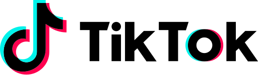</a> | **📂 檔名:** `tiktok.svg` ✨ **格式:** `Vector (SVG)` ⚖️ **大小:** `5.97KB` 📅 **更新:** `2026-03-02`  🚀 **jsDelivr Markdown:** `` 🔗 **直接連結 (Url):** <code>https://cdn.jsdelivr.net/gh/barry028/materials@main/images/iCons/Brands/tiktok.svg</code> 📥 [檢視原始檔](tiktok.svg) |
|  | **📂 檔名:** `tnw.svg` ✨ **格式:** `Vector (SVG)` ⚖️ **大小:** `2.05KB` 📅 **更新:** `2026-03-02`  🚀 **jsDelivr Markdown:** `` 🔗 **直接連結 (Url):** <code>https://cdn.jsdelivr.net/gh/barry028/materials@main/images/iCons/Brands/tnw.svg</code> 📥 [檢視原始檔](tnw.svg) |
|  | **📂 檔名:** `todoist-icon.svg` ✨ **格式:** `Vector (SVG)` ⚖️ **大小:** `2.30KB` 📅 **更新:** `2026-03-02`  🚀 **jsDelivr Markdown:** `` 🔗 **直接連結 (Url):** <code>https://cdn.jsdelivr.net/gh/barry028/materials@main/images/iCons/Brands/todoist-icon.svg</code> 📥 [檢視原始檔](todoist-icon.svg) |
|  | **📂 檔名:** `todoist.svg` ✨ **格式:** `Vector (SVG)` ⚖️ **大小:** `13.92KB` 📅 **更新:** `2026-03-02`  🚀 **jsDelivr Markdown:** `` 🔗 **直接連結 (Url):** <code>https://cdn.jsdelivr.net/gh/barry028/materials@main/images/iCons/Brands/todoist.svg</code> 📥 [檢視原始檔](todoist.svg) |
|  | **📂 檔名:** `todomvc.svg` ✨ **格式:** `Vector (SVG)` ⚖️ **大小:** `2.21KB` 📅 **更新:** `2026-03-02`  🚀 **jsDelivr Markdown:** `` 🔗 **直接連結 (Url):** <code>https://cdn.jsdelivr.net/gh/barry028/materials@main/images/iCons/Brands/todomvc.svg</code> 📥 [檢視原始檔](todomvc.svg) |
| <a href="tomcat.svg">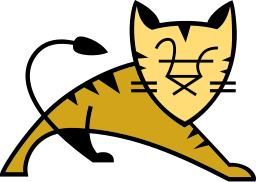</a> | **📂 檔名:** `tomcat.svg` ✨ **格式:** `Vector (SVG)` ⚖️ **大小:** `6.76KB` 📅 **更新:** `2026-03-02`  🚀 **jsDelivr Markdown:** `` 🔗 **直接連結 (Url):** <code>https://cdn.jsdelivr.net/gh/barry028/materials@main/images/iCons/Brands/tomcat.svg</code> 📥 [檢視原始檔](tomcat.svg) |
|  | **📂 檔名:** `toml.svg` ✨ **格式:** `Vector (SVG)` ⚖️ **大小:** `857.00B` 📅 **更新:** `2026-03-02`  🚀 **jsDelivr Markdown:** `` 🔗 **直接連結 (Url):** <code>https://cdn.jsdelivr.net/gh/barry028/materials@main/images/iCons/Brands/toml.svg</code> 📥 [檢視原始檔](toml.svg) |
|  | **📂 檔名:** `tor-browser.svg` ✨ **格式:** `Vector (SVG)` ⚖️ **大小:** `2.09KB` 📅 **更新:** `2026-03-02`  🚀 **jsDelivr Markdown:** `` 🔗 **直接連結 (Url):** <code>https://cdn.jsdelivr.net/gh/barry028/materials@main/images/iCons/Brands/tor-browser.svg</code> 📥 [檢視原始檔](tor-browser.svg) |
| <a href="tor.svg">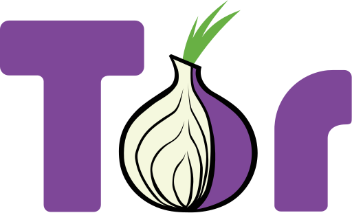</a> | **📂 檔名:** `tor.svg` ✨ **格式:** `Vector (SVG)` ⚖️ **大小:** `10.10KB` 📅 **更新:** `2026-03-02`  🚀 **jsDelivr Markdown:** `` 🔗 **直接連結 (Url):** <code>https://cdn.jsdelivr.net/gh/barry028/materials@main/images/iCons/Brands/tor.svg</code> 📥 [檢視原始檔](tor.svg) |
|  | **📂 檔名:** `traackr.svg` ✨ **格式:** `Vector (SVG)` ⚖️ **大小:** `8.60KB` 📅 **更新:** `2026-03-02`  🚀 **jsDelivr Markdown:** `` 🔗 **直接連結 (Url):** <code>https://cdn.jsdelivr.net/gh/barry028/materials@main/images/iCons/Brands/traackr.svg</code> 📥 [檢視原始檔](traackr.svg) |
|  | **📂 檔名:** `trac.svg` ✨ **格式:** `Vector (SVG)` ⚖️ **大小:** `3.56KB` 📅 **更新:** `2026-03-02`  🚀 **jsDelivr Markdown:** `` 🔗 **直接連結 (Url):** <code>https://cdn.jsdelivr.net/gh/barry028/materials@main/images/iCons/Brands/trac.svg</code> 📥 [檢視原始檔](trac.svg) |
|  | **📂 檔名:** `travis-ci-monochrome.svg` ✨ **格式:** `Vector (SVG)` ⚖️ **大小:** `13.36KB` 📅 **更新:** `2026-03-02`  🚀 **jsDelivr Markdown:** `` 🔗 **直接連結 (Url):** <code>https://cdn.jsdelivr.net/gh/barry028/materials@main/images/iCons/Brands/travis-ci-monochrome.svg</code> 📥 [檢視原始檔](travis-ci-monochrome.svg) |
|  | **📂 檔名:** `travis-ci.svg` ✨ **格式:** `Vector (SVG)` ⚖️ **大小:** `47.00KB` 📅 **更新:** `2026-03-02`  🚀 **jsDelivr Markdown:** `` 🔗 **直接連結 (Url):** <code>https://cdn.jsdelivr.net/gh/barry028/materials@main/images/iCons/Brands/travis-ci.svg</code> 📥 [檢視原始檔](travis-ci.svg) |
| <a href="treasuredata-icon.svg">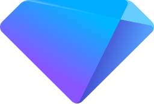</a> | **📂 檔名:** `treasuredata-icon.svg` ✨ **格式:** `Vector (SVG)` ⚖️ **大小:** `3.74KB` 📅 **更新:** `2026-03-02`  🚀 **jsDelivr Markdown:** `` 🔗 **直接連結 (Url):** <code>https://cdn.jsdelivr.net/gh/barry028/materials@main/images/iCons/Brands/treasuredata-icon.svg</code> 📥 [檢視原始檔](treasuredata-icon.svg) |
|  | **📂 檔名:** `treasuredata.svg` ✨ **格式:** `Vector (SVG)` ⚖️ **大小:** `12.21KB` 📅 **更新:** `2026-03-02`  🚀 **jsDelivr Markdown:** `` 🔗 **直接連結 (Url):** <code>https://cdn.jsdelivr.net/gh/barry028/materials@main/images/iCons/Brands/treasuredata.svg</code> 📥 [檢視原始檔](treasuredata.svg) |
| <a href="treehouse.svg">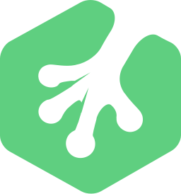</a> | **📂 檔名:** `treehouse.svg` ✨ **格式:** `Vector (SVG)` ⚖️ **大小:** `3.08KB` 📅 **更新:** `2026-03-02`  🚀 **jsDelivr Markdown:** `` 🔗 **直接連結 (Url):** <code>https://cdn.jsdelivr.net/gh/barry028/materials@main/images/iCons/Brands/treehouse.svg</code> 📥 [檢視原始檔](treehouse.svg) |
|  | **📂 檔名:** `trello.svg` ✨ **格式:** `Vector (SVG)` ⚖️ **大小:** `829.00B` 📅 **更新:** `2026-03-02`  🚀 **jsDelivr Markdown:** `` 🔗 **直接連結 (Url):** <code>https://cdn.jsdelivr.net/gh/barry028/materials@main/images/iCons/Brands/trello.svg</code> 📥 [檢視原始檔](trello.svg) |
| <a href="trpc.svg">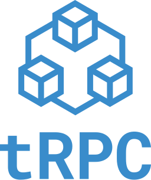</a> | **📂 檔名:** `trpc.svg` ✨ **格式:** `Vector (SVG)` ⚖️ **大小:** `9.06KB` 📅 **更新:** `2026-03-02`  🚀 **jsDelivr Markdown:** `` 🔗 **直接連結 (Url):** <code>https://cdn.jsdelivr.net/gh/barry028/materials@main/images/iCons/Brands/trpc.svg</code> 📥 [檢視原始檔](trpc.svg) |
| <a href="truffle-icon.svg">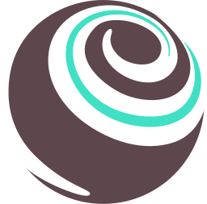</a> | **📂 檔名:** `truffle-icon.svg` ✨ **格式:** `Vector (SVG)` ⚖️ **大小:** `3.47KB` 📅 **更新:** `2026-03-02`  🚀 **jsDelivr Markdown:** `` 🔗 **直接連結 (Url):** <code>https://cdn.jsdelivr.net/gh/barry028/materials@main/images/iCons/Brands/truffle-icon.svg</code> 📥 [檢視原始檔](truffle-icon.svg) |
| <a href="truffle.svg">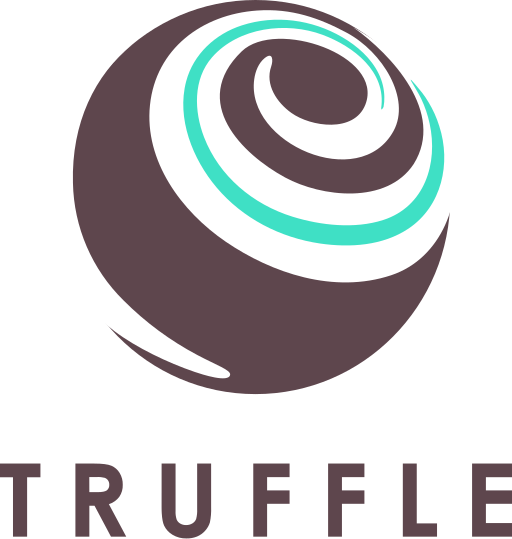</a> | **📂 檔名:** `truffle.svg` ✨ **格式:** `Vector (SVG)` ⚖️ **大小:** `6.76KB` 📅 **更新:** `2026-03-02`  🚀 **jsDelivr Markdown:** `` 🔗 **直接連結 (Url):** <code>https://cdn.jsdelivr.net/gh/barry028/materials@main/images/iCons/Brands/truffle.svg</code> 📥 [檢視原始檔](truffle.svg) |
|  | **📂 檔名:** `tsmc.svg` ✨ **格式:** `Vector (SVG)` ⚖️ **大小:** `40.94KB` 📅 **更新:** `2026-03-02`  🚀 **jsDelivr Markdown:** `` 🔗 **直接連結 (Url):** <code>https://cdn.jsdelivr.net/gh/barry028/materials@main/images/iCons/Brands/tsmc.svg</code> 📥 [檢視原始檔](tsmc.svg) |
|  | **📂 檔名:** `tsnode.svg` ✨ **格式:** `Vector (SVG)` ⚖️ **大小:** `8.17KB` 📅 **更新:** `2026-03-02`  🚀 **jsDelivr Markdown:** `` 🔗 **直接連結 (Url):** <code>https://cdn.jsdelivr.net/gh/barry028/materials@main/images/iCons/Brands/tsnode.svg</code> 📥 [檢視原始檔](tsnode.svg) |
| <a href="tsuru.svg">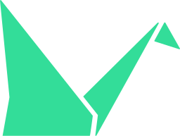</a> | **📂 檔名:** `tsuru.svg` ✨ **格式:** `Vector (SVG)` ⚖️ **大小:** `1.43KB` 📅 **更新:** `2026-03-02`  🚀 **jsDelivr Markdown:** `` 🔗 **直接連結 (Url):** <code>https://cdn.jsdelivr.net/gh/barry028/materials@main/images/iCons/Brands/tsuru.svg</code> 📥 [檢視原始檔](tsuru.svg) |
|  | **📂 檔名:** `tumblr-icon.svg` ✨ **格式:** `Vector (SVG)` ⚖️ **大小:** `909.00B` 📅 **更新:** `2026-03-02`  🚀 **jsDelivr Markdown:** `` 🔗 **直接連結 (Url):** <code>https://cdn.jsdelivr.net/gh/barry028/materials@main/images/iCons/Brands/tumblr-icon.svg</code> 📥 [檢視原始檔](tumblr-icon.svg) |
|  | **📂 檔名:** `tumblr.svg` ✨ **格式:** `Vector (SVG)` ⚖️ **大小:** `6.52KB` 📅 **更新:** `2026-03-02`  🚀 **jsDelivr Markdown:** `` 🔗 **直接連結 (Url):** <code>https://cdn.jsdelivr.net/gh/barry028/materials@main/images/iCons/Brands/tumblr.svg</code> 📥 [檢視原始檔](tumblr.svg) |
|  | **📂 檔名:** `tunein.svg` ✨ **格式:** `Vector (SVG)` ⚖️ **大小:** `6.30KB` 📅 **更新:** `2026-03-02`  🚀 **jsDelivr Markdown:** `` 🔗 **直接連結 (Url):** <code>https://cdn.jsdelivr.net/gh/barry028/materials@main/images/iCons/Brands/tunein.svg</code> 📥 [檢視原始檔](tunein.svg) |
| <a href="tuple.svg">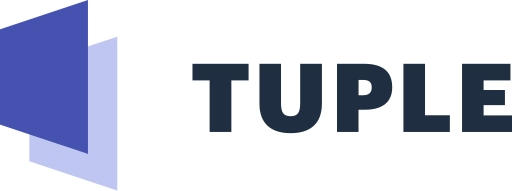</a> | **📂 檔名:** `tuple.svg` ✨ **格式:** `Vector (SVG)` ⚖️ **大小:** `2.30KB` 📅 **更新:** `2026-03-02`  🚀 **jsDelivr Markdown:** `` 🔗 **直接連結 (Url):** <code>https://cdn.jsdelivr.net/gh/barry028/materials@main/images/iCons/Brands/tuple.svg</code> 📥 [檢視原始檔](tuple.svg) |
| <a href="turbopack-icon.svg">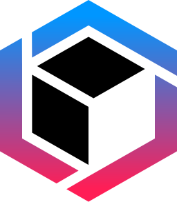</a> | **📂 檔名:** `turbopack-icon.svg` ✨ **格式:** `Vector (SVG)` ⚖️ **大小:** `1.16KB` 📅 **更新:** `2026-03-02`  🚀 **jsDelivr Markdown:** `` 🔗 **直接連結 (Url):** <code>https://cdn.jsdelivr.net/gh/barry028/materials@main/images/iCons/Brands/turbopack-icon.svg</code> 📥 [檢視原始檔](turbopack-icon.svg) |
|  | **📂 檔名:** `turbopack.svg` ✨ **格式:** `Vector (SVG)` ⚖️ **大小:** `5.71KB` 📅 **更新:** `2026-03-02`  🚀 **jsDelivr Markdown:** `` 🔗 **直接連結 (Url):** <code>https://cdn.jsdelivr.net/gh/barry028/materials@main/images/iCons/Brands/turbopack.svg</code> 📥 [檢視原始檔](turbopack.svg) |
| <a href="turborepo-icon.svg">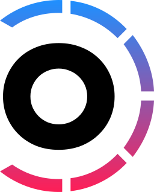</a> | **📂 檔名:** `turborepo-icon.svg` ✨ **格式:** `Vector (SVG)` ⚖️ **大小:** `5.63KB` 📅 **更新:** `2026-03-02`  🚀 **jsDelivr Markdown:** `` 🔗 **直接連結 (Url):** <code>https://cdn.jsdelivr.net/gh/barry028/materials@main/images/iCons/Brands/turborepo-icon.svg</code> 📥 [檢視原始檔](turborepo-icon.svg) |
|  | **📂 檔名:** `turborepo.svg` ✨ **格式:** `Vector (SVG)` ⚖️ **大小:** `13.07KB` 📅 **更新:** `2026-03-02`  🚀 **jsDelivr Markdown:** `` 🔗 **直接連結 (Url):** <code>https://cdn.jsdelivr.net/gh/barry028/materials@main/images/iCons/Brands/turborepo.svg</code> 📥 [檢視原始檔](turborepo.svg) |
| <a href="turret.svg">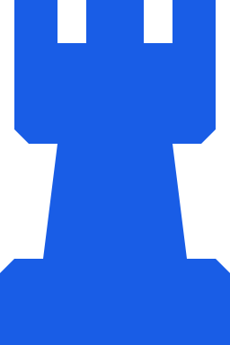</a> | **📂 檔名:** `turret.svg` ✨ **格式:** `Vector (SVG)` ⚖️ **大小:** `456.00B` 📅 **更新:** `2026-03-02`  🚀 **jsDelivr Markdown:** `` 🔗 **直接連結 (Url):** <code>https://cdn.jsdelivr.net/gh/barry028/materials@main/images/iCons/Brands/turret.svg</code> 📥 [檢視原始檔](turret.svg) |
| <a href="twilio-icon.svg">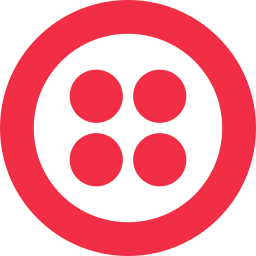</a> | **📂 檔名:** `twilio-icon.svg` ✨ **格式:** `Vector (SVG)` ⚖️ **大小:** `1.46KB` 📅 **更新:** `2026-03-02`  🚀 **jsDelivr Markdown:** `` 🔗 **直接連結 (Url):** <code>https://cdn.jsdelivr.net/gh/barry028/materials@main/images/iCons/Brands/twilio-icon.svg</code> 📥 [檢視原始檔](twilio-icon.svg) |
|  | **📂 檔名:** `twilio.svg` ✨ **格式:** `Vector (SVG)` ⚖️ **大小:** `6.82KB` 📅 **更新:** `2026-03-02`  🚀 **jsDelivr Markdown:** `` 🔗 **直接連結 (Url):** <code>https://cdn.jsdelivr.net/gh/barry028/materials@main/images/iCons/Brands/twilio.svg</code> 📥 [檢視原始檔](twilio.svg) |
|  | **📂 檔名:** `twitch.svg` ✨ **格式:** `Vector (SVG)` ⚖️ **大小:** `921.00B` 📅 **更新:** `2026-03-02`  🚀 **jsDelivr Markdown:** `` 🔗 **直接連結 (Url):** <code>https://cdn.jsdelivr.net/gh/barry028/materials@main/images/iCons/Brands/twitch.svg</code> 📥 [檢視原始檔](twitch.svg) |
|  | **📂 檔名:** `twitter.svg` ✨ **格式:** `Vector (SVG)` ⚖️ **大小:** `1.63KB` 📅 **更新:** `2026-03-02`  🚀 **jsDelivr Markdown:** `` 🔗 **直接連結 (Url):** <code>https://cdn.jsdelivr.net/gh/barry028/materials@main/images/iCons/Brands/twitter.svg</code> 📥 [檢視原始檔](twitter.svg) |
| <a href="typeform-icon.svg">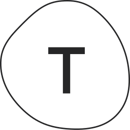</a> | **📂 檔名:** `typeform-icon.svg` ✨ **格式:** `Vector (SVG)` ⚖️ **大小:** `1.99KB` 📅 **更新:** `2026-03-02`  🚀 **jsDelivr Markdown:** `` 🔗 **直接連結 (Url):** <code>https://cdn.jsdelivr.net/gh/barry028/materials@main/images/iCons/Brands/typeform-icon.svg</code> 📥 [檢視原始檔](typeform-icon.svg) |
| <a href="typeform.svg">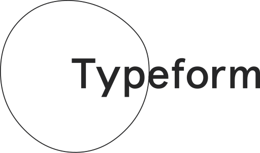</a> | **📂 檔名:** `typeform.svg` ✨ **格式:** `Vector (SVG)` ⚖️ **大小:** `6.47KB` 📅 **更新:** `2026-03-02`  🚀 **jsDelivr Markdown:** `` 🔗 **直接連結 (Url):** <code>https://cdn.jsdelivr.net/gh/barry028/materials@main/images/iCons/Brands/typeform.svg</code> 📥 [檢視原始檔](typeform.svg) |
| <a href="typeorm.svg">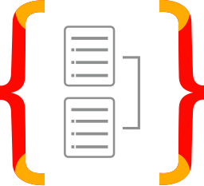</a> | **📂 檔名:** `typeorm.svg` ✨ **格式:** `Vector (SVG)` ⚖️ **大小:** `30.49KB` 📅 **更新:** `2026-03-02`  🚀 **jsDelivr Markdown:** `` 🔗 **直接連結 (Url):** <code>https://cdn.jsdelivr.net/gh/barry028/materials@main/images/iCons/Brands/typeorm.svg</code> 📥 [檢視原始檔](typeorm.svg) |
|  | **📂 檔名:** `typescript-icon-round.svg` ✨ **格式:** `Vector (SVG)` ⚖️ **大小:** `2.46KB` 📅 **更新:** `2026-03-02`  🚀 **jsDelivr Markdown:** `` 🔗 **直接連結 (Url):** <code>https://cdn.jsdelivr.net/gh/barry028/materials@main/images/iCons/Brands/typescript-icon-round.svg</code> 📥 [檢視原始檔](typescript-icon-round.svg) |
|  | **📂 檔名:** `typescript-icon.svg` ✨ **格式:** `Vector (SVG)` ⚖️ **大小:** `2.49KB` 📅 **更新:** `2026-03-02`  🚀 **jsDelivr Markdown:** `` 🔗 **直接連結 (Url):** <code>https://cdn.jsdelivr.net/gh/barry028/materials@main/images/iCons/Brands/typescript-icon.svg</code> 📥 [檢視原始檔](typescript-icon.svg) |
|  | **📂 檔名:** `typescript.svg` ✨ **格式:** `Vector (SVG)` ⚖️ **大小:** `9.08KB` 📅 **更新:** `2026-03-02`  🚀 **jsDelivr Markdown:** `` 🔗 **直接連結 (Url):** <code>https://cdn.jsdelivr.net/gh/barry028/materials@main/images/iCons/Brands/typescript.svg</code> 📥 [檢視原始檔](typescript.svg) |
|  | **📂 檔名:** `typo3-icon.svg` ✨ **格式:** `Vector (SVG)` ⚖️ **大小:** `984.00B` 📅 **更新:** `2026-03-02`  🚀 **jsDelivr Markdown:** `` 🔗 **直接連結 (Url):** <code>https://cdn.jsdelivr.net/gh/barry028/materials@main/images/iCons/Brands/typo3-icon.svg</code> 📥 [檢視原始檔](typo3-icon.svg) |
|  | **📂 檔名:** `typo3.svg` ✨ **格式:** `Vector (SVG)` ⚖️ **大小:** `3.72KB` 📅 **更新:** `2026-03-02`  🚀 **jsDelivr Markdown:** `` 🔗 **直接連結 (Url):** <code>https://cdn.jsdelivr.net/gh/barry028/materials@main/images/iCons/Brands/typo3.svg</code> 📥 [檢視原始檔](typo3.svg) |
|  | **📂 檔名:** `ubuntu.svg` ✨ **格式:** `Vector (SVG)` ⚖️ **大小:** `3.09KB` 📅 **更新:** `2026-03-02`  🚀 **jsDelivr Markdown:** `` 🔗 **直接連結 (Url):** <code>https://cdn.jsdelivr.net/gh/barry028/materials@main/images/iCons/Brands/ubuntu.svg</code> 📥 [檢視原始檔](ubuntu.svg) |
|  | **📂 檔名:** `udacity-icon.svg` ✨ **格式:** `Vector (SVG)` ⚖️ **大小:** `3.84KB` 📅 **更新:** `2026-03-02`  🚀 **jsDelivr Markdown:** `` 🔗 **直接連結 (Url):** <code>https://cdn.jsdelivr.net/gh/barry028/materials@main/images/iCons/Brands/udacity-icon.svg</code> 📥 [檢視原始檔](udacity-icon.svg) |
|  | **📂 檔名:** `udacity.svg` ✨ **格式:** `Vector (SVG)` ⚖️ **大小:** `6.58KB` 📅 **更新:** `2026-03-02`  🚀 **jsDelivr Markdown:** `` 🔗 **直接連結 (Url):** <code>https://cdn.jsdelivr.net/gh/barry028/materials@main/images/iCons/Brands/udacity.svg</code> 📥 [檢視原始檔](udacity.svg) |
|  | **📂 檔名:** `udemy-icon.svg` ✨ **格式:** `Vector (SVG)` ⚖️ **大小:** `978.00B` 📅 **更新:** `2026-03-02`  🚀 **jsDelivr Markdown:** `` 🔗 **直接連結 (Url):** <code>https://cdn.jsdelivr.net/gh/barry028/materials@main/images/iCons/Brands/udemy-icon.svg</code> 📥 [檢視原始檔](udemy-icon.svg) |
|  | **📂 檔名:** `udemy.svg` ✨ **格式:** `Vector (SVG)` ⚖️ **大小:** `4.36KB` 📅 **更新:** `2026-03-02`  🚀 **jsDelivr Markdown:** `` 🔗 **直接連結 (Url):** <code>https://cdn.jsdelivr.net/gh/barry028/materials@main/images/iCons/Brands/udemy.svg</code> 📥 [檢視原始檔](udemy.svg) |
| <a href="uikit.svg">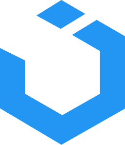</a> | **📂 檔名:** `uikit.svg` ✨ **格式:** `Vector (SVG)` ⚖️ **大小:** `571.00B` 📅 **更新:** `2026-03-02`  🚀 **jsDelivr Markdown:** `` 🔗 **直接連結 (Url):** <code>https://cdn.jsdelivr.net/gh/barry028/materials@main/images/iCons/Brands/uikit.svg</code> 📥 [檢視原始檔](uikit.svg) |
|  | **📂 檔名:** `umu.svg` ✨ **格式:** `Vector (SVG)` ⚖️ **大小:** `2.52KB` 📅 **更新:** `2026-03-02`  🚀 **jsDelivr Markdown:** `` 🔗 **直接連結 (Url):** <code>https://cdn.jsdelivr.net/gh/barry028/materials@main/images/iCons/Brands/umu.svg</code> 📥 [檢視原始檔](umu.svg) |
|  | **📂 檔名:** `unbounce-icon.svg` ✨ **格式:** `Vector (SVG)` ⚖️ **大小:** `1.92KB` 📅 **更新:** `2026-03-02`  🚀 **jsDelivr Markdown:** `` 🔗 **直接連結 (Url):** <code>https://cdn.jsdelivr.net/gh/barry028/materials@main/images/iCons/Brands/unbounce-icon.svg</code> 📥 [檢視原始檔](unbounce-icon.svg) |
|  | **📂 檔名:** `unbounce.svg` ✨ **格式:** `Vector (SVG)` ⚖️ **大小:** `10.45KB` 📅 **更新:** `2026-03-02`  🚀 **jsDelivr Markdown:** `` 🔗 **直接連結 (Url):** <code>https://cdn.jsdelivr.net/gh/barry028/materials@main/images/iCons/Brands/unbounce.svg</code> 📥 [檢視原始檔](unbounce.svg) |
|  | **📂 檔名:** `undertow.svg` ✨ **格式:** `Vector (SVG)` ⚖️ **大小:** `1.86KB` 📅 **更新:** `2026-03-02`  🚀 **jsDelivr Markdown:** `` 🔗 **直接連結 (Url):** <code>https://cdn.jsdelivr.net/gh/barry028/materials@main/images/iCons/Brands/undertow.svg</code> 📥 [檢視原始檔](undertow.svg) |
|  | **📂 檔名:** `unionpay.svg` ✨ **格式:** `Vector (SVG)` ⚖️ **大小:** `17.20KB` 📅 **更新:** `2026-03-02`  🚀 **jsDelivr Markdown:** `` 🔗 **直接連結 (Url):** <code>https://cdn.jsdelivr.net/gh/barry028/materials@main/images/iCons/Brands/unionpay.svg</code> 📥 [檢視原始檔](unionpay.svg) |
|  | **📂 檔名:** `unitjs.svg` ✨ **格式:** `Vector (SVG)` ⚖️ **大小:** `1.55KB` 📅 **更新:** `2026-03-02`  🚀 **jsDelivr Markdown:** `` 🔗 **直接連結 (Url):** <code>https://cdn.jsdelivr.net/gh/barry028/materials@main/images/iCons/Brands/unitjs.svg</code> 📥 [檢視原始檔](unitjs.svg) |
| <a href="unito-icon.svg">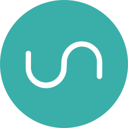</a> | **📂 檔名:** `unito-icon.svg` ✨ **格式:** `Vector (SVG)` ⚖️ **大小:** `2.08KB` 📅 **更新:** `2026-03-02`  🚀 **jsDelivr Markdown:** `` 🔗 **直接連結 (Url):** <code>https://cdn.jsdelivr.net/gh/barry028/materials@main/images/iCons/Brands/unito-icon.svg</code> 📥 [檢視原始檔](unito-icon.svg) |
|  | **📂 檔名:** `unito.svg` ✨ **格式:** `Vector (SVG)` ⚖️ **大小:** `4.92KB` 📅 **更新:** `2026-03-02`  🚀 **jsDelivr Markdown:** `` 🔗 **直接連結 (Url):** <code>https://cdn.jsdelivr.net/gh/barry028/materials@main/images/iCons/Brands/unito.svg</code> 📥 [檢視原始檔](unito.svg) |
| <a href="unity.svg">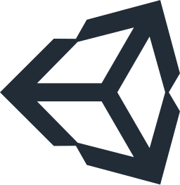</a> | **📂 檔名:** `unity.svg` ✨ **格式:** `Vector (SVG)` ⚖️ **大小:** `1.02KB` 📅 **更新:** `2026-03-02`  🚀 **jsDelivr Markdown:** `` 🔗 **直接連結 (Url):** <code>https://cdn.jsdelivr.net/gh/barry028/materials@main/images/iCons/Brands/unity.svg</code> 📥 [檢視原始檔](unity.svg) |
| <a href="unocss.svg">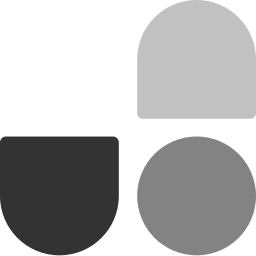</a> | **📂 檔名:** `unocss.svg` ✨ **格式:** `Vector (SVG)` ⚖️ **大小:** `1.44KB` 📅 **更新:** `2026-03-02`  🚀 **jsDelivr Markdown:** `` 🔗 **直接連結 (Url):** <code>https://cdn.jsdelivr.net/gh/barry028/materials@main/images/iCons/Brands/unocss.svg</code> 📥 [檢視原始檔](unocss.svg) |
|  | **📂 檔名:** `unrealengine-icon.svg` ✨ **格式:** `Vector (SVG)` ⚖️ **大小:** `9.18KB` 📅 **更新:** `2026-03-02`  🚀 **jsDelivr Markdown:** `` 🔗 **直接連結 (Url):** <code>https://cdn.jsdelivr.net/gh/barry028/materials@main/images/iCons/Brands/unrealengine-icon.svg</code> 📥 [檢視原始檔](unrealengine-icon.svg) |
|  | **📂 檔名:** `unrealengine.svg` ✨ **格式:** `Vector (SVG)` ⚖️ **大小:** `21.83KB` 📅 **更新:** `2026-03-02`  🚀 **jsDelivr Markdown:** `` 🔗 **直接連結 (Url):** <code>https://cdn.jsdelivr.net/gh/barry028/materials@main/images/iCons/Brands/unrealengine.svg</code> 📥 [檢視原始檔](unrealengine.svg) |
|  | **📂 檔名:** `upcase.svg` ✨ **格式:** `Vector (SVG)` ⚖️ **大小:** `6.06KB` 📅 **更新:** `2026-03-02`  🚀 **jsDelivr Markdown:** `` 🔗 **直接連結 (Url):** <code>https://cdn.jsdelivr.net/gh/barry028/materials@main/images/iCons/Brands/upcase.svg</code> 📥 [檢視原始檔](upcase.svg) |
| <a href="upstash-icon.svg">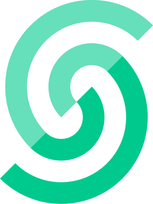</a> | **📂 檔名:** `upstash-icon.svg` ✨ **格式:** `Vector (SVG)` ⚖️ **大小:** `2.43KB` 📅 **更新:** `2026-03-02`  🚀 **jsDelivr Markdown:** `` 🔗 **直接連結 (Url):** <code>https://cdn.jsdelivr.net/gh/barry028/materials@main/images/iCons/Brands/upstash-icon.svg</code> 📥 [檢視原始檔](upstash-icon.svg) |
|  | **📂 檔名:** `upstash.svg` ✨ **格式:** `Vector (SVG)` ⚖️ **大小:** `7.47KB` 📅 **更新:** `2026-03-02`  🚀 **jsDelivr Markdown:** `` 🔗 **直接連結 (Url):** <code>https://cdn.jsdelivr.net/gh/barry028/materials@main/images/iCons/Brands/upstash.svg</code> 📥 [檢視原始檔](upstash.svg) |
|  | **📂 檔名:** `upwork.svg` ✨ **格式:** `Vector (SVG)` ⚖️ **大小:** `3.27KB` 📅 **更新:** `2026-03-02`  🚀 **jsDelivr Markdown:** `` 🔗 **直接連結 (Url):** <code>https://cdn.jsdelivr.net/gh/barry028/materials@main/images/iCons/Brands/upwork.svg</code> 📥 [檢視原始檔](upwork.svg) |
|  | **📂 檔名:** `user-testing-icon.svg` ✨ **格式:** `Vector (SVG)` ⚖️ **大小:** `2.26KB` 📅 **更新:** `2026-03-02`  🚀 **jsDelivr Markdown:** `` 🔗 **直接連結 (Url):** <code>https://cdn.jsdelivr.net/gh/barry028/materials@main/images/iCons/Brands/user-testing-icon.svg</code> 📥 [檢視原始檔](user-testing-icon.svg) |
|  | **📂 檔名:** `user-testing.svg` ✨ **格式:** `Vector (SVG)` ⚖️ **大小:** `20.69KB` 📅 **更新:** `2026-03-02`  🚀 **jsDelivr Markdown:** `` 🔗 **直接連結 (Url):** <code>https://cdn.jsdelivr.net/gh/barry028/materials@main/images/iCons/Brands/user-testing.svg</code> 📥 [檢視原始檔](user-testing.svg) |
|  | **📂 檔名:** `uservoice-icon.svg` ✨ **格式:** `Vector (SVG)` ⚖️ **大小:** `2.56KB` 📅 **更新:** `2026-03-02`  🚀 **jsDelivr Markdown:** `` 🔗 **直接連結 (Url):** <code>https://cdn.jsdelivr.net/gh/barry028/materials@main/images/iCons/Brands/uservoice-icon.svg</code> 📥 [檢視原始檔](uservoice-icon.svg) |
|  | **📂 檔名:** `uservoice.svg` ✨ **格式:** `Vector (SVG)` ⚖️ **大小:** `6.85KB` 📅 **更新:** `2026-03-02`  🚀 **jsDelivr Markdown:** `` 🔗 **直接連結 (Url):** <code>https://cdn.jsdelivr.net/gh/barry028/materials@main/images/iCons/Brands/uservoice.svg</code> 📥 [檢視原始檔](uservoice.svg) |
|  | **📂 檔名:** `uwsgi.svg` ✨ **格式:** `Vector (SVG)` ⚖️ **大小:** `7.03KB` 📅 **更新:** `2026-03-02`  🚀 **jsDelivr Markdown:** `` 🔗 **直接連結 (Url):** <code>https://cdn.jsdelivr.net/gh/barry028/materials@main/images/iCons/Brands/uwsgi.svg</code> 📥 [檢視原始檔](uwsgi.svg) |
|  | **📂 檔名:** `v8-ignition.svg` ✨ **格式:** `Vector (SVG)` ⚖️ **大小:** `4.93KB` 📅 **更新:** `2026-03-02`  🚀 **jsDelivr Markdown:** `` 🔗 **直接連結 (Url):** <code>https://cdn.jsdelivr.net/gh/barry028/materials@main/images/iCons/Brands/v8-ignition.svg</code> 📥 [檢視原始檔](v8-ignition.svg) |
|  | **📂 檔名:** `v8-turbofan.svg` ✨ **格式:** `Vector (SVG)` ⚖️ **大小:** `7.27KB` 📅 **更新:** `2026-03-02`  🚀 **jsDelivr Markdown:** `` 🔗 **直接連結 (Url):** <code>https://cdn.jsdelivr.net/gh/barry028/materials@main/images/iCons/Brands/v8-turbofan.svg</code> 📥 [檢視原始檔](v8-turbofan.svg) |
|  | **📂 檔名:** `v8.svg` ✨ **格式:** `Vector (SVG)` ⚖️ **大小:** `4.01KB` 📅 **更新:** `2026-03-02`  🚀 **jsDelivr Markdown:** `` 🔗 **直接連結 (Url):** <code>https://cdn.jsdelivr.net/gh/barry028/materials@main/images/iCons/Brands/v8.svg</code> 📥 [檢視原始檔](v8.svg) |
|  | **📂 檔名:** `vaadin.svg` ✨ **格式:** `Vector (SVG)` ⚖️ **大小:** `7.62KB` 📅 **更新:** `2026-03-02`  🚀 **jsDelivr Markdown:** `` 🔗 **直接連結 (Url):** <code>https://cdn.jsdelivr.net/gh/barry028/materials@main/images/iCons/Brands/vaadin.svg</code> 📥 [檢視原始檔](vaadin.svg) |
|  | **📂 檔名:** `vaddy.svg` ✨ **格式:** `Vector (SVG)` ⚖️ **大小:** `1.45KB` 📅 **更新:** `2026-03-02`  🚀 **jsDelivr Markdown:** `` 🔗 **直接連結 (Url):** <code>https://cdn.jsdelivr.net/gh/barry028/materials@main/images/iCons/Brands/vaddy.svg</code> 📥 [檢視原始檔](vaddy.svg) |
|  | **📂 檔名:** `vagrant-icon.svg` ✨ **格式:** `Vector (SVG)` ⚖️ **大小:** `1.36KB` 📅 **更新:** `2026-03-02`  🚀 **jsDelivr Markdown:** `` 🔗 **直接連結 (Url):** <code>https://cdn.jsdelivr.net/gh/barry028/materials@main/images/iCons/Brands/vagrant-icon.svg</code> 📥 [檢視原始檔](vagrant-icon.svg) |
|  | **📂 檔名:** `vagrant.svg` ✨ **格式:** `Vector (SVG)` ⚖️ **大小:** `6.57KB` 📅 **更新:** `2026-03-02`  🚀 **jsDelivr Markdown:** `` 🔗 **直接連結 (Url):** <code>https://cdn.jsdelivr.net/gh/barry028/materials@main/images/iCons/Brands/vagrant.svg</code> 📥 [檢視原始檔](vagrant.svg) |
| <a href="vault-icon.svg">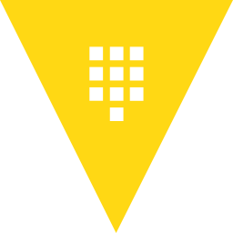</a> | **📂 檔名:** `vault-icon.svg` ✨ **格式:** `Vector (SVG)` ⚖️ **大小:** `1.50KB` 📅 **更新:** `2026-03-02`  🚀 **jsDelivr Markdown:** `` 🔗 **直接連結 (Url):** <code>https://cdn.jsdelivr.net/gh/barry028/materials@main/images/iCons/Brands/vault-icon.svg</code> 📥 [檢視原始檔](vault-icon.svg) |
|  | **📂 檔名:** `vault.svg` ✨ **格式:** `Vector (SVG)` ⚖️ **大小:** `3.85KB` 📅 **更新:** `2026-03-02`  🚀 **jsDelivr Markdown:** `` 🔗 **直接連結 (Url):** <code>https://cdn.jsdelivr.net/gh/barry028/materials@main/images/iCons/Brands/vault.svg</code> 📥 [檢視原始檔](vault.svg) |
| <a href="vector.svg">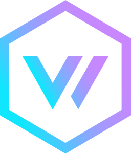</a> | **📂 檔名:** `vector.svg` ✨ **格式:** `Vector (SVG)` ⚖️ **大小:** `2.50KB` 📅 **更新:** `2026-03-02`  🚀 **jsDelivr Markdown:** `` 🔗 **直接連結 (Url):** <code>https://cdn.jsdelivr.net/gh/barry028/materials@main/images/iCons/Brands/vector.svg</code> 📥 [檢視原始檔](vector.svg) |
|  | **📂 檔名:** `vercel-icon.svg` ✨ **格式:** `Vector (SVG)` ⚖️ **大小:** `329.00B` 📅 **更新:** `2026-03-02`  🚀 **jsDelivr Markdown:** `` 🔗 **直接連結 (Url):** <code>https://cdn.jsdelivr.net/gh/barry028/materials@main/images/iCons/Brands/vercel-icon.svg</code> 📥 [檢視原始檔](vercel-icon.svg) |
|  | **📂 檔名:** `vercel.svg` ✨ **格式:** `Vector (SVG)` ⚖️ **大小:** `3.01KB` 📅 **更新:** `2026-03-02`  🚀 **jsDelivr Markdown:** `` 🔗 **直接連結 (Url):** <code>https://cdn.jsdelivr.net/gh/barry028/materials@main/images/iCons/Brands/vercel.svg</code> 📥 [檢視原始檔](vercel.svg) |
|  | **📂 檔名:** `verdaccio-icon.svg` ✨ **格式:** `Vector (SVG)` ⚖️ **大小:** `864.00B` 📅 **更新:** `2026-03-02`  🚀 **jsDelivr Markdown:** `` 🔗 **直接連結 (Url):** <code>https://cdn.jsdelivr.net/gh/barry028/materials@main/images/iCons/Brands/verdaccio-icon.svg</code> 📥 [檢視原始檔](verdaccio-icon.svg) |
|  | **📂 檔名:** `verdaccio.svg` ✨ **格式:** `Vector (SVG)` ⚖️ **大小:** `10.50KB` 📅 **更新:** `2026-03-02`  🚀 **jsDelivr Markdown:** `` 🔗 **直接連結 (Url):** <code>https://cdn.jsdelivr.net/gh/barry028/materials@main/images/iCons/Brands/verdaccio.svg</code> 📥 [檢視原始檔](verdaccio.svg) |
|  | **📂 檔名:** `vernemq.svg` ✨ **格式:** `Vector (SVG)` ⚖️ **大小:** `3.90KB` 📅 **更新:** `2026-03-02`  🚀 **jsDelivr Markdown:** `` 🔗 **直接連結 (Url):** <code>https://cdn.jsdelivr.net/gh/barry028/materials@main/images/iCons/Brands/vernemq.svg</code> 📥 [檢視原始檔](vernemq.svg) |
| <a href="vim.svg">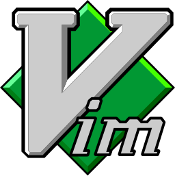</a> | **📂 檔名:** `vim.svg` ✨ **格式:** `Vector (SVG)` ⚖️ **大小:** `11.06KB` 📅 **更新:** `2026-03-02`  🚀 **jsDelivr Markdown:** `` 🔗 **直接連結 (Url):** <code>https://cdn.jsdelivr.net/gh/barry028/materials@main/images/iCons/Brands/vim.svg</code> 📥 [檢視原始檔](vim.svg) |
|  | **📂 檔名:** `vimeo-icon.svg` ✨ **格式:** `Vector (SVG)` ⚖️ **大小:** `1.44KB` 📅 **更新:** `2026-03-02`  🚀 **jsDelivr Markdown:** `` 🔗 **直接連結 (Url):** <code>https://cdn.jsdelivr.net/gh/barry028/materials@main/images/iCons/Brands/vimeo-icon.svg</code> 📥 [檢視原始檔](vimeo-icon.svg) |
|  | **📂 檔名:** `vimeo.svg` ✨ **格式:** `Vector (SVG)` ⚖️ **大小:** `8.36KB` 📅 **更新:** `2026-03-02`  🚀 **jsDelivr Markdown:** `` 🔗 **直接連結 (Url):** <code>https://cdn.jsdelivr.net/gh/barry028/materials@main/images/iCons/Brands/vimeo.svg</code> 📥 [檢視原始檔](vimeo.svg) |
|  | **📂 檔名:** `visa.svg` ✨ **格式:** `Vector (SVG)` ⚖️ **大小:** `2.27KB` 📅 **更新:** `2026-03-02`  🚀 **jsDelivr Markdown:** `` 🔗 **直接連結 (Url):** <code>https://cdn.jsdelivr.net/gh/barry028/materials@main/images/iCons/Brands/visa.svg</code> 📥 [檢視原始檔](visa.svg) |
|  | **📂 檔名:** `visaelectron.svg` ✨ **格式:** `Vector (SVG)` ⚖️ **大小:** `5.95KB` 📅 **更新:** `2026-03-02`  🚀 **jsDelivr Markdown:** `` 🔗 **直接連結 (Url):** <code>https://cdn.jsdelivr.net/gh/barry028/materials@main/images/iCons/Brands/visaelectron.svg</code> 📥 [檢視原始檔](visaelectron.svg) |
|  | **📂 檔名:** `visual-studio-code.svg` ✨ **格式:** `Vector (SVG)` ⚖️ **大小:** `4.45KB` 📅 **更新:** `2026-03-02`  🚀 **jsDelivr Markdown:** `` 🔗 **直接連結 (Url):** <code>https://cdn.jsdelivr.net/gh/barry028/materials@main/images/iCons/Brands/visual-studio-code.svg</code> 📥 [檢視原始檔](visual-studio-code.svg) |
|  | **📂 檔名:** `visual-studio.svg` ✨ **格式:** `Vector (SVG)` ⚖️ **大小:** `4.65KB` 📅 **更新:** `2026-03-02`  🚀 **jsDelivr Markdown:** `` 🔗 **直接連結 (Url):** <code>https://cdn.jsdelivr.net/gh/barry028/materials@main/images/iCons/Brands/visual-studio.svg</code> 📥 [檢視原始檔](visual-studio.svg) |
|  | **📂 檔名:** `vitejs.svg` ✨ **格式:** `Vector (SVG)` ⚖️ **大小:** `2.15KB` 📅 **更新:** `2026-03-02`  🚀 **jsDelivr Markdown:** `` 🔗 **直接連結 (Url):** <code>https://cdn.jsdelivr.net/gh/barry028/materials@main/images/iCons/Brands/vitejs.svg</code> 📥 [檢視原始檔](vitejs.svg) |
|  | **📂 檔名:** `vitess.svg` ✨ **格式:** `Vector (SVG)` ⚖️ **大小:** `4.59KB` 📅 **更新:** `2026-03-02`  🚀 **jsDelivr Markdown:** `` 🔗 **直接連結 (Url):** <code>https://cdn.jsdelivr.net/gh/barry028/materials@main/images/iCons/Brands/vitess.svg</code> 📥 [檢視原始檔](vitess.svg) |
|  | **📂 檔名:** `vitest.svg` ✨ **格式:** `Vector (SVG)` ⚖️ **大小:** `3.41KB` 📅 **更新:** `2026-03-02`  🚀 **jsDelivr Markdown:** `` 🔗 **直接連結 (Url):** <code>https://cdn.jsdelivr.net/gh/barry028/materials@main/images/iCons/Brands/vitest.svg</code> 📥 [檢視原始檔](vitest.svg) |
|  | **📂 檔名:** `vivaldi-icon.svg` ✨ **格式:** `Vector (SVG)` ⚖️ **大小:** `4.65KB` 📅 **更新:** `2026-03-02`  🚀 **jsDelivr Markdown:** `` 🔗 **直接連結 (Url):** <code>https://cdn.jsdelivr.net/gh/barry028/materials@main/images/iCons/Brands/vivaldi-icon.svg</code> 📥 [檢視原始檔](vivaldi-icon.svg) |
|  | **📂 檔名:** `vivaldi.svg` ✨ **格式:** `Vector (SVG)` ⚖️ **大小:** `6.45KB` 📅 **更新:** `2026-03-02`  🚀 **jsDelivr Markdown:** `` 🔗 **直接連結 (Url):** <code>https://cdn.jsdelivr.net/gh/barry028/materials@main/images/iCons/Brands/vivaldi.svg</code> 📥 [檢視原始檔](vivaldi.svg) |
| <a href="vlang.svg">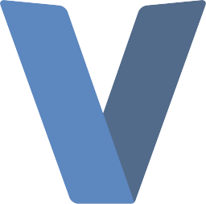</a> | **📂 檔名:** `vlang.svg` ✨ **格式:** `Vector (SVG)` ⚖️ **大小:** `3.02KB` 📅 **更新:** `2026-03-02`  🚀 **jsDelivr Markdown:** `` 🔗 **直接連結 (Url):** <code>https://cdn.jsdelivr.net/gh/barry028/materials@main/images/iCons/Brands/vlang.svg</code> 📥 [檢視原始檔](vlang.svg) |
| <a href="void.svg">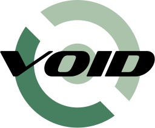</a> | **📂 檔名:** `void.svg` ✨ **格式:** `Vector (SVG)` ⚖️ **大小:** `6.83KB` 📅 **更新:** `2026-03-02`  🚀 **jsDelivr Markdown:** `` 🔗 **直接連結 (Url):** <code>https://cdn.jsdelivr.net/gh/barry028/materials@main/images/iCons/Brands/void.svg</code> 📥 [檢視原始檔](void.svg) |
|  | **📂 檔名:** `vue.svg` ✨ **格式:** `Vector (SVG)` ⚖️ **大小:** `569.00B` 📅 **更新:** `2026-03-02`  🚀 **jsDelivr Markdown:** `` 🔗 **直接連結 (Url):** <code>https://cdn.jsdelivr.net/gh/barry028/materials@main/images/iCons/Brands/vue.svg</code> 📥 [檢視原始檔](vue.svg) |
|  | **📂 檔名:** `vuetifyjs.svg` ✨ **格式:** `Vector (SVG)` ⚖️ **大小:** `795.00B` 📅 **更新:** `2026-03-02`  🚀 **jsDelivr Markdown:** `` 🔗 **直接連結 (Url):** <code>https://cdn.jsdelivr.net/gh/barry028/materials@main/images/iCons/Brands/vuetifyjs.svg</code> 📥 [檢視原始檔](vuetifyjs.svg) |
|  | **📂 檔名:** `vueuse.svg` ✨ **格式:** `Vector (SVG)` ⚖️ **大小:** `1.08KB` 📅 **更新:** `2026-03-02`  🚀 **jsDelivr Markdown:** `` 🔗 **直接連結 (Url):** <code>https://cdn.jsdelivr.net/gh/barry028/materials@main/images/iCons/Brands/vueuse.svg</code> 📥 [檢視原始檔](vueuse.svg) |
|  | **📂 檔名:** `vulkan.svg` ✨ **格式:** `Vector (SVG)` ⚖️ **大小:** `6.68KB` 📅 **更新:** `2026-03-02`  🚀 **jsDelivr Markdown:** `` 🔗 **直接連結 (Url):** <code>https://cdn.jsdelivr.net/gh/barry028/materials@main/images/iCons/Brands/vulkan.svg</code> 📥 [檢視原始檔](vulkan.svg) |
|  | **📂 檔名:** `vultr-icon.svg` ✨ **格式:** `Vector (SVG)` ⚖️ **大小:** `2.09KB` 📅 **更新:** `2026-03-02`  🚀 **jsDelivr Markdown:** `` 🔗 **直接連結 (Url):** <code>https://cdn.jsdelivr.net/gh/barry028/materials@main/images/iCons/Brands/vultr-icon.svg</code> 📥 [檢視原始檔](vultr-icon.svg) |
|  | **📂 檔名:** `vultr.svg` ✨ **格式:** `Vector (SVG)` ⚖️ **大小:** `6.46KB` 📅 **更新:** `2026-03-02`  🚀 **jsDelivr Markdown:** `` 🔗 **直接連結 (Url):** <code>https://cdn.jsdelivr.net/gh/barry028/materials@main/images/iCons/Brands/vultr.svg</code> 📥 [檢視原始檔](vultr.svg) |
|  | **📂 檔名:** `vwo.svg` ✨ **格式:** `Vector (SVG)` ⚖️ **大小:** `1.42KB` 📅 **更新:** `2026-03-02`  🚀 **jsDelivr Markdown:** `` 🔗 **直接連結 (Url):** <code>https://cdn.jsdelivr.net/gh/barry028/materials@main/images/iCons/Brands/vwo.svg</code> 📥 [檢視原始檔](vwo.svg) |
|  | **📂 檔名:** `w3c.svg` ✨ **格式:** `Vector (SVG)` ⚖️ **大小:** `3.49KB` 📅 **更新:** `2026-03-02`  🚀 **jsDelivr Markdown:** `` 🔗 **直接連結 (Url):** <code>https://cdn.jsdelivr.net/gh/barry028/materials@main/images/iCons/Brands/w3c.svg</code> 📥 [檢視原始檔](w3c.svg) |
| <a href="waffle-icon.svg">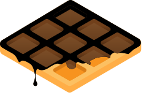</a> | **📂 檔名:** `waffle-icon.svg` ✨ **格式:** `Vector (SVG)` ⚖️ **大小:** `72.83KB` 📅 **更新:** `2026-03-02`  🚀 **jsDelivr Markdown:** `` 🔗 **直接連結 (Url):** <code>https://cdn.jsdelivr.net/gh/barry028/materials@main/images/iCons/Brands/waffle-icon.svg</code> 📥 [檢視原始檔](waffle-icon.svg) |
|  | **📂 檔名:** `waffle.svg` ✨ **格式:** `Vector (SVG)` ⚖️ **大小:** `2.38KB` 📅 **更新:** `2026-03-02`  🚀 **jsDelivr Markdown:** `` 🔗 **直接連結 (Url):** <code>https://cdn.jsdelivr.net/gh/barry028/materials@main/images/iCons/Brands/waffle.svg</code> 📥 [檢視原始檔](waffle.svg) |
|  | **📂 檔名:** `wagtail.svg` ✨ **格式:** `Vector (SVG)` ⚖️ **大小:** `2.59KB` 📅 **更新:** `2026-03-02`  🚀 **jsDelivr Markdown:** `` 🔗 **直接連結 (Url):** <code>https://cdn.jsdelivr.net/gh/barry028/materials@main/images/iCons/Brands/wagtail.svg</code> 📥 [檢視原始檔](wagtail.svg) |
|  | **📂 檔名:** `wakatime.svg` ✨ **格式:** `Vector (SVG)` ⚖️ **大小:** `1.33KB` 📅 **更新:** `2026-03-02`  🚀 **jsDelivr Markdown:** `` 🔗 **直接連結 (Url):** <code>https://cdn.jsdelivr.net/gh/barry028/materials@main/images/iCons/Brands/wakatime.svg</code> 📥 [檢視原始檔](wakatime.svg) |
|  | **📂 檔名:** `walkme.svg` ✨ **格式:** `Vector (SVG)` ⚖️ **大小:** `7.03KB` 📅 **更新:** `2026-03-02`  🚀 **jsDelivr Markdown:** `` 🔗 **直接連結 (Url):** <code>https://cdn.jsdelivr.net/gh/barry028/materials@main/images/iCons/Brands/walkme.svg</code> 📥 [檢視原始檔](walkme.svg) |
| <a href="watchman.svg">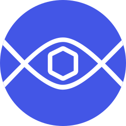</a> | **📂 檔名:** `watchman.svg` ✨ **格式:** `Vector (SVG)` ⚖️ **大小:** `2.48KB` 📅 **更新:** `2026-03-02`  🚀 **jsDelivr Markdown:** `` 🔗 **直接連結 (Url):** <code>https://cdn.jsdelivr.net/gh/barry028/materials@main/images/iCons/Brands/watchman.svg</code> 📥 [檢視原始檔](watchman.svg) |
|  | **📂 檔名:** `waypoint-icon.svg` ✨ **格式:** `Vector (SVG)` ⚖️ **大小:** `679.00B` 📅 **更新:** `2026-03-02`  🚀 **jsDelivr Markdown:** `` 🔗 **直接連結 (Url):** <code>https://cdn.jsdelivr.net/gh/barry028/materials@main/images/iCons/Brands/waypoint-icon.svg</code> 📥 [檢視原始檔](waypoint-icon.svg) |
|  | **📂 檔名:** `waypoint.svg` ✨ **格式:** `Vector (SVG)` ⚖️ **大小:** `4.88KB` 📅 **更新:** `2026-03-02`  🚀 **jsDelivr Markdown:** `` 🔗 **直接連結 (Url):** <code>https://cdn.jsdelivr.net/gh/barry028/materials@main/images/iCons/Brands/waypoint.svg</code> 📥 [檢視原始檔](waypoint.svg) |
|  | **📂 檔名:** `wayscript-icon.svg` ✨ **格式:** `Vector (SVG)` ⚖️ **大小:** `5.01KB` 📅 **更新:** `2026-03-02`  🚀 **jsDelivr Markdown:** `` 🔗 **直接連結 (Url):** <code>https://cdn.jsdelivr.net/gh/barry028/materials@main/images/iCons/Brands/wayscript-icon.svg</code> 📥 [檢視原始檔](wayscript-icon.svg) |
|  | **📂 檔名:** `wayscript.svg` ✨ **格式:** `Vector (SVG)` ⚖️ **大小:** `17.99KB` 📅 **更新:** `2026-03-02`  🚀 **jsDelivr Markdown:** `` 🔗 **直接連結 (Url):** <code>https://cdn.jsdelivr.net/gh/barry028/materials@main/images/iCons/Brands/wayscript.svg</code> 📥 [檢視原始檔](wayscript.svg) |
|  | **📂 檔名:** `wearos.svg` ✨ **格式:** `Vector (SVG)` ⚖️ **大小:** `1.27KB` 📅 **更新:** `2026-03-02`  🚀 **jsDelivr Markdown:** `` 🔗 **直接連結 (Url):** <code>https://cdn.jsdelivr.net/gh/barry028/materials@main/images/iCons/Brands/wearos.svg</code> 📥 [檢視原始檔](wearos.svg) |
|  | **📂 檔名:** `weave.svg` ✨ **格式:** `Vector (SVG)` ⚖️ **大小:** `1.16KB` 📅 **更新:** `2026-03-02`  🚀 **jsDelivr Markdown:** `` 🔗 **直接連結 (Url):** <code>https://cdn.jsdelivr.net/gh/barry028/materials@main/images/iCons/Brands/weave.svg</code> 📥 [檢視原始檔](weave.svg) |
|  | **📂 檔名:** `web.dev-icon.svg` ✨ **格式:** `Vector (SVG)` ⚖️ **大小:** `1.59KB` 📅 **更新:** `2026-03-02`  🚀 **jsDelivr Markdown:** `` 🔗 **直接連結 (Url):** <code>https://cdn.jsdelivr.net/gh/barry028/materials@main/images/iCons/Brands/web.dev-icon.svg</code> 📥 [檢視原始檔](web.dev-icon.svg) |
|  | **📂 檔名:** `web.dev.svg` ✨ **格式:** `Vector (SVG)` ⚖️ **大小:** `5.42KB` 📅 **更新:** `2026-03-02`  🚀 **jsDelivr Markdown:** `` 🔗 **直接連結 (Url):** <code>https://cdn.jsdelivr.net/gh/barry028/materials@main/images/iCons/Brands/web.dev.svg</code> 📥 [檢視原始檔](web.dev.svg) |
|  | **📂 檔名:** `web3js.svg` ✨ **格式:** `Vector (SVG)` ⚖️ **大小:** `4.48KB` 📅 **更新:** `2026-03-02`  🚀 **jsDelivr Markdown:** `` 🔗 **直接連結 (Url):** <code>https://cdn.jsdelivr.net/gh/barry028/materials@main/images/iCons/Brands/web3js.svg</code> 📥 [檢視原始檔](web3js.svg) |
| <a href="webassembly.svg">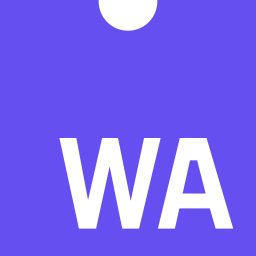</a> | **📂 檔名:** `webassembly.svg` ✨ **格式:** `Vector (SVG)` ⚖️ **大小:** `1.29KB` 📅 **更新:** `2026-03-02`  🚀 **jsDelivr Markdown:** `` 🔗 **直接連結 (Url):** <code>https://cdn.jsdelivr.net/gh/barry028/materials@main/images/iCons/Brands/webassembly.svg</code> 📥 [檢視原始檔](webassembly.svg) |
| <a href="webcomponents.svg">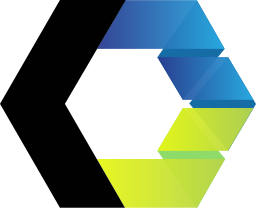</a> | **📂 檔名:** `webcomponents.svg` ✨ **格式:** `Vector (SVG)` ⚖️ **大小:** `2.39KB` 📅 **更新:** `2026-03-02`  🚀 **jsDelivr Markdown:** `` 🔗 **直接連結 (Url):** <code>https://cdn.jsdelivr.net/gh/barry028/materials@main/images/iCons/Brands/webcomponents.svg</code> 📥 [檢視原始檔](webcomponents.svg) |
| <a href="webdriverio.svg">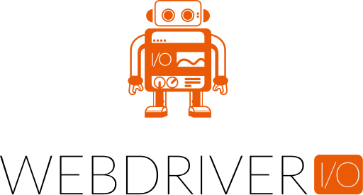</a> | **📂 檔名:** `webdriverio.svg` ✨ **格式:** `Vector (SVG)` ⚖️ **大小:** `32.97KB` 📅 **更新:** `2026-03-02`  🚀 **jsDelivr Markdown:** `` 🔗 **直接連結 (Url):** <code>https://cdn.jsdelivr.net/gh/barry028/materials@main/images/iCons/Brands/webdriverio.svg</code> 📥 [檢視原始檔](webdriverio.svg) |
|  | **📂 檔名:** `webflow.svg` ✨ **格式:** `Vector (SVG)` ⚖️ **大小:** `5.11KB` 📅 **更新:** `2026-03-02`  🚀 **jsDelivr Markdown:** `` 🔗 **直接連結 (Url):** <code>https://cdn.jsdelivr.net/gh/barry028/materials@main/images/iCons/Brands/webflow.svg</code> 📥 [檢視原始檔](webflow.svg) |
|  | **📂 檔名:** `webgpu.svg` ✨ **格式:** `Vector (SVG)` ⚖️ **大小:** `8.33KB` 📅 **更新:** `2026-03-02`  🚀 **jsDelivr Markdown:** `` 🔗 **直接連結 (Url):** <code>https://cdn.jsdelivr.net/gh/barry028/materials@main/images/iCons/Brands/webgpu.svg</code> 📥 [檢視原始檔](webgpu.svg) |
| <a href="webhint-icon.svg">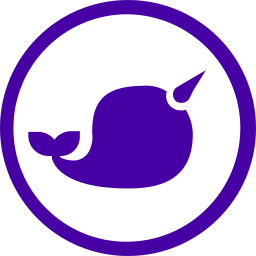</a> | **📂 檔名:** `webhint-icon.svg` ✨ **格式:** `Vector (SVG)` ⚖️ **大小:** `2.75KB` 📅 **更新:** `2026-03-02`  🚀 **jsDelivr Markdown:** `` 🔗 **直接連結 (Url):** <code>https://cdn.jsdelivr.net/gh/barry028/materials@main/images/iCons/Brands/webhint-icon.svg</code> 📥 [檢視原始檔](webhint-icon.svg) |
|  | **📂 檔名:** `webhint.svg` ✨ **格式:** `Vector (SVG)` ⚖️ **大小:** `12.10KB` 📅 **更新:** `2026-03-02`  🚀 **jsDelivr Markdown:** `` 🔗 **直接連結 (Url):** <code>https://cdn.jsdelivr.net/gh/barry028/materials@main/images/iCons/Brands/webhint.svg</code> 📥 [檢視原始檔](webhint.svg) |
|  | **📂 檔名:** `webhooks.svg` ✨ **格式:** `Vector (SVG)` ⚖️ **大小:** `3.43KB` 📅 **更新:** `2026-03-02`  🚀 **jsDelivr Markdown:** `` 🔗 **直接連結 (Url):** <code>https://cdn.jsdelivr.net/gh/barry028/materials@main/images/iCons/Brands/webhooks.svg</code> 📥 [檢視原始檔](webhooks.svg) |
| <a href="webix-icon.svg">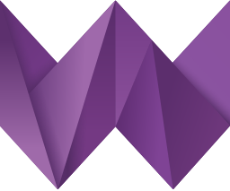</a> | **📂 檔名:** `webix-icon.svg` ✨ **格式:** `Vector (SVG)` ⚖️ **大小:** `6.50KB` 📅 **更新:** `2026-03-02`  🚀 **jsDelivr Markdown:** `` 🔗 **直接連結 (Url):** <code>https://cdn.jsdelivr.net/gh/barry028/materials@main/images/iCons/Brands/webix-icon.svg</code> 📥 [檢視原始檔](webix-icon.svg) |
| <a href="webix.svg">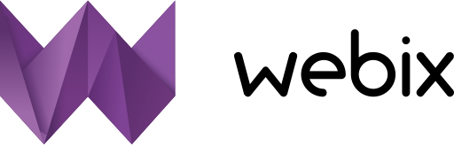</a> | **📂 檔名:** `webix.svg` ✨ **格式:** `Vector (SVG)` ⚖️ **大小:** `11.93KB` 📅 **更新:** `2026-03-02`  🚀 **jsDelivr Markdown:** `` 🔗 **直接連結 (Url):** <code>https://cdn.jsdelivr.net/gh/barry028/materials@main/images/iCons/Brands/webix.svg</code> 📥 [檢視原始檔](webix.svg) |
|  | **📂 檔名:** `webkit.svg` ✨ **格式:** `Vector (SVG)` ⚖️ **大小:** `5.30KB` 📅 **更新:** `2026-03-02`  🚀 **jsDelivr Markdown:** `` 🔗 **直接連結 (Url):** <code>https://cdn.jsdelivr.net/gh/barry028/materials@main/images/iCons/Brands/webkit.svg</code> 📥 [檢視原始檔](webkit.svg) |
|  | **📂 檔名:** `webmin.svg` ✨ **格式:** `Vector (SVG)` ⚖️ **大小:** `5.72KB` 📅 **更新:** `2026-03-02`  🚀 **jsDelivr Markdown:** `` 🔗 **直接連結 (Url):** <code>https://cdn.jsdelivr.net/gh/barry028/materials@main/images/iCons/Brands/webmin.svg</code> 📥 [檢視原始檔](webmin.svg) |
| <a href="webpack.svg">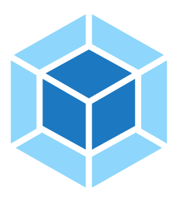</a> | **📂 檔名:** `webpack.svg` ✨ **格式:** `Vector (SVG)` ⚖️ **大小:** `1.63KB` 📅 **更新:** `2026-03-02`  🚀 **jsDelivr Markdown:** `` 🔗 **直接連結 (Url):** <code>https://cdn.jsdelivr.net/gh/barry028/materials@main/images/iCons/Brands/webpack.svg</code> 📥 [檢視原始檔](webpack.svg) |
|  | **📂 檔名:** `webplatform.svg` ✨ **格式:** `Vector (SVG)` ⚖️ **大小:** `1.74KB` 📅 **更新:** `2026-03-02`  🚀 **jsDelivr Markdown:** `` 🔗 **直接連結 (Url):** <code>https://cdn.jsdelivr.net/gh/barry028/materials@main/images/iCons/Brands/webplatform.svg</code> 📥 [檢視原始檔](webplatform.svg) |
|  | **📂 檔名:** `webrtc.svg` ✨ **格式:** `Vector (SVG)` ⚖️ **大小:** `4.93KB` 📅 **更新:** `2026-03-02`  🚀 **jsDelivr Markdown:** `` 🔗 **直接連結 (Url):** <code>https://cdn.jsdelivr.net/gh/barry028/materials@main/images/iCons/Brands/webrtc.svg</code> 📥 [檢視原始檔](webrtc.svg) |
| <a href="websocket.svg">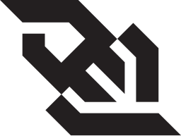</a> | **📂 檔名:** `websocket.svg` ✨ **格式:** `Vector (SVG)` ⚖️ **大小:** `1.20KB` 📅 **更新:** `2026-03-02`  🚀 **jsDelivr Markdown:** `` 🔗 **直接連結 (Url):** <code>https://cdn.jsdelivr.net/gh/barry028/materials@main/images/iCons/Brands/websocket.svg</code> 📥 [檢視原始檔](websocket.svg) |
|  | **📂 檔名:** `webstorm.svg` ✨ **格式:** `Vector (SVG)` ⚖️ **大小:** `5.33KB` 📅 **更新:** `2026-03-02`  🚀 **jsDelivr Markdown:** `` 🔗 **直接連結 (Url):** <code>https://cdn.jsdelivr.net/gh/barry028/materials@main/images/iCons/Brands/webstorm.svg</code> 📥 [檢視原始檔](webstorm.svg) |
|  | **📂 檔名:** `webtorrent.svg` ✨ **格式:** `Vector (SVG)` ⚖️ **大小:** `4.30KB` 📅 **更新:** `2026-03-02`  🚀 **jsDelivr Markdown:** `` 🔗 **直接連結 (Url):** <code>https://cdn.jsdelivr.net/gh/barry028/materials@main/images/iCons/Brands/webtorrent.svg</code> 📥 [檢視原始檔](webtorrent.svg) |
|  | **📂 檔名:** `weebly.svg` ✨ **格式:** `Vector (SVG)` ⚖️ **大小:** `2.23KB` 📅 **更新:** `2026-03-02`  🚀 **jsDelivr Markdown:** `` 🔗 **直接連結 (Url):** <code>https://cdn.jsdelivr.net/gh/barry028/materials@main/images/iCons/Brands/weebly.svg</code> 📥 [檢視原始檔](weebly.svg) |
| <a href="whalar-icon.svg">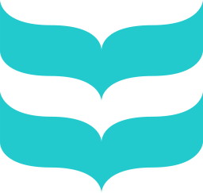</a> | **📂 檔名:** `whalar-icon.svg` ✨ **格式:** `Vector (SVG)` ⚖️ **大小:** `1.74KB` 📅 **更新:** `2026-03-02`  🚀 **jsDelivr Markdown:** `` 🔗 **直接連結 (Url):** <code>https://cdn.jsdelivr.net/gh/barry028/materials@main/images/iCons/Brands/whalar-icon.svg</code> 📥 [檢視原始檔](whalar-icon.svg) |
|  | **📂 檔名:** `whalar.svg` ✨ **格式:** `Vector (SVG)` ⚖️ **大小:** `7.71KB` 📅 **更新:** `2026-03-02`  🚀 **jsDelivr Markdown:** `` 🔗 **直接連結 (Url):** <code>https://cdn.jsdelivr.net/gh/barry028/materials@main/images/iCons/Brands/whalar.svg</code> 📥 [檢視原始檔](whalar.svg) |
|  | **📂 檔名:** `whatsapp-icon.svg` ✨ **格式:** `Vector (SVG)` ⚖️ **大小:** `4.15KB` 📅 **更新:** `2026-03-02`  🚀 **jsDelivr Markdown:** `` 🔗 **直接連結 (Url):** <code>https://cdn.jsdelivr.net/gh/barry028/materials@main/images/iCons/Brands/whatsapp-icon.svg</code> 📥 [檢視原始檔](whatsapp-icon.svg) |
|  | **📂 檔名:** `whatsapp-monochrome-icon.svg` ✨ **格式:** `Vector (SVG)` ⚖️ **大小:** `3.09KB` 📅 **更新:** `2026-03-02`  🚀 **jsDelivr Markdown:** `` 🔗 **直接連結 (Url):** <code>https://cdn.jsdelivr.net/gh/barry028/materials@main/images/iCons/Brands/whatsapp-monochrome-icon.svg</code> 📥 [檢視原始檔](whatsapp-monochrome-icon.svg) |
|  | **📂 檔名:** `whatsapp.svg` ✨ **格式:** `Vector (SVG)` ⚖️ **大小:** `17.05KB` 📅 **更新:** `2026-03-02`  🚀 **jsDelivr Markdown:** `` 🔗 **直接連結 (Url):** <code>https://cdn.jsdelivr.net/gh/barry028/materials@main/images/iCons/Brands/whatsapp.svg</code> 📥 [檢視原始檔](whatsapp.svg) |
|  | **📂 檔名:** `whatwg.svg` ✨ **格式:** `Vector (SVG)` ⚖️ **大小:** `1.01KB` 📅 **更新:** `2026-03-02`  🚀 **jsDelivr Markdown:** `` 🔗 **直接連結 (Url):** <code>https://cdn.jsdelivr.net/gh/barry028/materials@main/images/iCons/Brands/whatwg.svg</code> 📥 [檢視原始檔](whatwg.svg) |
| <a href="wicket-icon.svg">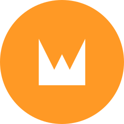</a> | **📂 檔名:** `wicket-icon.svg` ✨ **格式:** `Vector (SVG)` ⚖️ **大小:** `723.00B` 📅 **更新:** `2026-03-02`  🚀 **jsDelivr Markdown:** `` 🔗 **直接連結 (Url):** <code>https://cdn.jsdelivr.net/gh/barry028/materials@main/images/iCons/Brands/wicket-icon.svg</code> 📥 [檢視原始檔](wicket-icon.svg) |
|  | **📂 檔名:** `wicket.svg` ✨ **格式:** `Vector (SVG)` ⚖️ **大小:** `5.94KB` 📅 **更新:** `2026-03-02`  🚀 **jsDelivr Markdown:** `` 🔗 **直接連結 (Url):** <code>https://cdn.jsdelivr.net/gh/barry028/materials@main/images/iCons/Brands/wicket.svg</code> 📥 [檢視原始檔](wicket.svg) |
|  | **📂 檔名:** `wifi.svg` ✨ **格式:** `Vector (SVG)` ⚖️ **大小:** `2.73KB` 📅 **更新:** `2026-03-02`  🚀 **jsDelivr Markdown:** `` 🔗 **直接連結 (Url):** <code>https://cdn.jsdelivr.net/gh/barry028/materials@main/images/iCons/Brands/wifi.svg</code> 📥 [檢視原始檔](wifi.svg) |
|  | **📂 檔名:** `wildfly.svg` ✨ **格式:** `Vector (SVG)` ⚖️ **大小:** `83.54KB` 📅 **更新:** `2026-03-02`  🚀 **jsDelivr Markdown:** `` 🔗 **直接連結 (Url):** <code>https://cdn.jsdelivr.net/gh/barry028/materials@main/images/iCons/Brands/wildfly.svg</code> 📥 [檢視原始檔](wildfly.svg) |
| <a href="windi-css.svg">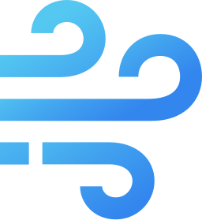</a> | **📂 檔名:** `windi-css.svg` ✨ **格式:** `Vector (SVG)` ⚖️ **大小:** `4.23KB` 📅 **更新:** `2026-03-02`  🚀 **jsDelivr Markdown:** `` 🔗 **直接連結 (Url):** <code>https://cdn.jsdelivr.net/gh/barry028/materials@main/images/iCons/Brands/windi-css.svg</code> 📥 [檢視原始檔](windi-css.svg) |
|  | **📂 檔名:** `wire.svg` ✨ **格式:** `Vector (SVG)` ⚖️ **大小:** `2.58KB` 📅 **更新:** `2026-03-02`  🚀 **jsDelivr Markdown:** `` 🔗 **直接連結 (Url):** <code>https://cdn.jsdelivr.net/gh/barry028/materials@main/images/iCons/Brands/wire.svg</code> 📥 [檢視原始檔](wire.svg) |
|  | **📂 檔名:** `wix.svg` ✨ **格式:** `Vector (SVG)` ⚖️ **大小:** `3.80KB` 📅 **更新:** `2026-03-02`  🚀 **jsDelivr Markdown:** `` 🔗 **直接連結 (Url):** <code>https://cdn.jsdelivr.net/gh/barry028/materials@main/images/iCons/Brands/wix.svg</code> 📥 [檢視原始檔](wix.svg) |
|  | **📂 檔名:** `wmr.svg` ✨ **格式:** `Vector (SVG)` ⚖️ **大小:** `65.11KB` 📅 **更新:** `2026-03-02`  🚀 **jsDelivr Markdown:** `` 🔗 **直接連結 (Url):** <code>https://cdn.jsdelivr.net/gh/barry028/materials@main/images/iCons/Brands/wmr.svg</code> 📥 [檢視原始檔](wmr.svg) |
|  | **📂 檔名:** `woocommerce-icon.svg` ✨ **格式:** `Vector (SVG)` ⚖️ **大小:** `4.87KB` 📅 **更新:** `2026-03-02`  🚀 **jsDelivr Markdown:** `` 🔗 **直接連結 (Url):** <code>https://cdn.jsdelivr.net/gh/barry028/materials@main/images/iCons/Brands/woocommerce-icon.svg</code> 📥 [檢視原始檔](woocommerce-icon.svg) |
|  | **📂 檔名:** `woocommerce.svg` ✨ **格式:** `Vector (SVG)` ⚖️ **大小:** `9.71KB` 📅 **更新:** `2026-03-02`  🚀 **jsDelivr Markdown:** `` 🔗 **直接連結 (Url):** <code>https://cdn.jsdelivr.net/gh/barry028/materials@main/images/iCons/Brands/woocommerce.svg</code> 📥 [檢視原始檔](woocommerce.svg) |
|  | **📂 檔名:** `woopra.svg` ✨ **格式:** `Vector (SVG)` ⚖️ **大小:** `5.56KB` 📅 **更新:** `2026-03-02`  🚀 **jsDelivr Markdown:** `` 🔗 **直接連結 (Url):** <code>https://cdn.jsdelivr.net/gh/barry028/materials@main/images/iCons/Brands/woopra.svg</code> 📥 [檢視原始檔](woopra.svg) |
|  | **📂 檔名:** `wordpress-icon-alt.svg` ✨ **格式:** `Vector (SVG)` ⚖️ **大小:** `2.15KB` 📅 **更新:** `2026-03-02`  🚀 **jsDelivr Markdown:** `` 🔗 **直接連結 (Url):** <code>https://cdn.jsdelivr.net/gh/barry028/materials@main/images/iCons/Brands/wordpress-icon-alt.svg</code> 📥 [檢視原始檔](wordpress-icon-alt.svg) |
|  | **📂 檔名:** `wordpress-icon.svg` ✨ **格式:** `Vector (SVG)` ⚖️ **大小:** `2.89KB` 📅 **更新:** `2026-03-02`  🚀 **jsDelivr Markdown:** `` 🔗 **直接連結 (Url):** <code>https://cdn.jsdelivr.net/gh/barry028/materials@main/images/iCons/Brands/wordpress-icon.svg</code> 📥 [檢視原始檔](wordpress-icon.svg) |
|  | **📂 檔名:** `wordpress.svg` ✨ **格式:** `Vector (SVG)` ⚖️ **大小:** `11.00KB` 📅 **更新:** `2026-03-02`  🚀 **jsDelivr Markdown:** `` 🔗 **直接連結 (Url):** <code>https://cdn.jsdelivr.net/gh/barry028/materials@main/images/iCons/Brands/wordpress.svg</code> 📥 [檢視原始檔](wordpress.svg) |
| <a href="workboard.svg">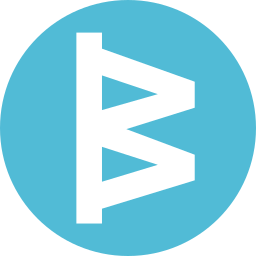</a> | **📂 檔名:** `workboard.svg` ✨ **格式:** `Vector (SVG)` ⚖️ **大小:** `825.00B` 📅 **更新:** `2026-03-02`  🚀 **jsDelivr Markdown:** `` 🔗 **直接連結 (Url):** <code>https://cdn.jsdelivr.net/gh/barry028/materials@main/images/iCons/Brands/workboard.svg</code> 📥 [檢視原始檔](workboard.svg) |
|  | **📂 檔名:** `workos-icon.svg` ✨ **格式:** `Vector (SVG)` ⚖️ **大小:** `1.61KB` 📅 **更新:** `2026-03-02`  🚀 **jsDelivr Markdown:** `` 🔗 **直接連結 (Url):** <code>https://cdn.jsdelivr.net/gh/barry028/materials@main/images/iCons/Brands/workos-icon.svg</code> 📥 [檢視原始檔](workos-icon.svg) |
|  | **📂 檔名:** `workos.svg` ✨ **格式:** `Vector (SVG)` ⚖️ **大小:** `5.29KB` 📅 **更新:** `2026-03-02`  🚀 **jsDelivr Markdown:** `` 🔗 **直接連結 (Url):** <code>https://cdn.jsdelivr.net/gh/barry028/materials@main/images/iCons/Brands/workos.svg</code> 📥 [檢視原始檔](workos.svg) |
|  | **📂 檔名:** `workplace-icon.svg` ✨ **格式:** `Vector (SVG)` ⚖️ **大小:** `1.93KB` 📅 **更新:** `2026-03-02`  🚀 **jsDelivr Markdown:** `` 🔗 **直接連結 (Url):** <code>https://cdn.jsdelivr.net/gh/barry028/materials@main/images/iCons/Brands/workplace-icon.svg</code> 📥 [檢視原始檔](workplace-icon.svg) |
|  | **📂 檔名:** `workplace.svg` ✨ **格式:** `Vector (SVG)` ⚖️ **大小:** `6.54KB` 📅 **更新:** `2026-03-02`  🚀 **jsDelivr Markdown:** `` 🔗 **直接連結 (Url):** <code>https://cdn.jsdelivr.net/gh/barry028/materials@main/images/iCons/Brands/workplace.svg</code> 📥 [檢視原始檔](workplace.svg) |
| <a href="wpengine.svg">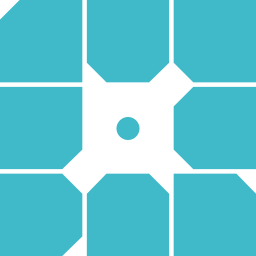</a> | **📂 檔名:** `wpengine.svg` ✨ **格式:** `Vector (SVG)` ⚖️ **大小:** `1.50KB` 📅 **更新:** `2026-03-02`  🚀 **jsDelivr Markdown:** `` 🔗 **直接連結 (Url):** <code>https://cdn.jsdelivr.net/gh/barry028/materials@main/images/iCons/Brands/wpengine.svg</code> 📥 [檢視原始檔](wpengine.svg) |
|  | **📂 檔名:** `wufoo.svg` ✨ **格式:** `Vector (SVG)` ⚖️ **大小:** `3.50KB` 📅 **更新:** `2026-03-02`  🚀 **jsDelivr Markdown:** `` 🔗 **直接連結 (Url):** <code>https://cdn.jsdelivr.net/gh/barry028/materials@main/images/iCons/Brands/wufoo.svg</code> 📥 [檢視原始檔](wufoo.svg) |
| <a href="xamarin.svg">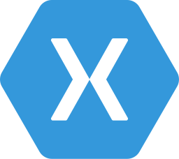</a> | **📂 檔名:** `xamarin.svg` ✨ **格式:** `Vector (SVG)` ⚖️ **大小:** `2.01KB` 📅 **更新:** `2026-03-02`  🚀 **jsDelivr Markdown:** `` 🔗 **直接連結 (Url):** <code>https://cdn.jsdelivr.net/gh/barry028/materials@main/images/iCons/Brands/xamarin.svg</code> 📥 [檢視原始檔](xamarin.svg) |
|  | **📂 檔名:** `xampp.svg` ✨ **格式:** `Vector (SVG)` ⚖️ **大小:** `5.26KB` 📅 **更新:** `2026-03-02`  🚀 **jsDelivr Markdown:** `` 🔗 **直接連結 (Url):** <code>https://cdn.jsdelivr.net/gh/barry028/materials@main/images/iCons/Brands/xampp.svg</code> 📥 [檢視原始檔](xampp.svg) |
| <a href="xata-icon.svg">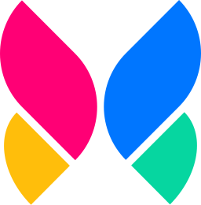</a> | **📂 檔名:** `xata-icon.svg` ✨ **格式:** `Vector (SVG)` ⚖️ **大小:** `1.55KB` 📅 **更新:** `2026-03-02`  🚀 **jsDelivr Markdown:** `` 🔗 **直接連結 (Url):** <code>https://cdn.jsdelivr.net/gh/barry028/materials@main/images/iCons/Brands/xata-icon.svg</code> 📥 [檢視原始檔](xata-icon.svg) |
|  | **📂 檔名:** `xata.svg` ✨ **格式:** `Vector (SVG)` ⚖️ **大小:** `4.33KB` 📅 **更新:** `2026-03-02`  🚀 **jsDelivr Markdown:** `` 🔗 **直接連結 (Url):** <code>https://cdn.jsdelivr.net/gh/barry028/materials@main/images/iCons/Brands/xata.svg</code> 📥 [檢視原始檔](xata.svg) |
|  | **📂 檔名:** `xcart.svg` ✨ **格式:** `Vector (SVG)` ⚖️ **大小:** `8.95KB` 📅 **更新:** `2026-03-02`  🚀 **jsDelivr Markdown:** `` 🔗 **直接連結 (Url):** <code>https://cdn.jsdelivr.net/gh/barry028/materials@main/images/iCons/Brands/xcart.svg</code> 📥 [檢視原始檔](xcart.svg) |
| <a href="xcode.svg">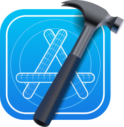</a> | **📂 檔名:** `xcode.svg` ✨ **格式:** `Vector (SVG)` ⚖️ **大小:** `41.89KB` 📅 **更新:** `2026-03-02`  🚀 **jsDelivr Markdown:** `` 🔗 **直接連結 (Url):** <code>https://cdn.jsdelivr.net/gh/barry028/materials@main/images/iCons/Brands/xcode.svg</code> 📥 [檢視原始檔](xcode.svg) |
| <a href="xero.svg">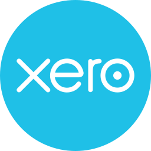</a> | **📂 檔名:** `xero.svg` ✨ **格式:** `Vector (SVG)` ⚖️ **大小:** `4.54KB` 📅 **更新:** `2026-03-02`  🚀 **jsDelivr Markdown:** `` 🔗 **直接連結 (Url):** <code>https://cdn.jsdelivr.net/gh/barry028/materials@main/images/iCons/Brands/xero.svg</code> 📥 [檢視原始檔](xero.svg) |
|  | **📂 檔名:** `xray-for-jira.svg` ✨ **格式:** `Vector (SVG)` ⚖️ **大小:** `2.08KB` 📅 **更新:** `2026-03-02`  🚀 **jsDelivr Markdown:** `` 🔗 **直接連結 (Url):** <code>https://cdn.jsdelivr.net/gh/barry028/materials@main/images/iCons/Brands/xray-for-jira.svg</code> 📥 [檢視原始檔](xray-for-jira.svg) |
|  | **📂 檔名:** `xstate.svg` ✨ **格式:** `Vector (SVG)` ⚖️ **大小:** `2.87KB` 📅 **更新:** `2026-03-02`  🚀 **jsDelivr Markdown:** `` 🔗 **直接連結 (Url):** <code>https://cdn.jsdelivr.net/gh/barry028/materials@main/images/iCons/Brands/xstate.svg</code> 📥 [檢視原始檔](xstate.svg) |
|  | **📂 檔名:** `xtend.svg` ✨ **格式:** `Vector (SVG)` ⚖️ **大小:** `1.32KB` 📅 **更新:** `2026-03-02`  🚀 **jsDelivr Markdown:** `` 🔗 **直接連結 (Url):** <code>https://cdn.jsdelivr.net/gh/barry028/materials@main/images/iCons/Brands/xtend.svg</code> 📥 [檢視原始檔](xtend.svg) |
|  | **📂 檔名:** `xwiki-icon.svg` ✨ **格式:** `Vector (SVG)` ⚖️ **大小:** `2.67KB` 📅 **更新:** `2026-03-02`  🚀 **jsDelivr Markdown:** `` 🔗 **直接連結 (Url):** <code>https://cdn.jsdelivr.net/gh/barry028/materials@main/images/iCons/Brands/xwiki-icon.svg</code> 📥 [檢視原始檔](xwiki-icon.svg) |
|  | **📂 檔名:** `xwiki.svg` ✨ **格式:** `Vector (SVG)` ⚖️ **大小:** `5.03KB` 📅 **更新:** `2026-03-02`  🚀 **jsDelivr Markdown:** `` 🔗 **直接連結 (Url):** <code>https://cdn.jsdelivr.net/gh/barry028/materials@main/images/iCons/Brands/xwiki.svg</code> 📥 [檢視原始檔](xwiki.svg) |
|  | **📂 檔名:** `yahoo.svg` ✨ **格式:** `Vector (SVG)` ⚖️ **大小:** `3.14KB` 📅 **更新:** `2026-03-02`  🚀 **jsDelivr Markdown:** `` 🔗 **直接連結 (Url):** <code>https://cdn.jsdelivr.net/gh/barry028/materials@main/images/iCons/Brands/yahoo.svg</code> 📥 [檢視原始檔](yahoo.svg) |
| <a href="yaml.svg">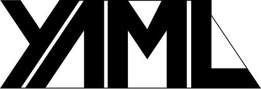</a> | **📂 檔名:** `yaml.svg` ✨ **格式:** `Vector (SVG)` ⚖️ **大小:** `1.68KB` 📅 **更新:** `2026-03-02`  🚀 **jsDelivr Markdown:** `` 🔗 **直接連結 (Url):** <code>https://cdn.jsdelivr.net/gh/barry028/materials@main/images/iCons/Brands/yaml.svg</code> 📥 [檢視原始檔](yaml.svg) |
|  | **📂 檔名:** `yammer.svg` ✨ **格式:** `Vector (SVG)` ⚖️ **大小:** `2.12KB` 📅 **更新:** `2026-03-02`  🚀 **jsDelivr Markdown:** `` 🔗 **直接連結 (Url):** <code>https://cdn.jsdelivr.net/gh/barry028/materials@main/images/iCons/Brands/yammer.svg</code> 📥 [檢視原始檔](yammer.svg) |
| <a href="yandex-ru.svg">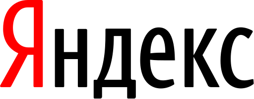</a> | **📂 檔名:** `yandex-ru.svg` ✨ **格式:** `Vector (SVG)` ⚖️ **大小:** `5.40KB` 📅 **更新:** `2026-03-02`  🚀 **jsDelivr Markdown:** `` 🔗 **直接連結 (Url):** <code>https://cdn.jsdelivr.net/gh/barry028/materials@main/images/iCons/Brands/yandex-ru.svg</code> 📥 [檢視原始檔](yandex-ru.svg) |
| <a href="yarn.svg">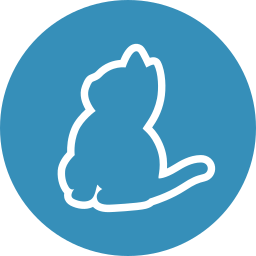</a> | **📂 檔名:** `yarn.svg` ✨ **格式:** `Vector (SVG)` ⚖️ **大小:** `4.60KB` 📅 **更新:** `2026-03-02`  🚀 **jsDelivr Markdown:** `` 🔗 **直接連結 (Url):** <code>https://cdn.jsdelivr.net/gh/barry028/materials@main/images/iCons/Brands/yarn.svg</code> 📥 [檢視原始檔](yarn.svg) |
|  | **📂 檔名:** `ycombinator.svg` ✨ **格式:** `Vector (SVG)` ⚖️ **大小:** `1.08KB` 📅 **更新:** `2026-03-02`  🚀 **jsDelivr Markdown:** `` 🔗 **直接連結 (Url):** <code>https://cdn.jsdelivr.net/gh/barry028/materials@main/images/iCons/Brands/ycombinator.svg</code> 📥 [檢視原始檔](ycombinator.svg) |
|  | **📂 檔名:** `yeoman.svg` ✨ **格式:** `Vector (SVG)` ⚖️ **大小:** `10.66KB` 📅 **更新:** `2026-03-02`  🚀 **jsDelivr Markdown:** `` 🔗 **直接連結 (Url):** <code>https://cdn.jsdelivr.net/gh/barry028/materials@main/images/iCons/Brands/yeoman.svg</code> 📥 [檢視原始檔](yeoman.svg) |
|  | **📂 檔名:** `yii.svg` ✨ **格式:** `Vector (SVG)` ⚖️ **大小:** `4.94KB` 📅 **更新:** `2026-03-02`  🚀 **jsDelivr Markdown:** `` 🔗 **直接連結 (Url):** <code>https://cdn.jsdelivr.net/gh/barry028/materials@main/images/iCons/Brands/yii.svg</code> 📥 [檢視原始檔](yii.svg) |
| <a href="youtrack.svg">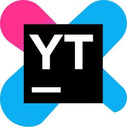</a> | **📂 檔名:** `youtrack.svg` ✨ **格式:** `Vector (SVG)` ⚖️ **大小:** `2.97KB` 📅 **更新:** `2026-03-02`  🚀 **jsDelivr Markdown:** `` 🔗 **直接連結 (Url):** <code>https://cdn.jsdelivr.net/gh/barry028/materials@main/images/iCons/Brands/youtrack.svg</code> 📥 [檢視原始檔](youtrack.svg) |
|  | **📂 檔名:** `youtube-icon.svg` ✨ **格式:** `Vector (SVG)` ⚖️ **大小:** `1023.00B` 📅 **更新:** `2026-03-02`  🚀 **jsDelivr Markdown:** `` 🔗 **直接連結 (Url):** <code>https://cdn.jsdelivr.net/gh/barry028/materials@main/images/iCons/Brands/youtube-icon.svg</code> 📥 [檢視原始檔](youtube-icon.svg) |
|  | **📂 檔名:** `youtube.svg` ✨ **格式:** `Vector (SVG)` ⚖️ **大小:** `8.07KB` 📅 **更新:** `2026-03-02`  🚀 **jsDelivr Markdown:** `` 🔗 **直接連結 (Url):** <code>https://cdn.jsdelivr.net/gh/barry028/materials@main/images/iCons/Brands/youtube.svg</code> 📥 [檢視原始檔](youtube.svg) |
|  | **📂 檔名:** `yugabyte-icon.svg` ✨ **格式:** `Vector (SVG)` ⚖️ **大小:** `2.67KB` 📅 **更新:** `2026-03-02`  🚀 **jsDelivr Markdown:** `` 🔗 **直接連結 (Url):** <code>https://cdn.jsdelivr.net/gh/barry028/materials@main/images/iCons/Brands/yugabyte-icon.svg</code> 📥 [檢視原始檔](yugabyte-icon.svg) |
|  | **📂 檔名:** `yugabyte.svg` ✨ **格式:** `Vector (SVG)` ⚖️ **大小:** `8.72KB` 📅 **更新:** `2026-03-02`  🚀 **jsDelivr Markdown:** `` 🔗 **直接連結 (Url):** <code>https://cdn.jsdelivr.net/gh/barry028/materials@main/images/iCons/Brands/yugabyte.svg</code> 📥 [檢視原始檔](yugabyte.svg) |
|  | **📂 檔名:** `zabbix.svg` ✨ **格式:** `Vector (SVG)` ⚖️ **大小:** `3.79KB` 📅 **更新:** `2026-03-02`  🚀 **jsDelivr Markdown:** `` 🔗 **直接連結 (Url):** <code>https://cdn.jsdelivr.net/gh/barry028/materials@main/images/iCons/Brands/zabbix.svg</code> 📥 [檢視原始檔](zabbix.svg) |
|  | **📂 檔名:** `zapier.svg` ✨ **格式:** `Vector (SVG)` ⚖️ **大小:** `7.15KB` 📅 **更新:** `2026-03-02`  🚀 **jsDelivr Markdown:** `` 🔗 **直接連結 (Url):** <code>https://cdn.jsdelivr.net/gh/barry028/materials@main/images/iCons/Brands/zapier.svg</code> 📥 [檢視原始檔](zapier.svg) |
|  | **📂 檔名:** `zend-framework.svg` ✨ **格式:** `Vector (SVG)` ⚖️ **大小:** `1.10KB` 📅 **更新:** `2026-03-02`  🚀 **jsDelivr Markdown:** `` 🔗 **直接連結 (Url):** <code>https://cdn.jsdelivr.net/gh/barry028/materials@main/images/iCons/Brands/zend-framework.svg</code> 📥 [檢視原始檔](zend-framework.svg) |
|  | **📂 檔名:** `zendesk-icon.svg` ✨ **格式:** `Vector (SVG)` ⚖️ **大小:** `778.00B` 📅 **更新:** `2026-03-02`  🚀 **jsDelivr Markdown:** `` 🔗 **直接連結 (Url):** <code>https://cdn.jsdelivr.net/gh/barry028/materials@main/images/iCons/Brands/zendesk-icon.svg</code> 📥 [檢視原始檔](zendesk-icon.svg) |
|  | **📂 檔名:** `zendesk.svg` ✨ **格式:** `Vector (SVG)` ⚖️ **大小:** `4.80KB` 📅 **更新:** `2026-03-02`  🚀 **jsDelivr Markdown:** `` 🔗 **直接連結 (Url):** <code>https://cdn.jsdelivr.net/gh/barry028/materials@main/images/iCons/Brands/zendesk.svg</code> 📥 [檢視原始檔](zendesk.svg) |
|  | **📂 檔名:** `zenhub-icon.svg` ✨ **格式:** `Vector (SVG)` ⚖️ **大小:** `4.08KB` 📅 **更新:** `2026-03-02`  🚀 **jsDelivr Markdown:** `` 🔗 **直接連結 (Url):** <code>https://cdn.jsdelivr.net/gh/barry028/materials@main/images/iCons/Brands/zenhub-icon.svg</code> 📥 [檢視原始檔](zenhub-icon.svg) |
|  | **📂 檔名:** `zenhub.svg` ✨ **格式:** `Vector (SVG)` ⚖️ **大小:** `9.93KB` 📅 **更新:** `2026-03-02`  🚀 **jsDelivr Markdown:** `` 🔗 **直接連結 (Url):** <code>https://cdn.jsdelivr.net/gh/barry028/materials@main/images/iCons/Brands/zenhub.svg</code> 📥 [檢視原始檔](zenhub.svg) |
| <a href="zeplin.svg">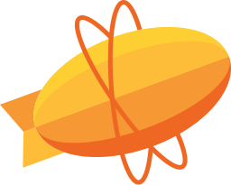</a> | **📂 檔名:** `zeplin.svg` ✨ **格式:** `Vector (SVG)` ⚖️ **大小:** `4.42KB` 📅 **更新:** `2026-03-02`  🚀 **jsDelivr Markdown:** `` 🔗 **直接連結 (Url):** <code>https://cdn.jsdelivr.net/gh/barry028/materials@main/images/iCons/Brands/zeplin.svg</code> 📥 [檢視原始檔](zeplin.svg) |
|  | **📂 檔名:** `zeroheight-icon.svg` ✨ **格式:** `Vector (SVG)` ⚖️ **大小:** `1000.00B` 📅 **更新:** `2026-03-02`  🚀 **jsDelivr Markdown:** `` 🔗 **直接連結 (Url):** <code>https://cdn.jsdelivr.net/gh/barry028/materials@main/images/iCons/Brands/zeroheight-icon.svg</code> 📥 [檢視原始檔](zeroheight-icon.svg) |
|  | **📂 檔名:** `zeroheight.svg` ✨ **格式:** `Vector (SVG)` ⚖️ **大小:** `14.23KB` 📅 **更新:** `2026-03-02`  🚀 **jsDelivr Markdown:** `` 🔗 **直接連結 (Url):** <code>https://cdn.jsdelivr.net/gh/barry028/materials@main/images/iCons/Brands/zeroheight.svg</code> 📥 [檢視原始檔](zeroheight.svg) |
|  | **📂 檔名:** `zig.svg` ✨ **格式:** `Vector (SVG)` ⚖️ **大小:** `1.92KB` 📅 **更新:** `2026-03-02`  🚀 **jsDelivr Markdown:** `` 🔗 **直接連結 (Url):** <code>https://cdn.jsdelivr.net/gh/barry028/materials@main/images/iCons/Brands/zig.svg</code> 📥 [檢視原始檔](zig.svg) |
| <a href="zod.svg">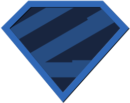</a> | **📂 檔名:** `zod.svg` ✨ **格式:** `Vector (SVG)` ⚖️ **大小:** `1.89KB` 📅 **更新:** `2026-03-02`  🚀 **jsDelivr Markdown:** `` 🔗 **直接連結 (Url):** <code>https://cdn.jsdelivr.net/gh/barry028/materials@main/images/iCons/Brands/zod.svg</code> 📥 [檢視原始檔](zod.svg) |
|  | **📂 檔名:** `zoho.svg` ✨ **格式:** `Vector (SVG)` ⚖️ **大小:** `6.92KB` 📅 **更新:** `2026-03-02`  🚀 **jsDelivr Markdown:** `` 🔗 **直接連結 (Url):** <code>https://cdn.jsdelivr.net/gh/barry028/materials@main/images/iCons/Brands/zoho.svg</code> 📥 [檢視原始檔](zoho.svg) |
|  | **📂 檔名:** `zoom-icon.svg` ✨ **格式:** `Vector (SVG)` ⚖️ **大小:** `1.91KB` 📅 **更新:** `2026-03-02`  🚀 **jsDelivr Markdown:** `` 🔗 **直接連結 (Url):** <code>https://cdn.jsdelivr.net/gh/barry028/materials@main/images/iCons/Brands/zoom-icon.svg</code> 📥 [檢視原始檔](zoom-icon.svg) |
|  | **📂 檔名:** `zoom.svg` ✨ **格式:** `Vector (SVG)` ⚖️ **大小:** `2.76KB` 📅 **更新:** `2026-03-02`  🚀 **jsDelivr Markdown:** `` 🔗 **直接連結 (Url):** <code>https://cdn.jsdelivr.net/gh/barry028/materials@main/images/iCons/Brands/zoom.svg</code> 📥 [檢視原始檔](zoom.svg) |
| <a href="zorin-os.svg">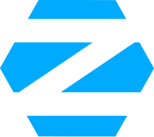</a> | **📂 檔名:** `zorin-os.svg` ✨ **格式:** `Vector (SVG)` ⚖️ **大小:** `829.00B` 📅 **更新:** `2026-03-02`  🚀 **jsDelivr Markdown:** `` 🔗 **直接連結 (Url):** <code>https://cdn.jsdelivr.net/gh/barry028/materials@main/images/iCons/Brands/zorin-os.svg</code> 📥 [檢視原始檔](zorin-os.svg) |
|  | **📂 檔名:** `zube.svg` ✨ **格式:** `Vector (SVG)` ⚖️ **大小:** `704.00B` 📅 **更新:** `2026-03-02`  🚀 **jsDelivr Markdown:** `` 🔗 **直接連結 (Url):** <code>https://cdn.jsdelivr.net/gh/barry028/materials@main/images/iCons/Brands/zube.svg</code> 📥 [檢視原始檔](zube.svg) |
|  | **📂 檔名:** `zulip-icon.svg` ✨ **格式:** `Vector (SVG)` ⚖️ **大小:** `1.78KB` 📅 **更新:** `2026-03-02`  🚀 **jsDelivr Markdown:** `` 🔗 **直接連結 (Url):** <code>https://cdn.jsdelivr.net/gh/barry028/materials@main/images/iCons/Brands/zulip-icon.svg</code> 📥 [檢視原始檔](zulip-icon.svg) |
|  | **📂 檔名:** `zulip.svg` ✨ **格式:** `Vector (SVG)` ⚖️ **大小:** `3.17KB` 📅 **更新:** `2026-03-02`  🚀 **jsDelivr Markdown:** `` 🔗 **直接連結 (Url):** <code>https://cdn.jsdelivr.net/gh/barry028/materials@main/images/iCons/Brands/zulip.svg</code> 📥 [檢視原始檔](zulip.svg) |
|  | **📂 檔名:** `zwave.svg` ✨ **格式:** `Vector (SVG)` ⚖️ **大小:** `1.92KB` 📅 **更新:** `2026-03-02`  🚀 **jsDelivr Markdown:** `` 🔗 **直接連結 (Url):** <code>https://cdn.jsdelivr.net/gh/barry028/materials@main/images/iCons/Brands/zwave.svg</code> 📥 [檢視原始檔](zwave.svg) |