# 🖼️ Brands

[⬅️ 返回主目錄](../../../README.md)

| 預覽 | 資訊 |
| :--- | :--- |
|  | **100tb.svg** |
|  | **500px.svg** |
|  | **active-campaign-icon.svg** |
|  | **active-campaign.svg** |
|  | **adobe-after-effects.svg** |
|  | **adobe-animate.svg** |
|  | **adobe-dreamweaver.svg** |
|  | **adobe-illustrator.svg** |
|  | **adobe-incopy.svg** |
|  | **adobe-indesign.svg** |
|  | **adobe-lightroom.svg** |
|  | **adobe-photoshop.svg** |
|  | **adobe-premiere.svg** |
|  | **adobe-xd.svg** |
|  | **adonisjs-icon.svg** |
|  | **adonisjs.svg** |
|  | **adroll.svg** |
|  | **adyen.svg** |
|  | **aerogear.svg** |
|  | **aerospike-icon.svg** |
|  | **aerospike.svg** |
|  | **aha.svg** |
|  | **airbnb-icon.svg** |
|  | **airbnb.svg** |
|  | **airbrake.svg** |
|  | **airflow-icon.svg** |
|  | **airflow.svg** |
|  | **airtable.svg** |
|  | **aix.svg** |
|  | **akamai.svg** |
|  | **akka.svg** |
|  | **alfresco.svg** |
|  | **algolia.svg** |
|  | **alpinejs-icon.svg** |
|  | **alpinejs.svg** |
|  | **altair.svg** |
|  | **amazon-chime.svg** |
|  | **amazon-connect.svg** |
|  | **amd.svg** |
|  | **amex-digital.svg** |
|  | **amex.svg** |
|  | **amp-icon.svg** |
|  | **amp.svg** |
|  | **ampersand.svg** |
|  | **amplication-icon.svg** |
|  | **amplication.svg** |
|  | **amplitude-icon.svg** |
|  | **amplitude.svg** |
|  | **android-icon.svg** |
|  | **android-vertical.svg** |
|  | **android.svg** |
|  | **angellist.svg** |
|  | **angular-icon.svg** |
|  | **angular.svg** |
|  | **ansible.svg** |
|  | **ant-design.svg** |
|  | **apache-camel.svg** |
|  | **apache.svg** |
|  | **apache_cloudstack.svg** |
|  | **apiary.svg** |
|  | **apollostack.svg** |
|  | **apostrophe.svg** |
|  | **appbaseio-icon.svg** |
|  | **appbaseio.svg** |
|  | **appcenter-icon.svg** |
|  | **appcenter.svg** |
|  | **appcircle-icon.svg** |
|  | **appcircle.svg** |
|  | **appcode.svg** |
|  | **appdynamics-icon.svg** |
|  | **appdynamics.svg** |
|  | **appium.svg** |
|  | **apple-app-store.svg** |
|  | **apple-pay.svg** |
|  | **apple.svg** |
|  | **applitools-icon.svg** |
|  | **applitools.svg** |
|  | **appsignal-icon.svg** |
|  | **appsignal.svg** |
|  | **apptentive.svg** |
|  | **appveyor.svg** |
|  | **appwrite-icon.svg** |
|  | **appwrite.svg** |
|  | **arangodb-icon.svg** |
|  | **arangodb.svg** |
|  | **arc.svg** |
|  | **architect-icon.svg** |
|  | **architect.svg** |
|  | **archlinux.svg** |
| <a href="arduino.svg">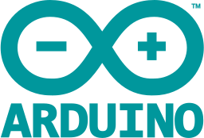</a> | **arduino.svg** |
|  | **argo-icon.svg** |
|  | **argo.svg** |
|  | **arm.svg** |
|  | **armory-icon.svg** |
|  | **armory.svg** |
|  | **asana-icon.svg** |
|  | **asana.svg** |
|  | **asciidoctor.svg** |
|  | **assembla-icon.svg** |
|  | **assembla.svg** |
|  | **astro-icon.svg** |
|  | **astro.svg** |
|  | **astronomer.svg** |
|  | **async-api-icon.svg** |
|  | **async-api.svg** |
|  | **atlassian.svg** |
|  | **atom-icon.svg** |
|  | **atom.svg** |
|  | **atomic-icon.svg** |
|  | **atomic.svg** |
|  | **atomicojs-icon.svg** |
|  | **atomicojs.svg** |
|  | **aurelia.svg** |
|  | **aurora.svg** |
|  | **auth0-icon.svg** |
|  | **auth0.svg** |
|  | **authy.svg** |
|  | **autoit.svg** |
|  | **autoprefixer.svg** |
|  | **ava.svg** |
|  | **awesome.svg** |
|  | **aws-amplify.svg** |
|  | **aws-api-gateway.svg** |
|  | **aws-app-mesh.svg** |
|  | **aws-appflow.svg** |
|  | **aws-appsync.svg** |
|  | **aws-athena.svg** |
|  | **aws-aurora.svg** |
|  | **aws-backup.svg** |
|  | **aws-batch.svg** |
|  | **aws-certificate-manager.svg** |
|  | **aws-cloudformation.svg** |
|  | **aws-cloudfront.svg** |
|  | **aws-cloudsearch.svg** |
|  | **aws-cloudtrail.svg** |
|  | **aws-cloudwatch.svg** |
|  | **aws-codebuild.svg** |
|  | **aws-codecommit.svg** |
|  | **aws-codedeploy.svg** |
|  | **aws-codepipeline.svg** |
|  | **aws-codestar.svg** |
|  | **aws-cognito.svg** |
|  | **aws-config.svg** |
|  | **aws-documentdb.svg** |
|  | **aws-dynamodb.svg** |
|  | **aws-ec2.svg** |
|  | **aws-ecs.svg** |
|  | **aws-eks.svg** |
|  | **aws-elastic-beanstalk.svg** |
|  | **aws-elasticache.svg** |
|  | **aws-elb.svg** |
|  | **aws-eventbridge.svg** |
| <a href="aws-fargate.svg">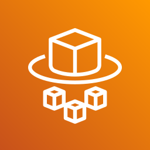</a> | **aws-fargate.svg** |
|  | **aws-glacier.svg** |
|  | **aws-glue.svg** |
|  | **aws-iam.svg** |
|  | **aws-keyspaces.svg** |
|  | **aws-kinesis.svg** |
|  | **aws-kms.svg** |
|  | **aws-lake-formation.svg** |
|  | **aws-lambda.svg** |
|  | **aws-lightsail.svg** |
|  | **aws-mq.svg** |
|  | **aws-msk.svg** |
|  | **aws-neptune.svg** |
|  | **aws-open-search.svg** |
|  | **aws-opsworks.svg** |
|  | **aws-quicksight.svg** |
|  | **aws-rds.svg** |
|  | **aws-redshift.svg** |
|  | **aws-route53.svg** |
|  | **aws-s3.svg** |
|  | **aws-secrets-manager.svg** |
|  | **aws-ses.svg** |
|  | **aws-shield.svg** |
|  | **aws-sns.svg** |
|  | **aws-sqs.svg** |
|  | **aws-step-functions.svg** |
|  | **aws-systems-manager.svg** |
|  | **aws-timestream.svg** |
|  | **aws-vpc.svg** |
|  | **aws-waf.svg** |
|  | **aws-xray.svg** |
|  | **aws.svg** |
|  | **axios.svg** |
|  | **babel.svg** |
|  | **backbone-icon.svg** |
|  | **backbone.svg** |
|  | **backerkit.svg** |
|  | **baker-street.svg** |
|  | **balena.svg** |
|  | **bamboo.svg** |
|  | **basecamp-icon.svg** |
|  | **basecamp.svg** |
|  | **basekit.svg** |
|  | **baseline.svg** |
|  | **bash-icon.svg** |
| <a href="bash.svg">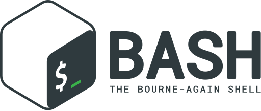</a> | **bash.svg** |
|  | **batch.svg** |
|  | **beats.svg** |
|  | **behance.svg** |
|  | **bem-2.svg** |
|  | **bem.svg** |
|  | **bigpanda.svg** |
|  | **bing.svg** |
|  | **bitbar.svg** |
|  | **bitbucket.svg** |
|  | **bitcoin.svg** |
|  | **bitnami.svg** |
|  | **bitrise-icon.svg** |
|  | **bitrise.svg** |
|  | **blender.svg** |
|  | **blitzjs-icon.svg** |
|  | **blitzjs.svg** |
|  | **blocs.svg** |
|  | **blogger.svg** |
|  | **blossom.svg** |
|  | **blueprint.svg** |
|  | **bluetooth.svg** |
|  | **booqable-icon.svg** |
|  | **booqable.svg** |
|  | **bootstrap.svg** |
|  | **bosun.svg** |
|  | **botanalytics.svg** |
|  | **bourbon.svg** |
|  | **bower.svg** |
|  | **box.svg** |
|  | **brackets.svg** |
|  | **brainjs.svg** |
|  | **branch-icon.svg** |
|  | **branch.svg** |
|  | **brandfolder-icon.svg** |
|  | **brandfolder.svg** |
|  | **brave.svg** |
|  | **braze-icon.svg** |
|  | **braze.svg** |
|  | **broadcom-icon.svg** |
|  | **broadcom.svg** |
|  | **broccoli.svg** |
|  | **brotli.svg** |
|  | **browserify-icon.svg** |
|  | **browserify.svg** |
|  | **browserling.svg** |
|  | **browserslist.svg** |
|  | **browserstack.svg** |
|  | **browsersync.svg** |
|  | **brunch.svg** |
| <a href="bubble-icon.svg">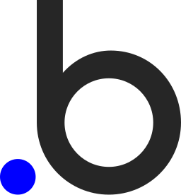</a> | **bubble-icon.svg** |
|  | **bubble.svg** |
|  | **buck.svg** |
|  | **buddy.svg** |
|  | **buffer.svg** |
|  | **bugherd-icon.svg** |
|  | **bugherd.svg** |
|  | **bugsee.svg** |
|  | **bugsnag.svg** |
|  | **builder-io-icon.svg** |
|  | **builder-io.svg** |
|  | **buildkite-icon.svg** |
|  | **buildkite.svg** |
|  | **bulma.svg** |
|  | **bun.svg** |
|  | **bunny-net-icon.svg** |
|  | **bunny-net.svg** |
|  | **c-plusplus.svg** |
|  | **c-sharp.svg** |
|  | **c.svg** |
|  | **cachet.svg** |
|  | **cakephp-icon.svg** |
|  | **cakephp.svg** |
|  | **calibre-icon.svg** |
|  | **calibre.svg** |
|  | **campaignmonitor-icon.svg** |
|  | **campaignmonitor.svg** |
|  | **canjs.svg** |
|  | **capacitorjs-icon.svg** |
|  | **capacitorjs.svg** |
|  | **capistrano.svg** |
|  | **carbide.svg** |
|  | **cardano-icon.svg** |
|  | **cardano.svg** |
|  | **cassandra.svg** |
|  | **centos-icon.svg** |
|  | **centos.svg** |
|  | **certbot.svg** |
|  | **ceylon.svg** |
|  | **chai.svg** |
|  | **chalk.svg** |
|  | **chargebee-icon.svg** |
|  | **chargebee.svg** |
|  | **chef.svg** |
|  | **chevereto.svg** |
| <a href="chroma.svg">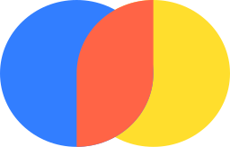</a> | **chroma.svg** |
|  | **chromatic-icon.svg** |
|  | **chromatic.svg** |
|  | **chrome-web-store.svg** |
|  | **chrome.svg** |
|  | **cinder.svg** |
|  | **circleci.svg** |
|  | **cirrus-ci.svg** |
|  | **cirrus.svg** |
|  | **clio-lang.svg** |
|  | **clion.svg** |
|  | **cljs.svg** |
|  | **clojure.svg** |
|  | **close.svg** |
|  | **cloud9.svg** |
|  | **cloudacademy-icon.svg** |
|  | **cloudacademy.svg** |
|  | **cloudcraft.svg** |
|  | **cloudflare-workers-icon.svg** |
|  | **cloudflare-workers.svg** |
|  | **cloudflare.svg** |
|  | **cloudinary-icon.svg** |
|  | **cloudinary.svg** |
|  | **cloudlinux.svg** |
|  | **cobalt.svg** |
|  | **cockpit.svg** |
|  | **cocoapods.svg** |
|  | **coda-icon.svg** |
|  | **coda.svg** |
|  | **codacy.svg** |
|  | **codebase.svg** |
|  | **codebeat.svg** |
|  | **codecademy.svg** |
|  | **codeception.svg** |
|  | **codeclimate-icon.svg** |
|  | **codeclimate.svg** |
|  | **codecov-icon.svg** |
|  | **codecov.svg** |
|  | **codefactor-icon.svg** |
|  | **codefactor.svg** |
|  | **codeigniter-icon.svg** |
|  | **codeigniter.svg** |
|  | **codepen-icon.svg** |
|  | **codepen.svg** |
|  | **codersrank-icon.svg** |
|  | **codersrank.svg** |
|  | **coderwall.svg** |
|  | **codesandbox-icon.svg** |
|  | **codesandbox.svg** |
|  | **codesee-icon.svg** |
|  | **codesee.svg** |
|  | **codio.svg** |
|  | **coffeescript.svg** |
|  | **commitizen.svg** |
|  | **compass.svg** |
|  | **componentkit.svg** |
|  | **compose-multiplatform.svg** |
|  | **compose.svg** |
|  | **composer.svg** |
|  | **conan-io.svg** |
|  | **concourse.svg** |
|  | **concretecms-icon.svg** |
|  | **concretecms.svg** |
|  | **conda.svg** |
| <a href="confluence.svg">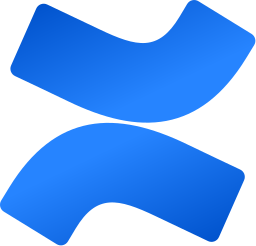</a> | **confluence.svg** |
|  | **consul.svg** |
|  | **contentful.svg** |
|  | **convox-icon.svg** |
|  | **convox.svg** |
|  | **copyleft-pirate.svg** |
|  | **copyleft.svg** |
|  | **corda.svg** |
|  | **cordova.svg** |
|  | **couchbase.svg** |
|  | **couchdb-icon.svg** |
|  | **couchdb.svg** |
|  | **coursera.svg** |
|  | **coveralls.svg** |
|  | **cpanel.svg** |
|  | **craftcms.svg** |
|  | **crashlytics.svg** |
|  | **crateio.svg** |
|  | **create-react-app.svg** |
|  | **createjs.svg** |
|  | **crucible.svg** |
|  | **crystal.svg** |
|  | **css-3.svg** |
|  | **css-3_official.svg** |
|  | **cssnext.svg** |
|  | **cube-icon.svg** |
|  | **cube.svg** |
|  | **cucumber.svg** |
|  | **curl.svg** |
|  | **customerio-icon.svg** |
|  | **customerio.svg** |
|  | **cyclejs.svg** |
|  | **cypress-icon.svg** |
|  | **cypress.svg** |
|  | **d3.svg** |
|  | **dailydev-icon.svg** |
|  | **dailydev.svg** |
|  | **daisyUI.svg** |
|  | **danfo.svg** |
|  | **dart.svg** |
|  | **dashlane-icon.svg** |
|  | **dashlane.svg** |
|  | **data-station.svg** |
|  | **database-labs.svg** |
|  | **datadog.svg** |
|  | **datagrip.svg** |
|  | **dataspell.svg** |
|  | **datocms-icon.svg** |
|  | **datocms.svg** |
|  | **dbt-icon.svg** |
|  | **dbt.svg** |
|  | **dcos-icon.svg** |
|  | **dcos.svg** |
|  | **debian.svg** |
| <a href="delighted-icon.svg">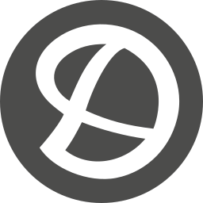</a> | **delighted-icon.svg** |
|  | **delighted.svg** |
|  | **deno.svg** |
|  | **dependabot.svg** |
|  | **deployhq-icon.svg** |
|  | **deployhq.svg** |
|  | **derby.svg** |
|  | **descript-icon.svg** |
|  | **descript.svg** |
|  | **designernews.svg** |
|  | **deviantart-icon.svg** |
|  | **deviantart.svg** |
|  | **dgraph-icon.svg** |
|  | **dgraph.svg** |
|  | **dialogflow.svg** |
|  | **digital-ocean.svg** |
|  | **dimer.svg** |
|  | **dinersclub.svg** |
|  | **discord-icon.svg** |
|  | **discord.svg** |
|  | **discourse-icon.svg** |
|  | **discourse.svg** |
|  | **discover.svg** |
|  | **disqus.svg** |
|  | **django-icon.svg** |
|  | **django.svg** |
|  | **dockbit.svg** |
|  | **docker-icon.svg** |
|  | **docker.svg** |
|  | **doctrine.svg** |
|  | **docusaurus.svg** |
|  | **dojo-icon.svg** |
|  | **dojo-toolkit.svg** |
|  | **dojo.svg** |
| <a href="dolt.svg">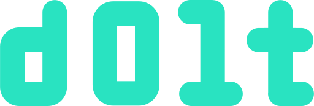</a> | **dolt.svg** |
|  | **dotnet.svg** |
|  | **dovetail-icon.svg** |
|  | **dovetail.svg** |
|  | **dreamhost.svg** |
|  | **dribbble-icon.svg** |
|  | **dribbble.svg** |
|  | **drift.svg** |
|  | **drip.svg** |
|  | **drizzle-icon.svg** |
|  | **drizzle.svg** |
|  | **drone-icon.svg** |
|  | **drone.svg** |
|  | **drools-icon.svg** |
|  | **drools.svg** |
|  | **dropbox.svg** |
|  | **dropmark.svg** |
|  | **dropzone.svg** |
|  | **drupal-icon.svg** |
|  | **drupal.svg** |
|  | **duckduckgo.svg** |
|  | **dynatrace-icon.svg** |
|  | **dynatrace.svg** |
|  | **dyndns.svg** |
|  | **ebanx.svg** |
|  | **eclipse-icon.svg** |
|  | **eclipse.svg** |
|  | **ecma.svg** |
|  | **edgedb.svg** |
|  | **edgio-icon.svg** |
|  | **edgio.svg** |
|  | **editorconfig.svg** |
|  | **egghead.svg** |
|  | **elasticpath-icon.svg** |
|  | **elasticpath.svg** |
|  | **elasticsearch.svg** |
|  | **electron.svg** |
|  | **element.svg** |
|  | **elemental-ui.svg** |
|  | **elementary.svg** |
|  | **eleventy.svg** |
|  | **ello.svg** |
|  | **elm-classic.svg** |
|  | **elm.svg** |
|  | **elo.svg** |
|  | **emacs-classic.svg** |
|  | **emacs.svg** |
|  | **embedly.svg** |
|  | **ember-tomster.svg** |
|  | **ember.svg** |
|  | **emmet.svg** |
|  | **enact.svg** |
|  | **engine-yard-icon.svg** |
|  | **engine-yard.svg** |
|  | **envato.svg** |
|  | **envoy-icon.svg** |
|  | **envoy.svg** |
|  | **envoyer.svg** |
|  | **epsagon-icon.svg** |
|  | **epsagon.svg** |
|  | **eraser-icon.svg** |
|  | **eraser.svg** |
|  | **erlang.svg** |
|  | **esbuild.svg** |
|  | **esdoc.svg** |
|  | **eslint-old.svg** |
|  | **eslint.svg** |
|  | **eta-icon.svg** |
|  | **eta.svg** |
|  | **etcd.svg** |
|  | **ethereum-color.svg** |
|  | **ethereum.svg** |
|  | **ethers.svg** |
|  | **ethnio.svg** |
|  | **eventbrite-icon.svg** |
|  | **eventbrite.svg** |
|  | **eventsentry.svg** |
|  | **evergreen-icon.svg** |
|  | **evergreen.svg** |
|  | **expo-icon.svg** |
|  | **expo.svg** |
|  | **express.svg** |
|  | **fabric.svg** |
|  | **facebook.svg** |
|  | **falcor.svg** |
|  | **fastify-icon.svg** |
|  | **fastify.svg** |
|  | **fastlane.svg** |
|  | **fastly.svg** |
|  | **fauna-icon.svg** |
|  | **fauna.svg** |
|  | **feathersjs.svg** |
|  | **fedora.svg** |
|  | **fetch.svg** |
|  | **ffmpeg-icon.svg** |
|  | **ffmpeg.svg** |
|  | **figma.svg** |
|  | **firebase.svg** |
|  | **firefox.svg** |
|  | **flannel.svg** |
|  | **flarum.svg** |
|  | **flask.svg** |
|  | **flat-ui.svg** |
|  | **flattr-icon.svg** |
|  | **flattr.svg** |
|  | **fleep.svg** |
|  | **flickr-icon.svg** |
|  | **flickr.svg** |
|  | **flight.svg** |
|  | **floodio.svg** |
|  | **flow.svg** |
|  | **flowxo.svg** |
|  | **floydhub.svg** |
|  | **flutter.svg** |
|  | **flux.svg** |
|  | **fluxxor.svg** |
|  | **fly-icon.svg** |
|  | **fly.svg** |
|  | **fogbugz-icon.svg** |
|  | **fogbugz.svg** |
|  | **fomo-icon.svg** |
|  | **fomo.svg** |
|  | **font-awesome.svg** |
|  | **forestadmin-icon.svg** |
|  | **forestadmin.svg** |
|  | **forever.svg** |
|  | **formkeep.svg** |
|  | **fortran.svg** |
|  | **foundation.svg** |
|  | **foundationdb-icon.svg** |
|  | **foundationdb.svg** |
|  | **framer.svg** |
|  | **framework7-icon.svg** |
|  | **framework7.svg** |
|  | **freebsd.svg** |
|  | **freedcamp-icon.svg** |
|  | **freedcamp.svg** |
|  | **freedomdefined.svg** |
|  | **fresh.svg** |
|  | **frontapp.svg** |
|  | **fsharp.svg** |
|  | **fuchsia.svg** |
|  | **galliumos.svg** |
|  | **game-analytics-icon.svg** |
|  | **game-analytics.svg** |
|  | **ganache-icon.svg** |
|  | **ganache.svg** |
|  | **gatsby.svg** |
|  | **geekbot.svg** |
|  | **geetest-icon.svg** |
|  | **geetest.svg** |
|  | **getyourguide.svg** |
|  | **ghost.svg** |
|  | **giantswarm.svg** |
|  | **gin.svg** |
|  | **git-icon.svg** |
|  | **git.svg** |
|  | **gitboard.svg** |
|  | **github-actions.svg** |
|  | **github-copilot.svg** |
|  | **github-icon.svg** |
|  | **github-octocat.svg** |
|  | **github.svg** |
|  | **gitkraken.svg** |
|  | **gitlab.svg** |
|  | **gitter.svg** |
|  | **gitup.svg** |
|  | **glamorous-icon.svg** |
|  | **glamorous.svg** |
|  | **gleam.svg** |
|  | **glimmerjs.svg** |
|  | **glint.svg** |
|  | **glitch-icon.svg** |
|  | **glitch.svg** |
|  | **gnome-icon.svg** |
|  | **gnome.svg** |
|  | **gnu-net.svg** |
|  | **gnu.svg** |
|  | **gnupg-icon.svg** |
|  | **gnupg.svg** |
|  | **go.svg** |
|  | **gocd.svg** |
|  | **godot-icon.svg** |
|  | **godot.svg** |
|  | **gohorse.svg** |
|  | **goland.svg** |
|  | **google-360suite.svg** |
|  | **google-admob.svg** |
|  | **google-ads.svg** |
|  | **google-adsense.svg** |
|  | **google-analytics.svg** |
|  | **google-bard-icon.svg** |
|  | **google-bard.svg** |
|  | **google-calendar.svg** |
|  | **google-cloud-functions.svg** |
|  | **google-cloud-run.svg** |
|  | **google-cloud.svg** |
|  | **google-data-studio.svg** |
|  | **google-developers.svg** |
|  | **google-domains-icon.svg** |
|  | **google-domains.svg** |
|  | **google-drive.svg** |
|  | **google-fit.svg** |
|  | **google-gmail.svg** |
|  | **google-home.svg** |
|  | **google-icon.svg** |
|  | **google-keep.svg** |
|  | **google-maps.svg** |
|  | **google-marketing-platform.svg** |
|  | **google-meet.svg** |
|  | **google-one.svg** |
|  | **google-optimize.svg** |
|  | **google-pay.svg** |
|  | **google-photos.svg** |
|  | **google-play-console-icon.svg** |
|  | **google-play-console.svg** |
|  | **google-play-icon.svg** |
|  | **google-play.svg** |
|  | **google-search-console.svg** |
|  | **google-tag-manager.svg** |
|  | **google-workspace.svg** |
|  | **google.svg** |
|  | **gopher.svg** |
|  | **gradle.svg** |
|  | **grafana.svg** |
|  | **grails.svg** |
|  | **grammarly-icon.svg** |
|  | **grammarly.svg** |
|  | **graphene.svg** |
|  | **graphql.svg** |
|  | **grav.svg** |
|  | **gravatar-icon.svg** |
|  | **gravatar.svg** |
|  | **graylog-icon.svg** |
|  | **graylog.svg** |
|  | **greensock-icon.svg** |
|  | **greensock.svg** |
|  | **gridsome-icon.svg** |
|  | **gridsome.svg** |
|  | **grommet.svg** |
|  | **groovehq.svg** |
|  | **grove.svg** |
|  | **growth-book-icon.svg** |
|  | **growth-book.svg** |
|  | **grpc.svg** |
|  | **grunt.svg** |
|  | **gulp.svg** |
|  | **gunicorn.svg** |
|  | **gunjs.svg** |
|  | **gusto.svg** |
|  | **gwt.svg** |
|  | **hack.svg** |
|  | **hacker-one.svg** |
|  | **hadoop.svg** |
|  | **haiku-icon.svg** |
|  | **haiku.svg** |
|  | **haml.svg** |
|  | **hanami.svg** |
|  | **handlebars.svg** |
|  | **hapi.svg** |
|  | **hardhat-icon.svg** |
|  | **hardhat.svg** |
|  | **harness-icon.svg** |
|  | **harness.svg** |
|  | **hashicorp-icon.svg** |
|  | **hashicorp.svg** |
|  | **hashnode-icon.svg** |
|  | **hashnode.svg** |
|  | **haskell-icon.svg** |
|  | **haskell.svg** |
|  | **hasura-icon.svg** |
|  | **hasura.svg** |
|  | **haxe.svg** |
|  | **haxl.svg** |
|  | **hbase.svg** |
|  | **hcaptcha-icon.svg** |
|  | **hcaptcha.svg** |
|  | **headlessui-icon.svg** |
|  | **headlessui.svg** |
|  | **heap-icon.svg** |
|  | **heap.svg** |
|  | **helm.svg** |
|  | **helpscout-icon.svg** |
|  | **helpscout.svg** |
|  | **hermes.svg** |
|  | **heroku-icon.svg** |
|  | **heroku-redis.svg** |
|  | **heroku.svg** |
|  | **hexo.svg** |
|  | **hhvm.svg** |
|  | **hibernate.svg** |
|  | **highcharts.svg** |
|  | **hipercard.svg** |
|  | **homebrew.svg** |
|  | **hookstate.svg** |
|  | **hootsuite-icon.svg** |
|  | **hootsuite.svg** |
|  | **hosted-graphite.svg** |
|  | **hostgator-icon.svg** |
|  | **hostgator.svg** |
|  | **hotjar-icon.svg** |
|  | **hotjar.svg** |
|  | **houndci.svg** |
|  | **html-5.svg** |
|  | **html5-boilerplate.svg** |
|  | **httpie-icon.svg** |
|  | **httpie.svg** |
|  | **hubspot.svg** |
|  | **huggy.svg** |
|  | **hugo.svg** |
|  | **humongous.svg** |
|  | **hyper.svg** |
|  | **hyperapp.svg** |
|  | **ibm.svg** |
|  | **ieee.svg** |
|  | **ietf.svg** |
|  | **ifttt.svg** |
|  | **imagemin.svg** |
|  | **imba-icon.svg** |
|  | **imba.svg** |
|  | **immer-icon.svg** |
|  | **immer.svg** |
|  | **immutable.svg** |
|  | **impala.svg** |
|  | **importio.svg** |
|  | **incident-icon.svg** |
|  | **incident.svg** |
| <a href="infer.svg">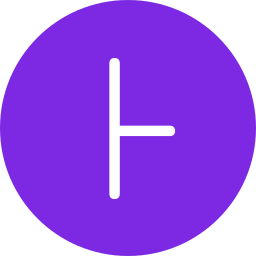</a> | **infer.svg** |
|  | **inferno.svg** |
|  | **influxdb-icon.svg** |
|  | **influxdb.svg** |
|  | **ink.svg** |
|  | **insomnia.svg** |
|  | **instagram-icon.svg** |
|  | **instagram.svg** |
|  | **intel.svg** |
|  | **intellij-idea.svg** |
|  | **intercom-icon.svg** |
|  | **intercom.svg** |
|  | **internetexplorer.svg** |
|  | **invision-icon.svg** |
|  | **invision.svg** |
|  | **ionic-icon.svg** |
|  | **ionic.svg** |
|  | **ios.svg** |
|  | **iron-icon.svg** |
|  | **iron.svg** |
|  | **itsalive-icon.svg** |
|  | **itsalive.svg** |
|  | **jade.svg** |
|  | **jamstack-icon.svg** |
|  | **jamstack.svg** |
|  | **jasmine.svg** |
|  | **java.svg** |
|  | **javascript.svg** |
|  | **jcb.svg** |
|  | **jekyll.svg** |
|  | **jenkins.svg** |
|  | **jest.svg** |
|  | **jetbrains-icon.svg** |
|  | **jetbrains-space-icon.svg** |
|  | **jetbrains-space.svg** |
|  | **jetbrains.svg** |
|  | **jfrog.svg** |
|  | **jhipster-icon.svg** |
|  | **jhipster.svg** |
|  | **jira.svg** |
|  | **joomla.svg** |
|  | **jotai.svg** |
|  | **jquery-mobile.svg** |
|  | **jquery.svg** |
|  | **jruby.svg** |
|  | **jsbin.svg** |
|  | **jsdelivr.svg** |
|  | **jsdom.svg** |
|  | **jsfiddle.svg** |
|  | **json-ld.svg** |
|  | **json.svg** |
| <a href="jspm.svg">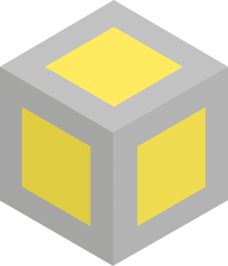</a> | **jspm.svg** |
|  | **jss.svg** |
| <a href="juju.svg">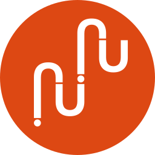</a> | **juju.svg** |
|  | **julia.svg** |
|  | **jupyter.svg** |
|  | **jwt-icon.svg** |
|  | **jwt.svg** |
|  | **kafka-icon.svg** |
|  | **kafka.svg** |
|  | **kaios.svg** |
|  | **kallithea.svg** |
|  | **karma.svg** |
|  | **katalon-icon.svg** |
|  | **katalon.svg** |
|  | **kde.svg** |
|  | **keen.svg** |
|  | **kemal.svg** |
|  | **keycdn-icon.svg** |
|  | **keycdn.svg** |
|  | **keydb-icon.svg** |
|  | **keydb.svg** |
|  | **keystonejs.svg** |
|  | **khan_academy-icon.svg** |
|  | **khan_academy.svg** |
|  | **kibana.svg** |
|  | **kickstarter-icon.svg** |
|  | **kickstarter.svg** |
|  | **kinto-icon.svg** |
|  | **kinto.svg** |
|  | **kirby-icon.svg** |
|  | **kirby.svg** |
|  | **knex.svg** |
|  | **knockout.svg** |
|  | **koa.svg** |
|  | **kong-icon.svg** |
|  | **kong.svg** |
|  | **kops.svg** |
|  | **koreio.svg** |
|  | **kotlin-icon.svg** |
|  | **kotlin.svg** |
|  | **kraken.svg** |
|  | **krakenjs.svg** |
|  | **ktor-icon.svg** |
|  | **ktor.svg** |
|  | **kubernetes.svg** |
|  | **kustomer.svg** |
|  | **languagetool.svg** |
|  | **laravel.svg** |
|  | **lastfm.svg** |
|  | **lateral-icon.svg** |
|  | **lateral.svg** |
|  | **launchdarkly-icon.svg** |
|  | **launchdarkly.svg** |
|  | **launchrock.svg** |
|  | **leaflet.svg** |
|  | **leankit-icon.svg** |
|  | **leankit.svg** |
|  | **lerna.svg** |
|  | **less.svg** |
|  | **lets-cloud.svg** |
|  | **letsencrypt.svg** |
|  | **leveldb.svg** |
|  | **lexical-icon.svg** |
|  | **lexical.svg** |
|  | **liftweb.svg** |
|  | **lighthouse.svg** |
|  | **lightstep-icon.svg** |
|  | **lightstep.svg** |
|  | **lighttpd.svg** |
|  | **linear-icon.svg** |
|  | **linear.svg** |
|  | **linkedin-icon.svg** |
|  | **linkedin.svg** |
|  | **linkerd.svg** |
|  | **linode.svg** |
|  | **linux-mint.svg** |
|  | **linux-tux.svg** |
|  | **lit-icon.svg** |
|  | **lit.svg** |
|  | **litmus.svg** |
|  | **loader.svg** |
|  | **lodash.svg** |
|  | **logentries.svg** |
|  | **logstash.svg** |
|  | **lookback.svg** |
|  | **looker-icon.svg** |
|  | **looker.svg** |
|  | **loom-icon.svg** |
|  | **loom.svg** |
|  | **loopback-icon.svg** |
|  | **loopback.svg** |
|  | **losant.svg** |
|  | **lua.svg** |
|  | **lucene.net.svg** |
|  | **lucene.svg** |
|  | **lumen.svg** |
|  | **macOS.svg** |
|  | **madge.svg** |
|  | **maestro.svg** |
|  | **mageia.svg** |
|  | **mailchimp-freddie.svg** |
|  | **mailchimp.svg** |
|  | **maildeveloper.svg** |
|  | **mailgun-icon.svg** |
|  | **mailgun.svg** |
|  | **mailjet-icon.svg** |
|  | **mailjet.svg** |
|  | **malinajs.svg** |
|  | **manjaro.svg** |
|  | **mantine-icon.svg** |
|  | **mantine.svg** |
|  | **mapbox-icon.svg** |
|  | **mapbox.svg** |
|  | **maps-me.svg** |
|  | **mapzen-icon.svg** |
|  | **mapzen.svg** |
|  | **mariadb-icon.svg** |
|  | **mariadb.svg** |
|  | **marionette.svg** |
|  | **markdown.svg** |
|  | **marko.svg** |
|  | **marvel.svg** |
|  | **mastercard.svg** |
|  | **mastodon-icon.svg** |
|  | **mastodon.svg** |
|  | **material-ui.svg** |
|  | **materializecss.svg** |
|  | **matomo-icon.svg** |
|  | **matomo.svg** |
|  | **matplotlib-icon.svg** |
|  | **matplotlib.svg** |
|  | **matter-icon.svg** |
|  | **matter.svg** |
|  | **mattermost-icon.svg** |
|  | **mattermost.svg** |
|  | **mautic-icon.svg** |
|  | **mautic.svg** |
|  | **maven.svg** |
|  | **mdn.svg** |
|  | **mdx.svg** |
|  | **medium-icon.svg** |
|  | **medium.svg** |
|  | **medusa-icon.svg** |
|  | **medusa.svg** |
|  | **meilisearch.svg** |
|  | **memcached.svg** |
|  | **memgraph.svg** |
|  | **mention.svg** |
|  | **mercurial.svg** |
|  | **mesos.svg** |
|  | **messenger.svg** |
|  | **metabase.svg** |
| <a href="metamask-icon.svg">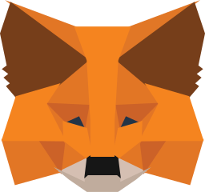</a> | **metamask-icon.svg** |
|  | **metamask.svg** |
|  | **meteor-icon.svg** |
|  | **meteor.svg** |
|  | **micro-icon.svg** |
|  | **micro-python.svg** |
|  | **micro.svg** |
|  | **microcosm.svg** |
|  | **micron-icon.svg** |
|  | **micron.svg** |
|  | **microsoft-azure.svg** |
|  | **microsoft-edge.svg** |
|  | **microsoft-icon.svg** |
|  | **microsoft-onedrive.svg** |
|  | **microsoft-power-bi.svg** |
|  | **microsoft-teams.svg** |
|  | **microsoft-windows-icon.svg** |
|  | **microsoft-windows.svg** |
|  | **microsoft.svg** |
|  | **mida-icon.svg** |
|  | **mida.svg** |
|  | **middleman.svg** |
|  | **milligram.svg** |
|  | **mindsdb-icon.svg** |
|  | **mindsdb.svg** |
|  | **mint-lang.svg** |
|  | **mio.svg** |
|  | **mist.svg** |
|  | **mithril.svg** |
|  | **mixmax.svg** |
|  | **mixpanel.svg** |
|  | **mlab.svg** |
|  | **mobx.svg** |
|  | **mocha.svg** |
|  | **mockflow-icon.svg** |
|  | **mockflow.svg** |
|  | **modernizr.svg** |
|  | **modx-icon.svg** |
|  | **modx.svg** |
|  | **momentjs.svg** |
|  | **monday-icon.svg** |
|  | **monday.svg** |
|  | **monero.svg** |
|  | **mongodb-icon.svg** |
|  | **mongodb.svg** |
|  | **mono.svg** |
|  | **moon.svg** |
|  | **mootools.svg** |
|  | **morpheus-icon.svg** |
|  | **morpheus.svg** |
|  | **mozilla.svg** |
|  | **mparticle-icon.svg** |
|  | **mparticle.svg** |
|  | **mps-icon.svg** |
|  | **mps.svg** |
|  | **msw-icon.svg** |
|  | **msw.svg** |
|  | **multipass.svg** |
|  | **mysql-icon.svg** |
|  | **mysql.svg** |
|  | **naiveui.svg** |
|  | **namecheap.svg** |
|  | **nanonets.svg** |
|  | **nasm.svg** |
|  | **nativescript.svg** |
|  | **nats-icon.svg** |
|  | **nats.svg** |
|  | **neat.svg** |
|  | **neo4j.svg** |
|  | **neon-icon.svg** |
|  | **neon.svg** |
|  | **neovim.svg** |
|  | **nestjs.svg** |
|  | **netbeans.svg** |
|  | **netflix-icon.svg** |
|  | **netflix.svg** |
|  | **netlify-icon.svg** |
| <a href="netlify.svg">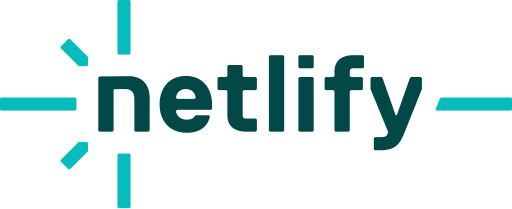</a> | **netlify.svg** |
|  | **neverinstall-icon.svg** |
|  | **neverinstall.svg** |
|  | **new-relic-icon.svg** |
|  | **new-relic.svg** |
|  | **nextjs-icon.svg** |
|  | **nextjs.svg** |
|  | **nginx.svg** |
|  | **nhost-icon.svg** |
|  | **nhost.svg** |
|  | **nightwatch.svg** |
|  | **nim-lang.svg** |
|  | **nocodb.svg** |
|  | **nodal.svg** |
|  | **node-sass.svg** |
|  | **nodebots.svg** |
|  | **nodejs-icon-alt.svg** |
|  | **nodejs-icon.svg** |
|  | **nodejs.svg** |
|  | **nodemon.svg** |
|  | **nodeos.svg** |
|  | **nodewebkit.svg** |
|  | **nomad-icon.svg** |
|  | **nomad.svg** |
|  | **notion-icon.svg** |
|  | **notion.svg** |
|  | **noysi.svg** |
|  | **npm-icon.svg** |
|  | **npm.svg** |
|  | **nuclide.svg** |
|  | **numpy.svg** |
|  | **nuxt-icon.svg** |
|  | **nuxt.svg** |
|  | **nvidia.svg** |
|  | **nvm.svg** |
|  | **nx.svg** |
|  | **oauth.svg** |
|  | **observablehq.svg** |
|  | **obsidian-icon.svg** |
|  | **obsidian.svg** |
|  | **ocaml.svg** |
|  | **octodns.svg** |
|  | **octopus-deploy.svg** |
|  | **okta-icon.svg** |
|  | **okta.svg** |
|  | **olark.svg** |
|  | **onesignal.svg** |
|  | **open-graph.svg** |
|  | **open-zeppelin-icon.svg** |
|  | **open-zeppelin.svg** |
|  | **openai-icon.svg** |
|  | **openai.svg** |
|  | **openapi-icon.svg** |
|  | **openapi.svg** |
|  | **opencart.svg** |
|  | **opencollective.svg** |
|  | **opencv.svg** |
|  | **openframeworks.svg** |
|  | **opengl.svg** |
|  | **openjs-foundation-icon.svg** |
|  | **openjs-foundation.svg** |
|  | **openlayers.svg** |
|  | **openshift.svg** |
|  | **opensource.svg** |
|  | **openstack-icon.svg** |
|  | **openstack.svg** |
|  | **opentelemetry-icon.svg** |
|  | **opentelemetry.svg** |
|  | **opera.svg** |
|  | **opsgenie.svg** |
|  | **optimizely-icon.svg** |
|  | **optimizely.svg** |
|  | **oracle.svg** |
|  | **oreilly.svg** |
|  | **origami.svg** |
|  | **origin.svg** |
|  | **oshw.svg** |
|  | **osquery.svg** |
|  | **overloop-icon.svg** |
|  | **overloop.svg** |
|  | **p5js.svg** |
|  | **packer.svg** |
|  | **pagekit.svg** |
|  | **pagekite.svg** |
|  | **pagerduty-icon.svg** |
|  | **pagerduty.svg** |
|  | **panda.svg** |
|  | **pandas-icon.svg** |
|  | **pandas.svg** |
|  | **parcel-icon.svg** |
|  | **parcel.svg** |
|  | **parse.svg** |
|  | **parsehub.svg** |
|  | **partytown-icon.svg** |
|  | **partytown.svg** |
|  | **passbolt-icon.svg** |
|  | **passbolt.svg** |
|  | **passport.svg** |
|  | **patreon.svg** |
|  | **payload.svg** |
|  | **paypal.svg** |
|  | **peer5.svg** |
|  | **pepperoni.svg** |
|  | **percona.svg** |
| <a href="percy-icon.svg">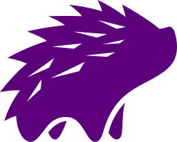</a> | **percy-icon.svg** |
|  | **percy.svg** |
|  | **perf-rocks.svg** |
|  | **perl.svg** |
|  | **phalcon.svg** |
|  | **phoenix.svg** |
|  | **php-alt.svg** |
|  | **php.svg** |
|  | **phpstorm.svg** |
|  | **pinecone-icon.svg** |
|  | **pinecone.svg** |
|  | **pinia.svg** |
|  | **pinterest.svg** |
|  | **pipedream.svg** |
|  | **pipedrive.svg** |
|  | **pipefy.svg** |
|  | **pivotal_tracker.svg** |
|  | **pixijs.svg** |
|  | **pkg.svg** |
|  | **planetscale.svg** |
|  | **planless-icon.svg** |
|  | **planless.svg** |
|  | **plasmic.svg** |
|  | **plastic-scm.svg** |
|  | **platformio.svg** |
|  | **play.svg** |
|  | **playwright.svg** |
|  | **pluralsight-icon.svg** |
|  | **pluralsight.svg** |
|  | **pm2-icon.svg** |
|  | **pm2.svg** |
|  | **pnpm.svg** |
|  | **pocket-base.svg** |
|  | **poeditor.svg** |
|  | **polymer.svg** |
|  | **postcss.svg** |
|  | **postgraphile.svg** |
|  | **postgresql.svg** |
|  | **posthog-icon.svg** |
|  | **posthog.svg** |
|  | **postman-icon.svg** |
|  | **postman.svg** |
|  | **pouchdb.svg** |
|  | **preact.svg** |
|  | **precursor.svg** |
|  | **prerender-icon.svg** |
|  | **prerender.svg** |
|  | **prestashop.svg** |
|  | **presto.svg** |
|  | **prettier.svg** |
|  | **prisma.svg** |
|  | **prismic-icon.svg** |
|  | **prismic.svg** |
|  | **processing.svg** |
|  | **processwire-icon.svg** |
|  | **processwire.svg** |
|  | **productboard-icon.svg** |
|  | **productboard.svg** |
|  | **producthunt.svg** |
|  | **progress.svg** |
|  | **prometheus.svg** |
|  | **promises.svg** |
|  | **proofy.svg** |
|  | **protoio.svg** |
|  | **protonet.svg** |
|  | **protractor.svg** |
|  | **prott.svg** |
|  | **pug.svg** |
|  | **pumpkindb.svg** |
|  | **puppet-icon.svg** |
|  | **puppet.svg** |
|  | **puppeteer.svg** |
|  | **purescript-icon.svg** |
|  | **purescript.svg** |
|  | **pushbullet.svg** |
|  | **pusher-icon.svg** |
|  | **pusher.svg** |
|  | **pwa.svg** |
|  | **pycharm.svg** |
|  | **pypi.svg** |
|  | **pyscript.svg** |
|  | **python.svg** |
|  | **pytorch-icon.svg** |
|  | **pytorch.svg** |
|  | **pyup.svg** |
|  | **q.svg** |
|  | **qlik.svg** |
|  | **qt.svg** |
|  | **qualcomm.svg** |
|  | **quarkus-icon.svg** |
|  | **quarkus.svg** |
|  | **quay.svg** |
|  | **quobyte.svg** |
|  | **quora.svg** |
|  | **qwik-icon.svg** |
|  | **qwik.svg** |
|  | **r-lang.svg** |
|  | **rabbitmq-icon.svg** |
|  | **rabbitmq.svg** |
|  | **rackspace-icon.svg** |
|  | **rackspace.svg** |
|  | **rails.svg** |
|  | **ramda.svg** |
|  | **raml.svg** |
|  | **rancher-icon.svg** |
|  | **rancher.svg** |
|  | **raphael.svg** |
|  | **raspberry-pi.svg** |
|  | **rax.svg** |
|  | **react-query-icon.svg** |
|  | **react-query.svg** |
|  | **react-router.svg** |
|  | **react-spring.svg** |
|  | **react-styleguidist.svg** |
|  | **react.svg** |
|  | **reactivex.svg** |
|  | **realm.svg** |
|  | **reapp.svg** |
|  | **reasonml-icon.svg** |
|  | **reasonml.svg** |
|  | **recaptcha.svg** |
|  | **recoil-icon.svg** |
|  | **recoil.svg** |
|  | **reddit-icon.svg** |
|  | **reddit.svg** |
|  | **redhat-icon.svg** |
|  | **redhat.svg** |
|  | **redis.svg** |
|  | **redsmin.svg** |
|  | **redux-observable.svg** |
|  | **redux-saga.svg** |
|  | **redux.svg** |
|  | **redwoodjs.svg** |
|  | **reindex.svg** |
|  | **relay.svg** |
|  | **release.svg** |
|  | **remix-icon.svg** |
|  | **remix.svg** |
|  | **renovatebot.svg** |
|  | **replit-icon.svg** |
|  | **replit.svg** |
|  | **require.svg** |
|  | **rescript-icon.svg** |
|  | **rescript.svg** |
|  | **rest-li.svg** |
|  | **rethinkdb.svg** |
|  | **retool-icon.svg** |
|  | **retool.svg** |
|  | **riak.svg** |
|  | **rider.svg** |
|  | **riot.svg** |
|  | **risingwave-icon.svg** |
|  | **risingwave.svg** |
|  | **rocket-chat-icon.svg** |
|  | **rocket-chat.svg** |
|  | **rocksdb.svg** |
|  | **rocky-linux-icon.svg** |
|  | **rocky-linux.svg** |
|  | **rollbar-icon.svg** |
|  | **rollbar.svg** |
|  | **rollupjs.svg** |
|  | **rome-icon.svg** |
|  | **rome.svg** |
|  | **ros.svg** |
|  | **rsa.svg** |
|  | **rsmq.svg** |
|  | **rubocop.svg** |
|  | **ruby.svg** |
|  | **rubygems.svg** |
| <a href="rubymine.svg">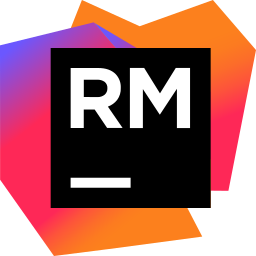</a> | **rubymine.svg** |
|  | **rum.svg** |
|  | **runscope.svg** |
|  | **rush-icon.svg** |
|  | **rush.svg** |
|  | **rust.svg** |
|  | **rxdb.svg** |
|  | **safari.svg** |
|  | **sagui.svg** |
|  | **sails.svg** |
|  | **salesforce.svg** |
|  | **sameroom.svg** |
|  | **samsung.svg** |
|  | **sanity.svg** |
|  | **sap.svg** |
|  | **sass-doc.svg** |
|  | **sass.svg** |
|  | **saucelabs.svg** |
|  | **scala.svg** |
|  | **scaledrone.svg** |
|  | **scribd-icon.svg** |
|  | **scribd.svg** |
|  | **seaborn-icon.svg** |
|  | **seaborn.svg** |
|  | **section-icon.svg** |
|  | **section.svg** |
|  | **segment-icon.svg** |
|  | **segment.svg** |
|  | **selenium.svg** |
|  | **semantic-release.svg** |
|  | **semantic-ui.svg** |
|  | **semantic-web.svg** |
|  | **semaphoreci.svg** |
|  | **sencha.svg** |
|  | **sendgrid-icon.svg** |
|  | **sendgrid.svg** |
|  | **seneca.svg** |
|  | **sensu-icon.svg** |
|  | **sensu.svg** |
|  | **sentry-icon.svg** |
|  | **sentry.svg** |
|  | **sequelize.svg** |
|  | **serverless.svg** |
|  | **sherlock-icon.svg** |
|  | **sherlock.svg** |
|  | **shields.svg** |
|  | **shipit.svg** |
|  | **shogun.svg** |
|  | **shopify.svg** |
|  | **shortcut-icon.svg** |
|  | **shortcut.svg** |
|  | **sidekiq-icon.svg** |
|  | **sidekiq.svg** |
|  | **signal.svg** |
|  | **sigstore-icon.svg** |
|  | **sigstore.svg** |
|  | **sinatra.svg** |
|  | **singlestore-icon.svg** |
|  | **singlestore.svg** |
|  | **sitepoint.svg** |
|  | **sk-hynix.svg** |
|  | **skaffolder.svg** |
| <a href="sketch.svg">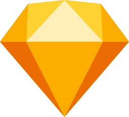</a> | **sketch.svg** |
|  | **skylight.svg** |
|  | **skype.svg** |
|  | **slack-icon.svg** |
|  | **slack.svg** |
|  | **slides.svg** |
|  | **slim.svg** |
|  | **smartling.svg** |
|  | **smashingmagazine.svg** |
|  | **snap-svg.svg** |
|  | **snaplet-icon.svg** |
|  | **snaplet.svg** |
|  | **snowflake-icon.svg** |
|  | **snowflake.svg** |
|  | **snowpack.svg** |
|  | **snyk.svg** |
|  | **socket.io.svg** |
|  | **solarwinds.svg** |
|  | **solid.svg** |
|  | **solidity.svg** |
|  | **solidjs-icon.svg** |
|  | **solidjs.svg** |
|  | **solr.svg** |
|  | **sonarcloud-icon.svg** |
|  | **sonarcloud.svg** |
|  | **sonarlint-icon.svg** |
|  | **sonarlint.svg** |
|  | **sonarqube.svg** |
|  | **soundcloud.svg** |
|  | **sourcegraph.svg** |
|  | **sourcetree.svg** |
|  | **spark.svg** |
|  | **sparkpost.svg** |
|  | **speakerdeck.svg** |
|  | **speedcurve.svg** |
|  | **spidermonkey-icon.svg** |
|  | **spidermonkey.svg** |
|  | **spinnaker.svg** |
|  | **splunk.svg** |
|  | **spotify-icon.svg** |
|  | **spotify.svg** |
|  | **spree.svg** |
|  | **spring-icon.svg** |
|  | **spring.svg** |
|  | **sqlite.svg** |
|  | **square.svg** |
|  | **squarespace.svg** |
|  | **stackbit-icon.svg** |
|  | **stackbit.svg** |
|  | **stackblitz-icon.svg** |
|  | **stackblitz.svg** |
|  | **stackoverflow-icon.svg** |
|  | **stackoverflow.svg** |
|  | **stackshare.svg** |
|  | **stately-icon.svg** |
|  | **stately.svg** |
|  | **statuspage.svg** |
|  | **stdlib-icon.svg** |
|  | **stdlib.svg** |
|  | **steam.svg** |
|  | **stenciljs-icon.svg** |
|  | **stenciljs.svg** |
|  | **stepsize-icon.svg** |
|  | **stepsize.svg** |
|  | **stetho.svg** |
|  | **stickermule.svg** |
|  | **stigg-icon.svg** |
|  | **stigg.svg** |
|  | **stimulus-icon.svg** |
|  | **stimulus.svg** |
|  | **stitch.svg** |
|  | **stoplight.svg** |
|  | **storyblocks-icon.svg** |
|  | **storyblocks.svg** |
|  | **storyblok-icon.svg** |
|  | **storyblok.svg** |
|  | **storybook-icon.svg** |
|  | **storybook.svg** |
|  | **strapi-icon.svg** |
|  | **strapi.svg** |
|  | **streamlit.svg** |
|  | **strider.svg** |
|  | **stripe.svg** |
|  | **struts.svg** |
|  | **styleci.svg** |
|  | **stylefmt.svg** |
|  | **stylelint.svg** |
|  | **stylis.svg** |
|  | **stylus.svg** |
|  | **stytch.svg** |
|  | **sublimetext-icon.svg** |
|  | **sublimetext.svg** |
|  | **subversion.svg** |
|  | **sugarss.svg** |
|  | **supabase-icon.svg** |
|  | **supabase.svg** |
|  | **supertokens-icon.svg** |
|  | **supertokens.svg** |
|  | **surge.svg** |
|  | **surrealdb-icon.svg** |
|  | **surrealdb.svg** |
|  | **survicate-icon.svg** |
|  | **survicate.svg** |
|  | **suse.svg** |
|  | **susy.svg** |
|  | **svelte-icon.svg** |
|  | **svelte-kit.svg** |
|  | **svelte.svg** |
|  | **svg.svg** |
|  | **svgator.svg** |
|  | **swagger.svg** |
|  | **swc.svg** |
|  | **swift.svg** |
|  | **swiftype.svg** |
|  | **swimm.svg** |
|  | **swr.svg** |
|  | **symfony.svg** |
|  | **sysdig-icon.svg** |
|  | **sysdig.svg** |
|  | **t3.svg** |
|  | **tableau-icon.svg** |
|  | **tableau.svg** |
|  | **taiga.svg** |
|  | **tailwindcss-icon.svg** |
|  | **tailwindcss.svg** |
|  | **tapcart-icon.svg** |
|  | **tapcart.svg** |
|  | **taskade-icon.svg** |
|  | **taskade.svg** |
|  | **tastejs.svg** |
|  | **tauri.svg** |
|  | **tealium.svg** |
|  | **teamcity.svg** |
|  | **teamgrid.svg** |
|  | **teamwork-icon.svg** |
|  | **teamwork.svg** |
|  | **telegram.svg** |
|  | **tensorflow.svg** |
|  | **terminal.svg** |
|  | **terraform-icon.svg** |
|  | **terraform.svg** |
|  | **terser-icon.svg** |
|  | **terser.svg** |
|  | **testcafe.svg** |
|  | **testing-library.svg** |
|  | **testlodge.svg** |
|  | **threejs.svg** |
|  | **thymeleaf-icon.svg** |
|  | **thymeleaf.svg** |
|  | **tidal-icon.svg** |
|  | **tidal.svg** |
|  | **tiktok-icon.svg** |
|  | **tiktok.svg** |
|  | **tnw.svg** |
|  | **todoist-icon.svg** |
|  | **todoist.svg** |
|  | **todomvc.svg** |
| <a href="tomcat.svg">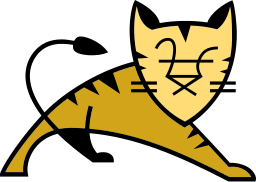</a> | **tomcat.svg** |
|  | **toml.svg** |
|  | **tor-browser.svg** |
|  | **tor.svg** |
|  | **traackr.svg** |
|  | **trac.svg** |
|  | **travis-ci-monochrome.svg** |
|  | **travis-ci.svg** |
|  | **treasuredata-icon.svg** |
|  | **treasuredata.svg** |
|  | **treehouse.svg** |
|  | **trello.svg** |
|  | **trpc.svg** |
|  | **truffle-icon.svg** |
|  | **truffle.svg** |
|  | **tsmc.svg** |
|  | **tsnode.svg** |
|  | **tsuru.svg** |
|  | **tumblr-icon.svg** |
|  | **tumblr.svg** |
|  | **tunein.svg** |
|  | **tuple.svg** |
|  | **turbopack-icon.svg** |
|  | **turbopack.svg** |
|  | **turborepo-icon.svg** |
|  | **turborepo.svg** |
|  | **turret.svg** |
|  | **twilio-icon.svg** |
|  | **twilio.svg** |
|  | **twitch.svg** |
|  | **twitter.svg** |
|  | **typeform-icon.svg** |
|  | **typeform.svg** |
|  | **typeorm.svg** |
|  | **typescript-icon-round.svg** |
|  | **typescript-icon.svg** |
|  | **typescript.svg** |
|  | **typo3-icon.svg** |
|  | **typo3.svg** |
|  | **ubuntu.svg** |
|  | **udacity-icon.svg** |
|  | **udacity.svg** |
|  | **udemy-icon.svg** |
|  | **udemy.svg** |
|  | **uikit.svg** |
|  | **umu.svg** |
|  | **unbounce-icon.svg** |
|  | **unbounce.svg** |
|  | **undertow.svg** |
|  | **unionpay.svg** |
|  | **unitjs.svg** |
|  | **unito-icon.svg** |
|  | **unito.svg** |
|  | **unity.svg** |
|  | **unocss.svg** |
|  | **unrealengine-icon.svg** |
|  | **unrealengine.svg** |
|  | **upcase.svg** |
|  | **upstash-icon.svg** |
|  | **upstash.svg** |
|  | **upwork.svg** |
|  | **user-testing-icon.svg** |
|  | **user-testing.svg** |
|  | **uservoice-icon.svg** |
|  | **uservoice.svg** |
|  | **uwsgi.svg** |
| <a href="v8-ignition.svg">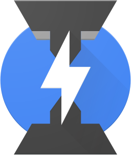</a> | **v8-ignition.svg** |
|  | **v8-turbofan.svg** |
|  | **v8.svg** |
|  | **vaadin.svg** |
|  | **vaddy.svg** |
|  | **vagrant-icon.svg** |
|  | **vagrant.svg** |
|  | **vault-icon.svg** |
|  | **vault.svg** |
|  | **vector.svg** |
|  | **vercel-icon.svg** |
|  | **vercel.svg** |
|  | **verdaccio-icon.svg** |
|  | **verdaccio.svg** |
|  | **vernemq.svg** |
|  | **vim.svg** |
|  | **vimeo-icon.svg** |
|  | **vimeo.svg** |
|  | **visa.svg** |
|  | **visaelectron.svg** |
|  | **visual-studio-code.svg** |
|  | **visual-studio.svg** |
|  | **vitejs.svg** |
|  | **vitess.svg** |
|  | **vitest.svg** |
|  | **vivaldi-icon.svg** |
|  | **vivaldi.svg** |
|  | **vlang.svg** |
|  | **void.svg** |
|  | **vue.svg** |
|  | **vuetifyjs.svg** |
|  | **vueuse.svg** |
|  | **vulkan.svg** |
|  | **vultr-icon.svg** |
|  | **vultr.svg** |
|  | **vwo.svg** |
|  | **w3c.svg** |
|  | **waffle-icon.svg** |
|  | **waffle.svg** |
|  | **wagtail.svg** |
|  | **wakatime.svg** |
|  | **walkme.svg** |
|  | **watchman.svg** |
|  | **waypoint-icon.svg** |
|  | **waypoint.svg** |
|  | **wayscript-icon.svg** |
|  | **wayscript.svg** |
|  | **wearos.svg** |
|  | **weave.svg** |
|  | **web.dev-icon.svg** |
|  | **web.dev.svg** |
|  | **web3js.svg** |
|  | **webassembly.svg** |
|  | **webcomponents.svg** |
|  | **webdriverio.svg** |
|  | **webflow.svg** |
|  | **webgpu.svg** |
|  | **webhint-icon.svg** |
|  | **webhint.svg** |
|  | **webhooks.svg** |
|  | **webix-icon.svg** |
|  | **webix.svg** |
|  | **webkit.svg** |
|  | **webmin.svg** |
|  | **webpack.svg** |
|  | **webplatform.svg** |
|  | **webrtc.svg** |
|  | **websocket.svg** |
|  | **webstorm.svg** |
|  | **webtorrent.svg** |
|  | **weebly.svg** |
|  | **whalar-icon.svg** |
|  | **whalar.svg** |
|  | **whatsapp-icon.svg** |
|  | **whatsapp-monochrome-icon.svg** |
|  | **whatsapp.svg** |
|  | **whatwg.svg** |
|  | **wicket-icon.svg** |
|  | **wicket.svg** |
|  | **wifi.svg** |
|  | **wildfly.svg** |
|  | **windi-css.svg** |
|  | **wire.svg** |
|  | **wix.svg** |
|  | **wmr.svg** |
|  | **woocommerce-icon.svg** |
|  | **woocommerce.svg** |
|  | **woopra.svg** |
|  | **wordpress-icon-alt.svg** |
|  | **wordpress-icon.svg** |
|  | **wordpress.svg** |
|  | **workboard.svg** |
|  | **workos-icon.svg** |
|  | **workos.svg** |
|  | **workplace-icon.svg** |
|  | **workplace.svg** |
|  | **wpengine.svg** |
|  | **wufoo.svg** |
|  | **xamarin.svg** |
|  | **xampp.svg** |
|  | **xata-icon.svg** |
|  | **xata.svg** |
|  | **xcart.svg** |
|  | **xcode.svg** |
|  | **xero.svg** |
|  | **xray-for-jira.svg** |
|  | **xstate.svg** |
|  | **xtend.svg** |
|  | **xwiki-icon.svg** |
|  | **xwiki.svg** |
|  | **yahoo.svg** |
|  | **yaml.svg** |
|  | **yammer.svg** |
|  | **yandex-ru.svg** |
|  | **yarn.svg** |
|  | **ycombinator.svg** |
|  | **yeoman.svg** |
|  | **yii.svg** |
|  | **youtrack.svg** |
|  | **youtube-icon.svg** |
|  | **youtube.svg** |
|  | **yugabyte-icon.svg** |
|  | **yugabyte.svg** |
|  | **zabbix.svg** |
|  | **zapier.svg** |
|  | **zend-framework.svg** |
|  | **zendesk-icon.svg** |
|  | **zendesk.svg** |
|  | **zenhub-icon.svg** |
|  | **zenhub.svg** |
|  | **zeplin.svg** |
|  | **zeroheight-icon.svg** |
|  | **zeroheight.svg** |
|  | **zig.svg** |
|  | **zod.svg** |
|  | **zoho.svg** |
|  | **zoom-icon.svg** |
|  | **zoom.svg** |
|  | **zorin-os.svg** |
|  | **zube.svg** |
|  | **zulip-icon.svg** |
|  | **zulip.svg** |
|  | **zwave.svg** |