# 🖼️ Brands Gallery

[⬅️ 回到首頁](../../README.md)

| 預覽 | 詳細資訊 |
| :--- | :--- |
|  | **100tb.svg** Vector (SVG) \| 5.45KB 更新: 2026-02-26 |
|  | **500px.svg** Vector (SVG) \| 4.26KB 更新: 2026-02-26 |
|  | **active-campaign-icon.svg** Vector (SVG) \| 2.02KB 更新: 2026-02-26 |
|  | **active-campaign.svg** Vector (SVG) \| 14.48KB 更新: 2026-02-26 |
|  | **adobe-after-effects.svg** Vector (SVG) \| 5.30KB 更新: 2026-02-26 |
|  | **adobe-animate.svg** Vector (SVG) \| 4.14KB 更新: 2026-02-26 |
|  | **adobe-dreamweaver.svg** Vector (SVG) \| 9.62KB 更新: 2026-02-26 |
|  | **adobe-illustrator.svg** Vector (SVG) \| 3.23KB 更新: 2026-02-26 |
|  | **adobe-incopy.svg** Vector (SVG) \| 2.55KB 更新: 2026-02-26 |
|  | **adobe-indesign.svg** Vector (SVG) \| 3.09KB 更新: 2026-02-26 |
|  | **adobe-lightroom.svg** Vector (SVG) \| 2.52KB 更新: 2026-02-26 |
|  | **adobe-photoshop.svg** Vector (SVG) \| 6.02KB 更新: 2026-02-26 |
|  | **adobe-premiere.svg** Vector (SVG) \| 4.82KB 更新: 2026-02-26 |
|  | **adobe-xd.svg** Vector (SVG) \| 4.80KB 更新: 2026-02-26 |
|  | **adonisjs-icon.svg** Vector (SVG) \| 1.37KB 更新: 2026-02-26 |
|  | **adonisjs.svg** Vector (SVG) \| 12.09KB 更新: 2026-02-26 |
|  | **adroll.svg** Vector (SVG) \| 3.84KB 更新: 2026-02-26 |
|  | **adyen.svg** Vector (SVG) \| 2.55KB 更新: 2026-02-26 |
|  | **aerogear.svg** Vector (SVG) \| 15.96KB 更新: 2026-02-26 |
|  | **aerospike-icon.svg** Vector (SVG) \| 533.00B 更新: 2026-02-26 |
|  | **aerospike.svg** Vector (SVG) \| 8.59KB 更新: 2026-02-26 |
|  | **aha.svg** Vector (SVG) \| 5.68KB 更新: 2026-02-26 |
| <a href="airbnb-icon.svg">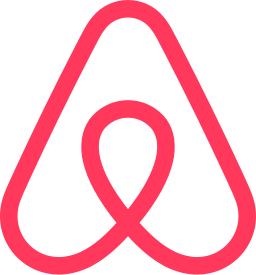</a> | **airbnb-icon.svg** Vector (SVG) \| 5.32KB 更新: 2026-02-26 |
|  | **airbnb.svg** Vector (SVG) \| 12.93KB 更新: 2026-02-26 |
|  | **airbrake.svg** Vector (SVG) \| 4.89KB 更新: 2026-02-26 |
|  | **airflow-icon.svg** Vector (SVG) \| 3.49KB 更新: 2026-02-26 |
|  | **airflow.svg** Vector (SVG) \| 55.58KB 更新: 2026-02-26 |
|  | **airtable.svg** Vector (SVG) \| 1.89KB 更新: 2026-02-26 |
|  | **aix.svg** Vector (SVG) \| 2.43KB 更新: 2026-02-26 |
|  | **akamai.svg** Vector (SVG) \| 5.65KB 更新: 2026-02-26 |
|  | **akka.svg** Vector (SVG) \| 964.00B 更新: 2026-02-26 |
|  | **alfresco.svg** Vector (SVG) \| 7.48KB 更新: 2026-02-26 |
|  | **algolia.svg** Vector (SVG) \| 11.60KB 更新: 2026-02-26 |
|  | **alpinejs-icon.svg** Vector (SVG) \| 507.00B 更新: 2026-02-26 |
|  | **alpinejs.svg** Vector (SVG) \| 9.76KB 更新: 2026-02-26 |
|  | **altair.svg** Vector (SVG) \| 2.41KB 更新: 2026-02-26 |
|  | **amazon-chime.svg** Vector (SVG) \| 4.08KB 更新: 2026-02-26 |
|  | **amazon-connect.svg** Vector (SVG) \| 6.07KB 更新: 2026-02-26 |
|  | **amd.svg** Vector (SVG) \| 1.58KB 更新: 2026-02-26 |
|  | **amex-digital.svg** Vector (SVG) \| 1.86KB 更新: 2026-02-26 |
|  | **amex.svg** Vector (SVG) \| 8.52KB 更新: 2026-02-26 |
|  | **amp-icon.svg** Vector (SVG) \| 1.76KB 更新: 2026-02-26 |
|  | **amp.svg** Vector (SVG) \| 7.03KB 更新: 2026-02-26 |
|  | **ampersand.svg** Vector (SVG) \| 5.56KB 更新: 2026-02-26 |
|  | **amplication-icon.svg** Vector (SVG) \| 643.00B 更新: 2026-02-26 |
|  | **amplication.svg** Vector (SVG) \| 6.50KB 更新: 2026-02-26 |
|  | **amplitude-icon.svg** Vector (SVG) \| 3.47KB 更新: 2026-02-26 |
|  | **amplitude.svg** Vector (SVG) \| 8.55KB 更新: 2026-02-26 |
|  | **android-icon.svg** Vector (SVG) \| 1.50KB 更新: 2026-02-26 |
|  | **android-vertical.svg** Vector (SVG) \| 5.86KB 更新: 2026-02-26 |
|  | **android.svg** Vector (SVG) \| 5.80KB 更新: 2026-02-26 |
|  | **angellist.svg** Vector (SVG) \| 7.49KB 更新: 2026-02-26 |
|  | **angular-icon.svg** Vector (SVG) \| 1.06KB 更新: 2026-02-26 |
|  | **angular.svg** Vector (SVG) \| 2.27KB 更新: 2026-02-26 |
|  | **ansible.svg** Vector (SVG) \| 5.55KB 更新: 2026-02-26 |
|  | **ant-design.svg** Vector (SVG) \| 4.11KB 更新: 2026-02-26 |
|  | **apache-camel.svg** Vector (SVG) \| 3.79KB 更新: 2026-02-26 |
|  | **apache.svg** Vector (SVG) \| 11.86KB 更新: 2026-02-26 |
|  | **apache_cloudstack.svg** Vector (SVG) \| 9.12KB 更新: 2026-02-26 |
|  | **apiary.svg** Vector (SVG) \| 2.80KB 更新: 2026-02-26 |
|  | **apollostack.svg** Vector (SVG) \| 1.21KB 更新: 2026-02-26 |
|  | **apostrophe.svg** Vector (SVG) \| 4.01KB 更新: 2026-02-26 |
|  | **appbaseio-icon.svg** Vector (SVG) \| 2.18KB 更新: 2026-02-26 |
|  | **appbaseio.svg** Vector (SVG) \| 9.31KB 更新: 2026-02-26 |
|  | **appcenter-icon.svg** Vector (SVG) \| 891.00B 更新: 2026-02-26 |
|  | **appcenter.svg** Vector (SVG) \| 9.72KB 更新: 2026-02-26 |
|  | **appcircle-icon.svg** Vector (SVG) \| 1.66KB 更新: 2026-02-26 |
|  | **appcircle.svg** Vector (SVG) \| 10.19KB 更新: 2026-02-26 |
|  | **appcode.svg** Vector (SVG) \| 2.81KB 更新: 2026-02-26 |
|  | **appdynamics-icon.svg** Vector (SVG) \| 956.00B 更新: 2026-02-26 |
|  | **appdynamics.svg** Vector (SVG) \| 15.23KB 更新: 2026-02-26 |
|  | **appium.svg** Vector (SVG) \| 1021.00B 更新: 2026-02-26 |
|  | **apple-app-store.svg** Vector (SVG) \| 3.06KB 更新: 2026-02-26 |
|  | **apple-pay.svg** Vector (SVG) \| 3.21KB 更新: 2026-02-26 |
|  | **apple.svg** Vector (SVG) \| 1.36KB 更新: 2026-02-26 |
|  | **applitools-icon.svg** Vector (SVG) \| 1.31KB 更新: 2026-02-26 |
|  | **applitools.svg** Vector (SVG) \| 7.11KB 更新: 2026-02-26 |
|  | **appsignal-icon.svg** Vector (SVG) \| 2.27KB 更新: 2026-02-26 |
|  | **appsignal.svg** Vector (SVG) \| 13.25KB 更新: 2026-02-26 |
|  | **apptentive.svg** Vector (SVG) \| 10.04KB 更新: 2026-02-26 |
|  | **appveyor.svg** Vector (SVG) \| 1.34KB 更新: 2026-02-26 |
|  | **appwrite-icon.svg** Vector (SVG) \| 3.21KB 更新: 2026-02-26 |
|  | **appwrite.svg** Vector (SVG) \| 10.91KB 更新: 2026-02-26 |
|  | **arangodb-icon.svg** Vector (SVG) \| 7.96KB 更新: 2026-02-26 |
|  | **arangodb.svg** Vector (SVG) \| 17.83KB 更新: 2026-02-26 |
|  | **arc.svg** Vector (SVG) \| 4.74KB 更新: 2026-02-26 |
|  | **architect-icon.svg** Vector (SVG) \| 2.11KB 更新: 2026-02-26 |
|  | **architect.svg** Vector (SVG) \| 10.28KB 更新: 2026-02-26 |
|  | **archlinux.svg** Vector (SVG) \| 1.18KB 更新: 2026-02-26 |
|  | **arduino.svg** Vector (SVG) \| 6.83KB 更新: 2026-02-26 |
|  | **argo-icon.svg** Vector (SVG) \| 22.90KB 更新: 2026-02-26 |
|  | **argo.svg** Vector (SVG) \| 28.52KB 更新: 2026-02-26 |
|  | **arm.svg** Vector (SVG) \| 2.58KB 更新: 2026-02-26 |
|  | **armory-icon.svg** Vector (SVG) \| 3.25KB 更新: 2026-02-26 |
|  | **armory.svg** Vector (SVG) \| 14.84KB 更新: 2026-02-26 |
|  | **asana-icon.svg** Vector (SVG) \| 1.10KB 更新: 2026-02-26 |
|  | **asana.svg** Vector (SVG) \| 11.43KB 更新: 2026-02-26 |
|  | **asciidoctor.svg** Vector (SVG) \| 2.37KB 更新: 2026-02-26 |
|  | **assembla-icon.svg** Vector (SVG) \| 1.83KB 更新: 2026-02-26 |
|  | **assembla.svg** Vector (SVG) \| 14.24KB 更新: 2026-02-26 |
|  | **astro-icon.svg** Vector (SVG) \| 1.92KB 更新: 2026-02-26 |
|  | **astro.svg** Vector (SVG) \| 5.58KB 更新: 2026-02-26 |
|  | **astronomer.svg** Vector (SVG) \| 7.75KB 更新: 2026-02-26 |
|  | **async-api-icon.svg** Vector (SVG) \| 2.46KB 更新: 2026-02-26 |
|  | **async-api.svg** Vector (SVG) \| 9.42KB 更新: 2026-02-26 |
|  | **atlassian.svg** Vector (SVG) \| 1.45KB 更新: 2026-02-26 |
|  | **atom-icon.svg** Vector (SVG) \| 11.49KB 更新: 2026-02-26 |
|  | **atom.svg** Vector (SVG) \| 14.14KB 更新: 2026-02-26 |
|  | **atomic-icon.svg** Vector (SVG) \| 1.18KB 更新: 2026-02-26 |
|  | **atomic.svg** Vector (SVG) \| 5.25KB 更新: 2026-02-26 |
|  | **atomicojs-icon.svg** Vector (SVG) \| 4.93KB 更新: 2026-02-26 |
|  | **atomicojs.svg** Vector (SVG) \| 9.43KB 更新: 2026-02-26 |
|  | **aurelia.svg** Vector (SVG) \| 6.49KB 更新: 2026-02-26 |
|  | **aurora.svg** Vector (SVG) \| 3.21KB 更新: 2026-02-26 |
|  | **auth0-icon.svg** Vector (SVG) \| 877.00B 更新: 2026-02-26 |
|  | **auth0.svg** Vector (SVG) \| 4.18KB 更新: 2026-02-26 |
|  | **authy.svg** Vector (SVG) \| 2.34KB 更新: 2026-02-26 |
|  | **autoit.svg** Vector (SVG) \| 1.19KB 更新: 2026-02-26 |
|  | **autoprefixer.svg** Vector (SVG) \| 870.00B 更新: 2026-02-26 |
|  | **ava.svg** Vector (SVG) \| 9.02KB 更新: 2026-02-26 |
|  | **awesome.svg** Vector (SVG) \| 8.40KB 更新: 2026-02-26 |
|  | **aws-amplify.svg** Vector (SVG) \| 1006.00B 更新: 2026-02-26 |
|  | **aws-api-gateway.svg** Vector (SVG) \| 3.08KB 更新: 2026-02-26 |
|  | **aws-app-mesh.svg** Vector (SVG) \| 7.66KB 更新: 2026-02-26 |
|  | **aws-appflow.svg** Vector (SVG) \| 1.24KB 更新: 2026-02-26 |
|  | **aws-appsync.svg** Vector (SVG) \| 3.88KB 更新: 2026-02-26 |
|  | **aws-athena.svg** Vector (SVG) \| 5.16KB 更新: 2026-02-26 |
|  | **aws-aurora.svg** Vector (SVG) \| 3.98KB 更新: 2026-02-26 |
|  | **aws-backup.svg** Vector (SVG) \| 4.20KB 更新: 2026-02-26 |
|  | **aws-batch.svg** Vector (SVG) \| 4.58KB 更新: 2026-02-26 |
|  | **aws-certificate-manager.svg** Vector (SVG) \| 2.52KB 更新: 2026-02-26 |
|  | **aws-cloudformation.svg** Vector (SVG) \| 2.71KB 更新: 2026-02-26 |
|  | **aws-cloudfront.svg** Vector (SVG) \| 4.47KB 更新: 2026-02-26 |
|  | **aws-cloudsearch.svg** Vector (SVG) \| 3.63KB 更新: 2026-02-26 |
|  | **aws-cloudtrail.svg** Vector (SVG) \| 2.52KB 更新: 2026-02-26 |
|  | **aws-cloudwatch.svg** Vector (SVG) \| 4.23KB 更新: 2026-02-26 |
|  | **aws-codebuild.svg** Vector (SVG) \| 3.37KB 更新: 2026-02-26 |
|  | **aws-codecommit.svg** Vector (SVG) \| 4.88KB 更新: 2026-02-26 |
|  | **aws-codedeploy.svg** Vector (SVG) \| 4.38KB 更新: 2026-02-26 |
|  | **aws-codepipeline.svg** Vector (SVG) \| 2.01KB 更新: 2026-02-26 |
|  | **aws-codestar.svg** Vector (SVG) \| 7.47KB 更新: 2026-02-26 |
|  | **aws-cognito.svg** Vector (SVG) \| 4.88KB 更新: 2026-02-26 |
|  | **aws-config.svg** Vector (SVG) \| 10.82KB 更新: 2026-02-26 |
|  | **aws-documentdb.svg** Vector (SVG) \| 4.71KB 更新: 2026-02-26 |
|  | **aws-dynamodb.svg** Vector (SVG) \| 5.96KB 更新: 2026-02-26 |
|  | **aws-ec2.svg** Vector (SVG) \| 2.67KB 更新: 2026-02-26 |
|  | **aws-ecs.svg** Vector (SVG) \| 2.53KB 更新: 2026-02-26 |
|  | **aws-eks.svg** Vector (SVG) \| 2.76KB 更新: 2026-02-26 |
|  | **aws-elastic-beanstalk.svg** Vector (SVG) \| 4.45KB 更新: 2026-02-26 |
|  | **aws-elasticache.svg** Vector (SVG) \| 5.40KB 更新: 2026-02-26 |
|  | **aws-elb.svg** Vector (SVG) \| 2.26KB 更新: 2026-02-26 |
|  | **aws-eventbridge.svg** Vector (SVG) \| 4.24KB 更新: 2026-02-26 |
|  | **aws-fargate.svg** Vector (SVG) \| 3.72KB 更新: 2026-02-26 |
|  | **aws-glacier.svg** Vector (SVG) \| 3.78KB 更新: 2026-02-26 |
|  | **aws-glue.svg** Vector (SVG) \| 3.07KB 更新: 2026-02-26 |
|  | **aws-iam.svg** Vector (SVG) \| 2.52KB 更新: 2026-02-26 |
|  | **aws-keyspaces.svg** Vector (SVG) \| 3.07KB 更新: 2026-02-26 |
|  | **aws-kinesis.svg** Vector (SVG) \| 1.35KB 更新: 2026-02-26 |
|  | **aws-kms.svg** Vector (SVG) \| 5.06KB 更新: 2026-02-26 |
|  | **aws-lake-formation.svg** Vector (SVG) \| 7.04KB 更新: 2026-02-26 |
|  | **aws-lambda.svg** Vector (SVG) \| 1.99KB 更新: 2026-02-26 |
|  | **aws-lightsail.svg** Vector (SVG) \| 4.48KB 更新: 2026-02-26 |
|  | **aws-mq.svg** Vector (SVG) \| 5.63KB 更新: 2026-02-26 |
|  | **aws-msk.svg** Vector (SVG) \| 6.21KB 更新: 2026-02-26 |
|  | **aws-neptune.svg** Vector (SVG) \| 4.41KB 更新: 2026-02-26 |
|  | **aws-open-search.svg** Vector (SVG) \| 3.24KB 更新: 2026-02-26 |
|  | **aws-opsworks.svg** Vector (SVG) \| 6.11KB 更新: 2026-02-26 |
|  | **aws-quicksight.svg** Vector (SVG) \| 2.89KB 更新: 2026-02-26 |
|  | **aws-rds.svg** Vector (SVG) \| 3.13KB 更新: 2026-02-26 |
|  | **aws-redshift.svg** Vector (SVG) \| 4.24KB 更新: 2026-02-26 |
|  | **aws-route53.svg** Vector (SVG) \| 7.09KB 更新: 2026-02-26 |
|  | **aws-s3.svg** Vector (SVG) \| 2.55KB 更新: 2026-02-26 |
|  | **aws-secrets-manager.svg** Vector (SVG) \| 3.63KB 更新: 2026-02-26 |
|  | **aws-ses.svg** Vector (SVG) \| 3.49KB 更新: 2026-02-26 |
|  | **aws-shield.svg** Vector (SVG) \| 3.13KB 更新: 2026-02-26 |
|  | **aws-sns.svg** Vector (SVG) \| 3.77KB 更新: 2026-02-26 |
|  | **aws-sqs.svg** Vector (SVG) \| 5.95KB 更新: 2026-02-26 |
|  | **aws-step-functions.svg** Vector (SVG) \| 2.63KB 更新: 2026-02-26 |
|  | **aws-systems-manager.svg** Vector (SVG) \| 7.58KB 更新: 2026-02-26 |
|  | **aws-timestream.svg** Vector (SVG) \| 3.15KB 更新: 2026-02-26 |
|  | **aws-vpc.svg** Vector (SVG) \| 3.72KB 更新: 2026-02-26 |
|  | **aws-waf.svg** Vector (SVG) \| 4.46KB 更新: 2026-02-26 |
|  | **aws-xray.svg** Vector (SVG) \| 2.92KB 更新: 2026-02-26 |
|  | **aws.svg** Vector (SVG) \| 8.04KB 更新: 2026-02-26 |
|  | **axios.svg** Vector (SVG) \| 6.05KB 更新: 2026-02-26 |
|  | **babel.svg** Vector (SVG) \| 68.71KB 更新: 2026-02-26 |
|  | **backbone-icon.svg** Vector (SVG) \| 1.16KB 更新: 2026-02-26 |
|  | **backbone.svg** Vector (SVG) \| 10.19KB 更新: 2026-02-26 |
|  | **backerkit.svg** Vector (SVG) \| 1.39KB 更新: 2026-02-26 |
|  | **baker-street.svg** Vector (SVG) \| 2.37KB 更新: 2026-02-26 |
|  | **balena.svg** Vector (SVG) \| 3.25KB 更新: 2026-02-26 |
|  | **bamboo.svg** Vector (SVG) \| 2.20KB 更新: 2026-02-26 |
|  | **basecamp-icon.svg** Vector (SVG) \| 3.46KB 更新: 2026-02-26 |
|  | **basecamp.svg** Vector (SVG) \| 10.42KB 更新: 2026-02-26 |
|  | **basekit.svg** Vector (SVG) \| 1.30KB 更新: 2026-02-26 |
|  | **baseline.svg** Vector (SVG) \| 974.00B 更新: 2026-02-26 |
|  | **bash-icon.svg** Vector (SVG) \| 4.37KB 更新: 2026-02-26 |
|  | **bash.svg** Vector (SVG) \| 28.08KB 更新: 2026-02-26 |
|  | **batch.svg** Vector (SVG) \| 15.13KB 更新: 2026-02-26 |
|  | **beats.svg** Vector (SVG) \| 1.14KB 更新: 2026-02-26 |
|  | **behance.svg** Vector (SVG) \| 12.51KB 更新: 2026-02-26 |
|  | **bem-2.svg** Vector (SVG) \| 1.03KB 更新: 2026-02-26 |
|  | **bem.svg** Vector (SVG) \| 1.99KB 更新: 2026-02-26 |
|  | **bigpanda.svg** Vector (SVG) \| 12.26KB 更新: 2026-02-26 |
|  | **bing.svg** Vector (SVG) \| 7.04KB 更新: 2026-02-26 |
|  | **bitbar.svg** Vector (SVG) \| 2.54KB 更新: 2026-02-26 |
|  | **bitbucket.svg** Vector (SVG) \| 1.66KB 更新: 2026-02-26 |
|  | **bitcoin.svg** Vector (SVG) \| 2.41KB 更新: 2026-02-26 |
|  | **bitnami.svg** Vector (SVG) \| 3.07KB 更新: 2026-02-26 |
|  | **bitrise-icon.svg** Vector (SVG) \| 3.41KB 更新: 2026-02-26 |
|  | **bitrise.svg** Vector (SVG) \| 7.72KB 更新: 2026-02-26 |
|  | **blender.svg** Vector (SVG) \| 3.79KB 更新: 2026-02-26 |
|  | **blitzjs-icon.svg** Vector (SVG) \| 941.00B 更新: 2026-02-26 |
|  | **blitzjs.svg** Vector (SVG) \| 6.53KB 更新: 2026-02-26 |
|  | **blocs.svg** Vector (SVG) \| 2.60KB 更新: 2026-02-26 |
|  | **blogger.svg** Vector (SVG) \| 3.51KB 更新: 2026-02-26 |
|  | **blossom.svg** Vector (SVG) \| 2.01KB 更新: 2026-02-26 |
|  | **blueprint.svg** Vector (SVG) \| 3.33KB 更新: 2026-02-26 |
|  | **bluetooth.svg** Vector (SVG) \| 1.22KB 更新: 2026-02-26 |
|  | **booqable-icon.svg** Vector (SVG) \| 4.69KB 更新: 2026-02-26 |
|  | **booqable.svg** Vector (SVG) \| 12.22KB 更新: 2026-02-26 |
|  | **bootstrap.svg** Vector (SVG) \| 2.08KB 更新: 2026-02-26 |
|  | **bosun.svg** Vector (SVG) \| 6.32KB 更新: 2026-02-26 |
|  | **botanalytics.svg** Vector (SVG) \| 2.75KB 更新: 2026-02-26 |
|  | **bourbon.svg** Vector (SVG) \| 3.68KB 更新: 2026-02-26 |
|  | **bower.svg** Vector (SVG) \| 6.58KB 更新: 2026-02-26 |
|  | **box.svg** Vector (SVG) \| 2.23KB 更新: 2026-02-26 |
|  | **brackets.svg** Vector (SVG) \| 3.45KB 更新: 2026-02-26 |
|  | **brainjs.svg** Vector (SVG) \| 838.00B 更新: 2026-02-26 |
| <a href="branch-icon.svg">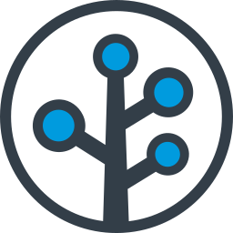</a> | **branch-icon.svg** Vector (SVG) \| 3.93KB 更新: 2026-02-26 |
|  | **branch.svg** Vector (SVG) \| 12.45KB 更新: 2026-02-26 |
|  | **brandfolder-icon.svg** Vector (SVG) \| 3.27KB 更新: 2026-02-26 |
|  | **brandfolder.svg** Vector (SVG) \| 16.81KB 更新: 2026-02-26 |
|  | **brave.svg** Vector (SVG) \| 7.73KB 更新: 2026-02-26 |
|  | **braze-icon.svg** Vector (SVG) \| 2.06KB 更新: 2026-02-26 |
| <a href="braze.svg">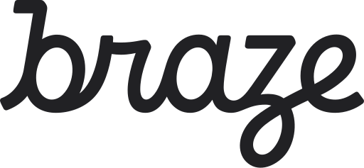</a> | **braze.svg** Vector (SVG) \| 6.84KB 更新: 2026-02-26 |
|  | **broadcom-icon.svg** Vector (SVG) \| 2.43KB 更新: 2026-02-26 |
|  | **broadcom.svg** Vector (SVG) \| 6.64KB 更新: 2026-02-26 |
|  | **broccoli.svg** Vector (SVG) \| 4.06KB 更新: 2026-02-26 |
|  | **brotli.svg** Vector (SVG) \| 1.51KB 更新: 2026-02-26 |
|  | **browserify-icon.svg** Vector (SVG) \| 16.04KB 更新: 2026-02-26 |
|  | **browserify.svg** Vector (SVG) \| 111.95KB 更新: 2026-02-26 |
|  | **browserling.svg** Vector (SVG) \| 3.06KB 更新: 2026-02-26 |
|  | **browserslist.svg** Vector (SVG) \| 2.92KB 更新: 2026-02-26 |
|  | **browserstack.svg** Vector (SVG) \| 1.69KB 更新: 2026-02-26 |
|  | **browsersync.svg** Vector (SVG) \| 1.03KB 更新: 2026-02-26 |
|  | **brunch.svg** Vector (SVG) \| 3.14KB 更新: 2026-02-26 |
|  | **bubble-icon.svg** Vector (SVG) \| 1.24KB 更新: 2026-02-26 |
|  | **bubble.svg** Vector (SVG) \| 3.95KB 更新: 2026-02-26 |
|  | **buck.svg** Vector (SVG) \| 1.24KB 更新: 2026-02-26 |
|  | **buddy.svg** Vector (SVG) \| 2.25KB 更新: 2026-02-26 |
|  | **buffer.svg** Vector (SVG) \| 3.14KB 更新: 2026-02-26 |
|  | **bugherd-icon.svg** Vector (SVG) \| 11.61KB 更新: 2026-02-26 |
|  | **bugherd.svg** Vector (SVG) \| 11.55KB 更新: 2026-02-26 |
|  | **bugsee.svg** Vector (SVG) \| 1.40KB 更新: 2026-02-26 |
|  | **bugsnag.svg** Vector (SVG) \| 2.24KB 更新: 2026-02-26 |
|  | **builder-io-icon.svg** Vector (SVG) \| 2.12KB 更新: 2026-02-26 |
|  | **builder-io.svg** Vector (SVG) \| 7.36KB 更新: 2026-02-26 |
|  | **buildkite-icon.svg** Vector (SVG) \| 686.00B 更新: 2026-02-26 |
|  | **buildkite.svg** Vector (SVG) \| 5.61KB 更新: 2026-02-26 |
|  | **bulma.svg** Vector (SVG) \| 437.00B 更新: 2026-02-26 |
|  | **bun.svg** Vector (SVG) \| 9.86KB 更新: 2026-02-26 |
|  | **bunny-net-icon.svg** Vector (SVG) \| 7.38KB 更新: 2026-02-26 |
|  | **bunny-net.svg** Vector (SVG) \| 16.01KB 更新: 2026-02-26 |
|  | **c-plusplus.svg** Vector (SVG) \| 3.51KB 更新: 2026-02-26 |
|  | **c-sharp.svg** Vector (SVG) \| 1.74KB 更新: 2026-02-26 |
|  | **c.svg** Vector (SVG) \| 1.76KB 更新: 2026-02-26 |
|  | **cachet.svg** Vector (SVG) \| 13.63KB 更新: 2026-02-26 |
|  | **cakephp-icon.svg** Vector (SVG) \| 1.17KB 更新: 2026-02-26 |
|  | **cakephp.svg** Vector (SVG) \| 5.29KB 更新: 2026-02-26 |
|  | **calibre-icon.svg** Vector (SVG) \| 756.00B 更新: 2026-02-26 |
|  | **calibre.svg** Vector (SVG) \| 10.51KB 更新: 2026-02-26 |
|  | **campaignmonitor-icon.svg** Vector (SVG) \| 951.00B 更新: 2026-02-26 |
|  | **campaignmonitor.svg** Vector (SVG) \| 16.30KB 更新: 2026-02-26 |
|  | **canjs.svg** Vector (SVG) \| 12.27KB 更新: 2026-02-26 |
|  | **capacitorjs-icon.svg** Vector (SVG) \| 1.17KB 更新: 2026-02-26 |
|  | **capacitorjs.svg** Vector (SVG) \| 6.08KB 更新: 2026-02-26 |
|  | **capistrano.svg** Vector (SVG) \| 24.86KB 更新: 2026-02-26 |
|  | **carbide.svg** Vector (SVG) \| 1.08KB 更新: 2026-02-26 |
|  | **cardano-icon.svg** Vector (SVG) \| 10.77KB 更新: 2026-02-26 |
|  | **cardano.svg** Vector (SVG) \| 17.17KB 更新: 2026-02-26 |
|  | **cassandra.svg** Vector (SVG) \| 14.97KB 更新: 2026-02-26 |
|  | **centos-icon.svg** Vector (SVG) \| 5.21KB 更新: 2026-02-26 |
|  | **centos.svg** Vector (SVG) \| 9.57KB 更新: 2026-02-26 |
|  | **certbot.svg** Vector (SVG) \| 16.55KB 更新: 2026-02-26 |
|  | **ceylon.svg** Vector (SVG) \| 15.26KB 更新: 2026-02-26 |
|  | **chai.svg** Vector (SVG) \| 4.17KB 更新: 2026-02-26 |
|  | **chalk.svg** Vector (SVG) \| 188.25KB 更新: 2026-02-26 |
|  | **chargebee-icon.svg** Vector (SVG) \| 9.03KB 更新: 2026-02-26 |
|  | **chargebee.svg** Vector (SVG) \| 9.29KB 更新: 2026-02-26 |
|  | **chef.svg** Vector (SVG) \| 6.85KB 更新: 2026-02-26 |
|  | **chevereto.svg** Vector (SVG) \| 21.66KB 更新: 2026-02-26 |
|  | **chroma.svg** Vector (SVG) \| 807.00B 更新: 2026-02-26 |
|  | **chromatic-icon.svg** Vector (SVG) \| 2.60KB 更新: 2026-02-26 |
|  | **chromatic.svg** Vector (SVG) \| 8.20KB 更新: 2026-02-26 |
|  | **chrome-web-store.svg** Vector (SVG) \| 3.59KB 更新: 2026-02-26 |
|  | **chrome.svg** Vector (SVG) \| 2.98KB 更新: 2026-02-26 |
|  | **cinder.svg** Vector (SVG) \| 6.92KB 更新: 2026-02-26 |
|  | **circleci.svg** Vector (SVG) \| 1.33KB 更新: 2026-02-26 |
|  | **cirrus-ci.svg** Vector (SVG) \| 1.89KB 更新: 2026-02-26 |
|  | **cirrus.svg** Vector (SVG) \| 6.16KB 更新: 2026-02-26 |
|  | **clio-lang.svg** Vector (SVG) \| 3.84KB 更新: 2026-02-26 |
|  | **clion.svg** Vector (SVG) \| 3.40KB 更新: 2026-02-26 |
|  | **cljs.svg** Vector (SVG) \| 3.71KB 更新: 2026-02-26 |
|  | **clojure.svg** Vector (SVG) \| 2.89KB 更新: 2026-02-26 |
|  | **close.svg** Vector (SVG) \| 31.95KB 更新: 2026-02-26 |
|  | **cloud9.svg** Vector (SVG) \| 13.11KB 更新: 2026-02-26 |
|  | **cloudacademy-icon.svg** Vector (SVG) \| 9.21KB 更新: 2026-02-26 |
|  | **cloudacademy.svg** Vector (SVG) \| 27.30KB 更新: 2026-02-26 |
|  | **cloudcraft.svg** Vector (SVG) \| 3.88KB 更新: 2026-02-26 |
|  | **cloudflare-workers-icon.svg** Vector (SVG) \| 5.90KB 更新: 2026-02-26 |
|  | **cloudflare-workers.svg** Vector (SVG) \| 14.18KB 更新: 2026-02-26 |
|  | **cloudflare.svg** Vector (SVG) \| 2.24KB 更新: 2026-02-26 |
|  | **cloudinary-icon.svg** Vector (SVG) \| 4.25KB 更新: 2026-02-26 |
|  | **cloudinary.svg** Vector (SVG) \| 15.11KB 更新: 2026-02-26 |
|  | **cloudlinux.svg** Vector (SVG) \| 9.18KB 更新: 2026-02-26 |
|  | **cobalt.svg** Vector (SVG) \| 4.25KB 更新: 2026-02-26 |
|  | **cockpit.svg** Vector (SVG) \| 863.00B 更新: 2026-02-26 |
|  | **cocoapods.svg** Vector (SVG) \| 1.22KB 更新: 2026-02-26 |
|  | **coda-icon.svg** Vector (SVG) \| 1.43KB 更新: 2026-02-26 |
|  | **coda.svg** Vector (SVG) \| 3.04KB 更新: 2026-02-26 |
|  | **codacy.svg** Vector (SVG) \| 1.87KB 更新: 2026-02-26 |
|  | **codebase.svg** Vector (SVG) \| 9.28KB 更新: 2026-02-26 |
|  | **codebeat.svg** Vector (SVG) \| 856.00B 更新: 2026-02-26 |
|  | **codecademy.svg** Vector (SVG) \| 17.05KB 更新: 2026-02-26 |
|  | **codeception.svg** Vector (SVG) \| 1.54KB 更新: 2026-02-26 |
|  | **codeclimate-icon.svg** Vector (SVG) \| 730.00B 更新: 2026-02-26 |
|  | **codeclimate.svg** Vector (SVG) \| 8.22KB 更新: 2026-02-26 |
|  | **codecov-icon.svg** Vector (SVG) \| 3.11KB 更新: 2026-02-26 |
|  | **codecov.svg** Vector (SVG) \| 7.26KB 更新: 2026-02-26 |
|  | **codefactor-icon.svg** Vector (SVG) \| 2.36KB 更新: 2026-02-26 |
|  | **codefactor.svg** Vector (SVG) \| 10.82KB 更新: 2026-02-26 |
|  | **codeigniter-icon.svg** Vector (SVG) \| 2.04KB 更新: 2026-02-26 |
|  | **codeigniter.svg** Vector (SVG) \| 18.23KB 更新: 2026-02-26 |
|  | **codepen-icon.svg** Vector (SVG) \| 2.68KB 更新: 2026-02-26 |
|  | **codepen.svg** Vector (SVG) \| 8.94KB 更新: 2026-02-26 |
|  | **codersrank-icon.svg** Vector (SVG) \| 3.20KB 更新: 2026-02-26 |
|  | **codersrank.svg** Vector (SVG) \| 14.69KB 更新: 2026-02-26 |
|  | **coderwall.svg** Vector (SVG) \| 641.00B 更新: 2026-02-26 |
|  | **codesandbox-icon.svg** Vector (SVG) \| 426.00B 更新: 2026-02-26 |
|  | **codesandbox.svg** Vector (SVG) \| 7.46KB 更新: 2026-02-26 |
|  | **codesee-icon.svg** Vector (SVG) \| 1.20KB 更新: 2026-02-26 |
|  | **codesee.svg** Vector (SVG) \| 6.00KB 更新: 2026-02-26 |
|  | **codio.svg** Vector (SVG) \| 1.04KB 更新: 2026-02-26 |
|  | **coffeescript.svg** Vector (SVG) \| 4.04KB 更新: 2026-02-26 |
|  | **commitizen.svg** Vector (SVG) \| 28.99KB 更新: 2026-02-26 |
|  | **compass.svg** Vector (SVG) \| 3.83KB 更新: 2026-02-26 |
|  | **componentkit.svg** Vector (SVG) \| 579.00B 更新: 2026-02-26 |
| <a href="compose-multiplatform.svg">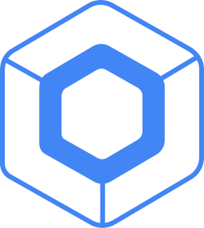</a> | **compose-multiplatform.svg** Vector (SVG) \| 5.53KB 更新: 2026-02-26 |
|  | **compose.svg** Vector (SVG) \| 1.38KB 更新: 2026-02-26 |
|  | **composer.svg** Vector (SVG) \| 198.54KB 更新: 2026-02-26 |
|  | **conan-io.svg** Vector (SVG) \| 1.08KB 更新: 2026-02-26 |
| <a href="concourse.svg">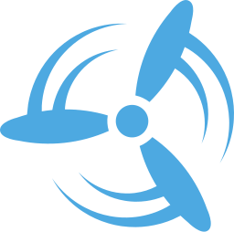</a> | **concourse.svg** Vector (SVG) \| 13.64KB 更新: 2026-02-26 |
|  | **concretecms-icon.svg** Vector (SVG) \| 2.34KB 更新: 2026-02-26 |
|  | **concretecms.svg** Vector (SVG) \| 15.50KB 更新: 2026-02-26 |
|  | **conda.svg** Vector (SVG) \| 19.39KB 更新: 2026-02-26 |
|  | **confluence.svg** Vector (SVG) \| 2.49KB 更新: 2026-02-26 |
|  | **consul.svg** Vector (SVG) \| 2.75KB 更新: 2026-02-26 |
|  | **contentful.svg** Vector (SVG) \| 2.10KB 更新: 2026-02-26 |
|  | **convox-icon.svg** Vector (SVG) \| 858.00B 更新: 2026-02-26 |
|  | **convox.svg** Vector (SVG) \| 6.00KB 更新: 2026-02-26 |
|  | **copyleft-pirate.svg** Vector (SVG) \| 9.09KB 更新: 2026-02-26 |
|  | **copyleft.svg** Vector (SVG) \| 1.31KB 更新: 2026-02-26 |
|  | **corda.svg** Vector (SVG) \| 2.77KB 更新: 2026-02-26 |
|  | **cordova.svg** Vector (SVG) \| 1.36KB 更新: 2026-02-26 |
|  | **couchbase.svg** Vector (SVG) \| 1.35KB 更新: 2026-02-26 |
|  | **couchdb-icon.svg** Vector (SVG) \| 2.39KB 更新: 2026-02-26 |
|  | **couchdb.svg** Vector (SVG) \| 11.33KB 更新: 2026-02-26 |
|  | **coursera.svg** Vector (SVG) \| 5.19KB 更新: 2026-02-26 |
|  | **coveralls.svg** Vector (SVG) \| 22.67KB 更新: 2026-02-26 |
|  | **cpanel.svg** Vector (SVG) \| 8.92KB 更新: 2026-02-26 |
|  | **craftcms.svg** Vector (SVG) \| 6.25KB 更新: 2026-02-26 |
|  | **crashlytics.svg** Vector (SVG) \| 2.08KB 更新: 2026-02-26 |
|  | **crateio.svg** Vector (SVG) \| 406.00B 更新: 2026-02-26 |
|  | **create-react-app.svg** Vector (SVG) \| 21.85KB 更新: 2026-02-26 |
|  | **createjs.svg** Vector (SVG) \| 1.94KB 更新: 2026-02-26 |
|  | **crucible.svg** Vector (SVG) \| 1.69KB 更新: 2026-02-26 |
|  | **crystal.svg** Vector (SVG) \| 452.00B 更新: 2026-02-26 |
|  | **css-3.svg** Vector (SVG) \| 2.44KB 更新: 2026-02-26 |
|  | **css-3_official.svg** Vector (SVG) \| 647.00B 更新: 2026-02-26 |
|  | **cssnext.svg** Vector (SVG) \| 5.13KB 更新: 2026-02-26 |
|  | **cube-icon.svg** Vector (SVG) \| 1.08KB 更新: 2026-02-26 |
|  | **cube.svg** Vector (SVG) \| 3.76KB 更新: 2026-02-26 |
|  | **cucumber.svg** Vector (SVG) \| 5.54KB 更新: 2026-02-26 |
|  | **curl.svg** Vector (SVG) \| 8.17KB 更新: 2026-02-26 |
|  | **customerio-icon.svg** Vector (SVG) \| 1.70KB 更新: 2026-02-26 |
|  | **customerio.svg** Vector (SVG) \| 12.25KB 更新: 2026-02-26 |
|  | **cyclejs.svg** Vector (SVG) \| 1.55KB 更新: 2026-02-26 |
|  | **cypress-icon.svg** Vector (SVG) \| 4.24KB 更新: 2026-02-26 |
|  | **cypress.svg** Vector (SVG) \| 8.05KB 更新: 2026-02-26 |
|  | **d3.svg** Vector (SVG) \| 4.90KB 更新: 2026-02-26 |
|  | **dailydev-icon.svg** Vector (SVG) \| 1.22KB 更新: 2026-02-26 |
|  | **dailydev.svg** Vector (SVG) \| 7.58KB 更新: 2026-02-26 |
|  | **daisyUI.svg** Vector (SVG) \| 8.13KB 更新: 2026-02-26 |
|  | **danfo.svg** Vector (SVG) \| 1.50KB 更新: 2026-02-26 |
|  | **dart.svg** Vector (SVG) \| 3.27KB 更新: 2026-02-26 |
|  | **dashlane-icon.svg** Vector (SVG) \| 2.87KB 更新: 2026-02-26 |
|  | **dashlane.svg** Vector (SVG) \| 14.03KB 更新: 2026-02-26 |
|  | **data-station.svg** Vector (SVG) \| 1.68KB 更新: 2026-02-26 |
|  | **database-labs.svg** Vector (SVG) \| 4.44KB 更新: 2026-02-26 |
|  | **datadog.svg** Vector (SVG) \| 7.89KB 更新: 2026-02-26 |
|  | **datagrip.svg** Vector (SVG) \| 4.07KB 更新: 2026-02-26 |
|  | **dataspell.svg** Vector (SVG) \| 3.39KB 更新: 2026-02-26 |
|  | **datocms-icon.svg** Vector (SVG) \| 1.16KB 更新: 2026-02-26 |
|  | **datocms.svg** Vector (SVG) \| 4.95KB 更新: 2026-02-26 |
|  | **dbt-icon.svg** Vector (SVG) \| 2.97KB 更新: 2026-02-26 |
|  | **dbt.svg** Vector (SVG) \| 6.32KB 更新: 2026-02-26 |
|  | **dcos-icon.svg** Vector (SVG) \| 2.02KB 更新: 2026-02-26 |
|  | **dcos.svg** Vector (SVG) \| 11.88KB 更新: 2026-02-26 |
|  | **debian.svg** Vector (SVG) \| 7.88KB 更新: 2026-02-26 |
|  | **delighted-icon.svg** Vector (SVG) \| 1.23KB 更新: 2026-02-26 |
|  | **delighted.svg** Vector (SVG) \| 10.05KB 更新: 2026-02-26 |
|  | **deno.svg** Vector (SVG) \| 5.77KB 更新: 2026-02-26 |
|  | **dependabot.svg** Vector (SVG) \| 3.44KB 更新: 2026-02-26 |
|  | **deployhq-icon.svg** Vector (SVG) \| 1.93KB 更新: 2026-02-26 |
|  | **deployhq.svg** Vector (SVG) \| 8.04KB 更新: 2026-02-26 |
|  | **derby.svg** Vector (SVG) \| 2.76KB 更新: 2026-02-26 |
|  | **descript-icon.svg** Vector (SVG) \| 1.58KB 更新: 2026-02-26 |
|  | **descript.svg** Vector (SVG) \| 6.36KB 更新: 2026-02-26 |
|  | **designernews.svg** Vector (SVG) \| 1.62KB 更新: 2026-02-26 |
|  | **deviantart-icon.svg** Vector (SVG) \| 824.00B 更新: 2026-02-26 |
|  | **deviantart.svg** Vector (SVG) \| 3.80KB 更新: 2026-02-26 |
|  | **dgraph-icon.svg** Vector (SVG) \| 2.20KB 更新: 2026-02-26 |
|  | **dgraph.svg** Vector (SVG) \| 9.86KB 更新: 2026-02-26 |
|  | **dialogflow.svg** Vector (SVG) \| 1.78KB 更新: 2026-02-26 |
|  | **digital-ocean.svg** Vector (SVG) \| 12.39KB 更新: 2026-02-26 |
|  | **dimer.svg** Vector (SVG) \| 11.34KB 更新: 2026-02-26 |
|  | **dinersclub.svg** Vector (SVG) \| 25.04KB 更新: 2026-02-26 |
|  | **discord-icon.svg** Vector (SVG) \| 1.91KB 更新: 2026-02-26 |
|  | **discord.svg** Vector (SVG) \| 9.10KB 更新: 2026-02-26 |
|  | **discourse-icon.svg** Vector (SVG) \| 2.37KB 更新: 2026-02-26 |
|  | **discourse.svg** Vector (SVG) \| 10.46KB 更新: 2026-02-26 |
|  | **discover.svg** Vector (SVG) \| 5.04KB 更新: 2026-02-26 |
|  | **disqus.svg** Vector (SVG) \| 1.21KB 更新: 2026-02-26 |
|  | **django-icon.svg** Vector (SVG) \| 1.50KB 更新: 2026-02-26 |
|  | **django.svg** Vector (SVG) \| 4.68KB 更新: 2026-02-26 |
|  | **dockbit.svg** Vector (SVG) \| 1.62KB 更新: 2026-02-26 |
|  | **docker-icon.svg** Vector (SVG) \| 2.31KB 更新: 2026-02-26 |
|  | **docker.svg** Vector (SVG) \| 12.37KB 更新: 2026-02-26 |
|  | **doctrine.svg** Vector (SVG) \| 1.28KB 更新: 2026-02-26 |
|  | **docusaurus.svg** Vector (SVG) \| 18.73KB 更新: 2026-02-26 |
|  | **dojo-icon.svg** Vector (SVG) \| 20.59KB 更新: 2026-02-26 |
|  | **dojo-toolkit.svg** Vector (SVG) \| 3.83KB 更新: 2026-02-26 |
|  | **dojo.svg** Vector (SVG) \| 22.69KB 更新: 2026-02-26 |
|  | **dolt.svg** Vector (SVG) \| 3.20KB 更新: 2026-02-26 |
|  | **dotnet.svg** Vector (SVG) \| 3.00KB 更新: 2026-02-26 |
|  | **dovetail-icon.svg** Vector (SVG) \| 649.00B 更新: 2026-02-26 |
|  | **dovetail.svg** Vector (SVG) \| 6.45KB 更新: 2026-02-26 |
|  | **dreamhost.svg** Vector (SVG) \| 1.18KB 更新: 2026-02-26 |
|  | **dribbble-icon.svg** Vector (SVG) \| 1.69KB 更新: 2026-02-26 |
|  | **dribbble.svg** Vector (SVG) \| 7.26KB 更新: 2026-02-26 |
|  | **drift.svg** Vector (SVG) \| 3.43KB 更新: 2026-02-26 |
|  | **drip.svg** Vector (SVG) \| 4.04KB 更新: 2026-02-26 |
|  | **drizzle-icon.svg** Vector (SVG) \| 10.33KB 更新: 2026-02-26 |
|  | **drizzle.svg** Vector (SVG) \| 18.50KB 更新: 2026-02-26 |
|  | **drone-icon.svg** Vector (SVG) \| 2.10KB 更新: 2026-02-26 |
|  | **drone.svg** Vector (SVG) \| 5.85KB 更新: 2026-02-26 |
|  | **drools-icon.svg** Vector (SVG) \| 3.67KB 更新: 2026-02-26 |
|  | **drools.svg** Vector (SVG) \| 10.28KB 更新: 2026-02-26 |
|  | **dropbox.svg** Vector (SVG) \| 752.00B 更新: 2026-02-26 |
|  | **dropmark.svg** Vector (SVG) \| 818.00B 更新: 2026-02-26 |
|  | **dropzone.svg** Vector (SVG) \| 1.70KB 更新: 2026-02-26 |
|  | **drupal-icon.svg** Vector (SVG) \| 3.51KB 更新: 2026-02-26 |
|  | **drupal.svg** Vector (SVG) \| 6.38KB 更新: 2026-02-26 |
|  | **duckduckgo.svg** Vector (SVG) \| 8.08KB 更新: 2026-02-26 |
|  | **dynatrace-icon.svg** Vector (SVG) \| 3.51KB 更新: 2026-02-26 |
|  | **dynatrace.svg** Vector (SVG) \| 11.73KB 更新: 2026-02-26 |
|  | **dyndns.svg** Vector (SVG) \| 2.21KB 更新: 2026-02-26 |
|  | **ebanx.svg** Vector (SVG) \| 3.47KB 更新: 2026-02-26 |
|  | **eclipse-icon.svg** Vector (SVG) \| 4.39KB 更新: 2026-02-26 |
|  | **eclipse.svg** Vector (SVG) \| 11.05KB 更新: 2026-02-26 |
|  | **ecma.svg** Vector (SVG) \| 11.65KB 更新: 2026-02-26 |
|  | **edgedb.svg** Vector (SVG) \| 3.34KB 更新: 2026-02-26 |
|  | **edgio-icon.svg** Vector (SVG) \| 1.71KB 更新: 2026-02-26 |
|  | **edgio.svg** Vector (SVG) \| 4.81KB 更新: 2026-02-26 |
|  | **editorconfig.svg** Vector (SVG) \| 12.19KB 更新: 2026-02-26 |
|  | **egghead.svg** Vector (SVG) \| 11.01KB 更新: 2026-02-26 |
|  | **elasticpath-icon.svg** Vector (SVG) \| 2.74KB 更新: 2026-02-26 |
|  | **elasticpath.svg** Vector (SVG) \| 11.39KB 更新: 2026-02-26 |
|  | **elasticsearch.svg** Vector (SVG) \| 1.26KB 更新: 2026-02-26 |
|  | **electron.svg** Vector (SVG) \| 5.31KB 更新: 2026-02-26 |
|  | **element.svg** Vector (SVG) \| 2.13KB 更新: 2026-02-26 |
| <a href="elemental-ui.svg">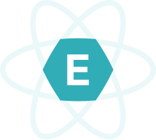</a> | **elemental-ui.svg** Vector (SVG) \| 5.22KB 更新: 2026-02-26 |
|  | **elementary.svg** Vector (SVG) \| 2.94KB 更新: 2026-02-26 |
|  | **eleventy.svg** Vector (SVG) \| 11.98KB 更新: 2026-02-26 |
|  | **ello.svg** Vector (SVG) \| 860.00B 更新: 2026-02-26 |
|  | **elm-classic.svg** Vector (SVG) \| 940.00B 更新: 2026-02-26 |
|  | **elm.svg** Vector (SVG) \| 1.09KB 更新: 2026-02-26 |
|  | **elo.svg** Vector (SVG) \| 3.85KB 更新: 2026-02-26 |
|  | **emacs-classic.svg** Vector (SVG) \| 12.15KB 更新: 2026-02-26 |
|  | **emacs.svg** Vector (SVG) \| 3.69KB 更新: 2026-02-26 |
|  | **embedly.svg** Vector (SVG) \| 988.00B 更新: 2026-02-26 |
|  | **ember-tomster.svg** Vector (SVG) \| 54.29KB 更新: 2026-02-26 |
|  | **ember.svg** Vector (SVG) \| 10.45KB 更新: 2026-02-26 |
|  | **emmet.svg** Vector (SVG) \| 885.00B 更新: 2026-02-26 |
|  | **enact.svg** Vector (SVG) \| 1005.00B 更新: 2026-02-26 |
|  | **engine-yard-icon.svg** Vector (SVG) \| 2.18KB 更新: 2026-02-26 |
|  | **engine-yard.svg** Vector (SVG) \| 13.82KB 更新: 2026-02-26 |
|  | **envato.svg** Vector (SVG) \| 6.25KB 更新: 2026-02-26 |
|  | **envoy-icon.svg** Vector (SVG) \| 2.89KB 更新: 2026-02-26 |
|  | **envoy.svg** Vector (SVG) \| 9.29KB 更新: 2026-02-26 |
|  | **envoyer.svg** Vector (SVG) \| 2.75KB 更新: 2026-02-26 |
|  | **epsagon-icon.svg** Vector (SVG) \| 16.50KB 更新: 2026-02-26 |
|  | **epsagon.svg** Vector (SVG) \| 27.65KB 更新: 2026-02-26 |
|  | **eraser-icon.svg** Vector (SVG) \| 743.00B 更新: 2026-02-26 |
|  | **eraser.svg** Vector (SVG) \| 7.49KB 更新: 2026-02-26 |
| <a href="erlang.svg">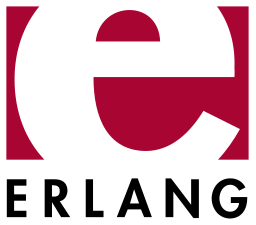</a> | **erlang.svg** Vector (SVG) \| 4.04KB 更新: 2026-02-26 |
|  | **esbuild.svg** Vector (SVG) \| 642.00B 更新: 2026-02-26 |
|  | **esdoc.svg** Vector (SVG) \| 2.76KB 更新: 2026-02-26 |
|  | **eslint-old.svg** Vector (SVG) \| 1.06KB 更新: 2026-02-26 |
|  | **eslint.svg** Vector (SVG) \| 1.97KB 更新: 2026-02-26 |
|  | **eta-icon.svg** Vector (SVG) \| 3.04KB 更新: 2026-02-26 |
|  | **eta.svg** Vector (SVG) \| 7.51KB 更新: 2026-02-26 |
|  | **etcd.svg** Vector (SVG) \| 3.84KB 更新: 2026-02-26 |
|  | **ethereum-color.svg** Vector (SVG) \| 1.36KB 更新: 2026-02-26 |
|  | **ethereum.svg** Vector (SVG) \| 895.00B 更新: 2026-02-26 |
|  | **ethers.svg** Vector (SVG) \| 1.10KB 更新: 2026-02-26 |
|  | **ethnio.svg** Vector (SVG) \| 1.01KB 更新: 2026-02-26 |
|  | **eventbrite-icon.svg** Vector (SVG) \| 1.12KB 更新: 2026-02-26 |
|  | **eventbrite.svg** Vector (SVG) \| 5.55KB 更新: 2026-02-26 |
|  | **eventsentry.svg** Vector (SVG) \| 1.98KB 更新: 2026-02-26 |
|  | **evergreen-icon.svg** Vector (SVG) \| 741.00B 更新: 2026-02-26 |
|  | **evergreen.svg** Vector (SVG) \| 4.38KB 更新: 2026-02-26 |
|  | **expo-icon.svg** Vector (SVG) \| 1.20KB 更新: 2026-02-26 |
|  | **expo.svg** Vector (SVG) \| 3.03KB 更新: 2026-02-26 |
|  | **express.svg** Vector (SVG) \| 11.29KB 更新: 2026-02-26 |
|  | **fabric.svg** Vector (SVG) \| 3.88KB 更新: 2026-02-26 |
|  | **facebook.svg** Vector (SVG) \| 1020.00B 更新: 2026-02-26 |
|  | **falcor.svg** Vector (SVG) \| 2.32KB 更新: 2026-02-26 |
|  | **fastify-icon.svg** Vector (SVG) \| 2.64KB 更新: 2026-02-26 |
|  | **fastify.svg** Vector (SVG) \| 7.13KB 更新: 2026-02-26 |
|  | **fastlane.svg** Vector (SVG) \| 3.59KB 更新: 2026-02-26 |
|  | **fastly.svg** Vector (SVG) \| 14.10KB 更新: 2026-02-26 |
|  | **fauna-icon.svg** Vector (SVG) \| 1.25KB 更新: 2026-02-26 |
|  | **fauna.svg** Vector (SVG) \| 4.10KB 更新: 2026-02-26 |
|  | **feathersjs.svg** Vector (SVG) \| 1.74KB 更新: 2026-02-26 |
|  | **fedora.svg** Vector (SVG) \| 2.32KB 更新: 2026-02-26 |
|  | **fetch.svg** Vector (SVG) \| 1.40KB 更新: 2026-02-26 |
|  | **ffmpeg-icon.svg** Vector (SVG) \| 4.04KB 更新: 2026-02-26 |
|  | **ffmpeg.svg** Vector (SVG) \| 8.92KB 更新: 2026-02-26 |
|  | **figma.svg** Vector (SVG) \| 973.00B 更新: 2026-02-26 |
|  | **firebase.svg** Vector (SVG) \| 3.77KB 更新: 2026-02-26 |
|  | **firefox.svg** Vector (SVG) \| 15.49KB 更新: 2026-02-26 |
|  | **flannel.svg** Vector (SVG) \| 6.47KB 更新: 2026-02-26 |
|  | **flarum.svg** Vector (SVG) \| 4.25KB 更新: 2026-02-26 |
|  | **flask.svg** Vector (SVG) \| 36.17KB 更新: 2026-02-26 |
|  | **flat-ui.svg** Vector (SVG) \| 3.18KB 更新: 2026-02-26 |
|  | **flattr-icon.svg** Vector (SVG) \| 4.54KB 更新: 2026-02-26 |
|  | **flattr.svg** Vector (SVG) \| 2.59KB 更新: 2026-02-26 |
|  | **fleep.svg** Vector (SVG) \| 4.68KB 更新: 2026-02-26 |
|  | **flickr-icon.svg** Vector (SVG) \| 788.00B 更新: 2026-02-26 |
|  | **flickr.svg** Vector (SVG) \| 2.58KB 更新: 2026-02-26 |
|  | **flight.svg** Vector (SVG) \| 1.86KB 更新: 2026-02-26 |
|  | **floodio.svg** Vector (SVG) \| 2.05KB 更新: 2026-02-26 |
|  | **flow.svg** Vector (SVG) \| 1.68KB 更新: 2026-02-26 |
|  | **flowxo.svg** Vector (SVG) \| 2.41KB 更新: 2026-02-26 |
|  | **floydhub.svg** Vector (SVG) \| 1.91KB 更新: 2026-02-26 |
|  | **flutter.svg** Vector (SVG) \| 1.23KB 更新: 2026-02-26 |
|  | **flux.svg** Vector (SVG) \| 1.95KB 更新: 2026-02-26 |
|  | **fluxxor.svg** Vector (SVG) \| 8.75KB 更新: 2026-02-26 |
|  | **fly-icon.svg** Vector (SVG) \| 13.83KB 更新: 2026-02-26 |
|  | **fly.svg** Vector (SVG) \| 21.59KB 更新: 2026-02-26 |
|  | **fogbugz-icon.svg** Vector (SVG) \| 1.14KB 更新: 2026-02-26 |
|  | **fogbugz.svg** Vector (SVG) \| 14.76KB 更新: 2026-02-26 |
|  | **fomo-icon.svg** Vector (SVG) \| 2.95KB 更新: 2026-02-26 |
|  | **fomo.svg** Vector (SVG) \| 5.39KB 更新: 2026-02-26 |
|  | **font-awesome.svg** Vector (SVG) \| 3.99KB 更新: 2026-02-26 |
|  | **forestadmin-icon.svg** Vector (SVG) \| 1.41KB 更新: 2026-02-26 |
|  | **forestadmin.svg** Vector (SVG) \| 11.05KB 更新: 2026-02-26 |
|  | **forever.svg** Vector (SVG) \| 2.04KB 更新: 2026-02-26 |
|  | **formkeep.svg** Vector (SVG) \| 2.57KB 更新: 2026-02-26 |
|  | **fortran.svg** Vector (SVG) \| 2.59KB 更新: 2026-02-26 |
|  | **foundation.svg** Vector (SVG) \| 27.36KB 更新: 2026-02-26 |
|  | **foundationdb-icon.svg** Vector (SVG) \| 1012.00B 更新: 2026-02-26 |
|  | **foundationdb.svg** Vector (SVG) \| 7.79KB 更新: 2026-02-26 |
|  | **framer.svg** Vector (SVG) \| 405.00B 更新: 2026-02-26 |
|  | **framework7-icon.svg** Vector (SVG) \| 797.00B 更新: 2026-02-26 |
|  | **framework7.svg** Vector (SVG) \| 11.02KB 更新: 2026-02-26 |
|  | **freebsd.svg** Vector (SVG) \| 1.69KB 更新: 2026-02-26 |
|  | **freedcamp-icon.svg** Vector (SVG) \| 11.21KB 更新: 2026-02-26 |
|  | **freedcamp.svg** Vector (SVG) \| 19.97KB 更新: 2026-02-26 |
|  | **freedomdefined.svg** Vector (SVG) \| 4.66KB 更新: 2026-02-26 |
|  | **fresh.svg** Vector (SVG) \| 4.48KB 更新: 2026-02-26 |
|  | **frontapp.svg** Vector (SVG) \| 1.37KB 更新: 2026-02-26 |
| <a href="fsharp.svg">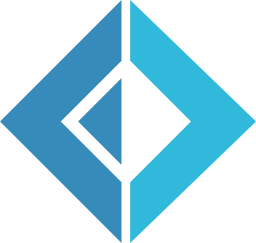</a> | **fsharp.svg** Vector (SVG) \| 780.00B 更新: 2026-02-26 |
|  | **fuchsia.svg** Vector (SVG) \| 2.79KB 更新: 2026-02-26 |
|  | **galliumos.svg** Vector (SVG) \| 3.22KB 更新: 2026-02-26 |
|  | **game-analytics-icon.svg** Vector (SVG) \| 1.67KB 更新: 2026-02-26 |
|  | **game-analytics.svg** Vector (SVG) \| 8.35KB 更新: 2026-02-26 |
|  | **ganache-icon.svg** Vector (SVG) \| 5.32KB 更新: 2026-02-26 |
|  | **ganache.svg** Vector (SVG) \| 29.85KB 更新: 2026-02-26 |
|  | **gatsby.svg** Vector (SVG) \| 1.15KB 更新: 2026-02-26 |
|  | **geekbot.svg** Vector (SVG) \| 7.92KB 更新: 2026-02-26 |
|  | **geetest-icon.svg** Vector (SVG) \| 2.05KB 更新: 2026-02-26 |
|  | **geetest.svg** Vector (SVG) \| 12.95KB 更新: 2026-02-26 |
|  | **getyourguide.svg** Vector (SVG) \| 8.08KB 更新: 2026-02-26 |
|  | **ghost.svg** Vector (SVG) \| 6.72KB 更新: 2026-02-26 |
|  | **giantswarm.svg** Vector (SVG) \| 3.41KB 更新: 2026-02-26 |
|  | **gin.svg** Vector (SVG) \| 101.43KB 更新: 2026-02-26 |
|  | **git-icon.svg** Vector (SVG) \| 1.67KB 更新: 2026-02-26 |
|  | **git.svg** Vector (SVG) \| 4.93KB 更新: 2026-02-26 |
|  | **gitboard.svg** Vector (SVG) \| 2.30KB 更新: 2026-02-26 |
|  | **github-actions.svg** Vector (SVG) \| 6.75KB 更新: 2026-02-26 |
|  | **github-copilot.svg** Vector (SVG) \| 3.32KB 更新: 2026-02-26 |
|  | **github-icon.svg** Vector (SVG) \| 3.82KB 更新: 2026-02-26 |
|  | **github-octocat.svg** Vector (SVG) \| 5.47KB 更新: 2026-02-26 |
|  | **github.svg** Vector (SVG) \| 5.97KB 更新: 2026-02-26 |
|  | **gitkraken.svg** Vector (SVG) \| 4.27KB 更新: 2026-02-26 |
|  | **gitlab.svg** Vector (SVG) \| 1.65KB 更新: 2026-02-26 |
|  | **gitter.svg** Vector (SVG) \| 955.00B 更新: 2026-02-26 |
|  | **gitup.svg** Vector (SVG) \| 4.07KB 更新: 2026-02-26 |
|  | **glamorous-icon.svg** Vector (SVG) \| 1.96KB 更新: 2026-02-26 |
|  | **glamorous.svg** Vector (SVG) \| 21.19KB 更新: 2026-02-26 |
|  | **gleam.svg** Vector (SVG) \| 989.00B 更新: 2026-02-26 |
|  | **glimmerjs.svg** Vector (SVG) \| 3.05KB 更新: 2026-02-26 |
|  | **glint.svg** Vector (SVG) \| 2.40KB 更新: 2026-02-26 |
|  | **glitch-icon.svg** Vector (SVG) \| 14.01KB 更新: 2026-02-26 |
|  | **glitch.svg** Vector (SVG) \| 16.74KB 更新: 2026-02-26 |
|  | **gnome-icon.svg** Vector (SVG) \| 1.30KB 更新: 2026-02-26 |
|  | **gnome.svg** Vector (SVG) \| 4.49KB 更新: 2026-02-26 |
|  | **gnu-net.svg** Vector (SVG) \| 25.18KB 更新: 2026-02-26 |
|  | **gnu.svg** Vector (SVG) \| 37.59KB 更新: 2026-02-26 |
|  | **gnupg-icon.svg** Vector (SVG) \| 4.72KB 更新: 2026-02-26 |
|  | **gnupg.svg** Vector (SVG) \| 10.53KB 更新: 2026-02-26 |
|  | **go.svg** Vector (SVG) \| 4.00KB 更新: 2026-02-26 |
|  | **gocd.svg** Vector (SVG) \| 5.98KB 更新: 2026-02-26 |
|  | **godot-icon.svg** Vector (SVG) \| 6.46KB 更新: 2026-02-26 |
|  | **godot.svg** Vector (SVG) \| 12.13KB 更新: 2026-02-26 |
|  | **gohorse.svg** Vector (SVG) \| 98.77KB 更新: 2026-02-26 |
|  | **goland.svg** Vector (SVG) \| 4.31KB 更新: 2026-02-26 |
|  | **google-360suite.svg** Vector (SVG) \| 17.10KB 更新: 2026-02-26 |
|  | **google-admob.svg** Vector (SVG) \| 1.59KB 更新: 2026-02-26 |
|  | **google-ads.svg** Vector (SVG) \| 975.00B 更新: 2026-02-26 |
|  | **google-adsense.svg** Vector (SVG) \| 1.62KB 更新: 2026-02-26 |
|  | **google-analytics.svg** Vector (SVG) \| 1.52KB 更新: 2026-02-26 |
|  | **google-bard-icon.svg** Vector (SVG) \| 3.12KB 更新: 2026-02-26 |
|  | **google-bard.svg** Vector (SVG) \| 7.76KB 更新: 2026-02-26 |
|  | **google-calendar.svg** Vector (SVG) \| 3.71KB 更新: 2026-02-26 |
|  | **google-cloud-functions.svg** Vector (SVG) \| 3.01KB 更新: 2026-02-26 |
|  | **google-cloud-run.svg** Vector (SVG) \| 1.79KB 更新: 2026-02-26 |
|  | **google-cloud.svg** Vector (SVG) \| 1.69KB 更新: 2026-02-26 |
|  | **google-data-studio.svg** Vector (SVG) \| 1.32KB 更新: 2026-02-26 |
|  | **google-developers.svg** Vector (SVG) \| 2.79KB 更新: 2026-02-26 |
|  | **google-domains-icon.svg** Vector (SVG) \| 1.39KB 更新: 2026-02-26 |
|  | **google-domains.svg** Vector (SVG) \| 12.59KB 更新: 2026-02-26 |
|  | **google-drive.svg** Vector (SVG) \| 2.50KB 更新: 2026-02-26 |
|  | **google-fit.svg** Vector (SVG) \| 3.05KB 更新: 2026-02-26 |
|  | **google-gmail.svg** Vector (SVG) \| 1.29KB 更新: 2026-02-26 |
|  | **google-home.svg** Vector (SVG) \| 3.35KB 更新: 2026-02-26 |
|  | **google-icon.svg** Vector (SVG) \| 1.31KB 更新: 2026-02-26 |
|  | **google-keep.svg** Vector (SVG) \| 799.00B 更新: 2026-02-26 |
|  | **google-maps.svg** Vector (SVG) \| 2.33KB 更新: 2026-02-26 |
|  | **google-marketing-platform.svg** Vector (SVG) \| 1.66KB 更新: 2026-02-26 |
|  | **google-meet.svg** Vector (SVG) \| 1.76KB 更新: 2026-02-26 |
|  | **google-one.svg** Vector (SVG) \| 4.51KB 更新: 2026-02-26 |
|  | **google-optimize.svg** Vector (SVG) \| 1.36KB 更新: 2026-02-26 |
|  | **google-pay.svg** Vector (SVG) \| 4.18KB 更新: 2026-02-26 |
|  | **google-photos.svg** Vector (SVG) \| 1.22KB 更新: 2026-02-26 |
|  | **google-play-console-icon.svg** Vector (SVG) \| 1.05KB 更新: 2026-02-26 |
|  | **google-play-console.svg** Vector (SVG) \| 13.60KB 更新: 2026-02-26 |
|  | **google-play-icon.svg** Vector (SVG) \| 1.34KB 更新: 2026-02-26 |
|  | **google-play.svg** Vector (SVG) \| 8.13KB 更新: 2026-02-26 |
|  | **google-search-console.svg** Vector (SVG) \| 3.52KB 更新: 2026-02-26 |
|  | **google-tag-manager.svg** Vector (SVG) \| 1.05KB 更新: 2026-02-26 |
|  | **google-workspace.svg** Vector (SVG) \| 12.85KB 更新: 2026-02-26 |
|  | **google.svg** Vector (SVG) \| 4.42KB 更新: 2026-02-26 |
|  | **gopher.svg** Vector (SVG) \| 21.19KB 更新: 2026-02-26 |
|  | **gradle.svg** Vector (SVG) \| 2.89KB 更新: 2026-02-26 |
|  | **grafana.svg** Vector (SVG) \| 14.04KB 更新: 2026-02-26 |
|  | **grails.svg** Vector (SVG) \| 12.44KB 更新: 2026-02-26 |
|  | **grammarly-icon.svg** Vector (SVG) \| 1.65KB 更新: 2026-02-26 |
|  | **grammarly.svg** Vector (SVG) \| 10.89KB 更新: 2026-02-26 |
|  | **graphene.svg** Vector (SVG) \| 2.29KB 更新: 2026-02-26 |
|  | **graphql.svg** Vector (SVG) \| 3.48KB 更新: 2026-02-26 |
|  | **grav.svg** Vector (SVG) \| 5.56KB 更新: 2026-02-26 |
|  | **gravatar-icon.svg** Vector (SVG) \| 1.19KB 更新: 2026-02-26 |
|  | **gravatar.svg** Vector (SVG) \| 14.04KB 更新: 2026-02-26 |
|  | **graylog-icon.svg** Vector (SVG) \| 2.45KB 更新: 2026-02-26 |
|  | **graylog.svg** Vector (SVG) \| 6.36KB 更新: 2026-02-26 |
|  | **greensock-icon.svg** Vector (SVG) \| 38.55KB 更新: 2026-02-26 |
|  | **greensock.svg** Vector (SVG) \| 62.80KB 更新: 2026-02-26 |
|  | **gridsome-icon.svg** Vector (SVG) \| 3.70KB 更新: 2026-02-26 |
|  | **gridsome.svg** Vector (SVG) \| 12.73KB 更新: 2026-02-26 |
|  | **grommet.svg** Vector (SVG) \| 8.92KB 更新: 2026-02-26 |
|  | **groovehq.svg** Vector (SVG) \| 5.49KB 更新: 2026-02-26 |
|  | **grove.svg** Vector (SVG) \| 2.17KB 更新: 2026-02-26 |
|  | **growth-book-icon.svg** Vector (SVG) \| 1.31KB 更新: 2026-02-26 |
|  | **growth-book.svg** Vector (SVG) \| 6.71KB 更新: 2026-02-26 |
|  | **grpc.svg** Vector (SVG) \| 8.33KB 更新: 2026-02-26 |
|  | **grunt.svg** Vector (SVG) \| 39.42KB 更新: 2026-02-26 |
|  | **gulp.svg** Vector (SVG) \| 3.67KB 更新: 2026-02-26 |
|  | **gunicorn.svg** Vector (SVG) \| 5.66KB 更新: 2026-02-26 |
|  | **gunjs.svg** Vector (SVG) \| 52.06KB 更新: 2026-02-26 |
|  | **gusto.svg** Vector (SVG) \| 4.61KB 更新: 2026-02-26 |
|  | **gwt.svg** Vector (SVG) \| 3.29KB 更新: 2026-02-26 |
|  | **hack.svg** Vector (SVG) \| 798.00B 更新: 2026-02-26 |
|  | **hacker-one.svg** Vector (SVG) \| 1.62KB 更新: 2026-02-26 |
|  | **hadoop.svg** Vector (SVG) \| 37.63KB 更新: 2026-02-26 |
|  | **haiku-icon.svg** Vector (SVG) \| 4.10KB 更新: 2026-02-26 |
|  | **haiku.svg** Vector (SVG) \| 6.77KB 更新: 2026-02-26 |
|  | **haml.svg** Vector (SVG) \| 21.91KB 更新: 2026-02-26 |
|  | **hanami.svg** Vector (SVG) \| 1.45KB 更新: 2026-02-26 |
|  | **handlebars.svg** Vector (SVG) \| 2.84KB 更新: 2026-02-26 |
|  | **hapi.svg** Vector (SVG) \| 15.11KB 更新: 2026-02-26 |
|  | **hardhat-icon.svg** Vector (SVG) \| 4.39KB 更新: 2026-02-26 |
|  | **hardhat.svg** Vector (SVG) \| 8.45KB 更新: 2026-02-26 |
|  | **harness-icon.svg** Vector (SVG) \| 2.33KB 更新: 2026-02-26 |
|  | **harness.svg** Vector (SVG) \| 10.75KB 更新: 2026-02-26 |
|  | **hashicorp-icon.svg** Vector (SVG) \| 827.00B 更新: 2026-02-26 |
|  | **hashicorp.svg** Vector (SVG) \| 6.06KB 更新: 2026-02-26 |
|  | **hashnode-icon.svg** Vector (SVG) \| 970.00B 更新: 2026-02-26 |
|  | **hashnode.svg** Vector (SVG) \| 6.44KB 更新: 2026-02-26 |
|  | **haskell-icon.svg** Vector (SVG) \| 855.00B 更新: 2026-02-26 |
|  | **haskell.svg** Vector (SVG) \| 9.25KB 更新: 2026-02-26 |
|  | **hasura-icon.svg** Vector (SVG) \| 2.98KB 更新: 2026-02-26 |
|  | **hasura.svg** Vector (SVG) \| 6.74KB 更新: 2026-02-26 |
|  | **haxe.svg** Vector (SVG) \| 3.27KB 更新: 2026-02-26 |
|  | **haxl.svg** Vector (SVG) \| 833.00B 更新: 2026-02-26 |
|  | **hbase.svg** Vector (SVG) \| 8.48KB 更新: 2026-02-26 |
|  | **hcaptcha-icon.svg** Vector (SVG) \| 13.61KB 更新: 2026-02-26 |
|  | **hcaptcha.svg** Vector (SVG) \| 19.78KB 更新: 2026-02-26 |
|  | **headlessui-icon.svg** Vector (SVG) \| 3.88KB 更新: 2026-02-26 |
|  | **headlessui.svg** Vector (SVG) \| 11.58KB 更新: 2026-02-26 |
|  | **heap-icon.svg** Vector (SVG) \| 657.00B 更新: 2026-02-26 |
|  | **heap.svg** Vector (SVG) \| 3.40KB 更新: 2026-02-26 |
|  | **helm.svg** Vector (SVG) \| 19.96KB 更新: 2026-02-26 |
|  | **helpscout-icon.svg** Vector (SVG) \| 1.13KB 更新: 2026-02-26 |
|  | **helpscout.svg** Vector (SVG) \| 9.32KB 更新: 2026-02-26 |
|  | **hermes.svg** Vector (SVG) \| 9.60KB 更新: 2026-02-26 |
|  | **heroku-icon.svg** Vector (SVG) \| 1.80KB 更新: 2026-02-26 |
|  | **heroku-redis.svg** Vector (SVG) \| 1.51KB 更新: 2026-02-26 |
|  | **heroku.svg** Vector (SVG) \| 4.39KB 更新: 2026-02-26 |
|  | **hexo.svg** Vector (SVG) \| 1.03KB 更新: 2026-02-26 |
|  | **hhvm.svg** Vector (SVG) \| 897.00B 更新: 2026-02-26 |
|  | **hibernate.svg** Vector (SVG) \| 829.00B 更新: 2026-02-26 |
|  | **highcharts.svg** Vector (SVG) \| 923.00B 更新: 2026-02-26 |
|  | **hipercard.svg** Vector (SVG) \| 7.08KB 更新: 2026-02-26 |
|  | **homebrew.svg** Vector (SVG) \| 23.51KB 更新: 2026-02-26 |
|  | **hookstate.svg** Vector (SVG) \| 2.29KB 更新: 2026-02-26 |
|  | **hootsuite-icon.svg** Vector (SVG) \| 4.23KB 更新: 2026-02-26 |
|  | **hootsuite.svg** Vector (SVG) \| 13.21KB 更新: 2026-02-26 |
|  | **hosted-graphite.svg** Vector (SVG) \| 927.00B 更新: 2026-02-26 |
|  | **hostgator-icon.svg** Vector (SVG) \| 17.57KB 更新: 2026-02-26 |
|  | **hostgator.svg** Vector (SVG) \| 23.56KB 更新: 2026-02-26 |
|  | **hotjar-icon.svg** Vector (SVG) \| 2.12KB 更新: 2026-02-26 |
|  | **hotjar.svg** Vector (SVG) \| 7.92KB 更新: 2026-02-26 |
|  | **houndci.svg** Vector (SVG) \| 996.00B 更新: 2026-02-26 |
|  | **html-5.svg** Vector (SVG) \| 2.75KB 更新: 2026-02-26 |
|  | **html5-boilerplate.svg** Vector (SVG) \| 1.12KB 更新: 2026-02-26 |
|  | **httpie-icon.svg** Vector (SVG) \| 1.24KB 更新: 2026-02-26 |
|  | **httpie.svg** Vector (SVG) \| 11.75KB 更新: 2026-02-26 |
|  | **hubspot.svg** Vector (SVG) \| 4.84KB 更新: 2026-02-26 |
|  | **huggy.svg** Vector (SVG) \| 6.78KB 更新: 2026-02-26 |
|  | **hugo.svg** Vector (SVG) \| 365.01KB 更新: 2026-02-26 |
|  | **humongous.svg** Vector (SVG) \| 5.16KB 更新: 2026-02-26 |
|  | **hyper.svg** Vector (SVG) \| 1.84KB 更新: 2026-02-26 |
|  | **hyperapp.svg** Vector (SVG) \| 5.86KB 更新: 2026-02-26 |
|  | **ibm.svg** Vector (SVG) \| 4.66KB 更新: 2026-02-26 |
|  | **ieee.svg** Vector (SVG) \| 5.95KB 更新: 2026-02-26 |
|  | **ietf.svg** Vector (SVG) \| 14.61KB 更新: 2026-02-26 |
|  | **ifttt.svg** Vector (SVG) \| 1.14KB 更新: 2026-02-26 |
|  | **imagemin.svg** Vector (SVG) \| 25.79KB 更新: 2026-02-26 |
|  | **imba-icon.svg** Vector (SVG) \| 732.00B 更新: 2026-02-26 |
|  | **imba.svg** Vector (SVG) \| 8.63KB 更新: 2026-02-26 |
|  | **immer-icon.svg** Vector (SVG) \| 2.76KB 更新: 2026-02-26 |
|  | **immer.svg** Vector (SVG) \| 6.77KB 更新: 2026-02-26 |
|  | **immutable.svg** Vector (SVG) \| 10.65KB 更新: 2026-02-26 |
|  | **impala.svg** Vector (SVG) \| 4.52KB 更新: 2026-02-26 |
|  | **importio.svg** Vector (SVG) \| 722.00B 更新: 2026-02-26 |
|  | **incident-icon.svg** Vector (SVG) \| 1.44KB 更新: 2026-02-26 |
|  | **incident.svg** Vector (SVG) \| 6.73KB 更新: 2026-02-26 |
|  | **infer.svg** Vector (SVG) \| 871.00B 更新: 2026-02-26 |
|  | **inferno.svg** Vector (SVG) \| 1.70KB 更新: 2026-02-26 |
|  | **influxdb-icon.svg** Vector (SVG) \| 4.46KB 更新: 2026-02-26 |
|  | **influxdb.svg** Vector (SVG) \| 10.94KB 更新: 2026-02-26 |
| <a href="ink.svg">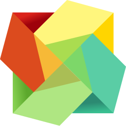</a> | **ink.svg** Vector (SVG) \| 2.70KB 更新: 2026-02-26 |
|  | **insomnia.svg** Vector (SVG) \| 1.65KB 更新: 2026-02-26 |
|  | **instagram-icon.svg** Vector (SVG) \| 4.21KB 更新: 2026-02-26 |
|  | **instagram.svg** Vector (SVG) \| 13.59KB 更新: 2026-02-26 |
|  | **intel.svg** Vector (SVG) \| 3.67KB 更新: 2026-02-26 |
|  | **intellij-idea.svg** Vector (SVG) \| 3.79KB 更新: 2026-02-26 |
|  | **intercom-icon.svg** Vector (SVG) \| 5.31KB 更新: 2026-02-26 |
|  | **intercom.svg** Vector (SVG) \| 11.88KB 更新: 2026-02-26 |
|  | **internetexplorer.svg** Vector (SVG) \| 3.43KB 更新: 2026-02-26 |
|  | **invision-icon.svg** Vector (SVG) \| 2.14KB 更新: 2026-02-26 |
|  | **invision.svg** Vector (SVG) \| 4.56KB 更新: 2026-02-26 |
|  | **ionic-icon.svg** Vector (SVG) \| 1.86KB 更新: 2026-02-26 |
|  | **ionic.svg** Vector (SVG) \| 3.99KB 更新: 2026-02-26 |
|  | **ios.svg** Vector (SVG) \| 2.12KB 更新: 2026-02-26 |
|  | **iron-icon.svg** Vector (SVG) \| 2.89KB 更新: 2026-02-26 |
|  | **iron.svg** Vector (SVG) \| 5.49KB 更新: 2026-02-26 |
|  | **itsalive-icon.svg** Vector (SVG) \| 1.48KB 更新: 2026-02-26 |
|  | **itsalive.svg** Vector (SVG) \| 12.16KB 更新: 2026-02-26 |
|  | **jade.svg** Vector (SVG) \| 20.04KB 更新: 2026-02-26 |
|  | **jamstack-icon.svg** Vector (SVG) \| 893.00B 更新: 2026-02-26 |
|  | **jamstack.svg** Vector (SVG) \| 6.05KB 更新: 2026-02-26 |
|  | **jasmine.svg** Vector (SVG) \| 2.63KB 更新: 2026-02-26 |
|  | **java.svg** Vector (SVG) \| 3.10KB 更新: 2026-02-26 |
|  | **javascript.svg** Vector (SVG) \| 1.67KB 更新: 2026-02-26 |
|  | **jcb.svg** Vector (SVG) \| 5.60KB 更新: 2026-02-26 |
|  | **jekyll.svg** Vector (SVG) \| 19.21KB 更新: 2026-02-26 |
|  | **jenkins.svg** Vector (SVG) \| 47.21KB 更新: 2026-02-26 |
|  | **jest.svg** Vector (SVG) \| 6.91KB 更新: 2026-02-26 |
|  | **jetbrains-icon.svg** Vector (SVG) \| 4.40KB 更新: 2026-02-26 |
|  | **jetbrains-space-icon.svg** Vector (SVG) \| 2.21KB 更新: 2026-02-26 |
|  | **jetbrains-space.svg** Vector (SVG) \| 8.29KB 更新: 2026-02-26 |
|  | **jetbrains.svg** Vector (SVG) \| 8.31KB 更新: 2026-02-26 |
|  | **jfrog.svg** Vector (SVG) \| 9.62KB 更新: 2026-02-26 |
|  | **jhipster-icon.svg** Vector (SVG) \| 843.00B 更新: 2026-02-26 |
|  | **jhipster.svg** Vector (SVG) \| 33.22KB 更新: 2026-02-26 |
|  | **jira.svg** Vector (SVG) \| 1.87KB 更新: 2026-02-26 |
|  | **joomla.svg** Vector (SVG) \| 2.89KB 更新: 2026-02-26 |
|  | **jotai.svg** Vector (SVG) \| 6.00KB 更新: 2026-02-26 |
|  | **jquery-mobile.svg** Vector (SVG) \| 1.95KB 更新: 2026-02-26 |
|  | **jquery.svg** Vector (SVG) \| 7.63KB 更新: 2026-02-26 |
|  | **jruby.svg** Vector (SVG) \| 2.25KB 更新: 2026-02-26 |
|  | **jsbin.svg** Vector (SVG) \| 13.10KB 更新: 2026-02-26 |
|  | **jsdelivr.svg** Vector (SVG) \| 3.77KB 更新: 2026-02-26 |
|  | **jsdom.svg** Vector (SVG) \| 2.21KB 更新: 2026-02-26 |
|  | **jsfiddle.svg** Vector (SVG) \| 4.20KB 更新: 2026-02-26 |
|  | **json-ld.svg** Vector (SVG) \| 7.08KB 更新: 2026-02-26 |
|  | **json.svg** Vector (SVG) \| 1.93KB 更新: 2026-02-26 |
|  | **jspm.svg** Vector (SVG) \| 1.54KB 更新: 2026-02-26 |
|  | **jss.svg** Vector (SVG) \| 2.91KB 更新: 2026-02-26 |
|  | **juju.svg** Vector (SVG) \| 4.99KB 更新: 2026-02-26 |
|  | **julia.svg** Vector (SVG) \| 7.62KB 更新: 2026-02-26 |
|  | **jupyter.svg** Vector (SVG) \| 9.44KB 更新: 2026-02-26 |
|  | **jwt-icon.svg** Vector (SVG) \| 1.79KB 更新: 2026-02-26 |
|  | **jwt.svg** Vector (SVG) \| 3.42KB 更新: 2026-02-26 |
|  | **kafka-icon.svg** Vector (SVG) \| 6.74KB 更新: 2026-02-26 |
|  | **kafka.svg** Vector (SVG) \| 9.44KB 更新: 2026-02-26 |
|  | **kaios.svg** Vector (SVG) \| 4.04KB 更新: 2026-02-26 |
|  | **kallithea.svg** Vector (SVG) \| 4.03KB 更新: 2026-02-26 |
|  | **karma.svg** Vector (SVG) \| 1.02KB 更新: 2026-02-26 |
|  | **katalon-icon.svg** Vector (SVG) \| 542.00B 更新: 2026-02-26 |
|  | **katalon.svg** Vector (SVG) \| 4.19KB 更新: 2026-02-26 |
|  | **kde.svg** Vector (SVG) \| 2.48KB 更新: 2026-02-26 |
|  | **keen.svg** Vector (SVG) \| 5.43KB 更新: 2026-02-26 |
|  | **kemal.svg** Vector (SVG) \| 685.00B 更新: 2026-02-26 |
|  | **keycdn-icon.svg** Vector (SVG) \| 4.94KB 更新: 2026-02-26 |
|  | **keycdn.svg** Vector (SVG) \| 11.87KB 更新: 2026-02-26 |
|  | **keydb-icon.svg** Vector (SVG) \| 3.89KB 更新: 2026-02-26 |
|  | **keydb.svg** Vector (SVG) \| 8.46KB 更新: 2026-02-26 |
|  | **keystonejs.svg** Vector (SVG) \| 1.65KB 更新: 2026-02-26 |
|  | **khan_academy-icon.svg** Vector (SVG) \| 1.55KB 更新: 2026-02-26 |
|  | **khan_academy.svg** Vector (SVG) \| 13.46KB 更新: 2026-02-26 |
|  | **kibana.svg** Vector (SVG) \| 690.00B 更新: 2026-02-26 |
|  | **kickstarter-icon.svg** Vector (SVG) \| 719.00B 更新: 2026-02-26 |
|  | **kickstarter.svg** Vector (SVG) \| 5.82KB 更新: 2026-02-26 |
|  | **kinto-icon.svg** Vector (SVG) \| 11.69KB 更新: 2026-02-26 |
|  | **kinto.svg** Vector (SVG) \| 16.78KB 更新: 2026-02-26 |
|  | **kirby-icon.svg** Vector (SVG) \| 834.00B 更新: 2026-02-26 |
|  | **kirby.svg** Vector (SVG) \| 3.48KB 更新: 2026-02-26 |
|  | **knex.svg** Vector (SVG) \| 8.83KB 更新: 2026-02-26 |
|  | **knockout.svg** Vector (SVG) \| 34.32KB 更新: 2026-02-26 |
|  | **koa.svg** Vector (SVG) \| 2.24KB 更新: 2026-02-26 |
|  | **kong-icon.svg** Vector (SVG) \| 1.12KB 更新: 2026-02-26 |
|  | **kong.svg** Vector (SVG) \| 3.75KB 更新: 2026-02-26 |
|  | **kops.svg** Vector (SVG) \| 11.81KB 更新: 2026-02-26 |
|  | **koreio.svg** Vector (SVG) \| 2.87KB 更新: 2026-02-26 |
|  | **kotlin-icon.svg** Vector (SVG) \| 755.00B 更新: 2026-02-26 |
|  | **kotlin.svg** Vector (SVG) \| 4.72KB 更新: 2026-02-26 |
|  | **kraken.svg** Vector (SVG) \| 4.72KB 更新: 2026-02-26 |
|  | **krakenjs.svg** Vector (SVG) \| 26.56KB 更新: 2026-02-26 |
| <a href="ktor-icon.svg">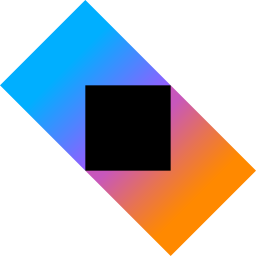</a> | **ktor-icon.svg** Vector (SVG) \| 1.50KB 更新: 2026-02-26 |
|  | **ktor.svg** Vector (SVG) \| 3.55KB 更新: 2026-02-26 |
|  | **kubernetes.svg** Vector (SVG) \| 15.03KB 更新: 2026-02-26 |
|  | **kustomer.svg** Vector (SVG) \| 8.40KB 更新: 2026-02-26 |
|  | **languagetool.svg** Vector (SVG) \| 3.67KB 更新: 2026-02-26 |
|  | **laravel.svg** Vector (SVG) \| 4.94KB 更新: 2026-02-26 |
|  | **lastfm.svg** Vector (SVG) \| 4.33KB 更新: 2026-02-26 |
|  | **lateral-icon.svg** Vector (SVG) \| 19.44KB 更新: 2026-02-26 |
|  | **lateral.svg** Vector (SVG) \| 24.38KB 更新: 2026-02-26 |
|  | **launchdarkly-icon.svg** Vector (SVG) \| 1.46KB 更新: 2026-02-26 |
|  | **launchdarkly.svg** Vector (SVG) \| 11.42KB 更新: 2026-02-26 |
|  | **launchrock.svg** Vector (SVG) \| 2.08KB 更新: 2026-02-26 |
|  | **leaflet.svg** Vector (SVG) \| 8.20KB 更新: 2026-02-26 |
|  | **leankit-icon.svg** Vector (SVG) \| 1.46KB 更新: 2026-02-26 |
|  | **leankit.svg** Vector (SVG) \| 32.93KB 更新: 2026-02-26 |
|  | **lerna.svg** Vector (SVG) \| 329.07KB 更新: 2026-02-26 |
|  | **less.svg** Vector (SVG) \| 4.71KB 更新: 2026-02-26 |
|  | **lets-cloud.svg** Vector (SVG) \| 15.44KB 更新: 2026-02-26 |
|  | **letsencrypt.svg** Vector (SVG) \| 17.20KB 更新: 2026-02-26 |
|  | **leveldb.svg** Vector (SVG) \| 893.00B 更新: 2026-02-26 |
|  | **lexical-icon.svg** Vector (SVG) \| 2.04KB 更新: 2026-02-26 |
|  | **lexical.svg** Vector (SVG) \| 8.00KB 更新: 2026-02-26 |
|  | **liftweb.svg** Vector (SVG) \| 1.21KB 更新: 2026-02-26 |
|  | **lighthouse.svg** Vector (SVG) \| 14.79KB 更新: 2026-02-26 |
|  | **lightstep-icon.svg** Vector (SVG) \| 1.99KB 更新: 2026-02-26 |
|  | **lightstep.svg** Vector (SVG) \| 7.35KB 更新: 2026-02-26 |
|  | **lighttpd.svg** Vector (SVG) \| 728.00B 更新: 2026-02-26 |
|  | **linear-icon.svg** Vector (SVG) \| 1.79KB 更新: 2026-02-26 |
|  | **linear.svg** Vector (SVG) \| 8.53KB 更新: 2026-02-26 |
|  | **linkedin-icon.svg** Vector (SVG) \| 1.59KB 更新: 2026-02-26 |
|  | **linkedin.svg** Vector (SVG) \| 4.71KB 更新: 2026-02-26 |
|  | **linkerd.svg** Vector (SVG) \| 3.66KB 更新: 2026-02-26 |
|  | **linode.svg** Vector (SVG) \| 9.68KB 更新: 2026-02-26 |
|  | **linux-mint.svg** Vector (SVG) \| 2.01KB 更新: 2026-02-26 |
|  | **linux-tux.svg** Vector (SVG) \| 18.02KB 更新: 2026-02-26 |
|  | **lit-icon.svg** Vector (SVG) \| 831.00B 更新: 2026-02-26 |
|  | **lit.svg** Vector (SVG) \| 2.25KB 更新: 2026-02-26 |
|  | **litmus.svg** Vector (SVG) \| 2.09KB 更新: 2026-02-26 |
|  | **loader.svg** Vector (SVG) \| 1.52KB 更新: 2026-02-26 |
|  | **lodash.svg** Vector (SVG) \| 1.86KB 更新: 2026-02-26 |
|  | **logentries.svg** Vector (SVG) \| 4.50KB 更新: 2026-02-26 |
|  | **logstash.svg** Vector (SVG) \| 723.00B 更新: 2026-02-26 |
|  | **lookback.svg** Vector (SVG) \| 4.72KB 更新: 2026-02-26 |
|  | **looker-icon.svg** Vector (SVG) \| 2.73KB 更新: 2026-02-26 |
|  | **looker.svg** Vector (SVG) \| 8.32KB 更新: 2026-02-26 |
|  | **loom-icon.svg** Vector (SVG) \| 1.31KB 更新: 2026-02-26 |
|  | **loom.svg** Vector (SVG) \| 3.40KB 更新: 2026-02-26 |
|  | **loopback-icon.svg** Vector (SVG) \| 1.88KB 更新: 2026-02-26 |
|  | **loopback.svg** Vector (SVG) \| 6.37KB 更新: 2026-02-26 |
|  | **losant.svg** Vector (SVG) \| 774.00B 更新: 2026-02-26 |
|  | **lua.svg** Vector (SVG) \| 11.94KB 更新: 2026-02-26 |
|  | **lucene.net.svg** Vector (SVG) \| 2.64KB 更新: 2026-02-26 |
|  | **lucene.svg** Vector (SVG) \| 6.33KB 更新: 2026-02-26 |
|  | **lumen.svg** Vector (SVG) \| 4.26KB 更新: 2026-02-26 |
|  | **macOS.svg** Vector (SVG) \| 4.09KB 更新: 2026-02-26 |
|  | **madge.svg** Vector (SVG) \| 6.22KB 更新: 2026-02-26 |
|  | **maestro.svg** Vector (SVG) \| 7.87KB 更新: 2026-02-26 |
|  | **mageia.svg** Vector (SVG) \| 7.22KB 更新: 2026-02-26 |
|  | **mailchimp-freddie.svg** Vector (SVG) \| 127.09KB 更新: 2026-02-26 |
|  | **mailchimp.svg** Vector (SVG) \| 16.24KB 更新: 2026-02-26 |
|  | **maildeveloper.svg** Vector (SVG) \| 1.70KB 更新: 2026-02-26 |
|  | **mailgun-icon.svg** Vector (SVG) \| 2.07KB 更新: 2026-02-26 |
|  | **mailgun.svg** Vector (SVG) \| 8.88KB 更新: 2026-02-26 |
|  | **mailjet-icon.svg** Vector (SVG) \| 522.00B 更新: 2026-02-26 |
|  | **mailjet.svg** Vector (SVG) \| 5.80KB 更新: 2026-02-26 |
|  | **malinajs.svg** Vector (SVG) \| 7.74KB 更新: 2026-02-26 |
|  | **manjaro.svg** Vector (SVG) \| 654.00B 更新: 2026-02-26 |
|  | **mantine-icon.svg** Vector (SVG) \| 2.69KB 更新: 2026-02-26 |
|  | **mantine.svg** Vector (SVG) \| 14.62KB 更新: 2026-02-26 |
|  | **mapbox-icon.svg** Vector (SVG) \| 984.00B 更新: 2026-02-26 |
|  | **mapbox.svg** Vector (SVG) \| 7.96KB 更新: 2026-02-26 |
|  | **maps-me.svg** Vector (SVG) \| 3.55KB 更新: 2026-02-26 |
|  | **mapzen-icon.svg** Vector (SVG) \| 3.20KB 更新: 2026-02-26 |
|  | **mapzen.svg** Vector (SVG) \| 6.40KB 更新: 2026-02-26 |
|  | **mariadb-icon.svg** Vector (SVG) \| 5.28KB 更新: 2026-02-26 |
|  | **mariadb.svg** Vector (SVG) \| 11.65KB 更新: 2026-02-26 |
|  | **marionette.svg** Vector (SVG) \| 7.79KB 更新: 2026-02-26 |
|  | **markdown.svg** Vector (SVG) \| 1.55KB 更新: 2026-02-26 |
|  | **marko.svg** Vector (SVG) \| 10.32KB 更新: 2026-02-26 |
|  | **marvel.svg** Vector (SVG) \| 6.10KB 更新: 2026-02-26 |
|  | **mastercard.svg** Vector (SVG) \| 7.98KB 更新: 2026-02-26 |
|  | **mastodon-icon.svg** Vector (SVG) \| 2.25KB 更新: 2026-02-26 |
|  | **mastodon.svg** Vector (SVG) \| 9.16KB 更新: 2026-02-26 |
|  | **material-ui.svg** Vector (SVG) \| 3.15KB 更新: 2026-02-26 |
|  | **materializecss.svg** Vector (SVG) \| 7.51KB 更新: 2026-02-26 |
|  | **matomo-icon.svg** Vector (SVG) \| 8.22KB 更新: 2026-02-26 |
|  | **matomo.svg** Vector (SVG) \| 14.06KB 更新: 2026-02-26 |
|  | **matplotlib-icon.svg** Vector (SVG) \| 269.35KB 更新: 2026-02-26 |
|  | **matplotlib.svg** Vector (SVG) \| 301.10KB 更新: 2026-02-26 |
|  | **matter-icon.svg** Vector (SVG) \| 1.34KB 更新: 2026-02-26 |
|  | **matter.svg** Vector (SVG) \| 4.79KB 更新: 2026-02-26 |
|  | **mattermost-icon.svg** Vector (SVG) \| 2.49KB 更新: 2026-02-26 |
|  | **mattermost.svg** Vector (SVG) \| 19.13KB 更新: 2026-02-26 |
|  | **mautic-icon.svg** Vector (SVG) \| 1.59KB 更新: 2026-02-26 |
|  | **mautic.svg** Vector (SVG) \| 4.94KB 更新: 2026-02-26 |
|  | **maven.svg** Vector (SVG) \| 62.20KB 更新: 2026-02-26 |
|  | **mdn.svg** Vector (SVG) \| 4.61KB 更新: 2026-02-26 |
|  | **mdx.svg** Vector (SVG) \| 2.10KB 更新: 2026-02-26 |
|  | **medium-icon.svg** Vector (SVG) \| 1.12KB 更新: 2026-02-26 |
|  | **medium.svg** Vector (SVG) \| 6.76KB 更新: 2026-02-26 |
|  | **medusa-icon.svg** Vector (SVG) \| 1.37KB 更新: 2026-02-26 |
|  | **medusa.svg** Vector (SVG) \| 7.77KB 更新: 2026-02-26 |
|  | **meilisearch.svg** Vector (SVG) \| 1.95KB 更新: 2026-02-26 |
|  | **memcached.svg** Vector (SVG) \| 5.89KB 更新: 2026-02-26 |
|  | **memgraph.svg** Vector (SVG) \| 185.66KB 更新: 2026-02-26 |
|  | **mention.svg** Vector (SVG) \| 7.64KB 更新: 2026-02-26 |
|  | **mercurial.svg** Vector (SVG) \| 14.30KB 更新: 2026-02-26 |
|  | **mesos.svg** Vector (SVG) \| 3.20KB 更新: 2026-02-26 |
|  | **messenger.svg** Vector (SVG) \| 1.74KB 更新: 2026-02-26 |
|  | **metabase.svg** Vector (SVG) \| 2.19KB 更新: 2026-02-26 |
|  | **metamask-icon.svg** Vector (SVG) \| 4.91KB 更新: 2026-02-26 |
|  | **metamask.svg** Vector (SVG) \| 15.50KB 更新: 2026-02-26 |
|  | **meteor-icon.svg** Vector (SVG) \| 1.97KB 更新: 2026-02-26 |
|  | **meteor.svg** Vector (SVG) \| 3.91KB 更新: 2026-02-26 |
|  | **micro-icon.svg** Vector (SVG) \| 5.38KB 更新: 2026-02-26 |
|  | **micro-python.svg** Vector (SVG) \| 647.00B 更新: 2026-02-26 |
|  | **micro.svg** Vector (SVG) \| 18.76KB 更新: 2026-02-26 |
|  | **microcosm.svg** Vector (SVG) \| 2.45KB 更新: 2026-02-26 |
|  | **micron-icon.svg** Vector (SVG) \| 3.52KB 更新: 2026-02-26 |
|  | **micron.svg** Vector (SVG) \| 5.92KB 更新: 2026-02-26 |
|  | **microsoft-azure.svg** Vector (SVG) \| 3.33KB 更新: 2026-02-26 |
|  | **microsoft-edge.svg** Vector (SVG) \| 4.68KB 更新: 2026-02-26 |
|  | **microsoft-icon.svg** Vector (SVG) \| 689.00B 更新: 2026-02-26 |
|  | **microsoft-onedrive.svg** Vector (SVG) \| 1.66KB 更新: 2026-02-26 |
|  | **microsoft-power-bi.svg** Vector (SVG) \| 2.84KB 更新: 2026-02-26 |
|  | **microsoft-teams.svg** Vector (SVG) \| 5.45KB 更新: 2026-02-26 |
|  | **microsoft-windows-icon.svg** Vector (SVG) \| 674.00B 更新: 2026-02-26 |
|  | **microsoft-windows.svg** Vector (SVG) \| 5.12KB 更新: 2026-02-26 |
|  | **microsoft.svg** Vector (SVG) \| 9.34KB 更新: 2026-02-26 |
|  | **mida-icon.svg** Vector (SVG) \| 3.60KB 更新: 2026-02-26 |
|  | **mida.svg** Vector (SVG) \| 5.43KB 更新: 2026-02-26 |
|  | **middleman.svg** Vector (SVG) \| 1.58KB 更新: 2026-02-26 |
|  | **milligram.svg** Vector (SVG) \| 1.36KB 更新: 2026-02-26 |
|  | **mindsdb-icon.svg** Vector (SVG) \| 4.33KB 更新: 2026-02-26 |
|  | **mindsdb.svg** Vector (SVG) \| 13.19KB 更新: 2026-02-26 |
|  | **mint-lang.svg** Vector (SVG) \| 8.64KB 更新: 2026-02-26 |
|  | **mio.svg** Vector (SVG) \| 5.93KB 更新: 2026-02-26 |
|  | **mist.svg** Vector (SVG) \| 2.72KB 更新: 2026-02-26 |
|  | **mithril.svg** Vector (SVG) \| 3.08KB 更新: 2026-02-26 |
|  | **mixmax.svg** Vector (SVG) \| 836.00B 更新: 2026-02-26 |
|  | **mixpanel.svg** Vector (SVG) \| 7.29KB 更新: 2026-02-26 |
|  | **mlab.svg** Vector (SVG) \| 8.58KB 更新: 2026-02-26 |
|  | **mobx.svg** Vector (SVG) \| 2.07KB 更新: 2026-02-26 |
|  | **mocha.svg** Vector (SVG) \| 7.69KB 更新: 2026-02-26 |
|  | **mockflow-icon.svg** Vector (SVG) \| 838.00B 更新: 2026-02-26 |
|  | **mockflow.svg** Vector (SVG) \| 6.40KB 更新: 2026-02-26 |
|  | **modernizr.svg** Vector (SVG) \| 524.00B 更新: 2026-02-26 |
|  | **modx-icon.svg** Vector (SVG) \| 938.00B 更新: 2026-02-26 |
|  | **modx.svg** Vector (SVG) \| 2.56KB 更新: 2026-02-26 |
|  | **momentjs.svg** Vector (SVG) \| 1.13KB 更新: 2026-02-26 |
|  | **monday-icon.svg** Vector (SVG) \| 1.37KB 更新: 2026-02-26 |
|  | **monday.svg** Vector (SVG) \| 7.79KB 更新: 2026-02-26 |
|  | **monero.svg** Vector (SVG) \| 1022.00B 更新: 2026-02-26 |
|  | **mongodb-icon.svg** Vector (SVG) \| 1.15KB 更新: 2026-02-26 |
|  | **mongodb.svg** Vector (SVG) \| 13.85KB 更新: 2026-02-26 |
|  | **mono.svg** Vector (SVG) \| 9.25KB 更新: 2026-02-26 |
|  | **moon.svg** Vector (SVG) \| 1.41KB 更新: 2026-02-26 |
|  | **mootools.svg** Vector (SVG) \| 7.61KB 更新: 2026-02-26 |
|  | **morpheus-icon.svg** Vector (SVG) \| 1.77KB 更新: 2026-02-26 |
|  | **morpheus.svg** Vector (SVG) \| 6.60KB 更新: 2026-02-26 |
|  | **mozilla.svg** Vector (SVG) \| 4.01KB 更新: 2026-02-26 |
|  | **mparticle-icon.svg** Vector (SVG) \| 841.00B 更新: 2026-02-26 |
|  | **mparticle.svg** Vector (SVG) \| 5.91KB 更新: 2026-02-26 |
|  | **mps-icon.svg** Vector (SVG) \| 1.76KB 更新: 2026-02-26 |
|  | **mps.svg** Vector (SVG) \| 6.14KB 更新: 2026-02-26 |
|  | **msw-icon.svg** Vector (SVG) \| 2.32KB 更新: 2026-02-26 |
|  | **msw.svg** Vector (SVG) \| 2.70KB 更新: 2026-02-26 |
|  | **multipass.svg** Vector (SVG) \| 2.65KB 更新: 2026-02-26 |
|  | **mysql-icon.svg** Vector (SVG) \| 5.89KB 更新: 2026-02-26 |
|  | **mysql.svg** Vector (SVG) \| 11.11KB 更新: 2026-02-26 |
|  | **naiveui.svg** Vector (SVG) \| 4.14KB 更新: 2026-02-26 |
|  | **namecheap.svg** Vector (SVG) \| 3.47KB 更新: 2026-02-26 |
|  | **nanonets.svg** Vector (SVG) \| 2.69KB 更新: 2026-02-26 |
|  | **nasm.svg** Vector (SVG) \| 11.86KB 更新: 2026-02-26 |
|  | **nativescript.svg** Vector (SVG) \| 2.29KB 更新: 2026-02-26 |
|  | **nats-icon.svg** Vector (SVG) \| 1.02KB 更新: 2026-02-26 |
|  | **nats.svg** Vector (SVG) \| 3.08KB 更新: 2026-02-26 |
|  | **neat.svg** Vector (SVG) \| 2.13KB 更新: 2026-02-26 |
|  | **neo4j.svg** Vector (SVG) \| 5.22KB 更新: 2026-02-26 |
|  | **neon-icon.svg** Vector (SVG) \| 4.07KB 更新: 2026-02-26 |
|  | **neon.svg** Vector (SVG) \| 5.67KB 更新: 2026-02-26 |
|  | **neovim.svg** Vector (SVG) \| 10.55KB 更新: 2026-02-26 |
|  | **nestjs.svg** Vector (SVG) \| 18.07KB 更新: 2026-02-26 |
|  | **netbeans.svg** Vector (SVG) \| 9.76KB 更新: 2026-02-26 |
|  | **netflix-icon.svg** Vector (SVG) \| 6.61KB 更新: 2026-02-26 |
|  | **netflix.svg** Vector (SVG) \| 2.38KB 更新: 2026-02-26 |
| <a href="netlify-icon.svg">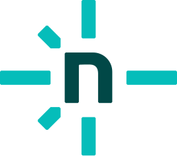</a> | **netlify-icon.svg** Vector (SVG) \| 2.09KB 更新: 2026-02-26 |
|  | **netlify.svg** Vector (SVG) \| 4.28KB 更新: 2026-02-26 |
|  | **neverinstall-icon.svg** Vector (SVG) \| 986.00B 更新: 2026-02-26 |
|  | **neverinstall.svg** Vector (SVG) \| 10.88KB 更新: 2026-02-26 |
|  | **new-relic-icon.svg** Vector (SVG) \| 735.00B 更新: 2026-02-26 |
|  | **new-relic.svg** Vector (SVG) \| 8.17KB 更新: 2026-02-26 |
|  | **nextjs-icon.svg** Vector (SVG) \| 1.47KB 更新: 2026-02-26 |
|  | **nextjs.svg** Vector (SVG) \| 5.14KB 更新: 2026-02-26 |
|  | **nginx.svg** Vector (SVG) \| 1.74KB 更新: 2026-02-26 |
|  | **nhost-icon.svg** Vector (SVG) \| 3.03KB 更新: 2026-02-26 |
|  | **nhost.svg** Vector (SVG) \| 6.36KB 更新: 2026-02-26 |
|  | **nightwatch.svg** Vector (SVG) \| 8.30KB 更新: 2026-02-26 |
|  | **nim-lang.svg** Vector (SVG) \| 2.96KB 更新: 2026-02-26 |
|  | **nocodb.svg** Vector (SVG) \| 4.25KB 更新: 2026-02-26 |
|  | **nodal.svg** Vector (SVG) \| 947.00B 更新: 2026-02-26 |
|  | **node-sass.svg** Vector (SVG) \| 6.08KB 更新: 2026-02-26 |
|  | **nodebots.svg** Vector (SVG) \| 2.53KB 更新: 2026-02-26 |
|  | **nodejs-icon-alt.svg** Vector (SVG) \| 4.35KB 更新: 2026-02-26 |
|  | **nodejs-icon.svg** Vector (SVG) \| 3.28KB 更新: 2026-02-26 |
|  | **nodejs.svg** Vector (SVG) \| 14.79KB 更新: 2026-02-26 |
|  | **nodemon.svg** Vector (SVG) \| 2.34KB 更新: 2026-02-26 |
|  | **nodeos.svg** Vector (SVG) \| 1.36KB 更新: 2026-02-26 |
|  | **nodewebkit.svg** Vector (SVG) \| 4.60KB 更新: 2026-02-26 |
|  | **nomad-icon.svg** Vector (SVG) \| 659.00B 更新: 2026-02-26 |
|  | **nomad.svg** Vector (SVG) \| 4.05KB 更新: 2026-02-26 |
|  | **notion-icon.svg** Vector (SVG) \| 2.93KB 更新: 2026-02-26 |
|  | **notion.svg** Vector (SVG) \| 5.92KB 更新: 2026-02-26 |
|  | **noysi.svg** Vector (SVG) \| 1.43KB 更新: 2026-02-26 |
|  | **npm-icon.svg** Vector (SVG) \| 417.00B 更新: 2026-02-26 |
|  | **npm.svg** Vector (SVG) \| 956.00B 更新: 2026-02-26 |
|  | **nuclide.svg** Vector (SVG) \| 2.38KB 更新: 2026-02-26 |
|  | **numpy.svg** Vector (SVG) \| 1.75KB 更新: 2026-02-26 |
|  | **nuxt-icon.svg** Vector (SVG) \| 1.83KB 更新: 2026-02-26 |
|  | **nuxt.svg** Vector (SVG) \| 3.59KB 更新: 2026-02-26 |
|  | **nvidia.svg** Vector (SVG) \| 3.94KB 更新: 2026-02-26 |
|  | **nvm.svg** Vector (SVG) \| 10.44KB 更新: 2026-02-26 |
|  | **nx.svg** Vector (SVG) \| 4.72KB 更新: 2026-02-26 |
|  | **oauth.svg** Vector (SVG) \| 15.72KB 更新: 2026-02-26 |
|  | **observablehq.svg** Vector (SVG) \| 1.99KB 更新: 2026-02-26 |
|  | **obsidian-icon.svg** Vector (SVG) \| 10.47KB 更新: 2026-02-26 |
|  | **obsidian.svg** Vector (SVG) \| 7.29KB 更新: 2026-02-26 |
|  | **ocaml.svg** Vector (SVG) \| 19.49KB 更新: 2026-02-26 |
|  | **octodns.svg** Vector (SVG) \| 7.31KB 更新: 2026-02-26 |
|  | **octopus-deploy.svg** Vector (SVG) \| 1.56KB 更新: 2026-02-26 |
|  | **okta-icon.svg** Vector (SVG) \| 7.89KB 更新: 2026-02-26 |
|  | **okta.svg** Vector (SVG) \| 10.24KB 更新: 2026-02-26 |
|  | **olark.svg** Vector (SVG) \| 7.58KB 更新: 2026-02-26 |
|  | **onesignal.svg** Vector (SVG) \| 2.84KB 更新: 2026-02-26 |
|  | **open-graph.svg** Vector (SVG) \| 8.78KB 更新: 2026-02-26 |
|  | **open-zeppelin-icon.svg** Vector (SVG) \| 864.00B 更新: 2026-02-26 |
|  | **open-zeppelin.svg** Vector (SVG) \| 7.54KB 更新: 2026-02-26 |
|  | **openai-icon.svg** Vector (SVG) \| 3.65KB 更新: 2026-02-26 |
|  | **openai.svg** Vector (SVG) \| 7.21KB 更新: 2026-02-26 |
|  | **openapi-icon.svg** Vector (SVG) \| 17.98KB 更新: 2026-02-26 |
|  | **openapi.svg** Vector (SVG) \| 22.45KB 更新: 2026-02-26 |
|  | **opencart.svg** Vector (SVG) \| 7.83KB 更新: 2026-02-26 |
|  | **opencollective.svg** Vector (SVG) \| 1.24KB 更新: 2026-02-26 |
|  | **opencv.svg** Vector (SVG) \| 9.71KB 更新: 2026-02-26 |
|  | **openframeworks.svg** Vector (SVG) \| 809.00B 更新: 2026-02-26 |
|  | **opengl.svg** Vector (SVG) \| 9.73KB 更新: 2026-02-26 |
|  | **openjs-foundation-icon.svg** Vector (SVG) \| 3.45KB 更新: 2026-02-26 |
|  | **openjs-foundation.svg** Vector (SVG) \| 15.74KB 更新: 2026-02-26 |
|  | **openlayers.svg** Vector (SVG) \| 2.00KB 更新: 2026-02-26 |
|  | **openshift.svg** Vector (SVG) \| 4.97KB 更新: 2026-02-26 |
|  | **opensource.svg** Vector (SVG) \| 5.81KB 更新: 2026-02-26 |
|  | **openstack-icon.svg** Vector (SVG) \| 1.40KB 更新: 2026-02-26 |
|  | **openstack.svg** Vector (SVG) \| 8.32KB 更新: 2026-02-26 |
|  | **opentelemetry-icon.svg** Vector (SVG) \| 2.65KB 更新: 2026-02-26 |
|  | **opentelemetry.svg** Vector (SVG) \| 9.42KB 更新: 2026-02-26 |
|  | **opera.svg** Vector (SVG) \| 1.85KB 更新: 2026-02-26 |
|  | **opsgenie.svg** Vector (SVG) \| 1.96KB 更新: 2026-02-26 |
|  | **optimizely-icon.svg** Vector (SVG) \| 2.58KB 更新: 2026-02-26 |
|  | **optimizely.svg** Vector (SVG) \| 14.25KB 更新: 2026-02-26 |
|  | **oracle.svg** Vector (SVG) \| 3.18KB 更新: 2026-02-26 |
|  | **oreilly.svg** Vector (SVG) \| 2.14KB 更新: 2026-02-26 |
|  | **origami.svg** Vector (SVG) \| 3.36KB 更新: 2026-02-26 |
|  | **origin.svg** Vector (SVG) \| 2.41KB 更新: 2026-02-26 |
|  | **oshw.svg** Vector (SVG) \| 16.32KB 更新: 2026-02-26 |
|  | **osquery.svg** Vector (SVG) \| 1.42KB 更新: 2026-02-26 |
|  | **overloop-icon.svg** Vector (SVG) \| 3.39KB 更新: 2026-02-26 |
|  | **overloop.svg** Vector (SVG) \| 9.65KB 更新: 2026-02-26 |
|  | **p5js.svg** Vector (SVG) \| 7.77KB 更新: 2026-02-26 |
|  | **packer.svg** Vector (SVG) \| 698.00B 更新: 2026-02-26 |
|  | **pagekit.svg** Vector (SVG) \| 415.00B 更新: 2026-02-26 |
|  | **pagekite.svg** Vector (SVG) \| 815.00B 更新: 2026-02-26 |
|  | **pagerduty-icon.svg** Vector (SVG) \| 977.00B 更新: 2026-02-26 |
|  | **pagerduty.svg** Vector (SVG) \| 6.56KB 更新: 2026-02-26 |
|  | **panda.svg** Vector (SVG) \| 4.65KB 更新: 2026-02-26 |
| <a href="pandas-icon.svg">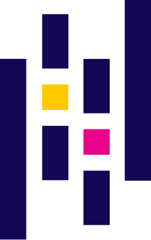</a> | **pandas-icon.svg** Vector (SVG) \| 1.12KB 更新: 2026-02-26 |
|  | **pandas.svg** Vector (SVG) \| 5.27KB 更新: 2026-02-26 |
|  | **parcel-icon.svg** Vector (SVG) \| 27.06KB 更新: 2026-02-26 |
|  | **parcel.svg** Vector (SVG) \| 5.63KB 更新: 2026-02-26 |
|  | **parse.svg** Vector (SVG) \| 1.25KB 更新: 2026-02-26 |
|  | **parsehub.svg** Vector (SVG) \| 1.02KB 更新: 2026-02-26 |
|  | **partytown-icon.svg** Vector (SVG) \| 8.64KB 更新: 2026-02-26 |
|  | **partytown.svg** Vector (SVG) \| 23.84KB 更新: 2026-02-26 |
|  | **passbolt-icon.svg** Vector (SVG) \| 2.47KB 更新: 2026-02-26 |
|  | **passbolt.svg** Vector (SVG) \| 9.44KB 更新: 2026-02-26 |
|  | **passport.svg** Vector (SVG) \| 768.00B 更新: 2026-02-26 |
|  | **patreon.svg** Vector (SVG) \| 587.00B 更新: 2026-02-26 |
|  | **payload.svg** Vector (SVG) \| 484.00B 更新: 2026-02-26 |
|  | **paypal.svg** Vector (SVG) \| 3.47KB 更新: 2026-02-26 |
|  | **peer5.svg** Vector (SVG) \| 1.18KB 更新: 2026-02-26 |
|  | **pepperoni.svg** Vector (SVG) \| 12.09KB 更新: 2026-02-26 |
|  | **percona.svg** Vector (SVG) \| 1.44KB 更新: 2026-02-26 |
|  | **percy-icon.svg** Vector (SVG) \| 4.40KB 更新: 2026-02-26 |
|  | **percy.svg** Vector (SVG) \| 11.32KB 更新: 2026-02-26 |
|  | **perf-rocks.svg** Vector (SVG) \| 11.34KB 更新: 2026-02-26 |
|  | **perl.svg** Vector (SVG) \| 42.71KB 更新: 2026-02-26 |
|  | **phalcon.svg** Vector (SVG) \| 5.57KB 更新: 2026-02-26 |
|  | **phoenix.svg** Vector (SVG) \| 6.34KB 更新: 2026-02-26 |
|  | **php-alt.svg** Vector (SVG) \| 2.78KB 更新: 2026-02-26 |
|  | **php.svg** Vector (SVG) \| 2.91KB 更新: 2026-02-26 |
|  | **phpstorm.svg** Vector (SVG) \| 6.49KB 更新: 2026-02-26 |
|  | **pinecone-icon.svg** Vector (SVG) \| 3.40KB 更新: 2026-02-26 |
|  | **pinecone.svg** Vector (SVG) \| 8.26KB 更新: 2026-02-26 |
|  | **pinia.svg** Vector (SVG) \| 9.78KB 更新: 2026-02-26 |
|  | **pinterest.svg** Vector (SVG) \| 1.45KB 更新: 2026-02-26 |
|  | **pipedream.svg** Vector (SVG) \| 12.67KB 更新: 2026-02-26 |
|  | **pipedrive.svg** Vector (SVG) \| 12.31KB 更新: 2026-02-26 |
|  | **pipefy.svg** Vector (SVG) \| 7.10KB 更新: 2026-02-26 |
|  | **pivotal_tracker.svg** Vector (SVG) \| 2.21KB 更新: 2026-02-26 |
|  | **pixijs.svg** Vector (SVG) \| 3.78KB 更新: 2026-02-26 |
|  | **pkg.svg** Vector (SVG) \| 1.05KB 更新: 2026-02-26 |
|  | **planetscale.svg** Vector (SVG) \| 640.00B 更新: 2026-02-26 |
|  | **planless-icon.svg** Vector (SVG) \| 1010.00B 更新: 2026-02-26 |
|  | **planless.svg** Vector (SVG) \| 9.26KB 更新: 2026-02-26 |
|  | **plasmic.svg** Vector (SVG) \| 1.88KB 更新: 2026-02-26 |
|  | **plastic-scm.svg** Vector (SVG) \| 3.71KB 更新: 2026-02-26 |
|  | **platformio.svg** Vector (SVG) \| 3.02KB 更新: 2026-02-26 |
|  | **play.svg** Vector (SVG) \| 4.87KB 更新: 2026-02-26 |
|  | **playwright.svg** Vector (SVG) \| 7.17KB 更新: 2026-02-26 |
|  | **pluralsight-icon.svg** Vector (SVG) \| 1.23KB 更新: 2026-02-26 |
|  | **pluralsight.svg** Vector (SVG) \| 5.91KB 更新: 2026-02-26 |
|  | **pm2-icon.svg** Vector (SVG) \| 6.56KB 更新: 2026-02-26 |
|  | **pm2.svg** Vector (SVG) \| 11.69KB 更新: 2026-02-26 |
|  | **pnpm.svg** Vector (SVG) \| 9.71KB 更新: 2026-02-26 |
|  | **pocket-base.svg** Vector (SVG) \| 5.65KB 更新: 2026-02-26 |
|  | **poeditor.svg** Vector (SVG) \| 3.88KB 更新: 2026-02-26 |
|  | **polymer.svg** Vector (SVG) \| 4.58KB 更新: 2026-02-26 |
|  | **postcss.svg** Vector (SVG) \| 59.37KB 更新: 2026-02-26 |
|  | **postgraphile.svg** Vector (SVG) \| 5.07KB 更新: 2026-02-26 |
|  | **postgresql.svg** Vector (SVG) \| 12.91KB 更新: 2026-02-26 |
|  | **posthog-icon.svg** Vector (SVG) \| 4.38KB 更新: 2026-02-26 |
|  | **posthog.svg** Vector (SVG) \| 8.61KB 更新: 2026-02-26 |
|  | **postman-icon.svg** Vector (SVG) \| 12.31KB 更新: 2026-02-26 |
|  | **postman.svg** Vector (SVG) \| 20.52KB 更新: 2026-02-26 |
|  | **pouchdb.svg** Vector (SVG) \| 1.93KB 更新: 2026-02-26 |
|  | **preact.svg** Vector (SVG) \| 2.42KB 更新: 2026-02-26 |
|  | **precursor.svg** Vector (SVG) \| 817.00B 更新: 2026-02-26 |
|  | **prerender-icon.svg** Vector (SVG) \| 795.00B 更新: 2026-02-26 |
|  | **prerender.svg** Vector (SVG) \| 10.56KB 更新: 2026-02-26 |
|  | **prestashop.svg** Vector (SVG) \| 31.14KB 更新: 2026-02-26 |
|  | **presto.svg** Vector (SVG) \| 5.10KB 更新: 2026-02-26 |
|  | **prettier.svg** Vector (SVG) \| 4.64KB 更新: 2026-02-26 |
|  | **prisma.svg** Vector (SVG) \| 1.21KB 更新: 2026-02-26 |
|  | **prismic-icon.svg** Vector (SVG) \| 6.73KB 更新: 2026-02-26 |
|  | **prismic.svg** Vector (SVG) \| 19.38KB 更新: 2026-02-26 |
|  | **processing.svg** Vector (SVG) \| 1.12KB 更新: 2026-02-26 |
|  | **processwire-icon.svg** Vector (SVG) \| 4.12KB 更新: 2026-02-26 |
|  | **processwire.svg** Vector (SVG) \| 21.28KB 更新: 2026-02-26 |
|  | **productboard-icon.svg** Vector (SVG) \| 568.00B 更新: 2026-02-26 |
|  | **productboard.svg** Vector (SVG) \| 13.06KB 更新: 2026-02-26 |
|  | **producthunt.svg** Vector (SVG) \| 1.08KB 更新: 2026-02-26 |
|  | **progress.svg** Vector (SVG) \| 668.00B 更新: 2026-02-26 |
|  | **prometheus.svg** Vector (SVG) \| 2.06KB 更新: 2026-02-26 |
|  | **promises.svg** Vector (SVG) \| 4.75KB 更新: 2026-02-26 |
|  | **proofy.svg** Vector (SVG) \| 1.69KB 更新: 2026-02-26 |
|  | **protoio.svg** Vector (SVG) \| 3.67KB 更新: 2026-02-26 |
|  | **protonet.svg** Vector (SVG) \| 6.64KB 更新: 2026-02-26 |
|  | **protractor.svg** Vector (SVG) \| 1.78KB 更新: 2026-02-26 |
|  | **prott.svg** Vector (SVG) \| 4.45KB 更新: 2026-02-26 |
|  | **pug.svg** Vector (SVG) \| 8.55KB 更新: 2026-02-26 |
|  | **pumpkindb.svg** Vector (SVG) \| 3.52KB 更新: 2026-02-26 |
|  | **puppet-icon.svg** Vector (SVG) \| 839.00B 更新: 2026-02-26 |
|  | **puppet.svg** Vector (SVG) \| 4.86KB 更新: 2026-02-26 |
|  | **puppeteer.svg** Vector (SVG) \| 12.47KB 更新: 2026-02-26 |
|  | **purescript-icon.svg** Vector (SVG) \| 1.23KB 更新: 2026-02-26 |
|  | **purescript.svg** Vector (SVG) \| 8.05KB 更新: 2026-02-26 |
|  | **pushbullet.svg** Vector (SVG) \| 1.74KB 更新: 2026-02-26 |
|  | **pusher-icon.svg** Vector (SVG) \| 3.80KB 更新: 2026-02-26 |
|  | **pusher.svg** Vector (SVG) \| 12.49KB 更新: 2026-02-26 |
|  | **pwa.svg** Vector (SVG) \| 1.52KB 更新: 2026-02-26 |
|  | **pycharm.svg** Vector (SVG) \| 5.56KB 更新: 2026-02-26 |
|  | **pypi.svg** Vector (SVG) \| 17.48KB 更新: 2026-02-26 |
|  | **pyscript.svg** Vector (SVG) \| 4.76KB 更新: 2026-02-26 |
|  | **python.svg** Vector (SVG) \| 2.84KB 更新: 2026-02-26 |
|  | **pytorch-icon.svg** Vector (SVG) \| 1.10KB 更新: 2026-02-26 |
|  | **pytorch.svg** Vector (SVG) \| 6.10KB 更新: 2026-02-26 |
|  | **pyup.svg** Vector (SVG) \| 1.36KB 更新: 2026-02-26 |
|  | **q.svg** Vector (SVG) \| 11.93KB 更新: 2026-02-26 |
|  | **qlik.svg** Vector (SVG) \| 4.40KB 更新: 2026-02-26 |
|  | **qt.svg** Vector (SVG) \| 2.40KB 更新: 2026-02-26 |
|  | **qualcomm.svg** Vector (SVG) \| 6.64KB 更新: 2026-02-26 |
|  | **quarkus-icon.svg** Vector (SVG) \| 2.18KB 更新: 2026-02-26 |
|  | **quarkus.svg** Vector (SVG) \| 7.77KB 更新: 2026-02-26 |
|  | **quay.svg** Vector (SVG) \| 1.01KB 更新: 2026-02-26 |
|  | **quobyte.svg** Vector (SVG) \| 3.40KB 更新: 2026-02-26 |
|  | **quora.svg** Vector (SVG) \| 4.26KB 更新: 2026-02-26 |
|  | **qwik-icon.svg** Vector (SVG) \| 1.71KB 更新: 2026-02-26 |
|  | **qwik.svg** Vector (SVG) \| 4.31KB 更新: 2026-02-26 |
|  | **r-lang.svg** Vector (SVG) \| 1.53KB 更新: 2026-02-26 |
|  | **rabbitmq-icon.svg** Vector (SVG) \| 2.49KB 更新: 2026-02-26 |
|  | **rabbitmq.svg** Vector (SVG) \| 8.17KB 更新: 2026-02-26 |
|  | **rackspace-icon.svg** Vector (SVG) \| 651.00B 更新: 2026-02-26 |
|  | **rackspace.svg** Vector (SVG) \| 6.37KB 更新: 2026-02-26 |
|  | **rails.svg** Vector (SVG) \| 4.76KB 更新: 2026-02-26 |
|  | **ramda.svg** Vector (SVG) \| 5.10KB 更新: 2026-02-26 |
|  | **raml.svg** Vector (SVG) \| 3.35KB 更新: 2026-02-26 |
|  | **rancher-icon.svg** Vector (SVG) \| 3.47KB 更新: 2026-02-26 |
|  | **rancher.svg** Vector (SVG) \| 13.19KB 更新: 2026-02-26 |
|  | **raphael.svg** Vector (SVG) \| 4.26KB 更新: 2026-02-26 |
|  | **raspberry-pi.svg** Vector (SVG) \| 7.71KB 更新: 2026-02-26 |
|  | **rax.svg** Vector (SVG) \| 753.00B 更新: 2026-02-26 |
|  | **react-query-icon.svg** Vector (SVG) \| 9.78KB 更新: 2026-02-26 |
|  | **react-query.svg** Vector (SVG) \| 19.42KB 更新: 2026-02-26 |
|  | **react-router.svg** Vector (SVG) \| 2.15KB 更新: 2026-02-26 |
|  | **react-spring.svg** Vector (SVG) \| 12.35KB 更新: 2026-02-26 |
|  | **react-styleguidist.svg** Vector (SVG) \| 32.63KB 更新: 2026-02-26 |
|  | **react.svg** Vector (SVG) \| 7.72KB 更新: 2026-02-26 |
|  | **reactivex.svg** Vector (SVG) \| 4.97KB 更新: 2026-02-26 |
|  | **realm.svg** Vector (SVG) \| 4.46KB 更新: 2026-02-26 |
|  | **reapp.svg** Vector (SVG) \| 1.25KB 更新: 2026-02-26 |
|  | **reasonml-icon.svg** Vector (SVG) \| 1.18KB 更新: 2026-02-26 |
|  | **reasonml.svg** Vector (SVG) \| 3.08KB 更新: 2026-02-26 |
|  | **recaptcha.svg** Vector (SVG) \| 12.15KB 更新: 2026-02-26 |
|  | **recoil-icon.svg** Vector (SVG) \| 3.00KB 更新: 2026-02-26 |
|  | **recoil.svg** Vector (SVG) \| 7.58KB 更新: 2026-02-26 |
|  | **reddit-icon.svg** Vector (SVG) \| 2.73KB 更新: 2026-02-26 |
|  | **reddit.svg** Vector (SVG) \| 7.72KB 更新: 2026-02-26 |
|  | **redhat-icon.svg** Vector (SVG) \| 2.07KB 更新: 2026-02-26 |
|  | **redhat.svg** Vector (SVG) \| 5.97KB 更新: 2026-02-26 |
|  | **redis.svg** Vector (SVG) \| 4.90KB 更新: 2026-02-26 |
|  | **redsmin.svg** Vector (SVG) \| 3.00KB 更新: 2026-02-26 |
|  | **redux-observable.svg** Vector (SVG) \| 29.78KB 更新: 2026-02-26 |
|  | **redux-saga.svg** Vector (SVG) \| 5.75KB 更新: 2026-02-26 |
|  | **redux.svg** Vector (SVG) \| 3.15KB 更新: 2026-02-26 |
|  | **redwoodjs.svg** Vector (SVG) \| 6.36KB 更新: 2026-02-26 |
|  | **reindex.svg** Vector (SVG) \| 2.78KB 更新: 2026-02-26 |
|  | **relay.svg** Vector (SVG) \| 1.43KB 更新: 2026-02-26 |
|  | **release.svg** Vector (SVG) \| 2.79KB 更新: 2026-02-26 |
|  | **remix-icon.svg** Vector (SVG) \| 2.93KB 更新: 2026-02-26 |
|  | **remix.svg** Vector (SVG) \| 6.47KB 更新: 2026-02-26 |
|  | **renovatebot.svg** Vector (SVG) \| 3.94KB 更新: 2026-02-26 |
|  | **replit-icon.svg** Vector (SVG) \| 773.00B 更新: 2026-02-26 |
|  | **replit.svg** Vector (SVG) \| 6.71KB 更新: 2026-02-26 |
|  | **require.svg** Vector (SVG) \| 13.71KB 更新: 2026-02-26 |
|  | **rescript-icon.svg** Vector (SVG) \| 2.09KB 更新: 2026-02-26 |
|  | **rescript.svg** Vector (SVG) \| 16.42KB 更新: 2026-02-26 |
|  | **rest-li.svg** Vector (SVG) \| 10.72KB 更新: 2026-02-26 |
|  | **rethinkdb.svg** Vector (SVG) \| 13.19KB 更新: 2026-02-26 |
|  | **retool-icon.svg** Vector (SVG) \| 1.21KB 更新: 2026-02-26 |
|  | **retool.svg** Vector (SVG) \| 4.32KB 更新: 2026-02-26 |
|  | **riak.svg** Vector (SVG) \| 3.99KB 更新: 2026-02-26 |
|  | **rider.svg** Vector (SVG) \| 3.00KB 更新: 2026-02-26 |
|  | **riot.svg** Vector (SVG) \| 1.34KB 更新: 2026-02-26 |
|  | **risingwave-icon.svg** Vector (SVG) \| 3.28KB 更新: 2026-02-26 |
|  | **risingwave.svg** Vector (SVG) \| 16.99KB 更新: 2026-02-26 |
|  | **rocket-chat-icon.svg** Vector (SVG) \| 2.97KB 更新: 2026-02-26 |
|  | **rocket-chat.svg** Vector (SVG) \| 9.58KB 更新: 2026-02-26 |
|  | **rocksdb.svg** Vector (SVG) \| 9.09KB 更新: 2026-02-26 |
|  | **rocky-linux-icon.svg** Vector (SVG) \| 730.00B 更新: 2026-02-26 |
|  | **rocky-linux.svg** Vector (SVG) \| 8.37KB 更新: 2026-02-26 |
|  | **rollbar-icon.svg** Vector (SVG) \| 2.86KB 更新: 2026-02-26 |
|  | **rollbar.svg** Vector (SVG) \| 8.48KB 更新: 2026-02-26 |
|  | **rollupjs.svg** Vector (SVG) \| 5.82KB 更新: 2026-02-26 |
|  | **rome-icon.svg** Vector (SVG) \| 2.56KB 更新: 2026-02-26 |
|  | **rome.svg** Vector (SVG) \| 13.55KB 更新: 2026-02-26 |
|  | **ros.svg** Vector (SVG) \| 7.83KB 更新: 2026-02-26 |
|  | **rsa.svg** Vector (SVG) \| 2.23KB 更新: 2026-02-26 |
|  | **rsmq.svg** Vector (SVG) \| 1.88KB 更新: 2026-02-26 |
|  | **rubocop.svg** Vector (SVG) \| 2.81KB 更新: 2026-02-26 |
|  | **ruby.svg** Vector (SVG) \| 10.92KB 更新: 2026-02-26 |
|  | **rubygems.svg** Vector (SVG) \| 910.00B 更新: 2026-02-26 |
|  | **rubymine.svg** Vector (SVG) \| 3.49KB 更新: 2026-02-26 |
|  | **rum.svg** Vector (SVG) \| 3.72KB 更新: 2026-02-26 |
|  | **runscope.svg** Vector (SVG) \| 3.47KB 更新: 2026-02-26 |
|  | **rush-icon.svg** Vector (SVG) \| 8.71KB 更新: 2026-02-26 |
|  | **rush.svg** Vector (SVG) \| 16.40KB 更新: 2026-02-26 |
|  | **rust.svg** Vector (SVG) \| 12.16KB 更新: 2026-02-26 |
|  | **rxdb.svg** Vector (SVG) \| 4.00KB 更新: 2026-02-26 |
|  | **safari.svg** Vector (SVG) \| 68.67KB 更新: 2026-02-26 |
|  | **sagui.svg** Vector (SVG) \| 6.21KB 更新: 2026-02-26 |
|  | **sails.svg** Vector (SVG) \| 581.00B 更新: 2026-02-26 |
|  | **salesforce.svg** Vector (SVG) \| 17.86KB 更新: 2026-02-26 |
|  | **sameroom.svg** Vector (SVG) \| 2.08KB 更新: 2026-02-26 |
|  | **samsung.svg** Vector (SVG) \| 17.04KB 更新: 2026-02-26 |
|  | **sanity.svg** Vector (SVG) \| 3.22KB 更新: 2026-02-26 |
|  | **sap.svg** Vector (SVG) \| 3.01KB 更新: 2026-02-26 |
|  | **sass-doc.svg** Vector (SVG) \| 14.82KB 更新: 2026-02-26 |
|  | **sass.svg** Vector (SVG) \| 7.95KB 更新: 2026-02-26 |
|  | **saucelabs.svg** Vector (SVG) \| 1.73KB 更新: 2026-02-26 |
|  | **scala.svg** Vector (SVG) \| 2.13KB 更新: 2026-02-26 |
|  | **scaledrone.svg** Vector (SVG) \| 967.00B 更新: 2026-02-26 |
|  | **scribd-icon.svg** Vector (SVG) \| 2.60KB 更新: 2026-02-26 |
|  | **scribd.svg** Vector (SVG) \| 6.33KB 更新: 2026-02-26 |
|  | **seaborn-icon.svg** Vector (SVG) \| 67.69KB 更新: 2026-02-26 |
|  | **seaborn.svg** Vector (SVG) \| 80.81KB 更新: 2026-02-26 |
|  | **section-icon.svg** Vector (SVG) \| 1.05KB 更新: 2026-02-26 |
|  | **section.svg** Vector (SVG) \| 5.56KB 更新: 2026-02-26 |
|  | **segment-icon.svg** Vector (SVG) \| 3.76KB 更新: 2026-02-26 |
|  | **segment.svg** Vector (SVG) \| 13.53KB 更新: 2026-02-26 |
|  | **selenium.svg** Vector (SVG) \| 4.24KB 更新: 2026-02-26 |
|  | **semantic-release.svg** Vector (SVG) \| 2.72KB 更新: 2026-02-26 |
|  | **semantic-ui.svg** Vector (SVG) \| 1.10KB 更新: 2026-02-26 |
|  | **semantic-web.svg** Vector (SVG) \| 19.02KB 更新: 2026-02-26 |
|  | **semaphoreci.svg** Vector (SVG) \| 1.11KB 更新: 2026-02-26 |
|  | **sencha.svg** Vector (SVG) \| 12.52KB 更新: 2026-02-26 |
|  | **sendgrid-icon.svg** Vector (SVG) \| 1.13KB 更新: 2026-02-26 |
|  | **sendgrid.svg** Vector (SVG) \| 6.15KB 更新: 2026-02-26 |
|  | **seneca.svg** Vector (SVG) \| 1.92KB 更新: 2026-02-26 |
|  | **sensu-icon.svg** Vector (SVG) \| 1.08KB 更新: 2026-02-26 |
|  | **sensu.svg** Vector (SVG) \| 7.54KB 更新: 2026-02-26 |
|  | **sentry-icon.svg** Vector (SVG) \| 2.03KB 更新: 2026-02-26 |
|  | **sentry.svg** Vector (SVG) \| 4.39KB 更新: 2026-02-26 |
|  | **sequelize.svg** Vector (SVG) \| 4.19KB 更新: 2026-02-26 |
|  | **serverless.svg** Vector (SVG) \| 920.00B 更新: 2026-02-26 |
|  | **sherlock-icon.svg** Vector (SVG) \| 13.01KB 更新: 2026-02-26 |
|  | **sherlock.svg** Vector (SVG) \| 19.74KB 更新: 2026-02-26 |
|  | **shields.svg** Vector (SVG) \| 6.60KB 更新: 2026-02-26 |
|  | **shipit.svg** Vector (SVG) \| 13.32KB 更新: 2026-02-26 |
|  | **shogun.svg** Vector (SVG) \| 7.58KB 更新: 2026-02-26 |
|  | **shopify.svg** Vector (SVG) \| 3.32KB 更新: 2026-02-26 |
|  | **shortcut-icon.svg** Vector (SVG) \| 2.57KB 更新: 2026-02-26 |
|  | **shortcut.svg** Vector (SVG) \| 7.46KB 更新: 2026-02-26 |
|  | **sidekiq-icon.svg** Vector (SVG) \| 11.51KB 更新: 2026-02-26 |
|  | **sidekiq.svg** Vector (SVG) \| 20.63KB 更新: 2026-02-26 |
|  | **signal.svg** Vector (SVG) \| 4.29KB 更新: 2026-02-26 |
|  | **sigstore-icon.svg** Vector (SVG) \| 14.41KB 更新: 2026-02-26 |
|  | **sigstore.svg** Vector (SVG) \| 25.40KB 更新: 2026-02-26 |
|  | **sinatra.svg** Vector (SVG) \| 5.09KB 更新: 2026-02-26 |
|  | **singlestore-icon.svg** Vector (SVG) \| 2.75KB 更新: 2026-02-26 |
|  | **singlestore.svg** Vector (SVG) \| 14.39KB 更新: 2026-02-26 |
|  | **sitepoint.svg** Vector (SVG) \| 1.29KB 更新: 2026-02-26 |
|  | **sk-hynix.svg** Vector (SVG) \| 7.81KB 更新: 2026-02-26 |
|  | **skaffolder.svg** Vector (SVG) \| 5.63KB 更新: 2026-02-26 |
|  | **sketch.svg** Vector (SVG) \| 1.10KB 更新: 2026-02-26 |
|  | **skylight.svg** Vector (SVG) \| 2.09KB 更新: 2026-02-26 |
|  | **skype.svg** Vector (SVG) \| 6.76KB 更新: 2026-02-26 |
|  | **slack-icon.svg** Vector (SVG) \| 2.74KB 更新: 2026-02-26 |
|  | **slack.svg** Vector (SVG) \| 5.15KB 更新: 2026-02-26 |
|  | **slides.svg** Vector (SVG) \| 2.66KB 更新: 2026-02-26 |
|  | **slim.svg** Vector (SVG) \| 2.66KB 更新: 2026-02-26 |
|  | **smartling.svg** Vector (SVG) \| 3.43KB 更新: 2026-02-26 |
|  | **smashingmagazine.svg** Vector (SVG) \| 2.21KB 更新: 2026-02-26 |
|  | **snap-svg.svg** Vector (SVG) \| 2.75KB 更新: 2026-02-26 |
|  | **snaplet-icon.svg** Vector (SVG) \| 12.94KB 更新: 2026-02-26 |
|  | **snaplet.svg** Vector (SVG) \| 31.00KB 更新: 2026-02-26 |
|  | **snowflake-icon.svg** Vector (SVG) \| 5.40KB 更新: 2026-02-26 |
|  | **snowflake.svg** Vector (SVG) \| 21.84KB 更新: 2026-02-26 |
|  | **snowpack.svg** Vector (SVG) \| 902.00B 更新: 2026-02-26 |
|  | **snyk.svg** Vector (SVG) \| 11.77KB 更新: 2026-02-26 |
|  | **socket.io.svg** Vector (SVG) \| 1.72KB 更新: 2026-02-26 |
|  | **solarwinds.svg** Vector (SVG) \| 6.99KB 更新: 2026-02-26 |
|  | **solid.svg** Vector (SVG) \| 2.48KB 更新: 2026-02-26 |
|  | **solidity.svg** Vector (SVG) \| 1.13KB 更新: 2026-02-26 |
|  | **solidjs-icon.svg** Vector (SVG) \| 3.15KB 更新: 2026-02-26 |
|  | **solidjs.svg** Vector (SVG) \| 7.70KB 更新: 2026-02-26 |
|  | **solr.svg** Vector (SVG) \| 8.11KB 更新: 2026-02-26 |
|  | **sonarcloud-icon.svg** Vector (SVG) \| 2.60KB 更新: 2026-02-26 |
|  | **sonarcloud.svg** Vector (SVG) \| 9.28KB 更新: 2026-02-26 |
|  | **sonarlint-icon.svg** Vector (SVG) \| 3.08KB 更新: 2026-02-26 |
|  | **sonarlint.svg** Vector (SVG) \| 8.18KB 更新: 2026-02-26 |
|  | **sonarqube.svg** Vector (SVG) \| 7.40KB 更新: 2026-02-26 |
|  | **soundcloud.svg** Vector (SVG) \| 17.25KB 更新: 2026-02-26 |
|  | **sourcegraph.svg** Vector (SVG) \| 1.39KB 更新: 2026-02-26 |
|  | **sourcetree.svg** Vector (SVG) \| 1.85KB 更新: 2026-02-26 |
|  | **spark.svg** Vector (SVG) \| 2.63KB 更新: 2026-02-26 |
|  | **sparkpost.svg** Vector (SVG) \| 5.57KB 更新: 2026-02-26 |
|  | **speakerdeck.svg** Vector (SVG) \| 1.35KB 更新: 2026-02-26 |
|  | **speedcurve.svg** Vector (SVG) \| 2.79KB 更新: 2026-02-26 |
|  | **spidermonkey-icon.svg** Vector (SVG) \| 3.67KB 更新: 2026-02-26 |
|  | **spidermonkey.svg** Vector (SVG) \| 13.40KB 更新: 2026-02-26 |
|  | **spinnaker.svg** Vector (SVG) \| 12.76KB 更新: 2026-02-26 |
|  | **splunk.svg** Vector (SVG) \| 7.02KB 更新: 2026-02-26 |
|  | **spotify-icon.svg** Vector (SVG) \| 1.83KB 更新: 2026-02-26 |
|  | **spotify.svg** Vector (SVG) \| 8.45KB 更新: 2026-02-26 |
|  | **spree.svg** Vector (SVG) \| 9.45KB 更新: 2026-02-26 |
|  | **spring-icon.svg** Vector (SVG) \| 3.53KB 更新: 2026-02-26 |
|  | **spring.svg** Vector (SVG) \| 10.21KB 更新: 2026-02-26 |
|  | **sqlite.svg** Vector (SVG) \| 11.35KB 更新: 2026-02-26 |
|  | **square.svg** Vector (SVG) \| 1.43KB 更新: 2026-02-26 |
|  | **squarespace.svg** Vector (SVG) \| 2.44KB 更新: 2026-02-26 |
|  | **stackbit-icon.svg** Vector (SVG) \| 1.32KB 更新: 2026-02-26 |
|  | **stackbit.svg** Vector (SVG) \| 6.36KB 更新: 2026-02-26 |
|  | **stackblitz-icon.svg** Vector (SVG) \| 424.00B 更新: 2026-02-26 |
|  | **stackblitz.svg** Vector (SVG) \| 5.43KB 更新: 2026-02-26 |
|  | **stackoverflow-icon.svg** Vector (SVG) \| 1.07KB 更新: 2026-02-26 |
|  | **stackoverflow.svg** Vector (SVG) \| 10.05KB 更新: 2026-02-26 |
|  | **stackshare.svg** Vector (SVG) \| 2.88KB 更新: 2026-02-26 |
|  | **stately-icon.svg** Vector (SVG) \| 1.44KB 更新: 2026-02-26 |
|  | **stately.svg** Vector (SVG) \| 3.81KB 更新: 2026-02-26 |
|  | **statuspage.svg** Vector (SVG) \| 1.22KB 更新: 2026-02-26 |
|  | **stdlib-icon.svg** Vector (SVG) \| 7.40KB 更新: 2026-02-26 |
|  | **stdlib.svg** Vector (SVG) \| 12.57KB 更新: 2026-02-26 |
|  | **steam.svg** Vector (SVG) \| 2.28KB 更新: 2026-02-26 |
|  | **stenciljs-icon.svg** Vector (SVG) \| 651.00B 更新: 2026-02-26 |
|  | **stenciljs.svg** Vector (SVG) \| 3.77KB 更新: 2026-02-26 |
|  | **stepsize-icon.svg** Vector (SVG) \| 3.83KB 更新: 2026-02-26 |
|  | **stepsize.svg** Vector (SVG) \| 8.53KB 更新: 2026-02-26 |
|  | **stetho.svg** Vector (SVG) \| 3.26KB 更新: 2026-02-26 |
|  | **stickermule.svg** Vector (SVG) \| 15.09KB 更新: 2026-02-26 |
|  | **stigg-icon.svg** Vector (SVG) \| 3.74KB 更新: 2026-02-26 |
|  | **stigg.svg** Vector (SVG) \| 7.64KB 更新: 2026-02-26 |
|  | **stimulus-icon.svg** Vector (SVG) \| 2.73KB 更新: 2026-02-26 |
|  | **stimulus.svg** Vector (SVG) \| 9.14KB 更新: 2026-02-26 |
|  | **stitch.svg** Vector (SVG) \| 1.31KB 更新: 2026-02-26 |
|  | **stoplight.svg** Vector (SVG) \| 3.23KB 更新: 2026-02-26 |
|  | **storyblocks-icon.svg** Vector (SVG) \| 852.00B 更新: 2026-02-26 |
|  | **storyblocks.svg** Vector (SVG) \| 9.71KB 更新: 2026-02-26 |
|  | **storyblok-icon.svg** Vector (SVG) \| 2.45KB 更新: 2026-02-26 |
|  | **storyblok.svg** Vector (SVG) \| 11.06KB 更新: 2026-02-26 |
|  | **storybook-icon.svg** Vector (SVG) \| 2.25KB 更新: 2026-02-26 |
|  | **storybook.svg** Vector (SVG) \| 9.75KB 更新: 2026-02-26 |
|  | **strapi-icon.svg** Vector (SVG) \| 1.62KB 更新: 2026-02-26 |
|  | **strapi.svg** Vector (SVG) \| 9.35KB 更新: 2026-02-26 |
|  | **streamlit.svg** Vector (SVG) \| 2.98KB 更新: 2026-02-26 |
|  | **strider.svg** Vector (SVG) \| 2.12KB 更新: 2026-02-26 |
|  | **stripe.svg** Vector (SVG) \| 3.19KB 更新: 2026-02-26 |
|  | **struts.svg** Vector (SVG) \| 2.06KB 更新: 2026-02-26 |
|  | **styleci.svg** Vector (SVG) \| 1.05KB 更新: 2026-02-26 |
|  | **stylefmt.svg** Vector (SVG) \| 3.60KB 更新: 2026-02-26 |
|  | **stylelint.svg** Vector (SVG) \| 2.50KB 更新: 2026-02-26 |
|  | **stylis.svg** Vector (SVG) \| 3.51KB 更新: 2026-02-26 |
|  | **stylus.svg** Vector (SVG) \| 6.56KB 更新: 2026-02-26 |
|  | **stytch.svg** Vector (SVG) \| 5.76KB 更新: 2026-02-26 |
|  | **sublimetext-icon.svg** Vector (SVG) \| 1.79KB 更新: 2026-02-26 |
|  | **sublimetext.svg** Vector (SVG) \| 14.65KB 更新: 2026-02-26 |
|  | **subversion.svg** Vector (SVG) \| 3.31KB 更新: 2026-02-26 |
|  | **sugarss.svg** Vector (SVG) \| 75.66KB 更新: 2026-02-26 |
|  | **supabase-icon.svg** Vector (SVG) \| 1.67KB 更新: 2026-02-26 |
|  | **supabase.svg** Vector (SVG) \| 13.78KB 更新: 2026-02-26 |
|  | **supertokens-icon.svg** Vector (SVG) \| 7.56KB 更新: 2026-02-26 |
|  | **supertokens.svg** Vector (SVG) \| 15.90KB 更新: 2026-02-26 |
|  | **surge.svg** Vector (SVG) \| 11.45KB 更新: 2026-02-26 |
|  | **surrealdb-icon.svg** Vector (SVG) \| 1.98KB 更新: 2026-02-26 |
|  | **surrealdb.svg** Vector (SVG) \| 7.08KB 更新: 2026-02-26 |
|  | **survicate-icon.svg** Vector (SVG) \| 2.80KB 更新: 2026-02-26 |
|  | **survicate.svg** Vector (SVG) \| 12.38KB 更新: 2026-02-26 |
|  | **suse.svg** Vector (SVG) \| 10.44KB 更新: 2026-02-26 |
|  | **susy.svg** Vector (SVG) \| 2.41KB 更新: 2026-02-26 |
|  | **svelte-icon.svg** Vector (SVG) \| 3.43KB 更新: 2026-02-26 |
|  | **svelte-kit.svg** Vector (SVG) \| 7.72KB 更新: 2026-02-26 |
|  | **svelte.svg** Vector (SVG) \| 7.09KB 更新: 2026-02-26 |
|  | **svg.svg** Vector (SVG) \| 4.29KB 更新: 2026-02-26 |
|  | **svgator.svg** Vector (SVG) \| 14.06KB 更新: 2026-02-26 |
|  | **swagger.svg** Vector (SVG) \| 4.89KB 更新: 2026-02-26 |
|  | **swc.svg** Vector (SVG) \| 7.79KB 更新: 2026-02-26 |
|  | **swift.svg** Vector (SVG) \| 2.16KB 更新: 2026-02-26 |
|  | **swiftype.svg** Vector (SVG) \| 1.26KB 更新: 2026-02-26 |
|  | **swimm.svg** Vector (SVG) \| 7.24KB 更新: 2026-02-26 |
|  | **swr.svg** Vector (SVG) \| 2.42KB 更新: 2026-02-26 |
|  | **symfony.svg** Vector (SVG) \| 3.26KB 更新: 2026-02-26 |
|  | **sysdig-icon.svg** Vector (SVG) \| 3.38KB 更新: 2026-02-26 |
|  | **sysdig.svg** Vector (SVG) \| 9.39KB 更新: 2026-02-26 |
|  | **t3.svg** Vector (SVG) \| 4.23KB 更新: 2026-02-26 |
|  | **tableau-icon.svg** Vector (SVG) \| 3.14KB 更新: 2026-02-26 |
|  | **tableau.svg** Vector (SVG) \| 16.63KB 更新: 2026-02-26 |
|  | **taiga.svg** Vector (SVG) \| 1.89KB 更新: 2026-02-26 |
|  | **tailwindcss-icon.svg** Vector (SVG) \| 1.43KB 更新: 2026-02-26 |
|  | **tailwindcss.svg** Vector (SVG) \| 7.15KB 更新: 2026-02-26 |
|  | **tapcart-icon.svg** Vector (SVG) \| 2.01KB 更新: 2026-02-26 |
|  | **tapcart.svg** Vector (SVG) \| 9.77KB 更新: 2026-02-26 |
|  | **taskade-icon.svg** Vector (SVG) \| 18.79KB 更新: 2026-02-26 |
|  | **taskade.svg** Vector (SVG) \| 31.18KB 更新: 2026-02-26 |
|  | **tastejs.svg** Vector (SVG) \| 82.13KB 更新: 2026-02-26 |
|  | **tauri.svg** Vector (SVG) \| 2.41KB 更新: 2026-02-26 |
|  | **tealium.svg** Vector (SVG) \| 3.88KB 更新: 2026-02-26 |
|  | **teamcity.svg** Vector (SVG) \| 4.70KB 更新: 2026-02-26 |
|  | **teamgrid.svg** Vector (SVG) \| 774.00B 更新: 2026-02-26 |
|  | **teamwork-icon.svg** Vector (SVG) \| 1.86KB 更新: 2026-02-26 |
|  | **teamwork.svg** Vector (SVG) \| 8.79KB 更新: 2026-02-26 |
|  | **telegram.svg** Vector (SVG) \| 1.71KB 更新: 2026-02-26 |
|  | **tensorflow.svg** Vector (SVG) \| 1.58KB 更新: 2026-02-26 |
|  | **terminal.svg** Vector (SVG) \| 1.81KB 更新: 2026-02-26 |
|  | **terraform-icon.svg** Vector (SVG) \| 672.00B 更新: 2026-02-26 |
|  | **terraform.svg** Vector (SVG) \| 5.40KB 更新: 2026-02-26 |
|  | **terser-icon.svg** Vector (SVG) \| 2.11KB 更新: 2026-02-26 |
|  | **terser.svg** Vector (SVG) \| 4.87KB 更新: 2026-02-26 |
|  | **testcafe.svg** Vector (SVG) \| 718.00B 更新: 2026-02-26 |
|  | **testing-library.svg** Vector (SVG) \| 51.85KB 更新: 2026-02-26 |
|  | **testlodge.svg** Vector (SVG) \| 1.59KB 更新: 2026-02-26 |
|  | **threejs.svg** Vector (SVG) \| 2.10KB 更新: 2026-02-26 |
|  | **thymeleaf-icon.svg** Vector (SVG) \| 1.31KB 更新: 2026-02-26 |
|  | **thymeleaf.svg** Vector (SVG) \| 19.10KB 更新: 2026-02-26 |
|  | **tidal-icon.svg** Vector (SVG) \| 750.00B 更新: 2026-02-26 |
|  | **tidal.svg** Vector (SVG) \| 1.94KB 更新: 2026-02-26 |
|  | **tiktok-icon.svg** Vector (SVG) \| 3.59KB 更新: 2026-02-26 |
|  | **tiktok.svg** Vector (SVG) \| 5.97KB 更新: 2026-02-26 |
|  | **tnw.svg** Vector (SVG) \| 2.05KB 更新: 2026-02-26 |
|  | **todoist-icon.svg** Vector (SVG) \| 2.30KB 更新: 2026-02-26 |
|  | **todoist.svg** Vector (SVG) \| 13.92KB 更新: 2026-02-26 |
|  | **todomvc.svg** Vector (SVG) \| 2.21KB 更新: 2026-02-26 |
|  | **tomcat.svg** Vector (SVG) \| 6.76KB 更新: 2026-02-26 |
|  | **toml.svg** Vector (SVG) \| 857.00B 更新: 2026-02-26 |
|  | **tor-browser.svg** Vector (SVG) \| 2.09KB 更新: 2026-02-26 |
|  | **tor.svg** Vector (SVG) \| 10.10KB 更新: 2026-02-26 |
|  | **traackr.svg** Vector (SVG) \| 8.60KB 更新: 2026-02-26 |
|  | **trac.svg** Vector (SVG) \| 3.56KB 更新: 2026-02-26 |
|  | **travis-ci-monochrome.svg** Vector (SVG) \| 13.36KB 更新: 2026-02-26 |
|  | **travis-ci.svg** Vector (SVG) \| 47.00KB 更新: 2026-02-26 |
|  | **treasuredata-icon.svg** Vector (SVG) \| 3.74KB 更新: 2026-02-26 |
|  | **treasuredata.svg** Vector (SVG) \| 12.21KB 更新: 2026-02-26 |
|  | **treehouse.svg** Vector (SVG) \| 3.08KB 更新: 2026-02-26 |
|  | **trello.svg** Vector (SVG) \| 829.00B 更新: 2026-02-26 |
|  | **trpc.svg** Vector (SVG) \| 9.06KB 更新: 2026-02-26 |
|  | **truffle-icon.svg** Vector (SVG) \| 3.47KB 更新: 2026-02-26 |
|  | **truffle.svg** Vector (SVG) \| 6.76KB 更新: 2026-02-26 |
|  | **tsmc.svg** Vector (SVG) \| 40.94KB 更新: 2026-02-26 |
|  | **tsnode.svg** Vector (SVG) \| 8.17KB 更新: 2026-02-26 |
|  | **tsuru.svg** Vector (SVG) \| 1.43KB 更新: 2026-02-26 |
|  | **tumblr-icon.svg** Vector (SVG) \| 909.00B 更新: 2026-02-26 |
|  | **tumblr.svg** Vector (SVG) \| 6.52KB 更新: 2026-02-26 |
|  | **tunein.svg** Vector (SVG) \| 6.30KB 更新: 2026-02-26 |
|  | **tuple.svg** Vector (SVG) \| 2.30KB 更新: 2026-02-26 |
|  | **turbopack-icon.svg** Vector (SVG) \| 1.16KB 更新: 2026-02-26 |
|  | **turbopack.svg** Vector (SVG) \| 5.71KB 更新: 2026-02-26 |
|  | **turborepo-icon.svg** Vector (SVG) \| 5.63KB 更新: 2026-02-26 |
|  | **turborepo.svg** Vector (SVG) \| 13.07KB 更新: 2026-02-26 |
|  | **turret.svg** Vector (SVG) \| 456.00B 更新: 2026-02-26 |
| <a href="twilio-icon.svg">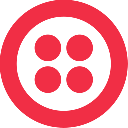</a> | **twilio-icon.svg** Vector (SVG) \| 1.46KB 更新: 2026-02-26 |
|  | **twilio.svg** Vector (SVG) \| 6.82KB 更新: 2026-02-26 |
|  | **twitch.svg** Vector (SVG) \| 921.00B 更新: 2026-02-26 |
|  | **twitter.svg** Vector (SVG) \| 1.63KB 更新: 2026-02-26 |
|  | **typeform-icon.svg** Vector (SVG) \| 1.99KB 更新: 2026-02-26 |
|  | **typeform.svg** Vector (SVG) \| 6.47KB 更新: 2026-02-26 |
|  | **typeorm.svg** Vector (SVG) \| 30.49KB 更新: 2026-02-26 |
|  | **typescript-icon-round.svg** Vector (SVG) \| 2.46KB 更新: 2026-02-26 |
|  | **typescript-icon.svg** Vector (SVG) \| 2.49KB 更新: 2026-02-26 |
|  | **typescript.svg** Vector (SVG) \| 9.08KB 更新: 2026-02-26 |
|  | **typo3-icon.svg** Vector (SVG) \| 984.00B 更新: 2026-02-26 |
|  | **typo3.svg** Vector (SVG) \| 3.72KB 更新: 2026-02-26 |
|  | **ubuntu.svg** Vector (SVG) \| 3.09KB 更新: 2026-02-26 |
|  | **udacity-icon.svg** Vector (SVG) \| 3.84KB 更新: 2026-02-26 |
|  | **udacity.svg** Vector (SVG) \| 6.58KB 更新: 2026-02-26 |
|  | **udemy-icon.svg** Vector (SVG) \| 978.00B 更新: 2026-02-26 |
|  | **udemy.svg** Vector (SVG) \| 4.36KB 更新: 2026-02-26 |
|  | **uikit.svg** Vector (SVG) \| 571.00B 更新: 2026-02-26 |
|  | **umu.svg** Vector (SVG) \| 2.52KB 更新: 2026-02-26 |
|  | **unbounce-icon.svg** Vector (SVG) \| 1.92KB 更新: 2026-02-26 |
|  | **unbounce.svg** Vector (SVG) \| 10.45KB 更新: 2026-02-26 |
|  | **undertow.svg** Vector (SVG) \| 1.86KB 更新: 2026-02-26 |
|  | **unionpay.svg** Vector (SVG) \| 17.20KB 更新: 2026-02-26 |
|  | **unitjs.svg** Vector (SVG) \| 1.55KB 更新: 2026-02-26 |
|  | **unito-icon.svg** Vector (SVG) \| 2.08KB 更新: 2026-02-26 |
|  | **unito.svg** Vector (SVG) \| 4.92KB 更新: 2026-02-26 |
|  | **unity.svg** Vector (SVG) \| 1.02KB 更新: 2026-02-26 |
|  | **unocss.svg** Vector (SVG) \| 1.44KB 更新: 2026-02-26 |
|  | **unrealengine-icon.svg** Vector (SVG) \| 9.18KB 更新: 2026-02-26 |
|  | **unrealengine.svg** Vector (SVG) \| 21.83KB 更新: 2026-02-26 |
|  | **upcase.svg** Vector (SVG) \| 6.06KB 更新: 2026-02-26 |
|  | **upstash-icon.svg** Vector (SVG) \| 2.43KB 更新: 2026-02-26 |
|  | **upstash.svg** Vector (SVG) \| 7.47KB 更新: 2026-02-26 |
|  | **upwork.svg** Vector (SVG) \| 3.27KB 更新: 2026-02-26 |
|  | **user-testing-icon.svg** Vector (SVG) \| 2.26KB 更新: 2026-02-26 |
|  | **user-testing.svg** Vector (SVG) \| 20.69KB 更新: 2026-02-26 |
|  | **uservoice-icon.svg** Vector (SVG) \| 2.56KB 更新: 2026-02-26 |
|  | **uservoice.svg** Vector (SVG) \| 6.85KB 更新: 2026-02-26 |
|  | **uwsgi.svg** Vector (SVG) \| 7.03KB 更新: 2026-02-26 |
|  | **v8-ignition.svg** Vector (SVG) \| 4.93KB 更新: 2026-02-26 |
|  | **v8-turbofan.svg** Vector (SVG) \| 7.27KB 更新: 2026-02-26 |
|  | **v8.svg** Vector (SVG) \| 4.01KB 更新: 2026-02-26 |
|  | **vaadin.svg** Vector (SVG) \| 7.62KB 更新: 2026-02-26 |
|  | **vaddy.svg** Vector (SVG) \| 1.45KB 更新: 2026-02-26 |
|  | **vagrant-icon.svg** Vector (SVG) \| 1.36KB 更新: 2026-02-26 |
|  | **vagrant.svg** Vector (SVG) \| 6.57KB 更新: 2026-02-26 |
|  | **vault-icon.svg** Vector (SVG) \| 1.50KB 更新: 2026-02-26 |
|  | **vault.svg** Vector (SVG) \| 3.85KB 更新: 2026-02-26 |
|  | **vector.svg** Vector (SVG) \| 2.50KB 更新: 2026-02-26 |
|  | **vercel-icon.svg** Vector (SVG) \| 329.00B 更新: 2026-02-26 |
|  | **vercel.svg** Vector (SVG) \| 3.01KB 更新: 2026-02-26 |
|  | **verdaccio-icon.svg** Vector (SVG) \| 864.00B 更新: 2026-02-26 |
|  | **verdaccio.svg** Vector (SVG) \| 10.50KB 更新: 2026-02-26 |
|  | **vernemq.svg** Vector (SVG) \| 3.90KB 更新: 2026-02-26 |
|  | **vim.svg** Vector (SVG) \| 11.06KB 更新: 2026-02-26 |
|  | **vimeo-icon.svg** Vector (SVG) \| 1.44KB 更新: 2026-02-26 |
|  | **vimeo.svg** Vector (SVG) \| 8.36KB 更新: 2026-02-26 |
|  | **visa.svg** Vector (SVG) \| 2.27KB 更新: 2026-02-26 |
|  | **visaelectron.svg** Vector (SVG) \| 5.95KB 更新: 2026-02-26 |
|  | **visual-studio-code.svg** Vector (SVG) \| 4.45KB 更新: 2026-02-26 |
|  | **visual-studio.svg** Vector (SVG) \| 4.65KB 更新: 2026-02-26 |
|  | **vitejs.svg** Vector (SVG) \| 2.15KB 更新: 2026-02-26 |
|  | **vitess.svg** Vector (SVG) \| 4.59KB 更新: 2026-02-26 |
|  | **vitest.svg** Vector (SVG) \| 3.41KB 更新: 2026-02-26 |
|  | **vivaldi-icon.svg** Vector (SVG) \| 4.65KB 更新: 2026-02-26 |
|  | **vivaldi.svg** Vector (SVG) \| 6.45KB 更新: 2026-02-26 |
|  | **vlang.svg** Vector (SVG) \| 3.02KB 更新: 2026-02-26 |
|  | **void.svg** Vector (SVG) \| 6.83KB 更新: 2026-02-26 |
|  | **vue.svg** Vector (SVG) \| 569.00B 更新: 2026-02-26 |
|  | **vuetifyjs.svg** Vector (SVG) \| 795.00B 更新: 2026-02-26 |
|  | **vueuse.svg** Vector (SVG) \| 1.08KB 更新: 2026-02-26 |
|  | **vulkan.svg** Vector (SVG) \| 6.68KB 更新: 2026-02-26 |
|  | **vultr-icon.svg** Vector (SVG) \| 2.09KB 更新: 2026-02-26 |
|  | **vultr.svg** Vector (SVG) \| 6.46KB 更新: 2026-02-26 |
|  | **vwo.svg** Vector (SVG) \| 1.42KB 更新: 2026-02-26 |
|  | **w3c.svg** Vector (SVG) \| 3.49KB 更新: 2026-02-26 |
|  | **waffle-icon.svg** Vector (SVG) \| 72.83KB 更新: 2026-02-26 |
|  | **waffle.svg** Vector (SVG) \| 2.38KB 更新: 2026-02-26 |
|  | **wagtail.svg** Vector (SVG) \| 2.59KB 更新: 2026-02-26 |
|  | **wakatime.svg** Vector (SVG) \| 1.33KB 更新: 2026-02-26 |
|  | **walkme.svg** Vector (SVG) \| 7.03KB 更新: 2026-02-26 |
|  | **watchman.svg** Vector (SVG) \| 2.48KB 更新: 2026-02-26 |
|  | **waypoint-icon.svg** Vector (SVG) \| 679.00B 更新: 2026-02-26 |
|  | **waypoint.svg** Vector (SVG) \| 4.88KB 更新: 2026-02-26 |
|  | **wayscript-icon.svg** Vector (SVG) \| 5.01KB 更新: 2026-02-26 |
|  | **wayscript.svg** Vector (SVG) \| 17.99KB 更新: 2026-02-26 |
|  | **wearos.svg** Vector (SVG) \| 1.27KB 更新: 2026-02-26 |
|  | **weave.svg** Vector (SVG) \| 1.16KB 更新: 2026-02-26 |
|  | **web.dev-icon.svg** Vector (SVG) \| 1.59KB 更新: 2026-02-26 |
|  | **web.dev.svg** Vector (SVG) \| 5.42KB 更新: 2026-02-26 |
|  | **web3js.svg** Vector (SVG) \| 4.48KB 更新: 2026-02-26 |
|  | **webassembly.svg** Vector (SVG) \| 1.29KB 更新: 2026-02-26 |
|  | **webcomponents.svg** Vector (SVG) \| 2.39KB 更新: 2026-02-26 |
|  | **webdriverio.svg** Vector (SVG) \| 32.97KB 更新: 2026-02-26 |
|  | **webflow.svg** Vector (SVG) \| 5.11KB 更新: 2026-02-26 |
|  | **webgpu.svg** Vector (SVG) \| 8.33KB 更新: 2026-02-26 |
|  | **webhint-icon.svg** Vector (SVG) \| 2.75KB 更新: 2026-02-26 |
|  | **webhint.svg** Vector (SVG) \| 12.10KB 更新: 2026-02-26 |
|  | **webhooks.svg** Vector (SVG) \| 3.43KB 更新: 2026-02-26 |
|  | **webix-icon.svg** Vector (SVG) \| 6.50KB 更新: 2026-02-26 |
|  | **webix.svg** Vector (SVG) \| 11.93KB 更新: 2026-02-26 |
|  | **webkit.svg** Vector (SVG) \| 5.30KB 更新: 2026-02-26 |
|  | **webmin.svg** Vector (SVG) \| 5.72KB 更新: 2026-02-26 |
|  | **webpack.svg** Vector (SVG) \| 1.63KB 更新: 2026-02-26 |
|  | **webplatform.svg** Vector (SVG) \| 1.74KB 更新: 2026-02-26 |
|  | **webrtc.svg** Vector (SVG) \| 4.93KB 更新: 2026-02-26 |
|  | **websocket.svg** Vector (SVG) \| 1.20KB 更新: 2026-02-26 |
|  | **webstorm.svg** Vector (SVG) \| 5.33KB 更新: 2026-02-26 |
|  | **webtorrent.svg** Vector (SVG) \| 4.30KB 更新: 2026-02-26 |
|  | **weebly.svg** Vector (SVG) \| 2.23KB 更新: 2026-02-26 |
|  | **whalar-icon.svg** Vector (SVG) \| 1.74KB 更新: 2026-02-26 |
|  | **whalar.svg** Vector (SVG) \| 7.71KB 更新: 2026-02-26 |
|  | **whatsapp-icon.svg** Vector (SVG) \| 4.15KB 更新: 2026-02-26 |
|  | **whatsapp-monochrome-icon.svg** Vector (SVG) \| 3.09KB 更新: 2026-02-26 |
|  | **whatsapp.svg** Vector (SVG) \| 17.05KB 更新: 2026-02-26 |
|  | **whatwg.svg** Vector (SVG) \| 1.01KB 更新: 2026-02-26 |
|  | **wicket-icon.svg** Vector (SVG) \| 723.00B 更新: 2026-02-26 |
|  | **wicket.svg** Vector (SVG) \| 5.94KB 更新: 2026-02-26 |
|  | **wifi.svg** Vector (SVG) \| 2.73KB 更新: 2026-02-26 |
|  | **wildfly.svg** Vector (SVG) \| 83.54KB 更新: 2026-02-26 |
|  | **windi-css.svg** Vector (SVG) \| 4.23KB 更新: 2026-02-26 |
|  | **wire.svg** Vector (SVG) \| 2.58KB 更新: 2026-02-26 |
|  | **wix.svg** Vector (SVG) \| 3.80KB 更新: 2026-02-26 |
|  | **wmr.svg** Vector (SVG) \| 65.11KB 更新: 2026-02-26 |
|  | **woocommerce-icon.svg** Vector (SVG) \| 4.87KB 更新: 2026-02-26 |
|  | **woocommerce.svg** Vector (SVG) \| 9.71KB 更新: 2026-02-26 |
|  | **woopra.svg** Vector (SVG) \| 5.56KB 更新: 2026-02-26 |
|  | **wordpress-icon-alt.svg** Vector (SVG) \| 2.15KB 更新: 2026-02-26 |
|  | **wordpress-icon.svg** Vector (SVG) \| 2.89KB 更新: 2026-02-26 |
|  | **wordpress.svg** Vector (SVG) \| 11.00KB 更新: 2026-02-26 |
|  | **workboard.svg** Vector (SVG) \| 825.00B 更新: 2026-02-26 |
|  | **workos-icon.svg** Vector (SVG) \| 1.61KB 更新: 2026-02-26 |
|  | **workos.svg** Vector (SVG) \| 5.29KB 更新: 2026-02-26 |
|  | **workplace-icon.svg** Vector (SVG) \| 1.93KB 更新: 2026-02-26 |
|  | **workplace.svg** Vector (SVG) \| 6.54KB 更新: 2026-02-26 |
|  | **wpengine.svg** Vector (SVG) \| 1.50KB 更新: 2026-02-26 |
|  | **wufoo.svg** Vector (SVG) \| 3.50KB 更新: 2026-02-26 |
|  | **xamarin.svg** Vector (SVG) \| 2.01KB 更新: 2026-02-26 |
|  | **xampp.svg** Vector (SVG) \| 5.26KB 更新: 2026-02-26 |
|  | **xata-icon.svg** Vector (SVG) \| 1.55KB 更新: 2026-02-26 |
|  | **xata.svg** Vector (SVG) \| 4.33KB 更新: 2026-02-26 |
|  | **xcart.svg** Vector (SVG) \| 8.95KB 更新: 2026-02-26 |
|  | **xcode.svg** Vector (SVG) \| 41.89KB 更新: 2026-02-26 |
|  | **xero.svg** Vector (SVG) \| 4.54KB 更新: 2026-02-26 |
|  | **xray-for-jira.svg** Vector (SVG) \| 2.08KB 更新: 2026-02-26 |
|  | **xstate.svg** Vector (SVG) \| 2.87KB 更新: 2026-02-26 |
|  | **xtend.svg** Vector (SVG) \| 1.32KB 更新: 2026-02-26 |
|  | **xwiki-icon.svg** Vector (SVG) \| 2.67KB 更新: 2026-02-26 |
|  | **xwiki.svg** Vector (SVG) \| 5.03KB 更新: 2026-02-26 |
|  | **yahoo.svg** Vector (SVG) \| 3.14KB 更新: 2026-02-26 |
|  | **yaml.svg** Vector (SVG) \| 1.68KB 更新: 2026-02-26 |
|  | **yammer.svg** Vector (SVG) \| 2.12KB 更新: 2026-02-26 |
|  | **yandex-ru.svg** Vector (SVG) \| 5.40KB 更新: 2026-02-26 |
|  | **yarn.svg** Vector (SVG) \| 4.60KB 更新: 2026-02-26 |
|  | **ycombinator.svg** Vector (SVG) \| 1.08KB 更新: 2026-02-26 |
|  | **yeoman.svg** Vector (SVG) \| 10.66KB 更新: 2026-02-26 |
|  | **yii.svg** Vector (SVG) \| 4.94KB 更新: 2026-02-26 |
|  | **youtrack.svg** Vector (SVG) \| 2.97KB 更新: 2026-02-26 |
|  | **youtube-icon.svg** Vector (SVG) \| 1023.00B 更新: 2026-02-26 |
|  | **youtube.svg** Vector (SVG) \| 8.07KB 更新: 2026-02-26 |
|  | **yugabyte-icon.svg** Vector (SVG) \| 2.67KB 更新: 2026-02-26 |
|  | **yugabyte.svg** Vector (SVG) \| 8.72KB 更新: 2026-02-26 |
|  | **zabbix.svg** Vector (SVG) \| 3.79KB 更新: 2026-02-26 |
|  | **zapier.svg** Vector (SVG) \| 7.15KB 更新: 2026-02-26 |
|  | **zend-framework.svg** Vector (SVG) \| 1.10KB 更新: 2026-02-26 |
|  | **zendesk-icon.svg** Vector (SVG) \| 778.00B 更新: 2026-02-26 |
|  | **zendesk.svg** Vector (SVG) \| 4.80KB 更新: 2026-02-26 |
|  | **zenhub-icon.svg** Vector (SVG) \| 4.08KB 更新: 2026-02-26 |
|  | **zenhub.svg** Vector (SVG) \| 9.93KB 更新: 2026-02-26 |
|  | **zeplin.svg** Vector (SVG) \| 4.42KB 更新: 2026-02-26 |
|  | **zeroheight-icon.svg** Vector (SVG) \| 1000.00B 更新: 2026-02-26 |
|  | **zeroheight.svg** Vector (SVG) \| 14.23KB 更新: 2026-02-26 |
|  | **zig.svg** Vector (SVG) \| 1.92KB 更新: 2026-02-26 |
|  | **zod.svg** Vector (SVG) \| 1.89KB 更新: 2026-02-26 |
|  | **zoho.svg** Vector (SVG) \| 6.92KB 更新: 2026-02-26 |
|  | **zoom-icon.svg** Vector (SVG) \| 1.91KB 更新: 2026-02-26 |
|  | **zoom.svg** Vector (SVG) \| 2.76KB 更新: 2026-02-26 |
|  | **zorin-os.svg** Vector (SVG) \| 829.00B 更新: 2026-02-26 |
|  | **zube.svg** Vector (SVG) \| 704.00B 更新: 2026-02-26 |
|  | **zulip-icon.svg** Vector (SVG) \| 1.78KB 更新: 2026-02-26 |
|  | **zulip.svg** Vector (SVG) \| 3.17KB 更新: 2026-02-26 |
|  | **zwave.svg** Vector (SVG) \| 1.92KB 更新: 2026-02-26 |