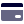
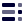
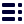

# 🖼️ 素材分類：CRM

> [🏠 主目錄](../../../README.md) / **CRM**

本目錄共有 `185` 個檔案

| 🎨 預覽 (點擊放大) | 📋 檔案詳細資訊與連結 |
| :--- | :--- |
|  | **📂 檔名:** `Add File Duotone Black.1.svg` ✨ **格式:** `Vector (SVG)` | ⚖️ `1.51KB` 📅 **更新:** `2026-02-27`  🔗 **複製 Markdown 語法:** `` 📥 [檢視原始檔](Add%20File%20Duotone%20Black.1.svg) |
|  | **📂 檔名:** `Add File Duotone Black.svg` ✨ **格式:** `Vector (SVG)` | ⚖️ `1.50KB` 📅 **更新:** `2026-02-27`  🔗 **複製 Markdown 語法:** `` 📥 [檢視原始檔](Add%20File%20Duotone%20Black.svg) |
|  | **📂 檔名:** `Add File Monotone Black.svg` ✨ **格式:** `Vector (SVG)` | ⚖️ `1.49KB` 📅 **更新:** `2026-02-27`  🔗 **複製 Markdown 語法:** `` 📥 [檢視原始檔](Add%20File%20Monotone%20Black.svg) |
|  | **📂 檔名:** `Add User Duotone Black.1.svg` ✨ **格式:** `Vector (SVG)` | ⚖️ `1.28KB` 📅 **更新:** `2026-02-27`  🔗 **複製 Markdown 語法:** `` 📥 [檢視原始檔](Add%20User%20Duotone%20Black.1.svg) |
|  | **📂 檔名:** `Add User Duotone Black.svg` ✨ **格式:** `Vector (SVG)` | ⚖️ `1.29KB` 📅 **更新:** `2026-02-27`  🔗 **複製 Markdown 語法:** `` 📥 [檢視原始檔](Add%20User%20Duotone%20Black.svg) |
|  | **📂 檔名:** `Add User Monotone Black.svg` ✨ **格式:** `Vector (SVG)` | ⚖️ `1.26KB` 📅 **更新:** `2026-02-27`  🔗 **複製 Markdown 語法:** `` 📥 [檢視原始檔](Add%20User%20Monotone%20Black.svg) |
|  | **📂 檔名:** `Arrow Left Duotone Black.1.svg` ✨ **格式:** `Vector (SVG)` | ⚖️ `1.00KB` 📅 **更新:** `2026-02-27`  🔗 **複製 Markdown 語法:** `` 📥 [檢視原始檔](Arrow%20Left%20Duotone%20Black.1.svg) |
|  | **📂 檔名:** `Arrow Left Duotone Black.svg` ✨ **格式:** `Vector (SVG)` | ⚖️ `1.01KB` 📅 **更新:** `2026-02-27`  🔗 **複製 Markdown 語法:** `` 📥 [檢視原始檔](Arrow%20Left%20Duotone%20Black.svg) |
|  | **📂 檔名:** `Arrow Left Monotone Black.svg` ✨ **格式:** `Vector (SVG)` | ⚖️ `1017.00B` 📅 **更新:** `2026-02-27`  🔗 **複製 Markdown 語法:** `` 📥 [檢視原始檔](Arrow%20Left%20Monotone%20Black.svg) |
|  | **📂 檔名:** `Arrow Right Duotone Black.1.svg` ✨ **格式:** `Vector (SVG)` | ⚖️ `986.00B` 📅 **更新:** `2026-02-27`  🔗 **複製 Markdown 語法:** `` 📥 [檢視原始檔](Arrow%20Right%20Duotone%20Black.1.svg) |
|  | **📂 檔名:** `Arrow Right Duotone Black.svg` ✨ **格式:** `Vector (SVG)` | ⚖️ `992.00B` 📅 **更新:** `2026-02-27`  🔗 **複製 Markdown 語法:** `` 📥 [檢視原始檔](Arrow%20Right%20Duotone%20Black.svg) |
|  | **📂 檔名:** `Arrow Right Monotone Black.svg` ✨ **格式:** `Vector (SVG)` | ⚖️ `978.00B` 📅 **更新:** `2026-02-27`  🔗 **複製 Markdown 語法:** `` 📥 [檢視原始檔](Arrow%20Right%20Monotone%20Black.svg) |
|  | **📂 檔名:** `Calendar Duotone Black.1.svg` ✨ **格式:** `Vector (SVG)` | ⚖️ `1.45KB` 📅 **更新:** `2026-02-27`  🔗 **複製 Markdown 語法:** `` 📥 [檢視原始檔](Calendar%20Duotone%20Black.1.svg) |
|  | **📂 檔名:** `Calendar Duotone Black.svg` ✨ **格式:** `Vector (SVG)` | ⚖️ `1.45KB` 📅 **更新:** `2026-02-27`  🔗 **複製 Markdown 語法:** `` 📥 [檢視原始檔](Calendar%20Duotone%20Black.svg) |
|  | **📂 檔名:** `Calendar Monotone Black.svg` ✨ **格式:** `Vector (SVG)` | ⚖️ `1.44KB` 📅 **更新:** `2026-02-27`  🔗 **複製 Markdown 語法:** `` 📥 [檢視原始檔](Calendar%20Monotone%20Black.svg) |
|  | **📂 檔名:** `Check List Duotone Black.1.svg` ✨ **格式:** `Vector (SVG)` | ⚖️ `1.14KB` 📅 **更新:** `2026-02-27`  🔗 **複製 Markdown 語法:** `` 📥 [檢視原始檔](Check%20List%20Duotone%20Black.1.svg) |
|  | **📂 檔名:** `Check List Duotone Black.svg` ✨ **格式:** `Vector (SVG)` | ⚖️ `1.14KB` 📅 **更新:** `2026-02-27`  🔗 **複製 Markdown 語法:** `` 📥 [檢視原始檔](Check%20List%20Duotone%20Black.svg) |
|  | **📂 檔名:** `Check List Monotone Black.svg` ✨ **格式:** `Vector (SVG)` | ⚖️ `1.13KB` 📅 **更新:** `2026-02-27`  🔗 **複製 Markdown 語法:** `` 📥 [檢視原始檔](Check%20List%20Monotone%20Black.svg) |
|  | **📂 檔名:** `Clock Duotone Black.1.svg` ✨ **格式:** `Vector (SVG)` | ⚖️ `1.19KB` 📅 **更新:** `2026-02-27`  🔗 **複製 Markdown 語法:** `` 📥 [檢視原始檔](Clock%20Duotone%20Black.1.svg) |
|  | **📂 檔名:** `Clock Duotone Black.svg` ✨ **格式:** `Vector (SVG)` | ⚖️ `1.19KB` 📅 **更新:** `2026-02-27`  🔗 **複製 Markdown 語法:** `` 📥 [檢視原始檔](Clock%20Duotone%20Black.svg) |
|  | **📂 檔名:** `Clock Monotone Black.svg` ✨ **格式:** `Vector (SVG)` | ⚖️ `1.18KB` 📅 **更新:** `2026-02-27`  🔗 **複製 Markdown 語法:** `` 📥 [檢視原始檔](Clock%20Monotone%20Black.svg) |
|  | **📂 檔名:** `Conversation Duotone Black.1.svg` ✨ **格式:** `Vector (SVG)` | ⚖️ `2.10KB` 📅 **更新:** `2026-02-27`  🔗 **複製 Markdown 語法:** `` 📥 [檢視原始檔](Conversation%20Duotone%20Black.1.svg) |
|  | **📂 檔名:** `Conversation Duotone Black.svg` ✨ **格式:** `Vector (SVG)` | ⚖️ `2.09KB` 📅 **更新:** `2026-02-27`  🔗 **複製 Markdown 語法:** `` 📥 [檢視原始檔](Conversation%20Duotone%20Black.svg) |
|  | **📂 檔名:** `Conversation Monotone Black.svg` ✨ **格式:** `Vector (SVG)` | ⚖️ `2.08KB` 📅 **更新:** `2026-02-27`  🔗 **複製 Markdown 語法:** `` 📥 [檢視原始檔](Conversation%20Monotone%20Black.svg) |
|  | **📂 檔名:** `Credit Duotone Black.1.svg` ✨ **格式:** `Vector (SVG)` | ⚖️ `697.00B` 📅 **更新:** `2026-02-27`  🔗 **複製 Markdown 語法:** `` 📥 [檢視原始檔](Credit%20Duotone%20Black.1.svg) |
|  | **📂 檔名:** `Credit Duotone Black.svg` ✨ **格式:** `Vector (SVG)` | ⚖️ `703.00B` 📅 **更新:** `2026-02-27`  🔗 **複製 Markdown 語法:** `` 📥 [檢視原始檔](Credit%20Duotone%20Black.svg) |
|  | **📂 檔名:** `Credit Monotone Black.svg` ✨ **格式:** `Vector (SVG)` | ⚖️ `689.00B` 📅 **更新:** `2026-02-27`  🔗 **複製 Markdown 語法:** `` 📥 [檢視原始檔](Credit%20Monotone%20Black.svg) |
|  | **📂 檔名:** `Download Duotone Black.1.svg` ✨ **格式:** `Vector (SVG)` | ⚖️ `1.19KB` 📅 **更新:** `2026-02-27`  🔗 **複製 Markdown 語法:** `` 📥 [檢視原始檔](Download%20Duotone%20Black.1.svg) |
|  | **📂 檔名:** `Download Duotone Black.svg` ✨ **格式:** `Vector (SVG)` | ⚖️ `1.19KB` 📅 **更新:** `2026-02-27`  🔗 **複製 Markdown 語法:** `` 📥 [檢視原始檔](Download%20Duotone%20Black.svg) |
|  | **📂 檔名:** `Download Monotone Black.svg` ✨ **格式:** `Vector (SVG)` | ⚖️ `1.17KB` 📅 **更新:** `2026-02-27`  🔗 **複製 Markdown 語法:** `` 📥 [檢視原始檔](Download%20Monotone%20Black.svg) |
|  | **📂 檔名:** `Edti Duotone Black.1.svg` ✨ **格式:** `Vector (SVG)` | ⚖️ `916.00B` 📅 **更新:** `2026-02-27`  🔗 **複製 Markdown 語法:** `` 📥 [檢視原始檔](Edti%20Duotone%20Black.1.svg) |
|  | **📂 檔名:** `Edti Duotone Black.svg` ✨ **格式:** `Vector (SVG)` | ⚖️ `911.00B` 📅 **更新:** `2026-02-27`  🔗 **複製 Markdown 語法:** `` 📥 [檢視原始檔](Edti%20Duotone%20Black.svg) |
|  | **📂 檔名:** `Edti Monotone Black.svg` ✨ **格式:** `Vector (SVG)` | ⚖️ `888.00B` 📅 **更新:** `2026-02-27`  🔗 **複製 Markdown 語法:** `` 📥 [檢視原始檔](Edti%20Monotone%20Black.svg) |
|  | **📂 檔名:** `Export Duotone Black.1.svg` ✨ **格式:** `Vector (SVG)` | ⚖️ `1.59KB` 📅 **更新:** `2026-02-27`  🔗 **複製 Markdown 語法:** `` 📥 [檢視原始檔](Export%20Duotone%20Black.1.svg) |
|  | **📂 檔名:** `Export Duotone Black.svg` ✨ **格式:** `Vector (SVG)` | ⚖️ `1.59KB` 📅 **更新:** `2026-02-27`  🔗 **複製 Markdown 語法:** `` 📥 [檢視原始檔](Export%20Duotone%20Black.svg) |
|  | **📂 檔名:** `Export Monotone Black.svg` ✨ **格式:** `Vector (SVG)` | ⚖️ `1.57KB` 📅 **更新:** `2026-02-27`  🔗 **複製 Markdown 語法:** `` 📥 [檢視原始檔](Export%20Monotone%20Black.svg) |
|  | **📂 檔名:** `Eye Duotone Black.1.svg` ✨ **格式:** `Vector (SVG)` | ⚖️ `1.38KB` 📅 **更新:** `2026-02-27`  🔗 **複製 Markdown 語法:** `` 📥 [檢視原始檔](Eye%20Duotone%20Black.1.svg) |
|  | **📂 檔名:** `Eye Duotone Black.svg` ✨ **格式:** `Vector (SVG)` | ⚖️ `1.37KB` 📅 **更新:** `2026-02-27`  🔗 **複製 Markdown 語法:** `` 📥 [檢視原始檔](Eye%20Duotone%20Black.svg) |
|  | **📂 檔名:** `Eye Monotone Black.svg` ✨ **格式:** `Vector (SVG)` | ⚖️ `1.37KB` 📅 **更新:** `2026-02-27`  🔗 **複製 Markdown 語法:** `` 📥 [檢視原始檔](Eye%20Monotone%20Black.svg) |
|  | **📂 檔名:** `Filter Duotone Black.1.svg` ✨ **格式:** `Vector (SVG)` | ⚖️ `424.00B` 📅 **更新:** `2026-02-27`  🔗 **複製 Markdown 語法:** `` 📥 [檢視原始檔](Filter%20Duotone%20Black.1.svg) |
|  | **📂 檔名:** `Filter Duotone Black.svg` ✨ **格式:** `Vector (SVG)` | ⚖️ `419.00B` 📅 **更新:** `2026-02-27`  🔗 **複製 Markdown 語法:** `` 📥 [檢視原始檔](Filter%20Duotone%20Black.svg) |
|  | **📂 檔名:** `Filter Monotone Black.svg` ✨ **格式:** `Vector (SVG)` | ⚖️ `396.00B` 📅 **更新:** `2026-02-27`  🔗 **複製 Markdown 語法:** `` 📥 [檢視原始檔](Filter%20Monotone%20Black.svg) |
|  | **📂 檔名:** `Label Duotone Black.1.svg` ✨ **格式:** `Vector (SVG)` | ⚖️ `1.26KB` 📅 **更新:** `2026-02-27`  🔗 **複製 Markdown 語法:** `` 📥 [檢視原始檔](Label%20Duotone%20Black.1.svg) |
|  | **📂 檔名:** `Label Duotone Black.svg` ✨ **格式:** `Vector (SVG)` | ⚖️ `1.25KB` 📅 **更新:** `2026-02-27`  🔗 **複製 Markdown 語法:** `` 📥 [檢視原始檔](Label%20Duotone%20Black.svg) |
|  | **📂 檔名:** `Label Monotone Black.svg` ✨ **格式:** `Vector (SVG)` | ⚖️ `1.25KB` 📅 **更新:** `2026-02-27`  🔗 **複製 Markdown 語法:** `` 📥 [檢視原始檔](Label%20Monotone%20Black.svg) |
|  | **📂 檔名:** `List Duotone Black.1.svg` ✨ **格式:** `Vector (SVG)` | ⚖️ `2.22KB` 📅 **更新:** `2026-02-27`  🔗 **複製 Markdown 語法:** `` 📥 [檢視原始檔](List%20Duotone%20Black.1.svg) |
|  | **📂 檔名:** `List Duotone Black.svg` ✨ **格式:** `Vector (SVG)` | ⚖️ `2.22KB` 📅 **更新:** `2026-02-27`  🔗 **複製 Markdown 語法:** `` 📥 [檢視原始檔](List%20Duotone%20Black.svg) |
|  | **📂 檔名:** `List Monotone Black.svg` ✨ **格式:** `Vector (SVG)` | ⚖️ `2.21KB` 📅 **更新:** `2026-02-27`  🔗 **複製 Markdown 語法:** `` 📥 [檢視原始檔](List%20Monotone%20Black.svg) |
|  | **📂 檔名:** `Location Duotone Black.1.svg` ✨ **格式:** `Vector (SVG)` | ⚖️ `1.08KB` 📅 **更新:** `2026-02-27`  🔗 **複製 Markdown 語法:** `` 📥 [檢視原始檔](Location%20Duotone%20Black.1.svg) |
|  | **📂 檔名:** `Location Duotone Black.svg` ✨ **格式:** `Vector (SVG)` | ⚖️ `1.08KB` 📅 **更新:** `2026-02-27`  🔗 **複製 Markdown 語法:** `` 📥 [檢視原始檔](Location%20Duotone%20Black.svg) |
|  | **📂 檔名:** `Location Monotone Black.svg` ✨ **格式:** `Vector (SVG)` | ⚖️ `1.07KB` 📅 **更新:** `2026-02-27`  🔗 **複製 Markdown 語法:** `` 📥 [檢視原始檔](Location%20Monotone%20Black.svg) |
|  | **📂 檔名:** `Notification Duotone Black.1.svg` ✨ **格式:** `Vector (SVG)` | ⚖️ `1.14KB` 📅 **更新:** `2026-02-27`  🔗 **複製 Markdown 語法:** `` 📥 [檢視原始檔](Notification%20Duotone%20Black.1.svg) |
|  | **📂 檔名:** `Notification Duotone Black.svg` ✨ **格式:** `Vector (SVG)` | ⚖️ `1.13KB` 📅 **更新:** `2026-02-27`  🔗 **複製 Markdown 語法:** `` 📥 [檢視原始檔](Notification%20Duotone%20Black.svg) |
|  | **📂 檔名:** `Notification Monotone Black.svg` ✨ **格式:** `Vector (SVG)` | ⚖️ `1.12KB` 📅 **更新:** `2026-02-27`  🔗 **複製 Markdown 語法:** `` 📥 [檢視原始檔](Notification%20Monotone%20Black.svg) |
|  | **📂 檔名:** `Overview Duotone Black.1.svg` ✨ **格式:** `Vector (SVG)` | ⚖️ `476.00B` 📅 **更新:** `2026-02-27`  🔗 **複製 Markdown 語法:** `` 📥 [檢視原始檔](Overview%20Duotone%20Black.1.svg) |
|  | **📂 檔名:** `Overview Duotone Black.svg` ✨ **格式:** `Vector (SVG)` | ⚖️ `483.00B` 📅 **更新:** `2026-02-27`  🔗 **複製 Markdown 語法:** `` 📥 [檢視原始檔](Overview%20Duotone%20Black.svg) |
|  | **📂 檔名:** `Overview Monotone Black.svg` ✨ **格式:** `Vector (SVG)` | ⚖️ `448.00B` 📅 **更新:** `2026-02-27`  🔗 **複製 Markdown 語法:** `` 📥 [檢視原始檔](Overview%20Monotone%20Black.svg) |
|  | **📂 檔名:** `Package Duotone Black.1.svg` ✨ **格式:** `Vector (SVG)` | ⚖️ `1.20KB` 📅 **更新:** `2026-02-27`  🔗 **複製 Markdown 語法:** `` 📥 [檢視原始檔](Package%20Duotone%20Black.1.svg) |
|  | **📂 檔名:** `Package Duotone Black.svg` ✨ **格式:** `Vector (SVG)` | ⚖️ `1.20KB` 📅 **更新:** `2026-02-27`  🔗 **複製 Markdown 語法:** `` 📥 [檢視原始檔](Package%20Duotone%20Black.svg) |
|  | **📂 檔名:** `Package Monotone Black.svg` ✨ **格式:** `Vector (SVG)` | ⚖️ `1.17KB` 📅 **更新:** `2026-02-27`  🔗 **複製 Markdown 語法:** `` 📥 [檢視原始檔](Package%20Monotone%20Black.svg) |
|  | **📂 檔名:** `Phone Duotone Black.1.svg` ✨ **格式:** `Vector (SVG)` | ⚖️ `2.52KB` 📅 **更新:** `2026-02-27`  🔗 **複製 Markdown 語法:** `` 📥 [檢視原始檔](Phone%20Duotone%20Black.1.svg) |
|  | **📂 檔名:** `Phone Duotone Black.svg` ✨ **格式:** `Vector (SVG)` | ⚖️ `2.52KB` 📅 **更新:** `2026-02-27`  🔗 **複製 Markdown 語法:** `` 📥 [檢視原始檔](Phone%20Duotone%20Black.svg) |
|  | **📂 檔名:** `Phone Monotone Black.svg` ✨ **格式:** `Vector (SVG)` | ⚖️ `2.50KB` 📅 **更新:** `2026-02-27`  🔗 **複製 Markdown 語法:** `` 📥 [檢視原始檔](Phone%20Monotone%20Black.svg) |
|  | **📂 檔名:** `Print Duotone Black.1.svg` ✨ **格式:** `Vector (SVG)` | ⚖️ `1.44KB` 📅 **更新:** `2026-02-27`  🔗 **複製 Markdown 語法:** `` 📥 [檢視原始檔](Print%20Duotone%20Black.1.svg) |
|  | **📂 檔名:** `Print Duotone Black.svg` ✨ **格式:** `Vector (SVG)` | ⚖️ `1.45KB` 📅 **更新:** `2026-02-27`  🔗 **複製 Markdown 語法:** `` 📥 [檢視原始檔](Print%20Duotone%20Black.svg) |
|  | **📂 檔名:** `Print Monotone Black.svg` ✨ **格式:** `Vector (SVG)` | ⚖️ `1.43KB` 📅 **更新:** `2026-02-27`  🔗 **複製 Markdown 語法:** `` 📥 [檢視原始檔](Print%20Monotone%20Black.svg) |
|  | **📂 檔名:** `Product Duotone Black.1.svg` ✨ **格式:** `Vector (SVG)` | ⚖️ `1.24KB` 📅 **更新:** `2026-02-27`  🔗 **複製 Markdown 語法:** `` 📥 [檢視原始檔](Product%20Duotone%20Black.1.svg) |
|  | **📂 檔名:** `Product Duotone Black.svg` ✨ **格式:** `Vector (SVG)` | ⚖️ `1.23KB` 📅 **更新:** `2026-02-27`  🔗 **複製 Markdown 語法:** `` 📥 [檢視原始檔](Product%20Duotone%20Black.svg) |
|  | **📂 檔名:** `Product Monotone Black.svg` ✨ **格式:** `Vector (SVG)` | ⚖️ `1.22KB` 📅 **更新:** `2026-02-27`  🔗 **複製 Markdown 語法:** `` 📥 [檢視原始檔](Product%20Monotone%20Black.svg) |
|  | **📂 檔名:** `Receipt Duotone Black.1.svg` ✨ **格式:** `Vector (SVG)` | ⚖️ `1.64KB` 📅 **更新:** `2026-02-27`  🔗 **複製 Markdown 語法:** `` 📥 [檢視原始檔](Receipt%20Duotone%20Black.1.svg) |
|  | **📂 檔名:** `Receipt Duotone Black.svg` ✨ **格式:** `Vector (SVG)` | ⚖️ `1.64KB` 📅 **更新:** `2026-02-27`  🔗 **複製 Markdown 語法:** `` 📥 [檢視原始檔](Receipt%20Duotone%20Black.svg) |
|  | **📂 檔名:** `Receipt Monotone Black.svg` ✨ **格式:** `Vector (SVG)` | ⚖️ `1.63KB` 📅 **更新:** `2026-02-27`  🔗 **複製 Markdown 語法:** `` 📥 [檢視原始檔](Receipt%20Monotone%20Black.svg) |
|  | **📂 檔名:** `Reminder Duotone Black.1.svg` ✨ **格式:** `Vector (SVG)` | ⚖️ `1.40KB` 📅 **更新:** `2026-02-27`  🔗 **複製 Markdown 語法:** `` 📥 [檢視原始檔](Reminder%20Duotone%20Black.1.svg) |
|  | **📂 檔名:** `Reminder Duotone Black.svg` ✨ **格式:** `Vector (SVG)` | ⚖️ `1.40KB` 📅 **更新:** `2026-02-27`  🔗 **複製 Markdown 語法:** `` 📥 [檢視原始檔](Reminder%20Duotone%20Black.svg) |
|  | **📂 檔名:** `Reminder Monotone Black.svg` ✨ **格式:** `Vector (SVG)` | ⚖️ `1.38KB` 📅 **更新:** `2026-02-27`  🔗 **複製 Markdown 語法:** `` 📥 [檢視原始檔](Reminder%20Monotone%20Black.svg) |
|  | **📂 檔名:** `Save Duotone Black.1.svg` ✨ **格式:** `Vector (SVG)` | ⚖️ `1003.00B` 📅 **更新:** `2026-02-27`  🔗 **複製 Markdown 語法:** `` 📥 [檢視原始檔](Save%20Duotone%20Black.1.svg) |
|  | **📂 檔名:** `Save Duotone Black.svg` ✨ **格式:** `Vector (SVG)` | ⚖️ `998.00B` 📅 **更新:** `2026-02-27`  🔗 **複製 Markdown 語法:** `` 📥 [檢視原始檔](Save%20Duotone%20Black.svg) |
|  | **📂 檔名:** `Save Monotone Black.svg` ✨ **格式:** `Vector (SVG)` | ⚖️ `975.00B` 📅 **更新:** `2026-02-27`  🔗 **複製 Markdown 語法:** `` 📥 [檢視原始檔](Save%20Monotone%20Black.svg) |
|  | **📂 檔名:** `Search Duotone Black.1.svg` ✨ **格式:** `Vector (SVG)` | ⚖️ `1.23KB` 📅 **更新:** `2026-02-27`  🔗 **複製 Markdown 語法:** `` 📥 [檢視原始檔](Search%20Duotone%20Black.1.svg) |
|  | **📂 檔名:** `Search Duotone Black.svg` ✨ **格式:** `Vector (SVG)` | ⚖️ `1.22KB` 📅 **更新:** `2026-02-27`  🔗 **複製 Markdown 語法:** `` 📥 [檢視原始檔](Search%20Duotone%20Black.svg) |
|  | **📂 檔名:** `Search Monotone Black.svg` ✨ **格式:** `Vector (SVG)` | ⚖️ `1.21KB` 📅 **更新:** `2026-02-27`  🔗 **複製 Markdown 語法:** `` 📥 [檢視原始檔](Search%20Monotone%20Black.svg) |
|  | **📂 檔名:** `Security Duotone Black.1.svg` ✨ **格式:** `Vector (SVG)` | ⚖️ `893.00B` 📅 **更新:** `2026-02-27`  🔗 **複製 Markdown 語法:** `` 📥 [檢視原始檔](Security%20Duotone%20Black.1.svg) |
|  | **📂 檔名:** `Security Duotone Black.svg` ✨ **格式:** `Vector (SVG)` | ⚖️ `887.00B` 📅 **更新:** `2026-02-27`  🔗 **複製 Markdown 語法:** `` 📥 [檢視原始檔](Security%20Duotone%20Black.svg) |
|  | **📂 檔名:** `Security Monotone Black.svg` ✨ **格式:** `Vector (SVG)` | ⚖️ `879.00B` 📅 **更新:** `2026-02-27`  🔗 **複製 Markdown 語法:** `` 📥 [檢視原始檔](Security%20Monotone%20Black.svg) |
|  | **📂 檔名:** `Setting Duotone Black.1.svg` ✨ **格式:** `Vector (SVG)` | ⚖️ `2.77KB` 📅 **更新:** `2026-02-27`  🔗 **複製 Markdown 語法:** `` 📥 [檢視原始檔](Setting%20Duotone%20Black.1.svg) |
|  | **📂 檔名:** `Setting Duotone Black.svg` ✨ **格式:** `Vector (SVG)` | ⚖️ `2.76KB` 📅 **更新:** `2026-02-27`  🔗 **複製 Markdown 語法:** `` 📥 [檢視原始檔](Setting%20Duotone%20Black.svg) |
|  | **📂 檔名:** `Setting Monotone Black.svg` ✨ **格式:** `Vector (SVG)` | ⚖️ `2.75KB` 📅 **更新:** `2026-02-27`  🔗 **複製 Markdown 語法:** `` 📥 [檢視原始檔](Setting%20Monotone%20Black.svg) |
|  | **📂 檔名:** `Sort Duotone Black.1.svg` ✨ **格式:** `Vector (SVG)` | ⚖️ `1.20KB` 📅 **更新:** `2026-02-27`  🔗 **複製 Markdown 語法:** `` 📥 [檢視原始檔](Sort%20Duotone%20Black.1.svg) |
|  | **📂 檔名:** `Sort Duotone Black.svg` ✨ **格式:** `Vector (SVG)` | ⚖️ `1.20KB` 📅 **更新:** `2026-02-27`  🔗 **複製 Markdown 語法:** `` 📥 [檢視原始檔](Sort%20Duotone%20Black.svg) |
|  | **📂 檔名:** `Sort Monotone Black.svg` ✨ **格式:** `Vector (SVG)` | ⚖️ `1.19KB` 📅 **更新:** `2026-02-27`  🔗 **複製 Markdown 語法:** `` 📥 [檢視原始檔](Sort%20Monotone%20Black.svg) |
|  | **📂 檔名:** `Stat Duotone Black.1.svg` ✨ **格式:** `Vector (SVG)` | ⚖️ `424.00B` 📅 **更新:** `2026-02-27`  🔗 **複製 Markdown 語法:** `` 📥 [檢視原始檔](Stat%20Duotone%20Black.1.svg) |
|  | **📂 檔名:** `Stat Duotone Black.svg` ✨ **格式:** `Vector (SVG)` | ⚖️ `418.00B` 📅 **更新:** `2026-02-27`  🔗 **複製 Markdown 語法:** `` 📥 [檢視原始檔](Stat%20Duotone%20Black.svg) |
|  | **📂 檔名:** `Stat Monotone Black.svg` ✨ **格式:** `Vector (SVG)` | ⚖️ `404.00B` 📅 **更新:** `2026-02-27`  🔗 **複製 Markdown 語法:** `` 📥 [檢視原始檔](Stat%20Monotone%20Black.svg) |
|  | **📂 檔名:** `Table Duotone Black.1.svg` ✨ **格式:** `Vector (SVG)` | ⚖️ `622.00B` 📅 **更新:** `2026-02-27`  🔗 **複製 Markdown 語法:** `` 📥 [檢視原始檔](Table%20Duotone%20Black.1.svg) |
|  | **📂 檔名:** `Table Duotone Black.svg` ✨ **格式:** `Vector (SVG)` | ⚖️ `642.00B` 📅 **更新:** `2026-02-27`  🔗 **複製 Markdown 語法:** `` 📥 [檢視原始檔](Table%20Duotone%20Black.svg) |
|  | **📂 檔名:** `Table Monotone Black.svg` ✨ **格式:** `Vector (SVG)` | ⚖️ `580.00B` 📅 **更新:** `2026-02-27`  🔗 **複製 Markdown 語法:** `` 📥 [檢視原始檔](Table%20Monotone%20Black.svg) |
|  | **📂 檔名:** `Task Duotone Black.1.svg` ✨ **格式:** `Vector (SVG)` | ⚖️ `1.58KB` 📅 **更新:** `2026-02-27`  🔗 **複製 Markdown 語法:** `` 📥 [檢視原始檔](Task%20Duotone%20Black.1.svg) |
|  | **📂 檔名:** `Task Duotone Black.svg` ✨ **格式:** `Vector (SVG)` | ⚖️ `1.58KB` 📅 **更新:** `2026-02-27`  🔗 **複製 Markdown 語法:** `` 📥 [檢視原始檔](Task%20Duotone%20Black.svg) |
|  | **📂 檔名:** `Task Monotone Black.svg` ✨ **格式:** `Vector (SVG)` | ⚖️ `1.57KB` 📅 **更新:** `2026-02-27`  🔗 **複製 Markdown 語法:** `` 📥 [檢視原始檔](Task%20Monotone%20Black.svg) |
|  | **📂 檔名:** `Time List Duotone Black.1.svg` ✨ **格式:** `Vector (SVG)` | ⚖️ `1.98KB` 📅 **更新:** `2026-02-27`  🔗 **複製 Markdown 語法:** `` 📥 [檢視原始檔](Time%20List%20Duotone%20Black.1.svg) |
|  | **📂 檔名:** `Time List Duotone Black.svg` ✨ **格式:** `Vector (SVG)` | ⚖️ `1.94KB` 📅 **更新:** `2026-02-27`  🔗 **複製 Markdown 語法:** `` 📥 [檢視原始檔](Time%20List%20Duotone%20Black.svg) |
|  | **📂 檔名:** `Time List Monotone Black.svg` ✨ **格式:** `Vector (SVG)` | ⚖️ `1.93KB` 📅 **更新:** `2026-02-27`  🔗 **複製 Markdown 語法:** `` 📥 [檢視原始檔](Time%20List%20Monotone%20Black.svg) |
|  | **📂 檔名:** `Trash Duotone Black.1.svg` ✨ **格式:** `Vector (SVG)` | ⚖️ `1.31KB` 📅 **更新:** `2026-02-27`  🔗 **複製 Markdown 語法:** `` 📥 [檢視原始檔](Trash%20Duotone%20Black.1.svg) |
|  | **📂 檔名:** `Trash Duotone Black.svg` ✨ **格式:** `Vector (SVG)` | ⚖️ `1.30KB` 📅 **更新:** `2026-02-27`  🔗 **複製 Markdown 語法:** `` 📥 [檢視原始檔](Trash%20Duotone%20Black.svg) |
|  | **📂 檔名:** `Trash Monotone Black.svg` ✨ **格式:** `Vector (SVG)` | ⚖️ `1.30KB` 📅 **更新:** `2026-02-27`  🔗 **複製 Markdown 語法:** `` 📥 [檢視原始檔](Trash%20Monotone%20Black.svg) |
|  | **📂 檔名:** `Type Duotone Black.1.svg` ✨ **格式:** `Vector (SVG)` | ⚖️ `320.00B` 📅 **更新:** `2026-02-27`  🔗 **複製 Markdown 語法:** `` 📥 [檢視原始檔](Type%20Duotone%20Black.1.svg) |
|  | **📂 檔名:** `Type Duotone Black.svg` ✨ **格式:** `Vector (SVG)` | ⚖️ `326.00B` 📅 **更新:** `2026-02-27`  🔗 **複製 Markdown 語法:** `` 📥 [檢視原始檔](Type%20Duotone%20Black.svg) |
|  | **📂 檔名:** `Type Monotone Black.svg` ✨ **格式:** `Vector (SVG)` | ⚖️ `312.00B` 📅 **更新:** `2026-02-27`  🔗 **複製 Markdown 語法:** `` 📥 [檢視原始檔](Type%20Monotone%20Black.svg) |
|  | **📂 檔名:** `Upload Duotone Black.1.svg` ✨ **格式:** `Vector (SVG)` | ⚖️ `1.04KB` 📅 **更新:** `2026-02-27`  🔗 **複製 Markdown 語法:** `` 📥 [檢視原始檔](Upload%20Duotone%20Black.1.svg) |
|  | **📂 檔名:** `Upload Duotone Black.svg` ✨ **格式:** `Vector (SVG)` | ⚖️ `1.04KB` 📅 **更新:** `2026-02-27`  🔗 **複製 Markdown 語法:** `` 📥 [檢視原始檔](Upload%20Duotone%20Black.svg) |
|  | **📂 檔名:** `Upload Monotone Black.svg` ✨ **格式:** `Vector (SVG)` | ⚖️ `1.02KB` 📅 **更新:** `2026-02-27`  🔗 **複製 Markdown 語法:** `` 📥 [檢視原始檔](Upload%20Monotone%20Black.svg) |
|  | **📂 檔名:** `add-file-duotone-black.svg` ✨ **格式:** `Vector (SVG)` | ⚖️ `558.00B` 📅 **更新:** `2026-02-27`  🔗 **複製 Markdown 語法:** `` 📥 [檢視原始檔](add-file-duotone-black.svg) |
|  | **📂 檔名:** `add-file-monotone-black.svg` ✨ **格式:** `Vector (SVG)` | ⚖️ `531.00B` 📅 **更新:** `2026-02-27`  🔗 **複製 Markdown 語法:** `` 📥 [檢視原始檔](add-file-monotone-black.svg) |
|  | **📂 檔名:** `add-user-duotone-black.svg` ✨ **格式:** `Vector (SVG)` | ⚖️ `592.00B` 📅 **更新:** `2026-02-27`  🔗 **複製 Markdown 語法:** `` 📥 [檢視原始檔](add-user-duotone-black.svg) |
|  | **📂 檔名:** `add-user-monotone-black.svg` ✨ **格式:** `Vector (SVG)` | ⚖️ `565.00B` 📅 **更新:** `2026-02-27`  🔗 **複製 Markdown 語法:** `` 📥 [檢視原始檔](add-user-monotone-black.svg) |
|  | **📂 檔名:** `arrow-left-duotone-black.svg` ✨ **格式:** `Vector (SVG)` | ⚖️ `428.00B` 📅 **更新:** `2026-02-27`  🔗 **複製 Markdown 語法:** `` 📥 [檢視原始檔](arrow-left-duotone-black.svg) |
|  | **📂 檔名:** `arrow-left-monotone-black.svg` ✨ **格式:** `Vector (SVG)` | ⚖️ `401.00B` 📅 **更新:** `2026-02-27`  🔗 **複製 Markdown 語法:** `` 📥 [檢視原始檔](arrow-left-monotone-black.svg) |
|  | **📂 檔名:** `arrow-right-duotone-black.svg` ✨ **格式:** `Vector (SVG)` | ⚖️ `431.00B` 📅 **更新:** `2026-02-27`  🔗 **複製 Markdown 語法:** `` 📥 [檢視原始檔](arrow-right-duotone-black.svg) |
|  | **📂 檔名:** `arrow-right-monotone-black.svg` ✨ **格式:** `Vector (SVG)` | ⚖️ `404.00B` 📅 **更新:** `2026-02-27`  🔗 **複製 Markdown 語法:** `` 📥 [檢視原始檔](arrow-right-monotone-black.svg) |
|  | **📂 檔名:** `calendar-duotone-black.svg` ✨ **格式:** `Vector (SVG)` | ⚖️ `562.00B` 📅 **更新:** `2026-02-27`  🔗 **複製 Markdown 語法:** `` 📥 [檢視原始檔](calendar-duotone-black.svg) |
|  | **📂 檔名:** `calendar-monotone-black.svg` ✨ **格式:** `Vector (SVG)` | ⚖️ `535.00B` 📅 **更新:** `2026-02-27`  🔗 **複製 Markdown 語法:** `` 📥 [檢視原始檔](calendar-monotone-black.svg) |
|  | **📂 檔名:** `check-list-duotone-black.svg` ✨ **格式:** `Vector (SVG)` | ⚖️ `509.00B` 📅 **更新:** `2026-02-27`  🔗 **複製 Markdown 語法:** `` 📥 [檢視原始檔](check-list-duotone-black.svg) |
|  | **📂 檔名:** `check-list-monotone-black.svg` ✨ **格式:** `Vector (SVG)` | ⚖️ `482.00B` 📅 **更新:** `2026-02-27`  🔗 **複製 Markdown 語法:** `` 📥 [檢視原始檔](check-list-monotone-black.svg) |
|  | **📂 檔名:** `clock-duotone-black.svg` ✨ **格式:** `Vector (SVG)` | ⚖️ `478.00B` 📅 **更新:** `2026-02-27`  🔗 **複製 Markdown 語法:** `` 📥 [檢視原始檔](clock-duotone-black.svg) |
|  | **📂 檔名:** `clock-monotone-black.svg` ✨ **格式:** `Vector (SVG)` | ⚖️ `451.00B` 📅 **更新:** `2026-02-27`  🔗 **複製 Markdown 語法:** `` 📥 [檢視原始檔](clock-monotone-black.svg) |
|  | **📂 檔名:** `conversation-duotone-black.svg` ✨ **格式:** `Vector (SVG)` | ⚖️ `714.00B` 📅 **更新:** `2026-02-27`  🔗 **複製 Markdown 語法:** `` 📥 [檢視原始檔](conversation-duotone-black.svg) |
|  | **📂 檔名:** `conversation-monotone-black.svg` ✨ **格式:** `Vector (SVG)` | ⚖️ `687.00B` 📅 **更新:** `2026-02-27`  🔗 **複製 Markdown 語法:** `` 📥 [檢視原始檔](conversation-monotone-black.svg) |
|  | **📂 檔名:** `credit-duotone-black.svg` ✨ **格式:** `Vector (SVG)` | ⚖️ `355.00B` 📅 **更新:** `2026-02-27`  🔗 **複製 Markdown 語法:** `` 📥 [檢視原始檔](credit-duotone-black.svg) |
|  | **📂 檔名:** `credit-monotone-black.svg` ✨ **格式:** `Vector (SVG)` | ⚖️ `328.00B` 📅 **更新:** `2026-02-27`  🔗 **複製 Markdown 語法:** `` 📥 [檢視原始檔](credit-monotone-black.svg) |
|  | **📂 檔名:** `download-duotone-black.svg` ✨ **格式:** `Vector (SVG)` | ⚖️ `510.00B` 📅 **更新:** `2026-02-27`  🔗 **複製 Markdown 語法:** `` 📥 [檢視原始檔](download-duotone-black.svg) |
|  | **📂 檔名:** `download-monotone-black.svg` ✨ **格式:** `Vector (SVG)` | ⚖️ `483.00B` 📅 **更新:** `2026-02-27`  🔗 **複製 Markdown 語法:** `` 📥 [檢視原始檔](download-monotone-black.svg) |
|  | **📂 檔名:** `edti-duotone-black.svg` ✨ **格式:** `Vector (SVG)` | ⚖️ `495.00B` 📅 **更新:** `2026-02-27`  🔗 **複製 Markdown 語法:** `` 📥 [檢視原始檔](edti-duotone-black.svg) |
|  | **📂 檔名:** `edti-monotone-black.svg` ✨ **格式:** `Vector (SVG)` | ⚖️ `468.00B` 📅 **更新:** `2026-02-27`  🔗 **複製 Markdown 語法:** `` 📥 [檢視原始檔](edti-monotone-black.svg) |
|  | **📂 檔名:** `export-duotone-black.svg` ✨ **格式:** `Vector (SVG)` | ⚖️ `631.00B` 📅 **更新:** `2026-02-27`  🔗 **複製 Markdown 語法:** `` 📥 [檢視原始檔](export-duotone-black.svg) |
|  | **📂 檔名:** `export-monotone-black.svg` ✨ **格式:** `Vector (SVG)` | ⚖️ `604.00B` 📅 **更新:** `2026-02-27`  🔗 **複製 Markdown 語法:** `` 📥 [檢視原始檔](export-monotone-black.svg) |
|  | **📂 檔名:** `eye-duotone-black.svg` ✨ **格式:** `Vector (SVG)` | ⚖️ `525.00B` 📅 **更新:** `2026-02-27`  🔗 **複製 Markdown 語法:** `` 📥 [檢視原始檔](eye-duotone-black.svg) |
|  | **📂 檔名:** `eye-monotone-black.svg` ✨ **格式:** `Vector (SVG)` | ⚖️ `498.00B` 📅 **更新:** `2026-02-27`  🔗 **複製 Markdown 語法:** `` 📥 [檢視原始檔](eye-monotone-black.svg) |
|  | **📂 檔名:** `filter-duotone-black.svg` ✨ **格式:** `Vector (SVG)` | ⚖️ `382.00B` 📅 **更新:** `2026-02-27`  🔗 **複製 Markdown 語法:** `` 📥 [檢視原始檔](filter-duotone-black.svg) |
|  | **📂 檔名:** `filter-monotone-black.svg` ✨ **格式:** `Vector (SVG)` | ⚖️ `355.00B` 📅 **更新:** `2026-02-27`  🔗 **複製 Markdown 語法:** `` 📥 [檢視原始檔](filter-monotone-black.svg) |
|  | **📂 檔名:** `label-duotone-black.svg` ✨ **格式:** `Vector (SVG)` | ⚖️ `540.00B` 📅 **更新:** `2026-02-27`  🔗 **複製 Markdown 語法:** `` 📥 [檢視原始檔](label-duotone-black.svg) |
|  | **📂 檔名:** `label-monotone-black.svg` ✨ **格式:** `Vector (SVG)` | ⚖️ `513.00B` 📅 **更新:** `2026-02-27`  🔗 **複製 Markdown 語法:** `` 📥 [檢視原始檔](label-monotone-black.svg) |
|  | **📂 檔名:** `list-duotone-black.svg` ✨ **格式:** `Vector (SVG)` | ⚖️ `725.00B` 📅 **更新:** `2026-02-27`  🔗 **複製 Markdown 語法:** `` 📥 [檢視原始檔](list-duotone-black.svg) |
|  | **📂 檔名:** `list-monotone-black.svg` ✨ **格式:** `Vector (SVG)` | ⚖️ `698.00B` 📅 **更新:** `2026-02-27`  🔗 **複製 Markdown 語法:** `` 📥 [檢視原始檔](list-monotone-black.svg) |
|  | **📂 檔名:** `location-duotone-black.svg` ✨ **格式:** `Vector (SVG)` | ⚖️ `537.00B` 📅 **更新:** `2026-02-27`  🔗 **複製 Markdown 語法:** `` 📥 [檢視原始檔](location-duotone-black.svg) |
|  | **📂 檔名:** `location-monotone-black.svg` ✨ **格式:** `Vector (SVG)` | ⚖️ `510.00B` 📅 **更新:** `2026-02-27`  🔗 **複製 Markdown 語法:** `` 📥 [檢視原始檔](location-monotone-black.svg) |
|  | **📂 檔名:** `notification-duotone-black.svg` ✨ **格式:** `Vector (SVG)` | ⚖️ `481.00B` 📅 **更新:** `2026-02-27`  🔗 **複製 Markdown 語法:** `` 📥 [檢視原始檔](notification-duotone-black.svg) |
|  | **📂 檔名:** `notification-monotone-black.svg` ✨ **格式:** `Vector (SVG)` | ⚖️ `454.00B` 📅 **更新:** `2026-02-27`  🔗 **複製 Markdown 語法:** `` 📥 [檢視原始檔](notification-monotone-black.svg) |
|  | **📂 檔名:** `overview-duotone-black.svg` ✨ **格式:** `Vector (SVG)` | ⚖️ `420.00B` 📅 **更新:** `2026-02-27`  🔗 **複製 Markdown 語法:** `` 📥 [檢視原始檔](overview-duotone-black.svg) |
|  | **📂 檔名:** `overview-monotone-black.svg` ✨ **格式:** `Vector (SVG)` | ⚖️ `393.00B` 📅 **更新:** `2026-02-27`  🔗 **複製 Markdown 語法:** `` 📥 [檢視原始檔](overview-monotone-black.svg) |
|  | **📂 檔名:** `package-duotone-black.svg` ✨ **格式:** `Vector (SVG)` | ⚖️ `644.00B` 📅 **更新:** `2026-02-27`  🔗 **複製 Markdown 語法:** `` 📥 [檢視原始檔](package-duotone-black.svg) |
|  | **📂 檔名:** `package-monotone-black.svg` ✨ **格式:** `Vector (SVG)` | ⚖️ `582.00B` 📅 **更新:** `2026-02-27`  🔗 **複製 Markdown 語法:** `` 📥 [檢視原始檔](package-monotone-black.svg) |
|  | **📂 檔名:** `phone-duotone-black.svg` ✨ **格式:** `Vector (SVG)` | ⚖️ `1.03KB` 📅 **更新:** `2026-02-27`  🔗 **複製 Markdown 語法:** `` 📥 [檢視原始檔](phone-duotone-black.svg) |
|  | **📂 檔名:** `phone-monotone-black.svg` ✨ **格式:** `Vector (SVG)` | ⚖️ `1.00KB` 📅 **更新:** `2026-02-27`  🔗 **複製 Markdown 語法:** `` 📥 [檢視原始檔](phone-monotone-black.svg) |
|  | **📂 檔名:** `print-duotone-black.svg` ✨ **格式:** `Vector (SVG)` | ⚖️ `674.00B` 📅 **更新:** `2026-02-27`  🔗 **複製 Markdown 語法:** `` 📥 [檢視原始檔](print-duotone-black.svg) |
|  | **📂 檔名:** `print-monotone-black.svg` ✨ **格式:** `Vector (SVG)` | ⚖️ `662.00B` 📅 **更新:** `2026-02-27`  🔗 **複製 Markdown 語法:** `` 📥 [檢視原始檔](print-monotone-black.svg) |
|  | **📂 檔名:** `product-duotone-black.svg` ✨ **格式:** `Vector (SVG)` | ⚖️ `550.00B` 📅 **更新:** `2026-02-27`  🔗 **複製 Markdown 語法:** `` 📥 [檢視原始檔](product-duotone-black.svg) |
|  | **📂 檔名:** `product-monotone-black.svg` ✨ **格式:** `Vector (SVG)` | ⚖️ `523.00B` 📅 **更新:** `2026-02-27`  🔗 **複製 Markdown 語法:** `` 📥 [檢視原始檔](product-monotone-black.svg) |
|  | **📂 檔名:** `receipt-duotone-black.svg` ✨ **格式:** `Vector (SVG)` | ⚖️ `744.00B` 📅 **更新:** `2026-02-27`  🔗 **複製 Markdown 語法:** `` 📥 [檢視原始檔](receipt-duotone-black.svg) |
|  | **📂 檔名:** `receipt-monotone-black.svg` ✨ **格式:** `Vector (SVG)` | ⚖️ `717.00B` 📅 **更新:** `2026-02-27`  🔗 **複製 Markdown 語法:** `` 📥 [檢視原始檔](receipt-monotone-black.svg) |
|  | **📂 檔名:** `reminder-duotone-black.svg` ✨ **格式:** `Vector (SVG)` | ⚖️ `611.00B` 📅 **更新:** `2026-02-27`  🔗 **複製 Markdown 語法:** `` 📥 [檢視原始檔](reminder-duotone-black.svg) |
|  | **📂 檔名:** `reminder-monotone-black.svg` ✨ **格式:** `Vector (SVG)` | ⚖️ `570.00B` 📅 **更新:** `2026-02-27`  🔗 **複製 Markdown 語法:** `` 📥 [檢視原始檔](reminder-monotone-black.svg) |
|  | **📂 檔名:** `save-duotone-black.svg` ✨ **格式:** `Vector (SVG)` | ⚖️ `496.00B` 📅 **更新:** `2026-02-27`  🔗 **複製 Markdown 語法:** `` 📥 [檢視原始檔](save-duotone-black.svg) |
|  | **📂 檔名:** `save-monotone-black.svg` ✨ **格式:** `Vector (SVG)` | ⚖️ `469.00B` 📅 **更新:** `2026-02-27`  🔗 **複製 Markdown 語法:** `` 📥 [檢視原始檔](save-monotone-black.svg) |
|  | **📂 檔名:** `search-duotone-black.svg` ✨ **格式:** `Vector (SVG)` | ⚖️ `495.00B` 📅 **更新:** `2026-02-27`  🔗 **複製 Markdown 語法:** `` 📥 [檢視原始檔](search-duotone-black.svg) |
|  | **📂 檔名:** `search-monotone-black.svg` ✨ **格式:** `Vector (SVG)` | ⚖️ `468.00B` 📅 **更新:** `2026-02-27`  🔗 **複製 Markdown 語法:** `` 📥 [檢視原始檔](search-monotone-black.svg) |
|  | **📂 檔名:** `security-duotone-black.svg` ✨ **格式:** `Vector (SVG)` | ⚖️ `399.00B` 📅 **更新:** `2026-02-27`  🔗 **複製 Markdown 語法:** `` 📥 [檢視原始檔](security-duotone-black.svg) |
|  | **📂 檔名:** `security-monotone-black.svg` ✨ **格式:** `Vector (SVG)` | ⚖️ `372.00B` 📅 **更新:** `2026-02-27`  🔗 **複製 Markdown 語法:** `` 📥 [檢視原始檔](security-monotone-black.svg) |
|  | **📂 檔名:** `setting-duotone-black.svg` ✨ **格式:** `Vector (SVG)` | ⚖️ `931.00B` 📅 **更新:** `2026-02-27`  🔗 **複製 Markdown 語法:** `` 📥 [檢視原始檔](setting-duotone-black.svg) |
|  | **📂 檔名:** `setting-monotone-black.svg` ✨ **格式:** `Vector (SVG)` | ⚖️ `904.00B` 📅 **更新:** `2026-02-27`  🔗 **複製 Markdown 語法:** `` 📥 [檢視原始檔](setting-monotone-black.svg) |
|  | **📂 檔名:** `sort-duotone-black.svg` ✨ **格式:** `Vector (SVG)` | ⚖️ `517.00B` 📅 **更新:** `2026-02-27`  🔗 **複製 Markdown 語法:** `` 📥 [檢視原始檔](sort-duotone-black.svg) |
|  | **📂 檔名:** `sort-monotone-black.svg` ✨ **格式:** `Vector (SVG)` | ⚖️ `490.00B` 📅 **更新:** `2026-02-27`  🔗 **複製 Markdown 語法:** `` 📥 [檢視原始檔](sort-monotone-black.svg) |
|  | **📂 檔名:** `stat-duotone-black.svg` ✨ **格式:** `Vector (SVG)` | ⚖️ `390.00B` 📅 **更新:** `2026-02-27`  🔗 **複製 Markdown 語法:** `` 📥 [檢視原始檔](stat-duotone-black.svg) |
|  | **📂 檔名:** `stat-monotone-black.svg` ✨ **格式:** `Vector (SVG)` | ⚖️ `363.00B` 📅 **更新:** `2026-02-27`  🔗 **複製 Markdown 語法:** `` 📥 [檢視原始檔](stat-monotone-black.svg) |
|  | **📂 檔名:** `table-duotone-black.svg` ✨ **格式:** `Vector (SVG)` | ⚖️ `548.00B` 📅 **更新:** `2026-02-27`  🔗 **複製 Markdown 語法:** `` 📥 [檢視原始檔](table-duotone-black.svg) |
|  | **📂 檔名:** `table-monotone-black.svg` ✨ **格式:** `Vector (SVG)` | ⚖️ `521.00B` 📅 **更新:** `2026-02-27`  🔗 **複製 Markdown 語法:** `` 📥 [檢視原始檔](table-monotone-black.svg) |
|  | **📂 檔名:** `task-duotone-black.svg` ✨ **格式:** `Vector (SVG)` | ⚖️ `616.00B` 📅 **更新:** `2026-02-27`  🔗 **複製 Markdown 語法:** `` 📥 [檢視原始檔](task-duotone-black.svg) |
|  | **📂 檔名:** `task-monotone-black.svg` ✨ **格式:** `Vector (SVG)` | ⚖️ `589.00B` 📅 **更新:** `2026-02-27`  🔗 **複製 Markdown 語法:** `` 📥 [檢視原始檔](task-monotone-black.svg) |
|  | **📂 檔名:** `time-list-duotone-black.svg` ✨ **格式:** `Vector (SVG)` | ⚖️ `803.00B` 📅 **更新:** `2026-02-27`  🔗 **複製 Markdown 語法:** `` 📥 [檢視原始檔](time-list-duotone-black.svg) |
|  | **📂 檔名:** `time-list-monotone-black.svg` ✨ **格式:** `Vector (SVG)` | ⚖️ `776.00B` 📅 **更新:** `2026-02-27`  🔗 **複製 Markdown 語法:** `` 📥 [檢視原始檔](time-list-monotone-black.svg) |
|  | **📂 檔名:** `trash-duotone-black.svg` ✨ **格式:** `Vector (SVG)` | ⚖️ `517.00B` 📅 **更新:** `2026-02-27`  🔗 **複製 Markdown 語法:** `` 📥 [檢視原始檔](trash-duotone-black.svg) |
|  | **📂 檔名:** `trash-monotone-black.svg` ✨ **格式:** `Vector (SVG)` | ⚖️ `490.00B` 📅 **更新:** `2026-02-27`  🔗 **複製 Markdown 語法:** `` 📥 [檢視原始檔](trash-monotone-black.svg) |
|  | **📂 檔名:** `type-duotone-black.svg` ✨ **格式:** `Vector (SVG)` | ⚖️ `296.00B` 📅 **更新:** `2026-02-27`  🔗 **複製 Markdown 語法:** `` 📥 [檢視原始檔](type-duotone-black.svg) |
|  | **📂 檔名:** `type-monotone-black.svg` ✨ **格式:** `Vector (SVG)` | ⚖️ `269.00B` 📅 **更新:** `2026-02-27`  🔗 **複製 Markdown 語法:** `` 📥 [檢視原始檔](type-monotone-black.svg) |
|  | **📂 檔名:** `upload-duotone-black.svg` ✨ **格式:** `Vector (SVG)` | ⚖️ `485.00B` 📅 **更新:** `2026-02-27`  🔗 **複製 Markdown 語法:** `` 📥 [檢視原始檔](upload-duotone-black.svg) |
|  | **📂 檔名:** `upload-monotone-black.svg` ✨ **格式:** `Vector (SVG)` | ⚖️ `458.00B` 📅 **更新:** `2026-02-27`  🔗 **複製 Markdown 語法:** `` 📥 [檢視原始檔](upload-monotone-black.svg) |