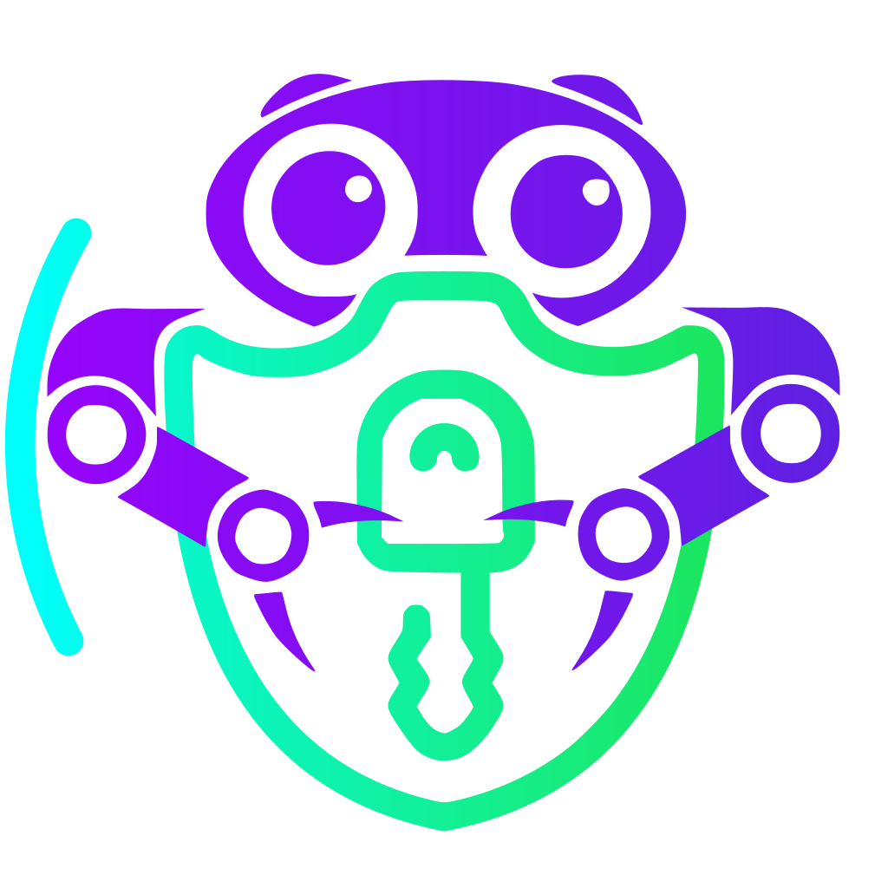

# 📂 目錄：CandyiCons

> [🏠 主目錄](../../../README.md) / [images](../../README.md) / [iCons](../README.md) / **CandyiCons**

此目錄目前沒有直接存放圖片，請選擇下方子分類：

### 🗂️ 子分類列表

| 分類名稱 | 封面預覽 | 統計 |
| :--- | :--- | :--- |
| [📠**apps**](apps/README.md) | &nbsp;&nbsp; | 共 `551` 張 |
| [📠**devices**](devices/README.md) | &nbsp;&nbsp; | 共 `12` 張 |
| [📠**mimetypes**](mimetypes/README.md) | &nbsp;&nbsp; | 共 `32` 張 |
| [📠**places**](places/README.md) | &nbsp;&nbsp; | 共 `47` 張 |
| [📠**preferences**](preferences/README.md) | &nbsp;&nbsp; | 共 `23` 張 |