# 🖼️ apps 素材庫

[⬅️ 返回主目錄](../../../../README.md)

| 預覽 (點擊放大) | 檔案資訊 |
| :--- | :--- |
|  | **4kvideodownloader.svg** Vector (SVG) | 4.78KB |
|  | **4kyoutubetomp3.svg** Vector (SVG) | 5.77KB |
|  | **AdobeReader12.svg** Vector (SVG) | 3.31KB |
|  | **AppImageLauncher.svg** Vector (SVG) | 4.20KB |
|  | **BurpSuiteCommunity.svg** Vector (SVG) | 2.72KB |
|  | **CMakeSetup32.svg** Vector (SVG) | 2.56KB |
|  | **GammaRay.svg** Vector (SVG) | 3.00KB |
|  | **JavaFXSceneBuilder2.0.svg** Vector (SVG) | 4.11KB |
|  | **MediaHuman.svg** Vector (SVG) | 4.10KB |
|  | **SUSEgreeter.svg** Vector (SVG) | 2.45KB |
|  | **accessories-camera.svg** Vector (SVG) | 3.39KB |
|  | **aegisub.svg** Vector (SVG) | 3.75KB |
|  | **affinity-designer.svg** Vector (SVG) | 1.84KB |
|  | **affinity-photo.svg** Vector (SVG) | 2.03KB |
|  | **affinity-publisher.svg** Vector (SVG) | 1.72KB |
|  | **anjuta.svg** Vector (SVG) | 8.66KB |
|  | **ankama.svg** Vector (SVG) | 2.13KB |
|  | **apifox.svg** Vector (SVG) | 4.70KB |
|  | **app.xemu.xemu.svg** Vector (SVG) | 4.10KB |
|  | **appimagekit-OpenRGB.svg** Vector (SVG) | 3.90KB |
|  | **appimagekit-lunarclient.svg** Vector (SVG) | 4.91KB |
|  | **appimagekit-odio.svg** Vector (SVG) | 4.13KB |
|  | **appimagekit-org.olivevideoeditor.Olive.svg** Vector (SVG) | 4.34KB |
|  | **appimagekit-org.wezfurlong.wezterm.svg** Vector (SVG) | 3.40KB |
|  | **appimagekit-rclone-browser.svg** Vector (SVG) | 2.24KB |
|  | **appimagekit-vnote.svg** Vector (SVG) | 3.09KB |
|  | **appimagekit-youtube-music.svg** Vector (SVG) | 4.36KB |
|  | **appimagekit-yuzu.svg** Vector (SVG) | 1.71KB |
|  | **appium.svg** Vector (SVG) | 3.28KB |
| <a href="applications-all.svg">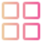</a> | **applications-all.svg** Vector (SVG) | 1.45KB |
|  | **applications-development.svg** Vector (SVG) | 4.89KB |
|  | **applications-education.svg** Vector (SVG) | 3.79KB |
|  | **applications-python.svg** Vector (SVG) | 1.91KB |
|  | **aqemu.svg** Vector (SVG) | 1.82KB |
|  | **arcolinux-hello.svg** Vector (SVG) | 1.56KB |
|  | **ardour6.svg** Vector (SVG) | 2.11KB |
|  | **armorpaint.svg** Vector (SVG) | 1.25KB |
|  | **atlauncher.svg** Vector (SVG) | 1.65KB |
|  | **audacious.svg** Vector (SVG) | 2.14KB |
|  | **audacity.svg** Vector (SVG) | 4.66KB |
|  | **avidemux.svg** Vector (SVG) | 2.95KB |
|  | **bcompare.svg** Vector (SVG) | 4.74KB |
|  | **blackmagic-Fusion8.svg** Vector (SVG) | 4.54KB |
|  | **blender.svg** Vector (SVG) | 3.08KB |
|  | **bluemail.svg** Vector (SVG) | 2.95KB |
|  | **boostnote.svg** Vector (SVG) | 2.42KB |
|  | **brave-browser-dev.svg** Vector (SVG) | 3.88KB |
|  | **brave-browser-nightly.svg** Vector (SVG) | 3.86KB |
|  | **calligrawords.svg** Vector (SVG) | 3.42KB |
|  | **cawbird.svg** Vector (SVG) | 6.16KB |
|  | **cc.arduino.IDE2.svg** Vector (SVG) | 3.55KB |
|  | **charles-proxy.svg** Vector (SVG) | 4.97KB |
|  | **choqok.svg** Vector (SVG) | 3.27KB |
|  | **chrome-gaedmjdfmmahhbjefcbgaolhhanlaolb-Default.svg** Vector (SVG) | 3.06KB |
|  | **chrome-jknmpnbgkaekopldbncmggaejjamkemn-Default.svg** Vector (SVG) | 3.15KB |
|  | **citrix-receiver.svg** Vector (SVG) | 3.02KB |
| <a href="ckb-next.svg">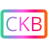</a> | **ckb-next.svg** Vector (SVG) | 3.66KB |
|  | **clementine.svg** Vector (SVG) | 3.96KB |
|  | **cliq.svg** Vector (SVG) | 2.64KB |
|  | **cockos-reaper.svg** Vector (SVG) | 6.23KB |
|  | **code-insiders.svg** Vector (SVG) | 1.58KB |
|  | **codeblocks.svg** Vector (SVG) | 3.08KB |
|  | **codelite.svg** Vector (SVG) | 1.90KB |
|  | **colab.svg** Vector (SVG) | 35.22KB |
|  | **com.alacritty.Alacritty.svg** Vector (SVG) | 3.03KB |
|  | **com.anydesk.Anydesk.svg** Vector (SVG) | 1.45KB |
|  | **com.azuredatastudio.oss.svg** Vector (SVG) | 8.92KB |
|  | **com.bitwarden.desktop.svg** Vector (SVG) | 2.47KB |
|  | **com.bitwig.BitwigStudio.svg** Vector (SVG) | 4.24KB |
|  | **com.brave.Browser.svg** Vector (SVG) | 3.82KB |
|  | **com.calibre_ebook.calibre.ebook_edit.svg** Vector (SVG) | 8.33KB |
|  | **com.calibre_ebook.calibre.lrfviewer.svg** Vector (SVG) | 4.66KB |
|  | **com.getpostman.Postman.svg** Vector (SVG) | 3.41KB |
|  | **com.github.Eloston.UngoogledChromium.svg** Vector (SVG) | 3.14KB |
|  | **com.github.alainm23.planner.svg** Vector (SVG) | 1.94KB |
|  | **com.github.calo001.fondo.svg** Vector (SVG) | 2.64KB |
|  | **com.github.debauchee.barrier.svg** Vector (SVG) | 7.00KB |
|  | **com.github.fabiocolacio.marker.svg** Vector (SVG) | 2.30KB |
|  | **com.github.geigi.cozy.svg** Vector (SVG) | 4.48KB |
|  | **com.github.gi_lom.dialect.svg** Vector (SVG) | 2.98KB |
|  | **com.github.johnfactotum.Foliate.svg** Vector (SVG) | 3.91KB |
|  | **com.github.maoschanz.drawing.svg** Vector (SVG) | 3.79KB |
|  | **com.github.muriloventuroso.easyssh.svg** Vector (SVG) | 2.24KB |
|  | **com.github.tchx84.Flatseal.svg** Vector (SVG) | 2.44KB |
|  | **com.github.wwmm.pulseeffects.svg** Vector (SVG) | 2.51KB |
|  | **com.gitlab.davem.ClamTk.svg** Vector (SVG) | 3.06KB |
|  | **com.giuspen.cherrytree.svg** Vector (SVG) | 4.61KB |
|  | **com.leinardi.gwe.svg** Vector (SVG) | 3.04KB |
|  | **com.orama_interactive.Pixelorama.svg** Vector (SVG) | 3.19KB |
|  | **com.parsecgaming.parsec.svg** Vector (SVG) | 3.29KB |
|  | **com.rawtherapee.RawTherapee.svg** Vector (SVG) | 7.07KB |
|  | **com.rosegardenmusic.rosegarden.svg** Vector (SVG) | 3.28KB |
|  | **com.system76.Popsicle.svg** Vector (SVG) | 2.71KB |
|  | **com.unity.UnityHub.svg** Vector (SVG) | 4.17KB |
|  | **com.uploadedlobster.peek.svg** Vector (SVG) | 3.03KB |
|  | **com.usebottles.bottles.svg** Vector (SVG) | 2.57KB |
|  | **com.visualstudio.code.svg** Vector (SVG) | 1.69KB |
|  | **com.vscodium.codium.svg** Vector (SVG) | 6.33KB |
| <a href="com.wire.WireDesktop.svg">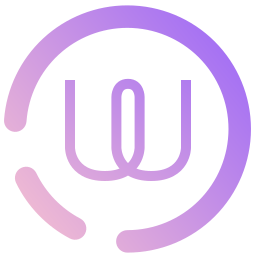</a> | **com.wire.WireDesktop.svg** Vector (SVG) | 2.71KB |
|  | **com.wps.Office.etmain.svg** Vector (SVG) | 3.65KB |
|  | **com.wps.Office.kprometheus.svg** Vector (SVG) | 1.66KB |
|  | **com.wps.Office.pdfmain.svg** Vector (SVG) | 4.73KB |
|  | **com.wps.Office.wppmain.svg** Vector (SVG) | 2.56KB |
|  | **com.wps.Office.wpsmain.svg** Vector (SVG) | 2.51KB |
|  | **conky-manager.svg** Vector (SVG) | 2.11KB |
|  | **conky-manager2.svg** Vector (SVG) | 4.37KB |
|  | **conky.svg** Vector (SVG) | 5.21KB |
|  | **cool-retro-term.svg** Vector (SVG) | 2.81KB |
|  | **copyq.svg** Vector (SVG) | 3.54KB |
|  | **cozydrive.svg** Vector (SVG) | 4.86KB |
|  | **cs-bluetooth.svg** Vector (SVG) | 3.81KB |
|  | **cura-icon.svg** Vector (SVG) | 1.63KB |
|  | **cutter.svg** Vector (SVG) | 1.96KB |
|  | **cuttlefish.svg** Vector (SVG) | 5.80KB |
|  | **cypress.svg** Vector (SVG) | 3.36KB |
|  | **darktable.svg** Vector (SVG) | 4.45KB |
|  | **dconf-editor.svg** Vector (SVG) | 4.41KB |
|  | **de.haeckerfelix.Fragments.svg** Vector (SVG) | 4.31KB |
|  | **deadbeef.svg** Vector (SVG) | 3.32KB |
|  | **deepin-calculator.svg** Vector (SVG) | 4.51KB |
|  | **deja-dup.svg** Vector (SVG) | 3.03KB |
|  | **deluge.svg** Vector (SVG) | 2.45KB |
|  | **designer5.svg** Vector (SVG) | 2.02KB |
|  | **dia.svg** Vector (SVG) | 3.18KB |
|  | **digikam.svg** Vector (SVG) | 3.74KB |
|  | **dino.svg** Vector (SVG) | 4.30KB |
|  | **discord-canary.svg** Vector (SVG) | 4.75KB |
|  | **distributor-logo-alpine.svg** Vector (SVG) | 1.69KB |
|  | **distributor-logo-antix.svg** Vector (SVG) | 1.89KB |
|  | **distributor-logo-archbang.svg** Vector (SVG) | 2.37KB |
|  | **distributor-logo-archlabs.svg** Vector (SVG) | 2.18KB |
|  | **distributor-logo-artix.svg** Vector (SVG) | 755.00B |
|  | **distributor-logo-bunsenlabs.svg** Vector (SVG) | 2.52KB |
|  | **distributor-logo-deepin.svg** Vector (SVG) | 3.75KB |
|  | **distributor-logo-elementary.svg** Vector (SVG) | 2.73KB |
|  | **distributor-logo-freebsd.svg** Vector (SVG) | 1.81KB |
|  | **distributor-logo-parrot.svg** Vector (SVG) | 1.90KB |
|  | **distributor-logo-ubuntu-budgie.svg** Vector (SVG) | 3.73KB |
|  | **distributor-logo-ubuntu-studio.svg** Vector (SVG) | 4.86KB |
|  | **distributor-logo-void.svg** Vector (SVG) | 1.41KB |
|  | **dnfdragora.svg** Vector (SVG) | 3.03KB |
| <a href="dockx.svg">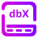</a> | **dockx.svg** Vector (SVG) | 4.54KB |
|  | **docky.svg** Vector (SVG) | 3.08KB |
|  | **dolphin-emu.svg** Vector (SVG) | 1.89KB |
|  | **dosbox.svg** Vector (SVG) | 1.75KB |
|  | **doublecmd.svg** Vector (SVG) | 2.63KB |
|  | **drawio.svg** Vector (SVG) | 2.40KB |
|  | **drracket.svg** Vector (SVG) | 2.03KB |
|  | **easyeffects.svg** Vector (SVG) | 3.38KB |
|  | **eclipse.svg** Vector (SVG) | 2.78KB |
|  | **eddy.svg** Vector (SVG) | 5.08KB |
|  | **electronic-wechat.svg** Vector (SVG) | 2.73KB |
|  | **elisa.svg** Vector (SVG) | 4.30KB |
| <a href="endeavouros.svg">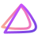</a> | **endeavouros.svg** Vector (SVG) | 3.50KB |
|  | **enpass.svg** Vector (SVG) | 4.27KB |
|  | **etcher.svg** Vector (SVG) | 2.45KB |
|  | **etherape.svg** Vector (SVG) | 2.04KB |
|  | **exaile.svg** Vector (SVG) | 1.94KB |
|  | **falkon.svg** Vector (SVG) | 6.82KB |
|  | **fedy.svg** Vector (SVG) | 2.29KB |
|  | **ferdi.svg** Vector (SVG) | 3.04KB |
|  | **ferdium.svg** Vector (SVG) | 2.15KB |
|  | **fiddler.svg** Vector (SVG) | 1.63KB |
| <a href="figma.svg">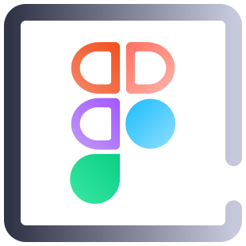</a> | **figma.svg** Vector (SVG) | 3.58KB |
|  | **fiji.svg** Vector (SVG) | 1.11KB |
|  | **filezilla.svg** Vector (SVG) | 2.69KB |
|  | **firefox-developer.svg** Vector (SVG) | 29.21KB |
|  | **firefox-nightly.svg** Vector (SVG) | 4.84KB |
|  | **fish.svg** Vector (SVG) | 5.18KB |
|  | **flameshot.svg** Vector (SVG) | 3.38KB |
|  | **fluid.svg** Vector (SVG) | 5.82KB |
|  | **fluxgui.svg** Vector (SVG) | 3.38KB |
|  | **focalboard.svg** Vector (SVG) | 1.65KB |
|  | **font-viewer.svg** Vector (SVG) | 4.17KB |
|  | **foot.svg** Vector (SVG) | 3.84KB |
|  | **fr.romainvigier.MetadataCleaner.svg** Vector (SVG) | 5.31KB |
|  | **franz.svg** Vector (SVG) | 3.73KB |
|  | **freealchemist.svg** Vector (SVG) | 6.16KB |
|  | **freecad.svg** Vector (SVG) | 4.69KB |
|  | **freeplane.svg** Vector (SVG) | 6.41KB |
|  | **fritzing.svg** Vector (SVG) | 3.04KB |
|  | **furiusisomount.svg** Vector (SVG) | 3.78KB |
|  | **gdevelop.svg** Vector (SVG) | 1.58KB |
|  | **geany.svg** Vector (SVG) | 5.29KB |
|  | **gemini.svg** Vector (SVG) | 5.71KB |
|  | **geogebra.svg** Vector (SVG) | 2.82KB |
|  | **ghex.svg** Vector (SVG) | 1.65KB |
|  | **ghidra.svg** Vector (SVG) | 6.01KB |
|  | **gimp.svg** Vector (SVG) | 6.83KB |
|  | **gitkraken.svg** Vector (SVG) | 3.96KB |
|  | **glade.svg** Vector (SVG) | 1.92KB |
|  | **gnome-2048.svg** Vector (SVG) | 13.60KB |
|  | **gnome-books.svg** Vector (SVG) | 1.69KB |
| <a href="gnome-boxes.svg">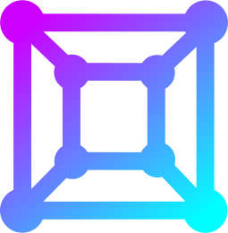</a> | **gnome-boxes.svg** Vector (SVG) | 22.54KB |
|  | **gnome-documents.svg** Vector (SVG) | 2.58KB |
|  | **gnome-emacs.svg** Vector (SVG) | 2.71KB |
|  | **gnome-gmail.svg** Vector (SVG) | 2.98KB |
|  | **gnome-panel-workspace-switcher.svg** Vector (SVG) | 1.73KB |
|  | **gnome-settings.svg** Vector (SVG) | 3.75KB |
|  | **gnome-sound-recorder.svg** Vector (SVG) | 3.08KB |
|  | **gnome-tweak-tool.svg** Vector (SVG) | 1.77KB |
|  | **gnvim.svg** Vector (SVG) | 1.50KB |
|  | **goldendict.svg** Vector (SVG) | 5.14KB |
|  | **google-webdesigner.svg** Vector (SVG) | 6.05KB |
|  | **googlechrome.svg** Vector (SVG) | 4.17KB |
|  | **gparted.svg** Vector (SVG) | 2.27KB |
|  | **grafx2.svg** Vector (SVG) | 4.60KB |
|  | **gramps.svg** Vector (SVG) | 2.51KB |
|  | **grindr.svg** Vector (SVG) | 4.48KB |
|  | **gtk-redshift.svg** Vector (SVG) | 3.52KB |
|  | **gtkcord.svg** Vector (SVG) | 4.89KB |
|  | **gtkhash.svg** Vector (SVG) | 2.18KB |
|  | **guake.svg** Vector (SVG) | 8.37KB |
|  | **gufw.svg** Vector (SVG) | 3.49KB |
|  | **guvcview.svg** Vector (SVG) | 4.06KB |
|  | **gvfsd-archive-file.svg** Vector (SVG) | 2.47KB |
| <a href="gvim.svg">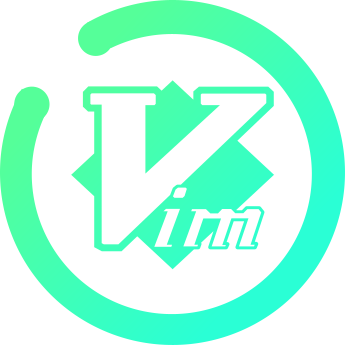</a> | **gvim.svg** Vector (SVG) | 8.20KB |
|  | **gydl.svg** Vector (SVG) | 3.92KB |
|  | **haruna.svg** Vector (SVG) | 1.57KB |
|  | **hb-icon.svg** Vector (SVG) | 4.77KB |
|  | **heroic.svg** Vector (SVG) | 3.33KB |
|  | **homebank.svg** Vector (SVG) | 3.90KB |
|  | **hplip.svg** Vector (SVG) | 3.02KB |
|  | **hydrogen.svg** Vector (SVG) | 4.58KB |
|  | **hyper.svg** Vector (SVG) | 2.08KB |
|  | **hyperspace.svg** Vector (SVG) | 6.30KB |
|  | **im.pidgin.Pidgin.svg** Vector (SVG) | 4.88KB |
|  | **im.riot.Riot.svg** Vector (SVG) | 4.00KB |
|  | **im.srain.Srain.svg** Vector (SVG) | 1.93KB |
| <a href="indicator-keylock.svg">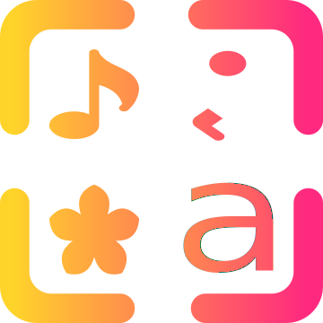</a> | **indicator-keylock.svg** Vector (SVG) | 6.06KB |
|  | **indicator-virtual-box.svg** Vector (SVG) | 1.44KB |
|  | **indicator-weather.svg** Vector (SVG) | 6.76KB |
|  | **info.cemu.Cemu.svg** Vector (SVG) | 2.12KB |
|  | **inkscape.svg** Vector (SVG) | 3.44KB |
|  | **input-tablet.svg** Vector (SVG) | 2.18KB |
|  | **insomnia.svg** Vector (SVG) | 2.37KB |
|  | **intellij.svg** Vector (SVG) | 5.75KB |
|  | **io.atom.Atom.svg** Vector (SVG) | 4.34KB |
|  | **io.atom.electron.BaseApp.svg** Vector (SVG) | 6.49KB |
|  | **io.beekeeperstudio.Studio.svg** Vector (SVG) | 2.39KB |
|  | **io.brackets.Brackets.svg** Vector (SVG) | 3.40KB |
|  | **io.dbeaver.DBeaverCommunity.svg** Vector (SVG) | 5.78KB |
|  | **io.element.Element.svg** Vector (SVG) | 2.83KB |
|  | **io.elementary.appcenter.svg** Vector (SVG) | 3.03KB |
|  | **io.elementary.code.svg** Vector (SVG) | 3.23KB |
|  | **io.freetubeapp.FreeTube.svg** Vector (SVG) | 3.34KB |
|  | **io.github.Fontforge.svg** Vector (SVG) | 3.03KB |
|  | **io.github.Hexchat.svg** Vector (SVG) | 2.23KB |
|  | **io.github.OpenToonz.svg.svg** Vector (SVG) | 1.78KB |
|  | **io.github.gitahead.GitAhead.svg** Vector (SVG) | 4.49KB |
|  | **io.github.gustavoperedo.VideoDownloader.svg** Vector (SVG) | 3.85KB |
|  | **io.github.quodlibet.QuodLibet.svg** Vector (SVG) | 1.63KB |
|  | **io.github.seadve.Mousai.svg** Vector (SVG) | 2.65KB |
|  | **io.github.shiftey.Desktop.svg** Vector (SVG) | 2.56KB |
|  | **io.github.spacingbat3.webcord.svg** Vector (SVG) | 4.71KB |
|  | **io.github.wereturtle.ghostwriter.svg** Vector (SVG) | 4.63KB |
|  | **io.gitlab.LibreWolf.svg** Vector (SVG) | 3.13KB |
|  | **io.lmms.LMMS.svg** Vector (SVG) | 1.45KB |
| <a href="io.raindrop.svg">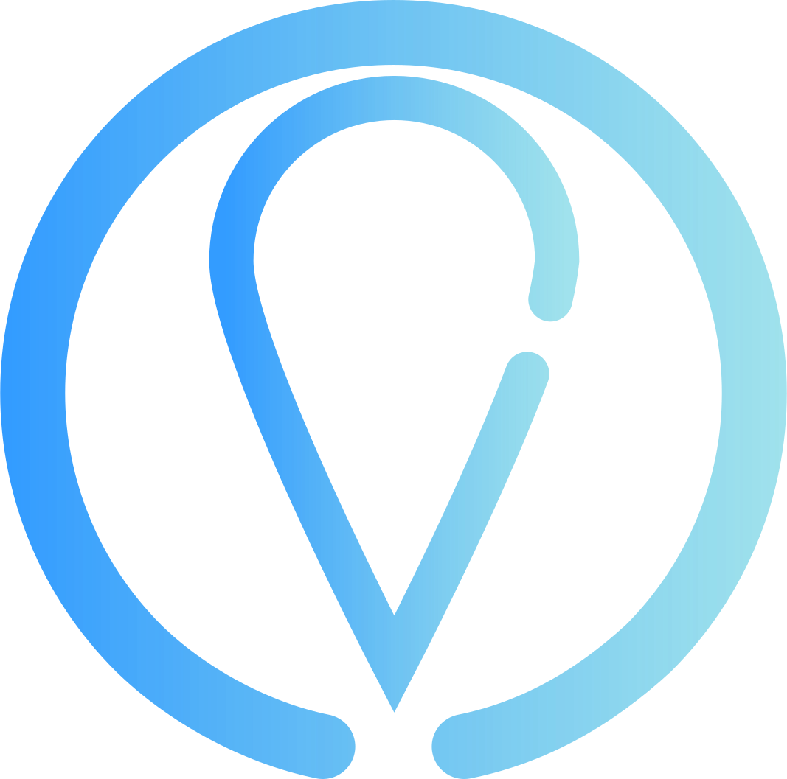</a> | **io.raindrop.svg** Vector (SVG) | 2.95KB |
|  | **irc-chat.svg** Vector (SVG) | 2.52KB |
|  | **itch.svg** Vector (SVG) | 32.57KB |
|  | **ivpn.svg** Vector (SVG) | 1.47KB |
|  | **jami.svg** Vector (SVG) | 8.71KB |
|  | **jdownloader.svg** Vector (SVG) | 2.50KB |
|  | **jellyfin.svg** Vector (SVG) | 1.48KB |
|  | **jetbrains-clion.svg** Vector (SVG) | 4.40KB |
|  | **jetbrains-datagrip.svg** Vector (SVG) | 6.20KB |
|  | **jetbrains-goland.svg** Vector (SVG) | 5.48KB |
|  | **jetbrains-phpstorm.svg** Vector (SVG) | 4.67KB |
|  | **jetbrains-pycharm.svg** Vector (SVG) | 6.16KB |
|  | **jetbrains-rider.svg** Vector (SVG) | 5.69KB |
|  | **jetbrains-toolbox.svg** Vector (SVG) | 2.50KB |
|  | **jetbrains-webstorm.svg** Vector (SVG) | 4.02KB |
|  | **juk.svg** Vector (SVG) | 2.15KB |
|  | **julia.svg** Vector (SVG) | 3.13KB |
|  | **jupyter.svg** Vector (SVG) | 8.18KB |
|  | **jupyterlab.svg** Vector (SVG) | 4.70KB |
|  | **kaffeine.svg** Vector (SVG) | 2.93KB |
|  | **kali-panel-menu.svg** Vector (SVG) | 5.29KB |
|  | **kamoso.svg** Vector (SVG) | 8.23KB |
|  | **karbon.svg** Vector (SVG) | 2.71KB |
|  | **kcalc.svg** Vector (SVG) | 6.02KB |
|  | **kchmviewer.svg** Vector (SVG) | 2.01KB |
|  | **kdbg.svg** Vector (SVG) | 3.97KB |
|  | **kdeconnect.svg** Vector (SVG) | 3.61KB |
|  | **kdenlive.svg** Vector (SVG) | 3.32KB |
|  | **kdepim-dropbox.svg** Vector (SVG) | 2.75KB |
|  | **kdepim-googledrive.svg** Vector (SVG) | 3.33KB |
|  | **kdevelop.svg** Vector (SVG) | 5.81KB |
|  | **kdocker.svg** Vector (SVG) | 3.76KB |
|  | **keepassxc.svg** Vector (SVG) | 2.52KB |
|  | **keeweb.svg** Vector (SVG) | 4.84KB |
|  | **kfontview.svg** Vector (SVG) | 1.89KB |
|  | **kget.svg** Vector (SVG) | 4.83KB |
|  | **kgpg.svg** Vector (SVG) | 2.91KB |
|  | **kicad.svg** Vector (SVG) | 2.68KB |
|  | **kid3.svg** Vector (SVG) | 2.59KB |
|  | **kile.svg** Vector (SVG) | 3.37KB |
|  | **kitty.svg** Vector (SVG) | 12.75KB |
|  | **klipper.svg** Vector (SVG) | 3.41KB |
|  | **kmines.svg** Vector (SVG) | 4.45KB |
|  | **kmix.svg** Vector (SVG) | 3.19KB |
|  | **kmousetool.svg** Vector (SVG) | 2.19KB |
|  | **kmouth.svg** Vector (SVG) | 2.62KB |
|  | **kmymoney.svg** Vector (SVG) | 2.28KB |
|  | **konqueror.svg** Vector (SVG) | 3.04KB |
|  | **konversation.svg** Vector (SVG) | 2.00KB |
|  | **kopete2.svg** Vector (SVG) | 2.85KB |
|  | **kpatience.svg** Vector (SVG) | 3.35KB |
|  | **krdc.svg** Vector (SVG) | 3.25KB |
|  | **krename.svg** Vector (SVG) | 6.66KB |
|  | **krfb.svg** Vector (SVG) | 2.57KB |
|  | **krita.svg** Vector (SVG) | 2.76KB |
|  | **krunner.svg** Vector (SVG) | 3.96KB |
|  | **krusader_root.svg** Vector (SVG) | 2.47KB |
|  | **krusader_user.svg** Vector (SVG) | 2.46KB |
|  | **ksysguard.svg** Vector (SVG) | 6.50KB |
|  | **ktimer.svg** Vector (SVG) | 2.25KB |
|  | **ktnef.svg** Vector (SVG) | 2.73KB |
|  | **ktorrent.svg** Vector (SVG) | 1.80KB |
|  | **kvantum.svg** Vector (SVG) | 4.39KB |
|  | **kwalletmanager.svg** Vector (SVG) | 2.88KB |
|  | **latte-dock.svg** Vector (SVG) | 5.05KB |
|  | **layouts.svg** Vector (SVG) | 1.58KB |
|  | **lazarus.svg** Vector (SVG) | 5.44KB |
| <a href="lbreakout2.svg">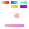</a> | **lbreakout2.svg** Vector (SVG) | 3.21KB |
|  | **lbry.svg** Vector (SVG) | 1.29KB |
|  | **league-of-legends.svg** Vector (SVG) | 2.46KB |
|  | **library-internet-radio.svg** Vector (SVG) | 5.47KB |
|  | **librecad.svg** Vector (SVG) | 2.10KB |
|  | **libreoffice34-base.svg** Vector (SVG) | 8.46KB |
|  | **libreoffice34-calc.svg** Vector (SVG) | 5.41KB |
|  | **libreoffice34-draw.svg** Vector (SVG) | 6.75KB |
|  | **libreoffice34-impress.svg** Vector (SVG) | 4.17KB |
|  | **libreoffice34-math.svg** Vector (SVG) | 2.31KB |
|  | **libreoffice34-writer.svg** Vector (SVG) | 4.46KB |
|  | **libreofficedev6.1-main.svg** Vector (SVG) | 1.54KB |
|  | **mailspring.svg** Vector (SVG) | 1.70KB |
|  | **makehuman.svg** Vector (SVG) | 1.77KB |
|  | **maps.svg** Vector (SVG) | 3.98KB |
|  | **marble.svg** Vector (SVG) | 3.30KB |
|  | **mate-disk-usage-analyzer.svg** Vector (SVG) | 5.32KB |
|  | **mate-panel-separator.svg** Vector (SVG) | 2.17KB |
|  | **mate-power-manager.svg** Vector (SVG) | 2.82KB |
|  | **mate-system-log.svg** Vector (SVG) | 2.34KB |
|  | **mate.svg** Vector (SVG) | 3.46KB |
|  | **matlab.svg** Vector (SVG) | 4.65KB |
|  | **mattermost.svg** Vector (SVG) | 1.57KB |
|  | **maya.svg** Vector (SVG) | 3.34KB |
|  | **me.hyliu.fluentreader.svg** Vector (SVG) | 3.04KB |
|  | **mediawriter.svg** Vector (SVG) | 2.62KB |
|  | **mega.svg** Vector (SVG) | 3.55KB |
|  | **meld.svg** Vector (SVG) | 1.57KB |
|  | **mellowplayer.svg** Vector (SVG) | 3.91KB |
|  | **mendeleydesktop.svg** Vector (SVG) | 5.79KB |
|  | **messenger.svg** Vector (SVG) | 2.09KB |
|  | **micropad.svg** Vector (SVG) | 2.14KB |
|  | **microsoft-edge.svg** Vector (SVG) | 12.65KB |
| <a href="minecraft.svg">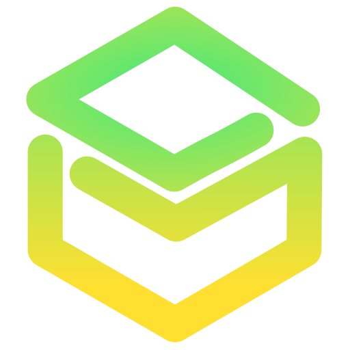</a> | **minecraft.svg** Vector (SVG) | 1.08KB |
|  | **mintdrivers.svg** Vector (SVG) | 2.45KB |
|  | **mkvtoolnix-gui.svg** Vector (SVG) | 4.98KB |
|  | **monero.svg** Vector (SVG) | 1.60KB |
|  | **mongodb-compass.svg** Vector (SVG) | 4.07KB |
|  | **monodevelop.svg** Vector (SVG) | 2.19KB |
|  | **mozilla-firefox.svg** Vector (SVG) | 1.85KB |
|  | **mozo.svg** Vector (SVG) | 4.57KB |
|  | **mp3splt-gtk.svg** Vector (SVG) | 3.50KB |
|  | **mplayer.svg** Vector (SVG) | 2.52KB |
|  | **mps.svg** Vector (SVG) | 6.27KB |
|  | **mpv.svg** Vector (SVG) | 2.53KB |
|  | **ms-office.svg** Vector (SVG) | 3.16KB |
|  | **ms-outlook.svg** Vector (SVG) | 2.69KB |
|  | **mugshot.svg** Vector (SVG) | 1.81KB |
|  | **mullvad-vpn.svg** Vector (SVG) | 5.61KB |
|  | **multimc.svg** Vector (SVG) | 5.37KB |
|  | **multimedia-audio-player.svg** Vector (SVG) | 25.78KB |
|  | **multimedia-volume-control.svg** Vector (SVG) | 4.90KB |
|  | **multipass.gui.svg** Vector (SVG) | 2.86KB |
|  | **multitasking-view.svg** Vector (SVG) | 3.04KB |
|  | **mumble.svg** Vector (SVG) | 4.72KB |
|  | **mupdf.svg** Vector (SVG) | 4.88KB |
|  | **musescore.svg** Vector (SVG) | 5.12KB |
|  | **musixmatch.svg** Vector (SVG) | 2.47KB |
|  | **mx-qsi.svg** Vector (SVG) | 4.45KB |
|  | **mygpo.svg** Vector (SVG) | 3.80KB |
|  | **mypaint.svg** Vector (SVG) | 3.80KB |
|  | **mysql-workbench.svg** Vector (SVG) | 3.86KB |
| <a href="nemiver.svg">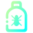</a> | **nemiver.svg** Vector (SVG) | 3.51KB |
|  | **neovide.svg** Vector (SVG) | 4.69KB |
|  | **nestopia.svg** Vector (SVG) | 3.46KB |
|  | **net.ankiweb.Anki.svg** Vector (SVG) | 1.42KB |
|  | **net.blockbench.Blockbench.svg** Vector (SVG) | 7.02KB |
|  | **net.cozic.joplin_desktop.svg** Vector (SVG) | 2.43KB |
|  | **net.lutris.Lutris.svg** Vector (SVG) | 6.69KB |
|  | **net.pcsx2.PCSX2.svg** Vector (SVG) | 4.70KB |
|  | **net.poedit.Poedit.svg** Vector (SVG) | 3.64KB |
|  | **net.rpcs3.RPCS3.svg** Vector (SVG) | 2.74KB |
|  | **net.sourceforge.liferea.svg** Vector (SVG) | 2.70KB |
|  | **net.sourceforge.xournal.svg** Vector (SVG) | 3.41KB |
|  | **netbeans.svg** Vector (SVG) | 1.71KB |
|  | **netease-cloud-music.svg** Vector (SVG) | 4.58KB |
|  | **network-firewall.svg** Vector (SVG) | 3.07KB |
|  | **network-idle.svg** Vector (SVG) | 4.60KB |
|  | **newshosting.svg** Vector (SVG) | 3.80KB |
|  | **nextcloud.svg** Vector (SVG) | 2.29KB |
|  | **nheko.svg** Vector (SVG) | 2.96KB |
|  | **nicotine-plus.svg** Vector (SVG) | 2.46KB |
|  | **nl.g4d.Girens.svg** Vector (SVG) | 2.67KB |
|  | **nl.hjdskes.gcolor3.svg** Vector (SVG) | 4.59KB |
|  | **nmap.svg** Vector (SVG) | 3.90KB |
|  | **nocover.svg** Vector (SVG) | 3.64KB |
|  | **noisetorch.svg** Vector (SVG) | 2.87KB |
|  | **nomacs.svg** Vector (SVG) | 1.95KB |
|  | **noson.svg** Vector (SVG) | 4.08KB |
|  | **notepadqq.svg** Vector (SVG) | 1.82KB |
|  | **notion-desktop.svg** Vector (SVG) | 1.92KB |
|  | **ntfs-config.svg** Vector (SVG) | 4.91KB |
|  | **nut-monitor.svg** Vector (SVG) | 1.93KB |
|  | **nvidia-x-server-settings.svg** Vector (SVG) | 3.73KB |
|  | **obs.svg** Vector (SVG) | 2.90KB |
|  | **obsidian.svg** Vector (SVG) | 1.47KB |
|  | **sc-controller.svg** Vector (SVG) | 4.39KB |
|  | **scratch2.svg** Vector (SVG) | 8.79KB |
| <a href="screenruler.svg">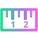</a> | **screenruler.svg** Vector (SVG) | 2.72KB |
|  | **scribus.svg** Vector (SVG) | 2.38KB |
|  | **seafile.svg** Vector (SVG) | 4.02KB |
|  | **searchmonkey.svg** Vector (SVG) | 4.05KB |
|  | **session-desktop.svg** Vector (SVG) | 5.28KB |
|  | **setroubleshoot_icon.svg** Vector (SVG) | 4.65KB |
|  | **sh.ppy.osu.svg** Vector (SVG) | 3.13KB |
|  | **shadowsocks-qt5.svg** Vector (SVG) | 3.34KB |
|  | **sheets.svg** Vector (SVG) | 2.37KB |
|  | **shotwell.svg** Vector (SVG) | 2.48KB |
|  | **show-desktop.svg** Vector (SVG) | 1.44KB |
|  | **showfoto.svg** Vector (SVG) | 4.75KB |
|  | **shutter.svg** Vector (SVG) | 3.72KB |
|  | **signal-desktop.svg** Vector (SVG) | 4.35KB |
|  | **simplenote.svg** Vector (SVG) | 2.37KB |
|  | **simplescreenrecorder.svg** Vector (SVG) | 2.77KB |
|  | **skanlite.svg** Vector (SVG) | 1.75KB |
|  | **skrooge.svg** Vector (SVG) | 2.21KB |
|  | **skypeforlinux.svg** Vector (SVG) | 3.80KB |
|  | **slack.svg** Vector (SVG) | 4.77KB |
|  | **slic3r-prusa3d.svg** Vector (SVG) | 2.30KB |
|  | **sm.puri.Calls.svg** Vector (SVG) | 10.03KB |
|  | **sm.puri.Chatty.svg** Vector (SVG) | 8.42KB |
|  | **smtube.svg** Vector (SVG) | 2.47KB |
|  | **softwarecenter.svg** Vector (SVG) | 2.96KB |
|  | **sonata.svg** Vector (SVG) | 1.84KB |
|  | **soundkonverter.svg** Vector (SVG) | 5.79KB |
|  | **spectacle.svg** Vector (SVG) | 4.92KB |
|  | **spotify.svg** Vector (SVG) | 5.11KB |
|  | **spyder3.svg** Vector (SVG) | 5.02KB |
|  | **sqldeveloper.svg** Vector (SVG) | 3.16KB |
|  | **ssh-askpass-gnome.svg** Vector (SVG) | 3.60KB |
|  | **stacer.svg** Vector (SVG) | 3.49KB |
|  | **stage.svg** Vector (SVG) | 2.28KB |
|  | **standard-notes.svg** Vector (SVG) | 2.80KB |
|  | **start-here-antergos.svg** Vector (SVG) | 3.98KB |
|  | **start-here-archlinux.svg** Vector (SVG) | 1.29KB |
|  | **start-here-debian.svg** Vector (SVG) | 4.13KB |
|  | **start-here-fedora.svg** Vector (SVG) | 2.13KB |
|  | **start-here-gentoo.svg** Vector (SVG) | 4.90KB |
|  | **start-here-linux-mint.svg** Vector (SVG) | 2.02KB |
|  | **start-here-manjaro.svg** Vector (SVG) | 2.58KB |
|  | **start-here-pop-os.svg** Vector (SVG) | 5.77KB |
|  | **start-here-ubuntu.svg** Vector (SVG) | 4.15KB |
|  | **start-here-xfce.svg** Vector (SVG) | 5.82KB |
| <a href="steam_icon_236390.svg">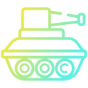</a> | **steam_icon_236390.svg** Vector (SVG) | 10.67KB |
|  | **steam_icon_404790.svg** Vector (SVG) | 6.23KB |
|  | **steam_icon_431730.svg** Vector (SVG) | 4.38KB |
|  | **steampowered.svg** Vector (SVG) | 3.33KB |
|  | **stellarium.svg** Vector (SVG) | 2.45KB |
|  | **stock_alarm.svg** Vector (SVG) | 2.38KB |
|  | **stock_keyring.svg** Vector (SVG) | 1.98KB |
|  | **stock_task.svg** Vector (SVG) | 2.81KB |
|  | **stock_view-details.svg** Vector (SVG) | 1.81KB |
|  | **stock_xfburn.svg** Vector (SVG) | 3.88KB |
|  | **stoplight.svg** Vector (SVG) | 3.27KB |
|  | **strawberry.svg** Vector (SVG) | 7.89KB |
|  | **stremio.svg** Vector (SVG) | 2.01KB |
|  | **studio.svg** Vector (SVG) | 3.71KB |
|  | **sublime-merge.svg** Vector (SVG) | 1.62KB |
|  | **sublimetext.svg** Vector (SVG) | 2.92KB |
|  | **sun-jcontrol32-jdk8.svg** Vector (SVG) | 4.07KB |
|  | **superslicer.svg** Vector (SVG) | 2.29KB |
|  | **supertux2.svg** Vector (SVG) | 8.07KB |
|  | **surfshark.svg** Vector (SVG) | 2.78KB |
|  | **sweeper.svg** Vector (SVG) | 2.86KB |
|  | **sweethome3d.svg** Vector (SVG) | 3.73KB |
|  | **sylpheed.svg** Vector (SVG) | 1.68KB |
|  | **synaptic.svg** Vector (SVG) | 3.35KB |
|  | **syncplay.svg** Vector (SVG) | 3.89KB |
|  | **syncthingtray.svg** Vector (SVG) | 3.30KB |
| <a href="system-config-keyboard.svg">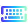</a> | **system-config-keyboard.svg** Vector (SVG) | 4.06KB |
|  | **system-lock-screen.svg** Vector (SVG) | 2.91KB |
|  | **system-log-out.svg** Vector (SVG) | 2.81KB |
|  | **system-restart.svg** Vector (SVG) | 3.74KB |
|  | **system-shutdown.svg** Vector (SVG) | 3.53KB |
|  | **system-software-installer.svg** Vector (SVG) | 4.82KB |
|  | **system-software-update.svg** Vector (SVG) | 3.73KB |
|  | **system-suspend-hibernate.svg** Vector (SVG) | 2.80KB |
|  | **system-suspend.svg** Vector (SVG) | 5.38KB |
|  | **system-users.svg** Vector (SVG) | 3.16KB |
|  | **systemtray.svg** Vector (SVG) | 2.37KB |
|  | **tagainijisho.svg** Vector (SVG) | 1.07KB |
|  | **tastyworks.svg** Vector (SVG) | 3.13KB |
|  | **tdescreensaver.svg** Vector (SVG) | 2.30KB |
|  | **tdewalletmanager.svg** Vector (SVG) | 2.72KB |
|  | **teams.svg** Vector (SVG) | 5.30KB |
|  | **teamspeak3.svg** Vector (SVG) | 3.46KB |
|  | **teamviewer.svg** Vector (SVG) | 2.49KB |
|  | **telegram.svg** Vector (SVG) | 1.57KB |
|  | **telepathy-kde.svg** Vector (SVG) | 2.26KB |
|  | **terminator.svg** Vector (SVG) | 2.47KB |
|  | **terminix.svg** Vector (SVG) | 3.33KB |
|  | **termius.svg** Vector (SVG) | 5.15KB |
|  | **terraria.svg** Vector (SVG) | 3.21KB |
|  | **tetrio-desktop.svg** Vector (SVG) | 1.94KB |
|  | **texmaker.svg** Vector (SVG) | 7.05KB |
|  | **texstudio.svg** Vector (SVG) | 7.13KB |
|  | **text-editor.svg** Vector (SVG) | 3.29KB |
|  | **thedarkmod.svg** Vector (SVG) | 9.79KB |
|  | **thermal-monitor.svg** Vector (SVG) | 4.22KB |
|  | **thinkorswim.svg** Vector (SVG) | 4.43KB |
|  | **thunar.svg** Vector (SVG) | 1.73KB |
|  | **thunderbird.svg** Vector (SVG) | 1.75KB |
|  | **tidal-hifi.svg** Vector (SVG) | 2.15KB |
|  | **tigervnc.svg** Vector (SVG) | 7.47KB |
|  | **tiled.svg** Vector (SVG) | 1.42KB |
|  | **tilix.svg** Vector (SVG) | 2.31KB |
| <a href="time.svg">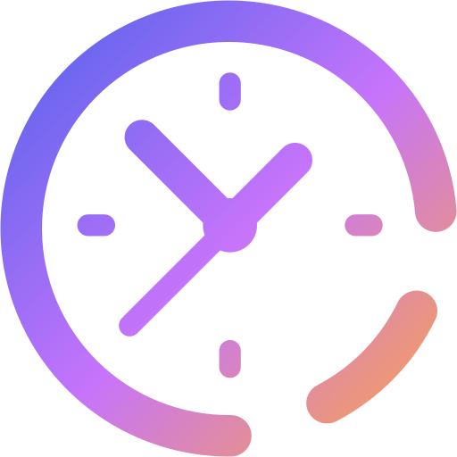</a> | **time.svg** Vector (SVG) | 4.17KB |
|  | **timeshift.svg** Vector (SVG) | 2.64KB |
|  | **todo.svg** Vector (SVG) | 1.32KB |
|  | **tomboy.svg** Vector (SVG) | 2.93KB |
|  | **tools-report-bug.svg** Vector (SVG) | 2.94KB |
|  | **torbrowser.svg** Vector (SVG) | 1.88KB |
|  | **totem.svg** Vector (SVG) | 2.11KB |
|  | **toxygen.svg** Vector (SVG) | 2.95KB |
|  | **tracker.svg** Vector (SVG) | 2.17KB |
|  | **translator.svg** Vector (SVG) | 2.92KB |
|  | **transmission.svg** Vector (SVG) | 1.98KB |
|  | **tutanota-desktop.svg** Vector (SVG) | 2.07KB |
|  | **tuxboot.svg** Vector (SVG) | 3.28KB |
|  | **tuxguitar.svg** Vector (SVG) | 5.25KB |
|  | **tv.kodi.Kodi.svg** Vector (SVG) | 882.00B |
|  | **tv.plex.PlexDesktop.svg** Vector (SVG) | 2.36KB |
|  | **twitch.svg** Vector (SVG) | 1.07KB |
|  | **twitter.svg** Vector (SVG) | 6.26KB |
|  | **typora.svg** Vector (SVG) | 1.94KB |
|  | **ubinary.svg** Vector (SVG) | 5.04KB |