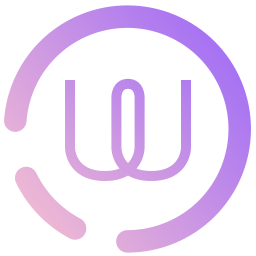
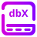
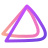
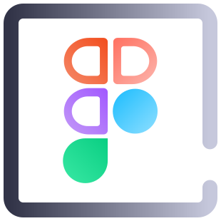
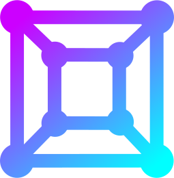
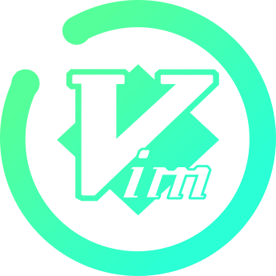
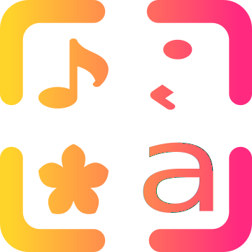
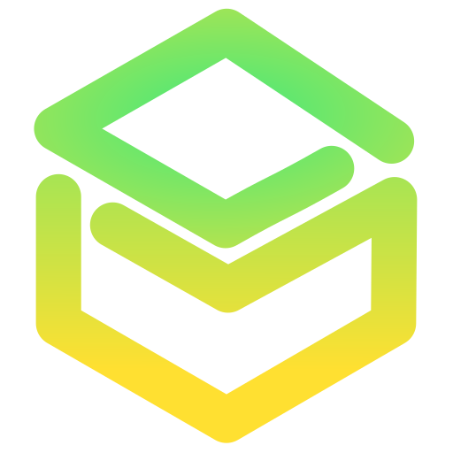
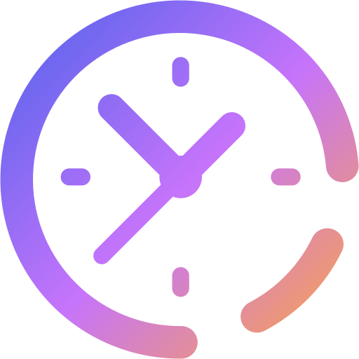

# 🖼️ 素材分類：apps

> [🏠 主目錄](../../../../README.md) / [images](../../../README.md) / [iCons](../../README.md) / [CandyiCons](../README.md) / **apps**

本目錄共有 `551` 個檔案

| 🎨 預覽 (點擊放大)  | 📋 檔案詳細資訊與連結 |
| :--- | :--- |
|  | **📂 檔名:** `4kvideodownloader.svg` ✨ **格式:** `Vector (SVG)` ⚖️ **大小:** `4.78KB` 📅 **更新:** `2026-03-02`  🚀 **jsDelivr Markdown:** `` 🔗 **直接連結 (Url):** <code>https://cdn.jsdelivr.net/gh/barry028/materials@main/images/iCons/CandyiCons/apps/4kvideodownloader.svg</code> 📥 [檢視原始檔](4kvideodownloader.svg) |
|  | **📂 檔名:** `4kyoutubetomp3.svg` ✨ **格式:** `Vector (SVG)` ⚖️ **大小:** `5.77KB` 📅 **更新:** `2026-03-02`  🚀 **jsDelivr Markdown:** `` 🔗 **直接連結 (Url):** <code>https://cdn.jsdelivr.net/gh/barry028/materials@main/images/iCons/CandyiCons/apps/4kyoutubetomp3.svg</code> 📥 [檢視原始檔](4kyoutubetomp3.svg) |
|  | **📂 檔名:** `AdobeReader12.svg` ✨ **格式:** `Vector (SVG)` ⚖️ **大小:** `3.31KB` 📅 **更新:** `2026-03-02`  🚀 **jsDelivr Markdown:** `` 🔗 **直接連結 (Url):** <code>https://cdn.jsdelivr.net/gh/barry028/materials@main/images/iCons/CandyiCons/apps/AdobeReader12.svg</code> 📥 [檢視原始檔](AdobeReader12.svg) |
|  | **📂 檔名:** `AppImageLauncher.svg` ✨ **格式:** `Vector (SVG)` ⚖️ **大小:** `4.20KB` 📅 **更新:** `2026-03-02`  🚀 **jsDelivr Markdown:** `` 🔗 **直接連結 (Url):** <code>https://cdn.jsdelivr.net/gh/barry028/materials@main/images/iCons/CandyiCons/apps/AppImageLauncher.svg</code> 📥 [檢視原始檔](AppImageLauncher.svg) |
|  | **📂 檔名:** `BurpSuiteCommunity.svg` ✨ **格式:** `Vector (SVG)` ⚖️ **大小:** `2.72KB` 📅 **更新:** `2026-03-02`  🚀 **jsDelivr Markdown:** `` 🔗 **直接連結 (Url):** <code>https://cdn.jsdelivr.net/gh/barry028/materials@main/images/iCons/CandyiCons/apps/BurpSuiteCommunity.svg</code> 📥 [檢視原始檔](BurpSuiteCommunity.svg) |
|  | **📂 檔名:** `CMakeSetup32.svg` ✨ **格式:** `Vector (SVG)` ⚖️ **大小:** `2.56KB` 📅 **更新:** `2026-03-02`  🚀 **jsDelivr Markdown:** `` 🔗 **直接連結 (Url):** <code>https://cdn.jsdelivr.net/gh/barry028/materials@main/images/iCons/CandyiCons/apps/CMakeSetup32.svg</code> 📥 [檢視原始檔](CMakeSetup32.svg) |
|  | **📂 檔名:** `GammaRay.svg` ✨ **格式:** `Vector (SVG)` ⚖️ **大小:** `3.00KB` 📅 **更新:** `2026-03-02`  🚀 **jsDelivr Markdown:** `` 🔗 **直接連結 (Url):** <code>https://cdn.jsdelivr.net/gh/barry028/materials@main/images/iCons/CandyiCons/apps/GammaRay.svg</code> 📥 [檢視原始檔](GammaRay.svg) |
|  | **📂 檔名:** `JavaFXSceneBuilder2.0.svg` ✨ **格式:** `Vector (SVG)` ⚖️ **大小:** `4.11KB` 📅 **更新:** `2026-03-02`  🚀 **jsDelivr Markdown:** `` 🔗 **直接連結 (Url):** <code>https://cdn.jsdelivr.net/gh/barry028/materials@main/images/iCons/CandyiCons/apps/JavaFXSceneBuilder2.0.svg</code> 📥 [檢視原始檔](JavaFXSceneBuilder2.0.svg) |
|  | **📂 檔名:** `MediaHuman.svg` ✨ **格式:** `Vector (SVG)` ⚖️ **大小:** `4.10KB` 📅 **更新:** `2026-03-02`  🚀 **jsDelivr Markdown:** `` 🔗 **直接連結 (Url):** <code>https://cdn.jsdelivr.net/gh/barry028/materials@main/images/iCons/CandyiCons/apps/MediaHuman.svg</code> 📥 [檢視原始檔](MediaHuman.svg) |
|  | **📂 檔名:** `SUSEgreeter.svg` ✨ **格式:** `Vector (SVG)` ⚖️ **大小:** `2.45KB` 📅 **更新:** `2026-03-02`  🚀 **jsDelivr Markdown:** `` 🔗 **直接連結 (Url):** <code>https://cdn.jsdelivr.net/gh/barry028/materials@main/images/iCons/CandyiCons/apps/SUSEgreeter.svg</code> 📥 [檢視原始檔](SUSEgreeter.svg) |
|  | **📂 檔名:** `accessories-camera.svg` ✨ **格式:** `Vector (SVG)` ⚖️ **大小:** `3.39KB` 📅 **更新:** `2026-03-02`  🚀 **jsDelivr Markdown:** `` 🔗 **直接連結 (Url):** <code>https://cdn.jsdelivr.net/gh/barry028/materials@main/images/iCons/CandyiCons/apps/accessories-camera.svg</code> 📥 [檢視原始檔](accessories-camera.svg) |
|  | **📂 檔名:** `aegisub.svg` ✨ **格式:** `Vector (SVG)` ⚖️ **大小:** `3.75KB` 📅 **更新:** `2026-03-02`  🚀 **jsDelivr Markdown:** `` 🔗 **直接連結 (Url):** <code>https://cdn.jsdelivr.net/gh/barry028/materials@main/images/iCons/CandyiCons/apps/aegisub.svg</code> 📥 [檢視原始檔](aegisub.svg) |
|  | **📂 檔名:** `affinity-designer.svg` ✨ **格式:** `Vector (SVG)` ⚖️ **大小:** `1.84KB` 📅 **更新:** `2026-03-02`  🚀 **jsDelivr Markdown:** `` 🔗 **直接連結 (Url):** <code>https://cdn.jsdelivr.net/gh/barry028/materials@main/images/iCons/CandyiCons/apps/affinity-designer.svg</code> 📥 [檢視原始檔](affinity-designer.svg) |
|  | **📂 檔名:** `affinity-photo.svg` ✨ **格式:** `Vector (SVG)` ⚖️ **大小:** `2.03KB` 📅 **更新:** `2026-03-02`  🚀 **jsDelivr Markdown:** `` 🔗 **直接連結 (Url):** <code>https://cdn.jsdelivr.net/gh/barry028/materials@main/images/iCons/CandyiCons/apps/affinity-photo.svg</code> 📥 [檢視原始檔](affinity-photo.svg) |
|  | **📂 檔名:** `affinity-publisher.svg` ✨ **格式:** `Vector (SVG)` ⚖️ **大小:** `1.72KB` 📅 **更新:** `2026-03-02`  🚀 **jsDelivr Markdown:** `` 🔗 **直接連結 (Url):** <code>https://cdn.jsdelivr.net/gh/barry028/materials@main/images/iCons/CandyiCons/apps/affinity-publisher.svg</code> 📥 [檢視原始檔](affinity-publisher.svg) |
|  | **📂 檔名:** `anjuta.svg` ✨ **格式:** `Vector (SVG)` ⚖️ **大小:** `8.66KB` 📅 **更新:** `2026-03-02`  🚀 **jsDelivr Markdown:** `` 🔗 **直接連結 (Url):** <code>https://cdn.jsdelivr.net/gh/barry028/materials@main/images/iCons/CandyiCons/apps/anjuta.svg</code> 📥 [檢視原始檔](anjuta.svg) |
|  | **📂 檔名:** `ankama.svg` ✨ **格式:** `Vector (SVG)` ⚖️ **大小:** `2.13KB` 📅 **更新:** `2026-03-02`  🚀 **jsDelivr Markdown:** `` 🔗 **直接連結 (Url):** <code>https://cdn.jsdelivr.net/gh/barry028/materials@main/images/iCons/CandyiCons/apps/ankama.svg</code> 📥 [檢視原始檔](ankama.svg) |
|  | **📂 檔名:** `apifox.svg` ✨ **格式:** `Vector (SVG)` ⚖️ **大小:** `4.70KB` 📅 **更新:** `2026-03-02`  🚀 **jsDelivr Markdown:** `` 🔗 **直接連結 (Url):** <code>https://cdn.jsdelivr.net/gh/barry028/materials@main/images/iCons/CandyiCons/apps/apifox.svg</code> 📥 [檢視原始檔](apifox.svg) |
|  | **📂 檔名:** `app.xemu.xemu.svg` ✨ **格式:** `Vector (SVG)` ⚖️ **大小:** `4.10KB` 📅 **更新:** `2026-03-02`  🚀 **jsDelivr Markdown:** `` 🔗 **直接連結 (Url):** <code>https://cdn.jsdelivr.net/gh/barry028/materials@main/images/iCons/CandyiCons/apps/app.xemu.xemu.svg</code> 📥 [檢視原始檔](app.xemu.xemu.svg) |
|  | **📂 檔名:** `appimagekit-OpenRGB.svg` ✨ **格式:** `Vector (SVG)` ⚖️ **大小:** `3.90KB` 📅 **更新:** `2026-03-02`  🚀 **jsDelivr Markdown:** `` 🔗 **直接連結 (Url):** <code>https://cdn.jsdelivr.net/gh/barry028/materials@main/images/iCons/CandyiCons/apps/appimagekit-OpenRGB.svg</code> 📥 [檢視原始檔](appimagekit-OpenRGB.svg) |
|  | **📂 檔名:** `appimagekit-lunarclient.svg` ✨ **格式:** `Vector (SVG)` ⚖️ **大小:** `4.91KB` 📅 **更新:** `2026-03-02`  🚀 **jsDelivr Markdown:** `` 🔗 **直接連結 (Url):** <code>https://cdn.jsdelivr.net/gh/barry028/materials@main/images/iCons/CandyiCons/apps/appimagekit-lunarclient.svg</code> 📥 [檢視原始檔](appimagekit-lunarclient.svg) |
|  | **📂 檔名:** `appimagekit-odio.svg` ✨ **格式:** `Vector (SVG)` ⚖️ **大小:** `4.13KB` 📅 **更新:** `2026-03-02`  🚀 **jsDelivr Markdown:** `` 🔗 **直接連結 (Url):** <code>https://cdn.jsdelivr.net/gh/barry028/materials@main/images/iCons/CandyiCons/apps/appimagekit-odio.svg</code> 📥 [檢視原始檔](appimagekit-odio.svg) |
|  | **📂 檔名:** `appimagekit-org.olivevideoeditor.Olive.svg` ✨ **格式:** `Vector (SVG)` ⚖️ **大小:** `4.34KB` 📅 **更新:** `2026-03-02`  🚀 **jsDelivr Markdown:** `` 🔗 **直接連結 (Url):** <code>https://cdn.jsdelivr.net/gh/barry028/materials@main/images/iCons/CandyiCons/apps/appimagekit-org.olivevideoeditor.Olive.svg</code> 📥 [檢視原始檔](appimagekit-org.olivevideoeditor.Olive.svg) |
|  | **📂 檔名:** `appimagekit-org.wezfurlong.wezterm.svg` ✨ **格式:** `Vector (SVG)` ⚖️ **大小:** `3.40KB` 📅 **更新:** `2026-03-02`  🚀 **jsDelivr Markdown:** `` 🔗 **直接連結 (Url):** <code>https://cdn.jsdelivr.net/gh/barry028/materials@main/images/iCons/CandyiCons/apps/appimagekit-org.wezfurlong.wezterm.svg</code> 📥 [檢視原始檔](appimagekit-org.wezfurlong.wezterm.svg) |
|  | **📂 檔名:** `appimagekit-rclone-browser.svg` ✨ **格式:** `Vector (SVG)` ⚖️ **大小:** `2.24KB` 📅 **更新:** `2026-03-02`  🚀 **jsDelivr Markdown:** `` 🔗 **直接連結 (Url):** <code>https://cdn.jsdelivr.net/gh/barry028/materials@main/images/iCons/CandyiCons/apps/appimagekit-rclone-browser.svg</code> 📥 [檢視原始檔](appimagekit-rclone-browser.svg) |
|  | **📂 檔名:** `appimagekit-vnote.svg` ✨ **格式:** `Vector (SVG)` ⚖️ **大小:** `3.09KB` 📅 **更新:** `2026-03-02`  🚀 **jsDelivr Markdown:** `` 🔗 **直接連結 (Url):** <code>https://cdn.jsdelivr.net/gh/barry028/materials@main/images/iCons/CandyiCons/apps/appimagekit-vnote.svg</code> 📥 [檢視原始檔](appimagekit-vnote.svg) |
|  | **📂 檔名:** `appimagekit-youtube-music.svg` ✨ **格式:** `Vector (SVG)` ⚖️ **大小:** `4.36KB` 📅 **更新:** `2026-03-02`  🚀 **jsDelivr Markdown:** `` 🔗 **直接連結 (Url):** <code>https://cdn.jsdelivr.net/gh/barry028/materials@main/images/iCons/CandyiCons/apps/appimagekit-youtube-music.svg</code> 📥 [檢視原始檔](appimagekit-youtube-music.svg) |
|  | **📂 檔名:** `appimagekit-yuzu.svg` ✨ **格式:** `Vector (SVG)` ⚖️ **大小:** `1.71KB` 📅 **更新:** `2026-03-02`  🚀 **jsDelivr Markdown:** `` 🔗 **直接連結 (Url):** <code>https://cdn.jsdelivr.net/gh/barry028/materials@main/images/iCons/CandyiCons/apps/appimagekit-yuzu.svg</code> 📥 [檢視原始檔](appimagekit-yuzu.svg) |
|  | **📂 檔名:** `appium.svg` ✨ **格式:** `Vector (SVG)` ⚖️ **大小:** `3.28KB` 📅 **更新:** `2026-03-02`  🚀 **jsDelivr Markdown:** `` 🔗 **直接連結 (Url):** <code>https://cdn.jsdelivr.net/gh/barry028/materials@main/images/iCons/CandyiCons/apps/appium.svg</code> 📥 [檢視原始檔](appium.svg) |
|  | **📂 檔名:** `applications-all.svg` ✨ **格式:** `Vector (SVG)` ⚖️ **大小:** `1.45KB` 📅 **更新:** `2026-03-02`  🚀 **jsDelivr Markdown:** `` 🔗 **直接連結 (Url):** <code>https://cdn.jsdelivr.net/gh/barry028/materials@main/images/iCons/CandyiCons/apps/applications-all.svg</code> 📥 [檢視原始檔](applications-all.svg) |
|  | **📂 檔名:** `applications-development.svg` ✨ **格式:** `Vector (SVG)` ⚖️ **大小:** `4.89KB` 📅 **更新:** `2026-03-02`  🚀 **jsDelivr Markdown:** `` 🔗 **直接連結 (Url):** <code>https://cdn.jsdelivr.net/gh/barry028/materials@main/images/iCons/CandyiCons/apps/applications-development.svg</code> 📥 [檢視原始檔](applications-development.svg) |
|  | **📂 檔名:** `applications-education.svg` ✨ **格式:** `Vector (SVG)` ⚖️ **大小:** `3.79KB` 📅 **更新:** `2026-03-02`  🚀 **jsDelivr Markdown:** `` 🔗 **直接連結 (Url):** <code>https://cdn.jsdelivr.net/gh/barry028/materials@main/images/iCons/CandyiCons/apps/applications-education.svg</code> 📥 [檢視原始檔](applications-education.svg) |
|  | **📂 檔名:** `applications-python.svg` ✨ **格式:** `Vector (SVG)` ⚖️ **大小:** `1.91KB` 📅 **更新:** `2026-03-02`  🚀 **jsDelivr Markdown:** `` 🔗 **直接連結 (Url):** <code>https://cdn.jsdelivr.net/gh/barry028/materials@main/images/iCons/CandyiCons/apps/applications-python.svg</code> 📥 [檢視原始檔](applications-python.svg) |
|  | **📂 檔名:** `aqemu.svg` ✨ **格式:** `Vector (SVG)` ⚖️ **大小:** `1.82KB` 📅 **更新:** `2026-03-02`  🚀 **jsDelivr Markdown:** `` 🔗 **直接連結 (Url):** <code>https://cdn.jsdelivr.net/gh/barry028/materials@main/images/iCons/CandyiCons/apps/aqemu.svg</code> 📥 [檢視原始檔](aqemu.svg) |
|  | **📂 檔名:** `arcolinux-hello.svg` ✨ **格式:** `Vector (SVG)` ⚖️ **大小:** `1.56KB` 📅 **更新:** `2026-03-02`  🚀 **jsDelivr Markdown:** `` 🔗 **直接連結 (Url):** <code>https://cdn.jsdelivr.net/gh/barry028/materials@main/images/iCons/CandyiCons/apps/arcolinux-hello.svg</code> 📥 [檢視原始檔](arcolinux-hello.svg) |
|  | **📂 檔名:** `ardour6.svg` ✨ **格式:** `Vector (SVG)` ⚖️ **大小:** `2.11KB` 📅 **更新:** `2026-03-02`  🚀 **jsDelivr Markdown:** `` 🔗 **直接連結 (Url):** <code>https://cdn.jsdelivr.net/gh/barry028/materials@main/images/iCons/CandyiCons/apps/ardour6.svg</code> 📥 [檢視原始檔](ardour6.svg) |
|  | **📂 檔名:** `armorpaint.svg` ✨ **格式:** `Vector (SVG)` ⚖️ **大小:** `1.25KB` 📅 **更新:** `2026-03-02`  🚀 **jsDelivr Markdown:** `` 🔗 **直接連結 (Url):** <code>https://cdn.jsdelivr.net/gh/barry028/materials@main/images/iCons/CandyiCons/apps/armorpaint.svg</code> 📥 [檢視原始檔](armorpaint.svg) |
|  | **📂 檔名:** `atlauncher.svg` ✨ **格式:** `Vector (SVG)` ⚖️ **大小:** `1.65KB` 📅 **更新:** `2026-03-02`  🚀 **jsDelivr Markdown:** `` 🔗 **直接連結 (Url):** <code>https://cdn.jsdelivr.net/gh/barry028/materials@main/images/iCons/CandyiCons/apps/atlauncher.svg</code> 📥 [檢視原始檔](atlauncher.svg) |
|  | **📂 檔名:** `audacious.svg` ✨ **格式:** `Vector (SVG)` ⚖️ **大小:** `2.14KB` 📅 **更新:** `2026-03-02`  🚀 **jsDelivr Markdown:** `` 🔗 **直接連結 (Url):** <code>https://cdn.jsdelivr.net/gh/barry028/materials@main/images/iCons/CandyiCons/apps/audacious.svg</code> 📥 [檢視原始檔](audacious.svg) |
|  | **📂 檔名:** `audacity.svg` ✨ **格式:** `Vector (SVG)` ⚖️ **大小:** `4.66KB` 📅 **更新:** `2026-03-02`  🚀 **jsDelivr Markdown:** `` 🔗 **直接連結 (Url):** <code>https://cdn.jsdelivr.net/gh/barry028/materials@main/images/iCons/CandyiCons/apps/audacity.svg</code> 📥 [檢視原始檔](audacity.svg) |
|  | **📂 檔名:** `avidemux.svg` ✨ **格式:** `Vector (SVG)` ⚖️ **大小:** `2.95KB` 📅 **更新:** `2026-03-02`  🚀 **jsDelivr Markdown:** `` 🔗 **直接連結 (Url):** <code>https://cdn.jsdelivr.net/gh/barry028/materials@main/images/iCons/CandyiCons/apps/avidemux.svg</code> 📥 [檢視原始檔](avidemux.svg) |
|  | **📂 檔名:** `bcompare.svg` ✨ **格式:** `Vector (SVG)` ⚖️ **大小:** `4.74KB` 📅 **更新:** `2026-03-02`  🚀 **jsDelivr Markdown:** `` 🔗 **直接連結 (Url):** <code>https://cdn.jsdelivr.net/gh/barry028/materials@main/images/iCons/CandyiCons/apps/bcompare.svg</code> 📥 [檢視原始檔](bcompare.svg) |
|  | **📂 檔名:** `blackmagic-Fusion8.svg` ✨ **格式:** `Vector (SVG)` ⚖️ **大小:** `4.54KB` 📅 **更新:** `2026-03-02`  🚀 **jsDelivr Markdown:** `` 🔗 **直接連結 (Url):** <code>https://cdn.jsdelivr.net/gh/barry028/materials@main/images/iCons/CandyiCons/apps/blackmagic-Fusion8.svg</code> 📥 [檢視原始檔](blackmagic-Fusion8.svg) |
|  | **📂 檔名:** `blender.svg` ✨ **格式:** `Vector (SVG)` ⚖️ **大小:** `3.08KB` 📅 **更新:** `2026-03-02`  🚀 **jsDelivr Markdown:** `` 🔗 **直接連結 (Url):** <code>https://cdn.jsdelivr.net/gh/barry028/materials@main/images/iCons/CandyiCons/apps/blender.svg</code> 📥 [檢視原始檔](blender.svg) |
|  | **📂 檔名:** `bluemail.svg` ✨ **格式:** `Vector (SVG)` ⚖️ **大小:** `2.95KB` 📅 **更新:** `2026-03-02`  🚀 **jsDelivr Markdown:** `` 🔗 **直接連結 (Url):** <code>https://cdn.jsdelivr.net/gh/barry028/materials@main/images/iCons/CandyiCons/apps/bluemail.svg</code> 📥 [檢視原始檔](bluemail.svg) |
|  | **📂 檔名:** `boostnote.svg` ✨ **格式:** `Vector (SVG)` ⚖️ **大小:** `2.42KB` 📅 **更新:** `2026-03-02`  🚀 **jsDelivr Markdown:** `` 🔗 **直接連結 (Url):** <code>https://cdn.jsdelivr.net/gh/barry028/materials@main/images/iCons/CandyiCons/apps/boostnote.svg</code> 📥 [檢視原始檔](boostnote.svg) |
|  | **📂 檔名:** `brave-browser-dev.svg` ✨ **格式:** `Vector (SVG)` ⚖️ **大小:** `3.88KB` 📅 **更新:** `2026-03-02`  🚀 **jsDelivr Markdown:** `` 🔗 **直接連結 (Url):** <code>https://cdn.jsdelivr.net/gh/barry028/materials@main/images/iCons/CandyiCons/apps/brave-browser-dev.svg</code> 📥 [檢視原始檔](brave-browser-dev.svg) |
|  | **📂 檔名:** `brave-browser-nightly.svg` ✨ **格式:** `Vector (SVG)` ⚖️ **大小:** `3.86KB` 📅 **更新:** `2026-03-02`  🚀 **jsDelivr Markdown:** `` 🔗 **直接連結 (Url):** <code>https://cdn.jsdelivr.net/gh/barry028/materials@main/images/iCons/CandyiCons/apps/brave-browser-nightly.svg</code> 📥 [檢視原始檔](brave-browser-nightly.svg) |
|  | **📂 檔名:** `calligrawords.svg` ✨ **格式:** `Vector (SVG)` ⚖️ **大小:** `3.42KB` 📅 **更新:** `2026-03-02`  🚀 **jsDelivr Markdown:** `` 🔗 **直接連結 (Url):** <code>https://cdn.jsdelivr.net/gh/barry028/materials@main/images/iCons/CandyiCons/apps/calligrawords.svg</code> 📥 [檢視原始檔](calligrawords.svg) |
|  | **📂 檔名:** `cawbird.svg` ✨ **格式:** `Vector (SVG)` ⚖️ **大小:** `6.16KB` 📅 **更新:** `2026-03-02`  🚀 **jsDelivr Markdown:** `` 🔗 **直接連結 (Url):** <code>https://cdn.jsdelivr.net/gh/barry028/materials@main/images/iCons/CandyiCons/apps/cawbird.svg</code> 📥 [檢視原始檔](cawbird.svg) |
|  | **📂 檔名:** `cc.arduino.IDE2.svg` ✨ **格式:** `Vector (SVG)` ⚖️ **大小:** `3.55KB` 📅 **更新:** `2026-03-02`  🚀 **jsDelivr Markdown:** `` 🔗 **直接連結 (Url):** <code>https://cdn.jsdelivr.net/gh/barry028/materials@main/images/iCons/CandyiCons/apps/cc.arduino.IDE2.svg</code> 📥 [檢視原始檔](cc.arduino.IDE2.svg) |
|  | **📂 檔名:** `charles-proxy.svg` ✨ **格式:** `Vector (SVG)` ⚖️ **大小:** `4.97KB` 📅 **更新:** `2026-03-02`  🚀 **jsDelivr Markdown:** `` 🔗 **直接連結 (Url):** <code>https://cdn.jsdelivr.net/gh/barry028/materials@main/images/iCons/CandyiCons/apps/charles-proxy.svg</code> 📥 [檢視原始檔](charles-proxy.svg) |
|  | **📂 檔名:** `choqok.svg` ✨ **格式:** `Vector (SVG)` ⚖️ **大小:** `3.27KB` 📅 **更新:** `2026-03-02`  🚀 **jsDelivr Markdown:** `` 🔗 **直接連結 (Url):** <code>https://cdn.jsdelivr.net/gh/barry028/materials@main/images/iCons/CandyiCons/apps/choqok.svg</code> 📥 [檢視原始檔](choqok.svg) |
|  | **📂 檔名:** `chrome-gaedmjdfmmahhbjefcbgaolhhanlaolb-Default.svg` ✨ **格式:** `Vector (SVG)` ⚖️ **大小:** `3.06KB` 📅 **更新:** `2026-03-02`  🚀 **jsDelivr Markdown:** `` 🔗 **直接連結 (Url):** <code>https://cdn.jsdelivr.net/gh/barry028/materials@main/images/iCons/CandyiCons/apps/chrome-gaedmjdfmmahhbjefcbgaolhhanlaolb-Default.svg</code> 📥 [檢視原始檔](chrome-gaedmjdfmmahhbjefcbgaolhhanlaolb-Default.svg) |
|  | **📂 檔名:** `chrome-jknmpnbgkaekopldbncmggaejjamkemn-Default.svg` ✨ **格式:** `Vector (SVG)` ⚖️ **大小:** `3.15KB` 📅 **更新:** `2026-03-02`  🚀 **jsDelivr Markdown:** `` 🔗 **直接連結 (Url):** <code>https://cdn.jsdelivr.net/gh/barry028/materials@main/images/iCons/CandyiCons/apps/chrome-jknmpnbgkaekopldbncmggaejjamkemn-Default.svg</code> 📥 [檢視原始檔](chrome-jknmpnbgkaekopldbncmggaejjamkemn-Default.svg) |
|  | **📂 檔名:** `citrix-receiver.svg` ✨ **格式:** `Vector (SVG)` ⚖️ **大小:** `3.02KB` 📅 **更新:** `2026-03-02`  🚀 **jsDelivr Markdown:** `` 🔗 **直接連結 (Url):** <code>https://cdn.jsdelivr.net/gh/barry028/materials@main/images/iCons/CandyiCons/apps/citrix-receiver.svg</code> 📥 [檢視原始檔](citrix-receiver.svg) |
|  | **📂 檔名:** `ckb-next.svg` ✨ **格式:** `Vector (SVG)` ⚖️ **大小:** `3.66KB` 📅 **更新:** `2026-03-02`  🚀 **jsDelivr Markdown:** `` 🔗 **直接連結 (Url):** <code>https://cdn.jsdelivr.net/gh/barry028/materials@main/images/iCons/CandyiCons/apps/ckb-next.svg</code> 📥 [檢視原始檔](ckb-next.svg) |
|  | **📂 檔名:** `clementine.svg` ✨ **格式:** `Vector (SVG)` ⚖️ **大小:** `3.96KB` 📅 **更新:** `2026-03-02`  🚀 **jsDelivr Markdown:** `` 🔗 **直接連結 (Url):** <code>https://cdn.jsdelivr.net/gh/barry028/materials@main/images/iCons/CandyiCons/apps/clementine.svg</code> 📥 [檢視原始檔](clementine.svg) |
|  | **📂 檔名:** `cliq.svg` ✨ **格式:** `Vector (SVG)` ⚖️ **大小:** `2.64KB` 📅 **更新:** `2026-03-02`  🚀 **jsDelivr Markdown:** `` 🔗 **直接連結 (Url):** <code>https://cdn.jsdelivr.net/gh/barry028/materials@main/images/iCons/CandyiCons/apps/cliq.svg</code> 📥 [檢視原始檔](cliq.svg) |
|  | **📂 檔名:** `cockos-reaper.svg` ✨ **格式:** `Vector (SVG)` ⚖️ **大小:** `6.23KB` 📅 **更新:** `2026-03-02`  🚀 **jsDelivr Markdown:** `` 🔗 **直接連結 (Url):** <code>https://cdn.jsdelivr.net/gh/barry028/materials@main/images/iCons/CandyiCons/apps/cockos-reaper.svg</code> 📥 [檢視原始檔](cockos-reaper.svg) |
|  | **📂 檔名:** `code-insiders.svg` ✨ **格式:** `Vector (SVG)` ⚖️ **大小:** `1.58KB` 📅 **更新:** `2026-03-02`  🚀 **jsDelivr Markdown:** `` 🔗 **直接連結 (Url):** <code>https://cdn.jsdelivr.net/gh/barry028/materials@main/images/iCons/CandyiCons/apps/code-insiders.svg</code> 📥 [檢視原始檔](code-insiders.svg) |
|  | **📂 檔名:** `codeblocks.svg` ✨ **格式:** `Vector (SVG)` ⚖️ **大小:** `3.08KB` 📅 **更新:** `2026-03-02`  🚀 **jsDelivr Markdown:** `` 🔗 **直接連結 (Url):** <code>https://cdn.jsdelivr.net/gh/barry028/materials@main/images/iCons/CandyiCons/apps/codeblocks.svg</code> 📥 [檢視原始檔](codeblocks.svg) |
|  | **📂 檔名:** `codelite.svg` ✨ **格式:** `Vector (SVG)` ⚖️ **大小:** `1.90KB` 📅 **更新:** `2026-03-02`  🚀 **jsDelivr Markdown:** `` 🔗 **直接連結 (Url):** <code>https://cdn.jsdelivr.net/gh/barry028/materials@main/images/iCons/CandyiCons/apps/codelite.svg</code> 📥 [檢視原始檔](codelite.svg) |
|  | **📂 檔名:** `colab.svg` ✨ **格式:** `Vector (SVG)` ⚖️ **大小:** `35.22KB` 📅 **更新:** `2026-03-02`  🚀 **jsDelivr Markdown:** `` 🔗 **直接連結 (Url):** <code>https://cdn.jsdelivr.net/gh/barry028/materials@main/images/iCons/CandyiCons/apps/colab.svg</code> 📥 [檢視原始檔](colab.svg) |
|  | **📂 檔名:** `com.alacritty.Alacritty.svg` ✨ **格式:** `Vector (SVG)` ⚖️ **大小:** `3.03KB` 📅 **更新:** `2026-03-02`  🚀 **jsDelivr Markdown:** `` 🔗 **直接連結 (Url):** <code>https://cdn.jsdelivr.net/gh/barry028/materials@main/images/iCons/CandyiCons/apps/com.alacritty.Alacritty.svg</code> 📥 [檢視原始檔](com.alacritty.Alacritty.svg) |
|  | **📂 檔名:** `com.anydesk.Anydesk.svg` ✨ **格式:** `Vector (SVG)` ⚖️ **大小:** `1.45KB` 📅 **更新:** `2026-03-02`  🚀 **jsDelivr Markdown:** `` 🔗 **直接連結 (Url):** <code>https://cdn.jsdelivr.net/gh/barry028/materials@main/images/iCons/CandyiCons/apps/com.anydesk.Anydesk.svg</code> 📥 [檢視原始檔](com.anydesk.Anydesk.svg) |
|  | **📂 檔名:** `com.azuredatastudio.oss.svg` ✨ **格式:** `Vector (SVG)` ⚖️ **大小:** `8.92KB` 📅 **更新:** `2026-03-02`  🚀 **jsDelivr Markdown:** `` 🔗 **直接連結 (Url):** <code>https://cdn.jsdelivr.net/gh/barry028/materials@main/images/iCons/CandyiCons/apps/com.azuredatastudio.oss.svg</code> 📥 [檢視原始檔](com.azuredatastudio.oss.svg) |
|  | **📂 檔名:** `com.bitwarden.desktop.svg` ✨ **格式:** `Vector (SVG)` ⚖️ **大小:** `2.47KB` 📅 **更新:** `2026-03-02`  🚀 **jsDelivr Markdown:** `` 🔗 **直接連結 (Url):** <code>https://cdn.jsdelivr.net/gh/barry028/materials@main/images/iCons/CandyiCons/apps/com.bitwarden.desktop.svg</code> 📥 [檢視原始檔](com.bitwarden.desktop.svg) |
|  | **📂 檔名:** `com.bitwig.BitwigStudio.svg` ✨ **格式:** `Vector (SVG)` ⚖️ **大小:** `4.24KB` 📅 **更新:** `2026-03-02`  🚀 **jsDelivr Markdown:** `` 🔗 **直接連結 (Url):** <code>https://cdn.jsdelivr.net/gh/barry028/materials@main/images/iCons/CandyiCons/apps/com.bitwig.BitwigStudio.svg</code> 📥 [檢視原始檔](com.bitwig.BitwigStudio.svg) |
|  | **📂 檔名:** `com.brave.Browser.svg` ✨ **格式:** `Vector (SVG)` ⚖️ **大小:** `3.82KB` 📅 **更新:** `2026-03-02`  🚀 **jsDelivr Markdown:** `` 🔗 **直接連結 (Url):** <code>https://cdn.jsdelivr.net/gh/barry028/materials@main/images/iCons/CandyiCons/apps/com.brave.Browser.svg</code> 📥 [檢視原始檔](com.brave.Browser.svg) |
|  | **📂 檔名:** `com.calibre_ebook.calibre.ebook_edit.svg` ✨ **格式:** `Vector (SVG)` ⚖️ **大小:** `8.33KB` 📅 **更新:** `2026-03-02`  🚀 **jsDelivr Markdown:** `` 🔗 **直接連結 (Url):** <code>https://cdn.jsdelivr.net/gh/barry028/materials@main/images/iCons/CandyiCons/apps/com.calibre_ebook.calibre.ebook_edit.svg</code> 📥 [檢視原始檔](com.calibre_ebook.calibre.ebook_edit.svg) |
|  | **📂 檔名:** `com.calibre_ebook.calibre.lrfviewer.svg` ✨ **格式:** `Vector (SVG)` ⚖️ **大小:** `4.66KB` 📅 **更新:** `2026-03-02`  🚀 **jsDelivr Markdown:** `` 🔗 **直接連結 (Url):** <code>https://cdn.jsdelivr.net/gh/barry028/materials@main/images/iCons/CandyiCons/apps/com.calibre_ebook.calibre.lrfviewer.svg</code> 📥 [檢視原始檔](com.calibre_ebook.calibre.lrfviewer.svg) |
|  | **📂 檔名:** `com.getpostman.Postman.svg` ✨ **格式:** `Vector (SVG)` ⚖️ **大小:** `3.41KB` 📅 **更新:** `2026-03-02`  🚀 **jsDelivr Markdown:** `` 🔗 **直接連結 (Url):** <code>https://cdn.jsdelivr.net/gh/barry028/materials@main/images/iCons/CandyiCons/apps/com.getpostman.Postman.svg</code> 📥 [檢視原始檔](com.getpostman.Postman.svg) |
|  | **📂 檔名:** `com.github.Eloston.UngoogledChromium.svg` ✨ **格式:** `Vector (SVG)` ⚖️ **大小:** `3.14KB` 📅 **更新:** `2026-03-02`  🚀 **jsDelivr Markdown:** `` 🔗 **直接連結 (Url):** <code>https://cdn.jsdelivr.net/gh/barry028/materials@main/images/iCons/CandyiCons/apps/com.github.Eloston.UngoogledChromium.svg</code> 📥 [檢視原始檔](com.github.Eloston.UngoogledChromium.svg) |
|  | **📂 檔名:** `com.github.alainm23.planner.svg` ✨ **格式:** `Vector (SVG)` ⚖️ **大小:** `1.94KB` 📅 **更新:** `2026-03-02`  🚀 **jsDelivr Markdown:** `` 🔗 **直接連結 (Url):** <code>https://cdn.jsdelivr.net/gh/barry028/materials@main/images/iCons/CandyiCons/apps/com.github.alainm23.planner.svg</code> 📥 [檢視原始檔](com.github.alainm23.planner.svg) |
|  | **📂 檔名:** `com.github.calo001.fondo.svg` ✨ **格式:** `Vector (SVG)` ⚖️ **大小:** `2.64KB` 📅 **更新:** `2026-03-02`  🚀 **jsDelivr Markdown:** `` 🔗 **直接連結 (Url):** <code>https://cdn.jsdelivr.net/gh/barry028/materials@main/images/iCons/CandyiCons/apps/com.github.calo001.fondo.svg</code> 📥 [檢視原始檔](com.github.calo001.fondo.svg) |
|  | **📂 檔名:** `com.github.debauchee.barrier.svg` ✨ **格式:** `Vector (SVG)` ⚖️ **大小:** `7.00KB` 📅 **更新:** `2026-03-02`  🚀 **jsDelivr Markdown:** `` 🔗 **直接連結 (Url):** <code>https://cdn.jsdelivr.net/gh/barry028/materials@main/images/iCons/CandyiCons/apps/com.github.debauchee.barrier.svg</code> 📥 [檢視原始檔](com.github.debauchee.barrier.svg) |
|  | **📂 檔名:** `com.github.fabiocolacio.marker.svg` ✨ **格式:** `Vector (SVG)` ⚖️ **大小:** `2.30KB` 📅 **更新:** `2026-03-02`  🚀 **jsDelivr Markdown:** `` 🔗 **直接連結 (Url):** <code>https://cdn.jsdelivr.net/gh/barry028/materials@main/images/iCons/CandyiCons/apps/com.github.fabiocolacio.marker.svg</code> 📥 [檢視原始檔](com.github.fabiocolacio.marker.svg) |
|  | **📂 檔名:** `com.github.geigi.cozy.svg` ✨ **格式:** `Vector (SVG)` ⚖️ **大小:** `4.48KB` 📅 **更新:** `2026-03-02`  🚀 **jsDelivr Markdown:** `` 🔗 **直接連結 (Url):** <code>https://cdn.jsdelivr.net/gh/barry028/materials@main/images/iCons/CandyiCons/apps/com.github.geigi.cozy.svg</code> 📥 [檢視原始檔](com.github.geigi.cozy.svg) |
|  | **📂 檔名:** `com.github.gi_lom.dialect.svg` ✨ **格式:** `Vector (SVG)` ⚖️ **大小:** `2.98KB` 📅 **更新:** `2026-03-02`  🚀 **jsDelivr Markdown:** `` 🔗 **直接連結 (Url):** <code>https://cdn.jsdelivr.net/gh/barry028/materials@main/images/iCons/CandyiCons/apps/com.github.gi_lom.dialect.svg</code> 📥 [檢視原始檔](com.github.gi_lom.dialect.svg) |
|  | **📂 檔名:** `com.github.johnfactotum.Foliate.svg` ✨ **格式:** `Vector (SVG)` ⚖️ **大小:** `3.91KB` 📅 **更新:** `2026-03-02`  🚀 **jsDelivr Markdown:** `` 🔗 **直接連結 (Url):** <code>https://cdn.jsdelivr.net/gh/barry028/materials@main/images/iCons/CandyiCons/apps/com.github.johnfactotum.Foliate.svg</code> 📥 [檢視原始檔](com.github.johnfactotum.Foliate.svg) |
|  | **📂 檔名:** `com.github.maoschanz.drawing.svg` ✨ **格式:** `Vector (SVG)` ⚖️ **大小:** `3.79KB` 📅 **更新:** `2026-03-02`  🚀 **jsDelivr Markdown:** `` 🔗 **直接連結 (Url):** <code>https://cdn.jsdelivr.net/gh/barry028/materials@main/images/iCons/CandyiCons/apps/com.github.maoschanz.drawing.svg</code> 📥 [檢視原始檔](com.github.maoschanz.drawing.svg) |
|  | **📂 檔名:** `com.github.muriloventuroso.easyssh.svg` ✨ **格式:** `Vector (SVG)` ⚖️ **大小:** `2.24KB` 📅 **更新:** `2026-03-02`  🚀 **jsDelivr Markdown:** `` 🔗 **直接連結 (Url):** <code>https://cdn.jsdelivr.net/gh/barry028/materials@main/images/iCons/CandyiCons/apps/com.github.muriloventuroso.easyssh.svg</code> 📥 [檢視原始檔](com.github.muriloventuroso.easyssh.svg) |
|  | **📂 檔名:** `com.github.tchx84.Flatseal.svg` ✨ **格式:** `Vector (SVG)` ⚖️ **大小:** `2.44KB` 📅 **更新:** `2026-03-02`  🚀 **jsDelivr Markdown:** `` 🔗 **直接連結 (Url):** <code>https://cdn.jsdelivr.net/gh/barry028/materials@main/images/iCons/CandyiCons/apps/com.github.tchx84.Flatseal.svg</code> 📥 [檢視原始檔](com.github.tchx84.Flatseal.svg) |
|  | **📂 檔名:** `com.github.wwmm.pulseeffects.svg` ✨ **格式:** `Vector (SVG)` ⚖️ **大小:** `2.51KB` 📅 **更新:** `2026-03-02`  🚀 **jsDelivr Markdown:** `` 🔗 **直接連結 (Url):** <code>https://cdn.jsdelivr.net/gh/barry028/materials@main/images/iCons/CandyiCons/apps/com.github.wwmm.pulseeffects.svg</code> 📥 [檢視原始檔](com.github.wwmm.pulseeffects.svg) |
|  | **📂 檔名:** `com.gitlab.davem.ClamTk.svg` ✨ **格式:** `Vector (SVG)` ⚖️ **大小:** `3.06KB` 📅 **更新:** `2026-03-02`  🚀 **jsDelivr Markdown:** `` 🔗 **直接連結 (Url):** <code>https://cdn.jsdelivr.net/gh/barry028/materials@main/images/iCons/CandyiCons/apps/com.gitlab.davem.ClamTk.svg</code> 📥 [檢視原始檔](com.gitlab.davem.ClamTk.svg) |
|  | **📂 檔名:** `com.giuspen.cherrytree.svg` ✨ **格式:** `Vector (SVG)` ⚖️ **大小:** `4.61KB` 📅 **更新:** `2026-03-02`  🚀 **jsDelivr Markdown:** `` 🔗 **直接連結 (Url):** <code>https://cdn.jsdelivr.net/gh/barry028/materials@main/images/iCons/CandyiCons/apps/com.giuspen.cherrytree.svg</code> 📥 [檢視原始檔](com.giuspen.cherrytree.svg) |
|  | **📂 檔名:** `com.leinardi.gwe.svg` ✨ **格式:** `Vector (SVG)` ⚖️ **大小:** `3.04KB` 📅 **更新:** `2026-03-02`  🚀 **jsDelivr Markdown:** `` 🔗 **直接連結 (Url):** <code>https://cdn.jsdelivr.net/gh/barry028/materials@main/images/iCons/CandyiCons/apps/com.leinardi.gwe.svg</code> 📥 [檢視原始檔](com.leinardi.gwe.svg) |
|  | **📂 檔名:** `com.orama_interactive.Pixelorama.svg` ✨ **格式:** `Vector (SVG)` ⚖️ **大小:** `3.19KB` 📅 **更新:** `2026-03-02`  🚀 **jsDelivr Markdown:** `` 🔗 **直接連結 (Url):** <code>https://cdn.jsdelivr.net/gh/barry028/materials@main/images/iCons/CandyiCons/apps/com.orama_interactive.Pixelorama.svg</code> 📥 [檢視原始檔](com.orama_interactive.Pixelorama.svg) |
|  | **📂 檔名:** `com.parsecgaming.parsec.svg` ✨ **格式:** `Vector (SVG)` ⚖️ **大小:** `3.29KB` 📅 **更新:** `2026-03-02`  🚀 **jsDelivr Markdown:** `` 🔗 **直接連結 (Url):** <code>https://cdn.jsdelivr.net/gh/barry028/materials@main/images/iCons/CandyiCons/apps/com.parsecgaming.parsec.svg</code> 📥 [檢視原始檔](com.parsecgaming.parsec.svg) |
|  | **📂 檔名:** `com.rawtherapee.RawTherapee.svg` ✨ **格式:** `Vector (SVG)` ⚖️ **大小:** `7.07KB` 📅 **更新:** `2026-03-02`  🚀 **jsDelivr Markdown:** `` 🔗 **直接連結 (Url):** <code>https://cdn.jsdelivr.net/gh/barry028/materials@main/images/iCons/CandyiCons/apps/com.rawtherapee.RawTherapee.svg</code> 📥 [檢視原始檔](com.rawtherapee.RawTherapee.svg) |
|  | **📂 檔名:** `com.rosegardenmusic.rosegarden.svg` ✨ **格式:** `Vector (SVG)` ⚖️ **大小:** `3.28KB` 📅 **更新:** `2026-03-02`  🚀 **jsDelivr Markdown:** `` 🔗 **直接連結 (Url):** <code>https://cdn.jsdelivr.net/gh/barry028/materials@main/images/iCons/CandyiCons/apps/com.rosegardenmusic.rosegarden.svg</code> 📥 [檢視原始檔](com.rosegardenmusic.rosegarden.svg) |
|  | **📂 檔名:** `com.system76.Popsicle.svg` ✨ **格式:** `Vector (SVG)` ⚖️ **大小:** `2.71KB` 📅 **更新:** `2026-03-02`  🚀 **jsDelivr Markdown:** `` 🔗 **直接連結 (Url):** <code>https://cdn.jsdelivr.net/gh/barry028/materials@main/images/iCons/CandyiCons/apps/com.system76.Popsicle.svg</code> 📥 [檢視原始檔](com.system76.Popsicle.svg) |
|  | **📂 檔名:** `com.unity.UnityHub.svg` ✨ **格式:** `Vector (SVG)` ⚖️ **大小:** `4.17KB` 📅 **更新:** `2026-03-02`  🚀 **jsDelivr Markdown:** `` 🔗 **直接連結 (Url):** <code>https://cdn.jsdelivr.net/gh/barry028/materials@main/images/iCons/CandyiCons/apps/com.unity.UnityHub.svg</code> 📥 [檢視原始檔](com.unity.UnityHub.svg) |
|  | **📂 檔名:** `com.uploadedlobster.peek.svg` ✨ **格式:** `Vector (SVG)` ⚖️ **大小:** `3.03KB` 📅 **更新:** `2026-03-02`  🚀 **jsDelivr Markdown:** `` 🔗 **直接連結 (Url):** <code>https://cdn.jsdelivr.net/gh/barry028/materials@main/images/iCons/CandyiCons/apps/com.uploadedlobster.peek.svg</code> 📥 [檢視原始檔](com.uploadedlobster.peek.svg) |
|  | **📂 檔名:** `com.usebottles.bottles.svg` ✨ **格式:** `Vector (SVG)` ⚖️ **大小:** `2.57KB` 📅 **更新:** `2026-03-02`  🚀 **jsDelivr Markdown:** `` 🔗 **直接連結 (Url):** <code>https://cdn.jsdelivr.net/gh/barry028/materials@main/images/iCons/CandyiCons/apps/com.usebottles.bottles.svg</code> 📥 [檢視原始檔](com.usebottles.bottles.svg) |
|  | **📂 檔名:** `com.visualstudio.code.svg` ✨ **格式:** `Vector (SVG)` ⚖️ **大小:** `1.69KB` 📅 **更新:** `2026-03-02`  🚀 **jsDelivr Markdown:** `` 🔗 **直接連結 (Url):** <code>https://cdn.jsdelivr.net/gh/barry028/materials@main/images/iCons/CandyiCons/apps/com.visualstudio.code.svg</code> 📥 [檢視原始檔](com.visualstudio.code.svg) |
|  | **📂 檔名:** `com.vscodium.codium.svg` ✨ **格式:** `Vector (SVG)` ⚖️ **大小:** `6.33KB` 📅 **更新:** `2026-03-02`  🚀 **jsDelivr Markdown:** `` 🔗 **直接連結 (Url):** <code>https://cdn.jsdelivr.net/gh/barry028/materials@main/images/iCons/CandyiCons/apps/com.vscodium.codium.svg</code> 📥 [檢視原始檔](com.vscodium.codium.svg) |
|  | **📂 檔名:** `com.wire.WireDesktop.svg` ✨ **格式:** `Vector (SVG)` ⚖️ **大小:** `2.71KB` 📅 **更新:** `2026-03-02`  🚀 **jsDelivr Markdown:** `` 🔗 **直接連結 (Url):** <code>https://cdn.jsdelivr.net/gh/barry028/materials@main/images/iCons/CandyiCons/apps/com.wire.WireDesktop.svg</code> 📥 [檢視原始檔](com.wire.WireDesktop.svg) |
|  | **📂 檔名:** `com.wps.Office.etmain.svg` ✨ **格式:** `Vector (SVG)` ⚖️ **大小:** `3.65KB` 📅 **更新:** `2026-03-02`  🚀 **jsDelivr Markdown:** `` 🔗 **直接連結 (Url):** <code>https://cdn.jsdelivr.net/gh/barry028/materials@main/images/iCons/CandyiCons/apps/com.wps.Office.etmain.svg</code> 📥 [檢視原始檔](com.wps.Office.etmain.svg) |
|  | **📂 檔名:** `com.wps.Office.kprometheus.svg` ✨ **格式:** `Vector (SVG)` ⚖️ **大小:** `1.66KB` 📅 **更新:** `2026-03-02`  🚀 **jsDelivr Markdown:** `` 🔗 **直接連結 (Url):** <code>https://cdn.jsdelivr.net/gh/barry028/materials@main/images/iCons/CandyiCons/apps/com.wps.Office.kprometheus.svg</code> 📥 [檢視原始檔](com.wps.Office.kprometheus.svg) |
|  | **📂 檔名:** `com.wps.Office.pdfmain.svg` ✨ **格式:** `Vector (SVG)` ⚖️ **大小:** `4.73KB` 📅 **更新:** `2026-03-02`  🚀 **jsDelivr Markdown:** `` 🔗 **直接連結 (Url):** <code>https://cdn.jsdelivr.net/gh/barry028/materials@main/images/iCons/CandyiCons/apps/com.wps.Office.pdfmain.svg</code> 📥 [檢視原始檔](com.wps.Office.pdfmain.svg) |
|  | **📂 檔名:** `com.wps.Office.wppmain.svg` ✨ **格式:** `Vector (SVG)` ⚖️ **大小:** `2.56KB` 📅 **更新:** `2026-03-02`  🚀 **jsDelivr Markdown:** `` 🔗 **直接連結 (Url):** <code>https://cdn.jsdelivr.net/gh/barry028/materials@main/images/iCons/CandyiCons/apps/com.wps.Office.wppmain.svg</code> 📥 [檢視原始檔](com.wps.Office.wppmain.svg) |
|  | **📂 檔名:** `com.wps.Office.wpsmain.svg` ✨ **格式:** `Vector (SVG)` ⚖️ **大小:** `2.51KB` 📅 **更新:** `2026-03-02`  🚀 **jsDelivr Markdown:** `` 🔗 **直接連結 (Url):** <code>https://cdn.jsdelivr.net/gh/barry028/materials@main/images/iCons/CandyiCons/apps/com.wps.Office.wpsmain.svg</code> 📥 [檢視原始檔](com.wps.Office.wpsmain.svg) |
|  | **📂 檔名:** `conky-manager.svg` ✨ **格式:** `Vector (SVG)` ⚖️ **大小:** `2.11KB` 📅 **更新:** `2026-03-02`  🚀 **jsDelivr Markdown:** `` 🔗 **直接連結 (Url):** <code>https://cdn.jsdelivr.net/gh/barry028/materials@main/images/iCons/CandyiCons/apps/conky-manager.svg</code> 📥 [檢視原始檔](conky-manager.svg) |
|  | **📂 檔名:** `conky-manager2.svg` ✨ **格式:** `Vector (SVG)` ⚖️ **大小:** `4.37KB` 📅 **更新:** `2026-03-02`  🚀 **jsDelivr Markdown:** `` 🔗 **直接連結 (Url):** <code>https://cdn.jsdelivr.net/gh/barry028/materials@main/images/iCons/CandyiCons/apps/conky-manager2.svg</code> 📥 [檢視原始檔](conky-manager2.svg) |
|  | **📂 檔名:** `conky.svg` ✨ **格式:** `Vector (SVG)` ⚖️ **大小:** `5.21KB` 📅 **更新:** `2026-03-02`  🚀 **jsDelivr Markdown:** `` 🔗 **直接連結 (Url):** <code>https://cdn.jsdelivr.net/gh/barry028/materials@main/images/iCons/CandyiCons/apps/conky.svg</code> 📥 [檢視原始檔](conky.svg) |
|  | **📂 檔名:** `cool-retro-term.svg` ✨ **格式:** `Vector (SVG)` ⚖️ **大小:** `2.81KB` 📅 **更新:** `2026-03-02`  🚀 **jsDelivr Markdown:** `` 🔗 **直接連結 (Url):** <code>https://cdn.jsdelivr.net/gh/barry028/materials@main/images/iCons/CandyiCons/apps/cool-retro-term.svg</code> 📥 [檢視原始檔](cool-retro-term.svg) |
|  | **📂 檔名:** `copyq.svg` ✨ **格式:** `Vector (SVG)` ⚖️ **大小:** `3.54KB` 📅 **更新:** `2026-03-02`  🚀 **jsDelivr Markdown:** `` 🔗 **直接連結 (Url):** <code>https://cdn.jsdelivr.net/gh/barry028/materials@main/images/iCons/CandyiCons/apps/copyq.svg</code> 📥 [檢視原始檔](copyq.svg) |
|  | **📂 檔名:** `cozydrive.svg` ✨ **格式:** `Vector (SVG)` ⚖️ **大小:** `4.86KB` 📅 **更新:** `2026-03-02`  🚀 **jsDelivr Markdown:** `` 🔗 **直接連結 (Url):** <code>https://cdn.jsdelivr.net/gh/barry028/materials@main/images/iCons/CandyiCons/apps/cozydrive.svg</code> 📥 [檢視原始檔](cozydrive.svg) |
|  | **📂 檔名:** `cs-bluetooth.svg` ✨ **格式:** `Vector (SVG)` ⚖️ **大小:** `3.81KB` 📅 **更新:** `2026-03-02`  🚀 **jsDelivr Markdown:** `` 🔗 **直接連結 (Url):** <code>https://cdn.jsdelivr.net/gh/barry028/materials@main/images/iCons/CandyiCons/apps/cs-bluetooth.svg</code> 📥 [檢視原始檔](cs-bluetooth.svg) |
|  | **📂 檔名:** `cura-icon.svg` ✨ **格式:** `Vector (SVG)` ⚖️ **大小:** `1.63KB` 📅 **更新:** `2026-03-02`  🚀 **jsDelivr Markdown:** `` 🔗 **直接連結 (Url):** <code>https://cdn.jsdelivr.net/gh/barry028/materials@main/images/iCons/CandyiCons/apps/cura-icon.svg</code> 📥 [檢視原始檔](cura-icon.svg) |
|  | **📂 檔名:** `cutter.svg` ✨ **格式:** `Vector (SVG)` ⚖️ **大小:** `1.96KB` 📅 **更新:** `2026-03-02`  🚀 **jsDelivr Markdown:** `` 🔗 **直接連結 (Url):** <code>https://cdn.jsdelivr.net/gh/barry028/materials@main/images/iCons/CandyiCons/apps/cutter.svg</code> 📥 [檢視原始檔](cutter.svg) |
|  | **📂 檔名:** `cuttlefish.svg` ✨ **格式:** `Vector (SVG)` ⚖️ **大小:** `5.80KB` 📅 **更新:** `2026-03-02`  🚀 **jsDelivr Markdown:** `` 🔗 **直接連結 (Url):** <code>https://cdn.jsdelivr.net/gh/barry028/materials@main/images/iCons/CandyiCons/apps/cuttlefish.svg</code> 📥 [檢視原始檔](cuttlefish.svg) |
|  | **📂 檔名:** `cypress.svg` ✨ **格式:** `Vector (SVG)` ⚖️ **大小:** `3.36KB` 📅 **更新:** `2026-03-02`  🚀 **jsDelivr Markdown:** `` 🔗 **直接連結 (Url):** <code>https://cdn.jsdelivr.net/gh/barry028/materials@main/images/iCons/CandyiCons/apps/cypress.svg</code> 📥 [檢視原始檔](cypress.svg) |
|  | **📂 檔名:** `darktable.svg` ✨ **格式:** `Vector (SVG)` ⚖️ **大小:** `4.45KB` 📅 **更新:** `2026-03-02`  🚀 **jsDelivr Markdown:** `` 🔗 **直接連結 (Url):** <code>https://cdn.jsdelivr.net/gh/barry028/materials@main/images/iCons/CandyiCons/apps/darktable.svg</code> 📥 [檢視原始檔](darktable.svg) |
|  | **📂 檔名:** `dconf-editor.svg` ✨ **格式:** `Vector (SVG)` ⚖️ **大小:** `4.41KB` 📅 **更新:** `2026-03-02`  🚀 **jsDelivr Markdown:** `` 🔗 **直接連結 (Url):** <code>https://cdn.jsdelivr.net/gh/barry028/materials@main/images/iCons/CandyiCons/apps/dconf-editor.svg</code> 📥 [檢視原始檔](dconf-editor.svg) |
|  | **📂 檔名:** `de.haeckerfelix.Fragments.svg` ✨ **格式:** `Vector (SVG)` ⚖️ **大小:** `4.31KB` 📅 **更新:** `2026-03-02`  🚀 **jsDelivr Markdown:** `` 🔗 **直接連結 (Url):** <code>https://cdn.jsdelivr.net/gh/barry028/materials@main/images/iCons/CandyiCons/apps/de.haeckerfelix.Fragments.svg</code> 📥 [檢視原始檔](de.haeckerfelix.Fragments.svg) |
|  | **📂 檔名:** `deadbeef.svg` ✨ **格式:** `Vector (SVG)` ⚖️ **大小:** `3.32KB` 📅 **更新:** `2026-03-02`  🚀 **jsDelivr Markdown:** `` 🔗 **直接連結 (Url):** <code>https://cdn.jsdelivr.net/gh/barry028/materials@main/images/iCons/CandyiCons/apps/deadbeef.svg</code> 📥 [檢視原始檔](deadbeef.svg) |
|  | **📂 檔名:** `deepin-calculator.svg` ✨ **格式:** `Vector (SVG)` ⚖️ **大小:** `4.51KB` 📅 **更新:** `2026-03-02`  🚀 **jsDelivr Markdown:** `` 🔗 **直接連結 (Url):** <code>https://cdn.jsdelivr.net/gh/barry028/materials@main/images/iCons/CandyiCons/apps/deepin-calculator.svg</code> 📥 [檢視原始檔](deepin-calculator.svg) |
|  | **📂 檔名:** `deja-dup.svg` ✨ **格式:** `Vector (SVG)` ⚖️ **大小:** `3.03KB` 📅 **更新:** `2026-03-02`  🚀 **jsDelivr Markdown:** `` 🔗 **直接連結 (Url):** <code>https://cdn.jsdelivr.net/gh/barry028/materials@main/images/iCons/CandyiCons/apps/deja-dup.svg</code> 📥 [檢視原始檔](deja-dup.svg) |
|  | **📂 檔名:** `deluge.svg` ✨ **格式:** `Vector (SVG)` ⚖️ **大小:** `2.45KB` 📅 **更新:** `2026-03-02`  🚀 **jsDelivr Markdown:** `` 🔗 **直接連結 (Url):** <code>https://cdn.jsdelivr.net/gh/barry028/materials@main/images/iCons/CandyiCons/apps/deluge.svg</code> 📥 [檢視原始檔](deluge.svg) |
|  | **📂 檔名:** `designer5.svg` ✨ **格式:** `Vector (SVG)` ⚖️ **大小:** `2.02KB` 📅 **更新:** `2026-03-02`  🚀 **jsDelivr Markdown:** `` 🔗 **直接連結 (Url):** <code>https://cdn.jsdelivr.net/gh/barry028/materials@main/images/iCons/CandyiCons/apps/designer5.svg</code> 📥 [檢視原始檔](designer5.svg) |
|  | **📂 檔名:** `dia.svg` ✨ **格式:** `Vector (SVG)` ⚖️ **大小:** `3.18KB` 📅 **更新:** `2026-03-02`  🚀 **jsDelivr Markdown:** `` 🔗 **直接連結 (Url):** <code>https://cdn.jsdelivr.net/gh/barry028/materials@main/images/iCons/CandyiCons/apps/dia.svg</code> 📥 [檢視原始檔](dia.svg) |
|  | **📂 檔名:** `digikam.svg` ✨ **格式:** `Vector (SVG)` ⚖️ **大小:** `3.74KB` 📅 **更新:** `2026-03-02`  🚀 **jsDelivr Markdown:** `` 🔗 **直接連結 (Url):** <code>https://cdn.jsdelivr.net/gh/barry028/materials@main/images/iCons/CandyiCons/apps/digikam.svg</code> 📥 [檢視原始檔](digikam.svg) |
|  | **📂 檔名:** `dino.svg` ✨ **格式:** `Vector (SVG)` ⚖️ **大小:** `4.30KB` 📅 **更新:** `2026-03-02`  🚀 **jsDelivr Markdown:** `` 🔗 **直接連結 (Url):** <code>https://cdn.jsdelivr.net/gh/barry028/materials@main/images/iCons/CandyiCons/apps/dino.svg</code> 📥 [檢視原始檔](dino.svg) |
|  | **📂 檔名:** `discord-canary.svg` ✨ **格式:** `Vector (SVG)` ⚖️ **大小:** `4.75KB` 📅 **更新:** `2026-03-02`  🚀 **jsDelivr Markdown:** `` 🔗 **直接連結 (Url):** <code>https://cdn.jsdelivr.net/gh/barry028/materials@main/images/iCons/CandyiCons/apps/discord-canary.svg</code> 📥 [檢視原始檔](discord-canary.svg) |
|  | **📂 檔名:** `distributor-logo-alpine.svg` ✨ **格式:** `Vector (SVG)` ⚖️ **大小:** `1.69KB` 📅 **更新:** `2026-03-02`  🚀 **jsDelivr Markdown:** `` 🔗 **直接連結 (Url):** <code>https://cdn.jsdelivr.net/gh/barry028/materials@main/images/iCons/CandyiCons/apps/distributor-logo-alpine.svg</code> 📥 [檢視原始檔](distributor-logo-alpine.svg) |
|  | **📂 檔名:** `distributor-logo-antix.svg` ✨ **格式:** `Vector (SVG)` ⚖️ **大小:** `1.89KB` 📅 **更新:** `2026-03-02`  🚀 **jsDelivr Markdown:** `` 🔗 **直接連結 (Url):** <code>https://cdn.jsdelivr.net/gh/barry028/materials@main/images/iCons/CandyiCons/apps/distributor-logo-antix.svg</code> 📥 [檢視原始檔](distributor-logo-antix.svg) |
|  | **📂 檔名:** `distributor-logo-archbang.svg` ✨ **格式:** `Vector (SVG)` ⚖️ **大小:** `2.37KB` 📅 **更新:** `2026-03-02`  🚀 **jsDelivr Markdown:** `` 🔗 **直接連結 (Url):** <code>https://cdn.jsdelivr.net/gh/barry028/materials@main/images/iCons/CandyiCons/apps/distributor-logo-archbang.svg</code> 📥 [檢視原始檔](distributor-logo-archbang.svg) |
|  | **📂 檔名:** `distributor-logo-archlabs.svg` ✨ **格式:** `Vector (SVG)` ⚖️ **大小:** `2.18KB` 📅 **更新:** `2026-03-02`  🚀 **jsDelivr Markdown:** `` 🔗 **直接連結 (Url):** <code>https://cdn.jsdelivr.net/gh/barry028/materials@main/images/iCons/CandyiCons/apps/distributor-logo-archlabs.svg</code> 📥 [檢視原始檔](distributor-logo-archlabs.svg) |
|  | **📂 檔名:** `distributor-logo-artix.svg` ✨ **格式:** `Vector (SVG)` ⚖️ **大小:** `755.00B` 📅 **更新:** `2026-03-02`  🚀 **jsDelivr Markdown:** `` 🔗 **直接連結 (Url):** <code>https://cdn.jsdelivr.net/gh/barry028/materials@main/images/iCons/CandyiCons/apps/distributor-logo-artix.svg</code> 📥 [檢視原始檔](distributor-logo-artix.svg) |
|  | **📂 檔名:** `distributor-logo-bunsenlabs.svg` ✨ **格式:** `Vector (SVG)` ⚖️ **大小:** `2.52KB` 📅 **更新:** `2026-03-02`  🚀 **jsDelivr Markdown:** `` 🔗 **直接連結 (Url):** <code>https://cdn.jsdelivr.net/gh/barry028/materials@main/images/iCons/CandyiCons/apps/distributor-logo-bunsenlabs.svg</code> 📥 [檢視原始檔](distributor-logo-bunsenlabs.svg) |
|  | **📂 檔名:** `distributor-logo-deepin.svg` ✨ **格式:** `Vector (SVG)` ⚖️ **大小:** `3.75KB` 📅 **更新:** `2026-03-02`  🚀 **jsDelivr Markdown:** `` 🔗 **直接連結 (Url):** <code>https://cdn.jsdelivr.net/gh/barry028/materials@main/images/iCons/CandyiCons/apps/distributor-logo-deepin.svg</code> 📥 [檢視原始檔](distributor-logo-deepin.svg) |
|  | **📂 檔名:** `distributor-logo-elementary.svg` ✨ **格式:** `Vector (SVG)` ⚖️ **大小:** `2.73KB` 📅 **更新:** `2026-03-02`  🚀 **jsDelivr Markdown:** `` 🔗 **直接連結 (Url):** <code>https://cdn.jsdelivr.net/gh/barry028/materials@main/images/iCons/CandyiCons/apps/distributor-logo-elementary.svg</code> 📥 [檢視原始檔](distributor-logo-elementary.svg) |
|  | **📂 檔名:** `distributor-logo-freebsd.svg` ✨ **格式:** `Vector (SVG)` ⚖️ **大小:** `1.81KB` 📅 **更新:** `2026-03-02`  🚀 **jsDelivr Markdown:** `` 🔗 **直接連結 (Url):** <code>https://cdn.jsdelivr.net/gh/barry028/materials@main/images/iCons/CandyiCons/apps/distributor-logo-freebsd.svg</code> 📥 [檢視原始檔](distributor-logo-freebsd.svg) |
|  | **📂 檔名:** `distributor-logo-parrot.svg` ✨ **格式:** `Vector (SVG)` ⚖️ **大小:** `1.90KB` 📅 **更新:** `2026-03-02`  🚀 **jsDelivr Markdown:** `` 🔗 **直接連結 (Url):** <code>https://cdn.jsdelivr.net/gh/barry028/materials@main/images/iCons/CandyiCons/apps/distributor-logo-parrot.svg</code> 📥 [檢視原始檔](distributor-logo-parrot.svg) |
|  | **📂 檔名:** `distributor-logo-ubuntu-budgie.svg` ✨ **格式:** `Vector (SVG)` ⚖️ **大小:** `3.73KB` 📅 **更新:** `2026-03-02`  🚀 **jsDelivr Markdown:** `` 🔗 **直接連結 (Url):** <code>https://cdn.jsdelivr.net/gh/barry028/materials@main/images/iCons/CandyiCons/apps/distributor-logo-ubuntu-budgie.svg</code> 📥 [檢視原始檔](distributor-logo-ubuntu-budgie.svg) |
|  | **📂 檔名:** `distributor-logo-ubuntu-studio.svg` ✨ **格式:** `Vector (SVG)` ⚖️ **大小:** `4.86KB` 📅 **更新:** `2026-03-02`  🚀 **jsDelivr Markdown:** `` 🔗 **直接連結 (Url):** <code>https://cdn.jsdelivr.net/gh/barry028/materials@main/images/iCons/CandyiCons/apps/distributor-logo-ubuntu-studio.svg</code> 📥 [檢視原始檔](distributor-logo-ubuntu-studio.svg) |
|  | **📂 檔名:** `distributor-logo-void.svg` ✨ **格式:** `Vector (SVG)` ⚖️ **大小:** `1.41KB` 📅 **更新:** `2026-03-02`  🚀 **jsDelivr Markdown:** `` 🔗 **直接連結 (Url):** <code>https://cdn.jsdelivr.net/gh/barry028/materials@main/images/iCons/CandyiCons/apps/distributor-logo-void.svg</code> 📥 [檢視原始檔](distributor-logo-void.svg) |
|  | **📂 檔名:** `dnfdragora.svg` ✨ **格式:** `Vector (SVG)` ⚖️ **大小:** `3.03KB` 📅 **更新:** `2026-03-02`  🚀 **jsDelivr Markdown:** `` 🔗 **直接連結 (Url):** <code>https://cdn.jsdelivr.net/gh/barry028/materials@main/images/iCons/CandyiCons/apps/dnfdragora.svg</code> 📥 [檢視原始檔](dnfdragora.svg) |
|  | **📂 檔名:** `dockx.svg` ✨ **格式:** `Vector (SVG)` ⚖️ **大小:** `4.54KB` 📅 **更新:** `2026-03-02`  🚀 **jsDelivr Markdown:** `` 🔗 **直接連結 (Url):** <code>https://cdn.jsdelivr.net/gh/barry028/materials@main/images/iCons/CandyiCons/apps/dockx.svg</code> 📥 [檢視原始檔](dockx.svg) |
|  | **📂 檔名:** `docky.svg` ✨ **格式:** `Vector (SVG)` ⚖️ **大小:** `3.08KB` 📅 **更新:** `2026-03-02`  🚀 **jsDelivr Markdown:** `` 🔗 **直接連結 (Url):** <code>https://cdn.jsdelivr.net/gh/barry028/materials@main/images/iCons/CandyiCons/apps/docky.svg</code> 📥 [檢視原始檔](docky.svg) |
|  | **📂 檔名:** `dolphin-emu.svg` ✨ **格式:** `Vector (SVG)` ⚖️ **大小:** `1.89KB` 📅 **更新:** `2026-03-02`  🚀 **jsDelivr Markdown:** `` 🔗 **直接連結 (Url):** <code>https://cdn.jsdelivr.net/gh/barry028/materials@main/images/iCons/CandyiCons/apps/dolphin-emu.svg</code> 📥 [檢視原始檔](dolphin-emu.svg) |
|  | **📂 檔名:** `dosbox.svg` ✨ **格式:** `Vector (SVG)` ⚖️ **大小:** `1.75KB` 📅 **更新:** `2026-03-02`  🚀 **jsDelivr Markdown:** `` 🔗 **直接連結 (Url):** <code>https://cdn.jsdelivr.net/gh/barry028/materials@main/images/iCons/CandyiCons/apps/dosbox.svg</code> 📥 [檢視原始檔](dosbox.svg) |
|  | **📂 檔名:** `doublecmd.svg` ✨ **格式:** `Vector (SVG)` ⚖️ **大小:** `2.63KB` 📅 **更新:** `2026-03-02`  🚀 **jsDelivr Markdown:** `` 🔗 **直接連結 (Url):** <code>https://cdn.jsdelivr.net/gh/barry028/materials@main/images/iCons/CandyiCons/apps/doublecmd.svg</code> 📥 [檢視原始檔](doublecmd.svg) |
|  | **📂 檔名:** `drawio.svg` ✨ **格式:** `Vector (SVG)` ⚖️ **大小:** `2.40KB` 📅 **更新:** `2026-03-02`  🚀 **jsDelivr Markdown:** `` 🔗 **直接連結 (Url):** <code>https://cdn.jsdelivr.net/gh/barry028/materials@main/images/iCons/CandyiCons/apps/drawio.svg</code> 📥 [檢視原始檔](drawio.svg) |
|  | **📂 檔名:** `drracket.svg` ✨ **格式:** `Vector (SVG)` ⚖️ **大小:** `2.03KB` 📅 **更新:** `2026-03-02`  🚀 **jsDelivr Markdown:** `` 🔗 **直接連結 (Url):** <code>https://cdn.jsdelivr.net/gh/barry028/materials@main/images/iCons/CandyiCons/apps/drracket.svg</code> 📥 [檢視原始檔](drracket.svg) |
|  | **📂 檔名:** `easyeffects.svg` ✨ **格式:** `Vector (SVG)` ⚖️ **大小:** `3.38KB` 📅 **更新:** `2026-03-02`  🚀 **jsDelivr Markdown:** `` 🔗 **直接連結 (Url):** <code>https://cdn.jsdelivr.net/gh/barry028/materials@main/images/iCons/CandyiCons/apps/easyeffects.svg</code> 📥 [檢視原始檔](easyeffects.svg) |
|  | **📂 檔名:** `eclipse.svg` ✨ **格式:** `Vector (SVG)` ⚖️ **大小:** `2.78KB` 📅 **更新:** `2026-03-02`  🚀 **jsDelivr Markdown:** `` 🔗 **直接連結 (Url):** <code>https://cdn.jsdelivr.net/gh/barry028/materials@main/images/iCons/CandyiCons/apps/eclipse.svg</code> 📥 [檢視原始檔](eclipse.svg) |
|  | **📂 檔名:** `eddy.svg` ✨ **格式:** `Vector (SVG)` ⚖️ **大小:** `5.08KB` 📅 **更新:** `2026-03-02`  🚀 **jsDelivr Markdown:** `` 🔗 **直接連結 (Url):** <code>https://cdn.jsdelivr.net/gh/barry028/materials@main/images/iCons/CandyiCons/apps/eddy.svg</code> 📥 [檢視原始檔](eddy.svg) |
|  | **📂 檔名:** `electronic-wechat.svg` ✨ **格式:** `Vector (SVG)` ⚖️ **大小:** `2.73KB` 📅 **更新:** `2026-03-02`  🚀 **jsDelivr Markdown:** `` 🔗 **直接連結 (Url):** <code>https://cdn.jsdelivr.net/gh/barry028/materials@main/images/iCons/CandyiCons/apps/electronic-wechat.svg</code> 📥 [檢視原始檔](electronic-wechat.svg) |
|  | **📂 檔名:** `elisa.svg` ✨ **格式:** `Vector (SVG)` ⚖️ **大小:** `4.30KB` 📅 **更新:** `2026-03-02`  🚀 **jsDelivr Markdown:** `` 🔗 **直接連結 (Url):** <code>https://cdn.jsdelivr.net/gh/barry028/materials@main/images/iCons/CandyiCons/apps/elisa.svg</code> 📥 [檢視原始檔](elisa.svg) |
|  | **📂 檔名:** `endeavouros.svg` ✨ **格式:** `Vector (SVG)` ⚖️ **大小:** `3.50KB` 📅 **更新:** `2026-03-02`  🚀 **jsDelivr Markdown:** `` 🔗 **直接連結 (Url):** <code>https://cdn.jsdelivr.net/gh/barry028/materials@main/images/iCons/CandyiCons/apps/endeavouros.svg</code> 📥 [檢視原始檔](endeavouros.svg) |
|  | **📂 檔名:** `enpass.svg` ✨ **格式:** `Vector (SVG)` ⚖️ **大小:** `4.27KB` 📅 **更新:** `2026-03-02`  🚀 **jsDelivr Markdown:** `` 🔗 **直接連結 (Url):** <code>https://cdn.jsdelivr.net/gh/barry028/materials@main/images/iCons/CandyiCons/apps/enpass.svg</code> 📥 [檢視原始檔](enpass.svg) |
|  | **📂 檔名:** `etcher.svg` ✨ **格式:** `Vector (SVG)` ⚖️ **大小:** `2.45KB` 📅 **更新:** `2026-03-02`  🚀 **jsDelivr Markdown:** `` 🔗 **直接連結 (Url):** <code>https://cdn.jsdelivr.net/gh/barry028/materials@main/images/iCons/CandyiCons/apps/etcher.svg</code> 📥 [檢視原始檔](etcher.svg) |
|  | **📂 檔名:** `etherape.svg` ✨ **格式:** `Vector (SVG)` ⚖️ **大小:** `2.04KB` 📅 **更新:** `2026-03-02`  🚀 **jsDelivr Markdown:** `` 🔗 **直接連結 (Url):** <code>https://cdn.jsdelivr.net/gh/barry028/materials@main/images/iCons/CandyiCons/apps/etherape.svg</code> 📥 [檢視原始檔](etherape.svg) |
|  | **📂 檔名:** `exaile.svg` ✨ **格式:** `Vector (SVG)` ⚖️ **大小:** `1.94KB` 📅 **更新:** `2026-03-02`  🚀 **jsDelivr Markdown:** `` 🔗 **直接連結 (Url):** <code>https://cdn.jsdelivr.net/gh/barry028/materials@main/images/iCons/CandyiCons/apps/exaile.svg</code> 📥 [檢視原始檔](exaile.svg) |
|  | **📂 檔名:** `falkon.svg` ✨ **格式:** `Vector (SVG)` ⚖️ **大小:** `6.82KB` 📅 **更新:** `2026-03-02`  🚀 **jsDelivr Markdown:** `` 🔗 **直接連結 (Url):** <code>https://cdn.jsdelivr.net/gh/barry028/materials@main/images/iCons/CandyiCons/apps/falkon.svg</code> 📥 [檢視原始檔](falkon.svg) |
|  | **📂 檔名:** `fedy.svg` ✨ **格式:** `Vector (SVG)` ⚖️ **大小:** `2.29KB` 📅 **更新:** `2026-03-02`  🚀 **jsDelivr Markdown:** `` 🔗 **直接連結 (Url):** <code>https://cdn.jsdelivr.net/gh/barry028/materials@main/images/iCons/CandyiCons/apps/fedy.svg</code> 📥 [檢視原始檔](fedy.svg) |
|  | **📂 檔名:** `ferdi.svg` ✨ **格式:** `Vector (SVG)` ⚖️ **大小:** `3.04KB` 📅 **更新:** `2026-03-02`  🚀 **jsDelivr Markdown:** `` 🔗 **直接連結 (Url):** <code>https://cdn.jsdelivr.net/gh/barry028/materials@main/images/iCons/CandyiCons/apps/ferdi.svg</code> 📥 [檢視原始檔](ferdi.svg) |
|  | **📂 檔名:** `ferdium.svg` ✨ **格式:** `Vector (SVG)` ⚖️ **大小:** `2.15KB` 📅 **更新:** `2026-03-02`  🚀 **jsDelivr Markdown:** `` 🔗 **直接連結 (Url):** <code>https://cdn.jsdelivr.net/gh/barry028/materials@main/images/iCons/CandyiCons/apps/ferdium.svg</code> 📥 [檢視原始檔](ferdium.svg) |
|  | **📂 檔名:** `fiddler.svg` ✨ **格式:** `Vector (SVG)` ⚖️ **大小:** `1.63KB` 📅 **更新:** `2026-03-02`  🚀 **jsDelivr Markdown:** `` 🔗 **直接連結 (Url):** <code>https://cdn.jsdelivr.net/gh/barry028/materials@main/images/iCons/CandyiCons/apps/fiddler.svg</code> 📥 [檢視原始檔](fiddler.svg) |
|  | **📂 檔名:** `figma.svg` ✨ **格式:** `Vector (SVG)` ⚖️ **大小:** `3.58KB` 📅 **更新:** `2026-03-02`  🚀 **jsDelivr Markdown:** `` 🔗 **直接連結 (Url):** <code>https://cdn.jsdelivr.net/gh/barry028/materials@main/images/iCons/CandyiCons/apps/figma.svg</code> 📥 [檢視原始檔](figma.svg) |
|  | **📂 檔名:** `fiji.svg` ✨ **格式:** `Vector (SVG)` ⚖️ **大小:** `1.11KB` 📅 **更新:** `2026-03-02`  🚀 **jsDelivr Markdown:** `` 🔗 **直接連結 (Url):** <code>https://cdn.jsdelivr.net/gh/barry028/materials@main/images/iCons/CandyiCons/apps/fiji.svg</code> 📥 [檢視原始檔](fiji.svg) |
|  | **📂 檔名:** `filezilla.svg` ✨ **格式:** `Vector (SVG)` ⚖️ **大小:** `2.69KB` 📅 **更新:** `2026-03-02`  🚀 **jsDelivr Markdown:** `` 🔗 **直接連結 (Url):** <code>https://cdn.jsdelivr.net/gh/barry028/materials@main/images/iCons/CandyiCons/apps/filezilla.svg</code> 📥 [檢視原始檔](filezilla.svg) |
|  | **📂 檔名:** `firefox-developer.svg` ✨ **格式:** `Vector (SVG)` ⚖️ **大小:** `29.21KB` 📅 **更新:** `2026-03-02`  🚀 **jsDelivr Markdown:** `` 🔗 **直接連結 (Url):** <code>https://cdn.jsdelivr.net/gh/barry028/materials@main/images/iCons/CandyiCons/apps/firefox-developer.svg</code> 📥 [檢視原始檔](firefox-developer.svg) |
|  | **📂 檔名:** `firefox-nightly.svg` ✨ **格式:** `Vector (SVG)` ⚖️ **大小:** `4.84KB` 📅 **更新:** `2026-03-02`  🚀 **jsDelivr Markdown:** `` 🔗 **直接連結 (Url):** <code>https://cdn.jsdelivr.net/gh/barry028/materials@main/images/iCons/CandyiCons/apps/firefox-nightly.svg</code> 📥 [檢視原始檔](firefox-nightly.svg) |
|  | **📂 檔名:** `fish.svg` ✨ **格式:** `Vector (SVG)` ⚖️ **大小:** `5.18KB` 📅 **更新:** `2026-03-02`  🚀 **jsDelivr Markdown:** `` 🔗 **直接連結 (Url):** <code>https://cdn.jsdelivr.net/gh/barry028/materials@main/images/iCons/CandyiCons/apps/fish.svg</code> 📥 [檢視原始檔](fish.svg) |
|  | **📂 檔名:** `flameshot.svg` ✨ **格式:** `Vector (SVG)` ⚖️ **大小:** `3.38KB` 📅 **更新:** `2026-03-02`  🚀 **jsDelivr Markdown:** `` 🔗 **直接連結 (Url):** <code>https://cdn.jsdelivr.net/gh/barry028/materials@main/images/iCons/CandyiCons/apps/flameshot.svg</code> 📥 [檢視原始檔](flameshot.svg) |
|  | **📂 檔名:** `fluid.svg` ✨ **格式:** `Vector (SVG)` ⚖️ **大小:** `5.82KB` 📅 **更新:** `2026-03-02`  🚀 **jsDelivr Markdown:** `` 🔗 **直接連結 (Url):** <code>https://cdn.jsdelivr.net/gh/barry028/materials@main/images/iCons/CandyiCons/apps/fluid.svg</code> 📥 [檢視原始檔](fluid.svg) |
|  | **📂 檔名:** `fluxgui.svg` ✨ **格式:** `Vector (SVG)` ⚖️ **大小:** `3.38KB` 📅 **更新:** `2026-03-02`  🚀 **jsDelivr Markdown:** `` 🔗 **直接連結 (Url):** <code>https://cdn.jsdelivr.net/gh/barry028/materials@main/images/iCons/CandyiCons/apps/fluxgui.svg</code> 📥 [檢視原始檔](fluxgui.svg) |
|  | **📂 檔名:** `focalboard.svg` ✨ **格式:** `Vector (SVG)` ⚖️ **大小:** `1.65KB` 📅 **更新:** `2026-03-02`  🚀 **jsDelivr Markdown:** `` 🔗 **直接連結 (Url):** <code>https://cdn.jsdelivr.net/gh/barry028/materials@main/images/iCons/CandyiCons/apps/focalboard.svg</code> 📥 [檢視原始檔](focalboard.svg) |
|  | **📂 檔名:** `font-viewer.svg` ✨ **格式:** `Vector (SVG)` ⚖️ **大小:** `4.17KB` 📅 **更新:** `2026-03-02`  🚀 **jsDelivr Markdown:** `` 🔗 **直接連結 (Url):** <code>https://cdn.jsdelivr.net/gh/barry028/materials@main/images/iCons/CandyiCons/apps/font-viewer.svg</code> 📥 [檢視原始檔](font-viewer.svg) |
|  | **📂 檔名:** `foot.svg` ✨ **格式:** `Vector (SVG)` ⚖️ **大小:** `3.84KB` 📅 **更新:** `2026-03-02`  🚀 **jsDelivr Markdown:** `` 🔗 **直接連結 (Url):** <code>https://cdn.jsdelivr.net/gh/barry028/materials@main/images/iCons/CandyiCons/apps/foot.svg</code> 📥 [檢視原始檔](foot.svg) |
|  | **📂 檔名:** `fr.romainvigier.MetadataCleaner.svg` ✨ **格式:** `Vector (SVG)` ⚖️ **大小:** `5.31KB` 📅 **更新:** `2026-03-02`  🚀 **jsDelivr Markdown:** `` 🔗 **直接連結 (Url):** <code>https://cdn.jsdelivr.net/gh/barry028/materials@main/images/iCons/CandyiCons/apps/fr.romainvigier.MetadataCleaner.svg</code> 📥 [檢視原始檔](fr.romainvigier.MetadataCleaner.svg) |
|  | **📂 檔名:** `franz.svg` ✨ **格式:** `Vector (SVG)` ⚖️ **大小:** `3.73KB` 📅 **更新:** `2026-03-02`  🚀 **jsDelivr Markdown:** `` 🔗 **直接連結 (Url):** <code>https://cdn.jsdelivr.net/gh/barry028/materials@main/images/iCons/CandyiCons/apps/franz.svg</code> 📥 [檢視原始檔](franz.svg) |
|  | **📂 檔名:** `freealchemist.svg` ✨ **格式:** `Vector (SVG)` ⚖️ **大小:** `6.16KB` 📅 **更新:** `2026-03-02`  🚀 **jsDelivr Markdown:** `` 🔗 **直接連結 (Url):** <code>https://cdn.jsdelivr.net/gh/barry028/materials@main/images/iCons/CandyiCons/apps/freealchemist.svg</code> 📥 [檢視原始檔](freealchemist.svg) |
|  | **📂 檔名:** `freecad.svg` ✨ **格式:** `Vector (SVG)` ⚖️ **大小:** `4.69KB` 📅 **更新:** `2026-03-02`  🚀 **jsDelivr Markdown:** `` 🔗 **直接連結 (Url):** <code>https://cdn.jsdelivr.net/gh/barry028/materials@main/images/iCons/CandyiCons/apps/freecad.svg</code> 📥 [檢視原始檔](freecad.svg) |
|  | **📂 檔名:** `freeplane.svg` ✨ **格式:** `Vector (SVG)` ⚖️ **大小:** `6.41KB` 📅 **更新:** `2026-03-02`  🚀 **jsDelivr Markdown:** `` 🔗 **直接連結 (Url):** <code>https://cdn.jsdelivr.net/gh/barry028/materials@main/images/iCons/CandyiCons/apps/freeplane.svg</code> 📥 [檢視原始檔](freeplane.svg) |
|  | **📂 檔名:** `fritzing.svg` ✨ **格式:** `Vector (SVG)` ⚖️ **大小:** `3.04KB` 📅 **更新:** `2026-03-02`  🚀 **jsDelivr Markdown:** `` 🔗 **直接連結 (Url):** <code>https://cdn.jsdelivr.net/gh/barry028/materials@main/images/iCons/CandyiCons/apps/fritzing.svg</code> 📥 [檢視原始檔](fritzing.svg) |
|  | **📂 檔名:** `furiusisomount.svg` ✨ **格式:** `Vector (SVG)` ⚖️ **大小:** `3.78KB` 📅 **更新:** `2026-03-02`  🚀 **jsDelivr Markdown:** `` 🔗 **直接連結 (Url):** <code>https://cdn.jsdelivr.net/gh/barry028/materials@main/images/iCons/CandyiCons/apps/furiusisomount.svg</code> 📥 [檢視原始檔](furiusisomount.svg) |
|  | **📂 檔名:** `gdevelop.svg` ✨ **格式:** `Vector (SVG)` ⚖️ **大小:** `1.58KB` 📅 **更新:** `2026-03-02`  🚀 **jsDelivr Markdown:** `` 🔗 **直接連結 (Url):** <code>https://cdn.jsdelivr.net/gh/barry028/materials@main/images/iCons/CandyiCons/apps/gdevelop.svg</code> 📥 [檢視原始檔](gdevelop.svg) |
|  | **📂 檔名:** `geany.svg` ✨ **格式:** `Vector (SVG)` ⚖️ **大小:** `5.29KB` 📅 **更新:** `2026-03-02`  🚀 **jsDelivr Markdown:** `` 🔗 **直接連結 (Url):** <code>https://cdn.jsdelivr.net/gh/barry028/materials@main/images/iCons/CandyiCons/apps/geany.svg</code> 📥 [檢視原始檔](geany.svg) |
|  | **📂 檔名:** `gemini.svg` ✨ **格式:** `Vector (SVG)` ⚖️ **大小:** `5.71KB` 📅 **更新:** `2026-03-02`  🚀 **jsDelivr Markdown:** `` 🔗 **直接連結 (Url):** <code>https://cdn.jsdelivr.net/gh/barry028/materials@main/images/iCons/CandyiCons/apps/gemini.svg</code> 📥 [檢視原始檔](gemini.svg) |
|  | **📂 檔名:** `geogebra.svg` ✨ **格式:** `Vector (SVG)` ⚖️ **大小:** `2.82KB` 📅 **更新:** `2026-03-02`  🚀 **jsDelivr Markdown:** `` 🔗 **直接連結 (Url):** <code>https://cdn.jsdelivr.net/gh/barry028/materials@main/images/iCons/CandyiCons/apps/geogebra.svg</code> 📥 [檢視原始檔](geogebra.svg) |
|  | **📂 檔名:** `ghex.svg` ✨ **格式:** `Vector (SVG)` ⚖️ **大小:** `1.65KB` 📅 **更新:** `2026-03-02`  🚀 **jsDelivr Markdown:** `` 🔗 **直接連結 (Url):** <code>https://cdn.jsdelivr.net/gh/barry028/materials@main/images/iCons/CandyiCons/apps/ghex.svg</code> 📥 [檢視原始檔](ghex.svg) |
|  | **📂 檔名:** `ghidra.svg` ✨ **格式:** `Vector (SVG)` ⚖️ **大小:** `6.01KB` 📅 **更新:** `2026-03-02`  🚀 **jsDelivr Markdown:** `` 🔗 **直接連結 (Url):** <code>https://cdn.jsdelivr.net/gh/barry028/materials@main/images/iCons/CandyiCons/apps/ghidra.svg</code> 📥 [檢視原始檔](ghidra.svg) |
|  | **📂 檔名:** `gimp.svg` ✨ **格式:** `Vector (SVG)` ⚖️ **大小:** `6.83KB` 📅 **更新:** `2026-03-02`  🚀 **jsDelivr Markdown:** `` 🔗 **直接連結 (Url):** <code>https://cdn.jsdelivr.net/gh/barry028/materials@main/images/iCons/CandyiCons/apps/gimp.svg</code> 📥 [檢視原始檔](gimp.svg) |
|  | **📂 檔名:** `gitkraken.svg` ✨ **格式:** `Vector (SVG)` ⚖️ **大小:** `3.96KB` 📅 **更新:** `2026-03-02`  🚀 **jsDelivr Markdown:** `` 🔗 **直接連結 (Url):** <code>https://cdn.jsdelivr.net/gh/barry028/materials@main/images/iCons/CandyiCons/apps/gitkraken.svg</code> 📥 [檢視原始檔](gitkraken.svg) |
|  | **📂 檔名:** `glade.svg` ✨ **格式:** `Vector (SVG)` ⚖️ **大小:** `1.92KB` 📅 **更新:** `2026-03-02`  🚀 **jsDelivr Markdown:** `` 🔗 **直接連結 (Url):** <code>https://cdn.jsdelivr.net/gh/barry028/materials@main/images/iCons/CandyiCons/apps/glade.svg</code> 📥 [檢視原始檔](glade.svg) |
|  | **📂 檔名:** `gnome-2048.svg` ✨ **格式:** `Vector (SVG)` ⚖️ **大小:** `13.60KB` 📅 **更新:** `2026-03-02`  🚀 **jsDelivr Markdown:** `` 🔗 **直接連結 (Url):** <code>https://cdn.jsdelivr.net/gh/barry028/materials@main/images/iCons/CandyiCons/apps/gnome-2048.svg</code> 📥 [檢視原始檔](gnome-2048.svg) |
|  | **📂 檔名:** `gnome-books.svg` ✨ **格式:** `Vector (SVG)` ⚖️ **大小:** `1.69KB` 📅 **更新:** `2026-03-02`  🚀 **jsDelivr Markdown:** `` 🔗 **直接連結 (Url):** <code>https://cdn.jsdelivr.net/gh/barry028/materials@main/images/iCons/CandyiCons/apps/gnome-books.svg</code> 📥 [檢視原始檔](gnome-books.svg) |
|  | **📂 檔名:** `gnome-boxes.svg` ✨ **格式:** `Vector (SVG)` ⚖️ **大小:** `22.54KB` 📅 **更新:** `2026-03-02`  🚀 **jsDelivr Markdown:** `` 🔗 **直接連結 (Url):** <code>https://cdn.jsdelivr.net/gh/barry028/materials@main/images/iCons/CandyiCons/apps/gnome-boxes.svg</code> 📥 [檢視原始檔](gnome-boxes.svg) |
|  | **📂 檔名:** `gnome-documents.svg` ✨ **格式:** `Vector (SVG)` ⚖️ **大小:** `2.58KB` 📅 **更新:** `2026-03-02`  🚀 **jsDelivr Markdown:** `` 🔗 **直接連結 (Url):** <code>https://cdn.jsdelivr.net/gh/barry028/materials@main/images/iCons/CandyiCons/apps/gnome-documents.svg</code> 📥 [檢視原始檔](gnome-documents.svg) |
|  | **📂 檔名:** `gnome-emacs.svg` ✨ **格式:** `Vector (SVG)` ⚖️ **大小:** `2.71KB` 📅 **更新:** `2026-03-02`  🚀 **jsDelivr Markdown:** `` 🔗 **直接連結 (Url):** <code>https://cdn.jsdelivr.net/gh/barry028/materials@main/images/iCons/CandyiCons/apps/gnome-emacs.svg</code> 📥 [檢視原始檔](gnome-emacs.svg) |
|  | **📂 檔名:** `gnome-gmail.svg` ✨ **格式:** `Vector (SVG)` ⚖️ **大小:** `2.98KB` 📅 **更新:** `2026-03-02`  🚀 **jsDelivr Markdown:** `` 🔗 **直接連結 (Url):** <code>https://cdn.jsdelivr.net/gh/barry028/materials@main/images/iCons/CandyiCons/apps/gnome-gmail.svg</code> 📥 [檢視原始檔](gnome-gmail.svg) |
|  | **📂 檔名:** `gnome-panel-workspace-switcher.svg` ✨ **格式:** `Vector (SVG)` ⚖️ **大小:** `1.73KB` 📅 **更新:** `2026-03-02`  🚀 **jsDelivr Markdown:** `` 🔗 **直接連結 (Url):** <code>https://cdn.jsdelivr.net/gh/barry028/materials@main/images/iCons/CandyiCons/apps/gnome-panel-workspace-switcher.svg</code> 📥 [檢視原始檔](gnome-panel-workspace-switcher.svg) |
|  | **📂 檔名:** `gnome-settings.svg` ✨ **格式:** `Vector (SVG)` ⚖️ **大小:** `3.75KB` 📅 **更新:** `2026-03-02`  🚀 **jsDelivr Markdown:** `` 🔗 **直接連結 (Url):** <code>https://cdn.jsdelivr.net/gh/barry028/materials@main/images/iCons/CandyiCons/apps/gnome-settings.svg</code> 📥 [檢視原始檔](gnome-settings.svg) |
|  | **📂 檔名:** `gnome-sound-recorder.svg` ✨ **格式:** `Vector (SVG)` ⚖️ **大小:** `3.08KB` 📅 **更新:** `2026-03-02`  🚀 **jsDelivr Markdown:** `` 🔗 **直接連結 (Url):** <code>https://cdn.jsdelivr.net/gh/barry028/materials@main/images/iCons/CandyiCons/apps/gnome-sound-recorder.svg</code> 📥 [檢視原始檔](gnome-sound-recorder.svg) |
|  | **📂 檔名:** `gnome-tweak-tool.svg` ✨ **格式:** `Vector (SVG)` ⚖️ **大小:** `1.77KB` 📅 **更新:** `2026-03-02`  🚀 **jsDelivr Markdown:** `` 🔗 **直接連結 (Url):** <code>https://cdn.jsdelivr.net/gh/barry028/materials@main/images/iCons/CandyiCons/apps/gnome-tweak-tool.svg</code> 📥 [檢視原始檔](gnome-tweak-tool.svg) |
|  | **📂 檔名:** `gnvim.svg` ✨ **格式:** `Vector (SVG)` ⚖️ **大小:** `1.50KB` 📅 **更新:** `2026-03-02`  🚀 **jsDelivr Markdown:** `` 🔗 **直接連結 (Url):** <code>https://cdn.jsdelivr.net/gh/barry028/materials@main/images/iCons/CandyiCons/apps/gnvim.svg</code> 📥 [檢視原始檔](gnvim.svg) |
|  | **📂 檔名:** `goldendict.svg` ✨ **格式:** `Vector (SVG)` ⚖️ **大小:** `5.14KB` 📅 **更新:** `2026-03-02`  🚀 **jsDelivr Markdown:** `` 🔗 **直接連結 (Url):** <code>https://cdn.jsdelivr.net/gh/barry028/materials@main/images/iCons/CandyiCons/apps/goldendict.svg</code> 📥 [檢視原始檔](goldendict.svg) |
|  | **📂 檔名:** `google-webdesigner.svg` ✨ **格式:** `Vector (SVG)` ⚖️ **大小:** `6.05KB` 📅 **更新:** `2026-03-02`  🚀 **jsDelivr Markdown:** `` 🔗 **直接連結 (Url):** <code>https://cdn.jsdelivr.net/gh/barry028/materials@main/images/iCons/CandyiCons/apps/google-webdesigner.svg</code> 📥 [檢視原始檔](google-webdesigner.svg) |
|  | **📂 檔名:** `googlechrome.svg` ✨ **格式:** `Vector (SVG)` ⚖️ **大小:** `4.17KB` 📅 **更新:** `2026-03-02`  🚀 **jsDelivr Markdown:** `` 🔗 **直接連結 (Url):** <code>https://cdn.jsdelivr.net/gh/barry028/materials@main/images/iCons/CandyiCons/apps/googlechrome.svg</code> 📥 [檢視原始檔](googlechrome.svg) |
|  | **📂 檔名:** `gparted.svg` ✨ **格式:** `Vector (SVG)` ⚖️ **大小:** `2.27KB` 📅 **更新:** `2026-03-02`  🚀 **jsDelivr Markdown:** `` 🔗 **直接連結 (Url):** <code>https://cdn.jsdelivr.net/gh/barry028/materials@main/images/iCons/CandyiCons/apps/gparted.svg</code> 📥 [檢視原始檔](gparted.svg) |
|  | **📂 檔名:** `grafx2.svg` ✨ **格式:** `Vector (SVG)` ⚖️ **大小:** `4.60KB` 📅 **更新:** `2026-03-02`  🚀 **jsDelivr Markdown:** `` 🔗 **直接連結 (Url):** <code>https://cdn.jsdelivr.net/gh/barry028/materials@main/images/iCons/CandyiCons/apps/grafx2.svg</code> 📥 [檢視原始檔](grafx2.svg) |
|  | **📂 檔名:** `gramps.svg` ✨ **格式:** `Vector (SVG)` ⚖️ **大小:** `2.51KB` 📅 **更新:** `2026-03-02`  🚀 **jsDelivr Markdown:** `` 🔗 **直接連結 (Url):** <code>https://cdn.jsdelivr.net/gh/barry028/materials@main/images/iCons/CandyiCons/apps/gramps.svg</code> 📥 [檢視原始檔](gramps.svg) |
|  | **📂 檔名:** `grindr.svg` ✨ **格式:** `Vector (SVG)` ⚖️ **大小:** `4.48KB` 📅 **更新:** `2026-03-02`  🚀 **jsDelivr Markdown:** `` 🔗 **直接連結 (Url):** <code>https://cdn.jsdelivr.net/gh/barry028/materials@main/images/iCons/CandyiCons/apps/grindr.svg</code> 📥 [檢視原始檔](grindr.svg) |
|  | **📂 檔名:** `gtk-redshift.svg` ✨ **格式:** `Vector (SVG)` ⚖️ **大小:** `3.52KB` 📅 **更新:** `2026-03-02`  🚀 **jsDelivr Markdown:** `` 🔗 **直接連結 (Url):** <code>https://cdn.jsdelivr.net/gh/barry028/materials@main/images/iCons/CandyiCons/apps/gtk-redshift.svg</code> 📥 [檢視原始檔](gtk-redshift.svg) |
|  | **📂 檔名:** `gtkcord.svg` ✨ **格式:** `Vector (SVG)` ⚖️ **大小:** `4.89KB` 📅 **更新:** `2026-03-02`  🚀 **jsDelivr Markdown:** `` 🔗 **直接連結 (Url):** <code>https://cdn.jsdelivr.net/gh/barry028/materials@main/images/iCons/CandyiCons/apps/gtkcord.svg</code> 📥 [檢視原始檔](gtkcord.svg) |
|  | **📂 檔名:** `gtkhash.svg` ✨ **格式:** `Vector (SVG)` ⚖️ **大小:** `2.18KB` 📅 **更新:** `2026-03-02`  🚀 **jsDelivr Markdown:** `` 🔗 **直接連結 (Url):** <code>https://cdn.jsdelivr.net/gh/barry028/materials@main/images/iCons/CandyiCons/apps/gtkhash.svg</code> 📥 [檢視原始檔](gtkhash.svg) |
|  | **📂 檔名:** `guake.svg` ✨ **格式:** `Vector (SVG)` ⚖️ **大小:** `8.37KB` 📅 **更新:** `2026-03-02`  🚀 **jsDelivr Markdown:** `` 🔗 **直接連結 (Url):** <code>https://cdn.jsdelivr.net/gh/barry028/materials@main/images/iCons/CandyiCons/apps/guake.svg</code> 📥 [檢視原始檔](guake.svg) |
|  | **📂 檔名:** `gufw.svg` ✨ **格式:** `Vector (SVG)` ⚖️ **大小:** `3.49KB` 📅 **更新:** `2026-03-02`  🚀 **jsDelivr Markdown:** `` 🔗 **直接連結 (Url):** <code>https://cdn.jsdelivr.net/gh/barry028/materials@main/images/iCons/CandyiCons/apps/gufw.svg</code> 📥 [檢視原始檔](gufw.svg) |
|  | **📂 檔名:** `guvcview.svg` ✨ **格式:** `Vector (SVG)` ⚖️ **大小:** `4.06KB` 📅 **更新:** `2026-03-02`  🚀 **jsDelivr Markdown:** `` 🔗 **直接連結 (Url):** <code>https://cdn.jsdelivr.net/gh/barry028/materials@main/images/iCons/CandyiCons/apps/guvcview.svg</code> 📥 [檢視原始檔](guvcview.svg) |
|  | **📂 檔名:** `gvfsd-archive-file.svg` ✨ **格式:** `Vector (SVG)` ⚖️ **大小:** `2.47KB` 📅 **更新:** `2026-03-02`  🚀 **jsDelivr Markdown:** `` 🔗 **直接連結 (Url):** <code>https://cdn.jsdelivr.net/gh/barry028/materials@main/images/iCons/CandyiCons/apps/gvfsd-archive-file.svg</code> 📥 [檢視原始檔](gvfsd-archive-file.svg) |
|  | **📂 檔名:** `gvim.svg` ✨ **格式:** `Vector (SVG)` ⚖️ **大小:** `8.20KB` 📅 **更新:** `2026-03-02`  🚀 **jsDelivr Markdown:** `` 🔗 **直接連結 (Url):** <code>https://cdn.jsdelivr.net/gh/barry028/materials@main/images/iCons/CandyiCons/apps/gvim.svg</code> 📥 [檢視原始檔](gvim.svg) |
|  | **📂 檔名:** `gydl.svg` ✨ **格式:** `Vector (SVG)` ⚖️ **大小:** `3.92KB` 📅 **更新:** `2026-03-02`  🚀 **jsDelivr Markdown:** `` 🔗 **直接連結 (Url):** <code>https://cdn.jsdelivr.net/gh/barry028/materials@main/images/iCons/CandyiCons/apps/gydl.svg</code> 📥 [檢視原始檔](gydl.svg) |
|  | **📂 檔名:** `haruna.svg` ✨ **格式:** `Vector (SVG)` ⚖️ **大小:** `1.57KB` 📅 **更新:** `2026-03-02`  🚀 **jsDelivr Markdown:** `` 🔗 **直接連結 (Url):** <code>https://cdn.jsdelivr.net/gh/barry028/materials@main/images/iCons/CandyiCons/apps/haruna.svg</code> 📥 [檢視原始檔](haruna.svg) |
|  | **📂 檔名:** `hb-icon.svg` ✨ **格式:** `Vector (SVG)` ⚖️ **大小:** `4.77KB` 📅 **更新:** `2026-03-02`  🚀 **jsDelivr Markdown:** `` 🔗 **直接連結 (Url):** <code>https://cdn.jsdelivr.net/gh/barry028/materials@main/images/iCons/CandyiCons/apps/hb-icon.svg</code> 📥 [檢視原始檔](hb-icon.svg) |
|  | **📂 檔名:** `heroic.svg` ✨ **格式:** `Vector (SVG)` ⚖️ **大小:** `3.33KB` 📅 **更新:** `2026-03-02`  🚀 **jsDelivr Markdown:** `` 🔗 **直接連結 (Url):** <code>https://cdn.jsdelivr.net/gh/barry028/materials@main/images/iCons/CandyiCons/apps/heroic.svg</code> 📥 [檢視原始檔](heroic.svg) |
|  | **📂 檔名:** `homebank.svg` ✨ **格式:** `Vector (SVG)` ⚖️ **大小:** `3.90KB` 📅 **更新:** `2026-03-02`  🚀 **jsDelivr Markdown:** `` 🔗 **直接連結 (Url):** <code>https://cdn.jsdelivr.net/gh/barry028/materials@main/images/iCons/CandyiCons/apps/homebank.svg</code> 📥 [檢視原始檔](homebank.svg) |
|  | **📂 檔名:** `hplip.svg` ✨ **格式:** `Vector (SVG)` ⚖️ **大小:** `3.02KB` 📅 **更新:** `2026-03-02`  🚀 **jsDelivr Markdown:** `` 🔗 **直接連結 (Url):** <code>https://cdn.jsdelivr.net/gh/barry028/materials@main/images/iCons/CandyiCons/apps/hplip.svg</code> 📥 [檢視原始檔](hplip.svg) |
|  | **📂 檔名:** `hydrogen.svg` ✨ **格式:** `Vector (SVG)` ⚖️ **大小:** `4.58KB` 📅 **更新:** `2026-03-02`  🚀 **jsDelivr Markdown:** `` 🔗 **直接連結 (Url):** <code>https://cdn.jsdelivr.net/gh/barry028/materials@main/images/iCons/CandyiCons/apps/hydrogen.svg</code> 📥 [檢視原始檔](hydrogen.svg) |
|  | **📂 檔名:** `hyper.svg` ✨ **格式:** `Vector (SVG)` ⚖️ **大小:** `2.08KB` 📅 **更新:** `2026-03-02`  🚀 **jsDelivr Markdown:** `` 🔗 **直接連結 (Url):** <code>https://cdn.jsdelivr.net/gh/barry028/materials@main/images/iCons/CandyiCons/apps/hyper.svg</code> 📥 [檢視原始檔](hyper.svg) |
|  | **📂 檔名:** `hyperspace.svg` ✨ **格式:** `Vector (SVG)` ⚖️ **大小:** `6.30KB` 📅 **更新:** `2026-03-02`  🚀 **jsDelivr Markdown:** `` 🔗 **直接連結 (Url):** <code>https://cdn.jsdelivr.net/gh/barry028/materials@main/images/iCons/CandyiCons/apps/hyperspace.svg</code> 📥 [檢視原始檔](hyperspace.svg) |
|  | **📂 檔名:** `im.pidgin.Pidgin.svg` ✨ **格式:** `Vector (SVG)` ⚖️ **大小:** `4.88KB` 📅 **更新:** `2026-03-02`  🚀 **jsDelivr Markdown:** `` 🔗 **直接連結 (Url):** <code>https://cdn.jsdelivr.net/gh/barry028/materials@main/images/iCons/CandyiCons/apps/im.pidgin.Pidgin.svg</code> 📥 [檢視原始檔](im.pidgin.Pidgin.svg) |
|  | **📂 檔名:** `im.riot.Riot.svg` ✨ **格式:** `Vector (SVG)` ⚖️ **大小:** `4.00KB` 📅 **更新:** `2026-03-02`  🚀 **jsDelivr Markdown:** `` 🔗 **直接連結 (Url):** <code>https://cdn.jsdelivr.net/gh/barry028/materials@main/images/iCons/CandyiCons/apps/im.riot.Riot.svg</code> 📥 [檢視原始檔](im.riot.Riot.svg) |
|  | **📂 檔名:** `im.srain.Srain.svg` ✨ **格式:** `Vector (SVG)` ⚖️ **大小:** `1.93KB` 📅 **更新:** `2026-03-02`  🚀 **jsDelivr Markdown:** `` 🔗 **直接連結 (Url):** <code>https://cdn.jsdelivr.net/gh/barry028/materials@main/images/iCons/CandyiCons/apps/im.srain.Srain.svg</code> 📥 [檢視原始檔](im.srain.Srain.svg) |
|  | **📂 檔名:** `indicator-keylock.svg` ✨ **格式:** `Vector (SVG)` ⚖️ **大小:** `6.06KB` 📅 **更新:** `2026-03-02`  🚀 **jsDelivr Markdown:** `` 🔗 **直接連結 (Url):** <code>https://cdn.jsdelivr.net/gh/barry028/materials@main/images/iCons/CandyiCons/apps/indicator-keylock.svg</code> 📥 [檢視原始檔](indicator-keylock.svg) |
|  | **📂 檔名:** `indicator-virtual-box.svg` ✨ **格式:** `Vector (SVG)` ⚖️ **大小:** `1.44KB` 📅 **更新:** `2026-03-02`  🚀 **jsDelivr Markdown:** `` 🔗 **直接連結 (Url):** <code>https://cdn.jsdelivr.net/gh/barry028/materials@main/images/iCons/CandyiCons/apps/indicator-virtual-box.svg</code> 📥 [檢視原始檔](indicator-virtual-box.svg) |
|  | **📂 檔名:** `indicator-weather.svg` ✨ **格式:** `Vector (SVG)` ⚖️ **大小:** `6.76KB` 📅 **更新:** `2026-03-02`  🚀 **jsDelivr Markdown:** `` 🔗 **直接連結 (Url):** <code>https://cdn.jsdelivr.net/gh/barry028/materials@main/images/iCons/CandyiCons/apps/indicator-weather.svg</code> 📥 [檢視原始檔](indicator-weather.svg) |
|  | **📂 檔名:** `info.cemu.Cemu.svg` ✨ **格式:** `Vector (SVG)` ⚖️ **大小:** `2.12KB` 📅 **更新:** `2026-03-02`  🚀 **jsDelivr Markdown:** `` 🔗 **直接連結 (Url):** <code>https://cdn.jsdelivr.net/gh/barry028/materials@main/images/iCons/CandyiCons/apps/info.cemu.Cemu.svg</code> 📥 [檢視原始檔](info.cemu.Cemu.svg) |
|  | **📂 檔名:** `inkscape.svg` ✨ **格式:** `Vector (SVG)` ⚖️ **大小:** `3.44KB` 📅 **更新:** `2026-03-02`  🚀 **jsDelivr Markdown:** `` 🔗 **直接連結 (Url):** <code>https://cdn.jsdelivr.net/gh/barry028/materials@main/images/iCons/CandyiCons/apps/inkscape.svg</code> 📥 [檢視原始檔](inkscape.svg) |
|  | **📂 檔名:** `input-tablet.svg` ✨ **格式:** `Vector (SVG)` ⚖️ **大小:** `2.18KB` 📅 **更新:** `2026-03-02`  🚀 **jsDelivr Markdown:** `` 🔗 **直接連結 (Url):** <code>https://cdn.jsdelivr.net/gh/barry028/materials@main/images/iCons/CandyiCons/apps/input-tablet.svg</code> 📥 [檢視原始檔](input-tablet.svg) |
|  | **📂 檔名:** `insomnia.svg` ✨ **格式:** `Vector (SVG)` ⚖️ **大小:** `2.37KB` 📅 **更新:** `2026-03-02`  🚀 **jsDelivr Markdown:** `` 🔗 **直接連結 (Url):** <code>https://cdn.jsdelivr.net/gh/barry028/materials@main/images/iCons/CandyiCons/apps/insomnia.svg</code> 📥 [檢視原始檔](insomnia.svg) |
|  | **📂 檔名:** `intellij.svg` ✨ **格式:** `Vector (SVG)` ⚖️ **大小:** `5.75KB` 📅 **更新:** `2026-03-02`  🚀 **jsDelivr Markdown:** `` 🔗 **直接連結 (Url):** <code>https://cdn.jsdelivr.net/gh/barry028/materials@main/images/iCons/CandyiCons/apps/intellij.svg</code> 📥 [檢視原始檔](intellij.svg) |
|  | **📂 檔名:** `io.atom.Atom.svg` ✨ **格式:** `Vector (SVG)` ⚖️ **大小:** `4.34KB` 📅 **更新:** `2026-03-02`  🚀 **jsDelivr Markdown:** `` 🔗 **直接連結 (Url):** <code>https://cdn.jsdelivr.net/gh/barry028/materials@main/images/iCons/CandyiCons/apps/io.atom.Atom.svg</code> 📥 [檢視原始檔](io.atom.Atom.svg) |
|  | **📂 檔名:** `io.atom.electron.BaseApp.svg` ✨ **格式:** `Vector (SVG)` ⚖️ **大小:** `6.49KB` 📅 **更新:** `2026-03-02`  🚀 **jsDelivr Markdown:** `` 🔗 **直接連結 (Url):** <code>https://cdn.jsdelivr.net/gh/barry028/materials@main/images/iCons/CandyiCons/apps/io.atom.electron.BaseApp.svg</code> 📥 [檢視原始檔](io.atom.electron.BaseApp.svg) |
|  | **📂 檔名:** `io.beekeeperstudio.Studio.svg` ✨ **格式:** `Vector (SVG)` ⚖️ **大小:** `2.39KB` 📅 **更新:** `2026-03-02`  🚀 **jsDelivr Markdown:** `` 🔗 **直接連結 (Url):** <code>https://cdn.jsdelivr.net/gh/barry028/materials@main/images/iCons/CandyiCons/apps/io.beekeeperstudio.Studio.svg</code> 📥 [檢視原始檔](io.beekeeperstudio.Studio.svg) |
|  | **📂 檔名:** `io.brackets.Brackets.svg` ✨ **格式:** `Vector (SVG)` ⚖️ **大小:** `3.40KB` 📅 **更新:** `2026-03-02`  🚀 **jsDelivr Markdown:** `` 🔗 **直接連結 (Url):** <code>https://cdn.jsdelivr.net/gh/barry028/materials@main/images/iCons/CandyiCons/apps/io.brackets.Brackets.svg</code> 📥 [檢視原始檔](io.brackets.Brackets.svg) |
|  | **📂 檔名:** `io.dbeaver.DBeaverCommunity.svg` ✨ **格式:** `Vector (SVG)` ⚖️ **大小:** `5.78KB` 📅 **更新:** `2026-03-02`  🚀 **jsDelivr Markdown:** `` 🔗 **直接連結 (Url):** <code>https://cdn.jsdelivr.net/gh/barry028/materials@main/images/iCons/CandyiCons/apps/io.dbeaver.DBeaverCommunity.svg</code> 📥 [檢視原始檔](io.dbeaver.DBeaverCommunity.svg) |
|  | **📂 檔名:** `io.element.Element.svg` ✨ **格式:** `Vector (SVG)` ⚖️ **大小:** `2.83KB` 📅 **更新:** `2026-03-02`  🚀 **jsDelivr Markdown:** `` 🔗 **直接連結 (Url):** <code>https://cdn.jsdelivr.net/gh/barry028/materials@main/images/iCons/CandyiCons/apps/io.element.Element.svg</code> 📥 [檢視原始檔](io.element.Element.svg) |
|  | **📂 檔名:** `io.elementary.appcenter.svg` ✨ **格式:** `Vector (SVG)` ⚖️ **大小:** `3.03KB` 📅 **更新:** `2026-03-02`  🚀 **jsDelivr Markdown:** `` 🔗 **直接連結 (Url):** <code>https://cdn.jsdelivr.net/gh/barry028/materials@main/images/iCons/CandyiCons/apps/io.elementary.appcenter.svg</code> 📥 [檢視原始檔](io.elementary.appcenter.svg) |
|  | **📂 檔名:** `io.elementary.code.svg` ✨ **格式:** `Vector (SVG)` ⚖️ **大小:** `3.23KB` 📅 **更新:** `2026-03-02`  🚀 **jsDelivr Markdown:** `` 🔗 **直接連結 (Url):** <code>https://cdn.jsdelivr.net/gh/barry028/materials@main/images/iCons/CandyiCons/apps/io.elementary.code.svg</code> 📥 [檢視原始檔](io.elementary.code.svg) |
|  | **📂 檔名:** `io.freetubeapp.FreeTube.svg` ✨ **格式:** `Vector (SVG)` ⚖️ **大小:** `3.34KB` 📅 **更新:** `2026-03-02`  🚀 **jsDelivr Markdown:** `` 🔗 **直接連結 (Url):** <code>https://cdn.jsdelivr.net/gh/barry028/materials@main/images/iCons/CandyiCons/apps/io.freetubeapp.FreeTube.svg</code> 📥 [檢視原始檔](io.freetubeapp.FreeTube.svg) |
|  | **📂 檔名:** `io.github.Fontforge.svg` ✨ **格式:** `Vector (SVG)` ⚖️ **大小:** `3.03KB` 📅 **更新:** `2026-03-02`  🚀 **jsDelivr Markdown:** `` 🔗 **直接連結 (Url):** <code>https://cdn.jsdelivr.net/gh/barry028/materials@main/images/iCons/CandyiCons/apps/io.github.Fontforge.svg</code> 📥 [檢視原始檔](io.github.Fontforge.svg) |
|  | **📂 檔名:** `io.github.Hexchat.svg` ✨ **格式:** `Vector (SVG)` ⚖️ **大小:** `2.23KB` 📅 **更新:** `2026-03-02`  🚀 **jsDelivr Markdown:** `` 🔗 **直接連結 (Url):** <code>https://cdn.jsdelivr.net/gh/barry028/materials@main/images/iCons/CandyiCons/apps/io.github.Hexchat.svg</code> 📥 [檢視原始檔](io.github.Hexchat.svg) |
|  | **📂 檔名:** `io.github.OpenToonz.svg.svg` ✨ **格式:** `Vector (SVG)` ⚖️ **大小:** `1.78KB` 📅 **更新:** `2026-03-02`  🚀 **jsDelivr Markdown:** `` 🔗 **直接連結 (Url):** <code>https://cdn.jsdelivr.net/gh/barry028/materials@main/images/iCons/CandyiCons/apps/io.github.OpenToonz.svg.svg</code> 📥 [檢視原始檔](io.github.OpenToonz.svg.svg) |
|  | **📂 檔名:** `io.github.gitahead.GitAhead.svg` ✨ **格式:** `Vector (SVG)` ⚖️ **大小:** `4.49KB` 📅 **更新:** `2026-03-02`  🚀 **jsDelivr Markdown:** `` 🔗 **直接連結 (Url):** <code>https://cdn.jsdelivr.net/gh/barry028/materials@main/images/iCons/CandyiCons/apps/io.github.gitahead.GitAhead.svg</code> 📥 [檢視原始檔](io.github.gitahead.GitAhead.svg) |
|  | **📂 檔名:** `io.github.gustavoperedo.VideoDownloader.svg` ✨ **格式:** `Vector (SVG)` ⚖️ **大小:** `3.85KB` 📅 **更新:** `2026-03-02`  🚀 **jsDelivr Markdown:** `` 🔗 **直接連結 (Url):** <code>https://cdn.jsdelivr.net/gh/barry028/materials@main/images/iCons/CandyiCons/apps/io.github.gustavoperedo.VideoDownloader.svg</code> 📥 [檢視原始檔](io.github.gustavoperedo.VideoDownloader.svg) |
|  | **📂 檔名:** `io.github.quodlibet.QuodLibet.svg` ✨ **格式:** `Vector (SVG)` ⚖️ **大小:** `1.63KB` 📅 **更新:** `2026-03-02`  🚀 **jsDelivr Markdown:** `` 🔗 **直接連結 (Url):** <code>https://cdn.jsdelivr.net/gh/barry028/materials@main/images/iCons/CandyiCons/apps/io.github.quodlibet.QuodLibet.svg</code> 📥 [檢視原始檔](io.github.quodlibet.QuodLibet.svg) |
|  | **📂 檔名:** `io.github.seadve.Mousai.svg` ✨ **格式:** `Vector (SVG)` ⚖️ **大小:** `2.65KB` 📅 **更新:** `2026-03-02`  🚀 **jsDelivr Markdown:** `` 🔗 **直接連結 (Url):** <code>https://cdn.jsdelivr.net/gh/barry028/materials@main/images/iCons/CandyiCons/apps/io.github.seadve.Mousai.svg</code> 📥 [檢視原始檔](io.github.seadve.Mousai.svg) |
|  | **📂 檔名:** `io.github.shiftey.Desktop.svg` ✨ **格式:** `Vector (SVG)` ⚖️ **大小:** `2.56KB` 📅 **更新:** `2026-03-02`  🚀 **jsDelivr Markdown:** `` 🔗 **直接連結 (Url):** <code>https://cdn.jsdelivr.net/gh/barry028/materials@main/images/iCons/CandyiCons/apps/io.github.shiftey.Desktop.svg</code> 📥 [檢視原始檔](io.github.shiftey.Desktop.svg) |
|  | **📂 檔名:** `io.github.spacingbat3.webcord.svg` ✨ **格式:** `Vector (SVG)` ⚖️ **大小:** `4.71KB` 📅 **更新:** `2026-03-02`  🚀 **jsDelivr Markdown:** `` 🔗 **直接連結 (Url):** <code>https://cdn.jsdelivr.net/gh/barry028/materials@main/images/iCons/CandyiCons/apps/io.github.spacingbat3.webcord.svg</code> 📥 [檢視原始檔](io.github.spacingbat3.webcord.svg) |
|  | **📂 檔名:** `io.github.wereturtle.ghostwriter.svg` ✨ **格式:** `Vector (SVG)` ⚖️ **大小:** `4.63KB` 📅 **更新:** `2026-03-02`  🚀 **jsDelivr Markdown:** `` 🔗 **直接連結 (Url):** <code>https://cdn.jsdelivr.net/gh/barry028/materials@main/images/iCons/CandyiCons/apps/io.github.wereturtle.ghostwriter.svg</code> 📥 [檢視原始檔](io.github.wereturtle.ghostwriter.svg) |
|  | **📂 檔名:** `io.gitlab.LibreWolf.svg` ✨ **格式:** `Vector (SVG)` ⚖️ **大小:** `3.13KB` 📅 **更新:** `2026-03-02`  🚀 **jsDelivr Markdown:** `` 🔗 **直接連結 (Url):** <code>https://cdn.jsdelivr.net/gh/barry028/materials@main/images/iCons/CandyiCons/apps/io.gitlab.LibreWolf.svg</code> 📥 [檢視原始檔](io.gitlab.LibreWolf.svg) |
|  | **📂 檔名:** `io.lmms.LMMS.svg` ✨ **格式:** `Vector (SVG)` ⚖️ **大小:** `1.45KB` 📅 **更新:** `2026-03-02`  🚀 **jsDelivr Markdown:** `` 🔗 **直接連結 (Url):** <code>https://cdn.jsdelivr.net/gh/barry028/materials@main/images/iCons/CandyiCons/apps/io.lmms.LMMS.svg</code> 📥 [檢視原始檔](io.lmms.LMMS.svg) |
|  | **📂 檔名:** `io.raindrop.svg` ✨ **格式:** `Vector (SVG)` ⚖️ **大小:** `2.95KB` 📅 **更新:** `2026-03-02`  🚀 **jsDelivr Markdown:** `` 🔗 **直接連結 (Url):** <code>https://cdn.jsdelivr.net/gh/barry028/materials@main/images/iCons/CandyiCons/apps/io.raindrop.svg</code> 📥 [檢視原始檔](io.raindrop.svg) |
|  | **📂 檔名:** `irc-chat.svg` ✨ **格式:** `Vector (SVG)` ⚖️ **大小:** `2.52KB` 📅 **更新:** `2026-03-02`  🚀 **jsDelivr Markdown:** `` 🔗 **直接連結 (Url):** <code>https://cdn.jsdelivr.net/gh/barry028/materials@main/images/iCons/CandyiCons/apps/irc-chat.svg</code> 📥 [檢視原始檔](irc-chat.svg) |
|  | **📂 檔名:** `itch.svg` ✨ **格式:** `Vector (SVG)` ⚖️ **大小:** `32.57KB` 📅 **更新:** `2026-03-02`  🚀 **jsDelivr Markdown:** `` 🔗 **直接連結 (Url):** <code>https://cdn.jsdelivr.net/gh/barry028/materials@main/images/iCons/CandyiCons/apps/itch.svg</code> 📥 [檢視原始檔](itch.svg) |
|  | **📂 檔名:** `ivpn.svg` ✨ **格式:** `Vector (SVG)` ⚖️ **大小:** `1.47KB` 📅 **更新:** `2026-03-02`  🚀 **jsDelivr Markdown:** `` 🔗 **直接連結 (Url):** <code>https://cdn.jsdelivr.net/gh/barry028/materials@main/images/iCons/CandyiCons/apps/ivpn.svg</code> 📥 [檢視原始檔](ivpn.svg) |
|  | **📂 檔名:** `jami.svg` ✨ **格式:** `Vector (SVG)` ⚖️ **大小:** `8.71KB` 📅 **更新:** `2026-03-02`  🚀 **jsDelivr Markdown:** `` 🔗 **直接連結 (Url):** <code>https://cdn.jsdelivr.net/gh/barry028/materials@main/images/iCons/CandyiCons/apps/jami.svg</code> 📥 [檢視原始檔](jami.svg) |
|  | **📂 檔名:** `jdownloader.svg` ✨ **格式:** `Vector (SVG)` ⚖️ **大小:** `2.50KB` 📅 **更新:** `2026-03-02`  🚀 **jsDelivr Markdown:** `` 🔗 **直接連結 (Url):** <code>https://cdn.jsdelivr.net/gh/barry028/materials@main/images/iCons/CandyiCons/apps/jdownloader.svg</code> 📥 [檢視原始檔](jdownloader.svg) |
|  | **📂 檔名:** `jellyfin.svg` ✨ **格式:** `Vector (SVG)` ⚖️ **大小:** `1.48KB` 📅 **更新:** `2026-03-02`  🚀 **jsDelivr Markdown:** `` 🔗 **直接連結 (Url):** <code>https://cdn.jsdelivr.net/gh/barry028/materials@main/images/iCons/CandyiCons/apps/jellyfin.svg</code> 📥 [檢視原始檔](jellyfin.svg) |
|  | **📂 檔名:** `jetbrains-clion.svg` ✨ **格式:** `Vector (SVG)` ⚖️ **大小:** `4.40KB` 📅 **更新:** `2026-03-02`  🚀 **jsDelivr Markdown:** `` 🔗 **直接連結 (Url):** <code>https://cdn.jsdelivr.net/gh/barry028/materials@main/images/iCons/CandyiCons/apps/jetbrains-clion.svg</code> 📥 [檢視原始檔](jetbrains-clion.svg) |
|  | **📂 檔名:** `jetbrains-datagrip.svg` ✨ **格式:** `Vector (SVG)` ⚖️ **大小:** `6.20KB` 📅 **更新:** `2026-03-02`  🚀 **jsDelivr Markdown:** `` 🔗 **直接連結 (Url):** <code>https://cdn.jsdelivr.net/gh/barry028/materials@main/images/iCons/CandyiCons/apps/jetbrains-datagrip.svg</code> 📥 [檢視原始檔](jetbrains-datagrip.svg) |
|  | **📂 檔名:** `jetbrains-goland.svg` ✨ **格式:** `Vector (SVG)` ⚖️ **大小:** `5.48KB` 📅 **更新:** `2026-03-02`  🚀 **jsDelivr Markdown:** `` 🔗 **直接連結 (Url):** <code>https://cdn.jsdelivr.net/gh/barry028/materials@main/images/iCons/CandyiCons/apps/jetbrains-goland.svg</code> 📥 [檢視原始檔](jetbrains-goland.svg) |
|  | **📂 檔名:** `jetbrains-phpstorm.svg` ✨ **格式:** `Vector (SVG)` ⚖️ **大小:** `4.67KB` 📅 **更新:** `2026-03-02`  🚀 **jsDelivr Markdown:** `` 🔗 **直接連結 (Url):** <code>https://cdn.jsdelivr.net/gh/barry028/materials@main/images/iCons/CandyiCons/apps/jetbrains-phpstorm.svg</code> 📥 [檢視原始檔](jetbrains-phpstorm.svg) |
|  | **📂 檔名:** `jetbrains-pycharm.svg` ✨ **格式:** `Vector (SVG)` ⚖️ **大小:** `6.16KB` 📅 **更新:** `2026-03-02`  🚀 **jsDelivr Markdown:** `` 🔗 **直接連結 (Url):** <code>https://cdn.jsdelivr.net/gh/barry028/materials@main/images/iCons/CandyiCons/apps/jetbrains-pycharm.svg</code> 📥 [檢視原始檔](jetbrains-pycharm.svg) |
|  | **📂 檔名:** `jetbrains-rider.svg` ✨ **格式:** `Vector (SVG)` ⚖️ **大小:** `5.69KB` 📅 **更新:** `2026-03-02`  🚀 **jsDelivr Markdown:** `` 🔗 **直接連結 (Url):** <code>https://cdn.jsdelivr.net/gh/barry028/materials@main/images/iCons/CandyiCons/apps/jetbrains-rider.svg</code> 📥 [檢視原始檔](jetbrains-rider.svg) |
|  | **📂 檔名:** `jetbrains-toolbox.svg` ✨ **格式:** `Vector (SVG)` ⚖️ **大小:** `2.50KB` 📅 **更新:** `2026-03-02`  🚀 **jsDelivr Markdown:** `` 🔗 **直接連結 (Url):** <code>https://cdn.jsdelivr.net/gh/barry028/materials@main/images/iCons/CandyiCons/apps/jetbrains-toolbox.svg</code> 📥 [檢視原始檔](jetbrains-toolbox.svg) |
|  | **📂 檔名:** `jetbrains-webstorm.svg` ✨ **格式:** `Vector (SVG)` ⚖️ **大小:** `4.02KB` 📅 **更新:** `2026-03-02`  🚀 **jsDelivr Markdown:** `` 🔗 **直接連結 (Url):** <code>https://cdn.jsdelivr.net/gh/barry028/materials@main/images/iCons/CandyiCons/apps/jetbrains-webstorm.svg</code> 📥 [檢視原始檔](jetbrains-webstorm.svg) |
|  | **📂 檔名:** `juk.svg` ✨ **格式:** `Vector (SVG)` ⚖️ **大小:** `2.15KB` 📅 **更新:** `2026-03-02`  🚀 **jsDelivr Markdown:** `` 🔗 **直接連結 (Url):** <code>https://cdn.jsdelivr.net/gh/barry028/materials@main/images/iCons/CandyiCons/apps/juk.svg</code> 📥 [檢視原始檔](juk.svg) |
|  | **📂 檔名:** `julia.svg` ✨ **格式:** `Vector (SVG)` ⚖️ **大小:** `3.13KB` 📅 **更新:** `2026-03-02`  🚀 **jsDelivr Markdown:** `` 🔗 **直接連結 (Url):** <code>https://cdn.jsdelivr.net/gh/barry028/materials@main/images/iCons/CandyiCons/apps/julia.svg</code> 📥 [檢視原始檔](julia.svg) |
|  | **📂 檔名:** `jupyter.svg` ✨ **格式:** `Vector (SVG)` ⚖️ **大小:** `8.18KB` 📅 **更新:** `2026-03-02`  🚀 **jsDelivr Markdown:** `` 🔗 **直接連結 (Url):** <code>https://cdn.jsdelivr.net/gh/barry028/materials@main/images/iCons/CandyiCons/apps/jupyter.svg</code> 📥 [檢視原始檔](jupyter.svg) |
|  | **📂 檔名:** `jupyterlab.svg` ✨ **格式:** `Vector (SVG)` ⚖️ **大小:** `4.70KB` 📅 **更新:** `2026-03-02`  🚀 **jsDelivr Markdown:** `` 🔗 **直接連結 (Url):** <code>https://cdn.jsdelivr.net/gh/barry028/materials@main/images/iCons/CandyiCons/apps/jupyterlab.svg</code> 📥 [檢視原始檔](jupyterlab.svg) |
|  | **📂 檔名:** `kaffeine.svg` ✨ **格式:** `Vector (SVG)` ⚖️ **大小:** `2.93KB` 📅 **更新:** `2026-03-02`  🚀 **jsDelivr Markdown:** `` 🔗 **直接連結 (Url):** <code>https://cdn.jsdelivr.net/gh/barry028/materials@main/images/iCons/CandyiCons/apps/kaffeine.svg</code> 📥 [檢視原始檔](kaffeine.svg) |
|  | **📂 檔名:** `kali-panel-menu.svg` ✨ **格式:** `Vector (SVG)` ⚖️ **大小:** `5.29KB` 📅 **更新:** `2026-03-02`  🚀 **jsDelivr Markdown:** `` 🔗 **直接連結 (Url):** <code>https://cdn.jsdelivr.net/gh/barry028/materials@main/images/iCons/CandyiCons/apps/kali-panel-menu.svg</code> 📥 [檢視原始檔](kali-panel-menu.svg) |
|  | **📂 檔名:** `kamoso.svg` ✨ **格式:** `Vector (SVG)` ⚖️ **大小:** `8.23KB` 📅 **更新:** `2026-03-02`  🚀 **jsDelivr Markdown:** `` 🔗 **直接連結 (Url):** <code>https://cdn.jsdelivr.net/gh/barry028/materials@main/images/iCons/CandyiCons/apps/kamoso.svg</code> 📥 [檢視原始檔](kamoso.svg) |
|  | **📂 檔名:** `karbon.svg` ✨ **格式:** `Vector (SVG)` ⚖️ **大小:** `2.71KB` 📅 **更新:** `2026-03-02`  🚀 **jsDelivr Markdown:** `` 🔗 **直接連結 (Url):** <code>https://cdn.jsdelivr.net/gh/barry028/materials@main/images/iCons/CandyiCons/apps/karbon.svg</code> 📥 [檢視原始檔](karbon.svg) |
|  | **📂 檔名:** `kcalc.svg` ✨ **格式:** `Vector (SVG)` ⚖️ **大小:** `6.02KB` 📅 **更新:** `2026-03-02`  🚀 **jsDelivr Markdown:** `` 🔗 **直接連結 (Url):** <code>https://cdn.jsdelivr.net/gh/barry028/materials@main/images/iCons/CandyiCons/apps/kcalc.svg</code> 📥 [檢視原始檔](kcalc.svg) |
|  | **📂 檔名:** `kchmviewer.svg` ✨ **格式:** `Vector (SVG)` ⚖️ **大小:** `2.01KB` 📅 **更新:** `2026-03-02`  🚀 **jsDelivr Markdown:** `` 🔗 **直接連結 (Url):** <code>https://cdn.jsdelivr.net/gh/barry028/materials@main/images/iCons/CandyiCons/apps/kchmviewer.svg</code> 📥 [檢視原始檔](kchmviewer.svg) |
|  | **📂 檔名:** `kdbg.svg` ✨ **格式:** `Vector (SVG)` ⚖️ **大小:** `3.97KB` 📅 **更新:** `2026-03-02`  🚀 **jsDelivr Markdown:** `` 🔗 **直接連結 (Url):** <code>https://cdn.jsdelivr.net/gh/barry028/materials@main/images/iCons/CandyiCons/apps/kdbg.svg</code> 📥 [檢視原始檔](kdbg.svg) |
|  | **📂 檔名:** `kdeconnect.svg` ✨ **格式:** `Vector (SVG)` ⚖️ **大小:** `3.61KB` 📅 **更新:** `2026-03-02`  🚀 **jsDelivr Markdown:** `` 🔗 **直接連結 (Url):** <code>https://cdn.jsdelivr.net/gh/barry028/materials@main/images/iCons/CandyiCons/apps/kdeconnect.svg</code> 📥 [檢視原始檔](kdeconnect.svg) |
|  | **📂 檔名:** `kdenlive.svg` ✨ **格式:** `Vector (SVG)` ⚖️ **大小:** `3.32KB` 📅 **更新:** `2026-03-02`  🚀 **jsDelivr Markdown:** `` 🔗 **直接連結 (Url):** <code>https://cdn.jsdelivr.net/gh/barry028/materials@main/images/iCons/CandyiCons/apps/kdenlive.svg</code> 📥 [檢視原始檔](kdenlive.svg) |
|  | **📂 檔名:** `kdepim-dropbox.svg` ✨ **格式:** `Vector (SVG)` ⚖️ **大小:** `2.75KB` 📅 **更新:** `2026-03-02`  🚀 **jsDelivr Markdown:** `` 🔗 **直接連結 (Url):** <code>https://cdn.jsdelivr.net/gh/barry028/materials@main/images/iCons/CandyiCons/apps/kdepim-dropbox.svg</code> 📥 [檢視原始檔](kdepim-dropbox.svg) |
|  | **📂 檔名:** `kdepim-googledrive.svg` ✨ **格式:** `Vector (SVG)` ⚖️ **大小:** `3.33KB` 📅 **更新:** `2026-03-02`  🚀 **jsDelivr Markdown:** `` 🔗 **直接連結 (Url):** <code>https://cdn.jsdelivr.net/gh/barry028/materials@main/images/iCons/CandyiCons/apps/kdepim-googledrive.svg</code> 📥 [檢視原始檔](kdepim-googledrive.svg) |
|  | **📂 檔名:** `kdevelop.svg` ✨ **格式:** `Vector (SVG)` ⚖️ **大小:** `5.81KB` 📅 **更新:** `2026-03-02`  🚀 **jsDelivr Markdown:** `` 🔗 **直接連結 (Url):** <code>https://cdn.jsdelivr.net/gh/barry028/materials@main/images/iCons/CandyiCons/apps/kdevelop.svg</code> 📥 [檢視原始檔](kdevelop.svg) |
|  | **📂 檔名:** `kdocker.svg` ✨ **格式:** `Vector (SVG)` ⚖️ **大小:** `3.76KB` 📅 **更新:** `2026-03-02`  🚀 **jsDelivr Markdown:** `` 🔗 **直接連結 (Url):** <code>https://cdn.jsdelivr.net/gh/barry028/materials@main/images/iCons/CandyiCons/apps/kdocker.svg</code> 📥 [檢視原始檔](kdocker.svg) |
|  | **📂 檔名:** `keepassxc.svg` ✨ **格式:** `Vector (SVG)` ⚖️ **大小:** `2.52KB` 📅 **更新:** `2026-03-02`  🚀 **jsDelivr Markdown:** `` 🔗 **直接連結 (Url):** <code>https://cdn.jsdelivr.net/gh/barry028/materials@main/images/iCons/CandyiCons/apps/keepassxc.svg</code> 📥 [檢視原始檔](keepassxc.svg) |
|  | **📂 檔名:** `keeweb.svg` ✨ **格式:** `Vector (SVG)` ⚖️ **大小:** `4.84KB` 📅 **更新:** `2026-03-02`  🚀 **jsDelivr Markdown:** `` 🔗 **直接連結 (Url):** <code>https://cdn.jsdelivr.net/gh/barry028/materials@main/images/iCons/CandyiCons/apps/keeweb.svg</code> 📥 [檢視原始檔](keeweb.svg) |
|  | **📂 檔名:** `kfontview.svg` ✨ **格式:** `Vector (SVG)` ⚖️ **大小:** `1.89KB` 📅 **更新:** `2026-03-02`  🚀 **jsDelivr Markdown:** `` 🔗 **直接連結 (Url):** <code>https://cdn.jsdelivr.net/gh/barry028/materials@main/images/iCons/CandyiCons/apps/kfontview.svg</code> 📥 [檢視原始檔](kfontview.svg) |
|  | **📂 檔名:** `kget.svg` ✨ **格式:** `Vector (SVG)` ⚖️ **大小:** `4.83KB` 📅 **更新:** `2026-03-02`  🚀 **jsDelivr Markdown:** `` 🔗 **直接連結 (Url):** <code>https://cdn.jsdelivr.net/gh/barry028/materials@main/images/iCons/CandyiCons/apps/kget.svg</code> 📥 [檢視原始檔](kget.svg) |
|  | **📂 檔名:** `kgpg.svg` ✨ **格式:** `Vector (SVG)` ⚖️ **大小:** `2.91KB` 📅 **更新:** `2026-03-02`  🚀 **jsDelivr Markdown:** `` 🔗 **直接連結 (Url):** <code>https://cdn.jsdelivr.net/gh/barry028/materials@main/images/iCons/CandyiCons/apps/kgpg.svg</code> 📥 [檢視原始檔](kgpg.svg) |
|  | **📂 檔名:** `kicad.svg` ✨ **格式:** `Vector (SVG)` ⚖️ **大小:** `2.68KB` 📅 **更新:** `2026-03-02`  🚀 **jsDelivr Markdown:** `` 🔗 **直接連結 (Url):** <code>https://cdn.jsdelivr.net/gh/barry028/materials@main/images/iCons/CandyiCons/apps/kicad.svg</code> 📥 [檢視原始檔](kicad.svg) |
|  | **📂 檔名:** `kid3.svg` ✨ **格式:** `Vector (SVG)` ⚖️ **大小:** `2.59KB` 📅 **更新:** `2026-03-02`  🚀 **jsDelivr Markdown:** `` 🔗 **直接連結 (Url):** <code>https://cdn.jsdelivr.net/gh/barry028/materials@main/images/iCons/CandyiCons/apps/kid3.svg</code> 📥 [檢視原始檔](kid3.svg) |
|  | **📂 檔名:** `kile.svg` ✨ **格式:** `Vector (SVG)` ⚖️ **大小:** `3.37KB` 📅 **更新:** `2026-03-02`  🚀 **jsDelivr Markdown:** `` 🔗 **直接連結 (Url):** <code>https://cdn.jsdelivr.net/gh/barry028/materials@main/images/iCons/CandyiCons/apps/kile.svg</code> 📥 [檢視原始檔](kile.svg) |
|  | **📂 檔名:** `kitty.svg` ✨ **格式:** `Vector (SVG)` ⚖️ **大小:** `12.75KB` 📅 **更新:** `2026-03-02`  🚀 **jsDelivr Markdown:** `` 🔗 **直接連結 (Url):** <code>https://cdn.jsdelivr.net/gh/barry028/materials@main/images/iCons/CandyiCons/apps/kitty.svg</code> 📥 [檢視原始檔](kitty.svg) |
|  | **📂 檔名:** `klipper.svg` ✨ **格式:** `Vector (SVG)` ⚖️ **大小:** `3.41KB` 📅 **更新:** `2026-03-02`  🚀 **jsDelivr Markdown:** `` 🔗 **直接連結 (Url):** <code>https://cdn.jsdelivr.net/gh/barry028/materials@main/images/iCons/CandyiCons/apps/klipper.svg</code> 📥 [檢視原始檔](klipper.svg) |
|  | **📂 檔名:** `kmines.svg` ✨ **格式:** `Vector (SVG)` ⚖️ **大小:** `4.45KB` 📅 **更新:** `2026-03-02`  🚀 **jsDelivr Markdown:** `` 🔗 **直接連結 (Url):** <code>https://cdn.jsdelivr.net/gh/barry028/materials@main/images/iCons/CandyiCons/apps/kmines.svg</code> 📥 [檢視原始檔](kmines.svg) |
|  | **📂 檔名:** `kmix.svg` ✨ **格式:** `Vector (SVG)` ⚖️ **大小:** `3.19KB` 📅 **更新:** `2026-03-02`  🚀 **jsDelivr Markdown:** `` 🔗 **直接連結 (Url):** <code>https://cdn.jsdelivr.net/gh/barry028/materials@main/images/iCons/CandyiCons/apps/kmix.svg</code> 📥 [檢視原始檔](kmix.svg) |
|  | **📂 檔名:** `kmousetool.svg` ✨ **格式:** `Vector (SVG)` ⚖️ **大小:** `2.19KB` 📅 **更新:** `2026-03-02`  🚀 **jsDelivr Markdown:** `` 🔗 **直接連結 (Url):** <code>https://cdn.jsdelivr.net/gh/barry028/materials@main/images/iCons/CandyiCons/apps/kmousetool.svg</code> 📥 [檢視原始檔](kmousetool.svg) |
|  | **📂 檔名:** `kmouth.svg` ✨ **格式:** `Vector (SVG)` ⚖️ **大小:** `2.62KB` 📅 **更新:** `2026-03-02`  🚀 **jsDelivr Markdown:** `` 🔗 **直接連結 (Url):** <code>https://cdn.jsdelivr.net/gh/barry028/materials@main/images/iCons/CandyiCons/apps/kmouth.svg</code> 📥 [檢視原始檔](kmouth.svg) |
|  | **📂 檔名:** `kmymoney.svg` ✨ **格式:** `Vector (SVG)` ⚖️ **大小:** `2.28KB` 📅 **更新:** `2026-03-02`  🚀 **jsDelivr Markdown:** `` 🔗 **直接連結 (Url):** <code>https://cdn.jsdelivr.net/gh/barry028/materials@main/images/iCons/CandyiCons/apps/kmymoney.svg</code> 📥 [檢視原始檔](kmymoney.svg) |
|  | **📂 檔名:** `konqueror.svg` ✨ **格式:** `Vector (SVG)` ⚖️ **大小:** `3.04KB` 📅 **更新:** `2026-03-02`  🚀 **jsDelivr Markdown:** `` 🔗 **直接連結 (Url):** <code>https://cdn.jsdelivr.net/gh/barry028/materials@main/images/iCons/CandyiCons/apps/konqueror.svg</code> 📥 [檢視原始檔](konqueror.svg) |
|  | **📂 檔名:** `konversation.svg` ✨ **格式:** `Vector (SVG)` ⚖️ **大小:** `2.00KB` 📅 **更新:** `2026-03-02`  🚀 **jsDelivr Markdown:** `` 🔗 **直接連結 (Url):** <code>https://cdn.jsdelivr.net/gh/barry028/materials@main/images/iCons/CandyiCons/apps/konversation.svg</code> 📥 [檢視原始檔](konversation.svg) |
|  | **📂 檔名:** `kopete2.svg` ✨ **格式:** `Vector (SVG)` ⚖️ **大小:** `2.85KB` 📅 **更新:** `2026-03-02`  🚀 **jsDelivr Markdown:** `` 🔗 **直接連結 (Url):** <code>https://cdn.jsdelivr.net/gh/barry028/materials@main/images/iCons/CandyiCons/apps/kopete2.svg</code> 📥 [檢視原始檔](kopete2.svg) |
|  | **📂 檔名:** `kpatience.svg` ✨ **格式:** `Vector (SVG)` ⚖️ **大小:** `3.35KB` 📅 **更新:** `2026-03-02`  🚀 **jsDelivr Markdown:** `` 🔗 **直接連結 (Url):** <code>https://cdn.jsdelivr.net/gh/barry028/materials@main/images/iCons/CandyiCons/apps/kpatience.svg</code> 📥 [檢視原始檔](kpatience.svg) |
|  | **📂 檔名:** `krdc.svg` ✨ **格式:** `Vector (SVG)` ⚖️ **大小:** `3.25KB` 📅 **更新:** `2026-03-02`  🚀 **jsDelivr Markdown:** `` 🔗 **直接連結 (Url):** <code>https://cdn.jsdelivr.net/gh/barry028/materials@main/images/iCons/CandyiCons/apps/krdc.svg</code> 📥 [檢視原始檔](krdc.svg) |
|  | **📂 檔名:** `krename.svg` ✨ **格式:** `Vector (SVG)` ⚖️ **大小:** `6.66KB` 📅 **更新:** `2026-03-02`  🚀 **jsDelivr Markdown:** `` 🔗 **直接連結 (Url):** <code>https://cdn.jsdelivr.net/gh/barry028/materials@main/images/iCons/CandyiCons/apps/krename.svg</code> 📥 [檢視原始檔](krename.svg) |
|  | **📂 檔名:** `krfb.svg` ✨ **格式:** `Vector (SVG)` ⚖️ **大小:** `2.57KB` 📅 **更新:** `2026-03-02`  🚀 **jsDelivr Markdown:** `` 🔗 **直接連結 (Url):** <code>https://cdn.jsdelivr.net/gh/barry028/materials@main/images/iCons/CandyiCons/apps/krfb.svg</code> 📥 [檢視原始檔](krfb.svg) |
|  | **📂 檔名:** `krita.svg` ✨ **格式:** `Vector (SVG)` ⚖️ **大小:** `2.76KB` 📅 **更新:** `2026-03-02`  🚀 **jsDelivr Markdown:** `` 🔗 **直接連結 (Url):** <code>https://cdn.jsdelivr.net/gh/barry028/materials@main/images/iCons/CandyiCons/apps/krita.svg</code> 📥 [檢視原始檔](krita.svg) |
|  | **📂 檔名:** `krunner.svg` ✨ **格式:** `Vector (SVG)` ⚖️ **大小:** `3.96KB` 📅 **更新:** `2026-03-02`  🚀 **jsDelivr Markdown:** `` 🔗 **直接連結 (Url):** <code>https://cdn.jsdelivr.net/gh/barry028/materials@main/images/iCons/CandyiCons/apps/krunner.svg</code> 📥 [檢視原始檔](krunner.svg) |
|  | **📂 檔名:** `krusader_root.svg` ✨ **格式:** `Vector (SVG)` ⚖️ **大小:** `2.47KB` 📅 **更新:** `2026-03-02`  🚀 **jsDelivr Markdown:** `` 🔗 **直接連結 (Url):** <code>https://cdn.jsdelivr.net/gh/barry028/materials@main/images/iCons/CandyiCons/apps/krusader_root.svg</code> 📥 [檢視原始檔](krusader_root.svg) |
|  | **📂 檔名:** `krusader_user.svg` ✨ **格式:** `Vector (SVG)` ⚖️ **大小:** `2.46KB` 📅 **更新:** `2026-03-02`  🚀 **jsDelivr Markdown:** `` 🔗 **直接連結 (Url):** <code>https://cdn.jsdelivr.net/gh/barry028/materials@main/images/iCons/CandyiCons/apps/krusader_user.svg</code> 📥 [檢視原始檔](krusader_user.svg) |
|  | **📂 檔名:** `ksysguard.svg` ✨ **格式:** `Vector (SVG)` ⚖️ **大小:** `6.50KB` 📅 **更新:** `2026-03-02`  🚀 **jsDelivr Markdown:** `` 🔗 **直接連結 (Url):** <code>https://cdn.jsdelivr.net/gh/barry028/materials@main/images/iCons/CandyiCons/apps/ksysguard.svg</code> 📥 [檢視原始檔](ksysguard.svg) |
|  | **📂 檔名:** `ktimer.svg` ✨ **格式:** `Vector (SVG)` ⚖️ **大小:** `2.25KB` 📅 **更新:** `2026-03-02`  🚀 **jsDelivr Markdown:** `` 🔗 **直接連結 (Url):** <code>https://cdn.jsdelivr.net/gh/barry028/materials@main/images/iCons/CandyiCons/apps/ktimer.svg</code> 📥 [檢視原始檔](ktimer.svg) |
|  | **📂 檔名:** `ktnef.svg` ✨ **格式:** `Vector (SVG)` ⚖️ **大小:** `2.73KB` 📅 **更新:** `2026-03-02`  🚀 **jsDelivr Markdown:** `` 🔗 **直接連結 (Url):** <code>https://cdn.jsdelivr.net/gh/barry028/materials@main/images/iCons/CandyiCons/apps/ktnef.svg</code> 📥 [檢視原始檔](ktnef.svg) |
|  | **📂 檔名:** `ktorrent.svg` ✨ **格式:** `Vector (SVG)` ⚖️ **大小:** `1.80KB` 📅 **更新:** `2026-03-02`  🚀 **jsDelivr Markdown:** `` 🔗 **直接連結 (Url):** <code>https://cdn.jsdelivr.net/gh/barry028/materials@main/images/iCons/CandyiCons/apps/ktorrent.svg</code> 📥 [檢視原始檔](ktorrent.svg) |
|  | **📂 檔名:** `kvantum.svg` ✨ **格式:** `Vector (SVG)` ⚖️ **大小:** `4.39KB` 📅 **更新:** `2026-03-02`  🚀 **jsDelivr Markdown:** `` 🔗 **直接連結 (Url):** <code>https://cdn.jsdelivr.net/gh/barry028/materials@main/images/iCons/CandyiCons/apps/kvantum.svg</code> 📥 [檢視原始檔](kvantum.svg) |
|  | **📂 檔名:** `kwalletmanager.svg` ✨ **格式:** `Vector (SVG)` ⚖️ **大小:** `2.88KB` 📅 **更新:** `2026-03-02`  🚀 **jsDelivr Markdown:** `` 🔗 **直接連結 (Url):** <code>https://cdn.jsdelivr.net/gh/barry028/materials@main/images/iCons/CandyiCons/apps/kwalletmanager.svg</code> 📥 [檢視原始檔](kwalletmanager.svg) |
|  | **📂 檔名:** `latte-dock.svg` ✨ **格式:** `Vector (SVG)` ⚖️ **大小:** `5.05KB` 📅 **更新:** `2026-03-02`  🚀 **jsDelivr Markdown:** `` 🔗 **直接連結 (Url):** <code>https://cdn.jsdelivr.net/gh/barry028/materials@main/images/iCons/CandyiCons/apps/latte-dock.svg</code> 📥 [檢視原始檔](latte-dock.svg) |
|  | **📂 檔名:** `layouts.svg` ✨ **格式:** `Vector (SVG)` ⚖️ **大小:** `1.58KB` 📅 **更新:** `2026-03-02`  🚀 **jsDelivr Markdown:** `` 🔗 **直接連結 (Url):** <code>https://cdn.jsdelivr.net/gh/barry028/materials@main/images/iCons/CandyiCons/apps/layouts.svg</code> 📥 [檢視原始檔](layouts.svg) |
|  | **📂 檔名:** `lazarus.svg` ✨ **格式:** `Vector (SVG)` ⚖️ **大小:** `5.44KB` 📅 **更新:** `2026-03-02`  🚀 **jsDelivr Markdown:** `` 🔗 **直接連結 (Url):** <code>https://cdn.jsdelivr.net/gh/barry028/materials@main/images/iCons/CandyiCons/apps/lazarus.svg</code> 📥 [檢視原始檔](lazarus.svg) |
|  | **📂 檔名:** `lbreakout2.svg` ✨ **格式:** `Vector (SVG)` ⚖️ **大小:** `3.21KB` 📅 **更新:** `2026-03-02`  🚀 **jsDelivr Markdown:** `` 🔗 **直接連結 (Url):** <code>https://cdn.jsdelivr.net/gh/barry028/materials@main/images/iCons/CandyiCons/apps/lbreakout2.svg</code> 📥 [檢視原始檔](lbreakout2.svg) |
|  | **📂 檔名:** `lbry.svg` ✨ **格式:** `Vector (SVG)` ⚖️ **大小:** `1.29KB` 📅 **更新:** `2026-03-02`  🚀 **jsDelivr Markdown:** `` 🔗 **直接連結 (Url):** <code>https://cdn.jsdelivr.net/gh/barry028/materials@main/images/iCons/CandyiCons/apps/lbry.svg</code> 📥 [檢視原始檔](lbry.svg) |
|  | **📂 檔名:** `league-of-legends.svg` ✨ **格式:** `Vector (SVG)` ⚖️ **大小:** `2.46KB` 📅 **更新:** `2026-03-02`  🚀 **jsDelivr Markdown:** `` 🔗 **直接連結 (Url):** <code>https://cdn.jsdelivr.net/gh/barry028/materials@main/images/iCons/CandyiCons/apps/league-of-legends.svg</code> 📥 [檢視原始檔](league-of-legends.svg) |
|  | **📂 檔名:** `library-internet-radio.svg` ✨ **格式:** `Vector (SVG)` ⚖️ **大小:** `5.47KB` 📅 **更新:** `2026-03-02`  🚀 **jsDelivr Markdown:** `` 🔗 **直接連結 (Url):** <code>https://cdn.jsdelivr.net/gh/barry028/materials@main/images/iCons/CandyiCons/apps/library-internet-radio.svg</code> 📥 [檢視原始檔](library-internet-radio.svg) |
|  | **📂 檔名:** `librecad.svg` ✨ **格式:** `Vector (SVG)` ⚖️ **大小:** `2.10KB` 📅 **更新:** `2026-03-02`  🚀 **jsDelivr Markdown:** `` 🔗 **直接連結 (Url):** <code>https://cdn.jsdelivr.net/gh/barry028/materials@main/images/iCons/CandyiCons/apps/librecad.svg</code> 📥 [檢視原始檔](librecad.svg) |
|  | **📂 檔名:** `libreoffice34-base.svg` ✨ **格式:** `Vector (SVG)` ⚖️ **大小:** `8.46KB` 📅 **更新:** `2026-03-02`  🚀 **jsDelivr Markdown:** `` 🔗 **直接連結 (Url):** <code>https://cdn.jsdelivr.net/gh/barry028/materials@main/images/iCons/CandyiCons/apps/libreoffice34-base.svg</code> 📥 [檢視原始檔](libreoffice34-base.svg) |
|  | **📂 檔名:** `libreoffice34-calc.svg` ✨ **格式:** `Vector (SVG)` ⚖️ **大小:** `5.41KB` 📅 **更新:** `2026-03-02`  🚀 **jsDelivr Markdown:** `` 🔗 **直接連結 (Url):** <code>https://cdn.jsdelivr.net/gh/barry028/materials@main/images/iCons/CandyiCons/apps/libreoffice34-calc.svg</code> 📥 [檢視原始檔](libreoffice34-calc.svg) |
|  | **📂 檔名:** `libreoffice34-draw.svg` ✨ **格式:** `Vector (SVG)` ⚖️ **大小:** `6.75KB` 📅 **更新:** `2026-03-02`  🚀 **jsDelivr Markdown:** `` 🔗 **直接連結 (Url):** <code>https://cdn.jsdelivr.net/gh/barry028/materials@main/images/iCons/CandyiCons/apps/libreoffice34-draw.svg</code> 📥 [檢視原始檔](libreoffice34-draw.svg) |
|  | **📂 檔名:** `libreoffice34-impress.svg` ✨ **格式:** `Vector (SVG)` ⚖️ **大小:** `4.17KB` 📅 **更新:** `2026-03-02`  🚀 **jsDelivr Markdown:** `` 🔗 **直接連結 (Url):** <code>https://cdn.jsdelivr.net/gh/barry028/materials@main/images/iCons/CandyiCons/apps/libreoffice34-impress.svg</code> 📥 [檢視原始檔](libreoffice34-impress.svg) |
|  | **📂 檔名:** `libreoffice34-math.svg` ✨ **格式:** `Vector (SVG)` ⚖️ **大小:** `2.31KB` 📅 **更新:** `2026-03-02`  🚀 **jsDelivr Markdown:** `` 🔗 **直接連結 (Url):** <code>https://cdn.jsdelivr.net/gh/barry028/materials@main/images/iCons/CandyiCons/apps/libreoffice34-math.svg</code> 📥 [檢視原始檔](libreoffice34-math.svg) |
|  | **📂 檔名:** `libreoffice34-writer.svg` ✨ **格式:** `Vector (SVG)` ⚖️ **大小:** `4.46KB` 📅 **更新:** `2026-03-02`  🚀 **jsDelivr Markdown:** `` 🔗 **直接連結 (Url):** <code>https://cdn.jsdelivr.net/gh/barry028/materials@main/images/iCons/CandyiCons/apps/libreoffice34-writer.svg</code> 📥 [檢視原始檔](libreoffice34-writer.svg) |
|  | **📂 檔名:** `libreofficedev6.1-main.svg` ✨ **格式:** `Vector (SVG)` ⚖️ **大小:** `1.54KB` 📅 **更新:** `2026-03-02`  🚀 **jsDelivr Markdown:** `` 🔗 **直接連結 (Url):** <code>https://cdn.jsdelivr.net/gh/barry028/materials@main/images/iCons/CandyiCons/apps/libreofficedev6.1-main.svg</code> 📥 [檢視原始檔](libreofficedev6.1-main.svg) |
|  | **📂 檔名:** `mailspring.svg` ✨ **格式:** `Vector (SVG)` ⚖️ **大小:** `1.70KB` 📅 **更新:** `2026-03-02`  🚀 **jsDelivr Markdown:** `` 🔗 **直接連結 (Url):** <code>https://cdn.jsdelivr.net/gh/barry028/materials@main/images/iCons/CandyiCons/apps/mailspring.svg</code> 📥 [檢視原始檔](mailspring.svg) |
|  | **📂 檔名:** `makehuman.svg` ✨ **格式:** `Vector (SVG)` ⚖️ **大小:** `1.77KB` 📅 **更新:** `2026-03-02`  🚀 **jsDelivr Markdown:** `` 🔗 **直接連結 (Url):** <code>https://cdn.jsdelivr.net/gh/barry028/materials@main/images/iCons/CandyiCons/apps/makehuman.svg</code> 📥 [檢視原始檔](makehuman.svg) |
|  | **📂 檔名:** `maps.svg` ✨ **格式:** `Vector (SVG)` ⚖️ **大小:** `3.98KB` 📅 **更新:** `2026-03-02`  🚀 **jsDelivr Markdown:** `` 🔗 **直接連結 (Url):** <code>https://cdn.jsdelivr.net/gh/barry028/materials@main/images/iCons/CandyiCons/apps/maps.svg</code> 📥 [檢視原始檔](maps.svg) |
|  | **📂 檔名:** `marble.svg` ✨ **格式:** `Vector (SVG)` ⚖️ **大小:** `3.30KB` 📅 **更新:** `2026-03-02`  🚀 **jsDelivr Markdown:** `` 🔗 **直接連結 (Url):** <code>https://cdn.jsdelivr.net/gh/barry028/materials@main/images/iCons/CandyiCons/apps/marble.svg</code> 📥 [檢視原始檔](marble.svg) |
|  | **📂 檔名:** `mate-disk-usage-analyzer.svg` ✨ **格式:** `Vector (SVG)` ⚖️ **大小:** `5.32KB` 📅 **更新:** `2026-03-02`  🚀 **jsDelivr Markdown:** `` 🔗 **直接連結 (Url):** <code>https://cdn.jsdelivr.net/gh/barry028/materials@main/images/iCons/CandyiCons/apps/mate-disk-usage-analyzer.svg</code> 📥 [檢視原始檔](mate-disk-usage-analyzer.svg) |
|  | **📂 檔名:** `mate-panel-separator.svg` ✨ **格式:** `Vector (SVG)` ⚖️ **大小:** `2.17KB` 📅 **更新:** `2026-03-02`  🚀 **jsDelivr Markdown:** `` 🔗 **直接連結 (Url):** <code>https://cdn.jsdelivr.net/gh/barry028/materials@main/images/iCons/CandyiCons/apps/mate-panel-separator.svg</code> 📥 [檢視原始檔](mate-panel-separator.svg) |
|  | **📂 檔名:** `mate-power-manager.svg` ✨ **格式:** `Vector (SVG)` ⚖️ **大小:** `2.82KB` 📅 **更新:** `2026-03-02`  🚀 **jsDelivr Markdown:** `` 🔗 **直接連結 (Url):** <code>https://cdn.jsdelivr.net/gh/barry028/materials@main/images/iCons/CandyiCons/apps/mate-power-manager.svg</code> 📥 [檢視原始檔](mate-power-manager.svg) |
|  | **📂 檔名:** `mate-system-log.svg` ✨ **格式:** `Vector (SVG)` ⚖️ **大小:** `2.34KB` 📅 **更新:** `2026-03-02`  🚀 **jsDelivr Markdown:** `` 🔗 **直接連結 (Url):** <code>https://cdn.jsdelivr.net/gh/barry028/materials@main/images/iCons/CandyiCons/apps/mate-system-log.svg</code> 📥 [檢視原始檔](mate-system-log.svg) |
|  | **📂 檔名:** `mate.svg` ✨ **格式:** `Vector (SVG)` ⚖️ **大小:** `3.46KB` 📅 **更新:** `2026-03-02`  🚀 **jsDelivr Markdown:** `` 🔗 **直接連結 (Url):** <code>https://cdn.jsdelivr.net/gh/barry028/materials@main/images/iCons/CandyiCons/apps/mate.svg</code> 📥 [檢視原始檔](mate.svg) |
|  | **📂 檔名:** `matlab.svg` ✨ **格式:** `Vector (SVG)` ⚖️ **大小:** `4.65KB` 📅 **更新:** `2026-03-02`  🚀 **jsDelivr Markdown:** `` 🔗 **直接連結 (Url):** <code>https://cdn.jsdelivr.net/gh/barry028/materials@main/images/iCons/CandyiCons/apps/matlab.svg</code> 📥 [檢視原始檔](matlab.svg) |
|  | **📂 檔名:** `mattermost.svg` ✨ **格式:** `Vector (SVG)` ⚖️ **大小:** `1.57KB` 📅 **更新:** `2026-03-02`  🚀 **jsDelivr Markdown:** `` 🔗 **直接連結 (Url):** <code>https://cdn.jsdelivr.net/gh/barry028/materials@main/images/iCons/CandyiCons/apps/mattermost.svg</code> 📥 [檢視原始檔](mattermost.svg) |
|  | **📂 檔名:** `maya.svg` ✨ **格式:** `Vector (SVG)` ⚖️ **大小:** `3.34KB` 📅 **更新:** `2026-03-02`  🚀 **jsDelivr Markdown:** `` 🔗 **直接連結 (Url):** <code>https://cdn.jsdelivr.net/gh/barry028/materials@main/images/iCons/CandyiCons/apps/maya.svg</code> 📥 [檢視原始檔](maya.svg) |
|  | **📂 檔名:** `me.hyliu.fluentreader.svg` ✨ **格式:** `Vector (SVG)` ⚖️ **大小:** `3.04KB` 📅 **更新:** `2026-03-02`  🚀 **jsDelivr Markdown:** `` 🔗 **直接連結 (Url):** <code>https://cdn.jsdelivr.net/gh/barry028/materials@main/images/iCons/CandyiCons/apps/me.hyliu.fluentreader.svg</code> 📥 [檢視原始檔](me.hyliu.fluentreader.svg) |
|  | **📂 檔名:** `mediawriter.svg` ✨ **格式:** `Vector (SVG)` ⚖️ **大小:** `2.62KB` 📅 **更新:** `2026-03-02`  🚀 **jsDelivr Markdown:** `` 🔗 **直接連結 (Url):** <code>https://cdn.jsdelivr.net/gh/barry028/materials@main/images/iCons/CandyiCons/apps/mediawriter.svg</code> 📥 [檢視原始檔](mediawriter.svg) |
|  | **📂 檔名:** `mega.svg` ✨ **格式:** `Vector (SVG)` ⚖️ **大小:** `3.55KB` 📅 **更新:** `2026-03-02`  🚀 **jsDelivr Markdown:** `` 🔗 **直接連結 (Url):** <code>https://cdn.jsdelivr.net/gh/barry028/materials@main/images/iCons/CandyiCons/apps/mega.svg</code> 📥 [檢視原始檔](mega.svg) |
|  | **📂 檔名:** `meld.svg` ✨ **格式:** `Vector (SVG)` ⚖️ **大小:** `1.57KB` 📅 **更新:** `2026-03-02`  🚀 **jsDelivr Markdown:** `` 🔗 **直接連結 (Url):** <code>https://cdn.jsdelivr.net/gh/barry028/materials@main/images/iCons/CandyiCons/apps/meld.svg</code> 📥 [檢視原始檔](meld.svg) |
|  | **📂 檔名:** `mellowplayer.svg` ✨ **格式:** `Vector (SVG)` ⚖️ **大小:** `3.91KB` 📅 **更新:** `2026-03-02`  🚀 **jsDelivr Markdown:** `` 🔗 **直接連結 (Url):** <code>https://cdn.jsdelivr.net/gh/barry028/materials@main/images/iCons/CandyiCons/apps/mellowplayer.svg</code> 📥 [檢視原始檔](mellowplayer.svg) |
|  | **📂 檔名:** `mendeleydesktop.svg` ✨ **格式:** `Vector (SVG)` ⚖️ **大小:** `5.79KB` 📅 **更新:** `2026-03-02`  🚀 **jsDelivr Markdown:** `` 🔗 **直接連結 (Url):** <code>https://cdn.jsdelivr.net/gh/barry028/materials@main/images/iCons/CandyiCons/apps/mendeleydesktop.svg</code> 📥 [檢視原始檔](mendeleydesktop.svg) |
|  | **📂 檔名:** `messenger.svg` ✨ **格式:** `Vector (SVG)` ⚖️ **大小:** `2.09KB` 📅 **更新:** `2026-03-02`  🚀 **jsDelivr Markdown:** `` 🔗 **直接連結 (Url):** <code>https://cdn.jsdelivr.net/gh/barry028/materials@main/images/iCons/CandyiCons/apps/messenger.svg</code> 📥 [檢視原始檔](messenger.svg) |
|  | **📂 檔名:** `micropad.svg` ✨ **格式:** `Vector (SVG)` ⚖️ **大小:** `2.14KB` 📅 **更新:** `2026-03-02`  🚀 **jsDelivr Markdown:** `` 🔗 **直接連結 (Url):** <code>https://cdn.jsdelivr.net/gh/barry028/materials@main/images/iCons/CandyiCons/apps/micropad.svg</code> 📥 [檢視原始檔](micropad.svg) |
|  | **📂 檔名:** `microsoft-edge.svg` ✨ **格式:** `Vector (SVG)` ⚖️ **大小:** `12.65KB` 📅 **更新:** `2026-03-02`  🚀 **jsDelivr Markdown:** `` 🔗 **直接連結 (Url):** <code>https://cdn.jsdelivr.net/gh/barry028/materials@main/images/iCons/CandyiCons/apps/microsoft-edge.svg</code> 📥 [檢視原始檔](microsoft-edge.svg) |
|  | **📂 檔名:** `minecraft.svg` ✨ **格式:** `Vector (SVG)` ⚖️ **大小:** `1.08KB` 📅 **更新:** `2026-03-02`  🚀 **jsDelivr Markdown:** `` 🔗 **直接連結 (Url):** <code>https://cdn.jsdelivr.net/gh/barry028/materials@main/images/iCons/CandyiCons/apps/minecraft.svg</code> 📥 [檢視原始檔](minecraft.svg) |
|  | **📂 檔名:** `mintdrivers.svg` ✨ **格式:** `Vector (SVG)` ⚖️ **大小:** `2.45KB` 📅 **更新:** `2026-03-02`  🚀 **jsDelivr Markdown:** `` 🔗 **直接連結 (Url):** <code>https://cdn.jsdelivr.net/gh/barry028/materials@main/images/iCons/CandyiCons/apps/mintdrivers.svg</code> 📥 [檢視原始檔](mintdrivers.svg) |
|  | **📂 檔名:** `mkvtoolnix-gui.svg` ✨ **格式:** `Vector (SVG)` ⚖️ **大小:** `4.98KB` 📅 **更新:** `2026-03-02`  🚀 **jsDelivr Markdown:** `` 🔗 **直接連結 (Url):** <code>https://cdn.jsdelivr.net/gh/barry028/materials@main/images/iCons/CandyiCons/apps/mkvtoolnix-gui.svg</code> 📥 [檢視原始檔](mkvtoolnix-gui.svg) |
|  | **📂 檔名:** `monero.svg` ✨ **格式:** `Vector (SVG)` ⚖️ **大小:** `1.60KB` 📅 **更新:** `2026-03-02`  🚀 **jsDelivr Markdown:** `` 🔗 **直接連結 (Url):** <code>https://cdn.jsdelivr.net/gh/barry028/materials@main/images/iCons/CandyiCons/apps/monero.svg</code> 📥 [檢視原始檔](monero.svg) |
|  | **📂 檔名:** `mongodb-compass.svg` ✨ **格式:** `Vector (SVG)` ⚖️ **大小:** `4.07KB` 📅 **更新:** `2026-03-02`  🚀 **jsDelivr Markdown:** `` 🔗 **直接連結 (Url):** <code>https://cdn.jsdelivr.net/gh/barry028/materials@main/images/iCons/CandyiCons/apps/mongodb-compass.svg</code> 📥 [檢視原始檔](mongodb-compass.svg) |
|  | **📂 檔名:** `monodevelop.svg` ✨ **格式:** `Vector (SVG)` ⚖️ **大小:** `2.19KB` 📅 **更新:** `2026-03-02`  🚀 **jsDelivr Markdown:** `` 🔗 **直接連結 (Url):** <code>https://cdn.jsdelivr.net/gh/barry028/materials@main/images/iCons/CandyiCons/apps/monodevelop.svg</code> 📥 [檢視原始檔](monodevelop.svg) |
|  | **📂 檔名:** `mozilla-firefox.svg` ✨ **格式:** `Vector (SVG)` ⚖️ **大小:** `1.85KB` 📅 **更新:** `2026-03-02`  🚀 **jsDelivr Markdown:** `` 🔗 **直接連結 (Url):** <code>https://cdn.jsdelivr.net/gh/barry028/materials@main/images/iCons/CandyiCons/apps/mozilla-firefox.svg</code> 📥 [檢視原始檔](mozilla-firefox.svg) |
|  | **📂 檔名:** `mozo.svg` ✨ **格式:** `Vector (SVG)` ⚖️ **大小:** `4.57KB` 📅 **更新:** `2026-03-02`  🚀 **jsDelivr Markdown:** `` 🔗 **直接連結 (Url):** <code>https://cdn.jsdelivr.net/gh/barry028/materials@main/images/iCons/CandyiCons/apps/mozo.svg</code> 📥 [檢視原始檔](mozo.svg) |
|  | **📂 檔名:** `mp3splt-gtk.svg` ✨ **格式:** `Vector (SVG)` ⚖️ **大小:** `3.50KB` 📅 **更新:** `2026-03-02`  🚀 **jsDelivr Markdown:** `` 🔗 **直接連結 (Url):** <code>https://cdn.jsdelivr.net/gh/barry028/materials@main/images/iCons/CandyiCons/apps/mp3splt-gtk.svg</code> 📥 [檢視原始檔](mp3splt-gtk.svg) |
|  | **📂 檔名:** `mplayer.svg` ✨ **格式:** `Vector (SVG)` ⚖️ **大小:** `2.52KB` 📅 **更新:** `2026-03-02`  🚀 **jsDelivr Markdown:** `` 🔗 **直接連結 (Url):** <code>https://cdn.jsdelivr.net/gh/barry028/materials@main/images/iCons/CandyiCons/apps/mplayer.svg</code> 📥 [檢視原始檔](mplayer.svg) |
|  | **📂 檔名:** `mps.svg` ✨ **格式:** `Vector (SVG)` ⚖️ **大小:** `6.27KB` 📅 **更新:** `2026-03-02`  🚀 **jsDelivr Markdown:** `` 🔗 **直接連結 (Url):** <code>https://cdn.jsdelivr.net/gh/barry028/materials@main/images/iCons/CandyiCons/apps/mps.svg</code> 📥 [檢視原始檔](mps.svg) |
|  | **📂 檔名:** `mpv.svg` ✨ **格式:** `Vector (SVG)` ⚖️ **大小:** `2.53KB` 📅 **更新:** `2026-03-02`  🚀 **jsDelivr Markdown:** `` 🔗 **直接連結 (Url):** <code>https://cdn.jsdelivr.net/gh/barry028/materials@main/images/iCons/CandyiCons/apps/mpv.svg</code> 📥 [檢視原始檔](mpv.svg) |
|  | **📂 檔名:** `ms-office.svg` ✨ **格式:** `Vector (SVG)` ⚖️ **大小:** `3.16KB` 📅 **更新:** `2026-03-02`  🚀 **jsDelivr Markdown:** `` 🔗 **直接連結 (Url):** <code>https://cdn.jsdelivr.net/gh/barry028/materials@main/images/iCons/CandyiCons/apps/ms-office.svg</code> 📥 [檢視原始檔](ms-office.svg) |
|  | **📂 檔名:** `ms-outlook.svg` ✨ **格式:** `Vector (SVG)` ⚖️ **大小:** `2.69KB` 📅 **更新:** `2026-03-02`  🚀 **jsDelivr Markdown:** `` 🔗 **直接連結 (Url):** <code>https://cdn.jsdelivr.net/gh/barry028/materials@main/images/iCons/CandyiCons/apps/ms-outlook.svg</code> 📥 [檢視原始檔](ms-outlook.svg) |
|  | **📂 檔名:** `mugshot.svg` ✨ **格式:** `Vector (SVG)` ⚖️ **大小:** `1.81KB` 📅 **更新:** `2026-03-02`  🚀 **jsDelivr Markdown:** `` 🔗 **直接連結 (Url):** <code>https://cdn.jsdelivr.net/gh/barry028/materials@main/images/iCons/CandyiCons/apps/mugshot.svg</code> 📥 [檢視原始檔](mugshot.svg) |
|  | **📂 檔名:** `mullvad-vpn.svg` ✨ **格式:** `Vector (SVG)` ⚖️ **大小:** `5.61KB` 📅 **更新:** `2026-03-02`  🚀 **jsDelivr Markdown:** `` 🔗 **直接連結 (Url):** <code>https://cdn.jsdelivr.net/gh/barry028/materials@main/images/iCons/CandyiCons/apps/mullvad-vpn.svg</code> 📥 [檢視原始檔](mullvad-vpn.svg) |
|  | **📂 檔名:** `multimc.svg` ✨ **格式:** `Vector (SVG)` ⚖️ **大小:** `5.37KB` 📅 **更新:** `2026-03-02`  🚀 **jsDelivr Markdown:** `` 🔗 **直接連結 (Url):** <code>https://cdn.jsdelivr.net/gh/barry028/materials@main/images/iCons/CandyiCons/apps/multimc.svg</code> 📥 [檢視原始檔](multimc.svg) |
|  | **📂 檔名:** `multimedia-audio-player.svg` ✨ **格式:** `Vector (SVG)` ⚖️ **大小:** `25.78KB` 📅 **更新:** `2026-03-02`  🚀 **jsDelivr Markdown:** `` 🔗 **直接連結 (Url):** <code>https://cdn.jsdelivr.net/gh/barry028/materials@main/images/iCons/CandyiCons/apps/multimedia-audio-player.svg</code> 📥 [檢視原始檔](multimedia-audio-player.svg) |
|  | **📂 檔名:** `multimedia-volume-control.svg` ✨ **格式:** `Vector (SVG)` ⚖️ **大小:** `4.90KB` 📅 **更新:** `2026-03-02`  🚀 **jsDelivr Markdown:** `` 🔗 **直接連結 (Url):** <code>https://cdn.jsdelivr.net/gh/barry028/materials@main/images/iCons/CandyiCons/apps/multimedia-volume-control.svg</code> 📥 [檢視原始檔](multimedia-volume-control.svg) |
|  | **📂 檔名:** `multipass.gui.svg` ✨ **格式:** `Vector (SVG)` ⚖️ **大小:** `2.86KB` 📅 **更新:** `2026-03-02`  🚀 **jsDelivr Markdown:** `` 🔗 **直接連結 (Url):** <code>https://cdn.jsdelivr.net/gh/barry028/materials@main/images/iCons/CandyiCons/apps/multipass.gui.svg</code> 📥 [檢視原始檔](multipass.gui.svg) |
|  | **📂 檔名:** `multitasking-view.svg` ✨ **格式:** `Vector (SVG)` ⚖️ **大小:** `3.04KB` 📅 **更新:** `2026-03-02`  🚀 **jsDelivr Markdown:** `` 🔗 **直接連結 (Url):** <code>https://cdn.jsdelivr.net/gh/barry028/materials@main/images/iCons/CandyiCons/apps/multitasking-view.svg</code> 📥 [檢視原始檔](multitasking-view.svg) |
|  | **📂 檔名:** `mumble.svg` ✨ **格式:** `Vector (SVG)` ⚖️ **大小:** `4.72KB` 📅 **更新:** `2026-03-02`  🚀 **jsDelivr Markdown:** `` 🔗 **直接連結 (Url):** <code>https://cdn.jsdelivr.net/gh/barry028/materials@main/images/iCons/CandyiCons/apps/mumble.svg</code> 📥 [檢視原始檔](mumble.svg) |
|  | **📂 檔名:** `mupdf.svg` ✨ **格式:** `Vector (SVG)` ⚖️ **大小:** `4.88KB` 📅 **更新:** `2026-03-02`  🚀 **jsDelivr Markdown:** `` 🔗 **直接連結 (Url):** <code>https://cdn.jsdelivr.net/gh/barry028/materials@main/images/iCons/CandyiCons/apps/mupdf.svg</code> 📥 [檢視原始檔](mupdf.svg) |
|  | **📂 檔名:** `musescore.svg` ✨ **格式:** `Vector (SVG)` ⚖️ **大小:** `5.12KB` 📅 **更新:** `2026-03-02`  🚀 **jsDelivr Markdown:** `` 🔗 **直接連結 (Url):** <code>https://cdn.jsdelivr.net/gh/barry028/materials@main/images/iCons/CandyiCons/apps/musescore.svg</code> 📥 [檢視原始檔](musescore.svg) |
|  | **📂 檔名:** `musixmatch.svg` ✨ **格式:** `Vector (SVG)` ⚖️ **大小:** `2.47KB` 📅 **更新:** `2026-03-02`  🚀 **jsDelivr Markdown:** `` 🔗 **直接連結 (Url):** <code>https://cdn.jsdelivr.net/gh/barry028/materials@main/images/iCons/CandyiCons/apps/musixmatch.svg</code> 📥 [檢視原始檔](musixmatch.svg) |
|  | **📂 檔名:** `mx-qsi.svg` ✨ **格式:** `Vector (SVG)` ⚖️ **大小:** `4.45KB` 📅 **更新:** `2026-03-02`  🚀 **jsDelivr Markdown:** `` 🔗 **直接連結 (Url):** <code>https://cdn.jsdelivr.net/gh/barry028/materials@main/images/iCons/CandyiCons/apps/mx-qsi.svg</code> 📥 [檢視原始檔](mx-qsi.svg) |
|  | **📂 檔名:** `mygpo.svg` ✨ **格式:** `Vector (SVG)` ⚖️ **大小:** `3.80KB` 📅 **更新:** `2026-03-02`  🚀 **jsDelivr Markdown:** `` 🔗 **直接連結 (Url):** <code>https://cdn.jsdelivr.net/gh/barry028/materials@main/images/iCons/CandyiCons/apps/mygpo.svg</code> 📥 [檢視原始檔](mygpo.svg) |
|  | **📂 檔名:** `mypaint.svg` ✨ **格式:** `Vector (SVG)` ⚖️ **大小:** `3.80KB` 📅 **更新:** `2026-03-02`  🚀 **jsDelivr Markdown:** `` 🔗 **直接連結 (Url):** <code>https://cdn.jsdelivr.net/gh/barry028/materials@main/images/iCons/CandyiCons/apps/mypaint.svg</code> 📥 [檢視原始檔](mypaint.svg) |
|  | **📂 檔名:** `mysql-workbench.svg` ✨ **格式:** `Vector (SVG)` ⚖️ **大小:** `3.86KB` 📅 **更新:** `2026-03-02`  🚀 **jsDelivr Markdown:** `` 🔗 **直接連結 (Url):** <code>https://cdn.jsdelivr.net/gh/barry028/materials@main/images/iCons/CandyiCons/apps/mysql-workbench.svg</code> 📥 [檢視原始檔](mysql-workbench.svg) |
|  | **📂 檔名:** `nemiver.svg` ✨ **格式:** `Vector (SVG)` ⚖️ **大小:** `3.51KB` 📅 **更新:** `2026-03-02`  🚀 **jsDelivr Markdown:** `` 🔗 **直接連結 (Url):** <code>https://cdn.jsdelivr.net/gh/barry028/materials@main/images/iCons/CandyiCons/apps/nemiver.svg</code> 📥 [檢視原始檔](nemiver.svg) |
|  | **📂 檔名:** `neovide.svg` ✨ **格式:** `Vector (SVG)` ⚖️ **大小:** `4.69KB` 📅 **更新:** `2026-03-02`  🚀 **jsDelivr Markdown:** `` 🔗 **直接連結 (Url):** <code>https://cdn.jsdelivr.net/gh/barry028/materials@main/images/iCons/CandyiCons/apps/neovide.svg</code> 📥 [檢視原始檔](neovide.svg) |
|  | **📂 檔名:** `nestopia.svg` ✨ **格式:** `Vector (SVG)` ⚖️ **大小:** `3.46KB` 📅 **更新:** `2026-03-02`  🚀 **jsDelivr Markdown:** `` 🔗 **直接連結 (Url):** <code>https://cdn.jsdelivr.net/gh/barry028/materials@main/images/iCons/CandyiCons/apps/nestopia.svg</code> 📥 [檢視原始檔](nestopia.svg) |
|  | **📂 檔名:** `net.ankiweb.Anki.svg` ✨ **格式:** `Vector (SVG)` ⚖️ **大小:** `1.42KB` 📅 **更新:** `2026-03-02`  🚀 **jsDelivr Markdown:** `` 🔗 **直接連結 (Url):** <code>https://cdn.jsdelivr.net/gh/barry028/materials@main/images/iCons/CandyiCons/apps/net.ankiweb.Anki.svg</code> 📥 [檢視原始檔](net.ankiweb.Anki.svg) |
|  | **📂 檔名:** `net.blockbench.Blockbench.svg` ✨ **格式:** `Vector (SVG)` ⚖️ **大小:** `7.02KB` 📅 **更新:** `2026-03-02`  🚀 **jsDelivr Markdown:** `` 🔗 **直接連結 (Url):** <code>https://cdn.jsdelivr.net/gh/barry028/materials@main/images/iCons/CandyiCons/apps/net.blockbench.Blockbench.svg</code> 📥 [檢視原始檔](net.blockbench.Blockbench.svg) |
|  | **📂 檔名:** `net.cozic.joplin_desktop.svg` ✨ **格式:** `Vector (SVG)` ⚖️ **大小:** `2.43KB` 📅 **更新:** `2026-03-02`  🚀 **jsDelivr Markdown:** `` 🔗 **直接連結 (Url):** <code>https://cdn.jsdelivr.net/gh/barry028/materials@main/images/iCons/CandyiCons/apps/net.cozic.joplin_desktop.svg</code> 📥 [檢視原始檔](net.cozic.joplin_desktop.svg) |
|  | **📂 檔名:** `net.lutris.Lutris.svg` ✨ **格式:** `Vector (SVG)` ⚖️ **大小:** `6.69KB` 📅 **更新:** `2026-03-02`  🚀 **jsDelivr Markdown:** `` 🔗 **直接連結 (Url):** <code>https://cdn.jsdelivr.net/gh/barry028/materials@main/images/iCons/CandyiCons/apps/net.lutris.Lutris.svg</code> 📥 [檢視原始檔](net.lutris.Lutris.svg) |
|  | **📂 檔名:** `net.pcsx2.PCSX2.svg` ✨ **格式:** `Vector (SVG)` ⚖️ **大小:** `4.70KB` 📅 **更新:** `2026-03-02`  🚀 **jsDelivr Markdown:** `` 🔗 **直接連結 (Url):** <code>https://cdn.jsdelivr.net/gh/barry028/materials@main/images/iCons/CandyiCons/apps/net.pcsx2.PCSX2.svg</code> 📥 [檢視原始檔](net.pcsx2.PCSX2.svg) |
|  | **📂 檔名:** `net.poedit.Poedit.svg` ✨ **格式:** `Vector (SVG)` ⚖️ **大小:** `3.64KB` 📅 **更新:** `2026-03-02`  🚀 **jsDelivr Markdown:** `` 🔗 **直接連結 (Url):** <code>https://cdn.jsdelivr.net/gh/barry028/materials@main/images/iCons/CandyiCons/apps/net.poedit.Poedit.svg</code> 📥 [檢視原始檔](net.poedit.Poedit.svg) |
|  | **📂 檔名:** `net.rpcs3.RPCS3.svg` ✨ **格式:** `Vector (SVG)` ⚖️ **大小:** `2.74KB` 📅 **更新:** `2026-03-02`  🚀 **jsDelivr Markdown:** `` 🔗 **直接連結 (Url):** <code>https://cdn.jsdelivr.net/gh/barry028/materials@main/images/iCons/CandyiCons/apps/net.rpcs3.RPCS3.svg</code> 📥 [檢視原始檔](net.rpcs3.RPCS3.svg) |
|  | **📂 檔名:** `net.sourceforge.liferea.svg` ✨ **格式:** `Vector (SVG)` ⚖️ **大小:** `2.70KB` 📅 **更新:** `2026-03-02`  🚀 **jsDelivr Markdown:** `` 🔗 **直接連結 (Url):** <code>https://cdn.jsdelivr.net/gh/barry028/materials@main/images/iCons/CandyiCons/apps/net.sourceforge.liferea.svg</code> 📥 [檢視原始檔](net.sourceforge.liferea.svg) |
|  | **📂 檔名:** `net.sourceforge.xournal.svg` ✨ **格式:** `Vector (SVG)` ⚖️ **大小:** `3.41KB` 📅 **更新:** `2026-03-02`  🚀 **jsDelivr Markdown:** `` 🔗 **直接連結 (Url):** <code>https://cdn.jsdelivr.net/gh/barry028/materials@main/images/iCons/CandyiCons/apps/net.sourceforge.xournal.svg</code> 📥 [檢視原始檔](net.sourceforge.xournal.svg) |
|  | **📂 檔名:** `netbeans.svg` ✨ **格式:** `Vector (SVG)` ⚖️ **大小:** `1.71KB` 📅 **更新:** `2026-03-02`  🚀 **jsDelivr Markdown:** `` 🔗 **直接連結 (Url):** <code>https://cdn.jsdelivr.net/gh/barry028/materials@main/images/iCons/CandyiCons/apps/netbeans.svg</code> 📥 [檢視原始檔](netbeans.svg) |
|  | **📂 檔名:** `netease-cloud-music.svg` ✨ **格式:** `Vector (SVG)` ⚖️ **大小:** `4.58KB` 📅 **更新:** `2026-03-02`  🚀 **jsDelivr Markdown:** `` 🔗 **直接連結 (Url):** <code>https://cdn.jsdelivr.net/gh/barry028/materials@main/images/iCons/CandyiCons/apps/netease-cloud-music.svg</code> 📥 [檢視原始檔](netease-cloud-music.svg) |
|  | **📂 檔名:** `network-firewall.svg` ✨ **格式:** `Vector (SVG)` ⚖️ **大小:** `3.07KB` 📅 **更新:** `2026-03-02`  🚀 **jsDelivr Markdown:** `` 🔗 **直接連結 (Url):** <code>https://cdn.jsdelivr.net/gh/barry028/materials@main/images/iCons/CandyiCons/apps/network-firewall.svg</code> 📥 [檢視原始檔](network-firewall.svg) |
|  | **📂 檔名:** `network-idle.svg` ✨ **格式:** `Vector (SVG)` ⚖️ **大小:** `4.60KB` 📅 **更新:** `2026-03-02`  🚀 **jsDelivr Markdown:** `` 🔗 **直接連結 (Url):** <code>https://cdn.jsdelivr.net/gh/barry028/materials@main/images/iCons/CandyiCons/apps/network-idle.svg</code> 📥 [檢視原始檔](network-idle.svg) |
|  | **📂 檔名:** `newshosting.svg` ✨ **格式:** `Vector (SVG)` ⚖️ **大小:** `3.80KB` 📅 **更新:** `2026-03-02`  🚀 **jsDelivr Markdown:** `` 🔗 **直接連結 (Url):** <code>https://cdn.jsdelivr.net/gh/barry028/materials@main/images/iCons/CandyiCons/apps/newshosting.svg</code> 📥 [檢視原始檔](newshosting.svg) |
|  | **📂 檔名:** `nextcloud.svg` ✨ **格式:** `Vector (SVG)` ⚖️ **大小:** `2.29KB` 📅 **更新:** `2026-03-02`  🚀 **jsDelivr Markdown:** `` 🔗 **直接連結 (Url):** <code>https://cdn.jsdelivr.net/gh/barry028/materials@main/images/iCons/CandyiCons/apps/nextcloud.svg</code> 📥 [檢視原始檔](nextcloud.svg) |
|  | **📂 檔名:** `nheko.svg` ✨ **格式:** `Vector (SVG)` ⚖️ **大小:** `2.96KB` 📅 **更新:** `2026-03-02`  🚀 **jsDelivr Markdown:** `` 🔗 **直接連結 (Url):** <code>https://cdn.jsdelivr.net/gh/barry028/materials@main/images/iCons/CandyiCons/apps/nheko.svg</code> 📥 [檢視原始檔](nheko.svg) |
|  | **📂 檔名:** `nicotine-plus.svg` ✨ **格式:** `Vector (SVG)` ⚖️ **大小:** `2.46KB` 📅 **更新:** `2026-03-02`  🚀 **jsDelivr Markdown:** `` 🔗 **直接連結 (Url):** <code>https://cdn.jsdelivr.net/gh/barry028/materials@main/images/iCons/CandyiCons/apps/nicotine-plus.svg</code> 📥 [檢視原始檔](nicotine-plus.svg) |
|  | **📂 檔名:** `nl.g4d.Girens.svg` ✨ **格式:** `Vector (SVG)` ⚖️ **大小:** `2.67KB` 📅 **更新:** `2026-03-02`  🚀 **jsDelivr Markdown:** `` 🔗 **直接連結 (Url):** <code>https://cdn.jsdelivr.net/gh/barry028/materials@main/images/iCons/CandyiCons/apps/nl.g4d.Girens.svg</code> 📥 [檢視原始檔](nl.g4d.Girens.svg) |
|  | **📂 檔名:** `nl.hjdskes.gcolor3.svg` ✨ **格式:** `Vector (SVG)` ⚖️ **大小:** `4.59KB` 📅 **更新:** `2026-03-02`  🚀 **jsDelivr Markdown:** `` 🔗 **直接連結 (Url):** <code>https://cdn.jsdelivr.net/gh/barry028/materials@main/images/iCons/CandyiCons/apps/nl.hjdskes.gcolor3.svg</code> 📥 [檢視原始檔](nl.hjdskes.gcolor3.svg) |
|  | **📂 檔名:** `nmap.svg` ✨ **格式:** `Vector (SVG)` ⚖️ **大小:** `3.90KB` 📅 **更新:** `2026-03-02`  🚀 **jsDelivr Markdown:** `` 🔗 **直接連結 (Url):** <code>https://cdn.jsdelivr.net/gh/barry028/materials@main/images/iCons/CandyiCons/apps/nmap.svg</code> 📥 [檢視原始檔](nmap.svg) |
|  | **📂 檔名:** `nocover.svg` ✨ **格式:** `Vector (SVG)` ⚖️ **大小:** `3.64KB` 📅 **更新:** `2026-03-02`  🚀 **jsDelivr Markdown:** `` 🔗 **直接連結 (Url):** <code>https://cdn.jsdelivr.net/gh/barry028/materials@main/images/iCons/CandyiCons/apps/nocover.svg</code> 📥 [檢視原始檔](nocover.svg) |
|  | **📂 檔名:** `noisetorch.svg` ✨ **格式:** `Vector (SVG)` ⚖️ **大小:** `2.87KB` 📅 **更新:** `2026-03-02`  🚀 **jsDelivr Markdown:** `` 🔗 **直接連結 (Url):** <code>https://cdn.jsdelivr.net/gh/barry028/materials@main/images/iCons/CandyiCons/apps/noisetorch.svg</code> 📥 [檢視原始檔](noisetorch.svg) |
|  | **📂 檔名:** `nomacs.svg` ✨ **格式:** `Vector (SVG)` ⚖️ **大小:** `1.95KB` 📅 **更新:** `2026-03-02`  🚀 **jsDelivr Markdown:** `` 🔗 **直接連結 (Url):** <code>https://cdn.jsdelivr.net/gh/barry028/materials@main/images/iCons/CandyiCons/apps/nomacs.svg</code> 📥 [檢視原始檔](nomacs.svg) |
|  | **📂 檔名:** `noson.svg` ✨ **格式:** `Vector (SVG)` ⚖️ **大小:** `4.08KB` 📅 **更新:** `2026-03-02`  🚀 **jsDelivr Markdown:** `` 🔗 **直接連結 (Url):** <code>https://cdn.jsdelivr.net/gh/barry028/materials@main/images/iCons/CandyiCons/apps/noson.svg</code> 📥 [檢視原始檔](noson.svg) |
|  | **📂 檔名:** `notepadqq.svg` ✨ **格式:** `Vector (SVG)` ⚖️ **大小:** `1.82KB` 📅 **更新:** `2026-03-02`  🚀 **jsDelivr Markdown:** `` 🔗 **直接連結 (Url):** <code>https://cdn.jsdelivr.net/gh/barry028/materials@main/images/iCons/CandyiCons/apps/notepadqq.svg</code> 📥 [檢視原始檔](notepadqq.svg) |
|  | **📂 檔名:** `notion-desktop.svg` ✨ **格式:** `Vector (SVG)` ⚖️ **大小:** `1.92KB` 📅 **更新:** `2026-03-02`  🚀 **jsDelivr Markdown:** `` 🔗 **直接連結 (Url):** <code>https://cdn.jsdelivr.net/gh/barry028/materials@main/images/iCons/CandyiCons/apps/notion-desktop.svg</code> 📥 [檢視原始檔](notion-desktop.svg) |
|  | **📂 檔名:** `ntfs-config.svg` ✨ **格式:** `Vector (SVG)` ⚖️ **大小:** `4.91KB` 📅 **更新:** `2026-03-02`  🚀 **jsDelivr Markdown:** `` 🔗 **直接連結 (Url):** <code>https://cdn.jsdelivr.net/gh/barry028/materials@main/images/iCons/CandyiCons/apps/ntfs-config.svg</code> 📥 [檢視原始檔](ntfs-config.svg) |
|  | **📂 檔名:** `nut-monitor.svg` ✨ **格式:** `Vector (SVG)` ⚖️ **大小:** `1.93KB` 📅 **更新:** `2026-03-02`  🚀 **jsDelivr Markdown:** `` 🔗 **直接連結 (Url):** <code>https://cdn.jsdelivr.net/gh/barry028/materials@main/images/iCons/CandyiCons/apps/nut-monitor.svg</code> 📥 [檢視原始檔](nut-monitor.svg) |
|  | **📂 檔名:** `nvidia-x-server-settings.svg` ✨ **格式:** `Vector (SVG)` ⚖️ **大小:** `3.73KB` 📅 **更新:** `2026-03-02`  🚀 **jsDelivr Markdown:** `` 🔗 **直接連結 (Url):** <code>https://cdn.jsdelivr.net/gh/barry028/materials@main/images/iCons/CandyiCons/apps/nvidia-x-server-settings.svg</code> 📥 [檢視原始檔](nvidia-x-server-settings.svg) |
|  | **📂 檔名:** `obs.svg` ✨ **格式:** `Vector (SVG)` ⚖️ **大小:** `2.90KB` 📅 **更新:** `2026-03-02`  🚀 **jsDelivr Markdown:** `` 🔗 **直接連結 (Url):** <code>https://cdn.jsdelivr.net/gh/barry028/materials@main/images/iCons/CandyiCons/apps/obs.svg</code> 📥 [檢視原始檔](obs.svg) |
|  | **📂 檔名:** `obsidian.svg` ✨ **格式:** `Vector (SVG)` ⚖️ **大小:** `1.47KB` 📅 **更新:** `2026-03-02`  🚀 **jsDelivr Markdown:** `` 🔗 **直接連結 (Url):** <code>https://cdn.jsdelivr.net/gh/barry028/materials@main/images/iCons/CandyiCons/apps/obsidian.svg</code> 📥 [檢視原始檔](obsidian.svg) |
|  | **📂 檔名:** `sc-controller.svg` ✨ **格式:** `Vector (SVG)` ⚖️ **大小:** `4.39KB` 📅 **更新:** `2026-03-02`  🚀 **jsDelivr Markdown:** `` 🔗 **直接連結 (Url):** <code>https://cdn.jsdelivr.net/gh/barry028/materials@main/images/iCons/CandyiCons/apps/sc-controller.svg</code> 📥 [檢視原始檔](sc-controller.svg) |
|  | **📂 檔名:** `scratch2.svg` ✨ **格式:** `Vector (SVG)` ⚖️ **大小:** `8.79KB` 📅 **更新:** `2026-03-02`  🚀 **jsDelivr Markdown:** `` 🔗 **直接連結 (Url):** <code>https://cdn.jsdelivr.net/gh/barry028/materials@main/images/iCons/CandyiCons/apps/scratch2.svg</code> 📥 [檢視原始檔](scratch2.svg) |
|  | **📂 檔名:** `screenruler.svg` ✨ **格式:** `Vector (SVG)` ⚖️ **大小:** `2.72KB` 📅 **更新:** `2026-03-02`  🚀 **jsDelivr Markdown:** `` 🔗 **直接連結 (Url):** <code>https://cdn.jsdelivr.net/gh/barry028/materials@main/images/iCons/CandyiCons/apps/screenruler.svg</code> 📥 [檢視原始檔](screenruler.svg) |
|  | **📂 檔名:** `scribus.svg` ✨ **格式:** `Vector (SVG)` ⚖️ **大小:** `2.38KB` 📅 **更新:** `2026-03-02`  🚀 **jsDelivr Markdown:** `` 🔗 **直接連結 (Url):** <code>https://cdn.jsdelivr.net/gh/barry028/materials@main/images/iCons/CandyiCons/apps/scribus.svg</code> 📥 [檢視原始檔](scribus.svg) |
|  | **📂 檔名:** `seafile.svg` ✨ **格式:** `Vector (SVG)` ⚖️ **大小:** `4.02KB` 📅 **更新:** `2026-03-02`  🚀 **jsDelivr Markdown:** `` 🔗 **直接連結 (Url):** <code>https://cdn.jsdelivr.net/gh/barry028/materials@main/images/iCons/CandyiCons/apps/seafile.svg</code> 📥 [檢視原始檔](seafile.svg) |
|  | **📂 檔名:** `searchmonkey.svg` ✨ **格式:** `Vector (SVG)` ⚖️ **大小:** `4.05KB` 📅 **更新:** `2026-03-02`  🚀 **jsDelivr Markdown:** `` 🔗 **直接連結 (Url):** <code>https://cdn.jsdelivr.net/gh/barry028/materials@main/images/iCons/CandyiCons/apps/searchmonkey.svg</code> 📥 [檢視原始檔](searchmonkey.svg) |
|  | **📂 檔名:** `session-desktop.svg` ✨ **格式:** `Vector (SVG)` ⚖️ **大小:** `5.28KB` 📅 **更新:** `2026-03-02`  🚀 **jsDelivr Markdown:** `` 🔗 **直接連結 (Url):** <code>https://cdn.jsdelivr.net/gh/barry028/materials@main/images/iCons/CandyiCons/apps/session-desktop.svg</code> 📥 [檢視原始檔](session-desktop.svg) |
|  | **📂 檔名:** `setroubleshoot_icon.svg` ✨ **格式:** `Vector (SVG)` ⚖️ **大小:** `4.65KB` 📅 **更新:** `2026-03-02`  🚀 **jsDelivr Markdown:** `` 🔗 **直接連結 (Url):** <code>https://cdn.jsdelivr.net/gh/barry028/materials@main/images/iCons/CandyiCons/apps/setroubleshoot_icon.svg</code> 📥 [檢視原始檔](setroubleshoot_icon.svg) |
|  | **📂 檔名:** `sh.ppy.osu.svg` ✨ **格式:** `Vector (SVG)` ⚖️ **大小:** `3.13KB` 📅 **更新:** `2026-03-02`  🚀 **jsDelivr Markdown:** `` 🔗 **直接連結 (Url):** <code>https://cdn.jsdelivr.net/gh/barry028/materials@main/images/iCons/CandyiCons/apps/sh.ppy.osu.svg</code> 📥 [檢視原始檔](sh.ppy.osu.svg) |
|  | **📂 檔名:** `shadowsocks-qt5.svg` ✨ **格式:** `Vector (SVG)` ⚖️ **大小:** `3.34KB` 📅 **更新:** `2026-03-02`  🚀 **jsDelivr Markdown:** `` 🔗 **直接連結 (Url):** <code>https://cdn.jsdelivr.net/gh/barry028/materials@main/images/iCons/CandyiCons/apps/shadowsocks-qt5.svg</code> 📥 [檢視原始檔](shadowsocks-qt5.svg) |
|  | **📂 檔名:** `sheets.svg` ✨ **格式:** `Vector (SVG)` ⚖️ **大小:** `2.37KB` 📅 **更新:** `2026-03-02`  🚀 **jsDelivr Markdown:** `` 🔗 **直接連結 (Url):** <code>https://cdn.jsdelivr.net/gh/barry028/materials@main/images/iCons/CandyiCons/apps/sheets.svg</code> 📥 [檢視原始檔](sheets.svg) |
|  | **📂 檔名:** `shotwell.svg` ✨ **格式:** `Vector (SVG)` ⚖️ **大小:** `2.48KB` 📅 **更新:** `2026-03-02`  🚀 **jsDelivr Markdown:** `` 🔗 **直接連結 (Url):** <code>https://cdn.jsdelivr.net/gh/barry028/materials@main/images/iCons/CandyiCons/apps/shotwell.svg</code> 📥 [檢視原始檔](shotwell.svg) |
|  | **📂 檔名:** `show-desktop.svg` ✨ **格式:** `Vector (SVG)` ⚖️ **大小:** `1.44KB` 📅 **更新:** `2026-03-02`  🚀 **jsDelivr Markdown:** `` 🔗 **直接連結 (Url):** <code>https://cdn.jsdelivr.net/gh/barry028/materials@main/images/iCons/CandyiCons/apps/show-desktop.svg</code> 📥 [檢視原始檔](show-desktop.svg) |
|  | **📂 檔名:** `showfoto.svg` ✨ **格式:** `Vector (SVG)` ⚖️ **大小:** `4.75KB` 📅 **更新:** `2026-03-02`  🚀 **jsDelivr Markdown:** `` 🔗 **直接連結 (Url):** <code>https://cdn.jsdelivr.net/gh/barry028/materials@main/images/iCons/CandyiCons/apps/showfoto.svg</code> 📥 [檢視原始檔](showfoto.svg) |
|  | **📂 檔名:** `shutter.svg` ✨ **格式:** `Vector (SVG)` ⚖️ **大小:** `3.72KB` 📅 **更新:** `2026-03-02`  🚀 **jsDelivr Markdown:** `` 🔗 **直接連結 (Url):** <code>https://cdn.jsdelivr.net/gh/barry028/materials@main/images/iCons/CandyiCons/apps/shutter.svg</code> 📥 [檢視原始檔](shutter.svg) |
|  | **📂 檔名:** `signal-desktop.svg` ✨ **格式:** `Vector (SVG)` ⚖️ **大小:** `4.35KB` 📅 **更新:** `2026-03-02`  🚀 **jsDelivr Markdown:** `` 🔗 **直接連結 (Url):** <code>https://cdn.jsdelivr.net/gh/barry028/materials@main/images/iCons/CandyiCons/apps/signal-desktop.svg</code> 📥 [檢視原始檔](signal-desktop.svg) |
|  | **📂 檔名:** `simplenote.svg` ✨ **格式:** `Vector (SVG)` ⚖️ **大小:** `2.37KB` 📅 **更新:** `2026-03-02`  🚀 **jsDelivr Markdown:** `` 🔗 **直接連結 (Url):** <code>https://cdn.jsdelivr.net/gh/barry028/materials@main/images/iCons/CandyiCons/apps/simplenote.svg</code> 📥 [檢視原始檔](simplenote.svg) |
|  | **📂 檔名:** `simplescreenrecorder.svg` ✨ **格式:** `Vector (SVG)` ⚖️ **大小:** `2.77KB` 📅 **更新:** `2026-03-02`  🚀 **jsDelivr Markdown:** `` 🔗 **直接連結 (Url):** <code>https://cdn.jsdelivr.net/gh/barry028/materials@main/images/iCons/CandyiCons/apps/simplescreenrecorder.svg</code> 📥 [檢視原始檔](simplescreenrecorder.svg) |
|  | **📂 檔名:** `skanlite.svg` ✨ **格式:** `Vector (SVG)` ⚖️ **大小:** `1.75KB` 📅 **更新:** `2026-03-02`  🚀 **jsDelivr Markdown:** `` 🔗 **直接連結 (Url):** <code>https://cdn.jsdelivr.net/gh/barry028/materials@main/images/iCons/CandyiCons/apps/skanlite.svg</code> 📥 [檢視原始檔](skanlite.svg) |
|  | **📂 檔名:** `skrooge.svg` ✨ **格式:** `Vector (SVG)` ⚖️ **大小:** `2.21KB` 📅 **更新:** `2026-03-02`  🚀 **jsDelivr Markdown:** `` 🔗 **直接連結 (Url):** <code>https://cdn.jsdelivr.net/gh/barry028/materials@main/images/iCons/CandyiCons/apps/skrooge.svg</code> 📥 [檢視原始檔](skrooge.svg) |
|  | **📂 檔名:** `skypeforlinux.svg` ✨ **格式:** `Vector (SVG)` ⚖️ **大小:** `3.80KB` 📅 **更新:** `2026-03-02`  🚀 **jsDelivr Markdown:** `` 🔗 **直接連結 (Url):** <code>https://cdn.jsdelivr.net/gh/barry028/materials@main/images/iCons/CandyiCons/apps/skypeforlinux.svg</code> 📥 [檢視原始檔](skypeforlinux.svg) |
|  | **📂 檔名:** `slack.svg` ✨ **格式:** `Vector (SVG)` ⚖️ **大小:** `4.77KB` 📅 **更新:** `2026-03-02`  🚀 **jsDelivr Markdown:** `` 🔗 **直接連結 (Url):** <code>https://cdn.jsdelivr.net/gh/barry028/materials@main/images/iCons/CandyiCons/apps/slack.svg</code> 📥 [檢視原始檔](slack.svg) |
|  | **📂 檔名:** `slic3r-prusa3d.svg` ✨ **格式:** `Vector (SVG)` ⚖️ **大小:** `2.30KB` 📅 **更新:** `2026-03-02`  🚀 **jsDelivr Markdown:** `` 🔗 **直接連結 (Url):** <code>https://cdn.jsdelivr.net/gh/barry028/materials@main/images/iCons/CandyiCons/apps/slic3r-prusa3d.svg</code> 📥 [檢視原始檔](slic3r-prusa3d.svg) |
|  | **📂 檔名:** `sm.puri.Calls.svg` ✨ **格式:** `Vector (SVG)` ⚖️ **大小:** `10.03KB` 📅 **更新:** `2026-03-02`  🚀 **jsDelivr Markdown:** `` 🔗 **直接連結 (Url):** <code>https://cdn.jsdelivr.net/gh/barry028/materials@main/images/iCons/CandyiCons/apps/sm.puri.Calls.svg</code> 📥 [檢視原始檔](sm.puri.Calls.svg) |
|  | **📂 檔名:** `sm.puri.Chatty.svg` ✨ **格式:** `Vector (SVG)` ⚖️ **大小:** `8.42KB` 📅 **更新:** `2026-03-02`  🚀 **jsDelivr Markdown:** `` 🔗 **直接連結 (Url):** <code>https://cdn.jsdelivr.net/gh/barry028/materials@main/images/iCons/CandyiCons/apps/sm.puri.Chatty.svg</code> 📥 [檢視原始檔](sm.puri.Chatty.svg) |
|  | **📂 檔名:** `smtube.svg` ✨ **格式:** `Vector (SVG)` ⚖️ **大小:** `2.47KB` 📅 **更新:** `2026-03-02`  🚀 **jsDelivr Markdown:** `` 🔗 **直接連結 (Url):** <code>https://cdn.jsdelivr.net/gh/barry028/materials@main/images/iCons/CandyiCons/apps/smtube.svg</code> 📥 [檢視原始檔](smtube.svg) |
|  | **📂 檔名:** `softwarecenter.svg` ✨ **格式:** `Vector (SVG)` ⚖️ **大小:** `2.96KB` 📅 **更新:** `2026-03-02`  🚀 **jsDelivr Markdown:** `` 🔗 **直接連結 (Url):** <code>https://cdn.jsdelivr.net/gh/barry028/materials@main/images/iCons/CandyiCons/apps/softwarecenter.svg</code> 📥 [檢視原始檔](softwarecenter.svg) |
|  | **📂 檔名:** `sonata.svg` ✨ **格式:** `Vector (SVG)` ⚖️ **大小:** `1.84KB` 📅 **更新:** `2026-03-02`  🚀 **jsDelivr Markdown:** `` 🔗 **直接連結 (Url):** <code>https://cdn.jsdelivr.net/gh/barry028/materials@main/images/iCons/CandyiCons/apps/sonata.svg</code> 📥 [檢視原始檔](sonata.svg) |
|  | **📂 檔名:** `soundkonverter.svg` ✨ **格式:** `Vector (SVG)` ⚖️ **大小:** `5.79KB` 📅 **更新:** `2026-03-02`  🚀 **jsDelivr Markdown:** `` 🔗 **直接連結 (Url):** <code>https://cdn.jsdelivr.net/gh/barry028/materials@main/images/iCons/CandyiCons/apps/soundkonverter.svg</code> 📥 [檢視原始檔](soundkonverter.svg) |
|  | **📂 檔名:** `spectacle.svg` ✨ **格式:** `Vector (SVG)` ⚖️ **大小:** `4.92KB` 📅 **更新:** `2026-03-02`  🚀 **jsDelivr Markdown:** `` 🔗 **直接連結 (Url):** <code>https://cdn.jsdelivr.net/gh/barry028/materials@main/images/iCons/CandyiCons/apps/spectacle.svg</code> 📥 [檢視原始檔](spectacle.svg) |
|  | **📂 檔名:** `spotify.svg` ✨ **格式:** `Vector (SVG)` ⚖️ **大小:** `5.11KB` 📅 **更新:** `2026-03-02`  🚀 **jsDelivr Markdown:** `` 🔗 **直接連結 (Url):** <code>https://cdn.jsdelivr.net/gh/barry028/materials@main/images/iCons/CandyiCons/apps/spotify.svg</code> 📥 [檢視原始檔](spotify.svg) |
|  | **📂 檔名:** `spyder3.svg` ✨ **格式:** `Vector (SVG)` ⚖️ **大小:** `5.02KB` 📅 **更新:** `2026-03-02`  🚀 **jsDelivr Markdown:** `` 🔗 **直接連結 (Url):** <code>https://cdn.jsdelivr.net/gh/barry028/materials@main/images/iCons/CandyiCons/apps/spyder3.svg</code> 📥 [檢視原始檔](spyder3.svg) |
|  | **📂 檔名:** `sqldeveloper.svg` ✨ **格式:** `Vector (SVG)` ⚖️ **大小:** `3.16KB` 📅 **更新:** `2026-03-02`  🚀 **jsDelivr Markdown:** `` 🔗 **直接連結 (Url):** <code>https://cdn.jsdelivr.net/gh/barry028/materials@main/images/iCons/CandyiCons/apps/sqldeveloper.svg</code> 📥 [檢視原始檔](sqldeveloper.svg) |
|  | **📂 檔名:** `ssh-askpass-gnome.svg` ✨ **格式:** `Vector (SVG)` ⚖️ **大小:** `3.60KB` 📅 **更新:** `2026-03-02`  🚀 **jsDelivr Markdown:** `` 🔗 **直接連結 (Url):** <code>https://cdn.jsdelivr.net/gh/barry028/materials@main/images/iCons/CandyiCons/apps/ssh-askpass-gnome.svg</code> 📥 [檢視原始檔](ssh-askpass-gnome.svg) |
|  | **📂 檔名:** `stacer.svg` ✨ **格式:** `Vector (SVG)` ⚖️ **大小:** `3.49KB` 📅 **更新:** `2026-03-02`  🚀 **jsDelivr Markdown:** `` 🔗 **直接連結 (Url):** <code>https://cdn.jsdelivr.net/gh/barry028/materials@main/images/iCons/CandyiCons/apps/stacer.svg</code> 📥 [檢視原始檔](stacer.svg) |
|  | **📂 檔名:** `stage.svg` ✨ **格式:** `Vector (SVG)` ⚖️ **大小:** `2.28KB` 📅 **更新:** `2026-03-02`  🚀 **jsDelivr Markdown:** `` 🔗 **直接連結 (Url):** <code>https://cdn.jsdelivr.net/gh/barry028/materials@main/images/iCons/CandyiCons/apps/stage.svg</code> 📥 [檢視原始檔](stage.svg) |
|  | **📂 檔名:** `standard-notes.svg` ✨ **格式:** `Vector (SVG)` ⚖️ **大小:** `2.80KB` 📅 **更新:** `2026-03-02`  🚀 **jsDelivr Markdown:** `` 🔗 **直接連結 (Url):** <code>https://cdn.jsdelivr.net/gh/barry028/materials@main/images/iCons/CandyiCons/apps/standard-notes.svg</code> 📥 [檢視原始檔](standard-notes.svg) |
|  | **📂 檔名:** `start-here-antergos.svg` ✨ **格式:** `Vector (SVG)` ⚖️ **大小:** `3.98KB` 📅 **更新:** `2026-03-02`  🚀 **jsDelivr Markdown:** `` 🔗 **直接連結 (Url):** <code>https://cdn.jsdelivr.net/gh/barry028/materials@main/images/iCons/CandyiCons/apps/start-here-antergos.svg</code> 📥 [檢視原始檔](start-here-antergos.svg) |
|  | **📂 檔名:** `start-here-archlinux.svg` ✨ **格式:** `Vector (SVG)` ⚖️ **大小:** `1.29KB` 📅 **更新:** `2026-03-02`  🚀 **jsDelivr Markdown:** `` 🔗 **直接連結 (Url):** <code>https://cdn.jsdelivr.net/gh/barry028/materials@main/images/iCons/CandyiCons/apps/start-here-archlinux.svg</code> 📥 [檢視原始檔](start-here-archlinux.svg) |
|  | **📂 檔名:** `start-here-debian.svg` ✨ **格式:** `Vector (SVG)` ⚖️ **大小:** `4.13KB` 📅 **更新:** `2026-03-02`  🚀 **jsDelivr Markdown:** `` 🔗 **直接連結 (Url):** <code>https://cdn.jsdelivr.net/gh/barry028/materials@main/images/iCons/CandyiCons/apps/start-here-debian.svg</code> 📥 [檢視原始檔](start-here-debian.svg) |
|  | **📂 檔名:** `start-here-fedora.svg` ✨ **格式:** `Vector (SVG)` ⚖️ **大小:** `2.13KB` 📅 **更新:** `2026-03-02`  🚀 **jsDelivr Markdown:** `` 🔗 **直接連結 (Url):** <code>https://cdn.jsdelivr.net/gh/barry028/materials@main/images/iCons/CandyiCons/apps/start-here-fedora.svg</code> 📥 [檢視原始檔](start-here-fedora.svg) |
|  | **📂 檔名:** `start-here-gentoo.svg` ✨ **格式:** `Vector (SVG)` ⚖️ **大小:** `4.90KB` 📅 **更新:** `2026-03-02`  🚀 **jsDelivr Markdown:** `` 🔗 **直接連結 (Url):** <code>https://cdn.jsdelivr.net/gh/barry028/materials@main/images/iCons/CandyiCons/apps/start-here-gentoo.svg</code> 📥 [檢視原始檔](start-here-gentoo.svg) |
|  | **📂 檔名:** `start-here-linux-mint.svg` ✨ **格式:** `Vector (SVG)` ⚖️ **大小:** `2.02KB` 📅 **更新:** `2026-03-02`  🚀 **jsDelivr Markdown:** `` 🔗 **直接連結 (Url):** <code>https://cdn.jsdelivr.net/gh/barry028/materials@main/images/iCons/CandyiCons/apps/start-here-linux-mint.svg</code> 📥 [檢視原始檔](start-here-linux-mint.svg) |
|  | **📂 檔名:** `start-here-manjaro.svg` ✨ **格式:** `Vector (SVG)` ⚖️ **大小:** `2.58KB` 📅 **更新:** `2026-03-02`  🚀 **jsDelivr Markdown:** `` 🔗 **直接連結 (Url):** <code>https://cdn.jsdelivr.net/gh/barry028/materials@main/images/iCons/CandyiCons/apps/start-here-manjaro.svg</code> 📥 [檢視原始檔](start-here-manjaro.svg) |
|  | **📂 檔名:** `start-here-pop-os.svg` ✨ **格式:** `Vector (SVG)` ⚖️ **大小:** `5.77KB` 📅 **更新:** `2026-03-02`  🚀 **jsDelivr Markdown:** `` 🔗 **直接連結 (Url):** <code>https://cdn.jsdelivr.net/gh/barry028/materials@main/images/iCons/CandyiCons/apps/start-here-pop-os.svg</code> 📥 [檢視原始檔](start-here-pop-os.svg) |
|  | **📂 檔名:** `start-here-ubuntu.svg` ✨ **格式:** `Vector (SVG)` ⚖️ **大小:** `4.15KB` 📅 **更新:** `2026-03-02`  🚀 **jsDelivr Markdown:** `` 🔗 **直接連結 (Url):** <code>https://cdn.jsdelivr.net/gh/barry028/materials@main/images/iCons/CandyiCons/apps/start-here-ubuntu.svg</code> 📥 [檢視原始檔](start-here-ubuntu.svg) |
|  | **📂 檔名:** `start-here-xfce.svg` ✨ **格式:** `Vector (SVG)` ⚖️ **大小:** `5.82KB` 📅 **更新:** `2026-03-02`  🚀 **jsDelivr Markdown:** `` 🔗 **直接連結 (Url):** <code>https://cdn.jsdelivr.net/gh/barry028/materials@main/images/iCons/CandyiCons/apps/start-here-xfce.svg</code> 📥 [檢視原始檔](start-here-xfce.svg) |
|  | **📂 檔名:** `steam_icon_236390.svg` ✨ **格式:** `Vector (SVG)` ⚖️ **大小:** `10.67KB` 📅 **更新:** `2026-03-02`  🚀 **jsDelivr Markdown:** `` 🔗 **直接連結 (Url):** <code>https://cdn.jsdelivr.net/gh/barry028/materials@main/images/iCons/CandyiCons/apps/steam_icon_236390.svg</code> 📥 [檢視原始檔](steam_icon_236390.svg) |
|  | **📂 檔名:** `steam_icon_404790.svg` ✨ **格式:** `Vector (SVG)` ⚖️ **大小:** `6.23KB` 📅 **更新:** `2026-03-02`  🚀 **jsDelivr Markdown:** `` 🔗 **直接連結 (Url):** <code>https://cdn.jsdelivr.net/gh/barry028/materials@main/images/iCons/CandyiCons/apps/steam_icon_404790.svg</code> 📥 [檢視原始檔](steam_icon_404790.svg) |
|  | **📂 檔名:** `steam_icon_431730.svg` ✨ **格式:** `Vector (SVG)` ⚖️ **大小:** `4.38KB` 📅 **更新:** `2026-03-02`  🚀 **jsDelivr Markdown:** `` 🔗 **直接連結 (Url):** <code>https://cdn.jsdelivr.net/gh/barry028/materials@main/images/iCons/CandyiCons/apps/steam_icon_431730.svg</code> 📥 [檢視原始檔](steam_icon_431730.svg) |
|  | **📂 檔名:** `steampowered.svg` ✨ **格式:** `Vector (SVG)` ⚖️ **大小:** `3.33KB` 📅 **更新:** `2026-03-02`  🚀 **jsDelivr Markdown:** `` 🔗 **直接連結 (Url):** <code>https://cdn.jsdelivr.net/gh/barry028/materials@main/images/iCons/CandyiCons/apps/steampowered.svg</code> 📥 [檢視原始檔](steampowered.svg) |
|  | **📂 檔名:** `stellarium.svg` ✨ **格式:** `Vector (SVG)` ⚖️ **大小:** `2.45KB` 📅 **更新:** `2026-03-02`  🚀 **jsDelivr Markdown:** `` 🔗 **直接連結 (Url):** <code>https://cdn.jsdelivr.net/gh/barry028/materials@main/images/iCons/CandyiCons/apps/stellarium.svg</code> 📥 [檢視原始檔](stellarium.svg) |
|  | **📂 檔名:** `stock_alarm.svg` ✨ **格式:** `Vector (SVG)` ⚖️ **大小:** `2.38KB` 📅 **更新:** `2026-03-02`  🚀 **jsDelivr Markdown:** `` 🔗 **直接連結 (Url):** <code>https://cdn.jsdelivr.net/gh/barry028/materials@main/images/iCons/CandyiCons/apps/stock_alarm.svg</code> 📥 [檢視原始檔](stock_alarm.svg) |
|  | **📂 檔名:** `stock_keyring.svg` ✨ **格式:** `Vector (SVG)` ⚖️ **大小:** `1.98KB` 📅 **更新:** `2026-03-02`  🚀 **jsDelivr Markdown:** `` 🔗 **直接連結 (Url):** <code>https://cdn.jsdelivr.net/gh/barry028/materials@main/images/iCons/CandyiCons/apps/stock_keyring.svg</code> 📥 [檢視原始檔](stock_keyring.svg) |
|  | **📂 檔名:** `stock_task.svg` ✨ **格式:** `Vector (SVG)` ⚖️ **大小:** `2.81KB` 📅 **更新:** `2026-03-02`  🚀 **jsDelivr Markdown:** `` 🔗 **直接連結 (Url):** <code>https://cdn.jsdelivr.net/gh/barry028/materials@main/images/iCons/CandyiCons/apps/stock_task.svg</code> 📥 [檢視原始檔](stock_task.svg) |
|  | **📂 檔名:** `stock_view-details.svg` ✨ **格式:** `Vector (SVG)` ⚖️ **大小:** `1.81KB` 📅 **更新:** `2026-03-02`  🚀 **jsDelivr Markdown:** `` 🔗 **直接連結 (Url):** <code>https://cdn.jsdelivr.net/gh/barry028/materials@main/images/iCons/CandyiCons/apps/stock_view-details.svg</code> 📥 [檢視原始檔](stock_view-details.svg) |
|  | **📂 檔名:** `stock_xfburn.svg` ✨ **格式:** `Vector (SVG)` ⚖️ **大小:** `3.88KB` 📅 **更新:** `2026-03-02`  🚀 **jsDelivr Markdown:** `` 🔗 **直接連結 (Url):** <code>https://cdn.jsdelivr.net/gh/barry028/materials@main/images/iCons/CandyiCons/apps/stock_xfburn.svg</code> 📥 [檢視原始檔](stock_xfburn.svg) |
|  | **📂 檔名:** `stoplight.svg` ✨ **格式:** `Vector (SVG)` ⚖️ **大小:** `3.27KB` 📅 **更新:** `2026-03-02`  🚀 **jsDelivr Markdown:** `` 🔗 **直接連結 (Url):** <code>https://cdn.jsdelivr.net/gh/barry028/materials@main/images/iCons/CandyiCons/apps/stoplight.svg</code> 📥 [檢視原始檔](stoplight.svg) |
|  | **📂 檔名:** `strawberry.svg` ✨ **格式:** `Vector (SVG)` ⚖️ **大小:** `7.89KB` 📅 **更新:** `2026-03-02`  🚀 **jsDelivr Markdown:** `` 🔗 **直接連結 (Url):** <code>https://cdn.jsdelivr.net/gh/barry028/materials@main/images/iCons/CandyiCons/apps/strawberry.svg</code> 📥 [檢視原始檔](strawberry.svg) |
|  | **📂 檔名:** `stremio.svg` ✨ **格式:** `Vector (SVG)` ⚖️ **大小:** `2.01KB` 📅 **更新:** `2026-03-02`  🚀 **jsDelivr Markdown:** `` 🔗 **直接連結 (Url):** <code>https://cdn.jsdelivr.net/gh/barry028/materials@main/images/iCons/CandyiCons/apps/stremio.svg</code> 📥 [檢視原始檔](stremio.svg) |
|  | **📂 檔名:** `studio.svg` ✨ **格式:** `Vector (SVG)` ⚖️ **大小:** `3.71KB` 📅 **更新:** `2026-03-02`  🚀 **jsDelivr Markdown:** `` 🔗 **直接連結 (Url):** <code>https://cdn.jsdelivr.net/gh/barry028/materials@main/images/iCons/CandyiCons/apps/studio.svg</code> 📥 [檢視原始檔](studio.svg) |
|  | **📂 檔名:** `sublime-merge.svg` ✨ **格式:** `Vector (SVG)` ⚖️ **大小:** `1.62KB` 📅 **更新:** `2026-03-02`  🚀 **jsDelivr Markdown:** `` 🔗 **直接連結 (Url):** <code>https://cdn.jsdelivr.net/gh/barry028/materials@main/images/iCons/CandyiCons/apps/sublime-merge.svg</code> 📥 [檢視原始檔](sublime-merge.svg) |
|  | **📂 檔名:** `sublimetext.svg` ✨ **格式:** `Vector (SVG)` ⚖️ **大小:** `2.92KB` 📅 **更新:** `2026-03-02`  🚀 **jsDelivr Markdown:** `` 🔗 **直接連結 (Url):** <code>https://cdn.jsdelivr.net/gh/barry028/materials@main/images/iCons/CandyiCons/apps/sublimetext.svg</code> 📥 [檢視原始檔](sublimetext.svg) |
|  | **📂 檔名:** `sun-jcontrol32-jdk8.svg` ✨ **格式:** `Vector (SVG)` ⚖️ **大小:** `4.07KB` 📅 **更新:** `2026-03-02`  🚀 **jsDelivr Markdown:** `` 🔗 **直接連結 (Url):** <code>https://cdn.jsdelivr.net/gh/barry028/materials@main/images/iCons/CandyiCons/apps/sun-jcontrol32-jdk8.svg</code> 📥 [檢視原始檔](sun-jcontrol32-jdk8.svg) |
|  | **📂 檔名:** `superslicer.svg` ✨ **格式:** `Vector (SVG)` ⚖️ **大小:** `2.29KB` 📅 **更新:** `2026-03-02`  🚀 **jsDelivr Markdown:** `` 🔗 **直接連結 (Url):** <code>https://cdn.jsdelivr.net/gh/barry028/materials@main/images/iCons/CandyiCons/apps/superslicer.svg</code> 📥 [檢視原始檔](superslicer.svg) |
|  | **📂 檔名:** `supertux2.svg` ✨ **格式:** `Vector (SVG)` ⚖️ **大小:** `8.07KB` 📅 **更新:** `2026-03-02`  🚀 **jsDelivr Markdown:** `` 🔗 **直接連結 (Url):** <code>https://cdn.jsdelivr.net/gh/barry028/materials@main/images/iCons/CandyiCons/apps/supertux2.svg</code> 📥 [檢視原始檔](supertux2.svg) |
|  | **📂 檔名:** `surfshark.svg` ✨ **格式:** `Vector (SVG)` ⚖️ **大小:** `2.78KB` 📅 **更新:** `2026-03-02`  🚀 **jsDelivr Markdown:** `` 🔗 **直接連結 (Url):** <code>https://cdn.jsdelivr.net/gh/barry028/materials@main/images/iCons/CandyiCons/apps/surfshark.svg</code> 📥 [檢視原始檔](surfshark.svg) |
|  | **📂 檔名:** `sweeper.svg` ✨ **格式:** `Vector (SVG)` ⚖️ **大小:** `2.86KB` 📅 **更新:** `2026-03-02`  🚀 **jsDelivr Markdown:** `` 🔗 **直接連結 (Url):** <code>https://cdn.jsdelivr.net/gh/barry028/materials@main/images/iCons/CandyiCons/apps/sweeper.svg</code> 📥 [檢視原始檔](sweeper.svg) |
|  | **📂 檔名:** `sweethome3d.svg` ✨ **格式:** `Vector (SVG)` ⚖️ **大小:** `3.73KB` 📅 **更新:** `2026-03-02`  🚀 **jsDelivr Markdown:** `` 🔗 **直接連結 (Url):** <code>https://cdn.jsdelivr.net/gh/barry028/materials@main/images/iCons/CandyiCons/apps/sweethome3d.svg</code> 📥 [檢視原始檔](sweethome3d.svg) |
|  | **📂 檔名:** `sylpheed.svg` ✨ **格式:** `Vector (SVG)` ⚖️ **大小:** `1.68KB` 📅 **更新:** `2026-03-02`  🚀 **jsDelivr Markdown:** `` 🔗 **直接連結 (Url):** <code>https://cdn.jsdelivr.net/gh/barry028/materials@main/images/iCons/CandyiCons/apps/sylpheed.svg</code> 📥 [檢視原始檔](sylpheed.svg) |
|  | **📂 檔名:** `synaptic.svg` ✨ **格式:** `Vector (SVG)` ⚖️ **大小:** `3.35KB` 📅 **更新:** `2026-03-02`  🚀 **jsDelivr Markdown:** `` 🔗 **直接連結 (Url):** <code>https://cdn.jsdelivr.net/gh/barry028/materials@main/images/iCons/CandyiCons/apps/synaptic.svg</code> 📥 [檢視原始檔](synaptic.svg) |
|  | **📂 檔名:** `syncplay.svg` ✨ **格式:** `Vector (SVG)` ⚖️ **大小:** `3.89KB` 📅 **更新:** `2026-03-02`  🚀 **jsDelivr Markdown:** `` 🔗 **直接連結 (Url):** <code>https://cdn.jsdelivr.net/gh/barry028/materials@main/images/iCons/CandyiCons/apps/syncplay.svg</code> 📥 [檢視原始檔](syncplay.svg) |
|  | **📂 檔名:** `syncthingtray.svg` ✨ **格式:** `Vector (SVG)` ⚖️ **大小:** `3.30KB` 📅 **更新:** `2026-03-02`  🚀 **jsDelivr Markdown:** `` 🔗 **直接連結 (Url):** <code>https://cdn.jsdelivr.net/gh/barry028/materials@main/images/iCons/CandyiCons/apps/syncthingtray.svg</code> 📥 [檢視原始檔](syncthingtray.svg) |
|  | **📂 檔名:** `system-config-keyboard.svg` ✨ **格式:** `Vector (SVG)` ⚖️ **大小:** `4.06KB` 📅 **更新:** `2026-03-02`  🚀 **jsDelivr Markdown:** `` 🔗 **直接連結 (Url):** <code>https://cdn.jsdelivr.net/gh/barry028/materials@main/images/iCons/CandyiCons/apps/system-config-keyboard.svg</code> 📥 [檢視原始檔](system-config-keyboard.svg) |
|  | **📂 檔名:** `system-lock-screen.svg` ✨ **格式:** `Vector (SVG)` ⚖️ **大小:** `2.91KB` 📅 **更新:** `2026-03-02`  🚀 **jsDelivr Markdown:** `` 🔗 **直接連結 (Url):** <code>https://cdn.jsdelivr.net/gh/barry028/materials@main/images/iCons/CandyiCons/apps/system-lock-screen.svg</code> 📥 [檢視原始檔](system-lock-screen.svg) |
|  | **📂 檔名:** `system-log-out.svg` ✨ **格式:** `Vector (SVG)` ⚖️ **大小:** `2.81KB` 📅 **更新:** `2026-03-02`  🚀 **jsDelivr Markdown:** `` 🔗 **直接連結 (Url):** <code>https://cdn.jsdelivr.net/gh/barry028/materials@main/images/iCons/CandyiCons/apps/system-log-out.svg</code> 📥 [檢視原始檔](system-log-out.svg) |
|  | **📂 檔名:** `system-restart.svg` ✨ **格式:** `Vector (SVG)` ⚖️ **大小:** `3.74KB` 📅 **更新:** `2026-03-02`  🚀 **jsDelivr Markdown:** `` 🔗 **直接連結 (Url):** <code>https://cdn.jsdelivr.net/gh/barry028/materials@main/images/iCons/CandyiCons/apps/system-restart.svg</code> 📥 [檢視原始檔](system-restart.svg) |
|  | **📂 檔名:** `system-shutdown.svg` ✨ **格式:** `Vector (SVG)` ⚖️ **大小:** `3.53KB` 📅 **更新:** `2026-03-02`  🚀 **jsDelivr Markdown:** `` 🔗 **直接連結 (Url):** <code>https://cdn.jsdelivr.net/gh/barry028/materials@main/images/iCons/CandyiCons/apps/system-shutdown.svg</code> 📥 [檢視原始檔](system-shutdown.svg) |
|  | **📂 檔名:** `system-software-installer.svg` ✨ **格式:** `Vector (SVG)` ⚖️ **大小:** `4.82KB` 📅 **更新:** `2026-03-02`  🚀 **jsDelivr Markdown:** `` 🔗 **直接連結 (Url):** <code>https://cdn.jsdelivr.net/gh/barry028/materials@main/images/iCons/CandyiCons/apps/system-software-installer.svg</code> 📥 [檢視原始檔](system-software-installer.svg) |
|  | **📂 檔名:** `system-software-update.svg` ✨ **格式:** `Vector (SVG)` ⚖️ **大小:** `3.73KB` 📅 **更新:** `2026-03-02`  🚀 **jsDelivr Markdown:** `` 🔗 **直接連結 (Url):** <code>https://cdn.jsdelivr.net/gh/barry028/materials@main/images/iCons/CandyiCons/apps/system-software-update.svg</code> 📥 [檢視原始檔](system-software-update.svg) |
|  | **📂 檔名:** `system-suspend-hibernate.svg` ✨ **格式:** `Vector (SVG)` ⚖️ **大小:** `2.80KB` 📅 **更新:** `2026-03-02`  🚀 **jsDelivr Markdown:** `` 🔗 **直接連結 (Url):** <code>https://cdn.jsdelivr.net/gh/barry028/materials@main/images/iCons/CandyiCons/apps/system-suspend-hibernate.svg</code> 📥 [檢視原始檔](system-suspend-hibernate.svg) |
|  | **📂 檔名:** `system-suspend.svg` ✨ **格式:** `Vector (SVG)` ⚖️ **大小:** `5.38KB` 📅 **更新:** `2026-03-02`  🚀 **jsDelivr Markdown:** `` 🔗 **直接連結 (Url):** <code>https://cdn.jsdelivr.net/gh/barry028/materials@main/images/iCons/CandyiCons/apps/system-suspend.svg</code> 📥 [檢視原始檔](system-suspend.svg) |
|  | **📂 檔名:** `system-users.svg` ✨ **格式:** `Vector (SVG)` ⚖️ **大小:** `3.16KB` 📅 **更新:** `2026-03-02`  🚀 **jsDelivr Markdown:** `` 🔗 **直接連結 (Url):** <code>https://cdn.jsdelivr.net/gh/barry028/materials@main/images/iCons/CandyiCons/apps/system-users.svg</code> 📥 [檢視原始檔](system-users.svg) |
|  | **📂 檔名:** `systemtray.svg` ✨ **格式:** `Vector (SVG)` ⚖️ **大小:** `2.37KB` 📅 **更新:** `2026-03-02`  🚀 **jsDelivr Markdown:** `` 🔗 **直接連結 (Url):** <code>https://cdn.jsdelivr.net/gh/barry028/materials@main/images/iCons/CandyiCons/apps/systemtray.svg</code> 📥 [檢視原始檔](systemtray.svg) |
|  | **📂 檔名:** `tagainijisho.svg` ✨ **格式:** `Vector (SVG)` ⚖️ **大小:** `1.07KB` 📅 **更新:** `2026-03-02`  🚀 **jsDelivr Markdown:** `` 🔗 **直接連結 (Url):** <code>https://cdn.jsdelivr.net/gh/barry028/materials@main/images/iCons/CandyiCons/apps/tagainijisho.svg</code> 📥 [檢視原始檔](tagainijisho.svg) |
|  | **📂 檔名:** `tastyworks.svg` ✨ **格式:** `Vector (SVG)` ⚖️ **大小:** `3.13KB` 📅 **更新:** `2026-03-02`  🚀 **jsDelivr Markdown:** `` 🔗 **直接連結 (Url):** <code>https://cdn.jsdelivr.net/gh/barry028/materials@main/images/iCons/CandyiCons/apps/tastyworks.svg</code> 📥 [檢視原始檔](tastyworks.svg) |
|  | **📂 檔名:** `tdescreensaver.svg` ✨ **格式:** `Vector (SVG)` ⚖️ **大小:** `2.30KB` 📅 **更新:** `2026-03-02`  🚀 **jsDelivr Markdown:** `` 🔗 **直接連結 (Url):** <code>https://cdn.jsdelivr.net/gh/barry028/materials@main/images/iCons/CandyiCons/apps/tdescreensaver.svg</code> 📥 [檢視原始檔](tdescreensaver.svg) |
|  | **📂 檔名:** `tdewalletmanager.svg` ✨ **格式:** `Vector (SVG)` ⚖️ **大小:** `2.72KB` 📅 **更新:** `2026-03-02`  🚀 **jsDelivr Markdown:** `` 🔗 **直接連結 (Url):** <code>https://cdn.jsdelivr.net/gh/barry028/materials@main/images/iCons/CandyiCons/apps/tdewalletmanager.svg</code> 📥 [檢視原始檔](tdewalletmanager.svg) |
|  | **📂 檔名:** `teams.svg` ✨ **格式:** `Vector (SVG)` ⚖️ **大小:** `5.30KB` 📅 **更新:** `2026-03-02`  🚀 **jsDelivr Markdown:** `` 🔗 **直接連結 (Url):** <code>https://cdn.jsdelivr.net/gh/barry028/materials@main/images/iCons/CandyiCons/apps/teams.svg</code> 📥 [檢視原始檔](teams.svg) |
|  | **📂 檔名:** `teamspeak3.svg` ✨ **格式:** `Vector (SVG)` ⚖️ **大小:** `3.46KB` 📅 **更新:** `2026-03-02`  🚀 **jsDelivr Markdown:** `` 🔗 **直接連結 (Url):** <code>https://cdn.jsdelivr.net/gh/barry028/materials@main/images/iCons/CandyiCons/apps/teamspeak3.svg</code> 📥 [檢視原始檔](teamspeak3.svg) |
|  | **📂 檔名:** `teamviewer.svg` ✨ **格式:** `Vector (SVG)` ⚖️ **大小:** `2.49KB` 📅 **更新:** `2026-03-02`  🚀 **jsDelivr Markdown:** `` 🔗 **直接連結 (Url):** <code>https://cdn.jsdelivr.net/gh/barry028/materials@main/images/iCons/CandyiCons/apps/teamviewer.svg</code> 📥 [檢視原始檔](teamviewer.svg) |
|  | **📂 檔名:** `telegram.svg` ✨ **格式:** `Vector (SVG)` ⚖️ **大小:** `1.57KB` 📅 **更新:** `2026-03-02`  🚀 **jsDelivr Markdown:** `` 🔗 **直接連結 (Url):** <code>https://cdn.jsdelivr.net/gh/barry028/materials@main/images/iCons/CandyiCons/apps/telegram.svg</code> 📥 [檢視原始檔](telegram.svg) |
|  | **📂 檔名:** `telepathy-kde.svg` ✨ **格式:** `Vector (SVG)` ⚖️ **大小:** `2.26KB` 📅 **更新:** `2026-03-02`  🚀 **jsDelivr Markdown:** `` 🔗 **直接連結 (Url):** <code>https://cdn.jsdelivr.net/gh/barry028/materials@main/images/iCons/CandyiCons/apps/telepathy-kde.svg</code> 📥 [檢視原始檔](telepathy-kde.svg) |
|  | **📂 檔名:** `terminator.svg` ✨ **格式:** `Vector (SVG)` ⚖️ **大小:** `2.47KB` 📅 **更新:** `2026-03-02`  🚀 **jsDelivr Markdown:** `` 🔗 **直接連結 (Url):** <code>https://cdn.jsdelivr.net/gh/barry028/materials@main/images/iCons/CandyiCons/apps/terminator.svg</code> 📥 [檢視原始檔](terminator.svg) |
|  | **📂 檔名:** `terminix.svg` ✨ **格式:** `Vector (SVG)` ⚖️ **大小:** `3.33KB` 📅 **更新:** `2026-03-02`  🚀 **jsDelivr Markdown:** `` 🔗 **直接連結 (Url):** <code>https://cdn.jsdelivr.net/gh/barry028/materials@main/images/iCons/CandyiCons/apps/terminix.svg</code> 📥 [檢視原始檔](terminix.svg) |
|  | **📂 檔名:** `termius.svg` ✨ **格式:** `Vector (SVG)` ⚖️ **大小:** `5.15KB` 📅 **更新:** `2026-03-02`  🚀 **jsDelivr Markdown:** `` 🔗 **直接連結 (Url):** <code>https://cdn.jsdelivr.net/gh/barry028/materials@main/images/iCons/CandyiCons/apps/termius.svg</code> 📥 [檢視原始檔](termius.svg) |
|  | **📂 檔名:** `terraria.svg` ✨ **格式:** `Vector (SVG)` ⚖️ **大小:** `3.21KB` 📅 **更新:** `2026-03-02`  🚀 **jsDelivr Markdown:** `` 🔗 **直接連結 (Url):** <code>https://cdn.jsdelivr.net/gh/barry028/materials@main/images/iCons/CandyiCons/apps/terraria.svg</code> 📥 [檢視原始檔](terraria.svg) |
|  | **📂 檔名:** `tetrio-desktop.svg` ✨ **格式:** `Vector (SVG)` ⚖️ **大小:** `1.94KB` 📅 **更新:** `2026-03-02`  🚀 **jsDelivr Markdown:** `` 🔗 **直接連結 (Url):** <code>https://cdn.jsdelivr.net/gh/barry028/materials@main/images/iCons/CandyiCons/apps/tetrio-desktop.svg</code> 📥 [檢視原始檔](tetrio-desktop.svg) |
|  | **📂 檔名:** `texmaker.svg` ✨ **格式:** `Vector (SVG)` ⚖️ **大小:** `7.05KB` 📅 **更新:** `2026-03-02`  🚀 **jsDelivr Markdown:** `` 🔗 **直接連結 (Url):** <code>https://cdn.jsdelivr.net/gh/barry028/materials@main/images/iCons/CandyiCons/apps/texmaker.svg</code> 📥 [檢視原始檔](texmaker.svg) |
|  | **📂 檔名:** `texstudio.svg` ✨ **格式:** `Vector (SVG)` ⚖️ **大小:** `7.13KB` 📅 **更新:** `2026-03-02`  🚀 **jsDelivr Markdown:** `` 🔗 **直接連結 (Url):** <code>https://cdn.jsdelivr.net/gh/barry028/materials@main/images/iCons/CandyiCons/apps/texstudio.svg</code> 📥 [檢視原始檔](texstudio.svg) |
|  | **📂 檔名:** `text-editor.svg` ✨ **格式:** `Vector (SVG)` ⚖️ **大小:** `3.29KB` 📅 **更新:** `2026-03-02`  🚀 **jsDelivr Markdown:** `` 🔗 **直接連結 (Url):** <code>https://cdn.jsdelivr.net/gh/barry028/materials@main/images/iCons/CandyiCons/apps/text-editor.svg</code> 📥 [檢視原始檔](text-editor.svg) |
|  | **📂 檔名:** `thedarkmod.svg` ✨ **格式:** `Vector (SVG)` ⚖️ **大小:** `9.79KB` 📅 **更新:** `2026-03-02`  🚀 **jsDelivr Markdown:** `` 🔗 **直接連結 (Url):** <code>https://cdn.jsdelivr.net/gh/barry028/materials@main/images/iCons/CandyiCons/apps/thedarkmod.svg</code> 📥 [檢視原始檔](thedarkmod.svg) |
|  | **📂 檔名:** `thermal-monitor.svg` ✨ **格式:** `Vector (SVG)` ⚖️ **大小:** `4.22KB` 📅 **更新:** `2026-03-02`  🚀 **jsDelivr Markdown:** `` 🔗 **直接連結 (Url):** <code>https://cdn.jsdelivr.net/gh/barry028/materials@main/images/iCons/CandyiCons/apps/thermal-monitor.svg</code> 📥 [檢視原始檔](thermal-monitor.svg) |
|  | **📂 檔名:** `thinkorswim.svg` ✨ **格式:** `Vector (SVG)` ⚖️ **大小:** `4.43KB` 📅 **更新:** `2026-03-02`  🚀 **jsDelivr Markdown:** `` 🔗 **直接連結 (Url):** <code>https://cdn.jsdelivr.net/gh/barry028/materials@main/images/iCons/CandyiCons/apps/thinkorswim.svg</code> 📥 [檢視原始檔](thinkorswim.svg) |
|  | **📂 檔名:** `thunar.svg` ✨ **格式:** `Vector (SVG)` ⚖️ **大小:** `1.73KB` 📅 **更新:** `2026-03-02`  🚀 **jsDelivr Markdown:** `` 🔗 **直接連結 (Url):** <code>https://cdn.jsdelivr.net/gh/barry028/materials@main/images/iCons/CandyiCons/apps/thunar.svg</code> 📥 [檢視原始檔](thunar.svg) |
|  | **📂 檔名:** `thunderbird.svg` ✨ **格式:** `Vector (SVG)` ⚖️ **大小:** `1.75KB` 📅 **更新:** `2026-03-02`  🚀 **jsDelivr Markdown:** `` 🔗 **直接連結 (Url):** <code>https://cdn.jsdelivr.net/gh/barry028/materials@main/images/iCons/CandyiCons/apps/thunderbird.svg</code> 📥 [檢視原始檔](thunderbird.svg) |
|  | **📂 檔名:** `tidal-hifi.svg` ✨ **格式:** `Vector (SVG)` ⚖️ **大小:** `2.15KB` 📅 **更新:** `2026-03-02`  🚀 **jsDelivr Markdown:** `` 🔗 **直接連結 (Url):** <code>https://cdn.jsdelivr.net/gh/barry028/materials@main/images/iCons/CandyiCons/apps/tidal-hifi.svg</code> 📥 [檢視原始檔](tidal-hifi.svg) |
|  | **📂 檔名:** `tigervnc.svg` ✨ **格式:** `Vector (SVG)` ⚖️ **大小:** `7.47KB` 📅 **更新:** `2026-03-02`  🚀 **jsDelivr Markdown:** `` 🔗 **直接連結 (Url):** <code>https://cdn.jsdelivr.net/gh/barry028/materials@main/images/iCons/CandyiCons/apps/tigervnc.svg</code> 📥 [檢視原始檔](tigervnc.svg) |
|  | **📂 檔名:** `tiled.svg` ✨ **格式:** `Vector (SVG)` ⚖️ **大小:** `1.42KB` 📅 **更新:** `2026-03-02`  🚀 **jsDelivr Markdown:** `` 🔗 **直接連結 (Url):** <code>https://cdn.jsdelivr.net/gh/barry028/materials@main/images/iCons/CandyiCons/apps/tiled.svg</code> 📥 [檢視原始檔](tiled.svg) |
|  | **📂 檔名:** `tilix.svg` ✨ **格式:** `Vector (SVG)` ⚖️ **大小:** `2.31KB` 📅 **更新:** `2026-03-02`  🚀 **jsDelivr Markdown:** `` 🔗 **直接連結 (Url):** <code>https://cdn.jsdelivr.net/gh/barry028/materials@main/images/iCons/CandyiCons/apps/tilix.svg</code> 📥 [檢視原始檔](tilix.svg) |
|  | **📂 檔名:** `time.svg` ✨ **格式:** `Vector (SVG)` ⚖️ **大小:** `4.17KB` 📅 **更新:** `2026-03-02`  🚀 **jsDelivr Markdown:** `` 🔗 **直接連結 (Url):** <code>https://cdn.jsdelivr.net/gh/barry028/materials@main/images/iCons/CandyiCons/apps/time.svg</code> 📥 [檢視原始檔](time.svg) |
|  | **📂 檔名:** `timeshift.svg` ✨ **格式:** `Vector (SVG)` ⚖️ **大小:** `2.64KB` 📅 **更新:** `2026-03-02`  🚀 **jsDelivr Markdown:** `` 🔗 **直接連結 (Url):** <code>https://cdn.jsdelivr.net/gh/barry028/materials@main/images/iCons/CandyiCons/apps/timeshift.svg</code> 📥 [檢視原始檔](timeshift.svg) |
|  | **📂 檔名:** `todo.svg` ✨ **格式:** `Vector (SVG)` ⚖️ **大小:** `1.32KB` 📅 **更新:** `2026-03-02`  🚀 **jsDelivr Markdown:** `` 🔗 **直接連結 (Url):** <code>https://cdn.jsdelivr.net/gh/barry028/materials@main/images/iCons/CandyiCons/apps/todo.svg</code> 📥 [檢視原始檔](todo.svg) |
|  | **📂 檔名:** `tomboy.svg` ✨ **格式:** `Vector (SVG)` ⚖️ **大小:** `2.93KB` 📅 **更新:** `2026-03-02`  🚀 **jsDelivr Markdown:** `` 🔗 **直接連結 (Url):** <code>https://cdn.jsdelivr.net/gh/barry028/materials@main/images/iCons/CandyiCons/apps/tomboy.svg</code> 📥 [檢視原始檔](tomboy.svg) |
|  | **📂 檔名:** `tools-report-bug.svg` ✨ **格式:** `Vector (SVG)` ⚖️ **大小:** `2.94KB` 📅 **更新:** `2026-03-02`  🚀 **jsDelivr Markdown:** `` 🔗 **直接連結 (Url):** <code>https://cdn.jsdelivr.net/gh/barry028/materials@main/images/iCons/CandyiCons/apps/tools-report-bug.svg</code> 📥 [檢視原始檔](tools-report-bug.svg) |
|  | **📂 檔名:** `torbrowser.svg` ✨ **格式:** `Vector (SVG)` ⚖️ **大小:** `1.88KB` 📅 **更新:** `2026-03-02`  🚀 **jsDelivr Markdown:** `` 🔗 **直接連結 (Url):** <code>https://cdn.jsdelivr.net/gh/barry028/materials@main/images/iCons/CandyiCons/apps/torbrowser.svg</code> 📥 [檢視原始檔](torbrowser.svg) |
|  | **📂 檔名:** `totem.svg` ✨ **格式:** `Vector (SVG)` ⚖️ **大小:** `2.11KB` 📅 **更新:** `2026-03-02`  🚀 **jsDelivr Markdown:** `` 🔗 **直接連結 (Url):** <code>https://cdn.jsdelivr.net/gh/barry028/materials@main/images/iCons/CandyiCons/apps/totem.svg</code> 📥 [檢視原始檔](totem.svg) |
|  | **📂 檔名:** `toxygen.svg` ✨ **格式:** `Vector (SVG)` ⚖️ **大小:** `2.95KB` 📅 **更新:** `2026-03-02`  🚀 **jsDelivr Markdown:** `` 🔗 **直接連結 (Url):** <code>https://cdn.jsdelivr.net/gh/barry028/materials@main/images/iCons/CandyiCons/apps/toxygen.svg</code> 📥 [檢視原始檔](toxygen.svg) |
|  | **📂 檔名:** `tracker.svg` ✨ **格式:** `Vector (SVG)` ⚖️ **大小:** `2.17KB` 📅 **更新:** `2026-03-02`  🚀 **jsDelivr Markdown:** `` 🔗 **直接連結 (Url):** <code>https://cdn.jsdelivr.net/gh/barry028/materials@main/images/iCons/CandyiCons/apps/tracker.svg</code> 📥 [檢視原始檔](tracker.svg) |
|  | **📂 檔名:** `translator.svg` ✨ **格式:** `Vector (SVG)` ⚖️ **大小:** `2.92KB` 📅 **更新:** `2026-03-02`  🚀 **jsDelivr Markdown:** `` 🔗 **直接連結 (Url):** <code>https://cdn.jsdelivr.net/gh/barry028/materials@main/images/iCons/CandyiCons/apps/translator.svg</code> 📥 [檢視原始檔](translator.svg) |
|  | **📂 檔名:** `transmission.svg` ✨ **格式:** `Vector (SVG)` ⚖️ **大小:** `1.98KB` 📅 **更新:** `2026-03-02`  🚀 **jsDelivr Markdown:** `` 🔗 **直接連結 (Url):** <code>https://cdn.jsdelivr.net/gh/barry028/materials@main/images/iCons/CandyiCons/apps/transmission.svg</code> 📥 [檢視原始檔](transmission.svg) |
|  | **📂 檔名:** `tutanota-desktop.svg` ✨ **格式:** `Vector (SVG)` ⚖️ **大小:** `2.07KB` 📅 **更新:** `2026-03-02`  🚀 **jsDelivr Markdown:** `` 🔗 **直接連結 (Url):** <code>https://cdn.jsdelivr.net/gh/barry028/materials@main/images/iCons/CandyiCons/apps/tutanota-desktop.svg</code> 📥 [檢視原始檔](tutanota-desktop.svg) |
|  | **📂 檔名:** `tuxboot.svg` ✨ **格式:** `Vector (SVG)` ⚖️ **大小:** `3.28KB` 📅 **更新:** `2026-03-02`  🚀 **jsDelivr Markdown:** `` 🔗 **直接連結 (Url):** <code>https://cdn.jsdelivr.net/gh/barry028/materials@main/images/iCons/CandyiCons/apps/tuxboot.svg</code> 📥 [檢視原始檔](tuxboot.svg) |
|  | **📂 檔名:** `tuxguitar.svg` ✨ **格式:** `Vector (SVG)` ⚖️ **大小:** `5.25KB` 📅 **更新:** `2026-03-02`  🚀 **jsDelivr Markdown:** `` 🔗 **直接連結 (Url):** <code>https://cdn.jsdelivr.net/gh/barry028/materials@main/images/iCons/CandyiCons/apps/tuxguitar.svg</code> 📥 [檢視原始檔](tuxguitar.svg) |
|  | **📂 檔名:** `tv.kodi.Kodi.svg` ✨ **格式:** `Vector (SVG)` ⚖️ **大小:** `882.00B` 📅 **更新:** `2026-03-02`  🚀 **jsDelivr Markdown:** `` 🔗 **直接連結 (Url):** <code>https://cdn.jsdelivr.net/gh/barry028/materials@main/images/iCons/CandyiCons/apps/tv.kodi.Kodi.svg</code> 📥 [檢視原始檔](tv.kodi.Kodi.svg) |
|  | **📂 檔名:** `tv.plex.PlexDesktop.svg` ✨ **格式:** `Vector (SVG)` ⚖️ **大小:** `2.36KB` 📅 **更新:** `2026-03-02`  🚀 **jsDelivr Markdown:** `` 🔗 **直接連結 (Url):** <code>https://cdn.jsdelivr.net/gh/barry028/materials@main/images/iCons/CandyiCons/apps/tv.plex.PlexDesktop.svg</code> 📥 [檢視原始檔](tv.plex.PlexDesktop.svg) |
|  | **📂 檔名:** `twitch.svg` ✨ **格式:** `Vector (SVG)` ⚖️ **大小:** `1.07KB` 📅 **更新:** `2026-03-02`  🚀 **jsDelivr Markdown:** `` 🔗 **直接連結 (Url):** <code>https://cdn.jsdelivr.net/gh/barry028/materials@main/images/iCons/CandyiCons/apps/twitch.svg</code> 📥 [檢視原始檔](twitch.svg) |
|  | **📂 檔名:** `twitter.svg` ✨ **格式:** `Vector (SVG)` ⚖️ **大小:** `6.26KB` 📅 **更新:** `2026-03-02`  🚀 **jsDelivr Markdown:** `` 🔗 **直接連結 (Url):** <code>https://cdn.jsdelivr.net/gh/barry028/materials@main/images/iCons/CandyiCons/apps/twitter.svg</code> 📥 [檢視原始檔](twitter.svg) |
|  | **📂 檔名:** `typora.svg` ✨ **格式:** `Vector (SVG)` ⚖️ **大小:** `1.94KB` 📅 **更新:** `2026-03-02`  🚀 **jsDelivr Markdown:** `` 🔗 **直接連結 (Url):** <code>https://cdn.jsdelivr.net/gh/barry028/materials@main/images/iCons/CandyiCons/apps/typora.svg</code> 📥 [檢視原始檔](typora.svg) |
|  | **📂 檔名:** `ubinary.svg` ✨ **格式:** `Vector (SVG)` ⚖️ **大小:** `5.04KB` 📅 **更新:** `2026-03-02`  🚀 **jsDelivr Markdown:** `` 🔗 **直接連結 (Url):** <code>https://cdn.jsdelivr.net/gh/barry028/materials@main/images/iCons/CandyiCons/apps/ubinary.svg</code> 📥 [檢視原始檔](ubinary.svg) |