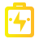
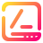
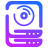
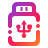
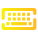
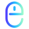
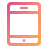

# 🖼️ devices 素材庫

[⬅️ 返回主目錄](../../../../README.md)

| 預覽 (點擊放大) | 檔案資訊 |
| :--- | :--- |
|  | **battery.svg** Vector (SVG) | 1.01KB |
|  | **drive-harddisk-encrypted.svg** Vector (SVG) | 4.85KB |
|  | **drive-harddisk-root.svg** Vector (SVG) | 2.11KB |
|  | **drive-harddisk.svg** Vector (SVG) | 3.56KB |
|  | **drive-multidisk.svg** Vector (SVG) | 5.50KB |
|  | **drive-multipartition.svg** Vector (SVG) | 1.93KB |
|  | **drive-partition.svg** Vector (SVG) | 2.00KB |
|  | **drive-removable-media.svg** Vector (SVG) | 2.99KB |
|  | **input-keyboard.svg** Vector (SVG) | 3.97KB |
|  | **input-mouse.svg** Vector (SVG) | 2.29KB |
|  | **media-optical.svg** Vector (SVG) | 3.49KB |
|  | **smartphone.svg** Vector (SVG) | 1.66KB |