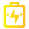
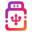

# 🖼️ 素材分類：devices

> [🏠 主目錄](../../../../README.md) / [images](../../../README.md) / [iCons](../../README.md) / [CandyiCons](../README.md) / **devices**

本目錄共有 `12` 個檔案

| 🎨 預覽 (點擊放大)  | 📋 檔案詳細資訊與連結 |
| :--- | :--- |
|  | **📂 檔名:** `battery.svg` ✨ **格式:** `Vector (SVG)` ⚖️ **大小:** `1.01KB` 📅 **更新:** `2026-03-01`  🚀 **jsDelivr Markdown:** `` 🔗 **直接連結 (Url):** <code>https://cdn.jsdelivr.net/gh/barry028/materials@main/images/iCons/CandyiCons/devices/battery.svg</code> 📥 [檢視原始檔](battery.svg) |
|  | **📂 檔名:** `drive-harddisk-encrypted.svg` ✨ **格式:** `Vector (SVG)` ⚖️ **大小:** `4.85KB` 📅 **更新:** `2026-03-01`  🚀 **jsDelivr Markdown:** `` 🔗 **直接連結 (Url):** <code>https://cdn.jsdelivr.net/gh/barry028/materials@main/images/iCons/CandyiCons/devices/drive-harddisk-encrypted.svg</code> 📥 [檢視原始檔](drive-harddisk-encrypted.svg) |
|  | **📂 檔名:** `drive-harddisk-root.svg` ✨ **格式:** `Vector (SVG)` ⚖️ **大小:** `2.11KB` 📅 **更新:** `2026-03-01`  🚀 **jsDelivr Markdown:** `` 🔗 **直接連結 (Url):** <code>https://cdn.jsdelivr.net/gh/barry028/materials@main/images/iCons/CandyiCons/devices/drive-harddisk-root.svg</code> 📥 [檢視原始檔](drive-harddisk-root.svg) |
|  | **📂 檔名:** `drive-harddisk.svg` ✨ **格式:** `Vector (SVG)` ⚖️ **大小:** `3.56KB` 📅 **更新:** `2026-03-01`  🚀 **jsDelivr Markdown:** `` 🔗 **直接連結 (Url):** <code>https://cdn.jsdelivr.net/gh/barry028/materials@main/images/iCons/CandyiCons/devices/drive-harddisk.svg</code> 📥 [檢視原始檔](drive-harddisk.svg) |
|  | **📂 檔名:** `drive-multidisk.svg` ✨ **格式:** `Vector (SVG)` ⚖️ **大小:** `5.50KB` 📅 **更新:** `2026-03-01`  🚀 **jsDelivr Markdown:** `` 🔗 **直接連結 (Url):** <code>https://cdn.jsdelivr.net/gh/barry028/materials@main/images/iCons/CandyiCons/devices/drive-multidisk.svg</code> 📥 [檢視原始檔](drive-multidisk.svg) |
|  | **📂 檔名:** `drive-multipartition.svg` ✨ **格式:** `Vector (SVG)` ⚖️ **大小:** `1.93KB` 📅 **更新:** `2026-03-01`  🚀 **jsDelivr Markdown:** `` 🔗 **直接連結 (Url):** <code>https://cdn.jsdelivr.net/gh/barry028/materials@main/images/iCons/CandyiCons/devices/drive-multipartition.svg</code> 📥 [檢視原始檔](drive-multipartition.svg) |
|  | **📂 檔名:** `drive-partition.svg` ✨ **格式:** `Vector (SVG)` ⚖️ **大小:** `2.00KB` 📅 **更新:** `2026-03-01`  🚀 **jsDelivr Markdown:** `` 🔗 **直接連結 (Url):** <code>https://cdn.jsdelivr.net/gh/barry028/materials@main/images/iCons/CandyiCons/devices/drive-partition.svg</code> 📥 [檢視原始檔](drive-partition.svg) |
|  | **📂 檔名:** `drive-removable-media.svg` ✨ **格式:** `Vector (SVG)` ⚖️ **大小:** `2.99KB` 📅 **更新:** `2026-03-01`  🚀 **jsDelivr Markdown:** `` 🔗 **直接連結 (Url):** <code>https://cdn.jsdelivr.net/gh/barry028/materials@main/images/iCons/CandyiCons/devices/drive-removable-media.svg</code> 📥 [檢視原始檔](drive-removable-media.svg) |
|  | **📂 檔名:** `input-keyboard.svg` ✨ **格式:** `Vector (SVG)` ⚖️ **大小:** `3.97KB` 📅 **更新:** `2026-03-01`  🚀 **jsDelivr Markdown:** `` 🔗 **直接連結 (Url):** <code>https://cdn.jsdelivr.net/gh/barry028/materials@main/images/iCons/CandyiCons/devices/input-keyboard.svg</code> 📥 [檢視原始檔](input-keyboard.svg) |
|  | **📂 檔名:** `input-mouse.svg` ✨ **格式:** `Vector (SVG)` ⚖️ **大小:** `2.29KB` 📅 **更新:** `2026-03-01`  🚀 **jsDelivr Markdown:** `` 🔗 **直接連結 (Url):** <code>https://cdn.jsdelivr.net/gh/barry028/materials@main/images/iCons/CandyiCons/devices/input-mouse.svg</code> 📥 [檢視原始檔](input-mouse.svg) |
|  | **📂 檔名:** `media-optical.svg` ✨ **格式:** `Vector (SVG)` ⚖️ **大小:** `3.49KB` 📅 **更新:** `2026-03-01`  🚀 **jsDelivr Markdown:** `` 🔗 **直接連結 (Url):** <code>https://cdn.jsdelivr.net/gh/barry028/materials@main/images/iCons/CandyiCons/devices/media-optical.svg</code> 📥 [檢視原始檔](media-optical.svg) |
|  | **📂 檔名:** `smartphone.svg` ✨ **格式:** `Vector (SVG)` ⚖️ **大小:** `1.66KB` 📅 **更新:** `2026-03-01`  🚀 **jsDelivr Markdown:** `` 🔗 **直接連結 (Url):** <code>https://cdn.jsdelivr.net/gh/barry028/materials@main/images/iCons/CandyiCons/devices/smartphone.svg</code> 📥 [檢視原始檔](smartphone.svg) |