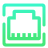

# 🖼️ preferences Gallery

[⬅️ 回到首頁](../../README.md)

| 預覽 | 詳細資訊 |
| :--- | :--- |
|  | **XrendrMixer.svg** VectorxVector | 2.67KB 更新: 2026-02-26 |
|  | **preferences-desktop-accessibility.svg** VectorxVector | 4.47KB 更新: 2026-02-26 |
|  | **preferences-desktop-cursors.svg** VectorxVector | 1.84KB 更新: 2026-02-26 |
|  | **preferences-desktop-default-applications.svg** VectorxVector | 1.48KB 更新: 2026-02-26 |
|  | **preferences-desktop-plasma-theme.svg** VectorxVector | 2.77KB 更新: 2026-02-26 |
|  | **preferences-desktop-plasma.svg** VectorxVector | 2.79KB 更新: 2026-02-26 |
|  | **preferences-desktop-theme-applications.svg** VectorxVector | 6.66KB 更新: 2026-02-26 |
|  | **preferences-desktop-theme-windowdecorations.svg** VectorxVector | 2.33KB 更新: 2026-02-26 |
|  | **preferences-system-login.svg** VectorxVector | 3.54KB 更新: 2026-02-26 |
|  | **preferences-system-users.svg** VectorxVector | 8.58KB 更新: 2026-02-26 |
|  | **preferences-system-windows-actions.svg** VectorxVector | 2.08KB 更新: 2026-02-26 |
|  | **preferences-theme.svg** VectorxVector | 4.70KB 更新: 2026-02-26 |
|  | **system-lock-screen.svg** VectorxVector | 1.98KB 更新: 2026-02-26 |
|  | **wmtweaks.svg** VectorxVector | 6.47KB 更新: 2026-02-26 |
|  | **xfce4-backdrop.svg** VectorxVector | 2.55KB 更新: 2026-02-26 |
|  | **xfce4-notifyd.svg** VectorxVector | 3.26KB 更新: 2026-02-26 |
|  | **xfce4-ui.svg** VectorxVector | 2.82KB 更新: 2026-02-26 |
|  | **xfdashboard.svg** VectorxVector | 2.77KB 更新: 2026-02-26 |
|  | **yast-dsl.svg** VectorxVector | 2.49KB 更新: 2026-02-26 |
|  | **yast-lan.svg** VectorxVector | 2.42KB 更新: 2026-02-26 |
|  | **yast-language.svg** VectorxVector | 3.06KB 更新: 2026-02-26 |
|  | **yast-printer.svg** VectorxVector | 2.28KB 更新: 2026-02-26 |
|  | **yast-system-group.svg** VectorxVector | 2.50KB 更新: 2026-02-26 |