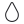

# 🖼️ 素材分類：Design

> [🏠 主目錄](../../../../README.md) / [images](../../../README.md) / [iCons](../../README.md) / [Circum](../README.md) / **Design**

本目錄共有 `14` 個檔案

| 🎨 預覽 (點擊放大)  | 📋 檔案詳細資訊與連結 |
| :--- | :--- |
|  | **📂 檔名:** `Bezier.svg` ✨ **格式:** `Vector (SVG)` ⚖️ **大小:** `931.00B` 📅 **更新:** `2026-03-03`  🚀 **jsDelivr Markdown:** `` 🔗 **直接連結 (Url):** <code>https://cdn.jsdelivr.net/gh/barry028/materials@main/images/iCons/Circum/Design/Bezier.svg</code> 📥 [檢視原始檔](Bezier.svg) |
|  | **📂 檔名:** `Crop.svg` ✨ **格式:** `Vector (SVG)` ⚖️ **大小:** `528.00B` 📅 **更新:** `2026-03-03`  🚀 **jsDelivr Markdown:** `` 🔗 **直接連結 (Url):** <code>https://cdn.jsdelivr.net/gh/barry028/materials@main/images/iCons/Circum/Design/Crop.svg</code> 📥 [檢視原始檔](Crop.svg) |
|  | **📂 檔名:** `Droplet.svg` ✨ **格式:** `Vector (SVG)` ⚖️ **大小:** `522.00B` 📅 **更新:** `2026-03-03`  🚀 **jsDelivr Markdown:** `` 🔗 **直接連結 (Url):** <code>https://cdn.jsdelivr.net/gh/barry028/materials@main/images/iCons/Circum/Design/Droplet.svg</code> 📥 [檢視原始檔](Droplet.svg) |
|  | **📂 檔名:** `Edit.svg` ✨ **格式:** `Vector (SVG)` ⚖️ **大小:** `686.00B` 📅 **更新:** `2026-03-03`  🚀 **jsDelivr Markdown:** `` 🔗 **直接連結 (Url):** <code>https://cdn.jsdelivr.net/gh/barry028/materials@main/images/iCons/Circum/Design/Edit.svg</code> 📥 [檢視原始檔](Edit.svg) |
|  | **📂 檔名:** `Eraser.svg` ✨ **格式:** `Vector (SVG)` ⚖️ **大小:** `546.00B` 📅 **更新:** `2026-03-03`  🚀 **jsDelivr Markdown:** `` 🔗 **直接連結 (Url):** <code>https://cdn.jsdelivr.net/gh/barry028/materials@main/images/iCons/Circum/Design/Eraser.svg</code> 📥 [檢視原始檔](Eraser.svg) |
|  | **📂 檔名:** `Image_Off.svg` ✨ **格式:** `Vector (SVG)` ⚖️ **大小:** `1.28KB` 📅 **更新:** `2026-03-03`  🚀 **jsDelivr Markdown:** `` 🔗 **直接連結 (Url):** <code>https://cdn.jsdelivr.net/gh/barry028/materials@main/images/iCons/Circum/Design/Image_Off.svg</code> 📥 [檢視原始檔](Image_Off.svg) |
|  | **📂 檔名:** `Image_On.svg` ✨ **格式:** `Vector (SVG)` ⚖️ **大小:** `842.00B` 📅 **更新:** `2026-03-03`  🚀 **jsDelivr Markdown:** `` 🔗 **直接連結 (Url):** <code>https://cdn.jsdelivr.net/gh/barry028/materials@main/images/iCons/Circum/Design/Image_On.svg</code> 📥 [檢視原始檔](Image_On.svg) |
|  | **📂 檔名:** `Maximize_1.svg` ✨ **格式:** `Vector (SVG)` ⚖️ **大小:** `715.00B` 📅 **更新:** `2026-03-03`  🚀 **jsDelivr Markdown:** `` 🔗 **直接連結 (Url):** <code>https://cdn.jsdelivr.net/gh/barry028/materials@main/images/iCons/Circum/Design/Maximize_1.svg</code> 📥 [檢視原始檔](Maximize_1.svg) |
|  | **📂 檔名:** `Maximize_2.svg` ✨ **格式:** `Vector (SVG)` ⚖️ **大小:** `1015.00B` 📅 **更新:** `2026-03-03`  🚀 **jsDelivr Markdown:** `` 🔗 **直接連結 (Url):** <code>https://cdn.jsdelivr.net/gh/barry028/materials@main/images/iCons/Circum/Design/Maximize_2.svg</code> 📥 [檢視原始檔](Maximize_2.svg) |
|  | **📂 檔名:** `Minimize_1.svg` ✨ **格式:** `Vector (SVG)` ⚖️ **大小:** `596.00B` 📅 **更新:** `2026-03-03`  🚀 **jsDelivr Markdown:** `` 🔗 **直接連結 (Url):** <code>https://cdn.jsdelivr.net/gh/barry028/materials@main/images/iCons/Circum/Design/Minimize_1.svg</code> 📥 [檢視原始檔](Minimize_1.svg) |
|  | **📂 檔名:** `Minimize_2.svg` ✨ **格式:** `Vector (SVG)` ⚖️ **大小:** `1019.00B` 📅 **更新:** `2026-03-03`  🚀 **jsDelivr Markdown:** `` 🔗 **直接連結 (Url):** <code>https://cdn.jsdelivr.net/gh/barry028/materials@main/images/iCons/Circum/Design/Minimize_2.svg</code> 📥 [檢視原始檔](Minimize_2.svg) |
|  | **📂 檔名:** `Palette.svg` ✨ **格式:** `Vector (SVG)` ⚖️ **大小:** `822.00B` 📅 **更新:** `2026-03-03`  🚀 **jsDelivr Markdown:** `` 🔗 **直接連結 (Url):** <code>https://cdn.jsdelivr.net/gh/barry028/materials@main/images/iCons/Circum/Design/Palette.svg</code> 📥 [檢視原始檔](Palette.svg) |
|  | **📂 檔名:** `Pen.svg` ✨ **格式:** `Vector (SVG)` ⚖️ **大小:** `755.00B` 📅 **更新:** `2026-03-03`  🚀 **jsDelivr Markdown:** `` 🔗 **直接連結 (Url):** <code>https://cdn.jsdelivr.net/gh/barry028/materials@main/images/iCons/Circum/Design/Pen.svg</code> 📥 [檢視原始檔](Pen.svg) |
|  | **📂 檔名:** `Picker_Empty.svg` ✨ **格式:** `Vector (SVG)` ⚖️ **大小:** `797.00B` 📅 **更新:** `2026-03-03`  🚀 **jsDelivr Markdown:** `` 🔗 **直接連結 (Url):** <code>https://cdn.jsdelivr.net/gh/barry028/materials@main/images/iCons/Circum/Design/Picker_Empty.svg</code> 📥 [檢視原始檔](Picker_Empty.svg) |