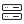

# 🖼️ Devices & Electronics Gallery

[⬅️ 回到首頁](../../README.md)

| 預覽 | 詳細資訊 |
| :--- | :--- |
|  | **Battery_Charging.svg** VectorxVector | 811.00B 更新: 2026-02-26 |
|  | **Battery_Empty.svg** VectorxVector | 500.00B 更新: 2026-02-26 |
|  | **Battery_Full.svg** VectorxVector | 613.00B 更新: 2026-02-26 |
|  | **Bluetooth.svg** VectorxVector | 588.00B 更新: 2026-02-26 |
|  | **Camera.svg** VectorxVector | 754.00B 更新: 2026-02-26 |
|  | **Cloud_Off.svg** VectorxVector | 775.00B 更新: 2026-02-26 |
|  | **Cloud_On.svg** VectorxVector | 579.00B 更新: 2026-02-26 |
|  | **Database.svg** VectorxVector | 707.00B 更新: 2026-02-26 |
|  | **Desktop.svg** VectorxVector | 498.00B 更新: 2026-02-26 |
|  | **Desktop_Mouse_1.svg** VectorxVector | 473.00B 更新: 2026-02-26 |
|  | **Desktop_Mouse_2.svg** VectorxVector | 570.00B 更新: 2026-02-26 |
|  | **Floppy_Disk.svg** VectorxVector | 733.00B 更新: 2026-02-26 |
|  | **Globe.svg** VectorxVector | 1.19KB 更新: 2026-02-26 |
|  | **Hard_Drive.svg** VectorxVector | 770.00B 更新: 2026-02-26 |
|  | **Headphones.svg** VectorxVector | 951.00B 更新: 2026-02-26 |
|  | **Keyboard.svg** VectorxVector | 1.08KB 更新: 2026-02-26 |
|  | **Laptop.svg** VectorxVector | 517.00B 更新: 2026-02-26 |
|  | **Link.svg** VectorxVector | 719.00B 更新: 2026-02-26 |
|  | **Microchip.svg** VectorxVector | 888.00B 更新: 2026-02-26 |
|  | **Mobile_1.svg** VectorxVector | 561.00B 更新: 2026-02-26 |
|  | **Mobile_2.svg** VectorxVector | 538.00B 更新: 2026-02-26 |
|  | **Mobile_3.svg** VectorxVector | 596.00B 更新: 2026-02-26 |
|  | **Mobile_4.svg** VectorxVector | 560.00B 更新: 2026-02-26 |
|  | **Monitor.svg** VectorxVector | 478.00B 更新: 2026-02-26 |
|  | **Phone.svg** VectorxVector | 794.00B 更新: 2026-02-26 |
|  | **Plug_1.svg** VectorxVector | 506.00B 更新: 2026-02-26 |
|  | **Power.svg** VectorxVector | 461.00B 更新: 2026-02-26 |
|  | **Router.svg** VectorxVector | 737.00B 更新: 2026-02-26 |
|  | **Satellite_1.svg** VectorxVector | 992.00B 更新: 2026-02-26 |
|  | **Server.svg** VectorxVector | 1.08KB 更新: 2026-02-26 |
|  | **Speaker.svg** VectorxVector | 748.00B 更新: 2026-02-26 |
|  | **Stream_Off.svg** VectorxVector | 1.06KB 更新: 2026-02-26 |
|  | **Stream_On.svg** VectorxVector | 899.00B 更新: 2026-02-26 |
|  | **Usb.svg** VectorxVector | 666.00B 更新: 2026-02-26 |
|  | **Wi-Fi_Off.svg** VectorxVector | 940.00B 更新: 2026-02-26 |
|  | **Wi-Fi_On.svg** VectorxVector | 733.00B 更新: 2026-02-26 |