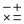

# 🖼️ 素材分類：Finances & Payments

> [🏠 主目錄](../../../../README.md) / [images](../../../README.md) / [iCons](../../README.md) / [Circum](../README.md) / **Finances & Payments**

本目錄共有 `15` 個檔案

| 🎨 預覽 (點擊放大) | 📋 檔案詳細資訊與連結 |
| :--- | :--- |
|  | **📂 檔名:** `Bag_1.svg` ✨ **格式:** `Vector (SVG)` ⚖️ **大小:** `849.00B` | 📅 **更新:** `2026-02-27`  🚀 **jsDelivr Markdown:** `` 🔗 **直接連結 (Url):** `https://cdn.jsdelivr.net/gh/Barry028/materials@main/images/iCons/Circum/Finances%20%26%20Payments/Bag_1.svg` 📥 [檢視原始檔](Bag_1.svg) |
|  | **📂 檔名:** `Bank.svg` ✨ **格式:** `Vector (SVG)` ⚖️ **大小:** `643.00B` | 📅 **更新:** `2026-02-27`  🚀 **jsDelivr Markdown:** `` 🔗 **直接連結 (Url):** `https://cdn.jsdelivr.net/gh/Barry028/materials@main/images/iCons/Circum/Finances%20%26%20Payments/Bank.svg` 📥 [檢視原始檔](Bank.svg) |
|  | **📂 檔名:** `Bitcoin.svg` ✨ **格式:** `Vector (SVG)` ⚖️ **大小:** `640.00B` | 📅 **更新:** `2026-02-27`  🚀 **jsDelivr Markdown:** `` 🔗 **直接連結 (Url):** `https://cdn.jsdelivr.net/gh/Barry028/materials@main/images/iCons/Circum/Finances%20%26%20Payments/Bitcoin.svg` 📥 [檢視原始檔](Bitcoin.svg) |
|  | **📂 檔名:** `Calculator_1.svg` ✨ **格式:** `Vector (SVG)` ⚖️ **大小:** `1.32KB` | 📅 **更新:** `2026-02-27`  🚀 **jsDelivr Markdown:** `` 🔗 **直接連結 (Url):** `https://cdn.jsdelivr.net/gh/Barry028/materials@main/images/iCons/Circum/Finances%20%26%20Payments/Calculator_1.svg` 📥 [檢視原始檔](Calculator_1.svg) |
|  | **📂 檔名:** `Calculator_2.svg` ✨ **格式:** `Vector (SVG)` ⚖️ **大小:** `848.00B` | 📅 **更新:** `2026-02-27`  🚀 **jsDelivr Markdown:** `` 🔗 **直接連結 (Url):** `https://cdn.jsdelivr.net/gh/Barry028/materials@main/images/iCons/Circum/Finances%20%26%20Payments/Calculator_2.svg` 📥 [檢視原始檔](Calculator_2.svg) |
|  | **📂 檔名:** `Coin_Insert.svg` ✨ **格式:** `Vector (SVG)` ⚖️ **大小:** `772.00B` | 📅 **更新:** `2026-02-27`  🚀 **jsDelivr Markdown:** `` 🔗 **直接連結 (Url):** `https://cdn.jsdelivr.net/gh/Barry028/materials@main/images/iCons/Circum/Finances%20%26%20Payments/Coin_Insert.svg` 📥 [檢視原始檔](Coin_Insert.svg) |
|  | **📂 檔名:** `Coins_1.svg` ✨ **格式:** `Vector (SVG)` ⚖️ **大小:** `721.00B` | 📅 **更新:** `2026-02-27`  🚀 **jsDelivr Markdown:** `` 🔗 **直接連結 (Url):** `https://cdn.jsdelivr.net/gh/Barry028/materials@main/images/iCons/Circum/Finances%20%26%20Payments/Coins_1.svg` 📥 [檢視原始檔](Coins_1.svg) |
|  | **📂 檔名:** `Credit_Card_1.svg` ✨ **格式:** `Vector (SVG)` ⚖️ **大小:** `642.00B` | 📅 **更新:** `2026-02-27`  🚀 **jsDelivr Markdown:** `` 🔗 **直接連結 (Url):** `https://cdn.jsdelivr.net/gh/Barry028/materials@main/images/iCons/Circum/Finances%20%26%20Payments/Credit_Card_1.svg` 📥 [檢視原始檔](Credit_Card_1.svg) |
|  | **📂 檔名:** `Credit_Card_2.svg` ✨ **格式:** `Vector (SVG)` ⚖️ **大小:** `767.00B` | 📅 **更新:** `2026-02-27`  🚀 **jsDelivr Markdown:** `` 🔗 **直接連結 (Url):** `https://cdn.jsdelivr.net/gh/Barry028/materials@main/images/iCons/Circum/Finances%20%26%20Payments/Credit_Card_2.svg` 📥 [檢視原始檔](Credit_Card_2.svg) |
|  | **📂 檔名:** `Credit_Card_Off.svg` ✨ **格式:** `Vector (SVG)` ⚖️ **大小:** `891.00B` | 📅 **更新:** `2026-02-27`  🚀 **jsDelivr Markdown:** `` 🔗 **直接連結 (Url):** `https://cdn.jsdelivr.net/gh/Barry028/materials@main/images/iCons/Circum/Finances%20%26%20Payments/Credit_Card_Off.svg` 📥 [檢視原始檔](Credit_Card_Off.svg) |
|  | **📂 檔名:** `Dollar.svg` ✨ **格式:** `Vector (SVG)` ⚖️ **大小:** `540.00B` | 📅 **更新:** `2026-02-27`  🚀 **jsDelivr Markdown:** `` 🔗 **直接連結 (Url):** `https://cdn.jsdelivr.net/gh/Barry028/materials@main/images/iCons/Circum/Finances%20%26%20Payments/Dollar.svg` 📥 [檢視原始檔](Dollar.svg) |
|  | **📂 檔名:** `Money_Bill.svg` ✨ **格式:** `Vector (SVG)` ⚖️ **大小:** `791.00B` | 📅 **更新:** `2026-02-27`  🚀 **jsDelivr Markdown:** `` 🔗 **直接連結 (Url):** `https://cdn.jsdelivr.net/gh/Barry028/materials@main/images/iCons/Circum/Finances%20%26%20Payments/Money_Bill.svg` 📥 [檢視原始檔](Money_Bill.svg) |
|  | **📂 檔名:** `Money_Check_1.svg` ✨ **格式:** `Vector (SVG)` ⚖️ **大小:** `717.00B` | 📅 **更新:** `2026-02-27`  🚀 **jsDelivr Markdown:** `` 🔗 **直接連結 (Url):** `https://cdn.jsdelivr.net/gh/Barry028/materials@main/images/iCons/Circum/Finances%20%26%20Payments/Money_Check_1.svg` 📥 [檢視原始檔](Money_Check_1.svg) |
|  | **📂 檔名:** `Percent.svg` ✨ **格式:** `Vector (SVG)` ⚖️ **大小:** `764.00B` | 📅 **更新:** `2026-02-27`  🚀 **jsDelivr Markdown:** `` 🔗 **直接連結 (Url):** `https://cdn.jsdelivr.net/gh/Barry028/materials@main/images/iCons/Circum/Finances%20%26%20Payments/Percent.svg` 📥 [檢視原始檔](Percent.svg) |
|  | **📂 檔名:** `Receipt.svg` ✨ **格式:** `Vector (SVG)` ⚖️ **大小:** `1.41KB` | 📅 **更新:** `2026-02-27`  🚀 **jsDelivr Markdown:** `` 🔗 **直接連結 (Url):** `https://cdn.jsdelivr.net/gh/Barry028/materials@main/images/iCons/Circum/Finances%20%26%20Payments/Receipt.svg` 📥 [檢視原始檔](Receipt.svg) |