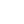
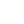
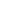
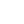
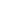
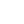
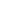

# 🖼️ 素材分類：Edit

> [🏠 主目錄](../../../../README.md) / [images](../../../README.md) / [iCons](../../README.md) / [Coolicons](../README.md) / **Edit**

本目錄共有 `72` 個檔案

| 🎨 預覽 (點擊放大)  | 📋 檔案詳細資訊與連結 |
| :--- | :--- |
|  | **📂 檔名:** `Add_Column.svg` ✨ **格式:** `Vector (SVG)` ⚖️ **大小:** `323.00B` 📅 **更新:** `2026-03-04`  🚀 **jsDelivr Markdown:** `` 🔗 **直接連結 (Url):** <code>https://cdn.jsdelivr.net/gh/barry028/materials@main/images/iCons/Coolicons/Edit/Add_Column.svg</code> 📥 [檢視原始檔](Add_Column.svg) |
|  | **📂 檔名:** `Add_Minus_Square.svg` ✨ **格式:** `Vector (SVG)` ⚖️ **大小:** `728.00B` 📅 **更新:** `2026-03-04`  🚀 **jsDelivr Markdown:** `` 🔗 **直接連結 (Url):** <code>https://cdn.jsdelivr.net/gh/barry028/materials@main/images/iCons/Coolicons/Edit/Add_Minus_Square.svg</code> 📥 [檢視原始檔](Add_Minus_Square.svg) |
|  | **📂 檔名:** `Add_Plus.svg` ✨ **格式:** `Vector (SVG)` ⚖️ **大小:** `229.00B` 📅 **更新:** `2026-03-04`  🚀 **jsDelivr Markdown:** `` 🔗 **直接連結 (Url):** <code>https://cdn.jsdelivr.net/gh/barry028/materials@main/images/iCons/Coolicons/Edit/Add_Plus.svg</code> 📥 [檢視原始檔](Add_Plus.svg) |
|  | **📂 檔名:** `Add_Plus_Circle.svg` ✨ **格式:** `Vector (SVG)` ⚖️ **大小:** `342.00B` 📅 **更新:** `2026-03-04`  🚀 **jsDelivr Markdown:** `` 🔗 **直接連結 (Url):** <code>https://cdn.jsdelivr.net/gh/barry028/materials@main/images/iCons/Coolicons/Edit/Add_Plus_Circle.svg</code> 📥 [檢視原始檔](Add_Plus_Circle.svg) |
|  | **📂 檔名:** `Add_Plus_Square.svg` ✨ **格式:** `Vector (SVG)` ⚖️ **大小:** `754.00B` 📅 **更新:** `2026-03-04`  🚀 **jsDelivr Markdown:** `` 🔗 **直接連結 (Url):** <code>https://cdn.jsdelivr.net/gh/barry028/materials@main/images/iCons/Coolicons/Edit/Add_Plus_Square.svg</code> 📥 [檢視原始檔](Add_Plus_Square.svg) |
|  | **📂 檔名:** `Add_Row.svg` ✨ **格式:** `Vector (SVG)` ⚖️ **大小:** `326.00B` 📅 **更新:** `2026-03-04`  🚀 **jsDelivr Markdown:** `` 🔗 **直接連結 (Url):** <code>https://cdn.jsdelivr.net/gh/barry028/materials@main/images/iCons/Coolicons/Edit/Add_Row.svg</code> 📥 [檢視原始檔](Add_Row.svg) |
|  | **📂 檔名:** `Add_To_Queue.svg` ✨ **格式:** `Vector (SVG)` ⚖️ **大小:** `894.00B` 📅 **更新:** `2026-03-04`  🚀 **jsDelivr Markdown:** `` 🔗 **直接連結 (Url):** <code>https://cdn.jsdelivr.net/gh/barry028/materials@main/images/iCons/Coolicons/Edit/Add_To_Queue.svg</code> 📥 [檢視原始檔](Add_To_Queue.svg) |
|  | **📂 檔名:** `Bold.svg` ✨ **格式:** `Vector (SVG)` ⚖️ **大小:** `344.00B` 📅 **更新:** `2026-03-04`  🚀 **jsDelivr Markdown:** `` 🔗 **直接連結 (Url):** <code>https://cdn.jsdelivr.net/gh/barry028/materials@main/images/iCons/Coolicons/Edit/Bold.svg</code> 📥 [檢視原始檔](Bold.svg) |
|  | **📂 檔名:** `Close_Circle.svg` ✨ **格式:** `Vector (SVG)` ⚖️ **大小:** `412.00B` 📅 **更新:** `2026-03-04`  🚀 **jsDelivr Markdown:** `` 🔗 **直接連結 (Url):** <code>https://cdn.jsdelivr.net/gh/barry028/materials@main/images/iCons/Coolicons/Edit/Close_Circle.svg</code> 📥 [檢視原始檔](Close_Circle.svg) |
|  | **📂 檔名:** `Close_Square.svg` ✨ **格式:** `Vector (SVG)` ⚖️ **大小:** `824.00B` 📅 **更新:** `2026-03-04`  🚀 **jsDelivr Markdown:** `` 🔗 **直接連結 (Url):** <code>https://cdn.jsdelivr.net/gh/barry028/materials@main/images/iCons/Coolicons/Edit/Close_Square.svg</code> 📥 [檢視原始檔](Close_Square.svg) |
|  | **📂 檔名:** `Columns.svg` ✨ **格式:** `Vector (SVG)` ⚖️ **大小:** `1.27KB` 📅 **更新:** `2026-03-04`  🚀 **jsDelivr Markdown:** `` 🔗 **直接連結 (Url):** <code>https://cdn.jsdelivr.net/gh/barry028/materials@main/images/iCons/Coolicons/Edit/Columns.svg</code> 📥 [檢視原始檔](Columns.svg) |
|  | **📂 檔名:** `Combine_Cells.svg` ✨ **格式:** `Vector (SVG)` ⚖️ **大小:** `721.00B` 📅 **更新:** `2026-03-04`  🚀 **jsDelivr Markdown:** `` 🔗 **直接連結 (Url):** <code>https://cdn.jsdelivr.net/gh/barry028/materials@main/images/iCons/Coolicons/Edit/Combine_Cells.svg</code> 📥 [檢視原始檔](Combine_Cells.svg) |
|  | **📂 檔名:** `Copy.svg` ✨ **格式:** `Vector (SVG)` ⚖️ **大小:** `1.08KB` 📅 **更新:** `2026-03-04`  🚀 **jsDelivr Markdown:** `` 🔗 **直接連結 (Url):** <code>https://cdn.jsdelivr.net/gh/barry028/materials@main/images/iCons/Coolicons/Edit/Copy.svg</code> 📥 [檢視原始檔](Copy.svg) |
|  | **📂 檔名:** `Crop.svg` ✨ **格式:** `Vector (SVG)` ⚖️ **大小:** `490.00B` 📅 **更新:** `2026-03-04`  🚀 **jsDelivr Markdown:** `` 🔗 **直接連結 (Url):** <code>https://cdn.jsdelivr.net/gh/barry028/materials@main/images/iCons/Coolicons/Edit/Crop.svg</code> 📥 [檢視原始檔](Crop.svg) |
|  | **📂 檔名:** `Delete_Column.svg` ✨ **格式:** `Vector (SVG)` ⚖️ **大小:** `296.00B` 📅 **更新:** `2026-03-04`  🚀 **jsDelivr Markdown:** `` 🔗 **直接連結 (Url):** <code>https://cdn.jsdelivr.net/gh/barry028/materials@main/images/iCons/Coolicons/Edit/Delete_Column.svg</code> 📥 [檢視原始檔](Delete_Column.svg) |
|  | **📂 檔名:** `Delete_Row.svg` ✨ **格式:** `Vector (SVG)` ⚖️ **大小:** `296.00B` 📅 **更新:** `2026-03-04`  🚀 **jsDelivr Markdown:** `` 🔗 **直接連結 (Url):** <code>https://cdn.jsdelivr.net/gh/barry028/materials@main/images/iCons/Coolicons/Edit/Delete_Row.svg</code> 📥 [檢視原始檔](Delete_Row.svg) |
|  | **📂 檔名:** `Double_Quotes_L.svg` ✨ **格式:** `Vector (SVG)` ⚖️ **大小:** `1010.00B` 📅 **更新:** `2026-03-04`  🚀 **jsDelivr Markdown:** `` 🔗 **直接連結 (Url):** <code>https://cdn.jsdelivr.net/gh/barry028/materials@main/images/iCons/Coolicons/Edit/Double_Quotes_L.svg</code> 📥 [檢視原始檔](Double_Quotes_L.svg) |
|  | **📂 檔名:** `Double_Quotes_R.svg` ✨ **格式:** `Vector (SVG)` ⚖️ **大小:** `1.03KB` 📅 **更新:** `2026-03-04`  🚀 **jsDelivr Markdown:** `` 🔗 **直接連結 (Url):** <code>https://cdn.jsdelivr.net/gh/barry028/materials@main/images/iCons/Coolicons/Edit/Double_Quotes_R.svg</code> 📥 [檢視原始檔](Double_Quotes_R.svg) |
|  | **📂 檔名:** `Edit_Pencil_01.svg` ✨ **格式:** `Vector (SVG)` ⚖️ **大小:** `636.00B` 📅 **更新:** `2026-03-04`  🚀 **jsDelivr Markdown:** `` 🔗 **直接連結 (Url):** <code>https://cdn.jsdelivr.net/gh/barry028/materials@main/images/iCons/Coolicons/Edit/Edit_Pencil_01.svg</code> 📥 [檢視原始檔](Edit_Pencil_01.svg) |
|  | **📂 檔名:** `Edit_Pencil_02.svg` ✨ **格式:** `Vector (SVG)` ⚖️ **大小:** `581.00B` 📅 **更新:** `2026-03-04`  🚀 **jsDelivr Markdown:** `` 🔗 **直接連結 (Url):** <code>https://cdn.jsdelivr.net/gh/barry028/materials@main/images/iCons/Coolicons/Edit/Edit_Pencil_02.svg</code> 📥 [檢視原始檔](Edit_Pencil_02.svg) |
|  | **📂 檔名:** `Edit_Pencil_Line_01.svg` ✨ **格式:** `Vector (SVG)` ⚖️ **大小:** `659.00B` 📅 **更新:** `2026-03-04`  🚀 **jsDelivr Markdown:** `` 🔗 **直接連結 (Url):** <code>https://cdn.jsdelivr.net/gh/barry028/materials@main/images/iCons/Coolicons/Edit/Edit_Pencil_Line_01.svg</code> 📥 [檢視原始檔](Edit_Pencil_Line_01.svg) |
|  | **📂 檔名:** `Edit_Pencil_Line_02.svg` ✨ **格式:** `Vector (SVG)` ⚖️ **大小:** `594.00B` 📅 **更新:** `2026-03-04`  🚀 **jsDelivr Markdown:** `` 🔗 **直接連結 (Url):** <code>https://cdn.jsdelivr.net/gh/barry028/materials@main/images/iCons/Coolicons/Edit/Edit_Pencil_Line_02.svg</code> 📥 [檢視原始檔](Edit_Pencil_Line_02.svg) |
|  | **📂 檔名:** `Figma.svg` ✨ **格式:** `Vector (SVG)` ⚖️ **大小:** `620.00B` 📅 **更新:** `2026-03-04`  🚀 **jsDelivr Markdown:** `` 🔗 **直接連結 (Url):** <code>https://cdn.jsdelivr.net/gh/barry028/materials@main/images/iCons/Coolicons/Edit/Figma.svg</code> 📥 [檢視原始檔](Figma.svg) |
|  | **📂 檔名:** `Font.svg` ✨ **格式:** `Vector (SVG)` ⚖️ **大小:** `355.00B` 📅 **更新:** `2026-03-04`  🚀 **jsDelivr Markdown:** `` 🔗 **直接連結 (Url):** <code>https://cdn.jsdelivr.net/gh/barry028/materials@main/images/iCons/Coolicons/Edit/Font.svg</code> 📥 [檢視原始檔](Font.svg) |
|  | **📂 檔名:** `Heading.svg` ✨ **格式:** `Vector (SVG)` ⚖️ **大小:** `235.00B` 📅 **更新:** `2026-03-04`  🚀 **jsDelivr Markdown:** `` 🔗 **直接連結 (Url):** <code>https://cdn.jsdelivr.net/gh/barry028/materials@main/images/iCons/Coolicons/Edit/Heading.svg</code> 📥 [檢視原始檔](Heading.svg) |
|  | **📂 檔名:** `Heading_H1.svg` ✨ **格式:** `Vector (SVG)` ⚖️ **大小:** `252.00B` 📅 **更新:** `2026-03-04`  🚀 **jsDelivr Markdown:** `` 🔗 **直接連結 (Url):** <code>https://cdn.jsdelivr.net/gh/barry028/materials@main/images/iCons/Coolicons/Edit/Heading_H1.svg</code> 📥 [檢視原始檔](Heading_H1.svg) |
|  | **📂 檔名:** `Heading_H2.svg` ✨ **格式:** `Vector (SVG)` ⚖️ **大小:** `386.00B` 📅 **更新:** `2026-03-04`  🚀 **jsDelivr Markdown:** `` 🔗 **直接連結 (Url):** <code>https://cdn.jsdelivr.net/gh/barry028/materials@main/images/iCons/Coolicons/Edit/Heading_H2.svg</code> 📥 [檢視原始檔](Heading_H2.svg) |
|  | **📂 檔名:** `Heading_H3.svg` ✨ **格式:** `Vector (SVG)` ⚖️ **大小:** `399.00B` 📅 **更新:** `2026-03-04`  🚀 **jsDelivr Markdown:** `` 🔗 **直接連結 (Url):** <code>https://cdn.jsdelivr.net/gh/barry028/materials@main/images/iCons/Coolicons/Edit/Heading_H3.svg</code> 📥 [檢視原始檔](Heading_H3.svg) |
|  | **📂 檔名:** `Heading_H4.svg` ✨ **格式:** `Vector (SVG)` ⚖️ **大小:** `278.00B` 📅 **更新:** `2026-03-04`  🚀 **jsDelivr Markdown:** `` 🔗 **直接連結 (Url):** <code>https://cdn.jsdelivr.net/gh/barry028/materials@main/images/iCons/Coolicons/Edit/Heading_H4.svg</code> 📥 [檢視原始檔](Heading_H4.svg) |
|  | **📂 檔名:** `Heading_H5.svg` ✨ **格式:** `Vector (SVG)` ⚖️ **大小:** `628.00B` 📅 **更新:** `2026-03-04`  🚀 **jsDelivr Markdown:** `` 🔗 **直接連結 (Url):** <code>https://cdn.jsdelivr.net/gh/barry028/materials@main/images/iCons/Coolicons/Edit/Heading_H5.svg</code> 📥 [檢視原始檔](Heading_H5.svg) |
|  | **📂 檔名:** `Heading_H6.svg` ✨ **格式:** `Vector (SVG)` ⚖️ **大小:** `468.00B` 📅 **更新:** `2026-03-04`  🚀 **jsDelivr Markdown:** `` 🔗 **直接連結 (Url):** <code>https://cdn.jsdelivr.net/gh/barry028/materials@main/images/iCons/Coolicons/Edit/Heading_H6.svg</code> 📥 [檢視原始檔](Heading_H6.svg) |
|  | **📂 檔名:** `Hide.svg` ✨ **格式:** `Vector (SVG)` ⚖️ **大小:** `951.00B` 📅 **更新:** `2026-03-04`  🚀 **jsDelivr Markdown:** `` 🔗 **直接連結 (Url):** <code>https://cdn.jsdelivr.net/gh/barry028/materials@main/images/iCons/Coolicons/Edit/Hide.svg</code> 📥 [檢視原始檔](Hide.svg) |
|  | **📂 檔名:** `Italic.svg` ✨ **格式:** `Vector (SVG)` ⚖️ **大小:** `239.00B` 📅 **更新:** `2026-03-04`  🚀 **jsDelivr Markdown:** `` 🔗 **直接連結 (Url):** <code>https://cdn.jsdelivr.net/gh/barry028/materials@main/images/iCons/Coolicons/Edit/Italic.svg</code> 📥 [檢視原始檔](Italic.svg) |
|  | **📂 檔名:** `Layer.svg` ✨ **格式:** `Vector (SVG)` ⚖️ **大小:** `241.00B` 📅 **更新:** `2026-03-04`  🚀 **jsDelivr Markdown:** `` 🔗 **直接連結 (Url):** <code>https://cdn.jsdelivr.net/gh/barry028/materials@main/images/iCons/Coolicons/Edit/Layer.svg</code> 📥 [檢視原始檔](Layer.svg) |
|  | **📂 檔名:** `Layers.svg` ✨ **格式:** `Vector (SVG)` ⚖️ **大小:** `255.00B` 📅 **更新:** `2026-03-04`  🚀 **jsDelivr Markdown:** `` 🔗 **直接連結 (Url):** <code>https://cdn.jsdelivr.net/gh/barry028/materials@main/images/iCons/Coolicons/Edit/Layers.svg</code> 📥 [檢視原始檔](Layers.svg) |
|  | **📂 檔名:** `List_Add.svg` ✨ **格式:** `Vector (SVG)` ⚖️ **大小:** `254.00B` 📅 **更新:** `2026-03-04`  🚀 **jsDelivr Markdown:** `` 🔗 **直接連結 (Url):** <code>https://cdn.jsdelivr.net/gh/barry028/materials@main/images/iCons/Coolicons/Edit/List_Add.svg</code> 📥 [檢視原始檔](List_Add.svg) |
|  | **📂 檔名:** `List_Check.svg` ✨ **格式:** `Vector (SVG)` ⚖️ **大小:** `236.00B` 📅 **更新:** `2026-03-04`  🚀 **jsDelivr Markdown:** `` 🔗 **直接連結 (Url):** <code>https://cdn.jsdelivr.net/gh/barry028/materials@main/images/iCons/Coolicons/Edit/List_Check.svg</code> 📥 [檢視原始檔](List_Check.svg) |
|  | **📂 檔名:** `List_Checklist.svg` ✨ **格式:** `Vector (SVG)` ⚖️ **大小:** `269.00B` 📅 **更新:** `2026-03-04`  🚀 **jsDelivr Markdown:** `` 🔗 **直接連結 (Url):** <code>https://cdn.jsdelivr.net/gh/barry028/materials@main/images/iCons/Coolicons/Edit/List_Checklist.svg</code> 📥 [檢視原始檔](List_Checklist.svg) |
|  | **📂 檔名:** `List_Ordered.svg` ✨ **格式:** `Vector (SVG)` ⚖️ **大小:** `388.00B` 📅 **更新:** `2026-03-04`  🚀 **jsDelivr Markdown:** `` 🔗 **直接連結 (Url):** <code>https://cdn.jsdelivr.net/gh/barry028/materials@main/images/iCons/Coolicons/Edit/List_Ordered.svg</code> 📥 [檢視原始檔](List_Ordered.svg) |
|  | **📂 檔名:** `List_Remove.svg` ✨ **格式:** `Vector (SVG)` ⚖️ **大小:** `227.00B` 📅 **更新:** `2026-03-04`  🚀 **jsDelivr Markdown:** `` 🔗 **直接連結 (Url):** <code>https://cdn.jsdelivr.net/gh/barry028/materials@main/images/iCons/Coolicons/Edit/List_Remove.svg</code> 📥 [檢視原始檔](List_Remove.svg) |
|  | **📂 檔名:** `List_Unordered.svg` ✨ **格式:** `Vector (SVG)` ⚖️ **大小:** `333.00B` 📅 **更新:** `2026-03-04`  🚀 **jsDelivr Markdown:** `` 🔗 **直接連結 (Url):** <code>https://cdn.jsdelivr.net/gh/barry028/materials@main/images/iCons/Coolicons/Edit/List_Unordered.svg</code> 📥 [檢視原始檔](List_Unordered.svg) |
|  | **📂 檔名:** `Mention.svg` ✨ **格式:** `Vector (SVG)` ⚖️ **大小:** `832.00B` 📅 **更新:** `2026-03-04`  🚀 **jsDelivr Markdown:** `` 🔗 **直接連結 (Url):** <code>https://cdn.jsdelivr.net/gh/barry028/materials@main/images/iCons/Coolicons/Edit/Mention.svg</code> 📥 [檢視原始檔](Mention.svg) |
|  | **📂 檔名:** `Move.svg` ✨ **格式:** `Vector (SVG)` ⚖️ **大小:** `313.00B` 📅 **更新:** `2026-03-04`  🚀 **jsDelivr Markdown:** `` 🔗 **直接連結 (Url):** <code>https://cdn.jsdelivr.net/gh/barry028/materials@main/images/iCons/Coolicons/Edit/Move.svg</code> 📥 [檢視原始檔](Move.svg) |
|  | **📂 檔名:** `Move_Horizontal.svg` ✨ **格式:** `Vector (SVG)` ⚖️ **大小:** `245.00B` 📅 **更新:** `2026-03-04`  🚀 **jsDelivr Markdown:** `` 🔗 **直接連結 (Url):** <code>https://cdn.jsdelivr.net/gh/barry028/materials@main/images/iCons/Coolicons/Edit/Move_Horizontal.svg</code> 📥 [檢視原始檔](Move_Horizontal.svg) |
|  | **📂 檔名:** `Move_Vertical.svg` ✨ **格式:** `Vector (SVG)` ⚖️ **大小:** `245.00B` 📅 **更新:** `2026-03-04`  🚀 **jsDelivr Markdown:** `` 🔗 **直接連結 (Url):** <code>https://cdn.jsdelivr.net/gh/barry028/materials@main/images/iCons/Coolicons/Edit/Move_Vertical.svg</code> 📥 [檢視原始檔](Move_Vertical.svg) |
|  | **📂 檔名:** `Paperclip_Attechment_Horizontal.svg` ✨ **格式:** `Vector (SVG)` ⚖️ **大小:** `403.00B` 📅 **更新:** `2026-03-04`  🚀 **jsDelivr Markdown:** `` 🔗 **直接連結 (Url):** <code>https://cdn.jsdelivr.net/gh/barry028/materials@main/images/iCons/Coolicons/Edit/Paperclip_Attechment_Horizontal.svg</code> 📥 [檢視原始檔](Paperclip_Attechment_Horizontal.svg) |
|  | **📂 檔名:** `Paperclip_Attechment_Tilt.svg` ✨ **格式:** `Vector (SVG)` ⚖️ **大小:** `556.00B` 📅 **更新:** `2026-03-04`  🚀 **jsDelivr Markdown:** `` 🔗 **直接連結 (Url):** <code>https://cdn.jsdelivr.net/gh/barry028/materials@main/images/iCons/Coolicons/Edit/Paperclip_Attechment_Tilt.svg</code> 📥 [檢視原始檔](Paperclip_Attechment_Tilt.svg) |
|  | **📂 檔名:** `Paragraph.svg` ✨ **格式:** `Vector (SVG)` ⚖️ **大小:** `298.00B` 📅 **更新:** `2026-03-04`  🚀 **jsDelivr Markdown:** `` 🔗 **直接連結 (Url):** <code>https://cdn.jsdelivr.net/gh/barry028/materials@main/images/iCons/Coolicons/Edit/Paragraph.svg</code> 📥 [檢視原始檔](Paragraph.svg) |
|  | **📂 檔名:** `Path.svg` ✨ **格式:** `Vector (SVG)` ⚖️ **大小:** `597.00B` 📅 **更新:** `2026-03-04`  🚀 **jsDelivr Markdown:** `` 🔗 **直接連結 (Url):** <code>https://cdn.jsdelivr.net/gh/barry028/materials@main/images/iCons/Coolicons/Edit/Path.svg</code> 📥 [檢視原始檔](Path.svg) |
|  | **📂 檔名:** `Redo.svg` ✨ **格式:** `Vector (SVG)` ⚖️ **大小:** `611.00B` 📅 **更新:** `2026-03-04`  🚀 **jsDelivr Markdown:** `` 🔗 **直接連結 (Url):** <code>https://cdn.jsdelivr.net/gh/barry028/materials@main/images/iCons/Coolicons/Edit/Redo.svg</code> 📥 [檢視原始檔](Redo.svg) |
|  | **📂 檔名:** `Remove_Minus.svg` ✨ **格式:** `Vector (SVG)` ⚖️ **大小:** `203.00B` 📅 **更新:** `2026-03-04`  🚀 **jsDelivr Markdown:** `` 🔗 **直接連結 (Url):** <code>https://cdn.jsdelivr.net/gh/barry028/materials@main/images/iCons/Coolicons/Edit/Remove_Minus.svg</code> 📥 [檢視原始檔](Remove_Minus.svg) |
|  | **📂 檔名:** `Remove_Minus_Circle.svg` ✨ **格式:** `Vector (SVG)` ⚖️ **大小:** `316.00B` 📅 **更新:** `2026-03-04`  🚀 **jsDelivr Markdown:** `` 🔗 **直接連結 (Url):** <code>https://cdn.jsdelivr.net/gh/barry028/materials@main/images/iCons/Coolicons/Edit/Remove_Minus_Circle.svg</code> 📥 [檢視原始檔](Remove_Minus_Circle.svg) |
|  | **📂 檔名:** `Rows.svg` ✨ **格式:** `Vector (SVG)` ⚖️ **大小:** `1.27KB` 📅 **更新:** `2026-03-04`  🚀 **jsDelivr Markdown:** `` 🔗 **直接連結 (Url):** <code>https://cdn.jsdelivr.net/gh/barry028/materials@main/images/iCons/Coolicons/Edit/Rows.svg</code> 📥 [檢視原始檔](Rows.svg) |
|  | **📂 檔名:** `Ruler.svg` ✨ **格式:** `Vector (SVG)` ⚖️ **大小:** `939.00B` 📅 **更新:** `2026-03-04`  🚀 **jsDelivr Markdown:** `` 🔗 **直接連結 (Url):** <code>https://cdn.jsdelivr.net/gh/barry028/materials@main/images/iCons/Coolicons/Edit/Ruler.svg</code> 📥 [檢視原始檔](Ruler.svg) |
|  | **📂 檔名:** `Select_Multiple.svg` ✨ **格式:** `Vector (SVG)` ⚖️ **大小:** `876.00B` 📅 **更新:** `2026-03-04`  🚀 **jsDelivr Markdown:** `` 🔗 **直接連結 (Url):** <code>https://cdn.jsdelivr.net/gh/barry028/materials@main/images/iCons/Coolicons/Edit/Select_Multiple.svg</code> 📥 [檢視原始檔](Select_Multiple.svg) |
|  | **📂 檔名:** `Show.svg` ✨ **格式:** `Vector (SVG)` ⚖️ **大小:** `877.00B` 📅 **更新:** `2026-03-04`  🚀 **jsDelivr Markdown:** `` 🔗 **直接連結 (Url):** <code>https://cdn.jsdelivr.net/gh/barry028/materials@main/images/iCons/Coolicons/Edit/Show.svg</code> 📥 [檢視原始檔](Show.svg) |
|  | **📂 檔名:** `Single_Quotes_L.svg` ✨ **格式:** `Vector (SVG)` ⚖️ **大小:** `607.00B` 📅 **更新:** `2026-03-04`  🚀 **jsDelivr Markdown:** `` 🔗 **直接連結 (Url):** <code>https://cdn.jsdelivr.net/gh/barry028/materials@main/images/iCons/Coolicons/Edit/Single_Quotes_L.svg</code> 📥 [檢視原始檔](Single_Quotes_L.svg) |
|  | **📂 檔名:** `Single_Quotes_R.svg` ✨ **格式:** `Vector (SVG)` ⚖️ **大小:** `609.00B` 📅 **更新:** `2026-03-04`  🚀 **jsDelivr Markdown:** `` 🔗 **直接連結 (Url):** <code>https://cdn.jsdelivr.net/gh/barry028/materials@main/images/iCons/Coolicons/Edit/Single_Quotes_R.svg</code> 📥 [檢視原始檔](Single_Quotes_R.svg) |
|  | **📂 檔名:** `Sort_Ascending.svg` ✨ **格式:** `Vector (SVG)` ⚖️ **大小:** `251.00B` 📅 **更新:** `2026-03-04`  🚀 **jsDelivr Markdown:** `` 🔗 **直接連結 (Url):** <code>https://cdn.jsdelivr.net/gh/barry028/materials@main/images/iCons/Coolicons/Edit/Sort_Ascending.svg</code> 📥 [檢視原始檔](Sort_Ascending.svg) |
|  | **📂 檔名:** `Sort_Descending.svg` ✨ **格式:** `Vector (SVG)` ⚖️ **大小:** `246.00B` 📅 **更新:** `2026-03-04`  🚀 **jsDelivr Markdown:** `` 🔗 **直接連結 (Url):** <code>https://cdn.jsdelivr.net/gh/barry028/materials@main/images/iCons/Coolicons/Edit/Sort_Descending.svg</code> 📥 [檢視原始檔](Sort_Descending.svg) |
|  | **📂 檔名:** `Strikethrough.svg` ✨ **格式:** `Vector (SVG)` ⚖️ **大小:** `974.00B` 📅 **更新:** `2026-03-04`  🚀 **jsDelivr Markdown:** `` 🔗 **直接連結 (Url):** <code>https://cdn.jsdelivr.net/gh/barry028/materials@main/images/iCons/Coolicons/Edit/Strikethrough.svg</code> 📥 [檢視原始檔](Strikethrough.svg) |
|  | **📂 檔名:** `Swatches_Palette.svg` ✨ **格式:** `Vector (SVG)` ⚖️ **大小:** `730.00B` 📅 **更新:** `2026-03-04`  🚀 **jsDelivr Markdown:** `` 🔗 **直接連結 (Url):** <code>https://cdn.jsdelivr.net/gh/barry028/materials@main/images/iCons/Coolicons/Edit/Swatches_Palette.svg</code> 📥 [檢視原始檔](Swatches_Palette.svg) |
|  | **📂 檔名:** `Table.svg` ✨ **格式:** `Vector (SVG)` ⚖️ **大小:** `788.00B` 📅 **更新:** `2026-03-04`  🚀 **jsDelivr Markdown:** `` 🔗 **直接連結 (Url):** <code>https://cdn.jsdelivr.net/gh/barry028/materials@main/images/iCons/Coolicons/Edit/Table.svg</code> 📥 [檢視原始檔](Table.svg) |
|  | **📂 檔名:** `Table_Add.svg` ✨ **格式:** `Vector (SVG)` ⚖️ **大小:** `711.00B` 📅 **更新:** `2026-03-04`  🚀 **jsDelivr Markdown:** `` 🔗 **直接連結 (Url):** <code>https://cdn.jsdelivr.net/gh/barry028/materials@main/images/iCons/Coolicons/Edit/Table_Add.svg</code> 📥 [檢視原始檔](Table_Add.svg) |
|  | **📂 檔名:** `Table_Remove.svg` ✨ **格式:** `Vector (SVG)` ⚖️ **大小:** `684.00B` 📅 **更新:** `2026-03-04`  🚀 **jsDelivr Markdown:** `` 🔗 **直接連結 (Url):** <code>https://cdn.jsdelivr.net/gh/barry028/materials@main/images/iCons/Coolicons/Edit/Table_Remove.svg</code> 📥 [檢視原始檔](Table_Remove.svg) |
|  | **📂 檔名:** `Text.svg` ✨ **格式:** `Vector (SVG)` ⚖️ **大小:** `240.00B` 📅 **更新:** `2026-03-04`  🚀 **jsDelivr Markdown:** `` 🔗 **直接連結 (Url):** <code>https://cdn.jsdelivr.net/gh/barry028/materials@main/images/iCons/Coolicons/Edit/Text.svg</code> 📥 [檢視原始檔](Text.svg) |
|  | **📂 檔名:** `Text_Align_Center.svg` ✨ **格式:** `Vector (SVG)` ⚖️ **大小:** `226.00B` 📅 **更新:** `2026-03-04`  🚀 **jsDelivr Markdown:** `` 🔗 **直接連結 (Url):** <code>https://cdn.jsdelivr.net/gh/barry028/materials@main/images/iCons/Coolicons/Edit/Text_Align_Center.svg</code> 📥 [檢視原始檔](Text_Align_Center.svg) |
|  | **📂 檔名:** `Text_Align_Justify.svg` ✨ **格式:** `Vector (SVG)` ⚖️ **大小:** `226.00B` 📅 **更新:** `2026-03-04`  🚀 **jsDelivr Markdown:** `` 🔗 **直接連結 (Url):** <code>https://cdn.jsdelivr.net/gh/barry028/materials@main/images/iCons/Coolicons/Edit/Text_Align_Justify.svg</code> 📥 [檢視原始檔](Text_Align_Justify.svg) |
|  | **📂 檔名:** `Text_Align_Left.svg` ✨ **格式:** `Vector (SVG)` ⚖️ **大小:** `226.00B` 📅 **更新:** `2026-03-04`  🚀 **jsDelivr Markdown:** `` 🔗 **直接連結 (Url):** <code>https://cdn.jsdelivr.net/gh/barry028/materials@main/images/iCons/Coolicons/Edit/Text_Align_Left.svg</code> 📥 [檢視原始檔](Text_Align_Left.svg) |
|  | **📂 檔名:** `Text_Align_Right.svg` ✨ **格式:** `Vector (SVG)` ⚖️ **大小:** `228.00B` 📅 **更新:** `2026-03-04`  🚀 **jsDelivr Markdown:** `` 🔗 **直接連結 (Url):** <code>https://cdn.jsdelivr.net/gh/barry028/materials@main/images/iCons/Coolicons/Edit/Text_Align_Right.svg</code> 📥 [檢視原始檔](Text_Align_Right.svg) |
|  | **📂 檔名:** `Underline.svg` ✨ **格式:** `Vector (SVG)` ⚖️ **大小:** `267.00B` 📅 **更新:** `2026-03-04`  🚀 **jsDelivr Markdown:** `` 🔗 **直接連結 (Url):** <code>https://cdn.jsdelivr.net/gh/barry028/materials@main/images/iCons/Coolicons/Edit/Underline.svg</code> 📥 [檢視原始檔](Underline.svg) |
|  | **📂 檔名:** `Undo.svg` ✨ **格式:** `Vector (SVG)` ⚖️ **大小:** `597.00B` 📅 **更新:** `2026-03-04`  🚀 **jsDelivr Markdown:** `` 🔗 **直接連結 (Url):** <code>https://cdn.jsdelivr.net/gh/barry028/materials@main/images/iCons/Coolicons/Edit/Undo.svg</code> 📥 [檢視原始檔](Undo.svg) |