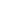

# 🖼️ 素材分類：Shape

> [🏠 主目錄](../../../../README.md) / [images](../../../README.md) / [iCons](../../README.md) / [Coolicons](../README.md) / **Shape**

本目錄共有 `6` 個檔案

| 🎨 預覽 (點擊放大)  | 📋 檔案詳細資訊與連結 |
| :--- | :--- |
|  | **📂 檔名:** `Circle.svg` ✨ **格式:** `Vector (SVG)` ⚖️ **大小:** `307.00B` 📅 **更新:** `2026-03-02`  🚀 **jsDelivr Markdown:** `` 🔗 **直接連結 (Url):** <code>https://cdn.jsdelivr.net/gh/barry028/materials@main/images/iCons/Coolicons/Shape/Circle.svg</code> 📥 [檢視原始檔](Circle.svg) |
|  | **📂 檔名:** `Octagon.svg` ✨ **格式:** `Vector (SVG)` ⚖️ **大小:** `1.37KB` 📅 **更新:** `2026-03-02`  🚀 **jsDelivr Markdown:** `` 🔗 **直接連結 (Url):** <code>https://cdn.jsdelivr.net/gh/barry028/materials@main/images/iCons/Coolicons/Shape/Octagon.svg</code> 📥 [檢視原始檔](Octagon.svg) |
|  | **📂 檔名:** `Shield.svg` ✨ **格式:** `Vector (SVG)` ⚖️ **大小:** `696.00B` 📅 **更新:** `2026-03-02`  🚀 **jsDelivr Markdown:** `` 🔗 **直接連結 (Url):** <code>https://cdn.jsdelivr.net/gh/barry028/materials@main/images/iCons/Coolicons/Shape/Shield.svg</code> 📥 [檢視原始檔](Shield.svg) |
|  | **📂 檔名:** `Square.svg` ✨ **格式:** `Vector (SVG)` ⚖️ **大小:** `689.00B` 📅 **更新:** `2026-03-02`  🚀 **jsDelivr Markdown:** `` 🔗 **直接連結 (Url):** <code>https://cdn.jsdelivr.net/gh/barry028/materials@main/images/iCons/Coolicons/Shape/Square.svg</code> 📥 [檢視原始檔](Square.svg) |
|  | **📂 檔名:** `Triangle.svg` ✨ **格式:** `Vector (SVG)` ⚖️ **大小:** `680.00B` 📅 **更新:** `2026-03-02`  🚀 **jsDelivr Markdown:** `` 🔗 **直接連結 (Url):** <code>https://cdn.jsdelivr.net/gh/barry028/materials@main/images/iCons/Coolicons/Shape/Triangle.svg</code> 📥 [檢視原始檔](Triangle.svg) |
|  | **📂 檔名:** `Wavy.svg` ✨ **格式:** `Vector (SVG)` ⚖️ **大小:** `1.25KB` 📅 **更新:** `2026-03-02`  🚀 **jsDelivr Markdown:** `` 🔗 **直接連結 (Url):** <code>https://cdn.jsdelivr.net/gh/barry028/materials@main/images/iCons/Coolicons/Shape/Wavy.svg</code> 📥 [檢視原始檔](Wavy.svg) |