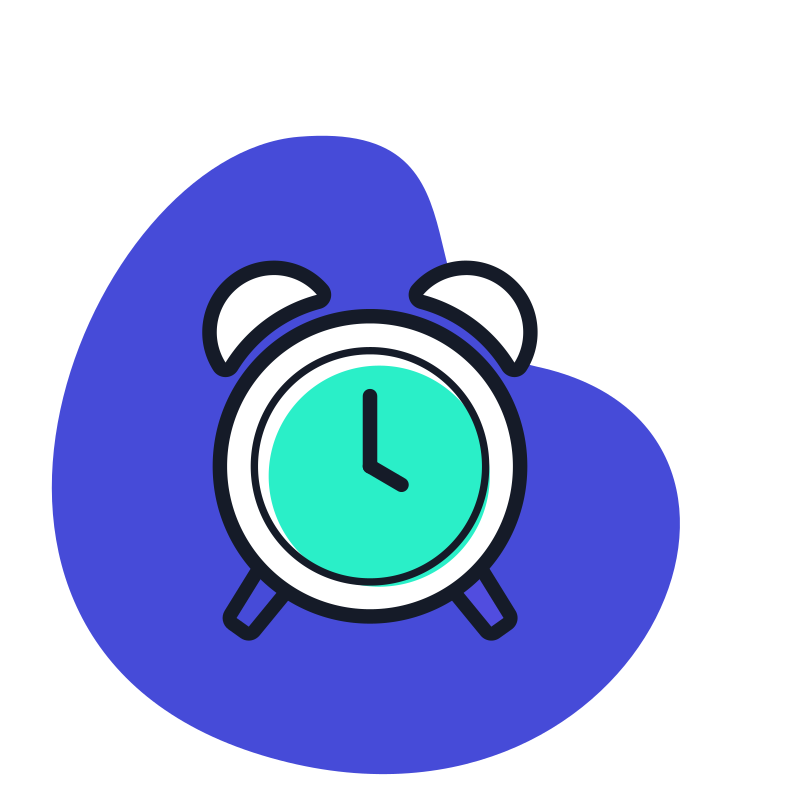
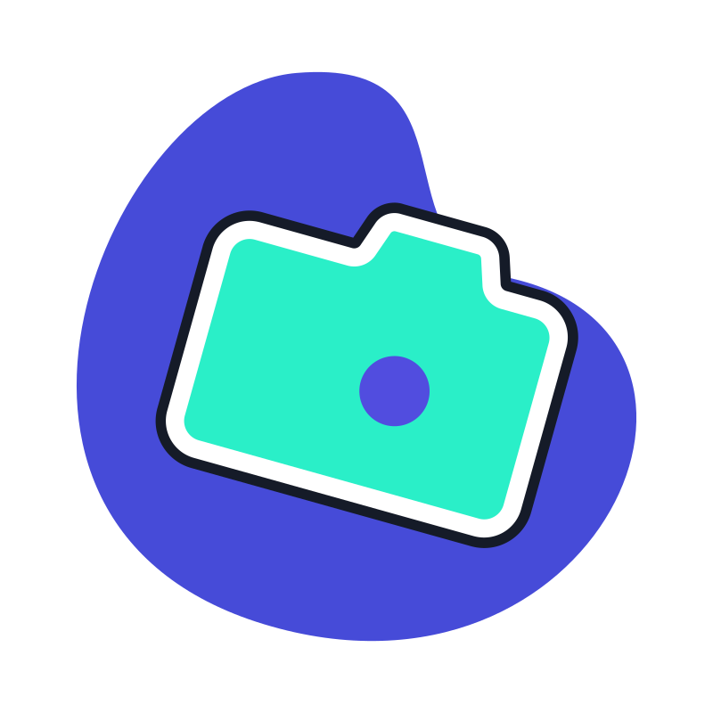
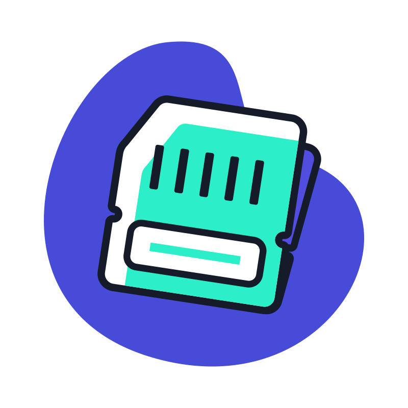
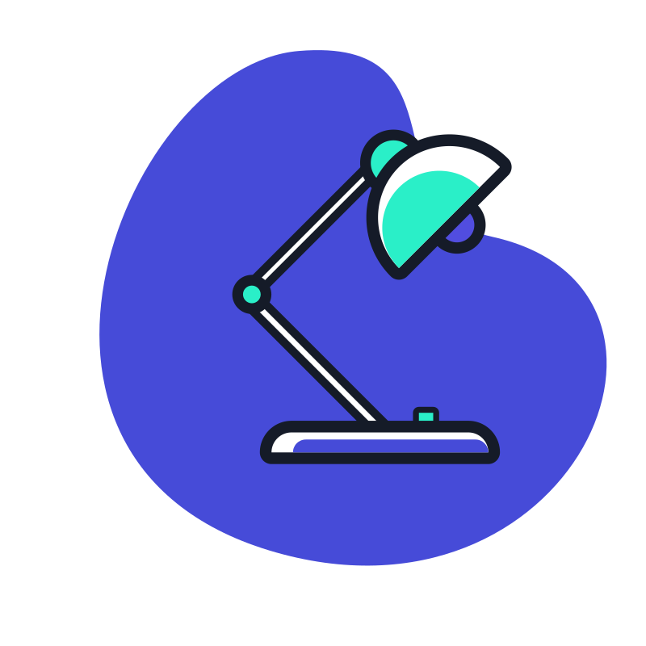
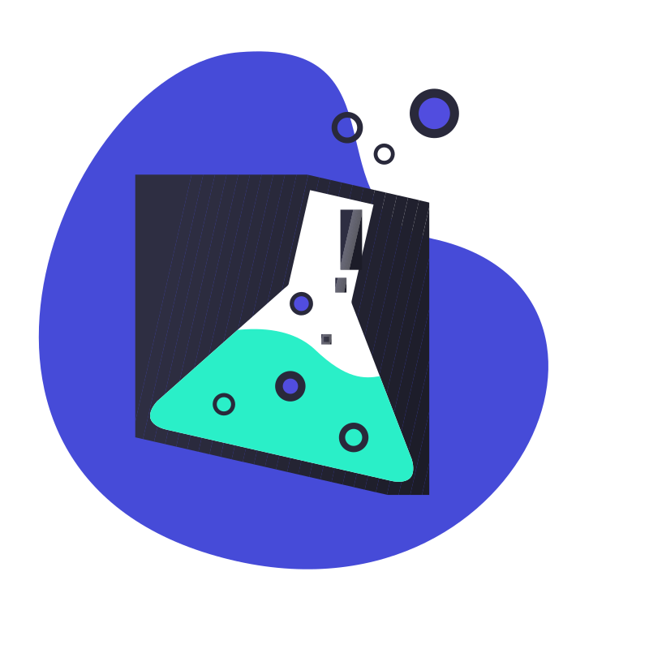
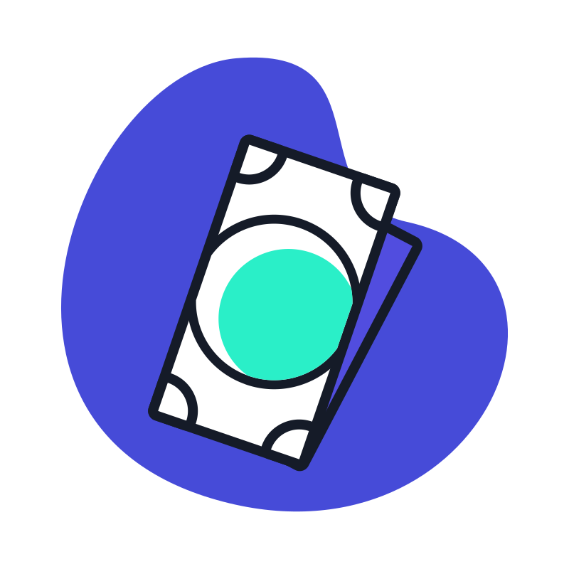
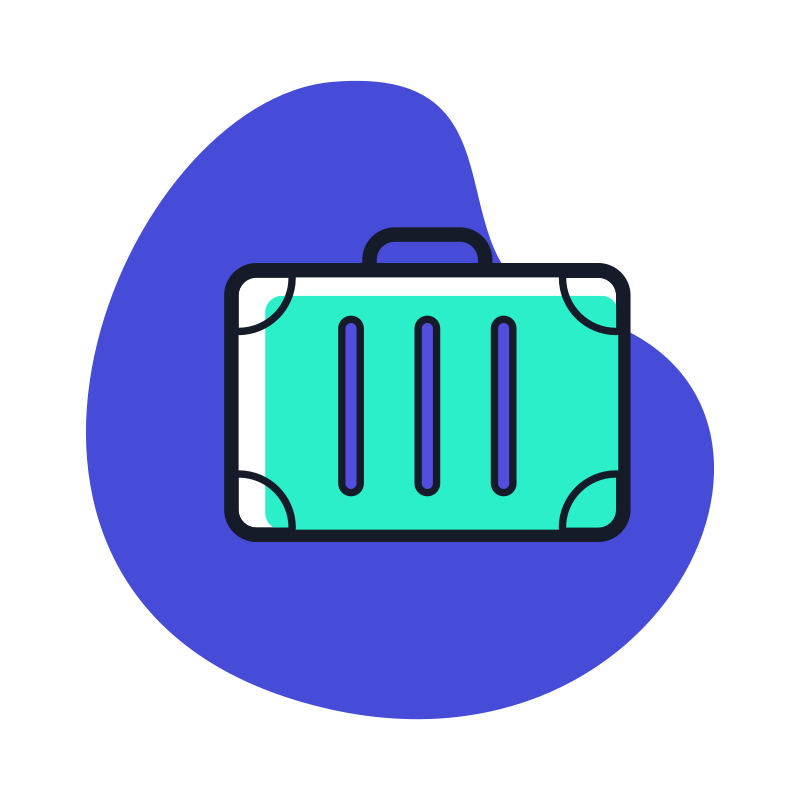
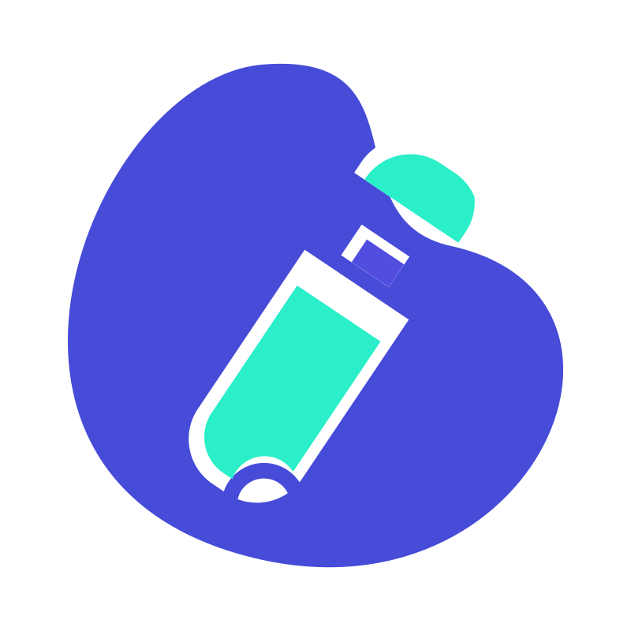
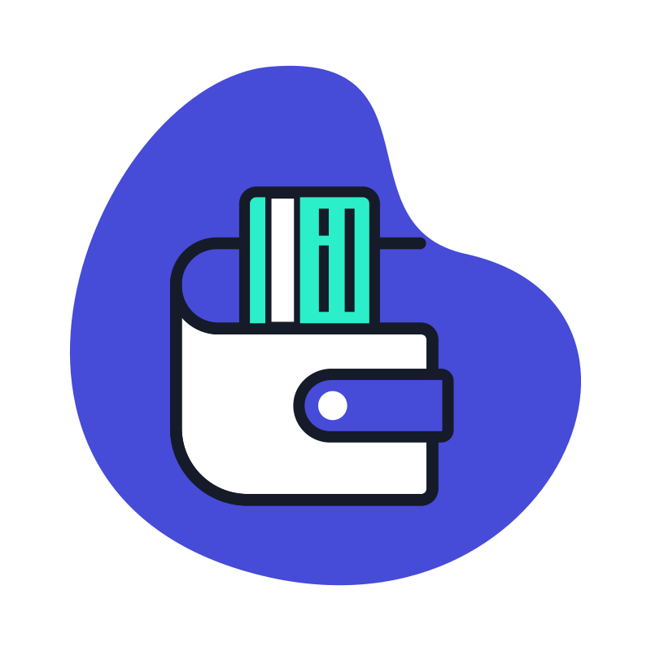

# 🖼️ 素材分類：Daily Life Vectors

> [🏠 主目錄](../../../README.md) / [images](../../README.md) / [iCons](../README.md) / **Daily Life Vectors**

本目錄共有 `20` 個檔案

| 🎨 預覽 (點擊放大)  | 📋 檔案詳細資訊與連結 |
| :--- | :--- |
|  | **📂 檔名:** `alarm-clock.svg` ✨ **格式:** `Vector (SVG)` ⚖️ **大小:** `4.19KB` 📅 **更新:** `2026-03-04`  🚀 **jsDelivr Markdown:** `` 🔗 **直接連結 (Url):** <code>https://cdn.jsdelivr.net/gh/barry028/materials@main/images/iCons/Daily%20Life%20Vectors/alarm-clock.svg</code> 📥 [檢視原始檔](alarm-clock.svg) |
|  | **📂 檔名:** `bedside-table.svg` ✨ **格式:** `Vector (SVG)` ⚖️ **大小:** `2.85KB` 📅 **更新:** `2026-03-04`  🚀 **jsDelivr Markdown:** `` 🔗 **直接連結 (Url):** <code>https://cdn.jsdelivr.net/gh/barry028/materials@main/images/iCons/Daily%20Life%20Vectors/bedside-table.svg</code> 📥 [檢視原始檔](bedside-table.svg) |
|  | **📂 檔名:** `brush.svg` ✨ **格式:** `Vector (SVG)` ⚖️ **大小:** `7.61KB` 📅 **更新:** `2026-03-04`  🚀 **jsDelivr Markdown:** `` 🔗 **直接連結 (Url):** <code>https://cdn.jsdelivr.net/gh/barry028/materials@main/images/iCons/Daily%20Life%20Vectors/brush.svg</code> 📥 [檢視原始檔](brush.svg) |
|  | **📂 檔名:** `camera.svg` ✨ **格式:** `Vector (SVG)` ⚖️ **大小:** `2.89KB` 📅 **更新:** `2026-03-04`  🚀 **jsDelivr Markdown:** `` 🔗 **直接連結 (Url):** <code>https://cdn.jsdelivr.net/gh/barry028/materials@main/images/iCons/Daily%20Life%20Vectors/camera.svg</code> 📥 [檢視原始檔](camera.svg) |
|  | **📂 檔名:** `chip.svg` ✨ **格式:** `Vector (SVG)` ⚖️ **大小:** `5.24KB` 📅 **更新:** `2026-03-04`  🚀 **jsDelivr Markdown:** `` 🔗 **直接連結 (Url):** <code>https://cdn.jsdelivr.net/gh/barry028/materials@main/images/iCons/Daily%20Life%20Vectors/chip.svg</code> 📥 [檢視原始檔](chip.svg) |
|  | **📂 檔名:** `desk-lamp.svg` ✨ **格式:** `Vector (SVG)` ⚖️ **大小:** `3.79KB` 📅 **更新:** `2026-03-04`  🚀 **jsDelivr Markdown:** `` 🔗 **直接連結 (Url):** <code>https://cdn.jsdelivr.net/gh/barry028/materials@main/images/iCons/Daily%20Life%20Vectors/desk-lamp.svg</code> 📥 [檢視原始檔](desk-lamp.svg) |
|  | **📂 檔名:** `earphone.svg` ✨ **格式:** `Vector (SVG)` ⚖️ **大小:** `5.82KB` 📅 **更新:** `2026-03-04`  🚀 **jsDelivr Markdown:** `` 🔗 **直接連結 (Url):** <code>https://cdn.jsdelivr.net/gh/barry028/materials@main/images/iCons/Daily%20Life%20Vectors/earphone.svg</code> 📥 [檢視原始檔](earphone.svg) |
|  | **📂 檔名:** `fan.svg` ✨ **格式:** `Vector (SVG)` ⚖️ **大小:** `5.83KB` 📅 **更新:** `2026-03-04`  🚀 **jsDelivr Markdown:** `` 🔗 **直接連結 (Url):** <code>https://cdn.jsdelivr.net/gh/barry028/materials@main/images/iCons/Daily%20Life%20Vectors/fan.svg</code> 📥 [檢視原始檔](fan.svg) |
|  | **📂 檔名:** `gamepad.svg` ✨ **格式:** `Vector (SVG)` ⚖️ **大小:** `3.54KB` 📅 **更新:** `2026-03-04`  🚀 **jsDelivr Markdown:** `` 🔗 **直接連結 (Url):** <code>https://cdn.jsdelivr.net/gh/barry028/materials@main/images/iCons/Daily%20Life%20Vectors/gamepad.svg</code> 📥 [檢視原始檔](gamepad.svg) |
|  | **📂 檔名:** `liquid.svg` ✨ **格式:** `Vector (SVG)` ⚖️ **大小:** `11.42KB` 📅 **更新:** `2026-03-04`  🚀 **jsDelivr Markdown:** `` 🔗 **直接連結 (Url):** <code>https://cdn.jsdelivr.net/gh/barry028/materials@main/images/iCons/Daily%20Life%20Vectors/liquid.svg</code> 📥 [檢視原始檔](liquid.svg) |
|  | **📂 檔名:** `magnifier.svg` ✨ **格式:** `Vector (SVG)` ⚖️ **大小:** `1.78KB` 📅 **更新:** `2026-03-04`  🚀 **jsDelivr Markdown:** `` 🔗 **直接連結 (Url):** <code>https://cdn.jsdelivr.net/gh/barry028/materials@main/images/iCons/Daily%20Life%20Vectors/magnifier.svg</code> 📥 [檢視原始檔](magnifier.svg) |
|  | **📂 檔名:** `money.svg` ✨ **格式:** `Vector (SVG)` ⚖️ **大小:** `5.22KB` 📅 **更新:** `2026-03-04`  🚀 **jsDelivr Markdown:** `` 🔗 **直接連結 (Url):** <code>https://cdn.jsdelivr.net/gh/barry028/materials@main/images/iCons/Daily%20Life%20Vectors/money.svg</code> 📥 [檢視原始檔](money.svg) |
|  | **📂 檔名:** `movie.svg` ✨ **格式:** `Vector (SVG)` ⚖️ **大小:** `3.12KB` 📅 **更新:** `2026-03-04`  🚀 **jsDelivr Markdown:** `` 🔗 **直接連結 (Url):** <code>https://cdn.jsdelivr.net/gh/barry028/materials@main/images/iCons/Daily%20Life%20Vectors/movie.svg</code> 📥 [檢視原始檔](movie.svg) |
|  | **📂 檔名:** `plan-list.svg` ✨ **格式:** `Vector (SVG)` ⚖️ **大小:** `5.23KB` 📅 **更新:** `2026-03-04`  🚀 **jsDelivr Markdown:** `` 🔗 **直接連結 (Url):** <code>https://cdn.jsdelivr.net/gh/barry028/materials@main/images/iCons/Daily%20Life%20Vectors/plan-list.svg</code> 📥 [檢視原始檔](plan-list.svg) |
|  | **📂 檔名:** `stool.svg` ✨ **格式:** `Vector (SVG)` ⚖️ **大小:** `3.56KB` 📅 **更新:** `2026-03-04`  🚀 **jsDelivr Markdown:** `` 🔗 **直接連結 (Url):** <code>https://cdn.jsdelivr.net/gh/barry028/materials@main/images/iCons/Daily%20Life%20Vectors/stool.svg</code> 📥 [檢視原始檔](stool.svg) |
|  | **📂 檔名:** `suitcase.svg` ✨ **格式:** `Vector (SVG)` ⚖️ **大小:** `3.22KB` 📅 **更新:** `2026-03-04`  🚀 **jsDelivr Markdown:** `` 🔗 **直接連結 (Url):** <code>https://cdn.jsdelivr.net/gh/barry028/materials@main/images/iCons/Daily%20Life%20Vectors/suitcase.svg</code> 📥 [檢視原始檔](suitcase.svg) |
|  | **📂 檔名:** `trophy.svg` ✨ **格式:** `Vector (SVG)` ⚖️ **大小:** `2.89KB` 📅 **更新:** `2026-03-04`  🚀 **jsDelivr Markdown:** `` 🔗 **直接連結 (Url):** <code>https://cdn.jsdelivr.net/gh/barry028/materials@main/images/iCons/Daily%20Life%20Vectors/trophy.svg</code> 📥 [檢視原始檔](trophy.svg) |
|  | **📂 檔名:** `u-disk.svg` ✨ **格式:** `Vector (SVG)` ⚖️ **大小:** `1.91KB` 📅 **更新:** `2026-03-04`  🚀 **jsDelivr Markdown:** `` 🔗 **直接連結 (Url):** <code>https://cdn.jsdelivr.net/gh/barry028/materials@main/images/iCons/Daily%20Life%20Vectors/u-disk.svg</code> 📥 [檢視原始檔](u-disk.svg) |
|  | **📂 檔名:** `wallet.svg` ✨ **格式:** `Vector (SVG)` ⚖️ **大小:** `2.52KB` 📅 **更新:** `2026-03-04`  🚀 **jsDelivr Markdown:** `` 🔗 **直接連結 (Url):** <code>https://cdn.jsdelivr.net/gh/barry028/materials@main/images/iCons/Daily%20Life%20Vectors/wallet.svg</code> 📥 [檢視原始檔](wallet.svg) |
|  | **📂 檔名:** `wardrobe.svg` ✨ **格式:** `Vector (SVG)` ⚖️ **大小:** `2.48KB` 📅 **更新:** `2026-03-04`  🚀 **jsDelivr Markdown:** `` 🔗 **直接連結 (Url):** <code>https://cdn.jsdelivr.net/gh/barry028/materials@main/images/iCons/Daily%20Life%20Vectors/wardrobe.svg</code> 📥 [檢視原始檔](wardrobe.svg) |