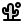
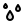

# 🖼️ 素材分類：Weather & Time

> [🏠 主目錄](../../../../../README.md) / [images](../../../../README.md) / [iCons](../../../README.md) / [Dencar Icon Pack](../../README.md) / [Bold Duotone](../README.md) / **Weather & Time**

本目錄共有 `36` 個檔案

| 🎨 預覽 (點擊放大)  | 📋 檔案詳細資訊與連結 |
| :--- | :--- |
|  | **📂 檔名:** `Alarm.svg` ✨ **格式:** `Vector (SVG)` ⚖️ **大小:** `568.00B` 📅 **更新:** `2026-03-04`  🚀 **jsDelivr Markdown:** `` 🔗 **直接連結 (Url):** <code>https://cdn.jsdelivr.net/gh/barry028/materials@main/images/iCons/Dencar%20Icon%20Pack/Bold%20Duotone/Weather%20%26%20Time/Alarm.svg</code> 📥 [檢視原始檔](Alarm.svg) |
|  | **📂 檔名:** `AlarmClock.svg` ✨ **格式:** `Vector (SVG)` ⚖️ **大小:** `1.43KB` 📅 **更新:** `2026-03-04`  🚀 **jsDelivr Markdown:** `` 🔗 **直接連結 (Url):** <code>https://cdn.jsdelivr.net/gh/barry028/materials@main/images/iCons/Dencar%20Icon%20Pack/Bold%20Duotone/Weather%20%26%20Time/AlarmClock.svg</code> 📥 [檢視原始檔](AlarmClock.svg) |
|  | **📂 檔名:** `Calendar.svg` ✨ **格式:** `Vector (SVG)` ⚖️ **大小:** `453.00B` 📅 **更新:** `2026-03-04`  🚀 **jsDelivr Markdown:** `` 🔗 **直接連結 (Url):** <code>https://cdn.jsdelivr.net/gh/barry028/materials@main/images/iCons/Dencar%20Icon%20Pack/Bold%20Duotone/Weather%20%26%20Time/Calendar.svg</code> 📥 [檢視原始檔](Calendar.svg) |
|  | **📂 檔名:** `CalendarAdd.svg` ✨ **格式:** `Vector (SVG)` ⚖️ **大小:** `501.00B` 📅 **更新:** `2026-03-04`  🚀 **jsDelivr Markdown:** `` 🔗 **直接連結 (Url):** <code>https://cdn.jsdelivr.net/gh/barry028/materials@main/images/iCons/Dencar%20Icon%20Pack/Bold%20Duotone/Weather%20%26%20Time/CalendarAdd.svg</code> 📥 [檢視原始檔](CalendarAdd.svg) |
|  | **📂 檔名:** `CalendarSelected.svg` ✨ **格式:** `Vector (SVG)` ⚖️ **大小:** `470.00B` 📅 **更新:** `2026-03-04`  🚀 **jsDelivr Markdown:** `` 🔗 **直接連結 (Url):** <code>https://cdn.jsdelivr.net/gh/barry028/materials@main/images/iCons/Dencar%20Icon%20Pack/Bold%20Duotone/Weather%20%26%20Time/CalendarSelected.svg</code> 📥 [檢視原始檔](CalendarSelected.svg) |
|  | **📂 檔名:** `Chronometer.svg` ✨ **格式:** `Vector (SVG)` ⚖️ **大小:** `526.00B` 📅 **更新:** `2026-03-04`  🚀 **jsDelivr Markdown:** `` 🔗 **直接連結 (Url):** <code>https://cdn.jsdelivr.net/gh/barry028/materials@main/images/iCons/Dencar%20Icon%20Pack/Bold%20Duotone/Weather%20%26%20Time/Chronometer.svg</code> 📥 [檢視原始檔](Chronometer.svg) |
|  | **📂 檔名:** `Clock.svg` ✨ **格式:** `Vector (SVG)` ⚖️ **大小:** `463.00B` 📅 **更新:** `2026-03-04`  🚀 **jsDelivr Markdown:** `` 🔗 **直接連結 (Url):** <code>https://cdn.jsdelivr.net/gh/barry028/materials@main/images/iCons/Dencar%20Icon%20Pack/Bold%20Duotone/Weather%20%26%20Time/Clock.svg</code> 📥 [檢視原始檔](Clock.svg) |
|  | **📂 檔名:** `Cloud.svg` ✨ **格式:** `Vector (SVG)` ⚖️ **大小:** `418.00B` 📅 **更新:** `2026-03-04`  🚀 **jsDelivr Markdown:** `` 🔗 **直接連結 (Url):** <code>https://cdn.jsdelivr.net/gh/barry028/materials@main/images/iCons/Dencar%20Icon%20Pack/Bold%20Duotone/Weather%20%26%20Time/Cloud.svg</code> 📥 [檢視原始檔](Cloud.svg) |
|  | **📂 檔名:** `Cloudy.svg` ✨ **格式:** `Vector (SVG)` ⚖️ **大小:** `1.18KB` 📅 **更新:** `2026-03-04`  🚀 **jsDelivr Markdown:** `` 🔗 **直接連結 (Url):** <code>https://cdn.jsdelivr.net/gh/barry028/materials@main/images/iCons/Dencar%20Icon%20Pack/Bold%20Duotone/Weather%20%26%20Time/Cloudy.svg</code> 📥 [檢視原始檔](Cloudy.svg) |
|  | **📂 檔名:** `CloudyPartially.svg` ✨ **格式:** `Vector (SVG)` ⚖️ **大小:** `976.00B` 📅 **更新:** `2026-03-04`  🚀 **jsDelivr Markdown:** `` 🔗 **直接連結 (Url):** <code>https://cdn.jsdelivr.net/gh/barry028/materials@main/images/iCons/Dencar%20Icon%20Pack/Bold%20Duotone/Weather%20%26%20Time/CloudyPartially.svg</code> 📥 [檢視原始檔](CloudyPartially.svg) |
|  | **📂 檔名:** `Desert.svg` ✨ **格式:** `Vector (SVG)` ⚖️ **大小:** `1.17KB` 📅 **更新:** `2026-03-04`  🚀 **jsDelivr Markdown:** `` 🔗 **直接連結 (Url):** <code>https://cdn.jsdelivr.net/gh/barry028/materials@main/images/iCons/Dencar%20Icon%20Pack/Bold%20Duotone/Weather%20%26%20Time/Desert.svg</code> 📥 [檢視原始檔](Desert.svg) |
|  | **📂 檔名:** `Fog.svg` ✨ **格式:** `Vector (SVG)` ⚖️ **大小:** `868.00B` 📅 **更新:** `2026-03-04`  🚀 **jsDelivr Markdown:** `` 🔗 **直接連結 (Url):** <code>https://cdn.jsdelivr.net/gh/barry028/materials@main/images/iCons/Dencar%20Icon%20Pack/Bold%20Duotone/Weather%20%26%20Time/Fog.svg</code> 📥 [檢視原始檔](Fog.svg) |
|  | **📂 檔名:** `Frozen.svg` ✨ **格式:** `Vector (SVG)` ⚖️ **大小:** `457.00B` 📅 **更新:** `2026-03-04`  🚀 **jsDelivr Markdown:** `` 🔗 **直接連結 (Url):** <code>https://cdn.jsdelivr.net/gh/barry028/materials@main/images/iCons/Dencar%20Icon%20Pack/Bold%20Duotone/Weather%20%26%20Time/Frozen.svg</code> 📥 [檢視原始檔](Frozen.svg) |
|  | **📂 檔名:** `Moon.svg` ✨ **格式:** `Vector (SVG)` ⚖️ **大小:** `669.00B` 📅 **更新:** `2026-03-04`  🚀 **jsDelivr Markdown:** `` 🔗 **直接連結 (Url):** <code>https://cdn.jsdelivr.net/gh/barry028/materials@main/images/iCons/Dencar%20Icon%20Pack/Bold%20Duotone/Weather%20%26%20Time/Moon.svg</code> 📥 [檢視原始檔](Moon.svg) |
|  | **📂 檔名:** `MoonCloud.svg` ✨ **格式:** `Vector (SVG)` ⚖️ **大小:** `1.28KB` 📅 **更新:** `2026-03-04`  🚀 **jsDelivr Markdown:** `` 🔗 **直接連結 (Url):** <code>https://cdn.jsdelivr.net/gh/barry028/materials@main/images/iCons/Dencar%20Icon%20Pack/Bold%20Duotone/Weather%20%26%20Time/MoonCloud.svg</code> 📥 [檢視原始檔](MoonCloud.svg) |
|  | **📂 檔名:** `Rain.svg` ✨ **格式:** `Vector (SVG)` ⚖️ **大小:** `1.08KB` 📅 **更新:** `2026-03-04`  🚀 **jsDelivr Markdown:** `` 🔗 **直接連結 (Url):** <code>https://cdn.jsdelivr.net/gh/barry028/materials@main/images/iCons/Dencar%20Icon%20Pack/Bold%20Duotone/Weather%20%26%20Time/Rain.svg</code> 📥 [檢視原始檔](Rain.svg) |
|  | **📂 檔名:** `Rainbow.svg` ✨ **格式:** `Vector (SVG)` ⚖️ **大小:** `516.00B` 📅 **更新:** `2026-03-04`  🚀 **jsDelivr Markdown:** `` 🔗 **直接連結 (Url):** <code>https://cdn.jsdelivr.net/gh/barry028/materials@main/images/iCons/Dencar%20Icon%20Pack/Bold%20Duotone/Weather%20%26%20Time/Rainbow.svg</code> 📥 [檢視原始檔](Rainbow.svg) |
|  | **📂 檔名:** `Raining.svg` ✨ **格式:** `Vector (SVG)` ⚖️ **大小:** `674.00B` 📅 **更新:** `2026-03-04`  🚀 **jsDelivr Markdown:** `` 🔗 **直接連結 (Url):** <code>https://cdn.jsdelivr.net/gh/barry028/materials@main/images/iCons/Dencar%20Icon%20Pack/Bold%20Duotone/Weather%20%26%20Time/Raining.svg</code> 📥 [檢視原始檔](Raining.svg) |
|  | **📂 檔名:** `ResetTime.svg` ✨ **格式:** `Vector (SVG)` ⚖️ **大小:** `383.00B` 📅 **更新:** `2026-03-04`  🚀 **jsDelivr Markdown:** `` 🔗 **直接連結 (Url):** <code>https://cdn.jsdelivr.net/gh/barry028/materials@main/images/iCons/Dencar%20Icon%20Pack/Bold%20Duotone/Weather%20%26%20Time/ResetTime.svg</code> 📥 [檢視原始檔](ResetTime.svg) |
|  | **📂 檔名:** `SandClock.svg` ✨ **格式:** `Vector (SVG)` ⚖️ **大小:** `965.00B` 📅 **更新:** `2026-03-04`  🚀 **jsDelivr Markdown:** `` 🔗 **直接連結 (Url):** <code>https://cdn.jsdelivr.net/gh/barry028/materials@main/images/iCons/Dencar%20Icon%20Pack/Bold%20Duotone/Weather%20%26%20Time/SandClock.svg</code> 📥 [檢視原始檔](SandClock.svg) |
|  | **📂 檔名:** `SandClockOn.svg` ✨ **格式:** `Vector (SVG)` ⚖️ **大小:** `1.02KB` 📅 **更新:** `2026-03-04`  🚀 **jsDelivr Markdown:** `` 🔗 **直接連結 (Url):** <code>https://cdn.jsdelivr.net/gh/barry028/materials@main/images/iCons/Dencar%20Icon%20Pack/Bold%20Duotone/Weather%20%26%20Time/SandClockOn.svg</code> 📥 [檢視原始檔](SandClockOn.svg) |
|  | **📂 檔名:** `Sea.svg` ✨ **格式:** `Vector (SVG)` ⚖️ **大小:** `752.00B` 📅 **更新:** `2026-03-04`  🚀 **jsDelivr Markdown:** `` 🔗 **直接連結 (Url):** <code>https://cdn.jsdelivr.net/gh/barry028/materials@main/images/iCons/Dencar%20Icon%20Pack/Bold%20Duotone/Weather%20%26%20Time/Sea.svg</code> 📥 [檢視原始檔](Sea.svg) |
|  | **📂 檔名:** `Snow.svg` ✨ **格式:** `Vector (SVG)` ⚖️ **大小:** `464.00B` 📅 **更新:** `2026-03-04`  🚀 **jsDelivr Markdown:** `` 🔗 **直接連結 (Url):** <code>https://cdn.jsdelivr.net/gh/barry028/materials@main/images/iCons/Dencar%20Icon%20Pack/Bold%20Duotone/Weather%20%26%20Time/Snow.svg</code> 📥 [檢視原始檔](Snow.svg) |
|  | **📂 檔名:** `Snowing.svg` ✨ **格式:** `Vector (SVG)` ⚖️ **大小:** `1.39KB` 📅 **更新:** `2026-03-04`  🚀 **jsDelivr Markdown:** `` 🔗 **直接連結 (Url):** <code>https://cdn.jsdelivr.net/gh/barry028/materials@main/images/iCons/Dencar%20Icon%20Pack/Bold%20Duotone/Weather%20%26%20Time/Snowing.svg</code> 📥 [檢視原始檔](Snowing.svg) |
|  | **📂 檔名:** `Stormy.svg` ✨ **格式:** `Vector (SVG)` ⚖️ **大小:** `693.00B` 📅 **更新:** `2026-03-04`  🚀 **jsDelivr Markdown:** `` 🔗 **直接連結 (Url):** <code>https://cdn.jsdelivr.net/gh/barry028/materials@main/images/iCons/Dencar%20Icon%20Pack/Bold%20Duotone/Weather%20%26%20Time/Stormy.svg</code> 📥 [檢視原始檔](Stormy.svg) |
|  | **📂 檔名:** `Sun.svg` ✨ **格式:** `Vector (SVG)` ⚖️ **大小:** `1.20KB` 📅 **更新:** `2026-03-04`  🚀 **jsDelivr Markdown:** `` 🔗 **直接連結 (Url):** <code>https://cdn.jsdelivr.net/gh/barry028/materials@main/images/iCons/Dencar%20Icon%20Pack/Bold%20Duotone/Weather%20%26%20Time/Sun.svg</code> 📥 [檢視原始檔](Sun.svg) |
|  | **📂 檔名:** `Sunny.svg` ✨ **格式:** `Vector (SVG)` ⚖️ **大小:** `607.00B` 📅 **更新:** `2026-03-04`  🚀 **jsDelivr Markdown:** `` 🔗 **直接連結 (Url):** <code>https://cdn.jsdelivr.net/gh/barry028/materials@main/images/iCons/Dencar%20Icon%20Pack/Bold%20Duotone/Weather%20%26%20Time/Sunny.svg</code> 📥 [檢視原始檔](Sunny.svg) |
|  | **📂 檔名:** `SunnyPartially.svg` ✨ **格式:** `Vector (SVG)` ⚖️ **大小:** `1.05KB` 📅 **更新:** `2026-03-04`  🚀 **jsDelivr Markdown:** `` 🔗 **直接連結 (Url):** <code>https://cdn.jsdelivr.net/gh/barry028/materials@main/images/iCons/Dencar%20Icon%20Pack/Bold%20Duotone/Weather%20%26%20Time/SunnyPartially.svg</code> 📥 [檢視原始檔](SunnyPartially.svg) |
|  | **📂 檔名:** `Sunset.svg` ✨ **格式:** `Vector (SVG)` ⚖️ **大小:** `651.00B` 📅 **更新:** `2026-03-04`  🚀 **jsDelivr Markdown:** `` 🔗 **直接連結 (Url):** <code>https://cdn.jsdelivr.net/gh/barry028/materials@main/images/iCons/Dencar%20Icon%20Pack/Bold%20Duotone/Weather%20%26%20Time/Sunset.svg</code> 📥 [檢視原始檔](Sunset.svg) |
|  | **📂 檔名:** `ThermometerDown.svg` ✨ **格式:** `Vector (SVG)` ⚖️ **大小:** `899.00B` 📅 **更新:** `2026-03-04`  🚀 **jsDelivr Markdown:** `` 🔗 **直接連結 (Url):** <code>https://cdn.jsdelivr.net/gh/barry028/materials@main/images/iCons/Dencar%20Icon%20Pack/Bold%20Duotone/Weather%20%26%20Time/ThermometerDown.svg</code> 📥 [檢視原始檔](ThermometerDown.svg) |
|  | **📂 檔名:** `ThermometerHigh.svg` ✨ **格式:** `Vector (SVG)` ⚖️ **大小:** `879.00B` 📅 **更新:** `2026-03-04`  🚀 **jsDelivr Markdown:** `` 🔗 **直接連結 (Url):** <code>https://cdn.jsdelivr.net/gh/barry028/materials@main/images/iCons/Dencar%20Icon%20Pack/Bold%20Duotone/Weather%20%26%20Time/ThermometerHigh.svg</code> 📥 [檢視原始檔](ThermometerHigh.svg) |
|  | **📂 檔名:** `ThermometerMidHigh.svg` ✨ **格式:** `Vector (SVG)` ⚖️ **大小:** `880.00B` 📅 **更新:** `2026-03-04`  🚀 **jsDelivr Markdown:** `` 🔗 **直接連結 (Url):** <code>https://cdn.jsdelivr.net/gh/barry028/materials@main/images/iCons/Dencar%20Icon%20Pack/Bold%20Duotone/Weather%20%26%20Time/ThermometerMidHigh.svg</code> 📥 [檢視原始檔](ThermometerMidHigh.svg) |
|  | **📂 檔名:** `ThermometerMidLow.svg` ✨ **格式:** `Vector (SVG)` ⚖️ **大小:** `880.00B` 📅 **更新:** `2026-03-04`  🚀 **jsDelivr Markdown:** `` 🔗 **直接連結 (Url):** <code>https://cdn.jsdelivr.net/gh/barry028/materials@main/images/iCons/Dencar%20Icon%20Pack/Bold%20Duotone/Weather%20%26%20Time/ThermometerMidLow.svg</code> 📥 [檢視原始檔](ThermometerMidLow.svg) |
|  | **📂 檔名:** `Thunder.svg` ✨ **格式:** `Vector (SVG)` ⚖️ **大小:** `245.00B` 📅 **更新:** `2026-03-04`  🚀 **jsDelivr Markdown:** `` 🔗 **直接連結 (Url):** <code>https://cdn.jsdelivr.net/gh/barry028/materials@main/images/iCons/Dencar%20Icon%20Pack/Bold%20Duotone/Weather%20%26%20Time/Thunder.svg</code> 📥 [檢視原始檔](Thunder.svg) |
|  | **📂 檔名:** `Tornado.svg` ✨ **格式:** `Vector (SVG)` ⚖️ **大小:** `353.00B` 📅 **更新:** `2026-03-04`  🚀 **jsDelivr Markdown:** `` 🔗 **直接連結 (Url):** <code>https://cdn.jsdelivr.net/gh/barry028/materials@main/images/iCons/Dencar%20Icon%20Pack/Bold%20Duotone/Weather%20%26%20Time/Tornado.svg</code> 📥 [檢視原始檔](Tornado.svg) |
|  | **📂 檔名:** `Watch.svg` ✨ **格式:** `Vector (SVG)` ⚖️ **大小:** `1.02KB` 📅 **更新:** `2026-03-04`  🚀 **jsDelivr Markdown:** `` 🔗 **直接連結 (Url):** <code>https://cdn.jsdelivr.net/gh/barry028/materials@main/images/iCons/Dencar%20Icon%20Pack/Bold%20Duotone/Weather%20%26%20Time/Watch.svg</code> 📥 [檢視原始檔](Watch.svg) |