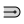
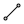
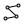
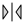
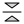
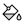
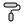
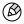
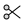

# 🖼️ 素材分類：Design

> [🏠 主目錄](../../../../../README.md) / [images](../../../../README.md) / [iCons](../../../README.md) / [Dencar Icon Pack](../../README.md) / [Duotone](../README.md) / **Design**

本目錄共有 `86` 個檔案

| 🎨 預覽 (點擊放大)  | 📋 檔案詳細資訊與連結 |
| :--- | :--- |
|  | **📂 檔名:** `3D.svg` ✨ **格式:** `Vector (SVG)` ⚖️ **大小:** `374.00B` 📅 **更新:** `2026-03-03`  🚀 **jsDelivr Markdown:** `` 🔗 **直接連結 (Url):** <code>https://cdn.jsdelivr.net/gh/barry028/materials@main/images/iCons/Dencar%20Icon%20Pack/Duotone/Design/3D.svg</code> 📥 [檢視原始檔](3D.svg) |
|  | **📂 檔名:** `AlignBottom.svg` ✨ **格式:** `Vector (SVG)` ⚖️ **大小:** `733.00B` 📅 **更新:** `2026-03-03`  🚀 **jsDelivr Markdown:** `` 🔗 **直接連結 (Url):** <code>https://cdn.jsdelivr.net/gh/barry028/materials@main/images/iCons/Dencar%20Icon%20Pack/Duotone/Design/AlignBottom.svg</code> 📥 [檢視原始檔](AlignBottom.svg) |
|  | **📂 檔名:** `AlignCenterHorizontal.svg` ✨ **格式:** `Vector (SVG)` ⚖️ **大小:** `780.00B` 📅 **更新:** `2026-03-03`  🚀 **jsDelivr Markdown:** `` 🔗 **直接連結 (Url):** <code>https://cdn.jsdelivr.net/gh/barry028/materials@main/images/iCons/Dencar%20Icon%20Pack/Duotone/Design/AlignCenterHorizontal.svg</code> 📥 [檢視原始檔](AlignCenterHorizontal.svg) |
|  | **📂 檔名:** `AlignCenterVertical.svg` ✨ **格式:** `Vector (SVG)` ⚖️ **大小:** `753.00B` 📅 **更新:** `2026-03-03`  🚀 **jsDelivr Markdown:** `` 🔗 **直接連結 (Url):** <code>https://cdn.jsdelivr.net/gh/barry028/materials@main/images/iCons/Dencar%20Icon%20Pack/Duotone/Design/AlignCenterVertical.svg</code> 📥 [檢視原始檔](AlignCenterVertical.svg) |
|  | **📂 檔名:** `AlignLeft.svg` ✨ **格式:** `Vector (SVG)` ⚖️ **大小:** `737.00B` 📅 **更新:** `2026-03-03`  🚀 **jsDelivr Markdown:** `` 🔗 **直接連結 (Url):** <code>https://cdn.jsdelivr.net/gh/barry028/materials@main/images/iCons/Dencar%20Icon%20Pack/Duotone/Design/AlignLeft.svg</code> 📥 [檢視原始檔](AlignLeft.svg) |
|  | **📂 檔名:** `AlignRight.svg` ✨ **格式:** `Vector (SVG)` ⚖️ **大小:** `732.00B` 📅 **更新:** `2026-03-03`  🚀 **jsDelivr Markdown:** `` 🔗 **直接連結 (Url):** <code>https://cdn.jsdelivr.net/gh/barry028/materials@main/images/iCons/Dencar%20Icon%20Pack/Duotone/Design/AlignRight.svg</code> 📥 [檢視原始檔](AlignRight.svg) |
|  | **📂 檔名:** `AlignTop.svg` ✨ **格式:** `Vector (SVG)` ⚖️ **大小:** `737.00B` 📅 **更新:** `2026-03-03`  🚀 **jsDelivr Markdown:** `` 🔗 **直接連結 (Url):** <code>https://cdn.jsdelivr.net/gh/barry028/materials@main/images/iCons/Dencar%20Icon%20Pack/Duotone/Design/AlignTop.svg</code> 📥 [檢視原始檔](AlignTop.svg) |
|  | **📂 檔名:** `BandAid.svg` ✨ **格式:** `Vector (SVG)` ⚖️ **大小:** `823.00B` 📅 **更新:** `2026-03-03`  🚀 **jsDelivr Markdown:** `` 🔗 **直接連結 (Url):** <code>https://cdn.jsdelivr.net/gh/barry028/materials@main/images/iCons/Dencar%20Icon%20Pack/Duotone/Design/BandAid.svg</code> 📥 [檢視原始檔](BandAid.svg) |
|  | **📂 檔名:** `Blend.svg` ✨ **格式:** `Vector (SVG)` ⚖️ **大小:** `532.00B` 📅 **更新:** `2026-03-03`  🚀 **jsDelivr Markdown:** `` 🔗 **直接連結 (Url):** <code>https://cdn.jsdelivr.net/gh/barry028/materials@main/images/iCons/Dencar%20Icon%20Pack/Duotone/Design/Blend.svg</code> 📥 [檢視原始檔](Blend.svg) |
|  | **📂 檔名:** `Blur.svg` ✨ **格式:** `Vector (SVG)` ⚖️ **大小:** `1.10KB` 📅 **更新:** `2026-03-03`  🚀 **jsDelivr Markdown:** `` 🔗 **直接連結 (Url):** <code>https://cdn.jsdelivr.net/gh/barry028/materials@main/images/iCons/Dencar%20Icon%20Pack/Duotone/Design/Blur.svg</code> 📥 [檢視原始檔](Blur.svg) |
|  | **📂 檔名:** `BoundSelection.svg` ✨ **格式:** `Vector (SVG)` ⚖️ **大小:** `1.25KB` 📅 **更新:** `2026-03-03`  🚀 **jsDelivr Markdown:** `` 🔗 **直接連結 (Url):** <code>https://cdn.jsdelivr.net/gh/barry028/materials@main/images/iCons/Dencar%20Icon%20Pack/Duotone/Design/BoundSelection.svg</code> 📥 [檢視原始檔](BoundSelection.svg) |
|  | **📂 檔名:** `Brush.svg` ✨ **格式:** `Vector (SVG)` ⚖️ **大小:** `1.40KB` 📅 **更新:** `2026-03-03`  🚀 **jsDelivr Markdown:** `` 🔗 **直接連結 (Url):** <code>https://cdn.jsdelivr.net/gh/barry028/materials@main/images/iCons/Dencar%20Icon%20Pack/Duotone/Design/Brush.svg</code> 📥 [檢視原始檔](Brush.svg) |
|  | **📂 檔名:** `ColorsWatch.svg` ✨ **格式:** `Vector (SVG)` ⚖️ **大小:** `1.23KB` 📅 **更新:** `2026-03-03`  🚀 **jsDelivr Markdown:** `` 🔗 **直接連結 (Url):** <code>https://cdn.jsdelivr.net/gh/barry028/materials@main/images/iCons/Dencar%20Icon%20Pack/Duotone/Design/ColorsWatch.svg</code> 📥 [檢視原始檔](ColorsWatch.svg) |
|  | **📂 檔名:** `Component.svg` ✨ **格式:** `Vector (SVG)` ⚖️ **大小:** `739.00B` 📅 **更新:** `2026-03-03`  🚀 **jsDelivr Markdown:** `` 🔗 **直接連結 (Url):** <code>https://cdn.jsdelivr.net/gh/barry028/materials@main/images/iCons/Dencar%20Icon%20Pack/Duotone/Design/Component.svg</code> 📥 [檢視原始檔](Component.svg) |
|  | **📂 檔名:** `ComponentChildren.svg` ✨ **格式:** `Vector (SVG)` ⚖️ **大小:** `222.00B` 📅 **更新:** `2026-03-03`  🚀 **jsDelivr Markdown:** `` 🔗 **直接連結 (Url):** <code>https://cdn.jsdelivr.net/gh/barry028/materials@main/images/iCons/Dencar%20Icon%20Pack/Duotone/Design/ComponentChildren.svg</code> 📥 [檢視原始檔](ComponentChildren.svg) |
|  | **📂 檔名:** `CornerBevel.svg` ✨ **格式:** `Vector (SVG)` ⚖️ **大小:** `194.00B` 📅 **更新:** `2026-03-03`  🚀 **jsDelivr Markdown:** `` 🔗 **直接連結 (Url):** <code>https://cdn.jsdelivr.net/gh/barry028/materials@main/images/iCons/Dencar%20Icon%20Pack/Duotone/Design/CornerBevel.svg</code> 📥 [檢視原始檔](CornerBevel.svg) |
|  | **📂 檔名:** `CornerRounded.svg` ✨ **格式:** `Vector (SVG)` ⚖️ **大小:** `214.00B` 📅 **更新:** `2026-03-03`  🚀 **jsDelivr Markdown:** `` 🔗 **直接連結 (Url):** <code>https://cdn.jsdelivr.net/gh/barry028/materials@main/images/iCons/Dencar%20Icon%20Pack/Duotone/Design/CornerRounded.svg</code> 📥 [檢視原始檔](CornerRounded.svg) |
|  | **📂 檔名:** `CornerStraight.svg` ✨ **格式:** `Vector (SVG)` ⚖️ **大小:** `188.00B` 📅 **更新:** `2026-03-03`  🚀 **jsDelivr Markdown:** `` 🔗 **直接連結 (Url):** <code>https://cdn.jsdelivr.net/gh/barry028/materials@main/images/iCons/Dencar%20Icon%20Pack/Duotone/Design/CornerStraight.svg</code> 📥 [檢視原始檔](CornerStraight.svg) |
|  | **📂 檔名:** `CrayonCircle.svg` ✨ **格式:** `Vector (SVG)` ⚖️ **大小:** `753.00B` 📅 **更新:** `2026-03-03`  🚀 **jsDelivr Markdown:** `` 🔗 **直接連結 (Url):** <code>https://cdn.jsdelivr.net/gh/barry028/materials@main/images/iCons/Dencar%20Icon%20Pack/Duotone/Design/CrayonCircle.svg</code> 📥 [檢視原始檔](CrayonCircle.svg) |
|  | **📂 檔名:** `CrayonRounded.svg` ✨ **格式:** `Vector (SVG)` ⚖️ **大小:** `622.00B` 📅 **更新:** `2026-03-03`  🚀 **jsDelivr Markdown:** `` 🔗 **直接連結 (Url):** <code>https://cdn.jsdelivr.net/gh/barry028/materials@main/images/iCons/Dencar%20Icon%20Pack/Duotone/Design/CrayonRounded.svg</code> 📥 [檢視原始檔](CrayonRounded.svg) |
|  | **📂 檔名:** `Crop.svg` ✨ **格式:** `Vector (SVG)` ⚖️ **大小:** `347.00B` 📅 **更新:** `2026-03-03`  🚀 **jsDelivr Markdown:** `` 🔗 **直接連結 (Url):** <code>https://cdn.jsdelivr.net/gh/barry028/materials@main/images/iCons/Dencar%20Icon%20Pack/Duotone/Design/Crop.svg</code> 📥 [檢視原始檔](Crop.svg) |
|  | **📂 檔名:** `DashCapNone.svg` ✨ **格式:** `Vector (SVG)` ⚖️ **大小:** `511.00B` 📅 **更新:** `2026-03-03`  🚀 **jsDelivr Markdown:** `` 🔗 **直接連結 (Url):** <code>https://cdn.jsdelivr.net/gh/barry028/materials@main/images/iCons/Dencar%20Icon%20Pack/Duotone/Design/DashCapNone.svg</code> 📥 [檢視原始檔](DashCapNone.svg) |
|  | **📂 檔名:** `DashCapRounded.svg` ✨ **格式:** `Vector (SVG)` ⚖️ **大小:** `614.00B` 📅 **更新:** `2026-03-03`  🚀 **jsDelivr Markdown:** `` 🔗 **直接連結 (Url):** <code>https://cdn.jsdelivr.net/gh/barry028/materials@main/images/iCons/Dencar%20Icon%20Pack/Duotone/Design/DashCapRounded.svg</code> 📥 [檢視原始檔](DashCapRounded.svg) |
|  | **📂 檔名:** `DashCapSquare.svg` ✨ **格式:** `Vector (SVG)` ⚖️ **大小:** `615.00B` 📅 **更新:** `2026-03-03`  🚀 **jsDelivr Markdown:** `` 🔗 **直接連結 (Url):** <code>https://cdn.jsdelivr.net/gh/barry028/materials@main/images/iCons/Dencar%20Icon%20Pack/Duotone/Design/DashCapSquare.svg</code> 📥 [檢視原始檔](DashCapSquare.svg) |
|  | **📂 檔名:** `DistributionHorizontal.svg` ✨ **格式:** `Vector (SVG)` ⚖️ **大小:** `466.00B` 📅 **更新:** `2026-03-03`  🚀 **jsDelivr Markdown:** `` 🔗 **直接連結 (Url):** <code>https://cdn.jsdelivr.net/gh/barry028/materials@main/images/iCons/Dencar%20Icon%20Pack/Duotone/Design/DistributionHorizontal.svg</code> 📥 [檢視原始檔](DistributionHorizontal.svg) |
|  | **📂 檔名:** `DistributionVertical.svg` ✨ **格式:** `Vector (SVG)` ⚖️ **大小:** `487.00B` 📅 **更新:** `2026-03-03`  🚀 **jsDelivr Markdown:** `` 🔗 **直接連結 (Url):** <code>https://cdn.jsdelivr.net/gh/barry028/materials@main/images/iCons/Dencar%20Icon%20Pack/Duotone/Design/DistributionVertical.svg</code> 📥 [檢視原始檔](DistributionVertical.svg) |
|  | **📂 檔名:** `Erased.svg` ✨ **格式:** `Vector (SVG)` ⚖️ **大小:** `709.00B` 📅 **更新:** `2026-03-03`  🚀 **jsDelivr Markdown:** `` 🔗 **直接連結 (Url):** <code>https://cdn.jsdelivr.net/gh/barry028/materials@main/images/iCons/Dencar%20Icon%20Pack/Duotone/Design/Erased.svg</code> 📥 [檢視原始檔](Erased.svg) |
|  | **📂 檔名:** `Eraser.svg` ✨ **格式:** `Vector (SVG)` ⚖️ **大小:** `719.00B` 📅 **更新:** `2026-03-03`  🚀 **jsDelivr Markdown:** `` 🔗 **直接連結 (Url):** <code>https://cdn.jsdelivr.net/gh/barry028/materials@main/images/iCons/Dencar%20Icon%20Pack/Duotone/Design/Eraser.svg</code> 📥 [檢視原始檔](Eraser.svg) |
|  | **📂 檔名:** `Exclude.svg` ✨ **格式:** `Vector (SVG)` ⚖️ **大小:** `368.00B` 📅 **更新:** `2026-03-03`  🚀 **jsDelivr Markdown:** `` 🔗 **直接連結 (Url):** <code>https://cdn.jsdelivr.net/gh/barry028/materials@main/images/iCons/Dencar%20Icon%20Pack/Duotone/Design/Exclude.svg</code> 📥 [檢視原始檔](Exclude.svg) |
|  | **📂 檔名:** `Expand.svg` ✨ **格式:** `Vector (SVG)` ⚖️ **大小:** `801.00B` 📅 **更新:** `2026-03-03`  🚀 **jsDelivr Markdown:** `` 🔗 **直接連結 (Url):** <code>https://cdn.jsdelivr.net/gh/barry028/materials@main/images/iCons/Dencar%20Icon%20Pack/Duotone/Design/Expand.svg</code> 📥 [檢視原始檔](Expand.svg) |
|  | **📂 檔名:** `ExtremeRounded.svg` ✨ **格式:** `Vector (SVG)` ⚖️ **大小:** `340.00B` 📅 **更新:** `2026-03-03`  🚀 **jsDelivr Markdown:** `` 🔗 **直接連結 (Url):** <code>https://cdn.jsdelivr.net/gh/barry028/materials@main/images/iCons/Dencar%20Icon%20Pack/Duotone/Design/ExtremeRounded.svg</code> 📥 [檢視原始檔](ExtremeRounded.svg) |
|  | **📂 檔名:** `ExtremeSquared.svg` ✨ **格式:** `Vector (SVG)` ⚖️ **大小:** `342.00B` 📅 **更新:** `2026-03-03`  🚀 **jsDelivr Markdown:** `` 🔗 **直接連結 (Url):** <code>https://cdn.jsdelivr.net/gh/barry028/materials@main/images/iCons/Dencar%20Icon%20Pack/Duotone/Design/ExtremeSquared.svg</code> 📥 [檢視原始檔](ExtremeSquared.svg) |
|  | **📂 檔名:** `Eyedropper.svg` ✨ **格式:** `Vector (SVG)` ⚖️ **大小:** `1.42KB` 📅 **更新:** `2026-03-03`  🚀 **jsDelivr Markdown:** `` 🔗 **直接連結 (Url):** <code>https://cdn.jsdelivr.net/gh/barry028/materials@main/images/iCons/Dencar%20Icon%20Pack/Duotone/Design/Eyedropper.svg</code> 📥 [檢視原始檔](Eyedropper.svg) |
|  | **📂 檔名:** `EyedropperFilled.svg` ✨ **格式:** `Vector (SVG)` ⚖️ **大小:** `1.73KB` 📅 **更新:** `2026-03-03`  🚀 **jsDelivr Markdown:** `` 🔗 **直接連結 (Url):** <code>https://cdn.jsdelivr.net/gh/barry028/materials@main/images/iCons/Dencar%20Icon%20Pack/Duotone/Design/EyedropperFilled.svg</code> 📥 [檢視原始檔](EyedropperFilled.svg) |
|  | **📂 檔名:** `Flow.svg` ✨ **格式:** `Vector (SVG)` ⚖️ **大小:** `512.00B` 📅 **更新:** `2026-03-03`  🚀 **jsDelivr Markdown:** `` 🔗 **直接連結 (Url):** <code>https://cdn.jsdelivr.net/gh/barry028/materials@main/images/iCons/Dencar%20Icon%20Pack/Duotone/Design/Flow.svg</code> 📥 [檢視原始檔](Flow.svg) |
|  | **📂 檔名:** `Frame.svg` ✨ **格式:** `Vector (SVG)` ⚖️ **大小:** `283.00B` 📅 **更新:** `2026-03-03`  🚀 **jsDelivr Markdown:** `` 🔗 **直接連結 (Url):** <code>https://cdn.jsdelivr.net/gh/barry028/materials@main/images/iCons/Dencar%20Icon%20Pack/Duotone/Design/Frame.svg</code> 📥 [檢視原始檔](Frame.svg) |
|  | **📂 檔名:** `Graffiti.svg` ✨ **格式:** `Vector (SVG)` ⚖️ **大小:** `1.27KB` 📅 **更新:** `2026-03-03`  🚀 **jsDelivr Markdown:** `` 🔗 **直接連結 (Url):** <code>https://cdn.jsdelivr.net/gh/barry028/materials@main/images/iCons/Dencar%20Icon%20Pack/Duotone/Design/Graffiti.svg</code> 📥 [檢視原始檔](Graffiti.svg) |
|  | **📂 檔名:** `Grid.svg` ✨ **格式:** `Vector (SVG)` ⚖️ **大小:** `280.00B` 📅 **更新:** `2026-03-03`  🚀 **jsDelivr Markdown:** `` 🔗 **直接連結 (Url):** <code>https://cdn.jsdelivr.net/gh/barry028/materials@main/images/iCons/Dencar%20Icon%20Pack/Duotone/Design/Grid.svg</code> 📥 [檢視原始檔](Grid.svg) |
|  | **📂 檔名:** `HighlighterCircle.svg` ✨ **格式:** `Vector (SVG)` ⚖️ **大小:** `777.00B` 📅 **更新:** `2026-03-03`  🚀 **jsDelivr Markdown:** `` 🔗 **直接連結 (Url):** <code>https://cdn.jsdelivr.net/gh/barry028/materials@main/images/iCons/Dencar%20Icon%20Pack/Duotone/Design/HighlighterCircle.svg</code> 📥 [檢視原始檔](HighlighterCircle.svg) |
|  | **📂 檔名:** `HighlighterRounded.svg` ✨ **格式:** `Vector (SVG)` ⚖️ **大小:** `908.00B` 📅 **更新:** `2026-03-03`  🚀 **jsDelivr Markdown:** `` 🔗 **直接連結 (Url):** <code>https://cdn.jsdelivr.net/gh/barry028/materials@main/images/iCons/Dencar%20Icon%20Pack/Duotone/Design/HighlighterRounded.svg</code> 📥 [檢視原始檔](HighlighterRounded.svg) |
|  | **📂 檔名:** `Intersect.svg` ✨ **格式:** `Vector (SVG)` ⚖️ **大小:** `348.00B` 📅 **更新:** `2026-03-03`  🚀 **jsDelivr Markdown:** `` 🔗 **直接連結 (Url):** <code>https://cdn.jsdelivr.net/gh/barry028/materials@main/images/iCons/Dencar%20Icon%20Pack/Duotone/Design/Intersect.svg</code> 📥 [檢視原始檔](Intersect.svg) |
|  | **📂 檔名:** `Layers.svg` ✨ **格式:** `Vector (SVG)` ⚖️ **大小:** `428.00B` 📅 **更新:** `2026-03-03`  🚀 **jsDelivr Markdown:** `` 🔗 **直接連結 (Url):** <code>https://cdn.jsdelivr.net/gh/barry028/materials@main/images/iCons/Dencar%20Icon%20Pack/Duotone/Design/Layers.svg</code> 📥 [檢視原始檔](Layers.svg) |
|  | **📂 檔名:** `Library.svg` ✨ **格式:** `Vector (SVG)` ⚖️ **大小:** `670.00B` 📅 **更新:** `2026-03-03`  🚀 **jsDelivr Markdown:** `` 🔗 **直接連結 (Url):** <code>https://cdn.jsdelivr.net/gh/barry028/materials@main/images/iCons/Dencar%20Icon%20Pack/Duotone/Design/Library.svg</code> 📥 [檢視原始檔](Library.svg) |
|  | **📂 檔名:** `Line.svg` ✨ **格式:** `Vector (SVG)` ⚖️ **大小:** `746.00B` 📅 **更新:** `2026-03-03`  🚀 **jsDelivr Markdown:** `` 🔗 **直接連結 (Url):** <code>https://cdn.jsdelivr.net/gh/barry028/materials@main/images/iCons/Dencar%20Icon%20Pack/Duotone/Design/Line.svg</code> 📥 [檢視原始檔](Line.svg) |
|  | **📂 檔名:** `LineBroken.svg` ✨ **格式:** `Vector (SVG)` ⚖️ **大小:** `1.93KB` 📅 **更新:** `2026-03-03`  🚀 **jsDelivr Markdown:** `` 🔗 **直接連結 (Url):** <code>https://cdn.jsdelivr.net/gh/barry028/materials@main/images/iCons/Dencar%20Icon%20Pack/Duotone/Design/LineBroken.svg</code> 📥 [檢視原始檔](LineBroken.svg) |
|  | **📂 檔名:** `LineDashed.svg` ✨ **格式:** `Vector (SVG)` ⚖️ **大小:** `216.00B` 📅 **更新:** `2026-03-03`  🚀 **jsDelivr Markdown:** `` 🔗 **直接連結 (Url):** <code>https://cdn.jsdelivr.net/gh/barry028/materials@main/images/iCons/Dencar%20Icon%20Pack/Duotone/Design/LineDashed.svg</code> 📥 [檢視原始檔](LineDashed.svg) |
|  | **📂 檔名:** `LineDotted.svg` ✨ **格式:** `Vector (SVG)` ⚖️ **大小:** `250.00B` 📅 **更新:** `2026-03-03`  🚀 **jsDelivr Markdown:** `` 🔗 **直接連結 (Url):** <code>https://cdn.jsdelivr.net/gh/barry028/materials@main/images/iCons/Dencar%20Icon%20Pack/Duotone/Design/LineDotted.svg</code> 📥 [檢視原始檔](LineDotted.svg) |
|  | **📂 檔名:** `LineStraight.svg` ✨ **格式:** `Vector (SVG)` ⚖️ **大小:** `188.00B` 📅 **更新:** `2026-03-03`  🚀 **jsDelivr Markdown:** `` 🔗 **直接連結 (Url):** <code>https://cdn.jsdelivr.net/gh/barry028/materials@main/images/iCons/Dencar%20Icon%20Pack/Duotone/Design/LineStraight.svg</code> 📥 [檢視原始檔](LineStraight.svg) |
|  | **📂 檔名:** `MagicWand.svg` ✨ **格式:** `Vector (SVG)` ⚖️ **大小:** `759.00B` 📅 **更新:** `2026-03-03`  🚀 **jsDelivr Markdown:** `` 🔗 **直接連結 (Url):** <code>https://cdn.jsdelivr.net/gh/barry028/materials@main/images/iCons/Dencar%20Icon%20Pack/Duotone/Design/MagicWand.svg</code> 📥 [檢視原始檔](MagicWand.svg) |
|  | **📂 檔名:** `MarkerCircle.svg` ✨ **格式:** `Vector (SVG)` ⚖️ **大小:** `734.00B` 📅 **更新:** `2026-03-03`  🚀 **jsDelivr Markdown:** `` 🔗 **直接連結 (Url):** <code>https://cdn.jsdelivr.net/gh/barry028/materials@main/images/iCons/Dencar%20Icon%20Pack/Duotone/Design/MarkerCircle.svg</code> 📥 [檢視原始檔](MarkerCircle.svg) |
|  | **📂 檔名:** `MarkerRounded.svg` ✨ **格式:** `Vector (SVG)` ⚖️ **大小:** `801.00B` 📅 **更新:** `2026-03-03`  🚀 **jsDelivr Markdown:** `` 🔗 **直接連結 (Url):** <code>https://cdn.jsdelivr.net/gh/barry028/materials@main/images/iCons/Dencar%20Icon%20Pack/Duotone/Design/MarkerRounded.svg</code> 📥 [檢視原始檔](MarkerRounded.svg) |
|  | **📂 檔名:** `Mask.svg` ✨ **格式:** `Vector (SVG)` ⚖️ **大小:** `383.00B` 📅 **更新:** `2026-03-03`  🚀 **jsDelivr Markdown:** `` 🔗 **直接連結 (Url):** <code>https://cdn.jsdelivr.net/gh/barry028/materials@main/images/iCons/Dencar%20Icon%20Pack/Duotone/Design/Mask.svg</code> 📥 [檢視原始檔](Mask.svg) |
|  | **📂 檔名:** `Measure.svg` ✨ **格式:** `Vector (SVG)` ⚖️ **大小:** `641.00B` 📅 **更新:** `2026-03-03`  🚀 **jsDelivr Markdown:** `` 🔗 **直接連結 (Url):** <code>https://cdn.jsdelivr.net/gh/barry028/materials@main/images/iCons/Dencar%20Icon%20Pack/Duotone/Design/Measure.svg</code> 📥 [檢視原始檔](Measure.svg) |
|  | **📂 檔名:** `Mesh.svg` ✨ **格式:** `Vector (SVG)` ⚖️ **大小:** `689.00B` 📅 **更新:** `2026-03-03`  🚀 **jsDelivr Markdown:** `` 🔗 **直接連結 (Url):** <code>https://cdn.jsdelivr.net/gh/barry028/materials@main/images/iCons/Dencar%20Icon%20Pack/Duotone/Design/Mesh.svg</code> 📥 [檢視原始檔](Mesh.svg) |
|  | **📂 檔名:** `MirroringHorizontal.svg` ✨ **格式:** `Vector (SVG)` ⚖️ **大小:** `318.00B` 📅 **更新:** `2026-03-03`  🚀 **jsDelivr Markdown:** `` 🔗 **直接連結 (Url):** <code>https://cdn.jsdelivr.net/gh/barry028/materials@main/images/iCons/Dencar%20Icon%20Pack/Duotone/Design/MirroringHorizontal.svg</code> 📥 [檢視原始檔](MirroringHorizontal.svg) |
|  | **📂 檔名:** `MirroringVertical.svg` ✨ **格式:** `Vector (SVG)` ⚖️ **大小:** `331.00B` 📅 **更新:** `2026-03-03`  🚀 **jsDelivr Markdown:** `` 🔗 **直接連結 (Url):** <code>https://cdn.jsdelivr.net/gh/barry028/materials@main/images/iCons/Dencar%20Icon%20Pack/Duotone/Design/MirroringVertical.svg</code> 📥 [檢視原始檔](MirroringVertical.svg) |
|  | **📂 檔名:** `MoveBackward.svg` ✨ **格式:** `Vector (SVG)` ⚖️ **大小:** `597.00B` 📅 **更新:** `2026-03-03`  🚀 **jsDelivr Markdown:** `` 🔗 **直接連結 (Url):** <code>https://cdn.jsdelivr.net/gh/barry028/materials@main/images/iCons/Dencar%20Icon%20Pack/Duotone/Design/MoveBackward.svg</code> 📥 [檢視原始檔](MoveBackward.svg) |
|  | **📂 檔名:** `MoveForward.svg` ✨ **格式:** `Vector (SVG)` ⚖️ **大小:** `595.00B` 📅 **更新:** `2026-03-03`  🚀 **jsDelivr Markdown:** `` 🔗 **直接連結 (Url):** <code>https://cdn.jsdelivr.net/gh/barry028/materials@main/images/iCons/Dencar%20Icon%20Pack/Duotone/Design/MoveForward.svg</code> 📥 [檢視原始檔](MoveForward.svg) |
|  | **📂 檔名:** `PaintBucket.svg` ✨ **格式:** `Vector (SVG)` ⚖️ **大小:** `820.00B` 📅 **更新:** `2026-03-03`  🚀 **jsDelivr Markdown:** `` 🔗 **直接連結 (Url):** <code>https://cdn.jsdelivr.net/gh/barry028/materials@main/images/iCons/Dencar%20Icon%20Pack/Duotone/Design/PaintBucket.svg</code> 📥 [檢視原始檔](PaintBucket.svg) |
|  | **📂 檔名:** `PaintRoller.svg` ✨ **格式:** `Vector (SVG)` ⚖️ **大小:** `948.00B` 📅 **更新:** `2026-03-03`  🚀 **jsDelivr Markdown:** `` 🔗 **直接連結 (Url):** <code>https://cdn.jsdelivr.net/gh/barry028/materials@main/images/iCons/Dencar%20Icon%20Pack/Duotone/Design/PaintRoller.svg</code> 📥 [檢視原始檔](PaintRoller.svg) |
|  | **📂 檔名:** `Palette.svg` ✨ **格式:** `Vector (SVG)` ⚖️ **大小:** `645.00B` 📅 **更新:** `2026-03-03`  🚀 **jsDelivr Markdown:** `` 🔗 **直接連結 (Url):** <code>https://cdn.jsdelivr.net/gh/barry028/materials@main/images/iCons/Dencar%20Icon%20Pack/Duotone/Design/Palette.svg</code> 📥 [檢視原始檔](Palette.svg) |
|  | **📂 檔名:** `PenCircle.svg` ✨ **格式:** `Vector (SVG)` ⚖️ **大小:** `677.00B` 📅 **更新:** `2026-03-03`  🚀 **jsDelivr Markdown:** `` 🔗 **直接連結 (Url):** <code>https://cdn.jsdelivr.net/gh/barry028/materials@main/images/iCons/Dencar%20Icon%20Pack/Duotone/Design/PenCircle.svg</code> 📥 [檢視原始檔](PenCircle.svg) |
|  | **📂 檔名:** `PenRounded.svg` ✨ **格式:** `Vector (SVG)` ⚖️ **大小:** `769.00B` 📅 **更新:** `2026-03-03`  🚀 **jsDelivr Markdown:** `` 🔗 **直接連結 (Url):** <code>https://cdn.jsdelivr.net/gh/barry028/materials@main/images/iCons/Dencar%20Icon%20Pack/Duotone/Design/PenRounded.svg</code> 📥 [檢視原始檔](PenRounded.svg) |
|  | **📂 檔名:** `Pencil.svg` ✨ **格式:** `Vector (SVG)` ⚖️ **大小:** `802.00B` 📅 **更新:** `2026-03-03`  🚀 **jsDelivr Markdown:** `` 🔗 **直接連結 (Url):** <code>https://cdn.jsdelivr.net/gh/barry028/materials@main/images/iCons/Dencar%20Icon%20Pack/Duotone/Design/Pencil.svg</code> 📥 [檢視原始檔](Pencil.svg) |
|  | **📂 檔名:** `PencilCircle.svg` ✨ **格式:** `Vector (SVG)` ⚖️ **大小:** `775.00B` 📅 **更新:** `2026-03-03`  🚀 **jsDelivr Markdown:** `` 🔗 **直接連結 (Url):** <code>https://cdn.jsdelivr.net/gh/barry028/materials@main/images/iCons/Dencar%20Icon%20Pack/Duotone/Design/PencilCircle.svg</code> 📥 [檢視原始檔](PencilCircle.svg) |
|  | **📂 檔名:** `PencilRounded.svg` ✨ **格式:** `Vector (SVG)` ⚖️ **大小:** `976.00B` 📅 **更新:** `2026-03-03`  🚀 **jsDelivr Markdown:** `` 🔗 **直接連結 (Url):** <code>https://cdn.jsdelivr.net/gh/barry028/materials@main/images/iCons/Dencar%20Icon%20Pack/Duotone/Design/PencilRounded.svg</code> 📥 [檢視原始檔](PencilRounded.svg) |
|  | **📂 檔名:** `PerspectiveIncrease.svg` ✨ **格式:** `Vector (SVG)` ⚖️ **大小:** `697.00B` 📅 **更新:** `2026-03-03`  🚀 **jsDelivr Markdown:** `` 🔗 **直接連結 (Url):** <code>https://cdn.jsdelivr.net/gh/barry028/materials@main/images/iCons/Dencar%20Icon%20Pack/Duotone/Design/PerspectiveIncrease.svg</code> 📥 [檢視原始檔](PerspectiveIncrease.svg) |
|  | **📂 檔名:** `PerspectiveReduce.svg` ✨ **格式:** `Vector (SVG)` ⚖️ **大小:** `696.00B` 📅 **更新:** `2026-03-03`  🚀 **jsDelivr Markdown:** `` 🔗 **直接連結 (Url):** <code>https://cdn.jsdelivr.net/gh/barry028/materials@main/images/iCons/Dencar%20Icon%20Pack/Duotone/Design/PerspectiveReduce.svg</code> 📥 [檢視原始檔](PerspectiveReduce.svg) |
|  | **📂 檔名:** `Rotate90.svg` ✨ **格式:** `Vector (SVG)` ⚖️ **大小:** `898.00B` 📅 **更新:** `2026-03-03`  🚀 **jsDelivr Markdown:** `` 🔗 **直接連結 (Url):** <code>https://cdn.jsdelivr.net/gh/barry028/materials@main/images/iCons/Dencar%20Icon%20Pack/Duotone/Design/Rotate90.svg</code> 📥 [檢視原始檔](Rotate90.svg) |
|  | **📂 檔名:** `Ruler.svg` ✨ **格式:** `Vector (SVG)` ⚖️ **大小:** `412.00B` 📅 **更新:** `2026-03-03`  🚀 **jsDelivr Markdown:** `` 🔗 **直接連結 (Url):** <code>https://cdn.jsdelivr.net/gh/barry028/materials@main/images/iCons/Dencar%20Icon%20Pack/Duotone/Design/Ruler.svg</code> 📥 [檢視原始檔](Ruler.svg) |
|  | **📂 檔名:** `Scissors.svg` ✨ **格式:** `Vector (SVG)` ⚖️ **大小:** `956.00B` 📅 **更新:** `2026-03-03`  🚀 **jsDelivr Markdown:** `` 🔗 **直接連結 (Url):** <code>https://cdn.jsdelivr.net/gh/barry028/materials@main/images/iCons/Dencar%20Icon%20Pack/Duotone/Design/Scissors.svg</code> 📥 [檢視原始檔](Scissors.svg) |
|  | **📂 檔名:** `Search.svg` ✨ **格式:** `Vector (SVG)` ⚖️ **大小:** `436.00B` 📅 **更新:** `2026-03-03`  🚀 **jsDelivr Markdown:** `` 🔗 **直接連結 (Url):** <code>https://cdn.jsdelivr.net/gh/barry028/materials@main/images/iCons/Dencar%20Icon%20Pack/Duotone/Design/Search.svg</code> 📥 [檢視原始檔](Search.svg) |
|  | **📂 檔名:** `SelectionTool.svg` ✨ **格式:** `Vector (SVG)` ⚖️ **大小:** `636.00B` 📅 **更新:** `2026-03-03`  🚀 **jsDelivr Markdown:** `` 🔗 **直接連結 (Url):** <code>https://cdn.jsdelivr.net/gh/barry028/materials@main/images/iCons/Dencar%20Icon%20Pack/Duotone/Design/SelectionTool.svg</code> 📥 [檢視原始檔](SelectionTool.svg) |
|  | **📂 檔名:** `Substract.svg` ✨ **格式:** `Vector (SVG)` ⚖️ **大小:** `291.00B` 📅 **更新:** `2026-03-03`  🚀 **jsDelivr Markdown:** `` 🔗 **直接連結 (Url):** <code>https://cdn.jsdelivr.net/gh/barry028/materials@main/images/iCons/Dencar%20Icon%20Pack/Duotone/Design/Substract.svg</code> 📥 [檢視原始檔](Substract.svg) |
|  | **📂 檔名:** `Text.svg` ✨ **格式:** `Vector (SVG)` ⚖️ **大小:** `223.00B` 📅 **更新:** `2026-03-03`  🚀 **jsDelivr Markdown:** `` 🔗 **直接連結 (Url):** <code>https://cdn.jsdelivr.net/gh/barry028/materials@main/images/iCons/Dencar%20Icon%20Pack/Duotone/Design/Text.svg</code> 📥 [檢視原始檔](Text.svg) |
|  | **📂 檔名:** `ThinBrush.svg` ✨ **格式:** `Vector (SVG)` ⚖️ **大小:** `1006.00B` 📅 **更新:** `2026-03-03`  🚀 **jsDelivr Markdown:** `` 🔗 **直接連結 (Url):** <code>https://cdn.jsdelivr.net/gh/barry028/materials@main/images/iCons/Dencar%20Icon%20Pack/Duotone/Design/ThinBrush.svg</code> 📥 [檢視原始檔](ThinBrush.svg) |
|  | **📂 檔名:** `ThinPencil.svg` ✨ **格式:** `Vector (SVG)` ⚖️ **大小:** `684.00B` 📅 **更新:** `2026-03-03`  🚀 **jsDelivr Markdown:** `` 🔗 **直接連結 (Url):** <code>https://cdn.jsdelivr.net/gh/barry028/materials@main/images/iCons/Dencar%20Icon%20Pack/Duotone/Design/ThinPencil.svg</code> 📥 [檢視原始檔](ThinPencil.svg) |
|  | **📂 檔名:** `Transform.svg` ✨ **格式:** `Vector (SVG)` ⚖️ **大小:** `1.17KB` 📅 **更新:** `2026-03-03`  🚀 **jsDelivr Markdown:** `` 🔗 **直接連結 (Url):** <code>https://cdn.jsdelivr.net/gh/barry028/materials@main/images/iCons/Dencar%20Icon%20Pack/Duotone/Design/Transform.svg</code> 📥 [檢視原始檔](Transform.svg) |
|  | **📂 檔名:** `Tricolor.svg` ✨ **格式:** `Vector (SVG)` ⚖️ **大小:** `1.13KB` 📅 **更新:** `2026-03-03`  🚀 **jsDelivr Markdown:** `` 🔗 **直接連結 (Url):** <code>https://cdn.jsdelivr.net/gh/barry028/materials@main/images/iCons/Dencar%20Icon%20Pack/Duotone/Design/Tricolor.svg</code> 📥 [檢視原始檔](Tricolor.svg) |
|  | **📂 檔名:** `Union.svg` ✨ **格式:** `Vector (SVG)` ⚖️ **大小:** `225.00B` 📅 **更新:** `2026-03-03`  🚀 **jsDelivr Markdown:** `` 🔗 **直接連結 (Url):** <code>https://cdn.jsdelivr.net/gh/barry028/materials@main/images/iCons/Dencar%20Icon%20Pack/Duotone/Design/Union.svg</code> 📥 [檢視原始檔](Union.svg) |
|  | **📂 檔名:** `WrittingPen.svg` ✨ **格式:** `Vector (SVG)` ⚖️ **大小:** `1.25KB` 📅 **更新:** `2026-03-03`  🚀 **jsDelivr Markdown:** `` 🔗 **直接連結 (Url):** <code>https://cdn.jsdelivr.net/gh/barry028/materials@main/images/iCons/Dencar%20Icon%20Pack/Duotone/Design/WrittingPen.svg</code> 📥 [檢視原始檔](WrittingPen.svg) |
|  | **📂 檔名:** `WrittingPenCircle.svg` ✨ **格式:** `Vector (SVG)` ⚖️ **大小:** `640.00B` 📅 **更新:** `2026-03-03`  🚀 **jsDelivr Markdown:** `` 🔗 **直接連結 (Url):** <code>https://cdn.jsdelivr.net/gh/barry028/materials@main/images/iCons/Dencar%20Icon%20Pack/Duotone/Design/WrittingPenCircle.svg</code> 📥 [檢視原始檔](WrittingPenCircle.svg) |
|  | **📂 檔名:** `WrittingPenRounded.svg` ✨ **格式:** `Vector (SVG)` ⚖️ **大小:** `751.00B` 📅 **更新:** `2026-03-03`  🚀 **jsDelivr Markdown:** `` 🔗 **直接連結 (Url):** <code>https://cdn.jsdelivr.net/gh/barry028/materials@main/images/iCons/Dencar%20Icon%20Pack/Duotone/Design/WrittingPenRounded.svg</code> 📥 [檢視原始檔](WrittingPenRounded.svg) |
|  | **📂 檔名:** `XYZ.svg` ✨ **格式:** `Vector (SVG)` ⚖️ **大小:** `267.00B` 📅 **更新:** `2026-03-03`  🚀 **jsDelivr Markdown:** `` 🔗 **直接連結 (Url):** <code>https://cdn.jsdelivr.net/gh/barry028/materials@main/images/iCons/Dencar%20Icon%20Pack/Duotone/Design/XYZ.svg</code> 📥 [檢視原始檔](XYZ.svg) |
|  | **📂 檔名:** `Zoom.svg` ✨ **格式:** `Vector (SVG)` ⚖️ **大小:** `452.00B` 📅 **更新:** `2026-03-03`  🚀 **jsDelivr Markdown:** `` 🔗 **直接連結 (Url):** <code>https://cdn.jsdelivr.net/gh/barry028/materials@main/images/iCons/Dencar%20Icon%20Pack/Duotone/Design/Zoom.svg</code> 📥 [檢視原始檔](Zoom.svg) |
|  | **📂 檔名:** `ZoomOut.svg` ✨ **格式:** `Vector (SVG)` ⚖️ **大小:** `444.00B` 📅 **更新:** `2026-03-03`  🚀 **jsDelivr Markdown:** `` 🔗 **直接連結 (Url):** <code>https://cdn.jsdelivr.net/gh/barry028/materials@main/images/iCons/Dencar%20Icon%20Pack/Duotone/Design/ZoomOut.svg</code> 📥 [檢視原始檔](ZoomOut.svg) |