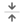
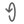
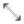

# 🖼️ 素材分類：Arrow

> [🏠 主目錄](../../../../../README.md) / [images](../../../../README.md) / [iCons](../../../README.md) / [Dencar Icon Pack](../../README.md) / [Monochrome](../README.md) / **Arrow**

本目錄共有 `48` 個檔案

| 🎨 預覽 (點擊放大)  | 📋 檔案詳細資訊與連結 |
| :--- | :--- |
|  | **📂 檔名:** `ArrowDown.svg` ✨ **格式:** `Vector (SVG)` ⚖️ **大小:** `575.00B` 📅 **更新:** `2026-03-04`  🚀 **jsDelivr Markdown:** `` 🔗 **直接連結 (Url):** <code>https://cdn.jsdelivr.net/gh/barry028/materials@main/images/iCons/Dencar%20Icon%20Pack/Monochrome/Arrow/ArrowDown.svg</code> 📥 [檢視原始檔](ArrowDown.svg) |
|  | **📂 檔名:** `ArrowLeft.svg` ✨ **格式:** `Vector (SVG)` ⚖️ **大小:** `578.00B` 📅 **更新:** `2026-03-04`  🚀 **jsDelivr Markdown:** `` 🔗 **直接連結 (Url):** <code>https://cdn.jsdelivr.net/gh/barry028/materials@main/images/iCons/Dencar%20Icon%20Pack/Monochrome/Arrow/ArrowLeft.svg</code> 📥 [檢視原始檔](ArrowLeft.svg) |
|  | **📂 檔名:** `ArrowLeftDown.svg` ✨ **格式:** `Vector (SVG)` ⚖️ **大小:** `583.00B` 📅 **更新:** `2026-03-04`  🚀 **jsDelivr Markdown:** `` 🔗 **直接連結 (Url):** <code>https://cdn.jsdelivr.net/gh/barry028/materials@main/images/iCons/Dencar%20Icon%20Pack/Monochrome/Arrow/ArrowLeftDown.svg</code> 📥 [檢視原始檔](ArrowLeftDown.svg) |
|  | **📂 檔名:** `ArrowLeftUp.svg` ✨ **格式:** `Vector (SVG)` ⚖️ **大小:** `564.00B` 📅 **更新:** `2026-03-04`  🚀 **jsDelivr Markdown:** `` 🔗 **直接連結 (Url):** <code>https://cdn.jsdelivr.net/gh/barry028/materials@main/images/iCons/Dencar%20Icon%20Pack/Monochrome/Arrow/ArrowLeftUp.svg</code> 📥 [檢視原始檔](ArrowLeftUp.svg) |
|  | **📂 檔名:** `ArrowRight.svg` ✨ **格式:** `Vector (SVG)` ⚖️ **大小:** `575.00B` 📅 **更新:** `2026-03-04`  🚀 **jsDelivr Markdown:** `` 🔗 **直接連結 (Url):** <code>https://cdn.jsdelivr.net/gh/barry028/materials@main/images/iCons/Dencar%20Icon%20Pack/Monochrome/Arrow/ArrowRight.svg</code> 📥 [檢視原始檔](ArrowRight.svg) |
|  | **📂 檔名:** `ArrowRightDown.svg` ✨ **格式:** `Vector (SVG)` ⚖️ **大小:** `576.00B` 📅 **更新:** `2026-03-04`  🚀 **jsDelivr Markdown:** `` 🔗 **直接連結 (Url):** <code>https://cdn.jsdelivr.net/gh/barry028/materials@main/images/iCons/Dencar%20Icon%20Pack/Monochrome/Arrow/ArrowRightDown.svg</code> 📥 [檢視原始檔](ArrowRightDown.svg) |
|  | **📂 檔名:** `ArrowRightUp.svg` ✨ **格式:** `Vector (SVG)` ⚖️ **大小:** `579.00B` 📅 **更新:** `2026-03-04`  🚀 **jsDelivr Markdown:** `` 🔗 **直接連結 (Url):** <code>https://cdn.jsdelivr.net/gh/barry028/materials@main/images/iCons/Dencar%20Icon%20Pack/Monochrome/Arrow/ArrowRightUp.svg</code> 📥 [檢視原始檔](ArrowRightUp.svg) |
|  | **📂 檔名:** `ArrowUp.svg` ✨ **格式:** `Vector (SVG)` ⚖️ **大小:** `572.00B` 📅 **更新:** `2026-03-04`  🚀 **jsDelivr Markdown:** `` 🔗 **直接連結 (Url):** <code>https://cdn.jsdelivr.net/gh/barry028/materials@main/images/iCons/Dencar%20Icon%20Pack/Monochrome/Arrow/ArrowUp.svg</code> 📥 [檢視原始檔](ArrowUp.svg) |
|  | **📂 檔名:** `ChevronDoubleDown.svg` ✨ **格式:** `Vector (SVG)` ⚖️ **大小:** `803.00B` 📅 **更新:** `2026-03-04`  🚀 **jsDelivr Markdown:** `` 🔗 **直接連結 (Url):** <code>https://cdn.jsdelivr.net/gh/barry028/materials@main/images/iCons/Dencar%20Icon%20Pack/Monochrome/Arrow/ChevronDoubleDown.svg</code> 📥 [檢視原始檔](ChevronDoubleDown.svg) |
|  | **📂 檔名:** `ChevronDoubleLeft.svg` ✨ **格式:** `Vector (SVG)` ⚖️ **大小:** `803.00B` 📅 **更新:** `2026-03-04`  🚀 **jsDelivr Markdown:** `` 🔗 **直接連結 (Url):** <code>https://cdn.jsdelivr.net/gh/barry028/materials@main/images/iCons/Dencar%20Icon%20Pack/Monochrome/Arrow/ChevronDoubleLeft.svg</code> 📥 [檢視原始檔](ChevronDoubleLeft.svg) |
|  | **📂 檔名:** `ChevronDoubleRight.svg` ✨ **格式:** `Vector (SVG)` ⚖️ **大小:** `803.00B` 📅 **更新:** `2026-03-04`  🚀 **jsDelivr Markdown:** `` 🔗 **直接連結 (Url):** <code>https://cdn.jsdelivr.net/gh/barry028/materials@main/images/iCons/Dencar%20Icon%20Pack/Monochrome/Arrow/ChevronDoubleRight.svg</code> 📥 [檢視原始檔](ChevronDoubleRight.svg) |
|  | **📂 檔名:** `ChevronDoubleUp.svg` ✨ **格式:** `Vector (SVG)` ⚖️ **大小:** `803.00B` 📅 **更新:** `2026-03-04`  🚀 **jsDelivr Markdown:** `` 🔗 **直接連結 (Url):** <code>https://cdn.jsdelivr.net/gh/barry028/materials@main/images/iCons/Dencar%20Icon%20Pack/Monochrome/Arrow/ChevronDoubleUp.svg</code> 📥 [檢視原始檔](ChevronDoubleUp.svg) |
|  | **📂 檔名:** `ChevronDown.svg` ✨ **格式:** `Vector (SVG)` ⚖️ **大小:** `487.00B` 📅 **更新:** `2026-03-04`  🚀 **jsDelivr Markdown:** `` 🔗 **直接連結 (Url):** <code>https://cdn.jsdelivr.net/gh/barry028/materials@main/images/iCons/Dencar%20Icon%20Pack/Monochrome/Arrow/ChevronDown.svg</code> 📥 [檢視原始檔](ChevronDown.svg) |
|  | **📂 檔名:** `ChevronLeft.svg` ✨ **格式:** `Vector (SVG)` ⚖️ **大小:** `487.00B` 📅 **更新:** `2026-03-04`  🚀 **jsDelivr Markdown:** `` 🔗 **直接連結 (Url):** <code>https://cdn.jsdelivr.net/gh/barry028/materials@main/images/iCons/Dencar%20Icon%20Pack/Monochrome/Arrow/ChevronLeft.svg</code> 📥 [檢視原始檔](ChevronLeft.svg) |
|  | **📂 檔名:** `ChevronRight.svg` ✨ **格式:** `Vector (SVG)` ⚖️ **大小:** `487.00B` 📅 **更新:** `2026-03-04`  🚀 **jsDelivr Markdown:** `` 🔗 **直接連結 (Url):** <code>https://cdn.jsdelivr.net/gh/barry028/materials@main/images/iCons/Dencar%20Icon%20Pack/Monochrome/Arrow/ChevronRight.svg</code> 📥 [檢視原始檔](ChevronRight.svg) |
|  | **📂 檔名:** `ChevronUp.svg` ✨ **格式:** `Vector (SVG)` ⚖️ **大小:** `487.00B` 📅 **更新:** `2026-03-04`  🚀 **jsDelivr Markdown:** `` 🔗 **直接連結 (Url):** <code>https://cdn.jsdelivr.net/gh/barry028/materials@main/images/iCons/Dencar%20Icon%20Pack/Monochrome/Arrow/ChevronUp.svg</code> 📥 [檢視原始檔](ChevronUp.svg) |
|  | **📂 檔名:** `Contract.svg` ✨ **格式:** `Vector (SVG)` ⚖️ **大小:** `1.47KB` 📅 **更新:** `2026-03-04`  🚀 **jsDelivr Markdown:** `` 🔗 **直接連結 (Url):** <code>https://cdn.jsdelivr.net/gh/barry028/materials@main/images/iCons/Dencar%20Icon%20Pack/Monochrome/Arrow/Contract.svg</code> 📥 [檢視原始檔](Contract.svg) |
|  | **📂 檔名:** `Diagonal.svg` ✨ **格式:** `Vector (SVG)` ⚖️ **大小:** `588.00B` 📅 **更新:** `2026-03-04`  🚀 **jsDelivr Markdown:** `` 🔗 **直接連結 (Url):** <code>https://cdn.jsdelivr.net/gh/barry028/materials@main/images/iCons/Dencar%20Icon%20Pack/Monochrome/Arrow/Diagonal.svg</code> 📥 [檢視原始檔](Diagonal.svg) |
|  | **📂 檔名:** `Diminish.svg` ✨ **格式:** `Vector (SVG)` ⚖️ **大小:** `962.00B` 📅 **更新:** `2026-03-04`  🚀 **jsDelivr Markdown:** `` 🔗 **直接連結 (Url):** <code>https://cdn.jsdelivr.net/gh/barry028/materials@main/images/iCons/Dencar%20Icon%20Pack/Monochrome/Arrow/Diminish.svg</code> 📥 [檢視原始檔](Diminish.svg) |
|  | **📂 檔名:** `Download.svg` ✨ **格式:** `Vector (SVG)` ⚖️ **大小:** `823.00B` 📅 **更新:** `2026-03-04`  🚀 **jsDelivr Markdown:** `` 🔗 **直接連結 (Url):** <code>https://cdn.jsdelivr.net/gh/barry028/materials@main/images/iCons/Dencar%20Icon%20Pack/Monochrome/Arrow/Download.svg</code> 📥 [檢視原始檔](Download.svg) |
|  | **📂 檔名:** `Enlarge.svg` ✨ **格式:** `Vector (SVG)` ⚖️ **大小:** `803.00B` 📅 **更新:** `2026-03-04`  🚀 **jsDelivr Markdown:** `` 🔗 **直接連結 (Url):** <code>https://cdn.jsdelivr.net/gh/barry028/materials@main/images/iCons/Dencar%20Icon%20Pack/Monochrome/Arrow/Enlarge.svg</code> 📥 [檢視原始檔](Enlarge.svg) |
|  | **📂 檔名:** `Expand.svg` ✨ **格式:** `Vector (SVG)` ⚖️ **大小:** `1.45KB` 📅 **更新:** `2026-03-04`  🚀 **jsDelivr Markdown:** `` 🔗 **直接連結 (Url):** <code>https://cdn.jsdelivr.net/gh/barry028/materials@main/images/iCons/Dencar%20Icon%20Pack/Monochrome/Arrow/Expand.svg</code> 📥 [檢視原始檔](Expand.svg) |
|  | **📂 檔名:** `Horizontal.svg` ✨ **格式:** `Vector (SVG)` ⚖️ **大小:** `808.00B` 📅 **更新:** `2026-03-04`  🚀 **jsDelivr Markdown:** `` 🔗 **直接連結 (Url):** <code>https://cdn.jsdelivr.net/gh/barry028/materials@main/images/iCons/Dencar%20Icon%20Pack/Monochrome/Arrow/Horizontal.svg</code> 📥 [檢視原始檔](Horizontal.svg) |
|  | **📂 檔名:** `Increase.svg` ✨ **格式:** `Vector (SVG)` ⚖️ **大小:** `947.00B` 📅 **更新:** `2026-03-04`  🚀 **jsDelivr Markdown:** `` 🔗 **直接連結 (Url):** <code>https://cdn.jsdelivr.net/gh/barry028/materials@main/images/iCons/Dencar%20Icon%20Pack/Monochrome/Arrow/Increase.svg</code> 📥 [檢視原始檔](Increase.svg) |
|  | **📂 檔名:** `Middle.svg` ✨ **格式:** `Vector (SVG)` ⚖️ **大小:** `1.20KB` 📅 **更新:** `2026-03-04`  🚀 **jsDelivr Markdown:** `` 🔗 **直接連結 (Url):** <code>https://cdn.jsdelivr.net/gh/barry028/materials@main/images/iCons/Dencar%20Icon%20Pack/Monochrome/Arrow/Middle.svg</code> 📥 [檢視原始檔](Middle.svg) |
|  | **📂 檔名:** `Move.svg` ✨ **格式:** `Vector (SVG)` ⚖️ **大小:** `1.42KB` 📅 **更新:** `2026-03-04`  🚀 **jsDelivr Markdown:** `` 🔗 **直接連結 (Url):** <code>https://cdn.jsdelivr.net/gh/barry028/materials@main/images/iCons/Dencar%20Icon%20Pack/Monochrome/Arrow/Move.svg</code> 📥 [檢視原始檔](Move.svg) |
|  | **📂 檔名:** `Redo.svg` ✨ **格式:** `Vector (SVG)` ⚖️ **大小:** `715.00B` 📅 **更新:** `2026-03-04`  🚀 **jsDelivr Markdown:** `` 🔗 **直接連結 (Url):** <code>https://cdn.jsdelivr.net/gh/barry028/materials@main/images/iCons/Dencar%20Icon%20Pack/Monochrome/Arrow/Redo.svg</code> 📥 [檢視原始檔](Redo.svg) |
|  | **📂 檔名:** `Reset.svg` ✨ **格式:** `Vector (SVG)` ⚖️ **大小:** `964.00B` 📅 **更新:** `2026-03-04`  🚀 **jsDelivr Markdown:** `` 🔗 **直接連結 (Url):** <code>https://cdn.jsdelivr.net/gh/barry028/materials@main/images/iCons/Dencar%20Icon%20Pack/Monochrome/Arrow/Reset.svg</code> 📥 [檢視原始檔](Reset.svg) |
|  | **📂 檔名:** `ResetDouble.svg` ✨ **格式:** `Vector (SVG)` ⚖️ **大小:** `1.28KB` 📅 **更新:** `2026-03-04`  🚀 **jsDelivr Markdown:** `` 🔗 **直接連結 (Url):** <code>https://cdn.jsdelivr.net/gh/barry028/materials@main/images/iCons/Dencar%20Icon%20Pack/Monochrome/Arrow/ResetDouble.svg</code> 📥 [檢視原始檔](ResetDouble.svg) |
|  | **📂 檔名:** `Rotate.svg` ✨ **格式:** `Vector (SVG)` ⚖️ **大小:** `780.00B` 📅 **更新:** `2026-03-04`  🚀 **jsDelivr Markdown:** `` 🔗 **直接連結 (Url):** <code>https://cdn.jsdelivr.net/gh/barry028/materials@main/images/iCons/Dencar%20Icon%20Pack/Monochrome/Arrow/Rotate.svg</code> 📥 [檢視原始檔](Rotate.svg) |
|  | **📂 檔名:** `RotateX.svg` ✨ **格式:** `Vector (SVG)` ⚖️ **大小:** `1.52KB` 📅 **更新:** `2026-03-04`  🚀 **jsDelivr Markdown:** `` 🔗 **直接連結 (Url):** <code>https://cdn.jsdelivr.net/gh/barry028/materials@main/images/iCons/Dencar%20Icon%20Pack/Monochrome/Arrow/RotateX.svg</code> 📥 [檢視原始檔](RotateX.svg) |
|  | **📂 檔名:** `RotateY.svg` ✨ **格式:** `Vector (SVG)` ⚖️ **大小:** `1.52KB` 📅 **更新:** `2026-03-04`  🚀 **jsDelivr Markdown:** `` 🔗 **直接連結 (Url):** <code>https://cdn.jsdelivr.net/gh/barry028/materials@main/images/iCons/Dencar%20Icon%20Pack/Monochrome/Arrow/RotateY.svg</code> 📥 [檢視原始檔](RotateY.svg) |
|  | **📂 檔名:** `Scale.svg` ✨ **格式:** `Vector (SVG)` ⚖️ **大小:** `1.06KB` 📅 **更新:** `2026-03-04`  🚀 **jsDelivr Markdown:** `` 🔗 **直接連結 (Url):** <code>https://cdn.jsdelivr.net/gh/barry028/materials@main/images/iCons/Dencar%20Icon%20Pack/Monochrome/Arrow/Scale.svg</code> 📥 [檢視原始檔](Scale.svg) |
|  | **📂 檔名:** `Shuffle.svg` ✨ **格式:** `Vector (SVG)` ⚖️ **大小:** `1.40KB` 📅 **更新:** `2026-03-04`  🚀 **jsDelivr Markdown:** `` 🔗 **直接連結 (Url):** <code>https://cdn.jsdelivr.net/gh/barry028/materials@main/images/iCons/Dencar%20Icon%20Pack/Monochrome/Arrow/Shuffle.svg</code> 📥 [檢視原始檔](Shuffle.svg) |
|  | **📂 檔名:** `SignIn.svg` ✨ **格式:** `Vector (SVG)` ⚖️ **大小:** `905.00B` 📅 **更新:** `2026-03-04`  🚀 **jsDelivr Markdown:** `` 🔗 **直接連結 (Url):** <code>https://cdn.jsdelivr.net/gh/barry028/materials@main/images/iCons/Dencar%20Icon%20Pack/Monochrome/Arrow/SignIn.svg</code> 📥 [檢視原始檔](SignIn.svg) |
|  | **📂 檔名:** `SignOut.svg` ✨ **格式:** `Vector (SVG)` ⚖️ **大小:** `894.00B` 📅 **更新:** `2026-03-04`  🚀 **jsDelivr Markdown:** `` 🔗 **直接連結 (Url):** <code>https://cdn.jsdelivr.net/gh/barry028/materials@main/images/iCons/Dencar%20Icon%20Pack/Monochrome/Arrow/SignOut.svg</code> 📥 [檢視原始檔](SignOut.svg) |
|  | **📂 檔名:** `Squeeze.svg` ✨ **格式:** `Vector (SVG)` ⚖️ **大小:** `1.14KB` 📅 **更新:** `2026-03-04`  🚀 **jsDelivr Markdown:** `` 🔗 **直接連結 (Url):** <code>https://cdn.jsdelivr.net/gh/barry028/materials@main/images/iCons/Dencar%20Icon%20Pack/Monochrome/Arrow/Squeeze.svg</code> 📥 [檢視原始檔](Squeeze.svg) |
|  | **📂 檔名:** `TransactionDiagonal.svg` ✨ **格式:** `Vector (SVG)` ⚖️ **大小:** `831.00B` 📅 **更新:** `2026-03-04`  🚀 **jsDelivr Markdown:** `` 🔗 **直接連結 (Url):** <code>https://cdn.jsdelivr.net/gh/barry028/materials@main/images/iCons/Dencar%20Icon%20Pack/Monochrome/Arrow/TransactionDiagonal.svg</code> 📥 [檢視原始檔](TransactionDiagonal.svg) |
|  | **📂 檔名:** `TransactionHorizontal.svg` ✨ **格式:** `Vector (SVG)` ⚖️ **大小:** `1002.00B` 📅 **更新:** `2026-03-04`  🚀 **jsDelivr Markdown:** `` 🔗 **直接連結 (Url):** <code>https://cdn.jsdelivr.net/gh/barry028/materials@main/images/iCons/Dencar%20Icon%20Pack/Monochrome/Arrow/TransactionHorizontal.svg</code> 📥 [檢視原始檔](TransactionHorizontal.svg) |
|  | **📂 檔名:** `TransactionVertical.svg` ✨ **格式:** `Vector (SVG)` ⚖️ **大小:** `961.00B` 📅 **更新:** `2026-03-04`  🚀 **jsDelivr Markdown:** `` 🔗 **直接連結 (Url):** <code>https://cdn.jsdelivr.net/gh/barry028/materials@main/images/iCons/Dencar%20Icon%20Pack/Monochrome/Arrow/TransactionVertical.svg</code> 📥 [檢視原始檔](TransactionVertical.svg) |
|  | **📂 檔名:** `TrendDown.svg` ✨ **格式:** `Vector (SVG)` ⚖️ **大小:** `670.00B` 📅 **更新:** `2026-03-04`  🚀 **jsDelivr Markdown:** `` 🔗 **直接連結 (Url):** <code>https://cdn.jsdelivr.net/gh/barry028/materials@main/images/iCons/Dencar%20Icon%20Pack/Monochrome/Arrow/TrendDown.svg</code> 📥 [檢視原始檔](TrendDown.svg) |
|  | **📂 檔名:** `TrendUp.svg` ✨ **格式:** `Vector (SVG)` ⚖️ **大小:** `650.00B` 📅 **更新:** `2026-03-04`  🚀 **jsDelivr Markdown:** `` 🔗 **直接連結 (Url):** <code>https://cdn.jsdelivr.net/gh/barry028/materials@main/images/iCons/Dencar%20Icon%20Pack/Monochrome/Arrow/TrendUp.svg</code> 📥 [檢視原始檔](TrendUp.svg) |
|  | **📂 檔名:** `TurnLeft.svg` ✨ **格式:** `Vector (SVG)` ⚖️ **大小:** `651.00B` 📅 **更新:** `2026-03-04`  🚀 **jsDelivr Markdown:** `` 🔗 **直接連結 (Url):** <code>https://cdn.jsdelivr.net/gh/barry028/materials@main/images/iCons/Dencar%20Icon%20Pack/Monochrome/Arrow/TurnLeft.svg</code> 📥 [檢視原始檔](TurnLeft.svg) |
|  | **📂 檔名:** `TurnRight.svg` ✨ **格式:** `Vector (SVG)` ⚖️ **大小:** `642.00B` 📅 **更新:** `2026-03-04`  🚀 **jsDelivr Markdown:** `` 🔗 **直接連結 (Url):** <code>https://cdn.jsdelivr.net/gh/barry028/materials@main/images/iCons/Dencar%20Icon%20Pack/Monochrome/Arrow/TurnRight.svg</code> 📥 [檢視原始檔](TurnRight.svg) |
|  | **📂 檔名:** `Undo.svg` ✨ **格式:** `Vector (SVG)` ⚖️ **大小:** `720.00B` 📅 **更新:** `2026-03-04`  🚀 **jsDelivr Markdown:** `` 🔗 **直接連結 (Url):** <code>https://cdn.jsdelivr.net/gh/barry028/materials@main/images/iCons/Dencar%20Icon%20Pack/Monochrome/Arrow/Undo.svg</code> 📥 [檢視原始檔](Undo.svg) |
|  | **📂 檔名:** `Upload.svg` ✨ **格式:** `Vector (SVG)` ⚖️ **大小:** `792.00B` 📅 **更新:** `2026-03-04`  🚀 **jsDelivr Markdown:** `` 🔗 **直接連結 (Url):** <code>https://cdn.jsdelivr.net/gh/barry028/materials@main/images/iCons/Dencar%20Icon%20Pack/Monochrome/Arrow/Upload.svg</code> 📥 [檢視原始檔](Upload.svg) |
|  | **📂 檔名:** `Vertical.svg` ✨ **格式:** `Vector (SVG)` ⚖️ **大小:** `808.00B` 📅 **更新:** `2026-03-04`  🚀 **jsDelivr Markdown:** `` 🔗 **直接連結 (Url):** <code>https://cdn.jsdelivr.net/gh/barry028/materials@main/images/iCons/Dencar%20Icon%20Pack/Monochrome/Arrow/Vertical.svg</code> 📥 [檢視原始檔](Vertical.svg) |
|  | **📂 檔名:** `Widen.svg` ✨ **格式:** `Vector (SVG)` ⚖️ **大小:** `803.00B` 📅 **更新:** `2026-03-04`  🚀 **jsDelivr Markdown:** `` 🔗 **直接連結 (Url):** <code>https://cdn.jsdelivr.net/gh/barry028/materials@main/images/iCons/Dencar%20Icon%20Pack/Monochrome/Arrow/Widen.svg</code> 📥 [檢視原始檔](Widen.svg) |