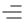
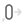
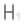
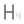
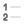
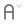

# 🖼️ 素材分類：Content

> [🏠 主目錄](../../../../../README.md) / [images](../../../../README.md) / [iCons](../../../README.md) / [Dencar Icon Pack](../../README.md) / [Monochrome](../README.md) / **Content**

本目錄共有 `40` 個檔案

| 🎨 預覽 (點擊放大)  | 📋 檔案詳細資訊與連結 |
| :--- | :--- |
|  | **📂 檔名:** `AdjustLeft.svg` ✨ **格式:** `Vector (SVG)` ⚖️ **大小:** `995.00B` 📅 **更新:** `2026-03-03`  🚀 **jsDelivr Markdown:** `` 🔗 **直接連結 (Url):** <code>https://cdn.jsdelivr.net/gh/barry028/materials@main/images/iCons/Dencar%20Icon%20Pack/Monochrome/Content/AdjustLeft.svg</code> 📥 [檢視原始檔](AdjustLeft.svg) |
|  | **📂 檔名:** `AdjustMiddle.svg` ✨ **格式:** `Vector (SVG)` ⚖️ **大小:** `1.41KB` 📅 **更新:** `2026-03-03`  🚀 **jsDelivr Markdown:** `` 🔗 **直接連結 (Url):** <code>https://cdn.jsdelivr.net/gh/barry028/materials@main/images/iCons/Dencar%20Icon%20Pack/Monochrome/Content/AdjustMiddle.svg</code> 📥 [檢視原始檔](AdjustMiddle.svg) |
|  | **📂 檔名:** `AdjustRight.svg` ✨ **格式:** `Vector (SVG)` ⚖️ **大小:** `983.00B` 📅 **更新:** `2026-03-03`  🚀 **jsDelivr Markdown:** `` 🔗 **直接連結 (Url):** <code>https://cdn.jsdelivr.net/gh/barry028/materials@main/images/iCons/Dencar%20Icon%20Pack/Monochrome/Content/AdjustRight.svg</code> 📥 [檢視原始檔](AdjustRight.svg) |
|  | **📂 檔名:** `AlignLeftText.svg` ✨ **格式:** `Vector (SVG)` ⚖️ **大小:** `636.00B` 📅 **更新:** `2026-03-03`  🚀 **jsDelivr Markdown:** `` 🔗 **直接連結 (Url):** <code>https://cdn.jsdelivr.net/gh/barry028/materials@main/images/iCons/Dencar%20Icon%20Pack/Monochrome/Content/AlignLeftText.svg</code> 📥 [檢視原始檔](AlignLeftText.svg) |
|  | **📂 檔名:** `AlignMiddleText.svg` ✨ **格式:** `Vector (SVG)` ⚖️ **大小:** `636.00B` 📅 **更新:** `2026-03-03`  🚀 **jsDelivr Markdown:** `` 🔗 **直接連結 (Url):** <code>https://cdn.jsdelivr.net/gh/barry028/materials@main/images/iCons/Dencar%20Icon%20Pack/Monochrome/Content/AlignMiddleText.svg</code> 📥 [檢視原始檔](AlignMiddleText.svg) |
|  | **📂 檔名:** `AlignRightText.svg` ✨ **格式:** `Vector (SVG)` ⚖️ **大小:** `642.00B` 📅 **更新:** `2026-03-03`  🚀 **jsDelivr Markdown:** `` 🔗 **直接連結 (Url):** <code>https://cdn.jsdelivr.net/gh/barry028/materials@main/images/iCons/Dencar%20Icon%20Pack/Monochrome/Content/AlignRightText.svg</code> 📥 [檢視原始檔](AlignRightText.svg) |
|  | **📂 檔名:** `BoderInterior.svg` ✨ **格式:** `Vector (SVG)` ⚖️ **大小:** `2.60KB` 📅 **更新:** `2026-03-03`  🚀 **jsDelivr Markdown:** `` 🔗 **直接連結 (Url):** <code>https://cdn.jsdelivr.net/gh/barry028/materials@main/images/iCons/Dencar%20Icon%20Pack/Monochrome/Content/BoderInterior.svg</code> 📥 [檢視原始檔](BoderInterior.svg) |
|  | **📂 檔名:** `Bold.svg` ✨ **格式:** `Vector (SVG)` ⚖️ **大小:** `659.00B` 📅 **更新:** `2026-03-03`  🚀 **jsDelivr Markdown:** `` 🔗 **直接連結 (Url):** <code>https://cdn.jsdelivr.net/gh/barry028/materials@main/images/iCons/Dencar%20Icon%20Pack/Monochrome/Content/Bold.svg</code> 📥 [檢視原始檔](Bold.svg) |
|  | **📂 檔名:** `BorderDown.svg` ✨ **格式:** `Vector (SVG)` ⚖️ **大小:** `3.03KB` 📅 **更新:** `2026-03-03`  🚀 **jsDelivr Markdown:** `` 🔗 **直接連結 (Url):** <code>https://cdn.jsdelivr.net/gh/barry028/materials@main/images/iCons/Dencar%20Icon%20Pack/Monochrome/Content/BorderDown.svg</code> 📥 [檢視原始檔](BorderDown.svg) |
|  | **📂 檔名:** `BorderHorizontal.svg` ✨ **格式:** `Vector (SVG)` ⚖️ **大小:** `3.04KB` 📅 **更新:** `2026-03-03`  🚀 **jsDelivr Markdown:** `` 🔗 **直接連結 (Url):** <code>https://cdn.jsdelivr.net/gh/barry028/materials@main/images/iCons/Dencar%20Icon%20Pack/Monochrome/Content/BorderHorizontal.svg</code> 📥 [檢視原始檔](BorderHorizontal.svg) |
|  | **📂 檔名:** `BorderLeft.svg` ✨ **格式:** `Vector (SVG)` ⚖️ **大小:** `3.05KB` 📅 **更新:** `2026-03-03`  🚀 **jsDelivr Markdown:** `` 🔗 **直接連結 (Url):** <code>https://cdn.jsdelivr.net/gh/barry028/materials@main/images/iCons/Dencar%20Icon%20Pack/Monochrome/Content/BorderLeft.svg</code> 📥 [檢視原始檔](BorderLeft.svg) |
|  | **📂 檔名:** `BorderOff.svg` ✨ **格式:** `Vector (SVG)` ⚖️ **大小:** `3.66KB` 📅 **更新:** `2026-03-03`  🚀 **jsDelivr Markdown:** `` 🔗 **直接連結 (Url):** <code>https://cdn.jsdelivr.net/gh/barry028/materials@main/images/iCons/Dencar%20Icon%20Pack/Monochrome/Content/BorderOff.svg</code> 📥 [檢視原始檔](BorderOff.svg) |
|  | **📂 檔名:** `BorderRight.svg` ✨ **格式:** `Vector (SVG)` ⚖️ **大小:** `3.05KB` 📅 **更新:** `2026-03-03`  🚀 **jsDelivr Markdown:** `` 🔗 **直接連結 (Url):** <code>https://cdn.jsdelivr.net/gh/barry028/materials@main/images/iCons/Dencar%20Icon%20Pack/Monochrome/Content/BorderRight.svg</code> 📥 [檢視原始檔](BorderRight.svg) |
|  | **📂 檔名:** `BorderUp.svg` ✨ **格式:** `Vector (SVG)` ⚖️ **大小:** `3.07KB` 📅 **更新:** `2026-03-03`  🚀 **jsDelivr Markdown:** `` 🔗 **直接連結 (Url):** <code>https://cdn.jsdelivr.net/gh/barry028/materials@main/images/iCons/Dencar%20Icon%20Pack/Monochrome/Content/BorderUp.svg</code> 📥 [檢視原始檔](BorderUp.svg) |
|  | **📂 檔名:** `BorderVertical.svg` ✨ **格式:** `Vector (SVG)` ⚖️ **大小:** `3.05KB` 📅 **更新:** `2026-03-03`  🚀 **jsDelivr Markdown:** `` 🔗 **直接連結 (Url):** <code>https://cdn.jsdelivr.net/gh/barry028/materials@main/images/iCons/Dencar%20Icon%20Pack/Monochrome/Content/BorderVertical.svg</code> 📥 [檢視原始檔](BorderVertical.svg) |
|  | **📂 檔名:** `BordersAll.svg` ✨ **格式:** `Vector (SVG)` ⚖️ **大小:** `470.00B` 📅 **更新:** `2026-03-03`  🚀 **jsDelivr Markdown:** `` 🔗 **直接連結 (Url):** <code>https://cdn.jsdelivr.net/gh/barry028/materials@main/images/iCons/Dencar%20Icon%20Pack/Monochrome/Content/BordersAll.svg</code> 📥 [檢視原始檔](BordersAll.svg) |
|  | **📂 檔名:** `BordersExternal.svg` ✨ **格式:** `Vector (SVG)` ⚖️ **大小:** `1.26KB` 📅 **更新:** `2026-03-03`  🚀 **jsDelivr Markdown:** `` 🔗 **直接連結 (Url):** <code>https://cdn.jsdelivr.net/gh/barry028/materials@main/images/iCons/Dencar%20Icon%20Pack/Monochrome/Content/BordersExternal.svg</code> 📥 [檢視原始檔](BordersExternal.svg) |
|  | **📂 檔名:** `BulletList.svg` ✨ **格式:** `Vector (SVG)` ⚖️ **大小:** `1.50KB` 📅 **更新:** `2026-03-03`  🚀 **jsDelivr Markdown:** `` 🔗 **直接連結 (Url):** <code>https://cdn.jsdelivr.net/gh/barry028/materials@main/images/iCons/Dencar%20Icon%20Pack/Monochrome/Content/BulletList.svg</code> 📥 [檢視原始檔](BulletList.svg) |
|  | **📂 檔名:** `DecimalsInclude.svg` ✨ **格式:** `Vector (SVG)` ⚖️ **大小:** `1.22KB` 📅 **更新:** `2026-03-03`  🚀 **jsDelivr Markdown:** `` 🔗 **直接連結 (Url):** <code>https://cdn.jsdelivr.net/gh/barry028/materials@main/images/iCons/Dencar%20Icon%20Pack/Monochrome/Content/DecimalsInclude.svg</code> 📥 [檢視原始檔](DecimalsInclude.svg) |
|  | **📂 檔名:** `DecimalsReduce.svg` ✨ **格式:** `Vector (SVG)` ⚖️ **大小:** `1.22KB` 📅 **更新:** `2026-03-03`  🚀 **jsDelivr Markdown:** `` 🔗 **直接連結 (Url):** <code>https://cdn.jsdelivr.net/gh/barry028/materials@main/images/iCons/Dencar%20Icon%20Pack/Monochrome/Content/DecimalsReduce.svg</code> 📥 [檢視原始檔](DecimalsReduce.svg) |
|  | **📂 檔名:** `Exponent.svg` ✨ **格式:** `Vector (SVG)` ⚖️ **大小:** `1.20KB` 📅 **更新:** `2026-03-03`  🚀 **jsDelivr Markdown:** `` 🔗 **直接連結 (Url):** <code>https://cdn.jsdelivr.net/gh/barry028/materials@main/images/iCons/Dencar%20Icon%20Pack/Monochrome/Content/Exponent.svg</code> 📥 [檢視原始檔](Exponent.svg) |
|  | **📂 檔名:** `H1.svg` ✨ **格式:** `Vector (SVG)` ⚖️ **大小:** `874.00B` 📅 **更新:** `2026-03-03`  🚀 **jsDelivr Markdown:** `` 🔗 **直接連結 (Url):** <code>https://cdn.jsdelivr.net/gh/barry028/materials@main/images/iCons/Dencar%20Icon%20Pack/Monochrome/Content/H1.svg</code> 📥 [檢視原始檔](H1.svg) |
|  | **📂 檔名:** `H2.svg` ✨ **格式:** `Vector (SVG)` ⚖️ **大小:** `1.03KB` 📅 **更新:** `2026-03-03`  🚀 **jsDelivr Markdown:** `` 🔗 **直接連結 (Url):** <code>https://cdn.jsdelivr.net/gh/barry028/materials@main/images/iCons/Dencar%20Icon%20Pack/Monochrome/Content/H2.svg</code> 📥 [檢視原始檔](H2.svg) |
|  | **📂 檔名:** `H3.svg` ✨ **格式:** `Vector (SVG)` ⚖️ **大小:** `905.00B` 📅 **更新:** `2026-03-03`  🚀 **jsDelivr Markdown:** `` 🔗 **直接連結 (Url):** <code>https://cdn.jsdelivr.net/gh/barry028/materials@main/images/iCons/Dencar%20Icon%20Pack/Monochrome/Content/H3.svg</code> 📥 [檢視原始檔](H3.svg) |
|  | **📂 檔名:** `H4.svg` ✨ **格式:** `Vector (SVG)` ⚖️ **大小:** `859.00B` 📅 **更新:** `2026-03-03`  🚀 **jsDelivr Markdown:** `` 🔗 **直接連結 (Url):** <code>https://cdn.jsdelivr.net/gh/barry028/materials@main/images/iCons/Dencar%20Icon%20Pack/Monochrome/Content/H4.svg</code> 📥 [檢視原始檔](H4.svg) |
|  | **📂 檔名:** `H5.svg` ✨ **格式:** `Vector (SVG)` ⚖️ **大小:** `908.00B` 📅 **更新:** `2026-03-03`  🚀 **jsDelivr Markdown:** `` 🔗 **直接連結 (Url):** <code>https://cdn.jsdelivr.net/gh/barry028/materials@main/images/iCons/Dencar%20Icon%20Pack/Monochrome/Content/H5.svg</code> 📥 [檢視原始檔](H5.svg) |
|  | **📂 檔名:** `IncreaseText.svg` ✨ **格式:** `Vector (SVG)` ⚖️ **大小:** `713.00B` 📅 **更新:** `2026-03-03`  🚀 **jsDelivr Markdown:** `` 🔗 **直接連結 (Url):** <code>https://cdn.jsdelivr.net/gh/barry028/materials@main/images/iCons/Dencar%20Icon%20Pack/Monochrome/Content/IncreaseText.svg</code> 📥 [檢視原始檔](IncreaseText.svg) |
|  | **📂 檔名:** `IndentIncrease.svg` ✨ **格式:** `Vector (SVG)` ⚖️ **大小:** `1.15KB` 📅 **更新:** `2026-03-03`  🚀 **jsDelivr Markdown:** `` 🔗 **直接連結 (Url):** <code>https://cdn.jsdelivr.net/gh/barry028/materials@main/images/iCons/Dencar%20Icon%20Pack/Monochrome/Content/IndentIncrease.svg</code> 📥 [檢視原始檔](IndentIncrease.svg) |
|  | **📂 檔名:** `IndentReduce.svg` ✨ **格式:** `Vector (SVG)` ⚖️ **大小:** `1.14KB` 📅 **更新:** `2026-03-03`  🚀 **jsDelivr Markdown:** `` 🔗 **直接連結 (Url):** <code>https://cdn.jsdelivr.net/gh/barry028/materials@main/images/iCons/Dencar%20Icon%20Pack/Monochrome/Content/IndentReduce.svg</code> 📥 [檢視原始檔](IndentReduce.svg) |
|  | **📂 檔名:** `Italic.svg` ✨ **格式:** `Vector (SVG)` ⚖️ **大小:** `514.00B` 📅 **更新:** `2026-03-03`  🚀 **jsDelivr Markdown:** `` 🔗 **直接連結 (Url):** <code>https://cdn.jsdelivr.net/gh/barry028/materials@main/images/iCons/Dencar%20Icon%20Pack/Monochrome/Content/Italic.svg</code> 📥 [檢視原始檔](Italic.svg) |
|  | **📂 檔名:** `Justify.svg` ✨ **格式:** `Vector (SVG)` ⚖️ **大小:** `791.00B` 📅 **更新:** `2026-03-03`  🚀 **jsDelivr Markdown:** `` 🔗 **直接連結 (Url):** <code>https://cdn.jsdelivr.net/gh/barry028/materials@main/images/iCons/Dencar%20Icon%20Pack/Monochrome/Content/Justify.svg</code> 📥 [檢視原始檔](Justify.svg) |
|  | **📂 檔名:** `LineSpacing.svg` ✨ **格式:** `Vector (SVG)` ⚖️ **大小:** `1.48KB` 📅 **更新:** `2026-03-03`  🚀 **jsDelivr Markdown:** `` 🔗 **直接連結 (Url):** <code>https://cdn.jsdelivr.net/gh/barry028/materials@main/images/iCons/Dencar%20Icon%20Pack/Monochrome/Content/LineSpacing.svg</code> 📥 [檢視原始檔](LineSpacing.svg) |
|  | **📂 檔名:** `MinimizeText.svg` ✨ **格式:** `Vector (SVG)` ⚖️ **大小:** `724.00B` 📅 **更新:** `2026-03-03`  🚀 **jsDelivr Markdown:** `` 🔗 **直接連結 (Url):** <code>https://cdn.jsdelivr.net/gh/barry028/materials@main/images/iCons/Dencar%20Icon%20Pack/Monochrome/Content/MinimizeText.svg</code> 📥 [檢視原始檔](MinimizeText.svg) |
|  | **📂 檔名:** `NumberedList.svg` ✨ **格式:** `Vector (SVG)` ⚖️ **大小:** `1.30KB` 📅 **更新:** `2026-03-03`  🚀 **jsDelivr Markdown:** `` 🔗 **直接連結 (Url):** <code>https://cdn.jsdelivr.net/gh/barry028/materials@main/images/iCons/Dencar%20Icon%20Pack/Monochrome/Content/NumberedList.svg</code> 📥 [檢視原始檔](NumberedList.svg) |
|  | **📂 檔名:** `SizeIncrease.svg` ✨ **格式:** `Vector (SVG)` ⚖️ **大小:** `887.00B` 📅 **更新:** `2026-03-03`  🚀 **jsDelivr Markdown:** `` 🔗 **直接連結 (Url):** <code>https://cdn.jsdelivr.net/gh/barry028/materials@main/images/iCons/Dencar%20Icon%20Pack/Monochrome/Content/SizeIncrease.svg</code> 📥 [檢視原始檔](SizeIncrease.svg) |
|  | **📂 檔名:** `SizeMinimize.svg` ✨ **格式:** `Vector (SVG)` ⚖️ **大小:** `887.00B` 📅 **更新:** `2026-03-03`  🚀 **jsDelivr Markdown:** `` 🔗 **直接連結 (Url):** <code>https://cdn.jsdelivr.net/gh/barry028/materials@main/images/iCons/Dencar%20Icon%20Pack/Monochrome/Content/SizeMinimize.svg</code> 📥 [檢視原始檔](SizeMinimize.svg) |
|  | **📂 檔名:** `Strikethrough.svg` ✨ **格式:** `Vector (SVG)` ⚖️ **大小:** `1.66KB` 📅 **更新:** `2026-03-03`  🚀 **jsDelivr Markdown:** `` 🔗 **直接連結 (Url):** <code>https://cdn.jsdelivr.net/gh/barry028/materials@main/images/iCons/Dencar%20Icon%20Pack/Monochrome/Content/Strikethrough.svg</code> 📥 [檢視原始檔](Strikethrough.svg) |
|  | **📂 檔名:** `Subscript.svg` ✨ **格式:** `Vector (SVG)` ⚖️ **大小:** `1.22KB` 📅 **更新:** `2026-03-03`  🚀 **jsDelivr Markdown:** `` 🔗 **直接連結 (Url):** <code>https://cdn.jsdelivr.net/gh/barry028/materials@main/images/iCons/Dencar%20Icon%20Pack/Monochrome/Content/Subscript.svg</code> 📥 [檢視原始檔](Subscript.svg) |
|  | **📂 檔名:** `Underscore.svg` ✨ **格式:** `Vector (SVG)` ⚖️ **大小:** `1.29KB` 📅 **更新:** `2026-03-03`  🚀 **jsDelivr Markdown:** `` 🔗 **直接連結 (Url):** <code>https://cdn.jsdelivr.net/gh/barry028/materials@main/images/iCons/Dencar%20Icon%20Pack/Monochrome/Content/Underscore.svg</code> 📥 [檢視原始檔](Underscore.svg) |
|  | **📂 檔名:** `WrapText.svg` ✨ **格式:** `Vector (SVG)` ⚖️ **大小:** `1023.00B` 📅 **更新:** `2026-03-03`  🚀 **jsDelivr Markdown:** `` 🔗 **直接連結 (Url):** <code>https://cdn.jsdelivr.net/gh/barry028/materials@main/images/iCons/Dencar%20Icon%20Pack/Monochrome/Content/WrapText.svg</code> 📥 [檢視原始檔](WrapText.svg) |