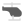

# 🖼️ 素材分類：Location & Transport

> [🏠 主目錄](../../../../../README.md) / [images](../../../../README.md) / [iCons](../../../README.md) / [Dencar Icon Pack](../../README.md) / [Monochrome](../README.md) / **Location & Transport**

本目錄共有 `48` 個檔案

| 🎨 預覽 (點擊放大)  | 📋 檔案詳細資訊與連結 |
| :--- | :--- |
|  | **📂 檔名:** `Airballoon.svg` ✨ **格式:** `Vector (SVG)` ⚖️ **大小:** `910.00B` 📅 **更新:** `2026-03-03`  🚀 **jsDelivr Markdown:** `` 🔗 **直接連結 (Url):** <code>https://cdn.jsdelivr.net/gh/barry028/materials@main/images/iCons/Dencar%20Icon%20Pack/Monochrome/Location%20%26%20Transport/Airballoon.svg</code> 📥 [檢視原始檔](Airballoon.svg) |
|  | **📂 檔名:** `Anchor.svg` ✨ **格式:** `Vector (SVG)` ⚖️ **大小:** `1.09KB` 📅 **更新:** `2026-03-03`  🚀 **jsDelivr Markdown:** `` 🔗 **直接連結 (Url):** <code>https://cdn.jsdelivr.net/gh/barry028/materials@main/images/iCons/Dencar%20Icon%20Pack/Monochrome/Location%20%26%20Transport/Anchor.svg</code> 📥 [檢視原始檔](Anchor.svg) |
|  | **📂 檔名:** `Backpack.svg` ✨ **格式:** `Vector (SVG)` ⚖️ **大小:** `842.00B` 📅 **更新:** `2026-03-03`  🚀 **jsDelivr Markdown:** `` 🔗 **直接連結 (Url):** <code>https://cdn.jsdelivr.net/gh/barry028/materials@main/images/iCons/Dencar%20Icon%20Pack/Monochrome/Location%20%26%20Transport/Backpack.svg</code> 📥 [檢視原始檔](Backpack.svg) |
|  | **📂 檔名:** `Bike.svg` ✨ **格式:** `Vector (SVG)` ⚖️ **大小:** `1.41KB` 📅 **更新:** `2026-03-03`  🚀 **jsDelivr Markdown:** `` 🔗 **直接連結 (Url):** <code>https://cdn.jsdelivr.net/gh/barry028/materials@main/images/iCons/Dencar%20Icon%20Pack/Monochrome/Location%20%26%20Transport/Bike.svg</code> 📥 [檢視原始檔](Bike.svg) |
|  | **📂 檔名:** `Bmx.svg` ✨ **格式:** `Vector (SVG)` ⚖️ **大小:** `1.55KB` 📅 **更新:** `2026-03-03`  🚀 **jsDelivr Markdown:** `` 🔗 **直接連結 (Url):** <code>https://cdn.jsdelivr.net/gh/barry028/materials@main/images/iCons/Dencar%20Icon%20Pack/Monochrome/Location%20%26%20Transport/Bmx.svg</code> 📥 [檢視原始檔](Bmx.svg) |
|  | **📂 檔名:** `Boat.svg` ✨ **格式:** `Vector (SVG)` ⚖️ **大小:** `2.92KB` 📅 **更新:** `2026-03-03`  🚀 **jsDelivr Markdown:** `` 🔗 **直接連結 (Url):** <code>https://cdn.jsdelivr.net/gh/barry028/materials@main/images/iCons/Dencar%20Icon%20Pack/Monochrome/Location%20%26%20Transport/Boat.svg</code> 📥 [檢視原始檔](Boat.svg) |
|  | **📂 檔名:** `Bus.svg` ✨ **格式:** `Vector (SVG)` ⚖️ **大小:** `1.86KB` 📅 **更新:** `2026-03-03`  🚀 **jsDelivr Markdown:** `` 🔗 **直接連結 (Url):** <code>https://cdn.jsdelivr.net/gh/barry028/materials@main/images/iCons/Dencar%20Icon%20Pack/Monochrome/Location%20%26%20Transport/Bus.svg</code> 📥 [檢視原始檔](Bus.svg) |
|  | **📂 檔名:** `BusFront.svg` ✨ **格式:** `Vector (SVG)` ⚖️ **大小:** `1.11KB` 📅 **更新:** `2026-03-03`  🚀 **jsDelivr Markdown:** `` 🔗 **直接連結 (Url):** <code>https://cdn.jsdelivr.net/gh/barry028/materials@main/images/iCons/Dencar%20Icon%20Pack/Monochrome/Location%20%26%20Transport/BusFront.svg</code> 📥 [檢視原始檔](BusFront.svg) |
|  | **📂 檔名:** `Camppack.svg` ✨ **格式:** `Vector (SVG)` ⚖️ **大小:** `994.00B` 📅 **更新:** `2026-03-03`  🚀 **jsDelivr Markdown:** `` 🔗 **直接連結 (Url):** <code>https://cdn.jsdelivr.net/gh/barry028/materials@main/images/iCons/Dencar%20Icon%20Pack/Monochrome/Location%20%26%20Transport/Camppack.svg</code> 📥 [檢視原始檔](Camppack.svg) |
|  | **📂 檔名:** `Car.svg` ✨ **格式:** `Vector (SVG)` ⚖️ **大小:** `2.47KB` 📅 **更新:** `2026-03-03`  🚀 **jsDelivr Markdown:** `` 🔗 **直接連結 (Url):** <code>https://cdn.jsdelivr.net/gh/barry028/materials@main/images/iCons/Dencar%20Icon%20Pack/Monochrome/Location%20%26%20Transport/Car.svg</code> 📥 [檢視原始檔](Car.svg) |
|  | **📂 檔名:** `CarFront.svg` ✨ **格式:** `Vector (SVG)` ⚖️ **大小:** `1.49KB` 📅 **更新:** `2026-03-03`  🚀 **jsDelivr Markdown:** `` 🔗 **直接連結 (Url):** <code>https://cdn.jsdelivr.net/gh/barry028/materials@main/images/iCons/Dencar%20Icon%20Pack/Monochrome/Location%20%26%20Transport/CarFront.svg</code> 📥 [檢視原始檔](CarFront.svg) |
|  | **📂 檔名:** `Compass.svg` ✨ **格式:** `Vector (SVG)` ⚖️ **大小:** `717.00B` 📅 **更新:** `2026-03-03`  🚀 **jsDelivr Markdown:** `` 🔗 **直接連結 (Url):** <code>https://cdn.jsdelivr.net/gh/barry028/materials@main/images/iCons/Dencar%20Icon%20Pack/Monochrome/Location%20%26%20Transport/Compass.svg</code> 📥 [檢視原始檔](Compass.svg) |
|  | **📂 檔名:** `Distribution.svg` ✨ **格式:** `Vector (SVG)` ⚖️ **大小:** `1.79KB` 📅 **更新:** `2026-03-03`  🚀 **jsDelivr Markdown:** `` 🔗 **直接連結 (Url):** <code>https://cdn.jsdelivr.net/gh/barry028/materials@main/images/iCons/Dencar%20Icon%20Pack/Monochrome/Location%20%26%20Transport/Distribution.svg</code> 📥 [檢視原始檔](Distribution.svg) |
|  | **📂 檔名:** `Flag.svg` ✨ **格式:** `Vector (SVG)` ⚖️ **大小:** `1.28KB` 📅 **更新:** `2026-03-03`  🚀 **jsDelivr Markdown:** `` 🔗 **直接連結 (Url):** <code>https://cdn.jsdelivr.net/gh/barry028/materials@main/images/iCons/Dencar%20Icon%20Pack/Monochrome/Location%20%26%20Transport/Flag.svg</code> 📥 [檢視原始檔](Flag.svg) |
|  | **📂 檔名:** `GasPump.svg` ✨ **格式:** `Vector (SVG)` ⚖️ **大小:** `1.06KB` 📅 **更新:** `2026-03-03`  🚀 **jsDelivr Markdown:** `` 🔗 **直接連結 (Url):** <code>https://cdn.jsdelivr.net/gh/barry028/materials@main/images/iCons/Dencar%20Icon%20Pack/Monochrome/Location%20%26%20Transport/GasPump.svg</code> 📥 [檢視原始檔](GasPump.svg) |
|  | **📂 檔名:** `Globe.svg` ✨ **格式:** `Vector (SVG)` ⚖️ **大小:** `3.25KB` 📅 **更新:** `2026-03-03`  🚀 **jsDelivr Markdown:** `` 🔗 **直接連結 (Url):** <code>https://cdn.jsdelivr.net/gh/barry028/materials@main/images/iCons/Dencar%20Icon%20Pack/Monochrome/Location%20%26%20Transport/Globe.svg</code> 📥 [檢視原始檔](Globe.svg) |
|  | **📂 檔名:** `HandSuitcase.svg` ✨ **格式:** `Vector (SVG)` ⚖️ **大小:** `732.00B` 📅 **更新:** `2026-03-03`  🚀 **jsDelivr Markdown:** `` 🔗 **直接連結 (Url):** <code>https://cdn.jsdelivr.net/gh/barry028/materials@main/images/iCons/Dencar%20Icon%20Pack/Monochrome/Location%20%26%20Transport/HandSuitcase.svg</code> 📥 [檢視原始檔](HandSuitcase.svg) |
|  | **📂 檔名:** `Helicopter.svg` ✨ **格式:** `Vector (SVG)` ⚖️ **大小:** `1.25KB` 📅 **更新:** `2026-03-03`  🚀 **jsDelivr Markdown:** `` 🔗 **直接連結 (Url):** <code>https://cdn.jsdelivr.net/gh/barry028/materials@main/images/iCons/Dencar%20Icon%20Pack/Monochrome/Location%20%26%20Transport/Helicopter.svg</code> 📥 [檢視原始檔](Helicopter.svg) |
|  | **📂 檔名:** `Island.svg` ✨ **格式:** `Vector (SVG)` ⚖️ **大小:** `4.32KB` 📅 **更新:** `2026-03-03`  🚀 **jsDelivr Markdown:** `` 🔗 **直接連結 (Url):** <code>https://cdn.jsdelivr.net/gh/barry028/materials@main/images/iCons/Dencar%20Icon%20Pack/Monochrome/Location%20%26%20Transport/Island.svg</code> 📥 [檢視原始檔](Island.svg) |
|  | **📂 檔名:** `Landing.svg` ✨ **格式:** `Vector (SVG)` ⚖️ **大小:** `997.00B` 📅 **更新:** `2026-03-03`  🚀 **jsDelivr Markdown:** `` 🔗 **直接連結 (Url):** <code>https://cdn.jsdelivr.net/gh/barry028/materials@main/images/iCons/Dencar%20Icon%20Pack/Monochrome/Location%20%26%20Transport/Landing.svg</code> 📥 [檢視原始檔](Landing.svg) |
|  | **📂 檔名:** `Locate.svg` ✨ **格式:** `Vector (SVG)` ⚖️ **大小:** `869.00B` 📅 **更新:** `2026-03-03`  🚀 **jsDelivr Markdown:** `` 🔗 **直接連結 (Url):** <code>https://cdn.jsdelivr.net/gh/barry028/materials@main/images/iCons/Dencar%20Icon%20Pack/Monochrome/Location%20%26%20Transport/Locate.svg</code> 📥 [檢視原始檔](Locate.svg) |
|  | **📂 檔名:** `LocationSign.svg` ✨ **格式:** `Vector (SVG)` ⚖️ **大小:** `870.00B` 📅 **更新:** `2026-03-03`  🚀 **jsDelivr Markdown:** `` 🔗 **直接連結 (Url):** <code>https://cdn.jsdelivr.net/gh/barry028/materials@main/images/iCons/Dencar%20Icon%20Pack/Monochrome/Location%20%26%20Transport/LocationSign.svg</code> 📥 [檢視原始檔](LocationSign.svg) |
|  | **📂 檔名:** `Map.svg` ✨ **格式:** `Vector (SVG)` ⚖️ **大小:** `540.00B` 📅 **更新:** `2026-03-03`  🚀 **jsDelivr Markdown:** `` 🔗 **直接連結 (Url):** <code>https://cdn.jsdelivr.net/gh/barry028/materials@main/images/iCons/Dencar%20Icon%20Pack/Monochrome/Location%20%26%20Transport/Map.svg</code> 📥 [檢視原始檔](Map.svg) |
|  | **📂 檔名:** `MotorBike.svg` ✨ **格式:** `Vector (SVG)` ⚖️ **大小:** `1.50KB` 📅 **更新:** `2026-03-03`  🚀 **jsDelivr Markdown:** `` 🔗 **直接連結 (Url):** <code>https://cdn.jsdelivr.net/gh/barry028/materials@main/images/iCons/Dencar%20Icon%20Pack/Monochrome/Location%20%26%20Transport/MotorBike.svg</code> 📥 [檢視原始檔](MotorBike.svg) |
|  | **📂 檔名:** `Mountain.svg` ✨ **格式:** `Vector (SVG)` ⚖️ **大小:** `903.00B` 📅 **更新:** `2026-03-03`  🚀 **jsDelivr Markdown:** `` 🔗 **直接連結 (Url):** <code>https://cdn.jsdelivr.net/gh/barry028/materials@main/images/iCons/Dencar%20Icon%20Pack/Monochrome/Location%20%26%20Transport/Mountain.svg</code> 📥 [檢視原始檔](Mountain.svg) |
|  | **📂 檔名:** `Mountains.svg` ✨ **格式:** `Vector (SVG)` ⚖️ **大小:** `979.00B` 📅 **更新:** `2026-03-03`  🚀 **jsDelivr Markdown:** `` 🔗 **直接連結 (Url):** <code>https://cdn.jsdelivr.net/gh/barry028/materials@main/images/iCons/Dencar%20Icon%20Pack/Monochrome/Location%20%26%20Transport/Mountains.svg</code> 📥 [檢視原始檔](Mountains.svg) |
|  | **📂 檔名:** `Pin.svg` ✨ **格式:** `Vector (SVG)` ⚖️ **大小:** `512.00B` 📅 **更新:** `2026-03-03`  🚀 **jsDelivr Markdown:** `` 🔗 **直接連結 (Url):** <code>https://cdn.jsdelivr.net/gh/barry028/materials@main/images/iCons/Dencar%20Icon%20Pack/Monochrome/Location%20%26%20Transport/Pin.svg</code> 📥 [檢視原始檔](Pin.svg) |
|  | **📂 檔名:** `Plane.svg` ✨ **格式:** `Vector (SVG)` ⚖️ **大小:** `1022.00B` 📅 **更新:** `2026-03-03`  🚀 **jsDelivr Markdown:** `` 🔗 **直接連結 (Url):** <code>https://cdn.jsdelivr.net/gh/barry028/materials@main/images/iCons/Dencar%20Icon%20Pack/Monochrome/Location%20%26%20Transport/Plane.svg</code> 📥 [檢視原始檔](Plane.svg) |
|  | **📂 檔名:** `PlaneDiagonal.svg` ✨ **格式:** `Vector (SVG)` ⚖️ **大小:** `1014.00B` 📅 **更新:** `2026-03-03`  🚀 **jsDelivr Markdown:** `` 🔗 **直接連結 (Url):** <code>https://cdn.jsdelivr.net/gh/barry028/materials@main/images/iCons/Dencar%20Icon%20Pack/Monochrome/Location%20%26%20Transport/PlaneDiagonal.svg</code> 📥 [檢視原始檔](PlaneDiagonal.svg) |
|  | **📂 檔名:** `Poi.svg` ✨ **格式:** `Vector (SVG)` ⚖️ **大小:** `752.00B` 📅 **更新:** `2026-03-03`  🚀 **jsDelivr Markdown:** `` 🔗 **直接連結 (Url):** <code>https://cdn.jsdelivr.net/gh/barry028/materials@main/images/iCons/Dencar%20Icon%20Pack/Monochrome/Location%20%26%20Transport/Poi.svg</code> 📥 [檢視原始檔](Poi.svg) |
|  | **📂 檔名:** `PoiAdd.svg` ✨ **格式:** `Vector (SVG)` ⚖️ **大小:** `928.00B` 📅 **更新:** `2026-03-03`  🚀 **jsDelivr Markdown:** `` 🔗 **直接連結 (Url):** <code>https://cdn.jsdelivr.net/gh/barry028/materials@main/images/iCons/Dencar%20Icon%20Pack/Monochrome/Location%20%26%20Transport/PoiAdd.svg</code> 📥 [檢視原始檔](PoiAdd.svg) |
|  | **📂 檔名:** `PoiInfo.svg` ✨ **格式:** `Vector (SVG)` ⚖️ **大小:** `961.00B` 📅 **更新:** `2026-03-03`  🚀 **jsDelivr Markdown:** `` 🔗 **直接連結 (Url):** <code>https://cdn.jsdelivr.net/gh/barry028/materials@main/images/iCons/Dencar%20Icon%20Pack/Monochrome/Location%20%26%20Transport/PoiInfo.svg</code> 📥 [檢視原始檔](PoiInfo.svg) |
|  | **📂 檔名:** `PoiLocated.svg` ✨ **格式:** `Vector (SVG)` ⚖️ **大小:** `1.76KB` 📅 **更新:** `2026-03-03`  🚀 **jsDelivr Markdown:** `` 🔗 **直接連結 (Url):** <code>https://cdn.jsdelivr.net/gh/barry028/materials@main/images/iCons/Dencar%20Icon%20Pack/Monochrome/Location%20%26%20Transport/PoiLocated.svg</code> 📥 [檢視原始檔](PoiLocated.svg) |
|  | **📂 檔名:** `PoiQuestion.svg` ✨ **格式:** `Vector (SVG)` ⚖️ **大小:** `1.19KB` 📅 **更新:** `2026-03-03`  🚀 **jsDelivr Markdown:** `` 🔗 **直接連結 (Url):** <code>https://cdn.jsdelivr.net/gh/barry028/materials@main/images/iCons/Dencar%20Icon%20Pack/Monochrome/Location%20%26%20Transport/PoiQuestion.svg</code> 📥 [檢視原始檔](PoiQuestion.svg) |
|  | **📂 檔名:** `PoiUnavailable.svg` ✨ **格式:** `Vector (SVG)` ⚖️ **大小:** `1.03KB` 📅 **更新:** `2026-03-03`  🚀 **jsDelivr Markdown:** `` 🔗 **直接連結 (Url):** <code>https://cdn.jsdelivr.net/gh/barry028/materials@main/images/iCons/Dencar%20Icon%20Pack/Monochrome/Location%20%26%20Transport/PoiUnavailable.svg</code> 📥 [檢視原始檔](PoiUnavailable.svg) |
|  | **📂 檔名:** `Rocket.svg` ✨ **格式:** `Vector (SVG)` ⚖️ **大小:** `1.67KB` 📅 **更新:** `2026-03-03`  🚀 **jsDelivr Markdown:** `` 🔗 **直接連結 (Url):** <code>https://cdn.jsdelivr.net/gh/barry028/materials@main/images/iCons/Dencar%20Icon%20Pack/Monochrome/Location%20%26%20Transport/Rocket.svg</code> 📥 [檢視原始檔](Rocket.svg) |
|  | **📂 檔名:** `RocketFlying.svg` ✨ **格式:** `Vector (SVG)` ⚖️ **大小:** `2.46KB` 📅 **更新:** `2026-03-03`  🚀 **jsDelivr Markdown:** `` 🔗 **直接連結 (Url):** <code>https://cdn.jsdelivr.net/gh/barry028/materials@main/images/iCons/Dencar%20Icon%20Pack/Monochrome/Location%20%26%20Transport/RocketFlying.svg</code> 📥 [檢視原始檔](RocketFlying.svg) |
|  | **📂 檔名:** `SailBoat.svg` ✨ **格式:** `Vector (SVG)` ⚖️ **大小:** `2.66KB` 📅 **更新:** `2026-03-03`  🚀 **jsDelivr Markdown:** `` 🔗 **直接連結 (Url):** <code>https://cdn.jsdelivr.net/gh/barry028/materials@main/images/iCons/Dencar%20Icon%20Pack/Monochrome/Location%20%26%20Transport/SailBoat.svg</code> 📥 [檢視原始檔](SailBoat.svg) |
|  | **📂 檔名:** `Ship.svg` ✨ **格式:** `Vector (SVG)` ⚖️ **大小:** `2.61KB` 📅 **更新:** `2026-03-03`  🚀 **jsDelivr Markdown:** `` 🔗 **直接連結 (Url):** <code>https://cdn.jsdelivr.net/gh/barry028/materials@main/images/iCons/Dencar%20Icon%20Pack/Monochrome/Location%20%26%20Transport/Ship.svg</code> 📥 [檢視原始檔](Ship.svg) |
|  | **📂 檔名:** `ShipFront.svg` ✨ **格式:** `Vector (SVG)` ⚖️ **大小:** `2.64KB` 📅 **更新:** `2026-03-03`  🚀 **jsDelivr Markdown:** `` 🔗 **直接連結 (Url):** <code>https://cdn.jsdelivr.net/gh/barry028/materials@main/images/iCons/Dencar%20Icon%20Pack/Monochrome/Location%20%26%20Transport/ShipFront.svg</code> 📥 [檢視原始檔](ShipFront.svg) |
|  | **📂 檔名:** `Suitcase.svg` ✨ **格式:** `Vector (SVG)` ⚖️ **大小:** `1.50KB` 📅 **更新:** `2026-03-03`  🚀 **jsDelivr Markdown:** `` 🔗 **直接連結 (Url):** <code>https://cdn.jsdelivr.net/gh/barry028/materials@main/images/iCons/Dencar%20Icon%20Pack/Monochrome/Location%20%26%20Transport/Suitcase.svg</code> 📥 [檢視原始檔](Suitcase.svg) |
|  | **📂 檔名:** `SuperBike.svg` ✨ **格式:** `Vector (SVG)` ⚖️ **大小:** `1.55KB` 📅 **更新:** `2026-03-03`  🚀 **jsDelivr Markdown:** `` 🔗 **直接連結 (Url):** <code>https://cdn.jsdelivr.net/gh/barry028/materials@main/images/iCons/Dencar%20Icon%20Pack/Monochrome/Location%20%26%20Transport/SuperBike.svg</code> 📥 [檢視原始檔](SuperBike.svg) |
|  | **📂 檔名:** `TakeOff.svg` ✨ **格式:** `Vector (SVG)` ⚖️ **大小:** `1.01KB` 📅 **更新:** `2026-03-03`  🚀 **jsDelivr Markdown:** `` 🔗 **直接連結 (Url):** <code>https://cdn.jsdelivr.net/gh/barry028/materials@main/images/iCons/Dencar%20Icon%20Pack/Monochrome/Location%20%26%20Transport/TakeOff.svg</code> 📥 [檢視原始檔](TakeOff.svg) |
|  | **📂 檔名:** `Train.svg` ✨ **格式:** `Vector (SVG)` ⚖️ **大小:** `1.12KB` 📅 **更新:** `2026-03-03`  🚀 **jsDelivr Markdown:** `` 🔗 **直接連結 (Url):** <code>https://cdn.jsdelivr.net/gh/barry028/materials@main/images/iCons/Dencar%20Icon%20Pack/Monochrome/Location%20%26%20Transport/Train.svg</code> 📥 [檢視原始檔](Train.svg) |
|  | **📂 檔名:** `Truck.svg` ✨ **格式:** `Vector (SVG)` ⚖️ **大小:** `1.51KB` 📅 **更新:** `2026-03-03`  🚀 **jsDelivr Markdown:** `` 🔗 **直接連結 (Url):** <code>https://cdn.jsdelivr.net/gh/barry028/materials@main/images/iCons/Dencar%20Icon%20Pack/Monochrome/Location%20%26%20Transport/Truck.svg</code> 📥 [檢視原始檔](Truck.svg) |
|  | **📂 檔名:** `Umbrella.svg` ✨ **格式:** `Vector (SVG)` ⚖️ **大小:** `792.00B` 📅 **更新:** `2026-03-03`  🚀 **jsDelivr Markdown:** `` 🔗 **直接連結 (Url):** <code>https://cdn.jsdelivr.net/gh/barry028/materials@main/images/iCons/Dencar%20Icon%20Pack/Monochrome/Location%20%26%20Transport/Umbrella.svg</code> 📥 [檢視原始檔](Umbrella.svg) |
|  | **📂 檔名:** `Vacation.svg` ✨ **格式:** `Vector (SVG)` ⚖️ **大小:** `3.25KB` 📅 **更新:** `2026-03-03`  🚀 **jsDelivr Markdown:** `` 🔗 **直接連結 (Url):** <code>https://cdn.jsdelivr.net/gh/barry028/materials@main/images/iCons/Dencar%20Icon%20Pack/Monochrome/Location%20%26%20Transport/Vacation.svg</code> 📥 [檢視原始檔](Vacation.svg) |
|  | **📂 檔名:** `World.svg` ✨ **格式:** `Vector (SVG)` ⚖️ **大小:** `1.23KB` 📅 **更新:** `2026-03-03`  🚀 **jsDelivr Markdown:** `` 🔗 **直接連結 (Url):** <code>https://cdn.jsdelivr.net/gh/barry028/materials@main/images/iCons/Dencar%20Icon%20Pack/Monochrome/Location%20%26%20Transport/World.svg</code> 📥 [檢視原始檔](World.svg) |