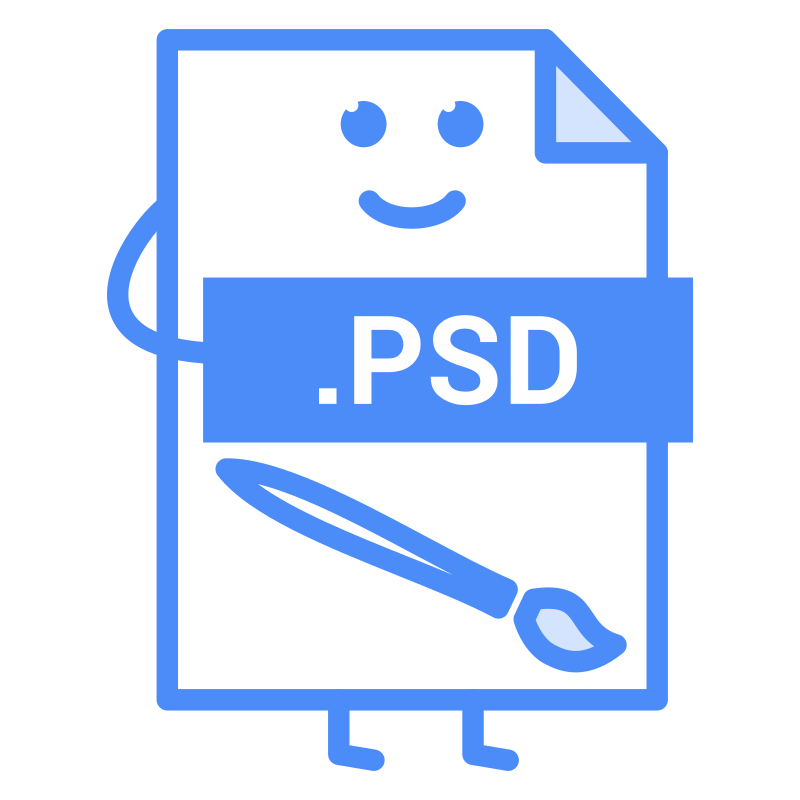

# 🖼️ 素材分類：File Type

> [🏠 主目錄](../../../README.md) / [images](../../README.md) / [iCons](../README.md) / **File Type**

本目錄共有 `20` 個檔案

| 🎨 預覽 (點擊放大)  | 📋 檔案詳細資訊與連結 |
| :--- | :--- |
|  | **📂 檔名:** `apple-dmg-file.svg` ✨ **格式:** `Vector (SVG)` ⚖️ **大小:** `6.91KB` 📅 **更新:** `2026-02-27`  🚀 **jsDelivr Markdown:** `` 🔗 **直接連結 (Url):** <code>https://cdn.jsdelivr.net/gh/barry028/materials@main/images/iCons/File%20Type/apple-dmg-file.svg</code> 📥 [檢視原始檔](apple-dmg-file.svg) |
|  | **📂 檔名:** `audio-file-mp3.svg` ✨ **格式:** `Vector (SVG)` ⚖️ **大小:** `7.08KB` 📅 **更新:** `2026-02-27`  🚀 **jsDelivr Markdown:** `` 🔗 **直接連結 (Url):** <code>https://cdn.jsdelivr.net/gh/barry028/materials@main/images/iCons/File%20Type/audio-file-mp3.svg</code> 📥 [檢視原始檔](audio-file-mp3.svg) |
|  | **📂 檔名:** `compressed-file-zip.svg` ✨ **格式:** `Vector (SVG)` ⚖️ **大小:** `7.61KB` 📅 **更新:** `2026-02-27`  🚀 **jsDelivr Markdown:** `` 🔗 **直接連結 (Url):** <code>https://cdn.jsdelivr.net/gh/barry028/materials@main/images/iCons/File%20Type/compressed-file-zip.svg</code> 📥 [檢視原始檔](compressed-file-zip.svg) |
|  | **📂 檔名:** `compressesd-file-rar.svg` ✨ **格式:** `Vector (SVG)` ⚖️ **大小:** `8.78KB` 📅 **更新:** `2026-02-27`  🚀 **jsDelivr Markdown:** `` 🔗 **直接連結 (Url):** <code>https://cdn.jsdelivr.net/gh/barry028/materials@main/images/iCons/File%20Type/compressesd-file-rar.svg</code> 📥 [檢視原始檔](compressesd-file-rar.svg) |
|  | **📂 檔名:** `css-file-web.svg` ✨ **格式:** `Vector (SVG)` ⚖️ **大小:** `8.25KB` 📅 **更新:** `2026-02-27`  🚀 **jsDelivr Markdown:** `` 🔗 **直接連結 (Url):** <code>https://cdn.jsdelivr.net/gh/barry028/materials@main/images/iCons/File%20Type/css-file-web.svg</code> 📥 [檢視原始檔](css-file-web.svg) |
|  | **📂 檔名:** `doc-document-docx.svg` ✨ **格式:** `Vector (SVG)` ⚖️ **大小:** `6.30KB` 📅 **更新:** `2026-02-27`  🚀 **jsDelivr Markdown:** `` 🔗 **直接連結 (Url):** <code>https://cdn.jsdelivr.net/gh/barry028/materials@main/images/iCons/File%20Type/doc-document-docx.svg</code> 📥 [檢視原始檔](doc-document-docx.svg) |
|  | **📂 檔名:** `doc-document-file.svg` ✨ **格式:** `Vector (SVG)` ⚖️ **大小:** `6.17KB` 📅 **更新:** `2026-02-27`  🚀 **jsDelivr Markdown:** `` 🔗 **直接連結 (Url):** <code>https://cdn.jsdelivr.net/gh/barry028/materials@main/images/iCons/File%20Type/doc-document-file.svg</code> 📥 [檢視原始檔](doc-document-file.svg) |
|  | **📂 檔名:** `document-file-pdf.svg` ✨ **格式:** `Vector (SVG)` ⚖️ **大小:** `6.13KB` 📅 **更新:** `2026-02-27`  🚀 **jsDelivr Markdown:** `` 🔗 **直接連結 (Url):** <code>https://cdn.jsdelivr.net/gh/barry028/materials@main/images/iCons/File%20Type/document-file-pdf.svg</code> 📥 [檢視原始檔](document-file-pdf.svg) |
|  | **📂 檔名:** `excel-file-xls.svg` ✨ **格式:** `Vector (SVG)` ⚖️ **大小:** `6.35KB` 📅 **更新:** `2026-02-27`  🚀 **jsDelivr Markdown:** `` 🔗 **直接連結 (Url):** <code>https://cdn.jsdelivr.net/gh/barry028/materials@main/images/iCons/File%20Type/excel-file-xls.svg</code> 📥 [檢視原始檔](excel-file-xls.svg) |
|  | **📂 檔名:** `excel-file-xlsx.svg` ✨ **格式:** `Vector (SVG)` ⚖️ **大小:** `6.51KB` 📅 **更新:** `2026-02-27`  🚀 **jsDelivr Markdown:** `` 🔗 **直接連結 (Url):** <code>https://cdn.jsdelivr.net/gh/barry028/materials@main/images/iCons/File%20Type/excel-file-xlsx.svg</code> 📥 [檢視原始檔](excel-file-xlsx.svg) |
|  | **📂 檔名:** `file-apk.svg` ✨ **格式:** `Vector (SVG)` ⚖️ **大小:** `6.58KB` 📅 **更新:** `2026-02-27`  🚀 **jsDelivr Markdown:** `` 🔗 **直接連結 (Url):** <code>https://cdn.jsdelivr.net/gh/barry028/materials@main/images/iCons/File%20Type/file-apk.svg</code> 📥 [檢視原始檔](file-apk.svg) |
|  | **📂 檔名:** `file-html-web.svg` ✨ **格式:** `Vector (SVG)` ⚖️ **大小:** `5.40KB` 📅 **更新:** `2026-02-27`  🚀 **jsDelivr Markdown:** `` 🔗 **直接連結 (Url):** <code>https://cdn.jsdelivr.net/gh/barry028/materials@main/images/iCons/File%20Type/file-html-web.svg</code> 📥 [檢視原始檔](file-html-web.svg) |
|  | **📂 檔名:** `file-illustrator.svg` ✨ **格式:** `Vector (SVG)` ⚖️ **大小:** `4.85KB` 📅 **更新:** `2026-02-27`  🚀 **jsDelivr Markdown:** `` 🔗 **直接連結 (Url):** <code>https://cdn.jsdelivr.net/gh/barry028/materials@main/images/iCons/File%20Type/file-illustrator.svg</code> 📥 [檢視原始檔](file-illustrator.svg) |
|  | **📂 檔名:** `file-image-jpg.svg` ✨ **格式:** `Vector (SVG)` ⚖️ **大小:** `6.04KB` 📅 **更新:** `2026-02-27`  🚀 **jsDelivr Markdown:** `` 🔗 **直接連結 (Url):** <code>https://cdn.jsdelivr.net/gh/barry028/materials@main/images/iCons/File%20Type/file-image-jpg.svg</code> 📥 [檢視原始檔](file-image-jpg.svg) |
|  | **📂 檔名:** `file-image.svg` ✨ **格式:** `Vector (SVG)` ⚖️ **大小:** `6.05KB` 📅 **更新:** `2026-02-27`  🚀 **jsDelivr Markdown:** `` 🔗 **直接連結 (Url):** <code>https://cdn.jsdelivr.net/gh/barry028/materials@main/images/iCons/File%20Type/file-image.svg</code> 📥 [檢視原始檔](file-image.svg) |
|  | **📂 檔名:** `file-mp4-video.svg` ✨ **格式:** `Vector (SVG)` ⚖️ **大小:** `5.68KB` 📅 **更新:** `2026-02-27`  🚀 **jsDelivr Markdown:** `` 🔗 **直接連結 (Url):** <code>https://cdn.jsdelivr.net/gh/barry028/materials@main/images/iCons/File%20Type/file-mp4-video.svg</code> 📥 [檢視原始檔](file-mp4-video.svg) |
|  | **📂 檔名:** `file-photoshop-psd.svg` ✨ **格式:** `Vector (SVG)` ⚖️ **大小:** `7.42KB` 📅 **更新:** `2026-02-27`  🚀 **jsDelivr Markdown:** `` 🔗 **直接連結 (Url):** <code>https://cdn.jsdelivr.net/gh/barry028/materials@main/images/iCons/File%20Type/file-photoshop-psd.svg</code> 📥 [檢視原始檔](file-photoshop-psd.svg) |
|  | **📂 檔名:** `file-point-power.svg` ✨ **格式:** `Vector (SVG)` ⚖️ **大小:** `5.96KB` 📅 **更新:** `2026-02-27`  🚀 **jsDelivr Markdown:** `` 🔗 **直接連結 (Url):** <code>https://cdn.jsdelivr.net/gh/barry028/materials@main/images/iCons/File%20Type/file-point-power.svg</code> 📥 [檢視原始檔](file-point-power.svg) |
|  | **📂 檔名:** `file-powerpoint-ppt.svg` ✨ **格式:** `Vector (SVG)` ⚖️ **大小:** `6.11KB` 📅 **更新:** `2026-02-27`  🚀 **jsDelivr Markdown:** `` 🔗 **直接連結 (Url):** <code>https://cdn.jsdelivr.net/gh/barry028/materials@main/images/iCons/File%20Type/file-powerpoint-ppt.svg</code> 📥 [檢視原始檔](file-powerpoint-ppt.svg) |
|  | **📂 檔名:** `file-txt-word.svg` ✨ **格式:** `Vector (SVG)` ⚖️ **大小:** `5.04KB` 📅 **更新:** `2026-02-27`  🚀 **jsDelivr Markdown:** `` 🔗 **直接連結 (Url):** <code>https://cdn.jsdelivr.net/gh/barry028/materials@main/images/iCons/File%20Type/file-txt-word.svg</code> 📥 [檢視原始檔](file-txt-word.svg) |