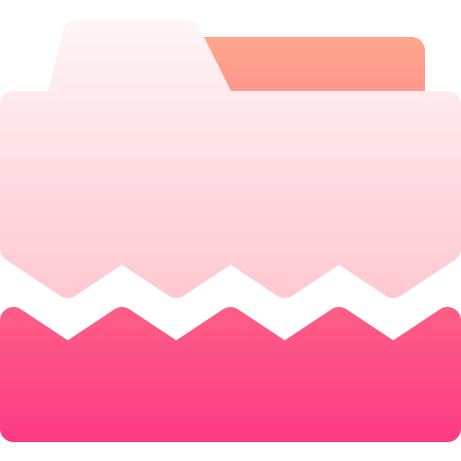

# 🖼️ 素材分類：files-and-document-03

> [🏠 主目錄](../../../../README.md) / [images](../../../README.md) / [iCons](../../README.md) / [Folders](../README.md) / **files-and-document-03**

本目錄共有 `50` 個檔案

| 🎨 預覽 (點擊放大) | 📋 檔案詳細資訊與連結 |
| :--- | :--- |
|  | **📂 檔名:** `001-assign.svg` ✨ **格式:** `Vector (SVG)` ⚖️ **大小:** `1.47KB` | 📅 **更新:** `2026-02-27`  🚀 **jsDelivr Markdown:** `` 🔗 **直接連結 (Url):** `https://cdn.jsdelivr.net/ghbarry028/materials@main/images/iCons/Folders/files-and-document-03/001-assign.svg` 📥 [檢視原始檔](001-assign.svg) |
|  | **📂 檔名:** `002-bar chart.svg` ✨ **格式:** `Vector (SVG)` ⚖️ **大小:** `1.29KB` | 📅 **更新:** `2026-02-27`  🚀 **jsDelivr Markdown:** `` 🔗 **直接連結 (Url):** `https://cdn.jsdelivr.net/ghbarry028/materials@main/images/iCons/Folders/files-and-document-03/002-bar%20chart.svg` 📥 [檢視原始檔](002-bar%20chart.svg) |
|  | **📂 檔名:** `003-chat.svg` ✨ **格式:** `Vector (SVG)` ⚖️ **大小:** `1.42KB` | 📅 **更新:** `2026-02-27`  🚀 **jsDelivr Markdown:** `` 🔗 **直接連結 (Url):** `https://cdn.jsdelivr.net/ghbarry028/materials@main/images/iCons/Folders/files-and-document-03/003-chat.svg` 📥 [檢視原始檔](003-chat.svg) |
|  | **📂 檔名:** `004-forward.svg` ✨ **格式:** `Vector (SVG)` ⚖️ **大小:** `1.25KB` | 📅 **更新:** `2026-02-27`  🚀 **jsDelivr Markdown:** `` 🔗 **直接連結 (Url):** `https://cdn.jsdelivr.net/ghbarry028/materials@main/images/iCons/Folders/files-and-document-03/004-forward.svg` 📥 [檢視原始檔](004-forward.svg) |
|  | **📂 檔名:** `005-undo.svg` ✨ **格式:** `Vector (SVG)` ⚖️ **大小:** `1.29KB` | 📅 **更新:** `2026-02-27`  🚀 **jsDelivr Markdown:** `` 🔗 **直接連結 (Url):** `https://cdn.jsdelivr.net/ghbarry028/materials@main/images/iCons/Folders/files-and-document-03/005-undo.svg` 📥 [檢視原始檔](005-undo.svg) |
|  | **📂 檔名:** `006-uncorrect.svg` ✨ **格式:** `Vector (SVG)` ⚖️ **大小:** `1.42KB` | 📅 **更新:** `2026-02-27`  🚀 **jsDelivr Markdown:** `` 🔗 **直接連結 (Url):** `https://cdn.jsdelivr.net/ghbarry028/materials@main/images/iCons/Folders/files-and-document-03/006-uncorrect.svg` 📥 [檢視原始檔](006-uncorrect.svg) |
|  | **📂 檔名:** `007-correct.svg` ✨ **格式:** `Vector (SVG)` ⚖️ **大小:** `1.32KB` | 📅 **更新:** `2026-02-27`  🚀 **jsDelivr Markdown:** `` 🔗 **直接連結 (Url):** `https://cdn.jsdelivr.net/ghbarry028/materials@main/images/iCons/Folders/files-and-document-03/007-correct.svg` 📥 [檢視原始檔](007-correct.svg) |
|  | **📂 檔名:** `008-delete.svg` ✨ **格式:** `Vector (SVG)` ⚖️ **大小:** `1.20KB` | 📅 **更新:** `2026-02-27`  🚀 **jsDelivr Markdown:** `` 🔗 **直接連結 (Url):** `https://cdn.jsdelivr.net/ghbarry028/materials@main/images/iCons/Folders/files-and-document-03/008-delete.svg` 📥 [檢視原始檔](008-delete.svg) |
|  | **📂 檔名:** `009-favourite.svg` ✨ **格式:** `Vector (SVG)` ⚖️ **大小:** `1.34KB` | 📅 **更新:** `2026-02-27`  🚀 **jsDelivr Markdown:** `` 🔗 **直接連結 (Url):** `https://cdn.jsdelivr.net/ghbarry028/materials@main/images/iCons/Folders/files-and-document-03/009-favourite.svg` 📥 [檢視原始檔](009-favourite.svg) |
|  | **📂 檔名:** `010-like.svg` ✨ **格式:** `Vector (SVG)` ⚖️ **大小:** `1.31KB` | 📅 **更新:** `2026-02-27`  🚀 **jsDelivr Markdown:** `` 🔗 **直接連結 (Url):** `https://cdn.jsdelivr.net/ghbarry028/materials@main/images/iCons/Folders/files-and-document-03/010-like.svg` 📥 [檢視原始檔](010-like.svg) |
|  | **📂 檔名:** `011-error.svg` ✨ **格式:** `Vector (SVG)` ⚖️ **大小:** `1.44KB` | 📅 **更新:** `2026-02-27`  🚀 **jsDelivr Markdown:** `` 🔗 **直接連結 (Url):** `https://cdn.jsdelivr.net/ghbarry028/materials@main/images/iCons/Folders/files-and-document-03/011-error.svg` 📥 [檢視原始檔](011-error.svg) |
|  | **📂 檔名:** `012-search.svg` ✨ **格式:** `Vector (SVG)` ⚖️ **大小:** `1.33KB` | 📅 **更新:** `2026-02-27`  🚀 **jsDelivr Markdown:** `` 🔗 **直接連結 (Url):** `https://cdn.jsdelivr.net/ghbarry028/materials@main/images/iCons/Folders/files-and-document-03/012-search.svg` 📥 [檢視原始檔](012-search.svg) |
|  | **📂 檔名:** `013-pin.svg` ✨ **格式:** `Vector (SVG)` ⚖️ **大小:** `1.33KB` | 📅 **更新:** `2026-02-27`  🚀 **jsDelivr Markdown:** `` 🔗 **直接連結 (Url):** `https://cdn.jsdelivr.net/ghbarry028/materials@main/images/iCons/Folders/files-and-document-03/013-pin.svg` 📥 [檢視原始檔](013-pin.svg) |
|  | **📂 檔名:** `014-view.svg` ✨ **格式:** `Vector (SVG)` ⚖️ **大小:** `1.55KB` | 📅 **更新:** `2026-02-27`  🚀 **jsDelivr Markdown:** `` 🔗 **直接連結 (Url):** `https://cdn.jsdelivr.net/ghbarry028/materials@main/images/iCons/Folders/files-and-document-03/014-view.svg` 📥 [檢視原始檔](014-view.svg) |
|  | **📂 檔名:** `015-password.svg` ✨ **格式:** `Vector (SVG)` ⚖️ **大小:** `2.75KB` | 📅 **更新:** `2026-02-27`  🚀 **jsDelivr Markdown:** `` 🔗 **直接連結 (Url):** `https://cdn.jsdelivr.net/ghbarry028/materials@main/images/iCons/Folders/files-and-document-03/015-password.svg` 📥 [檢視原始檔](015-password.svg) |
|  | **📂 檔名:** `016-game.svg` ✨ **格式:** `Vector (SVG)` ⚖️ **大小:** `1.52KB` | 📅 **更新:** `2026-02-27`  🚀 **jsDelivr Markdown:** `` 🔗 **直接連結 (Url):** `https://cdn.jsdelivr.net/ghbarry028/materials@main/images/iCons/Folders/files-and-document-03/016-game.svg` 📥 [檢視原始檔](016-game.svg) |
|  | **📂 檔名:** `017-icon.svg` ✨ **格式:** `Vector (SVG)` ⚖️ **大小:** `1.69KB` | 📅 **更新:** `2026-02-27`  🚀 **jsDelivr Markdown:** `` 🔗 **直接連結 (Url):** `https://cdn.jsdelivr.net/ghbarry028/materials@main/images/iCons/Folders/files-and-document-03/017-icon.svg` 📥 [檢視原始檔](017-icon.svg) |
|  | **📂 檔名:** `018-jigsaw.svg` ✨ **格式:** `Vector (SVG)` ⚖️ **大小:** `1.45KB` | 📅 **更新:** `2026-02-27`  🚀 **jsDelivr Markdown:** `` 🔗 **直接連結 (Url):** `https://cdn.jsdelivr.net/ghbarry028/materials@main/images/iCons/Folders/files-and-document-03/018-jigsaw.svg` 📥 [檢視原始檔](018-jigsaw.svg) |
|  | **📂 檔名:** `019-download.svg` ✨ **格式:** `Vector (SVG)` ⚖️ **大小:** `1.39KB` | 📅 **更新:** `2026-02-27`  🚀 **jsDelivr Markdown:** `` 🔗 **直接連結 (Url):** `https://cdn.jsdelivr.net/ghbarry028/materials@main/images/iCons/Folders/files-and-document-03/019-download.svg` 📥 [檢視原始檔](019-download.svg) |
|  | **📂 檔名:** `020-upload.svg` ✨ **格式:** `Vector (SVG)` ⚖️ **大小:** `1.44KB` | 📅 **更新:** `2026-02-27`  🚀 **jsDelivr Markdown:** `` 🔗 **直接連結 (Url):** `https://cdn.jsdelivr.net/ghbarry028/materials@main/images/iCons/Folders/files-and-document-03/020-upload.svg` 📥 [檢視原始檔](020-upload.svg) |
|  | **📂 檔名:** `021-pencil.svg` ✨ **格式:** `Vector (SVG)` ⚖️ **大小:** `1.42KB` | 📅 **更新:** `2026-02-27`  🚀 **jsDelivr Markdown:** `` 🔗 **直接連結 (Url):** `https://cdn.jsdelivr.net/ghbarry028/materials@main/images/iCons/Folders/files-and-document-03/021-pencil.svg` 📥 [檢視原始檔](021-pencil.svg) |
|  | **📂 檔名:** `022-settings.svg` ✨ **格式:** `Vector (SVG)` ⚖️ **大小:** `1.93KB` | 📅 **更新:** `2026-02-27`  🚀 **jsDelivr Markdown:** `` 🔗 **直接連結 (Url):** `https://cdn.jsdelivr.net/ghbarry028/materials@main/images/iCons/Folders/files-and-document-03/022-settings.svg` 📥 [檢視原始檔](022-settings.svg) |
|  | **📂 檔名:** `023-recipe.svg` ✨ **格式:** `Vector (SVG)` ⚖️ **大小:** `1.34KB` | 📅 **更新:** `2026-02-27`  🚀 **jsDelivr Markdown:** `` 🔗 **直接連結 (Url):** `https://cdn.jsdelivr.net/ghbarry028/materials@main/images/iCons/Folders/files-and-document-03/023-recipe.svg` 📥 [檢視原始檔](023-recipe.svg) |
|  | **📂 檔名:** `024-video.svg` ✨ **格式:** `Vector (SVG)` ⚖️ **大小:** `1.24KB` | 📅 **更新:** `2026-02-27`  🚀 **jsDelivr Markdown:** `` 🔗 **直接連結 (Url):** `https://cdn.jsdelivr.net/ghbarry028/materials@main/images/iCons/Folders/files-and-document-03/024-video.svg` 📥 [檢視原始檔](024-video.svg) |
|  | **📂 檔名:** `025-music.svg` ✨ **格式:** `Vector (SVG)` ⚖️ **大小:** `1.36KB` | 📅 **更新:** `2026-02-27`  🚀 **jsDelivr Markdown:** `` 🔗 **直接連結 (Url):** `https://cdn.jsdelivr.net/ghbarry028/materials@main/images/iCons/Folders/files-and-document-03/025-music.svg` 📥 [檢視原始檔](025-music.svg) |
|  | **📂 檔名:** `026-sound.svg` ✨ **格式:** `Vector (SVG)` ⚖️ **大小:** `1.41KB` | 📅 **更新:** `2026-02-27`  🚀 **jsDelivr Markdown:** `` 🔗 **直接連結 (Url):** `https://cdn.jsdelivr.net/ghbarry028/materials@main/images/iCons/Folders/files-and-document-03/026-sound.svg` 📥 [檢視原始檔](026-sound.svg) |
|  | **📂 檔名:** `027-profile.svg` ✨ **格式:** `Vector (SVG)` ⚖️ **大小:** `1.48KB` | 📅 **更新:** `2026-02-27`  🚀 **jsDelivr Markdown:** `` 🔗 **直接連結 (Url):** `https://cdn.jsdelivr.net/ghbarry028/materials@main/images/iCons/Folders/files-and-document-03/027-profile.svg` 📥 [檢視原始檔](027-profile.svg) |
|  | **📂 檔名:** `028-key.svg` ✨ **格式:** `Vector (SVG)` ⚖️ **大小:** `1.38KB` | 📅 **更新:** `2026-02-27`  🚀 **jsDelivr Markdown:** `` 🔗 **直接連結 (Url):** `https://cdn.jsdelivr.net/ghbarry028/materials@main/images/iCons/Folders/files-and-document-03/028-key.svg` 📥 [檢視原始檔](028-key.svg) |
|  | **📂 檔名:** `029-smiley.svg` ✨ **格式:** `Vector (SVG)` ⚖️ **大小:** `1.53KB` | 📅 **更新:** `2026-02-27`  🚀 **jsDelivr Markdown:** `` 🔗 **直接連結 (Url):** `https://cdn.jsdelivr.net/ghbarry028/materials@main/images/iCons/Folders/files-and-document-03/029-smiley.svg` 📥 [檢視原始檔](029-smiley.svg) |
|  | **📂 檔名:** `030-vector.svg` ✨ **格式:** `Vector (SVG)` ⚖️ **大小:** `1.40KB` | 📅 **更新:** `2026-02-27`  🚀 **jsDelivr Markdown:** `` 🔗 **直接連結 (Url):** `https://cdn.jsdelivr.net/ghbarry028/materials@main/images/iCons/Folders/files-and-document-03/030-vector.svg` 📥 [檢視原始檔](030-vector.svg) |
|  | **📂 檔名:** `031-email.svg` ✨ **格式:** `Vector (SVG)` ⚖️ **大小:** `1.25KB` | 📅 **更新:** `2026-02-27`  🚀 **jsDelivr Markdown:** `` 🔗 **直接連結 (Url):** `https://cdn.jsdelivr.net/ghbarry028/materials@main/images/iCons/Folders/files-and-document-03/031-email.svg` 📥 [檢視原始檔](031-email.svg) |
|  | **📂 檔名:** `032-interface.svg` ✨ **格式:** `Vector (SVG)` ⚖️ **大小:** `1.87KB` | 📅 **更新:** `2026-02-27`  🚀 **jsDelivr Markdown:** `` 🔗 **直接連結 (Url):** `https://cdn.jsdelivr.net/ghbarry028/materials@main/images/iCons/Folders/files-and-document-03/032-interface.svg` 📥 [檢視原始檔](032-interface.svg) |
|  | **📂 檔名:** `033-cloud.svg` ✨ **格式:** `Vector (SVG)` ⚖️ **大小:** `1.22KB` | 📅 **更新:** `2026-02-27`  🚀 **jsDelivr Markdown:** `` 🔗 **直接連結 (Url):** `https://cdn.jsdelivr.net/ghbarry028/materials@main/images/iCons/Folders/files-and-document-03/033-cloud.svg` 📥 [檢視原始檔](033-cloud.svg) |
|  | **📂 檔名:** `034-corrupted.svg` ✨ **格式:** `Vector (SVG)` ⚖️ **大小:** `1.61KB` | 📅 **更新:** `2026-02-27`  🚀 **jsDelivr Markdown:** `` 🔗 **直接連結 (Url):** `https://cdn.jsdelivr.net/ghbarry028/materials@main/images/iCons/Folders/files-and-document-03/034-corrupted.svg` 📥 [檢視原始檔](034-corrupted.svg) |
|  | **📂 檔名:** `035-zip.svg` ✨ **格式:** `Vector (SVG)` ⚖️ **大小:** `1.75KB` | 📅 **更新:** `2026-02-27`  🚀 **jsDelivr Markdown:** `` 🔗 **直接連結 (Url):** `https://cdn.jsdelivr.net/ghbarry028/materials@main/images/iCons/Folders/files-and-document-03/035-zip.svg` 📥 [檢視原始檔](035-zip.svg) |
|  | **📂 檔名:** `036-idea.svg` ✨ **格式:** `Vector (SVG)` ⚖️ **大小:** `1.53KB` | 📅 **更新:** `2026-02-27`  🚀 **jsDelivr Markdown:** `` 🔗 **直接連結 (Url):** `https://cdn.jsdelivr.net/ghbarry028/materials@main/images/iCons/Folders/files-and-document-03/036-idea.svg` 📥 [檢視原始檔](036-idea.svg) |
|  | **📂 檔名:** `037-secure.svg` ✨ **格式:** `Vector (SVG)` ⚖️ **大小:** `1.78KB` | 📅 **更新:** `2026-02-27`  🚀 **jsDelivr Markdown:** `` 🔗 **直接連結 (Url):** `https://cdn.jsdelivr.net/ghbarry028/materials@main/images/iCons/Folders/files-and-document-03/037-secure.svg` 📥 [檢視原始檔](037-secure.svg) |
|  | **📂 檔名:** `038-lock.svg` ✨ **格式:** `Vector (SVG)` ⚖️ **大小:** `1.32KB` | 📅 **更新:** `2026-02-27`  🚀 **jsDelivr Markdown:** `` 🔗 **直接連結 (Url):** `https://cdn.jsdelivr.net/ghbarry028/materials@main/images/iCons/Folders/files-and-document-03/038-lock.svg` 📥 [檢視原始檔](038-lock.svg) |
|  | **📂 檔名:** `039-notification bell.svg` ✨ **格式:** `Vector (SVG)` ⚖️ **大小:** `1.39KB` | 📅 **更新:** `2026-02-27`  🚀 **jsDelivr Markdown:** `` 🔗 **直接連結 (Url):** `https://cdn.jsdelivr.net/ghbarry028/materials@main/images/iCons/Folders/files-and-document-03/039-notification%20bell.svg` 📥 [檢視原始檔](039-notification%20bell.svg) |
|  | **📂 檔名:** `040-main folder.svg` ✨ **格式:** `Vector (SVG)` ⚖️ **大小:** `1.44KB` | 📅 **更新:** `2026-02-27`  🚀 **jsDelivr Markdown:** `` 🔗 **直接連結 (Url):** `https://cdn.jsdelivr.net/ghbarry028/materials@main/images/iCons/Folders/files-and-document-03/040-main%20folder.svg` 📥 [檢視原始檔](040-main%20folder.svg) |
|  | **📂 檔名:** `041-rocket.svg` ✨ **格式:** `Vector (SVG)` ⚖️ **大小:** `1.67KB` | 📅 **更新:** `2026-02-27`  🚀 **jsDelivr Markdown:** `` 🔗 **直接連結 (Url):** `https://cdn.jsdelivr.net/ghbarry028/materials@main/images/iCons/Folders/files-and-document-03/041-rocket.svg` 📥 [檢視原始檔](041-rocket.svg) |
|  | **📂 檔名:** `042-biometric.svg` ✨ **格式:** `Vector (SVG)` ⚖️ **大小:** `2.22KB` | 📅 **更新:** `2026-02-27`  🚀 **jsDelivr Markdown:** `` 🔗 **直接連結 (Url):** `https://cdn.jsdelivr.net/ghbarry028/materials@main/images/iCons/Folders/files-and-document-03/042-biometric.svg` 📥 [檢視原始檔](042-biometric.svg) |
|  | **📂 檔名:** `043-bin.svg` ✨ **格式:** `Vector (SVG)` ⚖️ **大小:** `1.42KB` | 📅 **更新:** `2026-02-27`  🚀 **jsDelivr Markdown:** `` 🔗 **直接連結 (Url):** `https://cdn.jsdelivr.net/ghbarry028/materials@main/images/iCons/Folders/files-and-document-03/043-bin.svg` 📥 [檢視原始檔](043-bin.svg) |
|  | **📂 檔名:** `044-clock.svg` ✨ **格式:** `Vector (SVG)` ⚖️ **大小:** `1.66KB` | 📅 **更新:** `2026-02-27`  🚀 **jsDelivr Markdown:** `` 🔗 **直接連結 (Url):** `https://cdn.jsdelivr.net/ghbarry028/materials@main/images/iCons/Folders/files-and-document-03/044-clock.svg` 📥 [檢視原始檔](044-clock.svg) |
|  | **📂 檔名:** `045-book.svg` ✨ **格式:** `Vector (SVG)` ⚖️ **大小:** `1.58KB` | 📅 **更新:** `2026-02-27`  🚀 **jsDelivr Markdown:** `` 🔗 **直接連結 (Url):** `https://cdn.jsdelivr.net/ghbarry028/materials@main/images/iCons/Folders/files-and-document-03/045-book.svg` 📥 [檢視原始檔](045-book.svg) |
|  | **📂 檔名:** `046-folder.svg` ✨ **格式:** `Vector (SVG)` ⚖️ **大小:** `1.24KB` | 📅 **更新:** `2026-02-27`  🚀 **jsDelivr Markdown:** `` 🔗 **直接連結 (Url):** `https://cdn.jsdelivr.net/ghbarry028/materials@main/images/iCons/Folders/files-and-document-03/046-folder.svg` 📥 [檢視原始檔](046-folder.svg) |
|  | **📂 檔名:** `047-stopwatch.svg` ✨ **格式:** `Vector (SVG)` ⚖️ **大小:** `1.68KB` | 📅 **更新:** `2026-02-27`  🚀 **jsDelivr Markdown:** `` 🔗 **直接連結 (Url):** `https://cdn.jsdelivr.net/ghbarry028/materials@main/images/iCons/Folders/files-and-document-03/047-stopwatch.svg` 📥 [檢視原始檔](047-stopwatch.svg) |
|  | **📂 檔名:** `048-photo.svg` ✨ **格式:** `Vector (SVG)` ⚖️ **大小:** `1.38KB` | 📅 **更新:** `2026-02-27`  🚀 **jsDelivr Markdown:** `` 🔗 **直接連結 (Url):** `https://cdn.jsdelivr.net/ghbarry028/materials@main/images/iCons/Folders/files-and-document-03/048-photo.svg` 📥 [檢視原始檔](048-photo.svg) |
|  | **📂 檔名:** `049-coding.svg` ✨ **格式:** `Vector (SVG)` ⚖️ **大小:** `1.67KB` | 📅 **更新:** `2026-02-27`  🚀 **jsDelivr Markdown:** `` 🔗 **直接連結 (Url):** `https://cdn.jsdelivr.net/ghbarry028/materials@main/images/iCons/Folders/files-and-document-03/049-coding.svg` 📥 [檢視原始檔](049-coding.svg) |
|  | **📂 檔名:** `050-font.svg` ✨ **格式:** `Vector (SVG)` ⚖️ **大小:** `1.41KB` | 📅 **更新:** `2026-02-27`  🚀 **jsDelivr Markdown:** `` 🔗 **直接連結 (Url):** `https://cdn.jsdelivr.net/ghbarry028/materials@main/images/iCons/Folders/files-and-document-03/050-font.svg` 📥 [檢視原始檔](050-font.svg) |